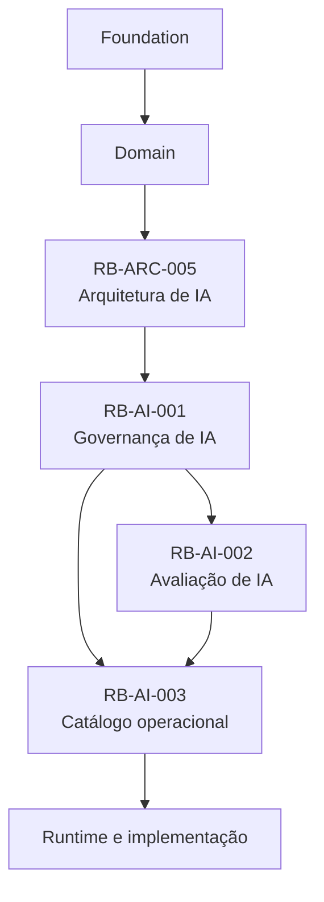
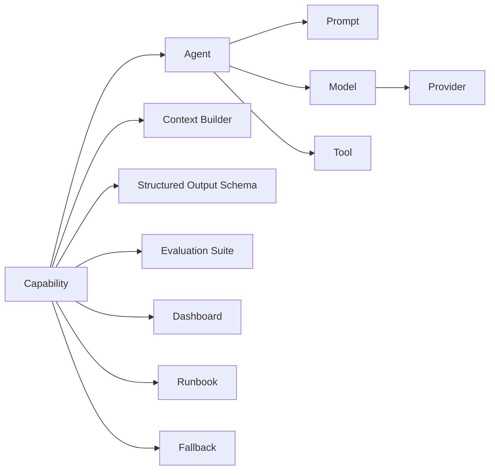
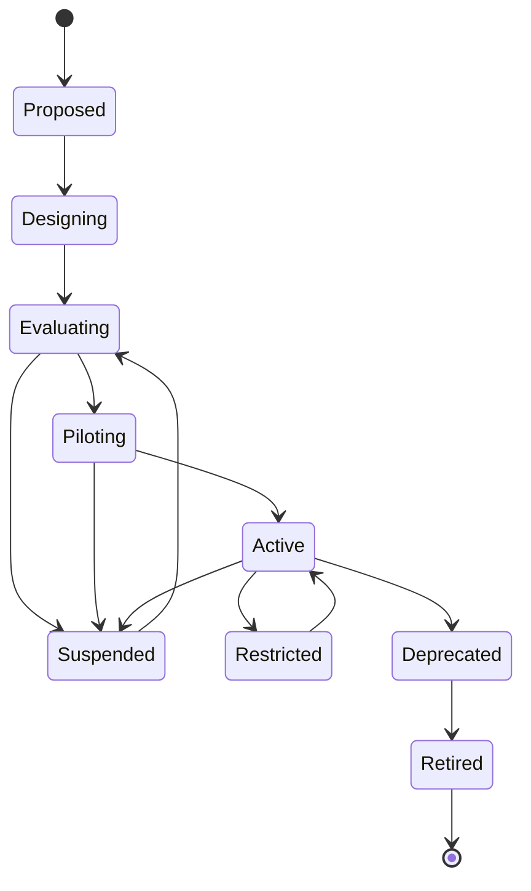
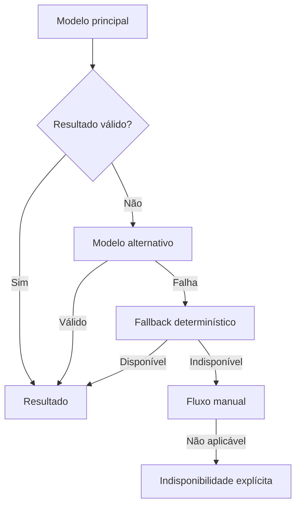
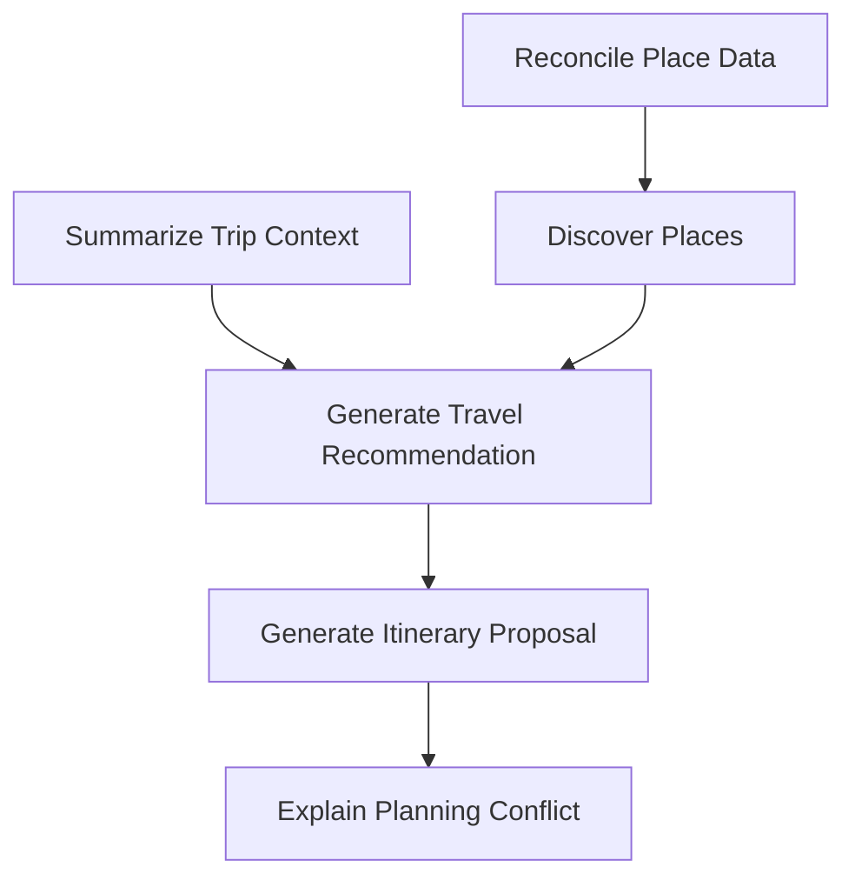

---

id: RB-AI-003

title: Catálogo de Capacidades, Agentes, Modelos e Ferramentas
description: Define o catálogo operacional oficial das capacidades de inteligência artificial do RouteBook, incluindo agentes, modelos, Providers, prompts, ferramentas, Context Builders, schemas, memória, avaliações, custos, observabilidade, runbooks e critérios de suspensão.

document_type: ai-catalog
owner: Artificial Intelligence

status: Draft
version: "0.1.0"

created: "2026-07-20"
last_updated: null

authors:

- RouteBook Team

tags:

- artificial-intelligence
- ai-catalog
- ai-capabilities
- ai-agents
- model-registry
- provider-registry
- prompt-registry
- tool-registry
- context-builder
- structured-output
- evaluation
- observability
- governance
- diagrams
- mermaid

related_documents:

- RB-CORE-0001
- RB-CORE-0002
- RB-CORE-0003
- RB-CORE-0004
- RB-PRD-001
- RB-PRD-002
- RB-PRD-003
- RB-PRD-004
- RB-PRD-005
- RB-PRD-006
- RB-PRD-007
- RB-PRD-008
- RB-DOM-001
- RB-DOM-002
- RB-DOM-003
- RB-DOM-004
- RB-ARC-001
- RB-ARC-002
- RB-ARC-003
- RB-ARC-004
- RB-ARC-005
- RB-DATA-001
- RB-API-001
- RB-SEC-001
- RB-OBS-001
- RB-QA-001
- RB-OPS-001
- RB-SRE-001
- RB-AI-001
- RB-AI-002

prerequisites:

- RB-CORE-0004
- RB-DOM-001
- RB-DOM-002
- RB-DOM-003
- RB-DOM-004
- RB-ARC-005
- RB-SEC-001
- RB-OBS-001
- RB-QA-001
- RB-AI-001
- RB-AI-002

next_documents:

- RB-AI-004
- RB-QA-002
- RB-OPS-002
- RB-AI-005

ai_context:
priority: critical
index: true
---

# RouteBook — Catálogo de Capacidades, Agentes, Modelos e Ferramentas

## Parte I — Fundamentos

### 1. Propósito deste documento

Este documento define o catálogo operacional oficial dos componentes de inteligência artificial do RouteBook.

Seu objetivo é manter um inventário único, rastreável e versionado de:

* capacidades de IA;
* agentes especializados;
* modelos;
* Providers;
* prompts;
* ferramentas;
* Context Builders;
* schemas;
* políticas de memória;
* fallbacks;
* Evaluation Suites;
* Golden Datasets;
* dashboards;
* alertas;
* runbooks;
* custos;
* quotas;
* critérios de suspensão;
* dependências.

Este documento deverá permitir responder:

* quais capacidades de IA existem;
* qual problema cada capacidade resolve;
* quem é seu owner;
* qual é seu nível de risco;
* qual agente a executa;
* quais modelos podem ser utilizados;
* quais Providers estão autorizados;
* qual prompt está ativo;
* quais ferramentas podem ser chamadas;
* quais dados podem compor o Contexto;
* quais schemas devem ser respeitados;
* como a capacidade é avaliada;
* como é monitorada;
* quanto pode custar;
* como é suspensa;
* qual fallback deverá ser usado.

O catálogo deverá orientar:

* Artificial Intelligence;
* Product;
* Architecture;
* Domain;
* Security;
* Privacy;
* Data;
* Platform;
* Backend;
* Quality Engineering;
* Site Reliability Engineering;
* agentes de engenharia;
* agentes de avaliação;
* agentes operacionais.

Este documento não substitui:

* a arquitetura de IA;
* a governança de IA;
* a estratégia de avaliação;
* os prompts completos;
* os schemas físicos;
* os contratos de API;
* os runbooks detalhados;
* as configurações de infraestrutura;
* a documentação de fornecedores.

---

### 2. Autoridade documental

O catálogo deverá derivar de:

* RouteBook Bible;
* requisitos de produto;
* Linguagem Ubíqua;
* Modelo de Domínio;
* Regras e Invariantes;
* Arquitetura de IA e Agentes;
* Governança de IA;
* Estratégia de Avaliação de IA;
* Segurança;
* Observabilidade;
* Qualidade;
* Operação;
* Confiabilidade.



O catálogo não poderá:

* criar conceitos de domínio;
* redefinir ownership;
* enfraquecer autorização;
* aumentar autonomia implicitamente;
* autorizar ferramentas sem revisão;
* aprovar modelos ou Providers por simples inclusão textual;
* substituir decisões formais de governança.

---

### 3. Princípio central

Nenhum componente de IA deverá operar em produção sem registro, owner, risco, limites, avaliação e mecanismo de suspensão.

```text
Registrar
→ classificar
→ revisar
→ aprovar
→ operar
→ observar
→ reavaliar
→ suspender ou evoluir
```

---

### 4. Catálogo como fonte operacional

Este documento deverá ser a fonte canônica para identificar quais elementos de IA estão:

* propostos;
* em avaliação;
* aprovados;
* ativos;
* restritos;
* suspensos;
* depreciados;
* retirados.

Detalhes físicos poderão residir em arquivos específicos, mas deverão ser referenciados pelo catálogo.

---

### 5. Escopo inicial

O catálogo inicial contempla:

* Travel Assistant Agent;
* Travel Decision Agent;
* Itinerary Proposal Agent;
* Place Discovery Agent;
* Planning Review Agent;
* Data Reconciliation Agent;
* capacidades de Recommendation;
* capacidades de Itinerary Proposal;
* explicação de Planning Conflict;
* descoberta de Places;
* reconciliação assistida de dados;
* resumo contextual;
* classificação assistida;
* Structured Outputs;
* ferramentas de consulta e preparação.

---

## Parte II — Conceitos do catálogo

### 6. Capability

Capability representa uma função de produto ou plataforma que pode utilizar IA.

Exemplos:

```text
GenerateTravelRecommendation
GenerateItineraryProposal
ExplainPlanningConflict
DiscoverPlaces
ReconcilePlaceData
SummarizeTripContext
```

---

### 7. Agent

Agent representa um componente orientado a objetivo que coordena:

* Contexto;
* modelo;
* ferramentas;
* validação;
* resultado.

---

### 8. Model

Model representa uma versão ou família de modelo autorizada para uma finalidade.

---

### 9. Provider

Provider representa o fornecedor ou ambiente responsável por disponibilizar modelos.

---

### 10. Prompt

Prompt representa um artefato versionado de instrução utilizado por uma capacidade.

---

### 11. Tool

Tool representa uma operação registrada que um agente pode solicitar.

---

### 12. Context Builder

Context Builder representa a política e implementação responsável por construir o Contexto mínimo necessário.

---

### 13. Structured Output Schema

Structured Output Schema define o formato esperado da saída produzida pela capacidade.

---

### 14. Evaluation Suite

Evaluation Suite representa o conjunto versionado de datasets, métricas, thresholds e verificações utilizado para avaliar uma capacidade.

---

### 15. Fallback

Fallback representa o comportamento alternativo quando a execução principal não pode produzir resultado seguro.

---

### 16. Kill Switch

Kill Switch representa o mecanismo capaz de suspender uma capacidade, agente, modelo, prompt, Provider ou Tool.

---

## Parte III — Relacionamento entre os elementos

### 17. Modelo conceitual



---

### 18. Cardinalidades conceituais

| Relação                       | Cardinalidade     |
| ----------------------------- | ----------------- |
| Capability → Agent            | 1:1 ou 1:N        |
| Capability → Prompt           | 1:N versionado    |
| Capability → Model            | N:N               |
| Model → Provider              | N:1 ou N:N        |
| Agent → Tool                  | N:N por allowlist |
| Capability → Context Builder  | 1:1 principal     |
| Capability → Schema           | 1:N versionado    |
| Capability → Evaluation Suite | 1:N               |
| Capability → Fallback         | 1:N ordenado      |
| Capability → Runbook          | 0:1 ou 1:N        |
| Capability → Dashboard        | 0:1 ou 1:N        |

---

### 19. Identificadores

Identificadores deverão ser estáveis e não depender de nome de fornecedor.

Exemplos:

```text
AI-CAP-001
AI-AGT-001
AI-MDL-001
AI-PRV-001
AI-PRM-001
AI-TOL-001
AI-CTX-001
AI-SCH-001
AI-EVL-001
AI-FBK-001
```

---

## Parte IV — Status e ciclos de vida

### 20. Status de Capability

```text
proposed
designing
evaluating
piloting
active
restricted
suspended
deprecated
retired
```

---

### 21. Ciclo de vida de Capability



---

### 22. Status de Agent

```text
draft
evaluating
approved
active
restricted
suspended
deprecated
retired
```

---

### 23. Status de Model

```text
proposed
evaluating
approved
restricted
deprecated
suspended
retired
```

---

### 24. Status de Provider

```text
proposed
under_review
approved
restricted
suspended
deprecated
retired
```

---

### 25. Status de Prompt

```text
draft
evaluating
approved
active
deprecated
suspended
retired
```

---

### 26. Status de Tool

```text
draft
evaluating
approved
active
restricted
suspended
deprecated
retired
```

---

### 27. Regra de ativação

Um elemento somente poderá ser considerado ativo quando:

* possuir owner;
* possuir versão;
* possuir risco;
* possuir avaliação;
* possuir aprovação;
* possuir observabilidade;
* possuir mecanismo de suspensão quando necessário.

---

## Parte V — Registro padrão de Capability

### 28. Estrutura obrigatória

Cada Capability deverá possuir:

```yaml
capability_id: AI-CAP-000
title: Nome da capacidade
owner: Team or Role
status: proposed
version: "0.1.0"
risk_level: AI-R0
purpose: Descrição da finalidade
user_value: Benefício esperado
scope:
  included: []
  excluded: []
agent_ids: []
context_builder_id: AI-CTX-000
prompt_ids: []
model_policy_id: AI-MPOL-000
output_schema_id: AI-SCH-000
allowed_tool_ids: []
memory_policy: none
fallback_ids: []
evaluation_suite_ids: []
dashboard_reference: null
runbook_reference: null
kill_switch: false
cost_policy:
  max_cost_per_execution: null
  daily_budget: null
  token_budget: null
latency_policy:
  timeout_ms: null
  p95_target_ms: null
approval:
  approved_by: []
  approved_at: null
last_reviewed_at: null
```

---

### 29. Campos críticos

São obrigatórios para produção:

* capabilityId;
* owner;
* status;
* version;
* riskLevel;
* purpose;
* agentIds;
* Context Builder;
* Prompt;
* Model Policy;
* schema;
* Evaluation Suite;
* fallback;
* custo;
* latência;
* aprovação;
* última revisão.

---

### 30. Limites de escopo

Cada registro deverá declarar explicitamente:

* o que a capacidade pode fazer;
* o que não pode fazer;
* quais recursos pode acessar;
* quais efeitos são permitidos;
* quais efeitos exigem confirmação.

---

## Parte VI — Catálogo inicial de capacidades

### 31. AI-CAP-001 — Generate Travel Recommendation

```yaml
capability_id: AI-CAP-001
title: Generate Travel Recommendation
owner: Decision Intelligence
status: proposed
version: "0.1.0"
risk_level: AI-R1
purpose: Gerar Recommendation contextual para apoiar decisões durante a Trip.
user_value: Reduzir o esforço de comparar opções e ajudar o Usuário a escolher a próxima ação.
agent_ids:
  - AI-AGT-002
context_builder_id: AI-CTX-001
prompt_ids:
  - AI-PRM-001
model_policy_id: AI-MPOL-001
output_schema_id: AI-SCH-001
allowed_tool_ids:
  - AI-TOL-001
  - AI-TOL-002
  - AI-TOL-003
  - AI-TOL-004
memory_policy: trip-context-read-only
fallback_ids:
  - AI-FBK-001
  - AI-FBK-002
evaluation_suite_ids:
  - AI-EVL-001
dashboard_reference: dashboards/ai/travel-recommendation
runbook_reference: RB-RUN-AI-001
kill_switch: true
```

#### Escopo permitido

* interpretar a intenção atual;
* consultar Trip Context;
* consultar Traveler Profile;
* buscar Places;
* consultar Travel Estimates;
* produzir Recommendation;
* gerar Reasons;
* declarar limitações.

#### Escopo proibido

* registrar Decision;
* adicionar Activity;
* aplicar alteração;
* ignorar Planning Risk;
* alterar Restriction;
* inventar PlaceId.

---

### 32. AI-CAP-002 — Generate Itinerary Proposal

```yaml
capability_id: AI-CAP-002
title: Generate Itinerary Proposal
owner: Proposal Management
status: proposed
version: "0.1.0"
risk_level: AI-R2
purpose: Gerar Itinerary Proposal revisável a partir do estado atual da Trip.
user_value: Reduzir o trabalho manual de organizar Activities e deslocamentos.
agent_ids:
  - AI-AGT-003
context_builder_id: AI-CTX-002
prompt_ids:
  - AI-PRM-002
model_policy_id: AI-MPOL-002
output_schema_id: AI-SCH-002
allowed_tool_ids:
  - AI-TOL-001
  - AI-TOL-002
  - AI-TOL-003
  - AI-TOL-005
  - AI-TOL-006
memory_policy: execution-scoped
fallback_ids:
  - AI-FBK-003
evaluation_suite_ids:
  - AI-EVL-002
dashboard_reference: dashboards/ai/itinerary-proposal
runbook_reference: RB-RUN-AI-003
kill_switch: true
```

#### Escopo permitido

* ler Itinerary Snapshot;
* considerar Travel Estimates;
* considerar Restrictions;
* sugerir Proposed Activities;
* sugerir movimentos de itens flexíveis;
* produzir Reasons;
* solicitar revisão de Planning Assurance.

#### Escopo proibido

* alterar Itinerary;
* mover Activity fixed;
* preencher Free Period protected;
* aceitar Proposal;
* aplicar Proposal;
* ignorar conflito;
* substituir ActivityId.

---

### 33. AI-CAP-003 — Explain Planning Conflict

```yaml
capability_id: AI-CAP-003
title: Explain Planning Conflict
owner: Planning Assurance
status: proposed
version: "0.1.0"
risk_level: AI-R1
purpose: Explicar Planning Conflict em linguagem clara e apresentar alternativas de correção.
agent_ids:
  - AI-AGT-005
context_builder_id: AI-CTX-003
prompt_ids:
  - AI-PRM-003
model_policy_id: AI-MPOL-001
output_schema_id: AI-SCH-003
allowed_tool_ids:
  - AI-TOL-007
  - AI-TOL-008
memory_policy: none
fallback_ids:
  - AI-FBK-004
evaluation_suite_ids:
  - AI-EVL-003
kill_switch: true
```

#### Escopo proibido

* alterar severidade;
* resolver conflito;
* marcar como ignored;
* substituir evidência;
* declarar segurança inexistente.

---

### 34. AI-CAP-004 — Discover Places

```yaml
capability_id: AI-CAP-004
title: Discover Places
owner: Place Catalog
status: proposed
version: "0.1.0"
risk_level: AI-R1
purpose: Interpretar intenção de descoberta e organizar Places relevantes.
agent_ids:
  - AI-AGT-004
context_builder_id: AI-CTX-004
prompt_ids:
  - AI-PRM-004
model_policy_id: AI-MPOL-001
output_schema_id: AI-SCH-004
allowed_tool_ids:
  - AI-TOL-002
  - AI-TOL-003
memory_policy: none
fallback_ids:
  - AI-FBK-005
evaluation_suite_ids:
  - AI-EVL-004
kill_switch: true
```

---

### 35. AI-CAP-005 — Reconcile Place Data

```yaml
capability_id: AI-CAP-005
title: Reconcile Place Data
owner: Place Catalog
status: proposed
version: "0.1.0"
risk_level: AI-R2
purpose: Comparar referências externas e sugerir correspondências entre registros de Place.
agent_ids:
  - AI-AGT-006
context_builder_id: AI-CTX-005
prompt_ids:
  - AI-PRM-005
model_policy_id: AI-MPOL-003
output_schema_id: AI-SCH-005
allowed_tool_ids:
  - AI-TOL-009
  - AI-TOL-010
memory_policy: execution-scoped
fallback_ids:
  - AI-FBK-006
evaluation_suite_ids:
  - AI-EVL-005
kill_switch: true
```

#### Restrição crítica

A capacidade poderá sugerir reconciliação, mas não deverá fundir Places automaticamente sem política, confiança e validação.

---

### 36. AI-CAP-006 — Summarize Trip Context

```yaml
capability_id: AI-CAP-006
title: Summarize Trip Context
owner: Trip Management
status: proposed
version: "0.1.0"
risk_level: AI-R1
purpose: Produzir resumo contextual da Trip para consumo humano ou de outras capacidades.
agent_ids:
  - AI-AGT-001
context_builder_id: AI-CTX-006
prompt_ids:
  - AI-PRM-006
model_policy_id: AI-MPOL-001
output_schema_id: AI-SCH-006
allowed_tool_ids:
  - AI-TOL-001
memory_policy: none
fallback_ids:
  - AI-FBK-007
evaluation_suite_ids:
  - AI-EVL-006
kill_switch: true
```

---

### 37. Matriz das capacidades iniciais

| ID         | Capability                     | Owner                 | Risco | Efeito canônico        |
| ---------- | ------------------------------ | --------------------- | ----- | ---------------------- |
| AI-CAP-001 | Generate Travel Recommendation | Decision Intelligence | AI-R1 | nenhum                 |
| AI-CAP-002 | Generate Itinerary Proposal    | Proposal Management   | AI-R2 | nenhum antes do aceite |
| AI-CAP-003 | Explain Planning Conflict      | Planning Assurance    | AI-R1 | nenhum                 |
| AI-CAP-004 | Discover Places                | Place Catalog         | AI-R1 | nenhum                 |
| AI-CAP-005 | Reconcile Place Data           | Place Catalog         | AI-R2 | sugestão apenas        |
| AI-CAP-006 | Summarize Trip Context         | Trip Management       | AI-R1 | nenhum                 |

---

## Parte VII — Registro padrão de Agent

### 38. Estrutura obrigatória

```yaml
agent_id: AI-AGT-000
title: Nome do agente
owner: Team or Role
status: draft
version: "0.1.0"
risk_level: AI-R0
objective: Objetivo
allowed_capability_ids: []
allowed_tool_ids: []
context_policy_id: AI-CTX-000
autonomy_level: 0
max_steps: 1
timeout_ms: 10000
token_budget: null
cost_budget: null
retry_budget: 0
delegation_required: false
human_confirmation_required: false
kill_switch: true
evaluation_suite_ids: []
```

---

### 39. AI-AGT-001 — Travel Assistant Agent

#### Objetivo

Interpretar solicitações gerais e encaminhá-las para capacidades autorizadas.

#### Permissões

* consultar Trip Context;
* consultar Itinerary;
* apresentar informações;
* solicitar Recommendation;
* solicitar explicação.

#### Proibições

* aplicar alterações;
* escolher ferramentas críticas;
* registrar Decision;
* modificar dados.

#### Configuração inicial

```yaml
agent_id: AI-AGT-001
title: Travel Assistant Agent
owner: Artificial Intelligence
status: proposed
version: "0.1.0"
risk_level: AI-R1
allowed_capability_ids:
  - AI-CAP-001
  - AI-CAP-003
  - AI-CAP-004
  - AI-CAP-006
autonomy_level: 1
max_steps: 6
timeout_ms: 20000
retry_budget: 1
delegation_required: false
human_confirmation_required: false
kill_switch: true
```

---

### 40. AI-AGT-002 — Travel Decision Agent

#### Objetivo

Gerar Recommendation contextual e explicável.

```yaml
agent_id: AI-AGT-002
title: Travel Decision Agent
owner: Decision Intelligence
status: proposed
version: "0.1.0"
risk_level: AI-R1
allowed_capability_ids:
  - AI-CAP-001
allowed_tool_ids:
  - AI-TOL-001
  - AI-TOL-002
  - AI-TOL-003
  - AI-TOL-004
autonomy_level: 1
max_steps: 8
timeout_ms: 30000
retry_budget: 1
human_confirmation_required: false
kill_switch: true
```

---

### 41. AI-AGT-003 — Itinerary Proposal Agent

```yaml
agent_id: AI-AGT-003
title: Itinerary Proposal Agent
owner: Proposal Management
status: proposed
version: "0.1.0"
risk_level: AI-R2
allowed_capability_ids:
  - AI-CAP-002
allowed_tool_ids:
  - AI-TOL-001
  - AI-TOL-003
  - AI-TOL-005
  - AI-TOL-006
autonomy_level: 2
max_steps: 12
timeout_ms: 60000
retry_budget: 1
human_confirmation_required: true
kill_switch: true
```

---

### 42. AI-AGT-004 — Place Discovery Agent

```yaml
agent_id: AI-AGT-004
title: Place Discovery Agent
owner: Place Catalog
status: proposed
version: "0.1.0"
risk_level: AI-R1
allowed_capability_ids:
  - AI-CAP-004
allowed_tool_ids:
  - AI-TOL-002
  - AI-TOL-003
autonomy_level: 1
max_steps: 6
timeout_ms: 20000
retry_budget: 1
kill_switch: true
```

---

### 43. AI-AGT-005 — Planning Review Agent

```yaml
agent_id: AI-AGT-005
title: Planning Review Agent
owner: Planning Assurance
status: proposed
version: "0.1.0"
risk_level: AI-R1
allowed_capability_ids:
  - AI-CAP-003
allowed_tool_ids:
  - AI-TOL-007
  - AI-TOL-008
autonomy_level: 1
max_steps: 5
timeout_ms: 15000
retry_budget: 0
kill_switch: true
```

---

### 44. AI-AGT-006 — Data Reconciliation Agent

```yaml
agent_id: AI-AGT-006
title: Data Reconciliation Agent
owner: Place Catalog
status: proposed
version: "0.1.0"
risk_level: AI-R2
allowed_capability_ids:
  - AI-CAP-005
allowed_tool_ids:
  - AI-TOL-009
  - AI-TOL-010
autonomy_level: 2
max_steps: 10
timeout_ms: 30000
retry_budget: 1
human_confirmation_required: true
kill_switch: true
```

---

### 45. Matriz de agentes

| ID         | Agente                    | Risco | Autonomia máxima | Pode alterar estado |
| ---------- | ------------------------- | ----: | ---------------: | ------------------- |
| AI-AGT-001 | Travel Assistant Agent    |    R1 |                1 | não                 |
| AI-AGT-002 | Travel Decision Agent     |    R1 |                1 | não                 |
| AI-AGT-003 | Itinerary Proposal Agent  |    R2 |                2 | não                 |
| AI-AGT-004 | Place Discovery Agent     |    R1 |                1 | não                 |
| AI-AGT-005 | Planning Review Agent     |    R1 |                1 | não                 |
| AI-AGT-006 | Data Reconciliation Agent |    R2 |                2 | não diretamente     |

---

## Parte VIII — Níveis de autonomia

### 46. Autonomy Level 0

Somente transformação ou explicação sem Tool Calls.

---

### 47. Autonomy Level 1

Pode consultar ferramentas de leitura e produzir resultado consultivo.

---

### 48. Autonomy Level 2

Pode coordenar múltiplas consultas e gerar artefato preparatório.

---

### 49. Autonomy Level 3

Pode solicitar ação delegada limitada após autorização explícita.

Não previsto no catálogo inicial.

---

### 50. Autonomy Level 4

Autonomia ampla.

Proibida por padrão.

---

### 51. Regra de consistência

O nível de autonomia do agente não poderá exceder o permitido pela Capability.

---

## Parte IX — Registro de Model Policy

### 52. Objetivo

Model Policy separa a Capability de um modelo específico.

---

### 53. Estrutura

```yaml
model_policy_id: AI-MPOL-000
title: Nome da política
owner: Artificial Intelligence
status: draft
version: "0.1.0"
primary_model_ids: []
fallback_model_ids: []
required_capabilities:
  structured_output: true
  tool_use: false
  minimum_context_window: null
restrictions:
  regions: []
  providers: []
  maximum_cost: null
  maximum_latency_ms: null
```

---

### 54. AI-MPOL-001 — Consultative General Model Policy

Utilizada por capacidades consultivas de risco R1.

Requisitos:

* Structured Output;
* português;
* boa capacidade de instrução;
* suporte a Contexto estruturado;
* custo moderado;
* latência interativa.

---

### 55. AI-MPOL-002 — Proposal Generation Model Policy

Utilizada para Itinerary Proposal.

Requisitos:

* Structured Output confiável;
* maior capacidade de planejamento;
* suporte a Tool Calls controladas;
* Context Window suficiente;
* estabilidade;
* validação ampliada.

---

### 56. AI-MPOL-003 — Reconciliation Model Policy

Utilizada para reconciliação de dados.

Requisitos:

* comparação estruturada;
* saída com Confidence;
* suporte a múltiplas evidências;
* baixa taxa de correspondência indevida;
* explicação de divergências.

---

## Parte X — Registro padrão de Model

### 57. Estrutura

```yaml
model_id: AI-MDL-000
provider_id: AI-PRV-000
model_family: generic
provider_model_reference: null
status: evaluating
approved_capability_ids: []
structured_output: false
tool_use: false
maximum_context_window: null
data_policy_reference: null
evaluation_report_reference: null
approved_at: null
deprecated_at: null
```

---

### 58. Neutralidade tecnológica

O catálogo inicial não deverá definir um fornecedor definitivo.

Modelos concretos deverão ser incluídos após avaliação formal.

---

### 59. Critérios de registro

Um modelo somente deverá ser incluído como approved quando possuir:

* Evaluation Report;
* capacidades autorizadas;
* Provider aprovado;
* política de dados compatível;
* custo conhecido;
* latência conhecida;
* comportamento de Structured Output conhecido;
* fallback.

---

### 60. Restrições por capacidade

Um modelo aprovado para resumo não estará automaticamente aprovado para Proposal.

---

## Parte XI — Registro padrão de Provider

### 61. Estrutura

```yaml
provider_id: AI-PRV-000
name: Provider
status: under_review
regions: []
supported_model_ids: []
retention_policy_reference: null
training_policy_reference: null
security_review_reference: null
privacy_review_reference: null
contract_reference: null
fallback_priority: null
approved_at: null
```

---

### 62. Critérios de aprovação

* segurança;
* privacidade;
* retenção;
* treinamento;
* região;
* disponibilidade;
* custo;
* quotas;
* suporte;
* exportabilidade;
* histórico de incidentes.

---

### 63. Providers locais

Ambientes locais ou self-hosted também deverão ser registrados como Providers.

---

## Parte XII — Registro de Prompt

### 64. Estrutura

```yaml
prompt_id: AI-PRM-000
title: Nome do prompt
owner: Artificial Intelligence
capability_id: AI-CAP-000
status: draft
version: "0.1.0"
risk_level: AI-R0
input_schema_id: AI-SCH-IN-000
output_schema_id: AI-SCH-OUT-000
supported_model_policy_ids: []
evaluation_suite_ids: []
approved_at: null
```

---

### 65. AI-PRM-001 — Travel Recommendation Prompt

Finalidade:

* gerar Recommendation;
* produzir Reasons;
* declarar limitações;
* respeitar Restrictions;
* usar apenas PlaceIds fornecidos.

---

### 66. AI-PRM-002 — Itinerary Proposal Prompt

Finalidade:

* gerar Proposed Activities;
* preservar itens fixed;
* preservar Free Period protected;
* respeitar versões;
* não aplicar mudanças.

---

### 67. AI-PRM-003 — Planning Conflict Explanation Prompt

Finalidade:

* explicar regra e evidência;
* apresentar alternativas;
* não alterar severidade;
* não declarar conflito resolvido.

---

### 68. AI-PRM-004 — Place Discovery Prompt

Finalidade:

* interpretar intenção;
* organizar candidatos;
* produzir critérios de relevância;
* não inventar Places.

---

### 69. AI-PRM-005 — Place Reconciliation Prompt

Finalidade:

* comparar registros;
* produzir match candidates;
* declarar Confidence;
* preservar Provenance;
* não executar merge.

---

### 70. AI-PRM-006 — Trip Context Summary Prompt

Finalidade:

* resumir contexto;
* preservar fatos;
* distinguir dados confirmados de estimativas;
* não criar Preferências.

---

## Parte XIII — Registro de Tools

### 71. Estrutura

```yaml
tool_id: AI-TOL-000
title: Nome da ferramenta
owner: Module
status: draft
version: "0.1.0"
risk_class: T0
description: Descrição
input_schema_id: AI-SCH-000
output_schema_id: AI-SCH-000
required_permissions: []
idempotency: not_applicable
timeout_ms: null
audit_requirement: false
```

---

### 72. AI-TOL-001 — Get Trip Context

```yaml
tool_id: AI-TOL-001
title: Get Trip Context
owner: Trip Management
risk_class: T0
description: Retorna Contexto autorizado e minimizado de uma Trip.
idempotency: not_applicable
audit_requirement: false
```

---

### 73. AI-TOL-002 — Search Places

```yaml
tool_id: AI-TOL-002
title: Search Places
owner: Place Catalog
risk_class: T0
description: Busca Places conforme critérios estruturados.
idempotency: not_applicable
audit_requirement: false
```

---

### 74. AI-TOL-003 — Get Place Details

```yaml
tool_id: AI-TOL-003
title: Get Place Details
owner: Place Catalog
risk_class: T0
description: Retorna detalhes autorizados e Provenance de Places conhecidos.
```

---

### 75. AI-TOL-004 — Get Travel Estimates

```yaml
tool_id: AI-TOL-004
title: Get Travel Estimates
owner: Mobility
risk_class: T0
description: Consulta estimativas de distância, duração e custo.
```

---

### 76. AI-TOL-005 — Get Itinerary Snapshot

```yaml
tool_id: AI-TOL-005
title: Get Itinerary Snapshot
owner: Itinerary Planning
risk_class: T0
description: Retorna snapshot versionado do Itinerary.
```

---

### 77. AI-TOL-006 — Review Itinerary Proposal

```yaml
tool_id: AI-TOL-006
title: Review Itinerary Proposal
owner: Planning Assurance
risk_class: T1
description: Avalia uma Proposal candidata sem aplicá-la.
idempotency: required
audit_requirement: true
```

---

### 78. AI-TOL-007 — Get Planning Conflict

```yaml
tool_id: AI-TOL-007
title: Get Planning Conflict
owner: Planning Assurance
risk_class: T0
description: Retorna regra, evidência, severidade e estado de um Planning Conflict.
```

---

### 79. AI-TOL-008 — List Conflict Resolution Options

```yaml
tool_id: AI-TOL-008
title: List Conflict Resolution Options
owner: Planning Assurance
risk_class: T0
description: Retorna opções permitidas de tratamento sem executar resolução.
```

---

### 80. AI-TOL-009 — Get External Place References

```yaml
tool_id: AI-TOL-009
title: Get External Place References
owner: Data Governance
risk_class: T0
description: Retorna referências externas e Provenance para reconciliação.
```

---

### 81. AI-TOL-010 — Submit Place Reconciliation Candidate

```yaml
tool_id: AI-TOL-010
title: Submit Place Reconciliation Candidate
owner: Place Catalog
risk_class: T1
description: Registra candidato de reconciliação para revisão.
idempotency: required
audit_requirement: true
```

---

### 82. Tools críticas não disponibilizadas

As seguintes operações não deverão ser disponibilizadas aos agentes iniciais:

```text
IgnorePlanningRisk
DeleteTrip
TransferTripOwnership
RemoveTraveler
ApplyItineraryProposal
AcceptItineraryProposalPartially
UpdateMandatoryRestriction
```

Essas operações permanecem sob casos de uso explícitos e confirmação humana.

---

### 83. Matriz Tool × Agent

| Tool                            | Assistant | Decision | Proposal | Discovery | Planning Review | Reconciliation |
| ------------------------------- | --------: | -------: | -------: | --------: | --------------: | -------------: |
| Get Trip Context                |       sim |      sim |      sim |  opcional |        opcional |            não |
| Search Places                   |       sim |      sim | opcional |       sim |             não |            não |
| Get Place Details               |       sim |      sim |      sim |       sim |             não |            não |
| Get Travel Estimates            |  opcional |      sim |      sim |       não |             não |            não |
| Get Itinerary Snapshot          |       sim |      não |      sim |       não |             sim |            não |
| Review Itinerary Proposal       |       não |      não |      sim |       não |             não |            não |
| Get Planning Conflict           |       sim |      não | opcional |       não |             sim |            não |
| List Resolution Options         |       sim |      não |      não |       não |             sim |            não |
| Get External References         |       não |      não |      não |       não |             não |            sim |
| Submit Reconciliation Candidate |       não |      não |      não |       não |             não |            sim |

---

## Parte XIV — Context Builders

### 84. Registro padrão

```yaml
context_builder_id: AI-CTX-000
title: Nome
owner: Module
status: draft
version: "0.1.0"
purpose: Finalidade
source_modules: []
allowed_entities: []
allowed_attributes: []
redacted_attributes: []
required_versions: []
maximum_token_budget: null
classification: internal
snapshot_required: false
retention_policy: ephemeral
```

---

### 85. AI-CTX-001 — Travel Recommendation Context

Fontes:

* Trip Management;
* Traveler Profile;
* Place Catalog;
* Mobility;
* Itinerary Planning.

Dados mínimos:

* intenção atual;
* Destination;
* horário;
* localização contextual;
* Travelers resumidos;
* Restrictions;
* Budget;
* Pace;
* Places candidatos;
* Travel Estimates;
* Itinerary do período.

---

### 86. AI-CTX-002 — Itinerary Proposal Context

Fontes:

* Trip Management;
* Traveler Profile;
* Itinerary Planning;
* Mobility;
* Planning Assurance;
* Place Catalog.

Obrigatório:

* TripContextVersion;
* ItineraryVersion;
* Activities;
* flexibility;
* Free Periods;
* Restrictions;
* Travel Estimates;
* Planning Conflicts ativos.

---

### 87. AI-CTX-003 — Planning Conflict Context

Inclui apenas:

* Planning Conflict;
* regra;
* evidência;
* objetos afetados;
* opções permitidas;
* versões.

---

### 88. AI-CTX-004 — Place Discovery Context

Inclui:

* intenção;
* Destination;
* localização;
* categorias;
* filtros;
* Restrictions relevantes;
* Places candidatos.

---

### 89. AI-CTX-005 — Place Reconciliation Context

Inclui:

* referências externas;
* Provenance;
* localização;
* nome;
* categoria;
* contato;
* Confidence;
* Freshness.

---

### 90. AI-CTX-006 — Trip Summary Context

Inclui:

* Destination;
* período;
* Travelers resumidos;
* Itinerary Summary;
* Saved Places;
* Planning Conflict Summary;
* Recommendations relevantes.

---

### 91. Dados proibidos por padrão

* senha;
* token;
* secret;
* email sem necessidade;
* telefone;
* endereço residencial;
* dados completos de menores;
* prompts internos;
* dados de outra Account;
* histórico integral não relacionado.

---

## Parte XV — Schemas

### 92. Registro padrão

```yaml
schema_id: AI-SCH-000
title: Nome do schema
owner: Module
status: draft
version: "0.1.0"
schema_type: output
capability_ids: []
strict: true
additional_properties: false
compatibility_policy: backward-compatible
```

---

### 93. AI-SCH-001 — Recommendation Output

Campos conceituais:

```text
recommendationType
title
summary
items
reasons
confidenceLevel
limitations
validUntil
```

Restrições:

* apenas PlaceIds fornecidos;
* ao menos um Reason;
* Confidence não pode ser declarada como certeza;
* limitações obrigatórias quando dados incompletos.

---

### 94. AI-SCH-002 — Itinerary Proposal Output

Campos:

```text
title
summary
baseTripContextVersion
baseItineraryVersion
proposedActivities
reasons
limitations
```

Cada Proposed Activity deverá possuir:

```text
operationType
targetTripDayId
sourceActivityId
placeId
title
proposedStartTime
durationMinutes
reason
```

---

### 95. AI-SCH-003 — Conflict Explanation Output

Campos:

```text
planningConflictId
summary
ruleExplanation
evidenceSummary
impact
resolutionOptions
limitations
```

---

### 96. AI-SCH-004 — Place Discovery Output

Campos:

```text
queryInterpretation
candidatePlaceIds
rankingReasons
filtersApplied
limitations
```

---

### 97. AI-SCH-005 — Reconciliation Candidate Output

Campos:

```text
candidatePairs
matchConfidence
supportingEvidence
conflictingEvidence
recommendedAction
```

---

### 98. AI-SCH-006 — Trip Summary Output

Campos:

```text
destinationSummary
travelerSummary
itinerarySummary
planningStatus
openQuestions
limitations
```

---

## Parte XVI — Políticas de memória

### 99. Tipos permitidos

* none;
* execution-scoped;
* session-scoped;
* trip-context-read-only;
* explicit-user-preference;
* governed-semantic-memory.

---

### 100. Regra inicial

Nenhum agente inicial deverá possuir memória livre e persistente.

---

### 101. Memória de sessão

Poderá manter somente informações necessárias durante a interação atual.

---

### 102. Trip Context

Deverá ser recuperado dos módulos canônicos, não de memória paralela.

---

### 103. Preferências persistentes

Somente poderão ser salvas por caso de uso explícito e no módulo proprietário.

---

### 104. Memória operacional

Deverá expirar após a execução ou workflow.

---

## Parte XVII — Fallbacks

### 105. Registro padrão

```yaml
fallback_id: AI-FBK-000
title: Nome
owner: Module
status: draft
version: "0.1.0"
trigger_conditions: []
strategy_type: deterministic
result_type: degraded
user_message_required: true
```

---

### 106. AI-FBK-001 — Rule-Based Recommendation Ranking

Ordenação determinística por:

* restrições;
* distância;
* horário;
* categoria;
* Budget;
* disponibilidade.

---

### 107. AI-FBK-002 — Manual Place Selection

Apresenta lista filtrada para escolha manual.

---

### 108. AI-FBK-003 — Manual Itinerary Editing

Quando Proposal não puder ser gerada, direcionar o Usuário à edição manual com sugestões determinísticas.

---

### 109. AI-FBK-004 — Rule-Based Conflict Explanation

Exibe explicação padronizada da regra e evidência.

---

### 110. AI-FBK-005 — Deterministic Place Search

Utiliza filtros, distância e categoria sem geração probabilística.

---

### 111. AI-FBK-006 — Manual Reconciliation Queue

Encaminha registros para revisão humana.

---

### 112. AI-FBK-007 — Structured Trip Overview

Produz resumo por template determinístico.

---

### 113. Ordem de fallback



---

## Parte XVIII — Evaluation Suites

### 114. Registro padrão

```yaml
evaluation_suite_id: AI-EVL-000
title: Nome
owner: Quality Engineering
capability_id: AI-CAP-000
status: draft
version: "0.1.0"
dataset_ids: []
metrics: []
thresholds: {}
security_suite_reference: null
baseline_reference: null
last_executed_at: null
last_result: null
```

---

### 115. AI-EVL-001 — Travel Recommendation Evaluation

Datasets:

* solo;
* casal;
* família;
* criança;
* Budget limitado;
* Restriction mandatory;
* Place fechado;
* dados stale;
* rota indisponível;
* prompt injection.

Métricas:

* schema validity;
* reference validity;
* domain compliance;
* relevance;
* usefulness;
* latency;
* cost;
* fallback rate.

Thresholds iniciais:

```text
critical_rule_violations = 0
invented_reference_rate = 0
cross_account_exposure = 0
schema_validity >= 99%
```

---

### 116. AI-EVL-002 — Itinerary Proposal Evaluation

Obrigatório:

* zero movimento automático de Activity fixed;
* zero preenchimento de Free Period protected;
* versões corretas;
* Proposal aplicável;
* Planning Assurance executado;
* tolerância zero para aplicação automática.

---

### 117. AI-EVL-003 — Planning Conflict Explanation Evaluation

Avalia:

* fidelidade à regra;
* fidelidade à evidência;
* clareza;
* ausência de alteração de severidade;
* alternativas permitidas.

---

### 118. AI-EVL-004 — Place Discovery Evaluation

Avalia:

* relevância;
* referências;
* diversidade;
* filtros;
* restrições;
* Freshness;
* segurança.

---

### 119. AI-EVL-005 — Place Reconciliation Evaluation

Avalia:

* precision;
* recall;
* false merge rate;
* qualidade da evidência;
* Confidence;
* preservação de Provenance.

Falhas de merge indevido deverão possuir tolerância extremamente baixa.

---

### 120. AI-EVL-006 — Trip Summary Evaluation

Avalia:

* factualidade;
* completude;
* ausência de invenção;
* clareza;
* minimização;
* consistência com versões.

---

## Parte XIX — Observabilidade

### 121. Sinais obrigatórios por Capability

```text
executionCount
successCount
failureCount
latency
tokenUsage
cost
schemaRejection
referenceRejection
domainRejection
toolCalls
fallbackUsage
safetyRejection
humanAcceptance
humanEditRate
```

---

### 122. Metadados obrigatórios

```text
capabilityId
capabilityVersion
agentId
agentVersion
modelId
providerId
promptId
promptVersion
schemaVersion
evaluationBaseline
correlationId
```

---

### 123. Dashboards iniciais

* AI Capability Overview;
* Travel Recommendation Quality;
* Itinerary Proposal Quality;
* Agent Tool Usage;
* Provider Reliability;
* AI Cost and Quotas;
* AI Security Signals;
* AI Evaluation Trends.

---

### 124. Alertas iniciais

* aumento de schema rejection;
* aumento de domain rejection;
* tentativa de Tool não autorizada;
* Provider indisponível;
* custo anormal;
* loop de agente;
* queda de acceptance;
* aumento de fallback;
* violação de referência;
* falha do kill switch.

---

## Parte XX — Custos, quotas e limites

### 125. Política por Capability

Cada Capability deverá possuir:

* custo máximo por execução;
* custo diário;
* token budget;
* maxSteps;
* retry budget;
* timeout;
* Tool Call budget.

---

### 126. Valores iniciais

Valores definitivos deverão ser definidos após avaliação.

O catálogo deverá inicialmente utilizar placeholders explícitos, nunca limites implícitos.

---

### 127. Quotas

Poderão existir por:

* Account;
* User;
* Trip;
* Capability;
* ambiente;
* janela temporal.

---

### 128. Excesso de custo

Deverá resultar em:

1. bloqueio de retry;
2. uso de modelo alternativo;
3. fallback determinístico;
4. indisponibilidade explícita.

---

## Parte XXI — Segurança e privacidade

### 129. Controles mínimos

Toda Capability deverá declarar:

* classificação de dados;
* autorização;
* Threat Model;
* Prompt Injection controls;
* Tool allowlist;
* retenção;
* redaction;
* audit requirement.

---

### 130. Sinais de segurança

* tentativa de acesso cross-account;
* secret request;
* policy override;
* unauthorized Tool Call;
* prompt leak;
* Context contamination;
* memory poisoning;
* denial of wallet.

---

### 131. Tools de escrita

Nenhuma Tool de escrita deverá ser incluída sem:

* risk class;
* autorização;
* idempotência;
* confirmação;
* auditoria;
* rollback;
* avaliação.

---

### 132. Dados sensíveis

Capacidades que utilizem dados sensíveis deverão possuir revisão específica de Privacy e Security.

---

## Parte XXII — Runbooks e suspensão

### 133. Runbooks obrigatórios

Capacidades R2 ou superiores deverão possuir runbook específico.

---

### 134. Kill Switch

Deverá permitir suspensão por:

* Capability;
* Agent;
* Model;
* Provider;
* Prompt;
* Tool;
* ambiente;
* Account;
* global.

---

### 135. Critérios de suspensão

* violação de regra crítica;
* acesso indevido;
* Provider inseguro;
* custo anormal;
* regressão severa;
* schema rejection elevada;
* Tool Call não autorizada;
* falha do fallback;
* incidente de privacidade.

---

### 136. Critérios de reativação

* causa identificada;
* correção aplicada;
* Evaluation Suite aprovada;
* segurança validada;
* fallback validado;
* monitoramento ativo;
* aprovadores confirmados.

---

## Parte XXIII — Dependências entre capacidades

### 137. Dependências funcionais



A dependência indica reutilização de dados ou resultados, não chamada obrigatória entre agentes.

---

### 138. Restrições

Uma Capability não deverá consumir resultado de outra sem:

* contrato;
* versão;
* Provenance;
* validação;
* autorização;
* política de Freshness.

---

### 139. Efeito cascata

Mudança em Capability compartilhada deverá acionar regressão nas capacidades dependentes.

---

## Parte XXIV — Matrizes de rastreabilidade

### 140. Capability × Agent

| Capability                     | Agent                     |
| ------------------------------ | ------------------------- |
| Generate Travel Recommendation | Travel Decision Agent     |
| Generate Itinerary Proposal    | Itinerary Proposal Agent  |
| Explain Planning Conflict      | Planning Review Agent     |
| Discover Places                | Place Discovery Agent     |
| Reconcile Place Data           | Data Reconciliation Agent |
| Summarize Trip Context         | Travel Assistant Agent    |

---

### 141. Capability × Model Policy

| Capability                     | Model Policy |
| ------------------------------ | ------------ |
| Generate Travel Recommendation | AI-MPOL-001  |
| Generate Itinerary Proposal    | AI-MPOL-002  |
| Explain Planning Conflict      | AI-MPOL-001  |
| Discover Places                | AI-MPOL-001  |
| Reconcile Place Data           | AI-MPOL-003  |
| Summarize Trip Context         | AI-MPOL-001  |

---

### 142. Capability × Evaluation Suite

| Capability | Evaluation Suite |
| ---------- | ---------------- |
| AI-CAP-001 | AI-EVL-001       |
| AI-CAP-002 | AI-EVL-002       |
| AI-CAP-003 | AI-EVL-003       |
| AI-CAP-004 | AI-EVL-004       |
| AI-CAP-005 | AI-EVL-005       |
| AI-CAP-006 | AI-EVL-006       |

---

### 143. Capability × Fallback

| Capability                     | Fallback principal                |
| ------------------------------ | --------------------------------- |
| Generate Travel Recommendation | Rule-Based Recommendation Ranking |
| Generate Itinerary Proposal    | Manual Itinerary Editing          |
| Explain Planning Conflict      | Rule-Based Conflict Explanation   |
| Discover Places                | Deterministic Place Search        |
| Reconcile Place Data           | Manual Reconciliation Queue       |
| Summarize Trip Context         | Structured Trip Overview          |

---

### 144. Capability × risco

| Capability           | Risco | Human-in-the-Loop   |
| -------------------- | ----: | ------------------- |
| Recommendation       |    R1 | decisão posterior   |
| Itinerary Proposal   |    R2 | aceite obrigatório  |
| Conflict Explanation |    R1 | resolução posterior |
| Place Discovery      |    R1 | seleção posterior   |
| Data Reconciliation  |    R2 | revisão obrigatória |
| Trip Summary         |    R1 | não obrigatória     |

---

## Parte XXV — Processo de inclusão de novo item

### 145. Nova Capability

Passos:

1. registrar problema;
2. definir benefício;
3. identificar owner;
4. classificar risco;
5. definir agente;
6. definir Context Builder;
7. definir Tools;
8. definir Model Policy;
9. definir Prompt;
10. definir schema;
11. definir memória;
12. definir fallback;
13. criar Evaluation Suite;
14. definir observabilidade;
15. criar runbook;
16. obter aprovação;
17. executar piloto;
18. ativar.

---

### 146. Novo Agent

Passos:

1. definir objetivo;
2. identificar capacidades;
3. definir risco;
4. limitar Tools;
5. definir autonomia;
6. definir budgets;
7. definir Contexto;
8. definir Evaluation Suite;
9. implementar kill switch;
10. aprovar.

---

### 147. Novo Model

Passos:

1. registrar Provider;
2. executar avaliação;
3. verificar privacidade;
4. verificar segurança;
5. medir custo;
6. medir latência;
7. definir capacidades permitidas;
8. aprovar;
9. monitorar.

---

### 148. Nova Tool

Passos:

1. identificar owner;
2. definir finalidade;
3. classificar risco;
4. criar schemas;
5. definir autorização;
6. definir idempotência;
7. definir timeout;
8. definir auditoria;
9. testar;
10. incluir em allowlists específicas.

---

### 149. Novo Prompt

Passos:

1. registrar hipótese;
2. versionar;
3. validar estrutura;
4. executar Evaluation Suite;
5. executar segurança;
6. comparar baseline;
7. revisar;
8. aprovar;
9. realizar rollout gradual.

---

## Parte XXVI — Templates oficiais

### 150. Template de Capability

```yaml
capability_id: AI-CAP-000
title:
owner:
status: proposed
version: "0.1.0"
risk_level:
purpose:
user_value:
scope:
  included: []
  excluded: []
agent_ids: []
context_builder_id:
prompt_ids: []
model_policy_id:
output_schema_id:
allowed_tool_ids: []
memory_policy:
fallback_ids: []
evaluation_suite_ids: []
dashboard_reference:
runbook_reference:
kill_switch:
cost_policy:
  max_cost_per_execution:
  daily_budget:
  token_budget:
latency_policy:
  timeout_ms:
  p95_target_ms:
approval:
  approved_by: []
  approved_at:
last_reviewed_at:
```

---

### 151. Template de Agent

```yaml
agent_id: AI-AGT-000
title:
owner:
status: draft
version: "0.1.0"
risk_level:
objective:
allowed_capability_ids: []
allowed_tool_ids: []
context_policy_id:
autonomy_level:
max_steps:
timeout_ms:
token_budget:
cost_budget:
retry_budget:
delegation_required:
human_confirmation_required:
kill_switch:
evaluation_suite_ids: []
```

---

### 152. Template de Model

```yaml
model_id: AI-MDL-000
provider_id:
model_family:
provider_model_reference:
status: evaluating
approved_capability_ids: []
structured_output:
tool_use:
maximum_context_window:
data_policy_reference:
evaluation_report_reference:
approved_at:
deprecated_at:
```

---

### 153. Template de Provider

```yaml
provider_id: AI-PRV-000
name:
status: under_review
regions: []
supported_model_ids: []
retention_policy_reference:
training_policy_reference:
security_review_reference:
privacy_review_reference:
contract_reference:
fallback_priority:
approved_at:
```

---

### 154. Template de Prompt

```yaml
prompt_id: AI-PRM-000
title:
owner:
capability_id:
status: draft
version: "0.1.0"
risk_level:
input_schema_id:
output_schema_id:
supported_model_policy_ids: []
evaluation_suite_ids: []
approved_at:
```

---

### 155. Template de Tool

```yaml
tool_id: AI-TOL-000
title:
owner:
status: draft
version: "0.1.0"
risk_class:
description:
input_schema_id:
output_schema_id:
required_permissions: []
idempotency:
timeout_ms:
audit_requirement:
```

---

### 156. Template de Context Builder

```yaml
context_builder_id: AI-CTX-000
title:
owner:
status: draft
version: "0.1.0"
purpose:
source_modules: []
allowed_entities: []
allowed_attributes: []
redacted_attributes: []
required_versions: []
maximum_token_budget:
classification:
snapshot_required:
retention_policy:
```

---

### 157. Template de Evaluation Suite

```yaml
evaluation_suite_id: AI-EVL-000
title:
owner:
capability_id:
status: draft
version: "0.1.0"
dataset_ids: []
metrics: []
thresholds: {}
security_suite_reference:
baseline_reference:
last_executed_at:
last_result:
```

---

## Parte XXVII — Validação automática do catálogo

### 158. Regras de consistência

A validação documental deverá verificar:

* IDs únicos;
* referências existentes;
* owner obrigatório;
* versão válida;
* status válido;
* risco válido;
* Tool permitida;
* Agent existente;
* Prompt existente;
* schema existente;
* Evaluation Suite existente;
* fallback existente.

---

### 159. Regras por risco

Para AI-R2 ou superior, validar:

* runbook;
* kill switch;
* avaliação adversarial;
* Human-in-the-Loop;
* auditoria;
* fallback;
* aprovação multidisciplinar.

---

### 160. Regras de segurança

Validar que:

* Agent não possui Tool crítica não autorizada;
* Capability não amplia autonomia;
* memória persistente possui política;
* Context Builder possui redaction;
* Provider possui revisão.

---

### 161. CI documental

Alterações no catálogo deverão executar:

* lint YAML;
* validação de referências;
* validação de IDs;
* validação de políticas;
* comparação de risco;
* revisão obrigatória por owners.

---

## Parte XXVIII — Gestão de mudanças

### 162. Mudanças relevantes

Exigem revisão quando alterarem:

* risco;
* autonomia;
* Tools;
* modelo;
* Provider;
* prompt;
* Context Builder;
* memória;
* schema;
* fallback;
* custo;
* público;
* efeito.

---

### 163. Mudança de baixo risco

Pode incluir:

* descrição;
* documentação;
* metadado;
* referência;
* correção sem comportamento.

---

### 164. Mudança de risco

Qualquer elevação de risco deverá retornar a Capability ao estado `evaluating`.

---

### 165. Rollout

Deverá utilizar, conforme risco:

* avaliação offline;
* shadow;
* canary;
* feature flag;
* piloto;
* rollout gradual.

---

### 166. Rollback

Deverá restaurar conjunto coerente de:

* Agent;
* Prompt;
* Model Policy;
* schema;
* Tool configuration;
* Context Builder;
* fallback.

---

## Parte XXIX — Auditoria

### 167. Eventos auditáveis

* criação de item;
* mudança de status;
* aprovação;
* suspensão;
* alteração de risco;
* alteração de Tool;
* alteração de autonomia;
* mudança de Provider;
* mudança de Prompt;
* exceção;
* rollback;
* retirada.

---

### 168. Campos mínimos

```text
actor
action
targetType
targetId
previousVersion
newVersion
reason
approvalReference
occurredAt
correlationId
```

---

### 169. Histórico

O catálogo deverá preservar histórico por controle de versão.

---

## Parte XXX — Exceções

### 170. Princípio

Exceções deverão ser temporárias e não poderão permanecer apenas como comentário informal.

---

### 171. Registro

```yaml
exception_id: AI-EXC-000
target_id:
scope:
reason:
risk:
owner:
approver:
mitigation:
start_at:
expires_at:
review_date:
```

---

### 172. Exceções proibidas

Não permitir exceção para:

* isolamento entre Accounts;
* validação de autorização;
* proteção de secrets;
* IDs inventados;
* aplicação automática de Proposal;
* IgnorePlanningRisk automático;
* alteração de Restriction mandatory.

---

## Parte XXXI — Estrutura documental sugerida

### 173. Organização

```text
docs/
└── ai/
    ├── ai-governance.md
    ├── ai-evaluation-strategy.md
    ├── ai-capabilities-agents-models-and-tools-catalog.md
    ├── catalogs/
    │   ├── capabilities/
    │   ├── agents/
    │   ├── models/
    │   ├── providers/
    │   ├── prompts/
    │   ├── tools/
    │   ├── contexts/
    │   ├── schemas/
    │   ├── evaluations/
    │   └── fallbacks/
    └── templates/
```

---

### 174. Estratégia de divisão futura

Este documento poderá permanecer como catálogo consolidado enquanto o volume for administrável.

Quando crescer, cada item poderá migrar para arquivo próprio, preservando:

* índice central;
* IDs;
* links;
* owners;
* status;
* versão.

---

## Parte XXXII — Anti-patterns

### 175. Capability sem owner

Não deverá ser permitida.

---

### 176. Modelo diretamente no código sem registro

Impede governança e rollback.

---

### 177. Agent com todas as Tools

Cria risco excessivo.

---

### 178. Tool genérica

Ferramentas como `ExecuteSQL` ou `CallAnyEndpoint` não deverão existir para agentes.

---

### 179. Prompt sem versão

Impede rastreabilidade.

---

### 180. Provider como detalhe invisível

Provider influencia privacidade, custo e disponibilidade.

---

### 181. Memória implícita

Nenhum agente deverá persistir informação sem política.

---

### 182. Fallback não testado

Fallback não validado não deverá ser considerado proteção.

---

### 183. Catálogo desatualizado

Implementação divergente do catálogo deverá ser tratada como não conformidade.

---

### 184. Risco definido pela equipe implementadora isoladamente

Capacidades relevantes exigem revisão multidisciplinar.

---

### 185. Inclusão textual como aprovação

Adicionar um item ao documento não significa aprová-lo.

O status e os aprovadores deverão refletir a decisão real.

---

### 186. IDs dependentes de fornecedor

Não utilizar nomes de modelos ou Providers como identidade principal.

---

## Parte XXXIII — Evolução

### 187. Fase inicial

* catálogo em Markdown;
* registros consolidados;
* revisão manual;
* validação de CI;
* poucos modelos;
* poucas Tools;
* capacidades R1 e R2;
* kill switches.

---

### 188. Fase intermediária

* arquivos individuais;
* portal interno;
* sincronização com runtime;
* policy engine;
* scorecards;
* aprovações automatizadas de baixo risco;
* inventário de custos.

---

### 189. Fase avançada

Somente por evidência:

* catálogo executável;
* policy-as-code;
* atualização automática por deployment;
* compliance contínuo;
* governança multiagente;
* seleção dinâmica de modelos.

---

### 190. Critério de evolução

A evolução deverá preservar:

* legibilidade;
* rastreabilidade;
* revisão humana;
* versionamento;
* portabilidade;
* ausência de lock-in.

---

## Parte XXXIV — Governança documental

### 191. Owner

O owner deste documento é:

```text
Artificial Intelligence
```

A manutenção deverá envolver:

* Product;
* Architecture;
* Domain;
* Security;
* Privacy;
* Data;
* Platform;
* Quality Engineering;
* Site Reliability Engineering.

---

### 192. Revisão obrigatória

Revisar quando:

* nova Capability for criada;
* novo Agent for criado;
* modelo mudar;
* Provider mudar;
* Tool mudar;
* autonomia mudar;
* incidente ocorrer;
* avaliação reprovar;
* legislação ou política mudar.

---

### 193. Frequência de revisão

| Elemento      | Frequência mínima sugerida      |
| ------------- | ------------------------------- |
| Capability R0 | anual                           |
| Capability R1 | semestral                       |
| Capability R2 | trimestral                      |
| Capability R3 | mensal ou por release           |
| Provider      | semestral                       |
| Tool crítica  | trimestral                      |
| Prompt ativo  | por mudança e revisão periódica |
| Model         | por versão e mudança relevante  |

---

### 194. Uso por agentes de engenharia

Agentes de engenharia deverão:

* consultar o catálogo;
* utilizar IDs existentes;
* respeitar status;
* respeitar allowlists;
* respeitar risco;
* não ativar item proposto;
* não alterar autonomia;
* gerar testes;
* atualizar referências;
* sugerir revisão quando houver divergência.

---

## Parte XXXV — Catálogo de diagramas

### 195. Diagramas desta versão

| ID conceitual     | Diagrama                       |
| ----------------- | ------------------------------ |
| RB-DGM-AI-CAT-001 | Autoridade documental          |
| RB-DGM-AI-CAT-002 | Relação entre elementos        |
| RB-DGM-AI-CAT-003 | Ciclo de vida de Capability    |
| RB-DGM-AI-CAT-004 | Ordem de fallback              |
| RB-DGM-AI-CAT-005 | Dependências entre capacidades |

---

### 196. Critério de inclusão

Os diagramas foram incluídos para representar:

* autoridade;
* relacionamentos;
* ciclo de vida;
* fallback;
* dependências.

Detalhes tabulares permanecem em registros estruturados para facilitar validação e manutenção.

---

## Parte XXXVI — Critérios de aceite

### 197. Catálogo

* Capabilities estão catalogadas;
* Agents estão catalogados;
* Model Policies estão definidas;
* modelos possuem template;
* Providers possuem template;
* prompts estão catalogados;
* Tools estão catalogadas;
* Context Builders estão definidos;
* schemas estão definidos;
* fallbacks estão definidos;
* Evaluation Suites estão definidas.

---

### 198. Governança

* owners estão definidos;
* riscos estão definidos;
* status estão definidos;
* ciclos de vida estão definidos;
* aprovação está definida;
* suspensão está definida;
* rollback está definido;
* auditoria está definida;
* exceções estão definidas.

---

### 199. Segurança

* Tools críticas estão restritas;
* allowlists estão definidas;
* isolamento está preservado;
* Contexto é minimizado;
* memória é governada;
* Kill Switch está previsto;
* ações proibidas estão explícitas.

---

### 200. Operação

* dashboards estão previstos;
* alertas estão previstos;
* custos estão previstos;
* quotas estão previstas;
* latência está prevista;
* runbooks estão vinculados;
* fallbacks estão vinculados.

---

### 201. Avaliação

* cada Capability possui Evaluation Suite;
* thresholds críticos estão previstos;
* Golden Datasets estão vinculados;
* segurança é gate;
* regressão está prevista;
* reavaliação está definida.

---

### 202. Rastreabilidade

* Capability referencia Agent;
* Agent referencia Tools;
* Capability referencia Context Builder;
* Capability referencia schema;
* Capability referencia Evaluation Suite;
* Capability referencia fallback;
* Capability referencia runbook;
* IDs são estáveis.

---

## Parte XXXVII — Checklist final

### 203. Checklist documental

Antes de aprovar:

* frontmatter YAML é válido;
* existe apenas um H1;
* Partes utilizam H2;
* seções numeradas utilizam H3;
* propósito está definido;
* autoridade está definida;
* conceitos estão definidos;
* relacionamentos estão definidos;
* ciclos de vida estão definidos;
* templates estão definidos;
* Capabilities iniciais estão catalogadas;
* Agents iniciais estão catalogados;
* níveis de autonomia estão definidos;
* Model Policies estão definidas;
* Model Registry está definido;
* Provider Registry está definido;
* Prompt Registry está definido;
* Tool Registry está definido;
* Context Builders estão definidos;
* schemas estão definidos;
* memória está definida;
* fallbacks estão definidos;
* Evaluation Suites estão definidas;
* observabilidade está definida;
* custos estão definidos;
* quotas estão definidas;
* segurança está definida;
* privacidade está definida;
* runbooks estão definidos;
* suspensão está definida;
* dependências estão definidas;
* matrizes estão definidas;
* processo de inclusão está definido;
* validação automática está definida;
* mudanças estão definidas;
* auditoria está definida;
* exceções estão definidas;
* estrutura documental está definida;
* anti-patterns estão definidos;
* evolução está definida;
* governança documental está definida;
* Mermaid renderiza no GitHub;
* não existem contradições com RB-CORE-0004;
* não existem contradições com RB-DOM-001;
* não existem contradições com RB-DOM-002;
* não existem contradições com RB-DOM-003;
* não existem contradições com RB-DOM-004;
* não existem contradições com RB-ARC-005;
* não existem contradições com RB-SEC-001;
* não existem contradições com RB-OBS-001;
* não existem contradições com RB-QA-001;
* não existem contradições com RB-AI-001;
* não existem contradições com RB-AI-002.

---

## Parte XXXVIII — Declaração final

### 204. Declaração do catálogo

O catálogo de capacidades, agentes, modelos e ferramentas do RouteBook deverá funcionar como inventário operacional único e rastreável da inteligência artificial do produto.

Nenhuma Capability deverá operar sem:

* owner;
* finalidade;
* risco;
* escopo;
* Agent;
* Context Builder;
* Prompt;
* Model Policy;
* schema;
* Tool allowlist;
* Evaluation Suite;
* fallback;
* observabilidade;
* política de custo;
* mecanismo de suspensão;
* aprovação.

Nenhum Agent deverá:

* acessar Tool não registrada;
* ampliar autonomia;
* alterar estado sem contrato;
* representar-se como Usuário;
* acessar dados de outra Account;
* persistir memória sem política;
* ignorar validação;
* operar após suspensão.

Nenhum Model ou Provider deverá ser utilizado apenas por conveniência técnica.

Nenhum Prompt deverá ser promovido sem versão, avaliação e rollback.

Nenhuma Tool deverá ser disponibilizada sem owner, schema, risco, autorização, timeout, idempotência e auditoria quando aplicável.

O catálogo deverá permanecer consistente com a implementação.

Qualquer divergência entre catálogo, runtime, configuração, avaliação ou operação deverá ser tratada como não conformidade de governança.

O RouteBook deverá conhecer, em todos os momentos, quais componentes de IA estão ativos, por que estão ativos, quais dados utilizam, quais ações podem executar, como são avaliados, quanto custam e como podem ser interrompidos.
