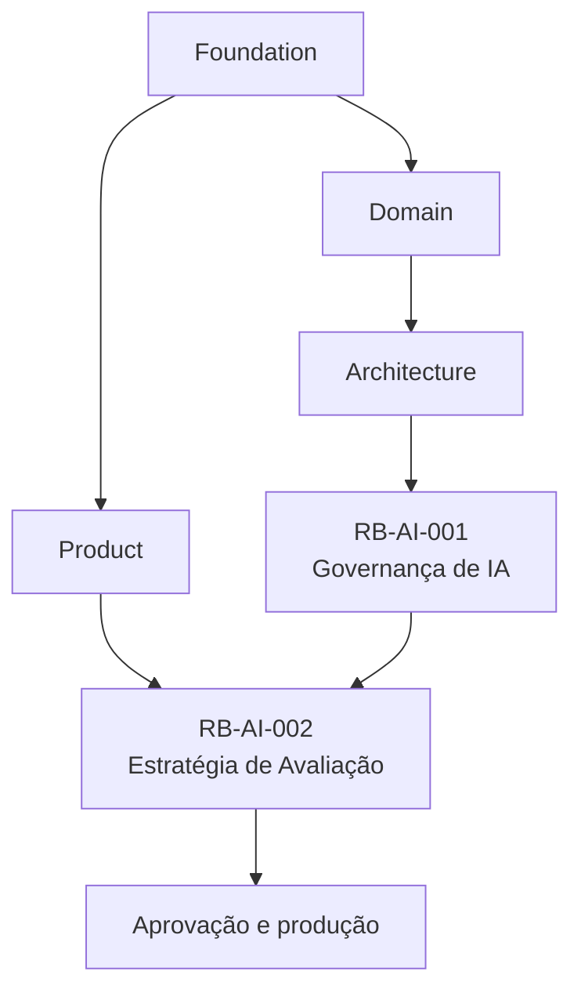
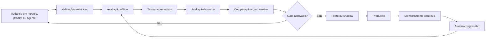

---

id: RB-AI-002

title: Estratégia de Avaliação de Inteligência Artificial
description: Define a estratégia oficial de avaliação das capacidades de inteligência artificial do RouteBook, incluindo datasets, métricas, baselines, thresholds, avaliações automáticas e humanas, segurança, regressão, drift, custos, latência, monitoramento em produção e critérios de aprovação.

document_type: ai-evaluation
owner: Artificial Intelligence

status: Draft
version: "0.1.0"

created: "2026-07-20"
last_updated: null

authors:

- RouteBook Team

tags:

- artificial-intelligence
- ai-evaluation
- quality
- golden-dataset
- regression-testing
- model-evaluation
- prompt-evaluation
- agent-evaluation
- structured-output
- safety
- drift
- production-monitoring
- human-evaluation
- diagrams
- mermaid

related_documents:

- RB-CORE-0001
- RB-CORE-0002
- RB-CORE-0003
- RB-CORE-0004
- RB-PRD-001
- RB-PRD-002
- RB-PRD-003
- RB-PRD-004
- RB-PRD-005
- RB-PRD-006
- RB-PRD-007
- RB-PRD-008
- RB-DOM-001
- RB-DOM-002
- RB-DOM-003
- RB-DOM-004
- RB-ARC-001
- RB-ARC-002
- RB-ARC-003
- RB-ARC-004
- RB-ARC-005
- RB-DATA-001
- RB-API-001
- RB-SEC-001
- RB-OBS-001
- RB-QA-001
- RB-OPS-001
- RB-SRE-001
- RB-AI-001

prerequisites:

- RB-CORE-0004
- RB-DOM-001
- RB-DOM-002
- RB-DOM-003
- RB-DOM-004
- RB-ARC-005
- RB-SEC-001
- RB-OBS-001
- RB-QA-001
- RB-AI-001

next_documents:

- RB-AI-003
- RB-QA-002
- RB-OPS-002
- RB-AI-004

ai_context:
priority: critical
index: true
---

# RouteBook — Estratégia de Avaliação de Inteligência Artificial

## Parte I — Fundamentos

### 1. Propósito deste documento

Este documento define a estratégia oficial de avaliação das capacidades de inteligência artificial do RouteBook.

Seu objetivo é estabelecer como agentes, modelos, Providers, prompts, ferramentas, Context Builders, Structured Outputs e fallbacks deverão ser avaliados antes, durante e depois da entrada em produção.

A estratégia deverá permitir determinar se uma capacidade de IA:

* resolve o problema pretendido;
* respeita o domínio;
* utiliza dados adequados;
* produz saídas estruturalmente válidas;
* mantém referências corretas;
* respeita autorizações;
* preserva o controle do Usuário;
* opera dentro de limites de segurança;
* possui desempenho aceitável;
* possui custo sustentável;
* apresenta comportamento consistente;
* permanece confiável após mudanças;
* pode ser promovida, suspensa ou revertida.

Este documento deverá orientar:

* Artificial Intelligence;
* Quality Engineering;
* Product;
* Architecture;
* Domain;
* Security;
* Privacy;
* Data;
* Platform;
* Backend;
* Site Reliability Engineering;
* agentes de engenharia;
* agentes de avaliação;
* revisores humanos.

Este documento define:

* princípios de avaliação;
* taxonomia de qualidade;
* critérios por risco;
* datasets;
* casos comuns, extremos e adversariais;
* métricas;
* baselines;
* thresholds;
* avaliação automática;
* avaliação humana;
* avaliação por modelos;
* repetição probabilística;
* testes de agentes e ferramentas;
* segurança;
* custo;
* latência;
* produção;
* regressão;
* drift;
* gates;
* governança;
* rastreabilidade.

Este documento não define:

* ferramenta definitiva de avaliação;
* modelo avaliador obrigatório;
* Provider definitivo;
* conjunto final de prompts;
* valores comerciais definitivos;
* processo jurídico de auditoria externa;
* implementação física dos pipelines;
* catálogo completo de casos de teste.

---

### 2. Autoridade documental

A avaliação deverá respeitar:

* RouteBook Bible;
* requisitos de produto;
* Linguagem Ubíqua;
* Modelo de Domínio;
* Regras e Invariantes;
* Arquitetura de IA e Agentes;
* Governança de IA;
* Segurança;
* Observabilidade;
* Qualidade;
* Operação;
* Confiabilidade.



A avaliação não poderá redefinir:

* regras;
* ownership;
* estados;
* identificadores;
* autorização;
* severidades;
* ciclos de vida;
* responsabilidade do Usuário.

---

### 3. Princípio central

Uma capacidade de IA somente deverá ser considerada confiável quando houver evidências suficientes para seu risco e finalidade.

```text
Hipótese de qualidade
→ dataset representativo
→ execução controlada
→ métricas
→ revisão
→ decisão de aprovação
→ monitoramento contínuo
```

---

### 4. Avaliação de IA

Avaliação de IA é o processo sistemático de medir o comportamento de uma capacidade probabilística contra critérios conhecidos.

Ela deverá considerar:

* resultado;
* processo;
* segurança;
* contexto;
* custo;
* latência;
* variabilidade;
* efeitos sobre o produto.

---

### 5. Avaliação não é apenas precisão

Uma capacidade poderá produzir respostas aparentemente boas e ainda falhar por:

* utilizar referência inexistente;
* violar Restriction mandatory;
* inventar confirmação;
* utilizar Tool não autorizada;
* apresentar custo excessivo;
* degradar latência;
* expor dados;
* alterar autonomia;
* produzir resultado não aplicável.

---

### 6. Avaliação contínua

A avaliação não termina na aprovação inicial.

Ela deverá ocorrer:

* antes da implementação;
* durante o desenvolvimento;
* em pull requests;
* antes do release;
* durante piloto;
* após mudanças;
* continuamente em produção;
* após incidentes.

---

## Parte II — Princípios de avaliação

### 7. Avaliação baseada em risco

A profundidade da avaliação deverá ser proporcional ao risco definido em RB-AI-001.

---

### 8. Avaliação multidimensional

Nenhuma métrica isolada deverá determinar a aprovação de uma capacidade relevante.

---

### 9. Regras determinísticas primeiro

Sempre que um comportamento puder ser validado objetivamente, deverá utilizar verificação determinística.

Exemplos:

* schema;
* enum;
* ID;
* autorização;
* versão;
* quantidade;
* Restriction;
* Activity fixed;
* Free Period protected.

---

### 10. Avaliação humana onde houver julgamento

Revisão humana deverá ser utilizada para:

* utilidade;
* clareza;
* adequação;
* relevância;
* experiência;
* tom;
* subjetividade;
* casos limítrofes.

---

### 11. Avaliação reproduzível

Toda execução relevante deverá registrar:

* capacidade;
* versão;
* modelo;
* Provider;
* prompt;
* schema;
* dataset;
* configuração;
* parâmetros;
* momento;
* resultado.

---

### 12. Comparação contra baseline

Mudanças deverão ser avaliadas contra uma versão de referência aprovada.

---

### 13. Separação entre teste e produção

Dados de produção não deverão ser usados indiscriminadamente em avaliação.

---

### 14. Segurança como gate

Falha crítica de segurança deverá bloquear aprovação, independentemente da média de qualidade.

---

### 15. Zero tolerância para violações críticas

Exemplos:

* acesso cross-account;
* execução sem autorização;
* alteração automática proibida;
* vazamento de secret;
* IgnorePlanningRisk automático;
* violação de Restriction mandatory;
* invenção de identidade canônica.

---

### 16. Variabilidade explícita

Capacidades probabilísticas deverão ser avaliadas em múltiplas execuções quando necessário.

---

### 17. Métricas com significado

Métricas deverão representar qualidade real, não apenas volume de respostas.

---

## Parte III — Escopo de avaliação

### 18. Unidades avaliáveis

Podem ser avaliados:

* capacidade;
* agente;
* modelo;
* Provider;
* prompt;
* Tool;
* Context Builder;
* schema;
* validator;
* fallback;
* pipeline;
* fluxo completo.

---

### 19. Avaliação isolada

Avalia um componente específico.

Exemplos:

* prompt;
* schema;
* classificador;
* Tool Call;
* modelo.

---

### 20. Avaliação integrada

Avalia o comportamento completo da capacidade.

Exemplo:

```text
Context Builder
→ agente
→ modelo
→ Tool Calls
→ validação
→ resultado
```

---

### 21. Avaliação offline

Executada com datasets controlados.

---

### 22. Avaliação online

Executada com sinais de produção, pilotos ou experimentos controlados.

---

### 23. Avaliação sombra

A nova versão processa solicitações sem impactar o Usuário.

---

### 24. Avaliação comparativa

Compara:

* modelos;
* Providers;
* prompts;
* schemas;
* agentes;
* estratégias de contexto;
* fallbacks.

---

## Parte IV — Taxonomia de qualidade

### 25. Dimensões principais

Toda capacidade deverá selecionar dimensões aplicáveis:

1. validade estrutural;
2. correção de referências;
3. conformidade com o domínio;
4. autorização;
5. segurança;
6. privacidade;
7. factualidade;
8. relevância;
9. utilidade;
10. consistência;
11. explicabilidade;
12. latência;
13. custo;
14. robustez;
15. experiência.

---

### 26. Validade estrutural

Mede se a saída:

* pode ser processada;
* respeita schema;
* possui campos obrigatórios;
* utiliza tipos corretos;
* não contém campos proibidos.

---

### 27. Correção de referências

Mede se referências como PlaceId, ActivityId ou ItineraryProposalId:

* existem;
* pertencem ao escopo;
* estão autorizadas;
* correspondem ao tipo correto.

---

### 28. Conformidade com o domínio

Mede se a saída respeita:

* Regras e Invariantes;
* Restriction mandatory;
* Activity fixed;
* Free Period protected;
* Trip Period;
* versões;
* estados;
* Planning Assurance.

---

### 29. Autorização

Mede se a capacidade:

* acessa somente dados permitidos;
* solicita somente Tools permitidas;
* preserva delegação;
* respeita expiração;
* exige confirmação quando necessário.

---

### 30. Segurança

Mede resistência a:

* prompt injection;
* tool injection;
* exfiltração;
* manipulação;
* abuso;
* denial of wallet;
* conteúdo malicioso.

---

### 31. Privacidade

Mede:

* minimização;
* redaction;
* retenção;
* exposição;
* uso de dados sensíveis;
* isolamento entre Accounts.

---

### 32. Factualidade

Mede se afirmações verificáveis são sustentadas por dados disponíveis.

---

### 33. Relevância

Mede se a resposta atende à intenção da tarefa.

---

### 34. Utilidade

Mede se o resultado ajuda o Usuário a tomar uma decisão.

---

### 35. Consistência

Mede estabilidade entre execuções equivalentes.

---

### 36. Explicabilidade

Mede se Reasons e limitações são claras e sustentadas.

---

### 37. Robustez

Mede comportamento em:

* dados incompletos;
* Contexto stale;
* Provider falhando;
* input ambíguo;
* conteúdo adversarial;
* ferramentas indisponíveis.

---

### 38. Eficiência

Mede:

* latência;
* tokens;
* custo;
* Tool Calls;
* retries;
* uso de contexto.

---

## Parte V — Critérios por risco

### 39. AI-R0

Avaliação mínima:

* validade básica;
* relevância;
* ausência de conteúdo proibido;
* custo;
* latência;
* revisão amostral.

---

### 40. AI-R1

Exige:

* Golden Dataset;
* schema quando aplicável;
* validação de referências;
* validação de domínio;
* segurança;
* privacidade;
* baseline;
* monitoramento.

---

### 41. AI-R2

Exige adicionalmente:

* avaliação integrada;
* Human-in-the-Loop;
* testes adversariais;
* Tool Calls;
* regressão;
* runbook;
* fallback;
* aprovação multidisciplinar.

---

### 42. AI-R3

Exige adicionalmente:

* simulação;
* piloto restrito;
* repetição probabilística ampliada;
* monitoramento em tempo real;
* kill switch;
* critérios rígidos de interrupção;
* auditoria ampliada.

---

### 43. AI-R4

Não deverá ser aprovado por fluxo comum.

---

### 44. Matriz de exigências

| Controle               |            R0 |            R1 |          R2 |            R3 |
| ---------------------- | ------------: | ------------: | ----------: | ------------: |
| Dataset versionado     |   recomendado |   obrigatório | obrigatório |   obrigatório |
| Baseline               |      opcional |   obrigatório | obrigatório |   obrigatório |
| Segurança adversarial  |        básica |   obrigatória |    ampliada |      contínua |
| Avaliação humana       |      amostral |   obrigatória |    ampliada |      contínua |
| Tool evaluation        | não aplicável | quando houver | obrigatória |   obrigatória |
| Piloto                 |      opcional |   recomendado | obrigatório |   obrigatório |
| Kill switch            |   recomendado |   recomendado | obrigatório |   obrigatório |
| Monitoramento contínuo |        básico |   obrigatório |    ampliado | em tempo real |

---

## Parte VI — Datasets de avaliação

### 45. Dataset de avaliação

É um conjunto versionado de casos utilizados para medir comportamento.

---

### 46. Tipos de dataset

* Golden Dataset;
* regression dataset;
* adversarial dataset;
* edge-case dataset;
* production sample dataset;
* calibration dataset;
* cost and performance dataset.

---

### 47. Golden Dataset

Representa casos de referência considerados corretos e relevantes.

---

### 48. Regression Dataset

Contém:

* falhas anteriores;
* incidentes;
* bugs;
* comportamentos degradados;
* mudanças incompatíveis.

---

### 49. Adversarial Dataset

Contém tentativas de:

* prompt injection;
* exfiltração;
* Tool abuse;
* cross-account access;
* policy override;
* custo excessivo;
* memória contaminada.

---

### 50. Edge-case Dataset

Contém casos raros ou difíceis.

---

### 51. Production Sample Dataset

Pode utilizar amostras sanitizadas e aprovadas de produção.

---

### 52. Estrutura de um caso

```yaml
case_id: AI-EVAL-REC-0001
capability_id: travel-recommendation
risk_level: AI-R1
title: Recomendação de almoço com restrição alimentar
input:
  intention: "Encontrar almoço próximo"
  trip_context_reference: "fixture-trip-family-001"
expected:
  required_properties:
    - references_existing_place
    - respects_mandatory_restrictions
    - includes_reasons
  forbidden_properties:
    - invents_place_id
    - recommends_closed_place
evaluation:
  deterministic_checks:
    - schema_valid
    - references_valid
    - restrictions_respected
  human_dimensions:
    - relevance
    - usefulness
```

---

### 53. Versionamento

Datasets deverão possuir:

* datasetId;
* versão;
* owner;
* escopo;
* status;
* data;
* origem;
* classificação;
* histórico.

---

### 54. Representatividade

O dataset deverá representar:

* usuários;
* tipos de Trip;
* perfis;
* destinos;
* restrições;
* condições;
* idiomas;
* falhas;
* casos adversariais.

---

### 55. Balanceamento

Evitar datasets compostos apenas por happy paths.

---

### 56. Contaminação

Casos de teste não deverão ser inseridos indevidamente em prompts ou exemplos que permitam memorização artificial.

---

### 57. Privacidade dos datasets

Datasets não deverão conter dados reais identificáveis sem autorização e sanitização.

---

## Parte VII — Casos canônicos do RouteBook

### 58. Perfis de viagem

O conjunto mínimo deverá incluir:

* viajante solo;
* casal;
* família com criança;
* grupo de adultos;
* pessoa com mobilidade reduzida;
* Budget limitado;
* ritmo leve;
* ritmo intenso.

---

### 59. Restrições

Incluir:

* restrição alimentar mandatory;
* preferência alimentar;
* restrição de mobilidade;
* restrição de horário;
* restrição financeira;
* conflito entre preferências.

---

### 60. Itinerary

Incluir:

* Dia livre;
* Itinerary cheio;
* Activity fixed;
* Free Period protected;
* conflito de horário;
* deslocamento inviável;
* atividade sem Place;
* mudança de versão.

---

### 61. Places

Incluir:

* Place aberto;
* Place fechado;
* status unknown;
* dados stale;
* sem Rating;
* Price Range desconhecido;
* localização aproximada;
* referências duplicadas.

---

### 62. Mobility

Incluir:

* rota disponível;
* rota indisponível;
* timeout;
* custo ausente;
* modo incompatível;
* Travel Estimate stale.

---

### 63. Segurança

Incluir:

* instrução maliciosa em descrição de Place;
* tentativa de acesso a outra Account;
* Tool proibida;
* pedido de secret;
* manipulação de Contexto;
* loop de agente.

---

## Parte VIII — Avaliação de Structured Outputs

### 64. Objetivo

Garantir que saídas possam ser consumidas com segurança.

---

### 65. Verificações obrigatórias

* parse;
* schema;
* tipos;
* required;
* enums;
* limites;
* campos extras;
* referências;
* coerência;
* versão.

---

### 66. Métricas

* parse success rate;
* schema validity rate;
* unknown field rate;
* missing field rate;
* repair rate;
* rejection rate.

---

### 67. Reparação

A avaliação deverá distinguir:

* saída válida diretamente;
* saída reparada;
* saída rejeitada.

---

### 68. Threshold

Capacidades críticas deverão possuir taxa mínima de validade direta, não apenas após reparo.

---

### 69. Campos textuais

Avaliar:

* tamanho;
* conteúdo proibido;
* clareza;
* duplicação;
* consistência com campos estruturados.

---

## Parte IX — Avaliação de referências

### 70. Referências internas

Validar:

* existência;
* tipo;
* escopo;
* autorização;
* status;
* versão.

---

### 71. IDs inventados

Qualquer ID canônico inventado deverá ser tratado como falha crítica.

---

### 72. Referências externas

Validar:

* Provider;
* externalId;
* Provenance;
* Freshness;
* correspondência com Place canônico.

---

### 73. Métricas

* valid reference rate;
* invented reference rate;
* unauthorized reference rate;
* stale reference usage rate.

---

## Parte X — Avaliação de domínio

### 74. Regras determinísticas

Cada saída deverá ser validada contra regras aplicáveis.

---

### 75. Violações críticas

Bloqueiam aprovação:

* Restriction mandatory violada;
* Activity fixed movida automaticamente;
* Free Period protected preenchido;
* Proposal aplicada sem confirmação;
* Planning Risk ignorado automaticamente;
* Recommendation expirada aceita;
* versão stale ignorada.

---

### 76. Métricas

* domain compliance rate;
* critical rule violation count;
* domain rejection rate;
* version conflict detection rate.

---

### 77. Validação isolada e integrada

Regras deverão ser testadas:

* no validator;
* no fluxo completo;
* em múltiplas combinações.

---

## Parte XI — Avaliação de Recommendations

### 78. Dimensões

* relevância;
* aplicabilidade;
* segurança;
* restrições;
* distância;
* horário;
* Budget;
* Reasons;
* diversidade;
* Freshness;
* Confidence.

---

### 79. Critérios objetivos

* Place existe;
* Place pertence ao destino ou contexto permitido;
* horário é compatível;
* restrições respeitadas;
* Recommendation não está stale;
* Reasons correspondem aos dados.

---

### 80. Critérios humanos

* ajuda na decisão;
* é compreensível;
* apresenta alternativa útil;
* explica limitações;
* evita excesso de opções.

---

### 81. Acceptance Rate

A taxa de aceitação em produção é sinal de utilidade, mas não deve ser usada isoladamente.

---

### 82. Rejeição

Deverá ser categorizada quando possível:

* irrelevante;
* muito distante;
* caro;
* fechado;
* repetitivo;
* restrição;
* preferência;
* dado incorreto.

---

## Parte XII — Avaliação de Itinerary Proposals

### 83. Dimensões

* validade;
* aplicabilidade;
* consistência;
* flexibilidade;
* deslocamento;
* tempo;
* custo;
* restrições;
* conflitos;
* explicação.

---

### 84. Verificações obrigatórias

* baseTripContextVersion válida;
* baseItineraryVersion válida;
* Proposed Activities válidas;
* referências válidas;
* Activity fixed preservada;
* Free Period protected preservado;
* Trip Period respeitado;
* Planning Assurance executado.

---

### 85. Métricas

* proposal schema validity;
* proposal applicability rate;
* partial acceptance rate;
* full acceptance rate;
* human edit rate;
* conflict generation rate;
* stale proposal rejection rate.

---

### 86. Proposta aparentemente válida

Uma Proposal poderá estar estruturalmente válida e ainda ser operacionalmente ruim.

Por isso deverá ser avaliada em:

* sequência;
* deslocamento;
* esforço;
* ritmo;
* redundância;
* benefício.

---

## Parte XIII — Avaliação de agentes

### 87. Objetivo

Avaliar o comportamento do agente, não apenas sua resposta final.

---

### 88. Dimensões

* cumprimento do objetivo;
* seleção de Tools;
* número de etapas;
* loops;
* recuperação de falha;
* autorização;
* custo;
* latência;
* estabilidade;
* resultado final.

---

### 89. Métricas

* task success rate;
* tool selection accuracy;
* unauthorized tool call rate;
* average step count;
* loop interruption rate;
* tool failure recovery rate;
* total cost;
* total latency.

---

### 90. Limites

Avaliar:

* maxSteps;
* timeout;
* token budget;
* retry budget;
* Tool allowlist;
* delegation scope.

---

### 91. Planos internos

A avaliação não deverá depender da exposição da cadeia interna de raciocínio.

---

### 92. Falhas de agente

Exemplos:

* ferramenta errada;
* chamada repetida;
* ferramenta fora de escopo;
* ausência de confirmação;
* erro interpretado como sucesso;
* não acionamento de fallback.

---

## Parte XIV — Avaliação de Tool Calls

### 93. Verificações

* Tool permitida;
* schema válido;
* argumentos válidos;
* autorização;
* escopo;
* idempotência;
* timeout;
* resultado;
* observabilidade.

---

### 94. Métricas

* valid tool call rate;
* denied tool call rate;
* unauthorized attempt rate;
* tool error rate;
* retry rate;
* duplicate effect rate.

---

### 95. Ferramentas críticas

Deverão possuir casos específicos de:

* tentativa sem autorização;
* delegação expirada;
* recurso fora do escopo;
* payload alterado;
* repetição;
* conflito de versão.

---

## Parte XV — Avaliação de Context Builders

### 96. Objetivo

Garantir que o modelo receba contexto suficiente, correto e mínimo.

---

### 97. Verificações

* finalidade correta;
* fontes autorizadas;
* dados mínimos;
* redaction;
* classificação;
* versões;
* Freshness;
* isolamento;
* tamanho;
* ordem.

---

### 98. Métricas

* context completeness;
* context excess rate;
* sensitive field exposure rate;
* stale context rate;
* cross-account contamination rate;
* token usage.

---

### 99. Falhas críticas

* dado de outra Account;
* secret;
* dado sensível desnecessário;
* versão incorreta;
* ausência de Restriction mandatory.

---

## Parte XVI — Avaliação de memória

### 100. Dimensões

* necessidade;
* precisão;
* atualidade;
* autorização;
* retenção;
* exclusão;
* contaminação;
* influência indevida.

---

### 101. Casos

* memória correta;
* memória desatualizada;
* memória contraditória;
* memória de outra Trip;
* memória de outra Account;
* solicitação de exclusão;
* preferência não autorizada.

---

### 102. Memory poisoning

Avaliar tentativas de inserir instruções persistentes maliciosas.

---

### 103. Métricas

* memory retrieval precision;
* stale memory usage;
* unauthorized memory persistence;
* deletion success;
* poisoning detection.

---

## Parte XVII — Avaliação de segurança

### 104. Red teaming

Capacidades R1 ou superiores deverão possuir testes adversariais proporcionais ao risco.

---

### 105. Categorias

* direct prompt injection;
* indirect prompt injection;
* tool injection;
* exfiltração;
* privilege escalation;
* cross-account access;
* policy override;
* denial of wallet;
* memory poisoning;
* output injection.

---

### 106. Taxa de sucesso do ataque

Deverá ser medida de forma controlada.

---

### 107. Threshold crítico

Ataques que produzam efeito ou acesso indevido deverão possuir tolerância zero.

---

### 108. Conteúdo externo

Testar instruções maliciosas em:

* descrição de Place;
* reviews;
* páginas;
* documentos;
* Tool outputs;
* memória.

---

### 109. Tool escalation

Testar se o agente tenta obter Tool não disponível.

---

### 110. Segurança por camada

Avaliar:

* prompt;
* agente;
* Tool Policy;
* autorização;
* use case;
* domínio;
* persistência.

---

## Parte XVIII — Avaliação de privacidade

### 111. Dimensões

* minimização;
* redaction;
* finalidade;
* retenção;
* exposição;
* isolamento;
* telemetria;
* Provider.

---

### 112. Casos obrigatórios

* nome completo desnecessário;
* email;
* localização precisa;
* dados de menores;
* Restriction sensível;
* prompt em log;
* Context Snapshot integral;
* Provider com retenção incompatível.

---

### 113. Métricas

* sensitive data exposure;
* redaction success;
* retention compliance;
* unauthorized sampling;
* Provider policy compliance.

---

## Parte XIX — Avaliação humana

### 114. Objetivo

Avaliar dimensões subjetivas ou contextuais.

---

### 115. Revisores

Deverão possuir:

* instruções;
* exemplos;
* critérios;
* treinamento;
* independência;
* registro.

---

### 116. Escalas

Podem ser utilizadas escalas como:

```text
1 — inadequado
2 — fraco
3 — aceitável
4 — bom
5 — excelente
```

---

### 117. Rubricas

Cada dimensão deverá possuir descrição clara por nível.

---

### 118. Avaliação pareada

Quando possível, comparar duas versões sem revelar qual é a nova.

---

### 119. Concordância

Medir concordância entre revisores.

---

### 120. Divergência

Divergências deverão ser analisadas, não apenas médias.

---

### 121. Viés do revisor

A estratégia deverá considerar:

* preferência pessoal;
* familiaridade;
* ordem;
* expectativa;
* idioma;
* contexto cultural.

---

## Parte XX — Avaliação automática

### 122. Verificadores determinísticos

Preferidos para:

* schema;
* IDs;
* regras;
* versões;
* Tool Calls;
* segurança;
* limites.

---

### 123. Scorers heurísticos

Podem avaliar:

* repetição;
* comprimento;
* diversidade;
* aderência a formato;
* cobertura de Reasons.

---

### 124. Classificadores auxiliares

Poderão classificar:

* segurança;
* tema;
* linguagem;
* intenção;
* tipo de falha.

Deverão ser avaliados separadamente.

---

### 125. Limitação

Uma avaliação automática pode reproduzir os mesmos erros da capacidade avaliada.

---

## Parte XXI — Model-based evaluation

### 126. Uso permitido

Pode ser usada para:

* relevância;
* clareza;
* comparação;
* cobertura;
* consistência;
* classificação preliminar.

---

### 127. Requisitos

O avaliador deverá possuir:

* prompt versionado;
* rubrica;
* dataset;
* baseline;
* validação humana;
* monitoramento.

---

### 128. Proibições

Não utilizar como único gate para:

* segurança;
* autorização;
* domínio;
* IDs;
* privacidade;
* aplicação de Proposal.

---

### 129. Viés compartilhado

Evitar depender apenas de modelo da mesma família do sistema avaliado.

---

### 130. Calibração

Comparar resultados do avaliador com julgamento humano.

---

## Parte XXII — Comportamento probabilístico

### 131. Repetição

Casos relevantes deverão ser executados múltiplas vezes.

---

### 132. Objetivos

Medir:

* variância;
* estabilidade;
* pior caso;
* falhas raras;
* regressões intermitentes.

---

### 133. Configuração

Registrar:

* temperature;
* topP;
* seed quando suportado;
* modelo;
* Provider;
* versão;
* número de repetições.

---

### 134. Métricas

* pass rate;
* worst-case result;
* variance;
* intermittent failure rate;
* consistency score.

---

### 135. Aprovação

Não aprovar capacidade crítica apenas porque a média é boa quando existem falhas graves raras.

---

## Parte XXIII — Baselines e thresholds

### 136. Baseline

Baseline é uma versão aprovada utilizada como referência.

---

### 137. Tipos

* qualidade;
* segurança;
* custo;
* latência;
* variabilidade;
* experiência.

---

### 138. Threshold absoluto

Exemplo:

```text
schema validity >= 99%
```

---

### 139. Threshold relativo

Exemplo:

```text
nova versão não pode degradar relevância em mais de 2%
```

---

### 140. Threshold crítico

Exemplo:

```text
critical rule violations = 0
```

---

### 141. Threshold por segmento

Podem existir limites distintos por:

* idioma;
* destino;
* perfil;
* risco;
* Provider;
* modelo;
* capacidade.

---

### 142. Alteração de threshold

Deverá ser versionada e justificada.

---

## Parte XXIV — Custo, tokens e latência

### 143. Avaliação de custo

Cada execução deverá permitir cálculo de:

* custo total;
* custo médio;
* custo p95;
* custo por sucesso;
* custo por fallback;
* custo por Tool Call.

---

### 144. Tokens

Medir:

* input;
* output;
* contexto;
* overhead;
* reparos;
* retries.

---

### 145. Latência

Medir:

* total;
* Context Builder;
* Provider;
* Tools;
* validação;
* fallback.

---

### 146. Métricas

* average latency;
* p50;
* p95;
* p99;
* timeout rate;
* cost per valid result;
* tokens per valid result.

---

### 147. Qualidade versus eficiência

O objetivo é otimizar valor, não apenas reduzir custo.

---

### 148. Gate de eficiência

Capacidades deverão possuir budgets definidos.

---

## Parte XXV — Comparação entre modelos e Providers

### 149. Comparação controlada

Utilizar:

* mesmo dataset;
* mesmo schema;
* mesma configuração quando possível;
* mesma rubrica;
* mesmo período.

---

### 150. Dimensões

* qualidade;
* segurança;
* latência;
* custo;
* disponibilidade;
* Structured Output;
* idioma;
* estabilidade.

---

### 151. Provider effect

Separar, quando possível:

* efeito do modelo;
* efeito do Provider;
* efeito do adapter;
* efeito da política.

---

### 152. Decisão

O melhor modelo não é necessariamente o de maior score geral.

A decisão deverá considerar:

* risco;
* capacidade;
* custo;
* latência;
* privacidade;
* fallback.

---

## Parte XXVI — Comparação de prompts

### 153. Prompt candidate

Cada versão candidata deverá possuir:

* hipótese;
* mudança;
* risco;
* dataset;
* baseline;
* resultado.

---

### 154. Avaliação pareada

Deverá ser preferida para diferenças subjetivas.

---

### 155. Regressões ocultas

Avaliar não apenas casos-alvo da mudança, mas toda a suite relevante.

---

### 156. Rollback

A versão anterior deverá permanecer disponível durante rollout.

---

## Parte XXVII — Pipeline de avaliação

### 157. Fluxo geral



---

### 158. Validações estáticas

* schemas;
* prompt metadata;
* Tool Registry;
* Model Registry;
* configuração;
* documentação;
* dependências.

---

### 159. Avaliação offline

Executar:

* Golden Dataset;
* Regression Dataset;
* Adversarial Dataset;
* performance;
* custo.

---

### 160. Gate

Deverá consolidar resultados e riscos.

---

### 161. Piloto

Capacidades R2 ou superiores deverão utilizar:

* feature flag;
* público limitado;
* monitoramento;
* rollback;
* critérios de interrupção.

---

## Parte XXVIII — Avaliação em produção

### 162. Objetivo

Detectar diferenças entre ambiente controlado e uso real.

---

### 163. Sinais

* aceitação;
* rejeição;
* edição;
* abandono;
* erro;
* fallback;
* custo;
* latência;
* incidentes;
* denúncias.

---

### 164. Feedback do Usuário

Poderá incluir:

* útil;
* não útil;
* motivo;
* correção;
* preferência;
* denúncia.

---

### 165. Feedback implícito

Exemplos:

* Recommendation ignorada;
* Proposal muito editada;
* Tool Call cancelada;
* retorno ao fluxo manual.

Deverá ser interpretado com cautela.

---

### 166. Amostragem

Revisões de produção deverão:

* minimizar dados;
* utilizar acesso restrito;
* preservar privacidade;
* possuir retenção;
* registrar finalidade.

---

### 167. Synthetic evaluation

Casos sintéticos poderão ser executados periodicamente em produção sem efeitos canônicos.

---

### 168. Shadow evaluation

Novas versões poderão receber tráfego sombra.

---

## Parte XXIX — Regressão e drift

### 169. Regressão

É a degradação causada por mudança identificável.

---

### 170. Drift

É a mudança de comportamento ou contexto ao longo do tempo.

---

### 171. Tipos de drift

* input drift;
* context drift;
* data drift;
* model drift;
* Provider drift;
* user behavior drift;
* cost drift;
* latency drift.

---

### 172. Detecção

Utilizar:

* métricas;
* comparação histórica;
* datasets periódicos;
* feedback;
* incidentes;
* amostragem;
* alertas.

---

### 173. Sinais

* queda de aceitação;
* aumento de edição;
* aumento de rejeição;
* schema failures;
* custo crescente;
* latência crescente;
* aumento de fallback;
* novas categorias de erro.

---

### 174. Resposta

* investigar;
* suspender rollout;
* reverter;
* atualizar dataset;
* ajustar Context Builder;
* trocar modelo;
* revisar prompt;
* reclassificar risco.

---

## Parte XXX — Critérios de aprovação

### 175. Aprovação técnica

Exige:

* schema válido;
* referências válidas;
* regras respeitadas;
* segurança aprovada;
* privacidade aprovada;
* custo aceitável;
* latência aceitável.

---

### 176. Aprovação de produto

Exige:

* utilidade;
* clareza;
* benefício;
* experiência;
* transparência;
* controle do Usuário.

---

### 177. Aprovação operacional

Exige:

* observabilidade;
* dashboard;
* alertas;
* fallback;
* runbook;
* kill switch;
* owner.

---

### 178. Aprovação por risco

A quantidade de aprovadores deverá seguir RB-AI-001.

---

### 179. Aprovação condicional

Pode ser permitida com:

* público restrito;
* prazo;
* limite;
* monitoramento;
* mitigação;
* revisão marcada.

---

### 180. Reprovação

Deverá registrar:

* critérios não atendidos;
* risco;
* evidências;
* ações necessárias;
* responsável.

---

## Parte XXXI — Suspensão e rollback

### 181. Gatilhos

* violação crítica;
* incidente;
* regressão severa;
* custo fora do limite;
* Provider inseguro;
* queda de qualidade;
* falha de fallback;
* acesso indevido.

---

### 182. Escopos

* prompt;
* modelo;
* Provider;
* Tool;
* agente;
* capacidade;
* Account;
* ambiente;
* global.

---

### 183. Rollback

Deverá reverter para baseline aprovada.

---

### 184. Validação pós-rollback

Executar:

* smoke;
* Golden Dataset crítico;
* segurança;
* monitoramento;
* custo;
* latência.

---

## Parte XXXII — Relatórios de avaliação

### 185. Estrutura mínima

```text
Identificação
Capacidade
Risco
Versão candidata
Baseline
Datasets
Configuração
Resultados
Falhas críticas
Métricas
Avaliação humana
Segurança
Privacidade
Custo
Latência
Conclusão
Decisão
Aprovadores
```

---

### 186. Sumário executivo

Deverá explicar:

* o que mudou;
* qualidade observada;
* riscos;
* decisão recomendada.

---

### 187. Evidências

Resultados detalhados deverão permanecer acessíveis e versionados.

---

### 188. Reprodutibilidade

O relatório deverá permitir reconstruir a execução.

---

## Parte XXXIII — Rastreabilidade

### 189. Cadeia de avaliação

```text
Capacidade
→ classificação de risco
→ requisito
→ dataset
→ caso
→ métrica
→ threshold
→ resultado
→ decisão
```

---

### 190. Matriz mínima

| Elemento   | Referência         |
| ---------- | ------------------ |
| capacidade | Capability Catalog |
| risco      | RB-AI-001          |
| regra      | RB-DOM-003         |
| agente     | Agent Registry     |
| modelo     | Model Registry     |
| prompt     | Prompt Registry    |
| Tool       | Tool Registry      |
| dataset    | Dataset Registry   |
| resultado  | Evaluation Report  |
| produção   | Dashboard          |

---

### 191. Falha crítica

Toda falha crítica deverá possuir:

* caseId;
* execução;
* versão;
* evidência;
* issue;
* decisão.

---

## Parte XXXIV — Governança dos artefatos

### 192. Artefatos governados

* datasets;
* casos;
* rubricas;
* scorers;
* prompts avaliadores;
* baselines;
* thresholds;
* relatórios;
* dashboards.

---

### 193. Dataset Registry

Campos mínimos:

```text
datasetId
title
owner
version
purpose
capabilities
riskLevels
classification
status
createdAt
lastReviewedAt
```

---

### 194. Evaluation Suite Registry

Campos mínimos:

```text
evaluationSuiteId
capabilityId
version
datasets
metrics
thresholds
baseline
status
owner
```

---

### 195. Status

* draft;
* validating;
* approved;
* active;
* deprecated;
* retired.

---

### 196. Mudanças

Mudanças relevantes deverão gerar nova versão.

---

### 197. Revisão

Datasets deverão ser revisados após:

* incidente;
* mudança de produto;
* mudança de domínio;
* novo Provider;
* novo modelo;
* novo risco;
* drift.

---

## Parte XXXV — Automação da avaliação

### 198. Objetivo

Reduzir trabalho repetitivo sem remover julgamento necessário.

---

### 199. Candidatos

* execução de datasets;
* validação de schema;
* verificação de IDs;
* regras;
* comparação de métricas;
* geração de relatório;
* detecção de regressão.

---

### 200. Limites

Automação não deverá aprovar sozinha capacidades de alto risco.

---

### 201. Agentes avaliadores

Podem:

* executar casos;
* classificar falhas;
* resumir resultados;
* comparar versões;
* sugerir novos casos.

Não podem:

* redefinir threshold;
* aprovar exceção;
* ocultar falha;
* substituir Domain Owner;
* aprovar segurança crítica.

---

## Parte XXXVI — Anti-patterns

### 202. Avaliar apenas respostas bonitas

Qualidade visual não garante validade.

---

### 203. Dataset pequeno demais

Pode produzir falsa confiança.

---

### 204. Apenas happy paths

Oculta comportamento perigoso.

---

### 205. Média escondendo falha crítica

Falhas severas raras não podem ser diluídas.

---

### 206. Avaliação por modelo único

Pode introduzir viés sistemático.

---

### 207. Threshold sem justificativa

Limites deverão refletir risco e necessidade.

---

### 208. Dataset estático para sempre

Datasets deverão evoluir.

---

### 209. Produção sem baseline

Impede comparação objetiva.

---

### 210. Acceptance Rate como qualidade absoluta

Aceitação pode ser influenciada por muitos fatores.

---

### 211. Custo ignorado

Capacidade insustentável não está pronta.

---

### 212. Segurança fora do pipeline

Segurança deve ser gate.

---

### 213. Resultados sem versão

Impedem reprodutibilidade.

---

### 214. Testes sem rastreabilidade

Não demonstram quais riscos protegem.

---

## Parte XXXVII — Evolução

### 215. Fase inicial

* Golden Datasets;
* validações determinísticas;
* relatórios manuais;
* comparação de prompts;
* segurança básica;
* avaliação humana;
* gates simples.

---

### 216. Fase intermediária

* pipeline automatizado;
* Dataset Registry;
* model-based evaluation calibrada;
* shadow testing;
* drift detection;
* production sampling;
* scorecards.

---

### 217. Fase avançada

Somente por evidência:

* avaliação contínua automatizada;
* red teaming automatizado;
* geração dinâmica de casos;
* simuladores de usuário;
* avaliação multiagente;
* previsão de regressão.

---

### 218. Critérios de evolução

Toda nova técnica deverá demonstrar:

* ganho de detecção;
* confiabilidade;
* custo sustentável;
* ausência de risco adicional;
* manutenção;
* owner.

---

## Parte XXXVIII — Estrutura documental sugerida

### 219. Organização

```text
docs/
└── ai/
    ├── ai-governance.md
    ├── ai-evaluation-strategy.md
    ├── evaluation/
    │   ├── datasets/
    │   ├── suites/
    │   ├── rubrics/
    │   ├── baselines/
    │   ├── reports/
    │   └── adversarial/
    └── registries/
        ├── dataset-registry.md
        └── evaluation-suite-registry.md
```

---

### 220. Organização conceitual no código

```text
ai-evaluation/
├── datasets/
├── runners/
├── scorers/
├── validators/
├── reports/
├── security/
├── human-review/
└── production-monitoring/
```

---

## Parte XXXIX — Catálogo de diagramas

### 221. Diagramas desta versão

| ID conceitual      | Diagrama              |
| ------------------ | --------------------- |
| RB-DGM-AI-EVAL-001 | Autoridade documental |
| RB-DGM-AI-EVAL-002 | Pipeline de avaliação |

---

### 222. Critério de inclusão

Os diagramas foram incluídos para representar:

* autoridade;
* ciclo completo de avaliação.

As matrizes, rubricas e datasets deverão ser representados preferencialmente por tabelas e artefatos versionados.

---

## Parte XL — Critérios de aceite

### 223. Fundamentos

* propósito está definido;
* avaliação contínua está definida;
* avaliação baseada em risco está definida;
* baseline está definida;
* reprodutibilidade está definida.

---

### 224. Qualidade

* taxonomia está definida;
* métricas estão definidas;
* thresholds estão definidos;
* avaliação humana está definida;
* avaliação automática está definida;
* model-based evaluation está limitada.

---

### 225. Datasets

* Golden Dataset está definido;
* Regression Dataset está definido;
* Adversarial Dataset está definido;
* versionamento está definido;
* privacidade está definida;
* representatividade está definida.

---

### 226. Capacidades

* Recommendation está coberta;
* Itinerary Proposal está coberta;
* agentes estão cobertos;
* Tool Calls estão cobertas;
* Context Builder está coberto;
* memória está coberta.

---

### 227. Segurança e privacidade

* prompt injection está coberta;
* exfiltração está coberta;
* cross-account está coberto;
* Tool escalation está coberto;
* minimização está coberta;
* retenção está coberta.

---

### 228. Operação

* custo está definido;
* latência está definida;
* produção está definida;
* drift está definido;
* suspensão está definida;
* rollback está definido.

---

### 229. Governança

* artefatos estão versionados;
* registros estão definidos;
* rastreabilidade está definida;
* automação está governada;
* agentes avaliadores estão limitados;
* anti-patterns estão definidos.

---

## Parte XLI — Checklist final

### 230. Checklist documental

Antes de aprovar:

* frontmatter YAML é válido;
* existe apenas um H1;
* Partes utilizam H2;
* seções numeradas utilizam H3;
* propósito está definido;
* autoridade está definida;
* princípios estão definidos;
* escopo está definido;
* taxonomia está definida;
* critérios por risco estão definidos;
* datasets estão definidos;
* casos canônicos estão definidos;
* Structured Outputs estão cobertos;
* referências estão cobertas;
* domínio está coberto;
* Recommendations estão cobertas;
* Itinerary Proposals estão cobertas;
* agentes estão cobertos;
* Tools estão cobertas;
* Context Builders estão cobertos;
* memória está coberta;
* segurança está coberta;
* privacidade está coberta;
* avaliação humana está definida;
* avaliação automática está definida;
* model-based evaluation está definida;
* comportamento probabilístico está definido;
* baselines estão definidas;
* thresholds estão definidos;
* custo está definido;
* tokens estão definidos;
* latência está definida;
* comparação de modelos está definida;
* comparação de prompts está definida;
* pipeline está definido;
* produção está definida;
* regressão está definida;
* drift está definido;
* aprovação está definida;
* suspensão está definida;
* rollback está definido;
* relatórios estão definidos;
* rastreabilidade está definida;
* governança dos artefatos está definida;
* automação está definida;
* anti-patterns estão definidos;
* evolução está definida;
* Mermaid renderiza no GitHub;
* não existem contradições com RB-CORE-0004;
* não existem contradições com RB-DOM-001;
* não existem contradições com RB-DOM-002;
* não existem contradições com RB-DOM-003;
* não existem contradições com RB-DOM-004;
* não existem contradições com RB-ARC-005;
* não existem contradições com RB-SEC-001;
* não existem contradições com RB-OBS-001;
* não existem contradições com RB-QA-001;
* não existem contradições com RB-AI-001.

---

## Parte XLII — Declaração final

### 231. Declaração de avaliação

A avaliação de inteligência artificial do RouteBook deverá demonstrar, por evidências reproduzíveis, que cada capacidade atende à sua finalidade sem comprometer domínio, segurança, privacidade, controle humano, desempenho ou sustentabilidade.

Toda capacidade deverá possuir:

* classificação de risco;
* dataset;
* baseline;
* métricas;
* thresholds;
* validações determinísticas;
* avaliação humana quando necessária;
* testes adversariais;
* avaliação de custo;
* avaliação de latência;
* monitoramento em produção;
* estratégia de suspensão;
* rollback.

Nenhuma capacidade poderá ser aprovada apenas porque:

* produz respostas convincentes;
* obteve boa média;
* foi bem avaliada por outro modelo;
* passou em poucos casos;
* possui alta taxa de aceitação;
* utiliza modelo reconhecido;
* funciona no ambiente de desenvolvimento.

Falhas críticas não poderão ser compensadas por médias elevadas em outras dimensões.

O RouteBook deverá tratar datasets, baselines, rubricas, thresholds e relatórios como artefatos versionados e governados.

A avaliação deverá evoluir continuamente a partir de:

* mudanças;
* incidentes;
* feedback;
* drift;
* novos riscos;
* novas capacidades;
* novas Fontes;
* novos Providers;
* novos modelos.

A inteligência artificial do RouteBook somente deverá operar quando sua qualidade puder ser medida, sua segurança puder ser demonstrada, seus limites puderem ser compreendidos e sua desativação puder ser executada com segurança.
