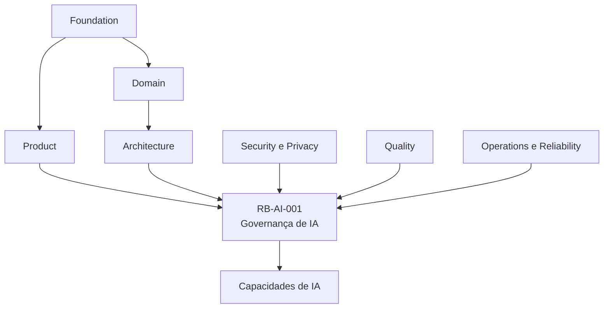
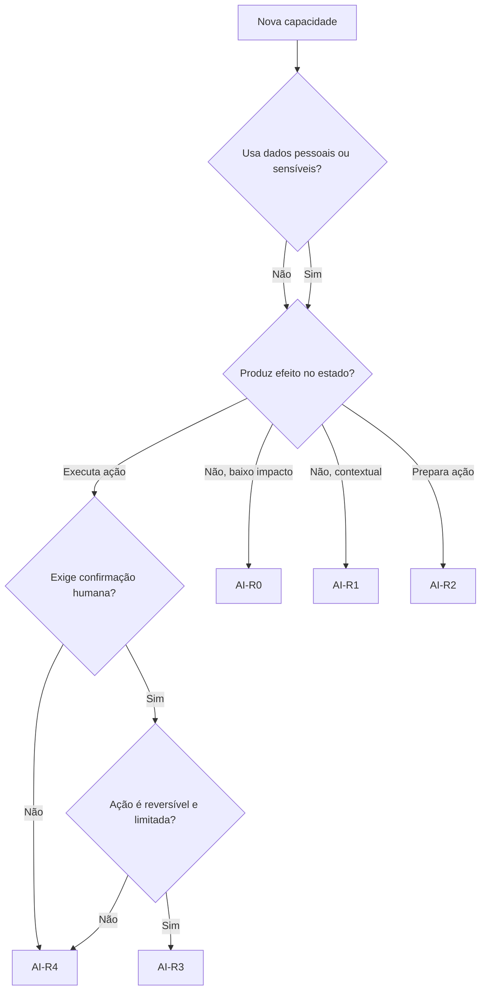
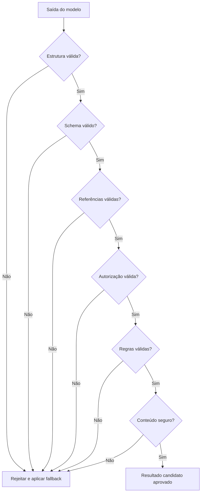
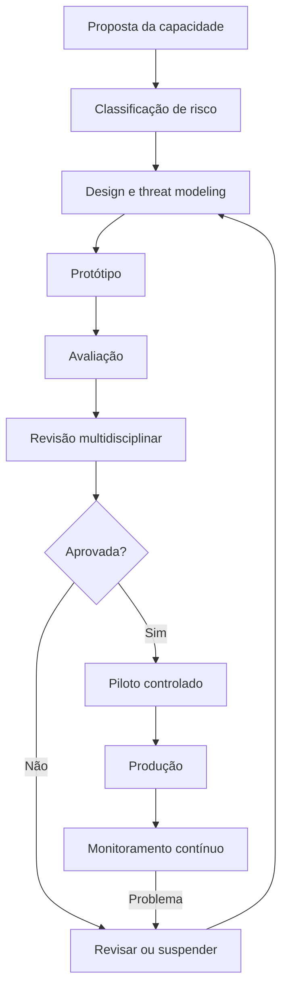
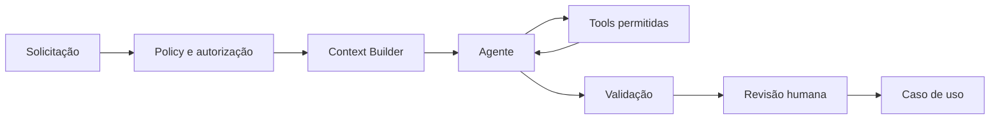

---

id: RB-AI-001

title: Governança de Inteligência Artificial
description: Define a governança oficial das capacidades de inteligência artificial do RouteBook, incluindo classificação de risco, responsabilidades, autonomia, Human-in-the-Loop, aprovação de modelos e Providers, prompts, ferramentas, contexto, memória, avaliação, segurança, privacidade, custos, incidentes, auditoria e gestão de mudanças.

document_type: ai-governance
owner: Artificial Intelligence

status: Draft
version: "0.1.0"

created: "2026-07-20"
last_updated: null

authors:

- RouteBook Team

tags:

- artificial-intelligence
- ai-governance
- responsible-ai
- ai-agents
- human-in-the-loop
- risk-management
- model-governance
- prompt-governance
- tool-governance
- evaluation
- safety
- privacy
- provenance
- audit
- diagrams
- mermaid

related_documents:

- RB-CORE-0001
- RB-CORE-0002
- RB-CORE-0003
- RB-CORE-0004
- RB-PRD-001
- RB-PRD-002
- RB-PRD-003
- RB-PRD-004
- RB-PRD-005
- RB-PRD-006
- RB-PRD-007
- RB-PRD-008
- RB-DOM-001
- RB-DOM-002
- RB-DOM-003
- RB-DOM-004
- RB-ARC-001
- RB-ARC-002
- RB-ARC-003
- RB-ARC-004
- RB-ARC-005
- RB-DATA-001
- RB-API-001
- RB-SEC-001
- RB-OBS-001
- RB-QA-001
- RB-OPS-001
- RB-SRE-001

prerequisites:

- RB-CORE-0004
- RB-DOM-001
- RB-DOM-002
- RB-DOM-003
- RB-DOM-004
- RB-ARC-005
- RB-SEC-001
- RB-OBS-001
- RB-QA-001
- RB-OPS-001
- RB-SRE-001

next_documents:

- RB-AI-002
- RB-QA-002
- RB-OPS-002
- RB-AI-003

ai_context:
priority: critical
index: true
---

# RouteBook — Governança de Inteligência Artificial

## Parte I — Fundamentos

### 1. Propósito deste documento

Este documento define a governança oficial das capacidades de inteligência artificial do RouteBook.

Seu objetivo é estabelecer como capacidades de IA deverão ser:

* propostas;
* classificadas;
* aprovadas;
* implementadas;
* testadas;
* disponibilizadas;
* monitoradas;
* alteradas;
* suspensas;
* desativadas;
* auditadas.

Este documento deverá orientar:

* Artificial Intelligence;
* Product;
* Architecture;
* Domain;
* Security;
* Privacy;
* Data;
* Backend;
* Platform;
* Quality Engineering;
* Site Reliability Engineering;
* Support;
* agentes de engenharia;
* agentes operacionais;
* agentes de avaliação.

Este documento define:

* princípios de uso responsável;
* classificação de risco;
* responsabilidades;
* limites de autonomia;
* Human-in-the-Loop;
* autorização e delegação;
* governança de modelos;
* governança de Providers;
* governança de prompts;
* governança de ferramentas;
* governança de contexto;
* governança de memória;
* validação de saídas;
* Provenance;
* explicabilidade;
* avaliação;
* monitoramento;
* segurança;
* privacidade;
* custos;
* gestão de incidentes;
* auditoria;
* exceções;
* gestão de mudanças.

Este documento não substitui:

* arquitetura de IA;
* política de segurança;
* política de privacidade;
* estratégia de qualidade;
* estratégia de observabilidade;
* documentação jurídica;
* documentação de fornecedores;
* documentação específica de prompts;
* documentação específica de datasets.

---

### 2. Autoridade documental

A governança de IA deverá respeitar:

* RouteBook Bible;
* requisitos de produto;
* Linguagem Ubíqua;
* Modelo de Domínio;
* Regras e Invariantes;
* Eventos e Ciclos de Vida;
* Arquitetura de IA e Agentes;
* Segurança;
* Observabilidade;
* Qualidade;
* Operação;
* Confiabilidade.



Nenhuma política de IA poderá:

* redefinir conceitos;
* alterar ownership;
* enfraquecer regras;
* substituir autorização;
* transformar Recommendation em Decision;
* transformar Proposal em Itinerary;
* ignorar Planning Conflict;
* ampliar autonomia sem aprovação.

---

### 3. Princípio central

A inteligência artificial deverá apoiar o Usuário sem assumir sua autoridade.

```text
IA interpreta e sugere
→ domínio valida
→ Usuário decide
→ caso de uso executa
→ sistema audita
```

---

### 4. IA responsável no RouteBook

Uso responsável de IA significa que toda capacidade deverá ser:

* necessária;
* proporcional ao risco;
* explicável;
* validável;
* segura;
* minimizada em dados;
* monitorável;
* reversível quando possível;
* auditável;
* controlável pelo Usuário.

---

### 5. AI-First e governança

Ser AI-First não elimina controles.

AI-First significa:

* considerar IA como capacidade estrutural;
* projetar Contexto e avaliação desde o início;
* combinar IA com regras;
* utilizar modelos conforme finalidade;
* preservar autoridade humana;
* manter fallback;
* observar qualidade e custo.

---

### 6. Objetivos de governança

A governança deverá:

1. impedir autonomia indevida;
2. proteger regras do domínio;
3. limitar acesso a dados;
4. validar saídas;
5. reduzir riscos de segurança;
6. preservar Provenance;
7. controlar modelos e Providers;
8. controlar prompts e ferramentas;
9. garantir avaliação contínua;
10. controlar custos;
11. permitir rollback;
12. sustentar auditoria;
13. proteger a experiência;
14. permitir evolução segura.

---

## Parte II — Princípios normativos

### 7. Autoridade humana

O Usuário ou ator autorizado deverá manter autoridade sobre:

* Decision;
* aceite de Recommendation;
* aplicação de Itinerary Proposal;
* Ignore Planning Risk;
* alteração de Restriction mandatory;
* exclusão;
* transferência de ownership;
* ações críticas.

---

### 8. IA como fonte não confiável

Toda saída de modelo deverá ser tratada como não confiável até passar por validação.

---

### 9. Domínio sobre modelo

Quando uma saída de IA divergir de uma regra:

```text
a regra prevalece
```

---

### 10. Menor autonomia necessária

Cada capacidade deverá receber apenas o nível mínimo de autonomia necessário.

---

### 11. Menor acesso necessário

Agentes deverão receber somente:

* Contexto necessário;
* ferramentas necessárias;
* permissões necessárias;
* tempo necessário;
* orçamento necessário.

---

### 12. Transparência funcional

O Usuário deverá compreender quando:

* conteúdo foi gerado por IA;
* dado é estimado;
* informação está desatualizada;
* fallback foi usado;
* resultado possui limitações;
* confirmação é necessária.

---

### 13. Provenance obrigatória

Saídas relevantes deverão manter referência de:

* capacidade;
* modelo;
* Provider;
* prompt;
* contexto;
* validação;
* momento;
* fallback.

---

### 14. Reversibilidade

Capacidades com efeito deverão possuir:

* confirmação;
* idempotência;
* auditoria;
* rollback ou compensação;
* escopo definido.

---

### 15. Avaliação antes de produção

Nenhuma capacidade deverá ser disponibilizada sem avaliação proporcional ao risco.

---

### 16. Segurança independente do modelo

Autorização, validação e políticas deverão ser aplicadas fora do modelo.

---

### 17. Privacidade por design

O Context Builder deverá minimizar dados antes de qualquer chamada externa.

---

### 18. Falha segura

Falha de IA não deverá:

* corromper estado;
* alterar domínio;
* conceder acesso;
* registrar Decision;
* aplicar Proposal;
* ignorar conflito;
* inventar confirmação.

---

## Parte III — Escopo da governança

### 19. Elementos governados

A governança deverá abranger:

* capacidades de IA;
* agentes;
* modelos;
* Providers;
* prompts;
* schemas;
* ferramentas;
* Context Builders;
* memórias;
* datasets;
* avaliações;
* fallbacks;
* pipelines;
* observabilidade;
* custos;
* incidentes.

---

### 20. Capacidade de IA

Capacidade de IA é uma função de produto ou plataforma que utiliza modelos probabilísticos.

Exemplos:

* gerar Recommendation;
* gerar Itinerary Proposal;
* explicar Planning Conflict;
* classificar Place;
* reconciliar dados;
* resumir Contexto;
* interpretar intenção;
* sugerir Next Best Action.

---

### 21. Componente auxiliar

Um componente que apenas:

* ordena;
* filtra;
* calcula;
* aplica regra;
* busca;
* valida

de forma determinística não deverá ser classificado automaticamente como IA.

---

### 22. Capacidade híbrida

Capacidade híbrida combina:

* IA;
* regras;
* dados;
* validações;
* ferramentas;
* decisão humana.

A governança deverá avaliar o fluxo completo, não apenas o modelo.

---

## Parte IV — Papéis e responsabilidades

### 23. AI Governance Owner

Responsável por:

* manter este documento;
* coordenar classificação de risco;
* aprovar padrões;
* manter catálogo;
* acompanhar incidentes;
* coordenar exceções;
* revisar métricas.

---

### 24. Capability Owner

Cada capacidade deverá possuir owner responsável por:

* finalidade;
* risco;
* qualidade;
* custo;
* documentação;
* avaliação;
* monitoramento;
* desativação.

---

### 25. Product Owner

Responsável por:

* benefício esperado;
* experiência;
* critérios de aceite;
* comunicação;
* controle do Usuário;
* impacto de produto.

---

### 26. Domain Owner

Responsável por validar:

* conceitos;
* regras;
* invariantes;
* transições;
* efeitos permitidos;
* linguagem oficial.

---

### 27. Security Owner

Responsável por:

* threat modeling;
* prompt injection;
* ferramentas;
* autorização;
* exfiltração;
* secrets;
* incidentes de segurança.

---

### 28. Privacy Owner

Responsável por:

* minimização;
* retenção;
* classificação;
* consentimento;
* dados sensíveis;
* direitos do Usuário.

---

### 29. Quality Owner

Responsável por:

* estratégia de avaliação;
* datasets;
* regressão;
* critérios de aprovação;
* qualidade em produção.

---

### 30. Platform Owner

Responsável por:

* AI Gateway;
* disponibilidade;
* custos;
* quotas;
* Providers;
* observabilidade;
* fallbacks;
* operação.

---

### 31. Data Owner

Responsável por:

* qualidade das Fontes;
* Provenance;
* Freshness;
* datasets;
* reconciliação;
* classificação dos dados.

---

### 32. Approver

Capacidades de maior risco deverão possuir aprovadores adicionais.

---

### 33. Segregação de responsabilidades

A mesma pessoa poderá exercer múltiplos papéis em equipe pequena, mas decisões de alto risco deverão possuir revisão independente.

---

## Parte V — Classificação de risco

### 34. Objetivo

A classificação determina:

* nível de revisão;
* testes;
* Human-in-the-Loop;
* observabilidade;
* segurança;
* aprovação;
* frequência de reavaliação.

---

### 35. Dimensões de risco

Avaliar:

* impacto no Usuário;
* efeito sobre estado;
* sensibilidade dos dados;
* autonomia;
* reversibilidade;
* confiança necessária;
* abrangência;
* exposição;
* dependência externa;
* risco de segurança;
* risco de erro factual;
* risco financeiro.

---

### 36. Nível AI-R0 — Assistivo informativo

Características:

* sem efeito;
* sem dados sensíveis relevantes;
* conteúdo de baixo impacto;
* fácil correção.

Exemplos:

* resumir texto não sensível;
* explicar funcionalidade;
* sugerir categorias genéricas.

---

### 37. Nível AI-R1 — Consultivo contextual

Características:

* usa Contexto da Trip;
* gera Recommendation;
* não altera estado;
* impacto moderado;
* requer validação.

Exemplos:

* recomendar Place;
* sugerir Activity;
* explicar Planning Conflict.

---

### 38. Nível AI-R2 — Preparatório

Características:

* prepara alteração;
* gera Itinerary Proposal;
* utiliza ferramentas;
* exige confirmação;
* possui maior impacto.

---

### 39. Nível AI-R3 — Execução delegada limitada

Características:

* pode executar ação pré-autorizada;
* escopo restrito;
* reversível;
* auditável;
* confirmação prévia ou delegação explícita.

Exige aprovação formal.

---

### 40. Nível AI-R4 — Alto risco ou proibido por padrão

Inclui:

* decisão irreversível;
* ação ampla;
* alteração de segurança;
* exclusão;
* decisão crítica sem revisão;
* autonomia ampla;
* acesso excessivo.

Não permitido como padrão.

---

### 41. Matriz de classificação

| Critério            |           R0 |          R1 |          R2 |                      R3 |           R4 |
| ------------------- | -----------: | ----------: | ----------: | ----------------------: | -----------: |
| Usa dados da Trip   |     opcional |         sim |         sim |                     sim |          sim |
| Gera Recommendation |          não |         sim |         sim |                     sim |     possível |
| Prepara ação        |          não |         não |         sim |                     sim |          sim |
| Executa ação        |          não |         não |         não |                limitada |        ampla |
| Confirmação humana  |     opcional |     revisão | obrigatória | obrigatória ou delegada | insuficiente |
| Auditoria ampliada  |          não | recomendada | obrigatória |             obrigatória |  obrigatória |
| Aprovação formal    | simplificada |      padrão |    ampliada |                  comitê |  excepcional |

---

### 42. Fluxo de classificação



---

### 43. Reclassificação

Uma capacidade deverá ser reclassificada quando mudar:

* autonomia;
* dados;
* ferramentas;
* modelo;
* efeito;
* público;
* volume;
* Provider;
* finalidade.

---

## Parte VI — Human-in-the-Loop

### 44. Princípio

Human-in-the-Loop deverá existir quando julgamento, consentimento ou responsabilidade forem necessários.

---

### 45. Formas de participação humana

* revisão;
* confirmação;
* seleção;
* edição;
* aprovação;
* veto;
* reversão;
* aceite de risco.

---

### 46. Confirmação obrigatória

Obrigatória para:

* Apply Itinerary Proposal;
* AcceptItineraryProposalPartially;
* IgnorePlanningRisk;
* alteração de Restriction mandatory;
* exclusão;
* alteração de ownership;
* execução delegada de alto impacto.

---

### 47. Confirmação significativa

A interface deverá mostrar:

* o que será feito;
* quais itens serão afetados;
* riscos;
* limitações;
* possibilidade de reversão;
* origem da sugestão.

---

### 48. Confirmação inválida

Não utilizar consentimento genérico como:

```text
“Permitir que a IA faça tudo por você”
```

---

### 49. Human-on-the-Loop

Para ações delegadas limitadas, poderá existir supervisão posterior, desde que:

* escopo seja explícito;
* ação seja reversível;
* risco seja baixo;
* auditoria seja completa;
* cancelamento seja possível.

---

### 50. Human-out-of-the-Loop

Somente permitido para tarefas determinísticas ou de baixo risco sem efeito crítico.

---

## Parte VII — Autonomia e delegação

### 51. Autonomia

Autonomia deverá ser definida por capacidade, não por agente de forma global.

---

### 52. Escopo de delegação

Delegação deverá especificar:

```text
actor
capability
action
resourceScope
conditions
expiresAt
limits
revocation
```

---

### 53. Limites

Podem incluir:

* Trip específica;
* intervalo temporal;
* quantidade máxima;
* status permitido;
* tipo de Place;
* custo máximo;
* horário;
* modo de transporte.

---

### 54. Revogação

Delegação deverá poder ser revogada imediatamente.

---

### 55. Expiração

Delegação sem prazo não deverá ser permitida para ações relevantes.

---

### 56. Auditoria

Toda ação delegada deverá registrar:

* agente;
* Usuário delegante;
* autorização;
* ferramenta;
* resultado;
* horário;
* escopo.

---

### 57. Proibições

Agentes não poderão:

* autoatribuir permissão;
* ampliar escopo;
* renovar delegação;
* ignorar expiração;
* representar-se como User;
* executar ferramenta não registrada.

---

## Parte VIII — Governança de modelos

### 58. Model Registry

Todo modelo aprovado deverá possuir registro.

Campos mínimos:

```text
modelId
providerId
modelFamily
version
capabilities
riskRestrictions
regions
dataPolicy
status
approvedAt
approvedBy
deprecatedAt
```

---

### 59. Status

* proposed;
* evaluating;
* approved;
* restricted;
* deprecated;
* suspended;
* retired.

---

### 60. Critérios de avaliação

Avaliar:

* qualidade;
* segurança;
* Structured Output;
* latência;
* custo;
* disponibilidade;
* contexto máximo;
* idioma;
* privacidade;
* retenção;
* estabilidade;
* compatibilidade.

---

### 61. Modelo aprovado não implica uso universal

A aprovação deverá ser por capacidade ou classe de capacidade.

---

### 62. Mudança de versão

Mudança de versão do modelo deverá executar:

* regressão;
* segurança;
* custo;
* latência;
* compatibilidade de schema;
* comparação com baseline.

---

### 63. Modelo preview ou experimental

Não deverá ser utilizado em produção crítica sem:

* isolamento;
* aprovação;
* fallback;
* limites;
* monitoramento ampliado.

---

### 64. Depreciação

A depreciação deverá possuir:

* prazo;
* capacidades afetadas;
* substituto;
* plano de migração;
* regressão;
* rollback.

---

## Parte IX — Governança de Providers

### 65. Provider Registry

Campos mínimos:

```text
providerId
name
status
regions
retentionPolicy
trainingPolicy
securityReview
privacyReview
contractStatus
supportedModels
fallbackPriority
```

---

### 66. Avaliação de Provider

Deverá considerar:

* segurança;
* privacidade;
* residência de dados;
* retenção;
* treinamento;
* disponibilidade;
* suporte;
* custo;
* quotas;
* histórico de incidentes;
* lock-in.

---

### 67. Provider principal e alternativo

Capacidades críticas deverão avaliar Provider alternativo ou fallback determinístico.

---

### 68. Suspensão

Provider poderá ser suspenso por:

* incidente;
* violação contratual;
* indisponibilidade;
* falha de privacidade;
* degradação;
* custo anormal;
* mudança incompatível.

---

### 69. Troca emergencial

Deverá preservar:

* schema;
* regras;
* Provenance;
* privacidade;
* observabilidade;
* avaliação mínima.

---

## Parte X — Governança de prompts

### 70. Prompt Registry

Todo prompt de produção deverá ser registrado.

Campos:

```text
promptId
title
purpose
owner
version
status
riskLevel
inputSchema
outputSchema
supportedModels
evaluationSuite
createdAt
approvedAt
```

---

### 71. Status

* draft;
* evaluating;
* approved;
* active;
* deprecated;
* suspended;
* retired.

---

### 72. Versionamento

Toda alteração comportamental deverá gerar nova versão.

---

### 73. Revisão

Prompts de risco R2 ou superior deverão ser revisados por:

* AI;
* Domain;
* Security;
* Quality;
* Product quando necessário.

---

### 74. Conteúdo obrigatório

Prompts deverão declarar:

* papel;
* objetivo;
* limites;
* Contexto;
* ferramentas;
* formato;
* proibições;
* comportamento em incerteza.

---

### 75. Conteúdo proibido como única proteção

Não depender apenas de texto como:

```text
“não viole as regras”
```

As regras deverão ser validadas fora do modelo.

---

### 76. Testes

Mudança deverá executar:

* Golden Dataset;
* schema validation;
* rule validation;
* prompt injection;
* custo;
* latência;
* comparação com versão anterior.

---

### 77. Rollback

A versão anterior aprovada deverá permanecer disponível durante rollout controlado.

---

## Parte XI — Governança de ferramentas

### 78. Tool Registry

Toda ferramenta deverá possuir:

```text
toolId
title
owner
version
description
inputSchema
outputSchema
riskLevel
requiredPermissions
idempotency
timeout
auditRequirement
status
```

---

### 79. Classificação de risco de ferramenta

#### T0 — Consulta segura

Sem efeito.

#### T1 — Preparação

Cria rascunho ou simulação.

#### T2 — Escrita reversível

Altera estado limitado.

#### T3 — Ação crítica

Afeta segurança, dados, risco ou exclusão.

---

### 80. Disponibilidade por agente

Ferramentas deverão ser concedidas por allowlist.

---

### 81. Ferramentas críticas

Exemplos:

* IgnorePlanningRisk;
* DeleteTrip;
* TransferTripOwnership;
* RemoveTraveler;
* alteração de Restriction mandatory.

Não deverão ser disponibilizadas a agentes gerais.

---

### 82. Validação independente

Cada ferramenta deverá validar:

* schema;
* autorização;
* escopo;
* idempotência;
* regras;
* estado atual.

---

### 83. Tool Call não é autorização

A solicitação do modelo não obriga a execução.

---

### 84. Suspensão de ferramenta

Deverá ser possível desativar ferramenta por:

* agente;
* capacidade;
* ambiente;
* Account;
* globalmente.

---

## Parte XII — Governança do Context Builder

### 85. Finalidade

Cada Context Builder deverá possuir finalidade definida.

---

### 86. Fontes autorizadas

Deverá declarar:

* módulos;
* entidades;
* atributos;
* dados externos;
* memórias;
* projeções.

---

### 87. Minimização

Incluir somente dados necessários.

---

### 88. Classificação

Dados deverão ser classificados como:

* público;
* interno;
* pessoal;
* sensível;
* restrito.

---

### 89. Redaction

Campos sensíveis deverão ser removidos ou generalizados.

---

### 90. Context Snapshot

Snapshots relevantes deverão registrar:

* finalidade;
* versões;
* hash;
* classificação;
* momento;
* retenção.

---

### 91. Contexto de outra Account

Deverá ser tecnicamente impossível incluir dados de outra Account.

---

### 92. Conteúdo externo

Deverá ser marcado como dado não confiável.

---

### 93. Revisão

Context Builders de maior risco deverão passar por revisão de privacidade e segurança.

---

## Parte XIII — Governança de memória

### 94. Princípio

Memória não deverá existir sem finalidade e owner.

---

### 95. Tipos

* sessão;
* Trip;
* Decision;
* preferência;
* operacional;
* semântica.

---

### 96. Persistência

Uma informação mencionada não deverá ser salva automaticamente.

---

### 97. Dados canônicos

Quando houver conceito canônico, a informação deverá ser persistida no módulo proprietário.

---

### 98. Memória operacional

Deverá possuir retenção curta e não conter estado crítico não replicado.

---

### 99. Memória vetorial

Não deverá ser fonte canônica de:

* Trip;
* Activity;
* Restriction;
* Decision;
* Proposal;
* Planning Conflict.

---

### 100. Exclusão

A exclusão de Trip ou Account deverá remover ou anonimizar memórias relacionadas conforme política.

---

### 101. Inspeção

O Usuário deverá poder compreender e controlar preferências persistidas quando aplicável.

---

## Parte XIV — Structured Outputs e validação

### 102. Obrigatoriedade

Saídas que alimentem processos deverão utilizar schema estruturado.

---

### 103. Validações

* sintática;
* estrutural;
* semântica;
* referências;
* regras;
* autorização;
* segurança;
* Freshness;
* versão.

---

### 104. Referências

IDs internos deverão existir e estar autorizados.

---

### 105. Campos adicionais

Schemas críticos deverão rejeitar campos desconhecidos quando apropriado.

---

### 106. Reparação automática

Poderá existir somente para erros estruturais controlados.

Não deverá reparar:

* violação de regra;
* ID inventado;
* ação proibida;
* acesso indevido;
* risco crítico.

---

### 107. Rejeição

A rejeição deverá registrar:

* motivo;
* capacidade;
* modelo;
* promptVersion;
* schemaVersion;
* categoria;
* fallback.

---

### 108. Fluxo de validação



---

## Parte XV — Provenance e explicabilidade

### 109. Provenance

Toda saída relevante deverá registrar:

```text
capabilityId
agentId
providerId
modelId
promptId
promptVersion
schemaVersion
contextReference
generatedAt
validationStatus
fallbackUsed
```

---

### 110. Explicabilidade funcional

A explicação deverá utilizar:

* Reasons;
* dados considerados;
* restrições;
* distância;
* Budget;
* horário;
* Freshness;
* limitações.

---

### 111. Cadeia interna de raciocínio

Não deverá ser exposta ou persistida como requisito.

---

### 112. Confidence

Confidence deverá ser:

* interpretável;
* contextual;
* separada de score;
* não apresentada como certeza matemática quando não for.

---

### 113. Limitações

O produto deverá comunicar quando:

* dados estão incompletos;
* Provider falhou;
* fallback foi usado;
* informação não foi confirmada;
* contexto está stale.

---

## Parte XVI — Avaliação de IA

### 114. Avaliação obrigatória

Cada capacidade deverá possuir suite de avaliação proporcional ao risco.

---

### 115. Dimensões

* validade estrutural;
* factualidade;
* referência;
* domínio;
* relevância;
* segurança;
* privacidade;
* latência;
* custo;
* experiência;
* consistência.

---

### 116. Golden Dataset

Deverá conter:

* casos comuns;
* casos limite;
* casos críticos;
* casos adversariais;
* regressões conhecidas;
* diferentes perfis;
* diferentes idiomas quando aplicável.

---

### 117. Casos obrigatórios do RouteBook

* grupo com criança;
* Restriction mandatory;
* mobilidade reduzida;
* Budget limitado;
* Activity fixed;
* Free Period protected;
* Place fechado;
* dado stale;
* Travel Estimate indisponível;
* Prompt Injection;
* acesso cross-account;
* Proposal expirada.

---

### 118. Baseline

Toda mudança deverá ser comparada com uma versão aprovada.

---

### 119. Critérios de aprovação

Deverão incluir:

* taxa mínima de schema válido;
* zero violação crítica;
* limites de custo;
* limites de latência;
* ausência de regressão de segurança;
* qualidade mínima.

---

### 120. Avaliação humana

Obrigatória para:

* novas capacidades;
* mudanças relevantes;
* conteúdo subjetivo;
* alto impacto;
* UX sensível.

---

### 121. Model-based evaluation

Poderá complementar, mas não substituir validações objetivas e humanas.

---

### 122. Avaliação contínua

Produção deverá alimentar:

* amostras;
* incidentes;
* rejeições;
* feedback;
* edições;
* fallbacks;
* novos casos de regressão.

---

## Parte XVII — Segurança

### 123. Threat modeling

Capacidades R1 ou superiores deverão passar por análise de ameaça.

---

### 124. Ameaças principais

* prompt injection;
* indirect prompt injection;
* tool injection;
* exfiltração;
* acesso indevido;
* privilege escalation;
* data poisoning;
* model manipulation;
* memory poisoning;
* output injection;
* denial of wallet;
* denial of service.

---

### 125. Prompt injection

Proteções:

* separação de instruções;
* delimitação de dados;
* allowlist de Tools;
* validação;
* autorização externa;
* minimização;
* filtros;
* detecção;
* fallback.

---

### 126. Exfiltração

Agentes não deverão acessar:

* secrets;
* dados de outra Account;
* prompts internos;
* credenciais;
* configurações restritas.

---

### 127. Tool injection

Tool outputs deverão ser tratados como dados.

---

### 128. Denial of wallet

Deverão existir:

* quotas;
* orçamento;
* limite de etapas;
* limite de tokens;
* rate limit;
* alerta de custo.

---

### 129. Conteúdo inseguro

Saídas deverão ser avaliadas conforme finalidade e público.

---

### 130. Incidente de segurança de IA

Deverá seguir RB-OPS-001 e RB-SEC-001.

---

## Parte XVIII — Privacidade

### 131. Base de uso

Cada capacidade deverá possuir finalidade explícita para uso dos dados.

---

### 132. Minimização

Não enviar dados pessoais quando atributos funcionais forem suficientes.

---

### 133. Dados de Travelers

Preferir:

* faixa etária;
* necessidades funcionais;
* restrições resumidas;
* preferências relevantes.

Evitar identidade completa.

---

### 134. Dados sensíveis

Uso deverá exigir avaliação ampliada.

---

### 135. Retenção externa

Provider deverá possuir política conhecida.

---

### 136. Treinamento do Provider

A utilização dos dados para treinamento deverá ser proibida ou explicitamente governada.

---

### 137. Direitos do Usuário

Quando aplicável, permitir:

* acesso;
* correção;
* exclusão;
* revogação;
* explicação funcional.

---

### 138. Telemetria

Prompts e respostas integrais não deverão ser registrados por padrão.

---

## Parte XIX — Custos e quotas

### 139. Orçamento por capacidade

Cada capacidade deverá possuir:

* custo estimado;
* custo máximo;
* tokens;
* tool calls;
* retries;
* duração;
* volume esperado.

---

### 140. Quotas

Podem ser definidas por:

* Account;
* User;
* Trip;
* capacidade;
* período;
* ambiente.

---

### 141. Controle de custo

Estratégias:

* modelo menor;
* cache;
* contexto menor;
* batching;
* fallback;
* limite de etapas;
* evitar chamadas duplicadas;
* uso determinístico quando suficiente.

---

### 142. Anomalias

Alertas deverão detectar:

* loop;
* retries;
* crescimento súbito;
* abuso;
* modelo incorreto;
* prompt excessivo;
* ferramenta repetitiva.

---

### 143. Custo versus qualidade

Redução de custo não deverá eliminar validações ou comprometer segurança.

---

## Parte XX — Monitoramento em produção

### 144. Sinais obrigatórios

* volume;
* sucesso;
* erro;
* latência;
* custo;
* tokens;
* schema rejection;
* domain rejection;
* tool calls;
* fallback;
* safety rejection;
* aceitação humana;
* edição humana.

---

### 145. Métricas por capacidade

Toda capacidade deverá possuir dashboard próprio ou visão equivalente.

---

### 146. Alertas

Alertas acionáveis para:

* Provider indisponível;
* schema rejection elevada;
* custo anormal;
* tool loop;
* violação de autorização;
* falha de fallback;
* queda de qualidade;
* aumento de incidentes.

---

### 147. Privacidade da observabilidade

Telemetria deverá usar identificadores técnicos e hashes quando possível.

---

### 148. Amostragem

Conteúdo poderá ser amostrado para avaliação somente com:

* minimização;
* autorização;
* controle de acesso;
* retenção;
* sanitização.

---

## Parte XXI — Incidentes de IA

### 149. Categorias

* indisponibilidade;
* degradação;
* saída inválida;
* violação de regra;
* acesso indevido;
* prompt injection;
* custo anormal;
* Provider incident;
* regressão;
* dados incorretos;
* memória contaminada.

---

### 150. Severidade

A severidade deverá considerar:

* alcance;
* efeito;
* dados;
* autonomia;
* reversibilidade;
* segurança;
* duração.

---

### 151. Ações imediatas

Podem incluir:

* suspender capacidade;
* reverter prompt;
* trocar modelo;
* desativar Tool;
* ativar fallback;
* revogar credencial;
* congelar memória;
* bloquear Context Source.

---

### 152. Preservação de evidência

Registrar:

* capabilityId;
* agentId;
* modelId;
* promptVersion;
* schemaVersion;
* correlationId;
* Tool Calls;
* validações;
* período;
* impacto.

---

### 153. Comunicação

Deverá distinguir:

* fato;
* hipótese;
* impacto;
* mitigação;
* recuperação.

---

### 154. Postmortem

Incidentes relevantes deverão gerar:

* causa;
* fatores;
* lacunas;
* testes;
* melhorias;
* owners;
* prazos.

---

## Parte XXII — Suspensão, rollback e desativação

### 155. Kill switch

Capacidades R2 ou superiores deverão possuir mecanismo de suspensão.

---

### 156. Escopos de suspensão

* global;
* ambiente;
* Provider;
* modelo;
* prompt;
* agente;
* Tool;
* Account;
* capacidade.

---

### 157. Rollback

Deverá ser possível reverter:

* prompt;
* modelo;
* Provider;
* Tool version;
* agent version;
* policy version.

---

### 158. Fallback

A suspensão deverá direcionar para:

* Provider alternativo;
* modelo alternativo;
* regra determinística;
* fluxo manual;
* indisponibilidade explícita.

---

### 159. Desativação definitiva

Deverá incluir:

* remoção de tráfego;
* revogação;
* retenção;
* atualização documental;
* migração;
* limpeza de memória;
* encerramento de contratos;
* auditoria.

---

## Parte XXIII — Ciclo de aprovação

### 160. Etapas



---

### 161. Proposta

Deverá conter:

* problema;
* benefício;
* usuários;
* dados;
* autonomia;
* ferramentas;
* risco;
* alternativas determinísticas;
* custo;
* owner.

---

### 162. Design review

Deverá avaliar:

* arquitetura;
* domínio;
* segurança;
* privacidade;
* UX;
* qualidade;
* operação.

---

### 163. Piloto

Capacidades R2 ou superiores deverão utilizar:

* público limitado;
* feature flag;
* monitoramento ampliado;
* rollback;
* critérios de interrupção.

---

### 164. Aprovação para produção

Exige:

* documentação;
* testes;
* avaliação;
* runbook;
* dashboard;
* owner;
* fallback;
* segurança;
* privacidade;
* custos.

---

### 165. Revisão periódica

Capacidades deverão ser revisadas conforme risco:

| Risco | Frequência sugerida      |
| ----- | ------------------------ |
| R0    | anual                    |
| R1    | semestral                |
| R2    | trimestral               |
| R3    | mensal ou por release    |
| R4    | não permitido por padrão |

---

## Parte XXIV — Gestão de mudanças

### 166. Mudanças governadas

* modelo;
* Provider;
* prompt;
* Tool;
* Context Builder;
* memória;
* schema;
* autonomia;
* fallback;
* dataset;
* policy.

---

### 167. Mudança menor

Exemplo:

* correção sem alteração comportamental;
* documentação;
* métrica;
* ajuste interno compatível.

---

### 168. Mudança relevante

Exige reavaliação quando:

* altera comportamento;
* muda risco;
* aumenta autonomia;
* adiciona dados;
* adiciona Tool;
* muda Provider;
* altera schema;
* muda público.

---

### 169. Rollout

Preferir:

* shadow;
* offline evaluation;
* canary;
* gradual rollout;
* feature flag;
* comparação A/B governada.

---

### 170. Critérios de interrupção

* regressão crítica;
* violação de regra;
* custo anormal;
* segurança;
* privacidade;
* queda de qualidade;
* falha de fallback.

---

## Parte XXV — Auditoria

### 171. Eventos auditáveis

* aprovação;
* rejeição;
* mudança de risco;
* ativação;
* suspensão;
* mudança de prompt;
* mudança de modelo;
* mudança de Tool;
* delegação;
* ação crítica;
* exceção;
* incidente;
* rollback.

---

### 172. Campos

```text
auditId
actor
action
targetType
targetId
previousVersion
newVersion
reason
approvalReference
occurredAt
correlationId
```

---

### 173. Imutabilidade

Registros de auditoria deverão ser append-only.

---

### 174. Acesso

Acesso deverá ser restrito e auditado.

---

### 175. Retenção

Retenção deverá considerar risco, segurança e requisitos jurídicos.

---

## Parte XXVI — Exceções

### 176. Princípio

Exceções deverão ser temporárias e explícitas.

---

### 177. Campos obrigatórios

```text
exceptionId
scope
reason
risk
owner
approver
mitigation
startAt
expiresAt
reviewDate
```

---

### 178. Proibições

Não permitir exceção permanente para:

* isolamento entre Accounts;
* autorização;
* proteção de secrets;
* validação de IDs;
* registro de Decision;
* aplicação de Proposal;
* Restriction mandatory.

---

### 179. Expiração

Exceção expirada deverá bloquear a capacidade ou retornar à política padrão.

---

### 180. Revisão

Exceções deverão aparecer em dashboard ou relatório de governança.

---

## Parte XXVII — Catálogo de capacidades

### 181. Campos mínimos

```text
capabilityId
title
owner
purpose
riskLevel
status
agentId
models
providers
promptId
tools
contextSources
memoryPolicy
fallback
evaluationSuite
dashboard
runbook
lastReviewAt
```

---

### 182. Status

* proposed;
* designing;
* evaluating;
* piloting;
* active;
* restricted;
* suspended;
* deprecated;
* retired.

---

### 183. Fonte canônica

O catálogo deverá ser versionado no repositório ou sistema oficial de governança.

---

## Parte XXVIII — Governança de agentes

### 184. Registro de agente

Campos:

```text
agentId
title
owner
objective
riskLevel
version
allowedCapabilities
allowedTools
contextPolicy
autonomyLevel
budget
timeout
status
```

---

### 185. Limites

Cada agente deverá possuir:

* número máximo de etapas;
* timeout;
* custo;
* tokens;
* Tools;
* retry;
* escopo.

---

### 186. Agente universal

Não deverá existir agente universal com acesso irrestrito.

---

### 187. Agentes colaborativos

Multiagente exigirá:

* ADR;
* risco;
* protocolo;
* limite;
* prevenção de loops;
* observabilidade;
* avaliação.

---

### 188. Delegação entre agentes

Um agente não poderá ampliar a permissão de outro.

---

### 189. Fluxo governado de agente



---

## Parte XXIX — Métricas de governança

### 190. Métricas de inventário

* capacidades ativas;
* capacidades por risco;
* modelos aprovados;
* Providers ativos;
* Tools críticas;
* exceções abertas;
* revisões atrasadas.

---

### 191. Métricas de qualidade

* schema validity;
* domain rejection;
* reference rejection;
* human acceptance;
* human edit rate;
* fallback rate;
* incident rate.

---

### 192. Métricas de segurança

* prompt injection attempts;
* unauthorized tool calls;
* safety rejections;
* cross-account blocks;
* secret exposure incidents.

---

### 193. Métricas de operação

* availability;
* latency;
* Provider errors;
* rollback count;
* suspension count;
* incident duration.

---

### 194. Métricas de custo

* custo por capacidade;
* custo por Trip;
* custo por Recommendation;
* custo por Proposal;
* anomalias;
* budget utilization.

---

## Parte XXX — Critérios mínimos por risco

### 195. AI-R0

Exige:

* owner;
* finalidade;
* teste básico;
* transparência;
* monitoramento simplificado.

---

### 196. AI-R1

Exige:

* classificação;
* Context Builder;
* schema quando aplicável;
* avaliação;
* Provenance;
* fallback;
* segurança;
* dashboard.

---

### 197. AI-R2

Exige:

* Human-in-the-Loop;
* Golden Dataset;
* threat modeling;
* Tool Registry;
* runbook;
* rollback;
* auditoria;
* aprovação multidisciplinar.

---

### 198. AI-R3

Exige adicionalmente:

* delegação explícita;
* escopo limitado;
* kill switch;
* monitoramento em tempo real;
* revisão frequente;
* simulação;
* piloto controlado;
* segundo aprovador.

---

### 199. AI-R4

Não deverá ser disponibilizado sem decisão arquitetural e governança excepcional.

---

## Parte XXXI — Anti-patterns

### 200. IA sem owner

Toda capacidade deverá possuir responsável.

---

### 201. Prompt como controle de segurança

Prompts não substituem autorização e validação.

---

### 202. Modelo aprovado para tudo

Aprovação deve considerar capacidade e risco.

---

### 203. Tool genérica de banco

Agentes não deverão receber ferramenta de consulta ou escrita irrestrita.

---

### 204. Contexto completo

Não enviar todos os dados por conveniência.

---

### 205. Memória invisível

Não persistir preferências sem finalidade e controle.

---

### 206. Avaliação apenas manual

Capacidades críticas exigem validação automatizada.

---

### 207. Avaliação apenas por outro modelo

Não é suficiente.

---

### 208. Confidence como verdade

Confidence não deverá ser apresentada como garantia.

---

### 209. Produção como teste inicial

Capacidade deverá passar por avaliação e piloto.

---

### 210. Autonomia implícita

Não inferir delegação de linguagem vaga.

---

### 211. Exceção permanente

Exceções deverão expirar.

---

### 212. Logs completos

Não registrar prompts, respostas ou Contexto integral por padrão.

---

### 213. Incidente sem suspensão

Capacidade de risco deverá possuir kill switch.

---

## Parte XXXII — Evolução

### 214. Fase inicial

* catálogo de capacidades;
* classificação de risco;
* Prompt Registry;
* Tool Registry;
* Model Registry;
* aprovação manual;
* Golden Datasets;
* kill switches;
* dashboards.

---

### 215. Fase intermediária

* avaliação contínua;
* policy engine;
* automação de aprovação de baixo risco;
* monitoramento de drift;
* comparação de modelos;
* gestão de custos;
* scorecards.

---

### 216. Fase avançada

Somente por evidência:

* multiagente;
* autonomia delegada;
* modelos locais;
* policy enforcement automatizado;
* red teaming contínuo;
* governança assistida por IA.

---

### 217. Critérios de evolução

Qualquer expansão deverá demonstrar:

* benefício;
* risco controlado;
* qualidade;
* segurança;
* reversibilidade;
* operação sustentável;
* custo aceitável.

---

## Parte XXXIII — Governança documental

### 218. Owner

O owner deste documento é:

```text
Artificial Intelligence
```

A manutenção deverá envolver:

* Product;
* Architecture;
* Domain;
* Security;
* Privacy;
* Data;
* Platform;
* Quality Engineering;
* Site Reliability Engineering.

---

### 219. Revisão

Revisar quando:

* legislação mudar;
* arquitetura mudar;
* novo Provider entrar;
* autonomia aumentar;
* incidente ocorrer;
* risco mudar;
* nova classe de Tool surgir.

---

### 220. ADR obrigatório

Criar ADR para:

* autonomia R3;
* capacidade R4;
* multiagente;
* memória vetorial crítica;
* Provider estratégico;
* modelo local;
* execução automática;
* uso de dados sensíveis;
* Tool crítica para agente.

---

### 221. Uso por agentes de engenharia

Agentes deverão:

* consultar o catálogo;
* respeitar risco;
* não ampliar autonomia;
* gerar testes;
* preservar Provenance;
* declarar Tools;
* declarar Contexto;
* sugerir revisão quando necessário.

---

## Parte XXXIV — Rastreabilidade

### 222. Elemento e owner

| Elemento   | Owner                              |
| ---------- | ---------------------------------- |
| capacidade | Capability Owner                   |
| agente     | Artificial Intelligence            |
| modelo     | Artificial Intelligence e Platform |
| Provider   | Platform e Security                |
| prompt     | Artificial Intelligence            |
| Tool       | módulo proprietário                |
| contexto   | módulo consumidor                  |
| memória    | módulo proprietário                |
| avaliação  | Quality Engineering e AI           |
| incidente  | Platform, AI ou Security           |
| auditoria  | Platform e Security                |

---

### 223. Capacidade e risco inicial

| Capacidade                            | Risco sugerido |
| ------------------------------------- | -------------- |
| explicação genérica                   | R0             |
| Place Discovery                       | R1             |
| Recommendation                        | R1             |
| Planning Conflict explanation         | R1             |
| Itinerary Proposal                    | R2             |
| preparação de alteração               | R2             |
| execução delegada limitada            | R3             |
| Ignore Planning Risk automático       | R4             |
| exclusão automática                   | R4             |
| transferência automática de ownership | R4             |

---

### 224. Documento e governança

| Tema                | Documento  |
| ------------------- | ---------- |
| arquitetura de IA   | RB-ARC-005 |
| segurança           | RB-SEC-001 |
| observabilidade     | RB-OBS-001 |
| qualidade           | RB-QA-001  |
| operação            | RB-OPS-001 |
| confiabilidade      | RB-SRE-001 |
| avaliação detalhada | RB-AI-002  |

---

## Parte XXXV — Catálogo de diagramas

### 225. Diagramas desta versão

| ID conceitual | Diagrama                  |
| ------------- | ------------------------- |
| RB-DGM-AI-001 | Autoridade documental     |
| RB-DGM-AI-002 | Classificação de risco    |
| RB-DGM-AI-003 | Validação de saída        |
| RB-DGM-AI-004 | Ciclo de aprovação        |
| RB-DGM-AI-005 | Fluxo governado de agente |

---

### 226. Critério de inclusão

Os diagramas foram incluídos para representar:

* autoridade;
* classificação;
* validação;
* aprovação;
* limites operacionais de agentes.

---

## Parte XXXVI — Critérios de aceite

### 227. Fundamentos

* princípios estão definidos;
* papéis estão definidos;
* escopo está definido;
* autoridade humana está preservada;
* IA é tratada como não confiável.

---

### 228. Risco

* níveis de risco estão definidos;
* critérios estão definidos;
* reclassificação está definida;
* controles por risco estão definidos;
* R4 está proibido por padrão.

---

### 229. Modelos e Providers

* Model Registry está definido;
* Provider Registry está definido;
* critérios de aprovação estão definidos;
* suspensão está definida;
* depreciação está definida.

---

### 230. Prompts e Tools

* Prompt Registry está definido;
* Tool Registry está definido;
* versionamento está definido;
* validação está definida;
* Tools críticas estão restritas.

---

### 231. Contexto e memória

* minimização está definida;
* classificação está definida;
* Context Snapshot está definido;
* memória está governada;
* dados canônicos permanecem nos módulos.

---

### 232. Avaliação

* Golden Dataset está definido;
* baseline está definido;
* avaliação humana está definida;
* avaliação contínua está definida;
* critérios de aprovação estão definidos.

---

### 233. Segurança e privacidade

* prompt injection está coberta;
* exfiltração está coberta;
* denial of wallet está coberto;
* dados sensíveis estão governados;
* retenção está definida;
* telemetria está minimizada.

---

### 234. Operação

* monitoramento está definido;
* incidentes estão definidos;
* suspensão está definida;
* rollback está definido;
* kill switch está definido;
* fallback está definido.

---

### 235. Governança

* catálogo está definido;
* auditoria está definida;
* exceções estão definidas;
* gestão de mudanças está definida;
* ADRs estão definidos;
* revisão periódica está definida.

---

## Parte XXXVII — Checklist final

### 236. Checklist documental

Antes de aprovar:

* frontmatter YAML é válido;
* existe apenas um H1;
* Partes utilizam H2;
* seções numeradas utilizam H3;
* propósito está definido;
* autoridade está definida;
* princípios estão definidos;
* escopo está definido;
* papéis estão definidos;
* classificação de risco está definida;
* Human-in-the-Loop está definido;
* autonomia está definida;
* delegação está definida;
* modelos estão governados;
* Providers estão governados;
* prompts estão governados;
* ferramentas estão governadas;
* Context Builder está governado;
* memória está governada;
* Structured Outputs estão governados;
* Provenance está definida;
* explicabilidade está definida;
* avaliação está definida;
* segurança está definida;
* privacidade está definida;
* custos estão definidos;
* monitoramento está definido;
* incidentes estão definidos;
* suspensão está definida;
* rollback está definido;
* ciclo de aprovação está definido;
* mudanças estão definidas;
* auditoria está definida;
* exceções estão definidas;
* catálogo está definido;
* agentes estão governados;
* métricas estão definidas;
* critérios por risco estão definidos;
* anti-patterns estão definidos;
* evolução está definida;
* governança documental está definida;
* rastreabilidade está presente;
* Mermaid renderiza no GitHub;
* não existem contradições com RB-CORE-0004;
* não existem contradições com RB-DOM-001;
* não existem contradições com RB-DOM-002;
* não existem contradições com RB-DOM-003;
* não existem contradições com RB-DOM-004;
* não existem contradições com RB-ARC-005;
* não existem contradições com RB-SEC-001;
* não existem contradições com RB-OBS-001;
* não existem contradições com RB-QA-001;
* não existem contradições com RB-OPS-001;
* não existem contradições com RB-SRE-001.

---

## Parte XXXVIII — Declaração final

### 237. Declaração de governança

A inteligência artificial do RouteBook deverá permanecer subordinada ao propósito do produto, às regras do domínio, à autorização e ao controle do Usuário.

Toda capacidade deverá:

* possuir finalidade;
* possuir owner;
* possuir classificação de risco;
* utilizar o menor Contexto necessário;
* utilizar apenas Tools autorizadas;
* possuir avaliação;
* possuir Provenance;
* possuir observabilidade;
* possuir fallback;
* possuir estratégia de suspensão;
* respeitar privacidade;
* controlar custos;
* permitir auditoria.

Nenhum agente, modelo, Provider, prompt, Tool, memória, dataset ou fallback poderá:

* redefinir conceitos;
* assumir autoridade do Usuário;
* registrar Decision sem confirmação;
* aplicar Itinerary Proposal sem autorização;
* ignorar Planning Risk automaticamente;
* alterar Restriction mandatory sem consentimento;
* inventar IDs canônicos;
* acessar dados de outra Account;
* contornar validação;
* contornar políticas de segurança;
* persistir memória sem finalidade;
* ampliar autonomia sem aprovação;
* operar sem owner;
* permanecer ativo após perda de controle operacional.

A governança deverá evoluir com evidências, incidentes, avaliações e mudanças tecnológicas.

O RouteBook deverá utilizar inteligência artificial para aumentar a qualidade das decisões sem reduzir segurança, transparência, autonomia humana ou confiança.
