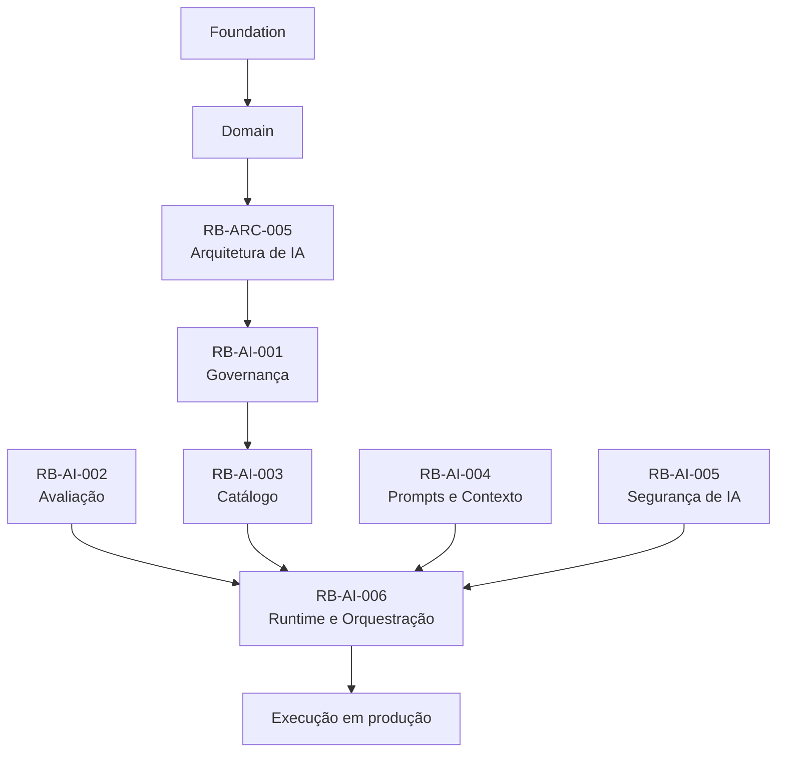
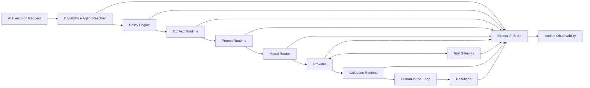
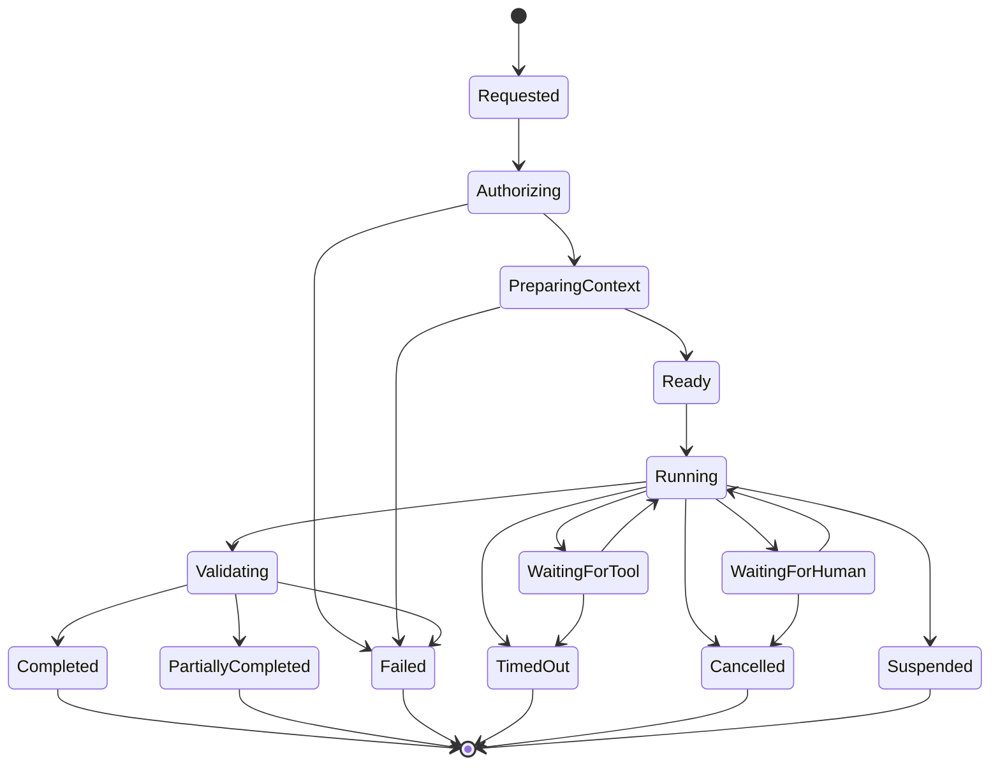
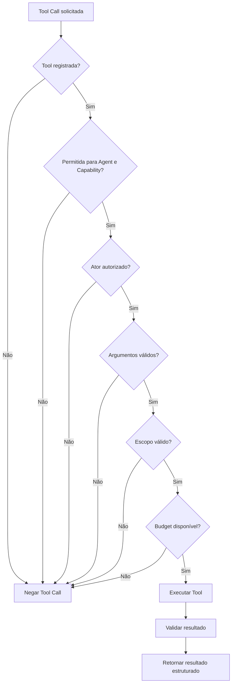
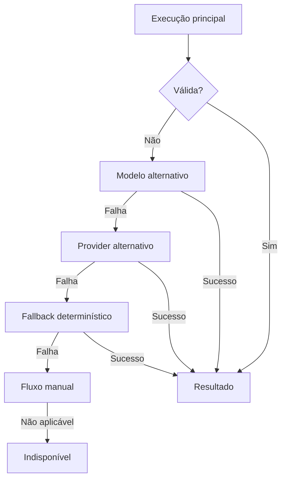

# RouteBook — Runtime, Orquestração e Execução de Agentes

## Parte I — Fundamentos

### 1. Propósito deste documento

Este documento define os padrões arquiteturais e operacionais do runtime responsável pela execução das capacidades de inteligência artificial e dos agentes do RouteBook.

Seu objetivo é estabelecer como solicitações de IA deverão ser:

* recebidas;
* autorizadas;
* classificadas;
* contextualizadas;
* orquestradas;
* executadas;
* limitadas;
* validadas;
* observadas;
* interrompidas;
* retomadas;
* concluídas;
* auditadas.

Este documento deverá orientar:

* Artificial Intelligence;
* Architecture;
* Backend;
* Platform;
* Security;
* Privacy;
* Data;
* Quality Engineering;
* Site Reliability Engineering;
* Product;
* agentes de engenharia;
* agentes operacionais;
* agentes de avaliação.

Este documento define:

* responsabilidades do AI Runtime;
* ciclo de execução;
* contratos de execução;
* estados;
* orquestração;
* Tool Calls;
* Contexto;
* budgets;
* concorrência;
* retries;
* timeouts;
* cancelamento;
* idempotência;
* checkpoints;
* Human-in-the-Loop;
* persistência operacional;
* observabilidade;
* segurança;
* resiliência;
* fallbacks;
* gestão de falhas;
* evolução.

Este documento não define:

* Provider definitivo;
* modelo definitivo;
* framework de agentes obrigatório;
* SDK obrigatório;
* implementação física do runtime;
* prompts completos;
* schemas finais de todas as capacidades;
* infraestrutura definitiva;
* detalhes comerciais dos Providers.

---

### 2. Autoridade documental

O runtime deverá respeitar:

* RouteBook Bible;
* Linguagem Ubíqua;
* Modelo de Domínio;
* Regras e Invariantes;
* Arquitetura de IA e Agentes;
* Governança de IA;
* Estratégia de Avaliação;
* Catálogo de Capacidades;
* Padrões de Prompts e Contexto;
* Segurança de IA;
* Observabilidade;
* Operação;
* Confiabilidade.



Nenhuma implementação do runtime poderá:

* redefinir conceitos do domínio;
* contornar autorização;
* alterar ownership;
* ampliar autonomia implicitamente;
* transformar Recommendation em Decision;
* aplicar Itinerary Proposal sem caso de uso autorizado;
* ignorar Planning Conflict;
* criar identificadores canônicos;
* operar sem rastreabilidade.

---

### 3. Princípio central

O runtime deverá controlar a execução do agente.

O agente não deverá controlar o runtime.

```text
Solicitação
→ autorização
→ policy
→ contexto
→ execução limitada
→ validação
→ aprovação humana quando exigida
→ resultado
```

---

### 4. Responsabilidade do runtime

O runtime deverá ser responsável por:

* carregar a Capability;
* carregar o Agent;
* validar versões;
* validar status;
* verificar risco;
* aplicar políticas;
* construir Contexto;
* selecionar Model Policy;
* selecionar Provider;
* montar Prompt Package;
* disponibilizar Tools;
* impor budgets;
* executar;
* validar saídas;
* aplicar fallback;
* registrar telemetria;
* gerar auditoria;
* permitir cancelamento;
* acionar kill switch.

---

### 5. Agente como componente restrito

Um Agent deverá operar dentro de um envelope definido pelo runtime.

Esse envelope deverá limitar:

* capacidades;
* ferramentas;
* escopo;
* dados;
* duração;
* custo;
* passos;
* retries;
* efeitos;
* memória;
* delegação.

---

## Parte II — Componentes do runtime

### 6. AI Runtime

O AI Runtime representa o componente responsável pela coordenação completa da execução.

---

### 7. Capability Resolver

Responsável por:

* localizar Capability;
* validar status;
* carregar versão;
* carregar classificação de risco;
* carregar dependências;
* validar disponibilidade.

---

### 8. Agent Resolver

Responsável por:

* localizar Agent;
* validar versão;
* validar status;
* validar autonomia;
* validar Tools permitidas;
* validar limites.

---

### 9. Policy Engine

Responsável por aplicar:

* autorização;
* risco;
* quotas;
* delegação;
* Tool Policy;
* Provider Policy;
* Context Policy;
* Memory Policy;
* regras de suspensão.

---

### 10. Context Runtime

Responsável por:

* executar Context Builder;
* validar escopo;
* aplicar minimização;
* aplicar redaction;
* gerar Context Snapshot;
* controlar token budget.

---

### 11. Prompt Runtime

Responsável por:

* carregar Prompt;
* validar versão;
* compor instruções;
* inserir Contexto;
* inserir schemas;
* inserir Tools;
* gerar Prompt Package.

---

### 12. Model Router

Responsável por:

* aplicar Model Policy;
* selecionar modelo;
* selecionar Provider;
* considerar região;
* considerar custo;
* considerar disponibilidade;
* considerar risco;
* selecionar fallback.

---

### 13. Tool Gateway

Responsável por:

* expor apenas Tools autorizadas;
* validar argumentos;
* validar escopo;
* validar autorização;
* controlar timeout;
* controlar retry;
* controlar idempotência;
* registrar auditoria.

---

### 14. Validation Runtime

Responsável por:

* parsing;
* schema validation;
* reference validation;
* authorization validation;
* version validation;
* domain validation;
* safety validation.

---

### 15. Execution Store

Responsável por persistir estado operacional necessário para:

* acompanhamento;
* retomada;
* cancelamento;
* auditoria;
* diagnóstico;
* métricas.

Não deverá se tornar fonte canônica do domínio.

---

### 16. Fallback Manager

Responsável por:

* identificar falha;
* selecionar fallback;
* preservar segurança;
* registrar degradação;
* informar limitações.

---

## Parte III — Arquitetura conceitual

### 17. Fluxo principal



---

### 18. Separação de responsabilidades

O runtime não deverá concentrar:

* regras de domínio;
* persistência canônica;
* autorização específica de módulo;
* lógica de negócio;
* implementação física de Tools;
* definição de produto.

Ele deverá orquestrar componentes responsáveis.

---

### 19. Dependência de módulos

O runtime deverá acessar módulos somente por:

* portas;
* casos de uso;
* contratos;
* projeções autorizadas;
* Tools registradas.

---

### 20. Neutralidade de Provider

O runtime deverá abstrair diferenças entre Providers por meio do AI Gateway e dos adapters.

---

## Parte IV — Contrato de solicitação

### 21. AI Execution Request

Toda execução deverá iniciar a partir de uma solicitação estruturada.

```yaml
execution_request:
  execution_id: AI-EXE-000
  capability_id: AI-CAP-000
  capability_version: "0.1.0"
  requested_by:
    actor_id: null
    actor_type: user
    account_id: null
  scope:
    trip_id: null
    resource_ids: []
  input: {}
  delegation_reference: null
  idempotency_key: null
  correlation_id: null
  requested_at: null
```

---

### 22. Campos obrigatórios

* executionId;
* capabilityId;
* ator;
* Account;
* input;
* correlationId;
* horário.

---

### 23. Escopo

O escopo deverá declarar os recursos que poderão ser acessados.

---

### 24. Idempotency Key

Deverá ser obrigatória quando a execução puder:

* criar artefato persistido;
* registrar candidato;
* iniciar workflow;
* solicitar Tool com efeito;
* ser repetida por retry externo.

---

### 25. Delegação

A referência de delegação deverá ser validada antes da execução.

---

## Parte V — Estados de execução

### 26. Estados canônicos do runtime

```text
requested
authorizing
preparing_context
ready
running
waiting_for_tool
waiting_for_human
validating
completed
partially_completed
failed
cancelled
timed_out
suspended
```

---

### 27. Ciclo de vida



---

### 28. Transições controladas

Apenas o runtime poderá alterar o estado operacional da execução.

---

### 29. Estados terminais

São terminais:

* completed;
* partially_completed;
* failed;
* cancelled;
* timed_out;
* suspended.

---

### 30. Resultado parcial

Somente deverá ser permitido quando:

* a Capability aceitar;
* a segurança estiver preservada;
* o schema suportar;
* as limitações estiverem explícitas.

---

## Parte VI — Preparação da execução

### 31. Validações iniciais

Antes de executar, validar:

* Capability existente;
* Capability ativa;
* Agent ativo;
* versões compatíveis;
* risco;
* autorização;
* Account;
* escopo;
* quota;
* budget;
* kill switch;
* Provider disponível;
* fallback disponível.

---

### 32. Falha de preparação

A execução não deverá chamar o modelo quando falhar em:

* autorização;
* policy;
* escopo;
* versão;
* quota;
* suspensão;
* Context Builder.

---

### 33. Registro inicial

O Execution Store deverá registrar a execução antes da primeira chamada externa.

---

### 34. Snapshot de configuração

A execução deverá registrar as versões efetivamente resolvidas.

```yaml
execution_configuration:
  capability_id: AI-CAP-000
  capability_version: "0.1.0"
  agent_id: AI-AGT-000
  agent_version: "0.1.0"
  prompt_id: AI-PRM-000
  prompt_version: "0.1.0"
  context_builder_id: AI-CTX-000
  context_builder_version: "0.1.0"
  schema_id: AI-SCH-000
  schema_version: "0.1.0"
  model_policy_id: AI-MPOL-000
  tool_policy_version: "0.1.0"
```

---

## Parte VII — Orquestração

### 35. Orquestração determinística

O fluxo geral deverá ser controlado por código, workflow ou state machine.

O modelo não deverá decidir livremente:

* estado da execução;
* aprovação;
* retry ilimitado;
* Tool disponível;
* budget;
* término;
* suspensão.

---

### 36. Orquestração orientada a capacidade

Cada Capability deverá possuir uma estratégia de execução registrada.

---

### 37. Tipos de estratégia

* single-shot;
* tool-assisted;
* staged;
* planner-executor;
* evaluator-reviser;
* human-gated;
* asynchronous.

---

### 38. Single-shot

Utilizado quando:

* não há Tools;
* não há múltiplas etapas;
* risco é baixo;
* resultado é simples.

---

### 39. Tool-assisted

Utilizado quando o Agent necessita consultar dados autorizados.

---

### 40. Staged

Divide a execução em fases determinísticas.

Exemplo:

```text
interpretar intenção
→ recuperar candidatos
→ avaliar candidatos
→ gerar Recommendation
```

---

### 41. Planner-executor

Somente deverá ser utilizado quando houver benefício comprovado.

O plano gerado deverá ser tratado como candidato e validado antes da execução.

---

### 42. Evaluator-reviser

Poderá ser utilizado para melhorar saídas, respeitando:

* limite de iterações;
* budget;
* validação;
* independência do gate crítico;
* observabilidade.

---

### 43. Human-gated

Obrigatório quando houver:

* aceite;
* confirmação;
* delegação;
* risco relevante;
* efeito posterior.

---

### 44. Multiagente

Não deverá ser adotado como padrão.

Exige:

* ADR;
* protocolo;
* limite de comunicação;
* prevenção de loops;
* orçamento;
* avaliação;
* segurança;
* observabilidade.

---

## Parte VIII — Execução de agentes

### 45. Agent Run

Cada invocação do Agent deverá possuir um identificador próprio.

```yaml
agent_run:
  agent_run_id: AI-RUN-000
  execution_id: AI-EXE-000
  agent_id: AI-AGT-000
  agent_version: "0.1.0"
  started_at: null
  completed_at: null
  step_count: 0
  tool_call_count: 0
  status: running
```

---

### 46. Passo de agente

Cada passo relevante deverá registrar:

* índice;
* tipo;
* Tool;
* resultado;
* custo;
* duração;
* status.

---

### 47. Tipos de passo

```text
model_invocation
tool_call
validation
human_checkpoint
fallback
completion
```

---

### 48. Limites de passos

O runtime deverá interromper a execução ao atingir `maxSteps`.

---

### 49. Progresso

A execução deverá demonstrar progresso mensurável.

Chamadas equivalentes sem alteração de estado deverão ser consideradas loop.

---

### 50. Cadeia interna de raciocínio

O runtime não deverá depender da persistência ou exposição da cadeia interna de raciocínio do modelo.

Deverá registrar apenas:

* decisões operacionais;
* Tool Calls;
* resultados;
* validações;
* Reasons estruturados quando aplicável.

---

## Parte IX — Tool Calls

### 51. Solicitação de Tool

Uma Tool Call deverá possuir:

```yaml
tool_call:
  tool_call_id: AI-TCALL-000
  execution_id: AI-EXE-000
  agent_run_id: AI-RUN-000
  tool_id: AI-TOL-000
  tool_version: "0.1.0"
  arguments: {}
  requested_at: null
```

---

### 52. Pipeline de Tool Call



---

### 53. Tool Result

```yaml
tool_result:
  tool_call_id: AI-TCALL-000
  status: success
  data: {}
  error: null
  retryable: false
  duration_ms: 0
  completed_at: null
```

---

### 54. Resultado não confiável

Tool Result deverá ser tratado como dado sujeito a validação.

---

### 55. Tool com efeito

Tools com efeito deverão possuir:

* autorização explícita;
* idempotência;
* auditoria;
* confirmação quando exigida;
* rollback ou compensação;
* resultado verificável.

---

### 56. Tool indisponível

O runtime deverá decidir entre:

* retry;
* Tool alternativa;
* fallback;
* resultado parcial;
* falha.

---

## Parte X — Budgets e limites

### 57. Tipos de budget

* tempo;
* tokens;
* custo;
* passos;
* Tool Calls;
* retries;
* concorrência;
* tamanho de Contexto.

---

### 58. Budget por execução

```yaml
execution_budget:
  timeout_ms: 30000
  max_input_tokens: 10000
  max_output_tokens: 2000
  max_cost: null
  max_steps: 8
  max_tool_calls: 5
  max_retries: 1
```

---

### 59. Budget por Capability

Deverá ser definido no catálogo.

---

### 60. Budget por Account

Poderá limitar:

* volume;
* custo;
* concorrência;
* capacidades premium;
* abuso.

---

### 61. Consumo de budget

O runtime deverá calcular o consumo antes de iniciar cada nova etapa.

---

### 62. Budget insuficiente

Deverá resultar em:

* finalização parcial;
* fallback;
* modelo alternativo;
* interrupção;
* erro estruturado.

---

### 63. Proibição

O Agent não poderá alterar seu próprio budget.

---

## Parte XI — Timeouts

### 64. Tipos de timeout

* execução total;
* Provider;
* Tool;
* Context Builder;
* Human checkpoint;
* fila;
* validação.

---

### 65. Timeout total

Deverá considerar toda a execução, não apenas a chamada do modelo.

---

### 66. Timeout de Tool

Deverá ser específico por Tool.

---

### 67. Timeout humano

Workflows `waiting_for_human` deverão possuir:

* prazo;
* expiração;
* comportamento após expiração;
* notificação;
* cancelamento.

---

### 68. Resposta ao timeout

Poderá:

* cancelar;
* aplicar fallback;
* retornar parcial;
* reencaminhar para processamento assíncrono.

---

## Parte XII — Retries

### 69. Princípio

Retry deverá ser explícito, limitado e consciente do tipo de erro.

---

### 70. Erros retryable

Exemplos:

* timeout transitório;
* rate limit;
* erro 5xx;
* falha temporária de rede.

---

### 71. Erros não retryable

Exemplos:

* autorização negada;
* schema incompatível;
* regra violada;
* ID inválido;
* Tool proibida;
* budget excedido;
* Capability suspensa.

---

### 72. Backoff

Retries deverão utilizar backoff e jitter quando aplicável.

---

### 73. Retry do modelo

Não deverá repetir a mesma solicitação indefinidamente.

---

### 74. Retry com reparo

Somente poderá ocorrer quando a falha for estrutural e reparável.

---

### 75. Idempotência de retry

A repetição não deverá produzir efeito duplicado.

---

## Parte XIII — Concorrência

### 76. Controle de concorrência

Deverá existir por:

* Account;
* User;
* Trip;
* Capability;
* Agent;
* Provider;
* Tool.

---

### 77. Execuções concorrentes sobre a mesma Trip

Deverão considerar:

* versões;
* estado;
* concorrência otimista;
* Proposal stale;
* conflitos.

---

### 78. Serialização

Poderá ser exigida para operações preparatórias que dependam da mesma versão de Itinerary.

---

### 79. Limites de Provider

O Model Router deverá respeitar quotas e rate limits.

---

### 80. Backpressure

O runtime deverá recusar ou enfileirar novas execuções quando a capacidade estiver saturada.

---

## Parte XIV — Execução síncrona e assíncrona

### 81. Execução síncrona

Adequada quando:

* latência é interativa;
* fluxo é curto;
* não há Human checkpoint prolongado;
* não há muitas Tools;
* resultado é imediato.

---

### 82. Execução assíncrona

Adequada quando:

* execução é longa;
* há múltiplas etapas;
* há fila;
* há revisão humana;
* há custo elevado;
* há resiliência por checkpoint.

---

### 83. Status assíncrono

O consumidor deverá poder consultar:

* status;
* progresso;
* resultado;
* erro;
* expiração;
* cancelamento.

---

### 84. Notificação

A conclusão poderá gerar evento ou notificação.

---

### 85. Segurança

Execução assíncrona deverá revalidar autorização antes de qualquer ação relevante após espera prolongada.

---

## Parte XV — Checkpoints e retomada

### 86. Checkpoint

Checkpoint representa um ponto seguro de retomada operacional.

---

### 87. Quando utilizar

* workflow longo;
* Tool externa;
* Human-in-the-Loop;
* processamento assíncrono;
* execução custosa;
* risco de timeout.

---

### 88. Conteúdo do checkpoint

```yaml
execution_checkpoint:
  checkpoint_id: AI-CHK-000
  execution_id: AI-EXE-000
  state: waiting_for_human
  step_index: 4
  context_snapshot_id: CTX-SNP-000
  configuration_hash: null
  expires_at: null
  created_at: null
```

---

### 89. Dados proibidos

Checkpoint não deverá persistir:

* secrets;
* cadeia interna de raciocínio;
* dados integrais desnecessários;
* Tool credentials;
* Prompt Package completo sem política.

---

### 90. Retomada

Antes de retomar, validar:

* expiração;
* autorização;
* versões;
* status;
* kill switch;
* risco;
* recursos afetados.

---

### 91. Configuração alterada

Se Prompt, Agent, Tool Policy ou Capability mudarem durante a espera, o runtime deverá:

* retomar com configuração original quando segura;
* migrar explicitamente;
* cancelar;
* reiniciar execução.

---

## Parte XVI — Cancelamento

### 92. Cancelamento solicitado

Poderá ser solicitado por:

* User;
* operador;
* sistema;
* timeout;
* kill switch;
* Policy Engine.

---

### 93. Cancelamento cooperativo

O runtime deverá verificar sinais de cancelamento entre etapas.

---

### 94. Tool em andamento

O cancelamento deverá considerar se a Tool:

* pode ser interrompida;
* já produziu efeito;
* exige compensação;
* exige auditoria.

---

### 95. Resultado do cancelamento

Deverá informar:

* estado;
* efeitos já produzidos;
* compensações;
* limitações;
* possibilidade de nova tentativa.

---

## Parte XVII — Human-in-the-Loop

### 96. Human checkpoint

Representa uma pausa controlada que exige decisão humana.

---

### 97. Tipos

* confirmação;
* edição;
* seleção;
* aprovação;
* revisão;
* aceite de risco.

---

### 98. Conteúdo apresentado

Deverá mostrar:

* ação proposta;
* recursos afetados;
* Reasons;
* limitações;
* risco;
* possibilidade de reversão;
* versão utilizada.

---

### 99. Resposta humana

```yaml
human_decision:
  checkpoint_id: AI-CHK-000
  actor_id: null
  decision: approved
  selected_items: []
  edits: {}
  reason: null
  decided_at: null
```

---

### 100. Revalidação

Após aprovação, o runtime deverá revalidar:

* autorização;
* versões;
* estado;
* escopo;
* expiração;
* regras.

---

### 101. Aprovação não é execução

A aprovação humana deverá autorizar um caso de uso, não permitir escrita direta pelo Agent.

---

## Parte XVIII — Validação de resultado

### 102. Resultado bruto

Nunca deverá ser entregue diretamente ao domínio ou persistência.

---

### 103. Etapas obrigatórias

* parsing;
* schema;
* semântica;
* referências;
* autorização;
* versões;
* domínio;
* segurança;
* classificação.

---

### 104. Resultado candidato

Após validação, o resultado deverá ser tratado como candidato.

---

### 105. Resultado final

Somente deverá ser considerado final após:

* validação;
* transformação necessária;
* registro;
* comunicação das limitações;
* aprovação humana quando exigida.

---

### 106. Rejeição

A rejeição deverá possuir código estruturado.

```yaml
validation_failure:
  category: domain
  error_code: RB_AI_RESTRICTION_VIOLATION
  retryable: false
  fallback_allowed: true
```

---

## Parte XIX — Fallbacks

### 107. Princípio

Fallback deverá reduzir dependência sem reduzir segurança.

---

### 108. Tipos

* modelo alternativo;
* Provider alternativo;
* prompt alternativo;
* regra determinística;
* template;
* fluxo manual;
* indisponibilidade explícita.

---

### 109. Seleção

O Fallback Manager deverá considerar:

* causa;
* risco;
* Capability;
* custo;
* latência;
* disponibilidade;
* compatibilidade.

---

### 110. Fallback em cascata



---

### 111. Limite de fallback

A cadeia deverá possuir quantidade máxima de tentativas.

---

### 112. Provenance

O resultado deverá indicar qual fallback foi utilizado.

---

## Parte XX — Resiliência

### 113. Falha isolada

Falha de uma Capability não deverá derrubar:

* API principal;
* autenticação;
* leitura da Trip;
* edição manual;
* funções determinísticas.

---

### 114. Circuit breakers

Deverão existir para:

* Provider;
* modelo;
* Tool externa;
* Context Source;
* memória;
* avaliação externa.

---

### 115. Bulkheads

Recursos deverão ser isolados por:

* Capability;
* Provider;
* workload;
* prioridade;
* ambiente.

---

### 116. Degradação controlada

Deverá preservar:

* leitura;
* edição manual;
* regras;
* segurança;
* transparência.

---

### 117. Fail closed

Obrigatório quando houver falha de:

* autorização;
* isolamento;
* segurança;
* versão;
* domínio;
* Tool Policy.

---

### 118. Fail open

Somente poderá ser adotado para capacidade informativa de baixo risco, mediante decisão explícita.

---

## Parte XXI — Segurança do runtime

### 119. Princípios

* menor privilégio;
* menor autonomia;
* defesa em profundidade;
* isolamento;
* validação independente;
* auditabilidade;
* revogação rápida.

---

### 120. Credenciais

O runtime deverá utilizar credenciais específicas por:

* ambiente;
* Provider;
* Tool;
* função.

---

### 121. Secrets

Não deverão aparecer em:

* Prompt Package;
* Context Snapshot;
* Tool Result;
* logs;
* traces;
* erros.

---

### 122. Egress

Chamadas externas deverão ser limitadas a destinos aprovados.

---

### 123. Execução de código

Agents não deverão executar código arbitrário sem sandbox e governança específica.

---

### 124. Tool injection

Tool Results deverão ser tratados como dados não confiáveis.

---

### 125. Cross-account

Todos os acessos deverão validar Account fora do modelo.

---

## Parte XXII — Persistência operacional

### 126. Execution Record

```yaml
execution_record:
  execution_id: AI-EXE-000
  capability_id: AI-CAP-000
  agent_id: AI-AGT-000
  account_id_hash: null
  status: requested
  risk_level: AI-R1
  correlation_id: null
  started_at: null
  completed_at: null
  failure_code: null
  fallback_used: false
```

---

### 127. Dados permitidos

* metadados;
* versões;
* status;
* hashes;
* contadores;
* timestamps;
* referências;
* códigos de erro.

---

### 128. Dados restritos

Conteúdo integral somente poderá ser persistido quando:

* necessário;
* autorizado;
* minimizado;
* classificado;
* protegido;
* retido por período definido.

---

### 129. Retenção

Deverá variar conforme:

* risco;
* auditoria;
* privacidade;
* operação;
* custo;
* legislação.

---

### 130. Exclusão

A exclusão de Account ou Trip deverá alcançar artefatos operacionais relacionados conforme política.

---

## Parte XXIII — Eventos operacionais

### 131. Eventos sugeridos

```text
AIExecutionRequested
AIExecutionAuthorized
AIExecutionStarted
AIContextPrepared
AIToolCallRequested
AIToolCallCompleted
AIHumanDecisionRequested
AIHumanDecisionReceived
AIOutputRejected
AIFallbackActivated
AIExecutionCompleted
AIExecutionFailed
AIExecutionCancelled
AIExecutionTimedOut
AIExecutionSuspended
```

---

### 132. Natureza

Esses eventos representam operação do runtime e não deverão substituir eventos canônicos do domínio.

---

### 133. Correlação

Todo evento deverá preservar:

* executionId;
* correlationId;
* causationId;
* capabilityId;
* agentId;
* Account scope.

---

### 134. Dados sensíveis

Eventos não deverão carregar conteúdo integral por padrão.

---

## Parte XXIV — Observabilidade

### 135. Métricas obrigatórias

* execution count;
* success rate;
* failure rate;
* partial completion rate;
* cancellation rate;
* timeout rate;
* latency;
* token usage;
* cost;
* step count;
* Tool Call count;
* fallback rate;
* validation rejection rate;
* human approval rate.

---

### 136. Dimensões

* Capability;
* Agent;
* versão;
* modelo;
* Provider;
* risco;
* ambiente;
* status;
* fallback.

---

### 137. Tracing

Spans sugeridos:

```text
ai.execution
ai.authorization
ai.context.build
ai.prompt.assemble
ai.model.route
ai.provider.call
ai.tool.call
ai.output.validate
ai.human.wait
ai.fallback
```

---

### 138. Logs

Deverão registrar:

* estado;
* transição;
* versão;
* código;
* duração;
* contagem;
* hashes;
* correlação.

---

### 139. Dashboards

* AI Runtime Overview;
* Execution Latency;
* Agent Steps and Loops;
* Tool Calls;
* Provider Reliability;
* AI Cost;
* Validation Failures;
* Human Checkpoints;
* Fallback Usage.

---

### 140. Alertas

* falha elevada;
* timeout elevado;
* loop;
* custo anormal;
* Tool negada;
* Provider indisponível;
* fallback falhando;
* kill switch falhando;
* fila crescendo;
* execução presa.

---

## Parte XXV — Códigos de erro

### 141. Categorias

```text
authorization
policy
context
provider
tool
validation
domain
security
budget
timeout
cancellation
internal
```

---

### 142. Padrão

```text
RB_AI_<CATEGORY>_<CONDITION>
```

---

### 143. Exemplos

```text
RB_AI_AUTHORIZATION_DENIED
RB_AI_CAPABILITY_SUSPENDED
RB_AI_CONTEXT_INCOMPLETE
RB_AI_PROVIDER_TIMEOUT
RB_AI_TOOL_NOT_ALLOWED
RB_AI_REFERENCE_INVALID
RB_AI_VERSION_CONFLICT
RB_AI_BUDGET_EXCEEDED
RB_AI_EXECUTION_CANCELLED
```

---

### 144. Erro público e interno

O runtime deverá separar:

* mensagem pública;
* código;
* detalhe interno;
* retryability;
* fallback.

---

## Parte XXVI — Operação e incidentes

### 145. Runbooks relacionados

* AI Provider indisponível;
* custo anormal;
* schema rejection elevada;
* Agent loop;
* Tool failure;
* Context contamination;
* cross-account;
* memória contaminada;
* kill switch failure.

---

### 146. Contenção

Poderá suspender:

* Capability;
* Agent;
* Prompt;
* Model;
* Provider;
* Tool;
* Context Builder;
* Account;
* ambiente.

---

### 147. Execuções em andamento

Ao suspender, o runtime deverá decidir:

* cancelar;
* permitir término seguro;
* impedir próxima Tool;
* aplicar fallback;
* congelar checkpoint.

---

### 148. Evidências

Preservar:

* versões;
* estados;
* Tool Calls;
* códigos;
* correlação;
* budgets;
* timestamps;
* decisões humanas.

---

### 149. Reativação

Exige:

* correção;
* avaliação;
* regressão;
* runbook;
* observabilidade;
* aprovação;
* kill switch testado.

---

## Parte XXVII — Testes do runtime

### 150. Testes unitários

Cobrir:

* state machine;
* budgets;
* retry policy;
* timeout;
* cancellation;
* Tool Policy;
* fallback selection;
* version resolution.

---

### 151. Testes de integração

Cobrir:

* AI Gateway;
* Providers;
* Tool Gateway;
* Context Builders;
* Execution Store;
* events;
* observabilidade.

---

### 152. Testes de contrato

Cobrir:

* Provider adapters;
* Tools;
* schemas;
* eventos;
* Execution API;
* checkpoints.

---

### 153. Testes de concorrência

Cobrir:

* múltiplas execuções;
* mesma Trip;
* mesmo idempotencyKey;
* rate limit;
* backpressure;
* cancelamento concorrente.

---

### 154. Testes de resiliência

Cobrir:

* Provider timeout;
* Tool timeout;
* storage failure;
* partial outage;
* fila indisponível;
* circuit breaker;
* fallback.

---

### 155. Testes de segurança

Cobrir:

* autorização;
* cross-account;
* Tool escalation;
* prompt injection;
* secret exposure;
* egress;
* replay;
* idempotency bypass.

---

### 156. Testes de recuperação

Cobrir:

* checkpoint;
* retomada;
* expiração;
* rollback;
* cancelamento;
* execução presa.

---

## Parte XXVIII — Performance e capacidade

### 157. SLOs do runtime

Deverão existir para:

* disponibilidade;
* tempo de preparação;
* tempo total;
* persistência;
* Tool Gateway;
* cancelamento;
* kill switch.

---

### 158. Latência por fase

Medir separadamente:

* autorização;
* Context Builder;
* prompt assembly;
* fila;
* Provider;
* Tools;
* validação;
* Human wait.

---

### 159. Capacity planning

Considerar:

* execuções simultâneas;
* Tool Calls;
* tokens;
* custo;
* fila;
* storage;
* Provider quotas.

---

### 160. Prioridade

Capacidades poderão possuir prioridade distinta.

Exemplo:

* interação ativa;
* processamento em segundo plano;
* avaliação;
* reconciliação;
* batch.

---

### 161. Carga de avaliação

Workloads de avaliação não deverão competir sem controle com produção.

---

## Parte XXIX — Configuração

### 162. Configuração por ambiente

Deverá incluir:

* Providers;
* modelos;
* budgets;
* quotas;
* timeouts;
* fallbacks;
* kill switches;
* Tool allowlists;
* observabilidade.

---

### 163. Configuração como código

Deverá ser:

* versionada;
* revisada;
* validada;
* auditável;
* reversível.

---

### 164. Feature flags

Poderão controlar:

* Capability;
* Agent version;
* Prompt version;
* Provider;
* modelo;
* Tool;
* fallback.

---

### 165. Configuração dinâmica

Mudanças dinâmicas deverão preservar:

* autorização;
* validação;
* auditoria;
* rollback;
* consistência da execução.

---

## Parte XXX — Deployment

### 166. Estratégias

* canary;
* gradual rollout;
* shadow;
* blue-green;
* feature flag.

---

### 167. Unidade de rollout

Poderá ser:

* Capability;
* Agent;
* Prompt;
* modelo;
* Provider;
* Account;
* percentual de tráfego.

---

### 168. Compatibilidade

Deployment deverá validar:

* schemas;
* Tools;
* Context Builders;
* Execution Store;
* eventos;
* consumers;
* checkpoints existentes.

---

### 169. Execuções antigas

Execuções em andamento deverão manter configuração compatível ou ser encerradas com segurança.

---

### 170. Rollback

Deverá reverter conjunto coerente de componentes.

---

## Parte XXXI — Multiagente

### 171. Adoção excepcional

Multiagente deverá ser adotado apenas quando houver benefício mensurável.

---

### 172. Riscos

* loops;
* custo;
* perda de contexto;
* ampliação de autonomia;
* conflito;
* dificuldade de auditoria;
* propagação de erro.

---

### 173. Contrato entre agentes

Deverá possuir:

* protocolo;
* schema;
* objetivo;
* limite;
* Tool scope;
* timeout;
* responsabilidade.

---

### 174. Coordenador

Um runtime determinístico deverá coordenar agentes.

---

### 175. Delegação

Agent não poderá delegar permissão superior à própria.

---

### 176. Critério de interrupção

* número máximo de mensagens;
* número máximo de ciclos;
* budget;
* ausência de progresso;
* conflito;
* risco.

---

## Parte XXXII — Governança

### 177. Owner

O owner deste documento é:

```text
Artificial Intelligence
```

A manutenção deverá envolver:

* Architecture;
* Backend;
* Platform;
* Security;
* Privacy;
* Data;
* Quality Engineering;
* Site Reliability Engineering;
* Product.

---

### 178. Mudança relevante

Exige revisão quando alterar:

* estado;
* autonomia;
* Tool Policy;
* budgets;
* retry;
* timeout;
* checkpoints;
* Provider routing;
* fallback;
* persistência;
* eventos;
* segurança.

---

### 179. ADR obrigatório

Criar ADR para:

* multiagente;
* planner-executor;
* execução de código;
* sandbox;
* persistência extensa de Contexto;
* cross-region;
* autonomia R3;
* execução automática com efeito;
* novo mecanismo de memória.

---

### 180. Exceções

Deverão possuir:

* escopo;
* motivo;
* risco;
* owner;
* aprovador;
* mitigação;
* expiração;
* rollback.

---

### 181. Exceções proibidas

Não permitir exceções para:

* autorização;
* isolamento entre Accounts;
* proteção de secrets;
* Tool crítica sem controle;
* validação de referências;
* aplicação automática proibida;
* auditoria de ações críticas.

---

## Parte XXXIII — Templates oficiais

### 182. Template de estratégia de execução

```yaml
execution_strategy:
  execution_strategy_id: AI-EST-000
  capability_id: AI-CAP-000
  owner: Artificial Intelligence
  status: draft
  version: "0.1.0"
  strategy_type: tool-assisted
  synchronous: true
  max_steps: 5
  max_tool_calls: 3
  retry_policy_id: AI-RTRY-000
  timeout_policy_id: AI-TMO-000
  fallback_ids: []
  human_checkpoints: []
  checkpoint_policy: none
```

---

### 183. Template de retry policy

```yaml
retry_policy:
  retry_policy_id: AI-RTRY-000
  owner: Platform
  status: draft
  version: "0.1.0"
  maximum_attempts: 1
  retryable_error_codes: []
  backoff_strategy: exponential
  initial_delay_ms: 500
  maximum_delay_ms: 5000
  jitter: true
```

---

### 184. Template de timeout policy

```yaml
timeout_policy:
  timeout_policy_id: AI-TMO-000
  owner: Platform
  status: draft
  version: "0.1.0"
  execution_timeout_ms: 30000
  provider_timeout_ms: 20000
  tool_timeout_ms: 5000
  human_checkpoint_timeout_ms: null
```

---

### 185. Template de budget policy

```yaml
budget_policy:
  budget_policy_id: AI-BGT-000
  owner: Artificial Intelligence
  status: draft
  version: "0.1.0"
  max_input_tokens: null
  max_output_tokens: null
  max_cost_per_execution: null
  max_steps: null
  max_tool_calls: null
  max_retries: null
```

---

### 186. Template de kill switch

```yaml
kill_switch:
  kill_switch_id: AI-KSW-000
  owner: Platform
  status: active
  target_type: capability
  target_id: AI-CAP-000
  environments: []
  fallback_id: null
  activation_permissions: []
  audit_required: true
  last_tested_at: null
```

---

## Parte XXXIV — Anti-patterns

### 187. Agent controlando o workflow

O fluxo deverá permanecer no runtime.

---

### 188. Retry livre

Agentes não deverão decidir retries ilimitados.

---

### 189. Tool genérica

Não utilizar Tools irrestritas.

---

### 190. Estado somente em memória

Execuções longas deverão possuir persistência operacional adequada.

---

### 191. Checkpoint com dados integrais

Deverá ser evitado.

---

### 192. Aprovação humana sem revalidação

Estado pode mudar durante a espera.

---

### 193. Resultado bruto como comando

Structured Output deverá permanecer candidato.

---

### 194. Fallback inseguro

Não reduzir validação ou autorização.

---

### 195. Multiagente por tendência

Complexidade deverá ser justificada.

---

### 196. Timeout apenas no Provider

O tempo total deverá ser controlado.

---

### 197. Cancelamento fictício

O runtime deverá interromper etapas futuras e tratar efeitos já iniciados.

---

### 198. Configuração não versionada

Impede reprodução e rollback.

---

### 199. Execução sem correlationId

Impede rastreabilidade operacional.

---

### 200. Logs com conteúdo integral

Cria risco de exposição.

---

## Parte XXXV — Evolução

### 201. Fase inicial

* runtime central;
* execução síncrona;
* poucas Tools;
* state machine;
* budgets;
* timeouts;
* retries;
* fallback;
* observabilidade;
* kill switches.

---

### 202. Fase intermediária

* execução assíncrona;
* checkpoints;
* workflows human-gated;
* model routing;
* backpressure;
* policy-as-code;
* scorecards operacionais.

---

### 203. Fase avançada

Somente por evidência:

* multiagente;
* execução distribuída;
* sandbox;
* otimização dinâmica;
* seleção adaptativa de modelos;
* recuperação automatizada limitada;
* workloads multi-região.

---

### 204. Restrições de evolução

A evolução não deverá reduzir:

* segurança;
* clareza;
* auditabilidade;
* controle humano;
* portabilidade;
* reversibilidade;
* isolamento.

---

## Parte XXXVI — Rastreabilidade

### 205. Elemento e responsabilidade

| Elemento            | Responsabilidade               |
| ------------------- | ------------------------------ |
| Capability Resolver | localizar e validar Capability |
| Agent Resolver      | localizar e validar Agent      |
| Policy Engine       | autorização e políticas        |
| Context Runtime     | construir Contexto             |
| Prompt Runtime      | montar Prompt Package          |
| Model Router        | selecionar modelo e Provider   |
| Tool Gateway        | controlar Tools                |
| Validation Runtime  | validar saída                  |
| Execution Store     | persistir estado operacional   |
| Fallback Manager    | aplicar degradação segura      |

---

### 206. Risco e controle

| Risco                 | Controle                          |
| --------------------- | --------------------------------- |
| Agent loop            | maxSteps e progress detection     |
| custo excessivo       | budgets e quotas                  |
| Tool indevida         | allowlist e autorização           |
| execução stale        | version validation                |
| Provider indisponível | circuit breaker e fallback        |
| cross-account         | Policy Engine e Context isolation |
| resultado inválido    | Validation Runtime                |
| execução abandonada   | timeout e cancellation            |
| perda de estado       | checkpoints e Execution Store     |
| suspensão emergencial | kill switch                       |

---

### 207. Capability e estratégia inicial

| Capability                     | Estratégia sugerida          |
| ------------------------------ | ---------------------------- |
| Generate Travel Recommendation | tool-assisted                |
| Generate Itinerary Proposal    | staged e human-gated         |
| Explain Planning Conflict      | single-shot ou tool-assisted |
| Discover Places                | tool-assisted                |
| Reconcile Place Data           | staged e human-gated         |
| Summarize Trip Context         | single-shot                  |

---

## Parte XXXVII — Catálogo de diagramas

### 208. Diagramas desta versão

| ID conceitual     | Diagrama                  |
| ----------------- | ------------------------- |
| RB-DGM-AI-RUN-001 | Autoridade documental     |
| RB-DGM-AI-RUN-002 | Arquitetura do runtime    |
| RB-DGM-AI-RUN-003 | Ciclo de vida de execução |
| RB-DGM-AI-RUN-004 | Pipeline de Tool Call     |
| RB-DGM-AI-RUN-005 | Cadeia de fallback        |

---

### 209. Critério de inclusão

Os diagramas representam:

* autoridade;
* componentes;
* estados;
* Tool Calls;
* fallback.

Contratos operacionais foram representados em YAML para facilitar implementação e validação.

---

## Parte XXXVIII — Critérios de aceite

### 210. Componentes

* AI Runtime está definido;
* resolvers estão definidos;
* Policy Engine está definido;
* Context Runtime está definido;
* Prompt Runtime está definido;
* Model Router está definido;
* Tool Gateway está definido;
* Validation Runtime está definido;
* Execution Store está definido;
* Fallback Manager está definido.

---

### 211. Execução

* contrato de solicitação está definido;
* estados estão definidos;
* transições estão definidas;
* configuração está versionada;
* estratégias estão definidas;
* passos estão definidos;
* resultados estão definidos.

---

### 212. Controle

* budgets estão definidos;
* timeouts estão definidos;
* retries estão definidos;
* concorrência está definida;
* cancelamento está definido;
* checkpoints estão definidos;
* retomada está definida;
* Human-in-the-Loop está definido.

---

### 213. Tools e validação

* Tool Calls estão controladas;
* Tool Results estão definidos;
* autorização está definida;
* idempotência está definida;
* Validation Runtime está definido;
* erros estruturados estão definidos.

---

### 214. Resiliência

* fallbacks estão definidos;
* circuit breakers estão definidos;
* bulkheads estão definidos;
* modos degradados estão definidos;
* fail closed está definido;
* incidentes estão integrados;
* kill switches estão definidos.

---

### 215. Operação

* persistência operacional está definida;
* eventos estão definidos;
* métricas estão definidas;
* tracing está definido;
* alertas estão definidos;
* testes estão definidos;
* performance está definida;
* deployment está definido.

---

### 216. Governança

* owners estão definidos;
* ADRs estão definidos;
* exceções estão definidas;
* templates estão definidos;
* anti-patterns estão definidos;
* evolução está definida;
* rastreabilidade está presente.

---

## Parte XXXIX — Checklist final

### 217. Checklist documental

Antes de aprovar:

* frontmatter YAML é válido;
* existe apenas um H1;
* Partes utilizam H2;
* seções numeradas utilizam H3;
* propósito está definido;
* autoridade está definida;
* princípios estão definidos;
* componentes estão definidos;
* arquitetura está definida;
* contrato de solicitação está definido;
* estados estão definidos;
* ciclo de vida está definido;
* preparação está definida;
* orquestração está definida;
* estratégias estão definidas;
* execução de Agent está definida;
* Tool Calls estão definidas;
* budgets estão definidos;
* timeouts estão definidos;
* retries estão definidos;
* concorrência está definida;
* execução síncrona está definida;
* execução assíncrona está definida;
* checkpoints estão definidos;
* retomada está definida;
* cancelamento está definido;
* Human-in-the-Loop está definido;
* validação está definida;
* fallbacks estão definidos;
* resiliência está definida;
* segurança está definida;
* persistência operacional está definida;
* eventos estão definidos;
* observabilidade está definida;
* códigos de erro estão definidos;
* incidentes estão definidos;
* testes estão definidos;
* performance está definida;
* configuração está definida;
* deployment está definido;
* multiagente está governado;
* governança está definida;
* templates estão definidos;
* anti-patterns estão definidos;
* evolução está definida;
* rastreabilidade está presente;
* Mermaid renderiza no GitHub;
* os blocos de código não possuem atributos adicionais;
* não existem contradições com RB-CORE-0004;
* não existem contradições com RB-DOM-001;
* não existem contradições com RB-DOM-002;
* não existem contradições com RB-DOM-003;
* não existem contradições com RB-DOM-004;
* não existem contradições com RB-ARC-005;
* não existem contradições com RB-SEC-001;
* não existem contradições com RB-OBS-001;
* não existem contradições com RB-OPS-001;
* não existem contradições com RB-SRE-001;
* não existem contradições com RB-AI-001;
* não existem contradições com RB-AI-002;
* não existem contradições com RB-AI-003;
* não existem contradições com RB-AI-004;
* não existem contradições com RB-AI-005.

---

## Parte XL — Declaração final

### 218. Declaração do runtime

O runtime de inteligência artificial do RouteBook deverá ser responsável por controlar, limitar, observar e interromper a execução de agentes e capacidades.

Toda execução deverá:

* possuir identidade;
* possuir Capability;
* possuir Agent;
* possuir ator;
* possuir Account;
* possuir escopo;
* possuir versões;
* possuir budgets;
* possuir timeout;
* possuir política de retry;
* possuir validação;
* possuir observabilidade;
* permitir cancelamento;
* permitir suspensão.

Todo Agent deverá:

* operar dentro de allowlists;
* respeitar budgets;
* respeitar maxSteps;
* respeitar Tool Policy;
* respeitar autorização;
* respeitar escopo;
* respeitar kill switches;
* não alterar seu próprio nível de autonomia;
* não controlar livremente o workflow;
* não executar ações fora do runtime.

Toda Tool Call deverá:

* utilizar Tool registrada;
* possuir schema;
* possuir autorização;
* possuir escopo;
* possuir timeout;
* possuir idempotência quando aplicável;
* produzir resultado estruturado;
* ser auditada quando necessário.

Todo resultado deverá:

* passar por parsing;
* passar por schema validation;
* validar referências;
* validar autorização;
* validar versões;
* validar regras;
* validar segurança;
* permanecer candidato até ser processado por caso de uso autorizado.

Nenhuma implementação do runtime poderá:

* confiar no modelo como autoridade;
* permitir acesso cross-account;
* executar Tool irrestrita;
* permitir retry ilimitado;
* permitir loop sem interrupção;
* aplicar Itinerary Proposal automaticamente;
* registrar Decision automaticamente;
* ignorar Planning Conflict;
* criar IDs canônicos;
* expor secrets;
* persistir Contexto integral sem política;
* operar após kill switch;
* ocultar falhas;
* eliminar rastreabilidade.

O RouteBook deverá tratar agentes como componentes probabilísticos operando dentro de uma infraestrutura determinística, segura, observável e governada.
