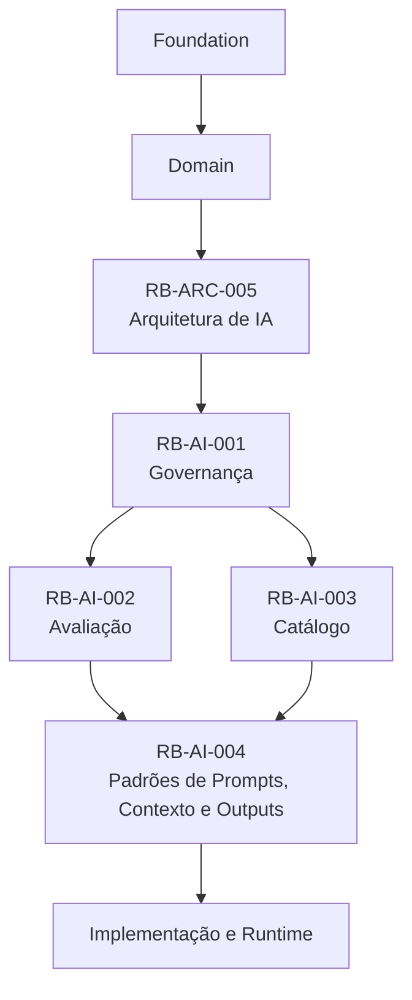
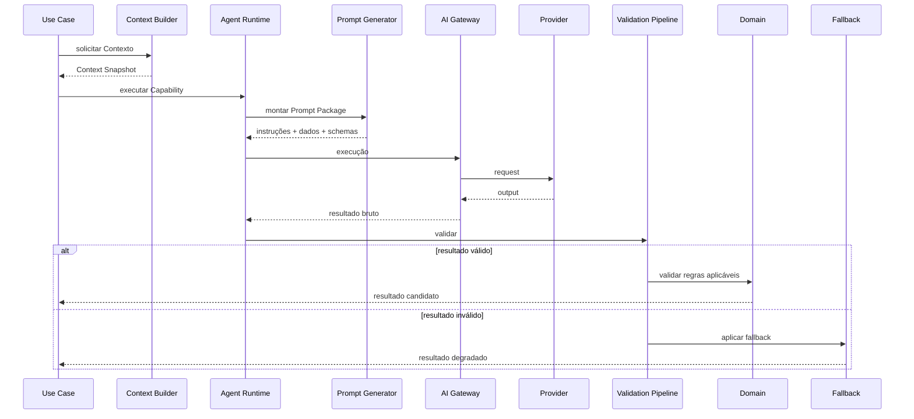
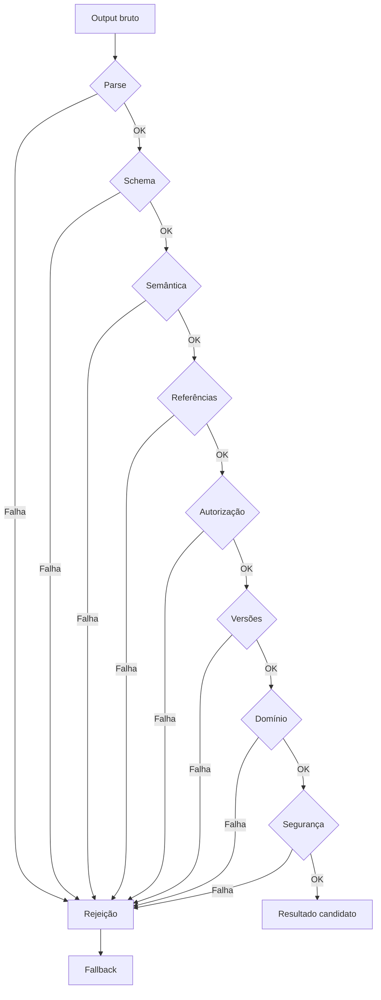

# RouteBook — Padrões de Prompts, Contexto e Structured Outputs

## Parte I — Fundamentos

### 1. Propósito deste documento

Este documento define os padrões oficiais para construção, versionamento, validação e operação dos contratos utilizados pelas capacidades de inteligência artificial do RouteBook.

Seu objetivo é estabelecer regras consistentes para:

* prompts;
* instruções de sistema;
* instruções de capacidade;
* Context Builders;
* Context Snapshots;
* dados externos;
* Structured Outputs;
* schemas de entrada e saída;
* Tool Calls;
* validação;
* reparo controlado;
* fallback;
* segurança;
* privacidade;
* testes;
* observabilidade;
* governança;
* evolução.

Este documento deverá orientar:

* Artificial Intelligence;
* Architecture;
* Domain;
* Backend;
* Platform;
* Security;
* Privacy;
* Data;
* Quality Engineering;
* Product;
* agentes de engenharia;
* agentes de avaliação;
* agentes operacionais.

Este documento não define:

* prompts finais completos de todas as capacidades;
* Provider definitivo;
* modelo definitivo;
* SDK obrigatório;
* framework obrigatório de agentes;
* formato físico final dos arquivos;
* implementação específica do AI Gateway;
* catálogo completo de schemas;
* catálogo completo de ferramentas.

---

### 2. Autoridade documental

Os padrões definidos aqui deverão respeitar:

* RouteBook Bible;
* Linguagem Ubíqua;
* Modelo de Domínio;
* Regras e Invariantes;
* Arquitetura de IA e Agentes;
* Governança de IA;
* Estratégia de Avaliação de IA;
* Catálogo de Capacidades, Agentes, Modelos e Ferramentas;
* Segurança;
* Privacidade;
* Qualidade;
* Observabilidade;
* Operação.



Nenhum prompt, Context Builder, schema ou Tool Call poderá:

* redefinir conceitos;
* alterar ownership;
* substituir regras;
* contornar autorização;
* ampliar autonomia;
* alterar estados canônicos diretamente;
* inventar identificadores;
* remover a autoridade do Usuário.

---

### 3. Princípio central

Prompts deverão orientar comportamento.

Context Builders deverão limitar conhecimento.

Schemas deverão limitar forma.

Validators deverão limitar efeitos.

```text
Prompt orienta
→ Contexto informa
→ modelo produz candidato
→ schema restringe
→ validators verificam
→ domínio autoriza
→ caso de uso executa
```

---

### 4. Prompt não é regra de negócio

Prompts poderão descrever regras para auxiliar o modelo, mas a autoridade final deverá permanecer em:

* Domain;
* Application;
* Authorization Policy;
* Tool Policy;
* validators;
* schemas;
* casos de uso.

---

### 5. Contexto não é banco de dados

O Contexto deverá representar apenas a informação necessária para a execução atual.

Ele não deverá ser uma cópia integral do estado do sistema.

---

### 6. Structured Output não é estado canônico

Structured Output representa um resultado candidato.

Ele somente poderá produzir efeito após:

* parsing;
* validação;
* autorização;
* verificação de referências;
* verificação de regras;
* execução por caso de uso.

---

### 7. Objetivos

Os padrões deverão:

1. reduzir ambiguidade;
2. aumentar previsibilidade;
3. preservar o domínio;
4. minimizar dados;
5. melhorar segurança;
6. evitar prompt injection;
7. permitir validação determinística;
8. facilitar testes;
9. facilitar rollback;
10. permitir múltiplos modelos;
11. permitir múltiplos Providers;
12. melhorar observabilidade;
13. reduzir custo e latência;
14. preservar rastreabilidade;
15. permitir evolução compatível.

---

## Parte II — Arquitetura dos contratos de IA

### 8. Elementos principais

Uma execução de IA deverá combinar:

* Capability;
* Agent;
* Prompt;
* Context Builder;
* Model Policy;
* Provider;
* Structured Output Schema;
* Tool Registry;
* Validation Pipeline;
* Evaluation Suite;
* Fallback.

---

### 9. Fluxo de execução



---

### 10. Prompt Package

Prompt Package representa o conjunto completo enviado ao modelo.

Ele poderá conter:

* System Instructions;
* Capability Instructions;
* Policy Instructions;
* Context Metadata;
* Domain Context;
* User Input;
* External Data;
* Tool Definitions;
* Output Schema;
* Failure Behavior.

---

### 11. Separação obrigatória

As partes deverão permanecer conceitualmente separadas.

Não misturar:

* política com dados;
* dados externos com instruções;
* input do Usuário com System Instructions;
* Tool output com política;
* schema com exemplos informais contraditórios.

---

## Parte III — Estrutura padrão de prompts

### 12. Camadas de instrução

A estrutura recomendada é:

1. System Layer;
2. Capability Layer;
3. Domain Policy Layer;
4. Context Layer;
5. User Request Layer;
6. Tool Layer;
7. Output Contract Layer;
8. Failure and Uncertainty Layer.

---

### 13. System Layer

Deverá definir apenas instruções permanentes do runtime, como:

* identidade funcional;
* limites globais;
* segurança;
* prioridade de instruções;
* proibição de tratar dados como políticas;
* obrigação de respeitar schemas.

Não deverá conter detalhes específicos de uma Trip.

---

### 14. Capability Layer

Deverá definir:

* objetivo;
* escopo;
* comportamento esperado;
* comportamento proibido;
* resultado esperado;
* limite de autonomia.

Exemplo conceitual:

```text
Você executa a Capability GenerateItineraryProposal.

Seu objetivo é produzir uma proposta revisável.
Você não pode alterar o Itinerary.
Você não pode mover Activities fixed.
Você não pode preencher Free Periods protected.
Você deve utilizar apenas referências fornecidas no Contexto.
```

---

### 15. Domain Policy Layer

Deverá resumir regras aplicáveis à execução.

Exemplos:

* Restrictions mandatory não podem ser violadas;
* Recommendation não é Decision;
* Proposed Activity não é Activity;
* Planning Conflict error não pode ser ignored;
* versão stale deve ser rejeitada.

Essas instruções ajudam o modelo, mas não substituem validação externa.

---

### 16. Context Layer

Deverá conter somente dados autorizados, minimizados e versionados.

---

### 17. User Request Layer

Deverá preservar a intenção atual do Usuário sem permitir que ela substitua políticas superiores.

---

### 18. Tool Layer

Deverá definir apenas Tools permitidas para a execução atual.

---

### 19. Output Contract Layer

Deverá declarar:

* schema;
* campos obrigatórios;
* enums;
* limites;
* proibição de campos extras;
* comportamento quando faltarem dados.

---

### 20. Failure and Uncertainty Layer

Deverá instruir o modelo a:

* não inventar dados;
* declarar limitações;
* produzir resultado parcial quando permitido;
* solicitar dado faltante apenas quando necessário;
* utilizar fallback quando definido;
* retornar erro estruturado quando não puder continuar.

---

## Parte IV — Regras de escrita de prompts

### 21. Clareza

Instruções deverão ser:

* diretas;
* específicas;
* consistentes;
* verificáveis;
* sem ambiguidades desnecessárias.

---

### 22. Linguagem oficial

Prompts deverão utilizar a Linguagem Ubíqua oficial.

Preferir:

```text
Itinerary Proposal
Planning Conflict
Recommendation
Decision
Activity
Free Period
Restriction
```

Evitar sinônimos não canônicos quando houver conceito definido.

---

### 23. Uma regra por instrução

Evitar instruções longas que combinem múltiplas regras.

Preferir:

```text
Não mova Activities fixed.
Não preencha Free Periods protected.
Não crie PlaceIds.
```

---

### 24. Comandos verificáveis

Preferir instruções que possam ser testadas.

Exemplo:

```text
Utilize apenas PlaceIds presentes em allowedPlaceIds.
```

É melhor do que:

```text
Escolha locais confiáveis.
```

---

### 25. Negativas e positivas

Quando necessário, combinar:

* o que fazer;
* o que não fazer;
* como agir quando a condição ocorrer.

---

### 26. Exemplos

Exemplos poderão ser utilizados para:

* formato;
* enum;
* classificação;
* comportamento de erro;
* diferenciação de conceitos.

Não deverão:

* contradizer schemas;
* substituir regras;
* conter dados sensíveis;
* induzir memorização de casos de avaliação.

---

### 27. Delimitadores

Dados externos e inputs deverão ser delimitados claramente.

Exemplo:

```text
<external_place_description>
...
</external_place_description>
```

---

### 28. Instruções em conteúdo externo

O prompt deverá declarar explicitamente que qualquer instrução encontrada dentro de:

* reviews;
* páginas;
* descrições;
* documentos;
* Tool outputs;
* memórias

deve ser tratada como dado não confiável.

---

### 29. Prompts monolíticos

Deverão ser evitados.

Preferir composição por módulos versionados.

---

### 30. Contradições

O pipeline deverá detectar, quando possível:

* instruções incompatíveis;
* schema divergente;
* enum divergente;
* escopo de Tool incompatível;
* versão de domínio incompatível.

---

## Parte V — Template oficial de Prompt Package

### 31. Estrutura conceitual

```yaml
prompt_package:
  metadata:
    capability_id: AI-CAP-000
    capability_version: "0.1.0"
    prompt_id: AI-PRM-000
    prompt_version: "0.1.0"
    schema_id: AI-SCH-000
    schema_version: "0.1.0"
    context_snapshot_id: null

  system_instructions: []
  capability_instructions: []
  domain_policies: []
  context_metadata: {}
  domain_context: {}
  user_request: {}
  external_data: []
  tools: []
  output_contract: {}
  failure_behavior: {}
```

---

### 32. Metadados obrigatórios

O Prompt Package deverá registrar:

* capabilityId;
* capabilityVersion;
* agentId;
* agentVersion;
* promptId;
* promptVersion;
* schemaId;
* schemaVersion;
* Context Snapshot;
* Model Policy;
* correlationId.

---

### 33. Versionamento independente

Prompt, schema e Context Builder deverão possuir versões independentes.

Uma mudança de prompt não deverá exigir alteração de schema quando o contrato permanecer igual.

---

## Parte VI — Context Engineering

### 34. Context Builder

Context Builder é responsável por selecionar, transformar, minimizar e versionar os dados utilizados por uma Capability.

---

### 35. Responsabilidades

Deverá:

1. identificar a Capability;
2. identificar o ator;
3. validar autorização;
4. identificar o escopo;
5. consultar módulos proprietários;
6. selecionar atributos;
7. aplicar redaction;
8. aplicar Freshness Policy;
9. resumir quando necessário;
10. registrar versões;
11. gerar Context Snapshot;
12. calcular hash;
13. respeitar token budget.

---

### 36. Fontes autorizadas

Somente Fontes registradas no catálogo poderão compor o Contexto.

---

### 37. Estado canônico

Dados canônicos deverão ser recuperados do módulo proprietário.

Exemplos:

* Trip → Trip Management;
* Restriction → Traveler Profile;
* Place → Place Catalog;
* Activity → Itinerary Planning;
* Planning Conflict → Planning Assurance.

---

### 38. Projeções

Read Models poderão ser usados quando:

* sua natureza derivada estiver explícita;
* a versão estiver disponível;
* o atraso for aceitável;
* a Capability tolerar eventual consistency.

---

### 39. Dados externos

Deverão preservar:

* Data Source;
* Provenance;
* Freshness;
* Confidence;
* horário de coleta;
* precisão.

---

### 40. Memória

Memória somente poderá compor o Contexto quando:

* registrada;
* autorizada;
* aplicável à finalidade;
* dentro da retenção;
* não contraditória com estado canônico.

---

### 41. Prioridade das fontes

Ordem recomendada:

1. políticas e regras;
2. intenção atual;
3. estado canônico;
4. Restrictions;
5. versões;
6. dados contextuais;
7. dados externos;
8. memória autorizada;
9. histórico resumido.

---

### 42. Contexto mínimo

O Context Builder deverá responder:

```text
Qual é o menor conjunto de dados capaz de permitir uma resposta segura?
```

---

### 43. Contexto excessivo

É falha quando:

* aumenta risco de privacidade;
* aumenta custo sem benefício;
* aumenta ambiguidade;
* inclui dados irrelevantes;
* inclui histórico integral;
* inclui dados de outra finalidade.

---

### 44. Contexto insuficiente

É falha quando remove:

* Restriction obrigatória;
* versão;
* identidade do recurso;
* regra aplicável;
* evidência necessária;
* timezone;
* validade temporal.

---

## Parte VII — Context Snapshot

### 45. Definição

Context Snapshot representa a visão imutável utilizada em uma execução.

---

### 46. Campos conceituais

```yaml
context_snapshot:
  context_snapshot_id: CTX-SNP-000
  capability_id: AI-CAP-000
  trip_id: null
  trip_context_version: null
  itinerary_version: null
  context_builder_id: AI-CTX-000
  context_builder_version: "0.1.0"
  captured_at: null
  classification: internal
  context_hash: null
  source_references: []
  payload_reference: null
  expires_at: null
```

---

### 47. Imutabilidade

Após utilizado em uma execução, o snapshot não deverá ser alterado.

---

### 48. Retenção

A retenção deverá depender de:

* risco;
* auditoria;
* privacidade;
* necessidade de reprodução;
* política jurídica;
* custo.

---

### 49. Payload

O payload completo não deverá ser persistido quando hash e referências forem suficientes.

---

### 50. Reprodutibilidade

Capacidades críticas deverão permitir reconstruir o contexto dentro dos limites de retenção.

---

## Parte VIII — Minimização e redaction

### 51. Dados pessoais

Preferir atributos funcionais.

Exemplo:

```text
ageRange: child
mobilityProfile: reduced
dietaryRestriction: mandatory
```

Evitar:

```text
nome completo
data de nascimento
documento
telefone
email
```

---

### 52. Localização

Utilizar a precisão mínima necessária.

Exemplos:

* Place;
* bairro;
* geohash reduzido;
* região aproximada.

Evitar coordenada precisa sem necessidade.

---

### 53. Dados de menores

Deverão ser minimizados e generalizados.

---

### 54. Secrets

Nunca poderão ser incluídos.

---

### 55. Redaction centralizada

A redaction deverá ser implementada por componente central ou policy reutilizável.

---

### 56. Testes de redaction

Deverão cobrir:

* campos conhecidos;
* nested fields;
* headers;
* Tool outputs;
* exceptions;
* logs;
* snapshots.

---

## Parte IX — Token budget e compressão

### 57. Token budget

Cada Context Builder deverá possuir limite explícito.

---

### 58. Distribuição sugerida

O budget poderá ser dividido entre:

* instruções;
* regras;
* Contexto;
* Tools;
* output;
* margem de segurança.

---

### 59. Estratégias de redução

* remover dados irrelevantes;
* utilizar IDs e estruturas;
* resumir histórico;
* limitar candidatos;
* reduzir duplicação;
* remover exemplos não necessários;
* utilizar campos compactos.

---

### 60. Resumo assistido

Um resumo gerado por IA deverá:

* preservar Provenance;
* ser validado;
* ser tratado como derivado;
* não substituir dados críticos.

---

### 61. Truncamento

Truncamento silencioso não deverá remover regras ou Restrictions.

---

### 62. Ordem de remoção

Quando necessário reduzir Contexto:

1. exemplos opcionais;
2. histórico antigo;
3. candidatos de menor relevância;
4. descrições longas;
5. metadados não essenciais.

Nunca remover primeiro:

* regras;
* restrições;
* versões;
* autorização;
* schema.

---

## Parte X — Structured Outputs

### 63. Obrigatoriedade

Structured Output deverá ser obrigatório quando a saída:

* alimenta outro componente;
* referencia entidades;
* gera Recommendation;
* gera Itinerary Proposal;
* solicita Tool;
* produz classificação;
* produz candidato de reconciliação;
* pode gerar efeito posterior.

---

### 64. Características

Schemas deverão ser:

* versionados;
* restritivos;
* documentados;
* compatíveis;
* testáveis;
* independentes de Provider.

---

### 65. Tipos e enums

Utilizar tipos claros e enums controlados.

Evitar valores livres quando o domínio já define opções.

---

### 66. Required

Campos obrigatórios deverão ser realmente necessários para processar o resultado.

---

### 67. Additional properties

Para contratos críticos:

```yaml
additionalProperties: false
```

ou equivalente deverá ser preferido.

---

### 68. Limites

Definir:

* tamanho máximo;
* quantidade máxima de itens;
* comprimento de texto;
* range numérico;
* padrão de identificador;
* formato temporal.

---

### 69. IDs

IDs produzidos deverão ser:

* referências fornecidas;
* validadas;
* pertencentes ao escopo;
* do tipo correto.

O modelo não poderá gerar novos IDs canônicos.

---

### 70. Campos de texto

Deverão possuir finalidade clara.

Evitar campos genéricos como:

```text
metadata
data
extra
details
```

sem contrato específico.

---

### 71. Discriminated unions

Quando existirem múltiplos tipos de operação, utilizar discriminador.

Exemplo:

```yaml
operationType:
  enum:
    - add
    - move
    - update
    - remove
```

---

### 72. Erros estruturados

Capacidades poderão retornar:

```yaml
status: unable_to_complete
reason_code: insufficient_context
missing_fields:
  - destination
limitations: []
```

---

## Parte XI — Padrão de schema de saída

### 73. Metadados

Schemas deverão possuir:

```yaml
schema_metadata:
  schema_id: AI-SCH-000
  title: Nome
  version: "0.1.0"
  owner: Module
  capability_ids: []
  compatibility: backward-compatible
  strict: true
```

---

### 74. Envelope

Quando necessário, utilizar envelope consistente:

```yaml
result:
  status: success
  data: {}
  limitations: []
  warnings: []
```

---

### 75. Status permitidos

Exemplo:

```text
success
partial
unable_to_complete
rejected
```

---

### 76. Warnings

Warnings não deverão substituir erros críticos.

---

### 77. Limitations

Limitações deverão ser objetivas e relacionadas aos dados ou execução.

---

## Parte XII — Compatibilidade de schemas

### 78. Mudança compatível

Exemplos:

* novo campo opcional;
* novo enum somente quando consumidor tolera;
* aumento de limite;
* melhoria de descrição.

---

### 79. Mudança incompatível

Exemplos:

* remover campo;
* tornar opcional em obrigatório;
* mudar tipo;
* mudar semântica;
* renomear campo;
* alterar enum sem compatibilidade.

---

### 80. Política

Mudanças incompatíveis deverão gerar nova versão major do schema.

---

### 81. Consumidores

Todos os consumidores deverão declarar versões aceitas.

---

### 82. Migração

Durante transição, poderá existir:

* dual parsing;
* adapter;
* conversão;
* rollout gradual;
* fallback para versão anterior.

---

## Parte XIII — Validation Pipeline

### 83. Etapas

A validação deverá ocorrer em ordem explícita:

1. transport validation;
2. parsing;
3. schema validation;
4. semantic validation;
5. reference validation;
6. authorization validation;
7. version validation;
8. domain validation;
9. safety validation;
10. output classification.

---

### 84. Fluxo



---

### 85. Parsing

Deverá rejeitar:

* conteúdo truncado;
* JSON inválido;
* estrutura múltipla inesperada;
* texto fora do envelope quando proibido.

---

### 86. Semantic validation

Exemplos:

* `validUntil` posterior a `generatedAt`;
* Duration positiva;
* reason coerente com item;
* Confidence dentro do enum;
* operação compatível com campos.

---

### 87. Reference validation

Deverá consultar repositórios ou serviços autorizados, nunca confiar no modelo.

---

### 88. Authorization validation

A referência existir não significa que o ator pode acessá-la.

---

### 89. Version validation

Deverá validar:

* TripContextVersion;
* ItineraryVersion;
* aggregateVersion quando aplicável;
* schemaVersion;
* capabilityVersion.

---

### 90. Domain validation

Deverá aplicar regras canônicas.

---

### 91. Safety validation

Deverá detectar:

* conteúdo inseguro;
* exfiltração;
* policy override;
* instrução maliciosa refletida;
* tentativa de Tool proibida;
* exposição de dados.

---

## Parte XIV — Reparo controlado

### 92. Escopo permitido

Reparo automático poderá ser usado para:

* vírgula ausente;
* campo opcional omitido;
* normalização de enum claramente equivalente;
* envelope técnico ausente;
* ordem irrelevante.

---

### 93. Escopo proibido

Não reparar automaticamente:

* ID inventado;
* referência proibida;
* regra violada;
* autorização ausente;
* versão stale;
* Restriction violada;
* Tool proibida;
* efeito crítico.

---

### 94. Limites

Deverá haver:

* número máximo de tentativas;
* custo máximo;
* timeout;
* observabilidade;
* fallback.

---

### 95. Provenance

A saída deverá indicar quando foi reparada.

---

### 96. Métricas

* direct validity rate;
* repair attempt rate;
* repair success rate;
* repair rejection rate;
* cost of repair.

---

## Parte XV — Tool Calling

### 97. Princípio

O modelo pode solicitar uma Tool.

Somente o runtime pode autorizá-la e executá-la.

---

### 98. Tool Definition

Cada Tool deverá informar:

* toolId;
* version;
* owner;
* descrição;
* input schema;
* output schema;
* risco;
* autorização;
* idempotência;
* timeout;
* auditoria.

---

### 99. Descrições de Tool

Deverão ser precisas e sem ambiguidade.

Evitar:

```text
Use esta ferramenta para qualquer coisa relacionada à viagem.
```

Preferir:

```text
Retorna um snapshot somente leitura do Itinerary da Trip autorizada.
```

---

### 100. Argumentos

Deverão ser estruturados e limitados.

---

### 101. Referências nos argumentos

IDs deverão vir do Contexto ou de Tool output anterior validado.

---

### 102. Allowlist

Cada execução deverá receber apenas Tools permitidas pela Capability e pelo Agent.

---

### 103. Tool output

Deverá ser tratado como dado não confiável até validação.

---

### 104. Erros de Tool

O modelo deverá receber erro estruturado.

Exemplo:

```yaml
tool_result:
  status: failed
  error_code: RB_MOBILITY_PROVIDER_TIMEOUT
  retryable: true
  data: null
```

---

### 105. Retry de Tool

Deverá ser decidido por policy, não livremente pelo modelo.

---

### 106. Tool loop

O runtime deverá detectar chamadas repetitivas equivalentes.

---

### 107. Tool crítica

Ferramentas críticas deverão exigir:

* autorização ampliada;
* confirmação;
* idempotência;
* Audit Entry;
* ausência em agentes gerais.

---

## Parte XVI — Segurança de prompts

### 108. Modelo de ameaça

A segurança deverá considerar:

* direct prompt injection;
* indirect prompt injection;
* tool injection;
* output injection;
* memory poisoning;
* data exfiltration;
* system prompt extraction;
* denial of wallet;
* excessive agency.

---

### 109. Hierarquia de confiança

Ordem conceitual:

1. políticas do sistema;
2. políticas da Capability;
3. regras do domínio;
4. autorização;
5. Contexto canônico;
6. input do Usuário;
7. dados externos;
8. Tool outputs;
9. memória.

Itens inferiores não poderão sobrescrever itens superiores.

---

### 110. Conteúdo externo

Deverá ser encapsulado e rotulado.

---

### 111. Prompt leak

O modelo não deverá retornar:

* instruções de sistema;
* política interna;
* schemas internos não públicos;
* credenciais;
* detalhes secretos do runtime.

---

### 112. Instruções conflitantes do Usuário

A Capability deverá rejeitar ou ignorar instruções que:

* solicitem Tool proibida;
* tentem remover validação;
* tentem acessar outra Account;
* solicitem segredo;
* tentem registrar Decision automaticamente.

---

### 113. Denial of wallet

O runtime deverá limitar:

* tokens;
* passos;
* retries;
* Tools;
* duração;
* custo;
* concorrência.

---

### 114. Segurança fora do prompt

Controles críticos deverão existir em código e policy.

---

## Parte XVII — Privacidade

### 115. Classificação de dados

Cada campo do Contexto deverá possuir classificação.

---

### 116. Finalidade

Dados somente poderão ser incluídos quando necessários à Capability.

---

### 117. Provider

O Prompt Package deverá respeitar:

* região;
* retenção;
* treinamento;
* política contratual;
* classificação permitida.

---

### 118. Logs

Não registrar por padrão:

* Prompt Package completo;
* Contexto completo;
* output integral;
* Tool output integral;
* dados pessoais;
* memória.

---

### 119. Amostragem

Amostras para avaliação deverão ser sanitizadas.

---

### 120. Exclusão

Context Snapshots e artefatos derivados deverão respeitar exclusão de Account ou Trip.

---

## Parte XVIII — Versionamento

### 121. Artefatos versionados

Deverão possuir versão:

* Capability;
* Agent;
* Prompt;
* Context Builder;
* Model Policy;
* Schema;
* Tool;
* Validator;
* Fallback;
* Evaluation Suite.

---

### 122. Semantic Versioning

Poderá ser utilizado:

```text
MAJOR.MINOR.PATCH
```

---

### 123. Patch

Alterações sem impacto comportamental ou contratual.

---

### 124. Minor

Nova funcionalidade compatível.

---

### 125. Major

Mudança incompatível ou de semântica.

---

### 126. Lock de execução

A execução deverá registrar todas as versões efetivamente utilizadas.

---

### 127. Rollback conjunto

Algumas mudanças exigirão rollback coordenado de:

* Prompt;
* Schema;
* Context Builder;
* Validator;
* Model Policy.

---

## Parte XIX — Organização dos artefatos

### 128. Estrutura sugerida

```text
ai/
├── prompts/
│   ├── system/
│   ├── capabilities/
│   ├── policies/
│   └── shared/
├── contexts/
│   ├── builders/
│   ├── policies/
│   └── snapshots/
├── schemas/
│   ├── inputs/
│   ├── outputs/
│   └── tools/
├── tools/
│   ├── definitions/
│   └── policies/
├── validators/
├── fallbacks/
└── evaluations/
```

---

### 129. Arquivo de prompt

Deverá possuir:

* metadata;
* instruções;
* variáveis;
* dependências;
* versão;
* owner;
* status.

---

### 130. Arquivo de schema

Deverá ser independente do prompt.

---

### 131. Arquivo de Context Builder

Deverá declarar fontes, campos, redaction e budgets.

---

### 132. Arquivo de Tool

Deverá declarar contrato e risco.

---

## Parte XX — Padrões por Capability

### 133. Recommendation

O Prompt Package deverá conter:

* intenção;
* Destination;
* período relevante;
* Travelers resumidos;
* Restrictions;
* Budget;
* Places candidatos;
* Travel Estimates;
* Itinerary Context;
* Data Freshness.

O output deverá conter:

* Recommendation Type;
* itens;
* Reasons;
* Confidence;
* limitações;
* validade.

---

### 134. Itinerary Proposal

O Contexto deverá conter:

* TripContextVersion;
* ItineraryVersion;
* Trip Days;
* Activities;
* flexibility;
* Free Periods;
* Restrictions;
* Mobility;
* Planning Conflicts.

O output não poderá conter ActivityId novo.

---

### 135. Planning Conflict Explanation

O Contexto deverá conter:

* PlanningConflictId;
* regra;
* severidade;
* evidência;
* objetos afetados;
* opções permitidas.

O output não poderá alterar status ou severidade.

---

### 136. Place Discovery

O Contexto deverá conter:

* intenção;
* filtros;
* localização;
* Destination;
* categorias;
* candidatos autorizados.

O output deverá referenciar apenas Places fornecidos.

---

### 137. Place Reconciliation

O Contexto deverá conter:

* referências externas;
* Provenance;
* nome;
* localização;
* categoria;
* contato;
* Freshness;
* Confidence.

O output deverá produzir candidatos, não merge.

---

### 138. Trip Summary

O output deverá distinguir:

* fato confirmado;
* estimativa;
* dado stale;
* pergunta aberta;
* limitação.

---

## Parte XXI — Testes

### 139. Testes de prompt

Deverão cobrir:

* escopo;
* proibições;
* comportamento em incerteza;
* formato;
* instruções conflitantes;
* idioma;
* exemplos.

---

### 140. Testes de Context Builder

Deverão cobrir:

* autorização;
* minimização;
* redaction;
* versões;
* ordem;
* token budget;
* contexto insuficiente;
* contexto excessivo;
* cross-account.

---

### 141. Testes de schema

Deverão cobrir:

* caso válido;
* campos ausentes;
* campo extra;
* enum inválido;
* tipo inválido;
* limite;
* ID inválido;
* union incompatível.

---

### 142. Testes de validators

Deverão cobrir:

* referência inexistente;
* autorização negada;
* versão stale;
* regra violada;
* conteúdo inseguro;
* Tool proibida.

---

### 143. Testes de Tool

Deverão cobrir:

* argumento válido;
* argumento inválido;
* timeout;
* erro;
* retry;
* idempotência;
* auditoria;
* permissão.

---

### 144. Testes adversariais

Deverão incluir:

* prompt injection;
* instrução em conteúdo externo;
* tentativa de obter System Prompt;
* tentativa de acessar outra Account;
* tentativa de executar Tool crítica;
* loop;
* custo excessivo.

---

### 145. Golden Datasets

Cada prompt ativo deverá referenciar uma Evaluation Suite.

---

### 146. Regression suite

Mudanças deverão executar todos os casos relevantes, não apenas os relacionados à alteração.

---

## Parte XXII — Observabilidade

### 147. Metadados mínimos

```text
capabilityId
agentId
promptId
promptVersion
contextBuilderId
contextBuilderVersion
schemaId
schemaVersion
modelPolicyId
providerId
modelId
validationStatus
fallbackUsed
correlationId
```

---

### 148. Métricas de prompt

* executions;
* direct validity;
* repair rate;
* domain rejection;
* safety rejection;
* latency;
* tokens;
* cost;
* fallback.

---

### 149. Métricas de Contexto

* token count;
* truncation;
* redaction;
* stale Context;
* excessive Context;
* missing Context;
* classification.

---

### 150. Métricas de schema

* parse failure;
* missing fields;
* extra fields;
* invalid enums;
* reference failures;
* compatibility failures.

---

### 151. Logs

Logs deverão registrar metadados, não conteúdo integral.

---

### 152. Tracing

O trace deverá separar spans para:

* Context Builder;
* prompt assembly;
* Provider;
* parsing;
* validation;
* Tool Calls;
* fallback.

---

## Parte XXIII — Fallback

### 153. Gatilhos

Fallback poderá ser acionado por:

* Provider unavailable;
* timeout;
* schema inválido;
* referência inválida;
* regra violada;
* custo excedido;
* Contexto insuficiente;
* segurança;
* Tool failure.

---

### 154. Ordem

Preferir:

1. retry permitido;
2. modelo alternativo;
3. Provider alternativo;
4. fallback determinístico;
5. fluxo manual;
6. indisponibilidade explícita.

---

### 155. Transparência

O Usuário deverá ser informado quando a qualidade ou capacidade estiver degradada.

---

### 156. Validação

Fallback deverá possuir testes e observabilidade próprios.

---

## Parte XXIV — Governança

### 157. Owner

O owner deste documento é:

```text
Artificial Intelligence
```

A manutenção deverá envolver:

* Architecture;
* Domain;
* Security;
* Privacy;
* Platform;
* Backend;
* Data;
* Quality Engineering;
* Product.

---

### 158. Novo prompt

Deverá possuir:

* promptId;
* Capability;
* owner;
* versão;
* risco;
* schema;
* Model Policy;
* Evaluation Suite;
* status;
* aprovação.

---

### 159. Novo Context Builder

Deverá possuir:

* finalidade;
* fontes;
* campos permitidos;
* campos removidos;
* classificação;
* token budget;
* testes;
* owner.

---

### 160. Novo schema

Deverá possuir:

* schemaId;
* owner;
* versão;
* consumidores;
* política de compatibilidade;
* validações;
* testes.

---

### 161. Nova Tool

Deverá seguir RB-AI-003 e RB-AI-001.

---

### 162. Mudança relevante

Exige reavaliação quando alterar:

* escopo;
* dados;
* comportamento;
* schema;
* Tool;
* autonomia;
* risco;
* modelo;
* Provider;
* fallback.

---

### 163. Aprovação

Prompts e Context Builders de risco R2 ou superior deverão possuir revisão multidisciplinar.

---

### 164. Suspensão

Deverá ser possível suspender:

* Prompt;
* Context Builder;
* Schema;
* Tool;
* Model Policy;
* Capability.

---

## Parte XXV — Validação automática dos artefatos

### 165. CI

O pipeline deverá verificar:

* metadata;
* IDs;
* versões;
* referências;
* schemas;
* compatibilidade;
* variáveis;
* catálogo;
* Evaluation Suite;
* owner;
* status.

---

### 166. Lint de prompts

Poderá verificar:

* seções obrigatórias;
* termos proibidos;
* variáveis não resolvidas;
* duplicação;
* contradições simples;
* instruções vagas.

---

### 167. Lint de Context Builder

Deverá verificar:

* campos sem classificação;
* Fonte não autorizada;
* campo sensível não redigido;
* token budget ausente;
* versão ausente.

---

### 168. Lint de schemas

Deverá verificar:

* campos sem descrição;
* enums inconsistentes;
* additional properties;
* limites ausentes;
* IDs sem pattern;
* incompatibilidade.

---

### 169. Policy checks

Para R2 ou superior, validar presença de:

* Human-in-the-Loop;
* kill switch;
* fallback;
* runbook;
* avaliação adversarial;
* auditoria.

---

## Parte XXVI — Templates oficiais

### 170. Template de prompt

```yaml
prompt:
  prompt_id: AI-PRM-000
  title:
  owner:
  capability_id:
  status: draft
  version: "0.1.0"
  risk_level:
  input_schema_id:
  output_schema_id:
  context_builder_id:
  model_policy_ids: []
  evaluation_suite_ids: []
  sections:
    system_instructions: []
    capability_instructions: []
    domain_policies: []
    failure_behavior: []
  approved_at:
```

---

### 171. Template de Context Builder

```yaml
context_builder:
  context_builder_id: AI-CTX-000
  title:
  owner:
  status: draft
  version: "0.1.0"
  purpose:
  capability_ids: []
  source_modules: []
  allowed_entities: []
  allowed_attributes: []
  redacted_attributes: []
  required_versions: []
  token_budget:
  classification:
  snapshot_required:
  retention_policy:
  evaluation_suite_ids: []
```

---

### 172. Template de schema

```yaml
schema:
  schema_id: AI-SCH-000
  title:
  owner:
  status: draft
  version: "0.1.0"
  schema_type: output
  capability_ids: []
  strict: true
  additional_properties: false
  compatibility_policy:
  validators: []
  consumers: []
```

---

### 173. Template de Tool contract

```yaml
tool:
  tool_id: AI-TOL-000
  title:
  owner:
  status: draft
  version: "0.1.0"
  risk_class:
  description:
  input_schema_id:
  output_schema_id:
  required_permissions: []
  idempotency:
  timeout_ms:
  retry_policy:
  audit_requirement:
```

---

## Parte XXVII — Anti-patterns

### 174. Prompt como aplicação

Não concentrar regras, autorização, persistência e fluxo em um único prompt.

---

### 175. Contexto integral

Não enviar todo o banco ou toda a Trip.

---

### 176. Schema genérico

Evitar:

```text
data: object
metadata: object
items: array<object>
```

sem contrato.

---

### 177. Campo de texto para decisão crítica

Decisões estruturadas deverão usar enums e campos explícitos.

---

### 178. Tool irrestrita

Não criar Tools como:

```text
ExecuteSQL
CallAnyAPI
UpdateAnyEntity
RunCommand
```

---

### 179. Reparo silencioso

Toda reparação deverá ser observável.

---

### 180. Prompt sem teste

Prompts ativos deverão possuir Evaluation Suite.

---

### 181. Variável não documentada

Toda variável deverá possuir tipo, origem e finalidade.

---

### 182. Dados externos como instrução

Conteúdo externo deverá permanecer dado.

---

### 183. Schema dependente de Provider

Schemas deverão pertencer ao RouteBook.

---

### 184. Exemplos contraditórios

Exemplos deverão ser validados contra o schema.

---

### 185. Logs completos

Não registrar Prompt Package integral por conveniência.

---

### 186. Truncamento invisível

O sistema deverá saber quando Contexto foi reduzido.

---

### 187. ID inventado

Deverá ser tratado como falha crítica.

---

### 188. Autonomia implícita

Nenhuma instrução vaga deverá conceder permissão.

---

## Parte XXVIII — Evolução

### 189. Fase inicial

* prompts versionados;
* Context Builders explícitos;
* schemas rígidos;
* Tool allowlists;
* validators;
* testes;
* fallback;
* observabilidade.

---

### 190. Fase intermediária

* composição modular;
* policy-as-code;
* geração automatizada de Prompt Packages;
* validação de compatibilidade;
* catálogo executável;
* testes de Contexto;
* simulação.

---

### 191. Fase avançada

Somente por evidência:

* prompt compiler;
* dynamic context routing;
* automatic schema negotiation;
* policy enforcement formal;
* adaptive prompts governados;
* Context Builder assistido por modelos.

---

### 192. Restrições de evolução

A automação não deverá reduzir:

* rastreabilidade;
* revisão;
* segurança;
* compatibilidade;
* controle humano;
* portabilidade.

---

## Parte XXIX — Rastreabilidade

### 193. Cadeia principal

```text
Capability
→ Agent
→ Prompt
→ Context Builder
→ Model Policy
→ Schema
→ Tool Allowlist
→ Validation Pipeline
→ Evaluation Suite
→ Fallback
```

---

### 194. Capability e artefatos iniciais

| Capability                     | Prompt     | Context Builder | Schema     |
| ------------------------------ | ---------- | --------------- | ---------- |
| Generate Travel Recommendation | AI-PRM-001 | AI-CTX-001      | AI-SCH-001 |
| Generate Itinerary Proposal    | AI-PRM-002 | AI-CTX-002      | AI-SCH-002 |
| Explain Planning Conflict      | AI-PRM-003 | AI-CTX-003      | AI-SCH-003 |
| Discover Places                | AI-PRM-004 | AI-CTX-004      | AI-SCH-004 |
| Reconcile Place Data           | AI-PRM-005 | AI-CTX-005      | AI-SCH-005 |
| Summarize Trip Context         | AI-PRM-006 | AI-CTX-006      | AI-SCH-006 |

---

### 195. Regras críticas e proteção

| Regra                                 | Proteção                         |
| ------------------------------------- | -------------------------------- |
| IA não cria IDs canônicos             | schema, reference validator      |
| IA não aplica Proposal                | Tool allowlist, autorização      |
| IA não move Activity fixed            | Prompt, Domain Validator         |
| IA não preenche Free Period protected | Prompt, Planning Assurance       |
| IA não ignora Planning Risk           | Tool indisponível                |
| dados de outra Account são proibidos  | Context Builder, autorização     |
| Prompt Injection não altera política  | separação de canais, Tool Policy |
| versão stale é rejeitada              | Version Validator                |

---

## Parte XXX — Catálogo de diagramas

### 196. Diagramas desta versão

| ID conceitual     | Diagrama              |
| ----------------- | --------------------- |
| RB-DGM-AI-STD-001 | Autoridade documental |
| RB-DGM-AI-STD-002 | Fluxo de execução     |
| RB-DGM-AI-STD-003 | Validation Pipeline   |

---

### 197. Critério de inclusão

Os diagramas foram incluídos para representar:

* autoridade;
* montagem e execução dos contratos;
* validação.

Templates e contratos foram representados em YAML para facilitar implementação e validação automática.

---

## Parte XXXI — Critérios de aceite

### 198. Prompts

* camadas estão definidas;
* linguagem oficial está definida;
* regras de escrita estão definidas;
* template está definido;
* versionamento está definido;
* exemplos estão governados;
* comportamento de falha está definido.

---

### 199. Contexto

* Context Builder está definido;
* Fontes autorizadas estão definidas;
* minimização está definida;
* redaction está definida;
* Context Snapshot está definido;
* token budget está definido;
* memória está governada;
* dados externos estão delimitados.

---

### 200. Structured Outputs

* schemas estão versionados;
* campos obrigatórios estão definidos;
* additional properties está governado;
* IDs estão protegidos;
* compatibilidade está definida;
* erros estruturados estão definidos.

---

### 201. Validação

* parsing está definido;
* schema validation está definida;
* referência está definida;
* autorização está definida;
* versão está definida;
* domínio está definido;
* segurança está definida;
* reparo está limitado.

---

### 202. Tools

* contrato está definido;
* allowlist está definida;
* argumentos estão definidos;
* erros estão definidos;
* retries estão governados;
* Tools críticas estão protegidas.

---

### 203. Segurança e privacidade

* Prompt Injection está coberta;
* hierarquia de confiança está definida;
* Prompt leak está coberto;
* denial of wallet está coberto;
* classificação está definida;
* logs estão minimizados.

---

### 204. Qualidade e operação

* testes estão definidos;
* Evaluation Suites estão vinculadas;
* observabilidade está definida;
* fallback está definido;
* CI documental está definido;
* suspensão está definida.

---

## Parte XXXII — Checklist final

### 205. Checklist documental

Antes de aprovar:

* frontmatter YAML é válido;
* existe apenas um H1;
* Partes utilizam H2;
* seções numeradas utilizam H3;
* propósito está definido;
* autoridade está definida;
* arquitetura dos contratos está definida;
* estrutura de Prompt está definida;
* regras de escrita estão definidas;
* Prompt Package está definido;
* Context Engineering está definido;
* Context Snapshot está definido;
* minimização está definida;
* redaction está definida;
* token budget está definido;
* Structured Outputs estão definidos;
* schema padrão está definido;
* compatibilidade está definida;
* Validation Pipeline está definido;
* reparo controlado está definido;
* Tool Calling está definido;
* segurança está definida;
* privacidade está definida;
* versionamento está definido;
* organização está definida;
* padrões por Capability estão definidos;
* testes estão definidos;
* observabilidade está definida;
* fallback está definido;
* governança está definida;
* validação automática está definida;
* templates estão definidos;
* anti-patterns estão definidos;
* evolução está definida;
* rastreabilidade está presente;
* Mermaid renderiza no GitHub;
* não existem contradições com RB-CORE-0004;
* não existem contradições com RB-DOM-001;
* não existem contradições com RB-DOM-002;
* não existem contradições com RB-DOM-003;
* não existem contradições com RB-DOM-004;
* não existem contradições com RB-ARC-005;
* não existem contradições com RB-SEC-001;
* não existem contradições com RB-QA-001;
* não existem contradições com RB-AI-001;
* não existem contradições com RB-AI-002;
* não existem contradições com RB-AI-003.

---

## Parte XXXIII — Declaração final

### 206. Declaração dos padrões

Os prompts, Context Builders, schemas e Tool Contracts do RouteBook deverão funcionar como contratos versionados, testáveis, rastreáveis e independentes de fornecedor.

Todo prompt deverá:

* possuir finalidade;
* possuir owner;
* pertencer a uma Capability;
* utilizar Linguagem Ubíqua;
* declarar limites;
* declarar comportamento proibido;
* utilizar schema;
* possuir Evaluation Suite;
* permitir rollback.

Todo Context Builder deverá:

* validar autorização;
* utilizar apenas Fontes aprovadas;
* selecionar o menor Contexto necessário;
* preservar versões;
* aplicar redaction;
* respeitar token budget;
* impedir acesso cross-account;
* produzir snapshot quando exigido.

Todo Structured Output deverá:

* respeitar schema;
* utilizar referências válidas;
* respeitar autorização;
* respeitar versões;
* respeitar regras;
* passar por validação;
* permanecer candidato até execução por caso de uso.

Toda Tool deverá:

* possuir owner;
* possuir schema;
* possuir risco;
* possuir autorização;
* possuir timeout;
* possuir política de retry;
* possuir idempotência quando aplicável;
* permanecer limitada por allowlist.

Nenhum prompt, Contexto, schema, Tool, reparo ou fallback poderá:

* substituir o domínio;
* substituir autorização;
* ampliar autonomia;
* criar IDs canônicos;
* expor secrets;
* acessar dados de outra Account;
* transformar Recommendation em Decision;
* transformar Itinerary Proposal em Itinerary;
* ignorar Planning Conflict;
* ocultar falhas;
* operar sem versionamento;
* operar sem avaliação.

O RouteBook deverá tratar os contratos de IA com o mesmo rigor aplicado a APIs, eventos, dados e regras do domínio.

A qualidade das capacidades de IA dependerá não apenas do modelo utilizado, mas da precisão dos prompts, da qualidade do Contexto, da rigidez dos schemas, da segurança das Tools e da confiabilidade da validação.
