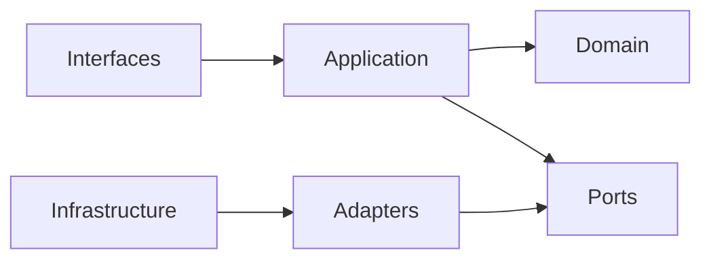

---

id: RB-ADR-001

title: Adoção de Monólito Modular como Arquitetura Inicial
description: Registra a decisão de implementar o RouteBook inicialmente como um monólito modular, preservando contextos delimitados, ownership, contratos internos e capacidade de evolução futura sem introduzir distribuição prematura.

document_type: architecture_decision_record
owner: Architecture

status: Published
version: "0.1.0"

created: "2026-07-24"
last_updated: null

authors:

- RouteBook Team

tags:

- architecture
- adr
- modular-monolith
- bounded-contexts
- modules
- domain-driven-design
- deployment
- scalability
- maintainability
- delivery
- infrastructure
- documentation-first
- ai-first
- mermaid

related_documents:

- RB-CORE-0001
- RB-CORE-0002
- RB-CORE-0003
- RB-CORE-0004
- RB-PRD-002
- RB-PRD-006
- RB-PRD-007
- RB-PRD-008
- RB-DOM-001
- RB-DOM-002
- RB-DOM-003
- RB-DOM-004
- RB-ARC-001
- RB-ARC-002
- RB-ARC-003
- RB-ARC-004
- RB-ARC-005
- RB-DATA-001
- RB-DATA-002
- RB-API-001
- RB-SEC-001
- RB-OBS-001
- RB-QA-001
- RB-OPS-001
- RB-SRE-001
- RB-AI-001
- RB-AI-005
- RB-AI-006
- RB-GOV-001
- RB-GOV-002
- RB-RISK-001
- RB-DEL-001
- RB-DEV-001
- RB-CICD-001
- RB-INFRA-001

prerequisites:

- RB-CORE-0004
- RB-DOM-001
- RB-DOM-002
- RB-DOM-003
- RB-DOM-004
- RB-ARC-001
- RB-ARC-002
- RB-ARC-003
- RB-ARC-004
- RB-ARC-005
- RB-GOV-001
- RB-GOV-002
- RB-RISK-001
- RB-DEL-001
- RB-DEV-001
- RB-CICD-001
- RB-INFRA-001

next_documents:

- RB-ADR-002

ai_context:
priority: critical
index: true
---

# RB-ADR-001 — Adoção de Monólito Modular como Arquitetura Inicial

## 1. Status da decisão

**Proposed**

Este ADR permanece em estado `Proposed` até receber aprovação formal conforme o processo definido no `RB-GOV-002`.

Após a aprovação:

* o frontmatter deverá ser atualizado para `Approved`;
* a implementação inicial deverá seguir esta decisão;
* desvios materiais deverão gerar novo ADR ou processo formal de supersessão.

---

## 2. Contexto

O RouteBook é uma plataforma AI-First destinada a auxiliar viajantes na tomada de decisões durante uma viagem.

O produto deverá combinar capacidades como:

* gestão de viagens;
* perfil do viajante;
* catálogo de lugares;
* coleção de lugares;
* planejamento de itinerário;
* mobilidade;
* recomendações;
* propostas de itinerário;
* detecção de conflitos;
* execução de capacidades de inteligência artificial;
* governança de dados;
* observabilidade;
* segurança;
* privacidade.

A arquitetura documental já estabelece módulos canônicos e contextos delimitados:

* Identity and Access;
* Trip Management;
* Traveler Profile;
* Place Catalog;
* Trip Collection;
* Itinerary Planning;
* Mobility;
* Decision Intelligence;
* Proposal Management;
* Planning Assurance;
* Data Governance;
* Platform.

Esses módulos possuem responsabilidades distintas, mas o produto ainda se encontra em estágio inicial de implementação.

Neste momento, o RouteBook possui:

* equipe reduzida;
* contexto de projeto pessoal;
* escopo inicial direcionado à viagem para Pipa;
* necessidade de validação rápida do MVP;
* arquitetura ainda em evolução;
* baixa necessidade comprovada de escala distribuída;
* necessidade elevada de simplicidade operacional;
* necessidade de preservar os limites de domínio desde o início;
* desenvolvimento assistido por agentes de IA;
* forte dependência da documentação como fonte canônica.

A decisão arquitetural precisa equilibrar duas necessidades:

1. evitar um sistema monolítico sem limites internos;
2. evitar a complexidade prematura de uma arquitetura distribuída.

---

## 3. Problema

Como os módulos e contextos delimitados do RouteBook deverão ser materializados inicialmente, considerando:

* o estágio atual do produto;
* a necessidade de entregar o MVP rapidamente;
* a necessidade de preservar fronteiras de domínio;
* a necessidade de reduzir custo operacional;
* a necessidade de manter testes e desenvolvimento local simples;
* a possibilidade de evolução futura;
* o uso de agentes de IA na implementação;
* a inexistência atual de requisitos que justifiquem serviços independentes?

---

## 4. Direcionadores da decisão

Os principais direcionadores são:

1. velocidade de implementação;
2. simplicidade operacional;
3. baixo custo inicial;
4. facilidade de desenvolvimento local;
5. facilidade de testes;
6. preservação de contextos delimitados;
7. manutenção da linguagem ubíqua;
8. baixo acoplamento entre módulos;
9. rastreabilidade;
10. reversibilidade;
11. capacidade de evolução;
12. prevenção de complexidade prematura;
13. compatibilidade com desenvolvimento assistido por IA;
14. isolamento suficiente de dados e responsabilidades;
15. observabilidade adequada ao estágio do produto.

---

## 5. Restrições

A decisão deverá respeitar as seguintes restrições:

* os módulos canônicos não poderão ser redefinidos pela estrutura técnica;
* o domínio não poderá depender diretamente de frameworks ou infraestrutura;
* cada módulo deverá possuir ownership claro;
* dependências entre módulos deverão ser explícitas;
* acesso direto aos detalhes internos de outro módulo deverá ser proibido;
* dados pertencentes a um módulo não deverão ser alterados diretamente por outro;
* conceitos canônicos deverão permanecer consistentes;
* o sistema deverá poder ser executado localmente sem infraestrutura distribuída complexa;
* a solução inicial deverá suportar deployment reproduzível;
* decisões futuras não deverão ser bloqueadas por acoplamento acidental.

---

## 6. Opções consideradas

### 6.1 Opção A — Monólito tradicional sem modularização explícita

Implementar toda a aplicação em uma única base de código e deployment, sem impor fronteiras técnicas fortes entre os domínios.

#### Benefícios

* implementação inicial rápida;
* baixa complexidade de infraestrutura;
* deployment simples;
* desenvolvimento local simples;
* baixo custo operacional.

#### Limitações

* acoplamento crescente;
* ownership pouco claro;
* acesso indiscriminado a dados;
* dificuldade de teste isolado;
* maior risco de dependências circulares;
* dificuldade de extração futura;
* perda da linguagem de domínio;
* maior probabilidade de agentes de IA alterarem áreas indevidas.

#### Avaliação

A opção oferece simplicidade operacional, mas não protege adequadamente a arquitetura de domínio já definida.

Foi rejeitada.

---

### 6.2 Opção B — Monólito modular

Implementar o RouteBook como uma única unidade principal de deployment, organizada internamente por módulos com:

* fronteiras explícitas;
* contratos internos;
* ownership;
* direção de dependências;
* dados controlados;
* eventos internos;
* testes por módulo;
* validações arquiteturais.

#### Benefícios

* deployment simples;
* desenvolvimento local simples;
* transações locais quando apropriadas;
* baixo custo operacional;
* preservação dos bounded contexts;
* maior facilidade de refatoração;
* testes rápidos;
* menor latência de integração;
* capacidade de extração futura;
* menor superfície operacional;
* melhor adequação ao estágio inicial.

#### Limitações

* fronteiras dependem de disciplina e automação;
* falha do processo principal pode afetar múltiplos módulos;
* escala independente limitada;
* deployment normalmente conjunto;
* risco de degeneração em monólito tradicional;
* isolamento de runtime menor que em serviços separados.

#### Avaliação

A opção oferece o melhor equilíbrio entre simplicidade e preservação arquitetural.

Foi selecionada.

---

### 6.3 Opção C — Microservices desde o início

Implementar os contextos delimitados como serviços independentes, com deployments, bancos e contratos distribuídos.

#### Benefícios

* deployment independente;
* escala independente;
* isolamento de runtime;
* autonomia técnica;
* fronteiras fisicamente mais fortes;
* possibilidade de tecnologias distintas.

#### Limitações

* maior complexidade operacional;
* maior custo;
* observabilidade distribuída;
* necessidade de service discovery;
* autenticação entre serviços;
* consistência distribuída;
* contratos de eventos;
* retries;
* idempotência;
* deploy e debugging mais complexos;
* maior carga cognitiva;
* menor velocidade para o MVP;
* risco de criar serviços mal delimitados antes da validação do domínio.

#### Avaliação

Não existem requisitos atuais que justifiquem essa complexidade.

Foi rejeitada para o estágio inicial.

---

### 6.4 Opção D — Backend serverless fragmentado por função

Implementar casos de uso ou endpoints como funções independentes.

#### Benefícios

* escalabilidade sob demanda;
* baixo custo quando o uso é reduzido;
* deployment granular;
* integração com serviços gerenciados.

#### Limitações

* fragmentação do domínio;
* dificuldade de transações;
* dependência de Provider;
* observabilidade fragmentada;
* cold starts;
* duplicação de configuração;
* risco de cada função acessar diretamente a persistência;
* maior dificuldade de aplicar fronteiras de módulo;
* aumento de contratos implícitos.

#### Avaliação

Poderá ser utilizado futuramente para workloads específicos, mas não como modelo estrutural principal inicial.

Foi rejeitada como arquitetura-base.

---

## 7. Decisão

O RouteBook será implementado inicialmente como um **monólito modular**.

A aplicação possuirá:

* uma unidade principal de deployment;
* uma base de código integrada;
* módulos internos explicitamente separados;
* dependências direcionadas;
* contratos internos;
* ownership de dados;
* eventos de domínio e aplicação;
* testes por módulo;
* validações automatizadas de arquitetura.

A decisão sobre monólito modular não determina:

* linguagem de programação;
* framework;
* banco de dados;
* Provider de cloud;
* formato físico final do repositório;
* tecnologia de mensageria;
* runtime de deployment.

Essas escolhas deverão ser definidas por ADRs específicos.

---

## 8. Definição de monólito modular no RouteBook

No RouteBook, monólito modular significa:

> Uma aplicação implantável como unidade principal, composta por módulos de negócio explicitamente delimitados, cujas dependências, dados, contratos e responsabilidades são governados e verificáveis.

Não significa:

* um diretório único com arquivos misturados;
* acesso global ao banco;
* classes compartilhadas indiscriminadamente;
* ausência de contratos;
* ausência de ownership;
* acoplamento entre todos os módulos;
* dependência direta de infraestrutura.

---

## 9. Unidade de deployment

A arquitetura inicial terá uma unidade principal de deployment para as capacidades centrais do produto.

Workloads auxiliares poderão ser implantados separadamente quando houver justificativa técnica.

Exemplos:

* jobs agendados;
* workers assíncronos;
* backfills;
* processamento de dados;
* evaluation runtime;
* execução isolada de Tools;
* tarefas de geração de embeddings.

Esses workloads auxiliares continuarão pertencendo aos módulos canônicos correspondentes.

Sua separação de runtime não os transforma automaticamente em novos serviços de domínio.

---

## 10. Estrutura lógica

A organização deverá preservar a seguinte separação lógica:

```text
application
├── modules
│   ├── identity-and-access
│   ├── trip-management
│   ├── traveler-profile
│   ├── place-catalog
│   ├── trip-collection
│   ├── itinerary-planning
│   ├── mobility
│   ├── decision-intelligence
│   ├── proposal-management
│   ├── planning-assurance
│   └── data-governance
├── platform
├── interfaces
└── bootstrap
```

A estrutura física final deverá ser adaptada à tecnologia escolhida, preservando a separação conceitual.

---

## 11. Estrutura interna dos módulos

Cada módulo deverá possuir, conforme sua necessidade:

```text
module
├── domain
├── application
├── ports
├── adapters
├── infrastructure
├── contracts
└── tests
```

### Domain

Poderá conter:

* entidades;
* value objects;
* aggregates;
* invariantes;
* domain services;
* domain events;
* policies puras.

### Application

Poderá conter:

* commands;
* queries;
* handlers;
* use cases;
* application services;
* orchestration;
* transaction boundaries.

### Ports

Deverão representar dependências necessárias ao módulo.

### Adapters

Deverão implementar ports para:

* persistência;
* Providers;
* APIs;
* arquivos;
* mensageria;
* inteligência artificial.

### Contracts

Deverão conter somente modelos autorizados de comunicação.

---

## 12. Direção de dependências

A direção de dependências deverá preservar:



O domínio não deverá depender de:

* framework web;
* banco de dados;
* SDK de Provider;
* ferramenta de observabilidade;
* runtime de IA;
* transporte HTTP;
* fila;
* cloud.

---

## 13. Dependências entre módulos

Um módulo poderá interagir com outro por meio de:

1. contrato interno;
2. caso de uso público;
3. query pública;
4. evento de domínio;
5. evento de aplicação;
6. port autorizado.

Um módulo não deverá:

* importar entidades internas de outro módulo;
* acessar diretamente seus repositories;
* alterar suas tabelas;
* instanciar seus adapters;
* depender de detalhes de implementação;
* utilizar tipos internos não publicados.

---

## 14. API pública de módulo

Cada módulo deverá declarar explicitamente sua superfície pública.

A superfície poderá incluir:

* commands;
* queries;
* contracts;
* events;
* identifiers;
* read models autorizados.

Tudo que não estiver explicitamente exposto deverá ser considerado interno.

---

## 15. Ownership de dados

Cada dado canônico deverá possuir um módulo owner.

Somente o módulo owner poderá:

* criar;
* alterar;
* invalidar;
* excluir;
* interpretar o ciclo de vida do dado.

Outros módulos poderão:

* consultar por contrato;
* manter projeções;
* reagir a eventos;
* armazenar referências autorizadas.

---

## 16. Persistência inicial

O monólito modular poderá utilizar uma infraestrutura de banco compartilhada, desde que preserve ownership lógico.

A utilização do mesmo servidor ou banco não autoriza acesso indiscriminado.

As estratégias possíveis incluem:

* schemas separados;
* tabelas agrupadas por módulo;
* repositories privados;
* permissões lógicas;
* convenções de nomenclatura;
* testes arquiteturais.

A estratégia física será definida em ADR específico.

---

## 17. Transações

Transações locais poderão atravessar componentes internos do mesmo módulo.

Transações entre módulos deverão ser avaliadas cuidadosamente.

Quando uma operação envolver múltiplos módulos, deverá ser preferida:

* orquestração por caso de uso;
* evento;
* processo;
* compensação;
* consistência eventual quando apropriada.

Não deverá ser criada transação global entre módulos apenas porque a persistência é compartilhada.

---

## 18. Eventos

Eventos deverão preservar a linguagem oficial do domínio.

Poderão ser inicialmente publicados dentro do mesmo processo.

Exemplos:

* `ItineraryProposalPartiallyAccepted`;
* eventos de Trip;
* eventos de Activity;
* eventos de Planning Conflict;
* eventos de Recommendation.

A execução no mesmo processo não elimina a necessidade de:

* contrato;
* versionamento;
* ownership;
* idempotência quando aplicável;
* observabilidade;
* testes.

---

## 19. Comunicação síncrona interna

Comunicação síncrona poderá ser utilizada quando:

* o resultado for necessário imediatamente;
* o acoplamento estiver explícito;
* a dependência estiver autorizada;
* a falha puder ser tratada;
* o contrato estiver estável.

Cadeias síncronas profundas entre módulos deverão ser evitadas.

---

## 20. Comunicação assíncrona interna

Comunicação assíncrona poderá ser utilizada para:

* efeitos derivados;
* notificações;
* projeções;
* processamento de longa duração;
* integrações externas;
* avaliações de IA;
* tarefas que aceitem consistência eventual.

A infraestrutura inicial poderá utilizar eventos em processo, evoluindo para mensageria quando houver necessidade comprovada.

---

## 21. Fronteiras dos módulos

As fronteiras deverão ser protegidas por:

* estrutura de diretórios;
* visibilidade de código;
* regras de importação;
* lint arquitetural;
* testes;
* revisão;
* documentação;
* ownership;
* contratos.

A proteção não deverá depender apenas de convenção verbal.

---

## 22. Validação automatizada

O pipeline deverá poder detectar:

* imports proibidos;
* dependências circulares;
* uso de componentes internos;
* acesso direto a repositories externos;
* violações de camada;
* dependência do domínio em infraestrutura;
* contratos não autorizados.

Violações deverão bloquear o merge quando representarem quebra arquitetural relevante.

---

## 23. Shared Kernel

O uso de código compartilhado deverá ser restrito.

O shared kernel poderá conter apenas elementos verdadeiramente transversais e estáveis.

Exemplos possíveis:

* tipos técnicos mínimos;
* abstração de tempo;
* identificadores básicos;
* resultado de operação;
* primitives de observabilidade.

Não deverão ser movidos para um pacote comum apenas para evitar duplicação:

* entidades;
* regras de negócio;
* DTOs específicos;
* repositories;
* serviços de domínio;
* conceitos ambíguos.

Duplicação pequena e consciente poderá ser preferível a um shared kernel acoplado.

---

## 24. Platform

O módulo Platform deverá fornecer capacidades técnicas transversais.

Exemplos:

* configuração;
* logging;
* tracing;
* persistência técnica;
* mensageria;
* feature flags;
* clock;
* geração de identificadores;
* integração com Providers.

Platform não deverá:

* possuir regras de negócio;
* concentrar casos de uso;
* tornar-se owner de dados de domínio;
* substituir os módulos canônicos;
* transformar-se em módulo genérico para código sem owner.

---

## 25. Interfaces

Interfaces externas poderão incluir:

* aplicação web;
* API;
* jobs;
* workers;
* comandos administrativos;
* runtime de agentes.

As interfaces deverão chamar casos de uso dos módulos.

Elas não deverão conter regras de domínio relevantes.

---

## 26. Inteligência artificial

As capacidades de IA serão integradas ao monólito modular por meio de:

* ports;
* adapters;
* contracts;
* Structured Outputs;
* Context Builders;
* Tool contracts;
* capability catalog.

O runtime de IA não poderá:

* acessar diretamente dados de qualquer módulo;
* ignorar autorização;
* alterar estado canônico sem caso de uso autorizado;
* tratar output probabilístico como modelo de domínio validado;
* aplicar `ItineraryProposal` silenciosamente.

---

## 27. Tools

Tools deverão representar operações explícitas autorizadas pelos módulos.

Exemplos conceituais:

* consultar uma Trip;
* recuperar Places;
* criar uma Recommendation;
* preparar uma Itinerary Proposal;
* resolver Planning Conflict por comando autorizado.

Uma Tool não deverá expor repositories ou tabelas diretamente.

---

## 28. Isolamento entre Accounts

A arquitetura monolítica não reduz a exigência de isolamento entre Accounts.

Toda operação deverá validar:

* identidade;
* Account;
* recurso;
* ação;
* escopo.

Testes cross-account deverão ser obrigatórios para casos de uso relevantes.

Uma falha de isolamento deverá ser tratada como crítica.

---

## 29. Observabilidade

A aplicação deverá permitir observação por:

* módulo;
* operação;
* Account;
* Trip;
* correlationId;
* capabilityId;
* agentId;
* Provider.

Logs, métricas e traces deverão permitir identificar:

* origem da operação;
* módulos envolvidos;
* dependências;
* tempo;
* resultado;
* falha.

---

## 30. Falhas e isolamento

Uma falha em módulo não deverá ser ocultada por exceções genéricas.

O sistema deverá:

* classificar erros;
* impedir propagação indevida;
* aplicar timeouts para dependências externas;
* utilizar fallback quando apropriado;
* preservar estado consistente;
* emitir sinais operacionais.

A unidade única de processo representa risco compartilhado, que deverá ser reduzido por:

* tratamento de erros;
* limites;
* workers separados quando necessário;
* health checks;
* graceful shutdown;
* testes de resiliência.

---

## 31. Escalabilidade

O monólito modular poderá inicialmente escalar como unidade.

Isso é aceitável enquanto:

* a demanda permanecer compatível;
* o custo for aceitável;
* não existir necessidade de escala independente;
* o deployment conjunto não limitar excessivamente a entrega;
* o isolamento de falhas for suficiente.

---

## 32. Extração futura de módulos

A arquitetura deverá permitir que um módulo seja extraído quando houver justificativa comprovada.

A extração poderá envolver:

1. estabilização do contrato;
2. remoção de acesso interno indevido;
3. separação da persistência;
4. introdução de comunicação remota;
5. migração de dados;
6. observabilidade distribuída;
7. rollout;
8. desativação do componente interno.

---

## 33. Critérios para extração

A extração de um módulo poderá ser considerada quando existir uma ou mais condições:

* necessidade de escala independente;
* ciclo de deployment incompatível;
* requisitos de disponibilidade distintos;
* requisitos de segurança ou isolamento distintos;
* equipe independente e estável;
* carga operacional específica;
* tecnologia especializada necessária;
* falhas do módulo afetando excessivamente o sistema;
* dependência externa com comportamento próprio;
* fronteira de domínio comprovadamente estável.

---

## 34. Condições que não justificam extração isoladamente

Não deverão ser consideradas justificativas suficientes:

* tamanho do diretório;
* quantidade de classes;
* preferência tecnológica;
* tendência de mercado;
* desejo de utilizar microservices;
* intenção de escalar no futuro sem evidência;
* tentativa de corrigir código mal modularizado;
* necessidade de ownership ainda indefinido.

---

## 35. Consequências positivas

A decisão deverá proporcionar:

* menor complexidade operacional;
* menor custo inicial;
* setup local simples;
* debugging simplificado;
* testes rápidos;
* transações locais;
* deployment único;
* menor necessidade de infraestrutura;
* melhor velocidade para o MVP;
* preservação das fronteiras de domínio;
* evolução progressiva;
* melhor contexto para agentes de IA;
* extração futura possível;
* menor quantidade de falhas distribuídas.

---

## 36. Consequências negativas

A decisão introduz:

* deployment conjunto;
* escala inicialmente conjunta;
* maior impacto potencial de falha do processo;
* necessidade de disciplina arquitetural;
* risco de acesso indevido entre módulos;
* risco de banco compartilhado tornar-se integração implícita;
* necessidade de validações de arquitetura;
* menor isolamento de runtime;
* possibilidade de builds maiores;
* necessidade de governar shared code.

---

## 37. Riscos

### 37.1 Degeneração em monólito tradicional

Mitigações:

* superfícies públicas;
* lint arquitetural;
* ownership;
* testes;
* revisão;
* documentação.

### 37.2 Banco compartilhado como integração

Mitigações:

* repositories privados;
* ownership de schema;
* convenções;
* proibição de escrita externa;
* testes.

### 37.3 Shared kernel excessivo

Mitigações:

* revisão arquitetural;
* escopo mínimo;
* preferência por contratos;
* ADR para expansão significativa.

### 37.4 Extração prematura

Mitigações:

* critérios objetivos;
* métricas;
* análise de custo;
* ADR específico.

### 37.5 Falha única afetando a aplicação

Mitigações:

* graceful shutdown;
* health checks;
* workers separados;
* limites;
* observabilidade;
* recuperação rápida.

### 37.6 Agentes alterando fronteiras

Mitigações:

* contexto restrito;
* caminhos permitidos;
* testes arquiteturais;
* revisão humana;
* documentação canônica.

---

## 38. Controles arquiteturais

Deverão ser implementados, progressivamente:

* regras de dependência;
* análise de ciclos;
* módulos com APIs explícitas;
* ownership de código;
* testes de arquitetura;
* testes de contrato;
* testes cross-account;
* validação de migrations;
* detecção de acesso direto a dados;
* catálogo de eventos;
* documentação das dependências.

---

## 39. Estratégia de implementação

### Etapa 1 — Estrutura

* criar estrutura física inicial;
* representar os módulos canônicos;
* definir public APIs;
* definir regras de importação;
* estabelecer Platform mínimo.

### Etapa 2 — Primeiro slice

Implementar o primeiro incremento vertical em:

* Identity and Access;
* Trip Management;
* Platform.

### Etapa 3 — Proteções

* lint arquitetural;
* testes de dependência;
* ownership;
* documentação;
* pipeline.

### Etapa 4 — Expansão

Adicionar módulos conforme o roadmap do `RB-DEL-001`.

### Etapa 5 — Observação

Acompanhar:

* acoplamento;
* ciclos;
* tempo de build;
* velocidade de testes;
* falhas;
* necessidade de escala.

---

## 40. Critérios de implementação concluída

A decisão estará implementada quando:

* os módulos canônicos estiverem representados;
* cada módulo possuir responsabilidade explícita;
* superfícies públicas estiverem definidas;
* imports proibidos forem detectáveis;
* o domínio não depender de infraestrutura;
* dados possuírem owner;
* o primeiro incremento atravessar as camadas necessárias;
* testes de arquitetura executarem no pipeline;
* a documentação de desenvolvimento refletir a estrutura real.

---

## 41. Verificação

A verificação deverá incluir:

* revisão da estrutura;
* análise de dependências;
* testes arquiteturais;
* inspeção de imports;
* inspeção de acesso a dados;
* execução do primeiro slice;
* validação de build;
* validação de testes;
* revisão de ownership.

---

## 42. Métricas de acompanhamento

Poderão ser utilizadas:

* dependências circulares;
* violações arquiteturais;
* imports entre módulos;
* acessos externos a repositories;
* tamanho do shared kernel;
* tempo de build;
* duração dos testes;
* frequência de mudanças transversais;
* quantidade de módulos alterados por incremento;
* falhas por módulo;
* tempo de deployment.

---

## 43. Estratégia de rollback

Como este ADR orienta a estrutura inicial, o rollback não representa simplesmente reverter um deployment.

Caso a decisão se mostre inadequada, deverá ser criado novo ADR que:

* descreva o problema;
* escolha nova arquitetura;
* defina módulos afetados;
* defina estratégia de migração;
* defina transição de dados;
* defina contratos;
* defina rollout;
* defina rollback técnico.

A alteração arquitetural deverá ocorrer progressivamente.

---

## 44. Alternativas futuras permitidas

Esta decisão não impede:

* extração de workers;
* funções para tarefas especializadas;
* serviços para módulos específicos;
* mensageria externa;
* persistência separada;
* runtime de IA isolado;
* gateway de modelos;
* jobs independentes.

Essas evoluções deverão ser justificadas por requisitos e registradas por novos ADRs.

---

## 45. Relação com o deployment

A unidade principal deverá produzir um artefato imutável.

O deployment poderá incluir componentes auxiliares, mas deverá preservar:

* versão;
* compatibilidade;
* configuração;
* migrations;
* observabilidade;
* rollback;
* rastreabilidade.

---

## 46. Relação com a infraestrutura

A infraestrutura inicial deverá favorecer a execução simples do monólito modular.

Não deverá exigir orquestração distribuída apenas para representar módulos internos.

A decisão de infraestrutura deverá avaliar:

* container gerenciado;
* plataforma serverless adequada;
* aplicação tradicional gerenciada;
* banco gerenciado;
* storage;
* observabilidade.

As escolhas serão registradas em ADRs posteriores.

---

## 47. Relação com desenvolvimento assistido por IA

A modularidade deverá fornecer limites claros aos agentes.

Uma tarefa de implementação deverá indicar:

* módulo principal;
* superfícies públicas permitidas;
* documentos aplicáveis;
* arquivos autorizados;
* contratos;
* testes;
* fora do escopo.

O agente não deverá modificar múltiplos módulos sem justificativa explícita.

---

## 48. Supersessão

Este ADR deverá ser superseded quando uma nova decisão alterar a arquitetura principal de deployment ou modularização.

Um ADR futuro deverá referenciar:

```text
supersedes:
  - RB-ADR-001
```

Este documento deverá então:

* permanecer disponível;
* receber estado `Superseded`;
* apontar para o novo ADR;
* preservar contexto e consequências históricas.

---

## 49. Gatilhos de revisão

A decisão deverá ser reavaliada quando:

* o produto atingir escala incompatível;
* um módulo exigir escala independente;
* deployments conjuntos bloquearem evolução;
* falhas compartilhadas se tornarem inaceitáveis;
* requisitos de segurança exigirem isolamento;
* uma equipe independente assumir um módulo;
* o runtime de IA exigir isolamento especializado;
* o custo operacional do monólito superar alternativas;
* a estrutura interna não conseguir preservar as fronteiras.

---

## 50. Decisões derivadas

Este ADR deverá ser seguido por decisões específicas sobre:

* linguagem e runtime;
* framework principal;
* estratégia de frontend;
* estratégia de persistência;
* banco de dados;
* organização física do repositório;
* autenticação;
* infraestrutura de execução;
* Provider de cloud;
* observabilidade;
* runtime de IA;
* estratégia de mensageria.

---

## 51. Checklist da decisão

Antes da aprovação:

* contexto está completo;
* problema está definido;
* direcionadores estão claros;
* restrições estão claras;
* alternativas reais foram avaliadas;
* consequências positivas estão registradas;
* consequências negativas estão registradas;
* riscos estão registrados;
* critérios de extração estão definidos;
* ownership de dados está definido;
* contratos internos estão definidos;
* estratégia de testes está definida;
* impacto em IA está definido;
* impacto em infraestrutura está definido;
* estratégia de implementação está definida;
* verificação está definida;
* supersessão está definida;
* não existem contradições com os documentos de domínio;
* não existem contradições com os documentos de arquitetura;
* não existem contradições com o roadmap;
* não existem contradições com os padrões de engenharia;
* não existem escolhas tecnológicas antecipadas sem ADR.

---

## 52. Declaração final

O RouteBook adotará inicialmente um monólito modular porque essa arquitetura oferece o melhor equilíbrio entre:

* velocidade;
* simplicidade;
* custo;
* testabilidade;
* coerência de domínio;
* governança;
* capacidade de evolução.

A aplicação será implantada como uma unidade principal, mas não será tratada como um sistema sem fronteiras.

Os módulos deverão permanecer explícitos, governados e verificáveis.

O compartilhamento de processo ou infraestrutura não permitirá:

* acesso irrestrito a dados;
* dependências arbitrárias;
* quebra de ownership;
* mistura de regras;
* bypass de contratos;
* alteração silenciosa do estado canônico.

A distribuição futura continuará possível, mas deverá ocorrer somente quando requisitos reais demonstrarem que seus benefícios superam sua complexidade.

Até que isso ocorra, o monólito modular será a arquitetura inicial oficial do RouteBook.
