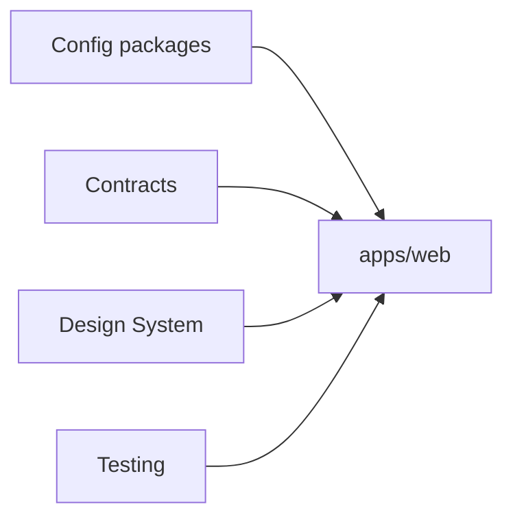

---

id: RB-ADR-004

title: Adoção de Monorepo com pnpm Workspaces e Turborepo
description: Registra a decisão de organizar o RouteBook como um monorepo baseado em pnpm Workspaces e Turborepo, definindo aplicações, packages, dependências internas, tarefas, cache, compartilhamento controlado e limites arquiteturais.

document_type: architecture_decision_record
owner: Architecture

status: Published
version: "0.1.0"

created: "2026-07-24"
last_updated: null

authors:

- RouteBook Team

tags:

- architecture
- adr
- monorepo
- pnpm
- pnpm-workspaces
- turborepo
- typescript
- nextjs
- package-management
- dependency-management
- task-orchestration
- build-cache
- modular-monolith
- developer-experience
- ci-cd

related_documents:

- RB-CORE-0001
- RB-CORE-0002
- RB-CORE-0003
- RB-CORE-0004
- RB-PRD-002
- RB-PRD-006
- RB-PRD-007
- RB-PRD-008
- RB-DOM-001
- RB-DOM-002
- RB-DOM-003
- RB-DOM-004
- RB-ARC-001
- RB-ARC-002
- RB-ARC-003
- RB-ARC-004
- RB-ARC-005
- RB-DATA-001
- RB-DATA-002
- RB-API-001
- RB-SEC-001
- RB-SEC-003
- RB-OBS-001
- RB-QA-001
- RB-QA-002
- RB-OPS-001
- RB-OPS-002
- RB-SRE-001
- RB-AI-001
- RB-AI-004
- RB-AI-005
- RB-AI-006
- RB-GOV-001
- RB-GOV-002
- RB-RISK-001
- RB-DEL-001
- RB-DEV-001
- RB-CICD-001
- RB-INFRA-001
- RB-ADR-001
- RB-ADR-002
- RB-ADR-003

prerequisites:

- RB-CORE-0004
- RB-DOM-001
- RB-DOM-002
- RB-DOM-003
- RB-DOM-004
- RB-ARC-001
- RB-ARC-002
- RB-ARC-003
- RB-ARC-004
- RB-ARC-005
- RB-QA-001
- RB-SEC-003
- RB-DEL-001
- RB-DEV-001
- RB-CICD-001
- RB-INFRA-001
- RB-ADR-001
- RB-ADR-002
- RB-ADR-003

next_documents:

- RB-ADR-005

ai_context:
priority: critical
index: true
---

# RB-ADR-004 — Adoção de Monorepo com pnpm Workspaces e Turborepo

## 1. Status da decisão

**Proposed**

Este ADR permanece em estado `Proposed` até receber aprovação formal conforme o processo definido no `RB-GOV-002`.

Após a aprovação:

* o RouteBook será mantido em um único repositório principal;
* pnpm será o package manager oficial;
* pnpm Workspaces será o mecanismo oficial de workspace;
* Turborepo será utilizado para orquestrar tarefas e cache;
* aplicações executáveis serão organizadas em `apps/`;
* packages reutilizáveis e configurações compartilhadas serão organizados em `packages/`;
* módulos de domínio não deverão ser transformados automaticamente em packages;
* desvios materiais deverão ser registrados em novo ADR.

---

## 2. Contexto

As decisões anteriores estabeleceram:

* monólito modular como arquitetura inicial;
* TypeScript como linguagem principal;
* Node.js como runtime inicial;
* Next.js com App Router como framework da aplicação web;
* GitHub como fonte canônica;
* desenvolvimento documentation-first;
* desenvolvimento assistido por agentes de IA;
* integração contínua e builds reproduzíveis.

O repositório já possui uma estrutura inicial baseada em:

```text
apps/
packages/
docs/
```

A evolução prevista poderá incluir:

* aplicação web;
* jobs;
* workers;
* scripts;
* runtime de avaliações;
* runtime de agentes;
* contratos;
* schemas;
* componentes de interface;
* configurações de lint;
* configurações de TypeScript;
* ferramentas de documentação;
* testes;
* infraestrutura.

É necessário decidir como essas unidades deverão coexistir no repositório sem:

* duplicar dependências;
* perder limites arquiteturais;
* criar packages genéricos;
* aumentar desnecessariamente o tempo de build;
* compartilhar código de domínio indevidamente;
* comprometer o monólito modular;
* dificultar a execução local;
* prejudicar os pipelines.

---

## 3. Problema

Como organizar fisicamente o código, as aplicações, os packages e as tarefas do RouteBook de forma que:

* a base permaneça simples;
* o desenvolvimento seja reproduzível;
* aplicações possam reutilizar configurações e contratos autorizados;
* dependências internas sejam explícitas;
* tarefas possam ser executadas na ordem correta;
* builds e testes possam utilizar cache;
* mudanças afetem somente as unidades necessárias;
* agentes de IA tenham fronteiras claras;
* a arquitetura de monólito modular seja preservada?

---

## 4. Direcionadores da decisão

Os principais direcionadores são:

1. simplicidade de desenvolvimento;
2. instalação única de dependências;
3. lockfile único;
4. consistência de versões;
5. compartilhamento controlado;
6. execução seletiva de tarefas;
7. cache local e de CI;
8. suporte a TypeScript;
9. suporte a Next.js;
10. integração com CI/CD;
11. capacidade de adicionar novas aplicações;
12. visibilidade do grafo de dependências;
13. isolamento entre packages;
14. compatibilidade com agentes de IA;
15. baixo custo operacional;
16. facilidade de refatoração transversal;
17. rastreabilidade;
18. prevenção de publicação prematura em registries.

---

## 5. Restrições

A solução deverá:

* utilizar Node.js e TypeScript;
* suportar a aplicação Next.js;
* preservar o monólito modular;
* permitir lockfile versionado;
* funcionar localmente e no CI;
* permitir dependências internas explícitas;
* impedir dependências não declaradas;
* permitir tarefas por aplicação ou package;
* não exigir publicação externa para compartilhamento interno;
* não transformar toda pasta em package;
* não utilizar packages genéricos como depósito de código;
* permitir validações arquiteturais;
* permitir evolução para novas aplicações.

---

## 6. Opções consideradas

### 6.1 Opção A — Repositório único sem workspaces

Manter todo o código em uma única aplicação e um único `package.json`.

#### Benefícios

* configuração inicial mínima;
* instalação simples;
* ausência de tooling adicional;
* estrutura fácil de compreender em um projeto pequeno.

#### Limitações

* dependências sem ownership;
* dificuldade de separar aplicações futuras;
* configurações compartilhadas misturadas;
* scripts centralizados;
* maior risco de imports arbitrários;
* tarefas pouco seletivas;
* baixa clareza sobre unidades reutilizáveis;
* crescimento desordenado.

#### Avaliação

É simples no início, mas não oferece estrutura suficiente para a evolução já prevista.

Foi rejeitada.

---

### 6.2 Opção B — Múltiplos repositórios

Manter aplicações, packages e serviços em repositórios independentes.

#### Benefícios

* isolamento forte;
* permissões independentes;
* pipelines independentes;
* ciclo de release separado;
* ownership físico.

#### Limitações

* maior complexidade operacional;
* contratos distribuídos;
* necessidade de publicação;
* sincronização de versões;
* mudanças transversais mais difíceis;
* documentação fragmentada;
* maior custo para projeto individual;
* menor contexto para agentes de IA;
* incompatibilidade com a simplicidade desejada para o MVP.

#### Avaliação

Não existe necessidade organizacional ou operacional que justifique múltiplos repositórios neste estágio.

Foi rejeitada.

---

### 6.3 Opção C — Monorepo com npm Workspaces

Utilizar npm como package manager e seu suporte a workspaces.

#### Benefícios

* ferramenta distribuída com Node.js;
* menor quantidade de ferramentas;
* suporte a workspaces;
* lockfile;
* ecossistema amplo.

#### Limitações

* menor eficiência de armazenamento;
* controles menos rígidos de dependências em determinados cenários;
* experiência inferior para filtros e operações complexas de workspace;
* menor adequação ao modelo desejado de isolamento entre packages.

#### Avaliação

É viável, mas não oferece vantagens suficientes sobre pnpm para o RouteBook.

Foi rejeitada.

---

### 6.4 Opção D — Monorepo com Yarn Workspaces

Utilizar Yarn como package manager e workspaces.

#### Benefícios

* suporte consolidado a workspaces;
* ferramentas para monorepos;
* ecossistema amplo;
* recursos avançados de resolução.

#### Limitações

* diferentes modelos entre versões;
* configuração adicional;
* menor alinhamento com a decisão desejada de instalação estrita;
* benefício insuficiente para superar pnpm no contexto atual.

#### Avaliação

Foi considerada válida, mas não selecionada.

---

### 6.5 Opção E — Monorepo com pnpm Workspaces sem orquestrador

Utilizar pnpm Workspaces e scripts próprios.

#### Benefícios

* dependências eficientes;
* workspaces nativos;
* estrutura simples;
* filtros;
* lockfile único;
* menor número de ferramentas.

#### Limitações

* orquestração de tarefas mais manual;
* cache de outputs não padronizado;
* dependências entre tarefas mais difíceis de declarar;
* menor capacidade de otimizar pipelines progressivamente;
* scripts de raiz potencialmente complexos.

#### Avaliação

É suficiente para um monorepo pequeno, mas a utilização de Turborepo adiciona orquestração e cache com baixo custo inicial.

Não foi selecionada isoladamente.

---

### 6.6 Opção F — Monorepo com pnpm Workspaces e Turborepo

Utilizar:

* pnpm para dependências e workspaces;
* Turborepo para grafo de tarefas, execução paralela e cache.

#### Benefícios

* lockfile único;
* suporte nativo a workspaces;
* instalação eficiente;
* dependências internas explícitas;
* filtros;
* execução seletiva;
* tarefas paralelas;
* cache de outputs;
* integração com CI;
* boa compatibilidade com Next.js;
* configuração incremental;
* suporte a múltiplas aplicações;
* amplo uso no ecossistema TypeScript.

#### Limitações

* introdução de duas ferramentas;
* necessidade de configurar corretamente inputs e outputs;
* risco de cache incorreto;
* risco de excesso de packages;
* necessidade de governar dependências;
* remote cache exige configuração adicional;
* possibilidade de scripts fragmentados.

#### Avaliação

Oferece o melhor equilíbrio entre simplicidade, estrutura e evolução.

Foi selecionada.

---

### 6.7 Opção G — Nx

Utilizar Nx como plataforma principal de monorepo.

#### Benefícios

* grafo avançado;
* generators;
* affected commands;
* cache;
* plugins;
* regras de módulos;
* ferramentas completas.

#### Limitações

* maior superfície conceitual;
* maior quantidade de convenções;
* potencial complexidade para o estágio atual;
* recursos acima da necessidade imediata;
* maior dependência da plataforma de tooling.

#### Avaliação

É uma alternativa madura, mas introduz mais complexidade do que o necessário para o MVP.

Foi rejeitada para o estágio inicial.

---

## 7. Decisão

O RouteBook adotará:

* **monorepo** como estratégia de repositório;
* **pnpm** como package manager;
* **pnpm Workspaces** como mecanismo de organização dos projetos;
* **Turborepo** como orquestrador de tarefas e cache;
* **lockfile único** na raiz;
* **aplicações executáveis em `apps/`**;
* **packages compartilháveis em `packages/`**;
* **documentação em `docs/`**;
* **infraestrutura em `infrastructure/`**, quando implementada.

A decisão não determina que cada módulo de domínio seja um package independente.

---

## 8. Definição de monorepo no RouteBook

No RouteBook, monorepo significa:

> Um único repositório versionado contendo aplicações, packages, documentação, infraestrutura e ferramentas relacionadas ao mesmo produto, com dependências explícitas e tarefas coordenadas.

Monorepo não significa:

* um único package;
* uma única aplicação;
* acesso livre entre todas as pastas;
* compartilhamento irrestrito;
* deployment obrigatoriamente conjunto de todas as aplicações;
* ausência de ownership;
* package para cada diretório;
* biblioteca genérica para qualquer código reutilizado.

---

## 9. Estrutura inicial

A estrutura inicial será:

```text
/
├── apps/
│   └── web/
├── packages/
├── docs/
├── infrastructure/
├── scripts/
├── package.json
├── pnpm-workspace.yaml
├── pnpm-lock.yaml
├── turbo.json
└── tsconfig.json
```

Diretórios ainda não utilizados poderão ser adicionados progressivamente.

Não deverão ser criadas estruturas vazias apenas para representar uma arquitetura futura.

---

## 10. Aplicações

Aplicações executáveis deverão permanecer em `apps/`.

Exemplos possíveis:

```text
apps/
├── web/
├── worker/
├── evaluator/
└── admin/
```

A existência desses exemplos não determina sua criação imediata.

Uma nova aplicação deverá possuir:

* finalidade;
* owner;
* entrada de execução;
* configuração;
* tarefas;
* testes;
* deployment;
* observabilidade;
* justificativa arquitetural.

---

## 11. Aplicação web

A aplicação principal será:

```text
apps/web
```

Ela deverá conter:

* composição Next.js;
* App Router;
* interfaces web;
* interfaces HTTP;
* bootstrap;
* módulos do monólito modular ou sua composição;
* integração com packages autorizados.

O fato de estar em um monorepo não altera sua natureza inicial de unidade principal de deployment.

---

## 12. Packages

Packages deverão representar unidades reutilizáveis, estáveis ou configuracionais.

Exemplos elegíveis:

```text
packages/
├── config-typescript/
├── config-lint/
├── contracts/
├── schemas/
├── design-system/
├── observability/
└── testing/
```

A estrutura final deverá ser criada somente conforme a necessidade.

---

## 13. Critérios para criação de package

Um package deverá ser criado quando:

* for utilizado por mais de uma aplicação ou package;
* possuir responsabilidade clara;
* possuir API pública definida;
* puder ser testado isoladamente;
* justificar versionamento interno;
* reduzir duplicação estrutural relevante;
* representar configuração compartilhada;
* possuir owner.

Não deverá ser criado apenas porque:

* uma pasta possui muitos arquivos;
* existe código semelhante;
* o nome parece genérico;
* pode ser reutilizado futuramente;
* um agente sugeriu abstração;
* é possível publicar no registry.

---

## 14. Módulos de domínio e packages

Os módulos canônicos do monólito modular não deverão ser convertidos automaticamente em packages separados.

Exemplos:

* Trip Management;
* Itinerary Planning;
* Decision Intelligence;
* Planning Assurance;
* Proposal Management.

Eles poderão permanecer dentro de `apps/web` enquanto:

* pertencerem à mesma unidade principal;
* não precisarem ser consumidos por outra aplicação;
* suas fronteiras puderem ser protegidas internamente;
* não houver benefício comprovado de extração.

Um package físico não é requisito para uma fronteira arquitetural.

---

## 15. Extração de módulo para package

Um módulo poderá ser extraído quando:

* outra aplicação precisar consumi-lo;
* houver necessidade real de build isolado;
* a API pública estiver estável;
* não depender de detalhes internos da aplicação;
* a extração melhorar testabilidade ou ownership;
* não criar dependência circular;
* existir justificativa registrada.

A extração não deverá expor entidades internas indiscriminadamente.

---

## 16. Packages proibidos ou desencorajados

Deverão ser evitados packages com nomes e escopos como:

```text
packages/common
packages/shared
packages/utils
packages/helpers
packages/core
```

Esses nomes tendem a ocultar ownership e responsabilidade.

Quando uma capacidade for realmente compartilhada, deverá possuir nome específico.

Exemplos melhores:

```text
packages/date-time
packages/geospatial-contracts
packages/testing
packages/config-typescript
```

Mesmo esses exemplos exigem necessidade comprovada.

---

## 17. pnpm Workspaces

O workspace deverá ser declarado em:

```text
pnpm-workspace.yaml
```

Configuração inicial conceitual:

```yaml
packages:
  - "apps/*"
  - "packages/*"
  - "tooling/*"
```

Somente diretórios que representem projetos Node.js deverão ser incluídos.

Documentação pura não deverá ser tratada como package Node.js sem necessidade.

---

## 18. Package manager

pnpm será o único package manager autorizado no repositório.

Não deverão coexistir:

* `package-lock.json`;
* `yarn.lock`;
* `bun.lock`;
* lockfiles alternativos;
* instruções conflitantes de instalação.

O pipeline deverá detectar lockfiles incompatíveis.

---

## 19. Fixação da versão do pnpm

A versão do pnpm deverá ser fixada no `package.json` raiz ou mecanismo equivalente.

Exemplo conceitual:

```json
{
  "packageManager": "pnpm@<versão-aprovada>"
}
```

A versão exata deverá ser escolhida durante a implementação e atualizada de forma controlada.

---

## 20. Lockfile

O `pnpm-lock.yaml` deverá:

* ser versionado;
* ser atualizado junto das mudanças de dependências;
* ser validado no CI;
* ser utilizado em instalações imutáveis;
* não ser regenerado silenciosamente por versões divergentes.

No CI, a instalação deverá falhar quando o lockfile estiver incompatível com os manifests.

---

## 21. Dependências por package

Cada aplicação ou package deverá declarar suas próprias dependências.

Uma dependência utilizada por `apps/web` deverá constar no `package.json` de `apps/web`.

Não deverá ser considerada disponível apenas porque está instalada na raiz.

A raiz deverá conter principalmente:

* tooling global;
* comandos delegadores;
* configuração do workspace;
* dependências necessárias à administração do monorepo.

---

## 22. Dependências internas

Dependências internas deverão utilizar o protocolo de workspace.

Exemplo:

```json
{
  "dependencies": {
    "@routebook/contracts": "workspace:*"
  }
}
```

Isso deverá impedir que uma resolução externa substitua silenciosamente um package interno.

---

## 23. Nomenclatura dos packages

Packages internos deverão utilizar namespace consistente.

Formato recomendado:

```text
@routebook/<package>
```

Exemplos:

```text
@routebook/contracts
@routebook/design-system
@routebook/testing
@routebook/config-typescript
```

O namespace não implica publicação pública.

---

## 24. Packages privados

Packages internos deverão ser privados por padrão.

Exemplo conceitual:

```json
{
  "private": true
}
```

A publicação em registry somente deverá ocorrer quando houver consumidor externo legítimo e decisão explícita.

---

## 25. Versionamento interno

Enquanto os packages forem privados e implantados como parte do mesmo produto, o versionamento interno poderá permanecer simplificado.

Mudanças incompatíveis ainda deverão ser controladas por:

* contratos;
* typecheck;
* testes;
* mudanças atômicas;
* revisão;
* pipeline.

A adoção de versionamento independente ou Changesets deverá exigir necessidade comprovada.

---

## 26. Dependências de produção e desenvolvimento

Cada package deverá classificar corretamente:

* `dependencies`;
* `devDependencies`;
* `peerDependencies`;
* `optionalDependencies`.

Não deverão ser colocadas todas as dependências em `devDependencies` apenas porque o monorepo as instala conjuntamente.

---

## 27. Peer dependencies

Peer dependencies deverão ser utilizadas principalmente quando um package depender de uma instância fornecida pelo consumidor.

Exemplos possíveis:

* React;
* integrações com framework;
* plugins.

Seu uso deverá evitar instalações duplicadas ou incompatíveis.

---

## 28. Catálogo de versões

O projeto poderá adotar mecanismo centralizado de versões quando isso reduzir divergência sem ocultar as dependências de cada package.

A adoção deverá preservar:

* dependência declarada localmente;
* versão governada;
* clareza;
* compatibilidade com ferramentas.

---

## 29. Turborepo

O Turborepo será responsável por:

* declarar tarefas;
* declarar dependências entre tarefas;
* executar tarefas em paralelo;
* reutilizar outputs;
* filtrar projetos;
* apoiar execução incremental;
* integrar cache local e CI.

Ele não será responsável por:

* definir a arquitetura de domínio;
* substituir o pnpm;
* definir ownership;
* publicar packages automaticamente;
* determinar deployment;
* corrigir dependências circulares.

---

## 30. Configuração do Turborepo

A configuração deverá permanecer na raiz:

```text
turbo.json
```

Configuração conceitual inicial:

```json
{
  "$schema": "https://turbo.build/schema.json",
  "tasks": {
    "build": {
      "dependsOn": ["^build"],
      "outputs": [".next/**", "dist/**", "!.next/cache/**"]
    },
    "typecheck": {
      "dependsOn": ["^typecheck"],
      "outputs": []
    },
    "lint": {
      "outputs": []
    },
    "test": {
      "dependsOn": ["^build"],
      "outputs": ["coverage/**"]
    },
    "dev": {
      "cache": false,
      "persistent": true
    }
  }
}
```

A configuração final deverá refletir os outputs reais.

---

## 31. Tarefas por package

A lógica de cada tarefa deverá permanecer, preferencialmente, no package que a executa.

Exemplo:

```json
{
  "scripts": {
    "build": "next build",
    "dev": "next dev",
    "lint": "eslint .",
    "typecheck": "tsc --noEmit",
    "test": "vitest run"
  }
}
```

O `package.json` raiz deverá delegar:

```json
{
  "scripts": {
    "build": "turbo run build",
    "lint": "turbo run lint",
    "typecheck": "turbo run typecheck",
    "test": "turbo run test"
  }
}
```

A raiz não deverá concentrar a lógica interna de todas as aplicações.

---

## 32. Grafo de tarefas

Dependências entre tarefas deverão refletir necessidades reais.

Exemplo:

```text
contracts#build
→ web#typecheck
→ web#build
```

Uma tarefa não deverá depender de todas as outras por conveniência.

Dependências excessivas reduzem paralelismo e aumentam tempo de feedback.

---

## 33. Outputs

Toda tarefa cacheável deverá declarar corretamente seus outputs.

Exemplos:

* `dist/**`;
* `.next/**`;
* `coverage/**`;
* artefatos gerados;
* documentação compilada.

Outputs incompletos poderão produzir cache inválido.

Outputs excessivos poderão gerar cache pesado e desnecessário.

---

## 34. Inputs

Inputs deverão considerar:

* código;
* configuração;
* variáveis relevantes;
* lockfile;
* schemas;
* contratos;
* arquivos globais.

Mudanças em arquivos que alteram o resultado deverão invalidar o cache.

---

## 35. Variáveis de ambiente e cache

Variáveis capazes de alterar outputs deverão ser declaradas na configuração apropriada.

Secrets não deverão:

* ser adicionados ao cache;
* ser impressos;
* ser armazenados em artefatos;
* ser enviados a remote cache.

A configuração de cache deverá distinguir:

* variáveis que afetam build;
* variáveis apenas de runtime;
* secrets;
* configuração pública.

---

## 36. Cache local

O cache local poderá ser utilizado desde o início para:

* build;
* testes determinísticos;
* geração de código;
* lint quando apropriado;
* typecheck quando seguro.

Tarefas não determinísticas não deverão ser cacheadas sem correção.

---

## 37. Remote cache

Remote cache poderá ser adotado quando:

* o CI apresentar repetição relevante;
* houver colaboração entre máquinas;
* o benefício superar a configuração;
* a segurança estiver avaliada.

A adoção deverá definir:

* Provider;
* autenticação;
* retenção;
* confidencialidade;
* escopo;
* exclusão de secrets;
* fallback;
* custo.

Remote cache não é obrigatório para a primeira implementação.

---

## 38. Tarefas não cacheáveis

Deverão permanecer sem cache:

* servidores de desenvolvimento;
* deployments;
* migrations mutáveis;
* operações destrutivas;
* tarefas dependentes de tempo;
* tarefas com efeitos externos;
* geração não determinística sem seed;
* chamadas reais a modelos de IA sem controle.

---

## 39. Testes e cache

Testes poderão utilizar cache quando:

* forem determinísticos;
* inputs estiverem completos;
* ambiente estiver controlado;
* outputs estiverem definidos;
* não dependerem de serviços mutáveis externos.

Testes flaky não deverão ser mascarados pelo cache.

---

## 40. Tarefas afetadas

A execução seletiva poderá considerar:

* packages alterados;
* dependentes;
* comparação com branch base;
* filtros de workspace.

A estratégia exata deverá ser validada no CI.

Mudanças em configurações globais deverão invalidar todos os projetos afetados.

---

## 41. Desenvolvimento local

O fluxo inicial deverá permitir:

```text
pnpm install
pnpm dev
pnpm lint
pnpm typecheck
pnpm test
pnpm build
```

Os comandos de raiz deverão ser simples e documentados.

---

## 42. Filtros

pnpm e Turborepo poderão filtrar projetos.

Exemplos conceituais:

```text
pnpm --filter @routebook/web dev
pnpm --filter @routebook/contracts test
turbo run build --filter=@routebook/web
```

Os comandos finais deverão utilizar os nomes reais dos packages.

---

## 43. TypeScript compartilhado

Configurações TypeScript poderão ser mantidas em package dedicado.

Exemplo:

```text
packages/config-typescript/
├── base.json
├── nextjs.json
└── package.json
```

Cada aplicação deverá estender somente a configuração adequada.

A configuração compartilhada não deverá ocultar opções críticas.

---

## 44. Lint compartilhado

Configurações de lint poderão ser centralizadas.

Exemplo:

```text
packages/config-lint/
```

Regras específicas de aplicação poderão complementar a base.

Não deverão ser desabilitadas regras críticas apenas para reduzir falhas.

---

## 45. Design System

O Design System poderá ser extraído para:

```text
packages/design-system
```

quando existir:

* utilização consistente;
* tokens definidos;
* componentes reutilizáveis;
* testes;
* API pública;
* documentação.

No estágio inicial, componentes exclusivos da aplicação poderão permanecer em `apps/web`.

---

## 46. Contratos

Contratos compartilhados poderão ser mantidos em:

```text
packages/contracts
```

Esse package poderá conter:

* contratos de API;
* contratos de eventos;
* Tool schemas;
* Structured Output schemas;
* tipos derivados;
* identificadores públicos.

Não deverá conter:

* entidades completas;
* repositories;
* casos de uso;
* implementação de Providers;
* modelos de persistência.

---

## 47. Schemas

Schemas compartilhados deverão ser tratados como fontes canônicas quando atravessarem fronteiras.

Eles deverão possuir:

* ownership;
* versionamento;
* testes;
* compatibilidade;
* documentação;
* limite de escopo.

Não deverá existir um package global de schemas contendo indiscriminadamente todos os modelos internos.

---

## 48. Testing package

Um package de testes poderá fornecer:

* factories;
* fixtures sintéticas;
* builders;
* matchers;
* setup;
* adapters simulados.

Ele não deverá:

* conhecer detalhes privados de todos os módulos;
* criar dependência de produção;
* conter credenciais;
* substituir testes específicos dos módulos.

---

## 49. Observabilidade compartilhada

Um package de observabilidade poderá expor abstrações autorizadas para:

* logger;
* tracer;
* metrics;
* correlation context.

O domínio não deverá depender diretamente desse package quando isso contaminar regras puras.

---

## 50. Scripts e tooling

Ferramentas internas poderão permanecer em:

```text
scripts/
```

ou em packages executáveis quando possuírem:

* dependências próprias;
* testes;
* build;
* reutilização;
* ciclo de vida contínuo.

Scripts simples não precisam se tornar packages.

---

## 51. Dependências entre packages

O grafo deverá permanecer acíclico.

Exemplo desejado:



Não deverá existir dependência circular como:

```text
apps/web
→ packages/contracts
→ apps/web
```

---

## 52. Regras arquiteturais

Deverão existir regras para impedir:

* package de configuração dependente de aplicação;
* contracts dependentes de adapters;
* design system dependente de domínio;
* testing package utilizado em produção;
* aplicação importada por package;
* dependência circular;
* import por caminho interno não publicado.

---

## 53. Exports dos packages

Cada package deverá declarar sua superfície pública.

Exemplo conceitual:

```json
{
  "exports": {
    ".": "./src/index.ts",
    "./schemas": "./src/schemas/index.ts"
  }
}
```

Importações por caminhos internos deverão ser proibidas quando não fizerem parte da API pública.

Exemplo proibido:

```typescript
import { internalSchema } from "@routebook/contracts/src/internal/schema";
```

---

## 54. Barrel files

Barrel files deverão ser utilizados com cuidado.

Eles poderão:

* simplificar APIs públicas;
* centralizar exports autorizados.

Eles não deverão:

* exportar tudo automaticamente;
* criar ciclos;
* ocultar dependências;
* ampliar superfícies sem revisão.

---

## 55. Build de packages

Packages poderão ser:

* consumidos como código-fonte pelo ambiente controlado;
* compilados para `dist/`;
* gerados a partir de schemas.

A estratégia deverá ser escolhida por package.

Packages publicados ou consumidos por runtimes independentes deverão preferir outputs explícitos.

---

## 56. Source packages

O consumo direto de código-fonte poderá ser utilizado quando:

* todos os consumidores utilizarem TypeScript;
* o framework suportar transpilation;
* não houver publicação externa;
* a estratégia reduzir complexidade;
* o build permanecer previsível.

Essa decisão não deverá ser aplicada indiscriminadamente a todos os packages.

---

## 57. Code generation

Code generation poderá existir para:

* clientes de API;
* tipos;
* schemas;
* documentação;
* contratos;
* SDKs internos.

A tarefa deverá declarar:

* inputs;
* outputs;
* ferramenta;
* versão;
* determinismo;
* validação.

Arquivos gerados deverão ser claramente identificados.

---

## 58. CI/CD

O pipeline deverá utilizar:

```text
pnpm install --frozen-lockfile
```

ou comportamento equivalente.

Etapas conceituais:

```text
install
→ documentation validation
→ lint
→ typecheck
→ test
→ build
→ security checks
→ artifact
```

O Turborepo poderá reutilizar resultados válidos entre etapas e execuções.

---

## 59. Artefatos

Somente aplicações e packages necessários ao deployment deverão compor o artefato.

O artefato de `apps/web` não deverá incluir:

* testes;
* caches locais;
* documentação desnecessária;
* secrets;
* dependências de outros packages não utilizadas;
* ferramentas de desenvolvimento sem necessidade.

---

## 60. Deployment

O monorepo não implica deployment único de todas as aplicações.

Cada aplicação executável poderá possuir:

* pipeline;
* artefato;
* ambiente;
* estratégia;
* versão.

O `apps/web` continuará sendo a unidade principal inicial.

---

## 61. Segurança da cadeia de dependências

A estratégia deverá incluir:

* lockfile;
* dependency scanning;
* secret scanning;
* versões controladas;
* avaliação de packages;
* revisão de scripts de instalação;
* SBOM quando aplicável.

Dependências não deverão ser adicionadas somente na raiz para ficarem implicitamente acessíveis.

---

## 62. Scripts de lifecycle

Packages com scripts de instalação deverão receber atenção especial.

A instalação no CI deverá possuir configurações de segurança compatíveis com as dependências utilizadas.

Scripts desconhecidos não deverão ser executados sem avaliação.

---

## 63. Atualização de dependências

Atualizações deverão considerar:

* package afetado;
* consumidores;
* breaking changes;
* lockfile;
* testes;
* build;
* segurança.

Atualizações automáticas poderão gerar pull requests, mas não deverão realizar merge autônomo de mudanças relevantes sem gates.

---

## 64. Dependências duplicadas

Versões divergentes deverão ser monitoradas quando causarem:

* aumento de artefato;
* incompatibilidade;
* múltiplas instâncias de React;
* conflitos de tipos;
* comportamento inconsistente.

Nem toda duplicação exige unificação automática.

---

## 65. React

A aplicação e packages de interface deverão evitar múltiplas instâncias incompatíveis de React.

Packages de componentes deverão utilizar a classificação adequada de dependência e compatibilidade.

---

## 66. Next.js

O Turborepo deverá declarar corretamente os outputs do Next.js.

Caches internos do framework que não precisem ser compartilhados poderão ser excluídos dos outputs externos.

A configuração deverá ser validada contra o build real.

---

## 67. Variáveis globais

Variáveis ou arquivos globais que alterem builds deverão ser declarados.

Exemplos:

* lockfile;
* configuração de TypeScript;
* configuração de lint;
* schemas globais;
* variáveis públicas de build;
* versão do Node.js.

---

## 68. Documentação

A documentação continuará em `docs/`.

Ela não deverá ser movida para dentro dos packages apenas por utilizar monorepo.

Cada package poderá possuir README próprio com:

* finalidade;
* API pública;
* ownership;
* dependências;
* comandos;
* restrições.

O README local não substitui os documentos canônicos.

---

## 69. Ownership

Aplicações e packages deverão possuir owner explícito.

O ownership poderá ser representado por:

* documentação;
* CODEOWNERS;
* metadados;
* catálogo interno.

Packages sem owner não deverão ser criados.

---

## 70. CODEOWNERS

O repositório poderá utilizar CODEOWNERS para áreas como:

```text
/apps/web/
/packages/contracts/
/packages/design-system/
/docs/architecture/
/infrastructure/
```

A configuração deverá refletir a equipe real e não criar aprovações impossíveis.

---

## 71. Agentes de IA

O monorepo deverá fornecer aos agentes:

* caminho da aplicação;
* package principal;
* dependências autorizadas;
* arquivos permitidos;
* documentos relevantes;
* comandos;
* critérios de aceite.

Uma tarefa não deverá instruir o agente a alterar todo o monorepo sem necessidade.

---

## 72. Limites para agentes

Agentes não poderão autonomamente:

* criar package;
* mover módulo de domínio para package;
* adicionar dependência estrutural;
* alterar package manager;
* alterar workspace;
* alterar grafo global;
* habilitar remote cache;
* publicar package;
* remover lockfile;
* criar dependência circular.

Essas ações exigem revisão e, quando materiais, decisão arquitetural.

---

## 73. Código compartilhado gerado por IA

Antes de transformar código em package compartilhado, deverá ser confirmado:

* segundo consumidor real;
* responsabilidade clara;
* API pública;
* estabilidade;
* testes;
* ownership.

A abstração não deverá ser criada apenas por semelhança superficial.

---

## 74. Consequências positivas

A decisão proporciona:

* repositório único;
* lockfile único;
* setup uniforme;
* dependências internas explícitas;
* compartilhamento sem publicação;
* tarefas coordenadas;
* cache;
* execução paralela;
* mudanças atômicas;
* contexto completo para agentes;
* integração simples com CI;
* capacidade de adicionar aplicações;
* configurações consistentes;
* maior rastreabilidade.

---

## 75. Consequências negativas

A decisão introduz:

* necessidade de governar o grafo;
* dependência de pnpm e Turborepo;
* configuração de cache;
* risco de excesso de packages;
* potencial aumento da complexidade do repositório;
* necessidade de definir APIs públicas;
* possibilidade de tarefas globais lentas;
* maior impacto de configurações raiz;
* necessidade de validar versões e tooling.

---

## 76. Riscos

### 76.1 Package genérico

Mitigações:

* critérios de criação;
* naming específico;
* owner;
* revisão arquitetural.

### 76.2 Compartilhamento excessivo

Mitigações:

* APIs públicas;
* módulos permanecendo na aplicação;
* contracts limitados;
* testes de dependência.

### 76.3 Dependência circular

Mitigações:

* lint;
* análise de grafo;
* pipeline;
* revisão.

### 76.4 Cache incorreto

Mitigações:

* inputs completos;
* outputs corretos;
* testes sem cache;
* invalidação;
* revisão.

### 76.5 Dependência não declarada

Mitigações:

* dependências por package;
* instalação estrita;
* CI limpo;
* lint.

### 76.6 Configuração raiz centralizadora

Mitigações:

* tarefas locais;
* raiz delegadora;
* packages de configuração específicos.

### 76.7 Remote cache com informação sensível

Mitigações:

* avaliação;
* exclusão de secrets;
* outputs controlados;
* Provider aprovado.

### 76.8 Agentes criando abstrações prematuras

Mitigações:

* restrições;
* revisão;
* segundo consumidor real;
* ADR para mudanças estruturais.

---

## 77. Controles

Deverão ser implementados progressivamente:

* lockfile único;
* detecção de lockfiles alternativos;
* frozen lockfile no CI;
* workspace protocol;
* packages privados;
* análise de dependências;
* detecção de ciclos;
* validação de exports;
* CODEOWNERS;
* cache controlado;
* dependency scanning;
* lint arquitetural;
* comandos padronizados.

---

## 78. Estratégia de implementação

### Etapa 1 — Workspace

* fixar versão do pnpm;
* criar `pnpm-workspace.yaml`;
* validar `apps/web`;
* criar lockfile;
* remover lockfiles incompatíveis.

### Etapa 2 — Turborepo

* adicionar Turborepo;
* criar `turbo.json`;
* registrar tarefas iniciais;
* configurar outputs;
* validar execução local.

### Etapa 3 — Configurações

* avaliar package de TypeScript;
* avaliar package de lint;
* evitar extrações sem consumidor real.

### Etapa 4 — Pipeline

* utilizar instalação imutável;
* executar tarefas pelo Turborepo;
* validar cache;
* medir tempo.

### Etapa 5 — Packages funcionais

* criar contracts ou design system apenas quando necessários;
* definir exports;
* adicionar testes;
* documentar ownership.

---

## 79. Critérios de implementação concluída

A decisão estará implementada quando:

* pnpm estiver fixado;
* `pnpm-workspace.yaml` existir;
* `pnpm-lock.yaml` estiver versionado;
* `turbo.json` existir;
* `apps/web` estiver no workspace;
* comandos de raiz delegarem tarefas;
* lint, typecheck, test e build executarem;
* instalação imutável funcionar no CI;
* não existirem lockfiles concorrentes;
* dependências internas utilizarem workspace protocol;
* o primeiro package compartilhado, quando existir, possuir owner e API pública.

---

## 80. Verificação

A verificação deverá incluir:

* clone limpo;
* instalação;
* execução local;
* lint;
* typecheck;
* testes;
* build;
* execução filtrada;
* cache hit;
* cache miss após alteração relevante;
* invalidação por lockfile;
* análise de dependências;
* detecção de import inválido;
* pipeline.

---

## 81. Métricas

Poderão ser acompanhadas:

* tempo de instalação;
* tamanho do cache;
* cache hit rate;
* duração do build;
* duração dos testes;
* tarefas executadas;
* packages afetados;
* dependências duplicadas;
* dependências circulares;
* número de packages;
* packages sem owner;
* mudanças transversais;
* falhas de lockfile.

---

## 82. Gatilhos de revisão

A decisão deverá ser revisada quando:

* o monorepo crescer além da capacidade das ferramentas;
* os pipelines permanecerem lentos mesmo com otimização;
* surgirem necessidades de permissões por repositório;
* equipes independentes exigirem ciclos isolados;
* packages precisarem de releases externos independentes;
* Turborepo limitar requisitos críticos;
* pnpm apresentar incompatibilidade estrutural;
* a governança do grafo se tornar desproporcional;
* múltiplos produtos independentes passarem a coexistir.

---

## 83. Estratégia de rollback

A substituição de pnpm ou Turborepo deverá ser registrada em novo ADR.

A migração deverá considerar:

* manifests;
* lockfile;
* workspaces;
* scripts;
* pipeline;
* cache;
* filtros;
* artefatos;
* documentação;
* ambientes locais.

A substituição do orquestrador não deverá exigir alteração dos módulos de domínio.

---

## 84. Decisões derivadas

Deverão ser avaliadas decisões sobre:

* estratégia de persistência;
* banco de dados;
* biblioteca de schemas;
* framework de testes;
* autenticação;
* Design System físico;
* mapas;
* observabilidade;
* hosting;
* remote cache;
* versionamento de packages.

---

## 85. Próxima decisão

O `RB-ADR-005` deverá definir a estratégia de persistência principal e avaliar:

* banco de dados relacional;
* banco documental;
* banco serverless;
* ownership de schemas;
* transações;
* dados geográficos;
* migrations;
* compatibilidade com monólito modular;
* integração com TypeScript e Node.js.

A decisão não deverá escolher ORM e banco como se fossem a mesma decisão sem avaliar separadamente suas responsabilidades.

---

## 86. Supersessão

Um ADR futuro que substituir esta decisão deverá declarar:

```text
supersedes:
  - RB-ADR-004
```

O presente documento deverá então:

* receber estado `Superseded`;
* apontar para o ADR substituto;
* permanecer disponível;
* preservar contexto e consequências históricas.

---

## 87. Checklist da decisão

Antes da aprovação:

* contexto está completo;
* problema está definido;
* direcionadores estão claros;
* restrições estão claras;
* alternativas foram avaliadas;
* monorepo está justificado;
* pnpm está justificado;
* Turborepo está justificado;
* estrutura de apps está definida;
* estrutura de packages está definida;
* critérios para packages estão definidos;
* módulos de domínio estão protegidos;
* lockfile está governado;
* dependências internas estão governadas;
* exports estão governados;
* cache está governado;
* remote cache está governado;
* CI/CD está contemplado;
* segurança está contemplada;
* agentes de IA estão contemplados;
* riscos estão registrados;
* controles estão definidos;
* implementação está definida;
* verificação está definida;
* gatilhos de revisão estão definidos;
* supersessão está definida;
* não existem contradições com RB-ADR-001;
* não existem contradições com RB-ADR-002;
* não existem contradições com RB-ADR-003.

---

## 88. Declaração final

O RouteBook adotará um monorepo baseado em pnpm Workspaces e Turborepo.

Essa decisão permitirá manter, em uma única fonte canônica:

* aplicações;
* packages;
* documentação;
* ferramentas;
* infraestrutura;
* testes;
* contratos.

O monorepo deverá facilitar mudanças atômicas e desenvolvimento integrado sem remover limites arquiteturais.

pnpm será responsável pela resolução e instalação das dependências.

Turborepo será responsável pela coordenação e otimização das tarefas.

Nenhuma dessas ferramentas será tratada como substituta para:

* arquitetura;
* ownership;
* contratos;
* testes;
* governança;
* segurança.

Packages somente deverão ser criados quando representarem responsabilidades reais e reutilização comprovada.

Os módulos do monólito modular poderão permanecer dentro da aplicação enquanto essa organização for mais simples e adequada.

O compartilhamento deverá permanecer explícito, mínimo, testável e governado.

O monorepo deverá crescer conforme as necessidades reais do RouteBook, sem antecipar aplicações, packages ou abstrações que ainda não possuem consumidores.
