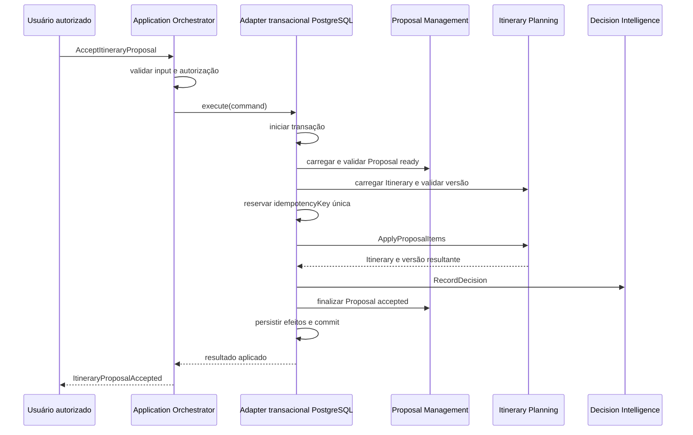

# RB-ADR-027 — Transação Local para Aplicação de Itinerary Proposal

## 1. Status da decisão

**Proposed**

Este ADR foi preparado para revisão humana e ainda não autoriza implementação.

Para avançar a `Approved`, exige aprovação explícita dos owners afetados e do Governance Owner, conforme o RB-GOV-002. O autor agente não é approver.

Issue de discussão: [#156](https://github.com/collapsy/Routebook/issues/156).

## 2. Contexto

O RouteBook opera inicialmente como monólito modular em um único processo e utiliza PostgreSQL como persistência relacional principal.

A aplicação integral de uma Itinerary Proposal atravessa três bounded contexts:

- Proposal Management valida a Proposal, controla seu lifecycle e preserva a idempotência da solicitação;
- Itinerary Planning aplica os itens aceitos ao Itinerary e produz uma única versão resultante;
- Decision Intelligence registra a decisão explícita do usuário e seu contexto.

Os incrementos RB-INC-066 e RB-INC-067 já permitem finalizar e persistir uma Proposal como `accepted` somente depois de uma aplicação válida. O RB-INC-068 publicou o contrato `ApplyProposalItems`, pertencente ao Itinerary Planning, sem implementar mutação ou coordenação.

RB-DATA-002 determina que a estratégia concreta evite estado parcial inconsistente e seja registrada por ADR.

## 3. Problema

Como coordenar a aplicação integral de uma Itinerary Proposal de modo que:

- o Itinerary seja alterado atomicamente;
- a `ItineraryVersion` esperada seja validada;
- a Proposal somente alcance `accepted` após a aplicação;
- a Decision correspondente seja registrada;
- retries com a mesma chave sejam idempotentes;
- uma falha não preserve apenas parte dos efeitos;
- os módulos permaneçam separados por contratos públicos?

## 4. Impacto e autoridade

- impacto: **alto**;
- módulos afetados: Proposal Management, Itinerary Planning, Decision Intelligence e Database;
- dados canônicos afetados: Itinerary, Itinerary Proposal, Proposal Application e Decision;
- reviewers necessários: owners dos módulos afetados, Architecture e Data;
- approvers necessários: owners afetados e Governance Owner;
- approver atual: pendente.

## 5. Direcionadores da decisão

1. integridade do estado canônico;
2. idempotência verificável;
3. concorrência otimista por `ItineraryVersion`;
4. preservação de ownership modular;
5. simplicidade operacional do MVP;
6. baixa latência no aceite explícito;
7. testabilidade com PostgreSQL real;
8. ausência de infraestrutura distribuída sem necessidade demonstrada;
9. rollback claro em falha;
10. caminho de evolução para coordenação assíncrona.

## 6. Restrições

A solução deverá:

- usar contratos públicos entre módulos;
- impedir Proposal Management de escrever diretamente nas tabelas do Itinerary;
- impedir alteração parcial do Itinerary;
- validar autorização antes da transação de escrita;
- validar Proposal `ready`, validade temporal, versões base e invariantes;
- preservar Activity `fixed` e Free Period `protected` conforme o domínio;
- registrar `resultingItineraryVersion` em sucesso;
- impor unicidade de `itineraryProposalId + idempotencyKey`;
- rejeitar a mesma chave com payload divergente;
- manter chamadas a Providers fora da transação;
- não depender de Redis, Inngest ou outro Provider para consistência inicial.

## 7. Opções consideradas

### 7.1 Opção A — Transação local PostgreSQL

Um Application Orchestrator chama um port transacional. O adapter PostgreSQL carrega e bloqueia ou compara os registros necessários, usa operações públicas de domínio, persiste todos os efeitos e confirma uma única transação.

#### Benefícios

- atomicidade forte no banco já adotado;
- rollback automático de todos os efeitos em falha;
- menor complexidade operacional;
- resposta síncrona compatível com confirmação explícita;
- idempotência e concorrência verificáveis por constraints;
- testes de integração determinísticos;
- nenhuma infraestrutura nova.

#### Custos e riscos

- adapter transacional conhece a composição de múltiplos módulos;
- transação precisa permanecer curta;
- aumenta o acoplamento ao fato atual de os dados compartilharem PostgreSQL;
- eventual extração de módulo exigirá nova estratégia.

#### Reversibilidade

Alta enquanto os módulos compartilharem processo e banco. O port do orchestrator permite substituir o adapter sem alterar os aggregates.

### 7.2 Opção B — Process Manager com transações separadas

Cada módulo confirma sua própria transação e um Process Manager conduz as etapas por eventos, Inbox/Outbox e retries.

#### Benefícios

- isolamento operacional maior;
- favorece futura distribuição dos módulos;
- falhas e retries ficam explicitamente observáveis.

#### Custos e riscos

- consistência eventual durante uma decisão explícita do usuário;
- estados intermediários e recuperação mais complexos;
- exige Outbox, Inbox, Process Manager e observabilidade ainda não necessários;
- maior superfície de testes e operação.

#### Reversibilidade

Média. Remover estados e infraestrutura de processo depois de adotados é custoso.

### 7.3 Opção C — Reserva e confirmação

Proposal Management reserva uma aplicação; Itinerary Planning aplica os itens; a Proposal é confirmada depois.

#### Benefícios

- explicita concorrência e ownership;
- permite coordenação sem transação compartilhada;
- pode suportar operações demoradas.

#### Custos e riscos

- exige novos estados e timeouts de reserva;
- demanda política de expiração e retomada;
- os estados ainda não são canônicos no domínio;
- recuperação de reserva órfã aumenta a complexidade.

#### Reversibilidade

Média a baixa porque altera lifecycle e persistência.

### 7.4 Opção D — Compensação explícita

Cada efeito é confirmado separadamente e falhas posteriores geram ações compensatórias.

#### Benefícios

- desacoplamento transacional;
- adequado a fluxos distribuídos ou irreversíveis;
- histórico explícito de correções.

#### Custos e riscos

- compensar alteração de Itinerary pode produzir novo fato, não apagar o anterior;
- usuário pode observar inconsistência temporária;
- maior complexidade de domínio, operação e suporte;
- exige idempotência em cada etapa e reconciliação.

#### Reversibilidade

Baixa depois de introduzir eventos e compensações canônicas.

## 8. Decisão proposta

Adotar a **Opção A — transação local PostgreSQL** enquanto Proposal Management, Itinerary Planning e Decision Intelligence compartilharem processo e banco no monólito modular.

A coordenação deverá ocorrer por um Application Orchestrator que depende de um port específico. O adapter PostgreSQL implementará o port e será o único componente autorizado a controlar a transação física.

O orchestrator não receberá acesso genérico aos repositories. Os aggregates continuarão independentes de Drizzle, PostgreSQL, Next.js e detalhes de transação.

## 9. Fluxo proposto

## 10. Limites transacionais

Dentro da transação:

- leitura consistente da Proposal e do Itinerary;
- validação da chave idempotente e do fingerprint do comando;
- comparação da `expectedItineraryVersion`;
- aplicação pura dos itens;
- persistência do Itinerary e incremento único de versão;
- criação da Proposal Application;
- registro da Decision;
- finalização e persistência da Proposal `accepted`;
- gravação de Outbox quando o evento persistido for implementado.

Fora da transação:

- autenticação e autorização que não dependam de locks;
- chamadas a IA, mapas, geocoding ou qualquer Provider;
- notificações e projeções não críticas;
- telemetria que não participe da integridade canônica.

## 11. Concorrência e idempotência

- a primeira aplicação válida cria a referência única `itineraryProposalId + idempotencyKey`;
- a mesma chave e o mesmo fingerprint retornam o resultado já confirmado;
- a mesma chave com fingerprint divergente falha sem novos efeitos;
- versão atual diferente de `expectedItineraryVersion` impede a aplicação;
- Proposal fora de `ready` não produz novo efeito;
- nenhum retry duplica Activities, Decision ou incremento de versão;
- a estratégia concreta de lock deverá ser mínima e coberta por teste concorrente.

## 12. Falhas

Antes do commit, qualquer falha causa rollback integral.

Depois do commit, falhas de projeção, evento externo ou telemetria não revertem silenciosamente o estado canônico; elas deverão ser observáveis e idempotentemente recuperáveis.

Erros técnicos não serão apresentados como Planning Conflict.

## 13. Consequências positivas

- o usuário não observa Proposal aceita sem Itinerary aplicado;
- o Itinerary não fica alterado com Proposal ainda `ready` por falha parcial;
- o MVP usa a infraestrutura já existente;
- constraints do PostgreSQL reforçam concorrência e idempotência;
- os módulos preservam domínio e APIs públicas;
- a evolução futura permanece concentrada no port transacional.

## 14. Consequências negativas

- o adapter de banco assume uma responsabilidade de composição maior;
- testes de integração exigem PostgreSQL real;
- transações longas podem aumentar contenção;
- a solução não serve sem revisão se os módulos passarem a bancos distintos;
- evolução para Process Manager exigirá novo ADR e migração controlada.

## 15. Riscos e controles

| Risco | Impacto | Controle |
| --- | --- | --- |
| acesso direto entre schemas modulares | Alto | port específico e revisão de dependências |
| transação longa | Alto | nenhuma chamada externa e métricas de duração |
| deadlock ou contenção | Alto | ordem estável de acesso e retry restrito |
| chave idempotente reutilizada com outro payload | Alto | fingerprint persistido e constraint única |
| versão incompatível | Alto | comparação antes de qualquer mutação |
| commit sem evento externo | Médio | Outbox na mesma transação quando eventos forem introduzidos |
| extração futura de módulo | Médio | condição de revisão e adapter substituível |

## 16. Plano de implementação após aprovação

1. definir fingerprint e lifecycle canônico de Proposal Application;
2. implementar aplicação pura dos itens no Itinerary Planning;
3. persistir Proposal Application e constraints idempotentes;
4. implementar o port transacional no package Database;
5. criar o Application Orchestrator `AcceptItineraryProposal`;
6. registrar Decision na mesma transação;
7. adicionar testes de sucesso, rollback, concorrência e replay;
8. expor Server Action e confirmação explícita em incremento posterior;
9. adicionar observabilidade proporcional.

Cada etapa deverá possuir incremento ou correção própria e caminhos permitidos.

## 17. Plano de verificação

- teste PostgreSQL prova que sucesso confirma todos os efeitos;
- falha em cada etapa prova rollback integral;
- duas execuções concorrentes com a mesma chave produzem um resultado;
- mesma chave com payload divergente é rejeitada;
- versão obsoleta não altera nenhum agregado;
- `ItineraryVersion` incrementa uma única vez por aplicação integral;
- Activity `fixed` e Free Period `protected` permanecem preservados;
- Proposal somente fica `accepted` após Itinerary e Decision persistidos;
- lint arquitetural confirma ausência de dependência de domínio em Database.

## 18. Rollback e evolução

Antes da implementação, rejeitar este ADR não exige rollback técnico.

Depois da implementação, o rollback funcional deverá desabilitar novas aplicações e preservar fatos já confirmados. Dados canônicos aplicados não serão apagados silenciosamente.

Uma migração para Process Manager, reserva/confirmação ou compensação exigirá novo ADR que superseda este registro e inclua plano para aplicações em andamento.

## 19. Condições de revisão

Reavaliar esta decisão quando ocorrer qualquer condição:

- separação de processo ou banco entre módulos participantes;
- aplicação passar a depender de efeito externo antes da confirmação;
- contenção ou duração de transação exceder objetivo operacional;
- necessidade comprovada de processamento assíncrono durável;
- volume ou disponibilidade justificar consistência eventual;
- até `2026-11-01`, caso a implementação ainda não esteja Effective.

## 20. Relações

- `RB-ADR-001`: monólito modular;
- `RB-ADR-005`: PostgreSQL como persistência principal;
- `RB-ADR-006`: Drizzle e migrations;
- `RB-DATA-002`, seções 41–45: transações entre módulos e coordenação de Proposal;
- `RB-ARC-002`, seções 83–90: ownership e `ApplyProposalItems`;
- `RB-INC-066–068`: finalização, persistência e contrato público já entregues;
- issue [#156](https://github.com/collapsy/Routebook/issues/156): discussão e revisão humana.

## 21. Registro de aprovação

- decisão: pendente;
- reviewers: pendentes;
- approver: pendente;
- approvedAt: pendente;
- condições adicionais: pendentes.
