---

id: RB-ARC-005

title: Arquitetura de IA e Agentes
description: Define a arquitetura de inteligência artificial e agentes do RouteBook, incluindo AI Gateway, Context Builder, agentes especializados, ferramentas, limites de autonomia, autorização, memória, validação, segurança, Provenance, observabilidade, avaliação e governança.

document_type: architecture
owner: Architecture

status: Draft
version: "0.1.0"

created: "2026-07-18"
last_updated: null

authors:

- RouteBook Team

tags:

- architecture
- artificial-intelligence
- ai-agents
- ai-first
- ai-gateway
- context-engineering
- structured-output
- tool-use
- authorization
- provenance
- prompt-security
- observability
- evaluation
- diagrams
- mermaid

related_documents:

- RB-CORE-0001
- RB-CORE-0002
- RB-CORE-0003
- RB-CORE-0004
- RB-PRD-001
- RB-PRD-002
- RB-PRD-003
- RB-PRD-004
- RB-PRD-005
- RB-PRD-006
- RB-PRD-007
- RB-PRD-008
- RB-UX-001
- RB-UX-002
- RB-UX-003
- RB-UX-004
- RB-UX-005
- RB-UX-006
- RB-DS-001
- RB-DS-002
- RB-DS-003
- RB-DS-004
- RB-DOM-001
- RB-DOM-002
- RB-DOM-003
- RB-DOM-004
- RB-ARC-001
- RB-ARC-002
- RB-ARC-003
- RB-ARC-004

prerequisites:

- RB-CORE-0004
- RB-DOM-001
- RB-DOM-002
- RB-DOM-003
- RB-DOM-004
- RB-ARC-001
- RB-ARC-002
- RB-ARC-003
- RB-ARC-004

next_documents:

- RB-DATA-001
- RB-API-001
- RB-SEC-001
- RB-OBS-001
- RB-QA-001
- RB-AI-001
- RB-AI-002

ai_context:
priority: critical
index: true
---

# RouteBook — Arquitetura de IA e Agentes

## Parte I — Fundamentos

### 1. Propósito deste documento

Este documento define a arquitetura oficial de inteligência artificial e agentes do RouteBook.

Seu objetivo é estabelecer:

* como capacidades de IA serão integradas;
* como agentes especializados serão organizados;
* como o Contexto será construído;
* como dados serão minimizados;
* como prompts e capacidades serão versionados;
* como saídas serão validadas;
* como ferramentas poderão ser utilizadas;
* como autorizações serão verificadas;
* quais limites de autonomia deverão existir;
* como memória e snapshots serão tratados;
* como Recommendation, Decision e execução permanecerão separadas;
* como Itinerary Proposal será gerada;
* como Planning Assurance participará da validação;
* como conteúdo de IA preservará Provenance;
* como falhas serão tratadas;
* como custo e latência serão controlados;
* como segurança e prompt injection serão tratados;
* como qualidade será avaliada;
* como agentes de engenharia deverão respeitar a arquitetura.

Este documento deverá orientar:

* arquitetura;
* backend;
* IA;
* produto;
* domínio;
* dados;
* segurança;
* QA;
* observabilidade;
* Platform;
* governança;
* agentes de engenharia.

Este documento não define:

* fornecedor definitivo;
* modelo definitivo;
* prompts completos de produção;
* políticas jurídicas completas;
* implementação física de memória vetorial;
* framework obrigatório de agentes;
* SDK específico;
* limites comerciais definitivos;
* experiência visual detalhada.

---

### 2. Autoridade documental

A arquitetura de IA deverá respeitar toda a base normativa anterior.

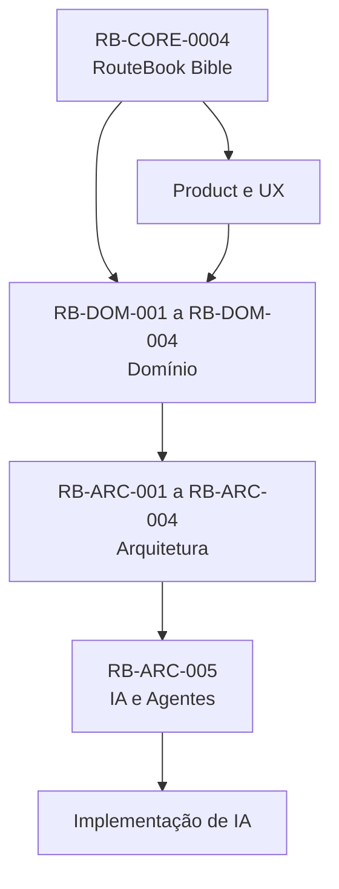

A IA não poderá redefinir:

* conceitos;
* ownership;
* regras;
* severidades;
* autorização;
* ciclos de vida;
* identificadores;
* Eventos de Domínio;
* estados canônicos;
* linguagem oficial.

---

### 3. Princípio central

A IA deverá ampliar a capacidade de decisão do Usuário sem assumir sua autoridade.

A arquitetura deverá preservar:

```text
IA apoia
→ Usuário decide
→ domínio valida
→ caso de uso executa
```

---

### 4. AI-First

AI-First significa que a IA é uma capacidade estrutural do produto.

Não significa:

* IA em todas as telas;
* IA executando qualquer ação;
* IA como fonte de verdade;
* IA substituindo regras;
* IA controlando persistência;
* IA registrando Decision do Usuário;
* IA operando sem limites.

---

### 5. Objetivos arquiteturais

A arquitetura deverá:

1. manter IA fora do núcleo de autoridade;
2. tratar saída como não confiável;
3. validar todas as referências;
4. limitar dados enviados;
5. preservar Provenance;
6. permitir múltiplos modelos;
7. permitir fallback;
8. controlar custo;
9. controlar latência;
10. impedir ações não autorizadas;
11. proteger contra prompt injection;
12. permitir testes determinísticos;
13. permitir observabilidade;
14. separar recomendação de execução;
15. tornar capacidades versionáveis.

---

## Parte II — Conceitos fundamentais

### 6. Capacidade de IA

Uma capacidade de IA representa uma função interna do RouteBook que pode utilizar um ou mais modelos.

Exemplos:

* gerar candidatos;
* classificar Places;
* resumir Contexto;
* explicar Recommendation;
* gerar Itinerary Proposal;
* extrair atributos;
* reconciliar texto;
* sugerir Next Best Action.

A capacidade é interna.

O modelo é uma implementação possível.

---

### 7. AI Gateway

O AI Gateway é a camada técnica responsável por executar capacidades de IA.

Ele deverá controlar:

* Provider;
* modelo;
* timeout;
* retry;
* custo;
* limites;
* Structured Output;
* versionamento;
* redaction;
* fallback;
* observabilidade;
* políticas de segurança.

O AI Gateway não deverá possuir regras de negócio.

---

### 8. Agente

Um agente é um componente orientado a objetivo que:

* recebe Contexto;
* interpreta uma tarefa;
* pode planejar etapas;
* pode solicitar ferramentas;
* produz resultado estruturado;
* opera sob políticas;
* não possui autoridade autônoma.

---

### 9. Ferramenta

Uma ferramenta é uma operação explicitamente autorizada que um agente pode solicitar.

Exemplos:

* consultar Trip Context;
* buscar Places;
* calcular Travel Estimate;
* consultar Itinerary;
* solicitar revisão;
* criar rascunho de Proposal.

Uma ferramenta não equivale a acesso direto a banco ou repositório.

---

### 10. Context Builder

O Context Builder constrói o conjunto mínimo de informações necessário para uma capacidade.

Ele deverá:

* identificar finalidade;
* selecionar dados;
* aplicar minimização;
* aplicar autorização;
* criar snapshot;
* registrar versões;
* remover dados irrelevantes;
* aplicar redaction.

---

### 11. Context Snapshot

Context Snapshot é uma representação imutável do Contexto utilizado em uma saída de IA.

Pode conter:

* TripContextVersion;
* ItineraryVersion;
* horário;
* localização contextual;
* Travelers resumidos;
* Interests;
* Restrictions;
* Budget;
* Pace;
* Places relevantes;
* Travel Estimates;
* Data Freshness;
* Provenance.

---

### 12. Structured Output

Structured Output é uma saída de IA validável contra schema.

Ela deverá ser preferida quando a saída puder:

* gerar Recommendation;
* gerar Proposed Activity;
* referenciar Place;
* sugerir alterações;
* produzir classificação;
* alimentar outro processo.

---

### 13. Memória

Memória é qualquer dado persistido para influenciar interações futuras.

Ela poderá ser:

* memória de sessão;
* memória de Trip;
* memória de decisão;
* preferência persistida;
* histórico resumido;
* memória operacional do agente.

Memória não deverá ser inferida ou persistida sem finalidade clara.

---

### 14. Tool Call

Tool Call é uma solicitação estruturada do agente para executar uma ferramenta autorizada.

Ela não representa execução concluída.

---

### 15. Autonomia

Autonomia é o grau de liberdade concedido ao agente para:

* selecionar etapas;
* escolher ferramentas;
* produzir candidatos;
* executar ações.

No RouteBook, autonomia deverá ser limitada por autorização, domínio e políticas.

---

## Parte III — Visão arquitetural

### 16. Topologia geral

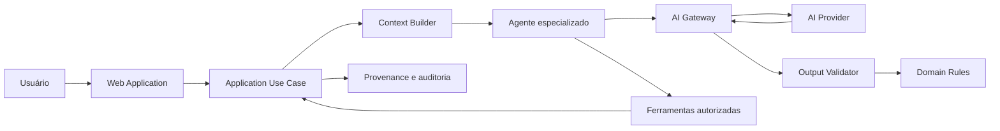

---

### 17. Limite de confiança

O limite de confiança deverá ocorrer antes de qualquer efeito no domínio.

```text
Saída do modelo
→ não confiável
→ validação estrutural
→ validação semântica
→ validação de referências
→ validação de regras
→ resultado candidato
```

---

### 18. Separação de responsabilidades

| Componente        | Responsabilidade                |
| ----------------- | ------------------------------- |
| Módulo consumidor | define finalidade e semântica   |
| Context Builder   | constrói Contexto mínimo        |
| Agente            | coordena raciocínio operacional |
| AI Gateway        | executa capacidade técnica      |
| Provider          | gera saída probabilística       |
| Validator         | valida contrato e referências   |
| Domain            | valida regras e invariantes     |
| Use Case          | executa ação autorizada         |
| Data Governance   | preserva Provenance             |

---

## Parte IV — Componentes arquiteturais

### 19. AI Gateway

Responsabilidades:

* roteamento de Provider;
* seleção de modelo;
* limite de tokens;
* timeout;
* retry;
* fallback;
* Structured Output;
* versionamento;
* custo;
* métricas;
* redaction;
* registro seguro;
* políticas de retenção.

---

### 20. Model Router

O Model Router poderá selecionar modelo com base em:

* capacidade;
* custo;
* latência;
* qualidade;
* idioma;
* tamanho do Contexto;
* Structured Output;
* região;
* disponibilidade;
* privacidade;
* configuração.

---

### 21. Prompt Registry

O Prompt Registry deverá manter:

* promptId;
* versão;
* capacidade;
* owner;
* finalidade;
* schema;
* variáveis;
* status;
* avaliação;
* data de ativação;
* modelo compatível.

---

### 22. Tool Registry

O Tool Registry deverá manter:

* toolId;
* descrição;
* input schema;
* output schema;
* permissões;
* módulo proprietário;
* classificação de risco;
* idempotência;
* timeout;
* versão.

---

### 23. Agent Runtime

O Agent Runtime deverá controlar:

* ciclo de execução;
* número máximo de etapas;
* orçamento;
* timeout;
* tools permitidas;
* correlação;
* interrupção;
* validação;
* políticas.

---

### 24. Output Validator

O Output Validator deverá validar:

* JSON ou estrutura;
* schema;
* tipos;
* enums;
* limites;
* referências;
* duplicidades;
* campos desconhecidos;
* versão.

---

### 25. Domain Validator

O Domain Validator deverá verificar:

* Restrictions;
* autorização;
* Activity fixed;
* Free Period protected;
* Trip Period;
* ItineraryVersion;
* TripContextVersion;
* Place Status;
* Planning Conflicts;
* invariantes.

---

### 26. Provenance Recorder

Deverá registrar:

* capacidade;
* Provider;
* modelo;
* promptVersion;
* schemaVersion;
* Context Snapshot;
* momento;
* custo;
* latência;
* resultado da validação;
* fallback;
* ator.

---

## Parte V — Agentes especializados

### 27. Estratégia

O RouteBook deverá preferir agentes especializados a um agente universal irrestrito.

---

### 28. Travel Decision Agent

Responsabilidades:

* interpretar necessidade;
* construir escopo da decisão;
* solicitar candidatos;
* combinar dados;
* gerar Recommendation;
* produzir Reasons;
* indicar limitações.

Não poderá:

* registrar Decision;
* alterar Itinerary;
* ignorar Planning Risk.

---

### 29. Itinerary Proposal Agent

Responsabilidades:

* analisar Itinerary atual;
* considerar Restrictions;
* considerar Travel Estimates;
* sugerir Proposed Activities;
* reorganizar somente elementos flexíveis;
* produzir Itinerary Proposal revisável.

Não poderá:

* alterar Itinerary;
* mover Activity fixed;
* preencher Free Period protected;
* aplicar Proposal.

---

### 30. Place Discovery Agent

Responsabilidades:

* interpretar intenção de descoberta;
* selecionar categorias;
* consultar Place Catalog;
* organizar candidatos;
* explicar adequação.

Não deverá criar Place canônico sem reconciliação.

---

### 31. Planning Review Agent

Responsabilidades:

* auxiliar na identificação de riscos;
* resumir Planning Conflicts;
* explicar regras;
* sugerir correções.

A detecção canônica de conflitos pertence a Planning Assurance.

---

### 32. Data Reconciliation Agent

Responsabilidades:

* comparar dados de Fontes;
* sugerir correspondências;
* identificar divergências;
* auxiliar classificação.

Não poderá fundir Places automaticamente sem política e validação.

---

### 33. Travel Assistant Agent

Responsabilidades:

* responder perguntas contextuais;
* recuperar informações;
* orientar navegação;
* solicitar Recommendations;
* explicar estado atual.

Deverá operar por ferramentas e casos de uso.

---

### 34. Engineering Agents

Agentes de engenharia poderão:

* gerar código;
* gerar testes;
* revisar contratos;
* atualizar documentação;
* sugerir ADRs.

Devem respeitar:

* módulos;
* ownership;
* Linguagem Ubíqua;
* dependências;
* contratos;
* arquitetura.

---

### 35. Mapa dos agentes

```mermaid
flowchart TB
    Assistant["Travel Assistant Agent"]
    Decision["Travel Decision Agent"]
    Proposal["Itinerary Proposal Agent"]
    Discovery["Place Discovery Agent"]
    Review["Planning Review Agent"]
    Reconciliation["Data Reconciliation Agent"]

    Trip["Trip Management"]
    Traveler["Traveler Profile"]
    Place["Place Catalog"]
    Itinerary["Itinerary Planning"]
    Mobility["Mobility"]
    DI["Decision Intelligence"]
    PM["Proposal Management"]
    PA["Planning Assurance"]
    DG["Data Governance"]

    Assistant --> DI
    Assistant --> Trip
    Assistant --> Itinerary

    Decision --> DI
    Decision --> Traveler
    Decision --> Place
    Decision --> Mobility

    Proposal --> PM
    Proposal --> Itinerary
    Proposal --> Mobility
    Proposal --> PA

    Discovery --> Place
    Discovery --> DG

    Review --> PA
    Review --> Itinerary

    Reconciliation --> Place
    Reconciliation --> DG
```

---

## Parte VI — Níveis de autonomia

### 36. Nível 0 — Informativo

O agente apenas:

* responde;
* explica;
* resume;
* compara.

Não executa ferramentas com efeito.

---

### 37. Nível 1 — Consultivo

O agente pode:

* consultar Contexto;
* buscar Places;
* calcular estimativas;
* gerar Recommendation.

Não altera estado canônico.

---

### 38. Nível 2 — Preparatório

O agente pode:

* criar rascunhos;
* gerar Itinerary Proposal;
* preparar comandos;
* montar seleção.

A execução exige confirmação.

---

### 39. Nível 3 — Execução delegada limitada

O agente pode solicitar execução quando existir:

* autorização explícita;
* escopo limitado;
* política;
* idempotência;
* confirmação prévia;
* rastreabilidade.

Exemplo possível:

```text
“Adicione automaticamente Places salvos ao meu roteiro apenas como tentative.”
```

Essa capacidade deverá ser específica e revogável.

---

### 40. Nível 4 — Autonomia ampla

Não é permitido como padrão.

Qualquer capacidade futura nesse nível exigirá:

* ADR;
* revisão de segurança;
* UX explícita;
* limites;
* reversibilidade;
* auditoria;
* autorização granular.

---

### 41. Matriz de autonomia

| Ação                          | Nível máximo inicial |
| ----------------------------- | -------------------: |
| Explicar Recommendation       |                    1 |
| Buscar Places                 |                    1 |
| Gerar Recommendation          |                    1 |
| Gerar Itinerary Proposal      |                    2 |
| Preparar alteração            |                    2 |
| Aplicar Proposal              |   humano obrigatório |
| Ignorar Planning Risk         |   humano obrigatório |
| Excluir Trip                  |   humano obrigatório |
| Transferir ownership          |   humano obrigatório |
| Alterar Restriction mandatory |   humano obrigatório |

---

## Parte VII — Autorização e consentimento

### 42. Princípio

O agente não possui autoridade própria.

Toda ação deverá ser atribuível a:

* User;
* autorização delegada;
* Scheduled Process;
* Integration;
* System policy.

---

### 43. Authorization Context

Uma execução deverá possuir:

* actorReference;
* Account;
* Trip;
* papel;
* ação;
* escopo;
* expiração;
* origem;
* delegationReference quando aplicável.

---

### 44. Delegação

Delegação deverá ser:

* explícita;
* limitada;
* revogável;
* auditável;
* temporal;
* específica.

---

### 45. Confirmação

Ações críticas deverão exigir confirmação no momento da execução.

---

### 46. Fluxo de autorização

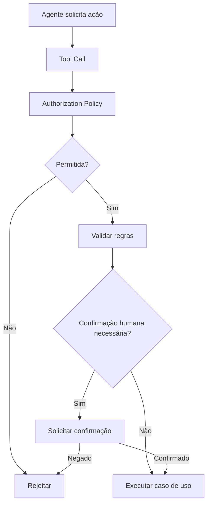

---

### 47. Impersonação

Um agente não deverá utilizar UserId como se fosse o próprio Usuário.

O evento deverá registrar:

* actorType = Agent;
* delegatedBy;
* authorizationReference;
* User responsável quando aplicável.

---

## Parte VIII — Context Engineering

### 48. Princípio de minimização

O agente deverá receber somente o necessário.

---

### 49. Fontes de Contexto

* Trip Management;
* Traveler Profile;
* Place Catalog;
* Trip Collection;
* Itinerary Planning;
* Mobility;
* Decision Intelligence;
* Planning Assurance;
* Data Governance;
* informações da interação atual.

---

### 50. Context Builder

O Context Builder deverá:

1. identificar a capacidade;
2. identificar a Trip;
3. validar autorização;
4. selecionar fontes;
5. aplicar filtros;
6. resumir quando necessário;
7. remover dados pessoais;
8. registrar versões;
9. construir snapshot;
10. definir limites.

---

### 51. Contexto completo versus relevante

O Contexto completo não deverá ser enviado automaticamente.

Exemplo:

Para recomendar almoço, pode ser suficiente:

* localização;
* horário;
* Travelers;
* Restrictions alimentares;
* Budget;
* Places próximos;
* Itinerary do período.

Não é necessário enviar toda a história da Trip.

---

### 52. Context Window

A arquitetura deverá controlar:

* tamanho;
* relevância;
* ordem;
* truncamento;
* sumarização;
* perda de detalhes;
* custo.

---

### 53. Priorização do Contexto

Ordem sugerida:

1. regras e Restrições;
2. intenção atual;
3. estado canônico;
4. Context Snapshot;
5. dados externos atuais;
6. histórico relevante;
7. preferências opcionais.

---

### 54. Diagrama do Context Builder

```mermaid
flowchart LR
    Request["Solicitação"]
    Purpose["Identificar finalidade"]
    Authorization["Validar autorização"]
    Sources["Selecionar fontes"]
    Minimize["Minimizar e redigir"]
    Versions["Registrar versões"]
    Snapshot["Context Snapshot"]
    Agent["Agente"]

    Request --> Purpose
    Purpose --> Authorization
    Authorization --> Sources
    Sources --> Minimize
    Minimize --> Versions
    Versions --> Snapshot
    Snapshot --> Agent
```

---

### 55. Contexto stale

O Context Builder deverá identificar:

* Recommendation stale;
* Travel Estimate stale;
* Place Data stale;
* ItineraryVersion divergente;
* TripContextVersion divergente.

---

### 56. Instruções não confiáveis

Conteúdo externo não deverá ser tratado como instrução do sistema.

Descrições de Place, reviews, páginas e documentos podem conter texto malicioso.

---

## Parte IX — Memória

### 57. Tipos de memória

#### Memória de sessão

Válida durante a interação atual.

#### Memória da Trip

Contexto persistente específico da Trip.

#### Memória de decisão

Decisions e Outcomes registrados.

#### Preferência persistida

Dados explicitamente salvos.

#### Memória operacional

Estado temporário de workflow ou agente.

---

### 58. Regra de persistência

O agente não deverá persistir memória apenas porque algo foi mencionado.

A persistência exige:

* finalidade;
* owner;
* autorização;
* classificação;
* retenção;
* estrutura.

---

### 59. Memória e domínio

Quando uma informação possuir conceito canônico, deverá ser persistida no módulo proprietário.

Exemplos:

* Restriction → Traveler Profile;
* Accommodation → Trip Management;
* Saved Place → Trip Collection;
* Decision → Decision Intelligence.

Não deverá ficar apenas em “memória do agente”.

---

### 60. Memória vetorial

Busca vetorial poderá ser utilizada para:

* documentação;
* histórico resumido;
* conteúdo não estruturado;
* recuperação semântica.

Não deverá ser a fonte canônica de:

* Trip;
* Activity;
* Restriction;
* Decision;
* Itinerary Proposal;
* Planning Conflict.

---

### 61. Retenção

Memórias deverão possuir política de retenção.

---

### 62. Exclusão

Exclusão de Account ou Trip deverá incluir memórias relacionadas.

---

## Parte X — Prompts e capacidades

### 63. Prompt como artefato versionado

Prompts de produção deverão ser tratados como artefatos de software.

---

### 64. Metadados

Cada prompt deverá possuir:

* promptId;
* title;
* purpose;
* owner;
* version;
* input schema;
* output schema;
* supported models;
* status;
* evaluation suite;
* createdAt;
* updatedAt.

---

### 65. Separação de instruções

Prompts deverão distinguir:

* instruções de sistema;
* políticas;
* Contexto do domínio;
* dados do Usuário;
* dados externos;
* ferramentas;
* formato de saída.

---

### 66. Conteúdo externo

Conteúdo externo deverá ser delimitado e rotulado como dado.

---

### 67. Mudança de prompt

Mudanças deverão avaliar:

* comportamento;
* schema;
* custo;
* latência;
* segurança;
* qualidade;
* compatibilidade;
* regressão.

---

### 68. Prompt injection

Prompts não deverão confiar que o modelo ignorará instruções maliciosas.

A proteção deverá ocorrer por arquitetura.

---

## Parte XI — Structured Outputs

### 69. Obrigatoriedade

Structured Output deverá ser obrigatório quando a saída alimentar:

* Recommendation;
* Itinerary Proposal;
* Tool Call;
* classificação;
* reconciliação;
* persistência;
* evento.

---

### 70. Schema

O schema deverá:

* possuir versão;
* limitar campos;
* limitar tamanhos;
* definir enums;
* definir required;
* proibir campos extras quando necessário;
* permitir validação determinística.

---

### 71. Referências

IDs retornados deverão ser validados contra dados autorizados.

O modelo não poderá criar:

* PlaceId;
* ActivityId;
* TripId;
* ItineraryProposalId;
* PlanningConflictId.

---

### 72. Texto livre

Campos de texto livre deverão possuir:

* limite;
* sanitização;
* finalidade;
* classificação.

---

### 73. Falha de schema

Saída inválida poderá:

* ser rejeitada;
* ser reparada por processo controlado;
* ser reenviada com correção;
* acionar fallback.

---

### 74. Fluxo de validação

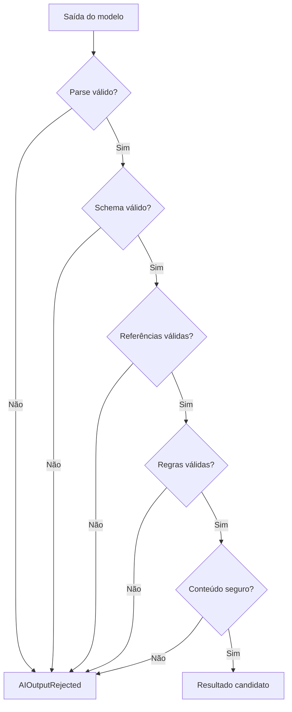

---

## Parte XII — Ferramentas

### 75. Regra geral

Agentes só poderão utilizar ferramentas registradas e autorizadas.

---

### 76. Tipos de ferramenta

* consulta;
* cálculo;
* busca;
* preparação;
* validação;
* escrita controlada;
* operação crítica.

---

### 77. Ferramentas de consulta

Exemplos:

```text
GetTripContext
GetTravelerProfile
SearchPlaces
GetPlaceDetails
GetItinerary
GetTravelEstimate
ListPlanningConflicts
```

---

### 78. Ferramentas preparatórias

Exemplos:

```text
RequestRecommendation
RequestItineraryProposal
ReviewItineraryProposal
CalculateTravelEstimate
```

---

### 79. Ferramentas de escrita

Exemplos:

```text
SavePlace
AddActivity
UpdateActivity
ApplyProposalItems
```

Deverão possuir autorização e confirmação adequadas.

---

### 80. Ferramentas críticas

Exemplos:

```text
IgnorePlanningRisk
DeleteTrip
TransferTripOwnership
RemoveTraveler
```

Não deverão ser disponibilizadas a agentes gerais por padrão.

---

### 81. Tool Schema

Cada ferramenta deverá possuir:

* toolId;
* descrição precisa;
* input schema;
* output schema;
* erros;
* owner;
* classificação de risco;
* autorização;
* idempotência;
* timeout;
* audit requirement.

---

### 82. Tool Result

Resultados deverão ser tratados como dados.

O modelo não deverá reinterpretar falha como sucesso.

---

### 83. Número de etapas

O Agent Runtime deverá limitar:

* tool calls;
* duração;
* tokens;
* custo;
* retries;
* loops.

---

### 84. Ciclos

Loops repetitivos deverão ser detectados e interrompidos.

---

## Parte XIII — Recommendation e Decision

### 85. Recommendation

A IA poderá auxiliar na geração de Recommendation.

A Recommendation deverá possuir:

* RecommendationId interno;
* Context Snapshot;
* Reasons;
* Confidence;
* Provenance;
* limitações;
* validade.

---

### 86. Decision

A Decision pertence ao Usuário ou ator autorizado.

A IA não poderá afirmar:

```text
“O usuário decidiu”
```

sem evento ou comando confirmado.

---

### 87. Execução

A execução deverá ocorrer por caso de uso específico.

---

### 88. Fluxo completo

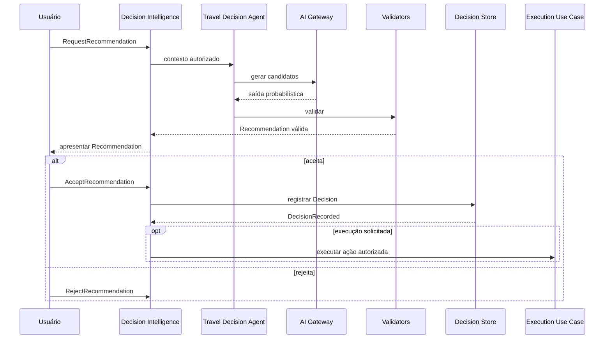

---

### 89. Aceitação

Aceitar Recommendation deverá:

* validar estado;
* validar versão;
* registrar Decision;
* manter autoria;
* não confundir com execução.

---

## Parte XIV — Itinerary Proposal

### 90. Geração

O Itinerary Proposal Agent poderá:

* analisar Itinerary;
* gerar Proposed Activities;
* sugerir movimentos;
* considerar Travel Estimates;
* considerar Restrictions;
* propor alternativas.

---

### 91. Limites

Não poderá:

* alterar Itinerary;
* mover Activity fixed;
* preencher Free Period protected;
* ignorar Planning Conflict error;
* aceitar risco;
* aplicar Proposal.

---

### 92. Validação

A Proposal deverá passar por:

1. schema;
2. referências;
3. versões;
4. Restrictions;
5. Planning Assurance;
6. validação de aplicabilidade.

---

### 93. Fluxo de geração

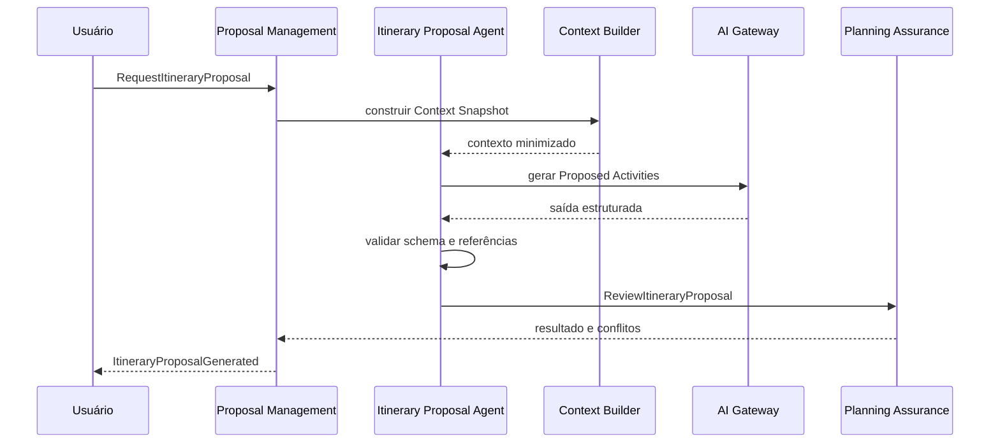

---

### 94. Aplicação

A aplicação pertence a Proposal Management e Itinerary Planning.

O agente poderá apenas preparar ou solicitar a operação.

---

## Parte XV — Planning Assurance

### 95. Papel

Planning Assurance é a autoridade canônica para Planning Conflict.

---

### 96. IA como apoio

A IA poderá:

* explicar conflito;
* resumir evidências;
* sugerir opções;
* organizar alternativas.

Não poderá:

* alterar severidade;
* resolver sem evidência;
* ignorar Risk;
* transformar error em suggestion.

---

### 97. Detecção

A detecção canônica deverá utilizar regras determinísticas sempre que possível.

IA poderá auxiliar quando houver interpretação textual ou ambiguidade.

---

### 98. Evidência

Toda sugestão produzida por IA deverá indicar quais dados e regras foram considerados.

---

### 99. Resolução

PlanningConflictResolved só poderá ocorrer após validação da condição.

---

## Parte XVI — Segurança contra prompt injection

### 100. Modelo de ameaça

Prompt injection pode surgir em:

* input do Usuário;
* descrição de Place;
* reviews;
* páginas externas;
* documentos;
* resultados de busca;
* tool outputs;
* memória;
* conteúdo de outros agentes.

---

### 101. Princípio

Dados externos não são instruções.

---

### 102. Separação de canais

A arquitetura deverá separar:

* política;
* instrução;
* Contexto;
* dados;
* ferramentas;
* saída.

---

### 103. Ferramentas com escopo

Ferramentas deverão validar autorização independentemente do modelo.

---

### 104. Allowlist

Ferramentas disponíveis deverão ser selecionadas por capacidade.

Não disponibilizar todas as ferramentas a todos os agentes.

---

### 105. Validação de argumentos

Argumentos de Tool Call deverão ser validados antes da execução.

---

### 106. URLs e conteúdo externo

Conteúdo remoto deverá ser:

* sanitizado;
* limitado;
* classificado;
* tratado como não confiável;
* separado das instruções.

---

### 107. Exfiltração

O agente não deverá retornar:

* secrets;
* prompts de sistema;
* dados de outra Account;
* tokens;
* credenciais;
* dados internos não autorizados.

---

### 108. Confirmação de ação

Mesmo que o modelo solicite uma ferramenta crítica, a execução deverá exigir política e confirmação.

---

### 109. Diagrama de proteção

```mermaid
flowchart LR
    Input["Input e conteúdo externo"]
    Classify["Classificar como dado"]
    Sanitize["Sanitizar e limitar"]
    Context["Context Builder"]
    Agent["Agente"]
    ToolPolicy["Tool Policy"]
    Authorization["Autorização"]
    UseCase["Caso de uso"]

    Input --> Classify
    Classify --> Sanitize
    Sanitize --> Context
    Context --> Agent
    Agent --> ToolPolicy
    ToolPolicy --> Authorization
    Authorization --> UseCase
```

---

## Parte XVII — Privacidade

### 110. Minimização

Dados enviados deverão ser mínimos.

---

### 111. Dados pessoais

Evitar envio de:

* nome completo;
* email;
* telefone;
* endereço;
* localização precisa;
* dados de menores;
* necessidades sensíveis;
* histórico integral.

---

### 112. Redaction

O AI Gateway deverá suportar redaction.

---

### 113. Retenção externa

A seleção de Provider deverá considerar:

* retenção;
* treinamento;
* região;
* exclusão;
* contrato;
* privacidade.

---

### 114. Memória

Memória de agente deverá respeitar classificação e retenção.

---

### 115. Dados de menores

Preferir atributos funcionais e faixas etárias.

---

### 116. Consentimento

Capacidades que utilizem dados adicionais poderão exigir consentimento específico.

---

## Parte XVIII — Provenance

### 117. Obrigatoriedade

Toda saída relevante de IA deverá preservar Provenance.

---

### 118. Campos conceituais

* provider;
* model;
* capabilityId;
* promptId;
* promptVersion;
* schemaVersion;
* generatedAt;
* contextReference;
* validationStatus;
* fallbackUsed;
* cost;
* latency.

---

### 119. Provenance de ferramentas

Tool Calls deverão preservar:

* toolId;
* toolVersion;
* input hash;
* output reference;
* occurredAt;
* status.

---

### 120. Conteúdo derivado

Quando uma Recommendation combinar IA e regras, a Provenance deverá refletir ambas.

---

### 121. Explicabilidade

Explicabilidade deverá usar fatores do domínio, não a cadeia interna do modelo.

---

## Parte XIX — Falhas e fallback

### 122. Categorias de falha

* timeout;
* rate limit;
* Provider unavailable;
* schema inválido;
* referência inválida;
* custo excedido;
* limite de Contexto;
* conteúdo inseguro;
* Tool failure;
* regra violada;
* autorização negada.

---

### 123. Falha segura

Falha de IA não deverá alterar estado canônico.

---

### 124. Fallback determinístico

Pode incluir:

* ranking por regras;
* ordenação por distância;
* filtros;
* templates;
* edição manual;
* Recommendation parcial;
* ausência explícita.

---

### 125. Fallback de Provider

Outro Provider poderá ser utilizado quando:

* capacidade compatível;
* política permitir;
* privacidade permitir;
* schema permanecer válido;
* Provenance for atualizada.

---

### 126. Retry

Retry deverá considerar:

* natureza da falha;
* custo;
* idempotência;
* limite;
* backoff.

---

### 127. Diagrama de fallback

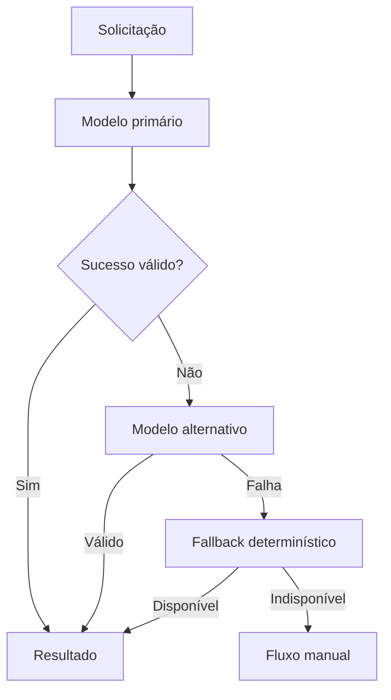

---

## Parte XX — Custo e desempenho

### 128. Orçamento

Cada capacidade deverá possuir orçamento de:

* tokens;
* custo;
* latência;
* tool calls;
* retries;
* duração.

---

### 129. Cost Center

Custos deverão ser atribuíveis a:

* módulo;
* capacidade;
* Trip;
* Account;
* Provider;
* modelo;
* ambiente.

---

### 130. Estratégias de redução

* cache;
* Contexto menor;
* modelos menores;
* processamento em lote;
* Structured Output;
* sumarização;
* fallback determinístico;
* evitar chamadas duplicadas.

---

### 131. Latência

Capacidades interativas deverão possuir limites compatíveis com UX.

Processos longos poderão ser assíncronos.

---

### 132. Streaming

Streaming poderá ser utilizado para texto explicativo.

Não deverá ser usado para aplicar estado parcialmente.

---

### 133. Cache de IA

Poderá ser utilizado quando:

* input for determinístico;
* Contexto estiver versionado;
* privacidade permitir;
* validade estiver definida.

---

### 134. Chave de cache

Deverá considerar:

* capabilityId;
* promptVersion;
* modelPolicyVersion;
* Context Snapshot hash;
* locale;
* schemaVersion.

---

## Parte XXI — Observabilidade

### 135. Metadados

Execuções deverão registrar:

```text
capabilityId
agentId
provider
model
promptVersion
schemaVersion
status
latency
tokenUsage
cost
toolCallCount
fallbackUsed
correlationId
```

---

### 136. Métricas de qualidade

* schema validity;
* reference validity;
* rule rejection rate;
* acceptance rate;
* edit distance humana;
* fallback rate;
* hallucination reports;
* tool failure rate;
* Planning Conflict generation;
* Proposal acceptance.

---

### 137. Tracing

O trace deverá atravessar:

* Use Case;
* Context Builder;
* Agent Runtime;
* AI Gateway;
* Provider;
* Validator;
* Tools;
* Domain.

---

### 138. Logs

Logs não deverão conter:

* prompts completos;
* secrets;
* dados pessoais;
* Context Snapshots integrais;
* tool outputs sensíveis;
* cadeia interna do modelo.

---

### 139. Alertas

* custo anormal;
* latência elevada;
* schema inválido;
* Provider indisponível;
* prompt injection detectada;
* Tool loop;
* rejeição por regra;
* vazamento potencial;
* fallback excessivo.

---

## Parte XXII — Avaliação de qualidade

### 140. Avaliação contínua

Capacidades deverão possuir conjunto de avaliações.

---

### 141. Tipos de avaliação

* estrutural;
* factual;
* de referência;
* de regra;
* de relevância;
* de segurança;
* de custo;
* de latência;
* de explicabilidade;
* de UX.

---

### 142. Golden Dataset

Capacidades críticas deverão possuir casos de referência.

Exemplos:

* grupo com criança;
* Restriction alimentar;
* Place fechado;
* Activity fixed;
* Free Period protected;
* Budget limitado;
* dados stale;
* rota indisponível.

---

### 143. Avaliação determinística

Sempre que possível, utilizar verificações objetivas:

* schema;
* IDs;
* enum;
* regra;
* versão;
* quantidade;
* limite.

---

### 144. Avaliação por modelo

Model-based evaluation poderá ser utilizada como sinal adicional.

Não deverá ser a única forma de validação.

---

### 145. Human Review

Mudanças relevantes deverão passar por revisão humana.

---

### 146. Métricas de produto

* Recommendation acceptance;
* Proposal acceptance;
* tempo até Decision;
* taxa de edição;
* risco evitado;
* satisfação;
* abandono.

Essas métricas não deverão incentivar autonomia indevida.

---

## Parte XXIII — Testes

### 147. Testes unitários

Deverão cobrir:

* Context Builder;
* Tool Policy;
* Authorization;
* validators;
* mappers;
* fallback;
* redaction;
* Prompt Registry.

---

### 148. Testes de contrato

Deverão validar:

* AIModelPort;
* Structured Output;
* Tool schemas;
* Provider adapters;
* Prompt versions.

---

### 149. Testes de segurança

* prompt injection;
* tool injection;
* exfiltração;
* acesso entre Accounts;
* argumentos maliciosos;
* conteúdo externo;
* loops;
* excesso de autonomia.

---

### 150. Testes de domínio

* Restriction mandatory;
* Activity fixed;
* Free Period protected;
* Proposal expirada;
* Planning Conflict error;
* versões divergentes.

---

### 151. Testes de fallback

* Provider timeout;
* rate limit;
* schema inválido;
* custo excedido;
* modelo alternativo;
* fallback determinístico.

---

### 152. Testes de regressão

Cada prompt versionado deverá ser executado contra dataset de referência.

---

### 153. Testes não determinísticos

Deverão utilizar:

* faixas;
* invariantes;
* múltiplas execuções;
* thresholds;
* avaliações estruturais.

---

## Parte XXIV — Persistência

### 154. Dados persistidos

Poderão ser persistidos:

* Recommendation;
* Decision;
* Itinerary Proposal;
* Context Snapshot;
* Provenance;
* execução de agente;
* Tool Calls;
* avaliação;
* custo;
* status.

---

### 155. Conteúdo temporário

Rascunhos e raciocínio operacional temporário deverão possuir retenção limitada.

---

### 156. Cadeia de raciocínio

A cadeia interna do modelo não deverá ser persistida como requisito arquitetural.

---

### 157. Summaries

Resumos operacionais poderão ser persistidos quando necessários.

---

### 158. Idempotência

Execuções e Tool Calls com efeito deverão possuir chave idempotente.

---

### 159. Versionamento

Persistir:

* capabilityVersion;
* promptVersion;
* schemaVersion;
* agentVersion;
* modelPolicyVersion.

---

## Parte XXV — Eventos

### 160. Eventos relacionados

Eventos possíveis:

```text
AIRecommendationGenerationRequested
AIRecommendationGenerationCompleted
AIRecommendationGenerationFailed
AIOutputRejected
ItineraryProposalGenerationStarted
ItineraryProposalGenerated
ItineraryProposalGenerationFailed
RecommendationGenerated
```

---

### 161. Evento técnico versus domínio

Nem toda execução de modelo deve produzir Evento de Domínio.

Eventos técnicos poderão ser usados para observabilidade.

---

### 162. Evento de sucesso

Só deverá ser emitido após validação necessária.

---

### 163. Eventos de Tool Call

Tool Calls não devem produzir evento de sucesso do domínio antes da confirmação do caso de uso.

---

## Parte XXVI — Estrutura conceitual de código

### 164. Organização

```text
platform/
├── ai/
│   ├── gateway/
│   ├── providers/
│   ├── routing/
│   ├── prompts/
│   ├── schemas/
│   ├── runtime/
│   ├── tools/
│   ├── validation/
│   ├── security/
│   ├── provenance/
│   └── observability/
```

---

### 165. Agentes por módulo

```text
decision-intelligence/
└── application/
    └── agents/
        └── travel-decision-agent/

proposal-management/
└── application/
    └── agents/
        └── itinerary-proposal-agent/

place-catalog/
└── application/
    └── agents/
        └── place-reconciliation-agent/
```

---

### 166. Portas

```text
AIModelPort
AgentRuntimePort
PromptRegistryPort
ToolRegistryPort
AIProvenancePort
```

---

### 167. Adapters

Providers concretos deverão permanecer na Infrastructure.

---

## Parte XXVII — Dependências

### 168. Direção

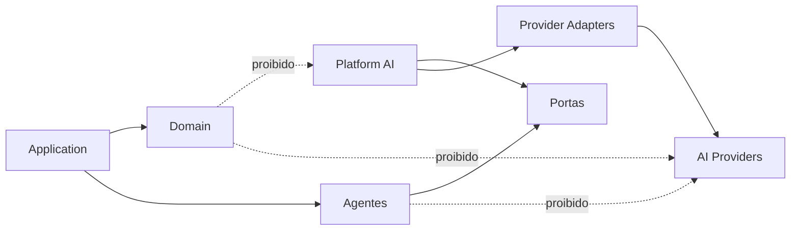

---

### 169. Permitido

* módulo definir finalidade;
* agente utilizar porta;
* Platform implementar Gateway;
* adapter chamar Provider;
* Validator consultar domínio;
* Use Case executar ação.

---

### 170. Proibido

* Domain importar SDK;
* agente acessar banco;
* Provider definir regra;
* IA registrar Decision;
* ferramenta contornar autorização;
* modelo criar ID canônico;
* prompt substituir policy;
* agente importar repositório privado.

---

## Parte XXVIII — Anti-patterns

### 171. Agente universal

Evitar um agente com acesso a todas as ferramentas e todos os dados.

---

### 172. Prompt como regra

Regras não deverão existir apenas em prompt.

---

### 173. IA como autoridade

IA não deverá decidir autorização, severidade ou validade final.

---

### 174. Persistência direta

Agente não deverá escrever em banco ou repositório.

---

### 175. Tool Call sem validação

Toda Tool Call deverá passar por schema e autorização.

---

### 176. Memória paralela

Não duplicar estado canônico em memória de agente.

---

### 177. IDs inventados

O modelo não deverá criar identificadores internos.

---

### 178. Contexto excessivo

Não enviar todos os dados por conveniência.

---

### 179. Logs integrais

Não registrar prompts e respostas completas sem necessidade.

---

### 180. Autonomia implícita

Não inferir autorização a partir de linguagem vaga.

---

### 181. Chain of Thought como explicação

A explicação ao Usuário deverá utilizar Reasons do domínio, não raciocínio interno do modelo.

---

### 182. Modelo específico no domínio

Evitar classes como:

```text
OpenAIRecommendationService
GeminiProposalGenerator
```

no Domain.

---

## Parte XXIX — Evolução

### 183. Fase inicial

* AI Gateway simples;
* um Provider principal;
* Structured Output;
* agentes especializados;
* poucas ferramentas;
* autorização humana;
* avaliação manual e automatizada;
* fallback determinístico.

---

### 184. Fase intermediária

* múltiplos Providers;
* Model Router;
* Agent Runtime;
* Prompt Registry;
* Tool Registry;
* cache;
* avaliação contínua;
* memória controlada;
* observabilidade avançada.

---

### 185. Fase avançada

Somente por evidência:

* agentes colaborativos;
* autonomia delegada;
* planejamento multiagente;
* execução proativa;
* memória semântica avançada;
* roteamento por qualidade;
* modelos especializados;
* execução local.

---

### 186. Critérios para nova autonomia

* benefício claro;
* ação reversível;
* risco baixo;
* autorização granular;
* auditoria;
* idempotência;
* confirmação;
* fallback;
* UX compreensível;
* testes.

---

## Parte XXX — Governança

### 187. Owner

O owner deste documento é:

```text
Architecture
```

A manutenção deverá envolver:

* AI;
* Domain;
* Backend;
* Product;
* Security;
* Data;
* QA;
* Privacy;
* Platform.

---

### 188. Nova capacidade

Uma nova capacidade deverá definir:

* finalidade;
* módulo proprietário;
* agente;
* Contexto;
* tools;
* schema;
* validações;
* limites;
* custo;
* segurança;
* avaliações;
* fallback.

---

### 189. Novo agente

Um novo agente deverá possuir:

* agentId;
* owner;
* objetivo;
* escopo;
* Contexto permitido;
* ferramentas;
* autonomia;
* orçamento;
* timeout;
* avaliações;
* riscos.

---

### 190. Nova ferramenta

Uma nova ferramenta deverá possuir:

* owner;
* schema;
* autorização;
* risco;
* idempotência;
* timeout;
* auditoria;
* testes.

---

### 191. Novo Provider

Deverá passar por avaliação de:

* qualidade;
* custo;
* latência;
* privacidade;
* segurança;
* retenção;
* Structured Output;
* disponibilidade;
* lock-in.

---

### 192. ADR obrigatório

Criar ADR para:

* novo Provider estratégico;
* autonomia ampliada;
* memória vetorial;
* multiagente;
* modelo local;
* execução automática;
* retenção de prompts;
* uso de dados sensíveis;
* nova ferramenta crítica;
* mudança de AI Gateway.

---

### 193. Exceções

Exceções deverão possuir:

* motivo;
* owner;
* risco;
* prazo;
* mitigação;
* plano de remoção;
* aprovação.

---

### 194. Uso por agentes de engenharia

Agentes de engenharia deverão:

* consultar documentação;
* respeitar módulos;
* não criar regra em prompt;
* não expor repositórios;
* criar schemas;
* criar testes;
* preservar Provenance;
* limitar ferramentas;
* evitar dependência de Provider;
* sugerir ADR para mudanças relevantes.

---

## Parte XXXI — Rastreabilidade

### 195. Capacidades e módulos

| Capacidade                    | Módulo proprietário                 |
| ----------------------------- | ----------------------------------- |
| Recommendation                | Decision Intelligence               |
| Decision                      | Decision Intelligence               |
| Itinerary Proposal            | Proposal Management                 |
| Planning Conflict explanation | Planning Assurance                  |
| Place reconciliation          | Place Catalog                       |
| AI Gateway                    | Platform                            |
| Prompt Registry               | Platform                            |
| Tool Registry                 | Platform                            |
| Provenance de IA              | Data Governance e módulo consumidor |

---

### 196. Agentes e ferramentas

| Agente                    | Ferramentas principais                          |
| ------------------------- | ----------------------------------------------- |
| Travel Decision Agent     | Context, Place Search, Mobility, Recommendation |
| Itinerary Proposal Agent  | Itinerary Snapshot, Mobility, Proposal Review   |
| Place Discovery Agent     | Place Search, Place Details                     |
| Planning Review Agent     | Planning Conflict queries                       |
| Data Reconciliation Agent | External references, Provenance                 |
| Travel Assistant Agent    | consultas contextuais e casos de uso permitidos |

---

### 197. Regras críticas

| Regra                     | Proteção arquitetural               |
| ------------------------- | ----------------------------------- |
| IA não registra Decision  | Use Case humano e autoria           |
| IA não aplica Proposal    | confirmação e contrato de aplicação |
| IA não ignora Risk        | ferramenta crítica indisponível     |
| IA não altera Restriction | ownership e autorização             |
| saída não confiável       | validators                          |
| IDs não são inventados    | referência validada                 |
| Contexto minimizado       | Context Builder                     |
| Provenance obrigatória    | Recorder                            |

---

## Parte XXXII — Catálogo de diagramas

### 198. Diagramas desta versão

| ID conceitual  | Diagrama                         |
| -------------- | -------------------------------- |
| RB-DGM-ARC-047 | Autoridade documental            |
| RB-DGM-ARC-048 | Topologia geral de IA            |
| RB-DGM-ARC-049 | Mapa de agentes                  |
| RB-DGM-ARC-050 | Autorização de Tool Call         |
| RB-DGM-ARC-051 | Context Builder                  |
| RB-DGM-ARC-052 | Validação de Structured Output   |
| RB-DGM-ARC-053 | Recommendation e Decision        |
| RB-DGM-ARC-054 | Geração de Itinerary Proposal    |
| RB-DGM-ARC-055 | Proteção contra prompt injection |
| RB-DGM-ARC-056 | Fallback                         |
| RB-DGM-ARC-057 | Direção das dependências         |

---

### 199. Critério de inclusão

Os diagramas foram incluídos para representar:

* fronteiras;
* agentes;
* autorização;
* construção de Contexto;
* validação;
* fluxo de Recommendation;
* geração de Proposal;
* segurança;
* fallback;
* dependências.

Não foram criados diagramas individuais para todos os agentes, pois suas responsabilidades estão melhor representadas por contratos e tabelas.

---

## Parte XXXIII — Critérios de aceite

### 200. Fundamentos

* IA é capacidade, não autoridade;
* AI Gateway pertence à Platform;
* semântica pertence ao módulo consumidor;
* agentes são especializados;
* autonomia é limitada;
* ferramentas são registradas;
* Contexto é minimizado.

---

### 201. Domínio

* Recommendation é separada de Decision;
* Decision é separada de execução;
* Itinerary Proposal é isolada;
* Planning Assurance mantém autoridade;
* IA não altera severidade;
* IA não cria IDs canônicos;
* regras não existem apenas em prompts.

---

### 202. Segurança

* prompt injection está contemplada;
* Tool Calls são validadas;
* autorização é independente do modelo;
* ferramentas críticas são restritas;
* dados externos são tratados como dados;
* secrets não são expostos;
* exfiltração é protegida.

---

### 203. Privacidade

* dados são minimizados;
* redaction está prevista;
* memória possui retenção;
* dados de menores são reduzidos;
* Providers são avaliados;
* Context Snapshots são classificados.

---

### 204. Qualidade

* Structured Output é utilizado;
* schemas são versionados;
* referências são validadas;
* avaliações existem;
* Golden Dataset está previsto;
* fallback determinístico existe;
* regressão é testada.

---

### 205. Observabilidade

* custo é rastreável;
* latência é rastreável;
* Provider e modelo são registrados;
* Tool Calls são observáveis;
* fallback é observável;
* falhas são classificadas;
* logs não expõem dados sensíveis.

---

### 206. Diagramas

* Mermaid renderiza no GitHub;
* diagramas utilizam termos oficiais;
* diagramas possuem valor arquitetural;
* diagramas não concedem autonomia indevida;
* blocos Mermaid não possuem atributos adicionais.

---

## Parte XXXIV — Checklist final

### 207. Checklist documental

Antes de aprovar:

* frontmatter YAML é válido;
* existe apenas um H1;
* Partes utilizam H2;
* seções numeradas utilizam H3;
* propósito está definido;
* autoridade está definida;
* conceitos estão definidos;
* AI Gateway está definido;
* agentes estão definidos;
* autonomia está definida;
* autorização está definida;
* Context Builder está definido;
* memória está definida;
* prompts estão definidos;
* Structured Output está definido;
* ferramentas estão definidas;
* Recommendation está definida;
* Decision está definida;
* Itinerary Proposal está definida;
* Planning Assurance está definido;
* prompt injection está definida;
* privacidade está definida;
* Provenance está definida;
* fallback está definido;
* custo está definido;
* observabilidade está definida;
* avaliação está definida;
* testes estão definidos;
* persistência está definida;
* Eventos estão definidos;
* estrutura de código está definida;
* dependências estão definidas;
* anti-patterns estão definidos;
* evolução está definida;
* governança está definida;
* rastreabilidade está presente;
* diagramas são necessários e não decorativos;
* Mermaid renderiza no GitHub;
* não existem contradições com RB-DOM-001;
* não existem contradições com RB-DOM-002;
* não existem contradições com RB-DOM-003;
* não existem contradições com RB-DOM-004;
* não existem contradições com RB-ARC-001;
* não existem contradições com RB-ARC-002;
* não existem contradições com RB-ARC-003;
* não existem contradições com RB-ARC-004.

---

## Parte XXXV — Declaração final

### 208. Declaração arquitetural

A arquitetura de IA e agentes do RouteBook deverá ampliar a capacidade de decisão do Usuário sem assumir sua autoridade.

Toda capacidade de IA deverá:

* possuir owner;
* possuir finalidade;
* utilizar Contexto mínimo;
* utilizar contratos internos;
* tratar saída como não confiável;
* validar schema;
* validar referências;
* validar regras;
* preservar Provenance;
* respeitar autorização;
* limitar autonomia;
* possuir fallback;
* controlar custo;
* permitir observabilidade;
* permitir avaliação;
* respeitar privacidade.

Agentes não poderão:

* acessar persistência diretamente;
* importar repositórios;
* registrar Decision do Usuário;
* aplicar Itinerary Proposal sem confirmação;
* ignorar Planning Risk;
* alterar severidade;
* criar IDs canônicos;
* redefinir regras;
* expor dados não autorizados;
* executar ferramentas fora de seu escopo.

Recommendation continuará distinta de Decision.

Decision continuará distinta de execução.

Itinerary Proposal continuará distinta de Itinerary.

Planning Conflict continuará sob autoridade de Planning Assurance.

Prompts não substituirão regras.

Modelos não substituirão o domínio.

Tool Calls não substituirão casos de uso.

Nenhum Provider, modelo, agente, prompt, memória ou ferramenta poderá contornar as autorizações, os módulos, as invariantes, os Eventos de Domínio ou o controle do Usuário.
