---

id: RB-ARC-001

title: Visão Geral da Arquitetura
description: Define a visão arquitetural de alto nível do RouteBook, incluindo princípios, estilos, contextos, módulos, camadas, componentes, fluxos, integrações, dados, inteligência artificial, segurança, observabilidade e estratégia de evolução.

document_type: architecture
owner: Architecture

status: Draft
version: "0.2.0"

created: "2026-07-17"
last_updated: "2026-07-18"

authors:

- RouteBook Team

tags:

- architecture
- architecture-overview
- software-architecture
- modular-monolith
- domain-driven-design
- ports-and-adapters
- event-driven
- ai-first
- cloud-ready
- diagrams
- mermaid

related_documents:

- RB-CORE-0001
- RB-CORE-0002
- RB-CORE-0003
- RB-CORE-0004
- RB-PRD-001
- RB-PRD-002
- RB-PRD-003
- RB-PRD-004
- RB-PRD-005
- RB-PRD-006
- RB-PRD-007
- RB-PRD-008
- RB-UX-001
- RB-UX-002
- RB-UX-003
- RB-UX-004
- RB-UX-005
- RB-UX-006
- RB-DS-001
- RB-DS-002
- RB-DS-003
- RB-DS-004
- RB-DOM-001
- RB-DOM-002
- RB-DOM-003
- RB-DOM-004
- RB-ARC-002

prerequisites:

- RB-CORE-0001
- RB-CORE-0002
- RB-CORE-0003
- RB-CORE-0004
- RB-PRD-001
- RB-DOM-001
- RB-DOM-002
- RB-DOM-003
- RB-DOM-004

next_documents:

- RB-ARC-002
- RB-ARC-003
- RB-ARC-004
- RB-ARC-005
- RB-DATA-001
- RB-API-001
- RB-SEC-001
- RB-QA-001

ai_context:
priority: critical
index: true
---

# RouteBook — Visão Geral da Arquitetura

## Parte I — Fundamentos arquiteturais

### 1. Propósito deste documento

Este documento define a visão arquitetural de alto nível do RouteBook.

Seu objetivo é transformar os princípios de produto, experiência e domínio em uma estrutura técnica:

* coerente;
* implementável;
* evolutiva;
* testável;
* observável;
* segura;
* economicamente sustentável;
* preparada para IA;
* controlada pelo Usuário.

Esta visão deverá orientar:

* decisões arquiteturais;
* organização do código;
* definição de módulos;
* comunicação entre módulos;
* persistência;
* APIs;
* frontend;
* backend;
* uso de IA;
* integrações;
* segurança;
* observabilidade;
* testes;
* implantação;
* evolução do produto;
* agentes de engenharia.

Este documento define:

* drivers arquiteturais;
* restrições;
* princípios;
* estilo arquitetural;
* contexto do sistema;
* containers;
* módulos;
* camadas;
* responsabilidades;
* dependências;
* comunicação;
* fluxos;
* dados;
* integrações;
* IA;
* segurança;
* resiliência;
* observabilidade;
* qualidade;
* implantação;
* evolução;
* governança.

Este documento não define:

* código;
* endpoints completos;
* schemas físicos finais;
* tabelas definitivas;
* provedores definitivos;
* framework obrigatório;
* configuração detalhada de infraestrutura;
* contratos detalhados de API;
* pipelines completos;
* decisões técnicas de baixo nível.

---

### 2. Autoridade documental

A Arquitetura deverá implementar e proteger as decisões estabelecidas pelas camadas documentais anteriores.

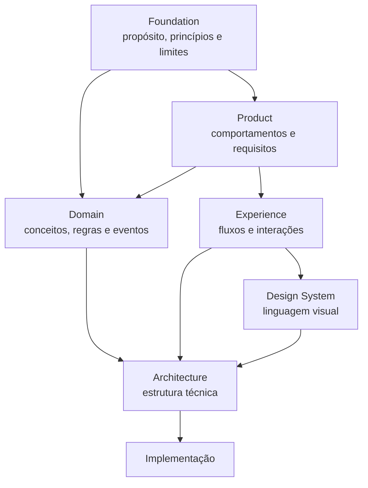

A Arquitetura não deverá alterar conceitos do domínio para se adaptar a limitações locais de implementação.

Quando houver tensão entre conveniência técnica e integridade do domínio, a integridade do domínio deverá prevalecer.

---

### 3. Princípio arquitetural central

O RouteBook deverá ser estruturado como uma plataforma de apoio à decisão de viagem.

A arquitetura não deverá tratar o produto apenas como:

* catálogo de Lugares;
* agenda;
* mapa;
* gerador de roteiros;
* chatbot;
* agregador turístico.

A estrutura técnica deverá proteger o fluxo:

```text
Contexto
→ Recomendação
→ Decisão
→ Execução
→ Resultado
→ Aprendizado
```

Cada estágio possui significado próprio e não deve ser fundido aos demais.

---

### 4. Visão arquitetural resumida

O RouteBook deverá iniciar como uma aplicação web responsiva, com backend organizado como **Monólito Modular** e limites explícitos entre módulos de negócio.

A arquitetura combina:

* Domain-Driven Design;
* Monólito Modular;
* arquitetura em camadas;
* Ports and Adapters;
* comunicação orientada a casos de uso;
* eventos internos;
* processamento assíncrono quando necessário;
* integrações externas isoladas;
* IA como capacidade especializada;
* contratos versionados;
* observabilidade desde o início;
* evolução incremental.

---

## Parte II — Drivers arquiteturais

### 5. Driver de produto

O RouteBook deverá ajudar o viajante a tomar decisões antes e durante a Viagem.

A arquitetura deverá suportar perguntas como:

* O que fazer agora?
* Para onde devo ir?
* Onde vale a pena comer?
* Qual opção combina melhor com o grupo?
* Quanto tempo será gasto?
* Quanto será necessário deslocar?
* O Roteiro é viável?
* O que precisa ser revisto?
* Qual é a próxima melhor ação?

---

### 6. Driver de personalização

As respostas deverão considerar o Contexto específico da Viagem:

* Destination;
* Accommodation;
* Trip Period;
* Travelers;
* Group Profile;
* Interests;
* Restrictions;
* Pace;
* Budget;
* Itinerary;
* horário;
* localização contextual;
* Transport Mode;
* dados disponíveis;
* qualidade e atualidade dos dados.

A arquitetura deverá permitir que o Contexto seja montado de forma explícita e versionada.

---

### 7. Driver de confiabilidade

O sistema deverá diferenciar:

* fato confirmado;
* dado externo;
* estimativa;
* inferência;
* Recommendation;
* Decision;
* informação desconhecida;
* informação desatualizada;
* informação conflitante;
* conteúdo gerado por IA.

A ausência de dados não deverá ser convertida em informação falsa.

---

### 8. Driver de controle do Usuário

IA e automações poderão:

* sugerir;
* explicar;
* preparar;
* revisar;
* comparar;
* simular;
* gerar Propostas.

Não poderão, sem autorização válida:

* registrar Decision em nome do Usuário;
* aplicar Itinerary Proposal;
* ignorar Planning Risk;
* remover Activity;
* alterar Restriction obrigatória;
* excluir Trip;
* transferir ownership.

---

### 9. Driver de evolução

O projeto inicia como produto pessoal, mas deverá permitir evolução para:

* múltiplos Usuários;
* colaboração;
* múltiplos Destinos;
* múltiplas fontes de dados;
* aplicativos móveis;
* reservas;
* notificações;
* sincronização;
* operação offline parcial;
* integrações;
* novos agentes;
* extração seletiva de serviços.

---

### 10. Driver de custo

A arquitetura inicial deverá priorizar:

* baixo custo operacional;
* simplicidade de implantação;
* poucos componentes físicos;
* serviços gerenciados quando vantajosos;
* consumo controlado de IA;
* processamento assíncrono seletivo;
* escalabilidade por evidência.

---

### 11. Driver de qualidade

A solução deverá favorecer:

* testes automatizados;
* modularidade;
* contratos claros;
* substituição de fornecedores;
* observabilidade;
* tratamento de falhas;
* idempotência;
* rastreabilidade;
* acessibilidade;
* privacidade;
* segurança.

---

## Parte III — Restrições arquiteturais

### 12. Aplicação web inicial

O primeiro cliente será uma aplicação web responsiva.

Deverá funcionar adequadamente em:

* navegadores móveis;
* navegadores desktop;
* diferentes larguras;
* conexões instáveis;
* dispositivos de menor capacidade.

---

### 13. GitHub como fonte canônica

Documentação, decisões, contratos e código deverão permanecer no repositório oficial.

Nenhuma ferramenta externa deverá ser a única fonte de verdade do projeto.

---

### 14. Documentação-first

Decisões estruturais relevantes deverão ser documentadas antes ou junto da implementação.

Mudanças arquiteturais importantes deverão atualizar:

* documentação;
* diagramas;
* ADRs;
* contratos;
* testes;
* registro documental.

---

### 15. AI-First com controle

A IA será uma capacidade de primeira classe.

Ela não será responsável direta pela integridade do domínio.

Toda saída de IA capaz de produzir efeito deverá passar por:

* validação estrutural;
* validação semântica;
* validação de referências;
* validação de autorização;
* validação de invariantes;
* registro de Provenance.

---

### 16. Dependências externas

O RouteBook poderá depender de:

* identidade;
* mapas;
* geocodificação;
* rotas;
* catálogo de Lugares;
* imagens;
* avaliações;
* clima;
* preços;
* IA;
* analytics;
* notificações.

Essas dependências deverão ser isoladas por contratos internos.

---

### 17. MVP incremental

Capacidades futuras não deverão ser antecipadas por complexidade desnecessária.

A arquitetura deverá permitir evolução sem exigir, desde o início:

* microservices;
* múltiplos bancos;
* múltiplas filas;
* Event Sourcing;
* service mesh;
* orquestração distribuída;
* infraestrutura de alta complexidade.

---

## Parte IV — Princípios arquiteturais

### 18. Domínio no centro

Regras de negócio deverão permanecer independentes de:

* framework;
* banco de dados;
* provedor externo;
* interface;
* protocolo;
* IA;
* infraestrutura.

---

### 19. Monólito Modular primeiro

O backend deverá iniciar como um Monólito Modular.

Isso significa:

* unidade principal de implantação;
* módulos com responsabilidades explícitas;
* dependências controladas;
* contratos internos;
* persistência logicamente separada;
* possibilidade de extração futura.

Não significa:

* código sem organização;
* banco compartilhado sem limites;
* acesso irrestrito entre módulos;
* lógica centralizada;
* acoplamento por tabelas.

---

### 20. Separação por capacidade

A organização principal do código deverá seguir capacidades de negócio.

Estrutura conceitual:

```text
identity-access/
trip-management/
traveler-profile/
place-catalog/
trip-collection/
itinerary-planning/
mobility/
decision-intelligence/
proposal-management/
planning-assurance/
data-governance/
platform/
```

Uma estrutura global baseada apenas em:

```text
controllers/
services/
repositories/
models/
```

não deverá substituir a separação por domínio.

---

### 21. Dependências direcionadas para dentro

As dependências deverão apontar para conceitos mais estáveis.

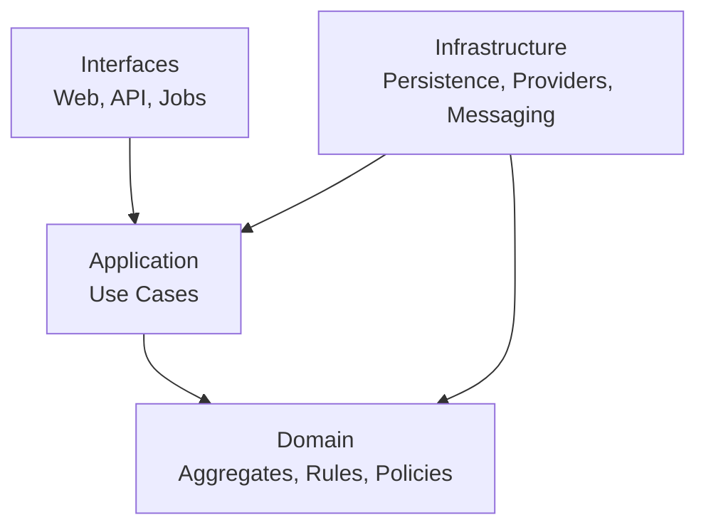

O Domain não deverá depender de Infrastructure.

---

### 22. Ports and Adapters

Integrações externas deverão ser acessadas por portas internas.

Exemplo conceitual:

```text
TravelEstimationPort
├── GoogleMapsAdapter
├── MapboxAdapter
└── InMemoryTravelEstimationAdapter
```

O domínio deverá utilizar contratos próprios.

Objetos de fornecedores não deverão atravessar diretamente todo o sistema.

---

### 23. Contratos internos explícitos

A comunicação entre módulos deverá utilizar:

* casos de uso;
* portas;
* consultas;
* comandos;
* Eventos de Domínio;
* eventos de integração;
* DTOs internos versionáveis.

Um módulo não deverá alterar diretamente o agregado pertencente a outro módulo.

---

### 24. Estado canônico e estado derivado

A arquitetura deverá diferenciar estado canônico de estado derivado.

#### Estado canônico

Inclui principalmente:

* Account;
* Trip;
* Traveler Profile;
* Trip Collection;
* Itinerary;
* Activity;
* Free Period;
* Decision;
* Place interno;
* Data Source.

#### Estado contextual ou derivado

Inclui principalmente:

* Recommendation;
* Recommendation Confidence;
* Itinerary Proposal;
* Planning Conflict;
* Travel Estimate;
* projeções;
* índices;
* caches;
* resumos;
* resultados de revisão.

Estado derivado poderá ser:

* recalculado;
* invalidado;
* substituído;
* expirado;
* reconstruído.

A invalidação de estado derivado não deverá apagar estado canônico.

---

### 25. Recommendation, Decision e execução

A arquitetura deverá preservar:

```text
Recommendation ≠ Decision
Decision ≠ execução
```

`Decision Intelligence` poderá produzir Recommendation.

A Recommendation:

* não altera estado canônico;
* não representa escolha do Usuário;
* não representa execução.

Uma Decision:

* registra escolha;
* possui ator;
* possui Context Snapshot;
* pode ou não produzir execução.

A execução deverá ocorrer por caso de uso específico.

---

### 26. Itinerary Proposal isolada

Uma `ItineraryProposal` deverá possuir:

* identidade própria;
* armazenamento próprio;
* ciclo de vida próprio;
* versão base do Itinerary;
* versão base do Trip Context;
* validade;
* itens propostos;
* justificativas;
* limitações.

A Proposta não faz parte do Itinerary canônico.

Somente itens aceitos poderão ser aplicados.

---

### 27. Planning Assurance separado de erros técnicos

`Planning Assurance` será responsável por avaliar a consistência do planejamento.

Ele não deverá ser utilizado como repositório genérico de:

* exceções;
* falhas HTTP;
* timeouts;
* erros de banco;
* falhas de programação.

`PlanningConflict` representa condição de domínio detectada no planejamento.

---

### 28. Sincronia somente quando necessária

Comunicação síncrona deverá ser utilizada quando o resultado for necessário para concluir a operação.

Comunicação assíncrona deverá ser considerada para:

* geração de Itinerary Proposal;
* geração de Recommendation;
* atualização de dados externos;
* cálculo de rotas;
* revisão ampla do Itinerary;
* invalidação de objetos derivados;
* indexação;
* notificações;
* analytics;
* projeções.

---

### 29. Eventos para efeitos secundários

Eventos deverão ser utilizados quando uma mudança confirmada produzir consequências fora da transação principal.

Exemplo:

```text
TripAccommodationChanged
→ invalidar Travel Estimates
→ invalidar Recommendations
→ expirar Itinerary Proposals incompatíveis
→ reavaliar Planning Conflicts
→ marcar Itinerary como outdated
```

---

### 30. Consistência entre estado e eventos

A Arquitetura deverá garantir que:

* evento de sucesso só represente mudança confirmada;
* mudança confirmada não fique sem evento obrigatório;
* eventos sejam imutáveis;
* consumidores sejam idempotentes;
* reentrega não duplique efeitos;
* falhas de publicação sejam recuperáveis.

Quando necessário, deverá ser considerada estratégia transacional como Outbox.

A adoção física será definida em documento técnico ou ADR.

---

### 31. Falha parcial

Falhas externas deverão permanecer restritas à capacidade afetada.

Exemplos:

* falha de IA não altera Itinerary;
* falha de rota não assume Travel Time zero;
* falha de catálogo não remove Place;
* falha de notificação não desfaz Decision;
* falha de analytics não bloqueia planejamento.

---

### 32. Evolução por evidência

Novos serviços, bancos, filas ou mecanismos complexos deverão ser introduzidos apenas quando houver necessidade comprovada.

---

## Parte V — Estilo arquitetural

### 33. Estilo principal

O estilo inicial será:

```text
Monólito Modular
+ Domain-Driven Design
+ Arquitetura em Camadas
+ Ports and Adapters
+ Eventos internos
+ Processamento assíncrono seletivo
```

---

### 34. Unidade de implantação

A solução poderá iniciar com:

* aplicação web;
* backend modular;
* banco relacional;
* cache opcional;
* armazenamento de assets;
* worker opcional;
* serviços externos.

Frontend e backend poderão ser implantados separadamente.

O backend continuará sendo um Monólito Modular enquanto essa decisão atender aos drivers.

---

### 35. Microservices não são objetivo inicial

Microservices não deverão ser adotados apenas por:

* tendência;
* expectativa futura;
* número de módulos;
* preferência técnica;
* desejo de “escalar”.

Extração deverá ocorrer somente quando o custo operacional for justificado.

---

### 36. Critérios para extração futura

Um módulo poderá ser candidato a serviço independente quando houver evidência de:

* escala independente;
* ciclo de implantação distinto;
* isolamento de segurança;
* alta carga especializada;
* ownership separado;
* disponibilidade específica;
* dependência externa intensiva;
* necessidade de tecnologia diferente.

Candidatos possíveis, sem compromisso antecipado:

* Mobility;
* Place Catalog;
* Decision Intelligence;
* Proposal Management;
* notificações;
* processamento de dados.

---

## Parte VI — Contexto do sistema

### 37. Atores

Atores conceituais:

* Usuário autenticado;
* Viajante sem Conta;
* administrador futuro;
* agente de IA;
* Scheduled Process;
* Integration;
* serviços externos;
* Fontes de Dados.

---

### 38. Sistemas externos

Possíveis sistemas externos:

* provedor de identidade;
* mapas;
* geocodificação;
* rotas;
* fontes de Lugares;
* imagens;
* avaliações;
* clima;
* provedor de IA;
* analytics;
* monitoramento;
* notificações.

---

### 39. Diagrama de contexto

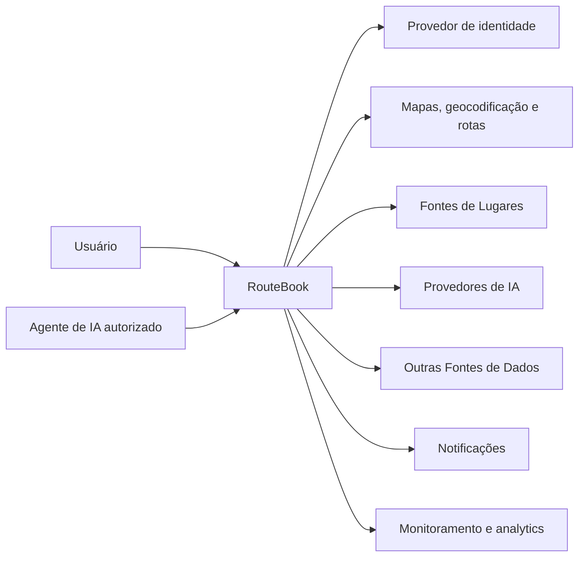

O agente de IA não constitui canal privilegiado.

Toda operação iniciada por agente deverá passar pelos mesmos controles de:

* autenticação;
* autorização;
* validação;
* regras;
* auditoria.

---

## Parte VII — Containers

### 40. Containers iniciais

A arquitetura inicial deverá considerar:

1. Web Application;
2. Backend Application;
3. Relational Database;
4. Background Worker opcional;
5. Cache opcional;
6. Object Storage;
7. External Providers;
8. Observability Platform.

---

### 41. Diagrama de containers

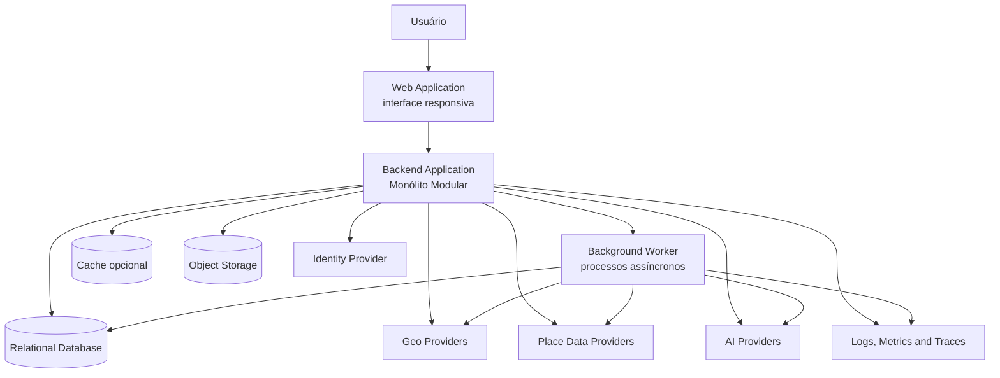

---

### 42. Web Application

Responsabilidades:

* apresentação;
* navegação;
* formulários;
* visualização de mapas;
* estados de carregamento;
* estados offline ou degradados;
* acessibilidade;
* internacionalização futura;
* captura explícita de decisões;
* comunicação com Backend.

Não deverá:

* implementar regras canônicas;
* confiar apenas em validações locais;
* aplicar Propostas sem confirmação do Backend;
* transformar unknown em valor assumido.

---

### 43. Backend Application

Responsabilidades:

* casos de uso;
* domínio;
* autorização;
* persistência;
* integração;
* validação;
* eventos;
* observabilidade;
* idempotência;
* exposição de APIs.

---

### 44. Background Worker

Poderá executar:

* geração de Recommendation;
* geração de Itinerary Proposal;
* atualização de Places;
* cálculo de Travel Estimate;
* reavaliação de Planning Conflicts;
* notificações;
* projeções;
* tarefas programadas.

O Worker não deverá acessar tabelas internas de módulos sem contratos definidos.

---

### 45. Relational Database

O banco relacional deverá ser a persistência principal inicial.

A separação lógica entre módulos poderá utilizar:

* schemas;
* convenções de tabelas;
* ownership explícito;
* migrations por módulo;
* repositórios isolados.

Um módulo não deverá depender diretamente das tabelas privadas de outro módulo.

---

## Parte VIII — Módulos arquiteturais

### 46. Módulos iniciais

O backend deverá considerar os seguintes módulos lógicos:

1. Identity and Access;
2. Trip Management;
3. Traveler Profile;
4. Place Catalog;
5. Trip Collection;
6. Itinerary Planning;
7. Mobility;
8. Decision Intelligence;
9. Proposal Management;
10. Planning Assurance;
11. Data Governance;
12. Platform.

---

### 47. Mapa dos módulos

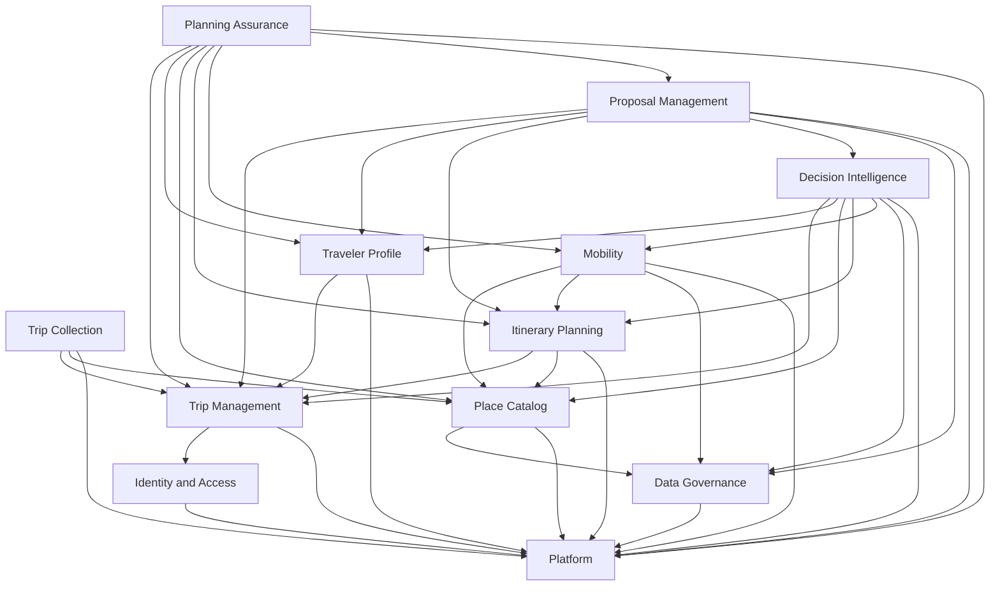

As setas representam dependências conceituais autorizadas, não acesso direto a dados internos.

---

### 48. Identity and Access

Responsabilidades:

* Account;
* User;
* autenticação;
* sessão;
* papéis;
* permissões;
* consentimentos;
* Trip Participants;
* ownership.

Não deverá conter regras de planejamento.

---

### 49. Trip Management

Responsabilidades:

* Trip;
* Destination;
* Trip Period;
* Accommodation;
* Trip Status;
* participantes;
* alterações estruturais;
* TripContextVersion.

É proprietário do agregado Trip.

---

### 50. Traveler Profile

Responsabilidades:

* Traveler;
* Traveler Profile;
* Group Profile;
* Interests;
* Restrictions;
* Budget;
* Pace;
* preferências de transporte;
* necessidades funcionais.

Não deverá produzir Recommendation diretamente.

---

### 51. Place Catalog

Responsabilidades:

* Place;
* identidade interna;
* categorias;
* Location;
* Opening Hours;
* Operational Status;
* Price Range;
* Rating;
* reconciliação;
* deduplicação;
* referências externas.

Não deverá armazenar preferências específicas da Trip como propriedade global do Place.

---

### 52. Trip Collection

Responsabilidades:

* Trip Collection;
* Saved Place;
* notas contextuais;
* favoritos da Viagem;
* unicidade por TripId e PlaceId.

Salvar Place não cria Activity.

---

### 53. Itinerary Planning

Responsabilidades:

* Itinerary;
* Trip Day;
* Activity;
* Free Period;
* ordenação;
* sincronização temporal;
* ItineraryVersion;
* aplicação autorizada de alterações.

É proprietário do Itinerary canônico.

---

### 54. Mobility

Responsabilidades:

* Travel Estimate;
* Distance;
* Travel Time;
* Transport Mode;
* estimativas;
* validade;
* integração com rotas.

Mobility não deverá assumir que estimativa é confirmação.

---

### 55. Decision Intelligence

Responsabilidades:

* Recommendation;
* Recommendation Reason;
* Recommendation Confidence;
* Decision Context Snapshot;
* Decision;
* Decision Outcome;
* Decision Quality;
* ranking;
* Next Best Action;
* explicabilidade.

Decision Intelligence poderá recomendar.

Não poderá aplicar alterações canônicas diretamente.

---

### 56. Proposal Management

Responsabilidades:

* Itinerary Proposal;
* Proposed Activity;
* critérios;
* justificativas;
* comparação;
* validade;
* geração;
* aceite integral;
* aceite parcial;
* rejeição;
* supersessão;
* idempotência de aplicação.

O módulo deverá solicitar ao Itinerary Planning a aplicação dos itens aceitos.

---

### 57. Planning Assurance

Responsabilidades:

* revisão do planejamento;
* avaliação de regras;
* Planning Conflict;
* severidade;
* evidências;
* resolução;
* aceite de risco;
* invalidação;
* supersessão;
* resumo de consistência.

Planning Assurance não é um módulo de exceções técnicas.

---

### 58. Data Governance

Responsabilidades:

* Data Source;
* Provenance;
* Data Freshness;
* Confidence Level;
* divergência de Fontes;
* licenças;
* rastreabilidade externa;
* políticas de qualidade;
* identidade externa.

---

### 59. Platform

Responsabilidades transversais:

* configuração;
* relógio;
* geração de IDs;
* transações;
* publicação de eventos;
* jobs;
* observabilidade;
* feature flags;
* segurança técnica;
* armazenamento;
* email;
* notificações;
* infraestrutura de IA.

Platform não deverá conter regras específicas de Viagem.

---

## Parte IX — Camadas internas dos módulos

### 60. Estrutura interna

Cada módulo deverá possuir, quando aplicável:

```text
interface/
application/
domain/
infrastructure/
```

---

### 61. Interface

Responsabilidades:

* endpoints;
* controllers;
* serializers;
* validação de formato;
* autenticação da requisição;
* tradução de erros;
* contratos externos.

---

### 62. Application

Responsabilidades:

* casos de uso;
* comandos;
* queries;
* autorização contextual;
* coordenação;
* transações;
* idempotência;
* publicação de eventos;
* composição de portas.

---

### 63. Domain

Responsabilidades:

* agregados;
* entidades;
* Value Objects;
* regras;
* invariantes;
* políticas;
* serviços de domínio;
* Eventos de Domínio.

---

### 64. Infrastructure

Responsabilidades:

* persistência;
* adaptadores externos;
* filas;
* cache;
* observabilidade;
* implementação de portas;
* integrações técnicas.

---

### 65. Regra de dependência

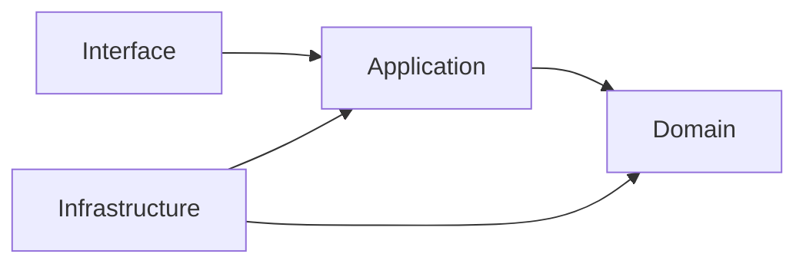

Não permitido:

```text
Domain → Infrastructure
Domain → Interface
Application → Controller concreto
Módulo A → tabela privada do Módulo B
```

---

## Parte X — Comunicação entre módulos

### 66. Comunicação síncrona

Utilizar quando:

* o resultado é necessário para concluir a operação;
* uma invariante precisa ser validada imediatamente;
* o Usuário aguarda resposta direta;
* a transação depende do resultado.

Exemplos:

* validar autorização;
* carregar Trip Context;
* aplicar itens aceitos;
* consultar Place por identidade interna;
* validar ItineraryVersion.

---

### 67. Comunicação assíncrona

Utilizar quando:

* a reação pode ocorrer depois;
* há integração lenta;
* há processamento custoso;
* o efeito pode ser reexecutado;
* a falha não deve desfazer a ação principal.

Exemplos:

* gerar Recommendation;
* gerar Itinerary Proposal;
* recalcular Travel Estimate;
* atualizar projeções;
* notificar Usuário;
* recalcular índice;
* reavaliar objetos derivados.

---

### 68. Diagrama de comunicação

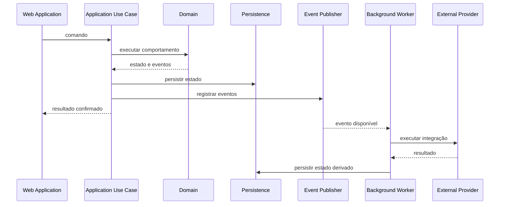

---

### 69. Comandos

Comandos representam intenção.

Devem:

* utilizar verbo;
* possuir alvo;
* possuir ator;
* poder ser rejeitados;
* ser validados;
* possuir idempotência quando necessário.

---

### 70. Eventos de Domínio

Eventos representam fatos ocorridos.

Devem:

* utilizar passado;
* ser imutáveis;
* possuir EventId;
* possuir causalidade;
* possuir correlação;
* possuir schemaVersion;
* ser emitidos somente após sucesso.

---

### 71. Eventos de integração

Eventos de integração deverão:

* expor contrato estável;
* minimizar dados;
* evitar estruturas internas;
* ser publicados após confirmação;
* possuir versionamento;
* permitir evolução de consumidores.

---

### 72. Mensagens de processo

Mensagens de processo poderão coordenar:

* geração;
* revisão;
* sincronização;
* recálculo;
* invalidação.

Elas não deverão ser confundidas automaticamente com Eventos de Domínio.

---

## Parte XI — Fluxo de Recommendation e Decision

### 73. Princípios do fluxo

A geração de Recommendation deverá ser separada de:

* apresentação;
* aceitação;
* Decision;
* execução;
* resultado.

---

### 74. Diagrama de Recommendation e Decision

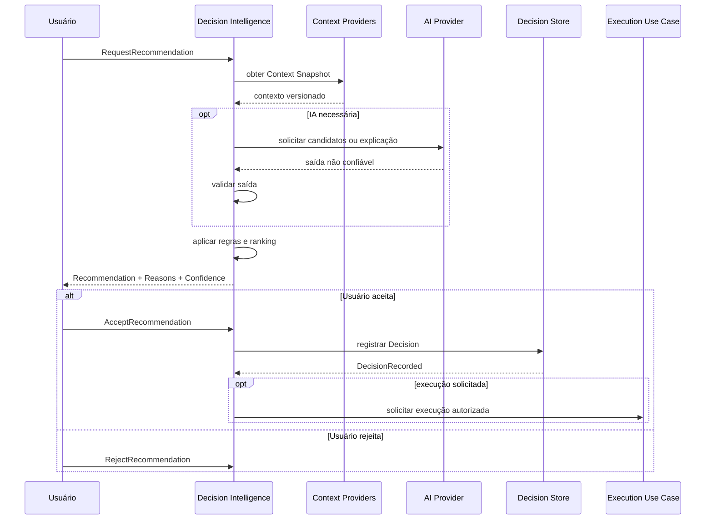

---

### 75. Context Snapshot

Toda Recommendation personalizada deverá registrar o Contexto utilizado.

O snapshot deverá permitir identificar:

* TripContextVersion;
* ItineraryVersion;
* instante;
* localização contextual quando aplicável;
* critérios;
* restrições;
* dados relevantes;
* Provenance.

---

### 76. Validade da Recommendation

Mudanças relevantes poderão invalidar Recommendation:

* Trip Destination;
* Trip Period;
* Accommodation;
* Traveler Profile;
* Restriction;
* Budget;
* Pace;
* ItineraryVersion;
* Place Operational Status;
* horário;
* localização contextual.

---

## Parte XII — Fluxo de Itinerary Proposal

### 77. Geração da Proposta

A geração poderá ser assíncrona.

Deverá:

* capturar versão base;
* carregar contexto;
* gerar candidatos;
* validar regras;
* produzir itens revisáveis;
* registrar limitações;
* preservar isolamento do Itinerary.

---

### 78. Aplicação da Proposta

Antes da aplicação, verificar:

* Proposal Status;
* autorização;
* TripContextVersion;
* ItineraryVersion;
* validade;
* Activities fixed;
* Free Periods protected;
* Restrictions mandatory;
* Planning Conflicts;
* idempotência.

---

### 79. Diagrama da Proposta

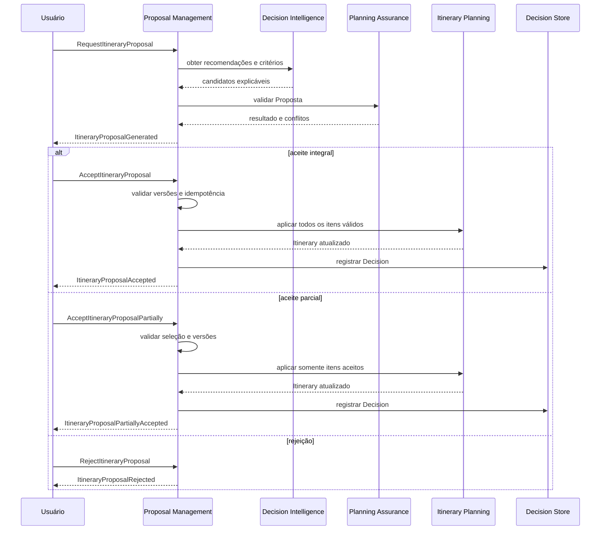

---

### 80. Concorrência da Proposta

Uma Proposta não deverá ser aplicada quando sua versão base for incompatível com o estado atual.

A arquitetura poderá utilizar:

* optimistic concurrency;
* comparação de versões;
* idempotency keys;
* transação atômica;
* retry controlado.

---

## Parte XIII — Fluxo de Planning Assurance

### 81. Avaliação

Planning Assurance poderá avaliar:

* Trip;
* Trip Day;
* Activity;
* Itinerary;
* Recommendation;
* Itinerary Proposal;
* Place;
* Travel Estimate.

---

### 82. Severidades

* `error`: bloqueia operação incompatível;
* `risk`: permite continuidade consciente quando autorizado;
* `suggestion`: orienta melhoria sem bloquear.

---

### 83. Diagrama de Planning Assurance

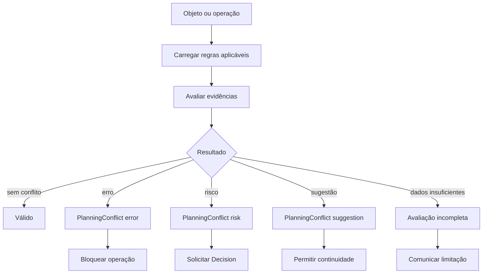

---

### 84. Resolução e aceite de risco

`PlanningConflictResolved` exige remoção da condição.

`PlanningConflictIgnored` representa:

* risco conhecido;
* decisão consciente;
* condição ainda aceita;
* rastreabilidade preservada.

Ignorar não significa resolver.

---

## Parte XIV — Versionamento e invalidação

### 85. Tipos de versão

| Versão               | Responsabilidade                     |
| -------------------- | ------------------------------------ |
| `TripContextVersion` | Mudanças estruturais da Trip         |
| `ItineraryVersion`   | Mudanças canônicas do Itinerary      |
| `aggregateVersion`   | Concorrência e ordenação do agregado |
| `schemaVersion`      | Evolução de contrato ou evento       |

Essas versões não são intercambiáveis.

---

### 86. Mudanças de Trip Context

Podem incrementar `TripContextVersion`:

* Destination;
* Trip Period;
* Accommodation;
* composição dos Travelers;
* Restriction obrigatória;
* mudança estrutural de Budget;
* mudança estrutural de Pace.

---

### 87. Mudanças de Itinerary

Podem incrementar `ItineraryVersion`:

* adicionar Activity;
* editar Activity;
* remover Activity;
* mover Activity;
* reordenar Activity;
* adicionar Free Period;
* alterar Free Period;
* aplicar itens de Itinerary Proposal;
* sincronizar Trip Days com mudança canônica.

---

### 88. Matriz de invalidação

| Mudança          | Objetos potencialmente afetados                        |
| ---------------- | ------------------------------------------------------ |
| Trip Destination | Recommendation, Proposal, Estimate, Conflict           |
| Trip Period      | Trip Day, Activity, Recommendation, Proposal, Conflict |
| Accommodation    | Estimate, Recommendation, Proposal                     |
| Traveler Profile | Recommendation, Proposal, Conflict                     |
| Restriction      | Recommendation, Proposal, Conflict                     |
| ItineraryVersion | Recommendation, Proposal, Review                       |
| Place Data       | Recommendation, Activity Review, Conflict              |
| Travel Estimate  | Recommendation, Proposal, Conflict                     |

---

### 89. Diagrama de invalidação

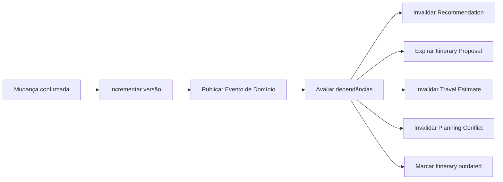

---

### 90. Invalidação não destrutiva

Objetos invalidados deverão permanecer acessíveis para:

* auditoria;
* explicação;
* histórico;
* analytics;
* investigação;
* rastreabilidade.

---

## Parte XV — Persistência

### 91. Banco relacional principal

O banco relacional deverá ser a persistência principal inicial por oferecer:

* transações;
* integridade referencial;
* consultas;
* maturidade;
* simplicidade operacional;
* suporte a concorrência.

---

### 92. Ownership de dados

Cada módulo deverá possuir seus dados.

Outros módulos deverão interagir por:

* API interna;
* caso de uso;
* query autorizada;
* evento;
* projeção.

A leitura direta poderá ser permitida apenas por decisão arquitetural explícita e controlada.

---

### 93. Transações

Uma transação deverá proteger as invariantes do agregado responsável.

Transações distribuídas entre módulos deverão ser evitadas.

Quando vários módulos participarem de um fluxo:

* confirmar a mudança principal;
* publicar evento;
* executar reações idempotentes;
* utilizar compensação quando necessário.

---

### 94. Projeções

Projeções poderão ser utilizadas para:

* dashboard;
* visão consolidada da Trip;
* resumo do Itinerary;
* contagem de Planning Conflicts;
* pesquisa;
* sugestões rápidas;
* analytics.

Projeção não deverá ser tratada como proprietário do estado canônico.

---

### 95. Cache

Cache poderá ser utilizado para:

* catálogo;
* rotas;
* resultados externos;
* queries frequentes;
* dados de baixa volatilidade.

Cache deverá possuir:

* política de expiração;
* chave contextual;
* invalidação;
* fallback;
* observabilidade.

---

## Parte XVI — Integrações externas

### 96. Isolamento por adaptadores

Toda integração externa deverá possuir porta e adaptador.

Exemplos:

```text
IdentityProviderPort
GeocodingPort
PlaceSearchPort
TravelEstimationPort
WeatherDataPort
AIModelPort
NotificationPort
```

---

### 97. Anti-Corruption Layer

Dados externos deverão ser traduzidos para modelos internos.

A aplicação não deverá utilizar diretamente:

* IDs externos como identidade canônica;
* enums de fornecedores no domínio;
* objetos de SDK;
* respostas de API como entidades.

---

### 98. Resiliência

Integrações deverão considerar:

* timeout;
* retry controlado;
* circuit breaker quando necessário;
* rate limit;
* fallback;
* cache;
* degradação;
* observabilidade;
* idempotência.

Retry não deverá ser utilizado indiscriminadamente em operações não idempotentes.

---

### 99. Provenance

Dados externos relevantes deverão preservar:

* Data Source;
* External Reference;
* momento de coleta;
* método;
* Confidence Level;
* Data Freshness;
* licença quando aplicável.

---

## Parte XVII — Arquitetura de IA

### 100. IA como capacidade especializada

IA deverá ser tratada como adaptador ou capacidade especializada.

O provedor de IA não deverá possuir acesso irrestrito ao domínio.

---

### 101. Responsabilidades permitidas

IA poderá auxiliar em:

* geração de candidatos;
* resumo;
* explicação;
* classificação;
* agrupamento;
* comparação;
* geração de Itinerary Proposal;
* sugestão de Next Best Action;
* enriquecimento assistido;
* análise textual.

---

### 102. Responsabilidades proibidas

IA não deverá:

* decidir autorização;
* validar invariantes sozinha;
* persistir diretamente;
* executar SQL;
* aplicar Proposal;
* ignorar Planning Risk;
* criar fatos sem Provenance;
* registrar Decision do Usuário;
* expor raciocínio interno como justificativa.

---

### 103. Diagrama da integração com IA

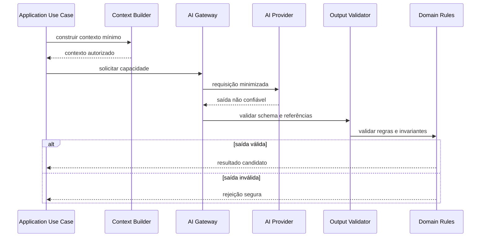

---

### 104. AI Gateway

O AI Gateway deverá centralizar:

* seleção de provedor;
* modelos;
* políticas de timeout;
* custo;
* limites;
* observabilidade;
* redaction;
* templates;
* schemas;
* fallback;
* versionamento de capacidades.

---

### 105. Context minimization

Somente dados necessários deverão ser enviados.

Evitar:

* dados pessoais completos;
* histórico integral;
* localização contínua;
* dados de menores desnecessários;
* credenciais;
* IDs técnicos irrelevantes;
* conteúdo de outros Usuários.

---

### 106. Saída não confiável

Toda saída de IA deverá ser tratada como não confiável até ser validada.

Validações deverão considerar:

* schema;
* enumerações;
* referências;
* tipos;
* regras;
* fatos;
* Provenance;
* permissões;
* dados inventados.

---

### 107. Explicabilidade

A explicação deverá ser construída com base em fatores compreensíveis:

* distância;
* duração;
* Budget;
* Pace;
* Interests;
* Restrictions;
* horário;
* Place Status;
* qualidade dos dados.

Não é necessário expor cadeia interna de raciocínio do modelo.

---

## Parte XVIII — Dados e qualidade

### 108. Categorias de dados

A arquitetura deverá distinguir:

* dados canônicos internos;
* dados externos;
* dados derivados;
* dados estimados;
* dados inferidos;
* dados gerados por IA;
* dados de auditoria;
* dados de observabilidade.

---

### 109. Diagrama de dados e Provenance

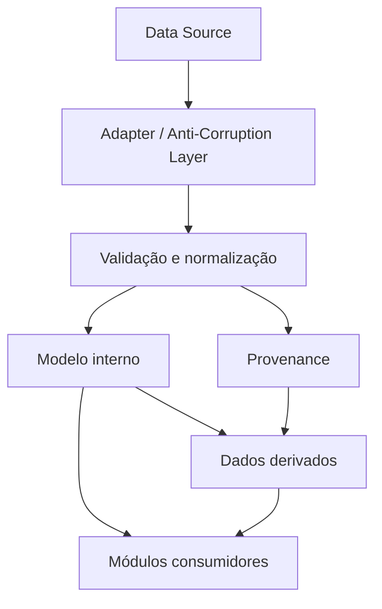

---

### 110. Unknown

O estado desconhecido deverá ser representável.

Não assumir:

* zero;
* gratuito;
* aberto;
* fechado;
* disponível;
* incompatível;
* sem conflito.

---

### 111. Data Freshness

Atualidade deverá depender do tipo de informação.

Não deverá existir um único prazo universal para todos os dados.

---

### 112. Dados conflitantes

Quando Fontes divergirem:

* preservar ambas;
* preservar Provenance;
* marcar conflito;
* aplicar política;
* reduzir Confidence;
* comunicar limitação.

---

## Parte XIX — APIs

### 113. Estilo inicial

A API externa inicial poderá utilizar HTTP com recursos e operações explícitas.

A escolha final deverá ser detalhada no documento de API.

---

### 114. Recursos

Possíveis recursos:

* accounts;
* users;
* trips;
* travelers;
* places;
* saved places;
* itinerary;
* activities;
* free periods;
* recommendations;
* decisions;
* itinerary proposals;
* planning conflicts.

---

### 115. Comandos explícitos

Ações que não representem CRUD simples poderão utilizar operações específicas.

Exemplos conceituais:

```text
POST /trips/{tripId}/itinerary/proposals
POST /trips/{tripId}/itinerary/proposals/{proposalId}/accept
POST /trips/{tripId}/conflicts/{conflictId}/ignore
POST /trips/{tripId}/activities/{activityId}/move
```

Parâmetros de rota podem utilizar referências contextuais abreviadas quando o recurso estiver inequivocamente identificado:

* `{proposalId}` representa `ItineraryProposalId`;
* `{conflictId}` representa `PlanningConflictId`;
* `{activityId}` representa `ActivityId`;
* `{tripId}` representa `TripId`.

A forma abreviada não altera o tipo canônico do identificador.

---

### 116. Idempotência de API

Operações sensíveis deverão permitir idempotência:

* Create Trip;
* Add Activity;
* Accept Recommendation;
* Accept Itinerary Proposal;
* Accept Itinerary Proposal Partially;
* Ignore Planning Risk.

---

### 117. Concorrência

Operações sujeitas a conflito deverão utilizar mecanismos como:

* version field;
* ETag;
* If-Match;
* aggregateVersion;
* ItineraryVersion;
* idempotency key.

---

### 118. Erros

A API deverá diferenciar:

* validation error;
* authorization error;
* invariant violation;
* planning conflict;
* concurrency conflict;
* external dependency failure;
* technical failure.

Planning Conflict não deverá ser retornado como erro técnico genérico.

---

## Parte XX — Segurança e privacidade

### 119. Segurança em profundidade

Segurança deverá existir em:

* interface;
* API;
* Application;
* Domain;
* persistência;
* integrações;
* infraestrutura.

---

### 120. Autenticação e autorização

Autenticação identifica o ator.

Autorização determina a ação permitida.

Autorização deverá ser validada no Backend.

---

### 121. Ownership e papéis

Ações críticas deverão considerar:

* Account;
* Trip Role;
* ownership;
* ação solicitada;
* objeto afetado;
* Contexto.

---

### 122. Minimização de dados

Coletar e processar apenas dados necessários.

Preferir:

* faixa etária;
* necessidade funcional;
* localização pontual;
* referências internas;
* contexto reduzido.

---

### 123. Secrets

Credenciais e chaves deverão permanecer fora do código e da documentação pública.

---

### 124. Proteção de logs

Logs não deverão incluir automaticamente:

* tokens;
* prompts completos;
* dados pessoais;
* localização precisa;
* conteúdo sensível;
* payloads integrais.

---

## Parte XXI — Observabilidade

### 125. Pilares

A observabilidade deverá incluir:

* logs;
* métricas;
* traces;
* eventos;
* auditoria;
* health checks.

---

### 126. Correlation ID

Fluxos deverão preservar `correlationId`.

Operações assíncronas deverão preservar também:

* causationId;
* EventId;
* aggregate reference;
* actor reference.

---

### 127. Métricas técnicas

Exemplos:

* latência;
* taxa de erro;
* disponibilidade;
* consumo de IA;
* timeout externo;
* retry;
* filas;
* cache hit rate;
* tempo de geração de Proposta.

---

### 128. Métricas de domínio

Exemplos:

* Recommendations geradas;
* Recommendations aceitas;
* Decisions registradas;
* Propostas geradas;
* Propostas aceitas;
* Planning Conflicts por severidade;
* riscos ignorados;
* tempo até resolução;
* Recomendações invalidadas;
* dados stale.

Métricas não deverão redefinir o domínio.

---

### 129. Auditoria

Ações críticas deverão ser auditáveis:

* ownership;
* alteração de Restriction;
* aplicação de Proposal;
* Ignore Planning Risk;
* exclusão;
* alteração de permissões;
* ações de agentes.

---

## Parte XXII — Resiliência

### 130. Degradação funcional

Quando uma dependência falhar, o produto deverá preservar capacidades não afetadas.

Exemplos:

* sem IA, permitir edição manual;
* sem rotas, mostrar distância indisponível;
* sem catálogo, preservar Places existentes;
* sem imagens, preservar conteúdo textual;
* sem notificação, preservar Decision.

---

### 131. Timeout

Toda integração externa deverá possuir timeout definido.

---

### 132. Retry

Retry deverá considerar:

* idempotência;
* tipo de erro;
* backoff;
* limite;
* observabilidade.

---

### 133. Circuit breaker

Poderá ser utilizado quando falhas repetidas de fornecedor causarem impacto sistêmico.

Não é requisito obrigatório do primeiro incremento.

---

### 134. Reprocessamento

Eventos e jobs deverão permitir reprocessamento seguro.

---

## Parte XXIII — Testabilidade

### 135. Pirâmide de testes

A estratégia deverá combinar:

* testes de domínio;
* testes de Application;
* testes de integração;
* testes de contrato;
* testes de adaptadores;
* testes de API;
* testes end-to-end seletivos;
* testes de segurança;
* testes de acessibilidade.

---

### 136. Testes de domínio

Deverão validar:

* invariantes;
* regras;
* políticas;
* ciclos de vida;
* transições;
* severidades;
* idempotência conceitual.

---

### 137. Testes entre módulos

Deverão validar:

* contratos internos;
* dependências permitidas;
* eventos;
* ownership de dados;
* ausência de acesso indevido.

Testes arquiteturais automatizados poderão reforçar limites modulares.

---

### 138. Testes de IA

Deverão validar:

* schema;
* referências;
* comportamento de fallback;
* limites;
* segurança;
* minimização;
* tratamento de alucinação;
* rejeição de saída inválida.

Não deverão depender exclusivamente de igualdade textual.

---

## Parte XXIV — Implantação

### 139. Topologia inicial

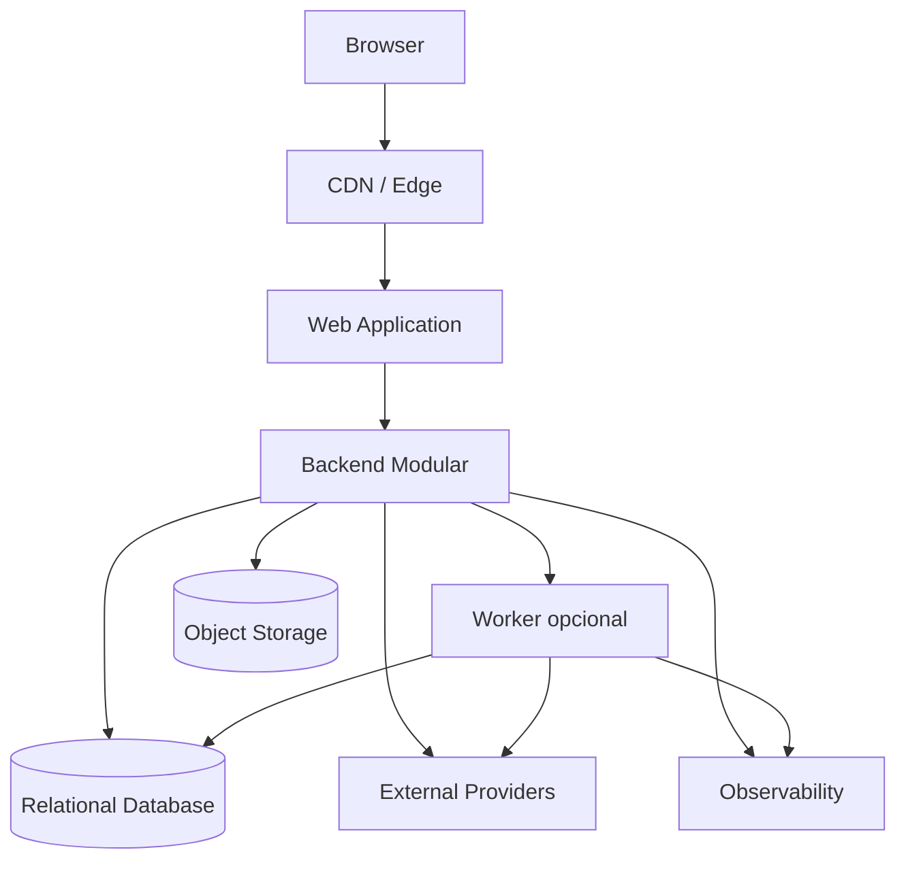

---

### 140. Ambientes

Ambientes mínimos:

* local;
* test;
* staging;
* production.

Dados e credenciais deverão ser isolados por ambiente.

---

### 141. Migrations

Migrations deverão:

* ser versionadas;
* permanecer no repositório;
* possuir ownership de módulo;
* ser testadas;
* considerar rollback ou estratégia de recuperação;
* evitar dependências ocultas.

---

### 142. Feature flags

Feature flags poderão controlar:

* capacidades em evolução;
* fornecedores;
* experimentos;
* rollout;
* fallback.

Não deverão substituir autorização ou regras de domínio.

---

## Parte XXV — Evolução arquitetural

### 143. Fase inicial

A fase inicial poderá utilizar:

* aplicação web;
* backend modular;
* banco relacional;
* integrações síncronas;
* jobs simples;
* IA por gateway;
* eventos internos em processo.

---

### 144. Fase intermediária

Conforme necessidade:

* worker dedicado;
* fila;
* Outbox;
* cache;
* search index;
* armazenamento de eventos de integração;
* projeções;
* melhor isolamento de módulos.

---

### 145. Fase avançada

Somente por evidência:

* extração de serviços;
* bancos especializados;
* múltiplos consumidores;
* processamento distribuído;
* sincronização offline;
* streaming;
* multi-region;
* alta disponibilidade específica.

---

### 146. Critérios de evolução

Toda evolução deverá responder:

* qual problema real está sendo resolvido;
* qual evidência existe;
* qual custo será introduzido;
* qual risco será reduzido;
* qual capacidade será habilitada;
* qual estratégia de migração será utilizada.

---

## Parte XXVI — Decisões arquiteturais

### 147. ADRs

Decisões significativas deverão ser registradas em Architecture Decision Records.

Exemplos:

* escolha do banco;
* framework;
* estratégia de autenticação;
* Outbox;
* fila;
* cache;
* provedor de IA;
* extração de módulo;
* estratégia de busca;
* armazenamento geográfico.

---

### 148. Estado das decisões

ADRs poderão possuir:

* Proposed;
* Accepted;
* Deprecated;
* Superseded;
* Rejected.

---

### 149. Decisões já estabelecidas

Esta visão estabelece:

* Monólito Modular como ponto de partida;
* DDD;
* Ports and Adapters;
* domínio independente;
* contratos internos;
* IA sem autoridade autônoma;
* banco relacional inicial;
* estado canônico separado de estado derivado;
* eventos para efeitos secundários;
* evolução por evidência.

---

## Parte XXVII — Governança arquitetural

### 150. Inclusão de módulo

Novo módulo deverá possuir:

* capacidade própria;
* vocabulário;
* ownership;
* dados;
* contratos;
* dependências;
* justificativa;
* fronteira clara.

Uma pasta técnica não constitui módulo de domínio.

---

### 151. Dependências

Toda dependência entre módulos deverá ser:

* explícita;
* direcionada;
* necessária;
* testável;
* documentada.

Dependência circular não deverá ser aceita sem revisão arquitetural.

---

### 152. Dados compartilhados

Dados compartilhados deverão possuir proprietário.

Outros módulos utilizarão:

* referência;
* consulta;
* evento;
* projeção;
* contrato.

---

### 153. Alteração arquitetural

Mudanças relevantes deverão avaliar impacto em:

* Domain;
* Product;
* UX;
* APIs;
* dados;
* segurança;
* privacidade;
* testes;
* observabilidade;
* implantação;
* IA;
* documentação.

---

### 154. Uso por agentes de engenharia

Agentes de IA que produzam código deverão:

* consultar documentação;
* respeitar módulos;
* não criar dependências ocultas;
* não mover regra para Infrastructure;
* não acessar tabelas privadas;
* não alterar nomes canônicos;
* não introduzir fornecedor no Domain;
* não aplicar alterações arquiteturais sem decisão documentada.

---

## Parte XXVIII — Diagramas arquiteturais

### 155. Diagramas obrigatórios desta visão

Esta visão contém os seguintes diagramas:

| ID conceitual  | Diagrama                          |
| -------------- | --------------------------------- |
| RB-DGM-ARC-001 | Autoridade documental             |
| RB-DGM-ARC-002 | Direção das dependências          |
| RB-DGM-ARC-003 | Contexto do sistema               |
| RB-DGM-ARC-004 | Containers                        |
| RB-DGM-ARC-005 | Mapa dos módulos                  |
| RB-DGM-ARC-006 | Camadas internas                  |
| RB-DGM-ARC-007 | Comunicação síncrona e assíncrona |
| RB-DGM-ARC-008 | Recommendation e Decision         |
| RB-DGM-ARC-009 | Itinerary Proposal                |
| RB-DGM-ARC-010 | Planning Assurance                |
| RB-DGM-ARC-011 | Invalidação                       |
| RB-DGM-ARC-012 | Integração com IA                 |
| RB-DGM-ARC-013 | Dados e Provenance                |
| RB-DGM-ARC-014 | Implantação inicial               |

---

### 156. Critério para inclusão de diagramas

Um diagrama deverá existir quando ajudar a explicar:

* limites;
* dependências;
* atores;
* fluxo causal;
* transações;
* estados;
* integração;
* implantação.

Diagramas não deverão repetir parágrafos sem acrescentar compreensão.

---

### 157. Fonte canônica dos diagramas

Diagramas Mermaid incorporados ao Markdown serão a fonte canônica inicial.

Imagens exportadas poderão ser utilizadas em outros materiais, mas não substituirão o código Mermaid.

---

## Parte XXIX — Critérios de aceite

### 158. Critérios estruturais

* um único H1;
* Partes em H2;
* seções numeradas em H3;
* frontmatter válido;
* módulos normalizados;
* dependências descritas;
* containers descritos;
* camadas descritas;
* diagramas Mermaid válidos.

---

### 159. Critérios de domínio

* Recommendation é separada de Decision;
* Decision é separada de execução;
* Itinerary Proposal é separada do Itinerary;
* Planning Assurance é separado de erros técnicos;
* PlanningConflictId é o tipo canônico;
* ItineraryProposalId é o tipo canônico;
* parâmetros contextuais abreviados são permitidos;
* TripContextVersion está definida;
* ItineraryVersion está definida;
* aggregateVersion está definida;
* schemaVersion está definida.

---

### 160. Critérios de modularidade

* módulos possuem responsabilidades;
* módulos possuem ownership;
* não existem dependências circulares intencionais;
* acesso direto a tabelas privadas é proibido;
* Domain não depende de Infrastructure;
* Platform não contém regras de negócio;
* integrações usam portas.

---

### 161. Critérios de IA

* IA não persiste diretamente;
* IA não decide autorização;
* IA não aplica Proposta;
* IA não registra Decision do Usuário;
* contexto enviado é minimizado;
* saída é validada;
* falha preserva estado;
* Provenance é registrada.

---

### 162. Critérios de eventos

* comandos são diferentes de eventos;
* eventos representam fatos;
* eventos são imutáveis;
* eventos possuem versionamento;
* eventos possuem correlação;
* consumidores são idempotentes;
* estado confirmado e evento permanecem consistentes;
* invalidação não destrói histórico.

---

### 163. Critérios operacionais

* falhas externas são isoladas;
* timeouts são definidos;
* retries são controlados;
* observabilidade está prevista;
* custos de IA são monitoráveis;
* implantação inicial é simples;
* evolução depende de evidência.

---

## Parte XXX — Checklist de revisão

### 164. Checklist documental

Antes de aprovar:

* propósito está definido;
* autoridade está definida;
* drivers estão documentados;
* restrições estão documentadas;
* princípios estão documentados;
* estilo está documentado;
* contexto está documentado;
* containers estão documentados;
* módulos estão documentados;
* camadas estão documentadas;
* comunicação está documentada;
* Recommendation está documentada;
* Decision está documentada;
* Itinerary Proposal está documentada;
* Planning Assurance está documentado;
* versionamento está documentado;
* invalidação está documentada;
* persistência está documentada;
* integrações estão documentadas;
* IA está documentada;
* segurança está documentada;
* privacidade está documentada;
* observabilidade está documentada;
* resiliência está documentada;
* testes estão documentados;
* implantação está documentada;
* evolução está documentada;
* governança está documentada;
* diagramas são necessários e não decorativos;
* Mermaid renderiza no GitHub;
* não existem contradições com RB-DOM-001;
* não existem contradições com RB-DOM-002;
* não existem contradições com RB-DOM-003;
* não existem contradições com RB-DOM-004.

---

## Parte XXXI — Declaração final

### 165. Declaração arquitetural

O RouteBook deverá iniciar como uma aplicação web apoiada por um backend organizado como Monólito Modular.

Sua arquitetura deverá preservar:

* domínio no centro;
* separação por capacidade;
* dependências direcionadas;
* contratos internos;
* controle do Usuário;
* isolamento de fornecedores;
* separação entre estado canônico e derivado;
* Recommendation separada de Decision;
* Decision separada de execução;
* Itinerary Proposal separada do Itinerary;
* Planning Assurance separado de falhas técnicas;
* versionamento contextual;
* invalidação não destrutiva;
* idempotência;
* consistência entre estado e eventos;
* Provenance;
* qualidade dos dados;
* privacidade;
* IA sem autoridade autônoma;
* resiliência;
* observabilidade;
* evolução incremental.

A arquitetura não deverá introduzir distribuição, complexidade operacional ou dependência tecnológica sem necessidade comprovada.

Toda evolução deverá proteger os conceitos e invariantes definidos na camada de domínio.

Nenhuma interface, integração, automação, fornecedor ou agente de IA poderá contornar os casos de uso, as autorizações ou as regras oficiais do RouteBook.
