---

id: RB-ARC-004

title: Arquitetura de Dados e Persistência
description: Define a arquitetura de dados e persistência do RouteBook, incluindo ownership, modelagem relacional, limites transacionais, versionamento, concorrência, projeções, Outbox, cache, busca, geodados, auditoria, retenção, exclusão, backup e recuperação.

document_type: architecture
owner: Architecture

status: Draft
version: "0.1.0"

created: "2026-07-18"
last_updated: null

authors:

- RouteBook Team

tags:

- architecture
- data
- persistence
- relational-database
- modular-monolith
- data-ownership
- transactions
- optimistic-concurrency
- outbox
- projections
- cache
- audit
- privacy
- diagrams
- mermaid

related_documents:

- RB-CORE-0001
- RB-CORE-0002
- RB-CORE-0003
- RB-CORE-0004
- RB-PRD-001
- RB-PRD-002
- RB-PRD-003
- RB-PRD-004
- RB-PRD-005
- RB-PRD-006
- RB-PRD-007
- RB-PRD-008
- RB-UX-001
- RB-UX-002
- RB-UX-003
- RB-UX-004
- RB-UX-005
- RB-UX-006
- RB-DS-001
- RB-DS-002
- RB-DS-003
- RB-DS-004
- RB-DOM-001
- RB-DOM-002
- RB-DOM-003
- RB-DOM-004
- RB-ARC-001
- RB-ARC-002
- RB-ARC-003

prerequisites:

- RB-CORE-0004
- RB-DOM-001
- RB-DOM-002
- RB-DOM-003
- RB-DOM-004
- RB-ARC-001
- RB-ARC-002
- RB-ARC-003

next_documents:

- RB-ARC-005
- RB-DATA-001
- RB-DATA-002
- RB-API-001
- RB-SEC-001
- RB-OBS-001
- RB-QA-001

ai_context:
priority: critical
index: true
---

# RouteBook — Arquitetura de Dados e Persistência

## Parte I — Fundamentos

### 1. Propósito deste documento

Este documento define a arquitetura oficial de dados e persistência do RouteBook.

Seu objetivo é estabelecer:

* como dados canônicos serão persistidos;
* como o ownership será protegido;
* como agregados serão armazenados;
* como transações serão delimitadas;
* como referências entre módulos serão representadas;
* como concorrência será controlada;
* como versões serão registradas;
* como Eventos de Domínio serão persistidos e publicados;
* como projeções serão construídas;
* como cache será utilizado;
* como dados serão pesquisados;
* como geodados serão tratados;
* como auditoria será preservada;
* como privacidade, retenção e exclusão serão implementadas;
* como backups e recuperação serão planejados;
* como a persistência poderá evoluir sem comprometer o domínio.

Este documento deverá orientar:

* modelagem física;
* migrations;
* repositórios;
* Unit of Work;
* transações;
* consultas;
* projeções;
* integração;
* segurança;
* privacidade;
* observabilidade;
* testes;
* operação;
* recuperação de desastres;
* agentes de engenharia.

Este documento não define:

* fornecedor definitivo de banco;
* ORM obrigatório;
* linguagem de consulta definitiva;
* nomes finais de todas as tabelas;
* índices definitivos;
* infraestrutura final de backup;
* política jurídica completa de retenção;
* estratégia definitiva de analytics;
* escolha final de mecanismo de busca.

---

### 2. Autoridade documental

A arquitetura de dados deverá implementar os limites e responsabilidades definidos anteriormente.

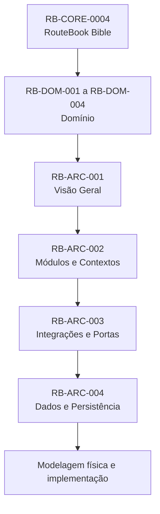

A persistência não poderá redefinir:

* agregados;
* invariantes;
* ownership;
* identidade;
* ciclos de vida;
* Eventos de Domínio;
* linguagem oficial;
* estados canônicos;
* separação entre estado canônico e estado derivado.

---

### 3. Princípio central

O banco de dados deverá servir ao domínio.

O domínio não deverá ser distorcido para se adaptar a:

* limitações do ORM;
* conveniência de joins;
* estrutura de tabelas existentes;
* preferência por documentos ou relações;
* modelo de fornecedor;
* mecanismos de cache;
* limitações de relatórios.

---

### 4. Estratégia inicial

A persistência principal inicial deverá utilizar banco de dados relacional.

A escolha é orientada por:

* integridade transacional;
* consistência;
* maturidade;
* suporte a consultas;
* constraints;
* concorrência;
* backups;
* baixo custo operacional;
* adequação ao Monólito Modular.

---

### 5. Objetivos

A arquitetura deverá:

1. preservar ownership;
2. garantir integridade;
3. proteger invariantes;
4. permitir evolução;
5. evitar escrita cruzada;
6. controlar concorrência;
7. permitir idempotência;
8. suportar eventos confiáveis;
9. preservar histórico;
10. respeitar privacidade;
11. permitir reconstrução de projeções;
12. manter consultas eficientes;
13. suportar geodados;
14. permitir backup e restauração;
15. evitar lock-in desnecessário.

---

## Parte II — Classificação dos dados

### 6. Estado canônico

Estado canônico é a representação oficial atual de um conceito de domínio.

Exemplos:

* Account;
* User;
* Trip;
* Traveler Profile;
* Place;
* Trip Collection;
* Itinerary;
* Activity;
* Free Period;
* Decision;
* Data Source.

O estado canônico deverá possuir owner único.

---

### 7. Estado contextual

Estado contextual depende de um Contexto e de versões específicas.

Exemplos:

* Recommendation;
* Itinerary Proposal;
* Planning Conflict;
* Travel Estimate;
* Decision Context Snapshot.

Ele poderá expirar ou ser invalidado.

---

### 8. Estado derivado

Estado derivado pode ser reconstruído a partir de fontes canônicas.

Exemplos:

* Group Profile;
* Conflict Summary;
* Planning Completeness;
* Trip Overview;
* Saved Places View;
* Recommendation ranking;
* mapa do Roteiro.

---

### 9. Dados externos

Dados externos são obtidos de terceiros.

Exemplos:

* Rating;
* Opening Hours;
* rota;
* clima;
* imagem;
* preço;
* estado operacional.

Devem preservar Provenance.

---

### 10. Dados estimados

Exemplos:

* Travel Time;
* Distance;
* Estimated Cost;
* Recommendation Confidence.

Não devem ser persistidos como fatos confirmados.

---

### 11. Dados inferidos

Dados inferidos devem possuir indicação de origem e método.

Não deverão ser tratados como confirmação.

---

### 12. Dados gerados por IA

Conteúdo gerado por IA poderá ser persistido como:

* candidato;
* Recommendation;
* justificativa;
* conteúdo proposto;
* classificação;
* resumo.

Deverá preservar:

* capacidade;
* versão;
* Provider;
* modelo;
* momento;
* Contexto;
* validação;
* Provenance.

---

### 13. Dados de auditoria

Dados de auditoria registram:

* quem;
* quando;
* o quê;
* contexto;
* operação;
* resultado.

Não substituem Eventos de Domínio.

---

### 14. Dados de observabilidade

Logs, métricas e traces são dados operacionais.

Não devem ser utilizados como estado canônico.

---

## Parte III — Ownership de dados

### 15. Regra de owner único

Cada agregado, tabela, coleção ou fluxo canônico deverá possuir owner único.

Nenhum módulo poderá gravar diretamente dados pertencentes a outro módulo.

---

### 16. Matriz de ownership

| Contexto              | Dados principais                                                |
| --------------------- | --------------------------------------------------------------- |
| Identity and Access   | Account, User, Consent, External Identity                       |
| Trip Management       | Trip, Destination, Trip Period, Accommodation, Participants     |
| Traveler Profile      | Traveler Profile, Traveler, Interest, Restriction, Budget, Pace |
| Place Catalog         | Place, Location, Opening Hours, Rating, External References     |
| Trip Collection       | Trip Collection, Saved Place                                    |
| Itinerary Planning    | Itinerary, Trip Day, Activity, Free Period                      |
| Mobility              | Travel Estimate                                                 |
| Decision Intelligence | Recommendation, Decision, Decision Outcome                      |
| Proposal Management   | Itinerary Proposal, Proposed Activity                           |
| Planning Assurance    | Planning Conflict                                               |
| Data Governance       | Data Source, Provenance policy, Data Conflict                   |
| Platform              | Outbox, jobs, locks, technical idempotency, configuration       |

---

### 17. Acesso de leitura

Outros módulos poderão obter dados por:

* query pública;
* snapshot;
* projeção;
* Evento;
* view controlada;
* read model.

---

### 18. Acesso de escrita

A escrita deverá ocorrer exclusivamente por:

* caso de uso do módulo proprietário;
* comando;
* repositório privado;
* transação do owner.

---

### 19. Diagrama de ownership

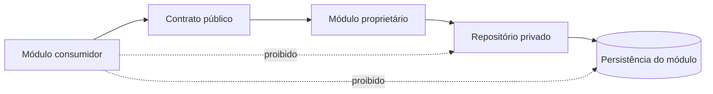

---

## Parte IV — Organização lógica do banco

### 20. Banco compartilhado no Monólito Modular

Um banco físico compartilhado será permitido inicialmente.

Isso não significa:

* schema sem ownership;
* acesso irrestrito;
* escrita cruzada;
* migrations globais desorganizadas;
* tabelas comuns para qualquer módulo;
* uso de ORM como contrato entre módulos.

---

### 21. Schemas lógicos

Estrutura conceitual sugerida:

```text
identity.*
trips.*
travelers.*
places.*
trip_collection.*
itinerary.*
mobility.*
decision_intelligence.*
proposals.*
planning_assurance.*
data_governance.*
platform.*
read_models.*
```

A implementação poderá utilizar:

* schemas físicos;
* prefixos;
* namespaces;
* bancos lógicos;
* convenções equivalentes.

---

### 22. Critério de separação

A separação deverá permitir identificar:

* módulo proprietário;
* migrations responsáveis;
* repositórios;
* permissões;
* métricas;
* impacto de mudanças.

---

### 23. Tabelas compartilhadas

Tabelas compartilhadas deverão ser evitadas.

Exceções possíveis:

* Outbox;
* locks técnicos;
* tabela de migrations;
* idempotency records;
* configurações técnicas;
* Shared Kernel técnico mínimo.

---

### 24. Shared Kernel persistente

Não deverão ser centralizados em tabelas genéricas:

* status de entidades;
* atributos customizados universais;
* metadados de qualquer entidade;
* relações polimórficas indiscriminadas;
* regras;
* agregados.

---

### 25. Diagrama lógico

```mermaid
flowchart TB
    DB[("Banco relacional")]

    IAM["identity schema"]
    Trips["trips schema"]
    Travelers["travelers schema"]
    Places["places schema"]
    Collection["trip_collection schema"]
    Itinerary["itinerary schema"]
    Mobility["mobility schema"]
    Decision["decision_intelligence schema"]
    Proposals["proposals schema"]
    Assurance["planning_assurance schema"]
    Governance["data_governance schema"]
    Platform["platform schema"]
    Reads["read_models schema"]

    DB --> IAM
    DB --> Trips
    DB --> Travelers
    DB --> Places
    DB --> Collection
    DB --> Itinerary
    DB --> Mobility
    DB --> Decision
    DB --> Proposals
    DB --> Assurance
    DB --> Governance
    DB --> Platform
    DB --> Reads
```

---

## Parte V — Identidade e referências

### 26. Identificadores canônicos

Identificadores deverão seguir o RB-DOM-002.

Exemplos:

```text
AccountId
UserId
TripId
TravelerId
PlaceId
TripCollectionId
ItineraryId
ActivityId
RecommendationId
DecisionId
ItineraryProposalId
PlanningConflictId
DataSourceId
```

---

### 27. Tipo de identificador

A tecnologia concreta poderá utilizar:

* UUID;
* ULID;
* identificador ordenável equivalente.

A escolha deverá considerar:

* unicidade;
* geração distribuída;
* ordenação;
* indexação;
* exposição externa;
* segurança.

---

### 28. Identidade interna

IDs externos não deverão substituir IDs internos.

Exemplo:

```text
PlaceId
+ ExternalPlaceReference
```

---

### 29. Referências entre módulos

Referências entre módulos deverão utilizar IDs.

Evitar navegação ORM direta entre agregados de módulos distintos.

---

### 30. Foreign keys entre módulos

Foreign keys físicas entre módulos poderão ser utilizadas quando:

* reforçarem integridade;
* não criarem ownership compartilhado;
* não impedirem evolução;
* forem coordenadas por migrations explícitas.

Elas não autorizam escrita cruzada.

---

### 31. Exclusão referenciada

A exclusão deverá considerar referências externas ao módulo.

Estratégias possíveis:

* impedir exclusão;
* exclusão lógica;
* anonimização;
* evento de remoção;
* projeção compensatória;
* retenção histórica.

---

## Parte VI — Modelagem de agregados

### 32. Agregado como limite de consistência

A transação deverá proteger as invariantes do agregado alterado.

---

### 33. Persistência orientada a agregado

O repositório deverá carregar e persistir o agregado necessário ao caso de uso.

Não deverá expor operações genéricas indiscriminadas.

Evitar:

```text
GenericRepository<T>
```

quando isso ocultar invariantes ou ownership.

---

### 34. Tabelas por agregado

Um agregado poderá utilizar:

* uma tabela;
* várias tabelas;
* tabela principal e tabelas filhas;
* JSON interno controlado;
* combinações relacionais.

A decisão deverá refletir:

* invariantes;
* cardinalidade;
* frequência de alteração;
* consultas;
* evolução.

---

### 35. Entidades filhas

Entidades internas de um agregado não deverão possuir repositório público independente.

Exemplo:

* Trip Day pertence ao Itinerary;
* Activity pertence ao Itinerary;
* Proposed Activity pertence à Itinerary Proposal.

---

### 36. Value Objects

Value Objects poderão ser persistidos por:

* colunas compostas;
* tipos embutidos;
* JSON validado;
* tabelas auxiliares quando justificadas.

---

### 37. Estado multidimensional

Estados que representam dimensões distintas não deverão ser comprimidos em um único status genérico.

Exemplo do Itinerary:

* Planning Completeness;
* Review State;
* Consistency State;
* Conflict Summary.

---

### 38. Histórico

Quando necessário, mudanças poderão ser registradas por:

* Eventos de Domínio;
* audit log;
* tabelas de histórico;
* versionamento;
* snapshots.

Não será adotado Event Sourcing por padrão.

---

## Parte VII — Limites transacionais

### 39. Regra geral

Uma transação deverá, preferencialmente, envolver:

* um agregado;
* um owner;
* um caso de uso.

---

### 40. Transação local

Fluxo típico:

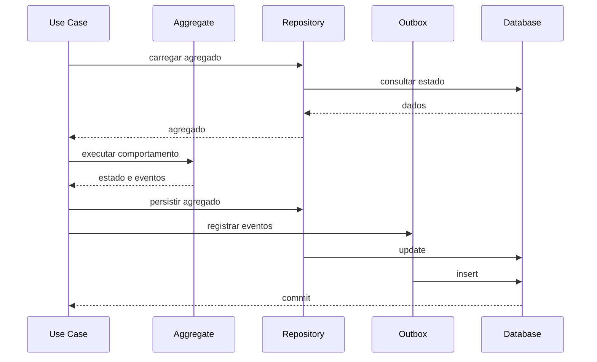

---

### 41. Transação entre módulos

Transações distribuídas entre módulos deverão ser evitadas.

Quando um fluxo atravessar módulos:

1. validar pré-condições;
2. alterar o agregado proprietário;
3. confirmar transação;
4. publicar Evento;
5. executar efeitos posteriores;
6. compensar quando necessário.

---

### 42. Casos compostos

Casos compostos poderão utilizar:

* Application Orchestrator;
* Process Manager;
* Saga;
* eventos;
* compensação.

---

### 43. Exemplo de aplicação de Proposta

A aplicação de Itinerary Proposal deverá preservar:

* validação da Proposal;
* validação da ItineraryVersion;
* idempotência;
* alteração atômica do Itinerary;
* registro de Decision;
* atualização da Proposal.

A estratégia concreta deverá evitar estado parcial inconsistente.

---

### 44. Coordenação transacional de Proposta

Opções aceitáveis:

1. orquestração em uma transação local quando módulos compartilham processo e banco;
2. transações separadas com Process Manager;
3. reserva de aplicação e confirmação;
4. compensação explícita.

A escolha deverá ser registrada por ADR.

---

### 45. Falha parcial

Se uma parte posterior falhar:

* o estado principal confirmado não deverá ser apagado silenciosamente;
* a falha deverá ser registrada;
* retry deverá ser idempotente;
* compensação deverá produzir novo fato;
* inconsistência temporária deverá ser observável.

---

## Parte VIII — Versionamento

### 46. Tipos de versão

O RouteBook deverá distinguir:

| Versão               | Finalidade                        |
| -------------------- | --------------------------------- |
| `TripContextVersion` | alterações estruturais da Trip    |
| `ItineraryVersion`   | alterações canônicas do Itinerary |
| `aggregateVersion`   | concorrência e ordem do agregado  |
| `schemaVersion`      | contrato de evento ou payload     |
| migration version    | evolução física do banco          |
| projection version   | evolução de read model            |

---

### 47. TripContextVersion

Deverá ser persistida com a Trip.

Mudanças estruturais deverão incrementá-la de forma atômica.

---

### 48. ItineraryVersion

Deverá ser persistida com o Itinerary.

Toda alteração canônica deverá incrementá-la.

---

### 49. Aggregate Version

Todo agregado sujeito a concorrência deverá possuir versão técnica.

Ela poderá ser utilizada para:

* optimistic locking;
* ordenação de Eventos;
* detecção de conflito;
* retries controlados.

---

### 50. Schema Version

Eventos, snapshots e contratos persistidos deverão possuir versão quando sua evolução exigir compatibilidade.

---

### 51. Projection Version

Projeções deverão possuir versão lógica ou metadado equivalente.

Mudanças incompatíveis poderão exigir rebuild.

---

### 52. Diagrama de versões

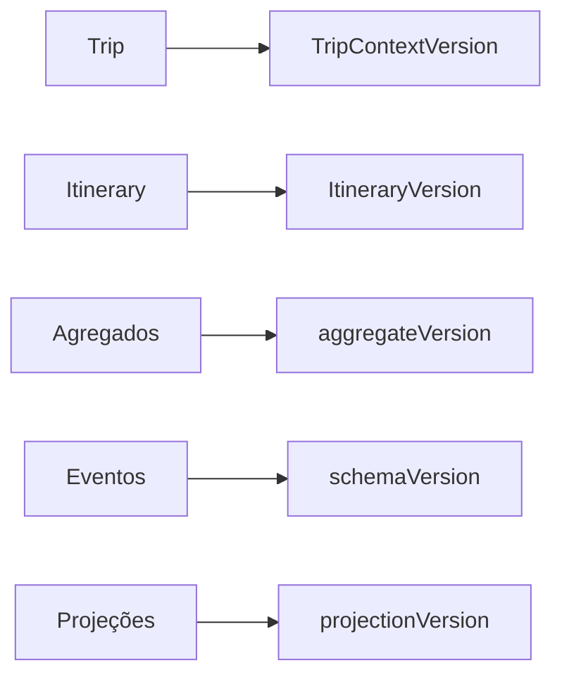

---

## Parte IX — Concorrência

### 53. Estratégia inicial

A estratégia inicial deverá utilizar concorrência otimista.

---

### 54. Optimistic Locking

Atualizações deverão verificar a versão esperada.

Exemplo conceitual:

```text
UPDATE itinerary
SET version = version + 1
WHERE itinerary_id = :id
  AND version = :expectedVersion
```

Se nenhuma linha for alterada, ocorreu conflito.

---

### 55. Concorrência no Itinerary

O Itinerary é especialmente sensível a:

* edição simultânea;
* aplicação de Proposta;
* movimento de Activity;
* sincronização de Trip Days;
* atualização automática.

Toda alteração deverá validar `ItineraryVersion`.

---

### 56. Concorrência na Trip

Alterações estruturais deverão validar:

* aggregateVersion;
* TripContextVersion quando aplicável.

---

### 57. Tratamento de conflito

Um conflito de concorrência deverá ser diferenciado de Planning Conflict.

Concorrência:

* é conflito técnico de versão;
* exige recarga, merge ou retry.

Planning Conflict:

* é condição do planejamento;
* possui regra, severidade e evidência.

---

### 58. Merge

Merge automático só deverá ocorrer quando semanticamente seguro.

Exemplos potencialmente seguros:

* notas independentes;
* campos não conflitantes.

Exemplos não seguros:

* Trip Period;
* Activity order;
* aplicação de Proposal;
* Restrictions mandatory.

---

### 59. Interface

A API poderá utilizar:

* version field;
* ETag;
* If-Match;
* expectedVersion.

---

## Parte X — Idempotência

### 60. Finalidade

Idempotência evita duplicação de efeitos quando uma operação é repetida.

---

### 61. Operações prioritárias

* CreateTrip;
* AddActivity;
* SavePlace;
* AcceptRecommendation;
* AcceptItineraryProposal;
* AcceptItineraryProposalPartially;
* IgnorePlanningRisk;
* webhook processing;
* notification delivery;
* event consumption.

---

### 62. Idempotency Record

A Platform poderá persistir registros contendo:

* idempotency key;
* operação;
* actor;
* escopo;
* status;
* request hash;
* response reference;
* createdAt;
* expiresAt.

---

### 63. Escopo

A chave deverá ser interpretada em conjunto com:

* módulo;
* operação;
* Account;
* Trip;
* ator.

---

### 64. Repetição equivalente

Uma repetição equivalente deverá retornar:

* mesmo resultado; ou
* resultado semanticamente equivalente.

---

### 65. Requisição divergente

A mesma chave com payload diferente deverá ser rejeitada.

---

### 66. Expiração

Registros poderão expirar conforme a operação e a necessidade de auditoria.

---

### 67. Diagrama de idempotência

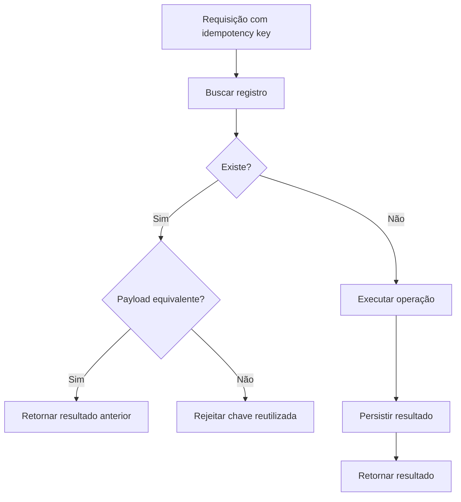

---

## Parte XI — Eventos e Outbox

### 68. Eventos confirmados

Eventos deverão ser persistidos apenas quando a mudança correspondente tiver sido confirmada.

---

### 69. Transactional Outbox

Quando estado e evento precisarem permanecer consistentes, deverá ser utilizada Outbox ou mecanismo equivalente.

---

### 70. Estrutura conceitual da Outbox

Campos possíveis:

* eventId;
* eventType;
* aggregateType;
* aggregateId;
* aggregateVersion;
* payload;
* metadata;
* schemaVersion;
* occurredAt;
* recordedAt;
* publicationStatus;
* attempts;
* nextAttemptAt;
* publishedAt.

---

### 71. Payload

O payload deverá ser:

* versionado;
* mínimo;
* protegido;
* serializável;
* independente do ORM;
* compatível com evolução.

---

### 72. Publicação

Um publisher deverá:

1. buscar eventos pendentes;
2. tentar publicar;
3. registrar sucesso;
4. reagendar falha;
5. aplicar limite;
6. enviar para dead-letter quando necessário.

---

### 73. Entrega

O sistema deverá assumir entrega pelo menos uma vez quando mensageria persistente for utilizada.

Consumidores deverão ser idempotentes.

---

### 74. Ordem

A ordem deverá ser preservada quando necessária por:

* aggregateId;
* aggregateVersion;
* partição;
* sequência.

---

### 75. Diagrama de Outbox

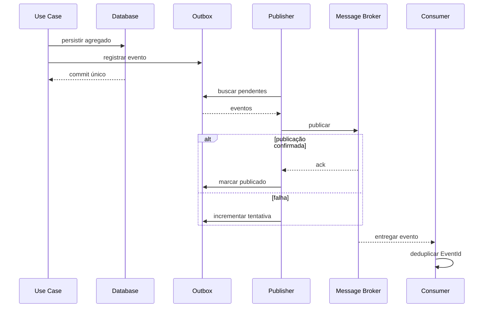

---

### 76. Inbox

Consumidores críticos poderão utilizar Inbox para deduplicação e controle de processamento.

---

### 77. Dead-letter

Eventos não processáveis deverão permanecer:

* observáveis;
* reprocessáveis;
* auditáveis;
* associados à causa.

---

## Parte XII — Projeções e read models

### 78. Finalidade

Projeções deverão otimizar leitura sem comprometer o modelo de escrita.

---

### 79. Exemplos

* Trip Overview;
* Trip List;
* Itinerary Day View;
* Explore Results;
* Saved Places View;
* Map View;
* Recommendation View;
* Proposal Review View;
* Planning Conflict Summary.

---

### 80. Fonte

Uma projeção poderá ser construída por:

* consulta síncrona;
* Eventos;
* materialized view;
* pipeline;
* job;
* combinação.

---

### 81. Ownership

Read models poderão possuir owner técnico próprio, mas nunca se tornar owner dos dados canônicos.

---

### 82. Atualização assíncrona

Quando assíncrona, a projeção deverá registrar:

* versão processada;
* último EventId;
* updatedAt;
* status;
* erro;
* atraso.

---

### 83. Rebuild

Toda projeção derivada deverá ser reconstruível.

---

### 84. Inconsistência temporária

A interface deverá tolerar atraso quando aceitável.

Dados críticos deverão ser lidos diretamente do owner.

---

### 85. Projeção composta

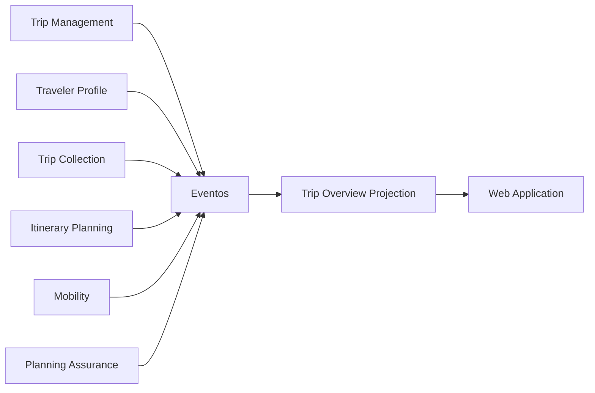

---

### 86. Versionamento de projeção

Mudanças incompatíveis deverão permitir:

* nova tabela;
* nova versão;
* dual write temporário;
* rebuild;
* migração controlada.

---

### 87. Falha de projeção

Falha em projeção não deverá impedir mudança canônica.

---

## Parte XIII — Consultas

### 88. Consultas de domínio

Consultas necessárias a invariantes deverão usar dados consistentes do owner.

---

### 89. Consultas de leitura

Interfaces poderão utilizar read models para:

* agregação;
* ordenação;
* filtros;
* desempenho;
* redução de chamadas.

---

### 90. N+1

A camada de persistência deverá evitar consultas N+1.

---

### 91. Paginação

Listagens deverão utilizar:

* cursor quando apropriado;
* limite;
* ordenação determinística;
* filtros indexáveis.

---

### 92. Ordenação

Toda paginação deverá possuir ordenação estável.

---

### 93. Busca textual

Busca simples poderá utilizar recursos do banco relacional inicialmente.

---

### 94. Extração de mecanismo de busca

Um mecanismo dedicado poderá ser introduzido quando houver:

* volume;
* relevância avançada;
* autocomplete;
* ranking complexo;
* múltiplos idiomas;
* geobusca sofisticada;
* necessidade operacional comprovada.

---

## Parte XIV — Cache

### 95. Finalidade

Cache poderá ser usado para:

* reduzir latência;
* reduzir custo;
* reduzir carga;
* proteger fornecedores;
* acelerar read models.

---

### 96. Tipos

* cache em memória;
* cache distribuído;
* cache HTTP;
* cache de integração;
* cache de consulta;
* cache de configuração.

---

### 97. Regras

Todo cache deverá possuir:

* owner;
* chave;
* TTL;
* política de invalidação;
* fallback;
* observabilidade;
* classificação dos dados.

---

### 98. Chave contextual

A chave deverá incluir todas as dimensões relevantes.

---

### 99. Cache stampede

Poderão ser utilizados:

* locking;
* request coalescing;
* jitter;
* stale while revalidate;
* warmup.

---

### 100. Dados sensíveis

Dados pessoais ou sensíveis não deverão ser cacheados sem:

* necessidade;
* criptografia;
* TTL;
* controle de acesso;
* política de remoção.

---

### 101. Cache e versão

Chaves poderão incluir:

* TripContextVersion;
* ItineraryVersion;
* schemaVersion;
* Provider;
* locale.

---

### 102. Cache não canônico

A perda do cache não deverá causar perda de dados.

---

## Parte XV — Geodados

### 103. GeoCoordinate

Coordenadas deverão possuir:

* latitude;
* longitude;
* precisão;
* Provenance quando externas.

---

### 104. Tipo geográfico

A persistência poderá utilizar:

* colunas numéricas;
* tipo geográfico nativo;
* extensão espacial;
* representação equivalente.

---

### 105. Índices espaciais

Deverão ser considerados para:

* busca por proximidade;
* bounding box;
* raio;
* ordenação por distância.

---

### 106. Precisão

A persistência não deverá aumentar artificialmente a precisão recebida.

---

### 107. Localização atual

Localização pontual do Usuário deverá:

* ser armazenada apenas quando necessário;
* possuir expiração;
* ter escopo;
* não formar histórico contínuo por padrão.

---

### 108. Distância

Distance derivada de coordenadas não substitui Travel Estimate de rota.

---

### 109. Normalização

Coordenadas inválidas deverão ser rejeitadas.

---

## Parte XVI — Dados externos e Provenance

### 110. Separação

Dados externos e dados internos deverão ser distinguíveis.

---

### 111. External Reference

Uma referência externa deverá conter:

* Provider;
* externalId;
* entidade interna relacionada;
* collectedAt;
* status;
* metadata mínima.

---

### 112. Provenance persistida

A Provenance poderá ser persistida:

* junto do dado;
* em tabela própria;
* por versão;
* por atributo;
* por documento de origem.

A granularidade dependerá da relevância.

---

### 113. Conflito entre Fontes

Divergências deverão permitir:

* múltiplos valores;
* seleção atual;
* política;
* histórico;
* Confidence Level;
* Data Freshness.

---

### 114. Valor atual

O valor exibido poderá ser derivado por política.

A política não deverá apagar os valores de origem.

---

### 115. Diagrama de Provenance

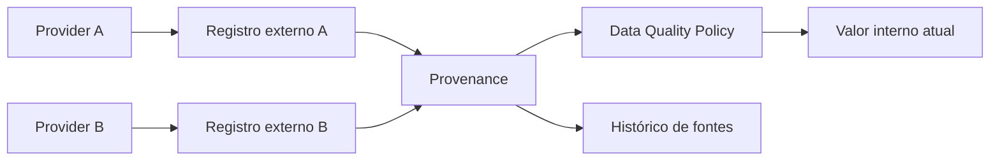

---

## Parte XVII — Auditoria

### 116. Objetivo

A auditoria deverá permitir reconstruir ações críticas.

---

### 117. Ações prioritárias

* criação e exclusão de Trip;
* alteração de ownership;
* alteração de papéis;
* alteração de Restriction;
* aplicação de Itinerary Proposal;
* aceite parcial;
* Ignore Planning Risk;
* alteração de consentimento;
* ações de agentes;
* anonimização;
* exportação de dados.

---

### 118. Conteúdo mínimo

* auditId;
* actor;
* action;
* targetType;
* targetId;
* occurredAt;
* correlationId;
* source;
* result;
* metadata segura.

---

### 119. Conteúdo proibido

Evitar:

* secrets;
* tokens;
* payload integral;
* dados pessoais desnecessários;
* prompts completos;
* coordenadas precisas desnecessárias.

---

### 120. Imutabilidade

Registros de auditoria deverão ser append-only ou possuir proteção equivalente.

---

### 121. Auditoria versus Evento

Evento de Domínio representa fato do negócio.

Audit log representa rastreabilidade operacional e de segurança.

Ambos podem existir para a mesma ação.

---

## Parte XVIII — Privacidade e classificação

### 122. Classificação de dados

Categorias mínimas:

* public;
* internal;
* confidential;
* restricted.

---

### 123. Exemplos

| Dado                  | Classificação sugerida |
| --------------------- | ---------------------- |
| nome público de Place | public                 |
| Trip                  | confidential           |
| Traveler Profile      | restricted             |
| localização atual     | restricted             |
| consentimento         | restricted             |
| Recommendation        | confidential           |
| logs técnicos         | internal               |
| secrets               | restricted             |

---

### 124. Minimização

Somente dados necessários deverão ser persistidos.

---

### 125. Dados de menores

Preferir:

* faixa etária;
* necessidade funcional;
* tipo de Traveler.

Evitar dados identificáveis quando desnecessários.

---

### 126. Criptografia

Dados deverão ser protegidos:

* em trânsito;
* em repouso;
* em backup.

Campos especialmente sensíveis poderão utilizar criptografia adicional.

---

### 127. Controle de acesso

Acesso ao banco deverá seguir menor privilégio.

---

### 128. Ambientes

Dados de produção não deverão ser copiados integralmente para ambientes inferiores.

---

### 129. Mascaramento

Dados utilizados em testes deverão ser:

* sintéticos;
* anonimizados;
* mascarados.

---

## Parte XIX — Retenção

### 130. Princípio

Dados deverão ser mantidos somente enquanto houver finalidade, obrigação ou decisão válida.

---

### 131. Política por categoria

Cada categoria deverá possuir:

* finalidade;
* prazo;
* gatilho;
* owner;
* estratégia de remoção;
* exceções.

---

### 132. Exemplos

* sessão: curta duração;
* idempotency record: retenção técnica limitada;
* Outbox publicada: retenção operacional definida;
* logs: retenção limitada;
* audit log: retenção ampliada;
* Trip arquivada: enquanto mantida pelo Usuário;
* dados externos stale: conforme política;
* localização pontual: expiração curta.

---

### 133. Retenção não uniforme

Não deverá existir um único prazo para todos os dados.

---

### 134. Legal hold

Obrigações futuras poderão impedir exclusão temporariamente.

---

### 135. Automação

Jobs poderão aplicar políticas de:

* expiração;
* anonimização;
* compactação;
* remoção;
* arquivamento.

---

## Parte XX — Exclusão e anonimização

### 136. Exclusão lógica

Poderá ser utilizada quando:

* recuperação for permitida;
* referências existirem;
* retenção exigir;
* exclusão física imediata for insegura.

---

### 137. Exclusão física

Deverá ocorrer quando:

* não houver obrigação de retenção;
* referências tiverem sido tratadas;
* backups seguirem política;
* projeções forem atualizadas;
* caches forem invalidados.

---

### 138. Anonimização

Quando histórico precisar ser preservado sem identidade pessoal, dados deverão ser anonimizados.

---

### 139. Pseudonimização

Pseudonimização não equivale a anonimização definitiva.

---

### 140. Exclusão de Account

Deverá coordenar:

* Identity and Access;
* Trips;
* Traveler associations;
* consentimentos;
* auditoria;
* integrações;
* arquivos;
* projeções;
* backups.

---

### 141. Exclusão de Trip

Deverá considerar:

* Itinerary;
* Traveler Profile;
* Trip Collection;
* Recommendations;
* Decisions;
* Proposals;
* Planning Conflicts;
* Travel Estimates;
* projeções;
* arquivos;
* Eventos e auditoria.

---

### 142. Process Manager de exclusão

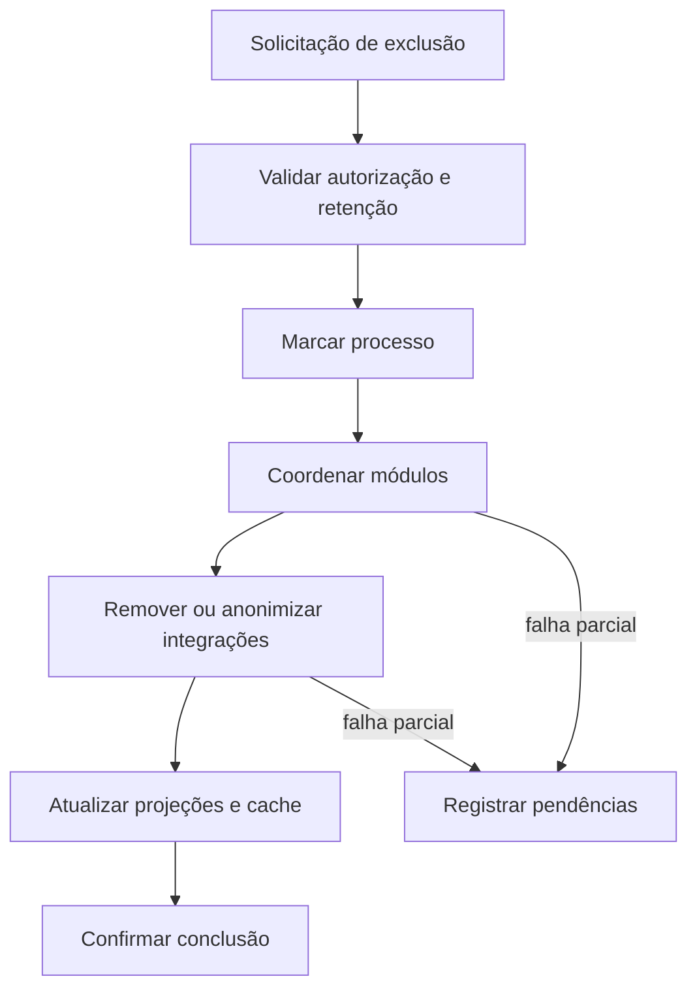

---

### 143. Backups

Dados removidos poderão permanecer em backups até sua expiração natural.

Essa condição deverá ser documentada na política de privacidade.

---

## Parte XXI — Migrations

### 144. Fonte canônica

Migrations deverão permanecer versionadas no repositório.

---

### 145. Ownership

Cada migration deverá possuir owner de módulo.

---

### 146. Sequência

Migrations deverão possuir ordem determinística.

---

### 147. Compatibilidade

Mudanças deverão considerar implantação sem indisponibilidade quando necessário.

---

### 148. Estratégia expand and contract

Para mudanças incompatíveis:

1. adicionar nova estrutura;
2. implantar código compatível;
3. migrar dados;
4. trocar leituras e escritas;
5. remover estrutura antiga.

---

### 149. Backfill

Backfills deverão ser:

* idempotentes;
* observáveis;
* pausáveis;
* retomáveis;
* limitados;
* testados.

---

### 150. Rollback

Nem toda migration será reversível.

Quando rollback não for seguro, deverá existir plano de roll-forward.

---

### 151. Dados de produção

Migrations não deverão assumir volume pequeno.

---

### 152. Validação

Antes da aplicação:

* syntax;
* locks;
* duração;
* espaço;
* compatibilidade;
* backup;
* impacto.

---

### 153. Diagrama de evolução

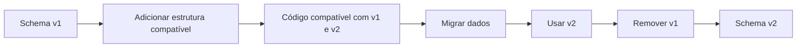

---

## Parte XXII — Backup e recuperação

### 154. Objetivos

A estratégia deverá proteger contra:

* exclusão acidental;
* corrupção;
* falha de infraestrutura;
* migration incorreta;
* ataque;
* erro operacional.

---

### 155. Backups

Deverão considerar:

* frequência;
* retenção;
* criptografia;
* isolamento;
* testes;
* cópia externa;
* restauração pontual.

---

### 156. Point-in-time recovery

Deverá ser considerado para o banco principal.

---

### 157. RPO e RTO

Deverão ser definidos conforme maturidade e criticidade.

* RPO: perda máxima aceitável de dados.
* RTO: tempo máximo para restauração.

---

### 158. Teste de restauração

Backup não testado não deverá ser considerado confiável.

---

### 159. Escopo de restauração

A recuperação deverá considerar:

* banco;
* Object Storage;
* secrets;
* configuração;
* filas;
* Outbox;
* read models.

---

### 160. Projeções

Projeções poderão ser reconstruídas após restauração.

---

### 161. Eventos pendentes

A recuperação deverá evitar:

* perda de Eventos não publicados;
* publicação duplicada não tratada;
* inconsistência entre Outbox e estado.

---

### 162. Runbook

Deverá existir runbook operacional futuro para:

* detectar incidente;
* interromper escrita;
* restaurar;
* validar;
* reprocessar;
* comunicar.

---

## Parte XXIII — Integridade e constraints

### 163. Constraints físicas

O banco deverá reforçar invariantes simples.

Exemplos:

* `startDate <= endDate`;
* Duration positiva;
* Distance não negativa;
* Travel Time não negativo;
* unicidade de Trip Day por data;
* unicidade de Saved Place;
* owner mínimo quando modelável;
* status válido.

---

### 164. Constraints de domínio

Regras complexas deverão permanecer no domínio.

O banco não deverá ser o único local de implementação.

---

### 165. Unicidade

Índices únicos deverão refletir invariantes.

Exemplos:

```text
TripId + LocalDate
TripId + PlaceId
Provider + ExternalId
EventId
IdempotencyScope + IdempotencyKey
```

---

### 166. Null

`NULL` deverá possuir significado explícito.

Não utilizar indiscriminadamente para múltiplos estados.

---

### 167. Unknown

Quando unknown for estado de domínio, ele deverá ser representado explicitamente quando necessário.

---

### 168. Enumerações

Enums persistidos deverão permitir evolução.

A estratégia poderá utilizar:

* texto;
* código estável;
* tabela de referência.

---

### 169. Valores monetários

Money deverá persistir:

* amount;
* currency.

---

### 170. Datas e horários

Deverão distinguir:

* instant;
* LocalDate;
* LocalTime;
* TimeZone;
* período.

---

## Parte XXIV — Desempenho

### 171. Princípio

Otimização deverá ser guiada por medição.

---

### 172. Índices

Índices deverão atender consultas reais.

---

### 173. Índices excessivos

Índices aumentam custo de escrita e armazenamento.

---

### 174. Consultas lentas

Deverão ser observadas por:

* duração;
* frequência;
* plano;
* volume;
* módulo.

---

### 175. Particionamento

Particionamento físico só deverá ser introduzido por necessidade comprovada.

---

### 176. Arquivamento

Dados históricos poderão ser movidos para estruturas de menor custo quando necessário.

---

### 177. Connection pool

Deverá ser configurado conforme:

* carga;
* número de processos;
* limites do banco;
* transações;
* workers.

---

### 178. Locks

Transações longas deverão ser evitadas.

---

### 179. Batch

Operações em lote deverão possuir:

* limite;
* paginação;
* checkpoint;
* retry;
* observabilidade.

---

## Parte XXV — Segurança da persistência

### 180. Credenciais

Credenciais deverão utilizar Secret Provider.

---

### 181. Menor privilégio

Aplicações e workers deverão possuir permissões mínimas.

---

### 182. Separação de funções

Quando possível:

* aplicação;
* migration;
* read-only;
* administração;
* backup;

deverão utilizar credenciais distintas.

---

### 183. SQL Injection

Consultas deverão utilizar parâmetros.

---

### 184. ORM

O uso de ORM não elimina a necessidade de:

* validação;
* limites;
* análise de queries;
* proteção contra carregamento excessivo.

---

### 185. Auditoria administrativa

Acessos administrativos deverão ser auditáveis.

---

### 186. Produção

Acesso humano direto deverá ser limitado e temporário.

---

### 187. Exportação

Exportações deverão:

* ser autorizadas;
* ser auditadas;
* minimizar dados;
* possuir expiração;
* usar canal seguro.

---

## Parte XXVI — Observabilidade dos dados

### 188. Métricas

Métricas mínimas:

* conexões;
* latência;
* erros;
* locks;
* deadlocks;
* tamanho;
* crescimento;
* replication lag futuro;
* cache hit;
* Outbox pendente;
* migration status;
* projeção atrasada;
* backup status.

---

### 189. Métricas por módulo

Consultas e transações deverão ser associadas ao módulo.

---

### 190. Logs

Logs de persistência não deverão expor dados sensíveis.

---

### 191. Tracing

Traces deverão indicar:

* query operation;
* módulo;
* transação;
* duração;
* resultado;
* correlationId.

---

### 192. Alertas

Alertas poderão incluir:

* backup falhou;
* espaço baixo;
* Outbox acumulando;
* deadlocks;
* latência anormal;
* migration travada;
* projeção atrasada;
* erro de integridade;
* conexão esgotada.

---

## Parte XXVII — Testes

### 193. Testes de repositório

Deverão validar:

* mapeamento;
* persistência;
* concorrência;
* constraints;
* transações;
* exclusão;
* versionamento.

---

### 194. Testes de migration

Deverão validar:

* banco vazio;
* banco existente;
* upgrade;
* rollback quando suportado;
* backfill;
* compatibilidade.

---

### 195. Testes de concorrência

Cenários:

* edição simultânea de Trip;
* edição simultânea de Itinerary;
* aplicação duplicada de Proposal;
* movimento concorrente de Activity;
* retry após timeout.

---

### 196. Testes de idempotência

Deverão validar:

* mesma chave e mesmo payload;
* mesma chave e payload diferente;
* expiração;
* falha e retry;
* concorrência na mesma chave.

---

### 197. Testes de Outbox

Cenários:

* commit com evento;
* rollback sem evento;
* publicação duplicada;
* falha temporária;
* dead-letter;
* ordem por agregado.

---

### 198. Testes de projeção

Deverão validar:

* processamento de Eventos;
* deduplicação;
* rebuild;
* atraso;
* mudança de versão;
* recuperação após falha.

---

### 199. Testes de backup

Restauração deverá ser testada periodicamente em ambiente seguro.

---

### 200. Dados de teste

Preferir fixtures e factories alinhadas à Linguagem Ubíqua.

---

## Parte XXVIII — Estrutura conceitual de código

### 201. Repositórios por módulo

```text
modules/
├── trip-management/
│   └── infrastructure/
│       └── persistence/
│           ├── repositories/
│           ├── mappers/
│           ├── models/
│           └── migrations/
├── itinerary-planning/
│   └── infrastructure/
│       └── persistence/
├── proposal-management/
│   └── infrastructure/
│       └── persistence/
└── platform/
    └── persistence/
        ├── outbox/
        ├── inbox/
        ├── idempotency/
        └── migrations/
```

---

### 202. Repositório

Interfaces de repositório deverão pertencer à Application ou Domain, conforme a estratégia adotada.

Implementações pertencem à Infrastructure.

---

### 203. Mapper

Mapper traduz:

* modelo de persistência;
* agregado;
* Value Objects;
* snapshots.

Não deverá redefinir regras.

---

### 204. ORM models

ORM models são privados ao módulo.

---

### 205. Unit of Work

A Unit of Work poderá coordenar:

* repositórios;
* transação;
* Outbox;
* commit;
* rollback.

---

## Parte XXIX — Anti-patterns

### 206. Banco como contrato entre módulos

Proibido usar tabelas privadas como API.

---

### 207. Modelo ORM como domínio

ORM models não deverão substituir agregados.

---

### 208. Generic Repository universal

Evitar abstração que reduza o domínio a CRUD.

---

### 209. Tabela genérica de entidades

Evitar estruturas como:

```text
entities
attributes
relations
```

para todos os conceitos.

---

### 210. JSON sem contrato

Evitar armazenar dados críticos em JSON sem:

* schema;
* validação;
* versionamento;
* owner.

---

### 211. Soft delete universal

Exclusão lógica não deverá ser aplicada indiscriminadamente.

---

### 212. Histórico infinito

Retenção sem finalidade deverá ser evitada.

---

### 213. Cache como fonte de verdade

Cache nunca deverá substituir persistência canônica.

---

### 214. Foreign key como ownership

Uma foreign key não concede autoridade de escrita.

---

### 215. Transação global

Evitar transações longas atravessando múltiplos módulos e integrações externas.

---

### 216. Evento sem estado confirmado

Não registrar evento de sucesso antes do commit.

---

### 217. Auditoria em logs comuns

Logs técnicos não substituem audit log.

---

### 218. Event Sourcing prematuro

Event Sourcing não deverá ser adotado sem necessidade comprovada.

---

## Parte XXX — Evolução

### 219. Fase inicial

* banco relacional único;
* schemas lógicos;
* migrations por módulo;
* concorrência otimista;
* Outbox opcional ou inicial;
* cache simples;
* read models básicos;
* backups gerenciados.

---

### 220. Fase intermediária

* Outbox persistente;
* Inbox;
* fila;
* cache distribuído;
* projeções assíncronas;
* busca especializada;
* índices espaciais;
* data retention jobs;
* réplica de leitura.

---

### 221. Fase avançada

Somente por evidência:

* bancos separados por serviço;
* data warehouse;
* lakehouse;
* CDC;
* streaming;
* particionamento;
* multi-region;
* armazenamento especializado;
* temporal tables;
* Event Store.

---

### 222. Extração de banco

A extração deverá ocorrer junto com ownership e serviço correspondente.

Não separar banco mantendo escrita cruzada.

---

### 223. Critérios de evolução

* volume;
* carga;
* latência;
* custo;
* autonomia;
* segurança;
* recuperação;
* isolamento;
* capacidade técnica.

---

## Parte XXXI — ADRs

### 224. ADR obrigatório

Criar ADR para:

* banco principal;
* formato de IDs;
* ORM;
* uso de schemas;
* estratégia de Outbox;
* mensageria;
* cache distribuído;
* busca;
* geodados;
* criptografia de campos;
* retenção;
* backup;
* réplica de leitura;
* separação de banco;
* Event Sourcing.

---

### 225. Decisões já estabelecidas

Esta documentação estabelece:

* banco relacional inicial;
* ownership por módulo;
* banco compartilhado com limites;
* escrita cruzada proibida;
* concorrência otimista;
* separação entre estado canônico e derivado;
* projeções reconstruíveis;
* Provenance obrigatória;
* Outbox como estratégia preferencial quando necessária;
* retenção por categoria;
* backup e restauração testados.

---

## Parte XXXII — Rastreabilidade

### 226. Agregados e persistência

| Agregado          | Contexto              | Estratégia                        |
| ----------------- | --------------------- | --------------------------------- |
| Account           | Identity and Access   | relacional                        |
| Trip              | Trip Management       | relacional                        |
| TravelerProfile   | Traveler Profile      | relacional                        |
| Place             | Place Catalog         | relacional com suporte geográfico |
| TripCollection    | Trip Collection       | relacional                        |
| Itinerary         | Itinerary Planning    | relacional e versionado           |
| TravelEstimate    | Mobility              | relacional ou cache persistente   |
| Recommendation    | Decision Intelligence | relacional e contextual           |
| Decision          | Decision Intelligence | relacional e auditável            |
| ItineraryProposal | Proposal Management   | relacional e versionada           |
| PlanningConflict  | Planning Assurance    | relacional                        |
| DataSource        | Data Governance       | relacional                        |

---

### 227. Versões

| Objeto             | Versão                                     |
| ------------------ | ------------------------------------------ |
| Trip               | TripContextVersion e aggregateVersion      |
| Itinerary          | ItineraryVersion e aggregateVersion        |
| Recommendation     | Context Snapshot versions                  |
| Itinerary Proposal | TripContextVersion e ItineraryVersion base |
| Planning Conflict  | versões avaliadas                          |
| Evento             | aggregateVersion e schemaVersion           |
| Projeção           | projectionVersion                          |

---

### 228. Eventos prioritários para Outbox

* TripCreated;
* TripDestinationChanged;
* TripPeriodChanged;
* TripAccommodationChanged;
* TravelerAdded;
* TripRestrictionAdded;
* ActivityAdded;
* ActivityMovedToAnotherDay;
* ItineraryVersionChanged;
* RecommendationAccepted;
* DecisionRecorded;
* ItineraryProposalAccepted;
* ItineraryProposalPartiallyAccepted;
* PlanningConflictDetected;
* PlanningConflictResolved;
* PlanningConflictIgnored;
* TripDeleted.

---

## Parte XXXIII — Catálogo de diagramas

### 229. Diagramas desta versão

| ID conceitual  | Diagrama                    |
| -------------- | --------------------------- |
| RB-DGM-ARC-036 | Autoridade documental       |
| RB-DGM-ARC-037 | Ownership de dados          |
| RB-DGM-ARC-038 | Organização lógica do banco |
| RB-DGM-ARC-039 | Transação local             |
| RB-DGM-ARC-040 | Tipos de versão             |
| RB-DGM-ARC-041 | Idempotência                |
| RB-DGM-ARC-042 | Transactional Outbox        |
| RB-DGM-ARC-043 | Projeção composta           |
| RB-DGM-ARC-044 | Provenance                  |
| RB-DGM-ARC-045 | Processo de exclusão        |
| RB-DGM-ARC-046 | Expand and Contract         |

---

### 230. Critério de inclusão

Os diagramas foram incluídos para explicar:

* ownership;
* fronteiras;
* transações;
* versionamento;
* idempotência;
* publicação confiável;
* projeções;
* Provenance;
* exclusão;
* migrations.

Diagramas físicos detalhados de tabelas não foram incluídos porque deverão pertencer ao documento de modelagem de dados.

---

## Parte XXXIV — Critérios de aceite

### 231. Ownership

* cada agregado possui owner;
* escrita cruzada é proibida;
* repositórios são privados;
* referências utilizam IDs;
* banco compartilhado não implica ownership compartilhado.

---

### 232. Transações

* limites transacionais estão definidos;
* invariantes são protegidas;
* transações distribuídas são evitadas;
* falhas parciais são tratáveis;
* efeitos externos não ocorrem dentro de transações longas.

---

### 233. Versionamento

* TripContextVersion está definida;
* ItineraryVersion está definida;
* aggregateVersion está definida;
* schemaVersion está definida;
* projectionVersion está prevista;
* migration version está separada.

---

### 234. Concorrência

* concorrência otimista está prevista;
* conflitos técnicos são distintos de Planning Conflict;
* merges automáticos são restritos;
* APIs poderão fornecer expected version.

---

### 235. Eventos

* eventos são persistidos após mudança confirmada;
* Outbox está definida;
* consumidores são idempotentes;
* Inbox está prevista;
* dead-letter é observável;
* ordem por agregado é tratada.

---

### 236. Projeções

* read models são derivados;
* projeções são reconstruíveis;
* atraso é observável;
* projeções não aceitam escrita canônica;
* mudanças de versão permitem rebuild.

---

### 237. Privacidade

* dados são classificados;
* minimização está prevista;
* retenção é específica;
* exclusão e anonimização estão definidas;
* dados de menores são reduzidos;
* ambientes inferiores não usam produção sem proteção.

---

### 238. Operação

* backups são definidos;
* restauração é testável;
* RPO e RTO serão definidos;
* métricas estão previstas;
* migrations são governadas;
* observabilidade está prevista.

---

### 239. Diagramas

* Mermaid renderiza no GitHub;
* diagramas possuem valor arquitetural;
* diagramas usam nomes oficiais;
* diagramas não definem implementação física definitiva;
* blocos Mermaid não possuem atributos adicionais.

---

## Parte XXXV — Governança

### 240. Owner

O owner deste documento é:

```text
Architecture
```

A manutenção deverá envolver:

* Domain;
* Backend;
* Data;
* Security;
* Platform;
* DevOps;
* QA;
* Privacy.

---

### 241. Inclusão de persistência

Uma nova estrutura deverá possuir:

* módulo proprietário;
* finalidade;
* agregado ou read model;
* retenção;
* classificação;
* índices;
* constraints;
* migration;
* observabilidade;
* estratégia de exclusão.

---

### 242. Alteração de ownership

Mudança de ownership deverá exigir:

* ADR;
* migração;
* atualização de contratos;
* atualização de Eventos;
* atualização de segurança;
* atualização de testes;
* atualização documental.

---

### 243. Nova tecnologia

Nova tecnologia de dados deverá justificar:

* problema;
* volume;
* acesso;
* custo;
* operação;
* backup;
* segurança;
* integração;
* estratégia de saída.

---

### 244. Exceções

Exceções deverão possuir:

* motivo;
* owner;
* risco;
* prazo;
* mitigação;
* plano de convergência;
* ADR quando necessário.

---

### 245. Uso por agentes de engenharia

Agentes deverão:

* identificar o owner;
* utilizar repositório privado;
* preservar versões;
* não acessar tabela externa;
* não usar ORM como domínio;
* criar migrations;
* preservar Provenance;
* respeitar classificação;
* considerar idempotência;
* gerar testes;
* sugerir ADR para mudanças estratégicas;
* não inventar política de retenção.

---

## Parte XXXVI — Checklist final

### 246. Checklist documental

Antes de aprovar:

* frontmatter YAML é válido;
* existe apenas um H1;
* Partes utilizam H2;
* seções numeradas utilizam H3;
* propósito está definido;
* classificação dos dados está definida;
* ownership está definido;
* organização lógica está definida;
* identidade está definida;
* agregados estão definidos;
* transações estão definidas;
* versionamento está definido;
* concorrência está definida;
* idempotência está definida;
* Outbox está definida;
* projeções estão definidas;
* consultas estão definidas;
* cache está definido;
* geodados estão definidos;
* Provenance está definida;
* auditoria está definida;
* privacidade está definida;
* retenção está definida;
* exclusão está definida;
* migrations estão definidas;
* backup está definido;
* constraints estão definidas;
* desempenho está definido;
* segurança está definida;
* observabilidade está definida;
* testes estão definidos;
* estrutura de código está definida;
* anti-patterns estão definidos;
* evolução está definida;
* ADRs estão definidos;
* rastreabilidade está presente;
* diagramas são necessários e não decorativos;
* Mermaid renderiza no GitHub;
* não existem contradições com RB-DOM-001;
* não existem contradições com RB-DOM-002;
* não existem contradições com RB-DOM-003;
* não existem contradições com RB-DOM-004;
* não existem contradições com RB-ARC-001;
* não existem contradições com RB-ARC-002;
* não existem contradições com RB-ARC-003.

---

## Parte XXXVII — Declaração final

### 247. Declaração arquitetural

A arquitetura de dados e persistência do RouteBook deverá servir ao domínio e proteger seus limites.

Todo dado canônico deverá:

* possuir owner;
* possuir identidade interna;
* ser alterado apenas pelo módulo proprietário;
* respeitar invariantes;
* participar de transações controladas;
* possuir versionamento quando necessário;
* preservar auditoria;
* respeitar privacidade;
* possuir estratégia de retenção;
* permitir backup e recuperação.

O banco compartilhado do Monólito Modular não autoriza:

* escrita cruzada;
* acesso irrestrito;
* ownership compartilhado;
* entidades ORM compartilhadas;
* migrations sem owner;
* consultas que contornem contratos.

A arquitetura deverá preservar as diferenças entre:

* estado canônico e derivado;
* dado interno e externo;
* estimativa e confirmação;
* concorrência técnica e Planning Conflict;
* Evento de Domínio e audit log;
* cache e fonte de verdade;
* exclusão e anonimização;
* TripContextVersion, ItineraryVersion, aggregateVersion e schemaVersion.

Eventos necessários deverão permanecer consistentes com as mudanças confirmadas por meio de Outbox ou mecanismo equivalente quando aplicável.

Projeções deverão ser reconstruíveis.

Caches deverão ser descartáveis.

Dados pessoais deverão ser minimizados, protegidos e removidos conforme finalidade e política.

Nenhum módulo, integração, ferramenta, migration, consulta administrativa ou agente de IA poderá contornar o ownership, as invariantes, as autorizações ou os contratos oficiais do RouteBook.
