---

id: RB-ARC-003

title: Arquitetura de Integrações e Portas
description: Define a arquitetura de integração do RouteBook, incluindo portas, adaptadores, Anti-Corruption Layers, contratos externos, resiliência, Provenance, idempotência, eventos de integração, segurança, observabilidade e estratégias de evolução.

document_type: architecture
owner: Architecture

status: Draft
version: "0.1.0"

created: "2026-07-18"
last_updated: null

authors:

- RouteBook Team

tags:

- architecture
- integrations
- ports-and-adapters
- anti-corruption-layer
- external-providers
- resilience
- provenance
- event-driven
- ai-first
- diagrams
- mermaid

related_documents:

- RB-CORE-0001
- RB-CORE-0002
- RB-CORE-0003
- RB-CORE-0004
- RB-PRD-001
- RB-PRD-002
- RB-PRD-003
- RB-PRD-004
- RB-PRD-005
- RB-PRD-006
- RB-PRD-007
- RB-PRD-008
- RB-UX-001
- RB-UX-002
- RB-UX-003
- RB-UX-004
- RB-UX-005
- RB-UX-006
- RB-DS-001
- RB-DS-002
- RB-DS-003
- RB-DS-004
- RB-DOM-001
- RB-DOM-002
- RB-DOM-003
- RB-DOM-004
- RB-ARC-001
- RB-ARC-002

prerequisites:

- RB-CORE-0004
- RB-DOM-001
- RB-DOM-002
- RB-DOM-003
- RB-DOM-004
- RB-ARC-001
- RB-ARC-002

next_documents:

- RB-ARC-004
- RB-ARC-005
- RB-DATA-001
- RB-API-001
- RB-SEC-001
- RB-OBS-001
- RB-QA-001

ai_context:
priority: critical
index: true
---

# RouteBook — Arquitetura de Integrações e Portas

## Parte I — Fundamentos

### 1. Propósito deste documento

Este documento define a arquitetura oficial de integrações externas e internas do RouteBook.

Seu objetivo é estabelecer:

* como capacidades externas serão acessadas;
* como fornecedores serão isolados;
* como contratos internos serão definidos;
* como dados externos serão traduzidos;
* como falhas serão contidas;
* como Provenance será preservada;
* como integrações serão observadas;
* como operações serão protegidas por idempotência;
* como eventos serão publicados e consumidos;
* como novos fornecedores poderão ser incorporados;
* como fornecedores poderão ser substituídos;
* como IA será integrada sem adquirir autoridade sobre o domínio.

Este documento deverá orientar:

* backend;
* arquitetura;
* dados;
* segurança;
* observabilidade;
* QA;
* DevOps;
* agentes de engenharia;
* seleção e substituição de fornecedores;
* desenho de adaptadores;
* implementação de portas;
* integração assíncrona;
* integração síncrona.

Este documento não define:

* fornecedores definitivos;
* SDKs obrigatórios;
* credenciais;
* endpoints externos específicos;
* infraestrutura física de mensageria;
* configuração de nuvem;
* schemas físicos de banco;
* contratos públicos completos da API do RouteBook;
* modelos específicos de IA.

---

### 2. Autoridade documental

A arquitetura de integrações deverá respeitar:

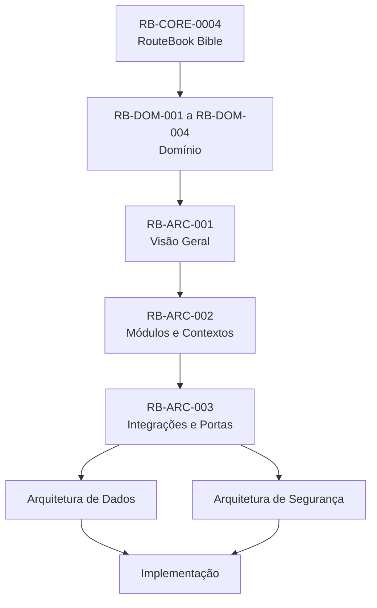

Integrações externas não poderão redefinir:

* conceitos;
* invariantes;
* identificadores canônicos;
* ciclos de vida;
* Eventos de Domínio;
* ownership;
* severidades;
* autorização.

---

### 3. Princípio central

O RouteBook deverá depender de capacidades externas, não de fornecedores específicos.

Exemplo:

```text
TravelEstimationPort
```

é uma capacidade interna.

```text
Google Maps
Mapbox
HERE
```

são possíveis implementações externas.

O domínio deverá conhecer a capacidade, não o fornecedor.

---

### 4. Estilo arquitetural

A arquitetura de integração seguirá:

```text
Ports and Adapters
+ Anti-Corruption Layer
+ contratos internos
+ eventos de integração
+ resiliência
+ observabilidade
+ Provenance
+ segurança por padrão
```

---

### 5. Objetivos

A arquitetura deverá:

1. impedir dependência direta do domínio em SDKs;
2. impedir que respostas externas se tornem entidades internas;
3. permitir substituição de fornecedor;
4. permitir múltiplos fornecedores;
5. preservar Provenance;
6. conter falhas;
7. controlar custo;
8. controlar latência;
9. respeitar rate limits;
10. permitir fallback;
11. permitir cache;
12. garantir idempotência;
13. minimizar dados enviados;
14. impedir autoridade autônoma da IA;
15. permitir testes sem dependências externas.

---

## Parte II — Conceitos

### 6. Porta

Uma porta é um contrato interno que representa uma capacidade necessária ao RouteBook.

Uma porta deve:

* utilizar Linguagem Ubíqua;
* expor tipos internos;
* esconder detalhes do fornecedor;
* possuir owner;
* documentar erros;
* documentar requisitos de idempotência;
* documentar limites de tempo;
* documentar requisitos de Provenance.

Exemplos:

```text
IdentityProviderPort
GeocodingPort
PlaceSearchPort
PlaceDetailsPort
TravelEstimationPort
WeatherDataPort
AIModelPort
NotificationPort
ObjectStoragePort
```

---

### 7. Porta de entrada

Uma porta de entrada representa uma capacidade oferecida pelo RouteBook.

Exemplos:

* comandos;
* casos de uso;
* APIs internas;
* consumidores de eventos;
* jobs;
* endpoints.

---

### 8. Porta de saída

Uma porta de saída representa uma capacidade exigida pelo RouteBook.

Exemplos:

* busca de Place;
* geocodificação;
* cálculo de rota;
* envio de email;
* geração por IA;
* armazenamento de arquivo.

---

### 9. Adaptador

Um adaptador implementa uma porta para uma tecnologia ou fornecedor.

Exemplo:

```text
TravelEstimationPort
├── GoogleMapsTravelEstimationAdapter
├── MapboxTravelEstimationAdapter
├── CachedTravelEstimationAdapter
└── InMemoryTravelEstimationAdapter
```

---

### 10. Anti-Corruption Layer

A Anti-Corruption Layer, ou ACL, protege o modelo interno contra modelos externos.

Ela deverá:

* traduzir identificadores;
* normalizar enums;
* converter unidades;
* normalizar precisão;
* interpretar estados externos;
* preservar Provenance;
* descartar campos irrelevantes;
* impedir vazamento de objetos de SDK;
* identificar dados desconhecidos;
* tratar divergências.

---

### 11. Gateway

Gateway é uma abstração de coordenação técnica sobre uma ou mais portas ou adaptadores.

Exemplos:

* AI Gateway;
* Geo Provider Gateway;
* Notification Gateway.

Um Gateway não deverá conter regras de negócio.

---

### 12. Provider

Provider é uma fonte externa que oferece uma capacidade.

Um Provider poderá ser:

* serviço SaaS;
* API pública;
* base licenciada;
* modelo de IA;
* sistema operacional;
* serviço interno futuro.

---

### 13. Contrato externo

Contrato externo é o contrato definido pelo fornecedor.

Ele não deverá ser utilizado como contrato interno canônico.

---

### 14. Contrato interno

Contrato interno representa a necessidade do RouteBook.

Ele deverá permanecer estável mesmo quando o fornecedor mudar.

---

### 15. Provenance

Provenance descreve a origem e o histórico de um dado.

Ela poderá incluir:

* DataSourceId;
* Provider;
* externalReference;
* collectedAt;
* effectiveAt;
* method;
* Confidence Level;
* Data Freshness;
* licença;
* versão do adaptador;
* transformações relevantes.

---

## Parte III — Visão geral

### 16. Topologia conceitual

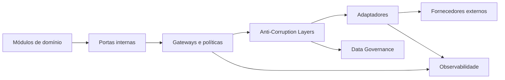

---

### 17. Regra de atravessamento

A comunicação com fornecedor deverá seguir, conceitualmente:

```text
Application Use Case
→ Port
→ Gateway ou policy
→ Adapter
→ Provider
→ Adapter
→ ACL
→ contrato interno
→ Application Use Case
```

O Domain não deverá chamar diretamente:

* HTTP client;
* SDK;
* banco externo;
* fila;
* modelo de IA;
* serviço de mapas;
* serviço de email.

---

### 18. Categorias de integração

As integrações iniciais poderão ser classificadas em:

1. identidade;
2. geocodificação;
3. mapas;
4. rotas e mobilidade;
5. catálogo de Places;
6. detalhes e estado operacional;
7. clima;
8. IA;
9. notificações;
10. armazenamento;
11. observabilidade;
12. analytics;
13. mensageria;
14. integrações futuras de reserva e pagamento.

---

### 19. Matriz de ownership

| Capacidade          | Contexto consumidor principal                 | Porta                        |
| ------------------- | --------------------------------------------- | ---------------------------- |
| Identidade externa  | Identity and Access                           | `IdentityProviderPort`       |
| Geocodificação      | Place Catalog                                 | `GeocodingPort`              |
| Busca de Places     | Place Catalog                                 | `PlaceSearchPort`            |
| Detalhes de Place   | Place Catalog                                 | `PlaceDetailsPort`           |
| Estado operacional  | Place Catalog                                 | `PlaceOperationalStatusPort` |
| Rotas e estimativas | Mobility                                      | `TravelEstimationPort`       |
| Clima               | Decision Intelligence                         | `WeatherDataPort`            |
| IA                  | Platform, com semântica no módulo solicitante | `AIModelPort`                |
| Notificações        | Platform                                      | `NotificationPort`           |
| Arquivos            | Platform                                      | `ObjectStoragePort`          |
| Eventos externos    | Platform                                      | `IntegrationEventPublisher`  |

---

## Parte IV — Regras gerais para portas

### 20. Linguagem interna

Portas deverão utilizar nomes internos.

Evitar:

```text
GooglePlacesService
OpenAIService
MapboxDirectionsService
```

Preferir:

```text
PlaceSearchPort
AIModelPort
TravelEstimationPort
```

---

### 21. Tipos internos

Portas não deverão retornar:

* objetos de SDK;
* respostas HTTP;
* JSON genérico sem contrato;
* enums externos;
* exceções do fornecedor;
* IDs externos como identidade principal.

---

### 22. Erros internos

Erros externos deverão ser traduzidos para categorias internas.

Exemplos:

```text
ProviderUnavailable
ProviderTimeout
ProviderRateLimited
ProviderAuthenticationFailed
ProviderResponseInvalid
DataUnavailable
DataStale
DataConflicting
CapabilityUnsupported
```

---

### 23. Tempo limite

Toda porta que execute I/O deverá possuir timeout definido.

O timeout poderá variar por capacidade.

Exemplos:

| Capacidade       | Característica                    |
| ---------------- | --------------------------------- |
| autenticação     | baixa latência esperada           |
| geocodificação   | resposta interativa               |
| busca de Places  | resposta interativa               |
| cálculo de rota  | resposta interativa ou assíncrona |
| IA               | latência variável                 |
| ingestão em lote | processamento assíncrono          |

Os valores concretos serão definidos por configuração e ADR.

---

### 24. Idempotência

A porta deverá declarar se a operação é:

* naturalmente idempotente;
* idempotente por chave;
* não idempotente;
* somente leitura.

Exemplos:

| Operação                | Natureza                              |
| ----------------------- | ------------------------------------- |
| SearchPlaces            | leitura                               |
| GetPlaceDetails         | leitura                               |
| CalculateTravelEstimate | leitura contextual                    |
| SendNotification        | idempotente por chave quando possível |
| UploadObject            | idempotente por chave ou checksum     |
| PublishIntegrationEvent | idempotente por EventId               |

---

### 25. Cancelamento

Operações longas deverão permitir cancelamento quando suportado.

Cancelamento técnico não deverá ser confundido com evento de domínio.

---

### 26. Paginação

Portas que retornem coleções deverão normalizar:

* cursor;
* limite;
* ordenação;
* continuidade;
* fim dos resultados.

O modelo interno não deverá depender do formato de paginação do fornecedor.

---

### 27. Rate limit

Adapters deverão traduzir rate limits externos para políticas internas.

O RouteBook deverá considerar:

* throttling;
* fila;
* cache;
* backoff;
* priorização;
* custo;
* uso de fornecedor alternativo.

---

### 28. Versionamento

Mudanças em portas deverão avaliar:

* consumidores;
* adapters;
* testes;
* compatibilidade;
* versionamento de contrato;
* migração.

---

## Parte V — Seleção de fornecedor

### 29. Estratégia de seleção

Um Gateway poderá selecionar fornecedor com base em:

* capacidade;
* região;
* disponibilidade;
* custo;
* latência;
* precisão;
* cobertura;
* licença;
* configuração;
* feature flag;
* estado do circuit breaker.

---

### 30. Seleção não é regra de negócio

A escolha do fornecedor é decisão técnica.

Ela não deverá alterar:

* significado do dado;
* regra de Recommendation;
* severidade;
* autorização;
* Decision do Usuário.

---

### 31. Diagrama de seleção

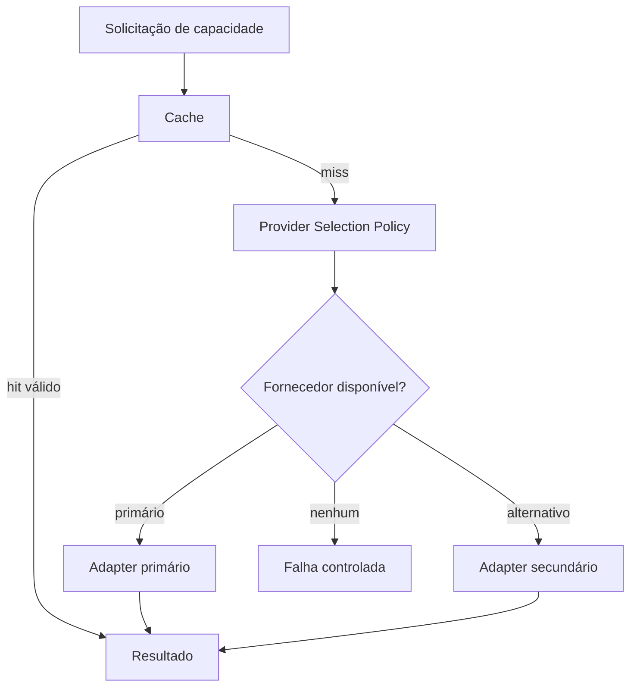

---

### 32. Fallback

Fallback poderá utilizar:

* fornecedor alternativo;
* cache stale permitido;
* resposta parcial;
* dado local;
* processamento posterior;
* indisponibilidade explícita.

Fallback não deverá:

* inventar dado;
* ocultar baixa confiança;
* assumir valor zero;
* afirmar confirmação inexistente.

---

## Parte VI — Resiliência

### 33. Estratégias de resiliência

A arquitetura poderá utilizar:

* timeout;
* retry;
* backoff;
* jitter;
* circuit breaker;
* bulkhead;
* rate limiter;
* cache;
* fallback;
* fila;
* dead-letter;
* reconciliação.

---

### 34. Retry

Retry deverá ser usado somente quando:

* a falha for transitória;
* a operação for idempotente;
* o custo for aceitável;
* houver limite;
* houver backoff.

Não utilizar retry automático para:

* autenticação inválida;
* contrato inválido;
* operação não idempotente sem proteção;
* dado inexistente;
* violação de regra.

---

### 35. Circuit breaker

Circuit breaker poderá interromper chamadas a fornecedor com falha recorrente.

Estados conceituais:

* closed;
* open;
* half-open.

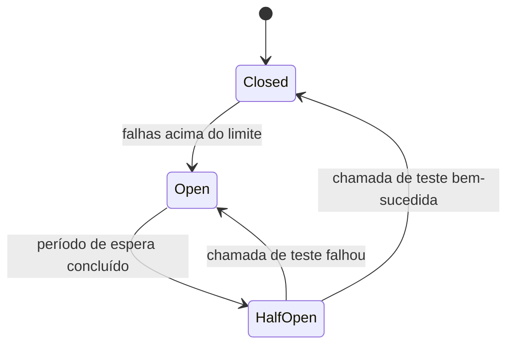

---

### 36. Bulkhead

Capacidades de alto custo ou alta latência deverão ser isoladas.

Exemplos:

* IA;
* ingestão de catálogo;
* cálculo de rotas em lote;
* processamento de imagens.

Uma falha nessas capacidades não deverá consumir todos os recursos do Backend.

---

### 37. Degradação

O produto deverá continuar funcional quando possível.

| Falha                     | Degradação esperada                                       |
| ------------------------- | --------------------------------------------------------- |
| IA indisponível           | edição manual e recomendações determinísticas disponíveis |
| Rotas indisponíveis       | Travel Time indisponível, Activities preservadas          |
| Place Search indisponível | Places já salvos continuam disponíveis                    |
| Notificação indisponível  | Decision permanece registrada                             |
| Imagem indisponível       | conteúdo textual permanece                                |
| Clima indisponível        | Recommendation comunica ausência do fator                 |

---

### 38. Fluxo resiliente

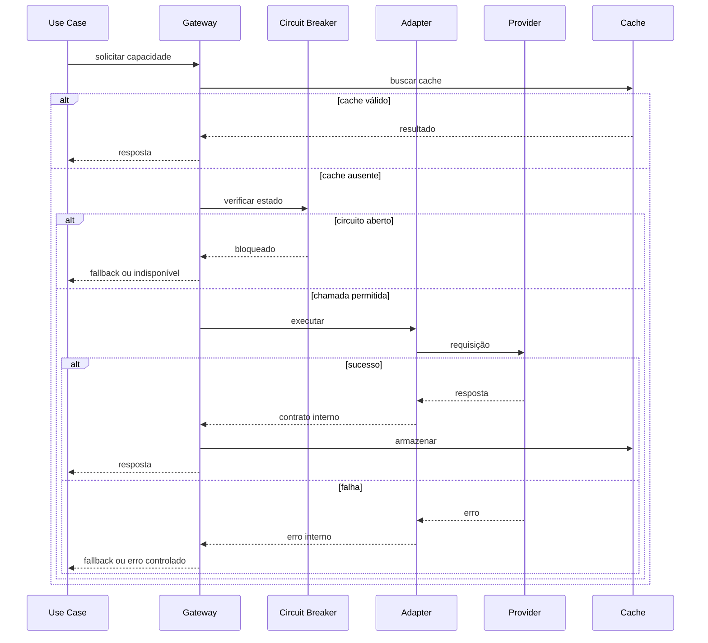

---

## Parte VII — Cache de integração

### 39. Objetivo

Cache poderá reduzir:

* latência;
* custo;
* consumo de quota;
* indisponibilidade percebida.

---

### 40. Chave de cache

A chave deverá incluir todos os fatores capazes de alterar o resultado.

Exemplo para Travel Estimate:

```text
origin
destination
transportMode
departureContext
providerPolicyVersion
```

---

### 41. Validade

Cache deverá possuir política por tipo de dado.

Exemplos:

* coordenada geográfica tende a ser estável;
* rota pode variar;
* estado operacional pode mudar rapidamente;
* preço pode mudar;
* Recommendation é contextual;
* clima possui validade curta.

---

### 42. Stale while revalidate

Dados não críticos poderão utilizar valor stale enquanto atualização ocorre, desde que:

* a condição seja indicada;
* a regra permita;
* a Provenance seja preservada;
* a confiança seja ajustada.

---

### 43. Cache não é fonte canônica

Cache poderá ser descartado e reconstruído.

Não deverá ser a única origem de dados canônicos.

---

## Parte VIII — Identity Provider

### 44. Porta oficial

```text
IdentityProviderPort
```

---

### 45. Responsabilidades

A porta poderá oferecer:

* validação de token;
* obtenção de identidade externa;
* criação de sessão externa;
* revogação;
* recuperação de atributos mínimos;
* validação de autenticação multifator futura.

---

### 46. Modelo interno

O resultado deverá ser traduzido para algo equivalente a:

```text
AuthenticatedIdentity
- externalSubject
- provider
- authenticationTime
- assuranceLevel
- verifiedClaims
```

Não deverá retornar diretamente um `User`.

O vínculo com `UserId` pertence a Identity and Access.

---

### 47. Regras

* externalSubject não substitui UserId;
* token não deve ser persistido sem necessidade;
* claims não confiáveis não devem ser aceitos;
* autorização pertence ao RouteBook;
* papel do fornecedor não substitui Trip Role;
* falha de identidade bloqueia operação autenticada.

---

### 48. Eventos externos

Eventos de identidade poderão incluir:

* conta externa desativada;
* senha alterada;
* sessão revogada;
* identidade comprometida.

Esses eventos deverão ser traduzidos antes de afetar o domínio.

---

## Parte IX — Geocodificação e mapas

### 49. Portas oficiais

```text
GeocodingPort
ReverseGeocodingPort
MapRenderingConfigurationPort
```

A renderização do mapa poderá ocorrer no frontend, mas chaves, políticas e configuração deverão ser controladas.

---

### 50. Geocodificação

Entrada interna:

* texto de endereço;
* região;
* país;
* idioma;
* proximidade opcional.

Saída interna:

* candidatos;
* GeoCoordinate;
* endereço normalizado;
* precisão;
* Provenance;
* Confidence Level.

---

### 51. Precisão

A resposta deverá indicar nível de precisão quando disponível:

* exact;
* rooftop;
* street;
* neighborhood;
* city;
* region;
* approximate;
* unknown.

A precisão não deverá ser aumentada artificialmente.

---

### 52. Reverse geocoding

Coordenadas poderão ser traduzidas para endereço contextual.

O resultado deverá ser tratado como dado externo, não confirmação absoluta.

---

### 53. Privacidade de localização

A integração deverá:

* enviar apenas localização necessária;
* evitar histórico contínuo;
* evitar logs de coordenadas precisas;
* permitir expiração;
* respeitar consentimento;
* evitar exposição a provedores não necessários.

---

## Parte X — Place Search e Place Details

### 54. Portas oficiais

```text
PlaceSearchPort
PlaceDetailsPort
PlaceOperationalStatusPort
PlaceImagePort
```

---

### 55. Busca de Places

Entrada poderá conter:

* termo;
* categoria;
* Destination;
* área geográfica;
* raio;
* horário contextual;
* idioma;
* paginação.

Saída deverá conter candidatos externos normalizados.

---

### 56. Candidato não é Place canônico

Um resultado de busca não deverá se tornar automaticamente um `Place` canônico completo.

Ele poderá ser:

* candidato;
* referência externa;
* rascunho para reconciliação;
* dado temporário de exploração.

---

### 57. Ingestão para Place Catalog

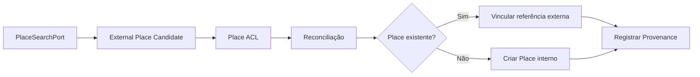

---

### 58. Detalhes de Place

Detalhes poderão incluir:

* nome;
* endereço;
* coordenadas;
* categorias;
* horários;
* telefone;
* site;
* imagens;
* Ratings;
* preço;
* estado operacional;
* acessibilidade.

Nenhum campo deverá ser considerado obrigatório universalmente.

---

### 59. Estado operacional

Estados externos deverão ser traduzidos para os estados internos oficiais.

A ausência de informação deverá produzir:

```text
unknown
```

e não:

```text
open
```

---

### 60. Opening Hours

A tradução deverá preservar:

* fuso;
* vigência;
* intervalos;
* exceções;
* feriados quando conhecidos;
* texto original quando útil;
* Provenance.

---

### 61. Ratings

Ratings deverão preservar:

* escala;
* valor;
* quantidade;
* Fonte;
* data de coleta.

Ratings de escalas distintas não deverão ser somados diretamente.

---

### 62. Imagens

Imagens externas deverão considerar:

* licença;
* atribuição;
* expiração;
* URL temporária;
* tamanho;
* fallback;
* conteúdo inadequado;
* cache autorizado.

---

### 63. Deduplicação

A reconciliação poderá considerar:

* identificador externo;
* nome;
* endereço;
* coordenadas;
* categoria;
* telefone;
* site.

Nenhum critério isolado deverá ser universalmente suficiente.

---

## Parte XI — Mobility e rotas

### 64. Porta oficial

```text
TravelEstimationPort
```

Portas complementares poderão incluir:

```text
RouteDetailsPort
TransportAvailabilityPort
```

---

### 65. Entrada interna

Uma solicitação de Travel Estimate deverá incluir:

* origem;
* destino;
* Transport Mode;
* contexto temporal quando relevante;
* fuso;
* preferências técnicas;
* acessibilidade quando suportada.

---

### 66. Saída interna

A saída poderá incluir:

* Distance;
* Travel Time;
* Route Summary;
* Transport Mode;
* Estimated Cost;
* Provider;
* collectedAt;
* validity;
* Confidence Level;
* limitações.

---

### 67. Estimativa

O resultado sempre deverá ser tratado como estimativa.

Não deverá ser apresentado como garantia.

---

### 68. Modos de transporte

A ACL deverá mapear modos externos para os modos internos.

Um modo não suportado deverá resultar em:

```text
CapabilityUnsupported
```

e não em conversão silenciosa para outro modo.

---

### 69. Falha

Em caso de falha:

* não assumir distância zero;
* não assumir tempo zero;
* não remover Activity;
* não confirmar inviabilidade;
* registrar falha;
* permitir retry ou fallback;
* ajustar Planning Assurance quando necessário.

---

### 70. Fluxo de estimativa

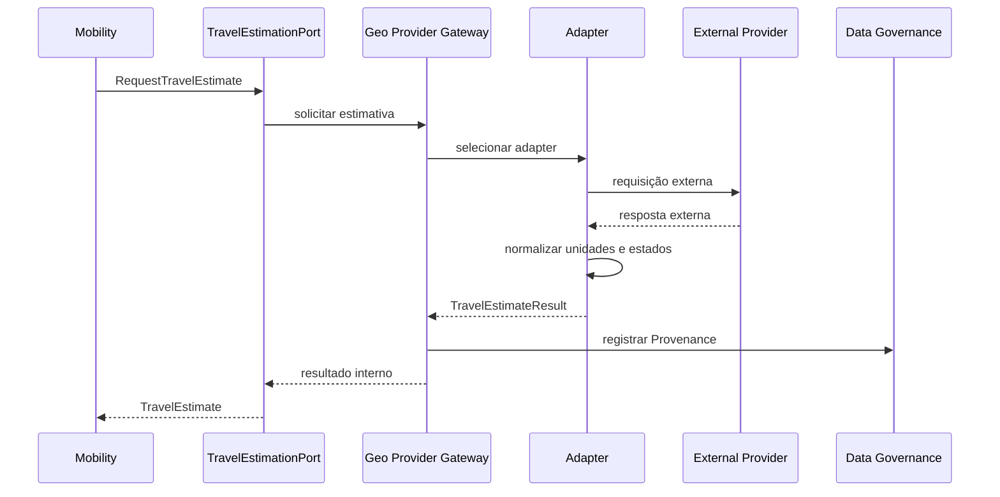

---

### 71. Custo de rota

Quando fornecido, o custo deverá indicar:

* moeda;
* natureza estimada;
* componentes;
* data;
* fornecedor;
* limitações.

---

### 72. Rotas em lote

Cálculos para um Itinerary completo poderão ser processados de forma assíncrona para:

* reduzir latência da requisição;
* controlar quotas;
* permitir retry;
* limitar concorrência;
* preservar responsividade.

---

## Parte XII — Clima

### 73. Porta oficial

```text
WeatherDataPort
```

---

### 74. Uso permitido

Clima poderá influenciar:

* Recommendation;
* Itinerary Proposal;
* Planning Conflict;
* sugestão de horário;
* necessidade de revisão.

---

### 75. Modelo interno

A saída deverá distinguir:

* observação atual;
* previsão;
* probabilidade;
* alerta;
* vigência;
* localização;
* Fonte;
* Confidence.

---

### 76. Previsão não é fato

Previsão deverá ser apresentada como possibilidade.

A incerteza deverá ser preservada.

---

### 77. Validade temporal

Dados meteorológicos deverão possuir validade curta e reavaliação contextual.

---

### 78. Alertas

Alertas de segurança poderão ter precedência elevada.

A interpretação de severidade deverá ocorrer no domínio, não no adapter.

---

## Parte XIII — Integração com IA

### 79. Porta oficial

```text
AIModelPort
```

Portas especializadas poderão ser expostas por capacidades internas:

```text
TextGenerationPort
StructuredGenerationPort
EmbeddingPort
ClassificationPort
```

A decisão deverá evitar acoplamento ao modelo do fornecedor.

---

### 80. AI Gateway

O AI Gateway pertence à Platform e deverá centralizar:

* seleção de provider;
* seleção de modelo;
* custo;
* timeout;
* retry;
* fallback;
* redaction;
* observabilidade;
* schema;
* limite de tokens;
* políticas de segurança;
* versionamento de prompts e capacidades.

---

### 81. Semântica no módulo consumidor

A Platform controla a execução técnica.

O módulo consumidor controla:

* objetivo;
* contexto;
* regras;
* interpretação;
* validação;
* persistência;
* Provenance.

Exemplos:

* Decision Intelligence controla Recommendation;
* Proposal Management controla Itinerary Proposal;
* Place Catalog controla reconciliação assistida.

---

### 82. Contexto mínimo

Antes de chamar IA:

1. identificar a finalidade;
2. selecionar dados necessários;
3. remover dados desnecessários;
4. anonimizar quando possível;
5. excluir credenciais;
6. limitar histórico;
7. registrar versão da capacidade;
8. definir schema esperado.

---

### 83. Saída não confiável

A saída deverá passar por:

* validação sintática;
* validação de schema;
* validação de enums;
* validação de referências;
* validação de IDs;
* validação de fatos;
* validação de regras;
* validação de autorização;
* validação de Provenance.

---

### 84. Fluxo de IA

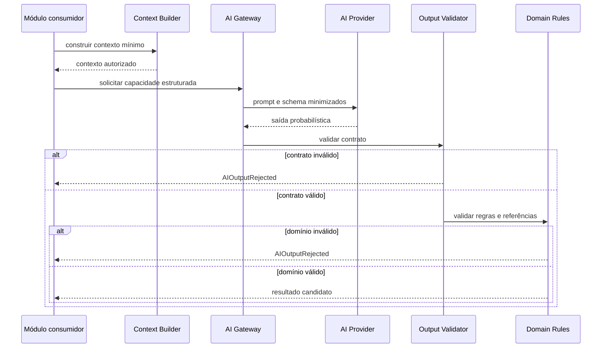

---

### 85. Autoridade

IA não poderá:

* registrar Decision do Usuário;
* ignorar Planning Risk;
* aplicar Itinerary Proposal;
* alterar Restriction;
* transferir ownership;
* excluir Trip;
* persistir diretamente;
* produzir Evento de sucesso antes da confirmação.

---

### 86. Fallback de IA

Quando IA falhar, poderá ser utilizado:

* regra determinística;
* ranking simples;
* edição manual;
* template;
* nova tentativa controlada;
* fornecedor alternativo;
* indisponibilidade explícita.

---

### 87. Custo

Toda chamada deverá permitir rastrear:

* provider;
* modelo;
* capacidade;
* tokens ou unidade equivalente;
* custo estimado;
* latência;
* resultado;
* fallback;
* módulo solicitante.

---

### 88. Prompt e versão

Prompts relevantes deverão possuir:

* identificador;
* versão;
* owner;
* finalidade;
* schema;
* testes;
* política de alteração.

Prompts não substituem regras de domínio.

---

## Parte XIV — Notificações

### 89. Porta oficial

```text
NotificationPort
```

Adapters poderão incluir:

* email;
* push;
* SMS futuro;
* notificação interna.

---

### 90. Comando interno

Uma solicitação deverá conter:

* tipo;
* destinatário interno;
* template;
* parâmetros mínimos;
* idioma;
* idempotency key;
* prioridade;
* correlationId.

---

### 91. Falha

Falha de notificação não deverá reverter:

* Decision;
* aplicação de Proposta;
* alteração de Trip;
* resolução de Planning Conflict.

---

### 92. Idempotência

O envio deverá evitar duplicação por:

* EventId;
* notificationId;
* idempotency key;
* destinatário;
* template;
* contexto.

---

### 93. Preferências

Preferências de comunicação e consentimentos deverão ser respeitados.

---

### 94. Dados pessoais

O payload enviado deverá ser minimizado.

Links deverão evitar exposição de identificadores sensíveis quando possível.

---

## Parte XV — Object Storage

### 95. Porta oficial

```text
ObjectStoragePort
```

---

### 96. Capacidades

* upload;
* download autorizado;
* URL temporária;
* remoção;
* metadata;
* checksum;
* retenção;
* classificação de conteúdo.

---

### 97. Regras

* bucket ou container não é domínio;
* URL externa não deve ser identidade canônica;
* acesso deve ser autorizado;
* arquivos devem possuir tipo e tamanho validados;
* secrets não devem ser armazenados;
* exclusão deve respeitar retenção;
* conteúdo externo deve respeitar licença.

---

### 98. Idempotência

Uploads poderão utilizar:

* checksum;
* object key;
* uploadId;
* idempotency key.

---

## Parte XVI — Analytics e observabilidade externa

### 99. Portas

```text
AnalyticsPort
MetricsPort
TracingPort
LoggingPort
ErrorReportingPort
```

---

### 100. Analytics não é domínio

Ferramentas de analytics não deverão ser fonte de verdade para:

* Decision;
* Recommendation;
* Trip;
* Activity;
* Planning Conflict.

---

### 101. Eventos analíticos

Eventos analíticos deverão ser derivados de fatos confirmados ou interações claramente identificadas.

Não deverão reutilizar nomes de Eventos de Domínio com significado diferente.

---

### 102. Privacidade

Dados enviados para analytics deverão ser minimizados e pseudonimizados quando possível.

---

### 103. Falha

Falha de analytics ou monitoramento não deverá bloquear caso de uso de negócio.

---

## Parte XVII — Eventos de integração

### 104. Definição

Evento de integração é um contrato estável utilizado para comunicar um fato entre limites de implantação ou sistemas.

Ele pode ser derivado de Evento de Domínio, mas não precisa possuir payload idêntico.

---

### 105. Regras

Eventos de integração deverão:

* representar fato confirmado;
* possuir EventId;
* possuir eventType;
* possuir occurredAt;
* possuir schemaVersion;
* possuir correlationId;
* minimizar dados;
* ocultar detalhes internos;
* ser idempotentes;
* permitir evolução.

---

### 106. Evento de Domínio versus integração

| Evento de Domínio                    | Evento de integração                   |
| ------------------------------------ | -------------------------------------- |
| interno ao domínio                   | contrato externo ou entre implantações |
| pode conter significado rico interno | deve possuir contrato estável e mínimo |
| pertence ao módulo                   | pertence à fronteira de integração     |
| não precisa ser público              | é publicado deliberadamente            |

---

### 107. Publicação

A publicação deverá ocorrer após confirmação da mudança.

Quando houver risco de inconsistência entre banco e publicação, deverá ser considerada:

```text
Transactional Outbox
```

---

### 108. Fluxo de Outbox

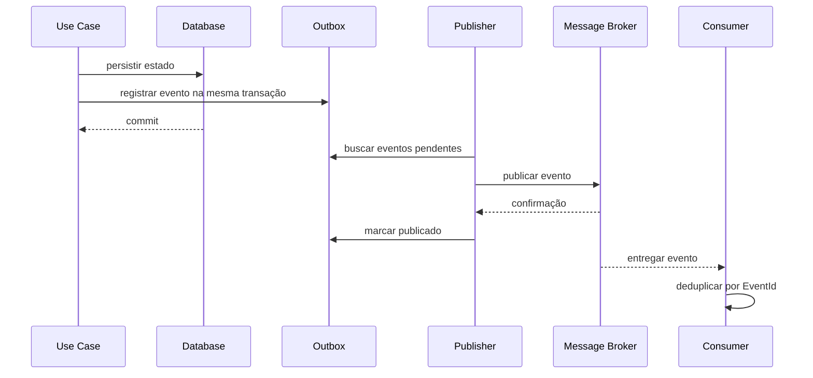

---

### 109. Consumo

Consumidores deverão:

* validar schema;
* validar origem;
* deduplicar;
* tratar ordem;
* tratar retry;
* registrar falha;
* preservar causalidade;
* não confiar automaticamente em payload externo.

---

### 110. Dead-letter

Mensagens que não puderem ser processadas após tentativas controladas poderão ir para dead-letter ou mecanismo equivalente.

Esse estado deverá ser observável e reconciliável.

---

### 111. Reprocessamento

Reprocessamento deverá ser:

* idempotente;
* auditável;
* autorizado;
* observável;
* limitado por versão de contrato.

---

## Parte XVIII — Webhooks

### 112. Uso

Webhooks poderão ser utilizados para receber eventos de:

* identidade;
* pagamentos futuros;
* reservas futuras;
* notificações;
* provedores de dados;
* processamento assíncrono.

---

### 113. Segurança

Todo webhook deverá considerar:

* assinatura;
* timestamp;
* replay protection;
* rotação de segredo;
* allowlist quando aplicável;
* limite de tamanho;
* validação de schema;
* observabilidade.

---

### 114. Confirmação rápida

O endpoint poderá confirmar recebimento e processar de forma assíncrona.

Não deverá manter o fornecedor aguardando por processamento longo.

---

### 115. Idempotência

Eventos repetidos deverão ser deduplicados por identificador externo e origem.

---

### 116. Tradução

Payload de webhook deverá passar por ACL antes de afetar o domínio.

---

## Parte XIX — Provenance e qualidade

### 117. Registro obrigatório

Integrações que produzam dados utilizados em decisões deverão registrar Provenance.

---

### 118. Dados mínimos

Provenance deverá permitir responder:

* de onde veio;
* quando foi coletado;
* para qual contexto;
* por qual adapter;
* com qual versão;
* com qual confiança;
* se foi transformado;
* se está stale;
* se existem divergências.

---

### 119. Diagrama de Provenance

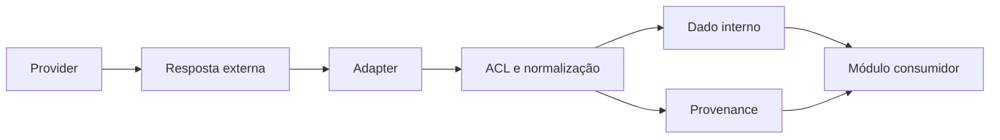

---

### 120. Divergência

Quando duas Fontes divergirem:

* preservar ambas;
* registrar Data Conflict;
* não sobrescrever silenciosamente;
* aplicar política;
* reduzir Confidence;
* comunicar limitação;
* permitir reavaliação.

---

### 121. Freshness

A política de Freshness deverá ser definida por tipo de dado.

O adapter poderá fornecer sinais, mas a política pertence ao RouteBook.

---

### 122. Dado gerado por IA

Conteúdo de IA deverá possuir Provenance própria.

Ele não deverá ser confundido com dado confirmado de fornecedor.

---

## Parte XX — Segurança

### 123. Credenciais

Credenciais deverão:

* permanecer fora do código;
* utilizar secret manager ou mecanismo equivalente;
* possuir rotação;
* possuir escopo mínimo;
* possuir ambientes separados;
* nunca aparecer em logs.

---

### 124. Saída de rede

A infraestrutura poderá restringir destinos externos autorizados.

---

### 125. TLS

Comunicações externas deverão utilizar transporte seguro.

---

### 126. Dados em trânsito

Dados pessoais deverão ser minimizados e protegidos.

---

### 127. Autorização

Adapters não deverão decidir autorização de negócio.

A autorização deverá ocorrer antes da chamada quando aplicável.

---

### 128. Sanitização

Respostas externas deverão ser tratadas como não confiáveis.

Conteúdo textual e URLs deverão ser validados antes de exibição ou persistência.

---

### 129. SSRF e URLs externas

Integrações que consumam URLs fornecidas externamente deverão impedir:

* acesso a redes internas;
* protocolos não autorizados;
* redirecionamentos inseguros;
* arquivos excessivos;
* tipos inesperados.

---

### 130. Supply chain

SDKs e bibliotecas de fornecedores deverão ser avaliados quanto a:

* manutenção;
* vulnerabilidades;
* licença;
* telemetria;
* permissões;
* tamanho;
* lock-in.

---

## Parte XXI — Privacidade

### 131. Minimização

Somente dados necessários deverão ser enviados a fornecedores.

---

### 132. Localização

Localização precisa deverá ser enviada apenas quando necessária à capacidade solicitada.

---

### 133. Dados de menores

Dados de menores deverão ser reduzidos a atributos funcionais quando possível.

---

### 134. Retenção externa

A seleção de fornecedores deverá considerar políticas de retenção e treinamento.

---

### 135. IA

Dados enviados a provedores de IA deverão respeitar:

* finalidade;
* minimização;
* redaction;
* configuração de retenção;
* proteção de dados;
* consentimento quando necessário.

---

## Parte XXII — Observabilidade

### 136. Metadados

Chamadas externas deverão registrar, sem dados sensíveis:

```text
provider
capability
adapter
operation
status
duration
retryCount
fallbackUsed
cacheStatus
correlationId
```

Quando aplicável:

```text
cost
quotaRemaining
schemaVersion
providerRequestId
```

---

### 137. Métricas

Métricas mínimas:

* volume;
* latência;
* taxa de erro;
* timeout;
* rate limit;
* retry;
* circuit breaker;
* cache hit;
* fallback;
* custo;
* disponibilidade;
* respostas inválidas.

---

### 138. Tracing

O trace deverá atravessar:

* caso de uso;
* Gateway;
* adapter;
* fornecedor;
* processamento assíncrono;
* consumidor.

---

### 139. Logs

Logs não deverão conter:

* tokens;
* segredos;
* prompts completos;
* payloads pessoais;
* coordenadas precisas sem necessidade;
* respostas integrais;
* dados de pagamento futuros.

---

### 140. Alertas

Alertas operacionais poderão considerar:

* aumento de erro;
* latência;
* circuit breaker aberto;
* quota baixa;
* custo anormal;
* dead-letter;
* falha de publicação;
* contrato inválido.

---

## Parte XXIII — Testabilidade

### 141. Adapters falsos

Cada porta relevante deverá possuir implementação de teste ou fake.

Exemplos:

```text
InMemoryPlaceSearchAdapter
FixedTravelEstimationAdapter
FakeAIModelAdapter
RecordingNotificationAdapter
```

---

### 142. Testes de contrato

Todos os adapters de uma mesma porta deverão passar pelo mesmo conjunto de testes de contrato.

---

### 143. Testes de ACL

Deverão validar:

* mapeamento de enums;
* conversão de unidades;
* campos ausentes;
* dados inválidos;
* estados desconhecidos;
* divergências;
* precisão;
* Provenance.

---

### 144. Testes de resiliência

Deverão cobrir:

* timeout;
* retry;
* rate limit;
* circuit breaker;
* fallback;
* cache stale;
* resposta parcial;
* fornecedor indisponível.

---

### 145. Testes de idempotência

Deverão cobrir:

* webhook duplicado;
* evento duplicado;
* envio de notificação repetido;
* upload repetido;
* publicação repetida.

---

### 146. Testes de IA

Deverão utilizar respostas controladas para validar:

* schema inválido;
* referência inexistente;
* enum inválido;
* dado inventado;
* conteúdo proibido;
* fallback;
* timeout;
* custo.

---

### 147. Sandboxes

Fornecedores com sandbox poderão ser utilizados em testes de integração.

Testes principais não deverão depender continuamente de disponibilidade externa.

---

## Parte XXIV — Governança de fornecedores

### 148. Registro de fornecedor

Todo fornecedor deverá possuir registro contendo:

* nome;
* capacidade;
* owner;
* contrato;
* regiões;
* custo;
* limites;
* SLA;
* política de dados;
* licença;
* adapters;
* fallback;
* riscos;
* status.

---

### 149. Estados

Um fornecedor poderá estar:

* proposed;
* evaluating;
* active;
* degraded;
* disabled;
* deprecated;
* retired.

---

### 150. Avaliação

Critérios:

* cobertura;
* precisão;
* latência;
* custo;
* disponibilidade;
* privacidade;
* segurança;
* licença;
* portabilidade;
* qualidade da documentação;
* suporte;
* lock-in.

---

### 151. Ativação

Um fornecedor só deverá ser ativado após:

* adapter;
* ACL;
* testes;
* observabilidade;
* política de timeout;
* política de retry;
* documentação;
* segurança;
* configuração por ambiente.

---

### 152. Substituição

A substituição deverá ocorrer alterando:

* configuração;
* seleção;
* adapter;
* política;

e não o Domain.

---

### 153. Remoção

Antes de remover:

* identificar consumidores;
* preservar Provenance histórica;
* migrar referências;
* atualizar cache;
* atualizar contratos;
* remover secrets;
* atualizar documentação.

---

## Parte XXV — Estrutura conceitual de código

### 154. Organização

```text
modules/
├── place-catalog/
│   ├── application/
│   │   └── ports/
│   └── infrastructure/
│       ├── adapters/
│       └── acl/
├── mobility/
│   ├── application/
│   │   └── ports/
│   └── infrastructure/
│       ├── adapters/
│       └── acl/
├── decision-intelligence/
│   └── application/
│       └── ports/
└── platform/
    ├── ai/
    ├── messaging/
    ├── notifications/
    ├── storage/
    └── observability/
```

---

### 155. Porta

Exemplo conceitual:

```text
mobility/application/ports/travel-estimation.port
```

---

### 156. Adapter

Exemplo conceitual:

```text
mobility/infrastructure/adapters/google-maps-travel-estimation.adapter
```

---

### 157. ACL

Exemplo conceitual:

```text
place-catalog/infrastructure/acl/google-places.acl
```

---

### 158. Configuração

Configuração de fornecedor deverá permanecer fora do Domain.

---

## Parte XXVI — Dependências permitidas

### 159. Regra geral

```text
Domain
← Application Port
← Infrastructure Adapter
← External Provider
```

A seta representa direção da dependência de código para o contrato interno.

---

### 160. Permitido

* Application definir porta;
* Infrastructure implementar porta;
* Adapter utilizar SDK externo;
* ACL converter modelo externo;
* Gateway selecionar adapter;
* Data Governance receber Provenance;
* Platform oferecer capacidade técnica.

---

### 161. Proibido

* Domain importar SDK;
* Domain conhecer fornecedor;
* Application retornar objeto de SDK;
* Adapter criar regra de negócio;
* ACL registrar Decision;
* Provider ID substituir ID interno;
* módulo consumidor acessar adapter concreto;
* frontend utilizar secret;
* IA escrever em repositório;
* webhook alterar agregado sem caso de uso.

---

### 162. Diagrama de dependências

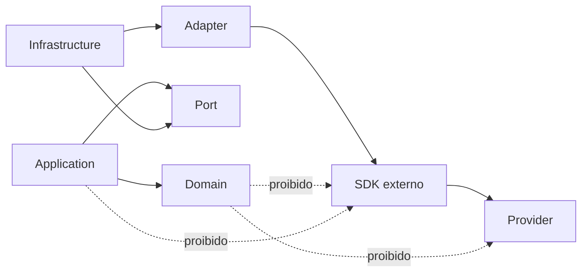

---

## Parte XXVII — Anti-patterns

### 163. Service por fornecedor

Evitar:

```text
GoogleMapsService
OpenAIService
SendGridService
```

como abstrações centrais do domínio.

---

### 164. SDK vazando

Não permitir que objetos externos atravessem controllers, services e domínio.

---

### 165. JSON genérico

Evitar contratos do tipo:

```text
Map<String, Any>
unknown
any
dynamic
```

quando um contrato estruturado puder ser definido.

---

### 166. Retry infinito

Retry sem limite pode:

* elevar custo;
* piorar indisponibilidade;
* consumir quota;
* duplicar efeitos;
* causar cascata.

---

### 167. Fallback silencioso

Não trocar fornecedor, modo de transporte ou nível de precisão sem registrar e comunicar quando relevante.

---

### 168. Cache eterno

Cache sem política de Freshness pode produzir recomendações inválidas.

---

### 169. Regra no adapter

Adapter não deverá decidir:

* adequação para o grupo;
* severidade;
* aceite de risco;
* validade de Proposta;
* autorização;
* Recommendation Score.

---

### 170. IDs externos como domínio

Evitar:

```text
googlePlaceId como PlaceId
```

O correto é:

```text
PlaceId interno
+ ExternalPlaceReference
```

---

### 171. IA como banco de fatos

Modelos de IA não deverão ser tratados como fonte confiável de horários, preços ou disponibilidade sem validação.

---

### 172. Webhook confiável por padrão

Todo webhook deverá ser autenticado, validado e deduplicado.

---

## Parte XXVIII — Estratégia de evolução

### 173. Fase inicial

A fase inicial poderá possuir:

* um fornecedor de identidade;
* um fornecedor geográfico;
* um fornecedor de Place;
* um provedor de IA;
* email opcional;
* adapters simples;
* cache local ou gerenciado;
* eventos internos em processo.

---

### 174. Fase intermediária

Poderá incluir:

* múltiplos fornecedores;
* Provider Gateway;
* Outbox;
* fila;
* workers;
* circuit breaker;
* cache distribuído;
* ingestão em lote;
* reconciliação avançada;
* monitoramento de custos.

---

### 175. Fase avançada

Somente por evidência:

* roteamento por região;
* múltiplos modelos de IA;
* seleção por custo e qualidade;
* integração com reservas;
* pagamentos;
* parceiros;
* marketplace;
* streaming;
* serviços independentes.

---

### 176. Critérios para novo fornecedor

1. Qual capacidade falta?
2. O fornecedor melhora cobertura?
3. O custo é justificável?
4. A licença é compatível?
5. A privacidade é aceitável?
6. O contrato interno já suporta?
7. Existe fallback?
8. Há observabilidade?
9. Há estratégia de saída?
10. O fornecedor reduz ou aumenta lock-in?

---

## Parte XXIX — Rastreabilidade

### 177. Portas por Contexto

| Contexto              | Portas principais                                                        |
| --------------------- | ------------------------------------------------------------------------ |
| Identity and Access   | `IdentityProviderPort`                                                   |
| Place Catalog         | `GeocodingPort`, `PlaceSearchPort`, `PlaceDetailsPort`, `PlaceImagePort` |
| Mobility              | `TravelEstimationPort`, `RouteDetailsPort`                               |
| Decision Intelligence | `WeatherDataPort`, `AIModelPort`                                         |
| Proposal Management   | `AIModelPort`, portas de Context Snapshot                                |
| Platform              | `NotificationPort`, `ObjectStoragePort`, `IntegrationEventPublisher`     |
| Data Governance       | contratos de Provenance e qualidade                                      |

---

### 178. Eventos e integrações

| Evento                     | Possível efeito externo         |
| -------------------------- | ------------------------------- |
| TripCreated                | analytics ou notificação futura |
| TripPeriodChanged          | recálculo externo               |
| ActivityAdded              | cálculo de rota                 |
| RecommendationRequested    | chamada de IA ou dados          |
| ItineraryProposalRequested | processamento assíncrono        |
| DecisionRecorded           | notificação ou analytics        |
| PlanningConflictDetected   | notificação                     |
| TripDeleted                | remoção ou anonimização externa |

---

### 179. Dados e Provenance

| Tipo                    | Provenance obrigatória |
| ----------------------- | ---------------------- |
| Place externo           | Sim                    |
| Opening Hours externo   | Sim                    |
| Rating                  | Sim                    |
| Travel Estimate         | Sim                    |
| Weather                 | Sim                    |
| conteúdo de IA          | Sim                    |
| dado manual do Usuário  | autoria interna        |
| estado canônico interno | auditoria interna      |

---

## Parte XXX — Catálogo de diagramas

### 180. Diagramas desta versão

| ID conceitual  | Diagrama                 |
| -------------- | ------------------------ |
| RB-DGM-ARC-025 | Autoridade documental    |
| RB-DGM-ARC-026 | Topologia de integração  |
| RB-DGM-ARC-027 | Seleção de fornecedor    |
| RB-DGM-ARC-028 | Circuit breaker          |
| RB-DGM-ARC-029 | Fluxo resiliente         |
| RB-DGM-ARC-030 | Ingestão de Place        |
| RB-DGM-ARC-031 | Travel Estimate          |
| RB-DGM-ARC-032 | Integração com IA        |
| RB-DGM-ARC-033 | Transactional Outbox     |
| RB-DGM-ARC-034 | Provenance               |
| RB-DGM-ARC-035 | Direção das dependências |

---

### 181. Critério de inclusão

Os diagramas foram incluídos quando ajudam a representar:

* fronteiras;
* tradução;
* dependências;
* resiliência;
* seleção;
* fluxo assíncrono;
* consistência;
* Provenance.

Não foram criados diagramas para cada porta porque as tabelas e contratos são mais adequados nesses casos.

---

## Parte XXXI — Critérios de aceite

### 182. Arquitetura

* portas utilizam linguagem interna;
* adapters implementam portas;
* fornecedores permanecem isolados;
* ACLs estão previstas;
* Gateways não contêm regras;
* Domain não depende de SDK;
* contratos externos não são canônicos;
* substituição de fornecedor é possível.

---

### 183. Resiliência

* timeouts estão previstos;
* retries são limitados;
* idempotência é considerada;
* circuit breaker é aplicável quando necessário;
* fallback não inventa dados;
* falhas são isoladas;
* degradação é explícita;
* cache possui Freshness.

---

### 184. Dados

* Provenance é preservada;
* external IDs não substituem IDs internos;
* unknown permanece representável;
* dados conflitantes são preservados;
* precisão não é aumentada;
* conteúdo de IA é identificado;
* dados stale são reconhecidos.

---

### 185. IA

* IA utiliza porta;
* AI Gateway pertence à Platform;
* semântica pertence ao módulo consumidor;
* contexto é minimizado;
* saída é não confiável;
* validações são obrigatórias;
* IA não possui autoridade autônoma;
* custos são observáveis.

---

### 186. Eventos

* Eventos de integração são versionados;
* publicação ocorre após confirmação;
* Outbox está prevista quando necessária;
* consumidores são idempotentes;
* dead-letter é observável;
* reprocessamento é seguro;
* webhooks são autenticados;
* replay é prevenido.

---

### 187. Segurança

* secrets não estão no código;
* TLS está previsto;
* payloads são minimizados;
* respostas externas são não confiáveis;
* logs não expõem dados sensíveis;
* URLs externas são validadas;
* SDKs são avaliados.

---

### 188. Testes

* portas possuem fakes;
* adapters possuem testes de contrato;
* ACLs possuem testes;
* resiliência é testada;
* idempotência é testada;
* IA é testada com respostas controladas;
* testes não dependem continuamente de fornecedores.

---

### 189. Diagramas

* Mermaid renderiza no GitHub;
* diagramas utilizam termos oficiais;
* diagramas possuem função arquitetural;
* diagramas não definem fornecedor obrigatório;
* diagramas não contradizem os contratos;
* blocos Mermaid não possuem atributos adicionais.

---

## Parte XXXII — Governança

### 190. Owner

O owner deste documento é:

```text
Architecture
```

A manutenção deverá envolver:

* Domain;
* Backend;
* Data;
* AI;
* Security;
* Platform;
* QA;
* DevOps.

---

### 191. Inclusão de porta

Uma nova porta deverá possuir:

* capacidade;
* owner;
* consumidores;
* tipos internos;
* erros;
* timeout;
* idempotência;
* segurança;
* Provenance;
* testes.

---

### 192. Inclusão de adapter

Um novo adapter deverá possuir:

* porta implementada;
* fornecedor;
* ACL;
* configuração;
* resiliência;
* observabilidade;
* testes de contrato;
* estratégia de erro;
* documentação.

---

### 193. Alteração de contrato

Mudanças deverão avaliar:

* consumidores;
* adapters;
* schema;
* compatibilidade;
* eventos;
* testes;
* documentação;
* migração.

---

### 194. Novo fornecedor

Novo fornecedor deverá passar por avaliação técnica, jurídica, financeira, de segurança e privacidade.

---

### 195. ADR obrigatório

Criar ADR quando houver:

* adoção de fornecedor estratégico;
* adoção de Outbox;
* adoção de broker;
* múltiplos fornecedores;
* estratégia de fallback relevante;
* mudança de porta pública;
* envio de dados sensíveis;
* integração de reserva ou pagamento;
* nova capacidade de IA;
* lock-in significativo.

---

### 196. Exceções

Exceções deverão registrar:

* motivo;
* owner;
* risco;
* prazo;
* mitigação;
* plano de remoção;
* ADR quando necessário.

---

### 197. Uso por agentes de engenharia

Agentes deverão:

* identificar a porta adequada;
* evitar fornecedor no Domain;
* criar adapter separado;
* utilizar ACL;
* preservar Provenance;
* implementar testes;
* não registrar secrets;
* não inventar fallback;
* não criar retries infinitos;
* não permitir IA escrever diretamente;
* sugerir ADR para decisões estratégicas.

---

## Parte XXXIII — Checklist final

### 198. Checklist documental

Antes de aprovar:

* frontmatter YAML é válido;
* existe apenas um H1;
* Partes utilizam H2;
* seções numeradas utilizam H3;
* propósito está definido;
* conceitos estão definidos;
* portas estão definidas;
* adapters estão definidos;
* ACL está definida;
* Gateways estão definidos;
* topologia está definida;
* seleção de fornecedor está definida;
* resiliência está definida;
* cache está definido;
* identidade está definida;
* geocodificação está definida;
* Place Search está definido;
* Place Details está definido;
* Mobility está definida;
* clima está definido;
* IA está definida;
* notificações estão definidas;
* armazenamento está definido;
* analytics está definido;
* Eventos de integração estão definidos;
* Outbox está prevista;
* webhooks estão definidos;
* Provenance está definida;
* segurança está definida;
* privacidade está definida;
* observabilidade está definida;
* testes estão definidos;
* governança de fornecedores está definida;
* dependências permitidas estão definidas;
* anti-patterns estão definidos;
* evolução está definida;
* rastreabilidade está presente;
* diagramas são necessários e não decorativos;
* Mermaid renderiza no GitHub;
* não existem contradições com RB-DOM-001;
* não existem contradições com RB-DOM-002;
* não existem contradições com RB-DOM-003;
* não existem contradições com RB-DOM-004;
* não existem contradições com RB-ARC-001;
* não existem contradições com RB-ARC-002.

---

## Parte XXXIV — Declaração final

### 199. Declaração arquitetural

A arquitetura de integrações do RouteBook deverá proteger o domínio contra dependência direta de tecnologias, SDKs e fornecedores externos.

Toda integração deverá:

* utilizar uma porta interna;
* utilizar contratos do RouteBook;
* traduzir modelos externos;
* preservar Provenance;
* representar unknown corretamente;
* tratar respostas como não confiáveis;
* aplicar timeout;
* aplicar resiliência proporcional;
* respeitar rate limits;
* permitir observabilidade;
* preservar idempotência;
* minimizar dados;
* proteger secrets;
* permitir substituição de fornecedor;
* preservar controle do Usuário.

Adapters não poderão:

* definir regras de negócio;
* alterar ownership;
* registrar Decisions;
* ignorar Planning Risks;
* aplicar Itinerary Proposals;
* transformar estimativa em confirmação;
* transformar dado desconhecido em valor falso;
* permitir que IDs externos substituam IDs internos.

A IA deverá permanecer uma capacidade externa controlada por portas, validações e casos de uso.

Nenhum fornecedor, webhook, SDK, modelo de IA ou mecanismo de mensageria poderá contornar os módulos, as autorizações, as invariantes ou os Eventos oficiais do RouteBook.
