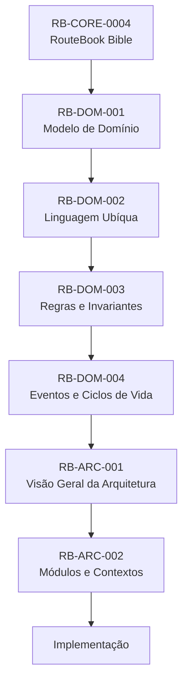
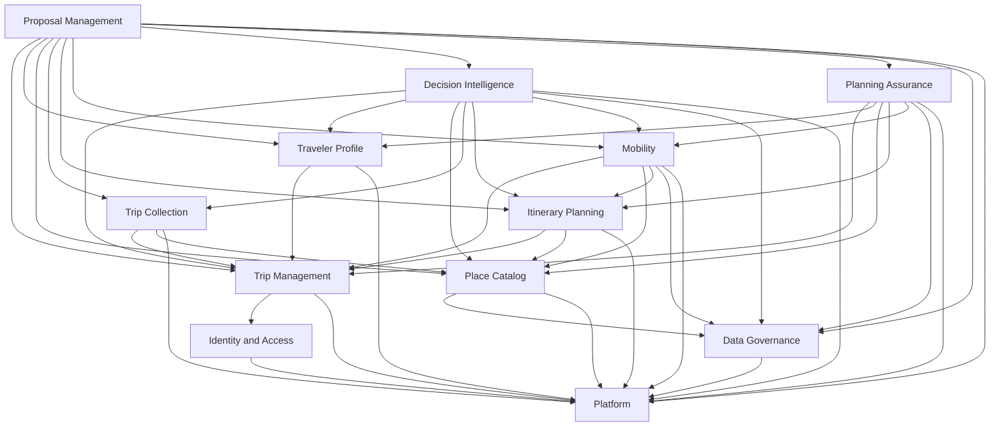
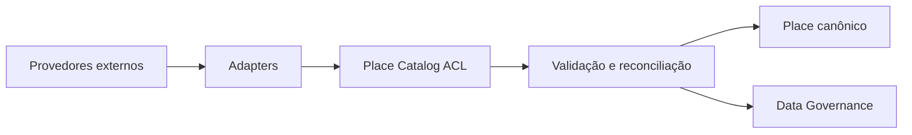
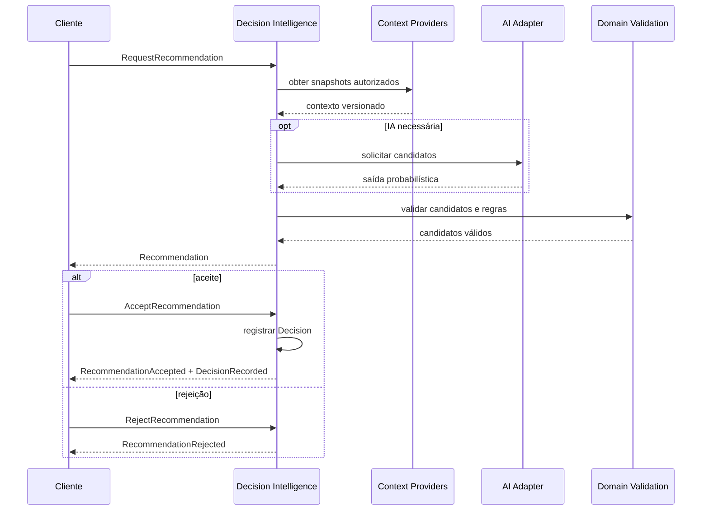
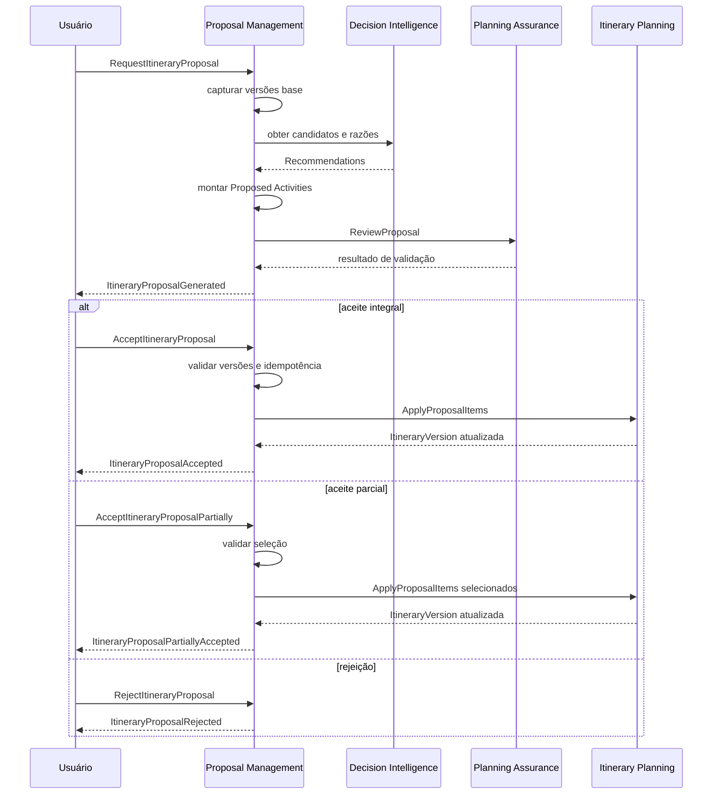
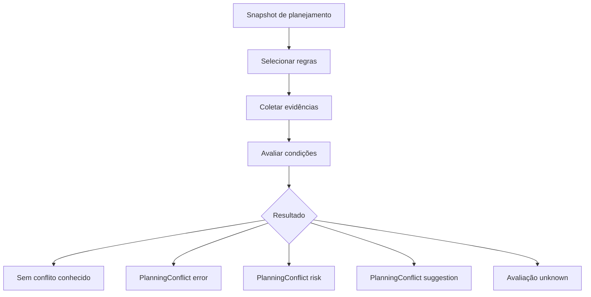
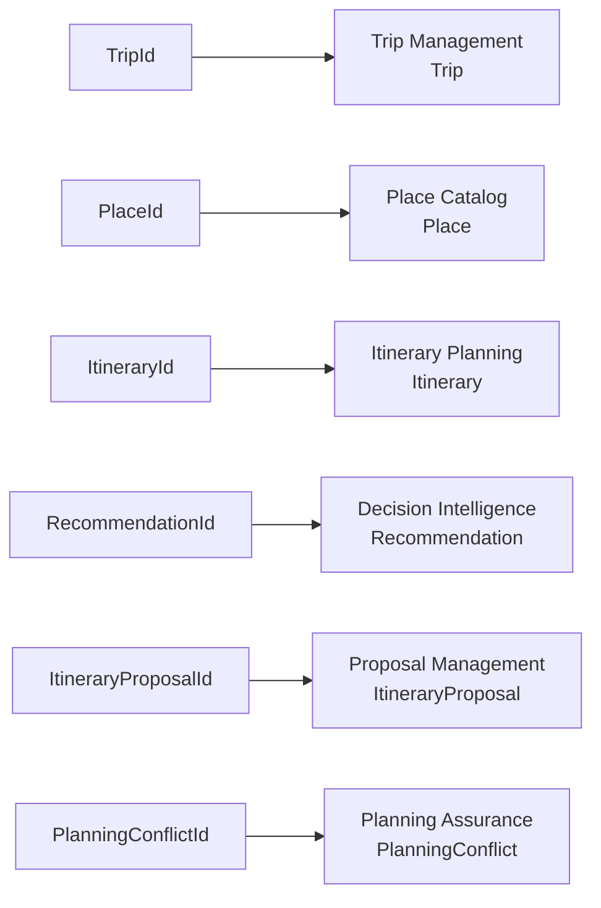
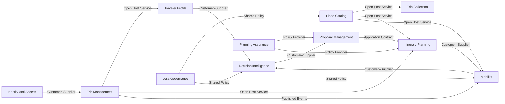
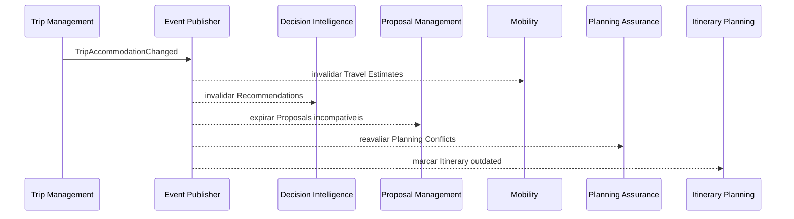
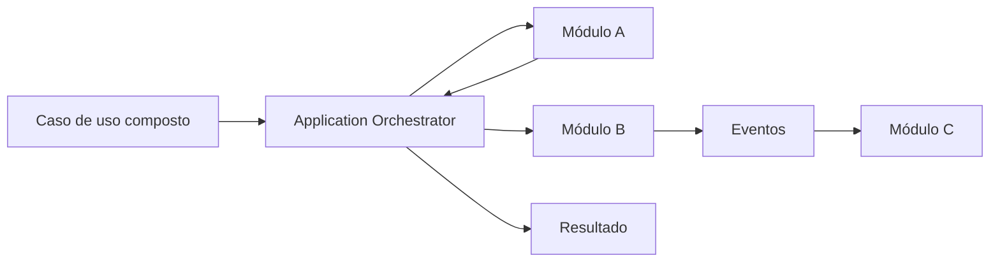

---

id: RB-ARC-002

title: Arquitetura de Módulos e Contextos Delimitados
description: Define os contextos delimitados, módulos, responsabilidades, ownership de dados, contratos internos, dependências, integrações, fluxos, limites arquiteturais e critérios de evolução modular do RouteBook.

document_type: architecture
owner: Architecture

status: Draft
version: "0.2.0"

created: "2026-07-17"
last_updated: "2026-07-18"

authors:

- RouteBook Team

tags:

- architecture
- bounded-contexts
- modules
- modular-monolith
- domain-driven-design
- context-map
- module-contracts
- data-ownership
- event-driven
- diagrams
- mermaid
- ai-first

related_documents:

- RB-CORE-0001
- RB-CORE-0002
- RB-CORE-0003
- RB-CORE-0004
- RB-PRD-001
- RB-PRD-002
- RB-PRD-003
- RB-PRD-004
- RB-PRD-005
- RB-PRD-006
- RB-PRD-007
- RB-PRD-008
- RB-UX-001
- RB-UX-002
- RB-UX-003
- RB-UX-004
- RB-UX-005
- RB-UX-006
- RB-DS-001
- RB-DS-002
- RB-DS-003
- RB-DS-004
- RB-DOM-001
- RB-DOM-002
- RB-DOM-003
- RB-DOM-004
- RB-ARC-001

prerequisites:

- RB-CORE-0004
- RB-DOM-001
- RB-DOM-002
- RB-DOM-003
- RB-DOM-004
- RB-ARC-001

next_documents:

- RB-ARC-003
- RB-ARC-004
- RB-ARC-005
- RB-DATA-001
- RB-API-001
- RB-SEC-001
- RB-QA-001

ai_context:
priority: critical
index: true
---

# RouteBook — Arquitetura de Módulos e Contextos Delimitados

## Parte I — Fundamentos da modularização

### 1. Propósito deste documento

Este documento define a arquitetura modular e os Contextos Delimitados oficiais do RouteBook.

Seu objetivo é estabelecer:

* quais capacidades pertencem ao sistema;
* onde cada conceito deve residir;
* onde cada regra deve ser implementada;
* qual módulo possui autoridade sobre cada dado;
* como os módulos podem se comunicar;
* quais dependências são permitidas;
* quais dependências são proibidas;
* quais contratos devem permanecer estáveis;
* como fluxos compostos devem ser coordenados;
* como evitar acoplamento indevido;
* como o Monólito Modular poderá evoluir;
* quando um módulo poderá ser extraído para um serviço independente.

Este documento deverá orientar:

* organização do código;
* definição de ownership;
* desenho de APIs internas;
* persistência;
* comunicação entre módulos;
* Eventos de Domínio;
* eventos de integração;
* testes de arquitetura;
* observabilidade;
* segurança;
* privacidade;
* evolução do Monólito Modular;
* atuação de agentes de engenharia.

Este documento não define:

* endpoints públicos completos;
* schemas físicos definitivos;
* tecnologias obrigatórias;
* implementação física do banco;
* estratégia final de mensageria;
* infraestrutura de implantação;
* contratos públicos detalhados;
* estrutura final do repositório.

---

### 2. Relação com a visão arquitetural

O `RB-ARC-001 — Visão Geral da Arquitetura` estabelece o RouteBook como:

```text
Monólito Modular
+ Domain-Driven Design
+ Arquitetura em Camadas
+ Ports and Adapters
+ Eventos internos
+ Processamento assíncrono seletivo
```

Este documento detalha como esse modelo será dividido em Contextos Delimitados e módulos.

---

### 3. Autoridade documental

A definição dos Contextos Delimitados deverá respeitar:



A divisão técnica não poderá redefinir silenciosamente:

* conceitos;
* agregados;
* invariantes;
* Eventos de Domínio;
* ownership conceitual;
* Linguagem Ubíqua.

---

### 4. Objetivos da modularização

A modularização deverá:

1. manter responsabilidades claras;
2. proteger invariantes;
3. tornar ownership explícito;
4. reduzir acoplamento;
5. controlar dependências;
6. evitar compartilhamento indiscriminado de dados;
7. permitir testes isolados;
8. favorecer substituição de integrações;
9. permitir observabilidade por capacidade;
10. preparar extrações futuras;
11. impedir que o Monólito Modular se torne um monólito acoplado;
12. manter o domínio independente da infraestrutura;
13. tornar relações entre módulos rastreáveis;
14. permitir que agentes de engenharia identifiquem o destino correto de cada implementação.

---

## Parte II — Conceitos arquiteturais

### 5. Contexto Delimitado

Um Contexto Delimitado representa uma fronteira dentro da qual:

* o modelo possui significado consistente;
* os termos possuem definições controladas;
* as regras possuem ownership;
* os dados possuem autoridade;
* os contratos de entrada e saída são explícitos.

Um Contexto Delimitado não precisa corresponder imediatamente a:

* serviço;
* processo;
* repositório;
* banco separado;
* aplicação separada;
* unidade independente de implantação.

No estágio inicial, vários Contextos Delimitados coexistirão no mesmo Monólito Modular.

---

### 6. Módulo

Um módulo é a unidade técnica que implementa uma capacidade pertencente a um Contexto Delimitado.

Um módulo deverá possuir:

* responsabilidade coesa;
* owner;
* API interna pública;
* elementos privados;
* camada de aplicação;
* camada de domínio quando aplicável;
* infraestrutura própria;
* testes;
* observabilidade;
* acesso controlado aos dados.

---

### 7. Submódulo

Um submódulo representa uma capacidade interna relevante que ainda não justifica um Contexto Delimitado independente.

Exemplo:

```text
trip-management/
├── trip-lifecycle/
├── trip-period/
├── accommodation/
└── participation/
```

Submódulos não devem ser criados apenas para espelhar entidades.

---

### 8. Ownership

Ownership define qual módulo possui autoridade para:

* criar um conceito;
* alterar seu estado;
* validar suas invariantes;
* persistir seu estado;
* publicar seus Eventos de Domínio;
* expor seus contratos;
* controlar sua evolução.

Ownership não impede consultas por outros módulos.

Impede alterações diretas fora do módulo proprietário.

---

### 9. Contrato interno

Contrato interno é a forma autorizada de comunicação entre módulos.

Pode assumir a forma de:

* comando;
* consulta;
* caso de uso;
* porta;
* DTO interno;
* Evento de Domínio;
* evento de integração;
* projeção;
* snapshot;
* interface de leitura.

---

### 10. API pública do módulo

A API pública de um módulo deverá expor apenas o necessário para seus consumidores.

Ela poderá conter:

```text
public/
├── commands/
├── queries/
├── events/
├── contracts/
└── ports/
```

Entidades, repositórios e implementações não deverão fazer parte da API pública.

---

### 11. Shared Kernel

Modelos compartilhados deverão ser mínimos.

Exemplos aceitáveis:

* identificadores genéricos de infraestrutura;
* `Money`;
* `LocalDate`;
* `LocalTime`;
* `TimeZone`;
* `GeoCoordinate`;
* `CorrelationId`;
* `CausationId`;
* `Clock`.

Não deverão ser colocados no Shared Kernel:

* agregados;
* regras de Viagem;
* regras de Recomendação;
* regras de Proposta;
* regras de Planning Conflict;
* modelos de fornecedores.

---

### 12. Snapshot

Snapshot representa uma cópia controlada e imutável de informações de outro Contexto para:

* registrar Contexto;
* preservar rastreabilidade;
* validar aplicabilidade;
* permitir explicação;
* reduzir acoplamento temporal.

Snapshot não transfere ownership.

---

### 13. Projeção

Projeção é um modelo de leitura derivado.

Ela:

* pode combinar dados de vários módulos;
* pode ser atualizada de forma assíncrona;
* não possui autoridade para escrita;
* não substitui o estado canônico;
* pode ser reconstruída.

---

## Parte III — Contextos Delimitados oficiais

### 14. Contextos iniciais

O RouteBook deverá possuir os seguintes Contextos Delimitados:

1. Identity and Access;
2. Trip Management;
3. Traveler Profile;
4. Place Catalog;
5. Trip Collection;
6. Itinerary Planning;
7. Mobility;
8. Decision Intelligence;
9. Proposal Management;
10. Planning Assurance;
11. Data Governance;
12. Platform.

---

### 15. Classificação estratégica

| Contexto              | Classificação                |
| --------------------- | ---------------------------- |
| Decision Intelligence | Core Domain                  |
| Proposal Management   | Core Domain                  |
| Planning Assurance    | Core Domain                  |
| Trip Management       | Supporting Domain            |
| Traveler Profile      | Supporting Domain            |
| Itinerary Planning    | Supporting Domain            |
| Trip Collection       | Supporting Domain            |
| Mobility              | Supporting Domain            |
| Place Catalog         | Supporting Domain            |
| Data Governance       | Generic/Supporting Domain    |
| Identity and Access   | Generic Domain               |
| Platform              | Generic Technical Capability |

A classificação poderá evoluir por ADR, mas não altera o ownership atual.

---

### 16. Mapa geral dos Contextos



As setas representam dependências autorizadas de contrato.

Não representam acesso direto à persistência.

---

### 17. Regra de direção

A dependência deverá apontar do consumidor para o fornecedor do contrato.

Quando dois módulos precisarem reagir mutuamente:

* evitar dependência bidirecional;
* utilizar Eventos de Domínio;
* utilizar projeções;
* utilizar orquestração;
* introduzir contrato intermediário quando necessário.

---

## Parte IV — Identity and Access

### 18. Nome oficial

```text
Identity and Access
```

Identificador conceitual:

```text
IAM
```

---

### 19. Responsabilidades

* Account;
* User;
* autenticação;
* sessão;
* identidades externas;
* consentimentos;
* papéis globais;
* permissões globais;
* validação de identidade.

A participação específica em uma Trip será coordenada com Trip Management.

---

### 20. Agregados e conceitos

* Account;
* User;
* Consent;
* ExternalIdentityReference;
* Session, quando modelada internamente.

---

### 21. Invariantes próprias

* Account ativa possui responsável;
* User possui identidade interna;
* identidade externa não substitui `UserId`;
* consentimento relevante é rastreável;
* autorização não depende apenas da interface;
* encerramento de Account respeita retenção e privacidade.

---

### 22. Dados de propriedade

Possui:

* Account;
* User;
* Consent;
* identidade externa;
* sessão ou referência de sessão;
* credenciais ou referências controladas.

Não possui:

* Traveler;
* Trip;
* Trip Role específico;
* Itinerary;
* Preference de Viagem.

---

### 23. Contratos expostos

#### Comandos

```text
RegisterUser
UpdateUserProfile
RecordConsent
RevokeConsent
RevokeSession
DeactivateAccount
```

#### Consultas

```text
GetCurrentUser
GetUserIdentity
ValidateSession
GetAccountStatus
ListUserPermissions
```

#### Eventos

```text
AccountCreated
UserAddedToAccount
UserRemovedFromAccount
ConsentRecorded
SessionRevoked
```

---

### 24. Dependências

Pode depender de:

* Platform;
* provedor externo de identidade por adapter.

Não deve depender de:

* Trip Management;
* Traveler Profile;
* Itinerary Planning;
* Mobility;
* Decision Intelligence;
* Proposal Management;
* Planning Assurance.

---

## Parte V — Trip Management

### 25. Nome oficial

```text
Trip Management
```

---

### 26. Responsabilidades

* criação da Trip;
* nome;
* Destination;
* Trip Period;
* Accommodation;
* Trip Status;
* Trip Participants;
* ownership;
* papéis específicos da Trip;
* alterações estruturais;
* `TripContextVersion`;
* cancelamento;
* arquivamento;
* exclusão.

---

### 27. Agregado principal

```text
Trip
```

---

### 28. Conceitos principais

* Trip;
* Destination;
* TripPeriod;
* Accommodation;
* TripParticipant;
* TripRole;
* TripStatus;
* TripContextVersion.

---

### 29. Invariantes próprias

* Trip possui owner;
* último owner não pode ser removido sem transferência;
* Trip Period possui intervalo válido;
* Trip planejável possui Destination e Trip Period;
* Accommodation é opcional;
* alteração estrutural incrementa `TripContextVersion`;
* cancelamento, arquivamento e exclusão são distintos;
* User participante não implica Traveler.

A existência mínima de Travelers pertence ao Traveler Profile, não ao agregado Trip.

---

### 30. Dados de propriedade

Possui:

* estado canônico da Trip;
* Destination;
* Trip Period;
* Accommodation;
* participantes;
* owner;
* papéis;
* status;
* TripContextVersion.

Não possui:

* Travelers;
* Interests;
* Restrictions;
* Saved Places;
* Activities;
* Recommendations;
* Decisions;
* Proposals;
* Travel Estimates;
* Planning Conflicts.

---

### 31. Contratos expostos

#### Comandos

```text
CreateTrip
UpdateTripName
UpdateTripDestination
UpdateTripPeriod
UpdateAccommodation
AddTripParticipant
ChangeTripParticipantRole
RemoveTripParticipant
TransferTripOwnership
CancelTrip
ArchiveTrip
DeleteTrip
```

#### Consultas

```text
GetTrip
ListTrips
GetTripContext
GetTripContextVersion
GetTripParticipants
GetTripPermissions
EvaluateTripStructuralImpact
```

#### Eventos

```text
TripCreated
TripNameChanged
TripDestinationChanged
TripPeriodChanged
TripAccommodationChanged
TripParticipantAdded
TripParticipantRoleChanged
TripParticipantRemoved
TripOwnershipTransferred
TripBecamePlannable
TripPlanningRequirementsLost
TripCancelled
TripArchived
TripDeleted
```

---

### 32. Dependências

Depende sincronamente de:

* Identity and Access;
* Platform.

Publica Eventos consumidos por:

* Traveler Profile;
* Itinerary Planning;
* Mobility;
* Decision Intelligence;
* Proposal Management;
* Planning Assurance.

Não deverá depender diretamente de Traveler Profile para preservar seu próprio agregado.

Coordenações que exijam ambos devem ocorrer na camada de aplicação.

---

## Parte VI — Traveler Profile

### 33. Nome oficial

```text
Traveler Profile
```

---

### 34. Responsabilidades

* Traveler;
* Traveler Profile;
* Group Profile;
* Interests;
* Restrictions;
* Budget;
* Pace;
* necessidades funcionais;
* preferências contextuais;
* preferência de Transport Mode.

---

### 35. Agregado principal

```text
TravelerProfile
```

---

### 36. Conceitos principais

* Traveler;
* GroupProfile;
* Interest;
* Restriction;
* Budget;
* Pace;
* TravelerNeed;
* PreferredTransportMode.

---

### 37. Invariantes próprias

* Traveler pertence a um Traveler Profile;
* Traveler Profile pertence a uma Trip;
* Trip planejável possui ao menos um Traveler;
* associação com User é opcional;
* o mesmo User não deve ser associado em duplicidade;
* dados pessoais devem ser minimizados;
* Restriction `mandatory` não pode ser ignorada;
* Group Profile é derivado;
* Budget monetário preserva moeda;
* Pace orienta densidade, mas não representa limite absoluto universal.

---

### 38. Dados de propriedade

Possui:

* Travelers;
* Group Profile;
* Interests;
* Restrictions;
* Budget;
* Pace;
* necessidades funcionais;
* preferências contextuais.

Não possui:

* Account;
* User;
* Trip;
* Place;
* Activity;
* Recommendation;
* Decision.

---

### 39. Contratos expostos

#### Comandos

```text
InitializeTravelerProfile
AddTraveler
UpdateTraveler
RemoveTraveler
AddTripInterest
RemoveTripInterest
AddTripRestriction
RemoveTripRestriction
UpdateTripBudget
UpdateTripPace
UpdatePreferredTransportMode
```

#### Consultas

```text
GetTravelerProfile
GetTravelers
GetGroupProfile
GetTripInterests
GetTripRestrictions
GetMandatoryRestrictions
GetDecisionPreferences
GetTripBudget
GetTripPace
```

#### Eventos

```text
TravelerProfileInitialized
TravelerAdded
TravelerUpdated
TravelerRemoved
GroupProfileUpdated
TripInterestAdded
TripInterestRemoved
TripRestrictionAdded
TripRestrictionRemoved
TripBudgetChanged
TripPaceChanged
```

---

### 40. Dependências

Depende de:

* Trip Management para validar a existência da Trip;
* Platform.

É consumido por:

* Decision Intelligence;
* Proposal Management;
* Planning Assurance;
* projeções de leitura.

Itinerary Planning poderá receber Restrições relevantes por contrato de validação, mas não deverá possuir o Traveler Profile.

---

## Parte VII — Place Catalog

### 41. Nome oficial

```text
Place Catalog
```

---

### 42. Responsabilidades

* identidade interna de Place;
* catálogo;
* categorias;
* Location;
* Opening Hours;
* Operational Status;
* Price Range;
* Rating;
* acessibilidade;
* detalhes;
* aliases;
* identificadores externos;
* reconciliação;
* deduplicação;
* fusão;
* Place personalizado.

---

### 43. Agregado principal

```text
Place
```

---

### 44. Conceitos principais

* Place;
* PlaceCategory;
* Location;
* OpeningHours;
* PriceRange;
* Rating;
* PlaceAccessibility;
* ExternalPlaceReference;
* PlaceOperationalStatus.

---

### 45. Invariantes próprias

* Place possui `PlaceId` interno;
* identidade interna não depende de fornecedor;
* dado ausente não recebe valor enganoso;
* preço desconhecido não significa gratuito;
* Rating ausente não significa zero;
* estado desconhecido não significa aberto;
* fusão preserva referências;
* consolidação preserva Provenance;
* precisão não excede a Fonte.

---

### 46. Dados de propriedade

Possui:

* Place;
* localização;
* categorias;
* detalhes;
* estado operacional;
* horários;
* preços;
* Ratings;
* acessibilidade;
* aliases;
* referências externas.

Não possui:

* Saved Place;
* Planned Place;
* Activity;
* Recommendation Score;
* preferência específica da Trip.

---

### 47. Contratos expostos

#### Comandos

```text
CreateCustomPlace
UpdateCustomPlace
ImportPlace
ReconcilePlace
MergePlaces
MarkPlaceTemporarilyClosed
MarkPlacePermanentlyClosed
MarkPlaceOperationalStatusUnknown
```

#### Consultas

```text
GetPlace
SearchPlaces
GetPlaceDetails
ResolvePlaceReferences
CheckPlaceOperationalStatus
GetPlaceLocation
GetPlaceDataQuality
```

#### Eventos

```text
PlaceCreated
PlaceDataUpdated
PlaceMerged
PlaceMarkedTemporarilyClosed
PlaceMarkedPermanentlyClosed
PlaceOperationalStatusBecameUnknown
PlaceDataFreshnessChanged
```

---

### 48. Dependências

Pode depender de:

* Data Governance;
* Platform;
* provedores externos por Anti-Corruption Layer.

É consumido por:

* Trip Collection;
* Itinerary Planning;
* Mobility;
* Decision Intelligence;
* Proposal Management;
* Planning Assurance.

---

### 49. Anti-Corruption Layer de Place



Objetos de fornecedores não poderão ser usados como entidades internas.

---

## Parte VIII — Trip Collection

### 50. Nome oficial

```text
Trip Collection
```

O nome oficial é singular.

O nome `Trip Collections` não deverá ser utilizado como nome do Contexto.

---

### 51. Responsabilidades

* Trip Collection;
* Saved Place;
* notas contextuais;
* origem do salvamento;
* organização futura de itens salvos;
* unicidade por Trip e Place.

---

### 52. Agregado principal

```text
TripCollection
```

---

### 53. Conceitos principais

* TripCollection;
* SavedPlace;
* SavedPlaceNote;
* SavedPlaceOrigin.

---

### 54. Invariantes próprias

* uma Trip possui uma Trip Collection;
* `TripId + PlaceId` é único;
* Save Place é idempotente;
* salvar não cria Activity;
* remover dos Salvos não remove Activity;
* Planned Place é derivado do Itinerary;
* Saved Place não altera o Place canônico.

---

### 55. Dados de propriedade

Possui:

* associação entre Trip e Place;
* data do salvamento;
* origem;
* notas;
* metadados contextuais.

Não possui:

* Place;
* Itinerary;
* Activity;
* Recommendation;
* estado Planned canônico.

---

### 56. Contratos expostos

#### Comandos

```text
InitializeTripCollection
SavePlace
UnsavePlace
UpdateSavedPlaceNote
```

#### Consultas

```text
GetTripCollection
ListSavedPlaces
ListSavedPlaceIds
IsPlaceSaved
GetSavedPlace
```

#### Eventos

```text
PlaceSaved
PlaceUnsaved
SavedPlaceNoteChanged
```

---

### 57. Dependências

Depende de:

* Trip Management;
* Place Catalog;
* Platform.

É consumido por:

* Decision Intelligence;
* Proposal Management;
* projeções de exploração;
* Trip Overview.

---

## Parte IX — Itinerary Planning

### 58. Nome oficial

```text
Itinerary Planning
```

---

### 59. Responsabilidades

* Itinerary atual;
* Trip Days;
* Activities;
* Free Periods;
* ordenação;
* sincronização temporal;
* planejamento parcial;
* estados multidimensionais do Itinerary;
* `ItineraryVersion`;
* aplicação de itens aceitos de Itinerary Proposal.

---

### 60. Agregado principal

```text
Itinerary
```

---

### 61. Conceitos principais

* Itinerary;
* TripDay;
* Activity;
* FreePeriod;
* ActivityOrder;
* ActivityStatus;
* ActivityFlexibility;
* ItineraryVersion;
* PlanningCompleteness;
* ReviewState;
* ConsistencyState;
* ConflictSummary.

---

### 62. Invariantes próprias

* uma Trip possui um Itinerary canônico atual;
* existe no máximo um Trip Day ativo por data;
* Activity pertence a um Trip Day;
* Activity possui título;
* Duration informada é positiva;
* horário utiliza o fuso da Trip;
* ordem é determinística;
* Activity sem horário é válida;
* Activity `fixed` não é movida automaticamente;
* Free Period `protected` não é preenchido automaticamente;
* mudança de Dia preserva `ActivityId`;
* toda alteração canônica incrementa `ItineraryVersion`;
* planejamento parcial é válido.

---

### 63. Dados de propriedade

Possui:

* Itinerary;
* Trip Days;
* Activities;
* Free Periods;
* ordens;
* estados;
* ItineraryVersion.

Não possui:

* Place completo;
* Traveler Profile;
* Recommendation;
* Decision;
* Itinerary Proposal;
* Travel Estimate;
* Planning Conflict.

Mantém apenas referências autorizadas.

---

### 64. Contratos expostos

#### Comandos

```text
InitializeItinerary
SynchronizeTripDays
AddActivity
UpdateActivity
MoveActivityToAnotherDay
ReorderActivity
RemoveActivity
MarkActivityTentative
CompleteActivity
SkipActivity
CancelActivity
AddFreePeriod
UpdateFreePeriod
RemoveFreePeriod
ProtectFreePeriod
MakeFreePeriodFlexible
MarkTripDayFree
ApplyProposalItems
MarkItineraryOutdated
ReviewItineraryState
```

#### Consultas

```text
GetItinerary
GetTripDay
ListActivities
GetItineraryVersion
GetPlanningSnapshot
IsPlacePlanned
GetItineraryState
```

#### Eventos

```text
ItineraryInitialized
TripDaysSynchronized
TripDayAdded
TripDayRemoved
TripDayMarkedFree
ActivityAdded
ActivityUpdated
ActivityMovedToAnotherDay
ActivityReordered
ActivityMarkedTentative
ActivityCompleted
ActivitySkipped
ActivityCancelled
ActivityMarkedUnavailable
ActivityMarkedForReview
ActivityRemoved
FreePeriodAdded
FreePeriodUpdated
FreePeriodRemoved
FreePeriodProtected
FreePeriodMadeFlexible
ItineraryVersionChanged
ItineraryMarkedOutdated
ItineraryReviewed
ItineraryReviewInvalidated
```

---

### 65. Dependências

Depende de:

* Trip Management;
* Place Catalog apenas para validações de referência;
* Platform.

Publica Eventos consumidos por:

* Mobility;
* Decision Intelligence;
* Proposal Management;
* Planning Assurance;
* projeções.

Itinerary Planning não deverá depender diretamente de Proposal Management.

Proposal Management solicita aplicação por contrato público.

---

## Parte X — Mobility

### 66. Nome oficial

```text
Mobility
```

---

### 67. Responsabilidades

* Travel Estimate;
* Distance;
* Travel Time;
* Transport Mode;
* origem;
* destino;
* validade;
* rota normalizada;
* integração com provedores geográficos;
* cache de estimativas;
* fallback controlado.

---

### 68. Conceitos principais

* TravelEstimate;
* Distance;
* TravelTime;
* TransportMode;
* TravelOrigin;
* TravelDestination;
* RouteSummary;
* EstimateValidity.

---

### 69. Invariantes próprias

* Travel Estimate possui origem;
* possui destino;
* possui Transport Mode;
* Distance não é negativa;
* Travel Time não é negativo;
* estimativa é identificada como estimativa;
* mudança relevante invalida o cálculo;
* precisão não excede a Fonte;
* falha de rota não assume valor zero;
* falha de rota não remove Activity.

---

### 70. Dados de propriedade

Possui:

* Travel Estimates;
* estado de cálculo;
* validade;
* rota externa normalizada;
* cache contextual;
* Provenance específica.

Não possui:

* Activity;
* Place;
* Accommodation;
* Itinerary;
* Preference.

Recebe referências e snapshots necessários.

---

### 71. Contratos expostos

#### Comandos

```text
RequestTravelEstimate
RefreshTravelEstimate
InvalidateTravelEstimate
InvalidateTravelEstimates
RecalculateItineraryTravel
```

#### Consultas

```text
GetTravelEstimate
GetTravelEstimatesForDay
GetDistanceFromAccommodation
GetRouteSummary
GetTravelAvailability
```

#### Eventos

```text
TravelEstimateRequested
TravelEstimateCalculated
TravelEstimateFailed
TravelEstimateInvalidated
TravelEstimateBecameStale
```

---

### 72. Dependências

Depende de:

* Trip Management para Accommodation;
* Place Catalog para Location;
* Itinerary Planning para sequência;
* Data Governance;
* Platform;
* provedores externos por adapters.

É consumido por:

* Decision Intelligence;
* Proposal Management;
* Planning Assurance;
* projeções de mapa e Itinerary.

---

## Parte XI — Decision Intelligence

### 73. Nome oficial

```text
Decision Intelligence
```

---

### 74. Responsabilidades

* construção do Decision Context;
* Recommendation;
* Recommendation Reason;
* Recommendation Confidence;
* ranking;
* diversidade;
* Next Best Action;
* Explainability;
* Decision;
* Decision Outcome;
* Decision Quality;
* validade;
* invalidação;
* coordenação de IA para apoio à decisão;
* validação de saída probabilística.

---

### 75. Agregados principais

```text
Recommendation
Decision
```

Recommendation e Decision são agregados distintos.

---

### 76. Conceitos principais

* Recommendation;
* RecommendationReason;
* RecommendationConfidence;
* RecommendationScore;
* DecisionContextSnapshot;
* Decision;
* DecisionOutcome;
* DecisionQuality;
* NextBestAction.

---

### 77. Invariantes próprias

* Recommendation personalizada possui Context Snapshot;
* Recommendation possui Reason;
* Recommendation Confidence não representa certeza;
* Score não substitui Confidence;
* Score não substitui Reason;
* Restriction `mandatory` possui precedência;
* Recommendation não altera estado canônico;
* Decision possui ator;
* Decision pode existir sem Recommendation;
* Decision não implica execução concluída;
* IA não registra Decision do Usuário;
* mudança material de Contexto invalida Recommendation;
* saída de IA passa por validação determinística.

---

### 78. Dados de propriedade

Possui:

* Recommendations;
* Reasons;
* Scores;
* Confidence;
* Context Snapshots;
* Decisions;
* Decision Outcomes;
* avaliação de Decision Quality;
* validade;
* metadados de geração.

Não possui:

* Trip;
* Traveler Profile;
* Place;
* Saved Place;
* Itinerary;
* Activity;
* Itinerary Proposal.

Mantém referências e snapshots controlados.

---

### 79. Contratos expostos

#### Comandos

```text
RequestRecommendation
PresentRecommendation
AcceptRecommendation
RejectRecommendation
InvalidateRecommendation
SupersedeRecommendation
RecordDecision
RequestDecisionExecution
RecordDecisionOutcome
EvaluateDecisionQuality
```

#### Consultas

```text
GetRecommendation
ListRecommendations
ExplainRecommendation
GetRecommendationContext
GetRecommendationConfidence
GetDecision
ListDecisions
GetDecisionOutcome
```

#### Eventos

```text
RecommendationRequested
RecommendationGenerated
RecommendationPresented
RecommendationAccepted
RecommendationRejected
RecommendationExpired
RecommendationInvalidated
RecommendationSuperseded
DecisionRecorded
DecisionExecutionRequested
DecisionExecutionCompleted
DecisionExecutionFailed
DecisionOutcomeRecorded
DecisionQualityEvaluated
```

---

### 80. Dependências

Depende de:

* Trip Management;
* Traveler Profile;
* Place Catalog;
* Trip Collection;
* Itinerary Planning;
* Mobility;
* Data Governance;
* Platform;
* AI adapters por porta.

É consumido por:

* Proposal Management;
* interfaces de exploração;
* Trip Overview;
* analytics autorizados.

---

### 81. Fluxo de Decision Intelligence



---

## Parte XII — Proposal Management

### 82. Nome oficial

```text
Proposal Management
```

---

### 83. Responsabilidades

* solicitação de Itinerary Proposal;
* geração;
* armazenamento;
* ciclo de vida;
* versão base do Itinerary;
* versão base do Trip Context;
* Proposed Activities;
* critérios;
* justificativas;
* limitações;
* seleção;
* aceite integral;
* aceite parcial;
* rejeição;
* expiração;
* cancelamento;
* supersessão;
* idempotência de aplicação;
* coordenação com Itinerary Planning.

---

### 84. Agregado principal

```text
ItineraryProposal
```

---

### 85. Conceitos principais

* ItineraryProposal;
* ProposedActivity;
* ProposalSelection;
* ItineraryProposalStatus;
* ItineraryVersion base;
* TripContextVersion base;
* ProposalValidity.

---

### 86. Invariantes próprias

* Itinerary Proposal possui `ItineraryProposalId`;
* referencia `ItineraryVersion`;
* referencia `TripContextVersion`;
* não altera o Itinerary enquanto não aceita;
* Proposed Activity não é Activity canônica;
* aceite é explícito;
* aceite parcial aplica somente itens selecionados;
* Proposta expirada não é aplicável;
* Activity `fixed` deve ser preservada;
* Free Period `protected` deve ser preservado;
* aplicação é idempotente;
* falha de aplicação preserva o Itinerary anterior.

---

### 87. Dados de propriedade

Possui:

* Itinerary Proposal;
* status;
* conteúdo proposto;
* critérios;
* Reasons;
* limitações;
* versões base;
* seleção;
* histórico de geração;
* referência idempotente.

Não possui:

* Itinerary atual;
* Activity canônica;
* Traveler Profile;
* Place canônico;
* Planning Conflict.

Mantém referências e snapshots.

---

### 88. Contratos expostos

#### Comandos

```text
RequestItineraryProposal
CancelItineraryProposalGeneration
AcceptItineraryProposal
AcceptItineraryProposalPartially
RejectItineraryProposal
RegenerateItineraryProposal
ExpireItineraryProposal
SupersedeItineraryProposal
```

#### Consultas

```text
GetItineraryProposal
ListItineraryProposals
GetCurrentItineraryProposal
GetItineraryProposalImpact
ValidateItineraryProposalApplicability
```

#### Eventos

```text
ItineraryProposalRequested
ItineraryProposalGenerationStarted
ItineraryProposalGenerated
ItineraryProposalGenerationFailed
ItineraryProposalAccepted
ItineraryProposalPartiallyAccepted
ItineraryProposalRejected
ItineraryProposalExpired
ItineraryProposalCancelled
ItineraryProposalSuperseded
```

---

### 89. Dependências

Depende de:

* Trip Management;
* Traveler Profile;
* Place Catalog;
* Trip Collection;
* Itinerary Planning;
* Mobility;
* Decision Intelligence;
* Planning Assurance;
* Data Governance;
* Platform.

Proposal Management não deverá alterar o repositório de Itinerary Planning.

A aplicação deverá ocorrer por:

```text
ApplyProposalItems
```

ou contrato equivalente pertencente a Itinerary Planning.

---

### 90. Fluxo de geração e aplicação



---

## Parte XIII — Planning Assurance

### 91. Nome oficial

```text
Planning Assurance
```

---

### 92. Responsabilidades

* avaliação de regras;
* revisão do planejamento;
* detecção de Planning Conflicts;
* severidade;
* evidências;
* resolução;
* aceite consciente de Planning Risk;
* restauração de risco ignorado;
* invalidação;
* supersessão;
* revisão de Itinerary;
* revisão de Itinerary Proposal;
* resumo de consistência.

---

### 93. Agregado principal

```text
PlanningConflict
```

---

### 94. Conceitos principais

* PlanningConflict;
* PlanningConflictId;
* ConflictCategory;
* ConflictSeverity;
* ConflictStatus;
* ConflictEvidence;
* ConflictRule;
* ConflictResolution.

Não utilizar `Conflict` como nome canônico do agregado.

---

### 95. Invariantes próprias

* Planning Conflict possui `PlanningConflictId`;
* possui regra;
* possui evidência;
* possui objeto afetado;
* possui severidade;
* possui versões avaliadas;
* severidade `error` não pode ser ignorada;
* risco ignorado é auditável;
* resolução exige remoção da condição;
* ignored é diferente de resolved;
* invalidated é diferente de resolved;
* condições equivalentes não geram duplicidade ativa.

---

### 96. Dados de propriedade

Possui:

* Planning Conflicts;
* status;
* severidade;
* evidências;
* regras aplicadas;
* referência a Decision de risco;
* versões do Contexto avaliado;
* histórico de resolução e invalidação.

Não possui:

* Activity;
* Itinerary;
* Travel Estimate;
* Itinerary Proposal;
* Trip;
* Traveler Profile.

Mantém referências e snapshots.

---

### 97. Contratos expostos

#### Comandos

```text
ReviewItinerary
ReviewItineraryProposal
DetectPlanningConflicts
ResolvePlanningConflict
IgnorePlanningRisk
RestoreIgnoredPlanningRisk
InvalidatePlanningConflicts
SupersedePlanningConflict
```

#### Consultas

```text
ListPlanningConflicts
GetPlanningConflict
GetPlanningConflictSummary
ValidatePlanningOperation
GetBlockingPlanningConflicts
GetActivePlanningRisks
```

#### Eventos

```text
PlanningConflictDetected
PlanningConflictResolved
PlanningConflictIgnored
PlanningConflictInvalidated
PlanningConflictSuperseded
PlanningConflictReopened
ItineraryReviewed
```

---

### 98. Dependências

Depende de:

* Trip Management;
* Traveler Profile;
* Place Catalog;
* Itinerary Planning;
* Mobility;
* Data Governance;
* Platform.

Poderá revisar Itinerary Proposal por snapshot ou contrato público.

Deve evitar dependência direta bidirecional com Proposal Management.

---

### 99. Relação com Proposal Management

Proposal Management poderá solicitar:

```text
ReviewItineraryProposal
```

Planning Assurance retorna um resultado de revisão.

Planning Assurance não deverá:

* alterar Itinerary Proposal;
* aplicar itens;
* alterar Itinerary;
* escolher por conta própria aceitar risco.

---

### 100. Fluxo de revisão



---

## Parte XIV — Data Governance

### 101. Nome oficial

```text
Data Governance
```

---

### 102. Responsabilidades

* Data Sources;
* Provenance;
* Confidence Level;
* Data Freshness;
* divergência;
* políticas de qualidade;
* metadados de coleta;
* licenças;
* lineage;
* regras de precedência entre Fontes;
* avaliação de qualidade.

---

### 103. Agregado principal

```text
DataSource
```

---

### 104. Conceitos principais

* DataSource;
* Provenance;
* ConfidenceLevel;
* DataFreshness;
* ConflictingData;
* ExternalReference;
* DataQualityPolicy.

---

### 105. Invariantes próprias

* dado externo relevante possui Provenance;
* dado desconhecido não recebe valor falso;
* Confidence não significa certeza;
* divergências preservam Fontes;
* conteúdo de IA não se torna fato automaticamente;
* precisão não excede a Fonte;
* atualização não apaga histórico relevante;
* identificador externo não substitui identidade interna.

---

### 106. Dados de propriedade

Possui:

* cadastro de Fontes;
* políticas;
* metadados de Provenance;
* registros de qualidade;
* regras de Freshness;
* estado das Fontes.

Dados de negócio permanecem nos Contextos proprietários.

---

### 107. Contratos expostos

#### Comandos

```text
RegisterDataSource
UpdateDataSource
DisableDataSource
RecordProvenance
MarkDataStale
RecordDataConflict
ResolveDataConflict
UpdateDataQualityPolicy
```

#### Consultas

```text
GetProvenance
GetDataFreshness
GetConfidenceLevel
ListDataSources
EvaluateDataQuality
ResolveDataSourcePolicy
```

#### Eventos

```text
DataSourceRegistered
DataSourceUpdated
DataSourceDisabled
DataMarkedStale
DataConflictDetected
DataConflictResolved
ConfidenceLevelChanged
```

---

### 108. Dependências

Pode depender apenas de:

* Platform;
* integrações externas controladas.

É consumido por:

* Place Catalog;
* Mobility;
* Decision Intelligence;
* Proposal Management;
* Planning Assurance.

---

## Parte XV — Platform

### 109. Nome oficial

```text
Platform
```

O nome `Platform Operations` não será utilizado como nome canônico do Contexto.

---

### 110. Responsabilidades

* Clock;
* geração de IDs;
* transações;
* Unit of Work;
* publicação de eventos;
* jobs;
* filas internas;
* cache;
* configuração;
* feature flags;
* observabilidade;
* logs;
* métricas;
* traces;
* secrets;
* armazenamento;
* resiliência técnica;
* gateway de IA;
* infraestrutura de notificações.

---

### 111. Limite

Platform não deverá possuir regras de negócio.

Não deverá decidir:

* se uma Trip é válida;
* se uma Restriction pode ser ignorada;
* se uma Recommendation é adequada;
* se uma Itinerary Proposal pode ser aplicada;
* se um Planning Risk pode ser ignorado;
* se uma Activity deve ser movida.

---

### 112. Contratos transversais

```text
Clock
IdGenerator
UnitOfWork
EventPublisher
EventConsumer
JobScheduler
Cache
Logger
Metrics
Tracer
FeatureFlagProvider
SecretProvider
ObjectStorage
AIModelPort
NotificationPort
```

---

### 113. Dependências

Platform não deverá depender de módulos de domínio.

Os módulos dependem de abstrações da Platform.

Implementações concretas são fornecidas por infraestrutura.

---

## Parte XVI — Ownership de agregados e dados

### 114. Matriz de ownership

| Contexto              | Agregado ou estado principal   |
| --------------------- | ------------------------------ |
| Identity and Access   | Account                        |
| Trip Management       | Trip                           |
| Traveler Profile      | TravelerProfile                |
| Place Catalog         | Place                          |
| Trip Collection       | TripCollection                 |
| Itinerary Planning    | Itinerary                      |
| Mobility              | TravelEstimate                 |
| Decision Intelligence | Recommendation, Decision       |
| Proposal Management   | ItineraryProposal              |
| Planning Assurance    | PlanningConflict               |
| Data Governance       | DataSource                     |
| Platform              | Não possui agregado de negócio |

---

### 115. Regra de owner único

Cada agregado deverá possuir um único módulo proprietário.

Nenhum agregado deverá ser gravado por dois módulos.

---

### 116. Referências entre módulos

Referências deverão utilizar identificadores canônicos:

```text
TripId
TravelerId
PlaceId
ItineraryId
ActivityId
RecommendationId
DecisionId
ItineraryProposalId
PlanningConflictId
```

Propriedades e parâmetros locais poderão utilizar formas contextuais abreviadas conforme o RB-DOM-002.

---

### 117. Navegação entre agregados

Entidades de outro módulo não deverão ser carregadas como objetos navegáveis do ORM.

Preferir:

* identificador;
* DTO;
* snapshot;
* consulta;
* projeção.

---

### 118. Diagrama de ownership



---

## Parte XVII — Context Map

### 119. Tipos de relação

As relações poderão utilizar padrões de DDD como:

* Customer–Supplier;
* Open Host Service;
* Published Language;
* Anti-Corruption Layer;
* Shared Kernel;
* Separate Ways;
* Partnership;
* Conformist, somente quando justificado.

---

### 120. Identity and Access → Trip Management

Tipo:

```text
Customer–Supplier
```

Identity and Access fornece:

* UserId;
* identidade validada;
* Account status;
* permissões globais.

Trip Management possui:

* Trip Participant;
* Trip Role;
* ownership específico da Trip.

---

### 121. Trip Management → demais Contextos

Tipo:

```text
Open Host Service + Published Language
```

Trip Management fornece:

* TripId;
* Destination;
* Trip Period;
* Accommodation;
* Trip Status;
* TripContextVersion;
* Eventos estruturais.

---

### 122. Traveler Profile → Decision Intelligence

Tipo:

```text
Customer–Supplier
```

Decision Intelligence consome:

* Group Profile;
* Interests;
* Restrictions;
* Budget;
* Pace.

Não altera esses dados.

---

### 123. Place Catalog → consumidores

Tipo:

```text
Open Host Service + Published Language
```

Consumidores principais:

* Trip Collection;
* Itinerary Planning;
* Mobility;
* Decision Intelligence;
* Proposal Management;
* Planning Assurance.

---

### 124. Provedores externos → Place Catalog e Mobility

Tipo:

```text
Anti-Corruption Layer
```

Modelos externos deverão ser traduzidos para contratos internos.

---

### 125. Itinerary Planning → Mobility

Tipo:

```text
Customer–Supplier
```

Itinerary Planning fornece:

* sequência;
* Activity references;
* Trip Day;
* origem e destino contextuais.

Mobility fornece Travel Estimates.

---

### 126. Decision Intelligence → Proposal Management

Tipo:

```text
Customer–Supplier
```

Proposal Management pode consumir:

* Recommendations;
* Reasons;
* Confidence;
* Decision Context.

Não deve assumir que Recommendation já foi aceita.

---

### 127. Proposal Management → Itinerary Planning

Tipo:

```text
Application Contract
```

Proposal Management solicita aplicação.

Itinerary Planning valida e altera o Itinerary.

---

### 128. Planning Assurance → consumidores

Tipo:

```text
Policy Provider
```

Planning Assurance fornece:

* resultado de revisão;
* Planning Conflicts;
* bloqueios;
* riscos;
* sugestões.

Os módulos proprietários continuam responsáveis por seus agregados.

---

### 129. Data Governance → contextos consumidores

Tipo:

```text
Shared Policy
```

Data Governance fornece:

* Provenance;
* Freshness;
* Confidence;
* políticas de qualidade.

Não possui os dados de negócio.

---

### 130. Mapa de relações



---

## Parte XVIII — Dependências permitidas

### 131. Matriz principal

| Origem                | Destinos permitidos                                                                                                                                                   |
| --------------------- | --------------------------------------------------------------------------------------------------------------------------------------------------------------------- |
| Identity and Access   | Platform                                                                                                                                                              |
| Trip Management       | Identity and Access, Platform                                                                                                                                         |
| Traveler Profile      | Trip Management, Platform                                                                                                                                             |
| Place Catalog         | Data Governance, Platform                                                                                                                                             |
| Trip Collection       | Trip Management, Place Catalog, Platform                                                                                                                              |
| Itinerary Planning    | Trip Management, Place Catalog, Platform                                                                                                                              |
| Mobility              | Trip Management, Place Catalog, Itinerary Planning, Data Governance, Platform                                                                                         |
| Decision Intelligence | Trip Management, Traveler Profile, Place Catalog, Trip Collection, Itinerary Planning, Mobility, Data Governance, Platform                                            |
| Proposal Management   | Trip Management, Traveler Profile, Place Catalog, Trip Collection, Itinerary Planning, Mobility, Decision Intelligence, Planning Assurance, Data Governance, Platform |
| Planning Assurance    | Trip Management, Traveler Profile, Place Catalog, Itinerary Planning, Mobility, Data Governance, Platform                                                             |
| Data Governance       | Platform                                                                                                                                                              |
| Platform              | Nenhum módulo de domínio                                                                                                                                              |

---

### 132. Dependências proibidas

Exemplos:

* Identity and Access depender de Trip Management;
* Platform depender de regras de domínio;
* Place Catalog depender de Itinerary Planning;
* Trip Management gravar Traveler Profile;
* Mobility alterar Activity;
* Decision Intelligence alterar Preference;
* Proposal Management alterar repositório de Itinerary;
* Planning Assurance alterar Itinerary;
* frontend acessar persistência;
* módulo importar repositório privado de outro;
* módulo importar entidade interna de outro;
* módulo depender diretamente de adapter concreto externo.

---

### 133. Dependência bidirecional

Dependência bidirecional direta é proibida.

Quando houver reação mútua, utilizar:

* Evento;
* orquestração de aplicação;
* projection;
* snapshot;
* contrato intermediário;
* Process Manager.

---

### 134. Validação automatizada

Fitness Functions deverão verificar:

* ausência de ciclos;
* imports permitidos;
* Domain sem Infrastructure;
* repositórios privados;
* contratos públicos;
* Platform independente;
* ausência de acesso cruzado a ORM models.

---

## Parte XIX — Comunicação síncrona

### 135. Quando utilizar

Comunicação síncrona será adequada quando:

* o resultado for necessário para concluir o caso de uso;
* uma invariante depender do resultado;
* a autorização precisar ser confirmada;
* a referência precisar estar válida;
* a falha impedir legitimamente a operação.

---

### 136. Exemplos

```text
AddActivity
→ validar Trip
→ validar Trip Day
→ validar PlaceId opcional
→ persistir Activity
```

```text
AcceptItineraryProposalPartially
→ validar Proposal Status
→ validar versões
→ validar seleção
→ consultar bloqueios
→ aplicar itens
```

---

### 137. Regras

* utilizar contratos explícitos;
* evitar cadeia profunda de chamadas;
* não expor entidades internas;
* utilizar DTOs ou snapshots;
* preservar `correlationId`;
* não chamar fornecedor externo dentro de transação longa;
* definir timeout para integrações.

---

### 138. Profundidade

Fluxos como:

```text
A → B → C → D → fornecedor externo
```

deverão ser revisados.

Alternativas:

* orquestração;
* projeção;
* processamento assíncrono;
* snapshot;
* contrato agregado de leitura.

---

## Parte XX — Comunicação assíncrona

### 139. Quando utilizar

Adequada para:

* efeitos secundários;
* recálculos;
* invalidações;
* geração de Recommendation;
* geração de Itinerary Proposal;
* atualização de busca;
* ingestão;
* analytics;
* notificações;
* projeções;
* sincronização externa.

---

### 140. Eventos principais entre módulos

```text
TripCreated
TripDestinationChanged
TripPeriodChanged
TripAccommodationChanged
TravelerAdded
TripRestrictionAdded
PlaceSaved
PlaceUnsaved
PlaceMarkedPermanentlyClosed
ActivityAdded
ActivityMovedToAnotherDay
ActivityRemoved
ItineraryVersionChanged
TravelEstimateCalculated
RecommendationGenerated
ItineraryProposalAccepted
ItineraryProposalPartiallyAccepted
PlanningConflictDetected
PlanningConflictResolved
PlanningConflictInvalidated
```

---

### 141. Publicação confiável

Eventos que dependam de persistência deverão utilizar estratégia consistente.

Opções:

* after-commit confiável;
* transactional outbox;
* fila persistida;
* log de eventos interno.

A decisão física deverá ser registrada por ADR.

---

### 142. Consumidores idempotentes

Todo consumidor deverá:

* reconhecer `EventId`;
* evitar efeito duplicado;
* tratar retry;
* registrar falha;
* preservar ordem quando necessária;
* validar `aggregateVersion`;
* preservar `correlationId` e `causationId`.

---

### 143. Consistência eventual aceitável

Exemplos:

* Travel Estimate aparece após Activity;
* Recommendation é invalidada após alteração estrutural;
* Planning Conflict é reavaliado após movimento;
* projeção de Trip Overview atualiza com pequeno atraso.

Invariantes essenciais não deverão depender exclusivamente de consistência eventual.

---

### 144. Fluxo assíncrono de invalidação



---

## Parte XXI — APIs internas

### 145. Princípio

Cada módulo deverá expor uma API interna mínima e estável.

---

### 146. Estrutura conceitual

```text
module/
├── public/
│   ├── commands/
│   ├── queries/
│   ├── events/
│   ├── contracts/
│   └── ports/
├── domain/
├── application/
├── infrastructure/
├── interfaces/
└── internal/
```

---

### 147. Elementos privados

Não deverão ser importados externamente:

* entidades internas;
* agregados concretos;
* repositórios;
* ORM models;
* mappers;
* serviços internos;
* adapters;
* policies privadas;
* handlers internos.

---

### 148. DTOs internos

DTOs deverão:

* representar necessidade do consumidor;
* utilizar Linguagem Ubíqua;
* evitar estado completo;
* não expor ORM;
* ser imutáveis quando possível;
* possuir versão quando necessário;
* minimizar dados pessoais.

---

### 149. Repositórios

Repositórios são privados ao módulo.

Proibido:

```text
Proposal Management
→ ItineraryRepository.save(...)
```

Permitido:

```text
Proposal Management
→ ApplyProposalItems
→ Itinerary Planning
```

---

## Parte XXII — Persistência modular

### 150. Ownership de tabelas

Cada tabela ou coleção deverá possuir owner único.

Outros módulos não poderão escrever diretamente.

---

### 151. Banco compartilhado

Um banco compartilhado é permitido no Monólito Modular.

Isso não autoriza:

* escrita cruzada;
* joins indiscriminados;
* imports de modelos ORM;
* foreign keys controladas por qualquer módulo;
* migrations de um módulo alterando tabelas de outro sem coordenação.

---

### 152. Schemas lógicos

Estrutura conceitual possível:

```text
identity.*
trips.*
travelers.*
places.*
trip_collection.*
itinerary.*
mobility.*
decision_intelligence.*
proposals.*
planning_assurance.*
data_governance.*
platform.*
```

A implementação física dependerá da tecnologia escolhida.

---

### 153. Leitura entre módulos

Opções permitidas:

1. consulta pela API interna;
2. projeção;
3. snapshot;
4. view controlada;
5. réplica de leitura;
6. Evento;
7. modelo de leitura composto.

---

### 154. Integridade referencial

Referências entre módulos poderão utilizar IDs sem navegação de objeto.

A validação deverá ocorrer por:

* contrato;
* Application Service;
* projeção confiável;
* consistência eventual controlada.

---

### 155. Transações

Transações deverão permanecer preferencialmente dentro de:

* um agregado;
* um módulo;
* um caso de uso com ownership claro.

Fluxos compostos deverão utilizar:

* orquestração;
* Eventos;
* compensação;
* Process Manager;
* idempotência.

---

## Parte XXIII — Projeções e leitura composta

### 156. Objetivo

A interface não deverá precisar chamar todos os módulos individualmente para montar uma tela.

---

### 157. Projeções iniciais

* Trip Overview;
* Explore Results;
* Place Details View;
* Map View;
* Saved Places View;
* Itinerary Day View;
* Recommendation View;
* Itinerary Proposal Review View;
* Planning Conflict Review View.

---

### 158. Ownership das projeções

Uma projeção poderá:

* pertencer ao módulo mais próximo;
* ser mantida por uma camada de leitura;
* consumir Eventos de vários módulos.

Não deverá se tornar fonte canônica de escrita.

---

### 159. Atualização

Poderá ser:

* síncrona;
* assíncrona;
* sob demanda;
* cacheada;
* reconstruída.

---

### 160. Estado desatualizado

Quando uma projeção puder estar atrasada, deverá informar quando relevante:

* versão;
* momento da atualização;
* estado de processamento;
* possibilidade de refresh;
* limitação de consistência.

---

## Parte XXIV — Orquestração

### 161. Casos simples

Casos simples poderão ser executados por um único módulo.

Exemplo:

```text
SavePlace
→ Trip Collection
```

---

### 162. Casos compostos

Casos compostos deverão ser coordenados por Application Service ou Process Manager.

Exemplo:

```text
AddPlaceToItinerary
1. validar autorização;
2. validar Trip;
3. validar Place;
4. adicionar Activity;
5. publicar ActivityAdded;
6. solicitar Travel Estimate;
7. solicitar revisão do planejamento.
```

---

### 163. Responsabilidade do orquestrador

O orquestrador:

* coordena;
* preserva correlação;
* chama contratos;
* trata falhas;
* controla sequência;
* registra estado do processo quando necessário.

Não contém regras próprias de domínio.

---

### 164. Process Manager

Pode ser utilizado para:

* geração de Itinerary Proposal;
* aplicação de Itinerary Proposal;
* sincronização após Trip Period;
* ingestão de Place;
* exclusão de Trip;
* atualização ampla de dados;
* integrações futuras com reservas.

---

### 165. Diagrama de orquestração



---

## Parte XXV — IA entre módulos

### 166. Ownership da capacidade de IA

A infraestrutura de acesso a modelos pertence à Platform.

A semântica de uso pertence ao módulo solicitante.

Exemplos:

* Decision Intelligence define como IA apoia Recommendation;
* Proposal Management define como IA apoia Proposed Activities;
* Place Catalog define como IA pode auxiliar reconciliação;
* Platform apenas executa a capacidade técnica.

---

### 167. AI Gateway

O AI Gateway deverá controlar:

* provedor;
* modelo;
* custo;
* timeout;
* retry;
* redaction;
* logging seguro;
* schema;
* fallback;
* métricas.

---

### 168. Proibição de acesso direto

Agentes e modelos não deverão:

* consultar banco diretamente;
* escrever em repositórios;
* importar agregados internos;
* aplicar comandos sem autorização;
* produzir Evento de sucesso antes da confirmação;
* registrar Decision do Usuário.

---

### 169. Minimização

Módulos deverão construir Contexto mínimo antes de chamar o AI Gateway.

---

### 170. Validação

Saídas deverão passar por:

* validação de schema;
* validação de enumeração;
* validação de ID;
* validação de referência;
* validação de regras;
* validação de Provenance;
* validação de autorização.

---

## Parte XXVI — Segurança entre módulos

### 171. Autorização contextual

Módulos que alterem dados de Trip deverão:

* validar autorização; ou
* receber contexto de autorização autenticado e verificável.

A interface não é autoridade suficiente.

---

### 172. Menor privilégio

Um módulo deverá acessar apenas:

* contratos necessários;
* dados necessários;
* operações permitidas;
* snapshots minimizados.

---

### 173. Dados sensíveis

Identity and Access, Trip Management e Traveler Profile podem conter dados pessoais.

Outros módulos deverão receber formas minimizadas.

Preferir:

```text
requiresStepFreeAccess = true
```

em vez de diagnóstico médico.

---

### 174. IA e dados sensíveis

Decision Intelligence e Proposal Management deverão remover dados desnecessários antes do envio ao provedor.

---

### 175. Logs

Nenhum módulo deverá registrar sem necessidade:

* tokens;
* prompts completos;
* dados pessoais;
* localização precisa;
* conteúdo de menores;
* payload integral de snapshots.

---

## Parte XXVII — Observabilidade modular

### 176. Metadados mínimos

Logs, métricas e traces deverão incluir:

```text
module
operation
correlationId
causationId
aggregateType
aggregateId
status
duration
```

Quando aplicável:

```text
TripContextVersion
ItineraryVersion
EventId
```

---

### 177. Métricas por módulo

#### Trip Management

* Trips criadas;
* alterações estruturais;
* falhas de validação;
* conflitos de concorrência.

#### Place Catalog

* buscas;
* cache hit;
* reconciliações;
* divergências;
* falhas de fornecedor.

#### Mobility

* latência;
* estimativas calculadas;
* estimativas stale;
* indisponibilidade;
* custo por provedor.

#### Decision Intelligence

* Recommendations geradas;
* Recommendations invalidadas;
* Decisions registradas;
* falhas de validação de IA;
* custo de IA.

#### Proposal Management

* tempo de geração;
* falhas;
* aceite integral;
* aceite parcial;
* Propostas expiradas.

#### Planning Assurance

* Planning Conflicts por severidade;
* riscos ignorados;
* tempo até resolução;
* conflitos invalidados.

---

### 178. Tracing

Fluxos compostos deverão permitir rastrear:

```text
RequestItineraryProposal
→ Proposal Management
→ Decision Intelligence
→ Mobility
→ AI Gateway
→ Planning Assurance
→ Itinerary Planning
```

---

## Parte XXVIII — Testes de arquitetura

### 179. Testes de dependência

Deverão validar:

* matriz de dependências;
* ausência de ciclos;
* Domain sem Infrastructure;
* Platform sem domínio;
* repositórios privados;
* imports públicos;
* ausência de escrita cruzada.

---

### 180. Testes de contrato

Cada módulo deverá possuir testes para:

* comandos;
* consultas;
* Eventos;
* DTOs;
* portas;
* compatibilidade;
* versionamento.

---

### 181. Testes de isolamento

Um módulo deverá ser testável com:

* persistência isolada;
* adapters falsos;
* Clock controlado;
* Event Publisher de teste;
* IDs determinísticos;
* snapshots conhecidos.

---

### 182. Testes de integração modular

Cenários mínimos:

* `TripCreated` inicializa dependências necessárias;
* `TripPeriodChanged` sincroniza Trip Days;
* `TripAccommodationChanged` invalida Travel Estimates;
* `ActivityMovedToAnotherDay` inicia revisão;
* `PlaceUnsaved` preserva Activity;
* `RecommendationAccepted` registra Decision;
* `AcceptItineraryProposalPartially` aplica itens uma vez;
* `PlanningConflictIgnored` registra Decision;
* reentrega de Evento não duplica efeitos.

---

### 183. Fitness Functions

Exemplos:

* módulo não importa infraestrutura de outro;
* módulo não importa ORM model externo;
* Domain não importa framework;
* contratos públicos possuem owner;
* Eventos seguem convenção;
* ciclos falham o build;
* nomes canônicos são preservados;
* `Conflict` não é usado como agregado canônico;
* `Trip Collections` não é usado como nome oficial do Contexto.

---

## Parte XXIX — Estrutura conceitual de código

### 184. Organização geral

```text
apps/api/src/modules/
├── identity-access/
├── trip-management/
├── traveler-profile/
├── place-catalog/
├── trip-collection/
├── itinerary-planning/
├── mobility/
├── decision-intelligence/
├── proposal-management/
├── planning-assurance/
├── data-governance/
└── platform/
```

---

### 185. Estrutura interna

```text
trip-management/
├── public/
│   ├── commands/
│   ├── queries/
│   ├── events/
│   └── contracts/
├── domain/
│   ├── aggregates/
│   ├── entities/
│   ├── value-objects/
│   ├── policies/
│   └── events/
├── application/
│   ├── use-cases/
│   ├── handlers/
│   └── ports/
├── infrastructure/
│   ├── persistence/
│   ├── adapters/
│   └── messaging/
├── interfaces/
└── tests/
```

---

### 186. Importações públicas

Permitido:

```text
modules/trip-management/public
```

Proibido:

```text
modules/trip-management/domain/internal/*
modules/trip-management/infrastructure/*
```

---

### 187. Naming

Nomes técnicos deverão seguir os nomes canônicos dos Contextos.

Evitar:

```text
trips/
collections/
recommendations/
conflicts/
platform-operations/
```

Preferir:

```text
trip-management/
trip-collection/
decision-intelligence/
planning-assurance/
platform/
```

---

## Parte XXX — Estratégia de evolução

### 188. Estado inicial

Todos os Contextos iniciam como módulos do mesmo backend.

Características:

* mesmo processo;
* mesma implantação;
* contratos internos;
* persistência logicamente isolada;
* eventos em processo ou mecanismo simples;
* ownership explícito.

---

### 189. Worker próprio

Um módulo poderá possuir worker sem se tornar serviço.

Candidatos:

* Place Catalog;
* Mobility;
* Decision Intelligence;
* Proposal Management;
* Planning Assurance.

---

### 190. Extração para serviço

Um módulo poderá ser extraído quando houver evidência de:

* escala independente;
* carga especializada;
* isolamento de falha;
* ciclo de implantação distinto;
* ownership de equipe;
* requisito de segurança;
* disponibilidade diferente;
* tecnologia especializada.

---

### 191. Critérios antes da extração

1. O contrato é explícito?
2. O ownership dos dados está claro?
3. Os Eventos estão definidos?
4. O acoplamento síncrono é controlado?
5. A consistência eventual é aceitável?
6. A observabilidade está preparada?
7. Existe necessidade operacional real?
8. O custo de rede é aceitável?
9. A migração possui estratégia?
10. A extração reduz mais complexidade do que cria?

---

### 192. Candidatos potenciais

#### Place Catalog

Pode exigir ingestão e busca em escala.

#### Mobility

Pode possuir volume elevado e provedores específicos.

#### Decision Intelligence

Pode possuir custos e escala próprios de IA.

#### Proposal Management

Pode executar processos longos.

#### Platform Notifications futura

Pode possuir ciclo operacional próprio.

---

### 193. Contextos que não devem ser extraídos cedo

* Trip Management;
* Traveler Profile;
* Itinerary Planning.

Esses Contextos possuem proximidade transacional relevante no estágio inicial.

---

## Parte XXXI — Anti-patterns

### 194. Monólito distribuído

Não extrair serviços mantendo:

* banco compartilhado;
* chamadas síncronas excessivas;
* deploy coordenado;
* ausência de autonomia;
* dependências circulares.

---

### 195. Banco como API

Não integrar módulos por leitura ou escrita direta em tabelas privadas.

---

### 196. Shared Kernel excessivo

Não mover conceitos para `shared` apenas para evitar dependências.

---

### 197. Módulo por entidade

Não criar um módulo para cada entidade.

Exemplo inadequado:

```text
TripService
TripDayService
ActivityService
FreePeriodService
```

---

### 198. Módulo técnico

Não utilizar como módulos principais:

```text
Controllers
Services
Repositories
Models
Helpers
```

Esses elementos pertencem às camadas internas das capacidades.

---

### 199. Eventos genéricos

Evitar:

```text
EntityUpdated
DataChanged
ItemProcessed
ConflictDetected
ActivityMoved
```

Preferir:

```text
TripPeriodChanged
PlaceDataUpdated
PlanningConflictDetected
ActivityMovedToAnotherDay
```

---

### 200. Orquestrador com regras

O orquestrador não deverá decidir:

* se uma Restriction é mandatory;
* se uma Proposta é válida;
* se um Dia pertence à Trip;
* se um risco pode ser ignorado;
* se uma Recommendation é adequada.

---

### 201. Dependência de fornecedor

Evitar:

```text
GooglePlacesModule
OpenAIModule
MapboxModule
```

Preferir:

```text
Place Catalog
Decision Intelligence
Mobility
```

---

### 202. IA acessando persistência

Agentes e modelos não deverão consultar ou alterar persistência diretamente.

---

### 203. Estado duplicado

Não manter o mesmo estado canônico em dois módulos.

Exemplos proibidos:

* Activity canônica dentro de Proposal Management;
* Place canônico dentro de Trip Collection;
* Restriction canônica dentro de Decision Intelligence;
* Planning Conflict dentro de Itinerary Planning.

---

## Parte XXXII — Rastreabilidade

### 204. Contextos e entidades

| Contexto              | Entidades ou agregados principais        |
| --------------------- | ---------------------------------------- |
| Identity and Access   | Account, User                            |
| Trip Management       | Trip, TripParticipant                    |
| Traveler Profile      | TravelerProfile, Traveler                |
| Place Catalog         | Place                                    |
| Trip Collection       | TripCollection, SavedPlace               |
| Itinerary Planning    | Itinerary, TripDay, Activity, FreePeriod |
| Mobility              | TravelEstimate                           |
| Decision Intelligence | Recommendation, Decision                 |
| Proposal Management   | ItineraryProposal                        |
| Planning Assurance    | PlanningConflict                         |
| Data Governance       | DataSource                               |
| Platform              | Sem agregado de negócio                  |

---

### 205. Contextos e superfícies

| Superfície        | Contextos principais                                           |
| ----------------- | -------------------------------------------------------------- |
| Minhas Viagens    | Trip Management                                                |
| Criar Viagem      | Trip Management, Traveler Profile                              |
| Visão Geral       | Trip Management, Itinerary Planning, Trip Collection           |
| Explorar          | Place Catalog, Trip Collection, Decision Intelligence          |
| Detalhes do Lugar | Place Catalog, Mobility                                        |
| Mapa              | Place Catalog, Mobility                                        |
| Salvos            | Trip Collection, Place Catalog                                 |
| Roteiro           | Itinerary Planning, Mobility, Planning Assurance               |
| Recomendação      | Decision Intelligence                                          |
| Proposta          | Proposal Management, Decision Intelligence, Planning Assurance |
| Revisão           | Planning Assurance                                             |
| Configurações     | Trip Management, Traveler Profile, Identity and Access         |

---

### 206. Contextos e Eventos

| Evento                             | Produtor              | Consumidores principais                                                            |
| ---------------------------------- | --------------------- | ---------------------------------------------------------------------------------- |
| TripCreated                        | Trip Management       | Traveler Profile, Itinerary Planning, Trip Collection                              |
| TripPeriodChanged                  | Trip Management       | Itinerary Planning, Decision Intelligence, Proposal Management, Planning Assurance |
| TripAccommodationChanged           | Trip Management       | Mobility, Decision Intelligence, Proposal Management                               |
| TravelerAdded                      | Traveler Profile      | Decision Intelligence, Proposal Management, Planning Assurance                     |
| TripRestrictionAdded               | Traveler Profile      | Decision Intelligence, Proposal Management, Planning Assurance                     |
| PlaceSaved                         | Trip Collection       | Decision Intelligence, projeções                                                   |
| PlaceMarkedPermanentlyClosed       | Place Catalog         | Itinerary Planning, Decision Intelligence, Planning Assurance                      |
| ActivityAdded                      | Itinerary Planning    | Mobility, Decision Intelligence, Planning Assurance                                |
| ActivityMovedToAnotherDay          | Itinerary Planning    | Mobility, Proposal Management, Planning Assurance                                  |
| ItineraryVersionChanged            | Itinerary Planning    | Decision Intelligence, Proposal Management, Planning Assurance                     |
| TravelEstimateCalculated           | Mobility              | Decision Intelligence, Proposal Management, Planning Assurance                     |
| RecommendationGenerated            | Decision Intelligence | Proposal Management, interfaces                                                    |
| DecisionRecorded                   | Decision Intelligence | analytics e execução autorizada                                                    |
| ItineraryProposalAccepted          | Proposal Management   | projeções e auditoria                                                              |
| ItineraryProposalPartiallyAccepted | Proposal Management   | projeções e auditoria                                                              |
| PlanningConflictDetected           | Planning Assurance    | interfaces, Proposal Management                                                    |
| PlanningConflictResolved           | Planning Assurance    | interfaces, Itinerary Planning                                                     |
| PlanningConflictInvalidated        | Planning Assurance    | projeções                                                                          |

---

## Parte XXXIII — Catálogo de diagramas

### 207. Diagramas desta versão

| ID conceitual  | Diagrama                        |
| -------------- | ------------------------------- |
| RB-DGM-ARC-015 | Autoridade documental           |
| RB-DGM-ARC-016 | Mapa geral dos Contextos        |
| RB-DGM-ARC-017 | Anti-Corruption Layer de Place  |
| RB-DGM-ARC-018 | Fluxo de Decision Intelligence  |
| RB-DGM-ARC-019 | Fluxo de Itinerary Proposal     |
| RB-DGM-ARC-020 | Fluxo de Planning Assurance     |
| RB-DGM-ARC-021 | Ownership de agregados          |
| RB-DGM-ARC-022 | Context Map                     |
| RB-DGM-ARC-023 | Invalidação assíncrona          |
| RB-DGM-ARC-024 | Orquestração de casos compostos |

---

### 208. Critério de inclusão

Diagramas foram utilizados onde o texto isolado não evidencia adequadamente:

* fronteiras;
* direção de dependências;
* ownership;
* integração;
* fluxo causal;
* comunicação assíncrona;
* orquestração.

Não foram criados diagramas individuais para todos os módulos porque isso repetiria as tabelas e responsabilidades sem acrescentar clareza.

---

## Parte XXXIV — Critérios de aceite

### 209. Contextos

* todos os Contextos possuem nome oficial;
* responsabilidades estão claras;
* ownership está definido;
* agregados estão atribuídos;
* dados possuem owner único;
* fronteiras são coerentes com o domínio;
* `Trip Collection` está no singular;
* `Platform` é o nome oficial;
* `PlanningConflict` é o agregado de Planning Assurance;
* Decision pertence a Decision Intelligence.

---

### 210. Dependências

* dependências permitidas estão documentadas;
* dependências proibidas estão explícitas;
* ciclos são proibidos;
* acesso direto a repositórios externos é proibido;
* comunicação utiliza contratos;
* Platform não depende de domínio;
* dependências podem ser testadas automaticamente.

---

### 211. Persistência

* banco compartilhado não implica ownership compartilhado;
* tabelas possuem owner;
* escrita cruzada é proibida;
* projeções não são fonte canônica;
* transações respeitam agregados;
* snapshots não transferem ownership.

---

### 212. Eventos

* nomes seguem RB-DOM-004;
* Eventos representam fatos;
* `ActivityMovedToAnotherDay` substitui formas genéricas;
* `PlanningConflictDetected` substitui `ConflictDetected`;
* consumidores são idempotentes;
* publicação confiável está prevista;
* causalidade e correlação são preservadas.

---

### 213. IA

* Decision Intelligence possui Recommendation e Decision;
* Proposal Management possui Itinerary Proposal;
* IA não altera Itinerary;
* IA não registra Decision do Usuário;
* contexto é minimizado;
* saídas são validadas;
* AI Gateway pertence à Platform.

---

### 214. Evolução

* microservices não são obrigatórios;
* critérios de extração estão definidos;
* módulos podem possuir workers;
* contratos preparam extração;
* complexidade exige justificativa;
* extração deve ser registrada por ADR.

---

### 215. Diagramas

* diagramas possuem função arquitetural;
* Mermaid é compatível com GitHub;
* diagramas utilizam termos oficiais;
* diagramas não definem schema físico;
* diagramas não contradizem as matrizes;
* diagramas não incluem atributos extras nos blocos.

---

## Parte XXXV — Governança

### 216. Owner

O owner deste documento é:

```text
Architecture
```

A manutenção deverá envolver:

* Domain;
* Backend;
* Frontend;
* Data;
* AI;
* Security;
* QA;
* Product.

---

### 217. Inclusão de novo Contexto Delimitado

Uma proposta deverá conter:

* problema;
* capacidade;
* linguagem;
* modelo;
* owner;
* agregados;
* dados;
* contratos;
* dependências;
* Eventos;
* justificativa;
* alternativas;
* impacto de migração.

---

### 218. Inclusão de novo módulo

Um novo módulo deverá:

* possuir responsabilidade coesa;
* não duplicar capacidade;
* possuir owner;
* possuir API pública;
* possuir limites privados;
* possuir testes;
* possuir observabilidade;
* respeitar dependências.

---

### 219. Alteração de fronteira

Mudanças deverão revisar:

* Modelo de Domínio;
* Linguagem Ubíqua;
* Regras;
* Eventos;
* APIs;
* persistência;
* ownership;
* segurança;
* observabilidade;
* testes;
* diagramas;
* agentes de IA.

---

### 220. ADR obrigatório

Deverá ser criado ADR quando:

* um Contexto for dividido;
* Contextos forem fundidos;
* ownership de agregado mudar;
* módulo virar serviço;
* banco for separado;
* comunicação síncrona virar assíncrona;
* Shared Kernel for criado;
* dependência proibida receber exceção;
* Platform receber nova capacidade transversal relevante.

---

### 221. Exceções

Exceções deverão possuir:

* justificativa;
* owner;
* prazo;
* risco;
* mitigação;
* plano de convergência;
* ADR ou registro equivalente.

---

### 222. Uso por agentes de engenharia

Agentes deverão:

* identificar o Contexto proprietário;
* utilizar contratos públicos;
* não importar elementos internos;
* não criar dependência circular;
* não acessar persistência externa;
* não mover regra para Platform;
* não criar módulo por conveniência;
* preservar nomes canônicos;
* sugerir ADR quando necessário;
* gerar testes arquiteturais;
* registrar lacunas em vez de inventar ownership.

---

## Parte XXXVI — Checklist de revisão

### 223. Checklist final

Antes de aprovar:

* frontmatter YAML é válido;
* existe apenas um H1;
* Partes utilizam H2;
* seções numeradas utilizam H3;
* conceitos arquiteturais estão definidos;
* Contextos Delimitados estão identificados;
* nomes estão alinhados ao RB-ARC-001;
* responsabilidades estão claras;
* ownership está definido;
* dados de propriedade estão definidos;
* contratos estão definidos;
* dependências estão definidas;
* Context Map está definido;
* comunicação síncrona está definida;
* comunicação assíncrona está definida;
* APIs internas estão definidas;
* persistência modular está definida;
* projeções estão definidas;
* orquestração está definida;
* Recommendation está contemplada;
* Decision está contemplada;
* Itinerary Proposal está contemplada;
* Planning Conflict está contemplado;
* IA está contemplada;
* segurança está contemplada;
* observabilidade está contemplada;
* testes estão contemplados;
* evolução está definida;
* anti-patterns estão definidos;
* rastreabilidade está presente;
* diagramas são necessários e não decorativos;
* Mermaid renderiza no GitHub;
* não existem contradições com RB-DOM-001;
* não existem contradições com RB-DOM-002;
* não existem contradições com RB-DOM-003;
* não existem contradições com RB-DOM-004;
* não existem contradições com RB-ARC-001.

---

## Parte XXXVII — Declaração final

### 224. Declaração arquitetural

A arquitetura modular do RouteBook deverá preservar limites explícitos entre as capacidades do produto.

Cada Contexto Delimitado deverá:

* possuir linguagem coerente;
* possuir responsabilidades;
* possuir ownership;
* possuir contratos;
* controlar seus dados;
* proteger suas invariantes;
* publicar seus próprios Eventos;
* depender apenas de contratos autorizados.

O Monólito Modular não autoriza:

* escrita cruzada;
* acesso irrestrito ao banco;
* imports de elementos internos;
* ownership compartilhado;
* dependências circulares;
* regras dentro da Platform;
* acesso direto de IA à persistência.

A arquitetura deverá preservar especialmente:

* Trip Management como owner de Trip;
* Traveler Profile como owner dos Travelers e das Preferences;
* Place Catalog como owner de Place;
* Trip Collection como owner de Saved Place;
* Itinerary Planning como owner do Itinerary;
* Decision Intelligence como owner de Recommendation e Decision;
* Proposal Management como owner de Itinerary Proposal;
* Planning Assurance como owner de Planning Conflict;
* Data Governance como owner das políticas e metadados de qualidade;
* Platform como capacidade técnica sem regras de negócio.

Nenhum módulo, integração, interface ou agente de IA poderá alterar diretamente o estado pertencente a outro módulo.

Toda evolução deverá manter ou fortalecer esses limites.
