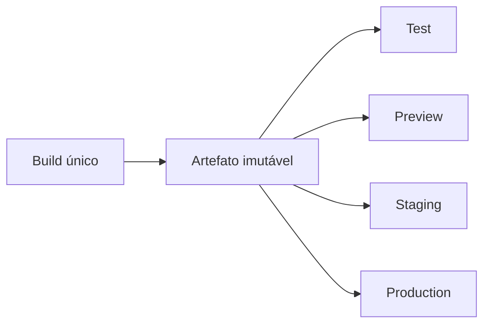

---

id: RB-CICD-001

title: Integração Contínua, Entrega Contínua e Estratégia de Releases
description: Define a estratégia oficial do RouteBook para integração contínua, validação automatizada, produção de artefatos, promoção entre ambientes, deployment, releases, rollback, segurança da cadeia de software e rastreabilidade das entregas.

document_type: cicd
owner: Platform

status: Draft
version: "0.1.0"

created: "2026-07-24"
last_updated: null

authors:

- RouteBook Team

tags:

- cicd
- continuous-integration
- continuous-delivery
- deployment
- releases
- pipelines
- supply-chain-security
- quality-gates
- rollback
- artifact-management
- environments
- automation
- devsecops
- ai-first
- documentation-first
- mermaid

related_documents:

- RB-CORE-0001
- RB-CORE-0002
- RB-CORE-0003
- RB-CORE-0004
- RB-PRD-002
- RB-PRD-006
- RB-PRD-007
- RB-PRD-008
- RB-DOM-001
- RB-DOM-002
- RB-DOM-003
- RB-DOM-004
- RB-ARC-001
- RB-ARC-002
- RB-ARC-003
- RB-ARC-004
- RB-ARC-005
- RB-DATA-001
- RB-DATA-002
- RB-API-001
- RB-SEC-001
- RB-SEC-002
- RB-SEC-003
- RB-OBS-001
- RB-QA-001
- RB-QA-002
- RB-OPS-001
- RB-OPS-002
- RB-SRE-001
- RB-AI-001
- RB-AI-002
- RB-AI-003
- RB-AI-004
- RB-AI-005
- RB-AI-006
- RB-COMP-001
- RB-COMP-002
- RB-COMP-003
- RB-GOV-001
- RB-GOV-002
- RB-RISK-001
- RB-DEL-001
- RB-DEV-001

prerequisites:

- RB-CORE-0004
- RB-ARC-001
- RB-ARC-002
- RB-ARC-003
- RB-ARC-004
- RB-ARC-005
- RB-DATA-002
- RB-SEC-001
- RB-SEC-002
- RB-SEC-003
- RB-OBS-001
- RB-QA-001
- RB-QA-002
- RB-OPS-001
- RB-OPS-002
- RB-SRE-001
- RB-GOV-001
- RB-GOV-002
- RB-RISK-001
- RB-DEL-001
- RB-DEV-001

next_documents:

- RB-INFRA-001

ai_context:
priority: critical
index: true
---

# RouteBook — Integração Contínua, Entrega Contínua e Estratégia de Releases

## 1. Propósito

Este documento define a estratégia oficial do RouteBook para integração contínua, entrega contínua e releases.

Seu objetivo é garantir que toda mudança integrada ao produto seja:

* verificável;
* reproduzível;
* segura;
* rastreável;
* observável;
* promovida de forma controlada;
* reversível quando necessário;
* consistente com a documentação canônica.

O documento estabelece:

* arquitetura dos pipelines;
* eventos de execução;
* estágios;
* quality gates;
* produção e promoção de artefatos;
* segurança da cadeia de software;
* estratégia de ambientes;
* migrations;
* feature flags;
* deployments;
* releases;
* rollback;
* hotfixes;
* mudanças emergenciais;
* evidências;
* métricas;
* limites para agentes de IA.

---

## 2. Relação com o RB-DEV-001

O `RB-DEV-001` define:

* ambiente local;
* comandos de desenvolvimento;
* convenções;
* testes;
* validações;
* branches;
* commits;
* pull requests;
* Definition of Ready;
* Definition of Done local.

O `RB-CICD-001` define como essas verificações deverão ser executadas de forma automatizada e consistente no repositório.

As verificações locais e remotas deverão utilizar, sempre que possível, os mesmos comandos, configurações e critérios.

---

## 3. Relação com o RB-DEL-001

O `RB-DEL-001` define:

* incrementos verticais;
* fases de implementação;
* quality gates;
* ambientes;
* releases progressivas;
* critérios de prontidão.

O `RB-CICD-001` transforma essas definições em fluxos automatizados de integração, promoção e entrega.

---

## 4. Problema que este documento resolve

Sem uma estratégia canônica de CI/CD, o RouteBook poderá apresentar:

* builds diferentes entre máquinas;
* testes ignorados;
* merges com documentação inconsistente;
* artefatos não reproduzíveis;
* deployments manuais não rastreáveis;
* credenciais expostas;
* migrations inseguras;
* releases sem rollback;
* ambientes divergentes;
* código não revisado em produção;
* dependências vulneráveis;
* alterações de IA sem avaliação;
* impossibilidade de provar qual versão está implantada.

Este documento estabelece um processo comum e verificável para todas as entregas.

---

## 5. Escopo

Este documento cobre:

* integração contínua;
* validação de pull requests;
* proteção de branches;
* produção de builds;
* artefatos;
* containers;
* provenance;
* assinaturas;
* promoção;
* ambientes;
* deployment;
* migrations;
* releases;
* feature flags;
* rollback;
* hotfixes;
* segurança;
* qualidade;
* observabilidade;
* automação por agentes.

---

## 6. Fora do escopo

Este documento não define:

* Provider final de cloud;
* topologia final de infraestrutura;
* tamanho de recursos;
* redes;
* banco de dados específico;
* plataforma de containers específica;
* configuração detalhada de produção;
* escolha definitiva da ferramenta de CI/CD.

Essas decisões deverão ser definidas no `RB-INFRA-001` e em ADRs.

---

## 7. Princípio central

O mesmo artefato validado deverá ser promovido entre os ambientes, sem reconstruções silenciosas.

```text
Código
→ validação
→ build
→ artefato imutável
→ promoção
→ deployment
→ verificação
→ evidência
```

Não deverão existir builds independentes para cada ambiente quando isso impedir a garantia de equivalência entre o artefato testado e o artefato implantado.

---

## 8. Princípios de CI/CD

### 8.1 Automação antes de procedimento manual

Atividades repetitivas e verificáveis deverão ser automatizadas.

Procedimentos manuais deverão ser reservados para:

* aprovação;
* decisão;
* investigação;
* exceção;
* operação emergencial;
* etapas ainda não automatizáveis.

### 8.2 Falha rápida

Erros simples deverão ser detectados antes de etapas caras.

Ordem preferencial:

```text
formatação
→ lint
→ validação documental
→ typecheck
→ testes unitários
→ testes de integração
→ segurança
→ build
→ testes end-to-end
```

### 8.3 Pipelines determinísticos

A mesma entrada deverá produzir resultados equivalentes.

Dependências deverão utilizar lockfiles e versões controladas.

### 8.4 Menor privilégio

Cada job deverá possuir somente as permissões necessárias.

### 8.5 Evidência automática

Toda execução relevante deverá produzir registros suficientes para comprovar:

* entrada;
* versão;
* resultado;
* artefato;
* aprovação;
* deployment;
* verificação.

### 8.6 Promoção controlada

A promoção deverá considerar:

* ambiente;
* risco;
* qualidade;
* aprovação;
* observabilidade;
* rollback.

### 8.7 Segurança incorporada

Segurança não deverá ser um pipeline separado executado somente antes de releases.

---

## 9. Arquitetura geral dos pipelines

A arquitetura deverá separar:

* validação;
* build;
* segurança;
* testes;
* publicação;
* promoção;
* deployment;
* verificação.


---

## 10. Tipos de pipeline

### 10.1 Pull Request Pipeline

Executado para validar uma mudança antes do merge.

### 10.2 Main Branch Pipeline

Executado após integração à branch principal.

### 10.3 Release Pipeline

Responsável por criar ou promover uma versão candidata.

### 10.4 Deployment Pipeline

Responsável por implantar artefato existente em um ambiente.

### 10.5 Scheduled Pipeline

Executado de forma recorrente para:

* testes completos;
* scanners;
* atualização de evidências;
* auditorias automatizadas;
* verificações de drift.

### 10.6 Manual Controlled Pipeline

Executado manualmente para operação autorizada.

Exemplos:

* rollback;
* restore;
* migration especial;
* deployment emergencial.

---

## 11. Eventos de execução

Pipelines poderão ser acionados por:

* pull request aberto;
* atualização de pull request;
* merge;
* tag;
* release;
* agenda;
* aprovação;
* execução manual;
* alteração em caminho específico;
* evento de segurança.

O acionamento deverá ser explícito e documentado.

---

## 12. Proteção da branch principal

A branch principal deverá exigir:

* pull request;
* revisão;
* checks obrigatórios;
* resolução de conflitos;
* ausência de secrets;
* ausência de falhas críticas;
* histórico rastreável.

Push direto deverá ser bloqueado, exceto em processo emergencial autorizado e auditado.

---

## 13. Checks obrigatórios

O conjunto inicial deverá incluir:

* formatação;
* lint;
* typecheck;
* testes unitários;
* testes de integração aplicáveis;
* build;
* validação documental;
* secret scanning;
* dependency scanning;
* validação de arquitetura;
* testes de segurança críticos.

Checks adicionais deverão ser habilitados conforme o incremento.

---

## 14. Validação documental

O pipeline deverá validar:

* frontmatter YAML;
* IDs únicos;
* entrada no `docs/registry.md`;
* caminhos;
* links;
* referências;
* `related_documents`;
* `prerequisites`;
* `next_documents`;
* Mermaid;
* status;
* versão;
* terminologia canônica.

Um documento referenciado e inexistente deverá provocar falha ou aviso classificado conforme o contexto.

---

## 15. Validação arquitetural

A automação deverá, quando tecnicamente possível, detectar:

* imports proibidos;
* dependências circulares;
* acesso indevido entre módulos;
* domínio dependente de infraestrutura;
* bypass de ports;
* contratos não autorizados;
* acoplamento com Provider.

Violações não deverão ser normalizadas como exceções permanentes.

---

## 16. Estratégia de testes no pipeline

### 16.1 Testes unitários

Executados em toda mudança relevante.

### 16.2 Testes de integração

Executados quando a mudança afetar:

* persistência;
* contratos;
* Providers;
* módulos;
* mensageria;
* cache.

### 16.3 Testes de contrato

Executados para APIs, eventos, Tools e integrações.

### 16.4 Testes end-to-end

Executados para jornadas críticas e antes de promoções relevantes.

### 16.5 Testes de autorização

Deverão incluir cenários negativos e cross-account.

### 16.6 Testes de migration

Deverão validar aplicação, compatibilidade e resultado.

### 16.7 Testes de IA

Deverão validar:

* schema;
* isolamento;
* Tool allowlist;
* limites;
* fallback;
* regressão;
* custo;
* latência.

---

## 17. Paralelização

Jobs independentes poderão executar em paralelo para reduzir tempo de feedback.

Não deverão ser paralelizadas etapas que dependam de:

* artefato anterior;
* migration anterior;
* ambiente compartilhado não isolado;
* estado mutável comum;
* ordem explícita.

---

## 18. Cache

O cache poderá ser utilizado para:

* dependências;
* compilação;
* ferramentas;
* imagens intermediárias.

Ele não deverá comprometer:

* reprodutibilidade;
* segurança;
* isolamento;
* atualização de dependências;
* integridade de artefatos.

Chaves de cache deverão considerar lockfiles e versões relevantes.

---

## 19. Produção de artefatos

Todo build promovível deverá gerar artefato identificável.

O artefato deverá possuir:

* artifactId;
* versão;
* commit;
* data;
* pipeline;
* checksum;
* dependências;
* provenance;
* resultado de scanners;
* configuração de build.

---

## 20. Imutabilidade

Artefatos publicados não deverão ser sobrescritos.

Uma correção deverá gerar nova versão ou novo identificador.

Tags reutilizáveis como `latest` poderão existir para conveniência, mas não deverão substituir referências imutáveis em deployments controlados.

---

## 21. Reprodutibilidade do build

O build deverá utilizar:

* dependências travadas;
* imagens fixadas;
* ferramentas versionadas;
* configuração explícita;
* scripts versionados.

Dependências externas baixadas durante o build deverão ser verificáveis.

---

## 22. Software Bill of Materials

Artefatos distribuíveis deverão possuir SBOM quando aplicável.

A SBOM deverá permitir identificar:

* componentes;
* versões;
* licenças;
* dependências transitivas;
* origem;
* vulnerabilidades conhecidas.

---

## 23. Assinatura e provenance

Artefatos de maior criticidade deverão possuir mecanismo de autenticidade e provenance.

A provenance deverá permitir responder:

* qual código foi utilizado;
* qual workflow produziu o artefato;
* quais dependências foram utilizadas;
* quais checks foram executados;
* quem autorizou a promoção.

---

## 24. Segurança da cadeia de software

O pipeline deverá proteger:

* workflows;
* runners;
* tokens;
* artefatos;
* dependências;
* secrets;
* actions reutilizadas;
* imagens-base;
* registries.

Ações externas deverão utilizar versão fixada ou referência imutável.

---

## 25. Permissões do pipeline

Cada job deverá possuir somente as permissões necessárias.

Exemplos:

* job de testes sem permissão de deployment;
* job de documentação sem acesso a secrets;
* job de build sem permissão administrativa;
* job de deployment com acesso limitado ao ambiente de destino.

---

## 26. Secrets no CI/CD

Secrets deverão:

* ser armazenados em mecanismo apropriado;
* ser separados por ambiente;
* possuir menor privilégio;
* possuir rotação;
* ser mascarados;
* não ser impressos;
* não ser disponibilizados a pull requests não confiáveis.

Pull requests externos ou não autorizados não deverão receber secrets protegidos.

---

## 27. Runners

Runners deverão ser:

* atualizados;
* isolados;
* descartáveis quando possível;
* monitorados;
* limitados;
* protegidos contra persistência indevida.

Código não confiável não deverá executar em runner com credenciais privilegiadas.

---

## 28. Ambientes

A estratégia inicial deverá considerar:

* Local;
* Test;
* Preview;
* Staging;
* Production.

A existência física de cada ambiente deverá seguir a necessidade real do projeto.

---

## 29. Preview Environments

Ambientes de preview poderão ser criados por pull request para:

* validação visual;
* testes de fluxo;
* revisão de stakeholders;
* smoke tests;
* integração.

Deverão possuir:

* isolamento;
* expiração;
* dados sintéticos;
* custo controlado;
* ausência de secrets de produção;
* remoção automática.

---

## 30. Staging

O ambiente de staging deverá ser utilizado quando for necessário validar:

* integração completa;
* migrations;
* deployment;
* observabilidade;
* performance;
* Providers;
* IA;
* procedimentos operacionais.

Ele não deverá ser presumido como equivalente perfeito à produção.

---

## 31. Produção

Deployments em produção deverão exigir:

* artefato aprovado;
* quality gates;
* autorização;
* Change Request quando aplicável;
* migration validada;
* observabilidade;
* rollback;
* verificação pós-deployment.

---

## 32. Promoção entre ambientes

A promoção deverá reutilizar o mesmo artefato.

Mudanças específicas de ambiente deverão ocorrer por configuração externa, não por reconstrução de código.



---

## 33. Configuração por ambiente

A configuração deverá ser:

* externa ao artefato;
* validada;
* versionada quando não sensível;
* auditável;
* compatível com schema;
* separada de secrets.

Configuração inválida deverá bloquear inicialização ou deployment de forma segura.

---

## 34. Strategy de deployment

A estratégia poderá evoluir entre:

* recreate;
* rolling;
* blue-green;
* canary;
* feature-based rollout.

A escolha deverá considerar:

* estágio;
* infraestrutura;
* estado;
* risco;
* capacidade de rollback;
* custo;
* observabilidade.

---

## 35. Deployment progressivo

Capacidades de maior risco poderão ser liberadas por:

* ambiente;
* Account;
* usuário;
* região;
* percentual;
* capabilityId;
* feature flag.

O rollout deverá possuir métricas e critérios de interrupção.

---

## 36. Feature flags

Flags deverão possuir:

* flagId;
* nome;
* finalidade;
* owner;
* escopo;
* estado padrão;
* ambientes;
* data de criação;
* data de revisão;
* plano de remoção.

Flags temporárias deverão ser removidas após estabilização.

---

## 37. Dark launch

Capacidades poderão ser executadas sem exposição ao usuário para:

* validar integração;
* medir desempenho;
* comparar resultados;
* avaliar IA;
* testar observabilidade.

O dark launch não deverá produzir efeitos canônicos não autorizados.

---

## 38. Migrations de dados

Migrations deverão ser tratadas como parte do release.

Deverão possuir:

* versão;
* ordem;
* compatibilidade;
* teste;
* impacto;
* tempo estimado;
* observabilidade;
* rollback ou compensação;
* owner.

---

## 39. Expand and Contract

Mudanças incompatíveis deverão preferir:

1. expansão compatível;
2. deployment do código compatível;
3. migração ou backfill;
4. verificação;
5. remoção da estrutura antiga.

---

## 40. Backfills

Backfills deverão possuir:

* idempotência;
* checkpoint;
* rate limit;
* métricas;
* pausa;
* retomada;
* validação;
* tratamento de falhas.

Não deverão ser executados silenciosamente como efeito colateral do startup da aplicação.

---

## 41. Ordem de deployment e migration

A ordem deverá ser definida por mudança.

Possibilidades:

* migration antes do código;
* código antes da migration;
* expansão antes de ambos;
* job separado.

A escolha deverá preservar compatibilidade durante toda a janela.

---

## 42. Releases

Uma release representa um conjunto identificável e promovível de mudanças.

Toda release deverá permitir identificar:

* versão;
* artefatos;
* commits;
* pull requests;
* Change Requests;
* migrations;
* feature flags;
* riscos;
* testes;
* aprovações.

---

## 43. Versionamento

O versionamento deverá ser consistente com o tipo de artefato.

Poderão ser utilizados:

* Semantic Versioning;
* CalVer;
* identificadores de build;
* hash de commit.

A escolha final deverá ser registrada em ADR.

---

## 44. Release Candidate

Uma versão candidata deverá representar artefato potencialmente promovível para produção.

Correções após a criação deverão gerar nova candidata.

---

## 45. Release Notes

As notas deverão informar, conforme aplicável:

* novas capacidades;
* correções;
* mudanças incompatíveis;
* migrations;
* riscos;
* limitações;
* feature flags;
* procedimentos operacionais;
* rollback.

Notas internas poderão ser mais detalhadas que notas públicas.

---

## 46. Changelog

O changelog deverá ser gerado ou mantido a partir de informações rastreáveis.

Ele não deverá substituir:

* documentação;
* Decision Records;
* ADRs;
* Change Requests;
* release notes detalhadas.

---

## 47. Aprovação de release

A aprovação deverá ser proporcional ao impacto.

Releases de baixo risco poderão utilizar promoção automatizada.

Releases de alto ou crítico impacto deverão exigir aprovação explícita.

---

## 48. Continuous Delivery

O objetivo inicial deverá ser manter a branch principal em estado promovível.

Continuous delivery não significa deployment automático obrigatório em produção.

---

## 49. Continuous Deployment

A adoção de deployment automático em produção somente deverá ocorrer quando existirem:

* testes confiáveis;
* observabilidade;
* rollback;
* feature flags;
* baixa taxa de falha;
* maturidade operacional;
* critérios automáticos claros.

---

## 50. Verificação pós-deployment

Toda implantação relevante deverá verificar:

* health checks;
* disponibilidade;
* erros;
* latência;
* integrações;
* banco;
* eventos;
* feature flags;
* métricas de negócio;
* comportamento de IA.

---

## 51. Smoke tests

Smoke tests deverão validar capacidades mínimas do ambiente.

Exemplos:

* aplicação responde;
* autenticação funciona;
* banco está acessível;
* Trip pode ser consultada;
* health checks estão saudáveis;
* dependências críticas respondem.

---

## 52. Critérios de sucesso

Uma implantação será considerada saudável quando:

* checks técnicos passarem;
* métricas permanecerem dentro dos limites;
* não houver alertas críticos;
* fluxos principais funcionarem;
* migrations estiverem validadas;
* erros não apresentarem regressão material.

---

## 53. Critérios de interrupção

O rollout deverá ser interrompido quando houver:

* aumento significativo de erros;
* falha de autorização;
* exposição cross-account;
* corrupção de dados;
* falha de migration;
* degradação severa;
* Tool não autorizada;
* custo de IA fora do limite;
* alerta Critical.

---

## 54. Rollback

Todo deployment relevante deverá possuir estratégia de rollback.

O rollback deverá considerar:

* aplicação;
* configuração;
* migration;
* eventos;
* cache;
* feature flags;
* Providers;
* modelos;
* prompts;
* Tools.

---

## 55. Rollback de aplicação

Deverá preferir promoção de artefato anterior conhecido e válido.

Não deverá depender da reconstrução de uma versão antiga.

---

## 56. Rollback de migration

Quando rollback direto não for seguro, deverá existir:

* migration corretiva;
* compensação;
* restore;
* isolamento;
* procedimento manual controlado.

---

## 57. Roll forward

Em determinadas condições, corrigir com nova versão poderá ser mais seguro que reverter.

A decisão deverá considerar:

* dados;
* tempo;
* risco;
* exposição;
* estabilidade;
* reversibilidade.

---

## 58. Feature flag como contenção

Uma capacidade poderá ser desativada por flag quando isso reduzir o impacto.

A desativação não elimina a necessidade de investigar a causa.

---

## 59. Hotfix

Um hotfix deverá:

* possuir escopo mínimo;
* passar por validações proporcionais;
* ser rastreável;
* gerar artefato novo;
* ser aplicado também à linha principal;
* receber revisão posterior.

---

## 60. Mudança emergencial

Mudanças emergenciais deverão seguir o `RB-GOV-002`.

Mesmo quando o fluxo normal for reduzido, deverão ser preservados:

* owner;
* motivo;
* aprovação;
* ações;
* artefato;
* evidência;
* rollback;
* revisão posterior.

---

## 61. Falha de pipeline

Falhas deverão ser classificadas como:

* código;
* teste;
* ambiente;
* dependência;
* infraestrutura;
* segurança;
* configuração;
* flakiness;
* ferramenta externa.

Falhas recorrentes do pipeline deverão ser tratadas como dívida de plataforma ou qualidade.

---

## 62. Flaky tests

Testes instáveis deverão:

* ser identificados;
* ser registrados;
* possuir owner;
* ser corrigidos;
* não ser ignorados indefinidamente.

A repetição automática não deverá ocultar instabilidade.

---

## 63. Dependências indisponíveis

O pipeline deverá possuir estratégia para:

* registry indisponível;
* Provider indisponível;
* scanner indisponível;
* serviço externo indisponível;
* limite de API.

Controles críticos não deverão ser ignorados silenciosamente.

---

## 64. Evidências de pipeline

Cada execução relevante deverá preservar:

* workflow;
* runId;
* commit;
* branch ou tag;
* autor;
* timestamps;
* jobs;
* resultados;
* artefatos;
* scanners;
* aprovações;
* deployment;
* verificação.

---

## 65. Retenção

A retenção deverá considerar:

* investigação;
* auditoria;
* custo;
* segurança;
* privacidade;
* reprodutibilidade.

Logs de pipeline não deverão conter dados sensíveis desnecessários.

---

## 66. Rastreabilidade

A cadeia mínima deverá ser:


---

## 67. Identificadores

A rastreabilidade deverá preservar, quando aplicável:

* requirementId;
* incrementId;
* decisionRecordId;
* architectureDecisionRecordId;
* changeRequestId;
* riskId;
* controlId;
* pullRequest;
* commitSha;
* pipelineRunId;
* artifactId;
* releaseId;
* deploymentId;
* environmentId;
* correlationId.

---

## 68. Estratégia para inteligência artificial

Mudanças em capacidades de IA deverão incluir:

* capabilityId;
* agentId;
* modelFamily;
* promptVersion;
* schemaVersion;
* Toolset;
* eval result;
* custo;
* latência;
* fallback;
* rollout.

---

## 69. Gates de IA

O pipeline deverá validar, conforme o risco:

* Structured Outputs;
* compatibilidade de schema;
* regressão;
* isolamento de contexto;
* allowlist de Tools;
* limites de execução;
* fallback;
* red teaming;
* avaliação de custo.

---

## 70. Modelos e prompts

Modelos, prompts e configurações relevantes deverão possuir versão identificável.

Mudanças silenciosas de Provider deverão ser detectadas ou controladas.

---

## 71. Rollback de IA

Deverá ser possível restaurar:

* prompt anterior;
* modelo anterior;
* configuração anterior;
* Toolset anterior;
* limite anterior;
* feature flag anterior.

---

## 72. Agentes de IA no pipeline

Agentes poderão apoiar:

* revisão;
* geração de testes;
* análise de falhas;
* resumo de mudanças;
* release notes;
* triagem de vulnerabilidades;
* detecção de inconsistências documentais.

---

## 73. Limites dos agentes

Agentes não poderão autonomamente:

* aprovar merge;
* promover produção;
* aceitar risco;
* ignorar gate crítico;
* alterar secret;
* executar rollback crítico;
* alterar proteção de branch;
* desabilitar scanner;
* aprovar migration destrutiva.

---

## 74. Provenance de contribuição de IA

Quando aplicável, deverá ser possível identificar:

* agente;
* versão;
* tarefa;
* arquivos afetados;
* revisão humana;
* resultados de testes;
* decisão de aceitação.

---

## 75. Quality gates por impacto

### Baixo impacto

* lint;
* typecheck;
* testes relevantes;
* build;
* documentação aplicável.

### Impacto moderado

Inclui também:

* integração;
* segurança;
* contrato;
* smoke.

### Alto impacto

Inclui também:

* end-to-end;
* migration;
* rollback;
* observabilidade;
* aprovação especializada.

### Impacto crítico

Inclui também:

* revisão multidisciplinar;
* validação em ambiente controlado;
* rollout progressivo;
* critérios automáticos de interrupção;
* autorização explícita.

---

## 76. Matriz inicial de gates

| Tipo de mudança | Gates mínimos                                      |
| --------------- | -------------------------------------------------- |
| documentação    | YAML, IDs, links, registry, Mermaid                |
| interface       | lint, typecheck, unitário, visual, e2e relevante   |
| domínio         | unitário, invariantes, integração                  |
| API             | contrato, autorização, integração, regressão       |
| dados           | migration, compatibilidade, integridade, rollback  |
| segurança       | scanner, testes negativos, revisão especializada   |
| IA              | schema, eval, isolamento, Tools, custo, fallback   |
| infraestrutura  | lint, policy as code, segurança, plano de rollback |

---

## 77. Observabilidade do pipeline

Deverão ser observados:

* duração;
* fila;
* falhas;
* flakiness;
* cache;
* consumo;
* deployments;
* rollbacks;
* vulnerabilidades;
* disponibilidade dos runners.

---

## 78. Métricas de integração

* tempo até primeiro feedback;
* duração do pipeline;
* taxa de sucesso;
* taxa de falha por etapa;
* builds cancelados;
* retries;
* flaky tests;
* tempo de review.

---

## 79. Métricas de entrega

* deployment frequency;
* lead time for changes;
* change failure rate;
* mean time to restore;
* rollbacks;
* hotfixes;
* deployments emergenciais.

---

## 80. Métricas de segurança

* secrets detectados;
* dependências vulneráveis;
* artefatos sem SBOM;
* imagens vulneráveis;
* workflows com permissão excessiva;
* findings vencidos.

---

## 81. Métricas de qualidade

* testes falhando;
* cobertura crítica;
* regressões;
* migrations falhando;
* contratos incompatíveis;
* falhas em produção.

---

## 82. Métricas responsáveis

As métricas não deverão incentivar:

* merges apressados;
* releases artificiais;
* redução indevida de testes;
* ocultação de rollback;
* classificação incorreta de hotfix;
* desativação de gates.

---

## 83. Papéis e responsabilidades

### Engineering

Responsável por:

* código;
* testes;
* build;
* correções;
* compatibilidade.

### Platform

Responsável por:

* pipelines;
* runners;
* artefatos;
* ambientes;
* deployment;
* segurança operacional.

### Quality Engineering

Responsável por:

* estratégia de testes;
* gates;
* flakiness;
* evidências;
* regressão.

### Security

Responsável por:

* supply chain;
* scanners;
* secrets;
* permissões;
* vulnerabilidades.

### Architecture

Responsável por:

* coerência;
* dependências;
* decisões;
* gates arquiteturais.

### Operations

Responsável por:

* rollout;
* verificação;
* rollback;
* incidentes;
* runbooks.

### Governance

Responsável por:

* aprovações;
* Change Requests;
* exceções;
* riscos;
* auditoria.

---

## 84. Exceções

Uma exceção de pipeline deverá possuir:

* motivo;
* escopo;
* risco;
* owner;
* aprovação;
* controle compensatório;
* expiração;
* plano de correção.

Não deverão existir bypasses permanentes não documentados.

---

## 85. Anti-patterns

Não deverão ser normalizados:

* rebuild por ambiente;
* artefato sobrescrito;
* deployment manual sem registro;
* secret em variável pública;
* action externa sem versão fixada;
* testes críticos opcionais;
* branch principal sem proteção;
* rollback não testado;
* migration automática no startup;
* aprovação pelo próprio autor em mudança crítica;
* pipeline diferente do ambiente local sem necessidade;
* release sem commit identificável;
* produção com artefato não validado;
* IA promovendo release autonomamente;
* retry ocultando flaky test;
* scanner desativado para liberar merge.

---

## 86. Evolução por maturidade

### Nível 1 — Integração básica

* pull requests;
* lint;
* testes;
* build;
* branch protegida.

### Nível 2 — Entrega controlada

* artefatos imutáveis;
* ambientes;
* promoção;
* migrations;
* rollback;
* scanners.

### Nível 3 — Entrega verificável

* SBOM;
* provenance;
* deployments progressivos;
* métricas;
* gates por risco;
* evidências automatizadas.

### Nível 4 — Entrega adaptativa

* canary automatizado;
* rollback por métricas;
* policy as code;
* auditoria contínua;
* análise assistida por agentes.

---

## 87. Estrutura sugerida

```text
docs/
└── cicd/
    ├── continuous-integration-delivery-and-release-strategy.md
    ├── pipelines/
    ├── releases/
    ├── deployments/
    ├── migrations/
    ├── rollback/
    ├── security/
    └── templates/
```

---

## 88. Template de pipeline

```text
pipelineId:
title:
trigger:
scope:
permissions:
jobs:
dependencies:
qualityGates:
artifacts:
secrets:
environments:
failureBehavior:
evidence:
owner:
status:
```

---

## 89. Template de release

```text
releaseId:
version:
artifactIds:
commitSha:
pullRequests:
changeRequests:
migrations:
featureFlags:
risks:
tests:
approvals:
releaseNotes:
rollbackPlan:
status:
createdAt:
releasedAt:
```

---

## 90. Template de deployment

```text
deploymentId:
releaseId:
artifactId:
environmentId:
strategy:
configurationVersion:
migrationPlan:
rolloutPlan:
verificationPlan:
rollbackPlan:
approvedBy:
status:
startedAt:
completedAt:
verifiedAt:
```

---

## 91. Checklist de pull request

```text
[ ] branch atualizada
[ ] formatação aprovada
[ ] lint aprovado
[ ] typecheck aprovado
[ ] testes aprovados
[ ] documentação validada
[ ] segurança validada
[ ] dependências avaliadas
[ ] migration validada
[ ] riscos registrados
[ ] rollback definido
[ ] aprovações concluídas
```

---

## 92. Checklist de release

```text
[ ] artefato imutável
[ ] commit identificado
[ ] SBOM disponível
[ ] scanners aprovados
[ ] testes críticos aprovados
[ ] migrations avaliadas
[ ] feature flags revisadas
[ ] observabilidade disponível
[ ] rollback preparado
[ ] release notes criadas
[ ] aprovação concluída
```

---

## 93. Checklist de deployment

```text
[ ] ambiente saudável
[ ] artefato correto
[ ] configuração validada
[ ] secrets disponíveis
[ ] migration pronta
[ ] rollout definido
[ ] métricas disponíveis
[ ] alertas ativos
[ ] smoke test preparado
[ ] rollback executável
[ ] owner operacional presente
```

---

## 94. Critérios de aceite

Este documento estará completo quando definir:

* princípios de CI/CD;
* tipos de pipeline;
* eventos;
* proteção da branch principal;
* checks obrigatórios;
* validação documental;
* validação arquitetural;
* estratégia de testes;
* artefatos;
* imutabilidade;
* SBOM;
* provenance;
* segurança da cadeia;
* secrets;
* runners;
* ambientes;
* promoção;
* deployment;
* migrations;
* releases;
* feature flags;
* verificação;
* rollback;
* hotfix;
* mudança emergencial;
* IA;
* métricas;
* responsabilidades;
* exceções;
* anti-patterns;
* rastreabilidade.

---

## 95. Declaração final

O RouteBook deverá tratar seus pipelines como parte da arquitetura, da segurança e da governança do produto.

Toda mudança integrada deverá permitir responder:

* qual requisito motivou a mudança;
* qual decisão a autorizou;
* qual código foi utilizado;
* quais testes foram executados;
* quais controles foram aplicados;
* qual artefato foi produzido;
* em qual ambiente foi implantado;
* quem aprovou;
* como o resultado foi verificado;
* como a alteração poderá ser revertida.

Nenhum artefato deverá ser promovido apenas porque foi possível construí-lo.

Nenhum deployment deverá ser considerado concluído apenas porque o processo técnico terminou.

A conclusão deverá exigir:

* validação;
* segurança;
* observabilidade;
* evidência;
* verificação;
* atualização documental;
* capacidade de resposta.

A automação deverá aumentar velocidade e consistência sem remover autoridade, responsabilidade ou rastreabilidade.

Os pipelines do RouteBook deverão permanecer reproduzíveis, seguros, auditáveis e adequados à evolução incremental do produto.
