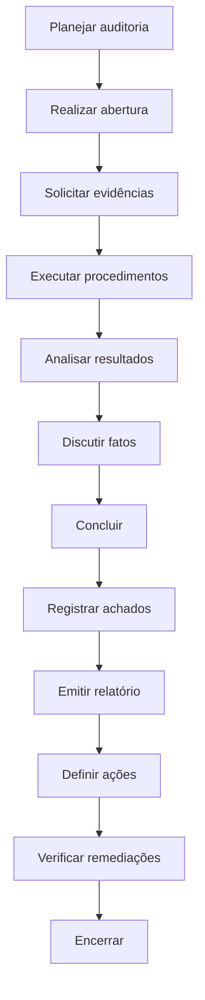
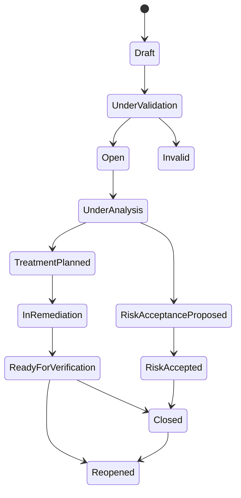

---

id: RB-COMP-003

title: Auditorias, Achados e Planos de Ação Corretiva
description: Define o sistema oficial do RouteBook para planejar e executar auditorias, registrar e classificar achados, analisar causas, administrar ações corretivas e verificar a efetividade das remediações.

document_type: compliance
owner: Governance

status: Published
version: "0.1.0"

created: "2026-07-24"
last_updated: null

authors:

- RouteBook Team

tags:

- compliance
- governance
- audit
- internal-audit
- assurance
- findings
- nonconformity
- corrective-actions
- root-cause-analysis
- remediation
- risk-management
- control-testing
- evidence
- audit-readiness
- artificial-intelligence
- diagrams
- mermaid

related_documents:

- RB-CORE-0001
- RB-CORE-0002
- RB-CORE-0003
- RB-CORE-0004
- RB-PRD-008
- RB-DOM-001
- RB-DOM-002
- RB-DOM-003
- RB-DOM-004
- RB-ARC-001
- RB-ARC-002
- RB-ARC-003
- RB-ARC-004
- RB-ARC-005
- RB-DATA-001
- RB-DATA-002
- RB-API-001
- RB-SEC-001
- RB-SEC-002
- RB-SEC-003
- RB-PRIV-001
- RB-PRIV-002
- RB-PRIV-003
- RB-OBS-001
- RB-QA-001
- RB-QA-002
- RB-OPS-001
- RB-OPS-002
- RB-SRE-001
- RB-AI-001
- RB-AI-002
- RB-AI-003
- RB-AI-004
- RB-AI-005
- RB-AI-006
- RB-COMP-001
- RB-COMP-002
- RB-GOV-001
- RB-GOV-002

prerequisites:

- RB-CORE-0004
- RB-SEC-001
- RB-SEC-002
- RB-SEC-003
- RB-PRIV-001
- RB-PRIV-002
- RB-PRIV-003
- RB-OBS-001
- RB-QA-001
- RB-QA-002
- RB-OPS-001
- RB-OPS-002
- RB-SRE-001
- RB-AI-001
- RB-AI-002
- RB-COMP-001
- RB-COMP-002
- RB-GOV-001
- RB-GOV-002

next_documents:

- RB-RISK-001

ai_context:
priority: critical
index: true
---

# RouteBook — Auditorias, Achados e Planos de Ação Corretiva

## Parte I — Fundamentos

### 1. Propósito

Este documento define o sistema oficial do RouteBook para:

* planejar auditorias;
* selecionar escopos;
* definir critérios;
* executar avaliações;
* solicitar e analisar evidências;
* testar controles;
* registrar conclusões;
* classificar achados;
* identificar não conformidades;
* analisar causas;
* definir ações corretivas;
* acompanhar remediações;
* verificar efetividade;
* aceitar riscos residuais;
* reabrir falhas;
* encerrar auditorias;
* preservar rastreabilidade.

Seu objetivo é transformar os princípios estabelecidos no `RB-COMP-001` e o catálogo operacional definido no `RB-COMP-002` em um ciclo estruturado de assurance e melhoria contínua.

---

### 2. Relação com o RB-COMP-001

O `RB-COMP-001` define:

* governança de conformidade;
* obrigações;
* requisitos;
* controles;
* evidências;
* auditoria;
* achados;
* ações corretivas;
* preparação para avaliações.

O `RB-COMP-003` operacionaliza o ciclo de auditoria e remediação.

---

### 3. Relação com o RB-COMP-002

O `RB-COMP-002` define:

* catálogo de controles;
* evidências;
* testes;
* criticidade;
* efetividade;
* condições de falha;
* controles compensatórios.

O `RB-COMP-003` utiliza esses elementos para:

* criar programas de auditoria;
* testar controles em escopos definidos;
* registrar conclusões;
* gerar achados;
* acompanhar ações;
* verificar correções.

---

### 4. Problema que este documento resolve

Sem um processo estruturado de auditoria, o RouteBook poderá:

* testar controles sem escopo claro;
* coletar evidências inconsistentes;
* produzir conclusões subjetivas;
* registrar achados duplicados;
* classificar severidade de forma divergente;
* corrigir sintomas sem tratar causas;
* encerrar ações sem verificação;
* aceitar riscos informalmente;
* perder prazos;
* repetir falhas;
* preparar evidências somente antes de auditorias externas.

Este documento estabelece um sistema contínuo, verificável e proporcional ao risco.

---

### 5. Escopo

Este documento cobre auditorias e avaliações relacionadas a:

* governança;
* documentação;
* produto;
* domínio;
* arquitetura;
* identidade;
* autenticação;
* autorização;
* dados;
* APIs;
* segurança;
* privacidade;
* inteligência artificial;
* desenvolvimento seguro;
* qualidade;
* observabilidade;
* confiabilidade;
* operações;
* continuidade;
* Providers;
* mudanças;
* incidentes;
* conformidade.

---

### 6. Fora do escopo

Este documento não constitui:

* parecer jurídico;
* relatório de auditoria independente;
* certificação;
* garantia regulatória;
* procedimento de fiscalização pública;
* metodologia específica de uma norma externa;
* contrato com auditor externo;
* política disciplinar.

---

### 7. Princípio central

Toda conclusão de auditoria deverá ser baseada em critérios definidos, evidências suficientes e análise rastreável.

```text
Objetivo
→ escopo
→ critério
→ controle
→ evidência
→ teste
→ conclusão
→ achado
→ ação
→ verificação
→ encerramento
```

---

### 8. Objetivos

O sistema deverá:

1. priorizar auditorias por risco;
2. definir escopos verificáveis;
3. preservar independência proporcional;
4. padronizar testes;
5. proteger evidências;
6. classificar achados de modo consistente;
7. tratar causas;
8. definir owners;
9. controlar prazos;
10. verificar remediações;
11. impedir encerramento prematuro;
12. apoiar auditorias externas;
13. integrar incidentes e mudanças;
14. produzir métricas;
15. sustentar melhoria contínua.

---

## Parte II — Princípios de auditoria

### 9. Independência proporcional

A pessoa responsável por avaliar um controle crítico não deverá ser a única responsável por sua implementação e operação.

Em equipes pequenas, o acúmulo de funções deverá ser:

* conhecido;
* documentado;
* revisado;
* compensado por evidências adicionais.

---

### 10. Base em risco

A frequência e a profundidade da auditoria deverão considerar:

* criticidade;
* exposição;
* dados;
* histórico de falhas;
* velocidade de mudança;
* dependências;
* Providers;
* autonomia de IA;
* impacto operacional;
* obrigações aplicáveis.

---

### 11. Evidência sobre declaração

Declarações de owners não deverão ser suficientes isoladamente para controles relevantes.

---

### 12. Escopo explícito

Toda auditoria deverá indicar claramente:

* o que está incluído;
* o que está excluído;
* período;
* ambientes;
* sistemas;
* módulos;
* controles;
* limitações.

---

### 13. Critérios definidos

A auditoria deverá utilizar critérios identificáveis.

Exemplos:

* requisitos internos;
* controles do `RB-COMP-002`;
* políticas;
* decisões aprovadas;
* contratos;
* requisitos não funcionais;
* procedimentos;
* obrigações aplicáveis.

---

### 14. Rastreabilidade

Toda conclusão deverá ser rastreável a:

* critério;
* controle;
* procedimento;
* evidência;
* auditor;
* data;
* escopo.

---

### 15. Contraditório responsável

O control owner deverá poder:

* revisar fatos;
* fornecer contexto;
* apresentar evidência adicional;
* contestar inexatidões.

O contraditório não deverá eliminar a independência da conclusão.

---

### 16. Não surpresa

Achados relevantes deverão ser comunicados durante a auditoria, sem esperar exclusivamente pelo relatório final.

---

### 17. Melhoria sobre punição

O objetivo principal deverá ser:

* reduzir risco;
* fortalecer controles;
* corrigir causas;
* prevenir recorrência;
* melhorar governança.

---

## Parte III — Conceitos

### 18. Auditoria

Auditoria é uma avaliação estruturada e baseada em evidências para determinar se critérios definidos são atendidos.

---

### 19. Avaliação

Avaliação é um termo amplo que pode incluir:

* auditoria;
* readiness assessment;
* revisão temática;
* teste de controle;
* autoavaliação;
* avaliação técnica;
* revisão de Provider.

---

### 20. Programa de auditoria

Programa de auditoria é o conjunto planejado de auditorias e avaliações para determinado período.

---

### 21. Plano de auditoria

Plano de auditoria descreve a execução de uma auditoria específica.

---

### 22. Universo auditável

Universo auditável é o conjunto de áreas, sistemas, processos, controles, Providers e capacidades elegíveis para auditoria.

---

### 23. Critério de auditoria

Critério é o requisito utilizado como referência para avaliação.

---

### 24. Procedimento de auditoria

Procedimento é a atividade executada para obter e analisar evidências.

---

### 25. Achado

Achado é uma condição identificada durante a avaliação.

---

### 26. Não conformidade

Não conformidade é o descumprimento confirmado de um requisito aplicável.

---

### 27. Observação

Observação é uma condição que não constitui não conformidade, mas merece acompanhamento.

---

### 28. Oportunidade de melhoria

Oportunidade de melhoria é uma recomendação sem falha obrigatória confirmada.

---

### 29. Ação corretiva

Ação corretiva busca remover a causa de uma falha ou reduzir sua recorrência.

---

### 30. Correção

Correção trata a condição imediata.

Correção e ação corretiva não são equivalentes.

---

### 31. Verificação

Verificação confirma se a ação foi implementada.

---

### 32. Validação de efetividade

Validação de efetividade confirma se a ação reduziu o risco e evitou recorrência.

---

## Parte IV — Tipos de auditoria

### 33. Auditoria interna

Executada pelo próprio RouteBook ou por pessoa designada.

Objetivos:

* identificar lacunas;
* avaliar controles;
* preparar avaliações externas;
* verificar remediações.

---

### 34. Auditoria externa

Executada por terceiro independente.

Poderá ser:

* contratual;
* técnica;
* de segurança;
* de privacidade;
* de conformidade;
* de Provider.

---

### 35. Auditoria temática

Focada em tema específico.

Exemplos:

* isolamento entre Accounts;
* exclusão de dados;
* runtime de agentes;
* gestão de vulnerabilidades;
* backups;
* mudanças emergenciais.

---

### 36. Readiness assessment

Avalia prontidão antes de:

* auditoria externa;
* lançamento;
* expansão;
* adoção de Provider crítico;
* certificação;
* contrato relevante.

---

### 37. Auditoria contínua

Utiliza evidências e sinais frequentes para avaliar controles de modo recorrente.

---

### 38. Auditoria de mudança

Avalia mudança de alto ou crítico impacto.

---

### 39. Auditoria pós-incidente

Avalia:

* controles falhos;
* decisões;
* resposta;
* recuperação;
* ações;
* recorrência.

---

### 40. Auditoria de Provider

Avalia controles, riscos e obrigações associados a terceiro.

---

### 41. Autoavaliação

Executada pelo control owner.

Não substitui auditoria independente para controles críticos.

---

## Parte V — Programa de auditoria

### 42. Objetivo

O programa deverá organizar auditorias de forma:

* previsível;
* proporcional;
* baseada em risco;
* integrada ao roadmap;
* sustentável.

---

### 43. Identificador

Formato:

```text
RB-AUDPROG-NNN
```

---

### 44. Estrutura

```text
auditProgramId
title
periodStart
periodEnd
objectives
auditUniverse
riskCriteria
plannedAudits
owners
resources
dependencies
status
approvedBy
createdAt
reviewedAt
```

---

### 45. Estados

* Draft;
* Under Review;
* Approved;
* Active;
* Under Revision;
* Completed;
* Cancelled;
* Archived.

---

### 46. Entradas

O programa deverá considerar:

* riscos;
* incidentes;
* findings anteriores;
* controles Critical;
* mudanças;
* Providers;
* obrigações;
* decisões;
* métricas;
* reclamações;
* resultados de testes;
* auditorias externas.

---

### 47. Priorização

A prioridade poderá utilizar:

```text
Prioridade = criticidade × exposição × histórico × mudança × obrigação
```

A fórmula representa uma heurística de priorização, não uma avaliação matemática obrigatória.

---

### 48. Cobertura

O programa deverá indicar:

* áreas não auditadas;
* justificativas;
* riscos de cobertura;
* data prevista;
* controles compensatórios.

---

### 49. Revisão do programa

O programa deverá ser revisado após:

* incidente Critical;
* mudança arquitetural;
* novo Provider crítico;
* expansão de IA;
* nova obrigação;
* achado sistêmico;
* alteração significativa do produto.

---

## Parte VI — Planejamento da auditoria

### 50. Identificador

Formato:

```text
RB-AUD-NNNNN
```

---

### 51. Estrutura obrigatória

```text
auditId
title
auditType
objectives
scope
outOfScope
criteria
controls
systems
modules
providers
period
auditors
auditOwner
controlOwners
risks
methods
samplingStrategy
evidencePlan
schedule
communicationPlan
limitations
status
approvedBy
```

---

### 52. Objetivos

Os objetivos deverão ser específicos.

Exemplo:

```text
Avaliar se os controles de isolamento entre Accounts estão desenhados,
implementados e operando de forma efetiva no período avaliado.
```

---

### 53. Escopo

O escopo poderá incluir:

* ambientes;
* módulos;
* rotas;
* dados;
* eventos;
* Tools;
* Providers;
* equipes;
* período;
* controles.

---

### 54. Fora do escopo

Exclusões deverão ser justificadas.

---

### 55. Critérios

Cada auditoria deverá identificar os critérios usados.

---

### 56. Limitações

Limitações poderão incluir:

* evidência indisponível;
* ambiente não acessível;
* período incompleto;
* migração em andamento;
* equipe reduzida;
* Provider sem resposta.

---

### 57. Aprovação

Auditorias de alto impacto deverão ser aprovadas pelo Governance Owner e pelos responsáveis relevantes.

---

## Parte VII — Execução

### 58. Fluxo



---

### 59. Reunião de abertura

Quando aplicável, deverá alinhar:

* objetivo;
* escopo;
* cronograma;
* responsáveis;
* evidências;
* comunicação;
* limitações.

---

### 60. Solicitação de evidências

Toda solicitação deverá possuir:

```text
auditEvidenceRequestId
auditId
request
criteria
controlId
owner
requestedAt
targetDate
status
response
evidenceReferences
reviewedAt
```

---

### 61. Estados da solicitação

* Requested;
* Acknowledged;
* In Preparation;
* Submitted;
* Under Review;
* Accepted;
* Insufficient;
* Rejected;
* Cancelled.

---

### 62. Proteção da evidência

Evidências deverão respeitar:

* classificação;
* acesso mínimo;
* retenção;
* integridade;
* minimização;
* privacidade;
* confidencialidade.

---

### 63. Insuficiência

A evidência será insuficiente quando:

* não cobrir o período;
* não corresponder ao controle;
* não demonstrar operação;
* possuir origem desconhecida;
* estiver incompleta;
* não puder ser validada.

---

## Parte VIII — Métodos de auditoria

### 64. Inspection

Análise de:

* documentação;
* código;
* configuração;
* contratos;
* logs;
* relatórios;
* decisões;
* tickets.

---

### 65. Walkthrough

Percorre o processo com responsáveis, do início ao fim.

---

### 66. Observation

Observa a execução real do controle.

---

### 67. Reperformance

Repete o procedimento de forma independente.

---

### 68. Inquiry

Obtém explicações.

Inquiry isolada não deverá sustentar conclusão de efetividade para controle crítico.

---

### 69. Data analysis

Analisa população completa ou amostra por meio de:

* consultas;
* scripts;
* métricas;
* eventos;
* logs;
* relatórios.

---

### 70. Technical testing

Poderá incluir:

* testes de autorização;
* testes cross-account;
* revisão de configuração;
* validação de secrets;
* testes de restore;
* testes de Tool;
* regressão de IA;
* simulação de falha.

---

### 71. Corroboration

Compara múltiplas fontes para validar conclusão.

---

## Parte IX — Amostragem

### 72. Princípio

A amostra deverá ser suficiente para o objetivo e o risco.

---

### 73. População

Deverá registrar:

* origem;
* tamanho;
* período;
* critérios de inclusão;
* exclusões;
* integridade.

---

### 74. Tipos

* aleatória;
* sistemática;
* baseada em risco;
* dirigida;
* estratificada;
* integral.

---

### 75. Amostra baseada em risco

Deverá priorizar:

* operações críticas;
* exceções;
* falhas;
* usuários privilegiados;
* mudanças emergenciais;
* Providers;
* dados sensíveis;
* ações de IA.

---

### 76. População integral

Deverá ser preferida quando:

* volume for pequeno;
* automação permitir;
* criticidade for alta;
* ocorrência rara possuir impacto elevado.

---

### 77. Limitação

A conclusão deverá reconhecer limitações da amostra.

---

## Parte X — Workpapers

### 78. Conceito

Workpapers são registros da execução da auditoria.

---

### 79. Estrutura

```text
workpaperId
auditId
procedure
criteria
controlId
scope
population
sample
steps
evidence
analysis
result
conclusion
auditor
reviewer
executedAt
reviewedAt
```

---

### 80. Qualidade

Workpapers deverão permitir que um reviewer compreenda:

* o que foi testado;
* como foi testado;
* qual evidência foi usada;
* como a conclusão foi alcançada.

---

### 81. Alterações

Mudanças posteriores deverão preservar histórico.

---

### 82. Retenção

A retenção deverá considerar finalidade, risco, auditoria e privacidade.

---

## Parte XI — Conclusões de controle

### 83. Effective

O controle atende ao objetivo no escopo e período avaliados.

---

### 84. Effective with Observation

O controle é efetivo, mas possui condição de baixa relevância.

---

### 85. Partially Effective

O controle atende parcialmente ao objetivo.

---

### 86. Ineffective

O controle não atende ao objetivo ou falhou de forma relevante.

---

### 87. Not Tested

Não houve teste suficiente.

---

### 88. Not Applicable

O controle não se aplica ao escopo.

A justificativa deverá ser registrada.

---

### 89. Inconclusive

A evidência não permite conclusão confiável.

---

### 90. Conclusão agregada

A conclusão da auditoria não deverá ser simples média dos controles.

Deverá considerar:

* criticidade;
* alcance;
* falhas;
* risco residual;
* interdependência;
* controles compensatórios.

---

## Parte XII — Achados

### 91. Identificador

Formato:

```text
RB-FNDG-NNNNN
```

---

### 92. Estrutura

```text
findingId
title
auditId
findingType
condition
criteria
cause
effect
risk
scope
affectedAssets
affectedModules
affectedData
controlIds
requirementIds
evidence
severity
likelihood
impact
owner
status
targetDate
remediationPlan
verificationOwner
createdAt
closedAt
```

---

### 93. Componentes obrigatórios

Todo finding deverá descrever:

* Condition;
* Criteria;
* Cause;
* Effect;
* Risk;
* Recommendation ou expected outcome.

---

### 94. Condition

Representa o fato observado.

---

### 95. Criteria

Representa o requisito esperado.

---

### 96. Cause

Representa a razão conhecida ou provável.

Não deverá ser inventada sem análise suficiente.

---

### 97. Effect

Representa o impacto já ocorrido ou possível.

---

### 98. Risk

Representa a exposição resultante.

---

### 99. Recomendação

Deverá descrever o resultado necessário, evitando impor implementação específica quando não for necessária.

---

## Parte XIII — Tipos de achado

### 100. Nonconformity

Descumprimento confirmado de requisito aplicável.

---

### 101. Control Deficiency

Controle ausente, inadequado ou inefetivo.

---

### 102. Observation

Condição que merece acompanhamento, sem não conformidade confirmada.

---

### 103. Opportunity for Improvement

Sugestão de melhoria.

---

### 104. Positive Practice

Prática relevante que deverá ser preservada ou replicada.

---

### 105. Scope Limitation

Limitação que impediu conclusão suficiente.

---

### 106. Risk Acceptance Required

Condição em que a correção não será executada e o risco exigirá decisão formal.

---

## Parte XIV — Severidade

### 107. Critical

Condição capaz de produzir ou indicar:

* acesso cross-account;
* bypass de autenticação;
* bypass de autorização;
* secret privilegiado exposto;
* corrupção canônica;
* perda relevante de dados;
* Provider não autorizado;
* exclusão sistematicamente inoperante;
* Tool crítica sem autorização;
* comprometimento de pipeline;
* indisponibilidade severa;
* ação autônoma não autorizada.

---

### 108. High

Condição relevante que:

* afeta dados pessoais;
* compromete controle-chave;
* amplia superfície de ataque;
* afeta múltiplos módulos;
* reduz capacidade de recuperação;
* possui alta probabilidade ou alto impacto.

---

### 109. Moderate

Condição limitada, compensada parcialmente ou de impacto controlável.

---

### 110. Low

Condição de baixo impacto, documental ou de melhoria.

---

### 111. Informational

Informação útil sem risco material identificado.

---

### 112. Matriz

| Probabilidade | Impacto baixo | Impacto moderado | Impacto alto | Impacto crítico |
| ------------- | ------------: | ---------------: | -----------: | --------------: |
| rara          |           Low |              Low |     Moderate |            High |
| possível      |           Low |         Moderate |         High |        Critical |
| provável      |      Moderate |             High |         High |        Critical |
| quase certa   |          High |             High |     Critical |        Critical |

---

### 113. Elevação obrigatória

As condições definidas como críticas nos documentos de segurança, privacidade, IA e dados deverão preservar sua classificação mínima.

---

## Parte XV — Estados do achado

### 114. Estados

* Draft;
* Under Validation;
* Open;
* Under Analysis;
* Treatment Planned;
* In Remediation;
* Ready for Verification;
* Risk Acceptance Proposed;
* Risk Accepted;
* Closed;
* Reopened;
* Duplicate;
* Invalid;
* Superseded.

---

### 115. Draft

Achado em elaboração.

---

### 116. Under Validation

Fatos e critérios estão sendo confirmados.

---

### 117. Open

Achado validado e comunicado.

---

### 118. Under Analysis

Causa e tratamento estão sendo analisados.

---

### 119. Treatment Planned

Plano aprovado.

---

### 120. In Remediation

Ações em execução.

---

### 121. Ready for Verification

Responsável declara ações concluídas e apresenta evidências.

---

### 122. Risk Acceptance Proposed

Correção não será executada integralmente e existe proposta de aceitação.

---

### 123. Risk Accepted

Risco residual foi formalmente aceito.

---

### 124. Closed

Correção e efetividade foram verificadas ou o risco foi aceito conforme governança.

---

### 125. Reopened

A correção falhou, a evidência era insuficiente ou a condição reapareceu.

---

### 126. Fluxo



---

## Parte XVI — Comunicação de achados

### 127. Comunicação inicial

Achados Critical e High deverão ser comunicados assim que houver evidência suficiente.

---

### 128. Conteúdo

A comunicação deverá incluir:

* fato;
* risco;
* escopo;
* evidência;
* owner esperado;
* ação imediata, quando aplicável.

---

### 129. Divergências

Divergências deverão registrar:

* posição do auditor;
* posição do owner;
* evidências;
* decisão final.

---

### 130. Segurança e privacidade

Achados sensíveis deverão possuir distribuição restrita.

---

### 131. Não enumeração

Relatórios não deverão expor detalhes exploráveis além do necessário.

---

## Parte XVII — Análise de causa raiz

### 132. Objetivo

Identificar por que a falha ocorreu e o que permitirá prevenir recorrência.

---

### 133. Quando é obrigatória

Deverá ser realizada para achados:

* Critical;
* High;
* recorrentes;
* sistêmicos;
* relacionados a incidentes;
* relacionados a controles-chave.

---

### 134. Métodos

Poderão ser utilizados:

* Five Whys;
* Fishbone;
* Fault Tree;
* análise de barreiras;
* análise de processo;
* análise de mudança;
* linha do tempo.

---

### 135. Categorias de causa

* requisito;
* arquitetura;
* implementação;
* configuração;
* dados;
* processo;
* teste;
* observabilidade;
* ownership;
* treinamento;
* ferramenta;
* Provider;
* comunicação;
* decisão;
* governança.

---

### 136. Causa imediata

Explica o mecanismo direto da falha.

---

### 137. Causa contribuinte

Explica fatores que ampliaram a probabilidade ou o impacto.

---

### 138. Causa sistêmica

Explica fragilidade estrutural que pode gerar falhas semelhantes.

---

### 139. Evidência

A causa deverá ser sustentada por fatos.

---

### 140. “Erro humano”

“Erro humano” não deverá ser aceito como causa final sem análise de:

* interface;
* processo;
* autorização;
* revisão;
* treinamento;
* pressão;
* automação;
* controles.

---

## Parte XVIII — Correção e contenção

### 141. Correção imediata

Busca remover ou reduzir a condição atual.

Exemplos:

* revogar secret;
* bloquear rota;
* desativar Tool;
* corrigir configuração;
* interromper Provider;
* reverter mudança.

---

### 142. Contenção

Busca limitar a exposição enquanto a solução definitiva é preparada.

---

### 143. Prazo

Achados Critical deverão possuir contenção imediata ou justificativa formal.

---

### 144. Evidência

Correções deverão gerar evidência verificável.

---

### 145. Limitação

A correção imediata não encerra o finding quando a causa permanece.

---

## Parte XIX — Planos de ação corretiva

### 146. Identificador

Formato:

```text
RB-CAPA-NNNNN
```

---

### 147. Estrutura

```text
correctiveActionPlanId
findingId
objective
actions
owners
priorities
dependencies
resources
milestones
targetDate
riskDuringRemediation
interimControls
completionCriteria
verificationPlan
effectivenessPlan
status
approvedBy
createdAt
completedAt
verifiedAt
```

---

### 148. Ação individual

```text
correctiveActionId
correctiveActionPlanId
description
actionType
owner
priority
dependencies
targetDate
status
completionEvidence
completedAt
```

---

### 149. Tipos de ação

* Correction;
* Containment;
* Corrective;
* Preventive;
* Detective Improvement;
* Documentation;
* Training;
* Architectural;
* Technical;
* Process;
* Provider;
* Monitoring.

---

### 150. Características

Uma ação deverá ser:

* específica;
* mensurável;
* atribuída;
* datada;
* verificável;
* proporcional;
* vinculada à causa.

---

### 151. Owner

O owner deverá possuir autoridade e capacidade para executar a ação.

---

### 152. Dependências

Dependências deverão ser registradas para evitar planos inexequíveis.

---

### 153. Critério de conclusão

Deverá definir o que demonstra implementação concluída.

---

### 154. Critério de efetividade

Deverá definir como será demonstrado que a causa foi tratada.

---

## Parte XX — Estados das ações

### 155. Estados

* Proposed;
* Approved;
* Open;
* In Progress;
* Blocked;
* Ready for Verification;
* Completed;
* Ineffective;
* Cancelled;
* Superseded.

---

### 156. Blocked

Deverá indicar:

* bloqueio;
* owner;
* impacto;
* previsão;
* alternativa;
* risco.

---

### 157. Completed

A implementação foi concluída.

Não significa que o finding está encerrado.

---

### 158. Ineffective

A ação foi implementada, mas não atingiu o resultado esperado.

---

### 159. Superseded

Outra ação assumiu formalmente sua responsabilidade.

---

## Parte XXI — Prazos

### 160. Princípio

Prazos deverão considerar:

* severidade;
* exposição;
* complexidade;
* dependências;
* controles temporários;
* custo de atraso.

---

### 161. Critical

Deverá exigir:

* contenção imediata;
* owner definido;
* escalonamento;
* acompanhamento frequente;
* plano aprovado.

---

### 162. High

Deverá possuir tratamento prioritário e acompanhamento periódico.

---

### 163. Moderate e Low

Poderão ser planejados de acordo com risco e capacidade.

---

### 164. Prazo vencido

Deverá gerar:

* escalonamento;
* atualização do risco;
* justificativa;
* novo compromisso;
* possível exceção;
* possível restrição de release.

---

### 165. Extensão

Extensão deverá ser aprovada e registrada antes do vencimento, quando possível.

---

## Parte XXII — Verificação de remediação

### 166. Independência

A verificação deverá ser executada por pessoa ou processo com independência proporcional.

---

### 167. Objetivos

Confirmar:

* ações implementadas;
* escopo completo;
* evidências válidas;
* causa tratada;
* controle operando;
* risco residual aceitável.

---

### 168. Métodos

* inspection;
* reperformance;
* retest;
* observação;
* análise de dados;
* regressão;
* avaliação de período posterior.

---

### 169. Evidência de implementação

Confirma que a ação foi aplicada.

---

### 170. Evidência de operação

Confirma que a mudança operou durante período suficiente.

---

### 171. Evidência de efetividade

Confirma redução do risco ou prevenção da recorrência.

---

### 172. Resultado

* Effective;
* Partially Effective;
* Ineffective;
* Inconclusive.

---

### 173. Fechamento

Somente deverá ocorrer quando:

* correção estiver concluída;
* ações estiverem verificadas;
* risco residual estiver documentado;
* evidências estiverem preservadas;
* documentos estiverem atualizados.

---

## Parte XXIII — Reabertura

### 174. Gatilhos

Um finding deverá ser reaberto quando:

* a condição reaparecer;
* a ação falhar;
* a evidência for inválida;
* o escopo estiver incompleto;
* nova informação alterar a conclusão;
* o risco residual exceder o aceito.

---

### 175. Histórico

A reabertura deverá preservar:

* encerramento anterior;
* motivo;
* evidência;
* responsáveis;
* novas ações.

---

### 176. Recorrência

Achados recorrentes deverão receber análise de causa sistêmica.

---

## Parte XXIV — Aceitação de risco

### 177. Princípio

Aceitação de risco não é equivalente a correção.

---

### 178. Requisitos

Deverá registrar:

```text
riskAcceptanceId
findingId
risk
scope
justification
alternatives
compensatingControls
residualRisk
owner
approvedBy
effectiveAt
expiresAt
reviewDate
status
```

---

### 179. Autoridade

A aprovação deverá ser proporcional à severidade.

---

### 180. Critical

Riscos Critical não deverão ser aceitos informalmente.

Condições que violem princípios fundamentais poderão ser inelegíveis para aceitação.

---

### 181. Expiração

Toda aceitação deverá possuir revisão ou expiração.

---

### 182. Reavaliação

Deverá ocorrer após:

* mudança;
* incidente;
* falha de controle;
* nova obrigação;
* alteração de contexto.

---

## Parte XXV — Relatório de auditoria

### 183. Estrutura

O relatório deverá conter:

1. identificação;
2. objetivo;
3. escopo;
4. período;
5. critérios;
6. metodologia;
7. limitações;
8. sumário executivo;
9. conclusão;
10. achados;
11. práticas positivas;
12. riscos;
13. ações acordadas;
14. anexos;
15. distribuição.

---

### 184. Sumário executivo

Deverá ser compreensível para responsáveis não técnicos.

---

### 185. Conclusão

Deverá evitar linguagem absoluta quando o escopo ou evidência forem limitados.

---

### 186. Achados

Cada finding deverá possuir referência canônica.

---

### 187. Resposta da gestão

O relatório poderá incluir:

* concordância;
* discordância;
* plano;
* owner;
* prazo.

---

### 188. Distribuição

Deverá considerar sensibilidade e necessidade.

---

## Parte XXVI — Encerramento da auditoria

### 189. Critérios

A auditoria poderá ser encerrada quando:

* procedimentos forem concluídos;
* workpapers forem revisados;
* achados forem registrados;
* relatório for aprovado;
* ações forem atribuídas;
* evidências forem preservadas.

---

### 190. Auditoria encerrada com ações abertas

A auditoria poderá ser encerrada administrativamente enquanto findings permanecem abertos.

---

### 191. Arquivamento

Deverá preservar:

* plano;
* workpapers;
* evidências;
* relatório;
* findings;
* decisões;
* comunicações relevantes.

---

### 192. Retenção

A retenção deverá observar privacidade, segurança e finalidade.

---

## Parte XXVII — Auditorias externas

### 193. Coordenação

Deverá existir Audit Coordinator.

---

### 194. Solicitações

Solicitações externas deverão ser:

* registradas;
* atribuídas;
* revisadas;
* respondidas;
* rastreadas.

---

### 195. Data room

Quando necessário, deverá possuir:

* acesso mínimo;
* expiração;
* auditoria;
* classificação;
* revogação.

---

### 196. Respostas

Deverão ser:

* factuais;
* consistentes;
* sustentadas;
* limitadas ao escopo;
* revisadas.

---

### 197. Evidência sensível

Secrets, dados pessoais e detalhes de exploração não deverão ser compartilhados além do necessário.

---

### 198. Achados externos

Deverão ser registrados no mesmo sistema interno de findings.

---

## Parte XXVIII — Auditoria de inteligência artificial

### 199. Escopo

Poderá avaliar:

* capacidades;
* agentes;
* modelos;
* prompts;
* Context Builders;
* Structured Outputs;
* Tools;
* autonomia;
* avaliações;
* Providers;
* observabilidade;
* incidentes.

---

### 200. Procedimentos mínimos

Conforme risco:

* confirmar capabilityId;
* verificar owner;
* validar finalidade;
* revisar dados;
* testar isolamento;
* verificar Tool allowlist;
* testar limites;
* revisar regressão;
* revisar fallback;
* verificar Human-in-the-loop.

---

### 201. Achados críticos

Exemplos:

* contexto cross-account;
* Tool administrativa sem autorização;
* ação crítica sem confirmação;
* falta de limites de execução;
* output aplicado sem validação;
* Provider não aprovado.

---

### 202. Evidências

Poderão incluir:

* promptVersion;
* modelFamily;
* agentId;
* Context Snapshot;
* Tool Calls;
* eval runs;
* traces;
* decisões humanas;
* incidentes.

---

## Parte XXIX — Auditoria de privacidade

### 203. Escopo

Poderá avaliar:

* Registro de Atividades de Tratamento;
* finalidade;
* minimização;
* retenção;
* exclusão;
* Providers;
* direitos dos titulares;
* avaliações de impacto;
* IA;
* backups.

---

### 204. Exclusão

O teste deverá considerar:

* fonte canônica;
* derivados;
* cache;
* índice;
* Provider;
* memória;
* embeddings;
* backup;
* restore.

---

### 205. Solicitações de titulares

Deverão ser avaliados:

* recebimento;
* verificação;
* prazo;
* execução;
* comunicação;
* evidência.

---

### 206. Achados críticos

Exemplos:

* exclusão sistematicamente incompleta;
* exposição de dados de terceiros;
* Provider não registrado;
* tratamento sem finalidade;
* restauração de dados excluídos.

---

## Parte XXX — Auditoria de segurança

### 207. Escopo

Poderá avaliar:

* autenticação;
* autorização;
* secrets;
* vulnerabilidades;
* CI/CD;
* acessos privilegiados;
* incidentes;
* configuração;
* isolamento.

---

### 208. Testes negativos

Deverão ser utilizados para controles de autorização.

---

### 209. Evidência

Deverá considerar:

* código;
* configuração;
* scanners;
* testes;
* logs;
* alertas;
* tickets;
* remediações.

---

### 210. Achados críticos

Exemplos:

* acesso cross-account;
* bypass de autenticação;
* secret privilegiado exposto;
* pipeline comprometido;
* vulnerabilidade explorável crítica.

---

## Parte XXXI — Auditoria operacional e de continuidade

### 211. Escopo

Poderá avaliar:

* SLOs;
* alertas;
* incidentes;
* runbooks;
* backups;
* restore;
* RTO;
* RPO;
* mudanças;
* rollback;
* Providers críticos.

---

### 212. Reperformance

Testes de restore e recuperação deverão preferencialmente ser demonstrados por execução.

---

### 213. Achados críticos

Exemplos:

* backup não restaurável;
* ausência de rollback para mudança crítica;
* runbook inexistente para condição severa;
* acesso emergencial sem auditoria.

---

## Parte XXXII — Integração com incidentes

### 214. Incidente como entrada

Incidentes deverão alimentar o programa de auditoria.

---

### 215. Achados derivados

Falhas de controle identificadas em incidentes deverão ser registradas.

---

### 216. Postmortem

Ações do postmortem deverão ser relacionadas a findings ou CAPAs quando aplicável.

---

### 217. Duplicação

Um mesmo problema não deverá gerar registros desconectados em auditoria e incidente.

---

### 218. Severidade

A severidade do incidente e do finding poderá diferir, desde que justificada.

---

## Parte XXXIII — Integração com mudanças

### 219. Mudanças de alto risco

Poderão exigir auditoria ou verificação específica.

---

### 220. Findings como origem de mudança

Ações corretivas que alterem arquitetura, dados ou contratos deverão gerar Change Request conforme `RB-GOV-002`.

---

### 221. Evidência

O Change Request deverá referenciar:

* findingId;
* correctiveActionPlanId;
* controlId;
* riskId.

---

### 222. Mudança emergencial

Achados derivados de mudança emergencial deverão considerar revisão posterior obrigatória.

---

## Parte XXXIV — Integração com o catálogo de controles

### 223. Relação

Cada teste deverá referenciar `controlId`.

---

### 224. Atualização de controle

Findings poderão exigir:

* alteração do desenho;
* alteração da frequência;
* nova evidência;
* novo alerta;
* novo teste;
* controle complementar;
* descontinuação.

---

### 225. Efetividade

A conclusão da auditoria deverá atualizar o estado de efetividade quando aplicável.

---

### 226. Controle inexistente

A auditoria poderá gerar recomendação de novo controle.

---

### 227. Duplicação

Controles equivalentes identificados deverão ser consolidados.

---

## Parte XXXV — Ferramentas e automação

### 228. Automação permitida

Poderá apoiar:

* seleção de amostras;
* coleta de evidências;
* validação de integridade;
* comparação de configurações;
* análise de logs;
* acompanhamento de prazos;
* detecção de recorrência;
* geração de relatórios.

---

### 229. Agentes de IA

Poderão:

* resumir evidências;
* identificar inconsistências;
* relacionar controles;
* preparar workpapers;
* sugerir causas;
* detectar findings semelhantes;
* preparar drafts de relatório.

---

### 230. Limites da IA

Agentes não poderão autonomamente:

* emitir conclusão final;
* classificar finding Critical sem revisão;
* aceitar risco;
* encerrar finding;
* aprovar CAPA;
* ocultar divergência;
* remover evidência.

---

### 231. Provenance

Análises produzidas por IA deverão registrar:

* agentId;
* versão;
* fontes;
* data;
* revisão humana;
* resultado utilizado.

---

### 232. Hallucination control

Antes de referenciar documento, controle, finding ou requisito, o agente deverá confirmar sua existência canônica.

---

## Parte XXXVI — Métricas

### 233. Cobertura

* auditorias planejadas;
* auditorias executadas;
* controles avaliados;
* controles Critical avaliados;
* áreas sem auditoria;
* Providers avaliados.

---

### 234. Execução

* tempo de planejamento;
* tempo de execução;
* solicitações vencidas;
* evidências insuficientes;
* workpapers pendentes;
* auditorias atrasadas.

---

### 235. Findings

* findings por tipo;
* findings por severidade;
* findings por área;
* findings recorrentes;
* findings reabertos;
* idade média;
* prazo médio.

---

### 236. Remediação

* ações abertas;
* ações vencidas;
* tempo até contenção;
* tempo até correção;
* tempo até verificação;
* ações inefetivas;
* riscos aceitos.

---

### 237. Qualidade

* findings sem causa;
* findings sem critério;
* ações sem owner;
* encerramentos reabertos;
* evidências rejeitadas;
* divergências não resolvidas.

---

### 238. Métricas responsáveis

As métricas não deverão incentivar:

* redução artificial de findings;
* classificação indevida;
* encerramento prematuro;
* ocultação;
* auditorias superficiais;
* ações genéricas.

---

## Parte XXXVII — Papéis e responsabilidades

### 239. Governance

Responsável por:

* metodologia;
* programa;
* critérios;
* coordenação;
* relatórios;
* escalonamento;
* qualidade;
* métricas.

---

### 240. Audit Owner

Responsável por:

* plano;
* execução;
* equipe;
* comunicação;
* relatório;
* encerramento.

---

### 241. Auditor

Responsável por:

* procedimentos;
* workpapers;
* análise;
* conclusões;
* independência;
* confidencialidade.

---

### 242. Reviewer

Responsável por revisar:

* escopo;
* evidência;
* procedimentos;
* conclusão;
* severidade;
* qualidade.

---

### 243. Control Owner

Responsável por:

* fornecer evidências;
* esclarecer operação;
* analisar findings;
* definir ações;
* executar remediação.

---

### 244. Finding Owner

Responsável pelo tratamento geral do achado.

---

### 245. Corrective Action Owner

Responsável por uma ação específica.

---

### 246. Verification Owner

Responsável por verificar implementação e efetividade.

---

### 247. Security, Privacy, AI e Data

Deverão revisar findings de suas áreas quando aplicável.

---

### 248. Leadership ou autoridade equivalente

Responsável por:

* aprovar riscos relevantes;
* resolver impasses;
* fornecer recursos;
* aceitar atrasos críticos quando permitido.

---

## Parte XXXVIII — Escalonamento

### 249. Gatilhos

Deverão gerar escalonamento:

* finding Critical;
* prazo vencido;
* ausência de owner;
* repetição;
* evidência ocultada;
* risco não aceito;
* ação inefetiva;
* Provider não responsivo;
* divergência material.

---

### 250. Níveis

O escalonamento poderá envolver:

1. control owner;
2. domain ou module owner;
3. Governance;
4. Security, Privacy ou AI Governance;
5. autoridade executiva aplicável.

---

### 251. Registro

Toda decisão de escalonamento deverá ser rastreável.

---

## Parte XXXIX — Anti-patterns

### 252. Auditoria como checklist vazio

Procedimentos deverão avaliar resultados e riscos reais.

---

### 253. Conclusão sem evidência

Não é aceitável.

---

### 254. Evidência criada apenas para auditoria

Não substitui operação real do controle.

---

### 255. Finding sem critério

Não demonstra descumprimento verificável.

---

### 256. Finding sem causa

Pode produzir correção superficial.

---

### 257. Recomendação genérica

“Melhorar processo” não é ação verificável.

---

### 258. Ação sem owner

Não é executável.

---

### 259. Encerrar pela implementação

A efetividade deverá ser verificada.

---

### 260. Aceitar risco por atraso

A aceitação deverá ser uma decisão consciente e formal.

---

### 261. Auditor avaliar o próprio controle crítico

Reduz independência.

---

### 262. IA emitir conclusão final

A conclusão exige autoridade e revisão humana.

---

### 263. Apagar finding inválido

O histórico deverá ser preservado com estado apropriado.

---

### 264. Reduzir severidade sem evidência

Toda alteração deverá possuir justificativa.

---

## Parte XL — Modelo de maturidade

### 265. Nível 1 — Inicial

* auditorias reativas;
* evidências manuais;
* findings básicos;
* ações acompanhadas informalmente.

---

### 266. Nível 2 — Gerenciado

* programa baseado em risco;
* templates;
* classificação;
* CAPAs;
* prazos;
* verificação;
* métricas.

---

### 267. Nível 3 — Verificável

* auditorias internas periódicas;
* automação de evidências;
* analytics;
* testes independentes;
* integração com riscos;
* recorrência monitorada.

---

### 268. Nível 4 — Adaptativo

* auditoria contínua;
* priorização dinâmica;
* detecção automática de desvios;
* amostragem orientada a risco;
* remediação supervisionada;
* assurance contínuo.

---

## Parte XLI — Estrutura documental

### 269. Organização sugerida

```text
docs/
└── compliance/
    ├── compliance-evidence-and-audit-readiness.md
    ├── control-catalog-evidence-and-effectiveness-assessment.md
    ├── audits-findings-and-corrective-action-management.md
    ├── audit-programs/
    ├── audits/
    ├── workpapers/
    ├── findings/
    ├── corrective-actions/
    ├── risk-acceptances/
    ├── reports/
    └── templates/
```

---

### 270. Template de plano de auditoria

```text
auditId:
title:
auditType:
objectives:
scope:
outOfScope:
criteria:
controls:
systems:
modules:
providers:
period:
auditors:
auditOwner:
risk:
methods:
samplingStrategy:
evidencePlan:
schedule:
limitations:
status:
approvedBy:
```

---

### 271. Template de finding

```text
findingId:
title:
auditId:
findingType:
condition:
criteria:
cause:
effect:
risk:
scope:
controlIds:
requirementIds:
evidence:
severity:
owner:
status:
targetDate:
remediationPlan:
verificationOwner:
```

---

### 272. Template de CAPA

```text
correctiveActionPlanId:
findingId:
objective:
actions:
owners:
priorities:
dependencies:
milestones:
targetDate:
interimControls:
completionCriteria:
verificationPlan:
effectivenessPlan:
status:
approvedBy:
```

---

### 273. Template de relatório

```text
auditId:
title:
executiveSummary:
objectives:
scope:
period:
criteria:
methodology:
limitations:
conclusion:
findings:
positivePractices:
actions:
distribution:
approvedBy:
issuedAt:
```

---

## Parte XLII — Rastreabilidade

### 274. Cadeia canônica


---

### 275. Matriz mínima

| Elemento       | Vinculação obrigatória          |
| -------------- | ------------------------------- |
| auditoria      | objetivo, escopo e critério     |
| procedimento   | auditoria e controle            |
| evidência      | procedimento                    |
| conclusão      | evidência                       |
| finding        | critério e condição             |
| causa          | finding                         |
| CAPA           | finding                         |
| ação           | CAPA                            |
| Change Request | ação, quando aplicável          |
| verificação    | ação                            |
| encerramento   | verificação ou aceitação formal |

---

### 276. Identificadores

A rastreabilidade deverá preservar:

* auditProgramId;
* auditId;
* auditEvidenceRequestId;
* workpaperId;
* controlId;
* controlTestId;
* findingId;
* correctiveActionPlanId;
* correctiveActionId;
* riskAcceptanceId;
* changeRequestId;
* incidentId;
* providerId;
* agentId;
* correlationId.

---

## Parte XLIII — Critérios de aceite

### 277. Programa

* universo auditável definido;
* priorização por risco definida;
* programa definido;
* revisão definida;
* cobertura definida.

---

### 278. Planejamento

* identificador definido;
* objetivos definidos;
* escopo definido;
* critérios definidos;
* limitações definidas;
* aprovação definida.

---

### 279. Execução

* solicitações de evidência definidas;
* métodos definidos;
* amostragem definida;
* workpapers definidos;
* conclusões definidas.

---

### 280. Findings

* estrutura definida;
* tipos definidos;
* severidade definida;
* estados definidos;
* comunicação definida;
* escalonamento definido.

---

### 281. Remediação

* causa raiz definida;
* contenção definida;
* CAPA definida;
* ações definidas;
* prazos definidos;
* verificação definida;
* reabertura definida;
* aceitação de risco definida.

---

### 282. Relatórios

* estrutura definida;
* encerramento definido;
* auditorias externas definidas;
* proteção de evidências definida.

---

### 283. Integrações

* IA coberta;
* privacidade coberta;
* segurança coberta;
* operações cobertas;
* incidentes integrados;
* mudanças integradas;
* controles integrados.

---

### 284. Governança

* automação definida;
* métricas definidas;
* papéis definidos;
* anti-patterns definidos;
* maturidade definida;
* rastreabilidade definida.

---

## Parte XLIV — Checklist final

### 285. Checklist documental

Antes de aprovar:

* frontmatter YAML é válido;
* ID é único;
* título está correto;
* existe apenas um H1;
* propósito está definido;
* relação com RB-COMP-001 está definida;
* relação com RB-COMP-002 está definida;
* princípios estão definidos;
* conceitos estão definidos;
* tipos de auditoria estão definidos;
* programa está definido;
* planejamento está definido;
* execução está definida;
* métodos estão definidos;
* amostragem está definida;
* workpapers estão definidos;
* conclusões estão definidas;
* findings estão definidos;
* tipos de finding estão definidos;
* severidade está definida;
* estados estão definidos;
* comunicação está definida;
* causa raiz está definida;
* correção está definida;
* contenção está definida;
* CAPA está definida;
* ações estão definidas;
* prazos estão definidos;
* verificação está definida;
* reabertura está definida;
* aceitação de risco está definida;
* relatório está definido;
* encerramento está definido;
* auditorias externas estão definidas;
* auditoria de IA está definida;
* auditoria de privacidade está definida;
* auditoria de segurança está definida;
* auditoria operacional está definida;
* incidentes estão integrados;
* mudanças estão integradas;
* catálogo de controles está integrado;
* automação está definida;
* métricas estão definidas;
* papéis estão definidos;
* escalonamento está definido;
* anti-patterns estão definidos;
* maturidade está definida;
* estrutura documental está definida;
* rastreabilidade está presente;
* diagramas Mermaid renderizam no GitHub;
* blocos Mermaid não possuem atributos adicionais;
* termos canônicos estão preservados;
* não existem contradições com RB-SEC-001;
* não existem contradições com RB-SEC-002;
* não existem contradições com RB-SEC-003;
* não existem contradições com RB-PRIV-001;
* não existem contradições com RB-PRIV-002;
* não existem contradições com RB-PRIV-003;
* não existem contradições com RB-AI-001;
* não existem contradições com RB-AI-002;
* não existem contradições com RB-AI-005;
* não existem contradições com RB-QA-001;
* não existem contradições com RB-QA-002;
* não existem contradições com RB-OPS-001;
* não existem contradições com RB-SRE-001;
* não existem contradições com RB-COMP-001;
* não existem contradições com RB-COMP-002;
* não existem contradições com RB-GOV-001;
* não existem contradições com RB-GOV-002.

---

## Parte XLV — Declaração final

### 286. Declaração de assurance e melhoria

O RouteBook deverá tratar auditorias como mecanismos contínuos de aprendizado, verificação e redução de risco.

Toda auditoria deverá permitir responder:

* qual objetivo foi avaliado;
* qual escopo foi coberto;
* quais critérios foram utilizados;
* quais controles foram testados;
* quais evidências sustentam as conclusões;
* quais limitações existiram;
* quais falhas foram identificadas;
* quais causas contribuíram;
* quais ações foram definidas;
* como a efetividade será verificada.

Nenhum finding deverá ser encerrado apenas porque:

* uma tarefa foi concluída;
* uma alteração foi implantada;
* o owner declarou resolução;
* o prazo terminou;
* o risco deixou de ser discutido;
* a evidência foi produzida manualmente para a auditoria.

O encerramento deverá exigir evidência suficiente de implementação, operação e efetividade, ou uma aceitação formal e temporária do risco residual.

Achados recorrentes deverão gerar análise sistêmica.

Ações corretivas deverão tratar causas, fortalecer controles e reduzir a probabilidade de repetição.

Auditorias, findings e remediações deverão permanecer integrados à governança, aos riscos, às mudanças, aos incidentes, à segurança, à privacidade, à inteligência artificial, à qualidade, à confiabilidade e às operações do RouteBook.
