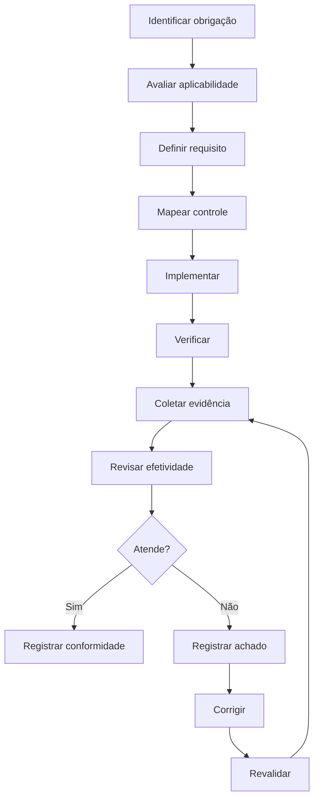

---

id: RB-COMP-001

title: Governança de Conformidade, Evidências e Preparação para Auditoria
description: Define o sistema oficial do RouteBook para identificar obrigações, mapear controles, administrar evidências, acompanhar não conformidades e manter a plataforma preparada para avaliações e auditorias.

document_type: compliance
owner: Governance

status: Draft
version: "0.1.0"

created: "2026-07-21"
last_updated: null

authors:

- RouteBook Team

tags:

- compliance
- governance
- audit-readiness
- controls
- evidence
- risk-management
- accountability
- privacy
- security
- artificial-intelligence
- operations
- quality
- diagrams
- mermaid

related_documents:

- RB-CORE-0001
- RB-CORE-0002
- RB-CORE-0003
- RB-CORE-0004
- RB-PRD-008
- RB-DOM-001
- RB-DOM-002
- RB-DOM-003
- RB-DOM-004
- RB-ARC-001
- RB-ARC-002
- RB-ARC-003
- RB-ARC-004
- RB-ARC-005
- RB-DATA-001
- RB-DATA-002
- RB-API-001
- RB-SEC-001
- RB-SEC-002
- RB-SEC-003
- RB-PRIV-001
- RB-PRIV-002
- RB-PRIV-003
- RB-OBS-001
- RB-QA-001
- RB-QA-002
- RB-OPS-001
- RB-OPS-002
- RB-SRE-001
- RB-AI-001
- RB-AI-002
- RB-AI-003
- RB-AI-004
- RB-AI-005
- RB-AI-006

prerequisites:

- RB-CORE-0004
- RB-ARC-001
- RB-ARC-002
- RB-ARC-003
- RB-ARC-004
- RB-ARC-005
- RB-SEC-001
- RB-SEC-002
- RB-SEC-003
- RB-PRIV-001
- RB-PRIV-002
- RB-PRIV-003
- RB-OBS-001
- RB-QA-001
- RB-OPS-001
- RB-SRE-001
- RB-AI-001

next_documents:

- RB-GOV-001
- RB-COMP-002

ai_context:
priority: critical
index: true
---

# RouteBook — Governança de Conformidade, Evidências e Preparação para Auditoria

## Parte I — Fundamentos

### 1. Propósito

Este documento define o sistema oficial de governança de conformidade do RouteBook.

Seu objetivo é estabelecer como o projeto deverá:

* identificar obrigações aplicáveis;
* transformar obrigações em requisitos verificáveis;
* mapear requisitos a controles;
* definir ownership;
* produzir evidências;
* avaliar efetividade;
* registrar exceções;
* tratar não conformidades;
* acompanhar ações corretivas;
* preparar avaliações internas;
* responder a auditorias;
* demonstrar responsabilização;
* preservar rastreabilidade;
* evoluir controles conforme o produto amadurece.

Este documento não pressupõe que o RouteBook esteja submetido, desde sua fase inicial, a todas as normas, certificações ou regimes mencionados em avaliações futuras.

Ele define a estrutura necessária para que decisões de conformidade sejam tomadas de forma explícita, proporcional e documentada.

---

### 2. Relação com os documentos anteriores

Os documentos anteriores definem:

* produto;
* domínio;
* arquitetura;
* dados;
* APIs;
* segurança;
* privacidade;
* qualidade;
* observabilidade;
* operações;
* confiabilidade;
* inteligência artificial.

O `RB-COMP-001` não redefine esses elementos.

Ele estabelece como demonstrar que:

* requisitos foram definidos;
* controles foram implementados;
* testes foram executados;
* riscos foram avaliados;
* decisões foram aprovadas;
* exceções foram controladas;
* evidências permanecem disponíveis.

```mermaid
flowchart LR
    Requirements["Obrigações e requisitos"]
    Policies["Políticas e documentos"]
    Controls["Controles"]
    Implementation["Implementação"]
    Tests["Testes e avaliações"]
    Evidence["Evidências"]
    Findings["Achados"]
    Remediation["Ações corretivas"]
    Assurance["Avaliação e auditoria"]

    Requirements --> Policies
    Policies --> Controls
    Controls --> Implementation
    Implementation --> Tests
    Tests --> Evidence
    Evidence --> Assurance
    Assurance --> Findings
    Findings --> Remediation
    Remediation --> Controls
```



---

### 3. Escopo

Este documento cobre conformidade relacionada a:

* governança documental;
* segurança da informação;
* privacidade;
* proteção de dados;
* inteligência artificial;
* desenvolvimento seguro;
* qualidade;
* confiabilidade;
* operações;
* gestão de fornecedores;
* continuidade;
* gestão de riscos;
* acessos;
* mudanças;
* incidentes;
* dados;
* evidências;
* auditorias;
* exceções;
* ações corretivas.

---

### 4. Fora do escopo

Este documento não constitui:

* parecer jurídico;
* certificação;
* declaração formal de conformidade;
* garantia regulatória;
* interpretação definitiva de legislação;
* contrato com clientes ou fornecedores;
* política contábil;
* política trabalhista;
* relatório de auditoria independente.

A aplicabilidade jurídica ou regulatória deverá ser validada pelos responsáveis apropriados.

---

### 5. Princípio central

Conformidade deverá ser demonstrável por meio de requisitos, controles, evidências e decisões rastreáveis.

```text
Obrigação
→ requisito
→ controle
→ implementação
→ verificação
→ evidência
→ conclusão
→ melhoria
```

---

### 6. Objetivos

O sistema deverá:

1. centralizar obrigações;
2. evitar requisitos implícitos;
3. vincular obrigações a controles;
4. definir owners;
5. reduzir evidências manuais;
6. prevenir controles apenas documentais;
7. acompanhar lacunas;
8. controlar exceções;
9. apoiar auditorias;
10. permitir melhoria contínua;
11. reduzir duplicação;
12. produzir responsabilização verificável.

---

## Parte II — Princípios de conformidade

### 7. Proporcionalidade

O nível de formalização deverá considerar:

* estágio do produto;
* número de Usuários;
* tipos de dados;
* criticidade;
* exposição;
* contratos;
* jurisdições;
* risco;
* custo de falha.

---

### 8. Evidência sobre declaração

A afirmação de que um controle existe não deverá ser suficiente.

O controle deverá possuir evidência de:

* definição;
* implementação;
* funcionamento;
* revisão;
* correção de falhas.

---

### 9. Fonte canônica

Cada obrigação, controle, evidência, exceção e achado deverá possuir uma referência canônica.

---

### 10. Responsabilidade explícita

Nenhum controle relevante poderá existir sem owner.

---

### 11. Segregação de responsabilidades

Sempre que proporcional ao risco, deverão ser separados:

* implementação;
* aprovação;
* verificação;
* aceitação de risco.

---

### 12. Automação preferencial

Evidências deverão ser geradas automaticamente quando isso aumentar:

* confiabilidade;
* frequência;
* precisão;
* rastreabilidade;
* sustentabilidade.

---

### 13. Exceções temporárias

Exceções deverão possuir:

* escopo;
* justificativa;
* risco;
* controles compensatórios;
* owner;
* aprovador;
* prazo;
* revisão.

---

### 14. Não duplicação

Um mesmo controle poderá atender múltiplos requisitos.

A rastreabilidade deverá evitar cópias divergentes.

---

### 15. Melhoria contínua

Achados deverão produzir melhoria no sistema, e não apenas correções pontuais.

---

## Parte III — Conceitos

### 16. Obrigação

Obrigação é uma expectativa externa ou interna que exige determinado comportamento, controle ou evidência.

Pode originar-se de:

* legislação;
* regulamentação;
* contrato;
* política;
* arquitetura;
* requisito de produto;
* decisão de risco;
* compromisso público;
* norma adotada;
* incidente.

---

### 17. Requisito de conformidade

É a tradução verificável de uma obrigação.

Um requisito deverá declarar:

* o que precisa ocorrer;
* em qual escopo;
* quem é responsável;
* como será verificado;
* qual evidência é esperada.

---

### 18. Controle

Controle é uma medida destinada a prevenir, detectar, responder, corrigir ou recuperar uma condição relevante.

---

### 19. Objetivo de controle

Objetivo de controle descreve o resultado que um ou mais controles deverão produzir.

---

### 20. Evidência

Evidência é um artefato capaz de demonstrar a definição, implementação ou efetividade de um controle.

---

### 21. Achado

Achado é uma condição identificada durante avaliação que demonstra:

* ausência;
* falha;
* inconsistência;
* risco;
* oportunidade de melhoria;
* não conformidade.

---

### 22. Não conformidade

Não conformidade é o descumprimento confirmado de requisito aplicável.

---

### 23. Exceção

Exceção é uma autorização temporária e controlada para operar sem cumprir integralmente um requisito.

---

### 24. Auditoria

Auditoria é uma avaliação estruturada e baseada em evidências.

Poderá ser:

* interna;
* externa;
* contratual;
* regulatória;
* técnica;
* temática.

---

### 25. Assurance

Assurance é o nível de confiança obtido de que requisitos e controles estão funcionando adequadamente.

---

## Parte IV — Modelo de governança

### 26. Componentes

O sistema de conformidade deverá possuir:

* catálogo de obrigações;
* catálogo de requisitos;
* catálogo de controles;
* inventário de evidências;
* matriz de aplicabilidade;
* registro de riscos;
* registro de exceções;
* registro de achados;
* plano de ações;
* calendário de avaliações;
* histórico de decisões.

---

### 27. Fluxo de governança



---

### 28. Modelo de três responsabilidades

Quando o tamanho da equipe permitir, a governança deverá distinguir:

1. execução do controle;
2. supervisão e gestão de risco;
3. avaliação independente.

Em uma equipe pequena, uma mesma pessoa poderá acumular funções, desde que o acúmulo seja documentado e revisado.

---

## Parte V — Catálogo de obrigações

### 29. Identificador

Formato sugerido:

```text
RB-OBL-<AREA>-NNN
```

Exemplos:

```text
RB-OBL-PRIV-001
RB-OBL-SEC-001
RB-OBL-AI-001
RB-OBL-OPS-001
```

---

### 30. Estrutura

Cada obrigação deverá possuir:

```text
obligationId
title
description
source
sourceReference
jurisdiction
applicability
scope
effectiveDate
owner
reviewFrequency
status
relatedRequirements
```

---

### 31. Estados

* Identified;
* Under Assessment;
* Applicable;
* Partially Applicable;
* Not Applicable;
* Deferred;
* Superseded;
* Archived.

---

### 32. Fonte

A fonte deverá ser identificada de modo preciso.

Não utilizar referências vagas como:

* legislação;
* segurança;
* política interna;
* boas práticas.

---

### 33. Aplicabilidade

A decisão deverá registrar:

* contexto;
* produto;
* dados;
* território;
* contrato;
* tipo de Usuário;
* motivo;
* aprovador;
* data.

---

### 34. Não aplicável

Uma obrigação não deverá ser marcada como não aplicável sem justificativa.

---

### 35. Mudanças

Alterações na fonte deverão provocar reavaliação.

---

## Parte VI — Catálogo de requisitos

### 36. Identificador

Formato sugerido:

```text
RB-REQ-COMP-<AREA>-NNN
```

---

### 37. Estrutura

```text
complianceRequirementId
obligationId
title
requirement
scope
systems
dataCategories
controlObjectives
verificationMethod
evidenceRequirements
owner
status
reviewDate
```

---

### 38. Características

Um requisito deverá ser:

* específico;
* verificável;
* proporcional;
* rastreável;
* compreensível;
* implementável.

---

### 39. Requisitos prescritivos

Quando a obrigação exigir medida específica, o requisito deverá preservá-la.

---

### 40. Requisitos baseados em resultado

Quando a obrigação definir apenas resultado, os controles poderão variar desde que o resultado seja demonstrado.

---

## Parte VII — Catálogo de controles

### 41. Identificador

Formato sugerido:

```text
RB-CTL-<AREA>-NNN
```

---

### 42. Estrutura

```text
controlId
title
objective
description
type
nature
scope
implementationOwner
verificationOwner
frequency
automation
evidence
relatedRequirements
relatedRisks
exceptions
status
```

---

### 43. Tipos

* Preventive;
* Detective;
* Responsive;
* Corrective;
* Recovery;
* Compensating.

---

### 44. Natureza

* técnico;
* arquitetural;
* processual;
* administrativo;
* contratual;
* operacional.

---

### 45. Estado do controle

* Planned;
* In Implementation;
* Implemented;
* Operating;
* Ineffective;
* Under Remediation;
* Suspended;
* Deprecated.

---

### 46. Controle-chave

Controle-chave é aquele cuja falha pode comprometer significativamente:

* segurança;
* privacidade;
* integridade;
* continuidade;
* conformidade;
* confiança.

---

### 47. Controle compartilhado

Um controle poderá atender múltiplas áreas.

Exemplo:

```text
RB-CTL-IAM-001 — Autorização server-side
```

poderá apoiar requisitos de:

* segurança;
* privacidade;
* isolamento;
* IA;
* operações.

---

## Parte VIII — Objetivos de controle

### 48. Segurança

Objetivos iniciais:

* somente identidades válidas acessam a plataforma;
* ações respeitam autorização;
* Accounts permanecem isoladas;
* secrets são protegidos;
* mudanças são rastreáveis;
* vulnerabilidades são tratadas.

---

### 49. Privacidade

Objetivos iniciais:

* dados possuem finalidade;
* coleta é minimizada;
* retenção é definida;
* exclusão é executável;
* Providers são avaliados;
* direitos são atendidos.

---

### 50. Dados

Objetivos iniciais:

* fontes canônicas são conhecidas;
* integridade é preservada;
* lineage é mantido;
* backups são testados;
* exclusões não são revertidas por restore.

---

### 51. Inteligência artificial

Objetivos iniciais:

* capacidades são catalogadas;
* contexto é autorizado;
* Tools possuem escopo;
* saídas são validadas;
* riscos são avaliados;
* autonomia é limitada;
* avaliações são executadas.

---

### 52. Operações

Objetivos iniciais:

* incidentes são detectados;
* runbooks estão disponíveis;
* recuperação é testada;
* acessos emergenciais são auditados;
* mudanças possuem rollback.

---

### 53. Qualidade

Objetivos iniciais:

* requisitos possuem testes;
* controles críticos possuem regressão;
* falhas são rastreadas;
* evidências são preservadas.

---

## Parte IX — Matriz de aplicabilidade

### 54. Objetivo

A matriz deverá indicar quais obrigações e requisitos são aplicáveis ao RouteBook.

---

### 55. Estrutura

```text
applicabilityId
obligationId
productScope
environmentScope
jurisdiction
applicabilityDecision
justification
conditions
owner
approvedBy
decidedAt
reviewDate
```

---

### 56. Escopo

A aplicabilidade poderá variar por:

* ambiente;
* funcionalidade;
* região;
* tipo de Usuário;
* tipo de dado;
* Provider;
* contrato;
* estágio do produto.

---

### 57. Revisão

A matriz deverá ser revista quando houver:

* lançamento público;
* expansão internacional;
* novo contrato;
* dados sensíveis;
* crianças;
* pagamentos;
* nova IA;
* novo Provider;
* mudança de modelo de negócio.

---

## Parte X — Gestão de evidências

### 58. Princípio

Evidência deverá ser suficiente, confiável, íntegra, atual e relacionada ao controle.

---

### 59. Identificador

Formato sugerido:

```text
RB-EVD-<AREA>-NNN
```

---

### 60. Estrutura

```text
evidenceId
title
controlId
evidenceType
source
artifactReference
environment
periodStart
periodEnd
generatedAt
generatedBy
integrityMethod
retention
access
status
```

---

### 61. Tipos de evidência

* política;
* documento;
* configuração;
* código;
* pull request;
* teste;
* relatório;
* log;
* trace;
* dashboard;
* alerta;
* Audit Entry;
* ticket;
* aprovação;
* execução de runbook;
* backup restore;
* avaliação;
* contrato.

---

### 62. Evidência de desenho

Demonstra que o controle foi definido adequadamente.

---

### 63. Evidência de implementação

Demonstra que o controle foi incorporado ao sistema ou processo.

---

### 64. Evidência de operação

Demonstra que o controle funcionou durante determinado período.

---

### 65. Evidência de efetividade

Demonstra que o controle produziu o resultado esperado.

---

### 66. Atualidade

A evidência deverá corresponder ao período avaliado.

---

### 67. Integridade

Evidências críticas deverão possuir mecanismos como:

* origem autenticada;
* controle de acesso;
* histórico;
* checksum;
* assinatura;
* artefato imutável;
* versionamento.

---

### 68. Minimização

Evidências não deverão copiar dados pessoais ou secrets além do necessário.

---

### 69. Retenção

A retenção deverá considerar:

* finalidade;
* risco;
* auditoria;
* segurança;
* privacidade;
* custo;
* requisitos aplicáveis.

---

## Parte XI — Automação de evidências

### 70. Fontes automatizadas

Poderão incluir:

* CI/CD;
* repositório;
* scanners;
* testes;
* cloud;
* dashboards;
* identity provider;
* banco;
* observabilidade;
* sistema de tickets;
* catálogos;
* AI evaluation runtime.

---

### 71. Requisitos

A automação deverá registrar:

* fonte;
* horário;
* escopo;
* versão;
* ambiente;
* resultado;
* integridade;
* falhas.

---

### 72. Evidência contínua

Controles contínuos deverão preferencialmente produzir evidências contínuas.

Exemplos:

* branch protection;
* secret scanning;
* testes de autorização;
* backup;
* retenção;
* alertas;
* inventário de Providers.

---

### 73. Falha na coleta

Falhas de coleta deverão ser observáveis.

Ausência de evidência não deverá ser interpretada automaticamente como conformidade.

---

### 74. Revisão humana

Automação não elimina a necessidade de avaliar:

* contexto;
* completude;
* falsos positivos;
* exceções;
* relevância.

---

## Parte XII — Avaliação de controles

### 75. Tipos de avaliação

* design effectiveness;
* implementation effectiveness;
* operating effectiveness;
* continuous monitoring;
* thematic review;
* readiness assessment.

---

### 76. Efetividade de desenho

Avalia se o controle é capaz de atender ao objetivo.

---

### 77. Efetividade de implementação

Avalia se o controle foi implementado conforme definido.

---

### 78. Efetividade operacional

Avalia se o controle funcionou durante o período.

---

### 79. Amostragem

Quando houver amostragem, deverão ser definidos:

* população;
* período;
* método;
* tamanho;
* critérios;
* limitações.

---

### 80. Resultado

Resultados possíveis:

* Effective;
* Effective with Observation;
* Partially Effective;
* Ineffective;
* Not Tested;
* Not Applicable.

---

### 81. Independência

Controles críticos deverão, quando viável, ser avaliados por pessoa diferente do implementador.

---

## Parte XIII — Achados e não conformidades

### 82. Identificador

Formato sugerido:

```text
RB-FNDG-NNNNN
```

---

### 83. Estrutura

```text
findingId
title
description
source
requirementId
controlId
scope
severity
risk
evidence
rootCause
owner
status
targetDate
remediationPlan
verification
closedAt
```

---

### 84. Estados

* Open;
* Under Analysis;
* Treatment Planned;
* In Remediation;
* Ready for Verification;
* Closed;
* Risk Accepted;
* Duplicate;
* Invalid.

---

### 85. Severidade

#### Critical

Condição que pode provocar:

* acesso cross-account;
* exposição relevante;
* perda ou corrupção de dados;
* comprometimento de pipeline;
* bypass de autenticação;
* descumprimento grave;
* risco imediato.

#### High

Falha relevante sem impacto crítico confirmado, mas com exposição ou controle insuficiente.

#### Moderate

Lacuna limitada, compensada parcialmente ou de impacto restrito.

#### Low

Melhoria, inconsistência documental ou risco reduzido.

---

### 86. Elevação automática

Deverão ser tratados como Critical:

* acesso cross-account confirmado;
* secret privilegiado exposto;
* exclusão de dados sistematicamente inoperante;
* pipeline comprometido;
* Provider não autorizado recebendo dados sensíveis;
* Tool administrativa sem autorização;
* corrupção canônica ampla.

---

## Parte XIV — Análise de causa

### 87. Objetivo

A correção deverá tratar a causa, e não apenas o sintoma.

---

### 88. Categorias

Causas poderão envolver:

* requisito ausente;
* design inadequado;
* implementação incorreta;
* teste insuficiente;
* configuração;
* treinamento;
* ownership;
* processo;
* ferramenta;
* comunicação;
* dependência.

---

### 89. Causa sistêmica

Quando um achado representar padrão recorrente, deverão ser avaliados:

* framework;
* biblioteca;
* template;
* scanner;
* política;
* automação;
* treinamento;
* governança.

---

### 90. Evidência

A causa deverá ser sustentada por fatos e não por suposição.

---

## Parte XV — Plano de ação corretiva

### 91. Estrutura

```text
correctiveActionId
findingId
description
owner
priority
targetDate
dependencies
status
completionEvidence
verificationOwner
completedAt
```

---

### 92. Estados

* Open;
* In Progress;
* Blocked;
* Ready for Verification;
* Completed;
* Cancelled;
* Superseded.

---

### 93. Critérios

A ação deverá ser:

* específica;
* mensurável;
* atribuída;
* verificável;
* datada;
* proporcional.

---

### 94. Fechamento

Um achado não deverá ser encerrado apenas porque a ação foi marcada como concluída.

A efetividade deverá ser verificada.

---

### 95. Atraso

Ações vencidas deverão gerar:

* escalonamento;
* revisão de risco;
* novo plano;
* possível restrição de mudanças;
* exceção formal quando necessária.

---

## Parte XVI — Exceções

### 96. Identificador

Formato sugerido:

```text
RB-EXC-COMP-NNN
```

---

### 97. Estrutura

```text
exceptionId
requirementId
controlId
scope
justification
risk
compensatingControls
owner
approvedBy
createdAt
expiresAt
reviewDate
status
```

---

### 98. Estados

* Requested;
* Under Review;
* Approved;
* Rejected;
* Expired;
* Revoked;
* Closed.

---

### 99. Limites

Exceções não deverão ser utilizadas para evitar:

* isolamento entre Accounts;
* autorização;
* proteção de secrets;
* integridade canônica;
* investigação de incidente;
* exclusão obrigatória;
* controle de Provider;
* rastreabilidade de Tool administrativa.

---

### 100. Controle compensatório

Quando o requisito não puder ser cumprido integralmente, deverá ser avaliado um controle compensatório.

---

### 101. Renovação

A renovação deverá exigir nova análise.

---

## Parte XVII — Riscos de conformidade

### 102. Registro

Riscos deverão ser integrados ao sistema geral de gestão de riscos.

---

### 103. Estrutura

```text
complianceRiskId
title
description
obligations
requirements
assets
likelihood
impact
inherentRisk
controls
residualRisk
owner
treatment
reviewDate
```

---

### 104. Tratamentos possíveis

* Avoid;
* Reduce;
* Transfer;
* Accept;
* Monitor.

---

### 105. Aceitação

Riscos High ou Critical deverão possuir aprovação explícita.

---

### 106. Revisão

Riscos deverão ser revistos após:

* incidente;
* auditoria;
* mudança material;
* nova obrigação;
* falha de controle;
* expansão do produto.

---

## Parte XVIII — Preparação para auditoria

### 107. Objetivo

Preparação para auditoria é a capacidade de responder a uma avaliação com:

* escopo claro;
* owners;
* controles;
* evidências;
* histórico;
* decisões;
* ações;
* limitações conhecidas.

---

### 108. Readiness assessment

Antes de auditoria relevante, deverá ser realizada avaliação de prontidão.

---

### 109. Etapas

1. definir escopo;
2. identificar requisitos;
3. confirmar controles;
4. validar owners;
5. revisar evidências;
6. identificar lacunas;
7. executar correções;
8. preparar índice;
9. definir participantes;
10. realizar simulação.

---

### 110. Índice de evidências

Deverá relacionar:

* requisito;
* controle;
* evidência;
* período;
* owner;
* localização;
* observação.

---

### 111. Evidências temporárias

Documentos criados apenas para auditoria não deverão substituir processos operacionais reais.

---

### 112. Data room

Quando necessário, uma área controlada poderá ser utilizada para disponibilizar evidências.

---

### 113. Acesso

O acesso deverá ser:

* mínimo;
* temporário;
* auditado;
* aprovado;
* revogado ao término.

---

## Parte XIX — Execução de auditoria

### 114. Papéis

Deverão ser definidos:

* Audit Coordinator;
* Control Owner;
* Evidence Owner;
* Technical Subject Matter Expert;
* Privacy Representative;
* Security Representative;
* Scribe.

---

### 115. Solicitações

Toda solicitação de auditoria deverá possuir:

```text
auditRequestId
auditId
request
requirement
owner
receivedAt
targetDate
status
response
evidenceReferences
```

---

### 116. Respostas

As respostas deverão ser:

* factuais;
* consistentes;
* sustentadas por evidências;
* limitadas ao escopo;
* revisadas quando sensíveis.

---

### 117. Informações sensíveis

Não deverão ser compartilhados sem necessidade:

* secrets;
* dados pessoais completos;
* código sensível;
* detalhes de exploração;
* credenciais;
* informações de outras auditorias.

---

### 118. Divergências

Divergências entre documentação e implementação deverão ser registradas como achado.

---

### 119. Linha do tempo

Decisões, solicitações e respostas deverão permanecer rastreáveis.

---

## Parte XX — Auditorias internas

### 120. Objetivo

Auditorias internas deverão identificar lacunas antes que produzam incidentes ou falhas externas.

---

### 121. Plano anual ou periódico

O plano poderá priorizar:

* autorização;
* privacidade;
* IA;
* Providers;
* backups;
* incidentes;
* CI/CD;
* vulnerabilidades;
* retenção;
* direitos dos titulares.

---

### 122. Escopo baseado em risco

Áreas de maior risco deverão possuir maior frequência.

---

### 123. Independência proporcional

O responsável pela avaliação não deverá ser o único responsável pelo controle avaliado, quando a estrutura permitir.

---

### 124. Relatório

O relatório deverá conter:

* objetivo;
* escopo;
* período;
* metodologia;
* limitações;
* controles avaliados;
* evidências;
* achados;
* conclusão;
* ações.

---

## Parte XXI — Autoavaliações

### 125. Uso

Control owners poderão executar autoavaliações periódicas.

---

### 126. Limitação

Autoavaliação não substitui revisão independente para controles críticos.

---

### 127. Declaração

O owner deverá confirmar:

* controle ativo;
* mudanças;
* incidentes;
* falhas;
* evidências;
* exceções;
* riscos.

---

### 128. Evidência

Declaração sem evidência deverá ser considerada insuficiente.

---

## Parte XXII — Gestão de fornecedores

### 129. Escopo

Providers relevantes deverão ser avaliados quanto a:

* segurança;
* privacidade;
* continuidade;
* dados;
* IA;
* suboperadores;
* retenção;
* exclusão;
* incidentes;
* encerramento.

---

### 130. Classificação

Providers poderão ser classificados como:

* Critical;
* High;
* Moderate;
* Low.

---

### 131. Due diligence

A avaliação poderá considerar:

* controles;
* certificações;
* relatórios;
* arquitetura;
* histórico;
* termos;
* localização;
* resposta a incidentes;
* continuidade.

---

### 132. Evidência de terceiros

Certificações ou relatórios externos deverão ser:

* atuais;
* aplicáveis;
* revisados;
* limitados ao escopo real.

---

### 133. Monitoramento

Providers críticos deverão ser reavaliados periodicamente.

---

### 134. Exit plan

Deverá existir plano para:

* interromper;
* migrar;
* exportar;
* excluir;
* revogar;
* validar encerramento.

---

## Parte XXIII — Conformidade de inteligência artificial

### 135. Princípio

Capacidades de IA deverão ser governadas por risco, finalidade, dados, autonomia e impacto.

---

### 136. Evidências mínimas

Cada capacidade deverá possuir, conforme aplicável:

* capabilityId;
* agentId;
* modelFamily;
* providerId;
* promptVersion;
* schemaVersion;
* Context Snapshot;
* Tools;
* avaliações;
* limites;
* approvals;
* incidentes;
* mudanças.

---

### 137. Avaliações

Evidências poderão incluir:

* Golden Dataset;
* regressão;
* segurança;
* red teaming;
* robustez;
* custo;
* latência;
* schema acceptance;
* Tool-call success.

---

### 138. Autonomia

A autonomia deverá ser documentada e limitada.

---

### 139. Human-in-the-loop

Quando utilizado como controle, deverá existir evidência de que a revisão humana é:

* possível;
* informada;
* autorizada;
* efetiva.

---

### 140. Mudanças de modelo

Mudanças relevantes deverão provocar nova avaliação proporcional ao risco.

---

### 141. Conteúdo e contexto

Deverá ser possível demonstrar:

* quais dados entram;
* por qual finalidade;
* como são minimizados;
* quais Providers recebem;
* quanto tempo permanecem.

---

## Parte XXIV — Conformidade de privacidade

### 142. Evidências mínimas

* inventário de atividades;
* finalidades;
* dados;
* Providers;
* retenção;
* exclusão;
* direitos;
* avaliações de impacto;
* exceções;
* incidentes.

---

### 143. Direitos dos titulares

Deverão existir evidências de:

* recebimento;
* verificação;
* execução;
* prazo;
* comunicação;
* conclusão.

---

### 144. Exclusão

A efetividade deverá considerar:

* fontes canônicas;
* derivados;
* cache;
* índices;
* Providers;
* IA;
* backups;
* restore.

---

### 145. Retenção

Regras deverão ser verificadas operacionalmente.

---

## Parte XXV — Conformidade de segurança

### 146. Evidências mínimas

* autenticação;
* autorização;
* testes cross-account;
* vulnerabilidades;
* scanners;
* incidentes;
* secrets;
* acessos privilegiados;
* mudanças;
* backups;
* runbooks.

---

### 147. Testes negativos

Controles de autorização deverão possuir evidência de testes negativos.

---

### 148. Vulnerabilidades

Deverão ser demonstráveis:

* identificação;
* classificação;
* owner;
* prazo;
* correção;
* verificação;
* risco residual.

---

### 149. Acesso privilegiado

Deverá ser:

* autorizado;
* temporário;
* auditado;
* revogado;
* revisado.

---

## Parte XXVI — Conformidade operacional

### 150. Evidências mínimas

* SLOs;
* error budgets;
* alertas;
* incidentes;
* runbooks;
* postmortems;
* backups;
* restore;
* disaster recovery;
* mudanças;
* rollback.

---

### 151. Testes operacionais

Deverão existir evidências de:

* restauração;
* failover quando aplicável;
* game days;
* testes de runbook;
* validação de recuperação.

---

### 152. Incidentes

Incidentes relevantes deverão demonstrar:

* detecção;
* classificação;
* resposta;
* comunicação;
* recuperação;
* aprendizado;
* ações.

---

## Parte XXVII — Governança documental

### 153. Fonte canônica

A documentação oficial deverá permanecer no repositório definido pelo projeto.

---

### 154. Frontmatter

Cada documento deverá possuir metadados consistentes com o registro.

---

### 155. Registro

O `docs/registry.md` deverá permanecer sincronizado com:

* ID;
* título;
* área;
* status;
* versão;
* caminho.

---

### 156. Aprovação

Documentos normativos deverão possuir processo de revisão e aprovação.

---

### 157. Versionamento

Mudanças materiais deverão produzir nova versão.

---

### 158. Obsolescência

Documentos substituídos deverão ser marcados como:

* Deprecated;
* Archived;
* Superseded, quando o tipo de artefato permitir.

---

### 159. Contradições

Contradições entre documentos deverão gerar correção explícita, e não interpretação silenciosa.

---

## Parte XXVIII — Mudanças e conformidade

### 160. Mudança relevante

Uma mudança deverá ser avaliada quando alterar:

* dados;
* acesso;
* autorização;
* Provider;
* IA;
* Tool;
* retenção;
* região;
* fluxo;
* arquitetura;
* risco;
* contrato;
* finalidade.

---

### 161. Evidências de mudança

Deverão incluir:

* requisito;
* design;
* revisão;
* testes;
* aprovação;
* deployment;
* rollback;
* observabilidade.

---

### 162. Mudança emergencial

Mudanças emergenciais deverão preservar:

* autorização;
* rastreabilidade;
* teste mínimo;
* rollback;
* revisão posterior.

---

### 163. Feature flags

Feature flags deverão possuir:

* owner;
* finalidade;
* estado;
* expiração;
* histórico;
* remoção.

---

## Parte XXIX — Calendário de conformidade

### 164. Objetivo

O calendário deverá organizar atividades recorrentes.

---

### 165. Atividades possíveis

* revisão de obrigações;
* revisão de riscos;
* testes de controles;
* revisão de acessos;
* avaliação de Providers;
* restore;
* game day;
* auditoria interna;
* revisão de políticas;
* renovação de exceções;
* avaliação de IA.

---

### 166. Estrutura

```text
complianceActivityId
title
owner
frequency
scope
nextExecution
evidenceExpected
escalation
status
```

---

### 167. Falha de execução

Atividades vencidas deverão gerar alerta e escalonamento.

---

## Parte XXX — Relatórios

### 168. Relatório de conformidade

Poderá apresentar:

* obrigações;
* requisitos;
* controles;
* efetividade;
* achados;
* ações;
* exceções;
* riscos;
* auditorias;
* tendências.

---

### 169. Público

Relatórios deverão ser adaptados para:

* engenharia;
* Product;
* Governance;
* liderança;
* cliente;
* auditor.

---

### 170. Transparência interna

O relatório não deverá ocultar riscos conhecidos.

---

### 171. Minimização

Relatórios não deverão reproduzir dados sensíveis desnecessários.

---

## Parte XXXI — Métricas

### 172. Cobertura

* obrigações avaliadas;
* requisitos mapeados;
* controles com owner;
* controles com evidência;
* controles testados;
* Providers avaliados;
* capacidades de IA avaliadas.

---

### 173. Efetividade

* controles efetivos;
* controles parcialmente efetivos;
* controles inefetivos;
* falhas recorrentes;
* controles sem teste;
* evidências expiradas.

---

### 174. Achados

* achados por severidade;
* idade média;
* ações vencidas;
* reincidência;
* tempo até correção;
* tempo até verificação.

---

### 175. Exceções

* exceções abertas;
* exceções vencidas;
* exceções renovadas;
* riscos aceitos;
* controles compensatórios.

---

### 176. Auditoria

* solicitações recebidas;
* respostas no prazo;
* lacunas de evidência;
* achados por auditoria;
* tempo de preparação.

---

### 177. Métricas responsáveis

Métricas não deverão incentivar:

* ocultação;
* reclassificação indevida;
* fechamento sem verificação;
* produção de evidência artificial;
* burocracia sem redução de risco.

---

## Parte XXXII — Papéis e responsabilidades

### 178. Governance

Responsável por:

* sistema de conformidade;
* catálogo de obrigações;
* metodologia;
* coordenação;
* relatórios;
* auditorias;
* exceções;
* decisões.

---

### 179. Legal ou responsável jurídico

Quando aplicável, responsável por:

* interpretação jurídica;
* aplicabilidade;
* obrigações;
* comunicações regulatórias;
* contratos.

---

### 180. Security

Responsável por:

* controles de segurança;
* ameaças;
* vulnerabilidades;
* incidentes;
* evidências técnicas.

---

### 181. Privacy

Responsável por:

* tratamentos;
* direitos;
* avaliações de impacto;
* retenção;
* Providers;
* riscos de privacidade.

---

### 182. Platform

Responsável por:

* infraestrutura;
* CI/CD;
* observabilidade;
* backups;
* acessos;
* automação de evidências.

---

### 183. Quality Engineering

Responsável por:

* verificação;
* cobertura;
* testes;
* regressão;
* evidências;
* validação independente.

---

### 184. Artificial Intelligence

Responsável por:

* catálogo;
* avaliações;
* modelos;
* agentes;
* Tools;
* contexto;
* evidências de IA.

---

### 185. Product

Responsável por:

* finalidade;
* impacto;
* priorização;
* requisitos;
* decisões de escopo.

---

### 186. Control Owner

Responsável por:

* operar;
* documentar;
* monitorar;
* corrigir;
* fornecer evidências.

---

### 187. Evidence Owner

Responsável por garantir que a evidência esteja:

* disponível;
* íntegra;
* atual;
* acessível;
* minimizada.

---

## Parte XXXIII — Integração com desenvolvimento

### 188. Definition of Ready

Capacidades relevantes deverão possuir:

* requisitos aplicáveis;
* riscos;
* controles;
* owners;
* critérios de evidência.

---

### 189. Pull request

Mudanças de risco poderão referenciar:

* requirementId;
* controlId;
* threatId;
* processingActivityId;
* assessmentId;
* exceptionId.

---

### 190. Definition of Done

Uma capacidade relevante estará concluída quando:

* controles estiverem implementados;
* testes estiverem aprovados;
* evidências estiverem disponíveis;
* riscos estiverem tratados;
* documentação estiver atualizada.

---

### 191. Release

Não deverá avançar quando houver:

* risco Critical não tratado;
* controle-chave ausente;
* exceção não aprovada;
* bypass conhecido;
* evidência crítica inexistente;
* avaliação obrigatória incompleta.

---

## Parte XXXIV — Integração com incidentes

### 192. Incidente como fonte de evidência

Incidentes deverão alimentar:

* riscos;
* controles;
* requisitos;
* achados;
* planos de ação;
* auditorias.

---

### 193. Falha de controle

A investigação deverá identificar quais controles:

* falharam;
* estavam ausentes;
* foram contornados;
* não foram detectivos;
* não foram operados.

---

### 194. Postmortem

Ações do postmortem deverão ser vinculadas aos controles afetados.

---

### 195. Comunicação

Obrigações de comunicação deverão ser identificadas e coordenadas com responsáveis apropriados.

---

## Parte XXXV — Anti-patterns

### 196. Compliance como documentação isolada

Controles deverão existir na operação real.

---

### 197. Criar evidência na véspera da auditoria

Evidências deverão ser produzidas pelo processo normal.

---

### 198. Um controle por requisito

Pode gerar duplicação e inconsistência.

---

### 199. Controle sem owner

Não é sustentável.

---

### 200. Evidência sem período

Não demonstra operação contínua.

---

### 201. Certificação de Provider como garantia absoluta

O escopo e as limitações deverão ser avaliados.

---

### 202. Exceção permanente

Deverá possuir prazo e revisão.

---

### 203. Fechar achado sem verificação

A conclusão deverá ser comprovada.

---

### 204. Marcar requisito como não aplicável sem análise

A decisão deverá possuir justificativa.

---

### 205. Auditoria como objetivo final

O objetivo é reduzir risco e demonstrar responsabilidade, não apenas obter aprovação.

---

### 206. IA produzindo evidência sem fonte

Resumos gerados por IA não substituem artefatos canônicos.

---

### 207. Copiar frameworks inteiros

Somente requisitos aplicáveis deverão ser incorporados.

---

## Parte XXXVI — Modelo de maturidade

### 208. Nível 1 — Inicial

* owners;
* documentos;
* controles críticos;
* evidências manuais;
* tratamento básico de achados.

---

### 209. Nível 2 — Gerenciado

* catálogos;
* matriz de aplicabilidade;
* calendário;
* avaliações periódicas;
* exceções;
* métricas.

---

### 210. Nível 3 — Verificável

* automação de evidências;
* controles contínuos;
* auditorias internas;
* dashboards;
* integração com CI/CD;
* gestão de Providers.

---

### 211. Nível 4 — Adaptativo

* compliance as code;
* detecção contínua de desvios;
* avaliação baseada em mudanças;
* evidências contínuas;
* priorização dinâmica por risco;
* governança automatizada supervisionada.

---

## Parte XXXVII — Estrutura documental

### 212. Organização sugerida

```text
docs/
└── compliance/
    ├── compliance-evidence-and-audit-readiness.md
    ├── obligations/
    ├── requirements/
    ├── controls/
    ├── evidence/
    ├── audits/
    ├── findings/
    ├── corrective-actions/
    ├── exceptions/
    ├── providers/
    └── templates/
```

---

### 213. Template de obrigação

```text
obligationId:
title:
source:
sourceReference:
applicability:
scope:
owner:
status:
relatedRequirements:
reviewDate:
```

---

### 214. Template de controle

```text
controlId:
title:
objective:
description:
type:
scope:
implementationOwner:
verificationOwner:
frequency:
evidence:
relatedRequirements:
status:
```

---

### 215. Template de evidência

```text
evidenceId:
controlId:
title:
type:
source:
period:
environment:
artifactReference:
integrity:
retention:
owner:
status:
```

---

### 216. Template de achado

```text
findingId:
title:
requirementId:
controlId:
description:
severity:
risk:
owner:
targetDate:
status:
remediation:
verification:
```

---

## Parte XXXVIII — Rastreabilidade

### 217. Cadeia obrigatória


---

### 218. Matriz mínima

| Elemento  | Vinculação obrigatória           |
| --------- | -------------------------------- |
| obrigação | fonte                            |
| requisito | obrigação                        |
| controle  | requisito                        |
| evidência | controle                         |
| teste     | controle                         |
| achado    | requisito e controle             |
| ação      | achado                           |
| exceção   | requisito ou controle            |
| risco     | obrigação, requisito ou controle |
| auditoria | escopo e evidências              |

---

## Parte XXXIX — Critérios de aceite

### 219. Governança

* catálogo de obrigações definido;
* catálogo de requisitos definido;
* catálogo de controles definido;
* matriz de aplicabilidade definida;
* ownership definido;
* estados definidos.

---

### 220. Evidências

* tipos definidos;
* integridade definida;
* retenção definida;
* automação definida;
* atualidade definida;
* minimização definida.

---

### 221. Avaliação

* efetividade de desenho definida;
* efetividade de implementação definida;
* efetividade operacional definida;
* amostragem definida;
* resultados definidos.

---

### 222. Achados

* classificação definida;
* análise de causa definida;
* ações corretivas definidas;
* verificação definida;
* atrasos definidos.

---

### 223. Auditoria

* prontidão definida;
* índice de evidências definido;
* execução definida;
* papéis definidos;
* data room definido;
* auditorias internas definidas.

---

### 224. Áreas de controle

* segurança coberta;
* privacidade coberta;
* IA coberta;
* operações cobertas;
* Providers cobertos;
* documentação coberta;
* mudanças cobertas.

---

### 225. Integrações

* desenvolvimento integrado;
* incidentes integrados;
* qualidade integrada;
* riscos integrados;
* calendário definido;
* métricas definidas.

---

## Parte XL — Checklist final

### 226. Checklist documental

Antes de aprovar:

* frontmatter YAML é válido;
* ID é único;
* título está correto;
* existe apenas um H1;
* propósito está definido;
* escopo está definido;
* princípios estão definidos;
* conceitos estão definidos;
* governança está definida;
* obrigações estão definidas;
* requisitos estão definidos;
* controles estão definidos;
* objetivos de controle estão definidos;
* matriz de aplicabilidade está definida;
* evidências estão definidas;
* automação de evidências está definida;
* avaliação de controles está definida;
* achados estão definidos;
* não conformidades estão definidas;
* causa raiz está definida;
* ações corretivas estão definidas;
* exceções estão definidas;
* riscos estão definidos;
* preparação para auditoria está definida;
* execução de auditoria está definida;
* auditorias internas estão definidas;
* autoavaliações estão definidas;
* Providers estão cobertos;
* IA está coberta;
* privacidade está coberta;
* segurança está coberta;
* operação está coberta;
* documentação está coberta;
* mudanças estão cobertas;
* calendário está definido;
* relatórios estão definidos;
* métricas estão definidas;
* responsabilidades estão definidas;
* desenvolvimento está integrado;
* incidentes estão integrados;
* anti-patterns estão definidos;
* maturidade está definida;
* estrutura documental está definida;
* rastreabilidade está presente;
* diagramas Mermaid renderizam no GitHub;
* blocos Mermaid não possuem atributos adicionais;
* não existem contradições com RB-SEC-001;
* não existem contradições com RB-SEC-002;
* não existem contradições com RB-SEC-003;
* não existem contradições com RB-PRIV-001;
* não existem contradições com RB-PRIV-002;
* não existem contradições com RB-PRIV-003;
* não existem contradições com RB-QA-001;
* não existem contradições com RB-OPS-001;
* não existem contradições com RB-SRE-001;
* não existem contradições com RB-AI-001.

---

## Parte XLI — Declaração final

### 227. Declaração de conformidade

O RouteBook deverá tratar conformidade como um sistema contínuo de requisitos, controles, evidências, avaliações e melhoria.

Nenhuma obrigação relevante deverá permanecer:

* sem análise;
* sem owner;
* sem requisito;
* sem controle;
* sem evidência;
* sem revisão.

Nenhum controle deverá ser considerado efetivo apenas porque:

* está documentado;
* foi implementado uma vez;
* possui ferramenta associada;
* não apresentou incidente;
* foi declarado pelo próprio owner.

Toda conclusão de conformidade deverá ser sustentada por evidências proporcionais ao risco e ao período avaliado.

Achados deverão ser tratados até que sua correção seja verificada.

Exceções deverão ser temporárias, explícitas e aprovadas.

A governança de conformidade deverá permanecer integrada ao produto, à arquitetura, à segurança, à privacidade, à inteligência artificial, à qualidade, à confiabilidade e às operações do RouteBook.
