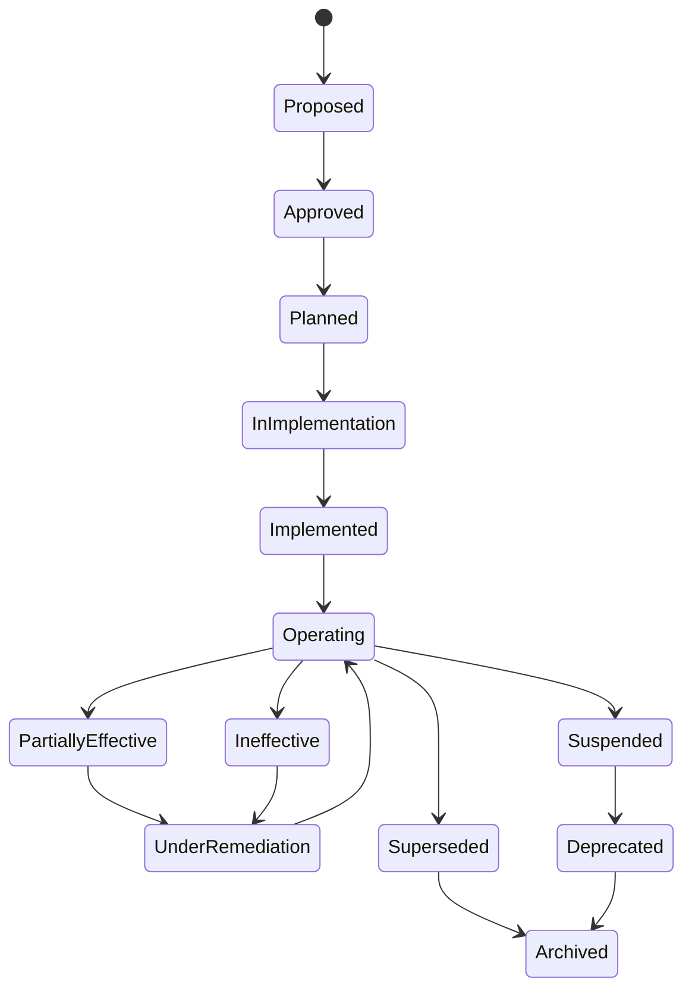
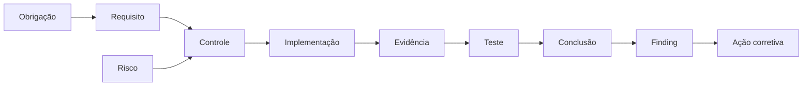

---

id: RB-COMP-002

title: Catálogo de Controles, Evidências e Avaliação de Efetividade
description: Define o catálogo operacional de controles do RouteBook, os requisitos de evidência, os métodos de teste e os critérios para avaliar desenho, implementação e efetividade operacional.

document_type: compliance
owner: Governance

status: Published
version: "0.1.0"

created: "2026-07-24"
last_updated: null

authors:

- RouteBook Team

tags:

- compliance
- governance
- control-catalog
- control-testing
- evidence
- assurance
- audit-readiness
- risk-management
- security
- privacy
- artificial-intelligence
- data-governance
- quality
- reliability
- operations
- diagrams
- mermaid

related_documents:

- RB-CORE-0001
- RB-CORE-0002
- RB-CORE-0003
- RB-CORE-0004
- RB-PRD-008
- RB-DOM-001
- RB-DOM-002
- RB-DOM-003
- RB-DOM-004
- RB-ARC-001
- RB-ARC-002
- RB-ARC-003
- RB-ARC-004
- RB-ARC-005
- RB-DATA-001
- RB-DATA-002
- RB-API-001
- RB-SEC-001
- RB-SEC-002
- RB-SEC-003
- RB-PRIV-001
- RB-PRIV-002
- RB-PRIV-003
- RB-OBS-001
- RB-QA-001
- RB-QA-002
- RB-OPS-001
- RB-OPS-002
- RB-SRE-001
- RB-AI-001
- RB-AI-002
- RB-AI-003
- RB-AI-004
- RB-AI-005
- RB-AI-006
- RB-COMP-001
- RB-GOV-001
- RB-GOV-002

prerequisites:

- RB-CORE-0004
- RB-ARC-001
- RB-ARC-002
- RB-ARC-003
- RB-ARC-004
- RB-ARC-005
- RB-DATA-001
- RB-DATA-002
- RB-SEC-001
- RB-SEC-002
- RB-SEC-003
- RB-PRIV-001
- RB-PRIV-002
- RB-PRIV-003
- RB-OBS-001
- RB-QA-001
- RB-QA-002
- RB-OPS-001
- RB-OPS-002
- RB-SRE-001
- RB-AI-001
- RB-AI-002
- RB-AI-005
- RB-COMP-001
- RB-GOV-001
- RB-GOV-002

next_documents:

- RB-COMP-003

ai_context:
priority: critical
index: true
---

# RouteBook — Catálogo de Controles, Evidências e Avaliação de Efetividade

## Parte I — Fundamentos

### 1. Propósito

Este documento define o catálogo operacional de controles do RouteBook.

Seu objetivo é transformar os princípios de conformidade estabelecidos no `RB-COMP-001` em controles verificáveis, reutilizáveis e rastreáveis.

O documento estabelece:

* estrutura canônica de controles;
* objetivos de controle;
* famílias de controles;
* identificação;
* ownership;
* frequência;
* automação;
* evidências esperadas;
* métodos de teste;
* critérios de efetividade;
* tratamento de falhas;
* controles compensatórios;
* integração com riscos;
* integração com mudanças;
* integração com auditorias;
* governança de controles de IA;
* critérios de maturidade.

---

### 2. Relação com o RB-COMP-001

O `RB-COMP-001` define:

* governança de conformidade;
* obrigações;
* requisitos;
* evidências;
* avaliações;
* achados;
* ações corretivas;
* auditorias;
* exceções;
* riscos.

O `RB-COMP-002` define como os controles deverão ser:

* catalogados;
* descritos;
* implementados;
* operados;
* testados;
* evidenciados;
* avaliados;
* corrigidos;
* descontinuados.

O `RB-COMP-002` não substitui o `RB-COMP-001`.

---

### 3. Problema que este documento resolve

Sem um catálogo canônico, controles podem:

* existir apenas em documentação;
* possuir nomes divergentes;
* não possuir owner;
* não possuir frequência;
* não gerar evidência;
* ser duplicados;
* atender parcialmente a requisitos sem transparência;
* falhar silenciosamente;
* permanecer ativos após perder efetividade;
* ser tratados como implementados sem verificação.

Este documento estabelece um sistema comum para todos os controles relevantes do RouteBook.

---

### 4. Escopo

Este documento cobre controles relacionados a:

* governança;
* produto;
* domínio;
* arquitetura;
* identidade;
* autenticação;
* autorização;
* dados;
* APIs;
* segurança;
* privacidade;
* inteligência artificial;
* desenvolvimento;
* qualidade;
* observabilidade;
* confiabilidade;
* operações;
* continuidade;
* Providers;
* documentação;
* mudanças;
* incidentes;
* auditoria.

---

### 5. Fora do escopo

Este documento não define:

* legislação aplicável;
* interpretação jurídica;
* certificação específica;
* configuração final de ferramentas;
* implementação detalhada de cada controle;
* procedimento completo de auditoria;
* contrato com fornecedores;
* política pública de segurança ou privacidade.

---

### 6. Princípio central

Um controle somente deverá ser considerado efetivo quando seu desenho, sua implementação e sua operação forem demonstrados por evidências adequadas.

```text
Objetivo
→ controle
→ implementação
→ operação
→ evidência
→ teste
→ conclusão
→ melhoria
```

---

### 7. Objetivos

O catálogo deverá:

1. centralizar controles;
2. eliminar duplicações;
3. definir owners;
4. vincular requisitos;
5. vincular riscos;
6. padronizar evidências;
7. definir testes;
8. identificar falhas;
9. permitir automação;
10. apoiar auditorias;
11. apoiar agentes de IA;
12. preservar rastreabilidade;
13. facilitar revisão periódica;
14. permitir melhoria contínua.

---

## Parte II — Princípios do catálogo

### 8. Um controle canônico

Cada controle deverá possuir um identificador canônico único.

Documentos poderão referenciá-lo, mas não deverão criar cópias divergentes.

---

### 9. Resultado antes da ferramenta

O controle deverá ser definido pelo resultado esperado, não pela ferramenta utilizada.

Exemplo inadequado:

```text
Utilizar scanner X.
```

Exemplo adequado:

```text
Detectar dependências conhecidas como vulneráveis antes da integração e do deployment.
```

---

### 10. Controle não é política

Uma política estabelece expectativa.

Um controle implementa ou verifica essa expectativa.

---

### 11. Controle não é evidência

O controle representa a medida.

A evidência demonstra que a medida existe ou operou.

---

### 12. Controle não é teste

O teste avalia o controle.

Um mesmo controle poderá possuir múltiplos testes.

---

### 13. Ownership explícito

Todo controle deverá possuir:

* implementation owner;
* operation owner;
* verification owner;
* escalation owner, quando necessário.

---

### 14. Frequência proporcional

A frequência deverá considerar:

* criticidade;
* volatilidade;
* exposição;
* automação;
* impacto de falha;
* velocidade de mudança.

---

### 15. Automação preferencial

Controles contínuos deverão preferencialmente possuir:

* implementação automatizada;
* evidência automatizada;
* monitoramento;
* alerta de falha.

---

### 16. Falha observável

Uma falha de controle não deverá permanecer silenciosa.

---

### 17. Segregação proporcional

Controles críticos deverão, quando possível, ser verificados por pessoa ou processo diferente de quem os implementa e opera.

---

## Parte III — Conceitos

### 18. Objetivo de controle

Objetivo de controle é o resultado de governança ou redução de risco que deverá ser alcançado.

---

### 19. Controle

Controle é uma medida técnica, processual, administrativa, arquitetural, operacional ou contratual utilizada para alcançar um objetivo.

---

### 20. Controle-chave

Controle-chave é aquele cuja falha pode produzir impacto significativo.

---

### 21. Controle complementar

Controle complementar reforça outro controle, mas geralmente não é suficiente isoladamente.

---

### 22. Controle compensatório

Controle compensatório reduz risco quando o controle principal não pode ser aplicado integralmente.

---

### 23. Controle preventivo

Busca impedir a ocorrência de uma condição indesejada.

---

### 24. Controle detectivo

Busca identificar uma condição que já ocorreu ou está ocorrendo.

---

### 25. Controle responsivo

Busca conter ou responder a uma condição identificada.

---

### 26. Controle corretivo

Busca remover causa, corrigir estado ou reduzir recorrência.

---

### 27. Controle de recuperação

Busca restaurar capacidade, dados ou operação.

---

### 28. Evidência de desenho

Demonstra que o controle foi adequadamente definido.

---

### 29. Evidência de implementação

Demonstra que o controle foi incorporado.

---

### 30. Evidência operacional

Demonstra que o controle funcionou durante um período.

---

### 31. Evidência de efetividade

Demonstra que o controle produziu o resultado esperado.

---

## Parte IV — Identificação

### 32. Formato do identificador

Cada controle deverá utilizar:

```text
RB-CTL-<FAMILIA>-NNN
```

---

### 33. Famílias iniciais

| Código | Família                     |
| ------ | --------------------------- |
| GOV    | Governance                  |
| DOC    | Documentation               |
| IAM    | Identity and Access         |
| AUTHN  | Authentication              |
| AUTHZ  | Authorization               |
| DATA   | Data Governance             |
| API    | API Security and Governance |
| APP    | Application Security        |
| PRIV   | Privacy                     |
| AI     | Artificial Intelligence     |
| DEV    | Secure Development          |
| QA     | Quality                     |
| OBS    | Observability               |
| REL    | Reliability                 |
| OPS    | Operations                  |
| BCM    | Business Continuity         |
| VND    | Vendor Management           |
| CHG    | Change Management           |
| INC    | Incident Management         |
| COMP   | Compliance                  |

---

### 34. Exemplos

```text
RB-CTL-AUTHZ-001
RB-CTL-PRIV-004
RB-CTL-AI-007
RB-CTL-REL-003
```

---

### 35. Imutabilidade

Um identificador não deverá ser reutilizado após:

* depreciação;
* substituição;
* cancelamento;
* arquivamento.

---

### 36. Título

O título deverá descrever o objetivo de forma direta.

Exemplo:

```text
Autorização server-side por recurso e escopo
```

---

## Parte V — Estrutura canônica

### 37. Campos obrigatórios

Cada controle deverá possuir:

```text
controlId
title
objective
description
family
type
nature
criticality
scope
assets
threats
risks
requirements
implementation
operation
automation
frequency
implementationOwner
operationOwner
verificationOwner
evidenceRequirements
testProcedures
failureConditions
escalation
exceptions
dependencies
status
createdAt
lastReviewedAt
nextReviewAt
```

---

### 38. Objective

Deverá declarar o resultado esperado.

---

### 39. Description

Deverá explicar como o controle reduz risco ou atende requisito.

---

### 40. Scope

Deverá identificar:

* módulos;
* ambientes;
* dados;
* sistemas;
* Providers;
* pessoas;
* processos.

---

### 41. Assets

Deverá referenciar ativos protegidos.

---

### 42. Threats

Deverá apontar para ameaças do `RB-SEC-002`, quando aplicável.

---

### 43. Risks

Deverá apontar para riscos registrados.

---

### 44. Requirements

Deverá identificar requisitos atendidos.

Um controle poderá atender múltiplos requisitos.

---

### 45. Implementation

Deverá indicar como o controle é implementado.

---

### 46. Operation

Deverá indicar como o controle é operado continuamente.

---

### 47. Automation

Estados permitidos:

* Manual;
* Partially Automated;
* Automated;
* Continuous.

---

### 48. Frequency

Valores iniciais:

* Continuous;
* Per Request;
* Per Change;
* Daily;
* Weekly;
* Monthly;
* Quarterly;
* Semiannual;
* Annual;
* Event Driven.

---

## Parte VI — Estados

### 49. Estados permitidos

* Proposed;
* Approved;
* Planned;
* In Implementation;
* Implemented;
* Operating;
* Partially Effective;
* Ineffective;
* Under Remediation;
* Suspended;
* Superseded;
* Deprecated;
* Archived.

---

### 50. Proposed

O controle foi proposto, mas ainda não aprovado.

---

### 51. Approved

O desenho foi aprovado.

---

### 52. Planned

A implementação foi planejada.

---

### 53. In Implementation

O controle está sendo implementado.

---

### 54. Implemented

A implementação foi concluída, mas a efetividade operacional ainda não foi demonstrada.

---

### 55. Operating

O controle está ativo e possui evidências de operação.

---

### 56. Partially Effective

O controle funciona parcialmente ou possui lacunas.

---

### 57. Ineffective

O controle não produz o resultado esperado.

---

### 58. Under Remediation

Existe plano ativo para corrigir o controle.

---

### 59. Suspended

O controle foi temporariamente interrompido.

---

### 60. Superseded

Outro controle assumiu formalmente sua responsabilidade.

---

### 61. Deprecated

O controle não deverá orientar novas implementações.

---

### 62. Archived

O controle é mantido apenas para histórico.

---

### 63. Fluxo de estados



---

## Parte VII — Criticidade

### 64. Low

Falha com impacto limitado e facilmente reversível.

---

### 65. Moderate

Falha que pode afetar um módulo, processo ou conjunto limitado de dados.

---

### 66. High

Falha capaz de comprometer:

* dados pessoais;
* contratos;
* disponibilidade relevante;
* segurança;
* operação crítica;
* múltiplos módulos.

---

### 67. Critical

Falha capaz de produzir:

* acesso cross-account;
* bypass de autenticação;
* bypass de autorização;
* exposição de secrets;
* corrupção canônica;
* perda relevante de dados;
* indisponibilidade severa;
* ação de IA não autorizada;
* falha sistemática de exclusão;
* comprometimento de pipeline.

---

### 68. Requisitos adicionais

Controles Critical deverão possuir:

* owner explícito;
* evidência frequente;
* teste independente;
* alerta de falha;
* plano de resposta;
* revisão periódica;
* controle compensatório quando indisponível.

---

## Parte VIII — Natureza do controle

### 69. Técnico

Implementado diretamente em software, infraestrutura ou configuração.

---

### 70. Arquitetural

Implementado por meio de:

* fronteiras;
* isolamento;
* ownership;
* dependências;
* separação de responsabilidades;
* padrões estruturais.

---

### 71. Processual

Implementado por fluxo de trabalho ou procedimento.

---

### 72. Administrativo

Implementado por atribuição, aprovação, revisão ou política organizacional.

---

### 73. Contratual

Implementado por obrigação com Provider ou terceiro.

---

### 74. Operacional

Implementado por execução recorrente, monitoramento ou resposta.

---

## Parte IX — Evidências

### 75. Requisito de evidência

Cada controle deverá declarar:

* tipo;
* fonte;
* frequência;
* período;
* integridade;
* retenção;
* owner;
* acesso.

---

### 76. Tipos aceitos

* documento;
* código;
* configuração;
* policy as code;
* pull request;
* teste;
* relatório;
* log;
* trace;
* métrica;
* alerta;
* dashboard;
* Audit Entry;
* execução de job;
* ticket;
* aprovação;
* runbook;
* postmortem;
* restore;
* avaliação de IA;
* contrato.

---

### 77. Suficiência

A evidência deverá ser suficiente para responder:

* o controle está definido;
* o controle está implementado;
* o controle operou;
* o controle falhou;
* a falha foi tratada.

---

### 78. Atualidade

Evidência antiga não deverá ser utilizada para demonstrar operação atual sem justificativa.

---

### 79. Integridade

Evidências críticas deverão possuir proteção adequada contra alteração indevida.

---

### 80. Reprodutibilidade

Quando tecnicamente possível, deverá ser possível reproduzir o resultado.

---

### 81. Minimização

Evidências não deverão copiar:

* tokens;
* secrets;
* dados pessoais completos;
* prompts sensíveis;
* Context Snapshots integrais;
* conteúdo privado desnecessário.

---

### 82. Falha de coleta

A falha na geração da evidência deverá ser tratada como condição observável.

---

## Parte X — Métodos de avaliação

### 83. Design Effectiveness

Avalia se o desenho do controle é capaz de atender ao objetivo.

---

### 84. Implementation Effectiveness

Avalia se o controle foi implementado conforme o desenho.

---

### 85. Operating Effectiveness

Avalia se o controle funcionou durante o período.

---

### 86. Continuous Monitoring

Avalia o controle por sinais contínuos.

---

### 87. Walkthrough

Percorre o processo do início ao fim com o owner.

---

### 88. Inspection

Examina documentação, código, configuração ou evidência.

---

### 89. Observation

Acompanha a execução do controle.

---

### 90. Reperformance

Repete o controle ou seu teste de forma independente.

---

### 91. Inquiry

Obtém explicação do owner.

Inquiry isolada não deverá ser suficiente para controles críticos.

---

### 92. Sampling

Seleciona uma amostra representativa de execuções.

---

## Parte XI — Plano de teste

### 93. Estrutura

Cada teste deverá possuir:

```text
controlTestId
controlId
objective
scope
period
method
population
sample
steps
expectedResult
actualResult
evidence
tester
reviewer
executedAt
conclusion
findings
```

---

### 94. Identificador

Formato:

```text
RB-CTEST-<FAMILIA>-NNN
```

---

### 95. População

Deverá identificar todas as ocorrências elegíveis durante o período.

---

### 96. Amostra

Deverá ser proporcional a:

* frequência;
* criticidade;
* volume;
* histórico de falhas;
* grau de automação.

---

### 97. Resultado esperado

Deverá ser objetivo e verificável.

---

### 98. Resultado real

Deverá registrar fatos, não somente conclusão.

---

### 99. Evidência do teste

Deverá ser preservada de forma rastreável.

---

## Parte XII — Conclusões de efetividade

### 100. Effective

O controle:

* possui desenho adequado;
* está implementado;
* operou;
* produziu o resultado esperado;
* não possui falha relevante conhecida.

---

### 101. Effective with Observation

O controle é efetivo, mas possui observação de baixa relevância.

---

### 102. Partially Effective

O controle atende parcialmente ao objetivo.

---

### 103. Ineffective

O controle não atende ao objetivo ou possui falha relevante.

---

### 104. Not Tested

Não houve teste suficiente.

---

### 105. Not Applicable

O controle não se aplica ao escopo avaliado.

A justificativa deverá ser registrada.

---

### 106. Inconclusive

A evidência foi insuficiente ou contraditória.

---

## Parte XIII — Falhas

### 107. Condição de falha

Cada controle deverá declarar condições objetivas de falha.

---

### 108. Exemplos

* autorização não executada;
* teste cross-account falhando;
* secret detectado;
* backup não realizado;
* restore não validado;
* Provider não avaliado;
* solicitação de exclusão incompleta;
* Context Builder retornando dados fora do escopo;
* mudança crítica sem aprovação;
* vulnerabilidade vencida.

---

### 109. Registro

Falhas deverão gerar:

* alerta;
* finding;
* incidente, quando aplicável;
* ação corretiva;
* revisão de risco.

---

### 110. Falha temporária

A recuperação não elimina a necessidade de investigar causa e período de exposição.

---

### 111. Falha recorrente

Deverá gerar análise sistêmica.

---

## Parte XIV — Controles compensatórios

### 112. Critérios

Um controle compensatório deverá:

* reduzir o mesmo risco;
* possuir escopo claro;
* ser implementável;
* ser verificável;
* possuir prazo;
* possuir owner;
* ser aprovado.

---

### 113. Limitações

Não deverá ser tratado como equivalente automático ao controle principal.

---

### 114. Registro

```text
compensatingControlId
primaryControlId
reason
scope
risk
implementation
evidence
owner
approvedBy
effectiveAt
expiresAt
reviewDate
```

---

### 115. Expiração

Todo controle compensatório temporário deverá possuir prazo.

---

## Parte XV — Família Governance

### 116. RB-CTL-GOV-001 — Ownership canônico

Objetivo:

Garantir que documentos, módulos, dados, controles e decisões possuam owner definido.

Evidências:

* frontmatter;
* catálogos;
* CODEOWNERS;
* registros de decisão.

---

### 117. RB-CTL-GOV-002 — Aprovação proporcional ao impacto

Objetivo:

Garantir que decisões e mudanças recebam aprovação compatível com seu impacto.

Evidências:

* Decision Records;
* ADRs;
* Change Requests;
* pull requests;
* aprovações.

---

### 118. RB-CTL-GOV-003 — Revisão periódica

Objetivo:

Garantir que documentos, decisões, riscos e controles sejam revistos dentro do prazo.

Evidências:

* reviewDate;
* histórico;
* alertas;
* relatórios de revisão.

---

## Parte XVI — Família Documentation

### 119. RB-CTL-DOC-001 — Registry sincronizado

Objetivo:

Garantir que todo documento oficial possua entrada válida no `docs/registry.md`.

Teste:

* arquivo sem registro;
* registro sem arquivo;
* ID divergente;
* caminho inválido.

---

### 120. RB-CTL-DOC-002 — Frontmatter válido

Objetivo:

Garantir YAML válido e compatível com o padrão do RouteBook.

Teste:

* parsing;
* campos obrigatórios;
* tipos;
* listas;
* datas;
* referências.

---

### 121. RB-CTL-DOC-003 — IDs únicos

Objetivo:

Impedir reutilização ou duplicação de IDs.

---

### 122. RB-CTL-DOC-004 — Links e referências válidos

Objetivo:

Detectar links quebrados e IDs inexistentes.

---

### 123. RB-CTL-DOC-005 — Terminologia canônica

Objetivo:

Detectar termos genéricos ou conflitantes com o domínio.

Exemplos:

* ProposalId;
* ConflictId;
* ItemId;
* ProfileId.

---

## Parte XVII — Família Identity and Access

### 124. RB-CTL-IAM-001 — Identidade autenticada

Objetivo:

Garantir que ações protegidas sejam atribuídas a identidade válida.

---

### 125. RB-CTL-IAM-002 — Ciclo de vida de acesso

Objetivo:

Garantir provisionamento, alteração e revogação de acesso.

---

### 126. RB-CTL-IAM-003 — Revisão de acesso

Objetivo:

Revisar acessos privilegiados e relevantes periodicamente.

---

### 127. RB-CTL-IAM-004 — Sessões revogáveis

Objetivo:

Permitir expiração e revogação de sessões comprometidas.

---

## Parte XVIII — Família Authentication

### 128. RB-CTL-AUTHN-001 — Proteção de credenciais

Objetivo:

Impedir armazenamento ou exposição insegura de credenciais.

---

### 129. RB-CTL-AUTHN-002 — Proteção contra abuso

Objetivo:

Reduzir ataques automatizados de autenticação.

---

### 130. RB-CTL-AUTHN-003 — Reautenticação para operações críticas

Objetivo:

Exigir verificação adicional para ações de maior risco.

---

## Parte XIX — Família Authorization

### 131. RB-CTL-AUTHZ-001 — Autorização server-side

Objetivo:

Garantir autorização no servidor e próximo da operação protegida.

---

### 132. RB-CTL-AUTHZ-002 — Isolamento entre Accounts

Objetivo:

Impedir acesso a recursos de outra Account.

Este é um controle Critical.

---

### 133. RB-CTL-AUTHZ-003 — Autorização por recurso

Objetivo:

Validar a relação entre identidade, ação e recurso.

---

### 134. RB-CTL-AUTHZ-004 — Menor privilégio

Objetivo:

Conceder somente permissões necessárias.

---

### 135. RB-CTL-AUTHZ-005 — Testes negativos

Objetivo:

Garantir cobertura de cenários não autorizados.

---

## Parte XX — Família Data

### 136. RB-CTL-DATA-001 — Fonte canônica

Objetivo:

Identificar e proteger a fonte canônica de cada dado.

---

### 137. RB-CTL-DATA-002 — Integridade referencial

Objetivo:

Impedir estados inválidos e referências inconsistentes.

---

### 138. RB-CTL-DATA-003 — Migrations controladas

Objetivo:

Garantir migrations versionadas, testadas e reversíveis quando possível.

---

### 139. RB-CTL-DATA-004 — Backup

Objetivo:

Garantir criação de backups dentro da política definida.

---

### 140. RB-CTL-DATA-005 — Restore testado

Objetivo:

Garantir que backups possam ser restaurados.

---

### 141. RB-CTL-DATA-006 — Lineage

Objetivo:

Permitir rastrear origem, transformação e destino de dados relevantes.

---

## Parte XXI — Família API

### 142. RB-CTL-API-001 — Autenticação de API

Objetivo:

Exigir identidade válida em rotas protegidas.

---

### 143. RB-CTL-API-002 — Validação de entrada

Objetivo:

Validar tipo, formato, tamanho, referência, estado e autorização.

---

### 144. RB-CTL-API-003 — Rate limiting

Objetivo:

Limitar abuso e consumo excessivo.

---

### 145. RB-CTL-API-004 — Idempotência

Objetivo:

Impedir efeitos duplicados em operações repetíveis.

---

### 146. RB-CTL-API-005 — Erros sanitizados

Objetivo:

Evitar exposição de dados internos, secrets e stack traces.

---

### 147. RB-CTL-API-006 — Compatibilidade de contrato

Objetivo:

Detectar breaking changes não autorizadas.

---

## Parte XXII — Família Application Security

### 148. RB-CTL-APP-001 — Codificação de saída

Objetivo:

Reduzir injeção em contextos de apresentação.

---

### 149. RB-CTL-APP-002 — Queries parametrizadas

Objetivo:

Impedir construção insegura de comandos.

---

### 150. RB-CTL-APP-003 — Upload seguro

Objetivo:

Validar tipo, tamanho, conteúdo, armazenamento e acesso de arquivos.

---

### 151. RB-CTL-APP-004 — Proteção de secrets

Objetivo:

Impedir inclusão de secrets em código, logs e artefatos.

---

## Parte XXIII — Família Privacy

### 152. RB-CTL-PRIV-001 — Finalidade registrada

Objetivo:

Garantir que todo tratamento possua finalidade definida.

---

### 153. RB-CTL-PRIV-002 — Minimização

Objetivo:

Limitar coleta, acesso, armazenamento e compartilhamento.

---

### 154. RB-CTL-PRIV-003 — Retenção definida

Objetivo:

Garantir regra de retenção para cada categoria relevante.

---

### 155. RB-CTL-PRIV-004 — Exclusão completa

Objetivo:

Executar exclusão em fontes, derivados, Providers e IA.

---

### 156. RB-CTL-PRIV-005 — Solicitações dos titulares

Objetivo:

Garantir recebimento, verificação, execução e evidência.

---

### 157. RB-CTL-PRIV-006 — Avaliação de Providers

Objetivo:

Avaliar Providers antes do compartilhamento de dados pessoais.

---

## Parte XXIV — Família Artificial Intelligence

### 158. RB-CTL-AI-001 — Capacidade catalogada

Objetivo:

Garantir que toda capacidade de IA possua registro canônico.

---

### 159. RB-CTL-AI-002 — Context Builder autorizado

Objetivo:

Garantir que o contexto respeite finalidade, escopo e autorização.

---

### 160. RB-CTL-AI-003 — Structured Outputs

Objetivo:

Validar saídas contra schema autorizado.

---

### 161. RB-CTL-AI-004 — Allowlist de Tools

Objetivo:

Permitir apenas Tools aprovadas para a capacidade.

---

### 162. RB-CTL-AI-005 — Confirmação de ações críticas

Objetivo:

Impedir ações críticas sem confirmação apropriada.

---

### 163. RB-CTL-AI-006 — Limites de execução

Objetivo:

Limitar etapas, tempo, tokens, custo e Tool Calls.

---

### 164. RB-CTL-AI-007 — Avaliação de regressão

Objetivo:

Avaliar mudanças de modelo, prompt, contexto e Toolset.

---

### 165. RB-CTL-AI-008 — Proteção contra contexto cross-account

Objetivo:

Impedir recuperação ou uso de contexto de outra Account.

Este é um controle Critical.

---

## Parte XXV — Família Secure Development

### 166. RB-CTL-DEV-001 — Revisão de código

Objetivo:

Garantir revisão independente proporcional ao risco.

---

### 167. RB-CTL-DEV-002 — SAST

Objetivo:

Identificar padrões inseguros no código.

---

### 168. RB-CTL-DEV-003 — SCA

Objetivo:

Identificar dependências vulneráveis ou incompatíveis.

---

### 169. RB-CTL-DEV-004 — Secret scanning

Objetivo:

Detectar secrets em código, histórico e artefatos.

---

### 170. RB-CTL-DEV-005 — IaC scanning

Objetivo:

Detectar configurações inseguras de infraestrutura.

---

### 171. RB-CTL-DEV-006 — Container scanning

Objetivo:

Avaliar imagens e componentes de container.

---

### 172. RB-CTL-DEV-007 — Proteção de branch

Objetivo:

Impedir alterações não revisadas em branches protegidas.

---

## Parte XXVI — Família Quality

### 173. RB-CTL-QA-001 — Testes obrigatórios

Objetivo:

Garantir execução de testes definidos para a mudança.

---

### 174. RB-CTL-QA-002 — Regressão de controles críticos

Objetivo:

Impedir reintrodução de falhas relevantes.

---

### 175. RB-CTL-QA-003 — Testes cross-account

Objetivo:

Validar isolamento entre Accounts.

---

### 176. RB-CTL-QA-004 — Quality gate

Objetivo:

Bloquear integração ou release quando critérios críticos falharem.

---

### 177. RB-CTL-QA-005 — Tratamento de flaky tests

Objetivo:

Identificar, acompanhar e corrigir testes instáveis.

---

## Parte XXVII — Família Observability

### 178. RB-CTL-OBS-001 — Logs estruturados

Objetivo:

Produzir logs consistentes e correlacionáveis.

---

### 179. RB-CTL-OBS-002 — Redaction

Objetivo:

Impedir registro de secrets e dados sensíveis desnecessários.

---

### 180. RB-CTL-OBS-003 — Métricas críticas

Objetivo:

Monitorar indicadores de disponibilidade, erro e capacidade.

---

### 181. RB-CTL-OBS-004 — Alertas acionáveis

Objetivo:

Gerar alertas com owner, contexto e ação possível.

---

### 182. RB-CTL-OBS-005 — Tracing distribuído

Objetivo:

Permitir rastrear operações entre componentes relevantes.

---

## Parte XXVIII — Família Reliability

### 183. RB-CTL-REL-001 — SLOs definidos

Objetivo:

Definir objetivos mensuráveis de confiabilidade.

---

### 184. RB-CTL-REL-002 — Error budget

Objetivo:

Controlar risco de mudança com base na confiabilidade observada.

---

### 185. RB-CTL-REL-003 — Testes de recuperação

Objetivo:

Validar procedimentos de recuperação.

---

### 186. RB-CTL-REL-004 — Capacidade e saturação

Objetivo:

Detectar limites antes de impacto relevante.

---

### 187. RB-CTL-REL-005 — Dependências críticas

Objetivo:

Monitorar e possuir fallback ou resposta para dependências críticas.

---

## Parte XXIX — Família Operations

### 188. RB-CTL-OPS-001 — Runbooks

Objetivo:

Garantir procedimentos atualizados para condições operacionais relevantes.

---

### 189. RB-CTL-OPS-002 — Gestão de incidentes

Objetivo:

Garantir detecção, classificação, resposta, recuperação e aprendizado.

---

### 190. RB-CTL-OPS-003 — Acesso emergencial

Objetivo:

Controlar, limitar e auditar acesso emergencial.

---

### 191. RB-CTL-OPS-004 — Rollback

Objetivo:

Garantir capacidade de reverter mudanças quando necessário.

---

### 192. RB-CTL-OPS-005 — Postmortem

Objetivo:

Registrar aprendizado e ações após incidentes relevantes.

---

## Parte XXX — Família Business Continuity

### 193. RB-CTL-BCM-001 — RTO e RPO

Objetivo:

Definir metas de recuperação para capacidades críticas.

---

### 194. RB-CTL-BCM-002 — Plano de continuidade

Objetivo:

Definir resposta a indisponibilidade prolongada.

---

### 195. RB-CTL-BCM-003 — Teste de continuidade

Objetivo:

Validar periodicamente o plano.

---

### 196. RB-CTL-BCM-004 — Dependência de Provider

Objetivo:

Avaliar concentração e possibilidade de substituição.

---

## Parte XXXI — Família Vendor Management

### 197. RB-CTL-VND-001 — Due diligence

Objetivo:

Avaliar Provider antes da adoção.

---

### 198. RB-CTL-VND-002 — Catálogo de Providers

Objetivo:

Manter inventário de Providers, capacidades, dados e owners.

---

### 199. RB-CTL-VND-003 — Monitoramento periódico

Objetivo:

Reavaliar Providers conforme criticidade.

---

### 200. RB-CTL-VND-004 — Exit plan

Objetivo:

Permitir migração, exclusão e revogação.

---

### 201. RB-CTL-VND-005 — Suboperadores

Objetivo:

Conhecer ou governar suboperadores relevantes.

---

## Parte XXXII — Família Change Management

### 202. RB-CTL-CHG-001 — Change Request

Objetivo:

Garantir registro de mudanças relevantes.

---

### 203. RB-CTL-CHG-002 — Aprovação

Objetivo:

Garantir aprovação proporcional ao impacto.

---

### 204. RB-CTL-CHG-003 — Plano de rollback

Objetivo:

Definir reversão antes da mudança.

---

### 205. RB-CTL-CHG-004 — Verificação pós-mudança

Objetivo:

Confirmar resultado funcional e operacional.

---

### 206. RB-CTL-CHG-005 — Mudança emergencial revisada

Objetivo:

Garantir revisão posterior de mudanças emergenciais.

---

## Parte XXXIII — Família Incident Management

### 207. RB-CTL-INC-001 — Classificação

Objetivo:

Classificar incidentes por impacto e urgência.

---

### 208. RB-CTL-INC-002 — Contenção

Objetivo:

Conter impacto dentro do menor tempo possível.

---

### 209. RB-CTL-INC-003 — Preservação de evidências

Objetivo:

Preservar informações necessárias para investigação.

---

### 210. RB-CTL-INC-004 — Comunicação

Objetivo:

Coordenar comunicação interna e externa aplicável.

---

### 211. RB-CTL-INC-005 — Ações corretivas

Objetivo:

Garantir acompanhamento de ações após incidentes.

---

## Parte XXXIV — Família Compliance

### 212. RB-CTL-COMP-001 — Catálogo de obrigações

Objetivo:

Manter obrigações identificadas e avaliadas.

---

### 213. RB-CTL-COMP-002 — Mapeamento requisito-controle

Objetivo:

Garantir rastreabilidade entre obrigações, requisitos e controles.

---

### 214. RB-CTL-COMP-003 — Evidências atuais

Objetivo:

Garantir evidências válidas para o período avaliado.

---

### 215. RB-CTL-COMP-004 — Avaliação de controles

Objetivo:

Executar testes conforme criticidade e frequência.

---

### 216. RB-CTL-COMP-005 — Tratamento de achados

Objetivo:

Registrar, corrigir e verificar achados.

---

### 217. RB-CTL-COMP-006 — Exceções controladas

Objetivo:

Garantir prazo, aprovação e risco para exceções.

---

## Parte XXXV — Matriz inicial

### 218. Matriz resumida

| Controle         | Criticidade | Automação esperada  | Frequência   |
| ---------------- | ----------- | ------------------- | ------------ |
| RB-CTL-AUTHZ-002 | Critical    | Automated           | Continuous   |
| RB-CTL-DATA-004  | High        | Automated           | Daily        |
| RB-CTL-DATA-005  | Critical    | Partially Automated | Quarterly    |
| RB-CTL-PRIV-004  | Critical    | Partially Automated | Per Request  |
| RB-CTL-AI-002    | Critical    | Automated           | Per Request  |
| RB-CTL-AI-008    | Critical    | Automated           | Continuous   |
| RB-CTL-DEV-004   | Critical    | Automated           | Per Change   |
| RB-CTL-QA-003    | Critical    | Automated           | Per Change   |
| RB-CTL-OPS-002   | Critical    | Partially Automated | Event Driven |
| RB-CTL-COMP-004  | High        | Partially Automated | Quarterly    |

---

### 219. Matriz de evidências

| Controle         | Evidência principal                       |
| ---------------- | ----------------------------------------- |
| RB-CTL-AUTHZ-002 | testes cross-account e logs de negação    |
| RB-CTL-DATA-005  | relatório de restore                      |
| RB-CTL-PRIV-004  | execução e validação de exclusão          |
| RB-CTL-AI-002    | Context Snapshot e decisão de autorização |
| RB-CTL-AI-008    | testes de isolamento de contexto          |
| RB-CTL-DEV-004   | relatório de secret scanning              |
| RB-CTL-QA-003    | resultados de testes negativos            |
| RB-CTL-OPS-002   | timeline, Audit Entries e postmortem      |
| RB-CTL-COMP-004  | relatório de avaliação                    |

---

## Parte XXXVI — Automação

### 220. Catálogo como código

O catálogo poderá ser representado em formato estruturado para permitir:

* validação;
* busca;
* geração de matrizes;
* detecção de lacunas;
* integração com CI/CD;
* geração de relatórios;
* análise por agentes.

---

### 221. Validações automáticas

Deverão detectar:

* ID duplicado;
* owner ausente;
* requisito inexistente;
* risco inexistente;
* evidência ausente;
* teste vencido;
* revisão vencida;
* controle Critical sem alerta;
* controle compensatório expirado.

---

### 222. Coleta automática

Poderá coletar evidências de:

* GitHub;
* CI/CD;
* scanners;
* observabilidade;
* cloud;
* banco;
* identity provider;
* sistema de tickets;
* AI evaluation runtime.

---

### 223. Falha de integração

A falha da automação não deverá apagar ou sobrescrever evidência válida.

---

### 224. Agentes de IA

Agentes poderão:

* localizar controles;
* sugerir relações;
* identificar lacunas;
* preparar testes;
* resumir evidências;
* detectar divergências.

Agentes não poderão:

* aprovar controle;
* declarar efetividade;
* aceitar risco;
* fechar finding;
* renovar exceção.

---

## Parte XXXVII — Integração com mudanças

### 225. Novo controle

A criação deverá possuir:

* Decision Record ou requisito de origem;
* owner;
* implementação;
* teste;
* evidência;
* data de revisão.

---

### 226. Alteração

Mudanças materiais deverão avaliar:

* objetivo;
* escopo;
* risco;
* evidência;
* testes;
* dependências;
* compatibilidade.

---

### 227. Descontinuação

Deverá identificar:

* controle substituto;
* riscos residuais;
* requisitos afetados;
* evidências históricas;
* data de término.

---

### 228. Pull request

Mudanças de controle deverão referenciar `controlId`.

---

## Parte XXXVIII — Integração com riscos

### 229. Risco inerente

Deverá ser avaliado antes do controle.

---

### 230. Risco residual

Deverá ser avaliado após considerar:

* desenho;
* implementação;
* efetividade;
* controles complementares;
* falhas conhecidas.

---

### 231. Controle inefetivo

Deverá provocar revisão do risco residual.

---

### 232. Controle ausente

Deverá gerar:

* plano;
* exceção;
* controle compensatório;
* restrição;
* aceitação formal, quando permitida.

---

## Parte XXXIX — Integração com auditorias

### 233. Índice

O auditor deverá poder navegar de:

```text
obrigação
→ requisito
→ controle
→ evidência
→ teste
→ conclusão
→ finding
→ ação
```

---

### 234. Período

A evidência deverá corresponder ao período da auditoria.

---

### 235. Amostragem

A população e a amostra deverão ser demonstráveis.

---

### 236. Divergência

Diferenças entre catálogo e operação real deverão gerar finding.

---

### 237. Controle não testado

Não deverá ser apresentado como efetivo.

---

## Parte XL — Estrutura documental

### 238. Organização sugerida

```text
docs/
└── compliance/
    ├── compliance-evidence-and-audit-readiness.md
    ├── control-catalog-evidence-and-effectiveness-assessment.md
    ├── controls/
    │   ├── governance/
    │   ├── documentation/
    │   ├── identity/
    │   ├── authorization/
    │   ├── data/
    │   ├── api/
    │   ├── security/
    │   ├── privacy/
    │   ├── ai/
    │   ├── quality/
    │   ├── reliability/
    │   └── operations/
    ├── tests/
    ├── evidence/
    ├── findings/
    └── templates/
```

---

### 239. Template de controle

```text
controlId:
title:
objective:
description:
family:
type:
nature:
criticality:
scope:
assets:
threats:
risks:
requirements:
implementation:
operation:
automation:
frequency:
implementationOwner:
operationOwner:
verificationOwner:
evidenceRequirements:
testProcedures:
failureConditions:
escalation:
exceptions:
dependencies:
status:
createdAt:
lastReviewedAt:
nextReviewAt:
```

---

### 240. Template de teste

```text
controlTestId:
controlId:
objective:
scope:
period:
method:
population:
sample:
steps:
expectedResult:
actualResult:
evidence:
tester:
reviewer:
executedAt:
conclusion:
findings:
```

---

## Parte XLI — Métricas

### 241. Cobertura

* controles cadastrados;
* controles com owner;
* controles vinculados a requisitos;
* controles vinculados a riscos;
* controles com teste;
* controles com evidência.

---

### 242. Efetividade

* Effective;
* Effective with Observation;
* Partially Effective;
* Ineffective;
* Not Tested;
* Inconclusive.

---

### 243. Atualidade

* testes vencidos;
* evidências vencidas;
* revisões vencidas;
* controles sem atividade recente.

---

### 244. Falhas

* falhas por família;
* falhas por criticidade;
* reincidência;
* tempo de remediação;
* controles compensatórios abertos.

---

### 245. Automação

* controles automatizados;
* evidências automatizadas;
* testes automatizados;
* falhas de coleta;
* intervenções manuais.

---

### 246. Métricas responsáveis

As métricas não deverão incentivar:

* controles artificiais;
* testes superficiais;
* evidência sem valor;
* reclassificação indevida;
* fechamento sem correção.

---

## Parte XLII — Papéis e responsabilidades

### 247. Governance

Responsável por:

* metodologia;
* catálogo;
* identificadores;
* estados;
* critérios;
* relatórios;
* integração com auditorias.

---

### 248. Control Owner

Responsável por:

* desenho;
* implementação;
* operação;
* evidência;
* correção;
* revisão.

---

### 249. Verification Owner

Responsável por:

* plano de teste;
* execução;
* conclusão;
* findings;
* independência proporcional.

---

### 250. Security

Responsável por controles de:

* ameaça;
* autenticação;
* autorização;
* vulnerabilidades;
* incidentes;
* secrets.

---

### 251. Privacy

Responsável por controles de:

* finalidade;
* minimização;
* retenção;
* exclusão;
* direitos;
* Providers.

---

### 252. Artificial Intelligence

Responsável por controles de:

* capacidades;
* contexto;
* Tools;
* saídas;
* avaliações;
* autonomia.

---

### 253. Data

Responsável por controles de:

* ownership;
* integridade;
* lineage;
* migration;
* backup;
* restore.

---

### 254. Quality Engineering

Responsável por:

* desenho de testes;
* regressão;
* testes negativos;
* evidências;
* validação independente.

---

### 255. Platform e Operations

Responsáveis por:

* automação;
* observabilidade;
* deployment;
* recuperação;
* continuidade;
* runbooks.

---

## Parte XLIII — Anti-patterns

### 256. Controle descrito pela ferramenta

Ferramentas podem mudar.

O objetivo deverá permanecer estável.

---

### 257. Controle sem owner

Não é sustentável.

---

### 258. Controle sem falha definida

Não permite detecção objetiva.

---

### 259. Controle implementado tratado como efetivo

A implementação não demonstra operação.

---

### 260. Evidência manual produzida para auditoria

Não substitui evidência operacional.

---

### 261. Inquiry como único teste

Não é suficiente para controles relevantes.

---

### 262. Teste sem população

Impede avaliação da amostra.

---

### 263. Controle compensatório permanente

Deverá possuir prazo e revisão.

---

### 264. Controle duplicado

Deverá ser consolidado quando possuir o mesmo objetivo.

---

### 265. Controle de IA sem avaliação

Capacidades de IA deverão ser testadas como sistemas probabilísticos e orientados a risco.

---

### 266. Controle Critical sem alerta

Falhas críticas deverão ser observáveis.

---

## Parte XLIV — Modelo de maturidade

### 267. Nível 1 — Inicial

* controles principais documentados;
* owners;
* testes manuais;
* evidências básicas;
* tratamento reativo.

---

### 268. Nível 2 — Gerenciado

* catálogo;
* famílias;
* criticidade;
* frequência;
* testes padronizados;
* findings;
* métricas.

---

### 269. Nível 3 — Verificável

* evidências automatizadas;
* testes contínuos;
* políticas como código;
* dashboards;
* rastreabilidade completa;
* auditorias internas.

---

### 270. Nível 4 — Adaptativo

* detecção contínua;
* avaliação baseada em mudanças;
* priorização dinâmica;
* remediação automatizada supervisionada;
* análise assistida por agentes;
* evidências contínuas.

---

## Parte XLV — Rastreabilidade

### 271. Cadeia canônica



---

### 272. Matriz mínima

| Elemento  | Vinculação obrigatória |
| --------- | ---------------------- |
| controle  | objetivo               |
| controle  | requisito              |
| controle  | risco                  |
| controle  | owner                  |
| evidência | controle               |
| teste     | controle               |
| conclusão | teste                  |
| finding   | controle e teste       |
| ação      | finding                |
| exceção   | controle ou requisito  |

---

## Parte XLVI — Critérios de aceite

### 273. Catálogo

* identificação definida;
* famílias definidas;
* estrutura definida;
* estados definidos;
* criticidade definida;
* ownership definido.

---

### 274. Evidências

* tipos definidos;
* suficiência definida;
* atualidade definida;
* integridade definida;
* minimização definida;
* retenção definida.

---

### 275. Avaliação

* métodos definidos;
* plano de teste definido;
* amostragem definida;
* conclusões definidas;
* falhas definidas;
* controles compensatórios definidos.

---

### 276. Famílias

* Governance coberta;
* Documentation coberta;
* Identity coberta;
* Authentication coberta;
* Authorization coberta;
* Data coberta;
* API coberta;
* Application Security coberta;
* Privacy coberta;
* AI coberta;
* Secure Development coberta;
* Quality coberta;
* Observability coberta;
* Reliability coberta;
* Operations coberta;
* Continuity coberta;
* Vendors cobertos;
* Changes cobertas;
* Incidents cobertos;
* Compliance coberta.

---

### 277. Operação

* automação definida;
* mudanças integradas;
* riscos integrados;
* auditorias integradas;
* estrutura documental definida;
* métricas definidas;
* papéis definidos;
* maturidade definida.

---

## Parte XLVII — Checklist final

### 278. Checklist documental

Antes de aprovar:

* frontmatter YAML é válido;
* ID é único;
* título está correto;
* existe apenas um H1;
* propósito está definido;
* relação com RB-COMP-001 está definida;
* relação com RB-GOV-001 está definida;
* relação com RB-GOV-002 está definida;
* princípios estão definidos;
* conceitos estão definidos;
* identificadores estão definidos;
* estrutura canônica está definida;
* estados estão definidos;
* criticidade está definida;
* natureza está definida;
* evidências estão definidas;
* métodos de avaliação estão definidos;
* plano de teste está definido;
* conclusões estão definidas;
* falhas estão definidas;
* controles compensatórios estão definidos;
* todas as famílias estão cobertas;
* matriz inicial está definida;
* automação está definida;
* integração com mudanças está definida;
* integração com riscos está definida;
* integração com auditorias está definida;
* estrutura documental está definida;
* métricas estão definidas;
* responsabilidades estão definidas;
* anti-patterns estão definidos;
* maturidade está definida;
* rastreabilidade está presente;
* diagramas Mermaid renderizam no GitHub;
* blocos Mermaid não possuem atributos adicionais;
* termos canônicos estão preservados;
* não existem contradições com RB-SEC-001;
* não existem contradições com RB-SEC-002;
* não existem contradições com RB-SEC-003;
* não existem contradições com RB-PRIV-001;
* não existem contradições com RB-PRIV-002;
* não existem contradições com RB-PRIV-003;
* não existem contradições com RB-AI-001;
* não existem contradições com RB-AI-002;
* não existem contradições com RB-AI-005;
* não existem contradições com RB-QA-001;
* não existem contradições com RB-QA-002;
* não existem contradições com RB-OPS-001;
* não existem contradições com RB-SRE-001;
* não existem contradições com RB-COMP-001;
* não existem contradições com RB-GOV-001;
* não existem contradições com RB-GOV-002.

---

## Parte XLVIII — Declaração final

### 279. Declaração de efetividade

O RouteBook deverá tratar controles como mecanismos operacionais verificáveis, e não como declarações documentais.

Todo controle relevante deverá permitir responder:

* qual objetivo atende;
* qual risco reduz;
* qual requisito implementa;
* quem é responsável;
* como é implementado;
* como é operado;
* qual evidência produz;
* como é testado;
* o que caracteriza falha;
* quando deverá ser revisto.

Nenhum controle deverá ser considerado efetivo apenas porque:

* aparece em um documento;
* possui uma ferramenta;
* foi implementado uma vez;
* não apresentou incidente;
* foi declarado pelo próprio owner;
* possui evidência antiga;
* passou por teste superficial.

A efetividade deverá ser demonstrada por desenho adequado, implementação verificável, operação observável, evidência suficiente e avaliação proporcional ao risco.

Falhas deverão gerar findings, ações corretivas, revisão de risco e melhoria do sistema.

Controles críticos deverão permanecer observáveis, testáveis, rastreáveis e integrados ao desenvolvimento, à operação, à segurança, à privacidade, à inteligência artificial, à qualidade, à confiabilidade e à governança do RouteBook.
