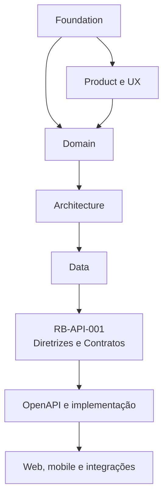
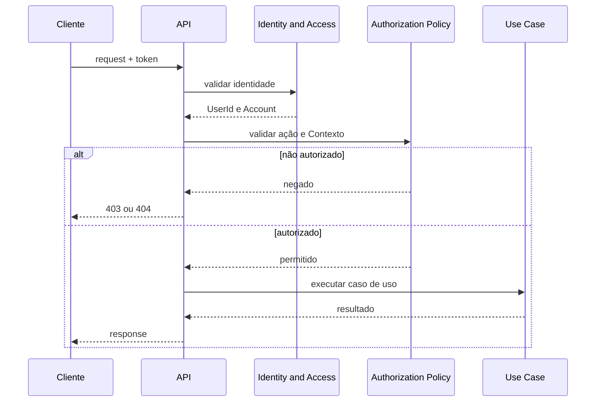
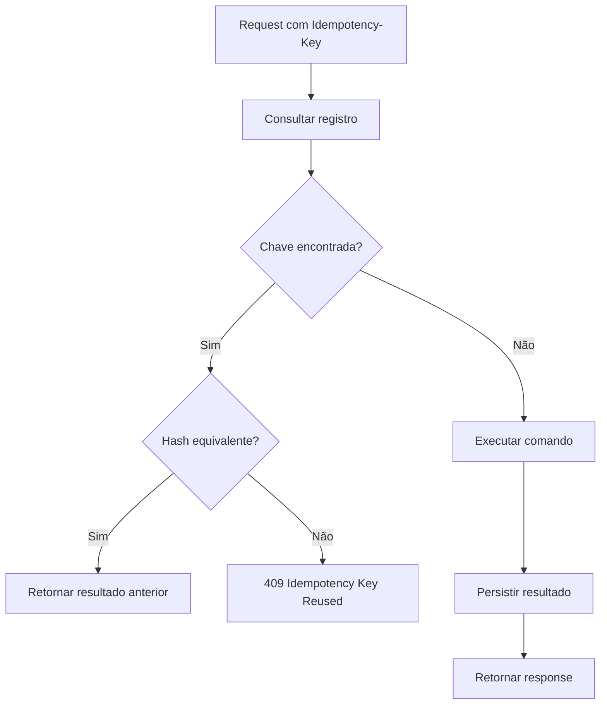
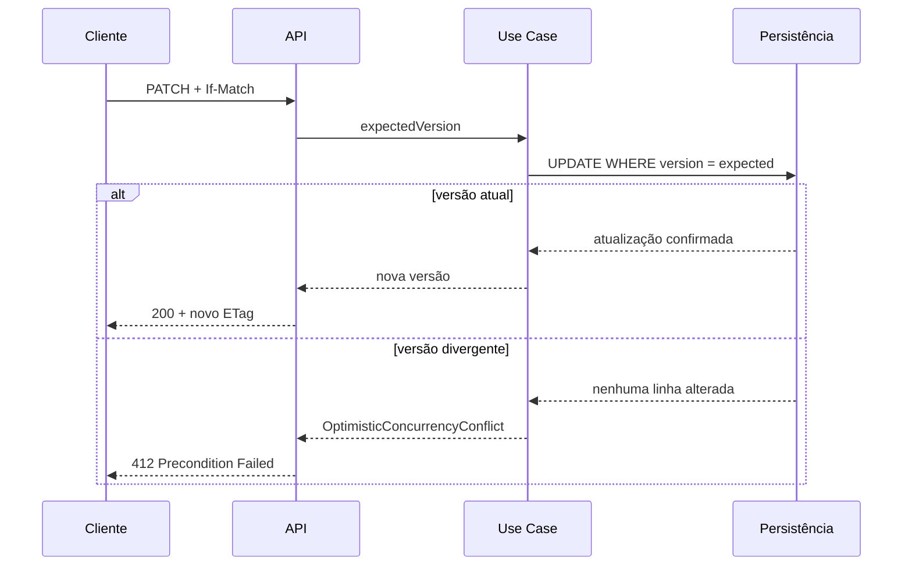
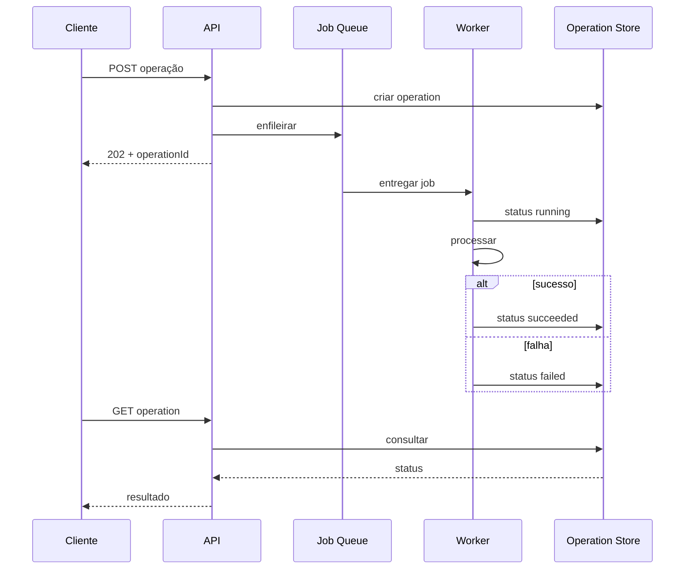
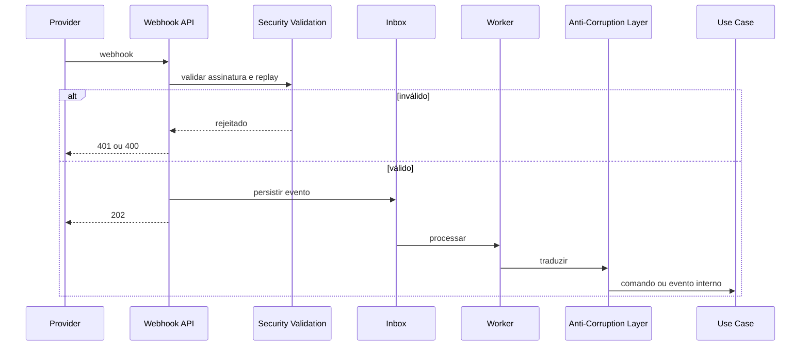
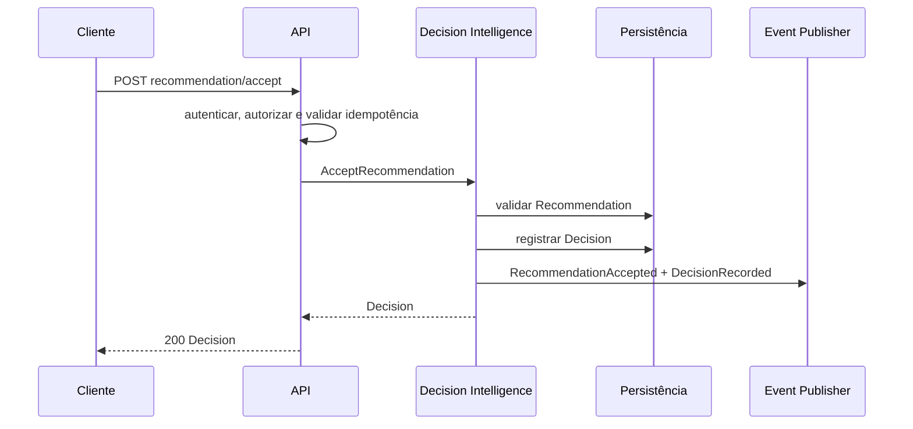
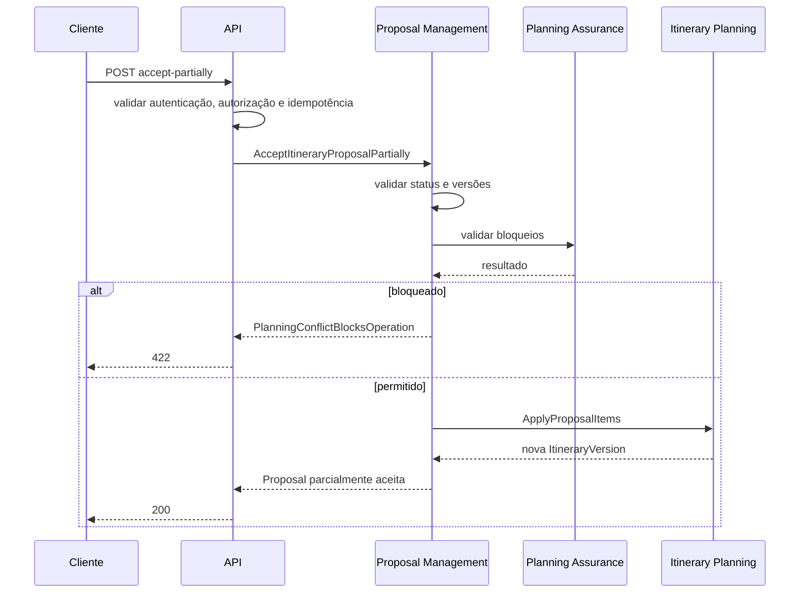
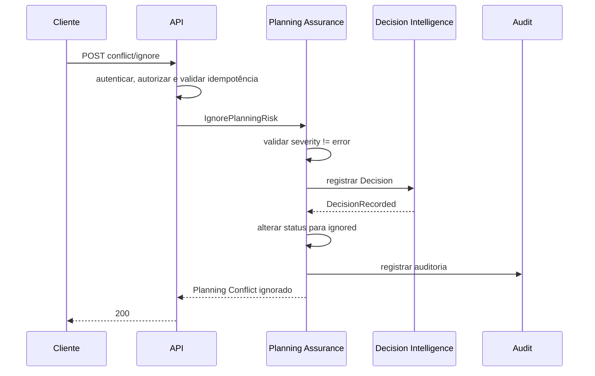

---

id: RB-API-001

title: Diretrizes e Contratos de API
description: Define as diretrizes oficiais de APIs do RouteBook, incluindo estilo REST, versionamento, autenticação, autorização, recursos, comandos, consultas, idempotência, concorrência, erros, paginação, operações assíncronas, webhooks, eventos, OpenAPI, segurança, observabilidade e testes de contrato.

document_type: api
owner: API

status: Draft
version: "0.1.0"

created: "2026-07-18"
last_updated: null

authors:

- RouteBook Team

tags:

- api
- rest
- contracts
- openapi
- versioning
- idempotency
- optimistic-concurrency
- authorization
- asynchronous-operations
- webhooks
- integration-events
- problem-details
- diagrams
- mermaid

related_documents:

- RB-CORE-0001
- RB-CORE-0002
- RB-CORE-0003
- RB-CORE-0004
- RB-PRD-001
- RB-PRD-002
- RB-PRD-003
- RB-PRD-004
- RB-PRD-005
- RB-PRD-006
- RB-PRD-007
- RB-PRD-008
- RB-DOM-001
- RB-DOM-002
- RB-DOM-003
- RB-DOM-004
- RB-ARC-001
- RB-ARC-002
- RB-ARC-003
- RB-ARC-004
- RB-ARC-005
- RB-DATA-001
- RB-DATA-002

prerequisites:

- RB-CORE-0004
- RB-DOM-001
- RB-DOM-002
- RB-DOM-003
- RB-DOM-004
- RB-ARC-001
- RB-ARC-002
- RB-ARC-003
- RB-ARC-004
- RB-ARC-005
- RB-DATA-001
- RB-DATA-002

next_documents:

- RB-SEC-001
- RB-OBS-001
- RB-QA-001
- RB-API-002
- RB-API-003

ai_context:
priority: critical
index: true
---

# RouteBook — Diretrizes e Contratos de API

## Parte I — Fundamentos

### 1. Propósito deste documento

Este documento define as diretrizes oficiais para o desenho, implementação, evolução e governança das APIs do RouteBook.

Seu objetivo é estabelecer:

* como capacidades do produto serão expostas;
* como recursos serão identificados;
* como comandos e consultas serão representados;
* como contratos serão versionados;
* como autenticação e autorização serão aplicadas;
* como idempotência será implementada;
* como concorrência será controlada;
* como erros serão estruturados;
* como paginação, filtros e ordenação funcionarão;
* como operações assíncronas serão representadas;
* como webhooks serão recebidos;
* como eventos de integração serão publicados;
* como contratos serão documentados;
* como compatibilidade será preservada;
* como APIs serão testadas;
* como segurança e observabilidade serão incorporadas.

Este documento deverá orientar:

* backend;
* frontend;
* integrações;
* arquitetura;
* segurança;
* QA;
* observabilidade;
* agentes de engenharia;
* geração de OpenAPI;
* testes de contrato;
* SDKs futuros;
* consumidores internos e externos.

Este documento não define:

* todos os endpoints finais do produto;
* todos os schemas de request e response;
* domínio público definitivo;
* fornecedor de API Gateway;
* política comercial de acesso;
* SDKs específicos;
* infraestrutura final de rate limiting;
* versão final da especificação OpenAPI;
* contratos de parceiros ainda inexistentes.

---

### 2. Autoridade documental

As APIs deverão representar o domínio e os casos de uso definidos anteriormente.



A API não poderá redefinir:

* ownership;
* conceitos;
* invariantes;
* identificadores canônicos;
* ciclos de vida;
* severidades;
* autorização;
* Eventos de Domínio;
* separação entre Recommendation, Decision e execução;
* separação entre Itinerary Proposal e Itinerary;
* separação entre Planning Conflict e erro técnico.

---

### 3. Princípio central

A API deverá expor capacidades do domínio, não detalhes da persistência.

A estrutura de tabelas não deverá determinar diretamente:

* recursos;
* rotas;
* payloads;
* operações;
* relações;
* nomes públicos.

---

### 4. Estilo inicial

A interface pública inicial deverá utilizar:

```text
HTTP
+ JSON
+ REST
+ OpenAPI
```

REST será utilizado para:

* recursos;
* consultas;
* comandos explícitos;
* operações assíncronas;
* integração com clientes web.

Eventos serão utilizados para comunicação assíncrona quando necessário.

---

### 5. Objetivos

A arquitetura de API deverá:

1. utilizar Linguagem Ubíqua;
2. manter contratos claros;
3. preservar ownership;
4. evitar CRUD genérico;
5. tornar comandos explícitos;
6. proteger ações críticas;
7. suportar idempotência;
8. suportar concorrência;
9. fornecer erros previsíveis;
10. permitir evolução compatível;
11. minimizar exposição de dados;
12. permitir observabilidade;
13. permitir testes automatizados;
14. suportar processamento assíncrono;
15. evitar dependência de implementação interna.

---

## Parte II — Escopo das APIs

### 6. API externa

A API externa é consumida por:

* aplicação web;
* aplicações móveis futuras;
* parceiros autorizados;
* automações autorizadas;
* SDKs futuros.

Deverá possuir contrato estável e documentado.

---

### 7. API interna de módulo

A API interna de módulo representa contratos entre módulos do Monólito Modular.

Pode utilizar:

* comandos internos;
* consultas;
* interfaces;
* DTOs;
* Eventos;
* chamadas em processo.

Não precisa ser exposta por HTTP.

---

### 8. API administrativa

Operações administrativas deverão possuir:

* superfície separada;
* autorização específica;
* auditoria;
* menor privilégio;
* documentação restrita.

---

### 9. API de integração

Integrações externas poderão utilizar:

* endpoints REST;
* webhooks;
* eventos;
* importação em lote;
* jobs.

---

### 10. API de leitura

Read models poderão ser expostos por endpoints otimizados para interface.

Eles não deverão aceitar escrita canônica.

---

## Parte III — Convenções gerais

### 11. Base path

A API pública deverá utilizar versão no caminho:

```text
/api/v1
```

Exemplo:

```text
GET /api/v1/trips
```

---

### 12. Formato

O formato padrão será:

```text
application/json
```

Uploads e downloads poderão utilizar tipos específicos.

---

### 13. Codificação

Utilizar:

```text
UTF-8
```

---

### 14. Datas e horários

Instantes globais deverão utilizar ISO 8601 com fuso.

Exemplo:

```text
2026-07-18T18:30:00-03:00
```

Datas locais:

```text
2026-08-22
```

Horários locais:

```text
14:30:00
```

O fuso da Trip deverá ser representado separadamente quando necessário.

---

### 15. Idioma

Textos controlados da API deverão utilizar códigos estáveis.

Textos apresentados ao Usuário poderão respeitar locale.

---

### 16. Identificadores

Identificadores deverão ser enviados como strings opacas.

Exemplo:

```json
{
  "tripId": "0190c6c2-5ff8-7a4f-85fd-9dcbbfa54ed2"
}
```

Clientes não deverão inferir significado estrutural do ID.

---

### 17. Nomes de campos

Payloads JSON deverão utilizar:

```text
camelCase
```

Exemplos:

```text
tripId
itineraryVersion
planningConflictId
```

---

### 18. Nomes canônicos

Utilizar:

```text
itineraryProposalId
planningConflictId
recommendationId
activityId
```

Formas abreviadas como `proposalId` e `conflictId` poderão ser utilizadas em parâmetros de rota quando o Contexto for inequívoco.

---

### 19. Campos desconhecidos

Requests com campos desconhecidos deverão ser rejeitados quando o contrato for estrito.

Responses poderão adicionar campos compatíveis sem quebrar consumidores, desde que clientes sejam orientados a ignorar campos desconhecidos.

---

### 20. Null

Campos opcionais poderão:

* ser omitidos; ou
* receber `null`;

a convenção deverá ser consistente por contrato.

Preferência inicial:

* omitir quando não aplicável;
* utilizar `null` quando o campo existe, mas o valor é desconhecido.

---

## Parte IV — Recursos

### 21. Recursos principais

Recursos públicos iniciais:

```text
accounts
users
trips
travelers
places
saved-places
itineraries
activities
free-periods
travel-estimates
recommendations
decisions
itinerary-proposals
planning-conflicts
operations
```

---

### 22. Rotas orientadas a recursos

Preferir:

```text
GET /trips/{tripId}
GET /trips/{tripId}/itinerary
GET /trips/{tripId}/saved-places
```

Evitar:

```text
GET /getTrip
POST /createTrip
POST /updateTrip
```

---

### 23. Sub-recursos

Sub-recursos devem representar relação e escopo.

Exemplos:

```text
/trips/{tripId}/travelers
/trips/{tripId}/itinerary/days
/trips/{tripId}/recommendations
```

---

### 24. Profundidade

Evitar rotas excessivamente profundas.

Preferir:

```text
PATCH /activities/{activityId}
```

em vez de:

```text
PATCH /accounts/{accountId}/trips/{tripId}/itineraries/{itineraryId}/days/{tripDayId}/activities/{activityId}
```

O escopo de autorização continuará sendo validado internamente.

---

### 25. Coleções

Coleções deverão utilizar plural.

---

### 26. Recursos atuais

Quando existir um único recurso canônico atual, utilizar rota singular contextual.

Exemplo:

```text
GET /trips/{tripId}/itinerary
```

e não obrigatoriamente:

```text
GET /trips/{tripId}/itineraries/{itineraryId}
```

---

## Parte V — Métodos HTTP

### 27. GET

Utilizado para leitura.

Deverá:

* ser seguro;
* ser idempotente;
* não alterar estado canônico;
* permitir cache quando apropriado.

---

### 28. POST

Utilizado para:

* criação;
* comandos;
* operações não naturalmente idempotentes;
* ações explícitas;
* início de processamento assíncrono.

---

### 29. PUT

Utilizado somente quando o cliente substituir uma representação completa e possuir semântica clara.

Não deverá ser utilizado como padrão para atualizações parciais.

---

### 30. PATCH

Utilizado para alterações parciais de recurso.

O payload deverá representar campos permitidos, não operações arbitrárias.

---

### 31. DELETE

Utilizado para solicitar remoção de um recurso.

A resposta deverá refletir:

* remoção imediata;
* remoção lógica;
* operação assíncrona;
* impossibilidade.

---

### 32. Comandos explícitos

Operações de domínio que não representem CRUD deverão utilizar sub-recurso de ação.

Exemplos:

```text
POST /trips/{tripId}/archive
POST /recommendations/{recommendationId}/accept
POST /trips/{tripId}/conflicts/{conflictId}/ignore
POST /trips/{tripId}/itinerary/proposals/{proposalId}/accept
```

---

## Parte VI — Comandos e consultas

### 33. Separação conceitual

A API deverá distinguir:

* consultas;
* criação de recursos;
* atualização;
* comandos de domínio;
* operações assíncronas.

---

### 34. Consultas

Consultas não deverão alterar estado canônico.

Exemplos:

```text
GET /trips/{tripId}
GET /trips/{tripId}/itinerary
GET /trips/{tripId}/planning-conflicts
```

---

### 35. Comandos

Comandos deverão representar intenção.

Exemplos:

```text
POST /recommendations/{recommendationId}/accept
POST /trips/{tripId}/itinerary/proposals/{proposalId}/accept
POST /trips/{tripId}/conflicts/{conflictId}/ignore
```

---

### 36. Comando versus PATCH

Utilizar PATCH para mudança direta de atributos.

Utilizar comando quando houver:

* regra;
* transição;
* auditoria especial;
* múltiplos efeitos;
* intenção explícita;
* autorização diferenciada.

---

### 37. Exemplo

Atualizar nome:

```text
PATCH /trips/{tripId}
```

Arquivar Trip:

```text
POST /trips/{tripId}/archive
```

---

## Parte VII — Rotas principais

### 38. Trips

```text
GET    /api/v1/trips
POST   /api/v1/trips
GET    /api/v1/trips/{tripId}
PATCH  /api/v1/trips/{tripId}
DELETE /api/v1/trips/{tripId}

POST   /api/v1/trips/{tripId}/cancel
POST   /api/v1/trips/{tripId}/archive
POST   /api/v1/trips/{tripId}/restore
```

---

### 39. Participantes

```text
GET    /api/v1/trips/{tripId}/participants
POST   /api/v1/trips/{tripId}/participants
PATCH  /api/v1/trips/{tripId}/participants/{participantId}
DELETE /api/v1/trips/{tripId}/participants/{participantId}

POST   /api/v1/trips/{tripId}/ownership-transfer
```

---

### 40. Traveler Profile

```text
GET    /api/v1/trips/{tripId}/traveler-profile
PATCH  /api/v1/trips/{tripId}/traveler-profile

GET    /api/v1/trips/{tripId}/travelers
POST   /api/v1/trips/{tripId}/travelers
GET    /api/v1/trips/{tripId}/travelers/{travelerId}
PATCH  /api/v1/trips/{tripId}/travelers/{travelerId}
DELETE /api/v1/trips/{tripId}/travelers/{travelerId}
```

---

### 41. Interests e Restrictions

```text
GET    /api/v1/trips/{tripId}/interests
POST   /api/v1/trips/{tripId}/interests
DELETE /api/v1/trips/{tripId}/interests/{interestId}

GET    /api/v1/trips/{tripId}/restrictions
POST   /api/v1/trips/{tripId}/restrictions
PATCH  /api/v1/trips/{tripId}/restrictions/{restrictionId}
DELETE /api/v1/trips/{tripId}/restrictions/{restrictionId}
```

---

### 42. Places

```text
GET  /api/v1/places
GET  /api/v1/places/{placeId}
POST /api/v1/places
```

Criação pública de Place deverá representar Place personalizado e permanecer controlada.

---

### 43. Saved Places

```text
GET    /api/v1/trips/{tripId}/saved-places
POST   /api/v1/trips/{tripId}/saved-places
GET    /api/v1/trips/{tripId}/saved-places/{savedPlaceId}
PATCH  /api/v1/trips/{tripId}/saved-places/{savedPlaceId}
DELETE /api/v1/trips/{tripId}/saved-places/{savedPlaceId}
```

---

### 44. Itinerary

```text
GET   /api/v1/trips/{tripId}/itinerary
PATCH /api/v1/trips/{tripId}/itinerary
```

---

### 45. Trip Days

```text
GET   /api/v1/trips/{tripId}/itinerary/days
GET   /api/v1/trips/{tripId}/itinerary/days/{tripDayId}
PATCH /api/v1/trips/{tripId}/itinerary/days/{tripDayId}

POST  /api/v1/trips/{tripId}/itinerary/days/{tripDayId}/mark-free
```

---

### 46. Activities

```text
POST   /api/v1/trips/{tripId}/activities
GET    /api/v1/activities/{activityId}
PATCH  /api/v1/activities/{activityId}
DELETE /api/v1/activities/{activityId}

POST   /api/v1/activities/{activityId}/move
POST   /api/v1/activities/{activityId}/reorder
POST   /api/v1/activities/{activityId}/complete
POST   /api/v1/activities/{activityId}/skip
POST   /api/v1/activities/{activityId}/cancel
```

Rota canônica para movimento:

```text
POST /trips/{tripId}/activities/{activityId}/move
```

Também poderá ser exposta em formato global se a autorização continuar contextual.

---

### 47. Free Periods

```text
POST   /api/v1/trips/{tripId}/free-periods
GET    /api/v1/free-periods/{freePeriodId}
PATCH  /api/v1/free-periods/{freePeriodId}
DELETE /api/v1/free-periods/{freePeriodId}

POST   /api/v1/free-periods/{freePeriodId}/protect
POST   /api/v1/free-periods/{freePeriodId}/make-flexible
```

---

### 48. Mobility

```text
POST /api/v1/trips/{tripId}/travel-estimates
GET  /api/v1/travel-estimates/{travelEstimateId}
POST /api/v1/travel-estimates/{travelEstimateId}/refresh
```

---

### 49. Recommendations

```text
GET  /api/v1/trips/{tripId}/recommendations
POST /api/v1/trips/{tripId}/recommendations
GET  /api/v1/recommendations/{recommendationId}

POST /api/v1/recommendations/{recommendationId}/accept
POST /api/v1/recommendations/{recommendationId}/reject
POST /api/v1/recommendations/{recommendationId}/dismiss
```

---

### 50. Decisions

```text
GET  /api/v1/trips/{tripId}/decisions
GET  /api/v1/decisions/{decisionId}
POST /api/v1/decisions
POST /api/v1/decisions/{decisionId}/execute
```

A execução deverá ser exposta somente quando aplicável.

---

### 51. Itinerary Proposals

Rotas canônicas:

```text
GET  /api/v1/trips/{tripId}/itinerary/proposals
POST /api/v1/trips/{tripId}/itinerary/proposals
GET  /api/v1/trips/{tripId}/itinerary/proposals/{proposalId}

POST /api/v1/trips/{tripId}/itinerary/proposals/{proposalId}/accept
POST /api/v1/trips/{tripId}/itinerary/proposals/{proposalId}/accept-partially
POST /api/v1/trips/{tripId}/itinerary/proposals/{proposalId}/reject
POST /api/v1/trips/{tripId}/itinerary/proposals/{proposalId}/regenerate
POST /api/v1/trips/{tripId}/itinerary/proposals/{proposalId}/cancel
```

---

### 52. Planning Conflicts

Rotas canônicas:

```text
GET /api/v1/trips/{tripId}/conflicts
GET /api/v1/trips/{tripId}/conflicts/{conflictId}

POST /api/v1/trips/{tripId}/conflicts/{conflictId}/resolve
POST /api/v1/trips/{tripId}/conflicts/{conflictId}/ignore
POST /api/v1/trips/{tripId}/conflicts/{conflictId}/restore
```

O recurso poderá ser documentado publicamente como `planning-conflicts`, mas as rotas canônicas abreviadas deverão permanecer inequívocas.

---

## Parte VIII — Requests

### 53. Requests de criação

Deverão conter somente dados necessários à criação.

Exemplo:

```json
{
  "name": "Viagem para Pipa",
  "destination": {
    "name": "Pipa",
    "city": "Tibau do Sul",
    "region": "Rio Grande do Norte",
    "countryCode": "BR",
    "timeZone": "America/Fortaleza"
  },
  "period": {
    "startDate": "2026-08-22",
    "endDate": "2026-08-29"
  }
}
```

---

### 54. Requests de atualização

Deverão permitir apenas campos alteráveis.

Exemplo:

```json
{
  "name": "Pipa 2026",
  "expectedVersion": 4
}
```

---

### 55. Requests de comando

Deverão representar intenção.

Exemplo de movimento:

```json
{
  "targetTripDayId": "0190c6f0-669d-7d68-9ae0-491d7a053c92",
  "targetOrder": 3,
  "expectedItineraryVersion": 12
}
```

---

### 56. Dados adicionais

Requests não deverão aceitar campos de auditoria controlados pelo servidor, como:

```text
createdAt
updatedAt
createdBy
aggregateVersion
```

exceto campos de concorrência explicitamente permitidos.

---

### 57. Validação

A validação deverá ocorrer em camadas:

1. sintaxe;
2. schema;
3. tipos;
4. formato;
5. autorização;
6. referências;
7. domínio;
8. concorrência;
9. idempotência.

---

## Parte IX — Responses

### 58. Representação de recurso

Exemplo:

```json
{
  "tripId": "0190c6c2-5ff8-7a4f-85fd-9dcbbfa54ed2",
  "name": "Viagem para Pipa",
  "status": "planning",
  "period": {
    "startDate": "2026-08-22",
    "endDate": "2026-08-29"
  },
  "destination": {
    "name": "Pipa",
    "city": "Tibau do Sul",
    "region": "Rio Grande do Norte",
    "countryCode": "BR",
    "timeZone": "America/Fortaleza"
  },
  "tripContextVersion": 3,
  "aggregateVersion": 5,
  "createdAt": "2026-07-18T19:00:00-03:00",
  "updatedAt": "2026-07-18T19:15:00-03:00"
}
```

---

### 59. Envelopes

Recursos únicos não deverão exigir envelope genérico desnecessário.

Preferir:

```json
{
  "tripId": "..."
}
```

em vez de:

```json
{
  "data": {
    "tripId": "..."
  }
}
```

Coleções poderão utilizar envelope para paginação.

---

### 60. Coleções

Exemplo:

```json
{
  "items": [],
  "page": {
    "nextCursor": null,
    "hasMore": false
  }
}
```

---

### 61. Metadados

Metadados deverão ser adicionados somente quando necessários.

---

### 62. Links

Hypermedia completa não será obrigatória inicialmente.

Links úteis poderão ser adicionados de forma seletiva.

---

## Parte X — Status HTTP

### 63. Sucesso

| Status           | Uso                                       |
| ---------------- | ----------------------------------------- |
| `200 OK`         | leitura ou comando com resultado imediato |
| `201 Created`    | recurso criado                            |
| `202 Accepted`   | processamento assíncrono iniciado         |
| `204 No Content` | sucesso sem representação                 |

---

### 64. Redirecionamento

Não deverá ser utilizado para lógica de domínio.

---

### 65. Erros do cliente

| Status                      | Uso                                              |
| --------------------------- | ------------------------------------------------ |
| `400 Bad Request`           | request malformado                               |
| `401 Unauthorized`          | autenticação ausente ou inválida                 |
| `403 Forbidden`             | autorização negada                               |
| `404 Not Found`             | recurso inexistente ou não visível               |
| `409 Conflict`              | conflito de estado, idempotência ou concorrência |
| `410 Gone`                  | recurso removido ou expirado de forma definitiva |
| `412 Precondition Failed`   | versão ou ETag divergente                        |
| `422 Unprocessable Content` | regra ou validação semântica                     |
| `429 Too Many Requests`     | limite excedido                                  |

---

### 66. Erros do servidor

| Status                      | Uso                     |
| --------------------------- | ----------------------- |
| `500 Internal Server Error` | falha não prevista      |
| `502 Bad Gateway`           | falha de Provider       |
| `503 Service Unavailable`   | capacidade indisponível |
| `504 Gateway Timeout`       | timeout externo         |

---

### 67. Não revelar existência

Em certos casos de autorização, `404` poderá ser retornado em vez de `403` para evitar exposição de existência.

---

## Parte XI — Modelo de erro

### 68. Formato padrão

A API deverá utilizar estrutura compatível com Problem Details.

Exemplo:

```json
{
  "type": "https://routebook.dev/problems/itinerary-version-conflict",
  "title": "A versão do roteiro está desatualizada",
  "status": 412,
  "code": "ITINERARY_VERSION_CONFLICT",
  "detail": "O roteiro foi alterado desde a última leitura.",
  "instance": "/api/v1/trips/abc/activities/def/move",
  "correlationId": "0190c701-b758-7f1d-ae1b-66717c9ec309",
  "errors": [
    {
      "field": "expectedItineraryVersion",
      "code": "VERSION_MISMATCH",
      "message": "Esperado 12, versão atual 13."
    }
  ]
}
```

---

### 69. Campos

| Campo           | Obrigatório |
| --------------- | ----------- |
| `type`          | sim         |
| `title`         | sim         |
| `status`        | sim         |
| `code`          | sim         |
| `detail`        | não         |
| `instance`      | não         |
| `correlationId` | sim         |
| `errors`        | não         |

---

### 70. Códigos de erro

Códigos deverão ser:

* estáveis;
* legíveis;
* específicos;
* independentes de mensagem localizada.

Exemplos:

```text
TRIP_NOT_FOUND
TRIP_NOT_PLANNABLE
ITINERARY_VERSION_CONFLICT
PLANNING_CONFLICT_BLOCKS_OPERATION
RECOMMENDATION_EXPIRED
ITINERARY_PROPOSAL_NOT_APPLICABLE
IDEMPOTENCY_KEY_REUSED
```

---

### 71. Erro de campo

Exemplo:

```json
{
  "field": "period.endDate",
  "code": "END_DATE_BEFORE_START_DATE",
  "message": "A data final deve ser igual ou posterior à data inicial."
}
```

---

### 72. Mensagens

Mensagens deverão:

* ser claras;
* não revelar detalhes internos;
* não expor stack trace;
* não expor SQL;
* não expor secrets;
* poder ser localizadas.

---

## Parte XII — Autenticação

### 73. Princípio

A API deverá validar identidade por mecanismo externo controlado por Identity and Access.

---

### 74. Token

O cliente poderá utilizar:

```text
Authorization: Bearer <token>
```

---

### 75. Validação

A API deverá validar:

* assinatura;
* emissor;
* audiência;
* expiração;
* subject;
* status da identidade;
* claims necessários.

---

### 76. Identidade externa

O subject externo deverá ser convertido em `UserId` interno.

---

### 77. Sessão

Sessões e tokens poderão ser revogados conforme a política de Identity and Access.

---

### 78. Credenciais técnicas

Integrações poderão utilizar credenciais próprias e escopos específicos.

---

## Parte XIII — Autorização

### 79. Camadas

A autorização deverá considerar:

1. identidade;
2. Account;
3. Trip;
4. papel;
5. ação;
6. propriedade do recurso;
7. Contexto;
8. delegação;
9. risco.

---

### 80. Trip Roles

Papéis iniciais:

```text
owner
editor
viewer
```

---

### 81. Autorização no servidor

A interface não será autoridade.

Todo endpoint deverá validar autorização no servidor.

---

### 82. Agentes

Ações por agente deverão registrar:

* actorType;
* delegatedBy;
* authorizationReference;
* escopo.

---

### 83. Fluxo de autorização



---

## Parte XIV — Idempotência

### 84. Header

Operações que exigem idempotência deverão aceitar:

```text
Idempotency-Key
```

---

### 85. Operações prioritárias

* criação de Trip;
* Save Place;
* Add Activity;
* Accept Recommendation;
* Accept Itinerary Proposal;
* Accept Itinerary Proposal Partially;
* Ignore Planning Risk;
* operações de webhook;
* operações assíncronas.

---

### 86. Escopo

A chave será interpretada por:

* Account;
* User ou ator;
* operação;
* recurso;
* rota.

---

### 87. Repetição

Mesma chave e mesmo request deverão retornar resultado equivalente.

---

### 88. Divergência

Mesma chave com request diferente deverá retornar:

```text
409 Conflict
IDEMPOTENCY_KEY_REUSED
```

---

### 89. Response

O servidor poderá retornar:

```text
Idempotency-Replayed: true
```

quando a resposta for recuperada de execução anterior.

---

### 90. Fluxo de idempotência



---

## Parte XV — Concorrência otimista

### 91. Objetivo

Evitar sobrescrita silenciosa em alterações concorrentes.

---

### 92. ETag

Recursos versionados poderão retornar:

```text
ETag: "itinerary-13"
```

---

### 93. If-Match

Atualizações poderão exigir:

```text
If-Match: "itinerary-13"
```

---

### 94. expectedVersion

Comandos também poderão receber versão no payload.

Exemplo:

```json
{
  "expectedItineraryVersion": 13
}
```

---

### 95. Divergência

Resposta recomendada:

```text
412 Precondition Failed
```

Código:

```text
ITINERARY_VERSION_CONFLICT
```

---

### 96. Recursos prioritários

* Trip;
* Traveler Profile;
* Itinerary;
* Recommendation;
* Decision;
* Itinerary Proposal;
* Planning Conflict.

---

### 97. Fluxo de concorrência



---

## Parte XVI — Paginação

### 98. Estratégia

Cursor pagination será preferida para coleções extensas ou mutáveis.

---

### 99. Parâmetros

```text
limit
cursor
```

---

### 100. Limites

O servidor deverá definir:

* valor padrão;
* máximo;
* mínimo.

---

### 101. Response

```json
{
  "items": [],
  "page": {
    "nextCursor": "opaque-cursor",
    "hasMore": true
  }
}
```

---

### 102. Cursor opaco

O cliente não deverá interpretar o cursor.

---

### 103. Offset

Paginação por offset poderá ser utilizada em coleções pequenas e estáveis.

---

## Parte XVII — Filtros e ordenação

### 104. Filtros

Exemplos:

```text
GET /places?category=restaurant
GET /trips?status=planning
GET /planning-conflicts?severity=error
```

---

### 105. Múltiplos valores

A convenção deverá ser documentada.

Exemplo:

```text
status=planning,active
```

---

### 106. Ordenação

Parâmetro:

```text
sort
```

Exemplo:

```text
sort=-createdAt,name
```

---

### 107. Campos permitidos

Somente campos documentados poderão ser utilizados.

---

### 108. Busca

Busca textual poderá utilizar:

```text
q
```

Exemplo:

```text
GET /places?q=restaurante
```

---

### 109. Geofiltros

Exemplos:

```text
latitude
longitude
radiusMeters
```

As coordenadas deverão ser validadas e protegidas.

---

## Parte XVIII — Expansão de recursos

### 110. Expansão

Relacionamentos poderão ser incluídos seletivamente por:

```text
include
```

Exemplo:

```text
GET /trips/{tripId}?include=destination,accommodation
```

---

### 111. Limite

Expansões profundas deverão ser evitadas.

---

### 112. Campos

Seleção de campos poderá ser introduzida futuramente.

Não será obrigatória inicialmente.

---

## Parte XIX — Operações assíncronas

### 113. Quando utilizar

Operações assíncronas serão adequadas para:

* geração de Itinerary Proposal;
* geração complexa de Recommendation;
* importação;
* recálculo amplo de Travel Estimates;
* exportação;
* exclusão ampla;
* processamento de arquivos.

---

### 114. Resposta inicial

Resposta:

```text
202 Accepted
```

Com:

```json
{
  "operationId": "0190c70e-48cf-7db8-bd83-8dbdd0f3468b",
  "status": "pending",
  "resourceType": "itineraryProposal",
  "resourceId": null,
  "createdAt": "2026-07-18T20:00:00-03:00"
}
```

Header opcional:

```text
Location: /api/v1/operations/{operationId}
```

---

### 115. Consulta da operação

```text
GET /api/v1/operations/{operationId}
```

---

### 116. Estados

```text
pending
running
succeeded
failed
cancelled
expired
```

---

### 117. Response concluída

```json
{
  "operationId": "...",
  "status": "succeeded",
  "resourceType": "itineraryProposal",
  "resourceId": "...",
  "completedAt": "2026-07-18T20:00:12-03:00"
}
```

---

### 118. Falha

```json
{
  "operationId": "...",
  "status": "failed",
  "error": {
    "code": "AI_PROVIDER_UNAVAILABLE",
    "title": "Não foi possível gerar a proposta."
  }
}
```

---

### 119. Fluxo assíncrono



---

## Parte XX — Webhooks recebidos

### 120. Uso

Webhooks poderão ser recebidos de:

* identidade;
* notificações;
* processamento externo;
* integrações futuras;
* reservas futuras;
* pagamentos futuros.

---

### 121. Endpoints

Exemplo:

```text
POST /api/v1/webhooks/{provider}
```

Rotas específicas poderão ser preferidas quando houver contratos diferentes.

---

### 122. Segurança

Webhooks deverão validar:

* assinatura;
* timestamp;
* segredo;
* replay;
* origem;
* schema;
* tamanho.

---

### 123. Confirmação

O endpoint deverá responder rapidamente após persistir o recebimento.

Processamento complexo deverá ser assíncrono.

---

### 124. Idempotência

O evento externo deverá ser deduplicado por:

* Provider;
* eventId externo;
* tipo;
* timestamp quando necessário.

---

### 125. ACL

O payload deverá passar por Anti-Corruption Layer antes de produzir comandos ou eventos internos.

---

### 126. Fluxo de webhook



---

## Parte XXI — Eventos de integração

### 127. Uso

Eventos de integração poderão ser publicados para:

* serviços futuros;
* parceiros;
* workers;
* analytics autorizados;
* notificações;
* projeções.

---

### 128. Envelope

Exemplo:

```json
{
  "eventId": "0190c72f-cd3d-7564-91bc-f174ca3a57fc",
  "eventType": "ItineraryProposalAccepted",
  "schemaVersion": 1,
  "occurredAt": "2026-07-18T20:30:00-03:00",
  "aggregateType": "ItineraryProposal",
  "aggregateId": "0190c72f-cd3d-7564-91bc-f174ca3a57fc",
  "aggregateVersion": 5,
  "correlationId": "0190c730-55e4-72c3-a789-37e66ad2aa5c",
  "causationId": "0190c730-6833-7aa8-85b1-e0a1fd6f005e",
  "data": {}
}
```

---

### 129. Dados

O payload deverá ser:

* mínimo;
* versionado;
* estável;
* sem detalhes internos;
* sem dados pessoais desnecessários.

---

### 130. Evolução

Mudanças compatíveis poderão adicionar campos opcionais.

Mudanças incompatíveis exigem nova `schemaVersion` ou novo tipo de evento.

---

### 131. Entrega

Consumidores deverão assumir possibilidade de duplicidade.

---

## Parte XXII — OpenAPI

### 132. Fonte canônica

A especificação OpenAPI deverá ser tratada como contrato oficial executável.

---

### 133. Estratégia

Poderá ser:

* design-first;
* code-first;
* híbrida.

A estratégia definitiva deverá ser registrada por ADR.

---

### 134. Conteúdo mínimo

OpenAPI deverá documentar:

* rotas;
* parâmetros;
* requests;
* responses;
* erros;
* autenticação;
* headers;
* exemplos;
* paginação;
* idempotência;
* concorrência;
* depreciação.

---

### 135. Schemas reutilizáveis

Schemas comuns poderão incluir:

```text
ProblemDetails
Pagination
Money
GeoCoordinate
Operation
ActorReference
```

---

### 136. Geração de cliente

SDKs gerados deverão ser tratados como artefatos derivados.

---

### 137. Validação

O contrato OpenAPI deverá ser validado no pipeline.

---

## Parte XXIII — Versionamento

### 138. Versão principal

A versão principal será exposta no caminho:

```text
/api/v1
```

---

### 139. Mudança compatível

Exemplos:

* adicionar campo opcional;
* adicionar endpoint;
* adicionar enum somente quando consumidores tolerarem;
* adicionar filtro;
* adicionar novo tipo de erro específico sem alterar status esperado.

---

### 140. Mudança incompatível

Exemplos:

* remover campo;
* renomear campo;
* alterar tipo;
* alterar semântica;
* tornar campo opcional obrigatório;
* alterar status HTTP;
* alterar estrutura de erro;
* remover valor de enum.

---

### 141. Nova versão principal

Mudança incompatível poderá exigir:

```text
/api/v2
```

---

### 142. Versionamento interno

Contratos internos deverão possuir estratégia própria e não depender apenas da versão HTTP.

---

## Parte XXIV — Compatibilidade

### 143. Tolerância de leitura

Clientes deverão ignorar campos de response desconhecidos.

---

### 144. Requests estritos

Requests deverão rejeitar campos desconhecidos quando isso reduzir ambiguidade e risco.

---

### 145. Enums

Adicionar valor de enum pode quebrar clientes não preparados.

Consumidores deverão prever valor desconhecido quando apropriado.

---

### 146. Defaults

Defaults não deverão alterar silenciosamente sem avaliação de compatibilidade.

---

### 147. Campos obrigatórios

Novos campos obrigatórios em request configuram quebra.

---

## Parte XXV — Depreciação

### 148. Processo

Depreciação deverá incluir:

1. identificação;
2. aviso;
3. alternativa;
4. prazo;
5. telemetria;
6. comunicação;
7. remoção em versão compatível.

---

### 149. Headers

Poderão ser utilizados:

```text
Deprecation
Sunset
Link
```

---

### 150. Documentação

A documentação deverá indicar:

* endpoint depreciado;
* data;
* substituto;
* impacto.

---

### 151. Telemetria

Uso do endpoint depreciado deverá ser observado.

---

## Parte XXVI — Rate limiting

### 152. Objetivo

Proteger:

* disponibilidade;
* custos;
* IA;
* fornecedores;
* recursos compartilhados.

---

### 153. Escopo

Limites poderão ser definidos por:

* IP;
* User;
* Account;
* rota;
* capacidade;
* Provider.

---

### 154. Response

Status:

```text
429 Too Many Requests
```

Headers poderão incluir:

```text
Retry-After
RateLimit-Limit
RateLimit-Remaining
RateLimit-Reset
```

---

### 155. Ações críticas

Rate limiting não substitui autorização e idempotência.

---

## Parte XXVII — Cache HTTP

### 156. GET

GET poderá utilizar cache quando seguro.

---

### 157. Headers

Possíveis headers:

```text
Cache-Control
ETag
Last-Modified
If-None-Match
```

---

### 158. Dados pessoais

Responses personalizados deverão ser privados.

Exemplo:

```text
Cache-Control: private, no-store
```

quando necessário.

---

### 159. Read models

Read models públicos ou pouco sensíveis poderão utilizar cache controlado.

---

## Parte XXVIII — Segurança

### 160. TLS

Toda comunicação deverá utilizar HTTPS.

---

### 161. CORS

CORS deverá permitir apenas origens autorizadas.

---

### 162. CSRF

Quando autenticação utilizar cookies, proteção contra CSRF deverá ser aplicada.

---

### 163. Mass assignment

Requests deverão ser mapeados para DTOs explícitos.

Não mapear payload diretamente para entidades ou ORM.

---

### 164. Injection

Todos os inputs deverão ser validados e parametrizados.

---

### 165. URLs

URLs fornecidas por clientes deverão ser validadas contra SSRF e esquemas não permitidos.

---

### 166. Tamanho

Limites deverão existir para:

* body;
* arquivos;
* strings;
* coleções;
* filtros;
* paginação.

---

### 167. Dados sensíveis

Responses não deverão incluir:

* tokens;
* secrets;
* prompts internos;
* dados de outras Accounts;
* dados pessoais desnecessários;
* stack traces.

---

### 168. Ações críticas

Ações como:

* exclusão;
* transferência de ownership;
* aceite de risco;
* exportação;
* alteração de consentimento;

deverão possuir controles adicionais.

---

## Parte XXIX — Observabilidade

### 169. Correlation ID

Toda requisição deverá possuir ou receber:

```text
X-Correlation-Id
```

O servidor poderá substituir valores inválidos.

---

### 170. Request ID

Cada request deverá possuir identificador próprio.

---

### 171. Headers de response

Poderão incluir:

```text
X-Request-Id
X-Correlation-Id
```

---

### 172. Logs

Registrar:

* método;
* rota normalizada;
* status;
* duração;
* User ou ator pseudonimizado;
* Account;
* Trip quando seguro;
* código de erro;
* correlationId;
* versão da API.

---

### 173. Não registrar

* token;
* senha;
* body completo;
* dados pessoais;
* coordenadas precisas;
* secrets;
* payload de webhook integral.

---

### 174. Métricas

* volume;
* latência;
* status;
* erro;
* rota;
* idempotency replay;
* conflito de versão;
* rate limit;
* operação assíncrona;
* Provider failure.

---

### 175. Tracing

Tracing deverá atravessar:

* API;
* Use Case;
* módulo;
* persistência;
* Eventos;
* integrações;
* workers.

---

## Parte XXX — Testes

### 176. Testes de contrato

Deverão validar:

* request;
* response;
* status;
* headers;
* erros;
* autenticação;
* autorização;
* paginação;
* idempotência;
* concorrência.

---

### 177. Testes OpenAPI

Deverão verificar:

* compatibilidade;
* schemas;
* exemplos;
* rotas;
* respostas não documentadas;
* campos obrigatórios.

---

### 178. Consumer-driven contracts

Poderão ser utilizados para consumidores relevantes.

---

### 179. Testes de autorização

Cenários:

* owner;
* editor;
* viewer;
* User de outra Account;
* recurso inexistente;
* agente delegado;
* credencial expirada.

---

### 180. Testes de idempotência

* primeira execução;
* replay;
* payload divergente;
* concorrência com mesma chave;
* expiração.

---

### 181. Testes de concorrência

* ETag atual;
* ETag divergente;
* expectedVersion ausente;
* alteração simultânea.

---

### 182. Testes de erro

Todos os erros documentados deverão possuir cobertura.

---

### 183. Testes de segurança

* injection;
* mass assignment;
* SSRF;
* excesso de payload;
* enum inválido;
* path traversal;
* autorização horizontal;
* rate limit;
* replay de webhook.

---

### 184. Testes de compatibilidade

Mudanças deverão ser comparadas com a versão publicada anterior.

---

## Parte XXXI — Contratos por domínio

### 185. Trip

Response mínima:

```json
{
  "tripId": "...",
  "name": "...",
  "status": "planning",
  "tripContextVersion": 3,
  "aggregateVersion": 5
}
```

---

### 186. Itinerary

Response mínima:

```json
{
  "itineraryId": "...",
  "tripId": "...",
  "itineraryVersion": 13,
  "aggregateVersion": 15,
  "planningCompleteness": "partial",
  "reviewState": "pending",
  "consistencyState": "warning"
}
```

---

### 187. Recommendation

Response mínima:

```json
{
  "recommendationId": "...",
  "tripId": "...",
  "status": "presented",
  "title": "...",
  "confidenceLevel": "medium",
  "score": 0.82,
  "reasons": [],
  "validUntil": "2026-07-18T21:00:00-03:00"
}
```

---

### 188. Decision

Response mínima:

```json
{
  "decisionId": "...",
  "tripId": "...",
  "recommendationId": "...",
  "decisionType": "accept_recommendation",
  "status": "recorded",
  "actor": {
    "type": "user",
    "id": "..."
  },
  "recordedAt": "2026-07-18T20:30:00-03:00"
}
```

---

### 189. Itinerary Proposal

Response mínima:

```json
{
  "itineraryProposalId": "...",
  "tripId": "...",
  "itineraryId": "...",
  "status": "generated",
  "baseTripContextVersion": 3,
  "baseItineraryVersion": 13,
  "proposedActivities": [],
  "validUntil": "2026-07-18T22:00:00-03:00"
}
```

---

### 190. Planning Conflict

Response mínima:

```json
{
  "planningConflictId": "...",
  "tripId": "...",
  "severity": "risk",
  "status": "detected",
  "category": "travel_time",
  "title": "...",
  "description": "...",
  "ruleId": "RB-RULE-MOBILITY-001",
  "evidence": []
}
```

---

## Parte XXXII — Fluxos compostos

### 191. Aceite de Recommendation



---

### 192. Aceite parcial de Proposal



---

### 193. Ignore Planning Risk



---

## Parte XXXIII — Anti-patterns

### 194. CRUD genérico

Evitar API reduzida a:

```text
create
read
update
delete
```

quando o domínio possui comandos claros.

---

### 195. Rotas com verbo genérico

Evitar:

```text
POST /execute
POST /process
POST /handle
POST /updateStatus
```

---

### 196. Banco exposto

Não expor nomes de tabelas, joins ou chaves internas sem significado de domínio.

---

### 197. Erro 200 com falha

Não retornar:

```json
{
  "success": false
}
```

com status `200`.

---

### 198. Mensagem como contrato

Clientes não deverão depender do texto da mensagem de erro.

Utilizar `code`.

---

### 199. Status único para tudo

Não utilizar somente `400` para todos os erros.

---

### 200. ID em body e rota divergentes

Quando ID estiver na rota, evitar repetição no body.

Se repetido, deverá ser validado.

---

### 201. PATCH irrestrito

Não permitir alteração arbitrária de qualquer campo.

---

### 202. Ação crítica por GET

GET nunca deverá executar comando.

---

### 203. Idempotência apenas no cliente

A API deverá aplicar idempotência no servidor.

---

### 204. Autorização apenas na interface

A API deverá validar todas as ações.

---

### 205. Expor objetos de ORM

Responses não deverão ser serialização direta de entidades persistentes.

---

### 206. Enum sem estratégia

Valores de enum deverão ser documentados e evoluídos com cuidado.

---

### 207. Endpoint específico de Provider

Evitar:

```text
/google-places/search
/openai/recommend
/mapbox/routes
```

na API de domínio.

---

## Parte XXXIV — Evolução

### 208. Fase inicial

* REST;
* JSON;
* OpenAPI;
* Bearer Token;
* recursos principais;
* comandos explícitos;
* idempotência;
* optimistic concurrency;
* operações assíncronas;
* Problem Details.

---

### 209. Fase intermediária

* SDKs;
* webhooks publicados;
* eventos externos;
* API Gateway;
* rate limits avançados;
* consumer-driven contracts;
* scopes externos;
* portal de desenvolvedor.

---

### 210. Fase avançada

Somente por evidência:

* GraphQL para leitura;
* gRPC interno;
* streaming;
* API de parceiros;
* marketplace;
* webhooks configuráveis;
* APIs públicas comerciais.

---

### 211. GraphQL

GraphQL poderá ser avaliado para read models complexos.

Não deverá substituir comandos e invariantes sem análise.

---

### 212. gRPC

Poderá ser utilizado entre serviços futuros.

Não é necessário no Monólito Modular inicial.

---

## Parte XXXV — Governança

### 213. Owner

O owner deste documento é:

```text
API
```

A manutenção deverá envolver:

* Architecture;
* Domain;
* Backend;
* Frontend;
* Security;
* QA;
* Product;
* Platform;
* Data.

---

### 214. Novo endpoint

Deverá possuir:

* caso de uso;
* owner;
* autorização;
* request;
* response;
* erros;
* idempotência;
* concorrência;
* observabilidade;
* testes;
* OpenAPI.

---

### 215. Novo comando

Deverá possuir:

* intenção;
* agregado;
* precondições;
* invariantes;
* eventos;
* auditoria;
* risco;
* idempotência.

---

### 216. Novo campo

Deverá avaliar:

* finalidade;
* classificação;
* compatibilidade;
* obrigatoriedade;
* valor default;
* consumidores;
* documentação.

---

### 217. Mudança incompatível

Exige:

* análise;
* nova versão quando necessário;
* migração;
* depreciação;
* comunicação;
* testes.

---

### 218. ADR obrigatório

Criar ADR para:

* estratégia OpenAPI;
* formato de autenticação;
* GraphQL;
* gRPC;
* API Gateway;
* versão principal;
* webhooks públicos;
* SDKs;
* rate limiting central;
* eventos públicos.

---

### 219. Uso por agentes de engenharia

Agentes deverão:

* consultar este documento;
* utilizar nomes canônicos;
* não criar CRUD genérico;
* documentar erros;
* implementar autorização;
* implementar idempotência;
* respeitar concorrência;
* atualizar OpenAPI;
* gerar testes;
* preservar compatibilidade;
* sugerir ADR quando necessário.

---

## Parte XXXVI — Rastreabilidade

### 220. Recursos e módulos

| Recurso            | Owner                 |
| ------------------ | --------------------- |
| Account            | Identity and Access   |
| Trip               | Trip Management       |
| Traveler           | Traveler Profile      |
| Place              | Place Catalog         |
| Saved Place        | Trip Collection       |
| Itinerary          | Itinerary Planning    |
| Activity           | Itinerary Planning    |
| Travel Estimate    | Mobility              |
| Recommendation     | Decision Intelligence |
| Decision           | Decision Intelligence |
| Itinerary Proposal | Proposal Management   |
| Planning Conflict  | Planning Assurance    |
| Operation          | Platform              |

---

### 221. Comandos críticos

| Comando                          | Endpoint                                                            |
| -------------------------------- | ------------------------------------------------------------------- |
| AcceptRecommendation             | `/recommendations/{recommendationId}/accept`                        |
| MoveActivityToAnotherDay         | `/trips/{tripId}/activities/{activityId}/move`                      |
| AcceptItineraryProposal          | `/trips/{tripId}/itinerary/proposals/{proposalId}/accept`           |
| AcceptItineraryProposalPartially | `/trips/{tripId}/itinerary/proposals/{proposalId}/accept-partially` |
| IgnorePlanningRisk               | `/trips/{tripId}/conflicts/{conflictId}/ignore`                     |
| ResolvePlanningConflict          | `/trips/{tripId}/conflicts/{conflictId}/resolve`                    |
| TransferTripOwnership            | `/trips/{tripId}/ownership-transfer`                                |

---

### 222. Proteções

| Operação               | Proteções                                               |
| ---------------------- | ------------------------------------------------------- |
| criar Trip             | autenticação e idempotência                             |
| alterar Trip           | autorização e concorrência                              |
| mover Activity         | autorização e ItineraryVersion                          |
| aceitar Recommendation | idempotência e validade                                 |
| aceitar Proposal       | idempotência, versões e Planning Assurance              |
| ignorar Risk           | autorização, Decision e auditoria                       |
| excluir Trip           | confirmação, autorização e operação assíncrona possível |

---

## Parte XXXVII — Catálogo de diagramas

### 223. Diagramas desta versão

| ID conceitual  | Diagrama                   |
| -------------- | -------------------------- |
| RB-DGM-API-001 | Autoridade documental      |
| RB-DGM-API-002 | Fluxo de autorização       |
| RB-DGM-API-003 | Idempotência               |
| RB-DGM-API-004 | Concorrência otimista      |
| RB-DGM-API-005 | Operação assíncrona        |
| RB-DGM-API-006 | Webhook                    |
| RB-DGM-API-007 | Aceite de Recommendation   |
| RB-DGM-API-008 | Aceite parcial de Proposal |
| RB-DGM-API-009 | Ignore Planning Risk       |

---

### 224. Critério de inclusão

Diagramas foram incluídos quando ajudam a representar:

* fluxo;
* autorização;
* idempotência;
* concorrência;
* processamento assíncrono;
* webhooks;
* coordenação entre módulos.

Contratos simples foram representados em tabelas e exemplos JSON.

---

## Parte XXXVIII — Critérios de aceite

### 225. Convenções

* base path está definido;
* JSON está definido;
* nomes de campos estão definidos;
* datas estão definidas;
* IDs são opacos;
* nomes canônicos são preservados.

---

### 226. Recursos

* recursos principais estão definidos;
* sub-recursos são coerentes;
* profundidade é controlada;
* comandos explícitos estão presentes;
* CRUD genérico é evitado.

---

### 227. Segurança

* autenticação está definida;
* autorização está definida;
* ações críticas estão protegidas;
* dados sensíveis são minimizados;
* TLS está previsto;
* mass assignment é evitado.

---

### 228. Confiabilidade

* idempotência está definida;
* concorrência está definida;
* erros estão padronizados;
* status HTTP estão definidos;
* operações assíncronas estão definidas;
* webhooks são deduplicados.

---

### 229. Evolução

* versionamento está definido;
* compatibilidade está definida;
* depreciação está definida;
* OpenAPI está prevista;
* mudanças incompatíveis são controladas.

---

### 230. Testes

* testes de contrato estão previstos;
* OpenAPI é validada;
* autorização é testada;
* idempotência é testada;
* concorrência é testada;
* segurança é testada;
* compatibilidade é testada.

---

### 231. Diagramas

* Mermaid renderiza no GitHub;
* diagramas utilizam termos oficiais;
* diagramas possuem valor arquitetural;
* diagramas não contradizem endpoints;
* blocos Mermaid não possuem atributos adicionais.

---

## Parte XXXIX — Checklist final

### 232. Checklist documental

Antes de aprovar:

* frontmatter YAML é válido;
* existe apenas um H1;
* Partes utilizam H2;
* seções numeradas utilizam H3;
* propósito está definido;
* autoridade está definida;
* escopo está definido;
* convenções estão definidas;
* recursos estão definidos;
* métodos HTTP estão definidos;
* comandos estão definidos;
* rotas principais estão definidas;
* requests estão definidos;
* responses estão definidos;
* status HTTP estão definidos;
* erros estão definidos;
* autenticação está definida;
* autorização está definida;
* idempotência está definida;
* concorrência está definida;
* paginação está definida;
* filtros estão definidos;
* operações assíncronas estão definidas;
* webhooks estão definidos;
* eventos estão definidos;
* OpenAPI está definida;
* versionamento está definido;
* compatibilidade está definida;
* depreciação está definida;
* rate limiting está definido;
* cache está definido;
* segurança está definida;
* observabilidade está definida;
* testes estão definidos;
* contratos de domínio estão definidos;
* fluxos compostos estão definidos;
* anti-patterns estão definidos;
* evolução está definida;
* governança está definida;
* rastreabilidade está presente;
* diagramas são necessários e não decorativos;
* Mermaid renderiza no GitHub;
* não existem contradições com RB-DOM-001;
* não existem contradições com RB-DOM-002;
* não existem contradições com RB-DOM-003;
* não existem contradições com RB-DOM-004;
* não existem contradições com RB-ARC-001;
* não existem contradições com RB-ARC-002;
* não existem contradições com RB-ARC-003;
* não existem contradições com RB-ARC-004;
* não existem contradições com RB-ARC-005;
* não existem contradições com RB-DATA-001;
* não existem contradições com RB-DATA-002.

---

## Parte XL — Declaração final

### 233. Declaração de API

As APIs do RouteBook deverão representar capacidades do domínio e preservar seus limites.

Toda API deverá:

* possuir owner;
* utilizar Linguagem Ubíqua;
* validar autenticação;
* validar autorização;
* validar requests;
* preservar idempotência;
* preservar concorrência;
* retornar erros estruturados;
* registrar correlação;
* permitir observabilidade;
* possuir documentação;
* possuir testes;
* preservar compatibilidade.

A API não deverá:

* expor persistência;
* expor ORM;
* transformar regras em CRUD genérico;
* utilizar GET para comandos;
* utilizar mensagens como contrato;
* aceitar campos arbitrários;
* confiar na interface para autorização;
* transformar Recommendation em Decision;
* transformar Decision em execução;
* aplicar Itinerary Proposal sem validação;
* ignorar Planning Risk sem Decision;
* transformar Planning Conflict em erro técnico;
* expor detalhes de Provider.

Os endpoints canônicos deverão preservar especialmente:

```text
POST /trips/{tripId}/itinerary/proposals/{proposalId}/accept
POST /trips/{tripId}/conflicts/{conflictId}/ignore
POST /trips/{tripId}/activities/{activityId}/move
```

Nenhum endpoint, webhook, evento, SDK, agente ou integração poderá contornar ownership, autorização, invariantes, versões ou decisões explícitas do Usuário.
