---

id: RB-DATA-001

title: Modelo Lógico de Dados
description: Define o modelo lógico de dados do RouteBook, incluindo entidades, relações, cardinalidades, constraints, ownership, versionamento, Provenance, dados derivados, projeções, Outbox, Inbox, idempotência, auditoria e retenção.

document_type: data
owner: Data

status: Draft
version: "0.1.0"

created: "2026-07-18"
last_updated: null

authors:

- RouteBook Team

tags:

- data
- logical-data-model
- relational-model
- entities
- relationships
- constraints
- indexes
- data-ownership
- provenance
- outbox
- projections
- diagrams
- mermaid

related_documents:

- RB-CORE-0001
- RB-CORE-0002
- RB-CORE-0003
- RB-CORE-0004
- RB-PRD-001
- RB-PRD-002
- RB-PRD-003
- RB-PRD-004
- RB-PRD-005
- RB-PRD-006
- RB-PRD-007
- RB-PRD-008
- RB-DOM-001
- RB-DOM-002
- RB-DOM-003
- RB-DOM-004
- RB-ARC-001
- RB-ARC-002
- RB-ARC-003
- RB-ARC-004
- RB-ARC-005

prerequisites:

- RB-CORE-0004
- RB-DOM-001
- RB-DOM-002
- RB-DOM-003
- RB-DOM-004
- RB-ARC-001
- RB-ARC-002
- RB-ARC-003
- RB-ARC-004
- RB-ARC-005

next_documents:

- RB-DATA-002
- RB-API-001
- RB-SEC-001
- RB-OBS-001
- RB-QA-001

ai_context:
priority: critical
index: true
---

# RouteBook — Modelo Lógico de Dados

## Parte I — Fundamentos

### 1. Propósito deste documento

Este documento define o modelo lógico de dados oficial do RouteBook.

Seu objetivo é transformar os conceitos, agregados, regras e limites arquiteturais já estabelecidos em uma estrutura lógica de dados capaz de orientar:

* modelagem relacional;
* criação de tabelas;
* definição de chaves;
* definição de cardinalidades;
* definição de constraints;
* desenho de índices;
* criação de migrations;
* implementação de repositórios;
* modelagem de projeções;
* persistência de Eventos;
* auditoria;
* retenção;
* exclusão;
* anonimização;
* testes;
* observabilidade;
* agentes de engenharia.

Este documento define:

* entidades lógicas;
* atributos conceituais;
* chaves primárias;
* referências;
* cardinalidades;
* ownership;
* restrições;
* unicidade;
* versionamento;
* estados;
* dados canônicos;
* dados contextuais;
* dados derivados;
* Provenance;
* modelos de leitura;
* estruturas técnicas de persistência.

Este documento não define:

* nomes físicos definitivos de tabelas;
* tipos SQL definitivos;
* fornecedor de banco;
* ORM;
* índices físicos finais;
* particionamento;
* parâmetros de infraestrutura;
* estratégia final de analytics;
* implementação física de busca;
* política jurídica completa de retenção.

---

### 2. Autoridade documental

O modelo lógico deverá respeitar integralmente:

* a RouteBook Bible;
* a Linguagem Ubíqua;
* o Modelo de Domínio;
* as Regras e Invariantes;
* os Eventos e Ciclos de Vida;
* a Arquitetura de Módulos;
* a Arquitetura de Dados e Persistência.

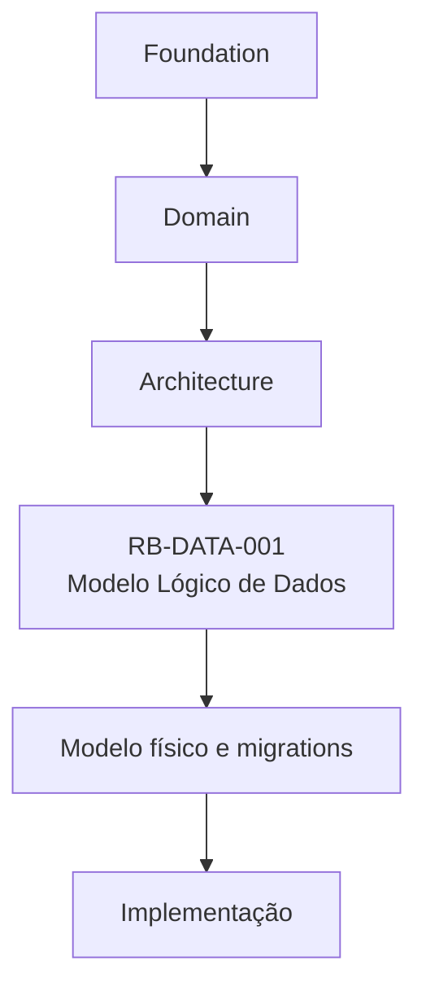
```mermaid
flowchart TD
    Foundation["Foundation"]
    Domain["Domain"]
    Architecture["Architecture"]
    LogicalModel["RB-DATA-001<br/>Modelo Lógico de Dados"]
    PhysicalModel["Modelo físico e migrations"]
    Implementation["Implementação"]

    Foundation --> Domain
    Domain --> Architecture
    Architecture --> LogicalModel
    LogicalModel --> PhysicalModel
    PhysicalModel --> Implementation
```

A modelagem não poderá redefinir:

* conceitos;
* ownership;
* agregados;
* estados;
* eventos;
* invariantes;
* identificadores canônicos;
* separação entre estado canônico e derivado.

---

### 3. Princípio central

O modelo lógico deverá representar o domínio.

Ele não deverá ser desenhado apenas para:

* conveniência do ORM;
* redução artificial do número de tabelas;
* facilidade de CRUD;
* preferência tecnológica;
* reutilização genérica;
* relatórios;
* necessidades temporárias da interface.

---

### 4. Estratégia de modelagem

O modelo inicial será orientado a banco relacional e deverá combinar:

* entidades;
* relações;
* constraints;
* versionamento;
* dados estruturados;
* JSON controlado quando justificado;
* read models;
* Outbox;
* Inbox;
* auditoria;
* Provenance.

---

### 5. Escopo dos Contextos

O modelo contempla:

1. Identity and Access;
2. Trip Management;
3. Traveler Profile;
4. Place Catalog;
5. Trip Collection;
6. Itinerary Planning;
7. Mobility;
8. Decision Intelligence;
9. Proposal Management;
10. Planning Assurance;
11. Data Governance;
12. Platform;
13. Read Models.

---

## Parte II — Convenções lógicas

### 6. Identificadores

Identificadores deverão utilizar os tipos canônicos do domínio.

Exemplos:

```text
AccountId
UserId
TripId
TravelerProfileId
TravelerId
PlaceId
TripCollectionId
ItineraryId
TripDayId
ActivityId
FreePeriodId
TravelEstimateId
RecommendationId
DecisionId
ItineraryProposalId
ProposedActivityId
PlanningConflictId
DataSourceId
EventId
```

---

### 7. Chaves primárias

Toda entidade persistente deverá possuir chave primária estável.

A chave não deverá depender de:

* nome;
* posição;
* endereço;
* identificador externo;
* valor mutável;
* ordem de exibição.

---

### 8. Chaves naturais

Chaves naturais poderão ser utilizadas como constraints adicionais, mas não como identidade principal quando forem mutáveis ou externas.

---

### 9. Auditoria temporal

Entidades relevantes deverão considerar:

```text
createdAt
updatedAt
```

Quando necessário:

```text
deletedAt
archivedAt
expiredAt
invalidatedAt
supersededAt
```

---

### 10. Autoria

Entidades ou ações relevantes poderão registrar:

```text
createdByActorType
createdByActorId
updatedByActorType
updatedByActorId
```

Esses campos não substituem audit log.

---

### 11. Versionamento técnico

Agregados sujeitos a concorrência deverão possuir:

```text
aggregateVersion
```

---

### 12. Versionamento contextual

Deverão permanecer distintos:

```text
TripContextVersion
ItineraryVersion
aggregateVersion
schemaVersion
projectionVersion
```

---

### 13. Estado lógico

Estados deverão utilizar valores canônicos e estáveis.

Não deverão ser representados por textos livres.

---

### 14. Exclusão

A estratégia poderá ser:

* física;
* lógica;
* anonimização;
* arquivamento;
* expiração.

A escolha deverá depender do conceito.

---

### 15. Null e unknown

`null` não deverá representar múltiplos significados.

Quando `unknown` for estado válido de domínio, deverá ser modelado explicitamente.

---

### 16. Valores monetários

Valores monetários deverão possuir:

```text
amount
currency
```

---

### 17. Datas e horários

Deverão ser diferenciados:

```text
Instant
LocalDate
LocalTime
TimeZone
DateRange
```

---

### 18. Dados estruturados flexíveis

JSON poderá ser utilizado para:

* payload versionado;
* metadados externos;
* snapshots;
* detalhes cuja estrutura seja controlada;
* dados de baixa necessidade relacional.

Não deverá ser utilizado para ocultar entidades, relações ou invariantes conhecidas.

---

## Parte III — Visão geral do modelo

### 19. Mapa lógico dos agregados

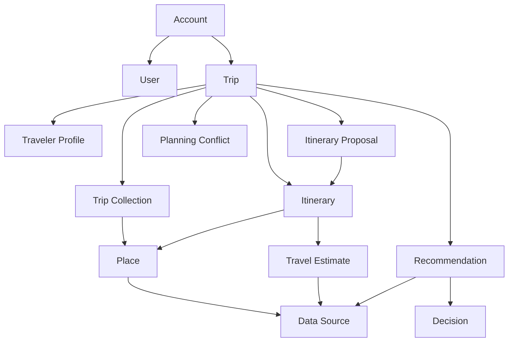
```mermaid
flowchart TB
    Account["Account"]
    User["User"]
    Trip["Trip"]
    TravelerProfile["Traveler Profile"]
    Place["Place"]
    Collection["Trip Collection"]
    Itinerary["Itinerary"]
    Estimate["Travel Estimate"]
    Recommendation["Recommendation"]
    Decision["Decision"]
    Proposal["Itinerary Proposal"]
    Conflict["Planning Conflict"]
    DataSource["Data Source"]

    Account --> User
    Account --> Trip
    Trip --> TravelerProfile
    Trip --> Collection
    Trip --> Itinerary
    Collection --> Place
    Itinerary --> Place
    Itinerary --> Estimate
    Trip --> Recommendation
    Recommendation --> Decision
    Trip --> Proposal
    Proposal --> Itinerary
    Trip --> Conflict
    Place --> DataSource
    Estimate --> DataSource
    Recommendation --> DataSource
```

---

### 20. Classificação por natureza

| Entidade           | Natureza   |
| ------------------ | ---------- |
| Account            | canônica   |
| User               | canônica   |
| Trip               | canônica   |
| Traveler Profile   | canônica   |
| Place              | canônica   |
| Trip Collection    | canônica   |
| Itinerary          | canônica   |
| Decision           | canônica   |
| Data Source        | canônica   |
| Travel Estimate    | contextual |
| Recommendation     | contextual |
| Itinerary Proposal | contextual |
| Planning Conflict  | contextual |
| Group Profile      | derivada   |
| Trip Overview      | derivada   |
| Conflict Summary   | derivada   |
| Map View           | derivada   |

---

## Parte IV — Identity and Access

### 21. Account

Representa a unidade de propriedade e isolamento principal.

#### Atributos lógicos

```text
accountId
status
name
createdAt
updatedAt
aggregateVersion
```

#### Constraints

* `accountId` obrigatório e único;
* status válido;
* Account ativa deverá possuir ao menos um User autorizado;
* encerramento deverá respeitar retenção e exclusão.

---

### 22. User

Representa uma identidade interna do RouteBook.

#### Atributos lógicos

```text
userId
accountId
displayName
primaryEmail
status
locale
timeZone
createdAt
updatedAt
aggregateVersion
```

#### Relações

* uma Account possui muitos Users;
* um User pertence a uma Account.

#### Constraints

* `primaryEmail` normalizado;
* unicidade do email deverá respeitar a estratégia de identidade;
* status válido;
* User não deverá ser identificado por subject externo.

---

### 23. External Identity Reference

Relaciona User a um Provider de identidade.

#### Atributos

```text
externalIdentityReferenceId
userId
provider
externalSubject
status
createdAt
lastAuthenticatedAt
```

#### Constraints

* `provider + externalSubject` único;
* externalSubject não substitui UserId;
* Provider deverá ser conhecido.

---

### 24. Consent

Registra consentimentos e revogações.

#### Atributos

```text
consentId
userId
consentType
status
grantedAt
revokedAt
policyVersion
source
```

#### Constraints

* policyVersion obrigatória;
* revogação posterior à concessão;
* consentimento deverá ser rastreável.

---

### 25. Diagrama de Identity and Access

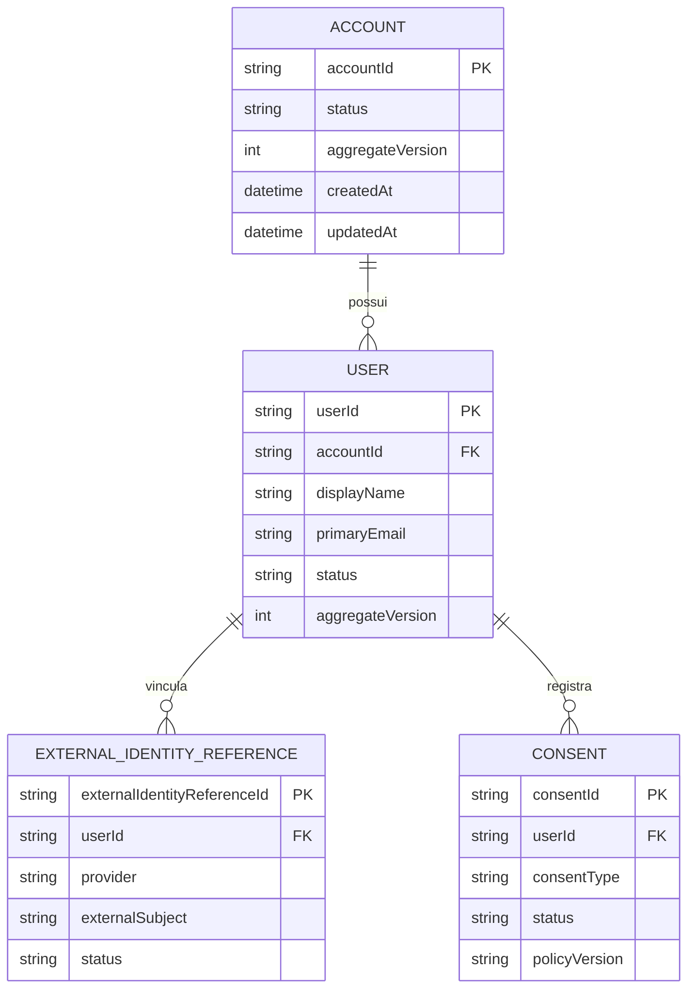
```mermaid
erDiagram
    ACCOUNT ||--o{ USER : possui
    USER ||--o{ EXTERNAL_IDENTITY_REFERENCE : vincula
    USER ||--o{ CONSENT : registra

    ACCOUNT {
        string accountId PK
        string status
        int aggregateVersion
        datetime createdAt
        datetime updatedAt
    }

    USER {
        string userId PK
        string accountId FK
        string displayName
        string primaryEmail
        string status
        int aggregateVersion
    }

    EXTERNAL_IDENTITY_REFERENCE {
        string externalIdentityReferenceId PK
        string userId FK
        string provider
        string externalSubject
        string status
    }

    CONSENT {
        string consentId PK
        string userId FK
        string consentType
        string status
        string policyVersion
    }
```

---

## Parte V — Trip Management

### 26. Trip

Agregado principal de Trip Management.

#### Atributos

```text
tripId
accountId
name
status
destinationId
startDate
endDate
timeZone
accommodationId
tripContextVersion
aggregateVersion
createdAt
updatedAt
cancelledAt
archivedAt
deletedAt
```

#### Constraints

* owner obrigatório;
* `startDate <= endDate`;
* Trip planejável deverá possuir Destination e Trip Period;
* alteração estrutural incrementa TripContextVersion;
* exclusão, cancelamento e arquivamento são estados distintos.

---

### 27. Destination

Representa o destino principal da Trip.

#### Atributos

```text
destinationId
tripId
name
countryCode
region
city
geoCoordinate
timeZone
placeId
createdAt
updatedAt
```

#### Constraints

* Destination pertence a uma Trip;
* PlaceId é opcional;
* fuso deverá ser coerente quando conhecido.

---

### 28. Accommodation

Representa a hospedagem contextual da Trip.

#### Atributos

```text
accommodationId
tripId
name
placeId
addressText
geoCoordinate
checkInAt
checkOutAt
notes
status
createdAt
updatedAt
```

#### Constraints

* Accommodation é opcional;
* check-out não pode ser anterior ao check-in;
* PlaceId é referência opcional ao Place Catalog;
* dados manuais e externos devem permanecer distinguíveis.

---

### 29. Trip Participant

Representa participação de User na Trip.

#### Atributos

```text
tripParticipantId
tripId
userId
role
status
joinedAt
removedAt
```

#### Constraints

* `tripId + userId` único entre participações ativas;
* uma Trip possui pelo menos um owner;
* último owner não pode ser removido sem transferência;
* Participant não implica Traveler.

---

### 30. Diagrama de Trip Management

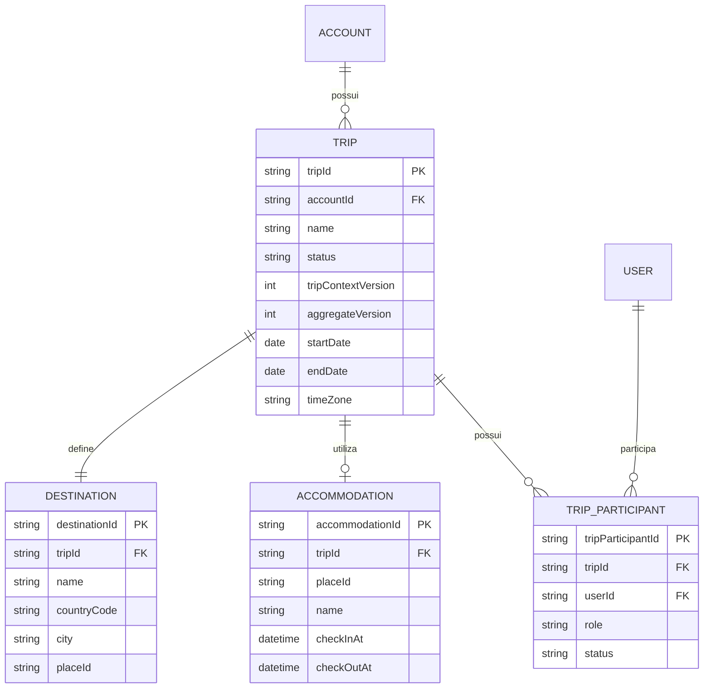
```mermaid
erDiagram
    ACCOUNT ||--o{ TRIP : possui
    TRIP ||--|| DESTINATION : define
    TRIP ||--o| ACCOMMODATION : utiliza
    TRIP ||--o{ TRIP_PARTICIPANT : possui
    USER ||--o{ TRIP_PARTICIPANT : participa

    TRIP {
        string tripId PK
        string accountId FK
        string name
        string status
        int tripContextVersion
        int aggregateVersion
        date startDate
        date endDate
        string timeZone
    }

    DESTINATION {
        string destinationId PK
        string tripId FK
        string name
        string countryCode
        string city
        string placeId
    }

    ACCOMMODATION {
        string accommodationId PK
        string tripId FK
        string placeId
        string name
        datetime checkInAt
        datetime checkOutAt
    }

    TRIP_PARTICIPANT {
        string tripParticipantId PK
        string tripId FK
        string userId FK
        string role
        string status
    }
```

---

## Parte VI — Traveler Profile

### 31. Traveler Profile

Agregado principal do Contexto.

#### Atributos

```text
travelerProfileId
tripId
budgetAmount
budgetCurrency
pace
preferredTransportMode
aggregateVersion
createdAt
updatedAt
```

#### Constraints

* uma Trip possui no máximo um Traveler Profile ativo;
* Trip planejável deverá possuir ao menos um Traveler;
* moeda obrigatória quando Budget informado.

---

### 32. Traveler

Representa pessoa considerada no planejamento.

#### Atributos

```text
travelerId
travelerProfileId
userId
displayName
travelerType
ageRange
mobilityProfile
status
createdAt
updatedAt
```

#### Constraints

* UserId opcional;
* User não deve ser associado em duplicidade ao mesmo Profile;
* dados pessoais devem ser minimizados;
* idade exata não deve ser exigida quando faixa etária for suficiente.

---

### 33. Interest

Representa interesse de viagem.

#### Atributos

```text
interestId
travelerProfileId
travelerId
interestType
priority
source
createdAt
```

#### Constraints

* pode pertencer ao grupo ou Traveler específico;
* prioridade deverá usar escala controlada;
* duplicidade equivalente deverá ser evitada.

---

### 34. Restriction

Representa restrição relevante.

#### Atributos

```text
restrictionId
travelerProfileId
travelerId
restrictionType
severity
enforcement
description
source
status
createdAt
updatedAt
```

#### Constraints

* enforcement deverá distinguir mandatory de preference;
* mandatory não poderá ser ignorada;
* dados sensíveis deverão ser minimizados;
* descrição livre deverá ser limitada.

---

### 35. Group Profile Projection

Modelo derivado calculado a partir dos Travelers, Interests e Restrictions.

#### Atributos

```text
tripId
travelerProfileId
profileVersion
summary
dominantInterests
mandatoryRestrictions
budgetSummary
paceSummary
updatedAt
```

Não é fonte canônica.

---

### 36. Diagrama de Traveler Profile

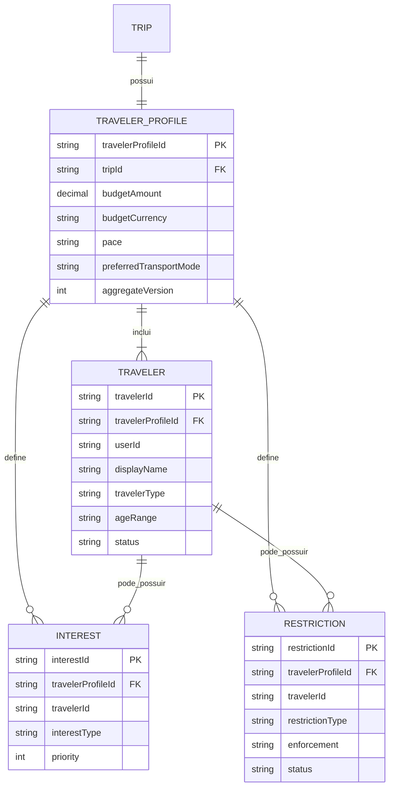
```mermaid
erDiagram
    TRIP ||--|| TRAVELER_PROFILE : possui
    TRAVELER_PROFILE ||--|{ TRAVELER : inclui
    TRAVELER_PROFILE ||--o{ INTEREST : define
    TRAVELER ||--o{ INTEREST : pode_possuir
    TRAVELER_PROFILE ||--o{ RESTRICTION : define
    TRAVELER ||--o{ RESTRICTION : pode_possuir

    TRAVELER_PROFILE {
        string travelerProfileId PK
        string tripId FK
        decimal budgetAmount
        string budgetCurrency
        string pace
        string preferredTransportMode
        int aggregateVersion
    }

    TRAVELER {
        string travelerId PK
        string travelerProfileId FK
        string userId
        string displayName
        string travelerType
        string ageRange
        string status
    }

    INTEREST {
        string interestId PK
        string travelerProfileId FK
        string travelerId
        string interestType
        int priority
    }

    RESTRICTION {
        string restrictionId PK
        string travelerProfileId FK
        string travelerId
        string restrictionType
        string enforcement
        string status
    }
```

---

## Parte VII — Place Catalog

### 37. Place

Agregado principal do Place Catalog.

#### Atributos

```text
placeId
canonicalName
description
primaryCategory
operationalStatus
priceRange
ratingValue
ratingScale
ratingCount
website
phone
status
aggregateVersion
createdAt
updatedAt
```

#### Constraints

* PlaceId interno;
* operationalStatus poderá ser unknown;
* Rating ausente não significa zero;
* Price Range ausente não significa gratuito;
* nome obrigatório;
* dados externos deverão possuir Provenance.

---

### 38. Place Location

#### Atributos

```text
placeLocationId
placeId
latitude
longitude
precision
addressLine
neighborhood
city
region
postalCode
countryCode
timeZone
createdAt
updatedAt
```

#### Constraints

* latitude entre -90 e 90;
* longitude entre -180 e 180;
* precisão não poderá exceder a Fonte;
* uma Location principal ativa por Place.

---

### 39. Place Category

#### Atributos

```text
placeCategoryId
placeId
category
isPrimary
source
createdAt
```

#### Constraints

* uma categoria primária;
* duplicidades proibidas por Place.

---

### 40. Opening Hours

#### Atributos

```text
openingHoursId
placeId
dayOfWeek
opensAt
closesAt
validFrom
validUntil
timeZone
status
sourceReference
```

#### Constraints

* múltiplos intervalos por dia permitidos;
* horário especial deverá ser distinguido;
* ausência não significa fechado.

---

### 41. External Place Reference

#### Atributos

```text
externalPlaceReferenceId
placeId
dataSourceId
provider
externalId
status
collectedAt
lastVerifiedAt
metadata
```

#### Constraints

* `provider + externalId` único;
* referência não substitui PlaceId;
* DataSource obrigatória.

---

### 42. Place Image

#### Atributos

```text
placeImageId
placeId
dataSourceId
externalReference
storageReference
attribution
license
width
height
status
expiresAt
createdAt
```

---

### 43. Diagrama de Place Catalog

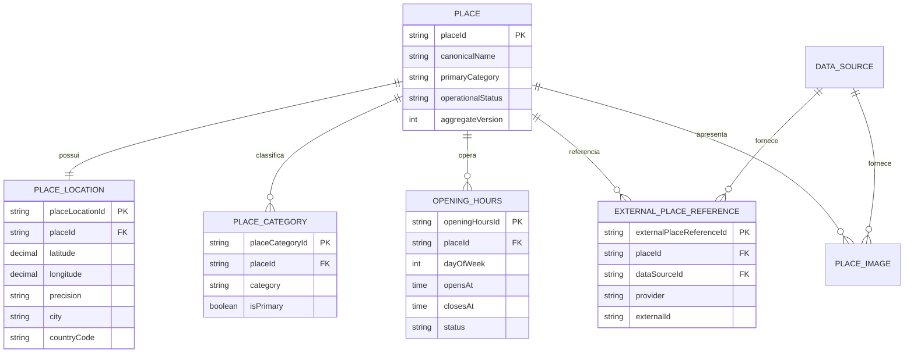
```mermaid
erDiagram
    PLACE ||--|| PLACE_LOCATION : possui
    PLACE ||--o{ PLACE_CATEGORY : classifica
    PLACE ||--o{ OPENING_HOURS : opera
    PLACE ||--o{ EXTERNAL_PLACE_REFERENCE : referencia
    PLACE ||--o{ PLACE_IMAGE : apresenta
    DATA_SOURCE ||--o{ EXTERNAL_PLACE_REFERENCE : fornece
    DATA_SOURCE ||--o{ PLACE_IMAGE : fornece

    PLACE {
        string placeId PK
        string canonicalName
        string primaryCategory
        string operationalStatus
        int aggregateVersion
    }

    PLACE_LOCATION {
        string placeLocationId PK
        string placeId FK
        decimal latitude
        decimal longitude
        string precision
        string city
        string countryCode
    }

    PLACE_CATEGORY {
        string placeCategoryId PK
        string placeId FK
        string category
        boolean isPrimary
    }

    OPENING_HOURS {
        string openingHoursId PK
        string placeId FK
        int dayOfWeek
        time opensAt
        time closesAt
        string status
    }

    EXTERNAL_PLACE_REFERENCE {
        string externalPlaceReferenceId PK
        string placeId FK
        string dataSourceId FK
        string provider
        string externalId
    }
```

---

## Parte VIII — Trip Collection

### 44. Trip Collection

Agregado principal.

#### Atributos

```text
tripCollectionId
tripId
aggregateVersion
createdAt
updatedAt
```

#### Constraints

* uma Trip possui no máximo uma Trip Collection ativa;
* inicialização idempotente.

---

### 45. Saved Place

#### Atributos

```text
savedPlaceId
tripCollectionId
tripId
placeId
origin
note
savedByActorType
savedByActorId
savedAt
updatedAt
removedAt
status
```

#### Constraints

* `tripId + placeId` único entre registros ativos;
* salvar novamente é idempotente;
* remover não remove Activity;
* Saved Place não altera Place.

---

### 46. Diagrama de Trip Collection

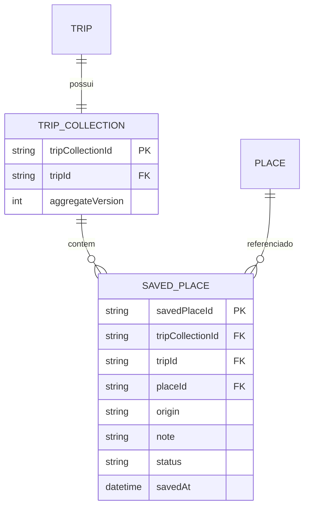
```mermaid
erDiagram
    TRIP ||--|| TRIP_COLLECTION : possui
    TRIP_COLLECTION ||--o{ SAVED_PLACE : contem
    PLACE ||--o{ SAVED_PLACE : referenciado

    TRIP_COLLECTION {
        string tripCollectionId PK
        string tripId FK
        int aggregateVersion
    }

    SAVED_PLACE {
        string savedPlaceId PK
        string tripCollectionId FK
        string tripId FK
        string placeId FK
        string origin
        string note
        string status
        datetime savedAt
    }
```

---

## Parte IX — Itinerary Planning

### 47. Itinerary

Agregado principal de Itinerary Planning.

#### Atributos

```text
itineraryId
tripId
itineraryVersion
aggregateVersion
planningCompleteness
reviewState
consistencyState
createdAt
updatedAt
outdatedAt
```

#### Constraints

* uma Trip possui um Itinerary canônico ativo;
* alteração canônica incrementa ItineraryVersion;
* estados multidimensionais permanecem separados.

---

### 48. Trip Day

#### Atributos

```text
tripDayId
itineraryId
tripId
localDate
dayOrder
status
title
notes
createdAt
updatedAt
```

#### Constraints

* `itineraryId + localDate` único;
* data dentro do Trip Period;
* ordenação determinística;
* Dia livre é estado válido.

---

### 49. Activity

#### Atributos

```text
activityId
itineraryId
tripDayId
placeId
title
description
startTime
durationMinutes
activityOrder
status
flexibility
sourceType
sourceReferenceId
estimatedCostAmount
estimatedCostCurrency
notes
aggregateVersion
createdAt
updatedAt
removedAt
```

#### Constraints

* título obrigatório;
* Duration positiva quando informada;
* Activity pertence a um Trip Day;
* Activity fixed não pode ser movida automaticamente;
* movimento entre Dias preserva ActivityId;
* PlaceId opcional;
* Proposed Activity não utiliza a mesma tabela como estado canônico.

---

### 50. Free Period

#### Atributos

```text
freePeriodId
itineraryId
tripDayId
startTime
durationMinutes
status
protectionLevel
notes
createdAt
updatedAt
removedAt
```

#### Constraints

* Duration positiva;
* pertence a Trip Day;
* protected não pode ser preenchido automaticamente;
* sobreposição deverá seguir regras do domínio.

---

### 51. Activity Place Snapshot

Poderá preservar dados relevantes do Place utilizados no planejamento.

#### Atributos

```text
activityPlaceSnapshotId
activityId
placeId
placeName
locationSummary
operationalStatus
capturedAt
dataVersion
```

Snapshot não substitui Place Catalog.

---

### 52. Diagrama de Itinerary

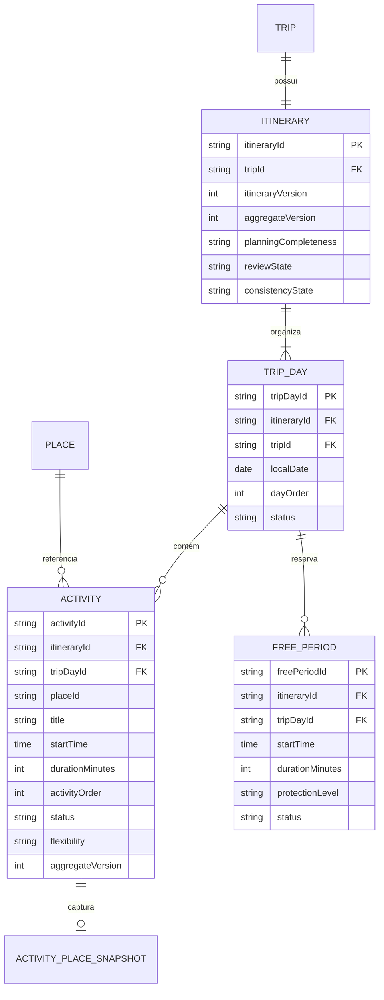
```mermaid
erDiagram
    TRIP ||--|| ITINERARY : possui
    ITINERARY ||--|{ TRIP_DAY : organiza
    TRIP_DAY ||--o{ ACTIVITY : contem
    TRIP_DAY ||--o{ FREE_PERIOD : reserva
    PLACE ||--o{ ACTIVITY : referencia
    ACTIVITY ||--o| ACTIVITY_PLACE_SNAPSHOT : captura

    ITINERARY {
        string itineraryId PK
        string tripId FK
        int itineraryVersion
        int aggregateVersion
        string planningCompleteness
        string reviewState
        string consistencyState
    }

    TRIP_DAY {
        string tripDayId PK
        string itineraryId FK
        string tripId FK
        date localDate
        int dayOrder
        string status
    }

    ACTIVITY {
        string activityId PK
        string itineraryId FK
        string tripDayId FK
        string placeId
        string title
        time startTime
        int durationMinutes
        int activityOrder
        string status
        string flexibility
        int aggregateVersion
    }

    FREE_PERIOD {
        string freePeriodId PK
        string itineraryId FK
        string tripDayId FK
        time startTime
        int durationMinutes
        string protectionLevel
        string status
    }
```

---

## Parte X — Mobility

### 53. Travel Estimate

Agregado contextual do Mobility.

#### Atributos

```text
travelEstimateId
tripId
itineraryId
tripDayId
originType
originReferenceId
destinationType
destinationReferenceId
transportMode
distanceValue
distanceUnit
durationSeconds
estimatedCostAmount
estimatedCostCurrency
status
confidenceLevel
validFrom
validUntil
collectedAt
dataSourceId
aggregateVersion
createdAt
updatedAt
invalidatedAt
```

#### Constraints

* origem obrigatória;
* destino obrigatório;
* modo obrigatório;
* Distance não negativa;
* Duration não negativa;
* status distingue calculated, failed, stale e invalidated;
* falha não produz valores zero fictícios;
* validade temporal explícita.

---

### 54. Route Segment

Opcional para detalhamento de rota.

#### Atributos

```text
routeSegmentId
travelEstimateId
segmentOrder
transportMode
distanceValue
durationSeconds
instructionSummary
metadata
```

---

### 55. Travel Estimate Reference

Relaciona estimativa a Activities ou Accommodation.

#### Atributos

```text
travelEstimateReferenceId
travelEstimateId
referenceType
referenceId
role
```

---

### 56. Diagrama de Mobility

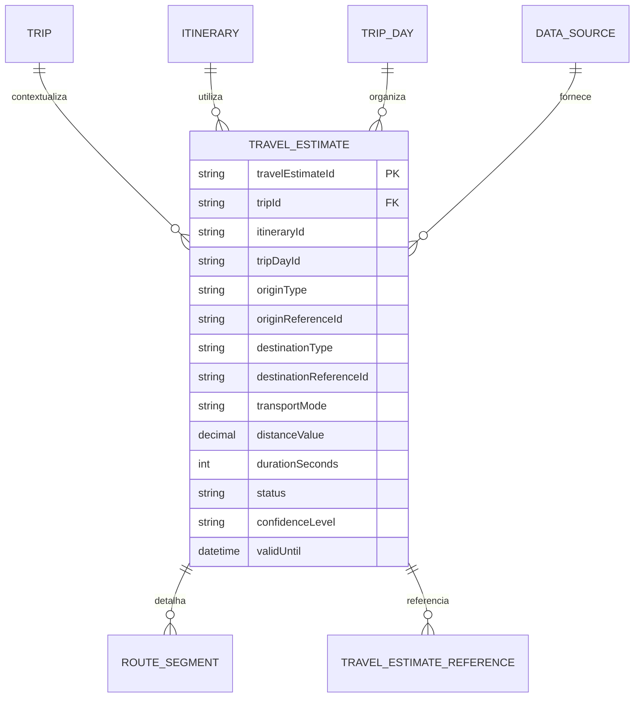
```mermaid
erDiagram
    TRIP ||--o{ TRAVEL_ESTIMATE : contextualiza
    ITINERARY ||--o{ TRAVEL_ESTIMATE : utiliza
    TRIP_DAY ||--o{ TRAVEL_ESTIMATE : organiza
    DATA_SOURCE ||--o{ TRAVEL_ESTIMATE : fornece
    TRAVEL_ESTIMATE ||--o{ ROUTE_SEGMENT : detalha
    TRAVEL_ESTIMATE ||--o{ TRAVEL_ESTIMATE_REFERENCE : referencia

    TRAVEL_ESTIMATE {
        string travelEstimateId PK
        string tripId FK
        string itineraryId
        string tripDayId
        string originType
        string originReferenceId
        string destinationType
        string destinationReferenceId
        string transportMode
        decimal distanceValue
        int durationSeconds
        string status
        string confidenceLevel
        datetime validUntil
    }
```

---

## Parte XI — Decision Intelligence

### 57. Recommendation

Agregado contextual.

#### Atributos

```text
recommendationId
tripId
recommendationType
status
title
summary
confidenceLevel
score
validFrom
validUntil
tripContextVersion
itineraryVersion
contextSnapshotId
generationMethod
aggregateVersion
createdAt
presentedAt
acceptedAt
rejectedAt
expiredAt
invalidatedAt
supersededAt
```

#### Constraints

* personalizada deverá possuir Context Snapshot;
* Reason obrigatória;
* score e confidence são distintos;
* Recommendation não altera estado canônico;
* expirada ou invalidada não pode ser aceita;
* versões base obrigatórias quando dependentes de Trip e Itinerary.

---

### 58. Recommendation Item

Representa alvo ou candidato recomendado.

#### Atributos

```text
recommendationItemId
recommendationId
itemType
itemReferenceId
rank
score
summary
metadata
```

---

### 59. Recommendation Reason

#### Atributos

```text
recommendationReasonId
recommendationId
reasonType
description
weight
evidenceReference
createdAt
```

---

### 60. Decision Context Snapshot

#### Atributos

```text
contextSnapshotId
tripId
tripContextVersion
itineraryVersion
capturedAt
purpose
schemaVersion
contextHash
payload
classification
expiresAt
```

#### Constraints

* imutável;
* versionado;
* minimizado;
* payload protegido;
* não substitui dados canônicos.

---

### 61. Decision

Agregado canônico.

#### Atributos

```text
decisionId
tripId
recommendationId
decisionType
status
selectedItemType
selectedItemReferenceId
actorType
actorId
delegationReference
contextSnapshotId
reason
aggregateVersion
recordedAt
executedAt
cancelledAt
```

#### Constraints

* ator obrigatório;
* Decision pode existir sem Recommendation;
* Decision não implica execução;
* IA não pode aparecer como User;
* aceite de Recommendation deverá criar Decision rastreável.

---

### 62. Decision Outcome

#### Atributos

```text
decisionOutcomeId
decisionId
outcomeType
status
occurredAt
notes
quality
recordedAt
```

---

### 63. Diagrama de Decision Intelligence

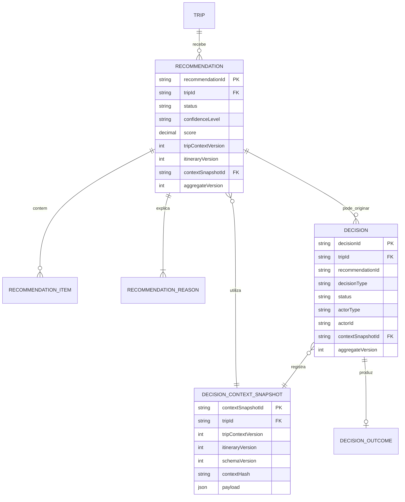
```mermaid
erDiagram
    TRIP ||--o{ RECOMMENDATION : recebe
    RECOMMENDATION ||--o{ RECOMMENDATION_ITEM : contem
    RECOMMENDATION ||--|{ RECOMMENDATION_REASON : explica
    RECOMMENDATION }o--|| DECISION_CONTEXT_SNAPSHOT : utiliza
    RECOMMENDATION ||--o{ DECISION : pode_originar
    DECISION }o--|| DECISION_CONTEXT_SNAPSHOT : registra
    DECISION ||--o| DECISION_OUTCOME : produz

    RECOMMENDATION {
        string recommendationId PK
        string tripId FK
        string status
        string confidenceLevel
        decimal score
        int tripContextVersion
        int itineraryVersion
        string contextSnapshotId FK
        int aggregateVersion
    }

    DECISION_CONTEXT_SNAPSHOT {
        string contextSnapshotId PK
        string tripId FK
        int tripContextVersion
        int itineraryVersion
        int schemaVersion
        string contextHash
        json payload
    }

    DECISION {
        string decisionId PK
        string tripId FK
        string recommendationId
        string decisionType
        string status
        string actorType
        string actorId
        string contextSnapshotId FK
        int aggregateVersion
    }
```

---

## Parte XII — Proposal Management

### 64. Itinerary Proposal

Agregado contextual.

#### Atributos

```text
itineraryProposalId
tripId
itineraryId
status
title
summary
baseTripContextVersion
baseItineraryVersion
contextSnapshotId
generationMethod
validUntil
aggregateVersion
createdAt
generationStartedAt
generatedAt
acceptedAt
partiallyAcceptedAt
rejectedAt
expiredAt
cancelledAt
supersededAt
```

#### Constraints

* ItineraryProposalId obrigatório;
* versões base obrigatórias;
* expirada não pode ser aplicada;
* não altera Itinerary antes de aceite;
* aplicação idempotente;
* status segue ciclo oficial.

---

### 65. Proposed Activity

#### Atributos

```text
proposedActivityId
itineraryProposalId
targetTripDayId
sourceActivityId
placeId
title
description
proposedStartTime
durationMinutes
proposedOrder
operationType
flexibility
estimatedCostAmount
estimatedCostCurrency
reason
status
```

#### Constraints

* Proposed Activity não é Activity canônica;
* sourceActivityId opcional para movimento ou alteração;
* operationType deverá distinguir add, move, update e remove;
* Activity fixed não poderá ser movida automaticamente;
* Free Period protected deverá ser preservado.

---

### 66. Proposal Selection

Registra seleção para aceite parcial.

#### Atributos

```text
proposalSelectionId
itineraryProposalId
proposedActivityId
selected
selectedByActorType
selectedByActorId
selectedAt
```

---

### 67. Proposal Application

Registra tentativa e resultado de aplicação.

#### Atributos

```text
proposalApplicationId
itineraryProposalId
idempotencyKey
applicationType
expectedItineraryVersion
resultingItineraryVersion
status
actorType
actorId
startedAt
completedAt
failureCode
```

#### Constraints

* `itineraryProposalId + idempotencyKey` único;
* mesma chave com payload divergente deve falhar;
* sucesso deverá registrar resultingItineraryVersion.

---

### 68. Diagrama de Proposal Management

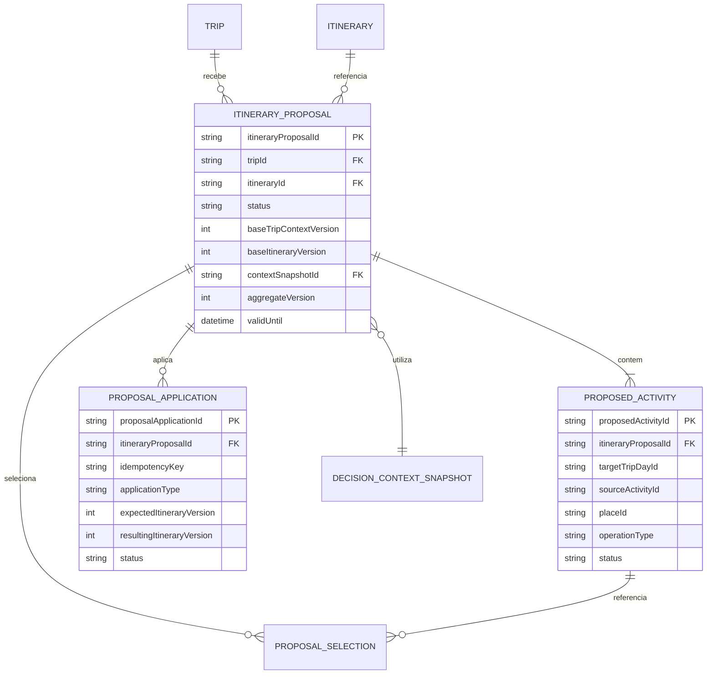
```mermaid
erDiagram
    TRIP ||--o{ ITINERARY_PROPOSAL : recebe
    ITINERARY ||--o{ ITINERARY_PROPOSAL : referencia
    ITINERARY_PROPOSAL ||--|{ PROPOSED_ACTIVITY : contem
    ITINERARY_PROPOSAL ||--o{ PROPOSAL_SELECTION : seleciona
    PROPOSED_ACTIVITY ||--o{ PROPOSAL_SELECTION : referencia
    ITINERARY_PROPOSAL ||--o{ PROPOSAL_APPLICATION : aplica
    ITINERARY_PROPOSAL }o--|| DECISION_CONTEXT_SNAPSHOT : utiliza

    ITINERARY_PROPOSAL {
        string itineraryProposalId PK
        string tripId FK
        string itineraryId FK
        string status
        int baseTripContextVersion
        int baseItineraryVersion
        string contextSnapshotId FK
        int aggregateVersion
        datetime validUntil
    }

    PROPOSED_ACTIVITY {
        string proposedActivityId PK
        string itineraryProposalId FK
        string targetTripDayId
        string sourceActivityId
        string placeId
        string operationType
        string status
    }

    PROPOSAL_APPLICATION {
        string proposalApplicationId PK
        string itineraryProposalId FK
        string idempotencyKey
        string applicationType
        int expectedItineraryVersion
        int resultingItineraryVersion
        string status
    }
```

---

## Parte XIII — Planning Assurance

### 69. Planning Conflict

Agregado contextual.

#### Atributos

```text
planningConflictId
tripId
itineraryId
itineraryProposalId
conflictType
category
severity
status
ruleId
title
description
affectedObjectType
affectedObjectId
tripContextVersion
itineraryVersion
aggregateVersion
detectedAt
resolvedAt
ignoredAt
invalidatedAt
supersededAt
```

#### Constraints

* PlanningConflictId obrigatório;
* regra obrigatória;
* evidência obrigatória;
* severidade válida;
* error não pode ser ignored;
* ignored é diferente de resolved;
* resolved exige remoção da condição;
* conflito equivalente ativo não deve ser duplicado.

---

### 70. Conflict Evidence

#### Atributos

```text
conflictEvidenceId
planningConflictId
evidenceType
referenceType
referenceId
description
dataSnapshot
createdAt
```

---

### 71. Conflict Resolution

#### Atributos

```text
conflictResolutionId
planningConflictId
resolutionType
decisionId
actorType
actorId
description
createdAt
```

#### Constraints

* Ignore Planning Risk deverá referenciar Decision;
* resolução e aceite de risco são distintos;
* ator obrigatório.

---

### 72. Conflict Equivalence Key

Poderá ser persistida para deduplicação.

#### Atributos

```text
equivalenceKey
tripId
ruleId
affectedObjectType
affectedObjectId
contextVersionHash
```

---

### 73. Diagrama de Planning Assurance

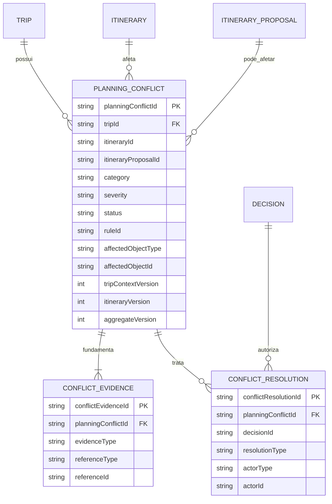
```mermaid
erDiagram
    TRIP ||--o{ PLANNING_CONFLICT : possui
    ITINERARY ||--o{ PLANNING_CONFLICT : afeta
    ITINERARY_PROPOSAL ||--o{ PLANNING_CONFLICT : pode_afetar
    PLANNING_CONFLICT ||--|{ CONFLICT_EVIDENCE : fundamenta
    PLANNING_CONFLICT ||--o{ CONFLICT_RESOLUTION : trata
    DECISION ||--o{ CONFLICT_RESOLUTION : autoriza

    PLANNING_CONFLICT {
        string planningConflictId PK
        string tripId FK
        string itineraryId
        string itineraryProposalId
        string category
        string severity
        string status
        string ruleId
        string affectedObjectType
        string affectedObjectId
        int tripContextVersion
        int itineraryVersion
        int aggregateVersion
    }

    CONFLICT_EVIDENCE {
        string conflictEvidenceId PK
        string planningConflictId FK
        string evidenceType
        string referenceType
        string referenceId
    }

    CONFLICT_RESOLUTION {
        string conflictResolutionId PK
        string planningConflictId FK
        string decisionId
        string resolutionType
        string actorType
        string actorId
    }
```

---

## Parte XIV — Data Governance

### 74. Data Source

Agregado principal.

#### Atributos

```text
dataSourceId
name
provider
sourceType
status
license
region
confidencePolicy
freshnessPolicy
createdAt
updatedAt
aggregateVersion
```

---

### 75. Provenance Record

#### Atributos

```text
provenanceRecordId
dataSourceId
entityType
entityId
attributeName
externalReference
collectedAt
effectiveAt
method
confidenceLevel
freshnessStatus
adapterVersion
transformationSummary
metadata
createdAt
```

#### Constraints

* Data Source obrigatória;
* entidade e atributo identificáveis;
* transformação relevante registrada;
* Confidence e Freshness separados.

---

### 76. Data Conflict

#### Atributos

```text
dataConflictId
entityType
entityId
attributeName
status
selectedValueReference
policyId
detectedAt
resolvedAt
```

---

### 77. Data Conflict Candidate

#### Atributos

```text
dataConflictCandidateId
dataConflictId
provenanceRecordId
candidateValue
confidenceLevel
freshnessStatus
```

---

### 78. Data Quality Policy

#### Atributos

```text
dataQualityPolicyId
name
entityType
attributeName
policyVersion
precedenceRules
freshnessRules
confidenceRules
status
createdAt
updatedAt
```

---

### 79. Diagrama de Data Governance

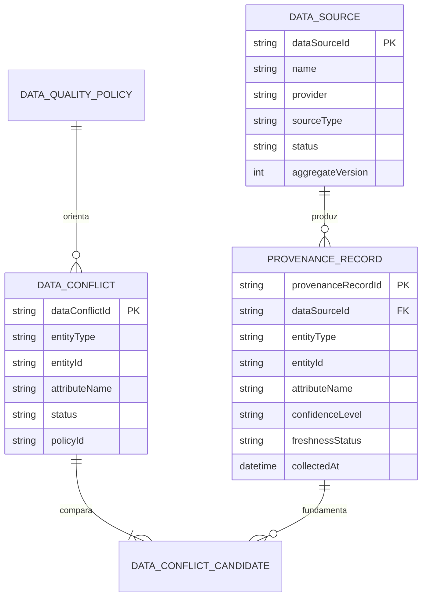
```mermaid
erDiagram
    DATA_SOURCE ||--o{ PROVENANCE_RECORD : produz
    DATA_QUALITY_POLICY ||--o{ DATA_CONFLICT : orienta
    DATA_CONFLICT ||--|{ DATA_CONFLICT_CANDIDATE : compara
    PROVENANCE_RECORD ||--o{ DATA_CONFLICT_CANDIDATE : fundamenta

    DATA_SOURCE {
        string dataSourceId PK
        string name
        string provider
        string sourceType
        string status
        int aggregateVersion
    }

    PROVENANCE_RECORD {
        string provenanceRecordId PK
        string dataSourceId FK
        string entityType
        string entityId
        string attributeName
        string confidenceLevel
        string freshnessStatus
        datetime collectedAt
    }

    DATA_CONFLICT {
        string dataConflictId PK
        string entityType
        string entityId
        string attributeName
        string status
        string policyId
    }
```

---

## Parte XV — Platform Data

### 80. Outbox Event

#### Atributos

```text
eventId
eventType
aggregateType
aggregateId
aggregateVersion
payload
metadata
schemaVersion
occurredAt
recordedAt
publicationStatus
attempts
nextAttemptAt
publishedAt
lastFailureCode
```

#### Constraints

* EventId único;
* schemaVersion obrigatória;
* aggregateVersion obrigatória quando aplicável;
* payload imutável;
* publicação idempotente.

---

### 81. Inbox Message

#### Atributos

```text
inboxMessageId
eventId
consumerId
schemaVersion
status
receivedAt
processedAt
attempts
lastFailureCode
```

#### Constraints

* `eventId + consumerId` único;
* processamento idempotente.

---

### 82. Idempotency Record

#### Atributos

```text
idempotencyRecordId
scope
operation
idempotencyKey
actorType
actorId
requestHash
status
responseReference
createdAt
completedAt
expiresAt
```

#### Constraints

* `scope + operation + idempotencyKey` único;
* mesma chave com hash diferente deve falhar.

---

### 83. Job Execution

#### Atributos

```text
jobExecutionId
jobType
correlationId
status
scheduledAt
startedAt
completedAt
attempt
checkpoint
failureCode
metadata
```

---

### 84. Distributed Lock

Quando necessário:

```text
lockKey
owner
acquiredAt
expiresAt
version
```

Não deverá ser utilizado como substituto de invariantes ou concorrência otimista.

---

### 85. Diagrama de estruturas técnicas

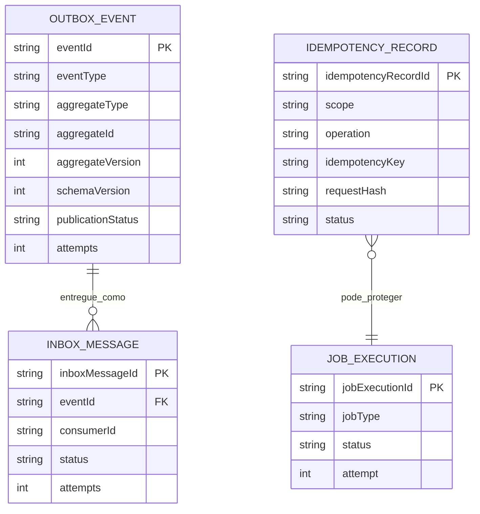
```mermaid
erDiagram
    OUTBOX_EVENT ||--o{ INBOX_MESSAGE : entregue_como
    IDEMPOTENCY_RECORD }o--|| JOB_EXECUTION : pode_proteger

    OUTBOX_EVENT {
        string eventId PK
        string eventType
        string aggregateType
        string aggregateId
        int aggregateVersion
        int schemaVersion
        string publicationStatus
        int attempts
    }

    INBOX_MESSAGE {
        string inboxMessageId PK
        string eventId FK
        string consumerId
        string status
        int attempts
    }

    IDEMPOTENCY_RECORD {
        string idempotencyRecordId PK
        string scope
        string operation
        string idempotencyKey
        string requestHash
        string status
    }

    JOB_EXECUTION {
        string jobExecutionId PK
        string jobType
        string status
        int attempt
    }
```

---

## Parte XVI — Auditoria

### 86. Audit Entry

#### Atributos

```text
auditId
accountId
tripId
actorType
actorId
delegatedByActorId
action
targetType
targetId
result
correlationId
source
occurredAt
metadata
classification
```

#### Constraints

* append-only;
* ator ou origem identificável;
* payload sensível minimizado;
* ação e alvo obrigatórios.

---

### 87. Ações prioritárias

* transferir ownership;
* alterar papel;
* alterar Restriction;
* aceitar Proposal;
* aceitar parcialmente;
* ignorar Planning Risk;
* excluir Trip;
* excluir Account;
* exportar dados;
* executar ferramenta crítica;
* executar ação por agente.

---

### 88. Audit Entry versus Domain Event

| Audit Entry                 | Domain Event                  |
| --------------------------- | ----------------------------- |
| rastreabilidade operacional | fato do domínio               |
| foco em ator e ação         | foco em mudança               |
| pode registrar falha        | representa sucesso confirmado |
| retenção própria            | ciclo definido pelo domínio   |

---

## Parte XVII — Projeções e modelos de leitura

### 89. Trip List Projection

#### Atributos

```text
tripId
accountId
name
destinationName
startDate
endDate
status
coverImageReference
travelerCount
savedPlaceCount
activityCount
activeConflictCount
updatedAt
projectionVersion
```

---

### 90. Trip Overview Projection

#### Atributos

```text
tripId
tripContextVersion
itineraryVersion
destinationSummary
travelerSummary
budgetSummary
itinerarySummary
savedPlacesSummary
planningConflictSummary
recommendationSummary
dataFreshnessSummary
updatedAt
projectionVersion
```

---

### 91. Itinerary Day View

#### Atributos

```text
tripDayId
tripId
itineraryId
localDate
dayOrder
activities
freePeriods
travelEstimates
conflicts
updatedAt
projectionVersion
```

---

### 92. Explore Results View

#### Atributos

```text
tripId
queryHash
placeId
placeSummary
distanceSummary
savedStatus
plannedStatus
recommendationScore
reasonSummary
dataFreshness
updatedAt
projectionVersion
```

---

### 93. Planning Conflict Summary

#### Atributos

```text
tripId
itineraryId
errorCount
riskCount
suggestionCount
ignoredRiskCount
lastReviewedAt
itineraryVersion
projectionVersion
```

---

### 94. Projeções não canônicas

As projeções:

* podem ser reconstruídas;
* podem estar temporariamente atrasadas;
* não devem receber escrita de domínio;
* devem registrar versão;
* devem permitir atualização incremental.

---

### 95. Fluxo de projeção


```mermaid
flowchart LR
    DomainEvents["Eventos confirmados"]
    Projector["Projector"]
    ReadModel["Read Model"]
    Cache["Cache de leitura"]
    UI["Web Application"]

    DomainEvents --> Projector
    Projector --> ReadModel
    ReadModel --> Cache
    Cache --> UI
    ReadModel --> UI
```

---

## Parte XVIII — Cardinalidades principais

### 96. Matriz de cardinalidades

| Relação                                | Cardinalidade |
| -------------------------------------- | ------------- |
| Account → User                         | 1:N           |
| Account → Trip                         | 1:N           |
| Trip → Destination                     | 1:1           |
| Trip → Accommodation                   | 1:0..1        |
| Trip → Trip Participant                | 1:N           |
| Trip → Traveler Profile                | 1:1           |
| Traveler Profile → Traveler            | 1:N           |
| Traveler Profile → Interest            | 1:N           |
| Traveler Profile → Restriction         | 1:N           |
| Trip → Trip Collection                 | 1:1           |
| Trip Collection → Saved Place          | 1:N           |
| Place → Saved Place                    | 1:N           |
| Trip → Itinerary                       | 1:1 atual     |
| Itinerary → Trip Day                   | 1:N           |
| Trip Day → Activity                    | 1:N           |
| Trip Day → Free Period                 | 1:N           |
| Place → Activity                       | 1:N opcional  |
| Trip → Recommendation                  | 1:N           |
| Recommendation → Reason                | 1:N           |
| Recommendation → Decision              | 1:N           |
| Trip → Itinerary Proposal              | 1:N           |
| Itinerary Proposal → Proposed Activity | 1:N           |
| Trip → Planning Conflict               | 1:N           |
| Planning Conflict → Evidence           | 1:N           |
| Data Source → Provenance Record        | 1:N           |

---

## Parte XIX — Constraints lógicas

### 97. Constraints de Trip

* `startDate <= endDate`;
* owner obrigatório;
* Participant ativo único por User;
* TripContextVersion monotônica;
* Destination obrigatória para Trip planejável.

---

### 98. Constraints de Traveler Profile

* ao menos um Traveler para Trip planejável;
* User não duplicado no Profile;
* mandatory não ignorável;
* Budget com moeda;
* Interest equivalente não duplicado.

---

### 99. Constraints de Place

* Provider e externalId únicos;
* latitude e longitude válidas;
* categoria primária única;
* operationalStatus válido;
* unknown preservado.

---

### 100. Constraints de Trip Collection

* `tripId + placeId` único entre Saved Places ativos;
* salvar é idempotente;
* remoção não afeta Activity.

---

### 101. Constraints de Itinerary

* um Itinerary ativo por Trip;
* um Trip Day por data;
* Activity pertence a Trip Day do mesmo Itinerary;
* Duration positiva;
* Free Period protected preservado;
* ItineraryVersion monotônica.

---

### 102. Constraints de Recommendation

* Reason obrigatória;
* Context Snapshot obrigatório para personalização;
* versão base válida;
* status compatível com timestamps;
* expirada ou invalidada não aceita.

---

### 103. Constraints de Decision

* ator obrigatório;
* Decision não implica execução;
* RecommendationId opcional;
* contexto rastreável;
* ações por agente registram delegação.

---

### 104. Constraints de Proposal

* versões base obrigatórias;
* Proposed Activity não é Activity;
* aplicação idempotente;
* status válido;
* validade respeitada.

---

### 105. Constraints de Planning Conflict

* regra e evidência obrigatórias;
* error não ignored;
* ignored exige Decision;
* resolução exige remoção da condição;
* conflito equivalente ativo único.

---

### 106. Constraints técnicas

* EventId único;
* idempotency key única por escopo;
* Inbox única por Event e Consumer;
* aggregateVersion monotônica;
* schemaVersion obrigatória em payload versionado.

---

## Parte XX — Índices conceituais

### 107. Princípio

Índices deverão atender consultas e constraints reais.

---

### 108. Identity and Access

Índices conceituais:

```text
User(accountId, status)
User(normalizedEmail)
ExternalIdentityReference(provider, externalSubject) UNIQUE
Consent(userId, consentType, status)
```

---

### 109. Trip Management

```text
Trip(accountId, status)
Trip(startDate, endDate)
TripParticipant(tripId, userId, status)
Destination(tripId) UNIQUE
Accommodation(tripId, status)
```

---

### 110. Traveler Profile

```text
TravelerProfile(tripId) UNIQUE
Traveler(travelerProfileId, status)
Traveler(travelerProfileId, userId)
Interest(travelerProfileId, interestType)
Restriction(travelerProfileId, enforcement, status)
```

---

### 111. Place Catalog

```text
Place(canonicalName)
Place(primaryCategory, operationalStatus)
PlaceLocation(latitude, longitude)
ExternalPlaceReference(provider, externalId) UNIQUE
OpeningHours(placeId, dayOfWeek)
```

Índice espacial deverá ser considerado para Location.

---

### 112. Trip Collection

```text
TripCollection(tripId) UNIQUE
SavedPlace(tripId, placeId, status)
SavedPlace(tripCollectionId, savedAt)
```

---

### 113. Itinerary

```text
Itinerary(tripId) UNIQUE
TripDay(itineraryId, localDate) UNIQUE
TripDay(itineraryId, dayOrder)
Activity(tripDayId, activityOrder)
Activity(itineraryId, placeId)
Activity(sourceType, sourceReferenceId)
FreePeriod(tripDayId, startTime)
```

---

### 114. Mobility

```text
TravelEstimate(tripId, status)
TravelEstimate(itineraryId, tripDayId)
TravelEstimate(originType, originReferenceId, destinationType, destinationReferenceId)
TravelEstimate(validUntil, status)
```

---

### 115. Decision Intelligence

```text
Recommendation(tripId, status, createdAt)
Recommendation(validUntil, status)
Recommendation(tripContextVersion, itineraryVersion)
Decision(tripId, recordedAt)
Decision(recommendationId)
Decision(actorType, actorId)
```

---

### 116. Proposal Management

```text
ItineraryProposal(tripId, status, createdAt)
ItineraryProposal(itineraryId, baseItineraryVersion)
ProposedActivity(itineraryProposalId, status)
ProposalApplication(itineraryProposalId, idempotencyKey) UNIQUE
```

---

### 117. Planning Assurance

```text
PlanningConflict(tripId, status, severity)
PlanningConflict(itineraryId, itineraryVersion)
PlanningConflict(ruleId, affectedObjectType, affectedObjectId, status)
PlanningConflict(equivalenceKey, status)
```

---

### 118. Platform

```text
Outbox(publicationStatus, nextAttemptAt)
Outbox(aggregateId, aggregateVersion)
Inbox(eventId, consumerId) UNIQUE
Idempotency(scope, operation, idempotencyKey) UNIQUE
JobExecution(jobType, status, scheduledAt)
AuditEntry(accountId, occurredAt)
AuditEntry(tripId, occurredAt)
```

---

## Parte XXI — Retenção e ciclo dos dados

### 119. Categorias de retenção

| Categoria                    | Estratégia                    |
| ---------------------------- | ----------------------------- |
| sessão                       | curta                         |
| idempotência                 | técnica e limitada            |
| Outbox publicada             | operacional                   |
| Inbox processada             | operacional                   |
| audit log                    | ampliada                      |
| Recommendation expirada      | histórica limitada            |
| Proposal expirada            | histórica e auditável         |
| Planning Conflict invalidado | histórico                     |
| localização pontual          | curta                         |
| dados externos stale         | por política                  |
| Trip arquivada               | enquanto mantida pelo Usuário |

---

### 120. Ciclo de dados contextuais

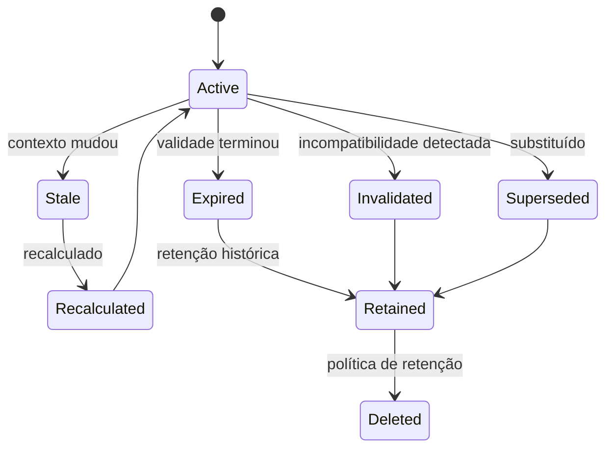
```mermaid
stateDiagram-v2
    [*] --> Active
    Active --> Stale: contexto mudou
    Active --> Expired: validade terminou
    Active --> Invalidated: incompatibilidade detectada
    Active --> Superseded: substituído
    Stale --> Recalculated: recalculado
    Recalculated --> Active
    Expired --> Retained: retenção histórica
    Invalidated --> Retained
    Superseded --> Retained
    Retained --> Deleted: política de retenção
```

---

### 121. Exclusão de Trip

A exclusão deverá coordenar:

* Trip;
* Traveler Profile;
* Trip Collection;
* Itinerary;
* Travel Estimates;
* Recommendations;
* Decisions;
* Proposals;
* Planning Conflicts;
* projeções;
* caches;
* arquivos;
* memórias;
* integrações.

---

### 122. Anonimização

Decision, auditoria e histórico poderão exigir anonimização em vez de exclusão integral.

---

### 123. Backups

Dados excluídos poderão permanecer temporariamente em backups até expiração da retenção.

---

## Parte XXII — Integridade transacional

### 124. Limite de agregado

A alteração canônica deverá ocorrer no agregado proprietário.

---

### 125. Estado e Evento

Mudança de estado e registro de Outbox deverão ocorrer na mesma transação quando necessário.

---

### 126. Concorrência

Atualizações deverão validar aggregateVersion.

Trip e Itinerary deverão validar também suas versões contextuais quando aplicável.

---

### 127. Aplicação de Proposal

A aplicação deverá:

1. validar status;
2. validar idempotência;
3. validar versões;
4. validar seleção;
5. validar Planning Conflicts;
6. alterar Itinerary;
7. incrementar ItineraryVersion;
8. registrar eventos;
9. registrar resultado da aplicação.

---

### 128. Ignore Planning Risk

Deverá:

1. carregar Planning Conflict;
2. validar severidade;
3. validar autorização;
4. registrar Decision;
5. alterar status para ignored;
6. registrar resolução contextual;
7. publicar eventos.

---

### 129. Fluxo transacional de Proposal

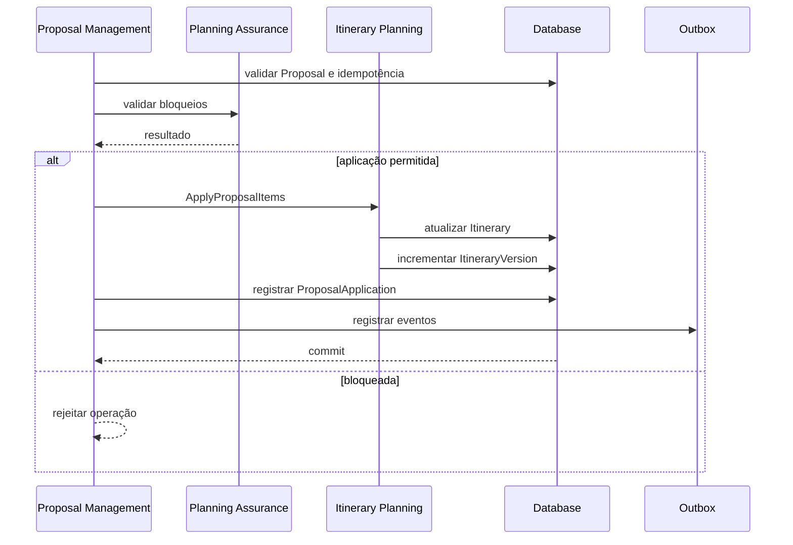
```mermaid
sequenceDiagram
    participant PM as Proposal Management
    participant PA as Planning Assurance
    participant IP as Itinerary Planning
    participant DB as Database
    participant OB as Outbox

    PM->>DB: validar Proposal e idempotência
    PM->>PA: validar bloqueios
    PA-->>PM: resultado

    alt aplicação permitida
        PM->>IP: ApplyProposalItems
        IP->>DB: atualizar Itinerary
        IP->>DB: incrementar ItineraryVersion
        PM->>DB: registrar ProposalApplication
        PM->>OB: registrar eventos
        DB-->>PM: commit
    else bloqueada
        PM-->>PM: rejeitar operação
    end
```

---

## Parte XXIII — Rastreabilidade

### 130. Entidade e owner

| Entidade           | Owner                 |
| ------------------ | --------------------- |
| Account            | Identity and Access   |
| User               | Identity and Access   |
| Trip               | Trip Management       |
| Traveler Profile   | Traveler Profile      |
| Traveler           | Traveler Profile      |
| Place              | Place Catalog         |
| Trip Collection    | Trip Collection       |
| Saved Place        | Trip Collection       |
| Itinerary          | Itinerary Planning    |
| Trip Day           | Itinerary Planning    |
| Activity           | Itinerary Planning    |
| Free Period        | Itinerary Planning    |
| Travel Estimate    | Mobility              |
| Recommendation     | Decision Intelligence |
| Decision           | Decision Intelligence |
| Itinerary Proposal | Proposal Management   |
| Proposed Activity  | Proposal Management   |
| Planning Conflict  | Planning Assurance    |
| Data Source        | Data Governance       |
| Outbox             | Platform              |

---

### 131. Entidade e versão

| Entidade           | Versões relevantes                                             |
| ------------------ | -------------------------------------------------------------- |
| Trip               | TripContextVersion, aggregateVersion                           |
| Itinerary          | ItineraryVersion, aggregateVersion                             |
| Recommendation     | TripContextVersion, ItineraryVersion, aggregateVersion         |
| Decision           | aggregateVersion                                               |
| Itinerary Proposal | baseTripContextVersion, baseItineraryVersion, aggregateVersion |
| Planning Conflict  | TripContextVersion, ItineraryVersion, aggregateVersion         |
| Evento             | aggregateVersion, schemaVersion                                |
| Projection         | projectionVersion                                              |

---

### 132. Entidade e natureza

| Entidade           | Natureza   |
| ------------------ | ---------- |
| Trip               | canônica   |
| Traveler Profile   | canônica   |
| Place              | canônica   |
| Activity           | canônica   |
| Decision           | canônica   |
| Recommendation     | contextual |
| Travel Estimate    | contextual |
| Itinerary Proposal | contextual |
| Planning Conflict  | contextual |
| Trip Overview      | derivada   |

---

## Parte XXIV — Diagramas consolidados

### 133. Modelo lógico central

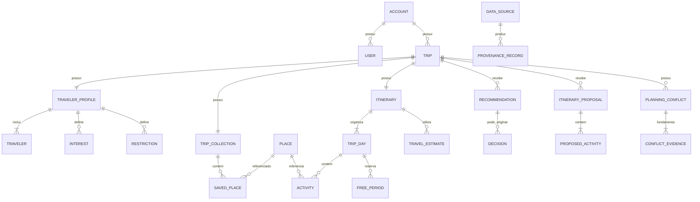
```mermaid
erDiagram
    ACCOUNT ||--o{ USER : possui
    ACCOUNT ||--o{ TRIP : possui

    TRIP ||--|| TRAVELER_PROFILE : possui
    TRIP ||--|| TRIP_COLLECTION : possui
    TRIP ||--|| ITINERARY : possui

    TRAVELER_PROFILE ||--|{ TRAVELER : inclui
    TRAVELER_PROFILE ||--o{ INTEREST : define
    TRAVELER_PROFILE ||--o{ RESTRICTION : define

    TRIP_COLLECTION ||--o{ SAVED_PLACE : contem
    PLACE ||--o{ SAVED_PLACE : referenciado

    ITINERARY ||--|{ TRIP_DAY : organiza
    TRIP_DAY ||--o{ ACTIVITY : contem
    TRIP_DAY ||--o{ FREE_PERIOD : reserva
    PLACE ||--o{ ACTIVITY : referencia

    ITINERARY ||--o{ TRAVEL_ESTIMATE : utiliza
    TRIP ||--o{ RECOMMENDATION : recebe
    RECOMMENDATION ||--o{ DECISION : pode_originar

    TRIP ||--o{ ITINERARY_PROPOSAL : recebe
    ITINERARY_PROPOSAL ||--|{ PROPOSED_ACTIVITY : contem

    TRIP ||--o{ PLANNING_CONFLICT : possui
    PLANNING_CONFLICT ||--|{ CONFLICT_EVIDENCE : fundamenta

    DATA_SOURCE ||--o{ PROVENANCE_RECORD : produz
```

---

### 134. Limites de ownership

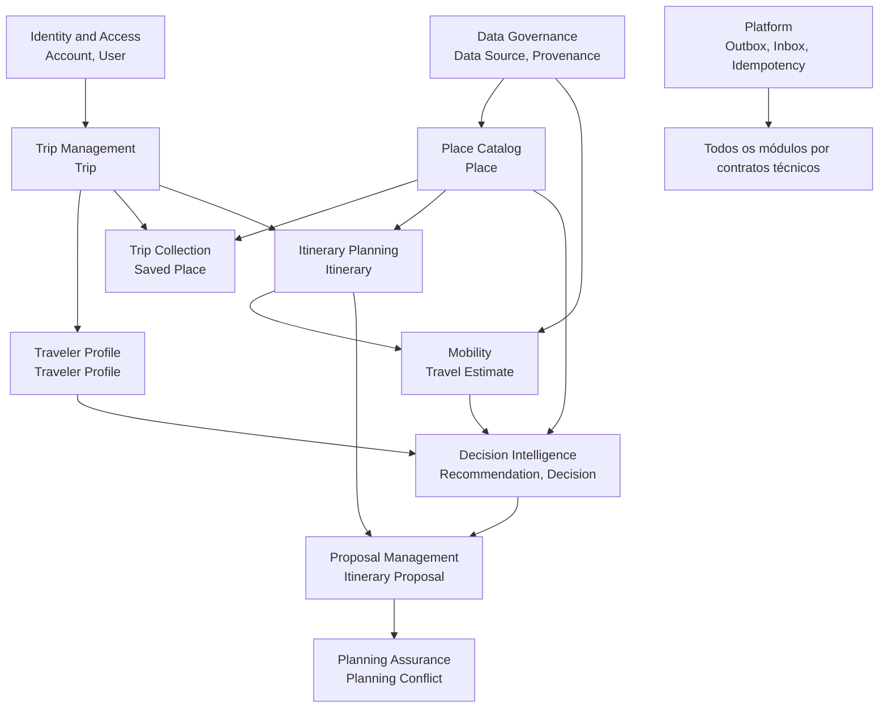
```mermaid
flowchart TB
    IAM["Identity and Access<br/>Account, User"]
    Trip["Trip Management<br/>Trip"]
    Traveler["Traveler Profile<br/>Traveler Profile"]
    Place["Place Catalog<br/>Place"]
    Collection["Trip Collection<br/>Saved Place"]
    Itinerary["Itinerary Planning<br/>Itinerary"]
    Mobility["Mobility<br/>Travel Estimate"]
    Decision["Decision Intelligence<br/>Recommendation, Decision"]
    Proposal["Proposal Management<br/>Itinerary Proposal"]
    Assurance["Planning Assurance<br/>Planning Conflict"]
    Governance["Data Governance<br/>Data Source, Provenance"]
    Platform["Platform<br/>Outbox, Inbox, Idempotency"]

    IAM --> Trip
    Trip --> Traveler
    Trip --> Collection
    Trip --> Itinerary
    Place --> Collection
    Place --> Itinerary
    Itinerary --> Mobility
    Traveler --> Decision
    Place --> Decision
    Mobility --> Decision
    Decision --> Proposal
    Itinerary --> Proposal
    Proposal --> Assurance
    Governance --> Place
    Governance --> Mobility
    Platform --> All["Todos os módulos por contratos técnicos"]
```

---

## Parte XXV — Anti-patterns

### 135. Tabela genérica universal

Não utilizar:

```text
entity
entity_attribute
entity_relation
```

para representar todo o domínio.

---

### 136. JSON como fuga da modelagem

Não armazenar agregados inteiros em JSON sem necessidade comprovada.

---

### 137. IDs externos como chave primária

Não utilizar externalId como PlaceId, UserId ou outra identidade canônica.

---

### 138. Recommendation dentro de Trip

Recommendation não deverá ser coluna ou JSON interno de Trip.

---

### 139. Proposal dentro de Itinerary

Itinerary Proposal não deverá ser persistida como versão do Itinerary canônico.

---

### 140. Planning Conflict dentro de Activity

Planning Conflict deverá possuir entidade própria e referências.

---

### 141. Decision como status da Recommendation

Decision deverá possuir identidade, autoria e ciclo próprios.

---

### 142. Group Profile canônico

Group Profile é derivado e não deverá substituir Travelers e Preferences.

---

### 143. ORM compartilhado

Modelos ORM não deverão ser importados entre módulos.

---

### 144. Soft delete universal

Exclusão lógica não deverá ser aplicada a todas as entidades sem justificativa.

---

### 145. Histórico apenas em logs

Logs técnicos não substituem auditoria, Eventos ou histórico necessário.

---

### 146. Constraint apenas no código

Invariantes simples deverão ser reforçadas no banco quando possível.

---

## Parte XXVI — Evolução

### 147. Fase inicial

* banco relacional;
* schemas lógicos;
* entidades canônicas;
* concorrência otimista;
* Outbox;
* projeções básicas;
* índices essenciais;
* geodados simples;
* retenção inicial.

---

### 148. Fase intermediária

* Inbox;
* fila;
* projeções assíncronas;
* busca especializada;
* índice espacial;
* réplica de leitura;
* políticas de retenção automatizadas;
* auditoria avançada;
* reconstrução de projeções.

---

### 149. Fase avançada

Somente por evidência:

* bancos separados;
* CDC;
* data warehouse;
* streaming;
* temporal tables;
* particionamento;
* armazenamento especializado;
* Event Store;
* multi-region.

---

### 150. Compatibilidade

Mudanças deverão utilizar estratégias como:

* expand and contract;
* backfill;
* dual read;
* dual write temporário;
* projection rebuild;
* versionamento.

---

## Parte XXVII — Governança

### 151. Owner

O owner deste documento é:

```text
Data
```

A manutenção deverá envolver:

* Architecture;
* Domain;
* Backend;
* Security;
* Privacy;
* QA;
* Platform;
* AI.

---

### 152. Inclusão de entidade

Uma nova entidade deverá possuir:

* conceito;
* owner;
* natureza;
* identidade;
* ciclo de vida;
* relações;
* constraints;
* retenção;
* classificação;
* índices;
* eventos relacionados.

---

### 153. Alteração de entidade

Mudanças deverão avaliar:

* domínio;
* API;
* migrations;
* compatibilidade;
* projeções;
* eventos;
* retenção;
* segurança;
* testes.

---

### 154. Alteração de ownership

Exige:

* ADR;
* migração;
* atualização de contratos;
* atualização de Eventos;
* atualização de documentação;
* plano de transição.

---

### 155. Nova projeção

Deverá definir:

* finalidade;
* Fontes;
* Eventos;
* versão;
* rebuild;
* SLA de atualização;
* owner;
* retenção.

---

### 156. Uso por agentes de engenharia

Agentes deverão:

* consultar este modelo;
* identificar owner;
* preservar identificadores;
* respeitar cardinalidades;
* criar constraints;
* criar migrations;
* preservar versões;
* não duplicar estado canônico;
* não criar tabelas genéricas sem necessidade;
* sugerir ADR para mudanças estruturais.

---

## Parte XXVIII — Catálogo de diagramas

### 157. Diagramas desta versão

| ID conceitual   | Diagrama                           |
| --------------- | ---------------------------------- |
| RB-DGM-DATA-001 | Autoridade documental              |
| RB-DGM-DATA-002 | Mapa lógico dos agregados          |
| RB-DGM-DATA-003 | Identity and Access                |
| RB-DGM-DATA-004 | Trip Management                    |
| RB-DGM-DATA-005 | Traveler Profile                   |
| RB-DGM-DATA-006 | Place Catalog                      |
| RB-DGM-DATA-007 | Trip Collection                    |
| RB-DGM-DATA-008 | Itinerary Planning                 |
| RB-DGM-DATA-009 | Mobility                           |
| RB-DGM-DATA-010 | Decision Intelligence              |
| RB-DGM-DATA-011 | Proposal Management                |
| RB-DGM-DATA-012 | Planning Assurance                 |
| RB-DGM-DATA-013 | Data Governance                    |
| RB-DGM-DATA-014 | Estruturas técnicas                |
| RB-DGM-DATA-015 | Fluxo de projeções                 |
| RB-DGM-DATA-016 | Ciclo de dados contextuais         |
| RB-DGM-DATA-017 | Aplicação transacional de Proposal |
| RB-DGM-DATA-018 | Modelo lógico central              |
| RB-DGM-DATA-019 | Limites de ownership               |

---

### 158. Critério de inclusão

Os diagramas foram utilizados para representar:

* relações;
* cardinalidades;
* ownership;
* agregados;
* estruturas técnicas;
* ciclo de vida;
* transações;
* projeções.

Diagramas físicos completos de tabelas e colunas deverão pertencer ao próximo documento de modelagem física.

---

## Parte XXIX — Critérios de aceite

### 159. Estrutura

* entidades lógicas estão definidas;
* owners estão definidos;
* identificadores são canônicos;
* cardinalidades estão definidas;
* constraints estão definidas;
* índices conceituais estão definidos;
* estados são controlados;
* timestamps são coerentes.

---

### 160. Domínio

* Recommendation é distinta de Decision;
* Decision é distinta de execução;
* Itinerary Proposal é distinta de Itinerary;
* Proposed Activity é distinta de Activity;
* Planning Conflict possui entidade própria;
* Group Profile é derivado;
* Saved Place não altera Place;
* Travel Estimate é estimativa.

---

### 161. Versionamento

* TripContextVersion está persistida;
* ItineraryVersion está persistida;
* aggregateVersion está prevista;
* schemaVersion está prevista;
* projectionVersion está prevista;
* versões não são intercambiáveis.

---

### 162. Persistência técnica

* Outbox está modelada;
* Inbox está modelada;
* idempotência está modelada;
* auditoria está modelada;
* jobs estão modelados;
* consumidores duplicados são evitados.

---

### 163. Dados externos

* External Reference está separada;
* Provenance está modelada;
* Data Source está modelada;
* Data Conflict está modelado;
* unknown permanece representável;
* precisão não é ampliada.

---

### 164. Privacidade

* classificação está prevista;
* retenção está prevista;
* exclusão está prevista;
* anonimização está prevista;
* dados de menores são minimizados;
* snapshots possuem classificação.

---

### 165. Diagramas

* Mermaid renderiza no GitHub;
* relações estão coerentes;
* cardinalidades não contradizem regras;
* diagramas utilizam termos oficiais;
* diagramas não definem tipos físicos definitivos;
* blocos Mermaid não possuem atributos adicionais.

---

## Parte XXX — Checklist final

### 166. Checklist documental

Antes de aprovar:

* frontmatter YAML é válido;
* existe apenas um H1;
* Partes utilizam H2;
* seções numeradas utilizam H3;
* propósito está definido;
* convenções estão definidas;
* mapa geral está definido;
* Identity and Access está modelado;
* Trip Management está modelado;
* Traveler Profile está modelado;
* Place Catalog está modelado;
* Trip Collection está modelada;
* Itinerary Planning está modelado;
* Mobility está modelada;
* Decision Intelligence está modelada;
* Proposal Management está modelado;
* Planning Assurance está modelado;
* Data Governance está modelada;
* Platform Data está modelada;
* auditoria está modelada;
* projeções estão modeladas;
* cardinalidades estão definidas;
* constraints estão definidas;
* índices estão definidos;
* retenção está definida;
* transações estão definidas;
* rastreabilidade está presente;
* anti-patterns estão definidos;
* evolução está definida;
* governança está definida;
* diagramas são necessários e não decorativos;
* Mermaid renderiza no GitHub;
* não existem contradições com RB-DOM-001;
* não existem contradições com RB-DOM-002;
* não existem contradições com RB-DOM-003;
* não existem contradições com RB-DOM-004;
* não existem contradições com RB-ARC-001;
* não existem contradições com RB-ARC-002;
* não existem contradições com RB-ARC-003;
* não existem contradições com RB-ARC-004;
* não existem contradições com RB-ARC-005.

---

## Parte XXXI — Declaração final

### 167. Declaração do modelo lógico

O modelo lógico de dados do RouteBook deverá representar fielmente o domínio e proteger os limites definidos pela arquitetura.

Cada entidade deverá:

* possuir owner;
* possuir identidade estável;
* possuir natureza conhecida;
* respeitar cardinalidades;
* respeitar constraints;
* preservar versionamento;
* possuir estratégia de retenção;
* respeitar classificação;
* permitir auditoria;
* permitir evolução.

O modelo deverá preservar especialmente:

* Trip como estado canônico de Trip Management;
* Traveler Profile como owner dos Travelers e Preferences;
* Place como estado canônico do Place Catalog;
* Trip Collection como owner dos Saved Places;
* Itinerary como estado canônico do planejamento;
* Recommendation como estado contextual;
* Decision como registro canônico da escolha;
* Itinerary Proposal como estado isolado;
* Planning Conflict como entidade própria;
* Data Source e Provenance como base de confiança;
* Outbox e Inbox como estruturas técnicas;
* projeções como dados reconstruíveis.

Nenhuma tabela, relação, migration, projeção, cache, integração, ferramenta ou agente de IA poderá:

* duplicar estado canônico;
* alterar ownership;
* utilizar IDs externos como identidade interna;
* transformar estimativa em confirmação;
* transformar Recommendation em Decision;
* transformar Proposal em Itinerary sem aceite;
* transformar ignored em resolved;
* transformar projeção em fonte de verdade;
* contornar invariantes ou autorizações.

A implementação física deverá derivar deste modelo lógico e permanecer consistente com ele.
