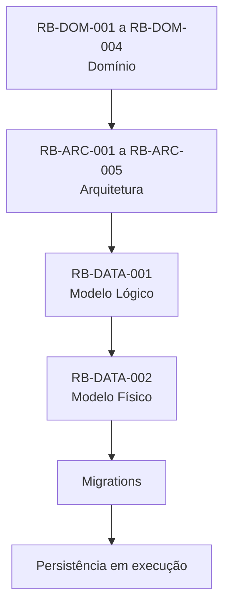
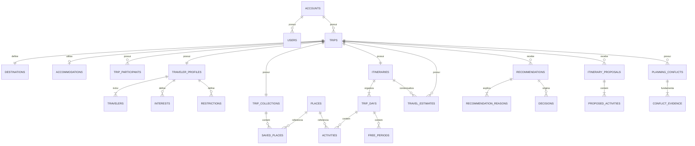

---

id: RB-DATA-002

title: Modelo Físico de Dados e Estratégia de Migrations
description: Define o modelo físico inicial de dados do RouteBook, incluindo schemas, tabelas, colunas, tipos, chaves, constraints, índices, concorrência, Outbox, Inbox, idempotência, auditoria, geodados, migrations, backfills, seeds, rollback, roll-forward e governança de evolução.

document_type: data
owner: Data

status: Draft
version: "0.1.0"

created: "2026-07-18"
last_updated: null

authors:

- RouteBook Team

tags:

- data
- physical-data-model
- database
- relational-database
- postgresql
- schemas
- tables
- constraints
- indexes
- migrations
- backfills
- outbox
- inbox
- idempotency
- geospatial
- audit
- diagrams
- mermaid

related_documents:

- RB-CORE-0001
- RB-CORE-0002
- RB-CORE-0003
- RB-CORE-0004
- RB-DOM-001
- RB-DOM-002
- RB-DOM-003
- RB-DOM-004
- RB-ARC-001
- RB-ARC-002
- RB-ARC-003
- RB-ARC-004
- RB-ARC-005
- RB-DATA-001

prerequisites:

- RB-CORE-0004
- RB-DOM-001
- RB-DOM-002
- RB-DOM-003
- RB-DOM-004
- RB-ARC-001
- RB-ARC-002
- RB-ARC-003
- RB-ARC-004
- RB-ARC-005
- RB-DATA-001

next_documents:

- RB-API-001
- RB-SEC-001
- RB-OBS-001
- RB-QA-001
- RB-DATA-003

ai_context:
priority: critical
index: true
---

# RouteBook — Modelo Físico de Dados e Estratégia de Migrations

## Parte I — Fundamentos

### 1. Propósito deste documento

Este documento define a especificação física inicial de persistência do RouteBook.

Seu objetivo é transformar o `RB-DATA-001 — Modelo Lógico de Dados` em uma estrutura implementável, incluindo:

* tecnologia relacional de referência;
* schemas;
* tabelas;
* colunas;
* tipos de dados;
* chaves primárias;
* chaves estrangeiras;
* constraints;
* índices;
* enums persistidos;
* campos JSON controlados;
* versionamento;
* concorrência otimista;
* estruturas de Outbox;
* estruturas de Inbox;
* idempotência;
* auditoria;
* geodados;
* read models;
* migrations;
* backfills;
* seeds;
* rollback;
* roll-forward;
* governança de evolução.

Este documento deverá orientar:

* implementação do banco;
* criação de migrations;
* implementação de repositórios;
* configuração do ORM;
* testes de integração;
* testes de migrations;
* observabilidade;
* segurança;
* operação;
* backup;
* agentes de engenharia.

---

### 2. Autoridade documental

A implementação física deverá respeitar:



A modelagem física não poderá redefinir:

* ownership;
* agregados;
* identificadores;
* ciclos de vida;
* invariantes;
* Eventos de Domínio;
* separação entre estado canônico, contextual e derivado.

---

### 3. Tecnologia de referência

A tecnologia relacional de referência será:

```text
PostgreSQL
```

Essa escolha não transforma recursos específicos do PostgreSQL em regras de domínio.

A implementação poderá utilizar recursos compatíveis, incluindo:

* schemas;
* UUID ou identificador ordenável;
* `jsonb`;
* índices parciais;
* índices compostos;
* constraints;
* transações;
* locking otimista;
* extensão geográfica futura;
* notificações e filas externas quando necessárias.

---

### 4. Diretrizes gerais

O modelo físico deverá:

1. preservar ownership por schema;
2. evitar escrita cruzada;
3. reforçar invariantes simples;
4. manter regras complexas no domínio;
5. evitar tabelas genéricas;
6. evitar JSON sem contrato;
7. permitir evolução compatível;
8. preservar rastreabilidade;
9. permitir restauração;
10. minimizar dados pessoais;
11. permitir reconstrução de projeções;
12. suportar concorrência;
13. suportar idempotência;
14. preservar Provenance;
15. permitir extração futura de módulos.

---

## Parte II — Convenções físicas

### 5. Convenção de nomes

Schemas, tabelas e colunas deverão utilizar:

```text
snake_case
```

Exemplos:

```text
trip_management.trips
itinerary_planning.activities
proposal_management.itinerary_proposals
planning_assurance.planning_conflicts
```

---

### 6. Nomes de tabelas

Tabelas deverão utilizar substantivos no plural.

Exemplos:

```text
trips
travelers
places
activities
recommendations
decisions
```

---

### 7. Nomes de chaves

Chaves primárias:

```text
trip_id
place_id
activity_id
```

Chaves estrangeiras deverão reutilizar o mesmo nome da chave referenciada.

---

### 8. Identificadores

A implementação inicial deverá utilizar um identificador globalmente único.

Opções compatíveis:

* UUID v7;
* ULID persistido de forma adequada;
* identificador ordenável equivalente.

A escolha definitiva deverá ser registrada por ADR.

---

### 9. Tipos temporais

Utilizar:

| Conceito        | Tipo físico sugerido               |
| --------------- | ---------------------------------- |
| instante global | `timestamptz`                      |
| data local      | `date`                             |
| horário local   | `time`                             |
| fuso            | `varchar` com identificador IANA   |
| duração         | inteiro em segundos ou minutos     |
| período         | colunas explícitas de início e fim |

Não utilizar timestamp sem fuso para eventos globais.

---

### 10. Valores monetários

Persistir:

```text
amount numeric(19,4)
currency char(3)
```

A escala física poderá ser refinada por ADR.

---

### 11. Texto

Tipos sugeridos:

* `varchar(n)` para valores controlados;
* `text` para conteúdo livre;
* limites deverão existir na API e, quando adequado, no banco.

---

### 12. Booleanos

Booleanos deverão representar somente estados binários reais.

Não utilizar booleano quando existirem:

* unknown;
* pending;
* not_applicable;
* revoked;
* expired.

---

### 13. Enums

Enums de domínio deverão ser persistidos preferencialmente como texto estável.

Vantagens:

* leitura humana;
* evolução menos rígida;
* redução de lock-in em tipos nativos.

Constraints deverão limitar valores conhecidos quando apropriado.

---

### 14. JSON controlado

`jsonb` poderá ser utilizado para:

* payload de Eventos;
* metadata externa;
* Context Snapshots;
* read models compostos;
* atributos de baixa frequência relacional.

Todo JSON relevante deverá possuir:

* owner;
* schemaVersion;
* validação;
* tamanho máximo;
* política de evolução.

---

### 15. Colunas de controle

Agregados deverão considerar:

```text
aggregate_version integer not null
created_at timestamptz not null
updated_at timestamptz not null
```

Estados contextuais poderão possuir:

```text
expired_at
invalidated_at
superseded_at
```

---

## Parte III — Organização por schemas

### 16. Schemas físicos iniciais

```text
identity_access
trip_management
traveler_profile
place_catalog
trip_collection
itinerary_planning
mobility
decision_intelligence
proposal_management
planning_assurance
data_governance
platform
read_models
audit
```

---

### 17. Ownership dos schemas

| Schema                  | Owner                     |
| ----------------------- | ------------------------- |
| `identity_access`       | Identity and Access       |
| `trip_management`       | Trip Management           |
| `traveler_profile`      | Traveler Profile          |
| `place_catalog`         | Place Catalog             |
| `trip_collection`       | Trip Collection           |
| `itinerary_planning`    | Itinerary Planning        |
| `mobility`              | Mobility                  |
| `decision_intelligence` | Decision Intelligence     |
| `proposal_management`   | Proposal Management       |
| `planning_assurance`    | Planning Assurance        |
| `data_governance`       | Data Governance           |
| `platform`              | Platform                  |
| `read_models`           | Read Model Infrastructure |
| `audit`                 | Security, Data e Platform |

---

### 18. Visão física geral

```mermaid
flowchart TB
    DB[("PostgreSQL")]

    IAM["identity_access"]
    Trip["trip_management"]
    Traveler["traveler_profile"]
    Place["place_catalog"]
    Collection["trip_collection"]
    Itinerary["itinerary_planning"]
    Mobility["mobility"]
    Decision["decision_intelligence"]
    Proposal["proposal_management"]
    Assurance["planning_assurance"]
    Governance["data_governance"]
    Platform["platform"]
    Reads["read_models"]
    Audit["audit"]

    DB --> IAM
    DB --> Trip
    DB --> Traveler
    DB --> Place
    DB --> Collection
    DB --> Itinerary
    DB --> Mobility
    DB --> Decision
    DB --> Proposal
    DB --> Assurance
    DB --> Governance
    DB --> Platform
    DB --> Reads
    DB --> Audit
```



---

## Parte IV — Identity and Access

### 19. Tabela `identity_access.accounts`

| Coluna              | Tipo         | Regras              |
| ------------------- | ------------ | ------------------- |
| `account_id`        | UUID         | PK                  |
| `name`              | varchar(160) | not null            |
| `status`            | varchar(32)  | not null            |
| `aggregate_version` | integer      | not null, default 1 |
| `created_at`        | timestamptz  | not null            |
| `updated_at`        | timestamptz  | not null            |
| `closed_at`         | timestamptz  | nullable            |

Constraints:

```text
status IN ('active', 'suspended', 'closed')
aggregate_version > 0
```

Índices:

```text
accounts(status)
accounts(created_at)
```

---

### 20. Tabela `identity_access.users`

| Coluna              | Tipo         | Regras   |
| ------------------- | ------------ | -------- |
| `user_id`           | UUID         | PK       |
| `account_id`        | UUID         | FK       |
| `display_name`      | varchar(160) | not null |
| `primary_email`     | varchar(320) | not null |
| `normalized_email`  | varchar(320) | not null |
| `status`            | varchar(32)  | not null |
| `locale`            | varchar(16)  | not null |
| `time_zone`         | varchar(64)  | nullable |
| `aggregate_version` | integer      | not null |
| `created_at`        | timestamptz  | not null |
| `updated_at`        | timestamptz  | not null |
| `deactivated_at`    | timestamptz  | nullable |

Constraints:

```text
status IN ('active', 'invited', 'suspended', 'deactivated')
```

Índices:

```text
UNIQUE(normalized_email)
users(account_id, status)
```

A unicidade global de email poderá ser revista conforme a estratégia de identidade.

---

### 21. Tabela `identity_access.external_identity_references`

| Coluna                           | Tipo         | Regras   |
| -------------------------------- | ------------ | -------- |
| `external_identity_reference_id` | UUID         | PK       |
| `user_id`                        | UUID         | FK       |
| `provider`                       | varchar(64)  | not null |
| `external_subject`               | varchar(255) | not null |
| `status`                         | varchar(32)  | not null |
| `created_at`                     | timestamptz  | not null |
| `last_authenticated_at`          | timestamptz  | nullable |

Constraint principal:

```text
UNIQUE(provider, external_subject)
```

---

### 22. Tabela `identity_access.consents`

| Coluna           | Tipo        | Regras   |
| ---------------- | ----------- | -------- |
| `consent_id`     | UUID        | PK       |
| `user_id`        | UUID        | FK       |
| `consent_type`   | varchar(80) | not null |
| `status`         | varchar(32) | not null |
| `policy_version` | varchar(32) | not null |
| `source`         | varchar(64) | not null |
| `granted_at`     | timestamptz | nullable |
| `revoked_at`     | timestamptz | nullable |
| `created_at`     | timestamptz | not null |

Constraint:

```text
revoked_at IS NULL OR granted_at IS NULL OR revoked_at >= granted_at
```

---

## Parte V — Trip Management

### 23. Tabela `trip_management.trips`

| Coluna                 | Tipo         | Regras                       |
| ---------------------- | ------------ | ---------------------------- |
| `trip_id`              | UUID         | PK                           |
| `account_id`           | UUID         | referência externa ao schema |
| `name`                 | varchar(180) | not null                     |
| `status`               | varchar(32)  | not null                     |
| `start_date`           | date         | nullable                     |
| `end_date`             | date         | nullable                     |
| `time_zone`            | varchar(64)  | nullable                     |
| `trip_context_version` | integer      | not null, default 1          |
| `aggregate_version`    | integer      | not null, default 1          |
| `created_at`           | timestamptz  | not null                     |
| `updated_at`           | timestamptz  | not null                     |
| `cancelled_at`         | timestamptz  | nullable                     |
| `archived_at`          | timestamptz  | nullable                     |
| `deleted_at`           | timestamptz  | nullable                     |

Constraints:

```text
start_date IS NULL
OR end_date IS NULL
OR start_date <= end_date
```

```text
trip_context_version > 0
aggregate_version > 0
```

Status:

```text
draft
planning
active
completed
cancelled
archived
deleted
```

Índices:

```text
trips(account_id, status)
trips(start_date, end_date)
trips(updated_at)
```

---

### 24. Tabela `trip_management.destinations`

| Coluna               | Tipo         | Regras              |
| -------------------- | ------------ | ------------------- |
| `destination_id`     | UUID         | PK                  |
| `trip_id`            | UUID         | FK, unique          |
| `name`               | varchar(180) | not null            |
| `country_code`       | char(2)      | nullable            |
| `region`             | varchar(160) | nullable            |
| `city`               | varchar(160) | nullable            |
| `latitude`           | numeric(9,6) | nullable            |
| `longitude`          | numeric(9,6) | nullable            |
| `location_precision` | varchar(32)  | nullable            |
| `time_zone`          | varchar(64)  | nullable            |
| `place_id`           | UUID         | referência opcional |
| `created_at`         | timestamptz  | not null            |
| `updated_at`         | timestamptz  | not null            |

Constraints:

```text
latitude BETWEEN -90 AND 90
longitude BETWEEN -180 AND 180
```

---

### 25. Tabela `trip_management.accommodations`

| Coluna             | Tipo         | Regras   |
| ------------------ | ------------ | -------- |
| `accommodation_id` | UUID         | PK       |
| `trip_id`          | UUID         | FK       |
| `place_id`         | UUID         | nullable |
| `name`             | varchar(180) | not null |
| `address_text`     | text         | nullable |
| `latitude`         | numeric(9,6) | nullable |
| `longitude`        | numeric(9,6) | nullable |
| `check_in_at`      | timestamptz  | nullable |
| `check_out_at`     | timestamptz  | nullable |
| `notes`            | text         | nullable |
| `status`           | varchar(32)  | not null |
| `created_at`       | timestamptz  | not null |
| `updated_at`       | timestamptz  | not null |
| `removed_at`       | timestamptz  | nullable |

Constraints:

```text
check_out_at IS NULL
OR check_in_at IS NULL
OR check_out_at >= check_in_at
```

Índice parcial:

```text
UNIQUE(trip_id) WHERE removed_at IS NULL
```

---

### 26. Tabela `trip_management.trip_participants`

| Coluna                | Tipo        | Regras     |
| --------------------- | ----------- | ---------- |
| `trip_participant_id` | UUID        | PK         |
| `trip_id`             | UUID        | FK         |
| `user_id`             | UUID        | referência |
| `role`                | varchar(32) | not null   |
| `status`              | varchar(32) | not null   |
| `joined_at`           | timestamptz | not null   |
| `removed_at`          | timestamptz | nullable   |

Índice parcial:

```text
UNIQUE(trip_id, user_id) WHERE removed_at IS NULL
```

Papéis iniciais:

```text
owner
editor
viewer
```

A regra do último owner permanecerá no domínio e deverá possuir teste de integração.

---

## Parte VI — Traveler Profile

### 27. Tabela `traveler_profile.traveler_profiles`

| Coluna                     | Tipo          | Regras   |
| -------------------------- | ------------- | -------- |
| `traveler_profile_id`      | UUID          | PK       |
| `trip_id`                  | UUID          | unique   |
| `budget_amount`            | numeric(19,4) | nullable |
| `budget_currency`          | char(3)       | nullable |
| `pace`                     | varchar(32)   | nullable |
| `preferred_transport_mode` | varchar(32)   | nullable |
| `aggregate_version`        | integer       | not null |
| `created_at`               | timestamptz   | not null |
| `updated_at`               | timestamptz   | not null |

Constraint:

```text
budget_amount IS NULL
OR budget_currency IS NOT NULL
```

---

### 28. Tabela `traveler_profile.travelers`

| Coluna                | Tipo         | Regras   |
| --------------------- | ------------ | -------- |
| `traveler_id`         | UUID         | PK       |
| `traveler_profile_id` | UUID         | FK       |
| `user_id`             | UUID         | nullable |
| `display_name`        | varchar(160) | not null |
| `traveler_type`       | varchar(32)  | not null |
| `age_range`           | varchar(32)  | nullable |
| `mobility_profile`    | jsonb        | nullable |
| `status`              | varchar(32)  | not null |
| `created_at`          | timestamptz  | not null |
| `updated_at`          | timestamptz  | not null |
| `removed_at`          | timestamptz  | nullable |

Índice parcial:

```text
UNIQUE(traveler_profile_id, user_id)
WHERE user_id IS NOT NULL AND removed_at IS NULL
```

---

### 29. Tabela `traveler_profile.interests`

| Coluna                | Tipo        | Regras   |
| --------------------- | ----------- | -------- |
| `interest_id`         | UUID        | PK       |
| `traveler_profile_id` | UUID        | FK       |
| `traveler_id`         | UUID        | nullable |
| `interest_type`       | varchar(80) | not null |
| `priority`            | smallint    | not null |
| `source`              | varchar(32) | not null |
| `created_at`          | timestamptz | not null |
| `removed_at`          | timestamptz | nullable |

Constraint:

```text
priority BETWEEN 1 AND 5
```

---

### 30. Tabela `traveler_profile.restrictions`

| Coluna                | Tipo        | Regras   |
| --------------------- | ----------- | -------- |
| `restriction_id`      | UUID        | PK       |
| `traveler_profile_id` | UUID        | FK       |
| `traveler_id`         | UUID        | nullable |
| `restriction_type`    | varchar(80) | not null |
| `severity`            | varchar(32) | nullable |
| `enforcement`         | varchar(32) | not null |
| `description`         | text        | nullable |
| `source`              | varchar(32) | not null |
| `status`              | varchar(32) | not null |
| `created_at`          | timestamptz | not null |
| `updated_at`          | timestamptz | not null |
| `removed_at`          | timestamptz | nullable |

Enforcement:

```text
mandatory
preference
```

---

## Parte VII — Place Catalog

### 31. Tabela `place_catalog.places`

| Coluna                 | Tipo         | Regras   |
| ---------------------- | ------------ | -------- |
| `place_id`             | UUID         | PK       |
| `canonical_name`       | varchar(240) | not null |
| `description`          | text         | nullable |
| `primary_category`     | varchar(80)  | nullable |
| `operational_status`   | varchar(32)  | not null |
| `price_range`          | varchar(32)  | nullable |
| `rating_value`         | numeric(6,3) | nullable |
| `rating_scale`         | numeric(6,3) | nullable |
| `rating_count`         | integer      | nullable |
| `website`              | text         | nullable |
| `phone`                | varchar(64)  | nullable |
| `status`               | varchar(32)  | not null |
| `aggregate_version`    | integer      | not null |
| `created_at`           | timestamptz  | not null |
| `updated_at`           | timestamptz  | not null |
| `merged_into_place_id` | UUID         | nullable |

Constraints:

```text
rating_value IS NULL
OR rating_scale IS NULL
OR rating_value BETWEEN 0 AND rating_scale
```

```text
rating_count IS NULL OR rating_count >= 0
```

Operational status:

```text
open
temporarily_closed
permanently_closed
unknown
```

---

### 32. Tabela `place_catalog.place_locations`

| Coluna              | Tipo         | Regras     |
| ------------------- | ------------ | ---------- |
| `place_location_id` | UUID         | PK         |
| `place_id`          | UUID         | FK, unique |
| `latitude`          | numeric(9,6) | not null   |
| `longitude`         | numeric(9,6) | not null   |
| `precision`         | varchar(32)  | not null   |
| `address_line`      | text         | nullable   |
| `neighborhood`      | varchar(160) | nullable   |
| `city`              | varchar(160) | nullable   |
| `region`            | varchar(160) | nullable   |
| `postal_code`       | varchar(32)  | nullable   |
| `country_code`      | char(2)      | nullable   |
| `time_zone`         | varchar(64)  | nullable   |
| `created_at`        | timestamptz  | not null   |
| `updated_at`        | timestamptz  | not null   |

---

### 33. Geodados

Fase inicial:

```text
latitude numeric(9,6)
longitude numeric(9,6)
```

Evolução futura:

```text
geography(Point, 4326)
```

A adoção de PostGIS deverá ser registrada por ADR.

---

### 34. Tabela `place_catalog.place_categories`

| Coluna              | Tipo        | Regras   |
| ------------------- | ----------- | -------- |
| `place_category_id` | UUID        | PK       |
| `place_id`          | UUID        | FK       |
| `category`          | varchar(80) | not null |
| `is_primary`        | boolean     | not null |
| `source`            | varchar(32) | not null |
| `created_at`        | timestamptz | not null |

Constraints:

```text
UNIQUE(place_id, category)
```

Índice parcial:

```text
UNIQUE(place_id) WHERE is_primary = true
```

---

### 35. Tabela `place_catalog.opening_hours`

| Coluna                 | Tipo        | Regras   |
| ---------------------- | ----------- | -------- |
| `opening_hours_id`     | UUID        | PK       |
| `place_id`             | UUID        | FK       |
| `day_of_week`          | smallint    | nullable |
| `specific_date`        | date        | nullable |
| `opens_at`             | time        | nullable |
| `closes_at`            | time        | nullable |
| `time_zone`            | varchar(64) | nullable |
| `status`               | varchar(32) | not null |
| `valid_from`           | date        | nullable |
| `valid_until`          | date        | nullable |
| `provenance_record_id` | UUID        | nullable |

Constraint:

```text
day_of_week BETWEEN 0 AND 6
OR day_of_week IS NULL
```

---

### 36. Tabela `place_catalog.external_place_references`

| Coluna                        | Tipo         | Regras     |
| ----------------------------- | ------------ | ---------- |
| `external_place_reference_id` | UUID         | PK         |
| `place_id`                    | UUID         | FK         |
| `data_source_id`              | UUID         | referência |
| `provider`                    | varchar(80)  | not null   |
| `external_id`                 | varchar(255) | not null   |
| `status`                      | varchar(32)  | not null   |
| `metadata`                    | jsonb        | nullable   |
| `collected_at`                | timestamptz  | not null   |
| `last_verified_at`            | timestamptz  | nullable   |

Constraint:

```text
UNIQUE(provider, external_id)
```

---

### 37. Tabela `place_catalog.place_images`

| Coluna               | Tipo         | Regras   |
| -------------------- | ------------ | -------- |
| `place_image_id`     | UUID         | PK       |
| `place_id`           | UUID         | FK       |
| `data_source_id`     | UUID         | nullable |
| `external_reference` | text         | nullable |
| `storage_reference`  | text         | nullable |
| `attribution`        | text         | nullable |
| `license`            | varchar(120) | nullable |
| `width`              | integer      | nullable |
| `height`             | integer      | nullable |
| `status`             | varchar(32)  | not null |
| `expires_at`         | timestamptz  | nullable |
| `created_at`         | timestamptz  | not null |

---

## Parte VIII — Trip Collection

### 38. Tabela `trip_collection.trip_collections`

| Coluna               | Tipo        | Regras   |
| -------------------- | ----------- | -------- |
| `trip_collection_id` | UUID        | PK       |
| `trip_id`            | UUID        | unique   |
| `aggregate_version`  | integer     | not null |
| `created_at`         | timestamptz | not null |
| `updated_at`         | timestamptz | not null |

---

### 39. Tabela `trip_collection.saved_places`

| Coluna                | Tipo        | Regras   |
| --------------------- | ----------- | -------- |
| `saved_place_id`      | UUID        | PK       |
| `trip_collection_id`  | UUID        | FK       |
| `trip_id`             | UUID        | not null |
| `place_id`            | UUID        | not null |
| `origin`              | varchar(32) | not null |
| `note`                | text        | nullable |
| `saved_by_actor_type` | varchar(32) | not null |
| `saved_by_actor_id`   | UUID        | nullable |
| `status`              | varchar(32) | not null |
| `saved_at`            | timestamptz | not null |
| `updated_at`          | timestamptz | not null |
| `removed_at`          | timestamptz | nullable |

Índice parcial:

```text
UNIQUE(trip_id, place_id)
WHERE removed_at IS NULL
```

---

## Parte IX — Itinerary Planning

### 40. Tabela `itinerary_planning.itineraries`

| Coluna                  | Tipo        | Regras   |
| ----------------------- | ----------- | -------- |
| `itinerary_id`          | UUID        | PK       |
| `trip_id`               | UUID        | unique   |
| `itinerary_version`     | integer     | not null |
| `aggregate_version`     | integer     | not null |
| `planning_completeness` | varchar(32) | not null |
| `review_state`          | varchar(32) | not null |
| `consistency_state`     | varchar(32) | not null |
| `created_at`            | timestamptz | not null |
| `updated_at`            | timestamptz | not null |
| `outdated_at`           | timestamptz | nullable |

Constraints:

```text
itinerary_version > 0
aggregate_version > 0
```

---

### 41. Tabela `itinerary_planning.trip_days`

| Coluna         | Tipo         | Regras   |
| -------------- | ------------ | -------- |
| `trip_day_id`  | UUID         | PK       |
| `itinerary_id` | UUID         | FK       |
| `trip_id`      | UUID         | not null |
| `local_date`   | date         | not null |
| `day_order`    | integer      | not null |
| `status`       | varchar(32)  | not null |
| `title`        | varchar(180) | nullable |
| `notes`        | text         | nullable |
| `created_at`   | timestamptz  | not null |
| `updated_at`   | timestamptz  | not null |
| `removed_at`   | timestamptz  | nullable |

Índices:

```text
UNIQUE(itinerary_id, local_date)
WHERE removed_at IS NULL
```

```text
UNIQUE(itinerary_id, day_order)
WHERE removed_at IS NULL
```

---

### 42. Tabela `itinerary_planning.activities`

| Coluna                    | Tipo          | Regras   |
| ------------------------- | ------------- | -------- |
| `activity_id`             | UUID          | PK       |
| `itinerary_id`            | UUID          | FK       |
| `trip_day_id`             | UUID          | FK       |
| `place_id`                | UUID          | nullable |
| `title`                   | varchar(220)  | not null |
| `description`             | text          | nullable |
| `start_time`              | time          | nullable |
| `duration_minutes`        | integer       | nullable |
| `activity_order`          | integer       | not null |
| `status`                  | varchar(32)   | not null |
| `flexibility`             | varchar(32)   | not null |
| `source_type`             | varchar(32)   | not null |
| `source_reference_id`     | UUID          | nullable |
| `estimated_cost_amount`   | numeric(19,4) | nullable |
| `estimated_cost_currency` | char(3)       | nullable |
| `notes`                   | text          | nullable |
| `aggregate_version`       | integer       | not null |
| `created_at`              | timestamptz   | not null |
| `updated_at`              | timestamptz   | not null |
| `removed_at`              | timestamptz   | nullable |

Constraints:

```text
duration_minutes IS NULL OR duration_minutes > 0
```

```text
estimated_cost_amount IS NULL
OR estimated_cost_currency IS NOT NULL
```

Índices:

```text
activities(trip_day_id, activity_order)
activities(itinerary_id, place_id)
activities(source_type, source_reference_id)
```

---

### 43. Tabela `itinerary_planning.free_periods`

| Coluna             | Tipo        | Regras   |
| ------------------ | ----------- | -------- |
| `free_period_id`   | UUID        | PK       |
| `itinerary_id`     | UUID        | FK       |
| `trip_day_id`      | UUID        | FK       |
| `start_time`       | time        | nullable |
| `duration_minutes` | integer     | not null |
| `status`           | varchar(32) | not null |
| `protection_level` | varchar(32) | not null |
| `notes`            | text        | nullable |
| `created_at`       | timestamptz | not null |
| `updated_at`       | timestamptz | not null |
| `removed_at`       | timestamptz | nullable |

Constraint:

```text
duration_minutes > 0
```

---

### 44. Tabela `itinerary_planning.activity_place_snapshots`

| Coluna                       | Tipo         | Regras     |
| ---------------------------- | ------------ | ---------- |
| `activity_place_snapshot_id` | UUID         | PK         |
| `activity_id`                | UUID         | FK, unique |
| `place_id`                   | UUID         | not null   |
| `place_name`                 | varchar(240) | not null   |
| `location_summary`           | jsonb        | nullable   |
| `operational_status`         | varchar(32)  | nullable   |
| `data_version`               | varchar(64)  | nullable   |
| `captured_at`                | timestamptz  | not null   |

---

## Parte X — Mobility

### 45. Tabela `mobility.travel_estimates`

| Coluna                     | Tipo          | Regras   |
| -------------------------- | ------------- | -------- |
| `travel_estimate_id`       | UUID          | PK       |
| `trip_id`                  | UUID          | not null |
| `itinerary_id`             | UUID          | nullable |
| `trip_day_id`              | UUID          | nullable |
| `origin_type`              | varchar(32)   | not null |
| `origin_reference_id`      | UUID          | nullable |
| `origin_payload`           | jsonb         | nullable |
| `destination_type`         | varchar(32)   | not null |
| `destination_reference_id` | UUID          | nullable |
| `destination_payload`      | jsonb         | nullable |
| `transport_mode`           | varchar(32)   | not null |
| `distance_value`           | numeric(14,3) | nullable |
| `distance_unit`            | varchar(16)   | nullable |
| `duration_seconds`         | integer       | nullable |
| `estimated_cost_amount`    | numeric(19,4) | nullable |
| `estimated_cost_currency`  | char(3)       | nullable |
| `status`                   | varchar(32)   | not null |
| `confidence_level`         | varchar(32)   | nullable |
| `data_source_id`           | UUID          | nullable |
| `valid_from`               | timestamptz   | nullable |
| `valid_until`              | timestamptz   | nullable |
| `collected_at`             | timestamptz   | nullable |
| `aggregate_version`        | integer       | not null |
| `created_at`               | timestamptz   | not null |
| `updated_at`               | timestamptz   | not null |
| `invalidated_at`           | timestamptz   | nullable |

Constraints:

```text
distance_value IS NULL OR distance_value >= 0
duration_seconds IS NULL OR duration_seconds >= 0
```

Status:

```text
requested
calculated
failed
stale
invalidated
```

---

### 46. Tabela `mobility.route_segments`

| Coluna                | Tipo          | Regras   |
| --------------------- | ------------- | -------- |
| `route_segment_id`    | UUID          | PK       |
| `travel_estimate_id`  | UUID          | FK       |
| `segment_order`       | integer       | not null |
| `transport_mode`      | varchar(32)   | not null |
| `distance_value`      | numeric(14,3) | nullable |
| `duration_seconds`    | integer       | nullable |
| `instruction_summary` | text          | nullable |
| `metadata`            | jsonb         | nullable |

Constraint:

```text
UNIQUE(travel_estimate_id, segment_order)
```

---

## Parte XI — Decision Intelligence

### 47. Tabela `decision_intelligence.context_snapshots`

| Coluna                 | Tipo         | Regras   |
| ---------------------- | ------------ | -------- |
| `context_snapshot_id`  | UUID         | PK       |
| `trip_id`              | UUID         | not null |
| `trip_context_version` | integer      | not null |
| `itinerary_version`    | integer      | nullable |
| `purpose`              | varchar(80)  | not null |
| `schema_version`       | integer      | not null |
| `context_hash`         | varchar(128) | not null |
| `payload`              | jsonb        | not null |
| `classification`       | varchar(32)  | not null |
| `captured_at`          | timestamptz  | not null |
| `expires_at`           | timestamptz  | nullable |

Índice:

```text
context_snapshots(trip_id, purpose, captured_at)
```

---

### 48. Tabela `decision_intelligence.recommendations`

| Coluna                 | Tipo          | Regras   |
| ---------------------- | ------------- | -------- |
| `recommendation_id`    | UUID          | PK       |
| `trip_id`              | UUID          | not null |
| `recommendation_type`  | varchar(64)   | not null |
| `status`               | varchar(32)   | not null |
| `title`                | varchar(220)  | not null |
| `summary`              | text          | nullable |
| `confidence_level`     | varchar(32)   | nullable |
| `score`                | numeric(10,5) | nullable |
| `trip_context_version` | integer       | not null |
| `itinerary_version`    | integer       | nullable |
| `context_snapshot_id`  | UUID          | FK       |
| `generation_method`    | varchar(32)   | not null |
| `aggregate_version`    | integer       | not null |
| `valid_from`           | timestamptz   | nullable |
| `valid_until`          | timestamptz   | nullable |
| `created_at`           | timestamptz   | not null |
| `presented_at`         | timestamptz   | nullable |
| `accepted_at`          | timestamptz   | nullable |
| `rejected_at`          | timestamptz   | nullable |
| `expired_at`           | timestamptz   | nullable |
| `invalidated_at`       | timestamptz   | nullable |
| `superseded_at`        | timestamptz   | nullable |

---

### 49. Tabela `decision_intelligence.recommendation_items`

| Coluna                   | Tipo          | Regras   |
| ------------------------ | ------------- | -------- |
| `recommendation_item_id` | UUID          | PK       |
| `recommendation_id`      | UUID          | FK       |
| `item_type`              | varchar(32)   | not null |
| `item_reference_id`      | UUID          | nullable |
| `rank`                   | integer       | not null |
| `score`                  | numeric(10,5) | nullable |
| `summary`                | text          | nullable |
| `metadata`               | jsonb         | nullable |

Constraint:

```text
UNIQUE(recommendation_id, rank)
```

---

### 50. Tabela `decision_intelligence.recommendation_reasons`

| Coluna                     | Tipo          | Regras   |
| -------------------------- | ------------- | -------- |
| `recommendation_reason_id` | UUID          | PK       |
| `recommendation_id`        | UUID          | FK       |
| `reason_type`              | varchar(64)   | not null |
| `description`              | text          | not null |
| `weight`                   | numeric(10,5) | nullable |
| `evidence_reference`       | jsonb         | nullable |
| `created_at`               | timestamptz   | not null |

A aplicação deverá garantir ao menos uma Reason por Recommendation válida.

---

### 51. Tabela `decision_intelligence.decisions`

| Coluna                       | Tipo        | Regras   |
| ---------------------------- | ----------- | -------- |
| `decision_id`                | UUID        | PK       |
| `trip_id`                    | UUID        | not null |
| `recommendation_id`          | UUID        | nullable |
| `decision_type`              | varchar(64) | not null |
| `status`                     | varchar(32) | not null |
| `selected_item_type`         | varchar(32) | nullable |
| `selected_item_reference_id` | UUID        | nullable |
| `actor_type`                 | varchar(32) | not null |
| `actor_id`                   | UUID        | nullable |
| `delegation_reference`       | UUID        | nullable |
| `context_snapshot_id`        | UUID        | nullable |
| `reason`                     | text        | nullable |
| `aggregate_version`          | integer     | not null |
| `recorded_at`                | timestamptz | not null |
| `executed_at`                | timestamptz | nullable |
| `cancelled_at`               | timestamptz | nullable |

---

### 52. Tabela `decision_intelligence.decision_outcomes`

| Coluna                | Tipo        | Regras     |
| --------------------- | ----------- | ---------- |
| `decision_outcome_id` | UUID        | PK         |
| `decision_id`         | UUID        | FK, unique |
| `outcome_type`        | varchar(64) | not null   |
| `status`              | varchar(32) | not null   |
| `quality`             | varchar(32) | nullable   |
| `notes`               | text        | nullable   |
| `occurred_at`         | timestamptz | nullable   |
| `recorded_at`         | timestamptz | not null   |

---

## Parte XII — Proposal Management

### 53. Tabela `proposal_management.itinerary_proposals`

| Coluna                      | Tipo         | Regras   |
| --------------------------- | ------------ | -------- |
| `itinerary_proposal_id`     | UUID         | PK       |
| `trip_id`                   | UUID         | not null |
| `itinerary_id`              | UUID         | not null |
| `status`                    | varchar(32)  | not null |
| `title`                     | varchar(220) | nullable |
| `summary`                   | text         | nullable |
| `base_trip_context_version` | integer      | not null |
| `base_itinerary_version`    | integer      | not null |
| `context_snapshot_id`       | UUID         | nullable |
| `generation_method`         | varchar(32)  | not null |
| `valid_until`               | timestamptz  | nullable |
| `aggregate_version`         | integer      | not null |
| `created_at`                | timestamptz  | not null |
| `generation_started_at`     | timestamptz  | nullable |
| `generated_at`              | timestamptz  | nullable |
| `accepted_at`               | timestamptz  | nullable |
| `partially_accepted_at`     | timestamptz  | nullable |
| `rejected_at`               | timestamptz  | nullable |
| `expired_at`                | timestamptz  | nullable |
| `cancelled_at`              | timestamptz  | nullable |
| `superseded_at`             | timestamptz  | nullable |

---

### 54. Tabela `proposal_management.proposed_activities`

| Coluna                    | Tipo          | Regras   |
| ------------------------- | ------------- | -------- |
| `proposed_activity_id`    | UUID          | PK       |
| `itinerary_proposal_id`   | UUID          | FK       |
| `target_trip_day_id`      | UUID          | nullable |
| `source_activity_id`      | UUID          | nullable |
| `place_id`                | UUID          | nullable |
| `title`                   | varchar(220)  | not null |
| `description`             | text          | nullable |
| `proposed_start_time`     | time          | nullable |
| `duration_minutes`        | integer       | nullable |
| `proposed_order`          | integer       | nullable |
| `operation_type`          | varchar(32)   | not null |
| `flexibility`             | varchar(32)   | nullable |
| `estimated_cost_amount`   | numeric(19,4) | nullable |
| `estimated_cost_currency` | char(3)       | nullable |
| `reason`                  | text          | nullable |
| `status`                  | varchar(32)   | not null |

Operation types:

```text
add
move
update
remove
```

---

### 55. Tabela `proposal_management.proposal_selections`

| Coluna                   | Tipo        | Regras   |
| ------------------------ | ----------- | -------- |
| `proposal_selection_id`  | UUID        | PK       |
| `itinerary_proposal_id`  | UUID        | FK       |
| `proposed_activity_id`   | UUID        | FK       |
| `selected`               | boolean     | not null |
| `selected_by_actor_type` | varchar(32) | not null |
| `selected_by_actor_id`   | UUID        | nullable |
| `selected_at`            | timestamptz | not null |

Constraint:

```text
UNIQUE(itinerary_proposal_id, proposed_activity_id)
```

---

### 56. Tabela `proposal_management.proposal_applications`

| Coluna                        | Tipo         | Regras   |
| ----------------------------- | ------------ | -------- |
| `proposal_application_id`     | UUID         | PK       |
| `itinerary_proposal_id`       | UUID         | FK       |
| `idempotency_key`             | varchar(160) | not null |
| `request_hash`                | varchar(128) | not null |
| `application_type`            | varchar(32)  | not null |
| `expected_itinerary_version`  | integer      | not null |
| `resulting_itinerary_version` | integer      | nullable |
| `status`                      | varchar(32)  | not null |
| `actor_type`                  | varchar(32)  | not null |
| `actor_id`                    | UUID         | nullable |
| `started_at`                  | timestamptz  | not null |
| `completed_at`                | timestamptz  | nullable |
| `failure_code`                | varchar(80)  | nullable |

Constraint:

```text
UNIQUE(itinerary_proposal_id, idempotency_key)
```

---

## Parte XIII — Planning Assurance

### 57. Tabela `planning_assurance.planning_conflicts`

| Coluna                  | Tipo         | Regras   |
| ----------------------- | ------------ | -------- |
| `planning_conflict_id`  | UUID         | PK       |
| `trip_id`               | UUID         | not null |
| `itinerary_id`          | UUID         | nullable |
| `itinerary_proposal_id` | UUID         | nullable |
| `conflict_type`         | varchar(64)  | not null |
| `category`              | varchar(64)  | not null |
| `severity`              | varchar(32)  | not null |
| `status`                | varchar(32)  | not null |
| `rule_id`               | varchar(120) | not null |
| `title`                 | varchar(220) | not null |
| `description`           | text         | not null |
| `affected_object_type`  | varchar(32)  | not null |
| `affected_object_id`    | UUID         | nullable |
| `equivalence_key`       | varchar(180) | not null |
| `trip_context_version`  | integer      | not null |
| `itinerary_version`     | integer      | nullable |
| `aggregate_version`     | integer      | not null |
| `detected_at`           | timestamptz  | not null |
| `resolved_at`           | timestamptz  | nullable |
| `ignored_at`            | timestamptz  | nullable |
| `invalidated_at`        | timestamptz  | nullable |
| `superseded_at`         | timestamptz  | nullable |

Índice parcial:

```text
UNIQUE(trip_id, equivalence_key)
WHERE status IN ('detected', 'ignored')
```

Constraint de domínio reforçada na aplicação:

```text
severity = 'error' não pode assumir status 'ignored'
```

---

### 58. Tabela `planning_assurance.conflict_evidence`

| Coluna                 | Tipo        | Regras   |
| ---------------------- | ----------- | -------- |
| `conflict_evidence_id` | UUID        | PK       |
| `planning_conflict_id` | UUID        | FK       |
| `evidence_type`        | varchar(64) | not null |
| `reference_type`       | varchar(32) | nullable |
| `reference_id`         | UUID        | nullable |
| `description`          | text        | not null |
| `data_snapshot`        | jsonb       | nullable |
| `created_at`           | timestamptz | not null |

---

### 59. Tabela `planning_assurance.conflict_resolutions`

| Coluna                   | Tipo        | Regras   |
| ------------------------ | ----------- | -------- |
| `conflict_resolution_id` | UUID        | PK       |
| `planning_conflict_id`   | UUID        | FK       |
| `resolution_type`        | varchar(32) | not null |
| `decision_id`            | UUID        | nullable |
| `actor_type`             | varchar(32) | not null |
| `actor_id`               | UUID        | nullable |
| `description`            | text        | nullable |
| `created_at`             | timestamptz | not null |

Para `ignore_risk`, `decision_id` deverá ser obrigatório.

---

## Parte XIV — Data Governance

### 60. Tabela `data_governance.data_sources`

| Coluna              | Tipo         | Regras   |
| ------------------- | ------------ | -------- |
| `data_source_id`    | UUID         | PK       |
| `name`              | varchar(180) | not null |
| `provider`          | varchar(120) | nullable |
| `source_type`       | varchar(64)  | not null |
| `status`            | varchar(32)  | not null |
| `license`           | text         | nullable |
| `region`            | varchar(80)  | nullable |
| `confidence_policy` | jsonb        | nullable |
| `freshness_policy`  | jsonb        | nullable |
| `aggregate_version` | integer      | not null |
| `created_at`        | timestamptz  | not null |
| `updated_at`        | timestamptz  | not null |

---

### 61. Tabela `data_governance.provenance_records`

| Coluna                   | Tipo         | Regras   |
| ------------------------ | ------------ | -------- |
| `provenance_record_id`   | UUID         | PK       |
| `data_source_id`         | UUID         | FK       |
| `entity_type`            | varchar(80)  | not null |
| `entity_id`              | UUID         | not null |
| `attribute_name`         | varchar(120) | nullable |
| `external_reference`     | text         | nullable |
| `collected_at`           | timestamptz  | not null |
| `effective_at`           | timestamptz  | nullable |
| `method`                 | varchar(64)  | not null |
| `confidence_level`       | varchar(32)  | nullable |
| `freshness_status`       | varchar(32)  | nullable |
| `adapter_version`        | varchar(64)  | nullable |
| `transformation_summary` | text         | nullable |
| `metadata`               | jsonb        | nullable |
| `created_at`             | timestamptz  | not null |

Índices:

```text
provenance_records(entity_type, entity_id)
provenance_records(data_source_id, collected_at)
```

---

### 62. Tabela `data_governance.data_conflicts`

| Coluna                     | Tipo         | Regras   |
| -------------------------- | ------------ | -------- |
| `data_conflict_id`         | UUID         | PK       |
| `entity_type`              | varchar(80)  | not null |
| `entity_id`                | UUID         | not null |
| `attribute_name`           | varchar(120) | not null |
| `status`                   | varchar(32)  | not null |
| `selected_value_reference` | UUID         | nullable |
| `policy_id`                | UUID         | nullable |
| `detected_at`              | timestamptz  | not null |
| `resolved_at`              | timestamptz  | nullable |

---

### 63. Tabela `data_governance.data_conflict_candidates`

| Coluna                       | Tipo        | Regras   |
| ---------------------------- | ----------- | -------- |
| `data_conflict_candidate_id` | UUID        | PK       |
| `data_conflict_id`           | UUID        | FK       |
| `provenance_record_id`       | UUID        | FK       |
| `candidate_value`            | jsonb       | not null |
| `confidence_level`           | varchar(32) | nullable |
| `freshness_status`           | varchar(32) | nullable |

---

## Parte XV — Platform

### 64. Tabela `platform.outbox_events`

| Coluna               | Tipo         | Regras              |
| -------------------- | ------------ | ------------------- |
| `event_id`           | UUID         | PK                  |
| `event_type`         | varchar(160) | not null            |
| `aggregate_type`     | varchar(80)  | not null            |
| `aggregate_id`       | UUID         | not null            |
| `aggregate_version`  | integer      | nullable            |
| `schema_version`     | integer      | not null            |
| `payload`            | jsonb        | not null            |
| `metadata`           | jsonb        | not null            |
| `occurred_at`        | timestamptz  | not null            |
| `recorded_at`        | timestamptz  | not null            |
| `publication_status` | varchar(32)  | not null            |
| `attempts`           | integer      | not null, default 0 |
| `next_attempt_at`    | timestamptz  | nullable            |
| `published_at`       | timestamptz  | nullable            |
| `last_failure_code`  | varchar(120) | nullable            |

Índices:

```text
outbox_events(publication_status, next_attempt_at)
outbox_events(aggregate_id, aggregate_version)
outbox_events(recorded_at)
```

---

### 65. Tabela `platform.inbox_messages`

| Coluna              | Tipo         | Regras   |
| ------------------- | ------------ | -------- |
| `inbox_message_id`  | UUID         | PK       |
| `event_id`          | UUID         | not null |
| `consumer_id`       | varchar(160) | not null |
| `schema_version`    | integer      | not null |
| `status`            | varchar(32)  | not null |
| `received_at`       | timestamptz  | not null |
| `processed_at`      | timestamptz  | nullable |
| `attempts`          | integer      | not null |
| `last_failure_code` | varchar(120) | nullable |

Constraint:

```text
UNIQUE(event_id, consumer_id)
```

---

### 66. Tabela `platform.idempotency_records`

| Coluna                  | Tipo         | Regras   |
| ----------------------- | ------------ | -------- |
| `idempotency_record_id` | UUID         | PK       |
| `scope`                 | varchar(160) | not null |
| `operation`             | varchar(120) | not null |
| `idempotency_key`       | varchar(180) | not null |
| `actor_type`            | varchar(32)  | nullable |
| `actor_id`              | UUID         | nullable |
| `request_hash`          | varchar(128) | not null |
| `status`                | varchar(32)  | not null |
| `response_reference`    | jsonb        | nullable |
| `created_at`            | timestamptz  | not null |
| `completed_at`          | timestamptz  | nullable |
| `expires_at`            | timestamptz  | nullable |

Constraint:

```text
UNIQUE(scope, operation, idempotency_key)
```

---

### 67. Tabela `platform.job_executions`

| Coluna             | Tipo         | Regras   |
| ------------------ | ------------ | -------- |
| `job_execution_id` | UUID         | PK       |
| `job_type`         | varchar(120) | not null |
| `correlation_id`   | UUID         | nullable |
| `status`           | varchar(32)  | not null |
| `scheduled_at`     | timestamptz  | nullable |
| `started_at`       | timestamptz  | nullable |
| `completed_at`     | timestamptz  | nullable |
| `attempt`          | integer      | not null |
| `checkpoint`       | jsonb        | nullable |
| `failure_code`     | varchar(120) | nullable |
| `metadata`         | jsonb        | nullable |

---

## Parte XVI — Auditoria

### 68. Tabela `audit.audit_entries`

| Coluna                  | Tipo         | Regras   |
| ----------------------- | ------------ | -------- |
| `audit_id`              | UUID         | PK       |
| `account_id`            | UUID         | nullable |
| `trip_id`               | UUID         | nullable |
| `actor_type`            | varchar(32)  | not null |
| `actor_id`              | UUID         | nullable |
| `delegated_by_actor_id` | UUID         | nullable |
| `action`                | varchar(160) | not null |
| `target_type`           | varchar(80)  | not null |
| `target_id`             | UUID         | nullable |
| `result`                | varchar(32)  | not null |
| `correlation_id`        | UUID         | nullable |
| `source`                | varchar(64)  | not null |
| `metadata`              | jsonb        | nullable |
| `classification`        | varchar(32)  | not null |
| `occurred_at`           | timestamptz  | not null |

Índices:

```text
audit_entries(account_id, occurred_at)
audit_entries(trip_id, occurred_at)
audit_entries(actor_type, actor_id, occurred_at)
audit_entries(target_type, target_id, occurred_at)
```

A tabela deverá ser append-only.

---

## Parte XVII — Read Models

### 69. Tabela `read_models.trip_list`

| Coluna                  | Tipo         |
| ----------------------- | ------------ |
| `trip_id`               | UUID PK      |
| `account_id`            | UUID         |
| `name`                  | varchar(180) |
| `destination_name`      | varchar(180) |
| `start_date`            | date         |
| `end_date`              | date         |
| `status`                | varchar(32)  |
| `cover_image_reference` | text         |
| `traveler_count`        | integer      |
| `saved_place_count`     | integer      |
| `activity_count`        | integer      |
| `active_conflict_count` | integer      |
| `projection_version`    | integer      |
| `updated_at`            | timestamptz  |

---

### 70. Tabela `read_models.trip_overviews`

| Coluna                      | Tipo        |
| --------------------------- | ----------- |
| `trip_id`                   | UUID PK     |
| `trip_context_version`      | integer     |
| `itinerary_version`         | integer     |
| `destination_summary`       | jsonb       |
| `traveler_summary`          | jsonb       |
| `budget_summary`            | jsonb       |
| `itinerary_summary`         | jsonb       |
| `saved_places_summary`      | jsonb       |
| `planning_conflict_summary` | jsonb       |
| `recommendation_summary`    | jsonb       |
| `data_freshness_summary`    | jsonb       |
| `projection_version`        | integer     |
| `updated_at`                | timestamptz |

---

### 71. Tabela `read_models.itinerary_day_views`

| Coluna               | Tipo        |
| -------------------- | ----------- |
| `trip_day_id`        | UUID PK     |
| `trip_id`            | UUID        |
| `itinerary_id`       | UUID        |
| `local_date`         | date        |
| `day_order`          | integer     |
| `activities`         | jsonb       |
| `free_periods`       | jsonb       |
| `travel_estimates`   | jsonb       |
| `conflicts`          | jsonb       |
| `projection_version` | integer     |
| `updated_at`         | timestamptz |

Read models poderão ser recriados e não deverão aceitar escrita de domínio.

---

## Parte XVIII — Foreign Keys e referências entre schemas

### 72. Regra geral

Foreign keys físicas entre schemas poderão existir quando:

* reforçarem integridade;
* não impedirem extração futura;
* não causarem ciclos operacionais;
* não autorizarem escrita cruzada.

---

### 73. Referências internas obrigatórias

Foreign keys dentro do mesmo schema deverão ser utilizadas por padrão.

Exemplos:

```text
activities.trip_day_id
proposed_activities.itinerary_proposal_id
conflict_evidence.planning_conflict_id
```

---

### 74. Referências entre schemas

Referências entre schemas poderão ser:

* foreign key física;
* ID sem foreign key;
* validação por aplicação;
* snapshot.

A decisão deverá considerar acoplamento e criticidade.

---

### 75. Diretriz inicial

Utilizar foreign key física entre schemas apenas para relações estruturais estáveis no Monólito Modular.

Evitar foreign keys para:

* dados contextuais de curta duração;
* referências polimórficas;
* integrações;
* modelos derivados;
* objetos externos.

---

### 76. Referências polimórficas

Campos como:

```text
affected_object_type
affected_object_id
```

não terão foreign key genérica.

A integridade será validada pela aplicação e por testes.

---

## Parte XIX — Concorrência otimista

### 77. Regra

Atualizações de agregados deverão verificar `aggregate_version`.

Exemplo:

```sql
UPDATE itinerary_planning.itineraries
SET
    itinerary_version = itinerary_version + 1,
    aggregate_version = aggregate_version + 1,
    updated_at = now()
WHERE itinerary_id = :itinerary_id
  AND aggregate_version = :expected_aggregate_version;
```

---

### 78. Conflito

Quando nenhuma linha for alterada:

```text
OptimisticConcurrencyConflict
```

deverá ser retornado.

Não utilizar:

```text
PlanningConflict
```

para conflitos técnicos.

---

### 79. Versionamento contextual

Aplicação de Proposal deverá validar:

```text
base_trip_context_version
base_itinerary_version
```

contra os valores atuais.

---

## Parte XX — Constraints e triggers

### 80. Constraints preferenciais

Usar constraints para:

* unicidade;
* intervalos numéricos;
* consistência simples;
* nulidade;
* relações;
* versões positivas.

---

### 81. Triggers

Triggers deverão ser utilizados com cautela.

Usos aceitáveis:

* atualização técnica de `updated_at`;
* proteção append-only;
* mecanismo operacional de auditoria restrito;
* manutenção técnica comprovada.

Não utilizar trigger para implementar:

* regras de Recommendation;
* Planning Conflict;
* alteração de status complexa;
* autorização;
* regras de Proposal.

---

### 82. Audit trigger

O audit log principal deverá ser produzido pela aplicação.

Triggers de auditoria de baixo nível poderão complementar, mas não substituir a auditoria de negócio.

---

## Parte XXI — Índices

### 83. Princípio

Índices deverão ser criados com base em:

* constraints;
* consultas críticas;
* ordenação;
* filtros;
* joins autorizados;
* jobs.

---

### 84. Índices obrigatórios iniciais

* todas as chaves primárias;
* foreign keys consultadas;
* chaves de idempotência;
* EventId;
* unicidades de domínio;
* filtros de Outbox;
* filtros de Inbox;
* `trip_id` em entidades contextuais;
* `status` quando utilizado operacionalmente.

---

### 85. Índices parciais

Índices parciais deverão ser utilizados para representar unicidade entre registros ativos.

Exemplos:

```text
Saved Place ativo
Accommodation ativa
Participant ativo
Planning Conflict ativo equivalente
```

---

### 86. Índices JSON

Índices GIN sobre `jsonb` só deverão ser adicionados quando consultas reais exigirem.

---

### 87. Índices espaciais

Índices GiST ou equivalentes deverão ser introduzidos junto à adoção de tipo geográfico nativo.

---

## Parte XXII — Migrations

### 88. Fonte canônica

Todas as migrations deverão estar versionadas no repositório.

---

### 89. Organização

Estrutura sugerida:

```text
database/
├── migrations/
│   ├── identity_access/
│   ├── trip_management/
│   ├── traveler_profile/
│   ├── place_catalog/
│   ├── trip_collection/
│   ├── itinerary_planning/
│   ├── mobility/
│   ├── decision_intelligence/
│   ├── proposal_management/
│   ├── planning_assurance/
│   ├── data_governance/
│   ├── platform/
│   ├── read_models/
│   └── audit/
├── seeds/
├── backfills/
└── tests/
```

---

### 90. Nome de migration

Convenção sugerida:

```text
<timestamp>_<schema>_<action>_<object>
```

Exemplo:

```text
202607181430_trip_management_create_trips
```

---

### 91. Conteúdo

Cada migration deverá conter:

* mudança;
* owner;
* motivo;
* impacto;
* compatibilidade;
* rollback quando seguro;
* validação;
* riscos.

---

### 92. Atomicidade

Migrations deverão ser transacionais quando a tecnologia permitir e a operação for compatível.

---

### 93. Locks

Antes da execução, avaliar:

* lock necessário;
* duração;
* volume;
* bloqueio de escrita;
* impacto de índices;
* impacto de backfill.

---

### 94. Mudanças destrutivas

Mudanças destrutivas não deverão ocorrer no mesmo deploy em que o código antigo ainda depende da estrutura.

---

## Parte XXIII — Estratégia Expand and Contract

### 95. Fluxo


---

### 96. Exemplo

Renomear `description` para `summary`:

1. adicionar `summary`;
2. código passa a escrever em ambos;
3. backfill copia valores;
4. leitura passa a usar `summary`;
5. validar consistência;
6. remover escrita em `description`;
7. remover coluna antiga em migration futura.

---

### 97. Dual write

Dual write temporário deverá:

* possuir prazo;
* possuir owner;
* ser observável;
* ser removido após migração.

---

### 98. Dual read

Dual read poderá ser usado durante compatibilidade.

A precedência deverá ser explícita.

---

## Parte XXIV — Backfills

### 99. Definição

Backfill é uma operação de transformação ou preenchimento de dados existentes.

---

### 100. Regras

Backfills deverão ser:

* idempotentes;
* retomáveis;
* observáveis;
* limitados;
* versionados;
* pausáveis;
* seguros para execução repetida.

---

### 101. Processamento em lotes

Backfills deverão utilizar:

* paginação;
* checkpoint;
* batch size;
* rate limit;
* métricas;
* logs seguros.

---

### 102. Estado de execução

Backfills relevantes poderão utilizar `platform.job_executions`.

---

### 103. Validação

Antes de finalizar:

* contar registros;
* comparar origem e destino;
* validar nulos;
* validar duplicidades;
* validar constraints;
* validar performance.

---

## Parte XXV — Seeds

### 104. Finalidade

Seeds serão utilizados para:

* valores de referência;
* políticas padrão;
* categorias iniciais;
* ambientes locais;
* testes.

---

### 105. Seeds permitidos

Exemplos:

* Data Sources internos;
* políticas iniciais;
* categorias oficiais;
* feature flags;
* configurações técnicas não sensíveis.

---

### 106. Seeds proibidos

Não incluir:

* secrets;
* dados pessoais;
* dados reais de produção;
* tokens;
* usuários reais;
* Trips reais.

---

### 107. Idempotência

Seeds deverão poder ser executados novamente sem duplicar registros.

---

## Parte XXVI — Ambientes

### 108. Isolamento

Cada ambiente deverá utilizar banco ou isolamento equivalente próprio.

---

### 109. Ambientes previstos

* local;
* test;
* development;
* staging;
* production.

---

### 110. Dados de produção

Dados de produção não deverão ser copiados integralmente para ambientes inferiores.

---

### 111. Dados de teste

Utilizar:

* factories;
* fixtures;
* dados sintéticos;
* anonimização quando necessária.

---

### 112. Migrations por ambiente

A mesma sequência de migrations deverá ser utilizada em todos os ambientes.

Não manter branches permanentes de schema por ambiente.

---

## Parte XXVII — Rollback e roll-forward

### 113. Rollback

Rollback será permitido quando:

* a operação for reversível;
* não houver perda;
* o código anterior for compatível;
* o impacto for conhecido.

---

### 114. Roll-forward

Será preferido quando:

* dados já tiverem sido transformados;
* a reversão causar perda;
* a migration for parcialmente aplicada;
* o rollback for mais arriscado.

---

### 115. Plano obrigatório

Migrations de risco deverão possuir:

* plano de rollback;
* plano de roll-forward;
* critério de interrupção;
* owner;
* validação pós-execução.

---

## Parte XXVIII — Testes de migrations

### 116. Cenários mínimos

Testar:

1. banco vazio;
2. banco na versão anterior;
3. dados válidos;
4. dados parcialmente preenchidos;
5. grande volume representativo;
6. migration repetida quando idempotente;
7. rollback quando suportado;
8. backfill;
9. índices;
10. constraints.

---

### 117. Teste de compatibilidade

Validar código antigo e novo durante Expand and Contract quando necessário.

---

### 118. Teste de concorrência

Migrations críticas deverão ser testadas com tráfego concorrente representativo.

---

### 119. Teste de performance

Avaliar:

* duração;
* locks;
* CPU;
* I/O;
* tamanho;
* crescimento;
* impacto em queries.

---

## Parte XXIX — Observabilidade

### 120. Métricas

Métricas mínimas:

* migration atual;
* migration pendente;
* tempo de execução;
* falha;
* rollback;
* backfill processado;
* backfill pendente;
* Outbox pendente;
* Inbox falha;
* idempotency conflicts;
* crescimento de tabelas;
* índices não utilizados;
* queries lentas;
* deadlocks.

---

### 121. Logs

Migrations e backfills deverão registrar:

* migrationId;
* schema;
* owner;
* status;
* duração;
* registros afetados;
* checkpoint;
* erro.

Não registrar payload pessoal.

---

### 122. Alertas

Criar alertas para:

* migration falhou;
* migration travada;
* Outbox acumulada;
* Inbox com falha;
* deadlock;
* espaço baixo;
* índice inválido;
* backfill parado.

---

## Parte XXX — Segurança

### 123. Papéis de banco

Papéis sugeridos:

```text
routebook_app
routebook_migration
routebook_readonly
routebook_admin
routebook_backup
```

---

### 124. Menor privilégio

A aplicação deverá acessar somente os schemas e operações necessários.

---

### 125. Migration user

O usuário de migration poderá possuir privilégios elevados, mas não deverá ser utilizado pela aplicação em execução.

---

### 126. Read-only

Acesso analítico ou operacional deverá utilizar papel de leitura.

---

### 127. Secrets

Credenciais deverão ser fornecidas por Secret Provider.

---

### 128. Criptografia

O banco e backups deverão utilizar criptografia em repouso.

---

### 129. Campos sensíveis

Campos sensíveis poderão utilizar criptografia adicional conforme o `RB-SEC-001`.

---

## Parte XXXI — Backup e restauração

### 130. Backup

A estratégia deverá considerar:

* backup completo;
* incremental;
* Point-in-Time Recovery;
* criptografia;
* retenção;
* cópia isolada;
* teste de restauração.

---

### 131. Consistência

A restauração deverá incluir:

* estado canônico;
* Outbox;
* Inbox;
* audit log;
* read models;
* arquivos relacionados;
* configuração necessária.

---

### 132. Read models

Read models poderão ser reconstruídos após restauração.

---

### 133. Outbox

Após restauração, publicação duplicada deverá ser segura devido à idempotência.

---

## Parte XXXII — Diagrama físico central

### 134. Relações principais



---

## Parte XXXIII — Fluxo de migration

### 135. Pipeline


---

## Parte XXXIV — Anti-patterns

### 136. Migration manual em produção

Mudanças manuais fora do pipeline são proibidas, salvo incidente formalmente controlado.

---

### 137. Alteração destrutiva imediata

Não remover coluna ou tabela ainda utilizada.

---

### 138. Migration sem owner

Toda migration deverá possuir owner.

---

### 139. Backfill dentro de migration longa

Backfills grandes não deverão ser executados em migration bloqueante.

---

### 140. Índice bloqueante sem análise

Índices em tabelas grandes deverão considerar criação concorrente ou estratégia equivalente.

---

### 141. JSON irrestrito

Não utilizar `jsonb` para evitar modelagem conhecida.

---

### 142. Foreign key como API

Foreign key não autoriza leitura ou escrita por outro módulo.

---

### 143. Soft delete em tudo

Não aplicar `deleted_at` indiscriminadamente.

---

### 144. Trigger com regra de negócio

Regras de domínio não deverão ficar ocultas em triggers.

---

### 145. Enum nativo rígido sem estratégia

Tipos enum nativos só deverão ser utilizados com estratégia clara de evolução.

---

### 146. Rollback destrutivo

Não reverter migration causando perda silenciosa.

---

## Parte XXXV — Governança

### 147. Owner

O owner deste documento é:

```text
Data
```

A manutenção deverá envolver:

* Architecture;
* Domain;
* Backend;
* Security;
* Platform;
* DevOps;
* QA;
* Privacy.

---

### 148. Inclusão de tabela

Uma nova tabela deverá possuir:

* conceito;
* schema;
* owner;
* chave primária;
* relações;
* constraints;
* índices;
* classificação;
* retenção;
* migration;
* testes.

---

### 149. Inclusão de coluna

Uma nova coluna deverá possuir:

* finalidade;
* tipo;
* nulidade;
* valor padrão;
* origem;
* classificação;
* impacto;
* migration.

---

### 150. Novo índice

Deverá possuir:

* consulta alvo;
* evidência;
* custo de escrita;
* tamanho;
* plano de remoção quando temporário.

---

### 151. Mudança de tipo

Deverá avaliar:

* conversão;
* compatibilidade;
* lock;
* perda;
* backfill;
* rollback.

---

### 152. ADR obrigatório

Criar ADR para:

* tipo de ID;
* ORM;
* PostGIS;
* enum nativo;
* particionamento;
* banco separado;
* criptografia adicional;
* estratégia de migration;
* CDC;
* Event Store;
* replicação;
* busca especializada.

---

### 153. Uso por agentes de engenharia

Agentes deverão:

* consultar RB-DATA-001 e RB-DATA-002;
* respeitar schemas;
* não criar escrita cruzada;
* criar migrations;
* criar testes;
* preservar versionamento;
* evitar JSON genérico;
* avaliar índices;
* considerar compatibilidade;
* sugerir ADR quando necessário.

---

## Parte XXXVI — Catálogo de diagramas

### 154. Diagramas desta versão

| ID conceitual   | Diagrama                |
| --------------- | ----------------------- |
| RB-DGM-DATA-020 | Autoridade documental   |
| RB-DGM-DATA-021 | Organização por schemas |
| RB-DGM-DATA-022 | Expand and Contract     |
| RB-DGM-DATA-023 | Modelo físico central   |
| RB-DGM-DATA-024 | Pipeline de migrations  |

---

### 155. Critério de inclusão

Os diagramas foram utilizados para explicar:

* derivação documental;
* organização física;
* evolução compatível;
* relações centrais;
* pipeline de mudança.

Diagramas por tabela não foram incluídos porque as tabelas já estão especificadas em formato tabular.

---

## Parte XXXVII — Critérios de aceite

### 156. Estrutura física

* schemas estão definidos;
* tabelas principais estão definidas;
* tipos estão definidos;
* chaves primárias estão definidas;
* referências estão definidas;
* constraints estão definidas;
* índices principais estão definidos;
* campos JSON possuem finalidade.

---

### 157. Domínio

* ownership está preservado;
* Recommendation é distinta de Decision;
* Itinerary Proposal é distinta de Itinerary;
* Proposed Activity é distinta de Activity;
* Planning Conflict possui estrutura própria;
* Travel Estimate permanece estimativa;
* external IDs não substituem IDs internos.

---

### 158. Versionamento

* aggregateVersion está persistida;
* TripContextVersion está persistida;
* ItineraryVersion está persistida;
* schemaVersion está persistida;
* projectionVersion está prevista.

---

### 159. Operação

* Outbox está definida;
* Inbox está definida;
* idempotência está definida;
* auditoria está definida;
* jobs estão definidos;
* backup está contemplado;
* observabilidade está contemplada.

---

### 160. Migrations

* migrations são versionadas;
* ownership está definido;
* Expand and Contract está definido;
* backfills estão definidos;
* seeds estão definidos;
* rollback está definido;
* roll-forward está definido;
* testes estão definidos.

---

### 161. Segurança

* papéis estão previstos;
* menor privilégio está previsto;
* secrets estão protegidos;
* ambientes estão isolados;
* dados reais não são usados indiscriminadamente em ambientes inferiores.

---

### 162. Diagramas

* Mermaid renderiza no GitHub;
* diagramas possuem valor arquitetural;
* diagramas utilizam termos oficiais;
* diagramas não contradizem as tabelas;
* blocos Mermaid não possuem atributos adicionais.

---

## Parte XXXVIII — Checklist final

### 163. Checklist documental

Antes de aprovar:

* frontmatter YAML é válido;
* existe apenas um H1;
* Partes utilizam H2;
* seções numeradas utilizam H3;
* tecnologia de referência está definida;
* convenções estão definidas;
* schemas estão definidos;
* Identity and Access está definido;
* Trip Management está definido;
* Traveler Profile está definido;
* Place Catalog está definido;
* Trip Collection está definida;
* Itinerary Planning está definido;
* Mobility está definida;
* Decision Intelligence está definida;
* Proposal Management está definido;
* Planning Assurance está definido;
* Data Governance está definida;
* Platform está definida;
* auditoria está definida;
* read models estão definidos;
* foreign keys estão definidas;
* concorrência está definida;
* constraints estão definidas;
* índices estão definidos;
* migrations estão definidas;
* Expand and Contract está definido;
* backfills estão definidos;
* seeds estão definidos;
* ambientes estão definidos;
* rollback está definido;
* roll-forward está definido;
* testes estão definidos;
* observabilidade está definida;
* segurança está definida;
* backup está definido;
* anti-patterns estão definidos;
* governança está definida;
* diagramas são necessários e não decorativos;
* Mermaid renderiza no GitHub;
* não existem contradições com RB-DATA-001;
* não existem contradições com RB-ARC-004;
* não existem contradições com RB-ARC-005.

---

## Parte XXXIX — Declaração final

### 164. Declaração do modelo físico

O modelo físico do RouteBook deverá implementar o domínio sem enfraquecer seus limites.

Toda estrutura persistente deverá:

* possuir schema;
* possuir owner;
* possuir identidade;
* possuir tipos explícitos;
* possuir constraints;
* possuir índices justificáveis;
* possuir classificação;
* possuir estratégia de retenção;
* possuir migration;
* possuir testes;
* permitir evolução.

O banco compartilhado não autoriza:

* escrita cruzada;
* tabelas sem owner;
* acesso irrestrito;
* ORM compartilhado;
* foreign keys interpretadas como autoridade;
* alterações manuais;
* regras escondidas em triggers;
* JSON sem contrato.

As migrations deverão:

* ser versionadas;
* ser testadas;
* preservar compatibilidade;
* evitar perda;
* possuir owner;
* possuir plano de rollback ou roll-forward;
* utilizar Expand and Contract quando necessário;
* separar backfills extensos de alterações bloqueantes.

O modelo deverá preservar especialmente:

* TripContextVersion;
* ItineraryVersion;
* aggregateVersion;
* schemaVersion;
* Outbox;
* Inbox;
* idempotência;
* auditoria;
* Provenance;
* separação entre estado canônico, contextual e derivado.

Nenhuma migration, backfill, seed, índice, constraint, trigger, integração, ferramenta ou agente de IA poderá alterar o significado do domínio, o ownership ou as invariantes oficiais do RouteBook.
