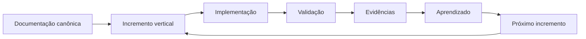
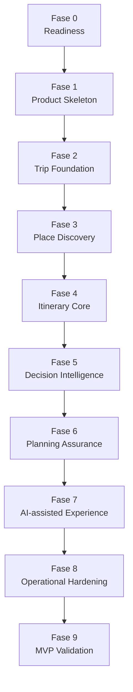
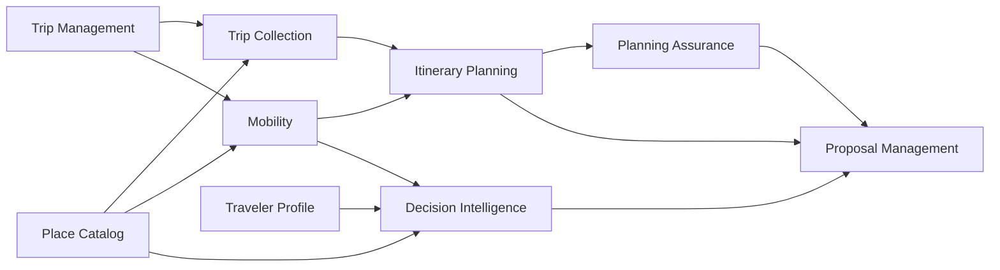

---

id: RB-DEL-001

title: Estratégia de Entrega e Roadmap de Implementação
description: Define a estratégia oficial do RouteBook para transformar sua documentação de produto, domínio e arquitetura em incrementos implementáveis, validáveis e progressivos, estabelecendo fases, dependências, marcos, quality gates e critérios de prontidão.

document_type: delivery
owner: Delivery

status: Published
version: "0.1.0"

created: "2026-07-24"
last_updated: null

authors:

- RouteBook Team

tags:

- delivery
- implementation-roadmap
- delivery-strategy
- mvp
- vertical-slices
- incremental-delivery
- engineering-readiness
- product-development
- quality-gates
- ai-first
- documentation-first
- risk-management
- diagrams
- mermaid

related_documents:

- RB-CORE-0001
- RB-CORE-0002
- RB-CORE-0003
- RB-CORE-0004
- RB-PRD-001
- RB-PRD-002
- RB-PRD-003
- RB-PRD-004
- RB-PRD-005
- RB-PRD-006
- RB-PRD-007
- RB-PRD-008
- RB-UX-001
- RB-UX-002
- RB-UX-003
- RB-UX-004
- RB-UX-005
- RB-UX-006
- RB-DS-001
- RB-DS-002
- RB-DS-003
- RB-DS-004
- RB-DOM-001
- RB-DOM-002
- RB-DOM-003
- RB-DOM-004
- RB-ARC-001
- RB-ARC-002
- RB-ARC-003
- RB-ARC-004
- RB-ARC-005
- RB-DATA-001
- RB-DATA-002
- RB-API-001
- RB-SEC-001
- RB-SEC-002
- RB-SEC-003
- RB-PRIV-001
- RB-PRIV-002
- RB-PRIV-003
- RB-OBS-001
- RB-QA-001
- RB-QA-002
- RB-OPS-001
- RB-OPS-002
- RB-SRE-001
- RB-AI-001
- RB-AI-002
- RB-AI-003
- RB-AI-004
- RB-AI-005
- RB-AI-006
- RB-COMP-001
- RB-COMP-002
- RB-COMP-003
- RB-GOV-001
- RB-GOV-002
- RB-RISK-001

prerequisites:

- RB-CORE-0004
- RB-PRD-002
- RB-PRD-006
- RB-PRD-007
- RB-PRD-008
- RB-UX-001
- RB-UX-002
- RB-UX-003
- RB-DOM-001
- RB-DOM-002
- RB-DOM-003
- RB-DOM-004
- RB-ARC-001
- RB-ARC-002
- RB-ARC-003
- RB-ARC-004
- RB-ARC-005
- RB-DATA-001
- RB-DATA-002
- RB-API-001
- RB-SEC-001
- RB-QA-001
- RB-OPS-001
- RB-SRE-001
- RB-AI-001
- RB-AI-002
- RB-AI-006
- RB-GOV-001
- RB-GOV-002
- RB-RISK-001

next_documents:

- RB-DEV-001
- RB-CICD-001
- RB-INFRA-001

ai_context:
priority: critical
index: true
---

# RouteBook — Estratégia de Entrega e Roadmap de Implementação

## Parte I — Fundamentos

### 1. Propósito

Este documento define a estratégia oficial de entrega e o roadmap de implementação do RouteBook.

Seu objetivo é transformar o conhecimento documentado nas áreas de produto, experiência, domínio, arquitetura, dados, segurança, privacidade, inteligência artificial, qualidade e operações em uma sequência de construção:

* incremental;
* verificável;
* orientada a valor;
* tecnicamente coerente;
* operacionalmente segura;
* adequada ao estágio inicial do projeto;
* compatível com desenvolvimento assistido por agentes de IA.

O documento estabelece:

* princípios de entrega;
* estratégia de incrementos verticais;
* fases de implementação;
* ordem de construção dos módulos;
* dependências;
* marcos;
* critérios de entrada e saída;
* quality gates;
* critérios de prontidão;
* riscos de execução;
* integração entre documentação e código;
* papel de agentes de IA;
* transição do MVP para evolução contínua.

---

### 2. Problema que este documento resolve

O RouteBook possui uma base documental extensa que define:

* o que o produto deverá fazer;
* quem deverá utilizá-lo;
* quais jornadas deverão existir;
* quais conceitos são canônicos;
* como os módulos deverão ser separados;
* como dados e APIs deverão funcionar;
* quais controles são necessários;
* como a IA deverá operar;
* como qualidade e confiabilidade deverão ser avaliadas.

Essa base não determina, isoladamente:

* o que implementar primeiro;
* qual incremento deverá gerar o primeiro valor utilizável;
* quais dependências precisam existir antes de cada funcionalidade;
* quais documentos deverão orientar cada entrega;
* quando uma fase poderá ser considerada concluída;
* quando será seguro avançar;
* como evitar infraestrutura prematura;
* como impedir a criação de uma plataforma horizontal sem produto utilizável;
* como integrar vibe coding à governança definida.

Este documento resolve essa lacuna.

---

### 3. Relação com a definição do MVP

O `RB-PRD-002` define o escopo funcional do MVP.

O `RB-DEL-001` não redefine esse escopo.

Ele define como o MVP deverá ser transformado em incrementos implementáveis.

A relação deverá ser:

```text
MVP definido
→ capacidades priorizadas
→ incrementos verticais
→ implementação
→ validação
→ aprendizado
→ evolução
```

---

### 4. Relação com a arquitetura

Os documentos `RB-ARC-001` a `RB-ARC-005` definem a arquitetura-alvo e os princípios estruturais.

O roadmap deverá respeitar essa arquitetura sem exigir que todos os componentes finais sejam construídos antes do primeiro incremento.

A implementação poderá iniciar com estruturas simplificadas quando:

* preservarem fronteiras conceituais;
* não contradisserem ownership de domínio;
* permitirem evolução;
* não criarem lock-in desnecessário;
* estiverem documentadas.

---

### 5. Relação com governança e riscos

Toda mudança relevante deverá seguir o `RB-GOV-002`.

Todo risco relevante deverá ser tratado conforme o `RB-RISK-001`.

A estratégia de entrega deverá evitar que velocidade seja obtida por meio de:

* decisões silenciosas;
* perda de rastreabilidade;
* bypass de qualidade;
* bypass de segurança;
* criação de dívida não registrada;
* alteração de conceitos canônicos por agentes de IA.

---

### 6. Escopo

Este documento cobre:

* roadmap de implementação;
* fases;
* workstreams;
* incrementos;
* marcos;
* dependências;
* critérios de entrada;
* critérios de saída;
* Definition of Ready;
* Definition of Done;
* quality gates;
* estratégia de MVP;
* estratégia de validação;
* evolução de IA;
* estratégia de ambientes;
* riscos de entrega;
* gestão de débito;
* preparação para releases.

---

### 7. Fora do escopo

Este documento não define:

* linguagem de programação final;
* framework final;
* Provider de cloud;
* banco de dados final;
* pipeline final;
* cronograma comercial;
* datas contratuais;
* orçamento;
* tamanho de equipe;
* estimativas fechadas;
* backlog detalhado;
* design técnico de cada funcionalidade.

Essas decisões deverão ser definidas nos documentos especializados e em ADRs.

---

### 8. Princípio central

O RouteBook deverá ser construído por incrementos verticais que entreguem valor utilizável e validável, preservando coerência de domínio, qualidade, segurança e capacidade de evolução.



---

## Parte II — Princípios de entrega

### 9. Valor utilizável antes de amplitude

O projeto deverá priorizar um fluxo pequeno e funcional antes de implementar grande quantidade de componentes incompletos.

---

### 10. Incrementos verticais

Cada incremento deverá atravessar, conforme necessário:

* experiência;
* aplicação;
* domínio;
* dados;
* API;
* testes;
* observabilidade;
* segurança;
* operação.

Não deverão ser priorizadas camadas horizontais isoladas sem uma capacidade de produto que as valide.

---

### 11. Documentação suficiente

A documentação deverá orientar a implementação, mas não deverá impedir aprendizado.

Quando uma decisão de implementação revelar lacuna documental, a documentação deverá ser atualizada antes da consolidação da mudança.

---

### 12. Modularidade progressiva

Os limites dos módulos deverão existir conceitualmente desde o início.

A separação física poderá evoluir gradualmente.

Não será necessário iniciar com múltiplos serviços independentes para preservar bounded contexts.

---

### 13. Simplicidade reversível

A solução inicial deverá preferir a opção mais simples que:

* respeite o domínio;
* seja testável;
* seja observável;
* seja reversível;
* permita substituição;
* não comprometa dados.

---

### 14. Qualidade incorporada

Testes, segurança, observabilidade e operação não deverão ser atividades posteriores ao desenvolvimento.

Cada incremento deverá incluir os controles mínimos necessários.

---

### 15. Validação contínua

Cada fase deverá produzir uma hipótese validável.

A implementação não deverá avançar indefinidamente sem feedback de:

* comportamento;
* usabilidade;
* dados;
* qualidade;
* custo;
* desempenho;
* operação.

---

### 16. AI-first progressivo

O RouteBook deverá ser AI-first na arquitetura e na visão de produto.

Isso não exige que toda capacidade inicial seja implementada por IA.

Capacidades determinísticas deverão ser utilizadas quando forem:

* mais seguras;
* mais previsíveis;
* mais baratas;
* suficientes para a hipótese;
* adequadas ao estágio.

---

### 17. Segurança proporcional desde o início

O projeto poderá evoluir controles gradualmente, mas nunca deverá adiar princípios fundamentais como:

* autorização server-side;
* isolamento entre Accounts;
* proteção de secrets;
* validação de entrada;
* logs sem dados sensíveis;
* rastreabilidade de ações críticas.

---

### 18. Release não é conclusão

Uma entrega somente deverá ser considerada concluída após:

* implementação;
* testes;
* deployment;
* observação;
* verificação;
* atualização documental;
* registro de aprendizados.

---

## Parte III — Unidade de entrega

### 19. Incremento vertical

Um incremento vertical é uma capacidade utilizável do produto que atravessa as camadas necessárias para produzir um resultado observável.

---

### 20. Características obrigatórias

Um incremento deverá possuir:

* objetivo;
* usuário;
* problema;
* hipótese;
* escopo;
* fora do escopo;
* critérios de aceite;
* dados;
* módulos;
* riscos;
* testes;
* observabilidade;
* evidências;
* owner.

---

### 21. Incremento mínimo

O menor incremento aceitável não é necessariamente a menor quantidade de código.

É o menor conjunto coerente capaz de:

* ser usado;
* ser avaliado;
* produzir aprendizado;
* não comprometer a arquitetura.

---

### 22. Incremento horizontal

Um incremento horizontal poderá existir quando for pré-requisito direto para um incremento vertical.

Exemplos:

* configuração inicial do repositório;
* autenticação base;
* migration inicial;
* pipeline mínimo;
* observabilidade mínima.

Ele deverá possuir escopo limitado e beneficiário explícito.

---

### 23. Identificador

Formato recomendado:

```text
RB-INC-NNN
```

---

### 24. Estrutura

```text
incrementId
title
objective
user
problem
hypothesis
scope
outOfScope
capabilities
modules
data
apis
ui
ai
risks
controls
acceptanceCriteria
testStrategy
observability
deployment
rollback
owner
status
```

---

## Parte IV — Estratégia de slices

### 25. Slice por jornada

A unidade preferencial deverá representar parte coerente de uma jornada.

Exemplos:

* criar uma Trip;
* definir hospedagem;
* visualizar Places próximos;
* salvar um Place;
* adicionar uma Activity;
* receber uma Recommendation;
* aceitar parte de uma Itinerary Proposal;
* visualizar um Planning Conflict.

---

### 26. Slice por capacidade

Quando a jornada completa for ampla, a entrega poderá ser organizada por capacidade limitada.

---

### 27. Slice por risco

Uma capacidade de alto risco poderá ser implementada primeiro como experimento técnico.

Exemplos:

* isolamento de dados;
* busca geográfica;
* contexto de IA;
* geração estruturada;
* integração com mapas.

---

### 28. Slice por aprendizado

Um incremento poderá existir principalmente para validar:

* usabilidade;
* relevância;
* custo;
* latência;
* qualidade da IA;
* qualidade de dados;
* aceitação da experiência.

---

### 29. Slice inadequado

Não deverá ser considerado incremento de produto:

* criar todas as entidades sem fluxo utilizável;
* criar apenas repositórios;
* criar apenas controllers;
* configurar toda a infraestrutura futura;
* implementar todos os módulos vazios;
* gerar telas sem comportamento;
* integrar IA sem hipótese de uso.

---

## Parte V — Fases do roadmap

### 30. Visão geral

O roadmap inicial deverá ser organizado nas seguintes fases:

1. Readiness;
2. Product Skeleton;
3. Trip Foundation;
4. Place Discovery;
5. Itinerary Core;
6. Decision Intelligence;
7. Planning Assurance;
8. AI-assisted Experience;
9. Operational Hardening;
10. MVP Validation.



---

## Parte VI — Fase 0: Readiness

### 31. Objetivo

Preparar as condições mínimas para iniciar implementação sem perder governança.

---

### 32. Entregas

* estrutura inicial do repositório;
* convenções de código;
* estratégia de branches;
* ambiente local;
* gestão de configuração;
* gestão de secrets;
* pipeline mínimo;
* teste automatizado inicial;
* lint;
* formatação;
* validação de documentação;
* estratégia de ADRs;
* estrutura de módulos;
* ambiente de desenvolvimento reproduzível.

---

### 33. Documentos de referência

* `RB-GOV-001`;
* `RB-GOV-002`;
* `RB-QA-001`;
* `RB-SEC-003`;
* `RB-ARC-001`;
* `RB-ARC-002`;
* `RB-RISK-001`.

---

### 34. Critério de entrada

* arquitetura-base documentada;
* módulos canônicos definidos;
* linguagem de domínio definida;
* escopo do MVP definido.

---

### 35. Critério de saída

* projeto executável localmente;
* pipeline validando código;
* teste básico executável;
* secrets fora do repositório;
* estrutura de módulos criada;
* primeiro ADR aprovado;
* instruções de desenvolvimento disponíveis.

---

### 36. Não objetivos

Não implementar:

* infraestrutura de produção completa;
* microservices;
* observabilidade avançada;
* múltiplos Providers;
* sistema de agentes completo;
* escalabilidade prematura.

---

## Parte VII — Fase 1: Product Skeleton

### 37. Objetivo

Criar o primeiro fluxo navegável e estruturalmente coerente do produto.

---

### 38. Capacidades

* inicialização da aplicação;
* navegação principal;
* layout responsivo;
* tratamento básico de erros;
* configuração de ambiente;
* identidade local ou sessão simplificada;
* persistência mínima;
* health check;
* telemetria básica.

---

### 39. Resultado esperado

O usuário deverá conseguir acessar uma experiência funcional, mesmo que ainda sem o fluxo completo de viagem.

---

### 40. Módulos envolvidos

* Identity and Access;
* Platform;
* Experience.

---

### 41. Quality gate

* aplicação inicia;
* navegação funciona;
* erros são tratados;
* logs não expõem secrets;
* testes de smoke executam;
* build é reproduzível.

---

## Parte VIII — Fase 2: Trip Foundation

### 42. Objetivo

Permitir criação e gestão da estrutura básica de uma viagem.

---

### 43. Capacidades

* criar Trip;
* editar nome;
* definir datas;
* definir destino;
* definir hospedagem;
* visualizar resumo;
* persistir estado;
* recuperar Trip.

---

### 44. Módulos envolvidos

* Trip Management;
* Identity and Access;
* Platform.

---

### 45. Entidades principais

Conforme o modelo de domínio:

* Trip;
* TripId;
* Account;
* User;
* Accommodation ou conceito canônico equivalente definido no domínio.

---

### 46. APIs iniciais

As APIs deverão seguir o `RB-API-001`.

O contrato deverá ser definido antes da implementação quando compartilhado entre frontend e backend.

---

### 47. Critérios de aceite

* Trip criada com identificador canônico;
* datas validadas;
* destino persistido;
* hospedagem definida;
* usuário não acessa Trip de outra Account;
* alterações são auditáveis;
* testes positivos e negativos existem.

---

### 48. Riscos principais

* ownership incorreto;
* acesso cross-account;
* estados inválidos;
* datas inconsistentes;
* dados de hospedagem incompletos.

---

## Parte IX — Fase 3: Place Discovery

### 49. Objetivo

Permitir que o usuário descubra lugares relevantes para sua viagem.

---

### 50. Capacidades

* listar Places;
* classificar por categoria;
* visualizar detalhes;
* visualizar localização;
* calcular distância da hospedagem;
* salvar em Trip Collection;
* filtrar por praia, alimentação, vida noturna e passeio.

---

### 51. Módulos envolvidos

* Place Catalog;
* Trip Collection;
* Mobility;
* Trip Management.

---

### 52. Estratégia de dados

A fase poderá iniciar com catálogo curado.

A adoção de Provider externo deverá exigir:

* decisão registrada;
* avaliação de dados;
* avaliação de custo;
* estratégia de cache;
* licença;
* fallback;
* ownership.

---

### 53. Distância

A distância deverá distinguir, quando aplicável:

* distância geográfica;
* distância por rota;
* tempo estimado;
* modo de deslocamento.

---

### 54. Critérios de aceite

* Places são associados à região correta;
* categorias são consistentes;
* distâncias são calculadas a partir da hospedagem;
* usuário consegue salvar e remover Places;
* dados de outro Trip não são expostos;
* falha do Provider possui fallback controlado.

---

### 55. Hipótese de produto

O usuário percebe valor ao visualizar opções relevantes contextualizadas pela hospedagem e pela categoria desejada.

---

## Parte X — Fase 4: Itinerary Core

### 56. Objetivo

Permitir organização manual inicial do roteiro.

---

### 57. Capacidades

* criar dia de itinerário;
* adicionar Activity;
* remover Activity;
* mover Activity;
* ordenar Activities;
* definir horário;
* adicionar Place;
* visualizar agenda diária;
* calcular deslocamento básico.

---

### 58. Módulos envolvidos

* Itinerary Planning;
* Mobility;
* Place Catalog;
* Trip Management.

---

### 59. Identificadores

Deverão ser utilizados os conceitos canônicos:

* Activity;
* ActivityId;
* TripId;
* PlaceId;
* Itinerary.

---

### 60. Rota canônica

```text
POST /trips/{tripId}/activities/{activityId}/move
```

O parâmetro contextual `activityId` deverá resolver para `ActivityId`.

---

### 61. Critérios de aceite

* Activity pertence a uma Trip válida;
* horários inválidos são rejeitados;
* ordenação é persistida;
* movimentação é idempotente quando aplicável;
* dados derivados são recalculados;
* alterações possuem testes de invariantes.

---

### 62. Não objetivos

Nesta fase, o sistema não precisa:

* gerar roteiro completo por IA;
* resolver todos os conflitos;
* otimizar matematicamente o itinerário;
* aplicar propostas automáticas.

---

## Parte XI — Fase 5: Decision Intelligence

### 63. Objetivo

Introduzir recomendações contextualizadas sem alterar silenciosamente o estado canônico.

---

### 64. Capacidades

* gerar Recommendation;
* exibir justificativa;
* relacionar Recommendation ao contexto;
* aceitar ou ignorar sugestão;
* registrar feedback;
* observar relevância.

---

### 65. Princípio canônico

Recommendation não é Decision.

A Recommendation representa uma sugestão.

A Decision representa a escolha registrada no contexto de Decision Intelligence.

---

### 66. Módulos envolvidos

* Decision Intelligence;
* Traveler Profile;
* Place Catalog;
* Mobility;
* Trip Management.

---

### 67. Estratégia inicial

As Recommendations poderão começar com regras determinísticas.

Exemplos:

* distância;
* horário;
* categoria;
* disponibilidade;
* preferência explícita;
* período do dia.

---

### 68. Critérios para introduzir IA

A IA deverá ser utilizada quando demonstrar ganho em:

* contextualização;
* explicação;
* flexibilidade;
* combinação de preferências;
* geração de alternativas.

---

### 69. Critérios de aceite

* toda Recommendation possui `RecommendationId`;
* origem e contexto são rastreáveis;
* Recommendation não altera Itinerary;
* feedback é registrado;
* falhas não bloqueiam o fluxo principal;
* regras de autorização são respeitadas.

---

## Parte XII — Fase 6: Planning Assurance

### 70. Objetivo

Detectar e comunicar condições que possam comprometer o roteiro.

---

### 71. Capacidades

* detectar Planning Conflict;
* classificar severidade;
* exibir impacto;
* resolver conflito;
* ignorar risco;
* restaurar risco ignorado;
* invalidar conflito obsoleto;
* superseder conflito.

---

### 72. Estados canônicos

* PlanningConflictDetected;
* Resolved;
* Ignored;
* Invalidated;
* Superseded.

---

### 73. Operações canônicas

* ResolvePlanningConflict;
* IgnorePlanningRisk;
* RestoreIgnoredPlanningRisk.

---

### 74. Rota canônica

```text
POST /trips/{tripId}/conflicts/{conflictId}/ignore
```

O parâmetro contextual `conflictId` deverá resolver para `PlanningConflictId`.

---

### 75. Conflitos iniciais

* sobreposição de horários;
* deslocamento inviável;
* Activity fora do período;
* Place distante;
* janela insuficiente;
* dependência incompatível;
* dia excessivamente carregado.

---

### 76. Critérios de aceite

* conflitos possuem `PlanningConflictId`;
* detecção é reprodutível;
* ignorar risco não remove histórico;
* resolução é rastreável;
* recalcular não cria duplicatas;
* conflitos obsoletos são invalidados.

---

## Parte XIII — Fase 7: AI-assisted Experience

### 77. Objetivo

Introduzir IA como capacidade assistiva dentro dos limites definidos pela arquitetura e governança.

---

### 78. Capacidades

* interpretar pedido do usuário;
* gerar Itinerary Proposal;
* explicar sugestões;
* combinar preferências;
* sugerir ajustes;
* responder perguntas sobre a Trip;
* preparar alternativas.

---

### 79. Princípio canônico

`ItineraryProposal` não altera automaticamente o estado canônico.

Ela deverá possuir `ItineraryProposalId`.

---

### 80. Operação de aceitação parcial

A aceitação parcial deverá utilizar:

* `AcceptItineraryProposalPartially`;
* `ItineraryProposalPartiallyAccepted`.

---

### 81. Rota canônica

```text
POST /trips/{tripId}/itinerary/proposals/{proposalId}/accept
```

O parâmetro contextual `proposalId` deverá resolver para `ItineraryProposalId`.

---

### 82. Módulos envolvidos

* Proposal Management;
* Decision Intelligence;
* Itinerary Planning;
* Planning Assurance;
* Traveler Profile;
* Platform;
* AI Runtime.

---

### 83. Pré-requisitos

* Structured Outputs;
* Context Builder;
* Tool allowlist;
* limites de execução;
* logs;
* evals;
* fallback;
* proteção cross-account;
* validação de schema.

---

### 84. Estratégia de rollout

1. geração sem aplicação;
2. revisão humana obrigatória;
3. aceitação explícita;
4. aceitação parcial;
5. melhoria por feedback;
6. ampliação controlada.

---

### 85. Critérios de aceite

* outputs válidos contra schema;
* contexto pertence à Account correta;
* Tools respeitam escopo;
* propostas possuem Provenance;
* custo e latência são observáveis;
* falhas possuem fallback;
* autonomia não é ampliada silenciosamente.

---

## Parte XIV — Fase 8: Operational Hardening

### 86. Objetivo

Preparar a solução para uso real com confiabilidade adequada ao MVP.

---

### 87. Capacidades

* ambientes definidos;
* deployment repetível;
* backup;
* restore;
* alertas;
* dashboards;
* runbooks;
* rate limiting;
* proteção de secrets;
* scanners;
* monitoramento de Providers;
* tratamento de incidentes;
* retenção;
* exclusão;
* acessos privilegiados.

---

### 88. Quality gates

* testes críticos aprovados;
* vulnerabilidades Critical inexistentes;
* teste de restore aprovado;
* logs sanitizados;
* alertas acionáveis;
* rollback testado;
* runbooks disponíveis;
* SLOs iniciais definidos.

---

### 89. Privacidade

Deverão existir operações mínimas para:

* acesso;
* correção;
* exclusão;
* encerramento;
* retenção;
* Providers;
* memória de IA.

---

### 90. IA

Deverão existir:

* avaliação de regressão;
* limites de custo;
* limites de Tool Calls;
* bloqueio de capability;
* fallback;
* monitoramento.

---

## Parte XV — Fase 9: MVP Validation

### 91. Objetivo

Validar o MVP com uso real e critérios previamente definidos.

---

### 92. Dimensões de validação

* valor;
* usabilidade;
* qualidade;
* relevância;
* confiabilidade;
* custo;
* segurança;
* desempenho;
* adoção;
* clareza.

---

### 93. Cenário de validação inicial

A viagem pessoal para Pipa poderá ser utilizada como cenário inicial de validação, incluindo:

* hospedagem;
* praias;
* restaurantes;
* vida noturna;
* distâncias;
* roteiro por dia;
* Recommendations;
* Planning Conflicts;
* Itinerary Proposals.

---

### 94. Evidências

* sessões de uso;
* feedback;
* métricas;
* falhas;
* custos;
* latência;
* incidentes;
* alterações realizadas;
* satisfação;
* decisões tomadas.

---

### 95. Critério de conclusão

O MVP deverá demonstrar que o usuário consegue:

1. criar a Trip;
2. informar contexto;
3. descobrir Places;
4. organizar Activities;
5. receber Recommendations;
6. identificar conflitos;
7. avaliar Itinerary Proposals;
8. tomar decisões melhores com menor esforço.

---

## Parte XVI — Ordem dos módulos

### 96. Ordem recomendada

1. Platform;
2. Identity and Access;
3. Trip Management;
4. Place Catalog;
5. Trip Collection;
6. Mobility;
7. Itinerary Planning;
8. Traveler Profile;
9. Decision Intelligence;
10. Planning Assurance;
11. Proposal Management;
12. Data Governance.

---

### 97. Platform

Deverá fornecer apenas capacidades necessárias ao próximo incremento.

---

### 98. Identity and Access

Deverá começar simples, mas preservar:

* identidade;
* Account;
* autorização;
* sessões;
* isolamento.

---

### 99. Trip Management

É o núcleo inicial de agregação da experiência.

---

### 100. Place Catalog

Deverá permitir catálogo curado antes de dependência externa complexa.

---

### 101. Mobility

Deverá evoluir de cálculo simples para dados de rota conforme valor validado.

---

### 102. Itinerary Planning

Deverá começar com organização manual antes de otimização automática.

---

### 103. Decision Intelligence

Deverá começar com Recommendations rastreáveis.

---

### 104. Planning Assurance

Deverá utilizar regras verificáveis antes de modelos complexos.

---

### 105. Proposal Management

Deverá ser introduzido após o Itinerary possuir regras e invariantes suficientes.

---

## Parte XVII — Workstreams

### 106. Product and Experience

Responsável por:

* jornadas;
* telas;
* microcopy;
* critérios de aceite;
* validação;
* feedback.

---

### 107. Domain and Application

Responsável por:

* modelos;
* invariantes;
* use cases;
* eventos;
* estados;
* ownership.

---

### 108. Data and Integration

Responsável por:

* schema;
* migrations;
* catálogo;
* Providers;
* APIs;
* contratos.

---

### 109. AI and Decisioning

Responsável por:

* Recommendations;
* Proposals;
* contexto;
* agentes;
* Tools;
* avaliações.

---

### 110. Quality and Security

Responsável por:

* testes;
* gates;
* autorização;
* scanners;
* threat scenarios;
* evidências.

---

### 111. Platform and Operations

Responsável por:

* ambientes;
* pipeline;
* observabilidade;
* deployment;
* recovery;
* runbooks.

---

## Parte XVIII — Dependências

### 112. Tipos

* documental;
* domínio;
* técnica;
* dados;
* Provider;
* infraestrutura;
* segurança;
* produto;
* operacional.

---

### 113. Dependência obrigatória

Um incremento não deverá iniciar quando depender de conceito canônico ainda indefinido.

---

### 114. Dependência técnica

Deverá ser implementada somente no nível necessário ao incremento.

---

### 115. Dependência de Provider

Deverá possuir:

* owner;
* avaliação;
* fallback;
* limite de custo;
* contrato;
* estratégia de substituição.

---

### 116. Dependência entre módulos

Deverá respeitar `RB-ARC-002`.

---

### 117. Visualização



---

## Parte XIX — Definition of Ready

### 118. Objetivo

Garantir que um incremento possua informação suficiente para iniciar desenvolvimento.

---

### 119. Critérios obrigatórios

* problema definido;
* usuário definido;
* hipótese definida;
* escopo definido;
* fora do escopo definido;
* critérios de aceite definidos;
* módulos identificados;
* conceitos canônicos identificados;
* dados identificados;
* riscos iniciais identificados;
* dependências identificadas;
* design suficiente disponível;
* decisão arquitetural registrada quando necessária.

---

### 120. Critérios adicionais para IA

* finalidade;
* capabilityId planejado;
* modelo ou Provider considerado;
* dados de contexto;
* schema;
* Tools;
* limites;
* avaliação;
* fallback.

---

### 121. Bloqueios

Um incremento não estará Ready quando:

* contradizer documento superior;
* possuir termo de domínio indefinido;
* depender de Provider não avaliado;
* não possuir critério de aceite;
* envolver dado sem owner;
* exigir decisão arquitetural pendente.

---

## Parte XX — Definition of Done

### 122. Critérios gerais

* comportamento implementado;
* critérios de aceite atendidos;
* testes aprovados;
* segurança verificada;
* observabilidade adicionada;
* documentação atualizada;
* deployment realizado;
* rollback definido;
* evidências preservadas;
* owner operacional definido.

---

### 123. Qualidade

* testes unitários relevantes;
* testes de integração;
* testes negativos;
* regressão;
* testes de contrato;
* smoke test;
* cenário cross-account quando aplicável.

---

### 124. Dados

* migration testada;
* rollback ou compensação definido;
* integridade validada;
* retenção avaliada;
* dados de teste controlados.

---

### 125. IA

* eval executada;
* schema validado;
* limites testados;
* Tool Calls observáveis;
* fallback testado;
* contexto autorizado;
* custo medido.

---

### 126. Operação

* logs;
* métricas;
* alertas;
* runbook quando necessário;
* health check;
* rollback;
* owner.

---

## Parte XXI — Quality gates

### 127. Gate documental

Verifica:

* requisito;
* domínio;
* ADR;
* risco;
* contrato;
* documentação afetada.

---

### 128. Gate de código

Verifica:

* lint;
* formatação;
* build;
* testes;
* revisão;
* secrets;
* dependências.

---

### 129. Gate de segurança

Verifica:

* autenticação;
* autorização;
* input validation;
* dados sensíveis;
* vulnerabilidades;
* isolamento.

---

### 130. Gate de dados

Verifica:

* migration;
* compatibilidade;
* integridade;
* backfill;
* rollback;
* backup.

---

### 131. Gate de IA

Verifica:

* eval;
* schema;
* contexto;
* Tools;
* autonomia;
* custo;
* fallback;
* segurança.

---

### 132. Gate de release

Verifica:

* testes críticos;
* observabilidade;
* rollback;
* runbook;
* risco residual;
* aprovação;
* mudança registrada.

---

## Parte XXII — Ambientes

### 133. Local

Deverá permitir desenvolvimento reproduzível.

---

### 134. Test

Deverá permitir execução automatizada e isolada.

---

### 135. Preview

Poderá ser utilizado para validação de pull requests e fluxos.

---

### 136. Staging

Deverá aproximar-se da produção quando o estágio do projeto justificar.

---

### 137. Production

Deverá possuir controles proporcionais ao uso real.

---

### 138. Progressão

A criação de novos ambientes deverá ocorrer quando houver necessidade verificável, não como requisito abstrato.

---

## Parte XXIII — Estratégia de releases

### 139. Release incremental

Releases deverão ser pequenas, observáveis e reversíveis.

---

### 140. Feature flags

Deverão ser utilizadas quando reduzirem risco de rollout.

---

### 141. Rollout progressivo

Poderá utilizar:

* ambiente;
* usuário;
* Account;
* percentual;
* capability;
* região.

---

### 142. Rollback

Deverá considerar:

* código;
* configuração;
* schema;
* eventos;
* cache;
* Provider;
* IA.

---

### 143. Evidências

Cada release relevante deverá preservar:

* artefato;
* commit;
* mudança;
* testes;
* aprovação;
* deployment;
* verificação.

---

## Parte XXIV — Riscos de entrega

### 144. Overengineering

Risco de construir arquitetura final antes de validar o produto.

Tratamento:

* slices;
* simplicidade;
* ADRs;
* revisão de necessidade.

---

### 145. Underengineering

Risco de ignorar controles fundamentais em nome da velocidade.

Tratamento:

* gates mínimos;
* autorização;
* testes;
* observabilidade;
* riscos explícitos.

---

### 146. Documentação desatualizada

Risco de código e documentação divergirem.

Tratamento:

* atualização no mesmo Change Request;
* validação automatizada;
* review.

---

### 147. Dependência excessiva de IA

Risco de aceitar código ou decisões sem compreensão suficiente.

Tratamento:

* revisão humana;
* testes;
* Provenance;
* limites de escopo;
* ADRs.

---

### 148. Scope creep

Risco de expandir o MVP sem validação.

Tratamento:

* fora do escopo;
* backlog separado;
* decisão de produto;
* critérios de fase.

---

### 149. Provider lock-in

Risco de dependência prematura.

Tratamento:

* ports;
* contratos;
* fallback;
* exit plan;
* avaliação.

---

### 150. Qualidade tardia

Risco de acumular regressões e controles ausentes.

Tratamento:

* Definition of Done;
* gates;
* testes por slice;
* automação.

---

## Parte XXV — Vibe coding governado

### 151. Princípio

Vibe coding poderá acelerar implementação, mas deverá operar dentro das fronteiras documentadas do RouteBook.

---

### 152. Entradas obrigatórias para agentes

O agente deverá receber:

* objetivo do incremento;
* documentos canônicos;
* módulos afetados;
* critérios de aceite;
* termos de domínio;
* restrições;
* testes esperados;
* caminhos permitidos.

---

### 153. Tarefas adequadas

Agentes poderão:

* criar scaffolding;
* implementar casos de uso;
* gerar testes;
* preparar migrations;
* criar componentes;
* revisar inconsistências;
* propor patches;
* atualizar documentação.

---

### 154. Tarefas que exigem decisão humana

* alterar domínio;
* criar módulo;
* alterar ownership;
* adotar Provider;
* elevar autonomia;
* aceitar risco;
* alterar arquitetura;
* remover controle;
* redefinir MVP.

---

### 155. Unidade de trabalho

Prompts para implementação deverão ser limitados a:

* um incremento;
* um caso de uso;
* um módulo principal;
* um conjunto pequeno de arquivos;
* critérios objetivos.

---

### 156. Verificação

Código gerado deverá passar pelos mesmos gates do código escrito manualmente.

---

### 157. Memória do agente

O agente não deverá ser tratado como fonte canônica.

Toda decisão deverá ser persistida no repositório.

---

## Parte XXVI — Gestão de débito

### 158. Tipos

* Technical Debt;
* Architecture Debt;
* Test Debt;
* Security Debt;
* Privacy Debt;
* Documentation Debt;
* AI Debt;
* Operational Debt.

---

### 159. Registro

Débito relevante deverá possuir:

* ID;
* causa;
* impacto;
* owner;
* risco;
* prazo;
* tratamento.

---

### 160. Débito temporário

Deverá possuir condição de remoção.

---

### 161. Débito crítico

Não deverá ser utilizado para postergar:

* autorização;
* isolamento;
* integridade;
* proteção de secrets;
* recuperação;
* exclusão;
* controle de Tool.

---

## Parte XXVII — Métricas de entrega

### 162. Fluxo

* lead time;
* cycle time;
* throughput;
* tempo de review;
* tempo de deployment;
* bloqueios.

---

### 163. Qualidade

* falhas por incremento;
* regressões;
* change failure rate;
* rollbacks;
* flaky tests;
* vulnerabilidades.

---

### 164. Produto

* utilização;
* conclusão de jornada;
* tempo para tarefa;
* feedback;
* Recommendations aceitas;
* conflitos resolvidos;
* propostas aceitas.

---

### 165. IA

* custo;
* latência;
* schema acceptance;
* Tool success;
* fallback;
* feedback;
* qualidade da Recommendation.

---

### 166. Documentação

* documentos atualizados;
* IDs inválidos;
* links quebrados;
* decisões pendentes;
* divergências.

---

### 167. Métricas responsáveis

Métricas não deverão incentivar:

* mais código;
* mais documentos;
* mais releases;
* mais velocidade;

sem relação com valor, qualidade e risco.

---

## Parte XXVIII — Papéis e responsabilidades

### 168. Product

Responsável por:

* prioridade;
* hipótese;
* valor;
* escopo;
* validação.

---

### 169. Delivery

Responsável por:

* fases;
* dependências;
* marcos;
* coordenação;
* riscos de execução;
* acompanhamento.

---

### 170. Architecture

Responsável por:

* coerência;
* ADRs;
* fronteiras;
* evolução;
* dependências.

---

### 171. Domain

Responsável por:

* linguagem;
* invariantes;
* eventos;
* ownership.

---

### 172. Engineering

Responsável por:

* implementação;
* testes;
* evidências;
* manutenção.

---

### 173. Quality Engineering

Responsável por:

* estratégia de teste;
* gates;
* regressão;
* validação.

---

### 174. Security e Privacy

Responsáveis por:

* controles;
* avaliações;
* riscos;
* critérios mínimos.

---

### 175. Artificial Intelligence

Responsável por:

* capacidades;
* runtime;
* evals;
* Tools;
* contexto;
* limites.

---

### 176. Platform e Operations

Responsáveis por:

* ambientes;
* pipeline;
* deployment;
* observabilidade;
* recuperação.

---

## Parte XXIX — Marcos

### 177. M0 — Readiness concluído

Evidência:

* projeto executável;
* pipeline;
* testes;
* estrutura;
* ADR inicial.

---

### 178. M1 — Trip funcional

Evidência:

* criar;
* editar;
* persistir;
* recuperar;
* proteger por Account.

---

### 179. M2 — Descoberta contextual

Evidência:

* Places;
* categorias;
* detalhes;
* distância;
* coleção.

---

### 180. M3 — Itinerário manual

Evidência:

* Activities;
* dias;
* horários;
* movimentação;
* persistência.

---

### 181. M4 — Recomendação contextual

Evidência:

* Recommendation;
* justificativa;
* feedback;
* ausência de alteração automática.

---

### 182. M5 — Planning Assurance

Evidência:

* Planning Conflict;
* detecção;
* resolução;
* ignorar;
* restaurar;
* invalidar.

---

### 183. M6 — Itinerary Proposal

Evidência:

* geração;
* revisão;
* aceitação;
* aceitação parcial;
* Provenance.

---

### 184. M7 — MVP operável

Evidência:

* deployment;
* observabilidade;
* backup;
* restore;
* runbooks;
* segurança;
* privacidade.

---

### 185. M8 — MVP validado

Evidência:

* cenário real;
* feedback;
* métricas;
* riscos;
* decisão de continuidade.

---

## Parte XXX — Critérios de priorização

### 186. Valor

Quanto o incremento reduz esforço ou melhora decisão do usuário.

---

### 187. Aprendizado

Quanto reduz incerteza relevante.

---

### 188. Dependência

Quanto desbloqueia capacidades posteriores.

---

### 189. Risco

Quanto reduz risco técnico, de produto ou operacional.

---

### 190. Custo

Quanto esforço, infraestrutura e operação exige.

---

### 191. Reversibilidade

Quanto custa alterar ou remover.

---

### 192. Modelo de análise

A priorização deverá considerar:

```text
Prioridade =
valor
+ aprendizado
+ desbloqueio
+ redução de risco
- custo
- irreversibilidade
```

Essa expressão é uma heurística, não uma fórmula numérica obrigatória.

---

## Parte XXXI — Governança do roadmap

### 193. Fonte canônica

O roadmap deverá permanecer versionado no repositório.

---

### 194. Mudanças materiais

Deverão gerar Decision Record quando alterarem:

* ordem fundamental;
* escopo do MVP;
* módulo;
* Provider;
* arquitetura;
* risco;
* autonomia de IA.

---

### 195. Revisão

O roadmap deverá ser revisado:

* ao final de cada fase;
* após incidente;
* após aprendizado relevante;
* após mudança de escopo;
* quando dependência falhar;
* quando risco aumentar.

---

### 196. Roadmap não é promessa fixa

O roadmap representa a melhor sequência conhecida no contexto atual.

Mudanças deverão ser rastreáveis, mas não tratadas automaticamente como falha.

---

## Parte XXXII — Estrutura documental

### 197. Organização sugerida

```text
docs/
└── delivery/
    ├── delivery-strategy-and-implementation-roadmap.md
    ├── increments/
    ├── milestones/
    ├── workstreams/
    ├── readiness/
    ├── release-plans/
    └── templates/
```

---

### 198. Template de incremento

```text
incrementId:
title:
objective:
user:
problem:
hypothesis:
scope:
outOfScope:
capabilities:
modules:
data:
apis:
ui:
ai:
risks:
controls:
acceptanceCriteria:
testStrategy:
observability:
deployment:
rollback:
owner:
status:
```

---

### 199. Template de marco

```text
milestoneId:
title:
objective:
requiredIncrements:
entryCriteria:
exitCriteria:
evidence:
risks:
owner:
status:
targetContext:
```

---

### 200. Template de fase

```text
phaseId:
title:
objective:
scope:
outOfScope:
increments:
dependencies:
entryCriteria:
exitCriteria:
qualityGates:
risks:
evidence:
owner:
status:
```

---

## Parte XXXIII — Rastreabilidade

### 201. Cadeia canônica


---

### 202. Matriz mínima

| Elemento     | Vinculação obrigatória |
| ------------ | ---------------------- |
| fase         | objetivo               |
| incremento   | fase                   |
| incremento   | requisito ou jornada   |
| incremento   | módulos                |
| incremento   | riscos                 |
| decisão      | incremento             |
| mudança      | decisão ou incremento  |
| pull request | mudança                |
| teste        | critério de aceite     |
| deployment   | incremento             |
| evidência    | verificação            |
| aprendizado  | métrica ou feedback    |

---

## Parte XXXIV — Critérios de aceite

### 203. Estratégia

* princípios definidos;
* unidade de entrega definida;
* slices definidos;
* fases definidas;
* módulos ordenados;
* workstreams definidos.

---

### 204. Roadmap

* Readiness definida;
* Product Skeleton definido;
* Trip Foundation definida;
* Place Discovery definida;
* Itinerary Core definido;
* Decision Intelligence definida;
* Planning Assurance definida;
* AI-assisted Experience definida;
* Operational Hardening definido;
* MVP Validation definido.

---

### 205. Governança

* dependências definidas;
* Definition of Ready definida;
* Definition of Done definida;
* quality gates definidos;
* ambientes definidos;
* releases definidas;
* riscos definidos;
* vibe coding governado;
* dívida definida.

---

### 206. Operação

* métricas definidas;
* papéis definidos;
* marcos definidos;
* priorização definida;
* governança do roadmap definida;
* rastreabilidade definida.

---

## Parte XXXV — Checklist final

### 207. Checklist documental

Antes de aprovar:

* frontmatter YAML é válido;
* ID é único;
* título está correto;
* existe apenas um H1;
* propósito está definido;
* relação com o MVP está definida;
* relação com arquitetura está definida;
* relação com governança está definida;
* relação com riscos está definida;
* princípios de entrega estão definidos;
* incremento vertical está definido;
* estratégia de slices está definida;
* fases estão definidas;
* ordem dos módulos está definida;
* workstreams estão definidos;
* dependências estão definidas;
* Definition of Ready está definida;
* Definition of Done está definida;
* quality gates estão definidos;
* ambientes estão definidos;
* releases estão definidas;
* riscos de entrega estão definidos;
* vibe coding está governado;
* dívida está definida;
* métricas estão definidas;
* responsabilidades estão definidas;
* marcos estão definidos;
* priorização está definida;
* governança do roadmap está definida;
* estrutura documental está definida;
* rastreabilidade está presente;
* diagramas Mermaid renderizam no GitHub;
* blocos Mermaid não possuem atributos adicionais;
* termos canônicos estão preservados;
* não existem identificadores genéricos conflitantes;
* Recommendation não foi confundida com Decision;
* Itinerary Proposal não foi confundida com alteração canônica;
* Planning Conflict utiliza terminologia oficial;
* não existem contradições com RB-CORE-0004;
* não existem contradições com RB-PRD-002;
* não existem contradições com RB-DOM-001;
* não existem contradições com RB-DOM-002;
* não existem contradições com RB-DOM-003;
* não existem contradições com RB-DOM-004;
* não existem contradições com RB-ARC-001;
* não existem contradições com RB-ARC-002;
* não existem contradições com RB-ARC-003;
* não existem contradições com RB-ARC-004;
* não existem contradições com RB-ARC-005;
* não existem contradições com RB-AI-001;
* não existem contradições com RB-AI-006;
* não existem contradições com RB-GOV-001;
* não existem contradições com RB-GOV-002;
* não existem contradições com RB-RISK-001.

---

## Parte XXXVI — Declaração final

### 208. Declaração de entrega

O RouteBook deverá transformar sua documentação canônica em produto por meio de incrementos verticais, progressivos e verificáveis.

Toda entrega relevante deverá permitir responder:

* qual problema resolve;
* para qual usuário;
* qual hipótese valida;
* quais módulos afeta;
* quais dados utiliza;
* quais riscos introduz;
* quais critérios demonstram conclusão;
* como será testada;
* como será observada;
* como poderá ser revertida;
* qual aprendizado deverá produzir.

Nenhuma fase deverá ser considerada concluída apenas porque seus componentes foram implementados.

A conclusão deverá exigir:

* comportamento utilizável;
* critérios atendidos;
* qualidade verificada;
* riscos tratados;
* operação observável;
* evidências preservadas;
* documentação atualizada.

O roadmap deverá orientar a implementação sem se tornar uma sequência rígida e desconectada do aprendizado.

Mudanças deverão ser permitidas quando justificadas por evidências, desde que preservem governança, rastreabilidade e coerência com a visão do RouteBook.
