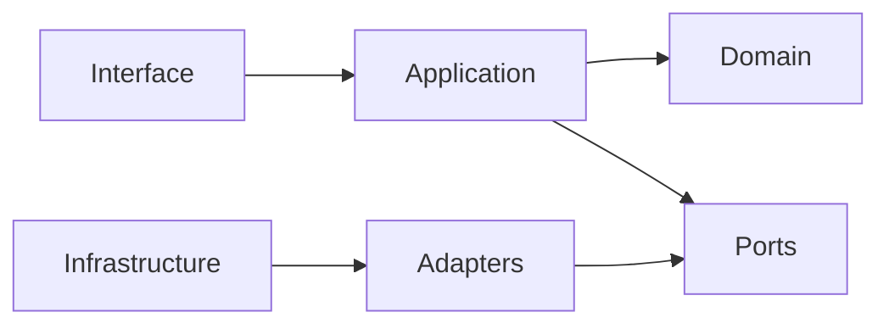

---

id: RB-DEV-001

title: Ambiente de Desenvolvimento e Padrões de Engenharia
description: Define o ambiente oficial de desenvolvimento do RouteBook, as convenções de engenharia, a organização do código, os fluxos locais, os critérios de qualidade e as regras para desenvolvimento assistido por agentes de IA.

document_type: development
owner: Engineering

status: Draft
version: "0.1.0"

created: "2026-07-24"
last_updated: null

authors:

- RouteBook Team

tags:

- development
- engineering
- developer-experience
- local-environment
- coding-standards
- repository-structure
- testing
- documentation-first
- ai-first
- vibe-coding
- quality
- security
- governance
- diagrams
- mermaid

related_documents:

- RB-CORE-0001
- RB-CORE-0002
- RB-CORE-0003
- RB-CORE-0004
- RB-PRD-002
- RB-PRD-006
- RB-PRD-007
- RB-PRD-008
- RB-UX-001
- RB-UX-002
- RB-UX-003
- RB-UX-004
- RB-UX-005
- RB-DS-001
- RB-DS-002
- RB-DS-003
- RB-DOM-001
- RB-DOM-002
- RB-DOM-003
- RB-DOM-004
- RB-ARC-001
- RB-ARC-002
- RB-ARC-003
- RB-ARC-004
- RB-ARC-005
- RB-DATA-001
- RB-DATA-002
- RB-API-001
- RB-SEC-001
- RB-SEC-002
- RB-SEC-003
- RB-OBS-001
- RB-QA-001
- RB-QA-002
- RB-OPS-001
- RB-OPS-002
- RB-SRE-001
- RB-AI-001
- RB-AI-002
- RB-AI-003
- RB-AI-004
- RB-AI-005
- RB-AI-006
- RB-GOV-001
- RB-GOV-002
- RB-RISK-001
- RB-DEL-001

prerequisites:

- RB-CORE-0004
- RB-DOM-001
- RB-DOM-002
- RB-DOM-003
- RB-DOM-004
- RB-ARC-001
- RB-ARC-002
- RB-ARC-003
- RB-ARC-004
- RB-ARC-005
- RB-DATA-001
- RB-DATA-002
- RB-API-001
- RB-SEC-003
- RB-QA-001
- RB-QA-002
- RB-GOV-001
- RB-GOV-002
- RB-RISK-001
- RB-DEL-001

next_documents:

- RB-CICD-001
- RB-INFRA-001

ai_context:
priority: critical
index: true
---

# RouteBook — Ambiente de Desenvolvimento e Padrões de Engenharia

## 1. Propósito

Este documento define o ambiente oficial de desenvolvimento e os padrões de engenharia do RouteBook.

Seu objetivo é garantir que qualquer pessoa ou agente autorizado consiga:

* preparar o ambiente local;
* compreender a estrutura do repositório;
* executar a aplicação;
* implementar mudanças;
* executar testes;
* validar qualidade;
* produzir documentação;
* criar pull requests;
* preservar segurança;
* manter coerência com o domínio e a arquitetura.

O documento transforma a estratégia do `RB-DEL-001` em regras concretas para a execução diária do desenvolvimento.

---

## 2. Princípio central

O desenvolvimento do RouteBook deverá ser reproduzível, verificável, seguro e orientado pela documentação canônica.

```text
Documentação canônica
→ incremento
→ implementação
→ validação local
→ revisão
→ integração
→ evidência
```

Nenhuma implementação deverá depender exclusivamente de:

* configuração pessoal não documentada;
* conhecimento informal;
* ferramenta específica instalada manualmente sem registro;
* memória de um agente de IA;
* decisão não versionada;
* comportamento não coberto por teste.

---

## 3. Escopo

Este documento cobre:

* preparação do ambiente local;
* versões de ferramentas;
* organização do repositório;
* convenções de código;
* módulos e dependências;
* configuração;
* secrets;
* banco de dados local;
* testes;
* qualidade;
* logs;
* tratamento de erros;
* branches;
* commits;
* pull requests;
* documentação;
* migrations;
* dependências;
* desenvolvimento assistido por IA;
* critérios de conclusão local.

Não define:

* pipeline completo de CI/CD;
* infraestrutura de produção;
* Provider de cloud;
* estratégia final de deployment;
* frameworks ou linguagens antes da aprovação por ADR.

---

## 4. Fonte canônica

O repositório GitHub do RouteBook deverá ser a fonte canônica para:

* código;
* documentação;
* configuração;
* scripts;
* migrations;
* testes;
* decisões;
* templates;
* convenções;
* histórico.

Informações mantidas apenas em conversas, ferramentas externas ou memória de agentes não deverão ser consideradas oficiais.

---

## 5. Reprodutibilidade

Um ambiente novo deverá poder ser preparado por meio de instruções versionadas.

O processo deverá evitar etapas ocultas.

O repositório deverá possuir, conforme a tecnologia escolhida:

```text
README.md
docs/
scripts/
config/
.env.example
editor configuration
version manager configuration
dependency lockfile
test configuration
lint configuration
format configuration
```

O comando ou fluxo de inicialização deverá:

1. validar pré-requisitos;
2. instalar dependências;
3. preparar configuração local;
4. iniciar serviços necessários;
5. aplicar migrations;
6. carregar dados mínimos;
7. executar verificações;
8. iniciar a aplicação.

---

## 6. Versões de ferramentas

Versões relevantes deverão ser fixadas ou limitadas de modo explícito.

Isso poderá ser feito por arquivos como:

* `.nvmrc`;
* `.node-version`;
* `.tool-versions`;
* `packageManager`;
* lockfiles;
* imagens de container;
* manifests equivalentes.

Não deverá ser utilizada a instrução genérica “use a versão mais recente”.

Alterações de versão principal deverão ser tratadas como mudança controlada.

---

## 7. Ambiente local

O ambiente local deverá fornecer somente as dependências necessárias ao desenvolvimento.

Capacidades esperadas:

* aplicação;
* persistência;
* migrations;
* testes;
* lint;
* formatação;
* documentação;
* serviços simulados;
* logs;
* health checks.

Providers externos deverão, quando possível, possuir:

* adapter;
* modo simulado;
* sandbox;
* fixture;
* fallback local.

O desenvolvimento básico não deverá depender de credenciais de produção.

---

## 8. Configuração

A configuração deverá ser separada do código.

Categorias recomendadas:

* configuração pública;
* configuração por ambiente;
* configuração sensível;
* feature flags;
* endpoints de Providers;
* limites operacionais;
* parâmetros de IA.

O repositório deverá disponibilizar um `.env.example` ou mecanismo equivalente contendo:

* nomes das variáveis;
* descrição;
* obrigatoriedade;
* formato esperado;
* exemplo seguro;
* ambiente aplicável.

Valores secretos reais nunca deverão ser incluídos.

---

## 9. Gestão de secrets

Secrets deverão:

* permanecer fora do repositório;
* ser fornecidos por mecanismo seguro;
* possuir menor privilégio;
* possuir owner;
* poder ser revogados;
* possuir ambientes separados;
* ser mascarados em logs;
* ser detectados por secret scanning.

Exemplos de secrets:

* tokens;
* API keys;
* credenciais de banco;
* signing keys;
* client secrets;
* chaves de Providers;
* credenciais administrativas.

Um secret detectado no histórico deverá ser considerado comprometido e revogado.

---

## 10. Organização do repositório

A estrutura final dependerá das decisões tecnológicas, mas deverá preservar fronteiras claras.

Estrutura lógica recomendada:

```text
/
├── apps/
├── packages/
├── modules/
├── docs/
├── scripts/
├── tests/
├── config/
├── infrastructure/
└── tooling/
```

A estrutura física poderá variar, desde que seja possível identificar:

* aplicações executáveis;
* módulos de domínio;
* componentes compartilhados;
* adapters;
* contratos;
* testes;
* scripts;
* documentação.

---

## 11. Módulos canônicos

A organização do código deverá respeitar os módulos definidos na arquitetura:

* Identity and Access;
* Trip Management;
* Traveler Profile;
* Place Catalog;
* Trip Collection;
* Itinerary Planning;
* Mobility;
* Decision Intelligence;
* Proposal Management;
* Planning Assurance;
* Data Governance;
* Platform.

Um módulo não deverá acessar diretamente detalhes internos de outro módulo sem contrato autorizado.

---

## 12. Estrutura interna de módulo

Estrutura lógica recomendada:

```text
module/
├── domain/
├── application/
├── ports/
├── adapters/
├── infrastructure/
├── contracts/
└── tests/
```

### Domain

Contém:

* entidades;
* value objects;
* invariantes;
* eventos;
* regras puras.

### Application

Contém:

* casos de uso;
* commands;
* queries;
* orquestração;
* policies de aplicação.

### Ports

Definem interfaces necessárias para interação externa.

### Adapters

Implementam integração com:

* banco;
* API;
* Provider;
* fila;
* IA;
* arquivos.

### Infrastructure

Contém detalhes técnicos de execução.

---

## 13. Direção de dependências

Dependências deverão apontar para dentro das regras de negócio, e não o contrário.



O domínio não deverá depender de:

* framework web;
* banco de dados;
* SDK de Provider;
* biblioteca de interface;
* runtime de agente;
* transporte HTTP.

---

## 14. Linguagem e identificadores

O código deverá preservar a linguagem ubíqua.

Identificadores genéricos deverão ser evitados quando existir um conceito canônico.

Utilizar:

* `ItineraryProposalId`;
* `PlanningConflictId`;
* `RecommendationId`;
* `ActivityId`.

Evitar como conceitos canônicos:

* `ProposalId`;
* `ConflictId`;
* `ItemId`;
* `ProfileId`.

Abreviações contextuais podem ser utilizadas em parâmetros locais quando não houver ambiguidade:

* `proposalId`;
* `conflictId`;
* `recommendationId`;
* `activityId`.

---

## 15. Convenções de código

O código deverá priorizar:

* clareza;
* coesão;
* baixo acoplamento;
* funções pequenas;
* nomes expressivos;
* efeitos explícitos;
* contratos tipados;
* erros previsíveis;
* testabilidade;
* remoção de código morto.

Não deverão ser utilizados comentários para compensar nomes ou estruturas pouco claras.

Comentários deverão explicar principalmente:

* decisões;
* restrições;
* comportamento não óbvio;
* workaround temporário;
* implicações de segurança;
* compatibilidade.

---

## 16. Formatação e lint

A formatação deverá ser automatizada.

O lint deverá detectar, conforme a tecnologia:

* erros;
* imports inválidos;
* variáveis não utilizadas;
* dependências circulares;
* violações arquiteturais;
* padrões inseguros;
* código não formatado.

A execução local e a execução do pipeline deverão utilizar as mesmas regras.

Não deverão existir regras diferentes por máquina.

---

## 17. Tipagem

Quando a tecnologia suportar tipagem estática, ela deverá ser utilizada de forma estrita nas áreas críticas.

Não utilizar tipos genéricos ou escapes como substituto rotineiro da modelagem.

Dados externos deverão ser tratados como não confiáveis até passarem por validação.

Separar:

* tipo de entrada;
* tipo validado;
* modelo de domínio;
* modelo de persistência;
* contrato de resposta.

---

## 18. Validação de entrada

Toda entrada externa deverá ser validada.

Isso inclui:

* requests;
* parâmetros;
* headers;
* arquivos;
* eventos;
* respostas de Providers;
* Structured Outputs;
* Tool inputs;
* variáveis de ambiente.

A validação deverá considerar:

* tipo;
* formato;
* tamanho;
* intervalo;
* enumeração;
* referência;
* autorização;
* estado do recurso.

---

## 19. Tratamento de erros

Erros deverão ser classificados.

Categorias iniciais:

* Validation Error;
* Authentication Error;
* Authorization Error;
* Not Found;
* Conflict;
* Domain Invariant Violation;
* Provider Failure;
* Timeout;
* Rate Limit;
* Internal Error.

Erros internos não deverão expor:

* stack traces;
* queries;
* secrets;
* caminhos internos;
* dados pessoais;
* prompts privados;
* configuração.

---

## 20. Logs

Logs deverão ser:

* estruturados;
* correlacionáveis;
* minimizados;
* sanitizados;
* adequados ao ambiente.

Campos recomendados:

```text
timestamp
level
service
module
operation
correlationId
requestId
accountId
tripId
duration
result
errorCode
```

Dados pessoais, secrets e conteúdo integral de contexto de IA não deverão ser registrados sem finalidade explícita.

---

## 21. Persistência

A persistência deverá respeitar o ownership do módulo.

Um módulo não deverá alterar diretamente tabelas pertencentes a outro módulo.

O acesso deverá ocorrer por:

* caso de uso;
* contrato;
* evento;
* port;
* API interna autorizada.

Dados canônicos e derivados deverão ser distinguíveis.

---

## 22. Migrations

Migrations deverão ser:

* versionadas;
* revisadas;
* testadas;
* ordenadas;
* observáveis;
* compatíveis com a estratégia de deployment;
* seguras para repetição quando aplicável.

Mudanças incompatíveis deverão preferir expand-and-contract.

Toda migration relevante deverá possuir:

* objetivo;
* impacto;
* plano de execução;
* validação;
* rollback ou compensação;
* estratégia de backfill.

---

## 23. Dados locais

Dados de desenvolvimento não deverão conter cópias não autorizadas de dados reais.

Fixtures e seeds deverão:

* ser sintéticos;
* ser determinísticos;
* representar cenários importantes;
* evitar dados sensíveis;
* permitir recriação.

Conjuntos mínimos deverão incluir:

* Trip válida;
* Place;
* Activity;
* Recommendation;
* Planning Conflict;
* Itinerary Proposal;
* cenários não autorizados.

---

## 24. Estratégia de testes

Os testes deverão seguir o `RB-QA-001` e o `RB-QA-002`.

Categorias:

* unitários;
* domínio;
* aplicação;
* integração;
* contrato;
* API;
* end-to-end;
* autorização;
* regressão;
* IA;
* migrations;
* smoke.

A distribuição deverá privilegiar testes rápidos e determinísticos, mantendo testes integrados para comportamentos críticos.

---

## 25. Testes de domínio

Deverão validar:

* invariantes;
* estados;
* transições;
* regras;
* eventos;
* cálculos;
* idempotência.

Casos relevantes:

* Activity inválida;
* datas incompatíveis;
* Planning Conflict duplicado;
* Recommendation tratada como Decision;
* Itinerary Proposal aplicada sem aceitação;
* aceitação parcial inconsistente.

---

## 26. Testes de autorização

Deverão cobrir:

* usuário autenticado;
* usuário não autenticado;
* recurso de outra Account;
* recurso de outra Trip;
* papel insuficiente;
* recurso inexistente;
* identificador manipulado.

O acesso cross-account deverá ser tratado como falha crítica.

---

## 27. Testes de IA

Capacidades de IA deverão possuir testes para:

* schema;
* contexto;
* Tool allowlist;
* limites;
* fallback;
* custo;
* latência;
* isolamento entre Accounts;
* outputs inválidos;
* regressão.

Mocks não deverão ser a única evidência de funcionamento de integrações críticas.

---

## 28. Comandos locais

O projeto deverá oferecer comandos padronizados.

Exemplos conceituais:

```text
setup
dev
build
lint
format
typecheck
test
test:unit
test:integration
test:e2e
test:security
test:ai
db:migrate
db:seed
db:reset
docs:validate
check
```

Os nomes finais dependerão da tecnologia, mas o comportamento deverá permanecer claro e documentado.

O comando `check` deverá, preferencialmente, executar o conjunto mínimo esperado antes de um pull request.

---

## 29. Branches

A estratégia deverá ser simples.

Recomendação inicial:

* `main` como branch protegida;
* branches curtas por mudança;
* integração frequente;
* ausência de branches de longa duração.

Exemplos:

```text
feature/rb-inc-004-place-discovery
fix/rb-chg-00012-trip-authorization
docs/rb-dev-001-engineering-standards
```

---

## 30. Commits

Commits deverão:

* representar mudança coerente;
* possuir mensagem clara;
* evitar conteúdo gerado ou arquivos temporários;
* referenciar IDs quando relevante;
* permitir revisão.

Formato recomendado:

```text
tipo(escopo): descrição
```

Exemplos:

```text
feat(trip): adiciona criação de viagem
fix(authz): bloqueia acesso cross-account
docs(development): adiciona padrões de engenharia
test(planning): cobre conflitos de horário
```

---

## 31. Pull requests

Todo pull request relevante deverá informar:

* problema;
* solução;
* escopo;
* fora do escopo;
* documentos relacionados;
* Decision Record ou ADR;
* Change Request;
* riscos;
* testes;
* evidências;
* screenshots quando aplicável;
* plano de rollback;
* impacto em dados.

O autor não deverá ser o único aprovador de mudanças de alto ou crítico impacto.

---

## 32. Revisão de código

A revisão deverá avaliar:

* comportamento;
* domínio;
* arquitetura;
* segurança;
* privacidade;
* dados;
* testes;
* observabilidade;
* legibilidade;
* documentação;
* manutenção.

A revisão não deverá se limitar a formatação.

---

## 33. Dependências externas

Antes de adicionar dependência, avaliar:

* necessidade;
* manutenção;
* licença;
* segurança;
* tamanho;
* compatibilidade;
* lock-in;
* alternativas;
* frequência de atualização.

Dependências não utilizadas deverão ser removidas.

Atualizações relevantes deverão passar por testes de regressão.

---

## 34. Feature flags

Feature flags deverão possuir:

* nome;
* finalidade;
* owner;
* estado padrão;
* ambientes;
* data de remoção;
* comportamento de fallback.

Flags temporárias não deverão se tornar configuração permanente sem decisão explícita.

---

## 35. Documentação no fluxo de engenharia

Mudanças deverão atualizar os documentos afetados no mesmo fluxo sempre que possível.

Atualização obrigatória quando houver alteração de:

* conceito;
* requisito;
* regra;
* arquitetura;
* API;
* schema;
* Provider;
* capacidade de IA;
* controle;
* operação;
* risco.

Um pull request não deverá introduzir contradição conhecida entre código e documentação.

---

## 36. Desenvolvimento assistido por IA

Agentes de IA poderão apoiar:

* scaffolding;
* código;
* testes;
* documentação;
* refatoração;
* análise;
* revisão;
* migrations;
* scripts;
* correção de falhas.

A contribuição de IA deverá obedecer aos mesmos critérios de qualidade do código humano.

---

## 37. Contexto fornecido ao agente

Uma tarefa deverá incluir:

* objetivo;
* documentos canônicos;
* módulo principal;
* arquivos permitidos;
* termos de domínio;
* critérios de aceite;
* testes esperados;
* restrições;
* fora do escopo.

O agente não deverá ser instruído apenas com pedidos genéricos como “implemente a funcionalidade”.

---

## 38. Limites dos agentes

Agentes não poderão autonomamente:

* criar conceito canônico;
* alterar ownership;
* adicionar módulo;
* escolher Provider crítico;
* aceitar risco;
* remover controle;
* alterar arquitetura-base;
* elevar autonomia;
* aplicar migration destrutiva;
* utilizar secrets reais.

Essas mudanças exigem decisão humana e documentação apropriada.

---

## 39. Verificação de código gerado

Código gerado por IA deverá passar por:

* leitura humana;
* lint;
* typecheck;
* testes;
* revisão de segurança;
* revisão arquitetural quando necessária;
* validação de dependências;
* execução local.

A aparência plausível do código não constitui evidência de correção.

---

## 40. Definition of Ready para desenvolvimento

Uma tarefa estará pronta quando possuir:

* problema definido;
* escopo definido;
* critérios de aceite;
* módulo identificado;
* conceitos canônicos;
* dependências;
* riscos iniciais;
* design suficiente;
* contrato conhecido;
* decisão aprovada quando necessária.

---

## 41. Definition of Done local

Uma mudança estará localmente concluída quando:

* comportamento estiver implementado;
* build funcionar;
* lint passar;
* typecheck passar;
* testes passarem;
* casos negativos relevantes existirem;
* documentação estiver atualizada;
* logs estiverem adequados;
* secrets não estiverem presentes;
* migration estiver validada;
* rollback estiver definido quando necessário.

---

## 42. Quality gates locais

Antes do pull request:

```text
format
→ lint
→ typecheck
→ unit tests
→ integration tests relevantes
→ security checks
→ documentation validation
→ build
```

Mudanças de maior risco deverão executar testes adicionais.

---

## 43. Validação documental

A automação deverá poder identificar:

* YAML inválido;
* ID duplicado;
* arquivo sem registro;
* registro sem arquivo;
* link quebrado;
* referência inexistente;
* status inválido;
* Mermaid inválido;
* termos canônicos conflitantes.

---

## 44. Segurança do ambiente de desenvolvimento

O ambiente local deverá evitar:

* serviços expostos publicamente por padrão;
* credenciais compartilhadas;
* permissões administrativas desnecessárias;
* uso de dados reais;
* logs contendo secrets;
* dependências não verificadas;
* execução arbitrária de scripts desconhecidos.

Scripts deverão ser revisados antes da execução, inclusive quando produzidos por agentes.

---

## 45. Performance local

O ambiente deverá permitir feedback rápido.

Metas qualitativas:

* inicialização previsível;
* testes unitários rápidos;
* lint rápido;
* rebuild incremental;
* reset de banco simples;
* diagnóstico claro.

Problemas recorrentes de desempenho deverão ser tratados como Developer Experience Debt.

---

## 46. Compatibilidade

O projeto deverá definir os sistemas operacionais oficialmente suportados para desenvolvimento.

Quando existirem diferenças, utilizar:

* containers;
* scripts portáveis;
* ferramentas multiplataforma;
* documentação específica.

Não deverão ser mantidos fluxos completamente diferentes sem necessidade.

---

## 47. Troubleshooting

A documentação deverá incluir soluções para falhas comuns:

* dependência incompatível;
* porta ocupada;
* migration falhando;
* banco indisponível;
* variável ausente;
* cache inválido;
* Provider indisponível;
* testes flaky;
* lockfile divergente.

Erros deverão apresentar mensagens acionáveis.

---

## 48. Onboarding

Uma nova pessoa deverá conseguir:

1. clonar o repositório;
2. instalar ferramentas;
3. preparar configuração;
4. iniciar dependências;
5. executar migrations;
6. iniciar a aplicação;
7. executar testes;
8. realizar pequena alteração;
9. abrir pull request.

O processo deverá ser testado periodicamente em ambiente limpo.

---

## 49. Métricas de experiência de desenvolvimento

Poderão ser observadas:

* tempo de setup;
* tempo até primeira execução;
* duração dos testes;
* duração do build;
* falhas de ambiente;
* flaky tests;
* falhas de migration;
* tempo de feedback;
* incidentes causados por divergência local;
* documentação desatualizada.

As métricas deverão orientar melhorias, não avaliar produtividade individual.

---

## 50. Anti-patterns

Não deverão ser normalizados:

* setup manual não documentado;
* secrets em `.env` versionado;
* módulos vazando detalhes internos;
* imports circulares;
* uso indiscriminado de tipos genéricos;
* mocks que escondem falhas reais;
* migrations não testadas;
* testes dependentes de ordem;
* código gerado sem revisão;
* comentários substituindo modelagem;
* scripts destrutivos sem proteção;
* documentação atualizada somente depois do release;
* dependências adicionadas sem avaliação.

---

## 51. Estrutura documental sugerida

```text
docs/
└── development/
    ├── development-environment-and-engineering-standards.md
    ├── setup/
    ├── conventions/
    ├── troubleshooting/
    ├── architecture-rules/
    ├── ai-assisted-development/
    └── templates/
```

---

## 52. Checklist de ambiente

```text
[ ] versões fixadas
[ ] dependências instaláveis
[ ] configuração de exemplo
[ ] secrets ausentes
[ ] serviços inicializáveis
[ ] migrations executáveis
[ ] seed disponível
[ ] aplicação executável
[ ] testes executáveis
[ ] lint executável
[ ] build executável
[ ] documentação validável
```

---

## 53. Checklist de mudança

```text
[ ] problema compreendido
[ ] documentos consultados
[ ] módulo correto
[ ] linguagem canônica preservada
[ ] riscos avaliados
[ ] testes criados
[ ] autorização validada
[ ] logs sanitizados
[ ] documentação atualizada
[ ] migration validada
[ ] rollback definido
[ ] quality gates aprovados
```

---

## 54. Rastreabilidade


A rastreabilidade deverá preservar, quando aplicável:

* requirementId;
* incrementId;
* decisionRecordId;
* architectureDecisionRecordId;
* changeRequestId;
* riskId;
* controlId;
* pull request;
* commit;
* test;
* build;
* deployment.

---

## 55. Critérios de aceite

Este documento estará completo quando definir:

* ambiente reproduzível;
* versões;
* configuração;
* secrets;
* estrutura do repositório;
* módulos;
* direção de dependências;
* linguagem;
* convenções;
* lint;
* formatação;
* tipagem;
* validação;
* erros;
* logs;
* persistência;
* migrations;
* dados locais;
* testes;
* comandos;
* branches;
* commits;
* pull requests;
* revisão;
* dependências;
* feature flags;
* documentação;
* desenvolvimento assistido por IA;
* Definition of Ready;
* Definition of Done;
* gates locais;
* onboarding;
* troubleshooting;
* métricas;
* rastreabilidade.

---

## 56. Declaração final

O ambiente de desenvolvimento do RouteBook deverá permitir que mudanças sejam produzidas com velocidade sem perder coerência, segurança, qualidade e rastreabilidade.

Toda implementação deverá preservar:

* linguagem canônica;
* fronteiras de módulo;
* ownership;
* invariantes;
* contratos;
* autorização;
* qualidade;
* observabilidade;
* documentação;
* capacidade de reversão.

O uso de agentes de IA deverá ampliar a capacidade de execução, mas não substituir:

* entendimento;
* decisão;
* revisão;
* validação;
* responsabilidade.

Código somente deverá ser considerado pronto quando puder ser compreendido, executado, testado, revisado e mantido por outra pessoa ou agente autorizado utilizando exclusivamente as fontes canônicas do repositório.
