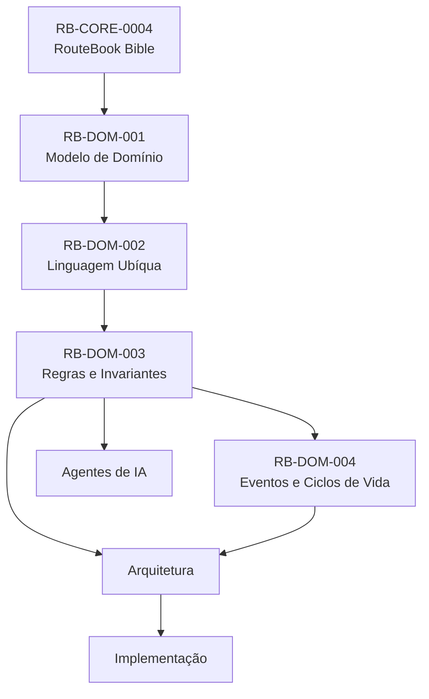
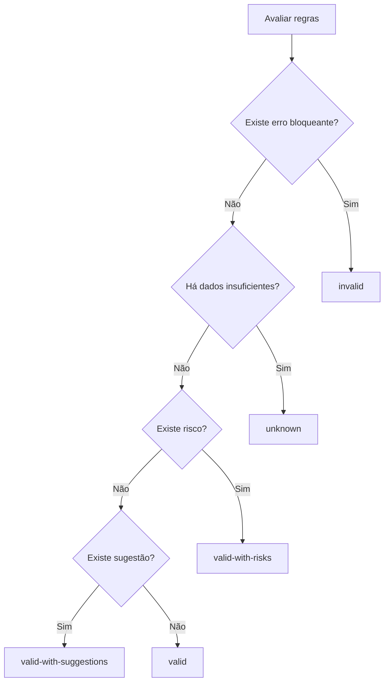
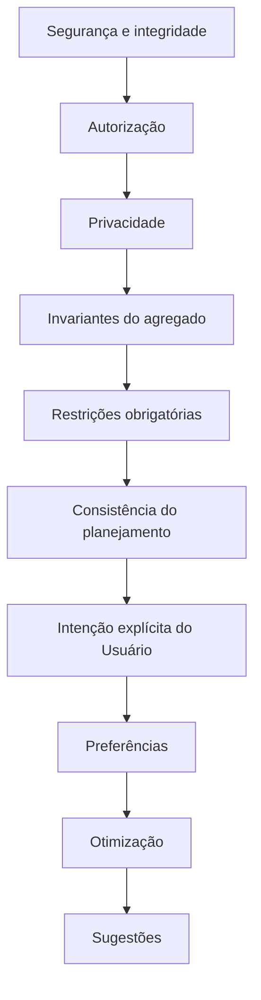
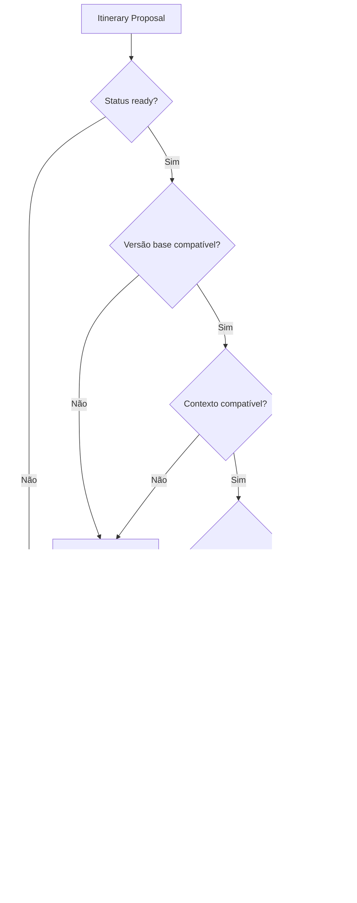
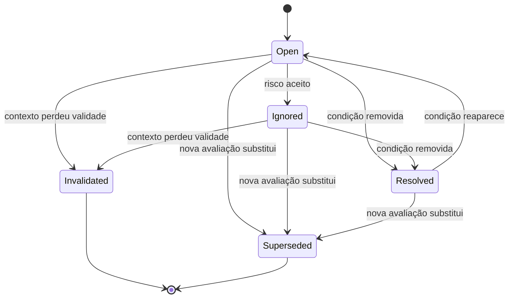
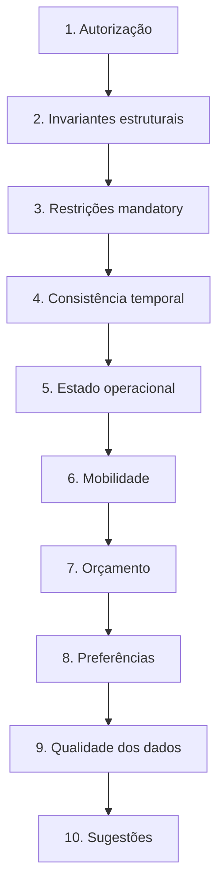

---

id: RB-DOM-003

title: Regras de Negócio e Invariantes
description: Define as regras de negócio, invariantes, políticas, pré-condições, pós-condições, severidades, precedências e critérios de validação que governam o domínio do RouteBook.

document_type: domain
owner: Domain

status: Draft
version: "0.2.0"

created: "2026-07-18"
last_updated: "2026-07-18"

authors:

- RouteBook Team

tags:

- domain
- business-rules
- invariants
- policies
- validations
- planning-assurance
- decision-intelligence
- ddd
- diagrams
- mermaid
- ai-first
- travel-planning

related_documents:

- RB-CORE-0001
- RB-CORE-0002
- RB-CORE-0003
- RB-CORE-0004
- RB-PRD-001
- RB-PRD-002
- RB-PRD-003
- RB-PRD-004
- RB-PRD-005
- RB-PRD-006
- RB-PRD-007
- RB-PRD-008
- RB-UX-001
- RB-UX-002
- RB-UX-003
- RB-UX-004
- RB-UX-005
- RB-UX-006
- RB-DS-001
- RB-DS-002
- RB-DS-003
- RB-DS-004
- RB-DOM-001
- RB-DOM-002
- RB-DOM-004
- RB-ARC-001
- RB-ARC-002

prerequisites:

- RB-CORE-0004
- RB-DOM-001
- RB-DOM-002

next_documents:

- RB-DOM-004
- RB-ARC-001
- RB-ARC-002
- RB-DATA-001
- RB-QA-001

ai_context:
priority: critical
index: true
---

# RouteBook — Regras de Negócio e Invariantes

## Parte I — Fundamentos normativos

### 1. Propósito deste documento

Este documento define as regras de negócio e invariantes oficiais do RouteBook.

Seu objetivo é transformar os conceitos definidos no Modelo de Domínio e na Linguagem Ubíqua em condições normativas que possam orientar:

* produto;
* experiência do usuário;
* arquitetura;
* engenharia;
* qualidade;
* dados;
* integrações;
* automações;
* agentes de IA;
* analytics;
* observabilidade;
* documentação.

Este documento estabelece:

* regras de negócio;
* invariantes de agregados;
* pré-condições;
* pós-condições;
* políticas de domínio;
* regras bloqueantes;
* riscos;
* sugestões;
* regras de autorização;
* regras de consistência;
* regras de validade;
* precedência entre regras;
* critérios de invalidação;
* critérios para `PlanningConflict`;
* critérios para agentes de IA;
* matriz de rastreabilidade.

Este documento não define:

* implementação técnica;
* linguagem de programação;
* banco de dados físico;
* endpoints definitivos;
* mecanismos de autenticação;
* fornecedores;
* algoritmos específicos;
* modelos específicos de IA;
* estruturas físicas de persistência.

---

### 2. Autoridade normativa

A precedência normativa deverá seguir esta ordem:



#### Interpretação da precedência

* A Bible define princípios constitucionais.
* O Modelo de Domínio define conceitos e responsabilidades.
* A Linguagem Ubíqua define nomes e significados.
* Este documento define condições obrigatórias.
* Eventos e ciclos de vida refletem as mudanças permitidas.
* Arquitetura e implementação devem garantir o cumprimento das regras.
* Agentes de IA não podem operar fora dessas regras.

---

### 3. Definição de regra de negócio

Uma regra de negócio é uma condição normativa que governa:

* decisões;
* comportamentos;
* transições;
* permissões;
* restrições;
* cálculos;
* validade;
* consistência;
* interpretação de dados.

Uma regra pode ser:

* estrutural;
* comportamental;
* temporal;
* contextual;
* derivada;
* autorizativa;
* impeditiva;
* informativa.

---

### 4. Definição de invariante

Uma invariante é uma condição que deve permanecer verdadeira dentro de um limite de consistência.

Uma invariante deve ser protegida:

* antes da criação;
* durante uma alteração;
* após uma alteração;
* durante aplicação de Proposta;
* durante execução de comandos;
* durante operações de agentes de IA.

Uma invariante violada deve:

* impedir a operação; ou
* produzir um `PlanningConflict`, quando a operação puder ser preservada para revisão.

---

### 5. Regra, política e validação

| Conceito            | Definição                                         |
| ------------------- | ------------------------------------------------- |
| Regra de negócio    | Condição normativa do domínio                     |
| Invariante          | Condição que deve permanecer verdadeira           |
| Política de domínio | Estratégia para aplicar ou decidir entre regras   |
| Validação           | Processo de verificar uma condição                |
| Planning Conflict   | Registro de condição problemática no planejamento |
| Erro técnico        | Falha de infraestrutura ou implementação          |

Uma validação não cria uma regra.

Ela apenas verifica uma regra já definida.

---

### 6. Classificação das regras

As regras do RouteBook são classificadas como:

* `mandatory`;
* `blocking`;
* `risk`;
* `suggestion`;
* `derived`;
* `authorization`;
* `privacy`;
* `data-quality`.

#### Mandatory

Deve ser cumprida para que o estado seja válido.

#### Blocking

Impede uma operação específica.

#### Risk

Permite continuidade consciente quando autorizada.

#### Suggestion

Indica melhoria, sem impedir a operação.

#### Derived

Determina um valor calculado a partir de outros dados.

#### Authorization

Determina quem pode executar uma ação.

#### Privacy

Limita coleta, retenção ou exposição de dados.

#### Data quality

Determina tratamento de dados ausentes, antigos ou conflitantes.

---

### 7. Severidade das violações

| Severidade | Consequência                                  |
| ---------- | --------------------------------------------- |
| error      | Operação inválida ou bloqueada                |
| risk       | Operação pode continuar com decisão explícita |
| suggestion | Operação válida, mas pode ser melhorada       |

A severidade deve ser determinada pela regra, não pela camada de interface.

---

### 8. Resultado da avaliação de regras

Uma avaliação pode resultar em:

* `valid`;
* `invalid`;
* `valid-with-risks`;
* `valid-with-suggestions`;
* `unknown`;
* `not-applicable`.



---

## Parte II — Convenções para regras

### 9. Identificação de regras

Toda regra oficial deve possuir identificador estável.

Formato:

```text
RB-BR-{DOMÍNIO}-{NÚMERO}
```

Exemplos:

```text
RB-BR-TRIP-001
RB-BR-ITN-001
RB-BR-REC-001
RB-BR-PCF-001
```

Siglas iniciais:

| Sigla | Área               |
| ----- | ------------------ |
| ACC   | Account            |
| TRIP  | Trip               |
| TRV   | Traveler Profile   |
| PLC   | Place              |
| COL   | Trip Collection    |
| ITN   | Itinerary          |
| MOB   | Mobility           |
| REC   | Recommendation     |
| DEC   | Decision           |
| PRP   | Itinerary Proposal |
| PCF   | Planning Conflict  |
| DAT   | Data Governance    |
| AI    | Agentes de IA      |
| PRI   | Privacidade        |

---

### 10. Estrutura de uma regra

Uma regra pode conter:

* identificador;
* nome;
* descrição;
* classificação;
* severidade;
* escopo;
* gatilho;
* pré-condições;
* condição;
* consequência;
* exceções;
* evidências;
* eventos relacionados;
* comandos relacionados.

---

### 11. Linguagem normativa

Este documento utiliza:

* **deve** para obrigação;
* **não deve** para proibição;
* **pode** para permissão;
* **deverá** para obrigação arquitetural futura;
* **recomenda-se** para orientação não obrigatória.

---

### 12. Regra de precedência

Quando regras entrarem em tensão, aplicar a seguinte ordem:

1. segurança e integridade;
2. autorização;
3. privacidade;
4. invariantes do agregado;
5. Restrições obrigatórias;
6. consistência do planejamento;
7. intenção explícita do Usuário;
8. Preferências;
9. otimização;
10. sugestões.



---

### 13. Conflito entre regras

Quando duas regras aplicáveis produzirem consequências incompatíveis:

* a regra de maior precedência deve prevalecer;
* a regra não aplicada deve permanecer rastreável;
* a decisão deve ser explicável;
* a existência de conflito normativo deve ser registrada;
* agentes de IA não devem escolher silenciosamente uma regra.

---

## Parte III — Regras transversais

### 14. Controle do Usuário

#### RB-BR-DEC-001 — Decisão pertence ao Usuário

Uma `Decision` deve representar uma escolha atribuível a um Usuário autorizado.

Classificação:

```text
mandatory
```

Consequências:

* uma Recomendação não pode ser registrada como Decisão;
* uma saída de IA não pode assumir autoria do Usuário;
* aplicação automática deve possuir autorização explícita anterior;
* autoria e instante da Decisão devem ser rastreáveis.

---

### 15. Recomendação não altera estado canônico

#### RB-BR-REC-001 — Recomendação é não aplicativa

A geração ou apresentação de uma `Recommendation` não deve alterar:

* Trip;
* Traveler Profile;
* Trip Collection;
* Itinerary;
* Activity;
* Free Period;
* Itinerary Proposal;
* Planning Conflict.

Classificação:

```text
mandatory
```

---

### 16. Proposta não é Roteiro

#### RB-BR-PRP-001 — Proposta permanece isolada

Uma `ItineraryProposal` deve permanecer separada do `Itinerary` até que seus itens sejam aceitos explicitamente.

Consequências:

* geração não altera o Roteiro;
* rejeição não altera o Roteiro;
* falha não altera o Roteiro;
* expiração não altera o Roteiro;
* apenas itens aceitos podem ser aplicados.

---

### 17. Estimativa não é confirmação

#### RB-BR-DAT-001 — Estimativas devem ser identificadas

Todo valor estimado deve ser apresentado como estimativa.

Aplica-se a:

* Distância;
* Travel Time;
* preço;
* duração;
* disponibilidade;
* lotação;
* Recommendation Confidence.

É proibido converter ausência de certeza em valor absoluto.

---

### 18. Informação desconhecida

#### RB-BR-DAT-002 — Desconhecido não recebe valor falso

Quando uma informação for desconhecida:

* não assumir zero;
* não assumir gratuito;
* não assumir aberto;
* não assumir disponível;
* não assumir ausência de conflito;
* não assumir baixa relevância.

O estado `unknown` deve ser preservado quando aplicável.

---

### 19. Proveniência obrigatória

#### RB-BR-DAT-003 — Dados externos preservam Provenance

Informações externas relevantes devem possuir `Provenance`.

Inclui:

* Fonte;
* momento de coleta;
* método;
* identificador externo;
* confiança;
* atualidade.

Dados gerados por IA devem ser identificados como tal.

---

### 20. Identidade interna

#### RB-BR-DAT-004 — Identidade interna é independente de fornecedor

Uma entidade interna não deve utilizar identificador externo como única identidade.

Aplica-se especialmente a:

* Place;
* Data Source;
* Recommendation;
* Travel Estimate.

---

### 21. Falha externa não destrutiva

#### RB-BR-DAT-005 — Falhas externas preservam estado local

Falhas de:

* mapas;
* rotas;
* IA;
* catálogo;
* clima;
* avaliações;
* preços;
* disponibilidade;

não devem apagar estado canônico local.

---

## Parte IV — Account e autorização

### 22. Conta ativa

#### RB-BR-ACC-001 — Conta ativa possui responsável

Uma `Account` ativa deve possuir ao menos um `User` responsável.

Classificação:

```text
mandatory
```

---

### 23. Owner da Viagem

#### RB-BR-ACC-002 — Toda Viagem possui owner

Uma `Trip` deve possuir ao menos um Participante com papel `owner`.

Não é permitido:

* criar Viagem sem owner;
* remover o último owner;
* rebaixar o último owner sem substituição;
* excluir o vínculo do último owner sem transferência.

---

### 24. Autorização de alteração

#### RB-BR-ACC-003 — Alterações exigem papel compatível

| Ação                         | Owner |      Editor | Viewer |
| ---------------------------- | ----: | ----------: | -----: |
| Visualizar Viagem            |   Sim |         Sim |    Sim |
| Alterar Roteiro              |   Sim |         Sim |    Não |
| Alterar Perfil dos Viajantes |   Sim |         Sim |    Não |
| Salvar Lugar                 |   Sim |         Sim |    Não |
| Aplicar Proposta             |   Sim |         Sim |    Não |
| Ignorar Risco                |   Sim | Condicional |    Não |
| Cancelar Viagem              |   Sim |         Não |    Não |
| Excluir Viagem               |   Sim |         Não |    Não |
| Transferir ownership         |   Sim |         Não |    Não |

A autorização definitiva poderá ser refinada pela Arquitetura, mas não pode enfraquecer estas restrições.

---

### 25. Usuário e Viajante

#### RB-BR-ACC-004 — User não implica Traveler

Um `User` não deve ser criado automaticamente como `Traveler` sem decisão explícita.

Um `Traveler` pode existir sem Conta.

---

## Parte V — Regras da Viagem

### 26. Criação da Viagem

#### RB-BR-TRIP-001 — Criação mínima de Viagem

Uma Viagem pode ser criada em estado `Draft` com informações parciais.

A criação exige:

* `TripId`;
* nome inicial ou nome derivável;
* owner;
* data de criação.

Destino e Período podem ser adicionados posteriormente enquanto a Viagem permanecer incompleta.

---

### 27. Viagem planejável

#### RB-BR-TRIP-002 — Requisitos para planejamento

Para que uma Viagem seja considerada planejável, deve possuir:

* Destination válido;
* Trip Period válido;
* owner;
* Itinerary inicializado;
* Traveler Profile inicializado;
* Trip Collection inicializada.

A ausência de Hospedagem não impede planejamento.

---

### 28. Período válido

#### RB-BR-TRIP-003 — Intervalo cronológico válido

Em `TripPeriod`:

```text
startDate <= endDate
```

A data final não pode preceder a data inicial.

Violação:

```text
error
```

---

### 29. Intervalo inclusivo

#### RB-BR-TRIP-004 — Datas do Período são inclusivas

A duração em Dias da Viagem deve considerar ambas as extremidades.

Exemplo:

```text
10/08 até 12/08 = 3 TripDays
```

---

### 30. Fuso horário

#### RB-BR-TRIP-005 — Datas usam fuso da Viagem

Datas e horários de planejamento devem utilizar o fuso associado à Viagem.

O fuso do dispositivo não deve alterar silenciosamente:

* data da Atividade;
* ordem do Dia;
* estado temporal da Viagem;
* validade de Proposta.

---

### 31. Hospedagem opcional

#### RB-BR-TRIP-006 — Hospedagem não é obrigatória

A ausência de `Accommodation`:

* não impede criação;
* não impede planejamento;
* pode limitar estimativas;
* pode reduzir Recommendation Confidence;
* deve ser comunicada quando relevante.

---

### 32. Alteração estrutural

#### RB-BR-TRIP-007 — Alterações estruturais incrementam versão

As seguintes mudanças devem incrementar `TripContextVersion`:

* Destination;
* Trip Period;
* Accommodation;
* composição dos Viajantes;
* Restrição obrigatória;
* alteração estrutural de Budget;
* alteração estrutural de Pace.

---

### 33. Invalidação após alteração estrutural

#### RB-BR-TRIP-008 — Dependências devem ser reavaliadas

Alterações estruturais podem invalidar:

* Travel Estimate;
* Recommendation;
* Itinerary Proposal;
* Planning Conflict;
* Recommendation Confidence;
* Context Snapshot;
* dados derivados.

A invalidação não deve apagar os objetos.

---

### 34. Cancelamento da Viagem

#### RB-BR-TRIP-009 — Cancelamento é explícito

Cancelar uma Viagem:

* altera Trip Status para `Cancelled`;
* preserva histórico;
* impede novas aplicações de Proposta;
* não equivale a excluir;
* não remove automaticamente o Roteiro.

---

### 35. Arquivamento da Viagem

#### RB-BR-TRIP-010 — Arquivamento é organizacional

Arquivar uma Viagem:

* não altera seu histórico;
* não significa cancelamento;
* pode removê-la das visualizações principais;
* deve ser reversível quando permitido.

---

### 36. Exclusão da Viagem

#### RB-BR-TRIP-011 — Exclusão exige confirmação reforçada

A exclusão deve:

* exigir owner;
* exigir confirmação explícita;
* comunicar consequências;
* respeitar políticas de retenção;
* preservar registros obrigatórios quando necessário.

---

## Parte VI — Regras de sincronização temporal

### 37. Um Dia por data

#### RB-BR-ITN-001 — Unicidade de Trip Day

Para cada data do `TripPeriod`, deve existir no máximo um `TripDay` ativo no `Itinerary`.

Chave contextual:

```text
TripId + LocalDate
```

---

### 38. Cobertura temporal do Roteiro

#### RB-BR-ITN-002 — Sincronização dos Dias

Quando a Viagem estiver planejável, o Roteiro deve possuir um `TripDay` para cada data do `TripPeriod`.

A sincronização deve ser idempotente.

---

### 39. Ampliação do Período

#### RB-BR-ITN-003 — Ampliação preserva conteúdo

Ao ampliar o Trip Period:

* criar Dias ausentes;
* preservar Dias existentes;
* preservar Atividades;
* preservar Períodos Livres;
* recalcular ordenação cronológica.

---

### 40. Redução do Período

#### RB-BR-ITN-004 — Redução não remove conteúdo silenciosamente

Ao reduzir o Trip Period, Dias externos ao novo intervalo devem ser avaliados.

Se um Dia afetado possuir:

* Activity;
* Free Period;
* anotação;
* decisão registrada;

a alteração deve exigir revisão explícita.

Violação potencial:

```text
error
```

ou:

```text
risk
```

conforme a operação oferecida.

---

### 41. Dias vazios

#### RB-BR-ITN-005 — Dia vazio é válido

Um `TripDay` sem Activity e sem Free Period é válido.

Ele representa planejamento incompleto, não erro.

---

### 42. Dia livre

#### RB-BR-ITN-006 — Dia livre é intencional

Um Dia só deve ser apresentado como livre quando existir decisão explícita.

Dia vazio não deve ser interpretado automaticamente como Dia livre.

---

## Parte VII — Traveler Profile

### 43. Existência do Perfil

#### RB-BR-TRV-001 — Viagem possui Traveler Profile

Toda Viagem planejável deve possuir exatamente um `TravelerProfile`.

---

### 44. Quantidade de Viajantes

#### RB-BR-TRV-002 — Perfil possui ao menos um Viajante

Uma Viagem planejável deve possuir ao menos um `Traveler`.

A ausência de Viajantes em Draft é permitida.

---

### 45. Minimização de dados

#### RB-BR-PRI-001 — Dados pessoais devem ser mínimos

O RouteBook deve coletar apenas dados necessários à experiência.

Preferir:

* faixa etária em vez de data de nascimento;
* necessidade funcional em vez de diagnóstico;
* preferências contextuais em vez de perfil sensível;
* localização pontual em vez de rastreamento contínuo.

---

### 46. Associação com User

#### RB-BR-TRV-003 — Associação é opcional

Um Traveler pode possuir `UserId`, mas essa associação não é obrigatória.

Um mesmo User não deve ser associado duas vezes ao mesmo Traveler Profile.

---

### 47. Group Profile derivado

#### RB-BR-TRV-004 — Perfil do Grupo é recalculável

`GroupProfile` deve ser derivado dos Viajantes atuais.

Mudanças nos Viajantes devem invalidar ou recalcular:

* composição;
* faixas etárias;
* necessidades;
* adequação de Recomendações.

---

### 48. Interesses

#### RB-BR-TRV-005 — Interest não é obrigatório

A ausência de Interest não impede planejamento.

Quando existir, Interest:

* pode possuir peso;
* pode possuir escopo;
* não deve sobrescrever Restrição obrigatória.

---

### 49. Restrições obrigatórias

#### RB-BR-TRV-006 — Restrição mandatory não pode ser ignorada

Uma Restriction de severidade `mandatory` deve impedir:

* Recomendação incompatível apresentada como adequada;
* aplicação de Atividade incompatível;
* geração de Proposta inválida.

Uma incompatibilidade obrigatória deve produzir:

```text
error
```

---

### 50. Restrições importantes

#### RB-BR-TRV-007 — Restrição important gera risco

Uma Restriction `important` pode gerar `PlanningConflict` de severidade `risk`.

A continuidade exige decisão explícita quando aplicável.

---

### 51. Preferências

#### RB-BR-TRV-008 — Preferência não é bloqueio

Uma Restriction de severidade `preference` ou um Interest deve influenciar ordenação e explicação, mas não bloquear operação válida.

---

### 52. Budget desconhecido

#### RB-BR-TRV-009 — Ausência de Budget não significa zero

Quando Budget não for informado:

* Recomendações financeiras podem ser menos específicas;
* custos estimados devem ser apresentados;
* ausência não deve excluir opções automaticamente.

---

### 53. Ritmo

#### RB-BR-TRV-010 — Pace orienta densidade

`Pace` deve influenciar:

* quantidade de Atividades;
* duração de intervalos;
* margem de deslocamento;
* necessidade de descanso.

Pace não define limite absoluto universal.

---

## Parte VIII — Place e catálogo

### 54. Identidade de Lugar

#### RB-BR-PLC-001 — Place possui identidade interna

Todo `Place` deve possuir `PlaceId` interno.

IDs externos devem ser referências, não identidade canônica.

---

### 55. Deduplicação

#### RB-BR-PLC-002 — Lugares equivalentes podem ser reconciliados

A resolução de duplicidade pode considerar:

* nome;
* coordenadas;
* endereço;
* identificadores externos;
* categoria;
* Provenance.

Nenhum critério isolado deve determinar fusão automática em todos os casos.

---

### 56. Fusão de Lugares

#### RB-BR-PLC-003 — Fusão preserva referências

Ao fundir Places:

* preservar PlaceId canônico;
* preservar aliases;
* preservar IDs externos;
* preservar Provenance;
* redirecionar referências;
* preservar histórico;
* evitar duplicação em Trip Collection.

---

### 57. Estado operacional desconhecido

#### RB-BR-PLC-004 — Unknown não significa open

Um Place com estado `unknown` não deve ser apresentado como aberto.

---

### 58. Fechamento temporário

#### RB-BR-PLC-005 — Fechamento temporário gera revisão

Quando um Place planejado estiver temporariamente fechado:

* não remover Activity;
* marcar necessidade de revisão;
* produzir Planning Conflict;
* permitir substituição.

Se a data futura estiver fora da vigência conhecida, a avaliação pode permanecer `unknown`.

---

### 59. Fechamento permanente

#### RB-BR-PLC-006 — Fechamento permanente torna visita inviável

Uma Activity ativa vinculada a Place permanentemente fechado deve gerar:

```text
error
```

A Activity não deve ser removida automaticamente.

---

### 60. Horário de funcionamento

#### RB-BR-PLC-007 — Horário é contextual

A compatibilidade deve considerar:

* data;
* fuso;
* intervalos;
* exceções;
* vigência;
* Data Freshness.

Opening Hours não garantem disponibilidade.

---

### 61. Preço desconhecido

#### RB-BR-PLC-008 — Unknown não significa free

Price Range desconhecido não deve ser exibido como gratuito.

---

### 62. Rating

#### RB-BR-PLC-009 — Rating preserva escala e Fonte

Um Rating deve possuir:

* valor;
* escala;
* quantidade de avaliações quando disponível;
* Data Source;
* data ou atualidade.

Ratings de escalas diferentes não devem ser combinados sem normalização explícita.

---

## Parte IX — Trip Collection e Lugares Salvos

### 63. Unicidade de Saved Place

#### RB-BR-COL-001 — Lugar é salvo uma vez por Viagem

Para uma Trip Collection:

```text
TripId + PlaceId
```

deve ser único.

---

### 64. Salvamento idempotente

#### RB-BR-COL-002 — Save Place é idempotente

Salvar novamente o mesmo Place:

* não cria duplicidade;
* não altera identidade;
* pode atualizar metadados permitidos;
* deve retornar estado equivalente ao já salvo.

---

### 65. Salvar não planeja

#### RB-BR-COL-003 — Saved Place não cria Activity

Salvar um Place não deve:

* criar Activity;
* definir Trip Day;
* alterar Itinerary;
* criar Travel Estimate automaticamente como estado canônico.

---

### 66. Remover dos Salvos

#### RB-BR-COL-004 — Unsave não remove do Roteiro

Remover um Saved Place não deve remover Activities relacionadas.

---

### 67. Lugar planejado

#### RB-BR-COL-005 — Planned Place é derivado

Um Place é considerado planejado quando existe ao menos uma Activity ativa associada.

Não deve existir estado canônico independente apenas para representar isso, salvo decisão arquitetural posterior devidamente documentada.

---

## Parte X — Itinerary

### 68. Um Roteiro atual

#### RB-BR-ITN-007 — Viagem possui um Itinerary atual

Cada Trip deve possuir exatamente um `Itinerary` canônico atual.

Histórico de versões não cria múltiplos Roteiros atuais.

---

### 69. Activity pertence a um Dia

#### RB-BR-ITN-008 — Activity exige Trip Day

Toda Activity ativa deve pertencer a exatamente um Trip Day.

---

### 70. Título de Activity

#### RB-BR-ITN-009 — Activity possui título

Toda Activity deve possuir título não vazio.

---

### 71. Lugar opcional

#### RB-BR-ITN-010 — Activity pode existir sem Place

Uma Activity pode representar:

* descanso;
* deslocamento;
* check-in;
* check-out;
* compromisso manual;
* período personalizado.

Place não é obrigatório.

---

### 72. Duração válida

#### RB-BR-ITN-011 — Duração informada é positiva

Quando Duration for informada:

```text
duration > 0
```

Violação:

```text
error
```

---

### 73. Horário válido

#### RB-BR-ITN-012 — Horário pertence ao Dia local

O horário de Activity deve ser interpretado no fuso da Viagem e associado ao Trip Day correto.

Atividades que atravessam meia-noite devem possuir representação explícita.

---

### 74. Ordenação

#### RB-BR-ITN-013 — Ordem é determinística

Atividades e Free Periods devem possuir ordem determinística dentro do Dia.

Empates devem ser resolvidos por política estável.

---

### 75. Sobreposição

#### RB-BR-ITN-014 — Sobreposição é avaliada

Duas Activities com horários incompatíveis devem produzir Planning Conflict.

Classificação sugerida:

| Situação                           | Severidade                   |
| ---------------------------------- | ---------------------------- |
| Atividades fixed sobrepostas       | error                        |
| fixed e tentative sobrepostas      | risk                         |
| Atividades sem horário             | suggestion ou not-applicable |
| sobreposição intencional suportada | valid                        |

---

### 76. Activity fixa

#### RB-BR-ITN-015 — Activity fixed não é movida automaticamente

Atividade com flexibilidade `fixed` não deve ser:

* reordenada;
* movida;
* redimensionada;
* substituída;

sem decisão explícita.

---

### 77. Activity flexible

#### RB-BR-ITN-016 — Activity flexible pode ser reorganizada em Proposta

Uma Activity `flexible` pode ser reorganizada por uma Itinerary Proposal.

A alteração só se torna canônica após aceitação.

---

### 78. Free Period protected

#### RB-BR-ITN-017 — Período protegido não é preenchido automaticamente

Um Free Period `protected` não pode receber Proposed Activity automaticamente.

Sua substituição exige decisão explícita.

---

### 79. Free Period flexible

#### RB-BR-ITN-018 — Período flexível aceita sugestão

Um Free Period `flexible` pode receber sugestões em uma Itinerary Proposal.

O Período não é removido até a aplicação dos itens aceitos.

---

### 80. Remoção de Activity

#### RB-BR-ITN-019 — Remoção preserva referências externas

Remover uma Activity:

* não remove Place;
* não remove Saved Place;
* não remove Data Source;
* pode invalidar Travel Estimates;
* pode resolver Planning Conflicts relacionados.

---

### 81. Mudança de Dia

#### RB-BR-ITN-020 — Mover Activity preserva identidade

Mover uma Activity para outro Trip Day deve preservar `ActivityId`.

---

### 82. Versão do Roteiro

#### RB-BR-ITN-021 — Alteração canônica incrementa versão

Devem incrementar `ItineraryVersion`:

* adicionar Activity;
* editar Activity;
* remover Activity;
* mover Activity;
* reordenar Activity;
* adicionar Free Period;
* alterar Free Period;
* remover Free Period;
* aplicar itens de Proposta;
* sincronizar Dias com impacto canônico.

---

### 83. Planejamento parcial

#### RB-BR-ITN-022 — Itinerary parcial é válido

O Roteiro pode permanecer:

* vazio;
* parcial;
* planejado.

Completude não determina validade.

---

### 84. Estado de revisão

#### RB-BR-ITN-023 — Review State é independente

O estado de revisão não deve ser inferido apenas pela existência de Activities.

Alterações após revisão podem retornar o Roteiro para `not-reviewed` ou `under-review`.

---

### 85. Estado de consistência

#### RB-BR-ITN-024 — Alterações estruturais podem tornar Roteiro outdated

Mudanças no Trip Context podem alterar Consistency State para `outdated`.

Outdated não significa inválido, mas exige reavaliação.

---

## Parte XI — Mobilidade

### 86. Origem e destino

#### RB-BR-MOB-001 — Travel Estimate exige referências válidas

Uma Travel Estimate exige:

* origem;
* destino;
* Transport Mode.

Origem e destino não podem ser semanticamente indefinidos.

---

### 87. Distância não negativa

#### RB-BR-MOB-002 — Distance é não negativa

```text
distance >= 0
```

Distância zero é válida quando origem e destino coincidem dentro da precisão adotada.

---

### 88. Tempo não negativo

#### RB-BR-MOB-003 — Travel Time é não negativo

```text
travelTime >= 0
```

---

### 89. Modo de transporte

#### RB-BR-MOB-004 — Estimativa depende de Transport Mode

Uma estimativa sem Transport Mode conhecido não deve ser apresentada como completa.

---

### 90. Validade temporal

#### RB-BR-MOB-005 — Travel Estimate possui validade

Uma estimativa deve considerar:

* momento de cálculo;
* data da Activity;
* transporte;
* origem;
* destino;
* Fonte;
* contexto.

Mudanças relevantes devem torná-la `stale` ou `invalidated`.

---

### 91. Margem de deslocamento

#### RB-BR-MOB-006 — Planejamento deve considerar deslocamento

Activities consecutivas com localização conhecida devem ser avaliadas considerando:

* Travel Time;
* margem de segurança;
* duração;
* flexibilidade;
* modo de transporte.

Insuficiência de intervalo pode gerar:

* error;
* risk;
* suggestion.

---

### 92. Falha de rota

#### RB-BR-MOB-007 — Falha não remove planejamento

Falha ao calcular rota:

* não remove Activities;
* não assume tempo zero;
* produz estado `unavailable` ou `failed`;
* pode reduzir Recommendation Confidence;
* pode gerar Planning Conflict de dados insuficientes.

---

## Parte XII — Recommendation

### 93. Contexto obrigatório

#### RB-BR-REC-002 — Recommendation possui Context Snapshot

Toda Recommendation personalizada deve possuir `DecisionContextSnapshot`.

---

### 94. Validade de contexto

#### RB-BR-REC-003 — Recommendation depende das versões utilizadas

Uma Recommendation pode ser invalidada quando mudarem:

* TripContextVersion;
* ItineraryVersion;
* data;
* horário;
* localização relevante;
* Restrição obrigatória;
* disponibilidade;
* estado operacional do Place.

---

### 95. Justificativa

#### RB-BR-REC-004 — Recommendation possui Reason

Toda Recommendation apresentada deve possuir ao menos uma `RecommendationReason`.

---

### 96. Limitações

#### RB-BR-REC-005 — Limitações relevantes devem ser comunicadas

Quando houver:

* dados antigos;
* Contexto incompleto;
* preço desconhecido;
* funcionamento incerto;
* rota indisponível;
* baixa confiança;

a Recommendation deve comunicar a limitação.

---

### 97. Confiança da Recomendação

#### RB-BR-REC-006 — Recommendation Confidence não é certeza

Recommendation Confidence deve:

* ser contextual;
* considerar evidências;
* considerar atualidade;
* considerar completude;
* não ser apresentada como garantia.

---

### 98. Score e confiança

#### RB-BR-REC-007 — Recommendation Score não substitui Confidence

Recommendation Score pode ordenar candidatos.

Ele não deve ser usado diretamente como:

* confiança;
* Rating;
* Decision Quality;
* probabilidade de sucesso.

---

### 99. Restrição obrigatória

#### RB-BR-REC-008 — Recommendation incompatível não deve ser apresentada como adequada

Uma opção que viola Restriction `mandatory`:

* pode ser excluída;
* pode ser apresentada como incompatível para explicação;
* não pode ser apresentada como recomendação válida.

---

### 100. Recomendação expirada

#### RB-BR-REC-009 — Recommendation expirada não deve ser aceita

Uma Recommendation em estado:

* expired;
* invalidated;
* superseded;

não deve ser aceita como válida sem nova avaliação.

---

### 101. Aceitação da Recomendação

#### RB-BR-REC-010 — Aceitar registra Decision

Aceitar uma Recommendation deve produzir ou se relacionar a uma Decision.

A aceitação não significa necessariamente execução imediata.

---

### 102. Rejeição da Recomendação

#### RB-BR-REC-011 — Rejeição não altera estado canônico relacionado

Rejeitar Recommendation:

* altera estado da Recommendation;
* não remove Place;
* não altera Itinerary;
* não deve ser interpretado como preferência permanente automaticamente.

---

## Parte XIII — Decision

### 103. Contexto da Decisão

#### RB-BR-DEC-002 — Decision preserva Context Snapshot

Uma Decision deve preservar o Contexto relevante utilizado.

---

### 104. Recomendação opcional

#### RB-BR-DEC-003 — Decision pode existir sem Recommendation

Decisões manuais são válidas.

Recommendation não é pré-condição.

---

### 105. Autoria

#### RB-BR-DEC-004 — Decision possui ator

Toda Decision deve possuir:

* UserId ou ator autorizado equivalente;
* instante;
* tipo;
* opção escolhida.

---

### 106. Execução separada

#### RB-BR-DEC-005 — Decision não implica execução concluída

Uma Decision pode produzir:

* comando;
* alteração;
* reserva futura;
* Activity;
* nenhuma execução imediata.

---

### 107. Resultado posterior

#### RB-BR-DEC-006 — Decision Outcome é posterior

Decision Outcome:

* não deve ser inventado;
* pode ser desconhecido;
* deve ser registrado após observação;
* pode contribuir para Decision Quality.

---

### 108. Qualidade da Decisão

#### RB-BR-DEC-007 — Decision Quality não julga o Usuário

Decision Quality deve avaliar adequação ao Contexto e aos objetivos, não valor pessoal ou competência do Usuário.

---

## Parte XIV — Itinerary Proposal

### 109. Versão base

#### RB-BR-PRP-002 — Proposal referencia Itinerary Version

Toda Itinerary Proposal deve possuir a versão do Roteiro utilizada como base.

---

### 110. Contexto base

#### RB-BR-PRP-003 — Proposal referencia Trip Context Version

Toda Itinerary Proposal deve registrar a Trip Context Version utilizada.

---

### 111. Proposta pronta

#### RB-BR-PRP-004 — Proposal ready deve ser revisável

Uma Proposta em estado `ready` deve possuir:

* itens propostos;
* critérios;
* Justificativas;
* versão base;
* Contexto base;
* limitações;
* Planning Conflicts conhecidos.

Uma Proposta pode estar vazia quando não houver alteração adequada, desde que isso seja explicado.

---

### 112. Proposed Activity não é Activity

#### RB-BR-PRP-005 — Proposed Activity não possui identidade canônica de Activity

Uma Proposed Activity:

* pertence à Proposta;
* não possui ActivityId canônico;
* não integra o Itinerary;
* não altera Travel Estimates canônicos;
* pode possuir identidade interna da Proposta.

---

### 113. Aplicação integral

#### RB-BR-PRP-006 — Aceitação integral valida versões

Antes de aplicar toda a Proposta, verificar:

* Proposal Status;
* ItineraryVersion;
* TripContextVersion;
* Restrições;
* Atividades fixed;
* Free Periods protected;
* autorização;
* idempotência.

---

### 114. Aplicação parcial

#### RB-BR-PRP-007 — Aceitação parcial aplica somente seleção

`AcceptItineraryProposalPartially` deve:

* identificar itens selecionados;
* validar dependências;
* aplicar somente itens válidos;
* preservar itens não aceitos na Proposta;
* atualizar Proposal Status;
* incrementar ItineraryVersion uma única vez por aplicação transacional.

---

### 115. Proposta expirada

#### RB-BR-PRP-008 — Proposal expirada não é aplicável

Uma Proposta deve expirar quando:

* sua validade temporal terminar;
* a versão base se tornar incompatível;
* o Contexto mudar de forma relevante;
* for substituída;
* regra específica determinar.

---

### 116. Idempotência

#### RB-BR-PRP-009 — Aplicação é idempotente

A repetição da mesma solicitação de aplicação não deve duplicar:

* Activities;
* Free Periods;
* decisões;
* efeitos canônicos.

---

### 117. Falha de aplicação

#### RB-BR-PRP-010 — Falha preserva Roteiro anterior

Se a aplicação falhar:

* nenhuma alteração parcial inconsistente deve permanecer;
* ItineraryVersion não deve refletir aplicação não concluída;
* a Proposta deve permanecer auditável;
* a falha técnica não deve ser confundida com Planning Conflict.

---

### 118. Fluxo de validade da Proposta



---

## Parte XV — Planning Assurance

### 119. Criação de Planning Conflict

#### RB-BR-PCF-001 — Conflict exige regra e evidência

Um `PlanningConflict` deve possuir:

* PlanningConflictId;
* regra relacionada;
* severidade;
* estado;
* evidência;
* objeto afetado;
* Contexto ou versões avaliadas.

---

### 120. Severidade error

#### RB-BR-PCF-002 — Error bloqueia operação incompatível

Planning Conflict de severidade `error` deve impedir a operação relacionada enquanto permanecer ativo.

Não pode ser ignorado.

---

### 121. Severidade risk

#### RB-BR-PCF-003 — Risk pode exigir Decision

Planning Conflict de severidade `risk` pode ser ignorado quando:

* a regra permitir;
* o ator possuir autorização;
* a decisão for explícita;
* a justificativa for registrada quando exigida.

---

### 122. Severidade suggestion

#### RB-BR-PCF-004 — Suggestion não bloqueia

Planning Conflict de severidade `suggestion`:

* não bloqueia;
* pode ser dispensado;
* pode orientar melhoria;
* não exige Ignore Planning Risk.

---

### 123. Estado resolved

#### RB-BR-PCF-005 — Resolução exige remoção da condição

Um Planning Conflict só deve ser marcado `resolved` quando a condição problemática deixar de existir.

---

### 124. Estado ignored

#### RB-BR-PCF-006 — Ignorar não resolve

`ignored` significa:

* risco conhecido;
* decisão consciente;
* condição ainda existente ou aceita;
* rastreabilidade preservada.

---

### 125. Estado invalidated

#### RB-BR-PCF-007 — Invalidação ocorre por perda de aplicabilidade

Um Planning Conflict pode ser invalidado quando:

* Contexto mudou;
* objeto afetado foi removido;
* versão mudou;
* evidência deixou de ser aplicável;
* regra não é mais aplicável.

Invalidar não significa resolver.

---

### 126. Estado superseded

#### RB-BR-PCF-008 — Nova avaliação pode substituir anterior

Um Planning Conflict pode ser `superseded` quando uma avaliação mais recente representar melhor a mesma condição.

---

### 127. Deduplicação de conflitos

#### RB-BR-PCF-009 — Mesma condição não gera duplicidade ativa

O sistema deve evitar múltiplos Planning Conflicts ativos equivalentes para:

* mesma regra;
* mesmo objeto;
* mesma versão;
* mesma condição.

---

### 128. Reabertura

#### RB-BR-PCF-010 — Condição recorrente pode gerar nova avaliação

Um conflito resolvido pode:

* ser reaberto, quando o modelo permitir; ou
* originar novo Planning Conflict.

A estratégia deve preservar histórico.

---

### 129. Resumo de conflitos

#### RB-BR-PCF-011 — Conflict Summary é derivado

O resumo do Roteiro deve ser calculado a partir dos Planning Conflicts ativos.

Precedência sugerida:

```text
with-errors
> with-risks
> with-suggestions
> without-known-conflicts
```

`without-known-conflicts` não significa garantia de ausência de problemas.

---

### 130. Fluxo de Planning Conflict



---

## Parte XVI — Regras de dados e qualidade

### 131. Data Freshness

#### RB-BR-DAT-006 — Atualidade deve ser avaliada por tipo

O limite para considerar um dado `stale` deve depender do tipo de informação.

Exemplos:

* horário de funcionamento;
* preço;
* estado operacional;
* Rating;
* Travel Estimate;
* descrição estável.

Não deve existir um único prazo universal.

---

### 132. Dados conflitantes

#### RB-BR-DAT-007 — Fontes divergentes devem ser preservadas

Quando fontes confiáveis divergirem:

* não sobrescrever silenciosamente;
* preservar Provenance;
* marcar `conflicting`;
* reduzir Confidence Level;
* comunicar limitação;
* aplicar política de resolução.

---

### 133. Dado inferido

#### RB-BR-DAT-008 — Inferência deve ser identificada

Dado inferido não deve ser apresentado como confirmado.

---

### 134. Conteúdo de IA

#### RB-BR-AI-001 — Conteúdo de IA não é fato canônico

Conteúdo gerado por IA pode ser:

* sugestão;
* resumo;
* explicação;
* rascunho;
* classificação;
* hipótese.

Não deve se tornar fato confirmado sem processo de validação adequado.

---

### 135. Precisão

#### RB-BR-DAT-009 — Precisão não excede a Fonte

A apresentação não deve sugerir precisão superior à informação de origem.

Exemplo:

* tempo aproximado não deve ser apresentado como duração exata;
* localização aproximada não deve ser apresentada como coordenada confirmada;
* faixa de preço não deve ser apresentada como preço final.

---

## Parte XVII — Regras para IA e automações

### 136. Subordinação às invariantes

#### RB-BR-AI-002 — Agentes respeitam as mesmas regras

Agentes de IA devem cumprir as mesmas regras aplicadas a Usuários, serviços e integrações.

---

### 137. Sem autorização implícita

#### RB-BR-AI-003 — IA não concede autorização

IA não pode:

* transferir ownership;
* excluir Viagem;
* ignorar Risco;
* aplicar Proposta;
* registrar Decision do Usuário;
* alterar Restrição obrigatória;

sem autorização explícita e verificável.

---

### 138. Explicabilidade

#### RB-BR-AI-004 — Recomendações de IA devem ser explicáveis

Uma Recommendation gerada com IA deve apresentar fatores compreensíveis.

Não é obrigatório expor:

* prompt integral;
* raciocínio interno;
* pesos proprietários;
* cadeia interna do modelo.

---

### 139. Contexto mínimo

#### RB-BR-AI-005 — IA recebe apenas contexto necessário

Dados enviados a um modelo devem ser minimizados.

Evitar enviar:

* dados pessoais desnecessários;
* histórico completo quando um recorte basta;
* localização contínua;
* diagnósticos;
* credenciais;
* identificadores externos irrelevantes.

---

### 140. Saída estruturada

#### RB-BR-AI-006 — Saída de IA deve ser validada

Quando uma saída de IA for utilizada para produzir objetos de domínio:

* validar estrutura;
* validar tipos;
* validar referências;
* validar invariantes;
* validar enumerações;
* validar Provenance;
* rejeitar campos não reconhecidos quando necessário.

---

### 141. Falha segura

#### RB-BR-AI-007 — Falha de IA não altera estado

Falha, timeout ou resposta inválida de IA deve preservar estado canônico.

---

### 142. Alucinação e dado desconhecido

#### RB-BR-AI-008 — IA não preenche lacunas como fato

Quando não houver evidência suficiente, o agente deve:

* indicar incerteza;
* solicitar dado quando necessário;
* produzir opção condicionada;
* evitar inventar Lugar, preço, horário ou disponibilidade.

---

## Parte XVIII — Regras de privacidade

### 143. Localização pontual

#### RB-BR-PRI-002 — Localização atual deve ser contextual

A localização atual:

* deve ser coletada apenas quando necessária;
* deve possuir finalidade;
* não deve implicar rastreamento contínuo;
* deve possuir tratamento de expiração.

---

### 144. Dados de crianças

#### RB-BR-PRI-003 — Dados de menores devem ser minimizados

Para Viajantes menores, preferir:

* faixa etária;
* necessidades funcionais;
* restrições contextuais.

Evitar:

* nome completo quando desnecessário;
* data de nascimento completa;
* dados sensíveis sem finalidade clara.

---

### 145. Necessidades funcionais

#### RB-BR-PRI-004 — Necessidade funcional é preferida a diagnóstico

Registrar:

```text
necessita acesso sem escadas
```

em vez de:

```text
possui determinada condição médica
```

quando o diagnóstico não for necessário.

---

### 146. Retenção

#### RB-BR-PRI-005 — Retenção deve respeitar finalidade

Dados pessoais não devem ser mantidos indefinidamente sem finalidade, obrigação ou decisão do Usuário.

---

## Parte XIX — Pré-condições e pós-condições de comandos

### 147. Create Trip

#### Pré-condições

* User autenticado;
* Account ativa;
* permissão para criação.

#### Pós-condições

* Trip criada em Draft;
* owner atribuído;
* TripContextVersion inicializada;
* evento `TripCreated` produzido.

---

### 148. Update Trip Period

#### Pré-condições

* ator autorizado;
* Trip existente;
* novo Período válido;
* impacto calculado.

#### Pós-condições

* Trip Period atualizado;
* TripContextVersion incrementada;
* sincronização dos Trip Days iniciada;
* objetos dependentes invalidados;
* evento `TripPeriodChanged` produzido.

---

### 149. Save Place

#### Pré-condições

* Trip existente;
* Place existente;
* ator autorizado.

#### Pós-condições

* Saved Place existente;
* ausência de duplicidade;
* Itinerary inalterado;
* evento `PlaceSaved` produzido somente quando houver mudança real.

---

### 150. Add Activity

#### Pré-condições

* Trip Day existente;
* ator autorizado;
* título válido;
* Duration válida quando presente;
* Place válido quando presente.

#### Pós-condições

* Activity adicionada;
* ItineraryVersion incrementada;
* consistência marcada para reavaliação;
* evento `ActivityAdded` produzido.

---

### 151. Request Recommendation

#### Pré-condições

* Contexto mínimo disponível;
* escopo da decisão conhecido;
* autorização compatível.

#### Pós-condições

* solicitação registrada;
* nenhuma alteração canônica aplicada;
* Recommendation gerada ou falha registrada.

---

### 152. Accept Recommendation

#### Pré-condições

* Recommendation existente;
* estado aplicável;
* validade preservada;
* ator autorizado.

#### Pós-condições

* Recommendation marcada como accepted;
* Decision registrada;
* execução separada iniciada quando aplicável.

---

### 153. Accept Itinerary Proposal Partially

#### Pré-condições

* Itinerary Proposal ready;
* itens selecionados;
* versão base compatível;
* Contexto compatível;
* ator autorizado;
* invariantes satisfeitas.

#### Pós-condições

* somente itens aceitos aplicados;
* ItineraryVersion incrementada;
* Proposal Status atualizado;
* Decision registrada;
* evento `ItineraryProposalPartiallyAccepted` produzido.

---

### 154. Ignore Planning Risk

#### Pré-condições

* Planning Conflict open;
* severidade risk;
* regra permite ignorar;
* ator autorizado.

#### Pós-condições

* Conflict Status alterado para ignored;
* Decision registrada;
* justificativa preservada quando exigida;
* evento `PlanningConflictIgnored` produzido.

---

## Parte XX — Matriz de regras bloqueantes

### 155. Principais regras bloqueantes

| Regra          | Condição bloqueante                       |
| -------------- | ----------------------------------------- |
| RB-BR-ACC-002  | Viagem sem owner                          |
| RB-BR-ACC-003  | Ator sem autorização                      |
| RB-BR-TRIP-003 | Data final anterior à inicial             |
| RB-BR-ITN-004  | Redução de Período com perda silenciosa   |
| RB-BR-TRV-006  | Violação de Restrição mandatory           |
| RB-BR-PLC-006  | Activity em Place permanentemente fechado |
| RB-BR-ITN-011  | Duration não positiva                     |
| RB-BR-PRP-008  | Aplicação de Proposta expirada            |
| RB-BR-PCF-002  | Ignorar Planning Conflict error           |
| RB-BR-AI-003   | Ação de IA sem autorização                |

---

### 156. Principais riscos

| Regra         | Situação                               |
| ------------- | -------------------------------------- |
| RB-BR-TRV-007 | Violação de Restrição important        |
| RB-BR-PLC-005 | Fechamento temporário                  |
| RB-BR-ITN-014 | Sobreposição não bloqueante            |
| RB-BR-MOB-006 | Intervalo de deslocamento insuficiente |
| RB-BR-DAT-006 | Dados antigos                          |
| RB-BR-DAT-007 | Fontes conflitantes                    |
| RB-BR-REC-006 | Baixa confiança                        |
| RB-BR-PCF-003 | Continuidade com Risco                 |

---

### 157. Principais sugestões

| Área         | Situação                             |
| ------------ | ------------------------------------ |
| Roteiro      | Dia com baixa utilização             |
| Roteiro      | Excesso de Atividades para o Pace    |
| Mobilidade   | Sequência geográfica pouco eficiente |
| Preferências | Baixa aderência aos Interesses       |
| Dados        | Hospedagem não informada             |
| Recomendação | Contexto incompleto                  |
| Planejamento | Free Period flexible disponível      |

---

## Parte XXI — Matriz de precedência aplicada

### 158. Exemplos de precedência

| Situação                                                        | Regra prevalente              |
| --------------------------------------------------------------- | ----------------------------- |
| Interesse por aventura versus Restrição mandatory de mobilidade | Restrição mandatory           |
| Menor distância versus Place permanentemente fechado            | Estado operacional            |
| Recomendação com score alto versus dados stale                  | Qualidade e atualidade        |
| IA sugere alteração versus Free Period protected                | Intenção explícita do Usuário |
| Editor tenta excluir Viagem                                     | Autorização                   |
| Proposta otimizada versus Activity fixed                        | Invariante do Roteiro         |
| Orçamento preferencial versus segurança                         | Segurança                     |

---

## Parte XXII — Validação do planejamento

### 159. Escopos de revisão

Uma revisão pode avaliar:

* Trip;
* Trip Day;
* Activity;
* Itinerary;
* Itinerary Proposal;
* Recommendation;
* Place;
* Travel Estimate.

---

### 160. Ordem recomendada de avaliação



---

### 161. Resultado da revisão

Uma revisão deve produzir:

* resultado geral;
* regras avaliadas;
* Planning Conflicts;
* evidências;
* versões;
* momento;
* escopo;
* limitações.

---

### 162. Revisão incompleta

Quando dados necessários estiverem ausentes:

* resultado pode ser `unknown`;
* não afirmar ausência de conflitos;
* comunicar limitações;
* criar sugestão para completar dados quando apropriado.

---

## Parte XXIII — Rastreabilidade

### 163. Matriz entre agregados e regras

| Agregado           | Faixa principal |
| ------------------ | --------------- |
| Account            | RB-BR-ACC-*     |
| Trip               | RB-BR-TRIP-*    |
| Traveler Profile   | RB-BR-TRV-*     |
| Place              | RB-BR-PLC-*     |
| Trip Collection    | RB-BR-COL-*     |
| Itinerary          | RB-BR-ITN-*     |
| Recommendation     | RB-BR-REC-*     |
| Decision           | RB-BR-DEC-*     |
| Itinerary Proposal | RB-BR-PRP-*     |
| Planning Conflict  | RB-BR-PCF-*     |
| Data Source        | RB-BR-DAT-*     |

---

### 164. Matriz entre conceitos estratégicos e regras

| Conceito                  | Regras relacionadas                         |
| ------------------------- | ------------------------------------------- |
| Context                   | RB-BR-REC-002, RB-BR-DEC-002, RB-BR-PRP-003 |
| Recommendation            | RB-BR-REC-*                                 |
| Decision                  | RB-BR-DEC-*                                 |
| Recommendation Confidence | RB-BR-REC-006                               |
| Explainability            | RB-BR-REC-004, RB-BR-REC-005, RB-BR-AI-004  |
| Decision Quality          | RB-BR-DEC-006, RB-BR-DEC-007                |
| Next Best Action          | Regras de Recommendation                    |
| Provenance                | RB-BR-DAT-003                               |
| Planning Conflict         | RB-BR-PCF-*                                 |

---

### 165. Rastreabilidade futura

RB-DOM-004 deverá relacionar:

* regra;
* comando;
* evento;
* transição;
* ciclo de vida.

RB-QA-001 deverá relacionar:

* regra;
* cenário;
* critério de aceite;
* teste.

---

## Parte XXIV — Critérios de aceite

### 166. Critérios estruturais

* regras possuem identificadores;
* classificação está definida;
* severidade está definida quando aplicável;
* invariantes por agregado estão documentadas;
* regras transversais estão documentadas;
* precedência está definida;
* pré-condições e pós-condições estão documentadas;
* Planning Conflict está normalizado;
* Itinerary Proposal está normalizada;
* identificadores canônicos seguem o RB-DOM-002.

---

### 167. Critérios de consistência

* Recommendation não altera estado canônico;
* Decision pertence ao Usuário;
* Proposal não é Itinerary;
* Saved Place não é Planned Place;
* Place não é Activity;
* Estimate não é confirmação;
* unknown não recebe valor falso;
* IA não possui autoridade autônoma;
* Restrição mandatory não é ignorável;
* Activity fixed é preservada;
* Free Period protected é preservado.

---

### 168. Critérios dos diagramas

* existe apenas um H1;
* Partes utilizam H2;
* seções numeradas utilizam H3;
* subseções utilizam H4;
* blocos Mermaid não possuem atributos adicionais;
* diagramas utilizam termos oficiais;
* diagramas não contradizem as regras;
* diagramas não definem implementação física.

---

### 169. Critérios para agentes de IA

* agentes consultam regras aplicáveis;
* agentes não violam invariantes;
* agentes preservam autoria;
* agentes não inventam dados;
* agentes preservam Provenance;
* agentes comunicam limitações;
* agentes não aplicam Proposal sem autorização;
* agentes não ignoram Planning Conflict;
* agentes validam saída estruturada.

---

## Parte XXV — Governança

### 170. Inclusão de nova regra

Uma nova regra deve:

* possuir necessidade real;
* possuir identificador;
* utilizar Linguagem Ubíqua;
* indicar classificação;
* indicar escopo;
* indicar consequência;
* indicar severidade quando aplicável;
* indicar eventos relacionados;
* atualizar documentos afetados.

---

### 171. Alteração de regra

Uma alteração deve avaliar impacto em:

* Modelo de Domínio;
* Linguagem Ubíqua;
* Eventos;
* ciclos de vida;
* Arquitetura;
* banco de dados;
* APIs;
* UX;
* Design System;
* testes;
* analytics;
* prompts;
* agentes de IA.

---

### 172. Depreciação de regra

Uma regra depreciada deve registrar:

* identificador;
* substituta;
* motivo;
* data;
* impacto;
* estratégia de migração.

O identificador depreciado não deve ser reutilizado.

---

### 173. Exceções

Exceções devem ser:

* explícitas;
* justificadas;
* limitadas;
* rastreáveis;
* autorizadas;
* testáveis.

Uma exceção não documentada é uma violação.

---

### 174. Uso por agentes de IA

Agentes devem:

* identificar regras aplicáveis;
* respeitar precedência;
* diferenciar error, risk e suggestion;
* produzir Planning Conflict quando necessário;
* não criar exceções;
* não alterar severidade;
* não considerar ausência de evidência como conformidade.

---

## Parte XXVI — Checklist de revisão

### 175. Checklist normativo

Antes de aprovar:

* propósito está definido;
* autoridade está definida;
* terminologia está alinhada ao RB-DOM-002;
* regras possuem IDs;
* agregados estão cobertos;
* invariantes estão cobertas;
* autorização está coberta;
* privacidade está coberta;
* dados estão cobertos;
* IA está coberta;
* Trip Period está coberto;
* sincronização de Dias está coberta;
* Traveler Profile está coberto;
* Place está coberto;
* Trip Collection está coberta;
* Itinerary está coberto;
* Recommendation está coberta;
* Decision está coberta;
* Itinerary Proposal está coberta;
* Planning Conflict está coberto;
* precedência está definida;
* severidades estão definidas;
* pré-condições estão definidas;
* pós-condições estão definidas;
* rastreabilidade está definida;
* diagramas estão válidos;
* títulos Markdown são únicos;
* frontmatter YAML é válido;
* não existem contradições com RB-DOM-001;
* não existem contradições com RB-DOM-002.

---

## Parte XXVII — Declaração final

### 176. Declaração normativa

As Regras de Negócio e Invariantes do RouteBook estabelecem as condições obrigatórias que governam o comportamento do domínio.

Todo comportamento do produto deverá preservar:

* controle do Usuário;
* integridade dos agregados;
* autorização;
* privacidade;
* rastreabilidade;
* Provenance;
* planejamento parcial;
* separação entre Recommendation e Decision;
* separação entre Decision e execução;
* separação entre Itinerary Proposal e Itinerary;
* separação entre Place e Activity;
* separação entre Saved Place e Planned Place;
* caráter estimado de informações não confirmadas;
* validade contextual;
* consistência temporal;
* proteção de Activities fixed;
* proteção de Free Periods protected;
* tratamento explícito de Planning Conflicts;
* subordinação de agentes de IA às regras oficiais.

Nenhuma interface, integração, automação, serviço ou agente de IA poderá redefinir silenciosamente essas regras.

Quando uma operação não puder preservar uma invariante, ela deverá ser bloqueada ou encaminhada para revisão por meio de `PlanningConflict`, conforme a severidade definida.
