---

id: RB-DOM-004

title: Eventos de Domínio e Ciclos de Vida
description: Define os eventos de domínio, comandos, transições de estado, ciclos de vida, relações causais, regras de idempotência, invalidação, versionamento e integração do domínio do RouteBook.

document_type: domain
owner: Domain

status: Draft
version: "0.2.0"

created: "2026-07-18"
last_updated: "2026-07-18"

authors:

- RouteBook Team

tags:

- domain
- domain-events
- lifecycle
- state-transitions
- commands
- event-driven
- idempotency
- planning-assurance
- decision-intelligence
- ddd
- diagrams
- mermaid
- ai-first
- travel-planning

related_documents:

- RB-CORE-0001
- RB-CORE-0002
- RB-CORE-0003
- RB-CORE-0004
- RB-PRD-001
- RB-PRD-002
- RB-PRD-003
- RB-PRD-004
- RB-PRD-005
- RB-PRD-006
- RB-PRD-007
- RB-PRD-008
- RB-UX-001
- RB-UX-002
- RB-UX-003
- RB-UX-004
- RB-UX-005
- RB-UX-006
- RB-DS-001
- RB-DS-002
- RB-DS-003
- RB-DS-004
- RB-DOM-001
- RB-DOM-002
- RB-DOM-003
- RB-ARC-001
- RB-ARC-002

prerequisites:

- RB-CORE-0004
- RB-DOM-001
- RB-DOM-002
- RB-DOM-003

next_documents:

- RB-ARC-001
- RB-ARC-002
- RB-DATA-001
- RB-QA-001

ai_context:
priority: critical
index: true
---

# RouteBook — Eventos de Domínio e Ciclos de Vida

## Parte I — Fundamentos

### 1. Propósito deste documento

Este documento define os Eventos de Domínio e os Ciclos de Vida oficiais do RouteBook.

Seu objetivo é estabelecer como mudanças relevantes no domínio:

* são solicitadas;
* são validadas;
* são aplicadas;
* são registradas;
* são comunicadas;
* produzem consequências;
* invalidam estados derivados;
* iniciam avaliações;
* preservam rastreabilidade.

Este documento orienta:

* produto;
* arquitetura;
* engenharia;
* qualidade;
* dados;
* integrações;
* automações;
* analytics;
* observabilidade;
* agentes de IA;
* documentação.

Este documento define:

* comandos conceituais;
* Eventos de Domínio;
* transições de estado;
* ciclos de vida;
* causalidade;
* correlação;
* idempotência;
* versionamento;
* invalidação;
* eventos internos;
* eventos de integração;
* payload conceitual mínimo;
* regras de publicação;
* regras de consumo;
* regras de falha;
* rastreabilidade entre comandos, regras e eventos.

Este documento não define:

* broker;
* fila;
* tópico;
* protocolo;
* banco físico;
* tecnologia de mensageria;
* framework;
* serialização definitiva;
* estratégia de entrega física;
* infraestrutura de observabilidade;
* implementação de Event Sourcing.

---

### 2. Autoridade documental

A precedência para interpretação deve ser:

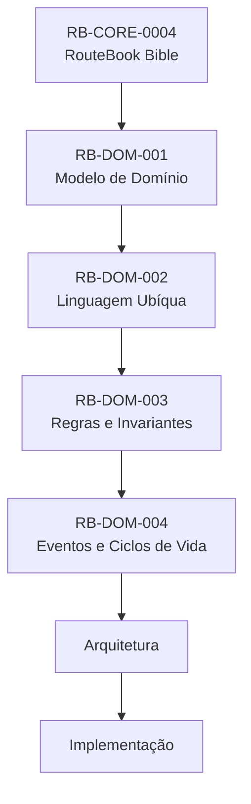

#### Interpretação

* O Modelo de Domínio define os conceitos.
* A Linguagem Ubíqua define os nomes.
* As Regras de Negócio definem o que é permitido.
* Este documento define como mudanças válidas são representadas.
* A Arquitetura define como eventos serão implementados e transportados.

---

### 3. Definição de comando

Um comando representa uma intenção de alterar o estado do domínio.

Um comando:

* utiliza verbo de ação;
* pode ser rejeitado;
* possui um alvo;
* possui um ator;
* possui Contexto;
* pode produzir nenhum, um ou vários eventos;
* não representa fato ocorrido.

Exemplos:

```text
CreateTrip
UpdateTripPeriod
SavePlace
AddActivity
AcceptItineraryProposalPartially
ResolvePlanningConflict
```

---

### 4. Definição de Evento de Domínio

Um Evento de Domínio representa um fato relevante que já ocorreu.

Um evento:

* utiliza verbo no passado;
* é imutável;
* possui identidade;
* possui momento de ocorrência;
* possui origem;
* possui correlação;
* representa uma mudança confirmada;
* não deve ser utilizado como comando disfarçado.

Exemplos:

```text
TripCreated
TripPeriodChanged
PlaceSaved
ActivityAdded
DecisionRecorded
PlanningConflictDetected
```

---

### 5. Comando, evento e efeito

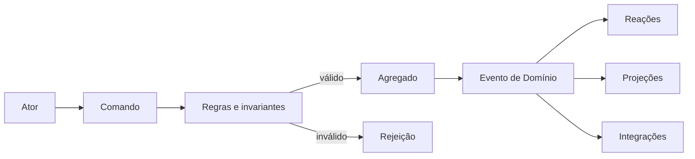

---

### 6. Evento não é log técnico

Evento de Domínio não deve representar:

* stack trace;
* timeout;
* requisição HTTP;
* execução de query;
* mudança visual;
* clique;
* métrica técnica;
* mensagem de depuração.

Falhas técnicas podem produzir eventos operacionais, mas não devem ser confundidas com fatos do domínio.

---

### 7. Evento não é notificação

Uma notificação pode ser consequência de um Evento de Domínio.

Exemplo:

```text
PlanningConflictDetected
→ usuário pode ser notificado
```

A notificação não é o evento canônico.

---

## Parte II — Convenções de eventos

### 8. Identificação de eventos

Todo Evento de Domínio deve possuir:

```text
EventId
```

O identificador deve ser único no escopo global do sistema.

---

### 9. Nome dos eventos

Eventos devem utilizar:

```text
Entidade + fato no passado
```

Exemplos:

```text
TripCreated
ActivityMovedToAnotherDay
RecommendationInvalidated
ItineraryProposalPartiallyAccepted
PlanningConflictResolved
```

Evitar:

```text
TripCreate
ActivityMove
ConflictProcess
ProposalUpdate
```

---

### 10. Metadados conceituais mínimos

Todo evento deve possuir, conceitualmente:

* `eventId`;
* `eventType`;
* `occurredAt`;
* `aggregateId`;
* `aggregateType`;
* `aggregateVersion`;
* `correlationId`;
* `causationId`;
* `actorReference`;
* `schemaVersion`.

Quando aplicável:

* `tripId`;
* `tenantReference`;
* `source`;
* `traceReference`;
* `contextVersion`;
* `itineraryVersion`.

---

### 11. Payload conceitual

O payload deve conter apenas dados necessários para representar o fato e permitir reações autorizadas.

Não deve incluir automaticamente:

* agregado inteiro;
* dados pessoais completos;
* credenciais;
* tokens;
* diagnósticos;
* localização contínua;
* prompts;
* raciocínio interno de IA;
* dados externos sem necessidade.

---

### 12. Actor Reference

Um evento que resulte de uma ação atribuível deve registrar o ator conceitual.

Tipos possíveis:

* `User`;
* `System`;
* `Agent`;
* `Integration`;
* `ScheduledProcess`.

O tipo `Agent` não substitui o Usuário quando a ação exigir decisão humana.

---

### 13. Correlation ID

`correlationId` relaciona eventos e operações pertencentes ao mesmo fluxo de negócio.

Exemplo:

```text
AcceptItineraryProposalPartially
→ DecisionRecorded
→ ItineraryProposalPartiallyAccepted
→ ActivityAdded
→ ItineraryVersionChanged
```

Todos podem compartilhar a mesma correlação.

---

### 14. Causation ID

`causationId` identifica o comando ou evento que causou diretamente outro evento.

Exemplo:

```text
TripPeriodChanged
causa
TripDaysSynchronized
```

---

### 15. Versionamento de schema

Eventos devem possuir `schemaVersion`.

Mudanças compatíveis podem incluir:

* campo opcional;
* novo metadado;
* novo valor documentado;
* enriquecimento não obrigatório.

Mudanças incompatíveis exigem:

* nova versão de schema;
* estratégia de migração;
* compatibilidade de consumidores;
* atualização documental.

---

### 16. Versionamento do agregado

Eventos de um agregado devem indicar sua versão após a alteração.

Exemplo:

```text
aggregateVersion: 12
```

Essa versão não substitui:

* `TripContextVersion`;
* `ItineraryVersion`;
* `schemaVersion`.

---

### 17. Ordenação

A ordem global de eventos não deve ser assumida.

A ordenação deve ser garantida apenas quando necessária dentro de:

* mesmo agregado;
* mesma partição lógica;
* mesma correlação;
* mesma operação transacional.

---

### 18. Idempotência

Consumidores devem tratar reentrega do mesmo `EventId` sem duplicar efeitos.

Comandos sensíveis devem possuir mecanismo de idempotência quando repetição puder duplicar:

* Activities;
* Decisions;
* Saved Places;
* aplicação de Proposta;
* resolução de Planning Conflict.

---

## Parte III — Tipos de eventos

### 19. Evento de Domínio interno

Evento interno representa fato relevante dentro do mesmo limite lógico.

Pode ser utilizado para:

* sincronizar agregados;
* invalidar objetos;
* iniciar cálculo;
* atualizar projeções;
* iniciar revisão.

---

### 20. Evento de integração

Evento de integração representa fato compartilhado com outro módulo ou sistema.

Deve:

* expor apenas dados necessários;
* possuir contrato estável;
* evitar detalhes internos;
* preservar privacidade;
* ser publicado após confirmação da mudança.

---

### 21. Evento derivado

Evento derivado representa consequência de outro fato.

Exemplo:

```text
TripPeriodChanged
→ TripDaysSynchronized
→ ItineraryMarkedOutdated
```

Um evento derivado deve manter `causationId`.

---

### 22. Evento de invalidação

Evento de invalidação informa que um objeto deixou de ser aplicável ao Contexto atual.

Exemplos:

```text
RecommendationInvalidated
ItineraryProposalExpired
PlanningConflictInvalidated
TravelEstimateInvalidated
```

Invalidação não significa exclusão.

---

### 23. Evento de ciclo de vida

Evento de ciclo de vida representa mudança relevante de estado.

Exemplos:

```text
TripCancelled
RecommendationExpired
ItineraryProposalRejected
PlanningConflictResolved
```

---

## Parte IV — Regras gerais de emissão

### 24. Evento somente após sucesso

Um evento deve ser produzido apenas após a mudança correspondente ser considerada válida e confirmada.

Não produzir:

```text
ActivityAdded
```

quando a Activity não tiver sido adicionada.

---

### 25. Operação rejeitada

Uma operação rejeitada não deve produzir evento de sucesso.

Pode produzir registro operacional ou evento específico de auditoria, se necessário, sem afirmar mudança inexistente.

---

### 26. Evento após persistência

A Arquitetura deverá garantir que:

* estado confirmado não fique sem evento necessário;
* evento publicado não represente estado não confirmado.

A estratégia física será definida posteriormente.

---

### 27. Evento não altera o passado

Eventos publicados são imutáveis.

Correções devem ocorrer por:

* novo evento;
* invalidação;
* compensação;
* supersessão;
* correção de projeção.

---

### 28. Reações não podem enfraquecer invariantes

Consumidores de eventos não podem produzir alterações que violem regras do domínio.

Toda reação que altere estado deve executar as validações aplicáveis.

---

## Parte V — Eventos de Account e acesso

### 29. AccountCreated

#### Gatilho

Criação válida de uma Account.

#### Payload conceitual

* AccountId;
* responsável inicial;
* status inicial;
* occurredAt.

#### Pós-condições

* Account existe;
* responsável existe;
* identidade interna foi criada.

---

### 30. UserAddedToAccount

Representa inclusão de User em uma Account.

Não significa inclusão em uma Trip.

---

### 31. UserRemovedFromAccount

Deve respeitar:

* responsabilidade mínima;
* consentimentos;
* ownership de Trips;
* retenção de histórico.

---

### 32. TripParticipantAdded

Representa vínculo de um User a uma Trip com papel de acesso.

Payload:

* TripId;
* UserId;
* TripRole.

---

### 33. TripParticipantRoleChanged

Representa alteração de papel.

Não pode resultar em Trip sem owner.

---

### 34. TripParticipantRemoved

Não pode remover o último owner.

---

### 35. TripOwnershipTransferred

Representa transferência explícita de ownership.

Pode produzir:

* alteração de dois ou mais participantes;
* auditoria;
* notificações.

---

## Parte VI — Ciclo de vida da Trip

### 36. Estados oficiais da Trip

* Draft;
* Planned;
* InProgress;
* Completed;
* Cancelled;
* Archived.

---

### 37. Diagrama do ciclo de vida da Trip

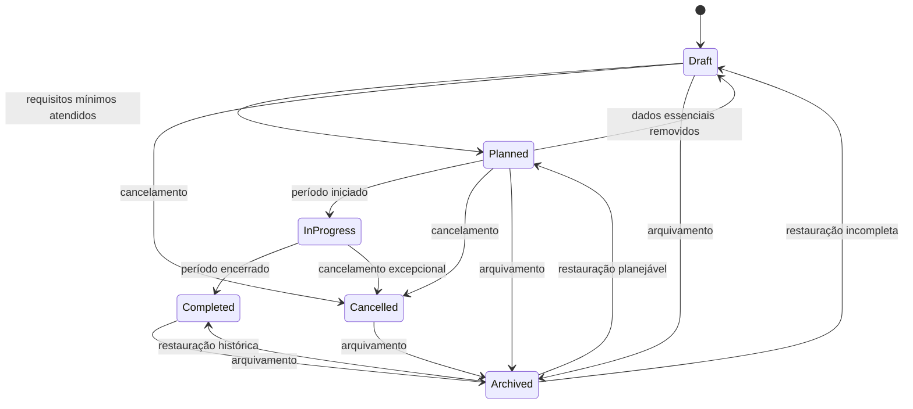

---

### 38. TripCreated

Produzido por:

```text
CreateTrip
```

Pré-condições:

* Account ativa;
* ator autorizado.

Pós-condições:

* Trip em Draft;
* owner atribuído;
* TripContextVersion inicializada;
* agregados dependentes podem ser inicializados.

---

### 39. TripNameChanged

Produzido por:

```text
UpdateTripName
```

Não deve incrementar `TripContextVersion`, salvo regra futura que atribua impacto estrutural ao nome.

---

### 40. TripDestinationChanged

Produzido por:

```text
UpdateTripDestination
```

Consequências possíveis:

* incremento de TripContextVersion;
* invalidação de Recommendation;
* invalidação de Itinerary Proposal;
* invalidação de Travel Estimate;
* reavaliação de Places;
* reavaliação de Planning Conflicts;
* Itinerary marcado como outdated.

---

### 41. TripPeriodChanged

Produzido por:

```text
UpdateTripPeriod
```

Payload mínimo:

* TripId;
* período anterior;
* novo período;
* TripContextVersion;
* impacto calculado.

Consequências:

* sincronização de Trip Days;
* reavaliação de Activities;
* invalidação de objetos dependentes.

---

### 42. TripAccommodationChanged

Produzido por:

```text
UpdateAccommodation
```

Consequências possíveis:

* Travel Estimates invalidadas;
* Recomendações invalidadas;
* Propostas invalidadas;
* planejamento reavaliado.

---

### 43. TripBecamePlannable

Evento derivado quando a Trip passa a atender requisitos mínimos de planejamento.

Não substitui `TripStatusChanged` quando este existir como evento explícito.

---

### 44. TripPlanningRequirementsLost

Evento derivado quando uma Trip deixa de atender requisitos mínimos.

Pode mover:

```text
Planned → Draft
```

---

### 45. TripStarted

Evento derivado do tempo ou de ação explícita quando a Trip entra em andamento.

---

### 46. TripCompleted

Evento derivado quando o período termina e a Trip é considerada concluída.

Não deve ser confundido com conclusão integral de Activities.

---

### 47. TripCancelled

Produzido por:

```text
CancelTrip
```

Consequências:

* impede aplicações futuras de Propostas;
* preserva Roteiro;
* pode invalidar Recomendações;
* preserva histórico.

---

### 48. TripArchived

Produzido por:

```text
ArchiveTrip
```

Arquivamento não significa exclusão.

---

### 49. TripDeleted

Produzido apenas após confirmação válida da exclusão lógica ou física, conforme política futura.

Não deve ser emitido no momento da solicitação se a exclusão ainda não foi concluída.

---

## Parte VII — Sincronização de Trip Days

### 50. Fluxo de alteração do Período

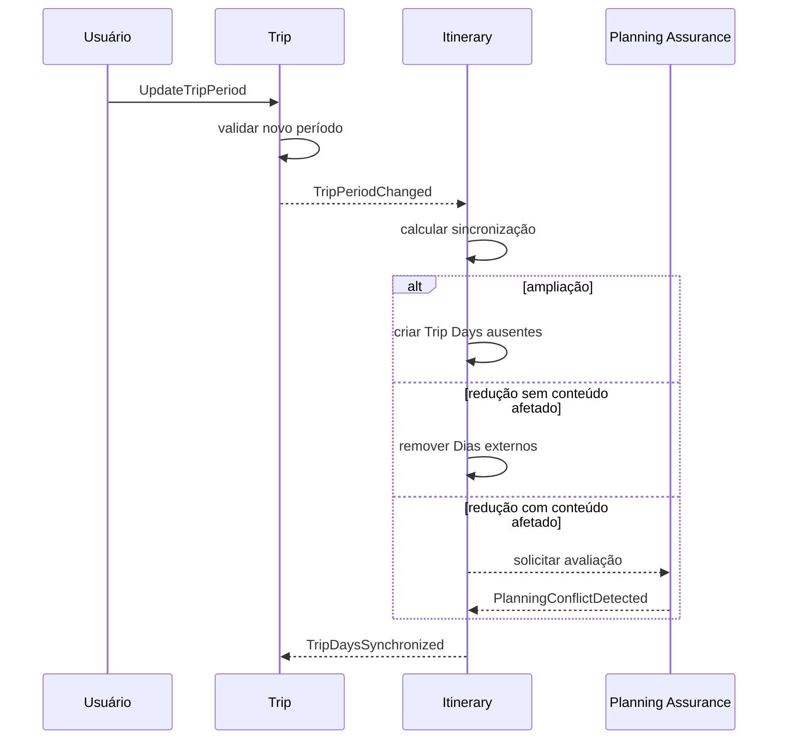

---

### 51. TripDaysSynchronizationRequested

Evento ou mensagem interna que solicita sincronização após alteração do Período.

Pode ser omitido da linguagem pública se a Arquitetura tratar a sincronização de forma imediata.

---

### 52. TripDaysSynchronized

Representa que os Dias foram alinhados ao Trip Period.

Payload:

* TripId;
* ItineraryId;
* datas adicionadas;
* datas removidas;
* datas preservadas;
* ItineraryVersion.

---

### 53. TripDayAdded

Pode ser utilizado quando cada criação de Dia precisar de rastreabilidade individual.

Seu uso é opcional se `TripDaysSynchronized` representar adequadamente o fato agregado.

---

### 54. TripDayRemoved

Só deve ser emitido quando a remoção for válida e não ocorrer perda silenciosa.

---

### 55. TripDayMarkedFree

Produzido por:

```text
MarkTripDayFree
```

Representa intenção explícita.

---

## Parte VIII — Traveler Profile

### 56. TravelerProfileInitialized

Representa criação do agregado de perfil para uma Trip.

---

### 57. TravelerAdded

Produzido por:

```text
AddTraveler
```

Consequências:

* Group Profile atualizado;
* TripContextVersion incrementada quando estrutural;
* Recommendation invalidada;
* Itinerary Proposal invalidada;
* Planning Conflicts reavaliados.

---

### 58. TravelerUpdated

Pode incluir mudanças em:

* faixa etária;
* necessidades;
* associação com User;
* tipo.

Mudanças relevantes devem invalidar objetos dependentes.

---

### 59. TravelerRemoved

Não pode deixar uma Trip planejável sem nenhum Traveler.

---

### 60. GroupProfileUpdated

Evento derivado após alteração dos Viajantes.

Não deve ser emitido quando não houver mudança efetiva no valor derivado.

---

### 61. TripInterestAdded

Produzido por:

```text
AddTripInterest
```

Pode alterar:

* ranking;
* Recomendações;
* Propostas;
* explicações.

---

### 62. TripInterestRemoved

Não deve ser interpretado automaticamente como aversão.

---

### 63. TripRestrictionAdded

Consequências dependem da severidade:

* preference: reordenação;
* important: risco;
* mandatory: bloqueio e invalidação.

---

### 64. TripRestrictionRemoved

Pode:

* resolver Planning Conflicts;
* ampliar opções;
* invalidar Recomendações anteriores;
* gerar novas Recomendações.

---

### 65. TripBudgetChanged

Pode invalidar Recomendações e Propostas.

---

### 66. TripPaceChanged

Pode tornar o Roteiro outdated e exigir reavaliação de densidade.

---

## Parte IX — Place e Data Source

### 67. PlaceCreated

Representa criação de Place interno.

Não significa confirmação de todos os seus dados.

---

### 68. PlaceDataUpdated

Deve indicar quais categorias de informação mudaram.

Exemplos:

* Location;
* Opening Hours;
* Price Range;
* Operational Status;
* Rating;
* Provenance.

---

### 69. PlaceMerged

Payload conceitual:

* PlaceId canônico;
* PlaceIds substituídos;
* motivo;
* referências preservadas.

Consequências:

* atualização de Saved Places;
* atualização de Activities;
* atualização de Recommendations;
* prevenção de duplicidade.

---

### 70. PlaceMarkedTemporarilyClosed

Pode causar:

* Recommendation invalidada;
* Activity marcada para revisão;
* Planning Conflict detectado.

---

### 71. PlaceMarkedPermanentlyClosed

Activities ativas associadas devem ser reavaliadas.

---

### 72. PlaceOperationalStatusBecameUnknown

Representa perda de confiança no estado operacional.

Não significa fechamento.

---

### 73. DataSourceRegistered

Representa registro de uma Fonte de Dados.

---

### 74. DataSourceUpdated

Pode alterar:

* confiança;
* disponibilidade;
* licença;
* método;
* prioridade.

---

### 75. DataSourceDisabled

Não deve apagar Provenance histórica.

---

### 76. PlaceDataFreshnessChanged

Pode assumir:

* current;
* stale;
* unknown;
* conflicting;
* unavailable.

---

## Parte X — Trip Collection

### 77. PlaceSaved

Produzido por:

```text
SavePlace
```

Só deve ser emitido quando houver mudança real.

Repetição idempotente não deve produzir duplicidade.

---

### 78. PlaceUnsaved

Produzido por:

```text
UnsavePlace
```

Não remove Activity relacionada.

---

### 79. SavedPlaceNoteChanged

Representa alteração de observação contextual.

Não deve alterar o Place canônico.

---

### 80. Fluxo de Saved Place

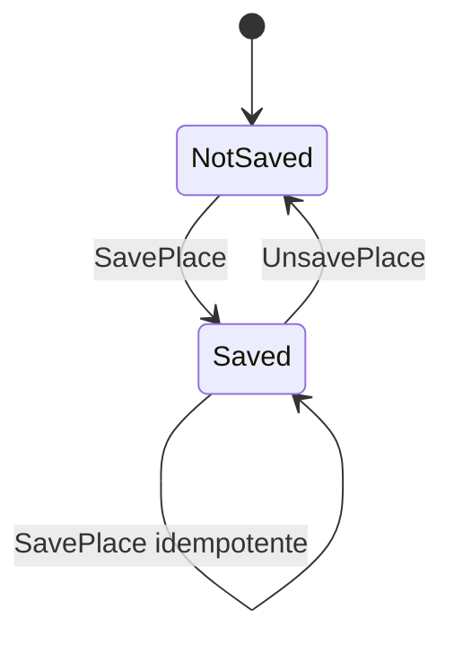

---

## Parte XI — Ciclo de vida da Activity

### 81. Estados oficiais da Activity

* planned;
* tentative;
* completed;
* skipped;
* cancelled;
* unavailable;
* needs-review;
* removed.

---

### 82. Diagrama do ciclo de vida da Activity

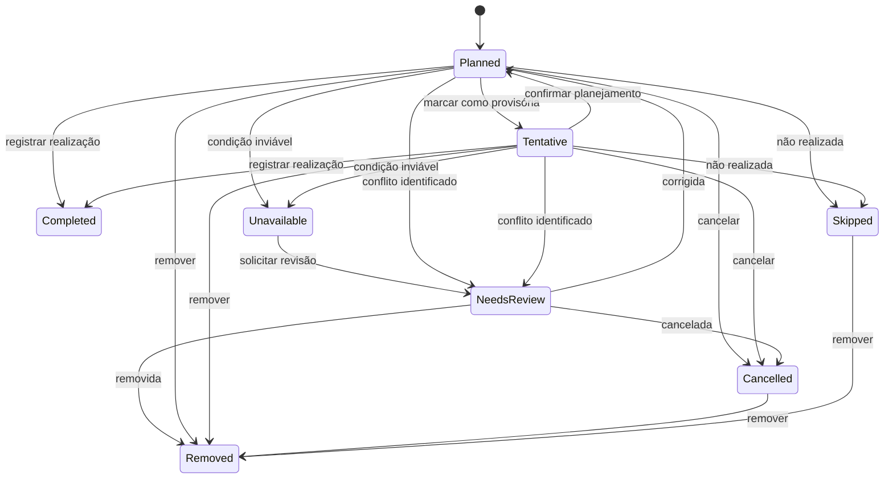

---

### 83. ActivityAdded

Produzido por:

```text
AddActivity
```

Pós-condições:

* Activity pertence a um Trip Day;
* ItineraryVersion incrementada;
* planejamento pode ser reavaliado.

---

### 84. ActivityUpdated

Deve indicar campos alterados, sem necessariamente expor conteúdo completo.

---

### 85. ActivityMovedToAnotherDay

Produzido por:

```text
MoveActivityToAnotherDay
```

Deve preservar `ActivityId`.

---

### 86. ActivityReordered

Representa mudança de posição no mesmo Trip Day.

---

### 87. ActivityMarkedTentative

Representa mudança explícita de flexibilidade ou estado para provisório.

---

### 88. ActivityCompleted

Não deve ser produzido automaticamente apenas pela passagem do horário.

Exige:

* confirmação;
* evidência;
* regra explícita futura.

---

### 89. ActivitySkipped

Representa decisão ou observação de que a Activity não ocorreu.

---

### 90. ActivityCancelled

Diferencia-se de `ActivityRemoved`.

Cancelamento preserva que a Activity existiu como compromisso planejado.

---

### 91. ActivityMarkedUnavailable

Pode ser consequência de:

* Place fechado;
* transporte inviável;
* reserva cancelada;
* restrição;
* evento externo.

---

### 92. ActivityMarkedForReview

Representa necessidade de revisão sem afirmar inviabilidade definitiva.

---

### 93. ActivityRemoved

Representa retirada do Roteiro ativo.

Não remove Place ou Saved Place.

---

## Parte XII — Free Period

### 94. FreePeriodAdded

Produzido por:

```text
AddFreePeriod
```

---

### 95. FreePeriodUpdated

Pode alterar:

* horário;
* duração;
* modo;
* ordem.

---

### 96. FreePeriodRemoved

Não cria Activity automaticamente.

---

### 97. FreePeriodProtected

Representa alteração para modo `protected`.

---

### 98. FreePeriodMadeFlexible

Representa alteração para modo `flexible`.

---

## Parte XIII — Itinerary

### 99. ItineraryInitialized

Representa criação do Roteiro canônico de uma Trip.

---

### 100. ItineraryVersionChanged

Deve ser emitido quando houver alteração canônica relevante.

Pode ser redundante se a versão estiver presente em todos os eventos de Activity e Free Period; a decisão arquitetural deve ser consistente.

---

### 101. ItineraryMarkedOutdated

Pode ser causado por:

* TripDestinationChanged;
* TripPeriodChanged;
* TripAccommodationChanged;
* TravelerAdded;
* TripRestrictionAdded;
* TripBudgetChanged;
* TripPaceChanged;
* PlaceDataUpdated.

---

### 102. ItineraryReviewed

Representa conclusão de uma revisão em determinada versão.

Payload:

* ItineraryId;
* ItineraryVersion;
* resultado;
* Planning Conflicts;
* momento.

---

### 103. ItineraryReviewInvalidated

Produzido quando uma mudança torna uma revisão anterior não aplicável.

---

### 104. ItineraryPlanningCompletenessChanged

Evento derivado quando muda entre:

* empty;
* partial;
* planned.

Pode ser mantido como projeção em vez de Evento de Domínio, conforme decisão arquitetural.

---

## Parte XIV — Travel Estimate

### 105. TravelEstimateRequested

Representa solicitação de cálculo.

Não significa que a estimativa esteja disponível.

---

### 106. TravelEstimateCalculated

Payload conceitual:

* origem;
* destino;
* Transport Mode;
* Distance;
* Travel Time;
* Provenance;
* validade;
* confiança.

---

### 107. TravelEstimateFailed

Representa falha de cálculo.

Não deve assumir:

* Distance zero;
* Travel Time zero;
* rota inviável.

---

### 108. TravelEstimateInvalidated

Pode ser causado por mudança de:

* origem;
* destino;
* Accommodation;
* Activity;
* Transport Mode;
* validade temporal;
* Fonte.

---

### 109. TravelEstimateBecameStale

Representa perda de atualidade sem necessariamente invalidar o valor histórico.

---

## Parte XV — Ciclo de vida da Recommendation

### 110. Estados oficiais

* generated;
* presented;
* accepted;
* rejected;
* expired;
* invalidated;
* superseded.

---

### 111. Diagrama do ciclo de vida da Recommendation

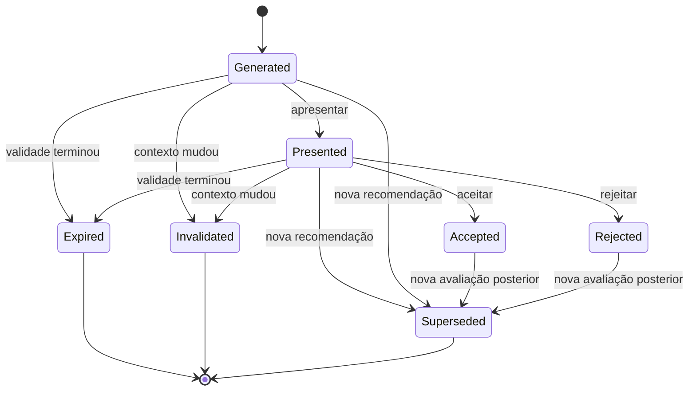

---

### 112. RecommendationRequested

Produzido por:

```text
RequestRecommendation
```

Pode ser tratado como evento de processo ou mensagem interna.

---

### 113. RecommendationGenerated

Deve possuir:

* RecommendationId;
* Context Snapshot;
* Reasons;
* validade;
* Recommendation Confidence;
* Provenance;
* limitações.

---

### 114. RecommendationPresented

Representa que a Recomendação foi disponibilizada ao Usuário.

Não significa que foi lida.

---

### 115. RecommendationAccepted

Produzido por:

```text
AcceptRecommendation
```

Deve estar correlacionado a:

```text
DecisionRecorded
```

---

### 116. RecommendationRejected

Não deve criar preferência permanente automaticamente.

---

### 117. RecommendationExpired

Representa fim de validade temporal.

---

### 118. RecommendationInvalidated

Representa incompatibilidade com Contexto atual.

Pode ser causada por:

* TripContextVersion alterada;
* ItineraryVersion alterada;
* Place indisponível;
* Restrição adicionada;
* horário alterado;
* localização relevante alterada.

---

### 119. RecommendationSuperseded

Representa substituição por Recomendação mais recente ou mais aplicável.

---

## Parte XVI — Ciclo de vida da Decision

### 120. DecisionRecorded

Produzido por:

```text
RecordDecision
```

ou como consequência de:

```text
AcceptRecommendation
AcceptItineraryProposal
AcceptItineraryProposalPartially
IgnorePlanningRisk
```

Payload:

* DecisionId;
* Decision Type;
* ator;
* Context Snapshot;
* opção escolhida;
* RecommendationId opcional;
* occurredAt.

---

### 121. DecisionExecutionRequested

Pode representar que uma Decisão originou uma execução separada.

Não significa execução concluída.

---

### 122. DecisionExecutionCompleted

Representa conclusão da aplicação associada.

---

### 123. DecisionExecutionFailed

Falha de execução não invalida automaticamente a existência da Decision.

---

### 124. DecisionOutcomeRecorded

Representa resultado observado posteriormente.

---

### 125. DecisionQualityEvaluated

Evento derivado quando houver avaliação de qualidade da Decisão.

Não deve julgar o Usuário.

---

## Parte XVII — Ciclo de vida da Itinerary Proposal

### 126. Estados oficiais

* requested;
* generating;
* ready;
* partially-accepted;
* accepted;
* rejected;
* expired;
* failed;
* cancelled;
* superseded.

---

### 127. Diagrama do ciclo de vida da Itinerary Proposal

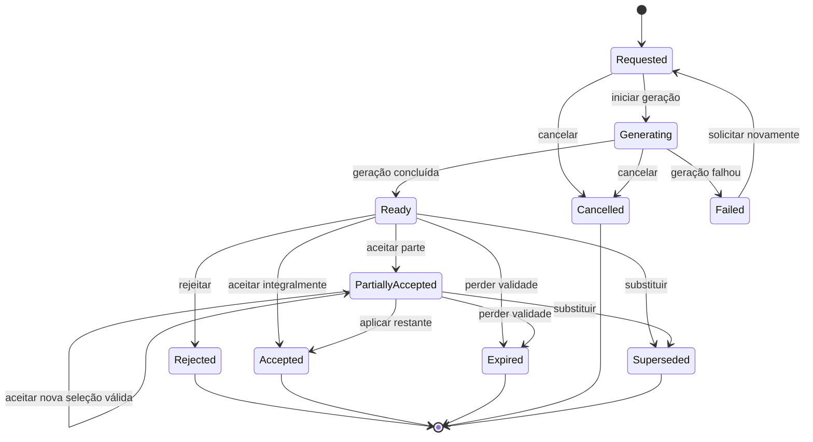

---

### 128. ItineraryProposalRequested

Produzido por:

```text
RequestItineraryProposal
```

Não altera o Roteiro.

---

### 129. ItineraryProposalGenerationStarted

Representa início do processo de geração.

Pode ser evento de processo, não necessariamente Evento de Domínio persistente.

---

### 130. ItineraryProposalGenerated

Deve possuir:

* ItineraryProposalId;
* ItineraryVersion base;
* TripContextVersion base;
* itens;
* justificativas;
* limitações;
* validade;
* Planning Conflicts conhecidos.

---

### 131. ItineraryProposalGenerationFailed

Não altera o Itinerary.

---

### 132. ItineraryProposalAccepted

Produzido por:

```text
AcceptItineraryProposal
```

Deve ocorrer apenas após aplicação válida.

Pode estar correlacionado a:

* DecisionRecorded;
* ActivityAdded;
* ActivityUpdated;
* ActivityRemoved;
* FreePeriodUpdated;
* ItineraryVersionChanged.

---

### 133. ItineraryProposalPartiallyAccepted

Produzido por:

```text
AcceptItineraryProposalPartially
```

Deve registrar:

* itens aceitos;
* itens não aplicados;
* versão resultante;
* DecisionId;
* idempotency reference.

---

### 134. ItineraryProposalRejected

Não altera o Roteiro.

---

### 135. ItineraryProposalExpired

Pode ser causado por:

* validade temporal;
* versão incompatível;
* Contexto alterado;
* cancelamento da Trip;
* substituição.

---

### 136. ItineraryProposalCancelled

Representa cancelamento durante processo de geração ou revisão.

---

### 137. ItineraryProposalSuperseded

Representa substituição por nova Proposta.

---

### 138. Fluxo de aplicação parcial

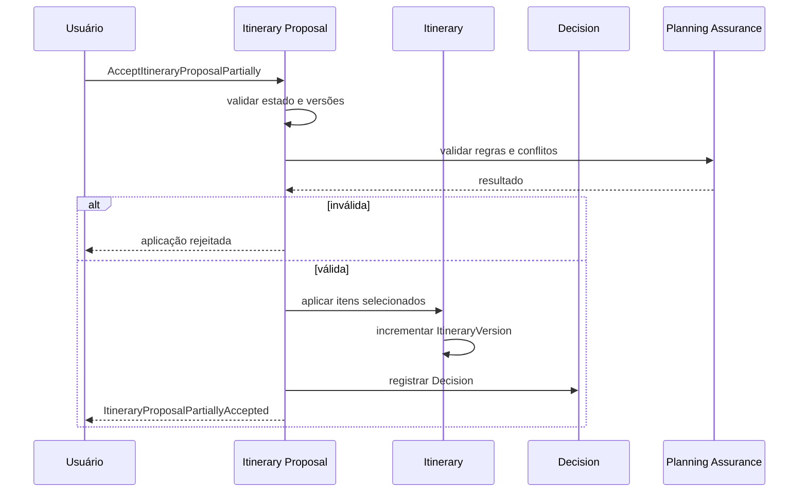

---

## Parte XVIII — Ciclo de vida do Planning Conflict

### 139. Estados oficiais

* open;
* resolved;
* ignored;
* invalidated;
* superseded.

---

### 140. Diagrama do ciclo de vida

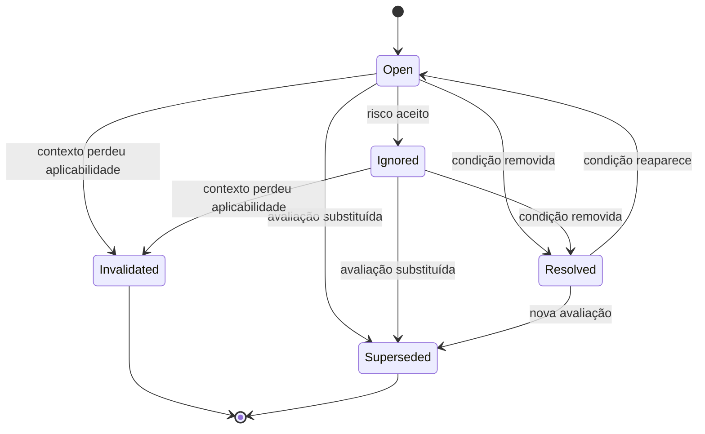

---

### 141. PlanningConflictDetected

Deve possuir:

* PlanningConflictId;
* regra;
* severidade;
* evidência;
* objeto afetado;
* versões avaliadas;
* estado open.

Não deve haver duplicidade ativa equivalente.

---

### 142. PlanningConflictResolved

Produzido por:

```text
ResolvePlanningConflict
```

ou por resolução automática comprovada da condição.

Exige:

* condição não mais presente;
* evidência de nova avaliação;
* ator ou processo responsável.

---

### 143. PlanningConflictIgnored

Produzido por:

```text
IgnorePlanningRisk
```

Só é válido para severidade `risk` quando permitido.

Deve estar correlacionado a:

```text
DecisionRecorded
```

---

### 144. PlanningConflictInvalidated

Representa perda de aplicabilidade.

Não significa que a condição foi corrigida.

---

### 145. PlanningConflictSuperseded

Representa substituição por avaliação mais recente.

---

### 146. PlanningConflictReopened

Pode ser utilizado quando o mesmo agregado for reaberto.

Alternativamente, pode ser criado novo Planning Conflict.

A estratégia deve ser única e documentada pela Arquitetura.

---

### 147. Fluxo de detecção e resolução

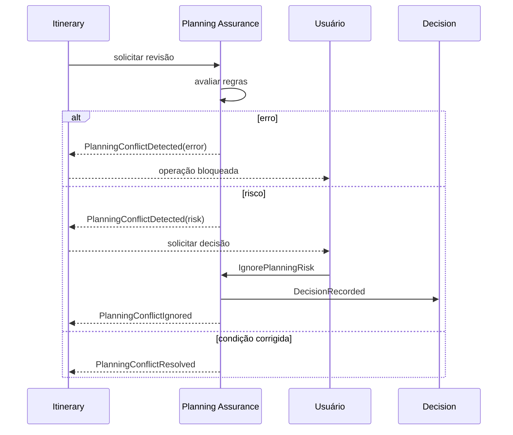

---

## Parte XIX — Invalidação por Contexto

### 148. Eventos que alteram Trip Context Version

Podem incluir:

* TripDestinationChanged;
* TripPeriodChanged;
* TripAccommodationChanged;
* TravelerAdded;
* TravelerRemoved;
* TripRestrictionAdded;
* TripRestrictionRemoved;
* TripBudgetChanged;
* TripPaceChanged.

---

### 149. Matriz de invalidação

| Evento causador          | Objetos potencialmente invalidados                                        |
| ------------------------ | ------------------------------------------------------------------------- |
| TripDestinationChanged   | Recommendation, Itinerary Proposal, Travel Estimate, Planning Conflict    |
| TripPeriodChanged        | Trip Day, Activity, Recommendation, Itinerary Proposal, Planning Conflict |
| TripAccommodationChanged | Travel Estimate, Recommendation, Itinerary Proposal                       |
| TravelerAdded            | Group Profile, Recommendation, Itinerary Proposal                         |
| TripRestrictionAdded     | Recommendation, Itinerary Proposal, Planning Conflict                     |
| TripBudgetChanged        | Recommendation, Itinerary Proposal                                        |
| TripPaceChanged          | Itinerary review, Recommendation, Itinerary Proposal                      |
| PlaceDataUpdated         | Recommendation, Activity review, Planning Conflict                        |
| ItineraryVersionChanged  | Recommendation, Itinerary Proposal, Itinerary review                      |

---

### 150. Fluxo de invalidação

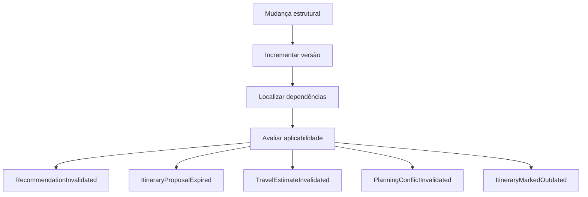

---

### 151. Invalidação não destrutiva

Objetos invalidados devem permanecer disponíveis para:

* auditoria;
* explicação;
* histórico;
* análise;
* rastreabilidade.

---

## Parte XX — Processos longos e assíncronos

### 152. Process Manager conceitual

Fluxos que atravessam vários agregados podem exigir coordenação.

Exemplos:

* alteração de Trip Period;
* geração de Itinerary Proposal;
* aplicação de Proposta;
* revisão de Roteiro;
* reconciliação de Place;
* atualização de dados externos.

A Arquitetura definirá se será utilizado:

* process manager;
* saga;
* workflow;
* orquestração;
* coreografia.

---

### 153. Geração de Proposta

Fluxo conceitual:

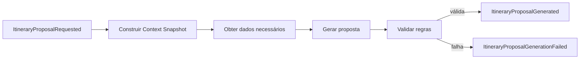

---

### 154. Revisão de Roteiro

Fluxo conceitual:

```text
ReviewItinerary
→ regras avaliadas
→ PlanningConflictDetected ou PlanningConflictResolved
→ ItineraryReviewed
```

---

### 155. Compensação

Quando um processo distribuído falhar após efeitos parciais, compensações podem ser necessárias.

Compensação:

* não apaga eventos;
* produz novos fatos;
* deve ser rastreável;
* não pode violar invariantes;
* deve distinguir falha técnica de Decisão.

---

## Parte XXI — Idempotência por comando

### 156. Create Trip

Repetição com mesma chave idempotente deve retornar a mesma Trip ou resultado equivalente.

---

### 157. Save Place

Repetição não cria novo Saved Place.

---

### 158. Add Activity

Deve utilizar idempotência quando o mesmo comando puder ser reenviado por falha de comunicação.

---

### 159. Accept Recommendation

Não deve registrar múltiplas Decisions para a mesma aceitação idempotente.

---

### 160. Accept Itinerary Proposal

Não deve aplicar os mesmos itens duas vezes.

---

### 161. Accept Itinerary Proposal Partially

A seleção aplicada deve possuir referência idempotente.

Repetir a mesma seleção:

* não duplica Activities;
* não incrementa versão novamente sem mudança;
* não registra nova Decision equivalente.

---

### 162. Ignore Planning Risk

Repetição não cria múltiplas Decisions de aceite do mesmo risco na mesma condição.

---

## Parte XXII — Falhas e eventos

### 163. Falha de comando

Uma falha de validação deve retornar resultado de rejeição.

Não deve produzir evento de sucesso.

---

### 164. Falha técnica após mudança

A Arquitetura deve impedir inconsistência entre:

* estado confirmado;
* evento necessário;
* publicação externa.

---

### 165. Evento não processado

Consumidores devem permitir:

* repetição;
* retry;
* dead-letter ou equivalente;
* reprocessamento;
* observabilidade;
* reconciliação.

A tecnologia será definida posteriormente.

---

### 166. Evento desconhecido

Consumidores devem:

* rejeitar com segurança; ou
* ignorar campos desconhecidos quando compatível;
* registrar observabilidade;
* não assumir significado.

---

### 167. Evento fora de ordem

Consumidores que dependem de ordem devem utilizar:

* aggregateVersion;
* occurredAt;
* causalidade;
* políticas de reprocessamento.

---

## Parte XXIII — Eventos e privacidade

### 168. Minimização de payload

Eventos devem transportar somente dados necessários.

---

### 169. Dados pessoais

Evitar incluir:

* nome completo;
* email;
* endereço completo;
* diagnóstico;
* localização atual precisa;
* dados de menores.

Utilizar referências quando suficiente.

---

### 170. Retenção

A retenção de eventos deve considerar:

* finalidade;
* auditoria;
* privacidade;
* obrigações;
* exclusão;
* anonimização.

---

### 171. Eventos de exclusão

Exclusão ou anonimização deve preservar coerência histórica sem reter dados pessoais desnecessários.

---

## Parte XXIV — Eventos e IA

### 172. AIRecommendationGenerationRequested

Pode representar solicitação técnica de geração.

Não é equivalente a RecommendationRequested quando a Recommendation puder ser produzida sem IA.

---

### 173. AIRecommendationGenerationCompleted

Não significa que a Recommendation foi validada ou apresentada.

A saída deve passar por validações de domínio.

---

### 174. AIRecommendationGenerationFailed

Não altera estado canônico.

---

### 175. AIOutputRejected

Pode representar rejeição de saída inválida por:

* schema;
* referência inexistente;
* violação de regra;
* dado inventado;
* enumeração inválida;
* falta de Provenance.

---

### 176. Agente como ator

Quando um agente iniciar uma operação permitida:

* `actorType` deve indicar Agent;
* autorização original deve ser rastreável;
* não deve assumir UserId como autoria;
* decisões humanas permanecem atribuídas ao Usuário.

---

## Parte XXV — Matriz comando, regra e evento

### 177. Trip

| Comando               | Regras principais              | Evento                   |
| --------------------- | ------------------------------ | ------------------------ |
| CreateTrip            | RB-BR-TRIP-001                 | TripCreated              |
| UpdateTripDestination | RB-BR-TRIP-007, RB-BR-TRIP-008 | TripDestinationChanged   |
| UpdateTripPeriod      | RB-BR-TRIP-003, RB-BR-ITN-004  | TripPeriodChanged        |
| UpdateAccommodation   | RB-BR-TRIP-006, RB-BR-TRIP-008 | TripAccommodationChanged |
| CancelTrip            | RB-BR-TRIP-009                 | TripCancelled            |
| ArchiveTrip           | RB-BR-TRIP-010                 | TripArchived             |
| DeleteTrip            | RB-BR-TRIP-011                 | TripDeleted              |

---

### 178. Traveler Profile

| Comando            | Regras principais            | Evento               |
| ------------------ | ---------------------------- | -------------------- |
| AddTraveler        | RB-BR-TRV-002, RB-BR-TRV-003 | TravelerAdded        |
| RemoveTraveler     | RB-BR-TRV-002                | TravelerRemoved      |
| AddTripInterest    | RB-BR-TRV-005                | TripInterestAdded    |
| AddTripRestriction | RB-BR-TRV-006, RB-BR-TRV-007 | TripRestrictionAdded |
| UpdateTripBudget   | RB-BR-TRV-009                | TripBudgetChanged    |
| UpdateTripPace     | RB-BR-TRV-010                | TripPaceChanged      |

---

### 179. Trip Collection

| Comando     | Regras principais            | Evento       |
| ----------- | ---------------------------- | ------------ |
| SavePlace   | RB-BR-COL-001, RB-BR-COL-002 | PlaceSaved   |
| UnsavePlace | RB-BR-COL-004                | PlaceUnsaved |

---

### 180. Itinerary

| Comando                  | Regras principais            | Evento                    |
| ------------------------ | ---------------------------- | ------------------------- |
| AddActivity              | RB-BR-ITN-008, RB-BR-ITN-009 | ActivityAdded             |
| UpdateActivity           | RB-BR-ITN-011, RB-BR-ITN-012 | ActivityUpdated           |
| MoveActivityToAnotherDay | RB-BR-ITN-020                | ActivityMovedToAnotherDay |
| RemoveActivity           | RB-BR-ITN-019                | ActivityRemoved           |
| AddFreePeriod            | RB-BR-ITN-017, RB-BR-ITN-018 | FreePeriodAdded           |
| MarkTripDayFree          | RB-BR-ITN-006                | TripDayMarkedFree         |

---

### 181. Recommendation e Decision

| Comando               | Regras principais            | Evento                                   |
| --------------------- | ---------------------------- | ---------------------------------------- |
| RequestRecommendation | RB-BR-REC-002                | RecommendationRequested                  |
| AcceptRecommendation  | RB-BR-REC-009, RB-BR-REC-010 | RecommendationAccepted, DecisionRecorded |
| RejectRecommendation  | RB-BR-REC-011                | RecommendationRejected                   |
| RecordDecisionOutcome | RB-BR-DEC-006                | DecisionOutcomeRecorded                  |

---

### 182. Itinerary Proposal

| Comando                          | Regras principais            | Evento                                                  |
| -------------------------------- | ---------------------------- | ------------------------------------------------------- |
| RequestItineraryProposal         | RB-BR-PRP-002, RB-BR-PRP-003 | ItineraryProposalRequested                              |
| AcceptItineraryProposal          | RB-BR-PRP-006, RB-BR-PRP-009 | ItineraryProposalAccepted                               |
| AcceptItineraryProposalPartially | RB-BR-PRP-007, RB-BR-PRP-009 | ItineraryProposalPartiallyAccepted                      |
| RejectItineraryProposal          | RB-BR-PRP-001                | ItineraryProposalRejected                               |
| RegenerateItineraryProposal      | RB-BR-PRP-008                | ItineraryProposalRequested, ItineraryProposalSuperseded |

---

### 183. Planning Conflict

| Comando                    | Regras principais            | Evento                                      |
| -------------------------- | ---------------------------- | ------------------------------------------- |
| ReviewItinerary            | RB-BR-PCF-001                | PlanningConflictDetected, ItineraryReviewed |
| ResolvePlanningConflict    | RB-BR-PCF-005                | PlanningConflictResolved                    |
| IgnorePlanningRisk         | RB-BR-PCF-003, RB-BR-PCF-006 | PlanningConflictIgnored, DecisionRecorded   |
| RestoreIgnoredPlanningRisk | RB-BR-PCF-010                | PlanningConflictReopened                    |

---

## Parte XXVI — Catálogo oficial de eventos

### 184. Identidade e acesso

* AccountCreated;
* UserAddedToAccount;
* UserRemovedFromAccount;
* TripParticipantAdded;
* TripParticipantRoleChanged;
* TripParticipantRemoved;
* TripOwnershipTransferred.

---

### 185. Trip

* TripCreated;
* TripNameChanged;
* TripDestinationChanged;
* TripPeriodChanged;
* TripAccommodationChanged;
* TripBecamePlannable;
* TripPlanningRequirementsLost;
* TripStarted;
* TripCompleted;
* TripCancelled;
* TripArchived;
* TripDeleted.

---

### 186. Traveler Profile

* TravelerProfileInitialized;
* TravelerAdded;
* TravelerUpdated;
* TravelerRemoved;
* GroupProfileUpdated;
* TripInterestAdded;
* TripInterestRemoved;
* TripRestrictionAdded;
* TripRestrictionRemoved;
* TripBudgetChanged;
* TripPaceChanged.

---

### 187. Place e dados

* PlaceCreated;
* PlaceDataUpdated;
* PlaceMerged;
* PlaceMarkedTemporarilyClosed;
* PlaceMarkedPermanentlyClosed;
* PlaceOperationalStatusBecameUnknown;
* DataSourceRegistered;
* DataSourceUpdated;
* DataSourceDisabled;
* PlaceDataFreshnessChanged.

---

### 188. Trip Collection

* PlaceSaved;
* PlaceUnsaved;
* SavedPlaceNoteChanged.

---

### 189. Itinerary

* ItineraryInitialized;
* TripDaysSynchronized;
* TripDayAdded;
* TripDayRemoved;
* TripDayMarkedFree;
* ActivityAdded;
* ActivityUpdated;
* ActivityMovedToAnotherDay;
* ActivityReordered;
* ActivityMarkedTentative;
* ActivityCompleted;
* ActivitySkipped;
* ActivityCancelled;
* ActivityMarkedUnavailable;
* ActivityMarkedForReview;
* ActivityRemoved;
* FreePeriodAdded;
* FreePeriodUpdated;
* FreePeriodRemoved;
* FreePeriodProtected;
* FreePeriodMadeFlexible;
* ItineraryVersionChanged;
* ItineraryMarkedOutdated;
* ItineraryReviewed;
* ItineraryReviewInvalidated;
* ItineraryPlanningCompletenessChanged.

---

### 190. Mobilidade

* TravelEstimateRequested;
* TravelEstimateCalculated;
* TravelEstimateFailed;
* TravelEstimateInvalidated;
* TravelEstimateBecameStale.

---

### 191. Recommendation e Decision

* RecommendationRequested;
* RecommendationGenerated;
* RecommendationPresented;
* RecommendationAccepted;
* RecommendationRejected;
* RecommendationExpired;
* RecommendationInvalidated;
* RecommendationSuperseded;
* DecisionRecorded;
* DecisionExecutionRequested;
* DecisionExecutionCompleted;
* DecisionExecutionFailed;
* DecisionOutcomeRecorded;
* DecisionQualityEvaluated.

---

### 192. Itinerary Proposal

* ItineraryProposalRequested;
* ItineraryProposalGenerationStarted;
* ItineraryProposalGenerated;
* ItineraryProposalGenerationFailed;
* ItineraryProposalAccepted;
* ItineraryProposalPartiallyAccepted;
* ItineraryProposalRejected;
* ItineraryProposalExpired;
* ItineraryProposalCancelled;
* ItineraryProposalSuperseded.

---

### 193. Planning Assurance

* PlanningConflictDetected;
* PlanningConflictResolved;
* PlanningConflictIgnored;
* PlanningConflictInvalidated;
* PlanningConflictSuperseded;
* PlanningConflictReopened.

---

### 194. IA

* AIRecommendationGenerationRequested;
* AIRecommendationGenerationCompleted;
* AIRecommendationGenerationFailed;
* AIOutputRejected.

---

## Parte XXVII — Critérios de aceite

### 195. Critérios de eventos

* eventos utilizam fatos no passado;
* comandos utilizam ações;
* eventos possuem identidade;
* eventos são imutáveis;
* eventos possuem momento;
* eventos possuem correlação;
* eventos possuem causalidade;
* eventos possuem versão de schema;
* eventos não afirmam mudanças inexistentes;
* payloads são mínimos;
* dados pessoais são minimizados.

---

### 196. Critérios de ciclos de vida

* Trip possui ciclo documentado;
* Activity possui ciclo documentado;
* Recommendation possui ciclo documentado;
* Itinerary Proposal possui ciclo documentado;
* Planning Conflict possui ciclo documentado;
* transições inválidas são rejeitadas;
* invalidação é distinta de exclusão;
* ignored é distinto de resolved;
* rejected é distinto de failed;
* cancelled é distinto de removed.

---

### 197. Critérios de consistência

* eventos respeitam RB-DOM-003;
* nomes respeitam RB-DOM-002;
* agregados respeitam RB-DOM-001;
* Proposal não altera Itinerary antes de aceitação;
* Recommendation não registra Decision automaticamente;
* Decision e execução permanecem separadas;
* PlanningConflictId é o identificador canônico;
* ItineraryProposalId é o identificador canônico;
* parâmetros contextuais abreviados não alteram os tipos canônicos.

---

### 198. Critérios de idempotência

* SavePlace é idempotente;
* aplicação de Proposta é idempotente;
* aceite parcial é idempotente;
* IgnorePlanningRisk é idempotente;
* eventos reentregues não duplicam efeitos;
* EventId é utilizado para deduplicação.

---

### 199. Critérios de diagramas

* existe apenas um H1;
* Partes utilizam H2;
* seções numeradas utilizam H3;
* subseções utilizam H4;
* blocos Mermaid não possuem atributos extras;
* diagramas utilizam nomes oficiais;
* transições são coerentes com as regras;
* diagramas não definem tecnologia física.

---

## Parte XXVIII — Governança

### 200. Inclusão de evento

Um novo evento deve:

* representar fato relevante;
* utilizar linguagem oficial;
* possuir origem;
* possuir agregado responsável;
* indicar gatilho;
* indicar payload mínimo;
* indicar consumidores esperados;
* indicar regras relacionadas;
* indicar ciclo de vida;
* atualizar matrizes.

---

### 201. Alteração de evento

Uma alteração deve avaliar:

* compatibilidade;
* schemaVersion;
* consumidores;
* persistência;
* analytics;
* observabilidade;
* testes;
* agentes de IA;
* privacidade;
* documentação.

---

### 202. Depreciação de evento

Evento depreciado deve registrar:

* nome;
* versão;
* substituto;
* motivo;
* prazo;
* consumidores afetados;
* estratégia de migração.

Nomes depreciados não devem ser reutilizados com outro significado.

---

### 203. Inclusão de estado

Um novo estado deve:

* representar condição observável;
* possuir transições válidas;
* possuir eventos de entrada ou saída;
* possuir regras;
* possuir significado na Linguagem Ubíqua;
* não duplicar estado existente.

---

### 204. Uso por agentes de IA

Agentes devem:

* distinguir comando de evento;
* não afirmar evento antes da confirmação;
* não registrar Decision do Usuário;
* não alterar ciclos de vida;
* não inventar transições;
* preservar correlação;
* preservar Provenance;
* validar saídas antes de produzir comando.

---

## Parte XXIX — Checklist de revisão

### 205. Checklist documental

Antes de aprovar:

* propósito está definido;
* autoridade está definida;
* comandos estão definidos;
* eventos estão definidos;
* metadados estão definidos;
* idempotência está definida;
* causalidade está definida;
* correlação está definida;
* versionamento está definido;
* privacidade está definida;
* eventos internos estão diferenciados;
* eventos de integração estão diferenciados;
* Trip está coberta;
* Traveler Profile está coberto;
* Place está coberto;
* Trip Collection está coberta;
* Itinerary está coberto;
* Activity está coberta;
* Free Period está coberto;
* Travel Estimate está coberta;
* Recommendation está coberta;
* Decision está coberta;
* Itinerary Proposal está coberta;
* Planning Conflict está coberto;
* IA está coberta;
* ciclos de vida estão diagramados;
* matrizes estão completas;
* frontmatter YAML é válido;
* títulos Markdown são únicos;
* diagramas Mermaid são válidos;
* não existem contradições com RB-DOM-001;
* não existem contradições com RB-DOM-002;
* não existem contradições com RB-DOM-003.

---

## Parte XXX — Declaração final

### 206. Declaração normativa

Os Eventos de Domínio e Ciclos de Vida do RouteBook estabelecem a forma oficial de representar mudanças relevantes no produto.

Todo Evento de Domínio deve:

* representar um fato ocorrido;
* utilizar a Linguagem Ubíqua;
* respeitar Regras e Invariantes;
* preservar identidade;
* preservar causalidade;
* preservar correlação;
* preservar versionamento;
* preservar privacidade;
* permitir idempotência;
* evitar efeitos duplicados;
* evitar afirmações falsas;
* permanecer imutável.

Todo ciclo de vida deve preservar as distinções entre:

* intenção e fato;
* Recommendation e Decision;
* Decision e execução;
* Itinerary Proposal e Itinerary;
* Planning Conflict resolved e ignored;
* invalidated e deleted;
* rejected e failed;
* cancelled e removed;
* estimated e confirmed.

Nenhuma interface, integração, automação ou agente de IA poderá produzir, omitir ou reinterpretar Eventos de Domínio de maneira incompatível com este documento.

A Arquitetura deverá implementar mecanismos que garantam que mudanças confirmadas e eventos necessários permaneçam consistentes, auditáveis e recuperáveis.
