---

id: RB-DOM-001

title: Modelo de Domínio
description: Define o modelo conceitual do domínio do RouteBook, incluindo entidades, objetos de valor, agregados, relacionamentos, estados, invariantes, eventos, limites de consistência e representações diagramáticas oficiais.

document_type: domain
owner: Domain

status: Draft
version: "0.2.0"

created: "2026-07-17"
last_updated: "2026-07-17"

authors:

* RouteBook Team

tags:

* domain
* domain-model
* ubiquitous-language
* entities
* value-objects
* aggregates
* invariants
* diagrams
* uml
* mermaid
* ai-first
* travel-planning

related_documents:

* RB-CORE-0001
* RB-CORE-0002
* RB-CORE-0003
* RB-CORE-0004
* RB-PRD-001
* RB-PRD-002
* RB-PRD-003
* RB-PRD-004
* RB-PRD-005
* RB-PRD-006
* RB-PRD-007
* RB-PRD-008
* RB-UX-001
* RB-UX-002
* RB-UX-003
* RB-UX-004
* RB-UX-005
* RB-UX-006
* RB-DS-001
* RB-DS-002
* RB-DS-003
* RB-DS-004
* RB-DOM-002
* RB-DOM-003
* RB-DOM-004
* RB-ARC-001
* RB-ARC-002

prerequisites:

* RB-CORE-0001
* RB-CORE-0002
* RB-CORE-0003
* RB-CORE-0004
* RB-PRD-001
* RB-PRD-002
* RB-PRD-003
* RB-PRD-004
* RB-PRD-005
* RB-PRD-006
* RB-PRD-007
* RB-PRD-008

next_documents:

* RB-DOM-002
* RB-DOM-003
* RB-DOM-004
* RB-ARC-001
* RB-DATA-001
* RB-QA-001

ai_context:
priority: critical
index: true
-----------

# RouteBook — Modelo de Domínio

## 1. Propósito deste documento

Este documento define o modelo conceitual oficial do domínio do RouteBook.

Seu objetivo é estabelecer uma representação comum, consistente e rastreável dos conceitos permanentes utilizados pelo produto.

O Modelo de Domínio deverá orientar:

* produto;
* arquitetura;
* desenvolvimento;
* dados;
* inteligência artificial;
* experiência do usuário;
* qualidade;
* documentação;
* integrações;
* agentes autônomos;
* regras de negócio;
* contratos;
* testes.

Este documento define:

* linguagem de domínio;
* entidades;
* objetos de valor;
* agregados;
* raízes de agregado;
* relacionamentos;
* estados;
* invariantes;
* eventos de domínio;
* serviços de domínio;
* limites de consistência;
* conceitos derivados;
* regras de identidade;
* regras de ciclo de vida;
* diagramas conceituais oficiais.

Este documento não define:

* banco de dados físico;
* tabelas;
* endpoints;
* payloads;
* classes de implementação;
* frameworks;
* estratégia de persistência;
* infraestrutura;
* provedor de mapas;
* modelo específico de inteligência artificial.

---

## 2. Papel do Modelo de Domínio

O Modelo de Domínio deverá funcionar como ponte entre:

* intenção do produto;
* comportamento esperado;
* linguagem da interface;
* regras de negócio;
* arquitetura;
* dados;
* implementação;
* testes;
* automações;
* agentes de IA.

Ele deverá reduzir:

* ambiguidades;
* sinônimos inconsistentes;
* duplicações conceituais;
* regras contraditórias;
* lógica espalhada;
* interpretações incorretas;
* dependência de modelos externos;
* acoplamento entre produto e tecnologia.

---

## 3. Autoridade documental

Este documento possui autoridade sobre a estrutura conceitual do domínio.

A precedência documental deverá ser interpretada da seguinte forma:

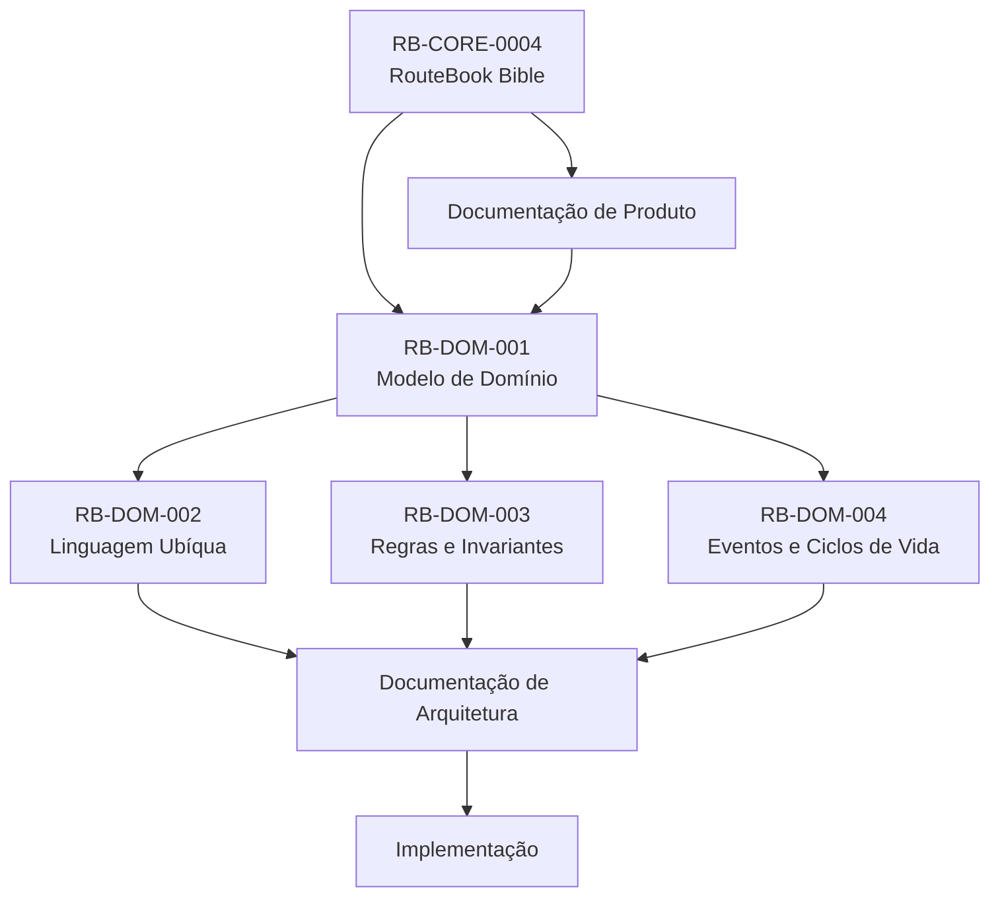

### Interpretação

* A RouteBook Bible estabelece os princípios constitucionais.
* A documentação de Produto define o comportamento desejado.
* O Modelo de Domínio transforma esse comportamento em conceitos estruturados.
* Linguagem, regras e eventos detalham o modelo.
* A Arquitetura define como o modelo será implementado.
* A implementação não poderá redefinir silenciosamente o domínio.

---

## 4. Princípios do domínio

O modelo deverá preservar os seguintes princípios:

1. A Viagem é o principal contexto de decisão.
2. O Usuário permanece no controle.
3. Recomendações não são decisões aplicadas.
4. Salvar não significa Planejar.
5. Lugar não significa Atividade.
6. Proposta não significa Roteiro atual.
7. Informação estimada não significa informação confirmada.
8. Dados externos podem estar incompletos ou desatualizados.
9. Planejamento parcial é válido.
10. Dias livres são decisões legítimas.
11. A Hospedagem é uma referência contextual, não uma obrigação.
12. O Mapa é uma representação, não o domínio.
13. Conflitos podem possuir diferentes severidades.
14. Uma Recomendação deve possuir contexto e Justificativa.
15. Alterações estruturais podem invalidar dados derivados.
16. Conceitos de domínio não devem depender da interface.
17. Estados derivados não devem ser persistidos sem necessidade.
18. Agentes de IA devem respeitar as mesmas invariantes.
19. Objetos externos não definem a identidade interna.
20. Dados probabilísticos não substituem regras determinísticas.

---

# Parte I — Visão diagramática do domínio

## 5. Catálogo de diagramas deste documento

| Identificador  | Diagrama                               | Tipo              |
| -------------- | -------------------------------------- | ----------------- |
| RB-DGM-DOM-001 | Mapa geral do domínio                  | Flowchart         |
| RB-DGM-DOM-002 | Modelo conceitual principal            | UML Class Diagram |
| RB-DGM-DOM-003 | Mapa dos agregados                     | Flowchart         |
| RB-DGM-DOM-004 | Relação entre Lugar, Salvo e Atividade | Flowchart         |
| RB-DGM-DOM-005 | Estrutura da Viagem                    | UML Class Diagram |
| RB-DGM-DOM-006 | Estrutura do Roteiro                   | UML Class Diagram |
| RB-DGM-DOM-007 | Recomendação e Contexto de Decisão     | UML Class Diagram |
| RB-DGM-DOM-008 | Proposta e aplicação ao Roteiro        | Flowchart         |
| RB-DGM-DOM-009 | Conflitos e evidências                 | UML Class Diagram |
| RB-DGM-DOM-010 | Proveniência e qualidade dos dados     | UML Class Diagram |

---

## 6. RB-DGM-DOM-001 — Mapa geral do domínio

### Objetivo

Representar as principais áreas conceituais do RouteBook e a forma como elas colaboram.

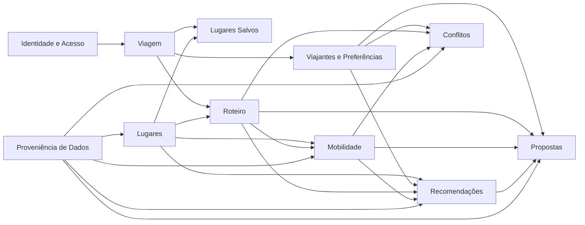

### Interpretação

* A Viagem estabelece o contexto principal.
* Lugares existem independentemente de uma Viagem específica.
* Lugares Salvos representam uma relação entre Viagem e Lugar.
* O Roteiro organiza Atividades dentro da Viagem.
* Mobilidade produz informações derivadas para planejamento.
* Recomendações analisam o contexto, mas não alteram o Roteiro.
* Propostas representam organizações sugeridas.
* Conflitos avaliam o planejamento atual ou proposto.
* Proveniência acompanha informações externas, inferidas ou geradas por IA.

### Limitações

Este diagrama:

* não representa cardinalidades;
* não representa limites transacionais;
* não representa dependências técnicas;
* não substitui o Context Map arquitetural.

---

## 7. RB-DGM-DOM-002 — Modelo conceitual principal

### Objetivo

Representar as principais entidades e seus relacionamentos conceituais.

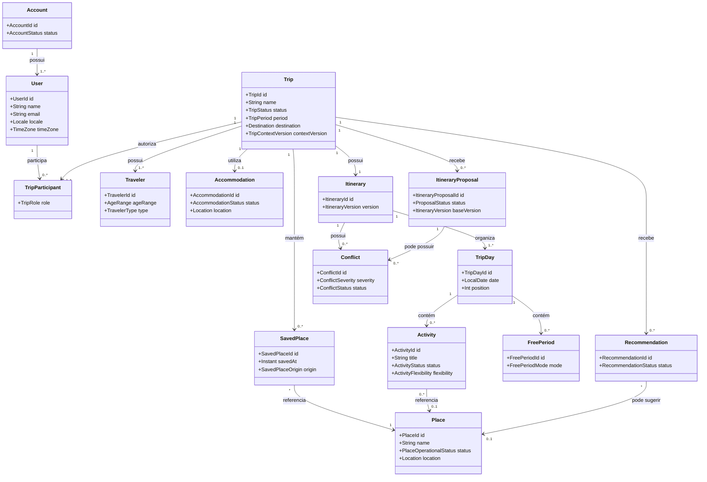

### Interpretação

O diagrama demonstra que:

* Usuário e Viajante são conceitos diferentes.
* Uma Viagem possui seu próprio conjunto de Viajantes.
* A Hospedagem é opcional.
* Um Lugar pode ser Salvo sem ser planejado.
* Uma Atividade pode existir sem Lugar associado.
* A Proposta não pertence ao Roteiro atual.
* Conflitos podem estar relacionados ao Roteiro ou a uma Proposta.

### Regras representadas

* RB-BR-001 — Controle do Usuário.
* RB-BR-013 — Requisitos mínimos da Viagem.
* RB-BR-031 — Hospedagem opcional.
* RB-BR-055 — Unicidade de Lugar Salvo.
* RB-BR-056 — Salvar não cria Atividade.
* RB-BR-061 — Um Roteiro atual por Viagem.
* RB-BR-105 — Separação entre Proposta e Roteiro.

### Limitações

O diagrama é conceitual.

Ele não deve ser utilizado diretamente para:

* gerar banco de dados;
* definir foreign keys;
* criar classes de ORM;
* inferir endpoints;
* inferir limites de agregados sem consultar o diagrama específico.

---

## 8. RB-DGM-DOM-003 — Mapa dos agregados

### Objetivo

Representar os limites de consistência e as raízes dos principais agregados.

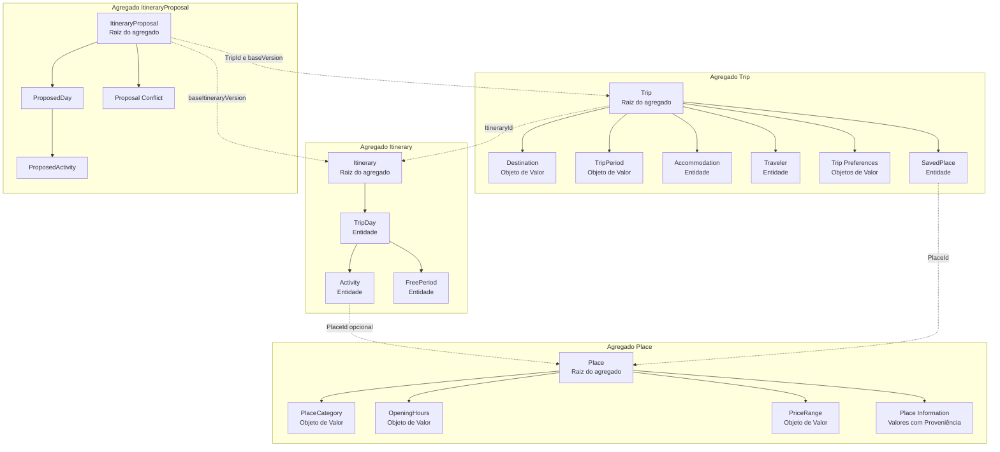

### Interpretação

Os agregados não compartilham suas estruturas internas.

Eles se relacionam principalmente por:

* identificadores;
* comandos;
* consultas;
* eventos;
* snapshots controlados.

### Limites de consistência

Operações normalmente consistentes dentro do agregado:

* validar e alterar o Período da Viagem;
* adicionar ou remover Viajante;
* salvar Lugar;
* adicionar ou mover Atividade;
* proteger Período Livre;
* aceitar ou rejeitar uma Proposta.

Operações eventualmente consistentes entre agregados:

* recalcular Distâncias;
* invalidar Recomendações;
* reavaliar Conflitos;
* atualizar dados externos;
* gerar Propostas.

---

## 9. RB-DGM-DOM-004 — Lugar, Salvo, Planejado e Atividade

### Objetivo

Eliminar a principal ambiguidade conceitual do produto.

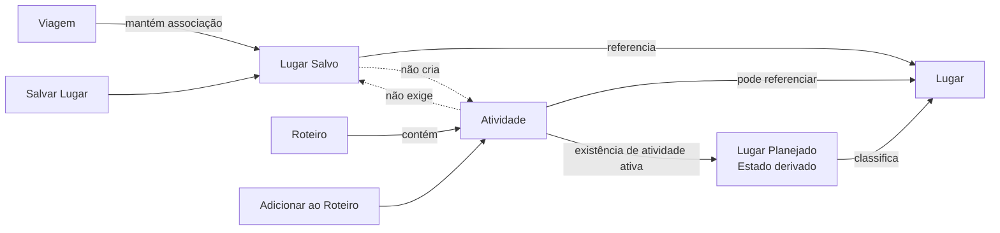

### Interpretação

Existem quatro conceitos diferentes:

#### Lugar

Ponto de interesse potencialmente relevante.

#### Lugar Salvo

Associação entre uma Viagem e um Lugar preservado para consulta futura.

#### Atividade

Compromisso planejado dentro de um Dia da Viagem.

#### Lugar Planejado

Estado derivado indicando que existe pelo menos uma Atividade ativa associada ao Lugar.

### Estados possíveis

| Salvo | Planejado | Situação                              |
| ----- | --------- | ------------------------------------- |
| Não   | Não       | Lugar apenas disponível no Catálogo   |
| Sim   | Não       | Lugar preservado para avaliação       |
| Não   | Sim       | Lugar incluído diretamente no Roteiro |
| Sim   | Sim       | Lugar salvo e presente no Roteiro     |

### Invariantes representadas

* Salvar Lugar não cria Atividade.
* Adicionar ao Roteiro não exige salvar.
* Remover dos Salvos não remove Atividade.
* Remover a última Atividade ativa elimina o estado derivado Planejado.
* Um mesmo Lugar pode originar várias Atividades.

---

# Parte II — Linguagem ubíqua

## 10. Definição

A linguagem ubíqua é o vocabulário oficial utilizado por todas as áreas do RouteBook.

Os mesmos termos deverão ser empregados em:

* documentação;
* interface;
* arquitetura;
* código de domínio;
* contratos;
* testes;
* eventos;
* analytics;
* prompts;
* agentes;
* suporte.

O glossário completo encontra-se em:

```text
RB-DOM-002 — Linguagem Ubíqua e Glossário de Domínio
```

---

## 11. Termos centrais

| Termo                 | Definição                                        |
| --------------------- | ------------------------------------------------ |
| Conta                 | Contexto de propriedade, identidade e acesso     |
| Usuário               | Pessoa identificada que utiliza o RouteBook      |
| Viagem                | Contexto principal de planejamento e decisão     |
| Destino               | Região geográfica principal da Viagem            |
| Hospedagem            | Referência de permanência durante a Viagem       |
| Viajante              | Pessoa participante da Viagem                    |
| Perfil do Grupo       | Características agregadas dos Viajantes          |
| Preferência           | Informação que influencia personalização         |
| Interesse             | Categoria de experiência desejada                |
| Restrição             | Condição que limita ou condiciona decisões       |
| Ritmo                 | Intensidade desejada para o planejamento         |
| Orçamento             | Referência financeira da Viagem                  |
| Lugar                 | Ponto de interesse potencialmente visitável      |
| Lugar Salvo           | Lugar preservado no contexto da Viagem           |
| Atividade             | Compromisso planejado em um Dia                  |
| Dia da Viagem         | Unidade temporal pertencente à Viagem            |
| Roteiro               | Organização atual dos Dias e Atividades          |
| Proposta de Roteiro   | Organização sugerida ainda não aplicada          |
| Período Livre         | Intervalo intencionalmente sem Atividade         |
| Deslocamento          | Movimento entre referências geográficas          |
| Distância             | Medida espacial entre dois pontos                |
| Tempo de Deslocamento | Duração estimada de um Deslocamento              |
| Recomendação          | Sugestão contextual produzida pelo sistema       |
| Justificativa         | Razão compreensível de uma Recomendação          |
| Conflito              | Condição que afeta ou pode afetar o planejamento |
| Fonte de Dados        | Origem interna ou externa de informação          |
| Proveniência          | Metadados que explicam a origem do dado          |
| Estimativa            | Valor aproximado sujeito a variação              |
| Contexto de Decisão   | Informações utilizadas para uma Recomendação     |

---

## 12. Termos que não são equivalentes

### Usuário e Viajante

Um Usuário possui identidade de acesso.

Um Viajante participa da Viagem.

Um Usuário pode:

* participar da edição sem viajar;
* estar associado a um Viajante;
* não estar associado a nenhum Viajante.

Um Viajante pode:

* não possuir Conta;
* não possuir acesso ao RouteBook;
* representar outra pessoa do grupo.

---

### Lugar e Atividade

Um Lugar é um ponto de interesse.

Uma Atividade é um compromisso planejado.

Uma Atividade pode:

* referenciar um Lugar;
* possuir Localização manual;
* não possuir Localização;
* representar descanso;
* representar transporte;
* representar compromisso personalizado.

---

### Salvo e Planejado

Um Lugar Salvo foi preservado para avaliação.

Um Lugar Planejado possui pelo menos uma Atividade ativa associada ao Roteiro.

Esses estados são independentes.

---

### Roteiro e Proposta

O Roteiro representa o planejamento atual.

A Proposta representa uma alternativa ainda não aplicada.

A Proposta não poderá modificar o Roteiro sem aceitação explícita.

---

### Destino e Região

Destino representa o contexto geográfico principal da Viagem.

Região representa uma área utilizada para:

* busca;
* agrupamento;
* recomendação;
* visualização;
* cálculo.

---

### Distância e Tempo de Deslocamento

Distância mede separação espacial.

Tempo de Deslocamento estima duração considerando:

* Meio de Transporte;
* rota;
* condições;
* Fonte de Dados;
* horário;
* validade.

---

# Parte III — Identidade e acesso

## 13. Entidade Conta

### Definição

Representa o contexto de propriedade, organização e acesso aos dados.

### Identidade

```text
AccountId
```

### Responsabilidades

* agrupar Usuários;
* controlar o ciclo de vida da Conta;
* associar configurações globais;
* sustentar colaboração futura.

### Atributos conceituais

* identificador;
* status;
* data de criação;
* configurações;
* responsáveis.

### Estados

* `active`;
* `suspended`;
* `closed`.

### Invariantes

* uma Conta ativa deve possuir pelo menos um responsável;
* uma Conta encerrada não aceita novas Viagens;
* encerramento não deve apagar histórico sem política definida.

---

## 14. Entidade Usuário

### Definição

Pessoa identificada que utiliza o produto.

### Identidade

```text
UserId
```

### Atributos conceituais

* nome;
* e-mail;
* localidade;
* fuso horário;
* Preferências pessoais;
* configurações de acessibilidade;
* consentimentos.

### Responsabilidades

* criar Viagem;
* editar Viagem quando autorizado;
* salvar Lugares;
* planejar Atividades;
* aceitar Propostas;
* responder a Conflitos.

### Invariantes

* identidade interna não depende apenas de provedor externo;
* consentimentos relevantes devem ser rastreáveis;
* localidade deve possuir fallback;
* configurações de acessibilidade devem ser preservadas.

---

## 15. Participação em Viagem

A relação entre Usuário e Viagem deverá possuir um papel explícito.

### Papéis iniciais

* `owner`;
* `editor`;
* `viewer`.

### Invariantes

* toda Viagem possui pelo menos um `owner`;
* o último `owner` não pode ser removido sem transferência;
* somente papéis autorizados podem alterar o Roteiro;
* autorização não pode depender apenas da interface.

---

# Parte IV — Agregado Viagem

## 16. Entidade Viagem

### Definição

A Viagem é o principal contexto de decisão do RouteBook.

Ela reúne as informações necessárias para personalizar:

* exploração;
* planejamento;
* Recomendações;
* Propostas;
* estimativas;
* revisão de Conflitos.

### Identidade

```text
TripId
```

### Raiz do agregado

```text
Trip
```

### Responsabilidades

* preservar identidade;
* manter Destino;
* manter Período;
* manter Hospedagem;
* manter Viajantes;
* manter Preferências;
* coordenar alterações estruturais;
* manter referência ao Roteiro atual;
* controlar versão de contexto;
* preservar ownership.

---

## 17. RB-DGM-DOM-005 — Estrutura do agregado Viagem

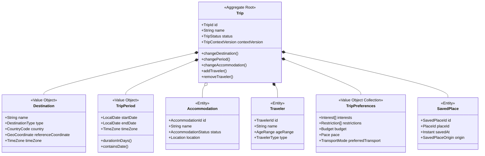

### Interpretação

* `Trip` é a única raiz do agregado.
* `Destination` e `TripPeriod` são objetos de valor.
* `Accommodation`, `Traveler` e `SavedPlace` possuem identidade contextual.
* Outros módulos não devem alterar objetos internos diretamente.
* Alterações devem ocorrer por operações da raiz ou casos de uso autorizados.

---

## 18. Atributos conceituais da Viagem

* identificador;
* nome;
* Destino;
* Período;
* Hospedagem opcional;
* Viajantes;
* Preferências;
* status;
* owner;
* participantes;
* data de criação;
* última atualização;
* versão de contexto;
* referência ao Roteiro atual.

---

## 19. Estados da Viagem

### Draft

Criação iniciada, mas o contexto mínimo ainda não foi concluído.

### Planned

Viagem criada e disponível para planejamento antes do início.

### InProgress

A data atual encontra-se dentro do Período.

### Completed

O Período da Viagem já terminou.

### Cancelled

A Viagem foi cancelada explicitamente.

### Archived

A Viagem foi preservada, mas removida das visualizações principais.

---

## 20. Invariantes da Viagem

1. Deve possuir Destino válido antes de se tornar `Planned`.
2. Deve possuir Período válido antes de se tornar `Planned`.
3. A data final não pode ser anterior à data inicial.
4. Deve possuir pelo menos um Viajante.
5. Deve possuir pelo menos um `owner`.
6. Cada Dia da Viagem deve estar dentro do Período.
7. Alterar o Período deve recalcular os Dias.
8. Alterar o Destino deve reavaliar dependências geográficas.
9. Alterar a Hospedagem deve invalidar Distâncias dependentes.
10. Excluir a Viagem não pode ser operação silenciosa.
11. Propostas não podem alterar a Viagem automaticamente.
12. Alterações estruturais devem incrementar a versão de contexto.
13. Dados incompatíveis não devem ser apagados sem revisão.
14. Histórico relevante não deve ser perdido sem política explícita.

# Parte V — Destino, Região e Localização

## 21. Objeto de valor Destino

### Definição

Representa a região geográfica principal associada à Viagem.

### Estrutura conceitual

* nome;
* tipo;
* país;
* divisão administrativa;
* coordenada de referência;
* limite geográfico opcional;
* identificador externo opcional;
* fuso horário.

### Tipos possíveis

* `city`;
* `district`;
* `region`;
* `island`;
* `park`;
* `custom-region`.

### Responsabilidades

* estabelecer o contexto geográfico principal;
* orientar buscas;
* apoiar resolução de fuso horário;
* restringir resultados incompatíveis;
* servir de referência para Recomendações;
* ajudar na validação de Hospedagem e Lugares.

### Invariantes

* deve possuir referência geográfica suficiente;
* deve possuir localidade reconhecível;
* deve possuir fuso ou mecanismo de resolução;
* identificadores externos não definem sua identidade conceitual;
* mudança de Destino é uma alteração estrutural;
* Destino não deve ser confundido com Lugar;
* Destino não deve ser confundido com destino de um Deslocamento.

---

## 22. Objeto de valor Região

### Definição

Representa uma área geográfica utilizada para agrupamento, busca, recomendação ou visualização.

### Exemplos

* Centro de Pipa;
* Praia do Madeiro;
* Tibau do Sul;
* região próxima à Hospedagem;
* área atualmente visível no Mapa.

### Responsabilidades

* agrupar Lugares;
* limitar consultas;
* apoiar filtros;
* apoiar Recomendações;
* fornecer contexto espacial;
* representar áreas não necessariamente administrativas.

### Invariantes

* uma Região deve possuir critério geográfico;
* pode ser oficial ou derivada;
* não substitui o Destino;
* pode existir apenas temporariamente;
* deve permitir rastrear sua origem quando for inferida.

---

## 23. Objeto de valor Localização

### Definição

Representa a referência geográfica de um objeto.

### Estrutura

* latitude;
* longitude;
* precisão opcional;
* endereço opcional;
* Fonte de Dados;
* data de atualização;
* nível de confiança.

### Invariantes

* latitude deve estar entre `-90` e `90`;
* longitude deve estar entre `-180` e `180`;
* precisão deve ser conhecida quando relevante;
* endereço e coordenada podem divergir;
* Localização aproximada deve ser identificada;
* ausência de endereço não invalida uma coordenada válida;
* ausência de coordenada limita cálculos geográficos.

---

## 24. Objeto de valor Coordenada

### Estrutura

* latitude;
* longitude.

### Características

* imutável;
* comparável por valor;
* independente de provedor;
* reutilizável em diferentes contextos.

### Não representa

* endereço;
* Região;
* Lugar;
* Destino;
* rota.

---

## 25. Objeto de valor Endereço

### Estrutura conceitual

* logradouro;
* número;
* complemento;
* bairro;
* município;
* divisão administrativa;
* país;
* código postal;
* forma textual completa.

### Invariantes

* campos podem estar parcialmente ausentes;
* forma textual não substitui coordenada;
* endereço externo deve preservar Proveniência;
* alterações não devem criar novo Lugar automaticamente.

---

## 26. Relação entre conceitos geográficos

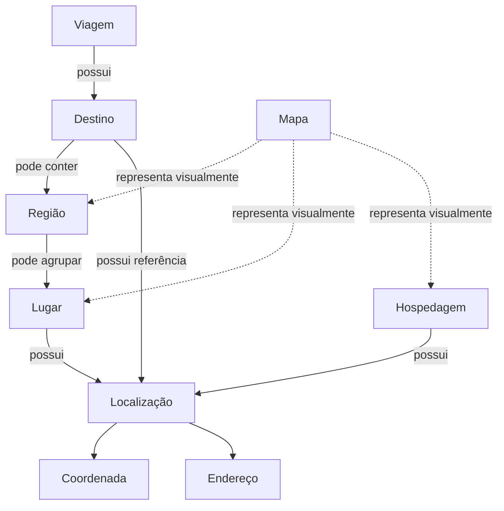

### Interpretação

* A Localização é um conceito de domínio.
* O Mapa é apenas uma superfície de representação.
* Um Lugar e uma Hospedagem podem possuir a mesma estrutura de Localização sem serem o mesmo conceito.
* Uma Região pode agrupar diversos Lugares.
* O Destino estabelece o contexto principal da Viagem.

---

# Parte VI — Período e Dias da Viagem

## 27. Objeto de valor Período da Viagem

### Estrutura

* data inicial;
* data final;
* fuso horário.

### Propriedades derivadas

* quantidade de Dias;
* estado temporal;
* datas contidas;
* duração em dias;
* inclusão de uma determinada data.

### Invariantes

* a data inicial não pode ser posterior à data final;
* as datas devem ser interpretadas no fuso da Viagem;
* duração é derivada;
* o intervalo é inclusivo;
* todas as datas geradas devem possuir um Dia correspondente;
* mudança do Período deve preservar conteúdo compatível.

---

## 28. Entidade Dia da Viagem

### Identidade

```text id="h8mxn0"
TripDayId
```

### Identidade natural contextual

```text id="g0gr7e"
TripId + LocalDate
```

### Atributos

* identificador;
* data;
* posição;
* observação opcional;
* Atividades;
* Períodos Livres;
* estado derivado;
* versão contextual.

### Estados derivados

* `empty`;
* `partially-planned`;
* `planned`;
* `current`;
* `past`;
* `future`;
* `with-conflicts`;
* `free`.

### Invariantes

* pertence a uma única Viagem;
* data deve estar dentro do Período;
* posição deve respeitar ordem cronológica;
* não pode existir mais de um Dia para a mesma data;
* um Dia pode estar vazio;
* um Dia livre é uma decisão intencional;
* Atividades e Períodos Livres devem pertencer ao mesmo Dia.

---

## 29. Geração dos Dias da Viagem

Ao validar o Período, o RouteBook deverá criar um Dia para cada data incluída.

Exemplo:

```text id="sdct20"
22 de agosto a 29 de agosto
→ 8 Dias da Viagem
```

A geração deve ser:

* determinística;
* idempotente;
* ordenada;
* baseada em data local;
* independente do fuso do servidor.

---

## 30. Alteração do Período

### Ampliação

Deve:

* criar novos Dias;
* preservar Dias existentes;
* preservar Atividades;
* preservar Períodos Livres;
* recalcular posições.

### Redução

Deve:

* identificar Dias removidos;
* identificar Atividades afetadas;
* identificar Períodos Livres afetados;
* impedir perda silenciosa;
* exigir revisão quando houver conteúdo.

### Deslocamento integral

Quando todo o Período for movido, o sistema não deve assumir automaticamente que todas as Atividades devam ser deslocadas na mesma proporção sem regra explícita.

---

## 31. Estado temporal da Viagem

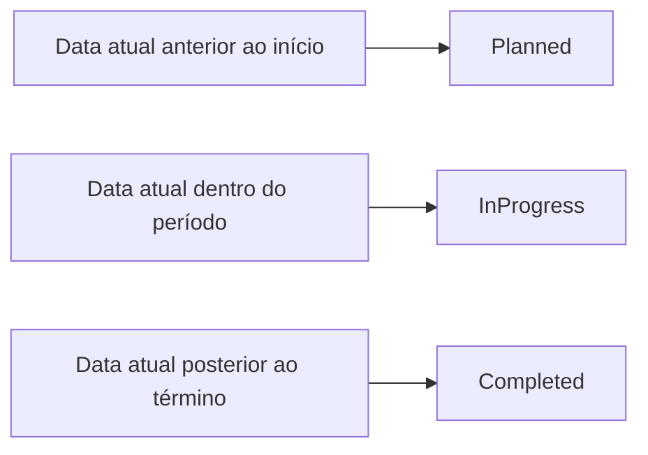

### Regras

* `Cancelled` possui precedência sobre o estado temporal;
* `Archived` altera a apresentação, mas não o período histórico;
* o estado temporal pode ser derivado;
* Eventos temporais somente são necessários quando houver efeitos relevantes.

---

# Parte VII — Viajantes e Preferências

## 32. Entidade Viajante

### Identidade

```text id="cuofid"
TravelerId
```

### Definição

Representa uma pessoa participante da Viagem, possuindo ou não uma Conta no RouteBook.

### Atributos conceituais

* nome opcional;
* faixa etária;
* tipo;
* papel no grupo;
* necessidades funcionais;
* Preferências;
* Restrições;
* associação opcional com Usuário.

### Tipos iniciais

* `adult`;
* `child`;
* `senior`;
* `unspecified`.

### Invariantes

* pertence a uma única Viagem;
* não precisa possuir Conta;
* pode estar associado a um Usuário;
* dados pessoais devem ser minimizados;
* necessidades funcionais devem ser preferidas a diagnósticos;
* faixa etária deve ser usada apenas quando relevante.

---

## 33. Objeto de valor Perfil do Grupo

### Definição

Representa um resumo derivado das características dos Viajantes.

### Exemplos

* 3 adultos;
* 5 adultos e 2 crianças;
* grupo familiar;
* grupo com necessidade de acesso sem escadas;
* grupo com Ritmo relaxado.

### Uso

* Recomendações;
* estimativas de custo;
* adequação de Lugares;
* geração de Propostas;
* avaliação de Ritmo;
* detecção de Conflitos.

### Invariantes

* é derivado dos Viajantes;
* não substitui dados individuais;
* deve ser recalculado após alterações;
* não deve criar inferências sensíveis sem base explícita.

---

## 34. Objeto de valor Interesse

### Estrutura

* categoria;
* intensidade ou peso opcional;
* origem;
* escopo;
* data de atualização.

### Exemplos

* praias;
* gastronomia;
* vida noturna;
* natureza;
* cultura;
* aventura;
* compras;
* descanso;
* experiências infantis.

### Escopos

* pessoal;
* Viajante;
* grupo;
* Viagem.

### Invariantes

* Interesse não é Restrição;
* pode influenciar ranking;
* pode ser contraditório com outro Interesse;
* ausência não impede planejamento;
* deve ser interpretado dentro do contexto da Viagem.

---

## 35. Objeto de valor Restrição

### Tipos

* mobilidade;
* alimentação;
* faixa etária;
* horário;
* transporte;
* orçamento;
* acessibilidade;
* categoria evitada;
* restrição manual.

### Severidades

* `preference`;
* `important`;
* `mandatory`.

### Invariantes

* Restrição obrigatória não pode ser ignorada silenciosamente;
* incompatibilidade deve produzir bloqueio ou Conflito;
* origem deve ser identificável;
* Restrição não deve ser inferida a partir de dado sensível sem base;
* uma Restrição pode ser contextual à Viagem.

---

## 36. Objeto de valor Orçamento

### Formas possíveis

* faixa total;
* faixa diária;
* valor por pessoa;
* faixa por categoria;
* classificação qualitativa.

### Categorias iniciais

* `economic`;
* `moderate`;
* `comfortable`;
* `premium`;
* `unspecified`.

### Invariantes

* valor monetário deve possuir moeda;
* ausência não deve ser interpretada como zero;
* estimativa não é limite confirmado;
* Orçamento não é despesa real;
* pode possuir tolerância contextual.

---

## 37. Objeto de valor Ritmo

### Valores iniciais

* `relaxed`;
* `balanced`;
* `intense`;
* `custom`.

### Significado

#### Relaxed

* menor densidade;
* intervalos maiores;
* mais flexibilidade;
* menor quantidade de Atividades.

#### Balanced

* combinação moderada;
* equilíbrio entre exploração e descanso;
* intervalos regulares.

#### Intense

* maior densidade;
* maior quantidade de Atividades;
* menor tolerância a períodos ociosos.

### Invariantes

* Ritmo orienta, mas não obriga;
* não define quantidade universal;
* deve considerar deslocamentos;
* deve considerar Perfil do Grupo;
* deve respeitar Períodos Livres protegidos.

---

## 38. Relação entre Viajantes e Preferências

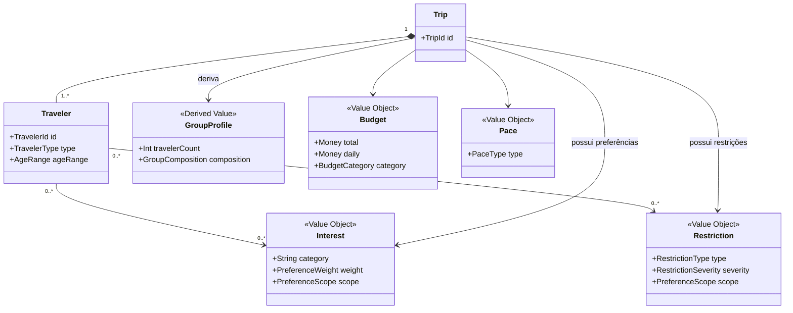

### Interpretação

* Preferências podem existir em diferentes escopos.
* O Perfil do Grupo é derivado.
* Restrições individuais devem influenciar o grupo quando aplicáveis.
* A camada de Recomendação deve receber dados minimizados.

---

# Parte VIII — Lugar e Catálogo

## 39. Entidade Lugar

### Identidade

```text id="hqca7e"
PlaceId
```

### Definição

Representa um ponto de interesse potencialmente relevante para uma Viagem.

### Atributos conceituais

* identificador;
* nome;
* Localização;
* Categorias de Lugar;
* descrição;
* imagens;
* Horário de Funcionamento;
* Faixa de Preço;
* avaliação;
* contatos;
* informações de acessibilidade;
* público indicado;
* estado operacional;
* identificadores externos;
* informações com Proveniência;
* última atualização.

---

## 40. Identidade do Lugar

A identidade interna deve:

* ser independente de provedor;
* permitir múltiplos identificadores externos;
* permitir aliases;
* sobreviver a mudanças de Fonte;
* permitir fusão de duplicidades;
* preservar histórico.

A identidade não deve ser determinada apenas por:

* nome;
* endereço;
* coordenada;
* ID externo;
* categoria.

A resolução poderá considerar a combinação desses sinais.

---

## 41. Categorias de Lugar

Categorias iniciais:

* `beach`;
* `restaurant`;
* `bar`;
* `nightclub`;
* `attraction`;
* `tour`;
* `viewpoint`;
* `shopping`;
* `cafe`;
* `park`;
* `cultural-site`;
* `transport-point`;
* `accommodation`;
* `custom`.

### Invariantes

* um Lugar pode possuir múltiplas categorias;
* categoria não determina disponibilidade;
* categoria não define Atividade;
* categoria externa deve ser traduzida para taxonomia interna;
* novas categorias devem passar por governança.

---

## 42. Estado operacional do Lugar

Estados:

* `open`;
* `temporarily-closed`;
* `permanently-closed`;
* `seasonal`;
* `unknown`.

### Invariantes

* `unknown` não significa aberto;
* estado deve possuir Proveniência;
* mudança de estado pode invalidar Recomendações;
* fechamento não remove Atividades automaticamente;
* encerramento permanente deve gerar revisão.

---

## 43. Objeto de valor Horário de Funcionamento

### Estrutura

* dia da semana;
* intervalos;
* exceções;
* período de vigência;
* fuso;
* Fonte;
* confiança;
* data de atualização.

### Estados derivados

* provavelmente aberto;
* provavelmente fechado;
* informação insuficiente.

### Invariantes

* horário não garante disponibilidade;
* exceções devem possuir precedência;
* feriados podem invalidar o padrão;
* ausência não deve ser tratada como fechado;
* horário desatualizado deve ser identificado.

---

## 44. Objeto de valor Faixa de Preço

### Formas

* gratuito;
* classificação qualitativa;
* faixa monetária;
* preço por pessoa;
* preço por grupo;
* desconhecido.

### Invariantes

* preço desconhecido não é gratuito;
* moeda é obrigatória quando monetário;
* preço deve indicar unidade;
* preço externo deve possuir data;
* faixa qualitativa não deve ser convertida em valor exato sem regra.

---

## 45. Avaliação de Lugar

### Estrutura conceitual

* valor;
* escala;
* quantidade de avaliações;
* Fonte;
* data de atualização.

### Invariantes

* avaliação sem escala é inválida;
* ausência não é nota zero;
* avaliação não é score de Recomendação;
* fontes diferentes não devem ser combinadas silenciosamente;
* quantidade de avaliações influencia interpretação, não identidade.

---

## 46. Informações de acessibilidade

Podem incluir:

* acesso sem degraus;
* banheiro acessível;
* estacionamento acessível;
* superfície irregular;
* acesso à praia;
* necessidade de apoio;
* informação desconhecida.

### Regra

Ausência de informação não significa ausência de acessibilidade.

---

# Parte IX — Proveniência e qualidade dos dados

## 47. Entidade Fonte de Dados

### Identidade

```text id="lhqivn"
DataSourceId
```

### Tipos

* `internal`;
* `user-provided`;
* `provider`;
* `public-dataset`;
* `partner`;
* `ai-generated`;
* `inferred`.

### Atributos

* nome;
* tipo;
* confiabilidade;
* política de atualização;
* termos;
* estado;
* licença;
* finalidade.

---

## 48. Objeto de valor Proveniência

### Estrutura

* Fonte de Dados;
* identificador externo;
* data de coleta;
* data de atualização;
* método;
* confiança;
* licença;
* versão;
* agente responsável.

### Invariantes

* dados externos relevantes devem possuir Proveniência;
* dados inferidos devem ser marcados;
* conteúdo de IA deve ser distinguido de fato;
* alterações não devem destruir origem anterior;
* divergências devem preservar fontes concorrentes.

---

## 49. Objeto de valor Nível de Confiança

Valores:

* `confirmed`;
* `high`;
* `medium`;
* `low`;
* `unknown`.

### Regra

Confiança representa qualidade da evidência.

Não representa necessariamente:

* probabilidade estatística;
* certeza;
* garantia;
* qualidade do Lugar;
* score de Recomendação.

---

## 50. Objeto de valor Atualidade dos Dados

Estados:

* `current`;
* `stale`;
* `unknown`;
* `conflicting`;
* `unavailable`.

### Regras

* atualidade depende do tipo do dado;
* validade pode ser temporal ou contextual;
* mudança de Hospedagem torna estimativas antigas desatualizadas;
* mudança de versão pode invalidar Propostas;
* dado desatualizado não precisa ser apagado.

---

## 51. RB-DGM-DOM-010 — Proveniência e qualidade dos dados

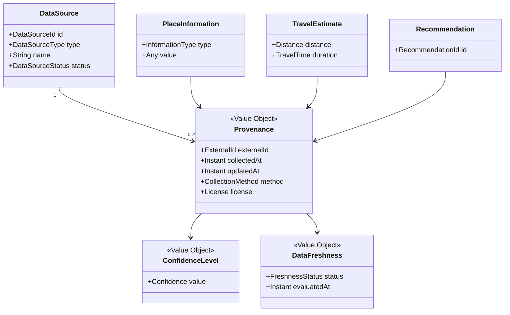

### Interpretação

A Proveniência acompanha a informação e não apenas a entidade.

Isso permite que diferentes atributos de um mesmo Lugar possuam:

* Fontes distintas;
* datas distintas;
* níveis de confiança distintos;
* estados de atualização distintos.

### Exemplo

Um restaurante pode possuir:

* endereço confirmado pelo Usuário;
* horário obtido de provedor externo;
* preço estimado por IA;
* acessibilidade desconhecida.

Essas informações não devem compartilhar automaticamente o mesmo nível de confiança.

---

# Parte X — Lugares Salvos

## 52. Entidade Lugar Salvo

### Identidade

```text id="wz665j"
SavedPlaceId
```

### Definição

Representa a associação entre uma Viagem e um Lugar preservado para consulta futura.

### Atributos

* TripId;
* PlaceId;
* data do salvamento;
* origem;
* observação;
* tags futuras;
* prioridade opcional.

### Origens

* exploração;
* Mapa;
* Recomendação;
* Proposta;
* busca;
* ação manual;
* importação futura.

### Invariantes

* um Lugar pode ser salvo no máximo uma vez por Viagem;
* a operação deve ser idempotente;
* salvar não cria Atividade;
* remover dos Salvos não remove Atividade;
* um Lugar Planejado pode não estar salvo;
* um Lugar Salvo não é um favorito global.

---

## 53. Estado derivado Lugar Planejado

Um Lugar é considerado Planejado quando existe ao menos uma Atividade ativa associada a ele.

### Atividades consideradas ativas

* `planned`;
* `tentative`;
* `needs-review`;
* `unavailable`, enquanto ainda fizer parte do Roteiro.

### Atividades normalmente não consideradas ativas

* `removed`;
* `cancelled`.

A política sobre `completed` e `skipped` dependerá do contexto de leitura.

---

# Parte XI — Agregado Roteiro

## 54. Entidade Roteiro

### Identidade

```text id="xruwhf"
ItineraryId
```

### Definição

Representa o planejamento atual da Viagem.

### Raiz do agregado

```text id="2k2nmq"
Itinerary
```

### Responsabilidades

* organizar Dias;
* manter Atividades;
* manter Períodos Livres;
* controlar ordenação;
* controlar versão;
* aplicar alterações válidas;
* preservar planejamento parcial;
* impedir inconsistências internas;
* fornecer snapshots de planejamento.

---

## 55. RB-DGM-DOM-006 — Estrutura do agregado Roteiro

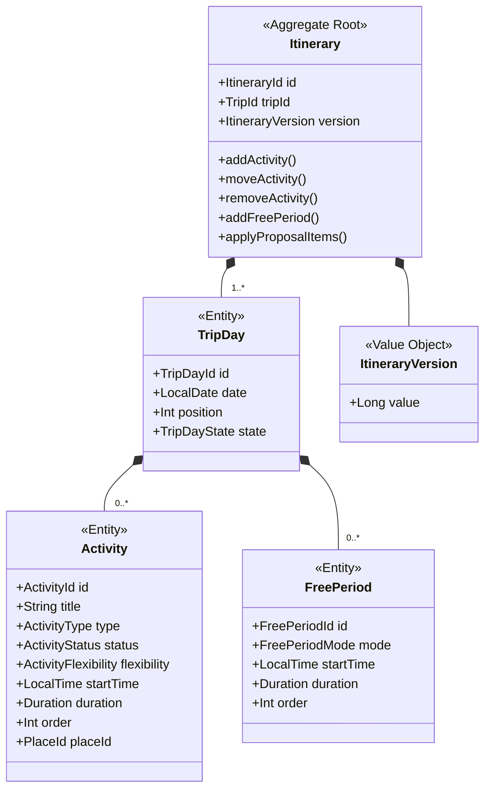

### Interpretação

* O Roteiro controla sua própria versão.
* O Dia não existe isoladamente da Viagem.
* Atividades e Períodos Livres pertencem a um único Dia.
* Lugar é referenciado por `PlaceId`.
* Dados completos do Lugar não pertencem ao agregado.
* Deslocamentos não aparecem como entidades internas porque são derivados.

---

## 56. Estados do Roteiro

Estados conceituais:

* `empty`;
* `partial`;
* `planned`;
* `with-conflicts`;
* `under-review`;
* `outdated`.

Alguns estados podem representar dimensões diferentes.

Exemplo:

Um Roteiro pode estar simultaneamente:

* parcialmente planejado;
* com Conflitos;
* desatualizado.

A implementação não deve assumir que todos os estados são mutuamente exclusivos.

---

## 57. Versão do Roteiro

A versão lógica deverá ser alterada após mudanças canônicas, como:

* adicionar Atividade;
* editar Atividade;
* remover Atividade;
* mover Atividade;
* adicionar Período Livre;
* editar Período Livre;
* remover Período Livre;
* aplicar itens de Proposta.

### Uso

* controle de concorrência;
* validade de Proposta;
* auditoria;
* comparação;
* invalidação;
* sincronização.

---

## 58. Invariantes do Roteiro

1. Pertence a uma única Viagem.
2. Possui Dias pertencentes à mesma Viagem.
3. Atividade pertence a um único Dia.
4. Período Livre pertence a um único Dia.
5. Ordem dos itens é determinística.
6. Atividade sem horário é válida.
7. Planejamento parcial é válido.
8. Período Livre protegido não pode ser preenchido automaticamente.
9. Alteração gera nova versão.
10. Proposta não altera o Roteiro antes da aceitação.
11. Concorrência não pode sobrescrever estado silenciosamente.
12. Conflitos não impedem necessariamente a persistência.

---

# Parte XII — Atividade

## 59. Entidade Atividade

### Identidade

```text id="i6o7be"
ActivityId
```

### Definição

Representa um compromisso planejado em um Dia da Viagem.

### Tipos iniciais

* `place-visit`;
* `meal`;
* `tour`;
* `transport`;
* `rest`;
* `custom`;
* `check-in`;
* `check-out`;
* `free-form`.

### Atributos

* título;
* tipo;
* Dia;
* Lugar opcional;
* horário inicial opcional;
* duração opcional;
* Localização opcional;
* observação;
* ordem;
* origem;
* estado;
* flexibilidade.

---

## 60. Estados da Atividade

* `planned`;
* `tentative`;
* `completed`;
* `skipped`;
* `cancelled`;
* `unavailable`;
* `needs-review`;
* `removed`.

---

## 61. Origem da Atividade

* manual;
* Lugar adicionado;
* Proposta aceita;
* Recomendação aceita;
* duplicação;
* importação futura.

A origem deve ser preservada para:

* auditoria;
* explicação;
* analytics;
* revisão;
* IA.

---

## 62. Flexibilidade da Atividade

### Fixed

* horário ou posição protegidos;
* não pode ser movida automaticamente;
* pode ser alterada manualmente por Usuário autorizado.

### Flexible

* pode participar de alternativas;
* pode ser reorganizada em Proposta;
* aplicação continua exigindo aceitação.

### Suggested

* possui origem sugerida;
* ainda requer revisão;
* pode ser descartada.

---

## 63. Invariantes da Atividade

* título não pode estar vazio;
* deve pertencer a um Dia;
* duração deve ser positiva;
* horário usa o fuso da Viagem;
* Lugar associado deve existir;
* Lugar é opcional;
* Localização manual é permitida;
* ordem deve ser válida;
* remoção não exclui Lugar;
* mudança de Dia preserva identidade;
* Atividade fixa não pode ser movida automaticamente.

---

# Parte XIII — Período Livre

## 64. Entidade Período Livre

### Identidade

```text id="2dmr3b"
FreePeriodId
```

### Definição

Representa um intervalo intencionalmente não ocupado por Atividade.

### Atributos

* Dia;
* início opcional;
* duração opcional;
* observação;
* modo;
* ordem.

### Modos

* `flexible`;
* `protected`.

### Invariantes

* não deve ser tratado como ausência acidental;
* modo protegido impede preenchimento automático;
* modo flexível permite sugestões;
* substituição exige decisão;
* ausência de horário é permitida;
* remoção não cria Atividade.

---

## 65. Diferença entre Dia vazio e Dia livre

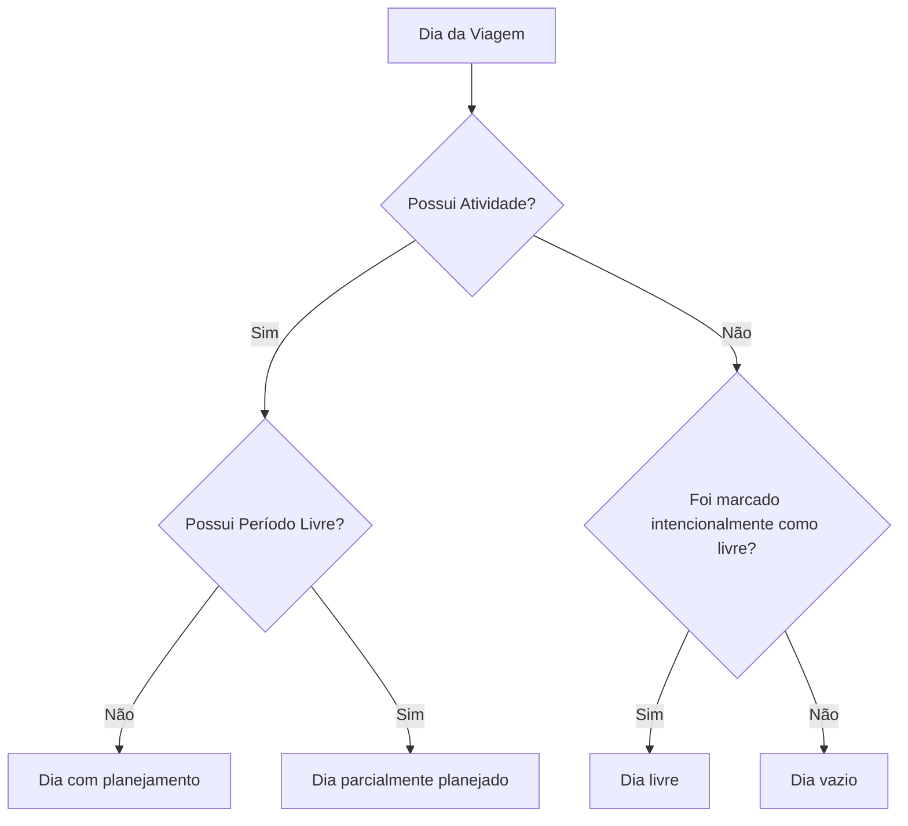

### Interpretação

* Dia vazio descreve ausência de conteúdo.
* Dia livre descreve uma intenção explícita.
* Um Dia pode combinar Atividades e Períodos Livres.
* O sistema não deve preencher um Dia livre automaticamente.

---

# Parte XIV — Deslocamento e Mobilidade

## 66. Conceito Deslocamento

### Definição

Representa movimento entre duas referências geográficas.

### Origem e destino possíveis

* Hospedagem;
* Atividade;
* Lugar;
* Localização atual;
* endereço manual;
* referência externa;
* ponto personalizado.

---

## 67. Objeto de valor Meio de Transporte

Valores iniciais:

* `walking`;
* `driving`;
* `public-transit`;
* `ride-hailing`;
* `cycling`;
* `boat`;
* `custom`.

### Invariantes

* deve acompanhar a Estimativa;
* mudança invalida cálculo anterior;
* preferência global não obriga uso em todo Deslocamento;
* Meio de Transporte não é veículo específico.

---

## 68. Objeto de valor Estimativa de Deslocamento

### Estrutura

* origem;
* destino;
* Distância;
* duração;
* Meio de Transporte;
* rota opcional;
* data de cálculo;
* Fonte;
* confiança;
* validade;
* estado.

### Estados

* `requested`;
* `calculating`;
* `available`;
* `estimated`;
* `unavailable`;
* `stale`;
* `failed`.

### Invariantes

* deve possuir origem e destino;
* deve possuir Meio de Transporte;
* deve indicar que é estimada;
* deve preservar Proveniência;
* mudança de contexto invalida o resultado;
* falha não remove Atividade;
* precisão deve ser proporcional à Fonte.

---

## 69. Deslocamentos derivados

Deslocamentos entre Atividades são derivados da sequência do Roteiro.

Exemplo:

```text id="k28od4"
Hospedagem
→ Atividade 1
→ Atividade 2
→ Atividade 3
→ Hospedagem opcional
```

Eles podem ser recalculados quando:

* Atividade é movida;
* Localização muda;
* Hospedagem muda;
* Meio de Transporte muda;
* validade expira.

---

# Parte XV — Recomendação

## 70. Entidade Recomendação

### Identidade

```text id="fhnw2r"
RecommendationId
```

### Definição

Representa uma sugestão produzida com base no contexto da Viagem.

### Tipos

* Lugar;
* Atividade;
* Dia;
* horário;
* ordem;
* Região;
* transporte;
* correção;
* alternativa.

### Atributos

* alvo recomendado;
* Contexto de Decisão;
* Justificativas;
* evidências;
* score opcional;
* limitações;
* validade;
* origem;
* estado;
* metadados de geração.

---

## 71. Estados da Recomendação

* `generated`;
* `presented`;
* `accepted`;
* `rejected`;
* `expired`;
* `invalidated`;
* `superseded`.

---

## 72. Objeto de valor Contexto de Decisão

Pode incluir:

* Viagem;
* Destino;
* Hospedagem;
* Dia;
* horário;
* Perfil do Grupo;
* Preferências;
* Restrições;
* Orçamento;
* Ritmo;
* Lugares Salvos;
* Roteiro;
* Distâncias;
* disponibilidade;
* atualidade dos dados.

### Regra

O contexto deve possuir uma versão ou referência temporal suficiente para permitir invalidação posterior.

---

## 73. Objeto de valor Justificativa

### Estrutura

* fator;
* descrição;
* evidência;
* peso opcional;
* limitação;
* Fonte.

### Exemplos

* proximidade da Hospedagem;
* compatibilidade com Interesse;
* dentro da Faixa de Preço;
* adequado para crianças;
* compatível com o Ritmo;
* localizado na mesma Região do Dia.

---

## 74. RB-DGM-DOM-007 — Recomendação e Contexto de Decisão

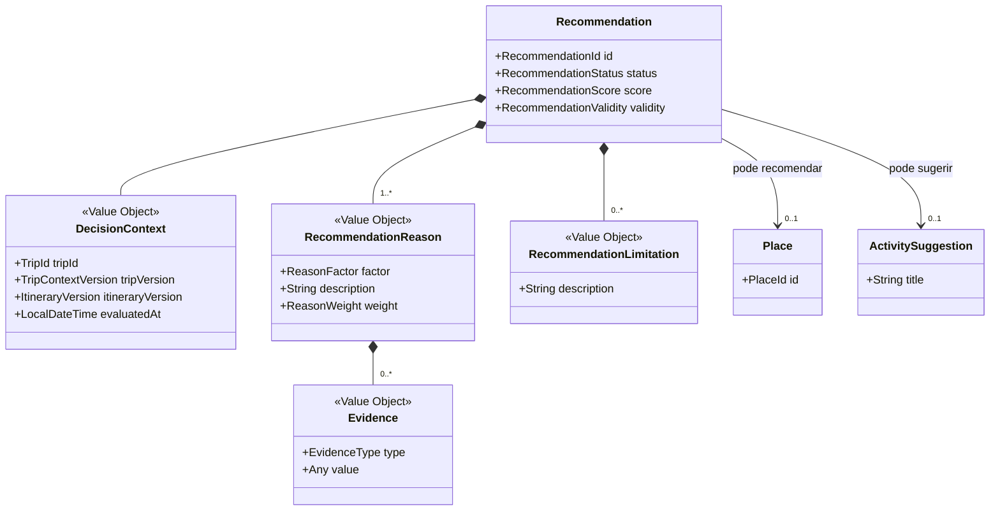

### Invariantes

1. Recomendação personalizada possui contexto.
2. Deve possuir ao menos uma Justificativa.
3. Não altera estado canônico.
4. Restrição obrigatória possui precedência.
5. Score não substitui explicação.
6. Limitações relevantes devem ser comunicadas.
7. Mudança material de contexto exige invalidação.
8. Rejeição não exige motivo.
9. Conteúdo de IA deve passar por validação.

---

# Parte XVI — Proposta de Roteiro

## 75. Agregado Proposta de Roteiro

### Identidade

```text id="916odn"
ItineraryProposalId
```

### Raiz

```text id="y4h44l"
ItineraryProposal
```

### Definição

Representa uma alternativa de organização ainda não incorporada ao Roteiro atual.

### Atributos

* Viagem;
* versão base do Roteiro;
* versão do contexto da Viagem;
* Dias propostos;
* Atividades propostas;
* critérios;
* Justificativas;
* Conflitos;
* estado;
* data de criação;
* validade;
* metadados de geração.

---

## 76. Estados da Proposta

* `requested`;
* `generating`;
* `ready`;
* `partially-accepted`;
* `accepted`;
* `rejected`;
* `expired`;
* `failed`;
* `cancelled`;
* `superseded`.

---

## 77. Atividade Proposta

Uma Atividade Proposta:

* pertence à Proposta;
* não pertence ao Roteiro atual;
* não possui identidade de Atividade canônica;
* pode referenciar Lugar;
* pode possuir justificativa;
* torna-se Atividade apenas após aceitação.

---

## 78. RB-DGM-DOM-008 — Proposta e aplicação ao Roteiro

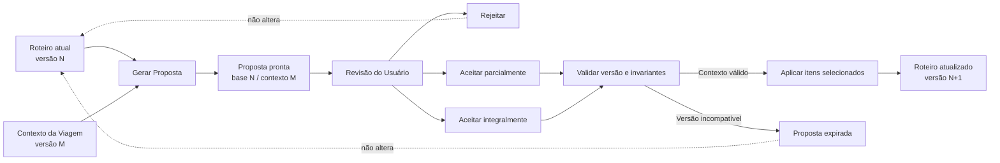

### Invariantes

1. Proposta referencia versão base.
2. Não altera Roteiro enquanto não aceita.
3. Aceitação deve ser explícita.
4. Aceitação parcial aplica apenas itens selecionados.
5. Proposta expirada não pode ser aplicada.
6. Períodos protegidos devem ser respeitados.
7. Atividades fixas não podem ser movidas automaticamente.
8. Falha de geração preserva estado atual.
9. A mesma Proposta não pode ser aplicada duas vezes.

---

# Parte XVII — Conflito

## 79. Entidade Conflito

### Identidade

```text id="85rozj"
ConflictId
```

### Definição

Representa uma condição identificada que afeta ou pode afetar o planejamento.

### Severidades

* `error`;
* `risk`;
* `suggestion`.

### Categorias

* temporal;
* geográfica;
* disponibilidade;
* Restrição;
* Orçamento;
* intensidade;
* transporte;
* qualidade de dados;
* dependência;
* estrutural.

---

## 80. Estados do Conflito

* `open`;
* `resolved`;
* `ignored`;
* `invalidated`;
* `superseded`.

### Regras

* Erro bloqueante não pode ser ignorado;
* Risco pode ser ignorado quando permitido;
* resolução exige remoção da condição;
* invalidação ocorre por mudança de contexto;
* um novo Conflito pode substituir outro.

---

## 81. Evidência do Conflito

Pode incluir:

* horários;
* duração;
* Distância;
* Tempo de Deslocamento;
* estado do Lugar;
* Restrição;
* orçamento;
* dados desatualizados;
* versão de contexto;
* regra aplicada.

---

## 82. RB-DGM-DOM-009 — Conflitos e evidências

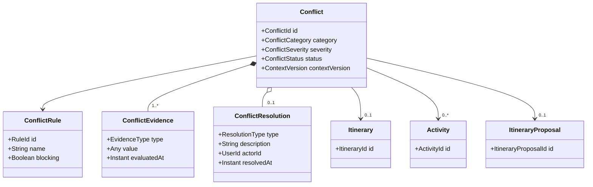

### Invariantes

* todo Conflito possui regra;
* todo Conflito possui evidência;
* todo Conflito possui objeto afetado;
* severidade é obrigatória;
* estado deve ser rastreável;
* resolução deve registrar causa;
* mudança de versão pode invalidar o Conflito.

---

# Parte XVIII — Objetos de valor

## 83. Objetos de valor principais

| Objeto               | Uso                         |
| -------------------- | --------------------------- |
| TripPeriod           | Período da Viagem           |
| Destination          | Destino principal           |
| Location             | Referência geográfica       |
| GeoCoordinate        | Coordenadas                 |
| Address              | Endereço                    |
| Region               | Área geográfica             |
| Budget               | Referência financeira       |
| Pace                 | Ritmo                       |
| Interest             | Interesse                   |
| Restriction          | Restrição                   |
| PriceRange           | Faixa de Preço              |
| OpeningHours         | Horário de Funcionamento    |
| TransportMode        | Meio de Transporte          |
| TravelEstimate       | Estimativa de Deslocamento  |
| DecisionContext      | Contexto da Recomendação    |
| RecommendationReason | Justificativa               |
| Provenance           | Origem do dado              |
| ConfidenceLevel      | Confiança                   |
| DataFreshness        | Atualidade                  |
| ItineraryVersion     | Versão do Roteiro           |
| TripContextVersion   | Versão estrutural da Viagem |
| Money                | Valor monetário e moeda     |
| Distance             | Valor e unidade             |
| Duration             | Duração                     |
| TimeZone             | Fuso horário                |

---

## 84. Características dos objetos de valor

Objetos de valor devem:

* ser definidos por seus atributos;
* não possuir identidade própria;
* ser imutáveis conceitualmente;
* validar invariantes na criação;
* permitir comparação por valor;
* evitar primitivas sem significado;
* preservar unidade e contexto;
* impedir estados parcialmente inválidos.

---

# Parte XIX — Agregados e limites de consistência

## 85. Agregados iniciais

### Trip Aggregate

Raiz:

```text id="8c40de"
Trip
```

Coordena:

* Destination;
* TripPeriod;
* Accommodation;
* Traveler;
* TripPreferences;
* SavedPlace.

### Itinerary Aggregate

Raiz:

```text id="mxq15o"
Itinerary
```

Coordena:

* TripDay;
* Activity;
* FreePeriod;
* ItineraryVersion.

### Place Aggregate

Raiz:

```text id="ydq38n"
Place
```

Coordena:

* Categorias;
* informações;
* identificadores externos;
* estados operacionais;
* Proveniência associada.

### Proposal Aggregate

Raiz:

```text id="emhbkm"
ItineraryProposal
```

Coordena:

* ProposedDay;
* ProposedActivity;
* critérios;
* validade;
* seleção;
* Conflitos da Proposta.

---

## 86. Consistência imediata

Operações que normalmente exigem consistência imediata:

* criar Viagem;
* validar Período;
* remover último owner;
* adicionar Atividade;
* mover Atividade;
* proteger Período Livre;
* aceitar Proposta;
* aplicar Restrição obrigatória;
* incrementar versão;
* impedir duplicidade de Lugar Salvo.

---

## 87. Consistência eventual

Operações que podem ocorrer posteriormente:

* recalcular Distâncias;
* atualizar Recomendações;
* reavaliar Conflitos;
* sincronizar dados externos;
* atualizar avaliações;
* expirar Propostas;
* atualizar projeções;
* recalcular Perfil do Grupo;
* atualizar índice de busca.

---

# Parte XX — Serviços de domínio

## 88. TripPeriodService

Responsabilidades:

* validar Período;
* gerar Dias;
* identificar impacto de redução;
* calcular estado temporal;
* preservar datas locais.

---

## 89. PlaceResolutionService

Responsabilidades:

* detectar duplicidades;
* reconciliar identificadores externos;
* consolidar informações;
* preservar Proveniência;
* gerar decisão de fusão.

---

## 90. TravelEstimationService

Responsabilidades:

* construir pedido de estimativa;
* validar origem e destino;
* validar Meio de Transporte;
* calcular ou solicitar cálculo;
* produzir validade;
* preservar Proveniência.

---

## 91. RecommendationService

Responsabilidades:

* construir Contexto de Decisão;
* selecionar candidatos;
* aplicar Restrições;
* produzir Recomendações;
* gerar Justificativas;
* invalidar resultados obsoletos.

---

## 92. ItineraryPlanningService

Responsabilidades:

* sugerir distribuição;
* respeitar Atividades fixas;
* respeitar Períodos protegidos;
* considerar Ritmo;
* considerar Distâncias;
* produzir Proposta, não alterar Roteiro.

---

## 93. ConflictDetectionService

Responsabilidades:

* detectar sobreposição;
* avaliar Deslocamentos;
* verificar Restrição;
* avaliar intensidade;
* classificar severidade;
* produzir evidências;
* invalidar Conflitos obsoletos.

---

# Parte XXI — Eventos de domínio

## 94. Eventos da Viagem

* TripCreated;
* TripPlanningContextCompleted;
* TripDestinationChanged;
* TripPeriodChanged;
* TripAccommodationChanged;
* TripCancelled;
* TripArchived;
* TripDeleted.

---

## 95. Eventos de Viajantes e Preferências

* TravelerAdded;
* TravelerRemoved;
* GroupProfileUpdated;
* TripInterestAdded;
* TripInterestRemoved;
* TripBudgetChanged;
* TripPaceChanged;
* TripRestrictionAdded;
* TripRestrictionRemoved;
* TripTransportModeChanged.

---

## 96. Eventos de Lugares

* PlaceCreated;
* PlaceDataUpdated;
* PlaceSaved;
* PlaceUnsaved;
* PlacePlanned;
* PlaceNoLongerPlanned;
* PlaceMarkedTemporarilyClosed;
* PlaceMarkedPermanentlyClosed;
* PlaceMerged.

---

## 97. Eventos do Roteiro

* ItineraryInitialized;
* ActivityAdded;
* ActivityUpdated;
* ActivityRemoved;
* ActivityReordered;
* ActivityMovedToAnotherDay;
* FreePeriodAdded;
* FreePeriodUpdated;
* FreePeriodRemoved;
* ItineraryVersionChanged;
* ItineraryMarkedOutdated.

---

## 98. Eventos de Recomendações e Propostas

* RecommendationRequested;
* RecommendationGenerated;
* RecommendationAccepted;
* RecommendationRejected;
* RecommendationInvalidated;
* ItineraryProposalRequested;
* ItineraryProposalGenerated;
* ItineraryProposalAccepted;
* ItineraryProposalPartiallyAccepted;
* ItineraryProposalRejected;
* ItineraryProposalExpired.

---

## 99. Eventos de Conflito

* ConflictDetected;
* ConflictResolved;
* ConflictIgnored;
* ConflictInvalidated;
* ConflictSuperseded.

---

# Parte XXII — Comandos conceituais

## 100. Comandos da Viagem

* CreateTrip;
* CompleteTripDraft;
* UpdateTripName;
* UpdateTripDestination;
* UpdateTripPeriod;
* UpdateAccommodation;
* AddTraveler;
* RemoveTraveler;
* UpdateTripPreferences;
* CancelTrip;
* ArchiveTrip;
* DeleteTrip.

---

## 101. Comandos de Lugares

* CreateCustomPlace;
* SavePlace;
* UnsavePlace;
* AddPlaceToItinerary;
* MergePlaces;
* MarkPlaceUnavailable.

---

## 102. Comandos do Roteiro

* AddActivity;
* UpdateActivity;
* RemoveActivity;
* MoveActivity;
* MoveActivityToAnotherDay;
* AddFreePeriod;
* UpdateFreePeriod;
* RemoveFreePeriod;
* MarkTripDayFree.

---

## 103. Comandos de Recomendações e Propostas

* RequestRecommendation;
* AcceptRecommendation;
* RejectRecommendation;
* RequestItineraryProposal;
* AcceptItineraryProposal;
* AcceptItineraryProposalPartially;
* RejectItineraryProposal;
* RegenerateItineraryProposal.

---

## 104. Comandos de Conflito

* ReviewItinerary;
* ResolveConflict;
* IgnoreRisk;
* RestoreIgnoredRisk.

---

# Parte XXIII — Invariantes transversais

## 105. Controle do Usuário

Nenhuma Recomendação ou Proposta pode:

* alterar o Roteiro;
* remover Atividade;
* substituir Preferência;
* alterar Hospedagem;
* ignorar Restrição;
* excluir Lugar Salvo;

sem decisão explícita e autorizada.

---

## 106. Preservação

Falhas externas não devem apagar:

* Viagem;
* Roteiro;
* Preferências;
* Lugares Salvos;
* alterações locais;
* Proposta anterior válida;
* histórico de decisões.

---

## 107. Proveniência

Informações externas relevantes devem possuir origem identificável.

---

## 108. Estimativas

Estimativas devem:

* ser rotuladas;
* possuir validade;
* possuir Fonte;
* permitir estado desatualizado;
* não ser tratadas como garantia.

---

## 109. Identidade

Entidades internas não devem utilizar identificador externo como única identidade.

---

## 110. Exclusão

Exclusões devem distinguir:

* remoção lógica;
* arquivamento;
* cancelamento;
* anonimização;
* exclusão definitiva.

---

## 111. Consistência temporal

Datas e horários devem distinguir:

* data local;
* horário local;
* instante;
* fuso;
* intervalo.

---

## 112. IA como capacidade probabilística

IA pode:

* sugerir;
* organizar;
* explicar;
* classificar;
* produzir rascunhos.

IA não pode:

* violar invariantes;
* conceder autorização;
* aplicar Proposta;
* excluir;
* persistir fato não validado;
* tornar estimativa em confirmação.

---

# Parte XXIV — Privacidade e sensibilidade

## 113. Dados pessoais

Podem incluir:

* nome;
* e-mail;
* Preferências;
* necessidades;
* Restrições;
* Localização atual;
* associação entre Usuário e Viagem.

---

## 114. Minimização

O domínio deve:

* coletar apenas o necessário;
* preferir faixa etária a data de nascimento;
* preferir necessidade funcional a diagnóstico;
* evitar Localização contínua;
* não expor dados em Eventos sem necessidade;
* reduzir contexto enviado à IA.

---

## 115. Localização atual

Deve ser:

* opcional;
* autorizada;
* contextual;
* temporária quando possível;
* desnecessária para planejamento básico.

---

# Parte XXV — Extensibilidade

## 116. Múltiplos Destinos

Evolução possível:

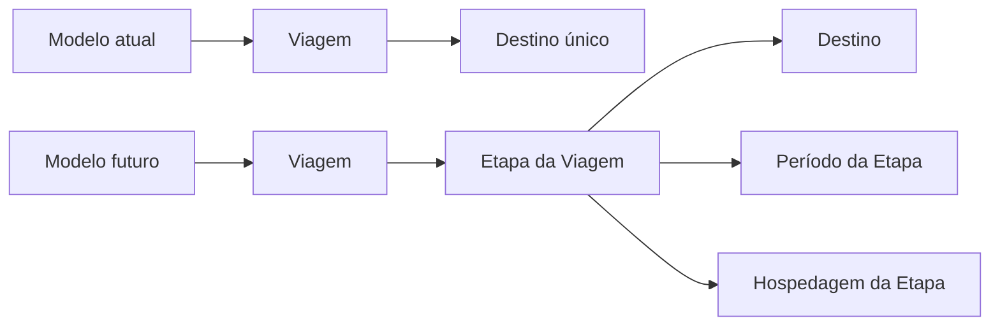

### Regra

O MVP não deve antecipar toda a complexidade, mas a evolução não deve ser bloqueada desnecessariamente.

---

## 117. Múltiplas Hospedagens

Poderão ser associadas futuramente a:

* Etapa;
* intervalo de datas;
* Região;
* Dia.

---

## 118. Colaboração

O modelo poderá evoluir para:

* múltiplos editores;
* comentários;
* decisões registradas;
* convites;
* aprovação;
* conflitos de edição.

---

## 119. Reservas

Reservas futuras poderão associar:

* Lugar;
* Atividade;
* fornecedor;
* confirmação;
* custo;
* política;
* documento.

Reserva não deve ser atributo direto e genérico de Lugar.

---

# Parte XXVI — Anti-patterns

## 120. Entidade Deus

Não concentrar todos os conceitos dentro de `Trip`.

---

## 121. Modelo anêmico

Não deslocar invariantes integralmente para serviços sem responsabilidade dos agregados.

---

## 122. Persistência orientando o domínio

Não criar conceitos apenas porque existem tabelas ou estruturas de provedor.

---

## 123. Primitivas sem significado

Evitar representar como valores simples:

* Money;
* Distance;
* Duration;
* TripPeriod;
* Location;
* ConfidenceLevel;
* TimeZone;
* Restriction.

---

## 124. Status genérico

Evitar um único campo `status` compartilhado entre conceitos diferentes.

---

## 125. Duplicação conceitual

Evitar entidades paralelas como:

```text id="a94zhw"
TouristSpot
Attraction
Place
LocationItem
```

sem diferença real.

---

## 126. IA como autoridade

Não modelar resposta de IA como decisão final ou estado canônico automático.

---

## 127. Diagrama como implementação

Os diagramas deste documento não devem:

* definir banco;
* definir framework;
* definir ORM;
* substituir contratos;
* transformar associações conceituais em dependências técnicas automáticas.

---

# Parte XXVII — Matriz de entidades

## 128. Entidades principais

| Entidade          | Identidade          | Agregado           |
| ----------------- | ------------------- | ------------------ |
| Account           | AccountId           | Account            |
| User              | UserId              | Account            |
| Trip              | TripId              | Trip               |
| Traveler          | TravelerId          | Trip               |
| Accommodation     | AccommodationId     | Trip               |
| SavedPlace        | SavedPlaceId        | Trip               |
| Itinerary         | ItineraryId         | Itinerary          |
| TripDay           | TripDayId           | Itinerary          |
| Activity          | ActivityId          | Itinerary          |
| FreePeriod        | FreePeriodId        | Itinerary          |
| Place             | PlaceId             | Place              |
| Recommendation    | RecommendationId    | Recommendation     |
| ItineraryProposal | ItineraryProposalId | Proposal           |
| Conflict          | ConflictId          | Planning Assurance |
| DataSource        | DataSourceId        | Data Governance    |

---

## 129. Relação com superfícies do produto

| Conceito          | Superfície                         |
| ----------------- | ---------------------------------- |
| Trip              | Minhas Viagens e Visão Geral       |
| Destination       | Criar Viagem e Configurações       |
| Accommodation     | Criar Viagem, Mapa e Configurações |
| Traveler          | Criar Viagem e Configurações       |
| Preference        | Configurações e personalização     |
| Place             | Explorar e Detalhes                |
| SavedPlace        | Salvos                             |
| Itinerary         | Roteiro                            |
| Activity          | Roteiro                            |
| FreePeriod        | Roteiro                            |
| TravelEstimate    | Mapa e Roteiro                     |
| Recommendation    | Explorar e Visão Geral             |
| ItineraryProposal | Proposta                           |
| Conflict          | Revisão                            |

---

# Parte XXVIII — Critérios de aceite

## 130. Linguagem

* conceitos possuem nomes únicos;
* termos estão alinhados à Bible;
* sinônimos conflitantes foram eliminados;
* termos de interface possuem correspondência conceitual;
* diagramas utilizam a linguagem oficial.

---

## 131. Entidades

* entidades possuem identidade;
* ciclo de vida está definido;
* responsabilidades estão claras;
* estados estão documentados;
* ownership conceitual está definido.

---

## 132. Objetos de valor

* valores importantes possuem tipos próprios;
* invariantes estão definidas;
* primitivas ambíguas foram reduzidas;
* imutabilidade conceitual está preservada.

---

## 133. Agregados

* raízes estão identificadas;
* limites de consistência estão claros;
* relações externas utilizam identificadores;
* transações não atravessam limites sem coordenação.

---

## 134. Recomendações e IA

* Recomendação não é decisão;
* Justificativa é obrigatória;
* limitações são preservadas;
* Proposta não altera Roteiro automaticamente;
* contexto e validade estão definidos.

---

## 135. Dados

* Proveniência está contemplada;
* Confiança está contemplada;
* atualidade está contemplada;
* divergência de fontes é suportada;
* IA não produz fato canônico automaticamente.

---

## 136. Diagramas

* diagramas possuem identificador;
* diagramas possuem objetivo;
* diagramas possuem interpretação;
* diagramas não contradizem o texto;
* diagramas não definem implementação indevidamente;
* diagramas utilizam Mermaid compatível com GitHub;
* diagramas estão rastreados no catálogo.

---

# Parte XXIX — Governança

## 137. Inclusão de conceito

Um novo conceito deve:

* resolver necessidade real;
* possuir definição;
* não duplicar conceito;
* possuir responsabilidade;
* possuir invariantes;
* estar relacionado à linguagem ubíqua;
* possuir rastreabilidade;
* atualizar diagramas afetados.

---

## 138. Alteração de conceito

Uma alteração deve revisar:

* RouteBook Bible;
* PRD;
* UX;
* Design System;
* Linguagem Ubíqua;
* Regras de Negócio;
* Eventos;
* Arquitetura;
* Dados;
* testes;
* prompts;
* analytics;
* diagramas.

---

## 139. Alteração de diagrama

Todo diagrama alterado deve revisar:

* identificador;
* objetivo;
* termos;
* cardinalidades;
* interpretação;
* limitações;
* documentos dependentes.

---

## 140. Uso por agentes de IA

Agentes devem:

* consultar este documento;
* utilizar termos oficiais;
* respeitar agregados;
* não converter diagramas em schema físico automaticamente;
* não criar entidade sem necessidade;
* preservar separação entre Recomendação, Proposta e Roteiro;
* identificar lacunas;
* atualizar diagramas afetados;
* produzir saída rastreável.

---

## 141. Checklist de revisão

Antes de aprovar este documento, verificar:

* linguagem ubíqua está representada;
* entidades estão identificadas;
* objetos de valor estão identificados;
* agregados estão definidos;
* estados estão definidos;
* invariantes estão definidas;
* serviços de domínio estão definidos;
* eventos estão definidos;
* comandos estão definidos;
* Recomendações estão modeladas;
* Propostas estão modeladas;
* Conflitos estão modelados;
* Proveniência está modelada;
* consistência temporal está definida;
* privacidade está contemplada;
* extensibilidade está contemplada;
* anti-patterns estão definidos;
* rastreabilidade está presente;
* critérios de aceite estão definidos;
* governança está definida;
* todos os diagramas estão válidos;
* todos os diagramas possuem interpretação;
* não existem contradições entre texto e diagramas.

---

## 142. Declaração final

O Modelo de Domínio do RouteBook estabelece a representação conceitual oficial do produto.

Ele define como o RouteBook compreende:

* Contas;
* Usuários;
* Viagens;
* Destinos;
* Hospedagens;
* Viajantes;
* Preferências;
* Lugares;
* Lugares Salvos;
* Dias;
* Atividades;
* Roteiros;
* Períodos Livres;
* Deslocamentos;
* Recomendações;
* Propostas;
* Conflitos;
* Fontes de Dados;
* Proveniência.

Os diagramas deste documento complementam a especificação textual e tornam explícitos:

* relacionamentos;
* cardinalidades;
* limites de agregados;
* estados derivados;
* separação entre conceitos;
* fluxos de aplicação;
* dependências conceituais.

O RouteBook deverá continuar sendo um sistema de apoio à decisão.

Seu domínio não deverá transformar:

* sugestão em ordem;
* estimativa em garantia;
* Salvo em Planejado;
* Proposta em Roteiro;
* IA em autoridade;
* diagrama conceitual em implementação automática.
