---

id: RB-DOM-001

title: Modelo de Domínio
description: Define o modelo conceitual oficial do RouteBook, incluindo domínio estratégico, entidades, objetos de valor, agregados, relacionamentos, estados, invariantes, serviços, eventos, limites de consistência e diagramas oficiais.

document_type: domain
owner: Domain

status: Draft
version: "0.2.0"

created: "2026-07-17"
last_updated: "2026-07-17"

authors:

* RouteBook Team

tags:

* domain
* domain-model
* strategic-domain
* entities
* value-objects
* aggregates
* invariants
* decision-intelligence
* diagrams
* uml
* mermaid
* ai-first
* travel-planning

related_documents:

* RB-CORE-0001
* RB-CORE-0002
* RB-CORE-0003
* RB-CORE-0004
* RB-PRD-001
* RB-PRD-002
* RB-PRD-003
* RB-PRD-004
* RB-PRD-005
* RB-PRD-006
* RB-PRD-007
* RB-PRD-008
* RB-UX-001
* RB-UX-002
* RB-UX-003
* RB-UX-004
* RB-UX-005
* RB-UX-006
* RB-DS-001
* RB-DS-002
* RB-DS-003
* RB-DS-004
* RB-DOM-002
* RB-DOM-003
* RB-DOM-004
* RB-ARC-001
* RB-ARC-002

prerequisites:

* RB-CORE-0001
* RB-CORE-0002
* RB-CORE-0003
* RB-CORE-0004
* RB-PRD-001

next_documents:

* RB-DOM-002
* RB-DOM-003
* RB-DOM-004
* RB-ARC-001
* RB-DATA-001
* RB-QA-001

ai_context:
priority: critical
index: true
-----------

# RouteBook — Modelo de Domínio

## 1. Propósito deste documento

Este documento define o modelo conceitual oficial do domínio do RouteBook.

Seu objetivo é estabelecer uma representação comum, consistente, rastreável e independente de tecnologia para os conceitos utilizados pelo produto.

O Modelo de Domínio deverá orientar:

* produto;
* arquitetura;
* engenharia;
* dados;
* inteligência artificial;
* experiência do usuário;
* qualidade;
* integrações;
* documentação;
* analytics;
* automações;
* agentes de IA.

Este documento define:

* domínio estratégico;
* domínio operacional;
* entidades;
* objetos de valor;
* agregados;
* raízes de agregado;
* relacionamentos;
* estados;
* invariantes;
* serviços de domínio;
* eventos conceituais;
* conceitos derivados;
* limites de consistência;
* ownership conceitual;
* diagramas oficiais.

Este documento não define:

* banco de dados físico;
* tabelas;
* schemas;
* endpoints;
* payloads;
* classes de implementação;
* frameworks;
* bibliotecas;
* estratégia de implantação;
* provedores externos;
* algoritmos específicos;
* modelos específicos de IA.

---

## 2. Autoridade documental

A autoridade conceitual deverá ser interpretada da seguinte maneira:

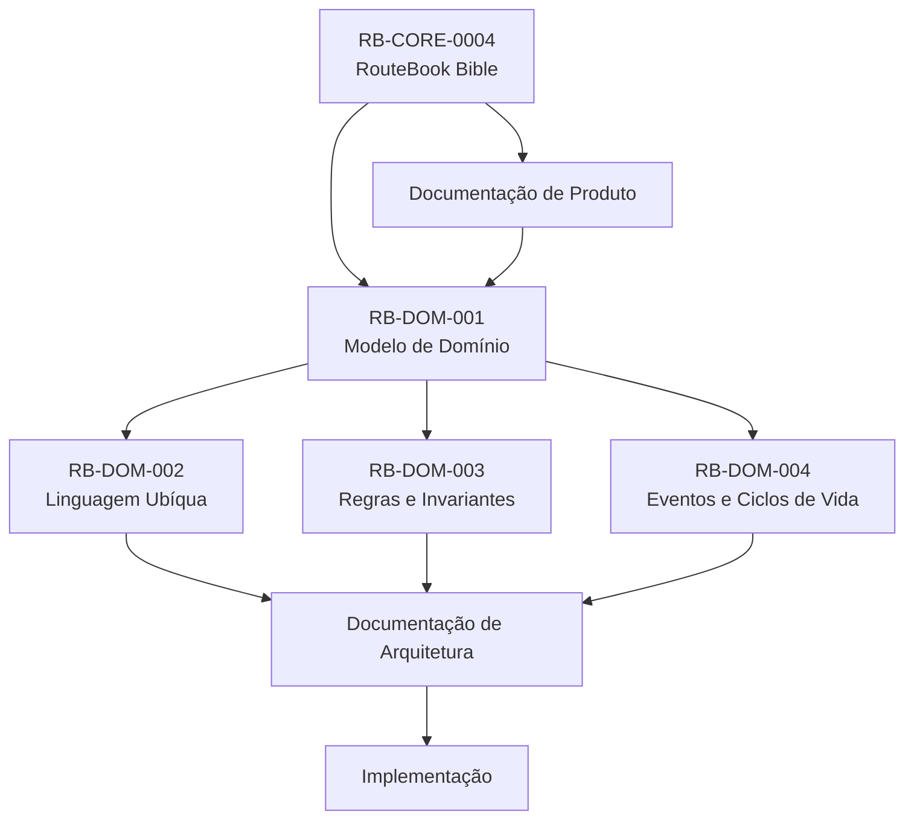

### Interpretação da autoridade documental

* A RouteBook Bible define os princípios constitucionais.
* A documentação de Produto define comportamento e valor.
* O Modelo de Domínio formaliza os conceitos.
* Linguagem, regras e eventos detalham esse modelo.
* A Arquitetura define como o domínio será implementado.
* A implementação não pode redefinir silenciosamente conceitos oficiais.

---

## 3. Princípios do domínio

O modelo deverá preservar os seguintes princípios:

1. A tomada de decisão é o núcleo estratégico do RouteBook.
2. A Viagem é o principal contexto operacional.
3. O Usuário permanece no controle.
4. Recomendação não é Decisão.
5. Decisão não é execução.
6. Salvar não significa Planejar.
7. Lugar não significa Atividade.
8. Proposta não significa Roteiro atual.
9. Estimativa não significa confirmação.
10. Informação desconhecida não deve receber valor enganoso.
11. Planejamento parcial é válido.
12. Dias e Períodos Livres são decisões legítimas.
13. A Hospedagem é opcional.
14. O Mapa é uma representação, não o domínio.
15. Alterações estruturais podem invalidar dados derivados.
16. Dados externos devem preservar Proveniência.
17. Agentes de IA devem respeitar as mesmas invariantes.
18. Objetos externos não definem identidade interna.
19. IA é uma capacidade probabilística, não uma autoridade canônica.
20. Diagramas conceituais não definem automaticamente implementação.

---

# Parte I — Domínio estratégico

## 4. Domínio estratégico e domínio operacional

O modelo do RouteBook possui dois níveis complementares.

### Domínio estratégico

Define como o RouteBook compreende apoio à tomada de decisão:

* Journey;
* Context;
* Decision;
* Recommendation;
* Decision Intelligence;
* Next Best Action;
* Decision Quality;
* Recommendation Confidence;
* Explainability.

### Domínio operacional

Define os objetos utilizados para produzir e aplicar suporte à decisão:

* Viagem;
* Viajante;
* Preferência;
* Restrição;
* Lugar;
* Roteiro;
* Atividade;
* Deslocamento;
* Recomendação;
* Proposta;
* Conflito;
* Proveniência.

Os conceitos operacionais existem para sustentar os conceitos estratégicos.

---

## 5. Journey

### Definição de Journey

`Journey` representa a experiência contínua do Usuário ao planejar, realizar e revisar uma Viagem.

Não se limita a uma sessão, tela ou Roteiro.

Pode abranger:

* descoberta;
* planejamento;
* tomada de decisão;
* execução;
* adaptação;
* revisão;
* aprendizado.

### Relação entre Journey e Viagem

Uma Viagem é um contexto operacional dentro da Journey.

A Journey pode começar antes da criação da Viagem e continuar após seu término.

---

## 6. Context

### Definição de Context

`Context` representa o conjunto de informações relevantes para uma Decisão.

Pode incluir:

* Viagem;
* Destino;
* Período;
* Hospedagem;
* localização atual;
* horário;
* Viajantes;
* Preferências;
* Restrições;
* Orçamento;
* Ritmo;
* Roteiro;
* Lugares;
* Distâncias;
* disponibilidade;
* Proveniência;
* estado do ambiente.

### Regra de Context

O Contexto deve possuir referência temporal e versões suficientes para permitir:

* auditoria;
* invalidação;
* comparação;
* explicação.

---

## 7. Decision

### Identidade de Decision

```text
DecisionId
```

### Definição de Decision

Representa uma escolha realizada pelo Usuário em determinado Contexto.

### Exemplos de Decision

* escolher onde almoçar;
* decidir qual praia visitar;
* aceitar uma Proposta;
* manter um Dia livre;
* alterar a Hospedagem;
* ignorar um Risco;
* adicionar um Lugar ao Roteiro.

### Atributos conceituais de Decision

* identificador;
* Viagem;
* tipo;
* Context Snapshot;
* opção escolhida;
* Recomendação relacionada opcional;
* responsável;
* data;
* resultado opcional;
* referência de execução opcional.

### Invariantes de Decision

* toda Decisão possui Contexto;
* pode existir sem Recomendação;
* Recomendação aceita pode originar Decisão;
* Decisão não significa execução concluída;
* autoria do Usuário deve permanecer distinta da sugestão da IA;
* Contexto utilizado deve ser rastreável.

---

## 8. Recommendation

### Definição estratégica de Recommendation

Representa uma sugestão produzida pelo RouteBook para apoiar uma Decisão.

Uma Recomendação:

* considera Contexto;
* possui Justificativas;
* comunica limitações;
* possui validade;
* pode possuir confiança;
* não altera estado canônico;
* pode ser aceita, rejeitada ou ignorada.

---

## 9. Decision Intelligence

### Definição de Decision Intelligence

Capacidade do RouteBook de transformar dados, Contexto, regras e modelos em apoio compreensível à decisão.

Pode utilizar:

* regras determinísticas;
* busca;
* ranking;
* geografia;
* estimativas;
* IA;
* histórico;
* Preferências;
* Restrições;
* Proveniência.

Decision Intelligence não representa uma entidade persistida única.

É uma capacidade de domínio.

---

## 10. Next Best Action

### Definição de Next Best Action

Representa uma ação sugerida como próxima alternativa relevante dentro do Contexto atual.

Exemplos:

* visitar um Lugar próximo;
* iniciar deslocamento;
* revisar uma Atividade inviável;
* reservar tempo para almoço;
* manter o período livre;
* atualizar a Hospedagem.

### Regra de Next Best Action

Next Best Action é uma forma de Recomendação.

Não deve ser tratada como ordem automática.

---

## 11. Recommendation Confidence

### Definição de Recommendation Confidence

Representa o nível de confiança de que uma Recomendação é adequada ao Contexto analisado.

### Recommendation Confidence não significa

* certeza;
* probabilidade estatística obrigatória;
* avaliação do Lugar;
* score de ordenação;
* confiança de uma Fonte isolada.

### Recommendation Confidence pode considerar

* quantidade e qualidade das evidências;
* atualidade;
* consistência das Fontes;
* completude do Contexto;
* estabilidade da Recomendação;
* nível de inferência.

---

## 12. Decision Quality

### Definição de Decision Quality

Representa a qualidade observada ou estimada de uma Decisão em relação ao objetivo e ao Contexto.

Pode considerar:

* aderência às Preferências;
* respeito às Restrições;
* tempo;
* custo;
* esforço;
* satisfação;
* execução;
* resultado posterior.

### Regra de Decision Quality

Decision Quality não deve ser usada para julgar o Usuário.

Seu objetivo é apoiar aprendizado e melhoria.

---

## 13. Explainability

### Definição de Explainability

Capacidade de explicar os fatores compreensíveis que sustentam uma Recomendação ou Proposta.

Pode incluir:

* Justificativas;
* evidências;
* Fontes;
* limitações;
* confiança;
* critérios;
* dados ausentes.

Não exige exposição integral de modelos, prompts ou cálculos internos.

---

## 14. RB-DGM-DOM-001 — Loop estratégico de decisão

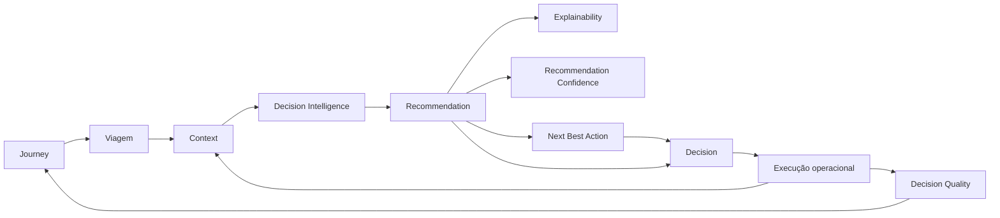

### Interpretação do loop estratégico

* A Viagem alimenta o Contexto.
* Decision Intelligence produz Recomendações.
* Recomendações podem incluir Next Best Action.
* O Usuário toma uma Decisão.
* A execução altera o Contexto.
* O resultado pode contribuir para Decision Quality.
* O ciclo continua durante a Journey.

---

# Parte II — Visão geral do domínio operacional

## 15. Catálogo de diagramas

| Identificador  | Diagrama                            |
| -------------- | ----------------------------------- |
| RB-DGM-DOM-001 | Loop estratégico de decisão         |
| RB-DGM-DOM-002 | Mapa geral do domínio               |
| RB-DGM-DOM-003 | Modelo conceitual principal         |
| RB-DGM-DOM-004 | Mapa dos agregados                  |
| RB-DGM-DOM-005 | Lugar, Salvo, Planejado e Atividade |
| RB-DGM-DOM-006 | Estrutura do agregado Viagem        |
| RB-DGM-DOM-007 | Conceitos geográficos               |
| RB-DGM-DOM-008 | Estado temporal da Viagem           |
| RB-DGM-DOM-009 | Viajantes e Preferências            |
| RB-DGM-DOM-010 | Proveniência e qualidade            |
| RB-DGM-DOM-011 | Estrutura do Roteiro                |
| RB-DGM-DOM-012 | Dia vazio e Dia livre               |
| RB-DGM-DOM-013 | Recomendação e Contexto             |
| RB-DGM-DOM-014 | Proposta e aplicação                |
| RB-DGM-DOM-015 | Conflitos e evidências              |
| RB-DGM-DOM-016 | Evolução para múltiplos Destinos    |

---

## 16. RB-DGM-DOM-002 — Mapa geral do domínio

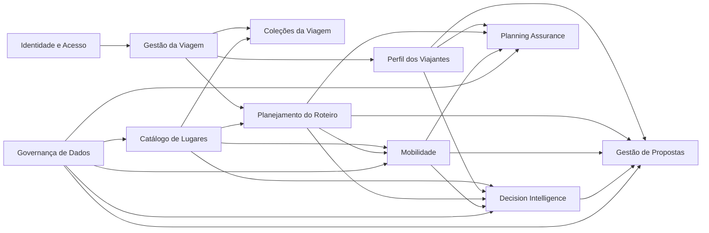

### Limitações do mapa geral

O diagrama não representa:

* dependências técnicas;
* transações;
* bancos;
* containers;
* cardinalidades completas.

---

## 17. RB-DGM-DOM-003 — Modelo conceitual principal

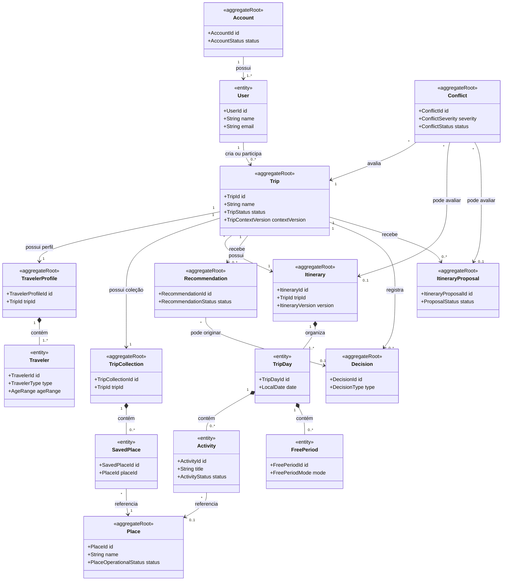

---

# Parte III — Identidade e acesso

## 18. Agregado Account

### Raiz do agregado Account

```text
Account
```

### Entidades internas de Account

* User;
* Consent;
* ExternalIdentityReference.

### Responsabilidades de Account

* identidade;
* propriedade;
* acesso;
* consentimentos;
* estado da Conta.

### Invariantes de Account

* Conta ativa possui responsável;
* identidade interna não depende exclusivamente de provedor externo;
* consentimentos relevantes são rastreáveis;
* encerramento não apaga histórico sem política.

---

## 19. Usuário

### Identidade de Usuário

```text
UserId
```

### Definição de Usuário

Pessoa identificada que utiliza o RouteBook.

### Usuário não significa

* Viajante;
* participante obrigatório da Viagem;
* owner de todas as Viagens.

---

## 20. Participação na Viagem

A relação entre Usuário e Viagem possui papel explícito.

### Papéis de participação

* `owner`;
* `editor`;
* `viewer`.

### Invariantes de participação

* toda Viagem possui ao menos um owner;
* o último owner não pode ser removido sem transferência;
* autorização não pode depender apenas da interface;
* participante pode editar sem viajar;
* Viajante pode não possuir acesso.

---

# Parte IV — Agregado Viagem

## 21. Agregado Trip

### Raiz do agregado Trip

```text
Trip
```

### Responsabilidades de Trip

* identidade da Viagem;
* nome;
* Destino;
* Período;
* Hospedagem;
* status;
* participantes;
* ownership;
* versão estrutural.

### Trip não possui diretamente

* Viajantes;
* Preferências;
* Lugares Salvos;
* Dias;
* Atividades;
* Recomendações;
* Propostas;
* Conflitos.

Esses conceitos pertencem a agregados próprios.

---

## 22. Entidade Viagem

### Identidade de Viagem

```text
TripId
```

### Atributos de Viagem

* identificador;
* nome;
* Destino;
* Período;
* Hospedagem opcional;
* status;
* participantes;
* owner;
* data de criação;
* atualização;
* versão de contexto;
* referência ao Roteiro atual.

---

## 23. Estados da Viagem

* `Draft`;
* `Planned`;
* `InProgress`;
* `Completed`;
* `Cancelled`;
* `Archived`.

### Regra de precedência dos estados

`Cancelled` e `Archived` possuem precedência de apresentação sobre o estado temporal derivado.

---

## 24. RB-DGM-DOM-006 — Estrutura do agregado Viagem

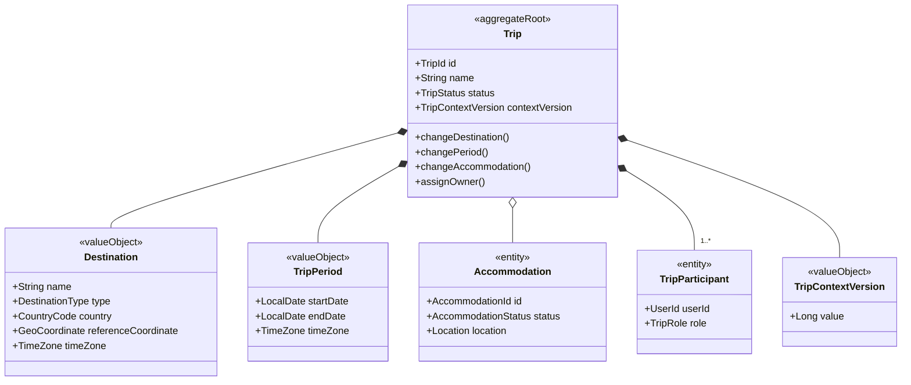

---

## 25. Invariantes da Viagem

1. Viagem planejável possui Destino.
2. Viagem planejável possui Período válido.
3. Data final não precede a inicial.
4. Viagem possui ao menos um owner.
5. Hospedagem é opcional.
6. Mudança de Destino é estrutural.
7. Mudança de Período é estrutural.
8. Mudança de Hospedagem invalida dados dependentes.
9. Alterações estruturais incrementam `TripContextVersion`.
10. Exclusão não pode ser silenciosa.
11. Cancelamento, arquivamento e exclusão são distintos.
12. Dados incompatíveis não devem ser removidos sem revisão.

---

# Parte V — Geografia e período

## 26. Destination

### Definição de Destination

Representa a região geográfica principal associada à Viagem.

### Tipos de Destination

* city;
* district;
* region;
* island;
* park;
* custom-region.

### Invariantes de Destination

* possui referência geográfica;
* possui país;
* possui fuso ou mecanismo de resolução;
* não é Lugar;
* não é destino de um Deslocamento.

---

## 27. Region

### Definição de Region

Área geográfica utilizada para busca, agrupamento, recomendação ou visualização.

Pode ser:

* administrativa;
* comercial;
* turística;
* derivada;
* personalizada;
* temporária.

---

## 28. Location

### Estrutura de Location

* coordenada;
* endereço opcional;
* precisão;
* Proveniência;
* confiança;
* atualização.

### Invariantes de Location

* latitude entre `-90` e `90`;
* longitude entre `-180` e `180`;
* localização aproximada deve ser identificada;
* ausência de endereço não invalida coordenada;
* ausência de coordenada limita cálculos.

---

## 29. RB-DGM-DOM-007 — Conceitos geográficos

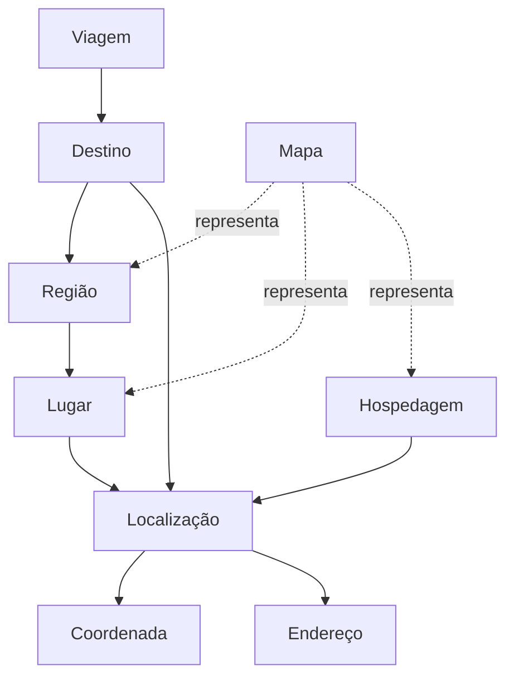

---

## 30. TripPeriod

### Estrutura de TripPeriod

* data inicial;
* data final;
* fuso horário.

### Invariantes de TripPeriod

* intervalo inclusivo;
* data inicial não supera data final;
* datas são locais;
* duração é derivada;
* mudança inicia sincronização do Roteiro.

---

## 31. Sincronização de Dias

`TripDay` pertence ao agregado `Itinerary`.

Quando o Período muda:

```text
TripPeriodChanged
→ Itinerary sincroniza os TripDays
```

### Ampliação do Período

* cria novos Dias;
* preserva Dias existentes;
* preserva conteúdo;
* recalcula ordem cronológica.

### Redução do Período

* identifica Dias afetados;
* identifica Atividades;
* identifica Períodos Livres;
* impede perda silenciosa;
* exige revisão quando houver conteúdo.

---

## 32. RB-DGM-DOM-008 — Estado temporal da Viagem

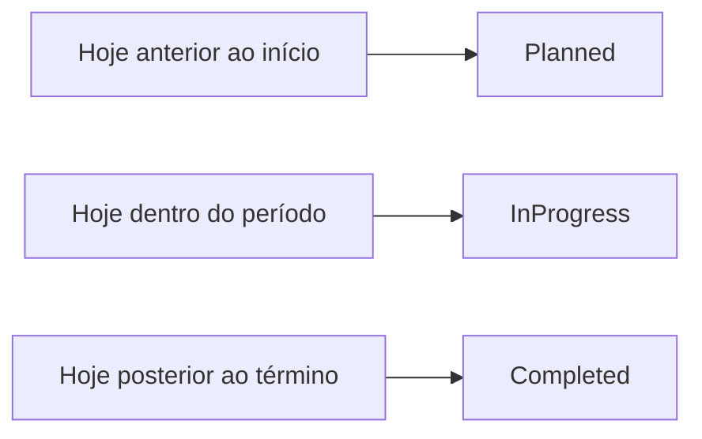

---

# Parte VI — Perfil dos Viajantes

## 33. Agregado Traveler Profile

### Raiz do agregado Traveler Profile

```text
TravelerProfile
```

### Responsabilidades de Traveler Profile

* Viajantes;
* Perfil do Grupo;
* Interesses;
* Restrições;
* Orçamento;
* Ritmo;
* necessidades funcionais;
* transporte preferencial.

---

## 34. Traveler

### Identidade de Traveler

```text
TravelerId
```

### Definição de Traveler

Pessoa participante da Viagem, possuindo ou não Conta.

### Atributos de Traveler

* nome opcional;
* faixa etária;
* tipo;
* necessidades;
* associação opcional com UserId.

### Invariantes de Traveler

* pertence a uma Viagem;
* não precisa possuir Conta;
* dados pessoais são minimizados;
* necessidades funcionais são preferidas a diagnósticos.

---

## 35. GroupProfile

### Definição de GroupProfile

Resumo derivado das características dos Viajantes.

### Invariantes de GroupProfile

* não substitui dados individuais;
* é recalculado após alterações;
* não deve inferir atributos sensíveis sem base;
* é utilizado como Contexto de Decisão.

---

## 36. Interest

### Definição de Interest

Categoria de experiência desejada.

### Exemplos de Interest

* praias;
* gastronomia;
* vida noturna;
* natureza;
* cultura;
* descanso;
* aventura;
* compras.

### Invariantes de Interest

* não é Restrição;
* pode possuir peso;
* pode possuir escopo;
* ausência não impede planejamento.

---

## 37. Restriction

### Tipos de Restriction

* mobilidade;
* alimentação;
* faixa etária;
* horário;
* transporte;
* orçamento;
* acessibilidade;
* categoria evitada;
* personalizada.

### Severidades de Restriction

* preference;
* important;
* mandatory.

### Invariantes de Restriction

* Restrição obrigatória não pode ser ignorada silenciosamente;
* origem deve ser identificável;
* incompatibilidade produz bloqueio ou Conflito;
* dado sensível não deve ser inferido sem base.

---

## 38. Budget

Budget pode representar:

* faixa total;
* valor diário;
* valor por pessoa;
* classificação qualitativa;
* valor por categoria.

### Invariantes de Budget

* valor monetário possui moeda;
* ausência não significa zero;
* estimativa não significa limite confirmado;
* Orçamento não é despesa real.

---

## 39. Pace

### Valores de Pace

* relaxed;
* balanced;
* intense;
* custom.

### Regra de Pace

Ritmo orienta densidade, mas não determina quantidade universal de Atividades.

---

## 40. RB-DGM-DOM-009 — Viajantes e Preferências

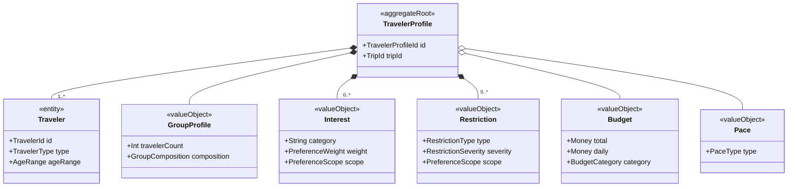

---

# Parte VII — Lugares e coleções

## 41. Agregado Place

### Raiz do agregado Place

```text
Place
```

### Responsabilidades de Place

* identidade interna;
* nome;
* Localização;
* Categorias;
* estado operacional;
* Detalhes;
* identificadores externos;
* Proveniência das informações.

---

## 42. Identidade do Lugar

A identidade interna deve:

* ser independente de provedor;
* permitir múltiplos IDs externos;
* permitir aliases;
* sobreviver à troca de Fonte;
* suportar fusão;
* preservar histórico.

Não deve depender exclusivamente de:

* nome;
* endereço;
* coordenada;
* ID externo;
* categoria.

---

## 43. Categorias de Lugar

Categorias iniciais:

* beach;
* restaurant;
* bar;
* nightclub;
* attraction;
* tour;
* viewpoint;
* shopping;
* cafe;
* park;
* cultural-site;
* transport-point;
* accommodation;
* custom.

Um Lugar pode possuir várias categorias.

---

## 44. Estado operacional do Lugar

* open;
* temporarily-closed;
* permanently-closed;
* seasonal;
* unknown.

### Invariantes do estado operacional

* unknown não significa aberto;
* estado possui Proveniência;
* fechamento não remove Atividade automaticamente;
* encerramento permanente pode gerar Conflito.

---

## 45. OpeningHours

OpeningHours pode conter:

* dia da semana;
* intervalos;
* exceções;
* vigência;
* fuso;
* Fonte;
* confiança;
* atualização.

Horário não garante disponibilidade.

---

## 46. PriceRange

PriceRange pode representar:

* gratuito;
* classificação qualitativa;
* faixa monetária;
* preço por pessoa;
* preço por grupo;
* desconhecido.

Preço desconhecido não é gratuito.

---

## 47. Rating

Rating deve possuir:

* valor;
* escala;
* quantidade de avaliações;
* Fonte;
* data.

Avaliação não é score de Recomendação.

---

## 48. Agregado Trip Collection

### Raiz do agregado Trip Collection

```text
TripCollection
```

### Responsabilidades de Trip Collection

* Lugares Salvos da Viagem;
* observações;
* origem;
* tags futuras;
* unicidade por Viagem e Lugar.

---

## 49. SavedPlace

### Identidade de SavedPlace

```text
SavedPlaceId
```

### Chave natural contextual de SavedPlace

```text
TripId + PlaceId
```

### Invariantes de SavedPlace

* um Lugar é salvo no máximo uma vez por Viagem;
* salvar é idempotente;
* salvar não cria Atividade;
* remover dos Salvos não remove Atividade;
* Planejado é estado derivado externo;
* não representa favorito global.

---

## 50. Lugar Planejado

Um Lugar é Planejado quando existe ao menos uma Atividade ativa associada.

É um conceito derivado.

Não deve ser modelado como estado canônico independente sem necessidade.

---

## 51. RB-DGM-DOM-005 — Lugar, Salvo, Planejado e Atividade

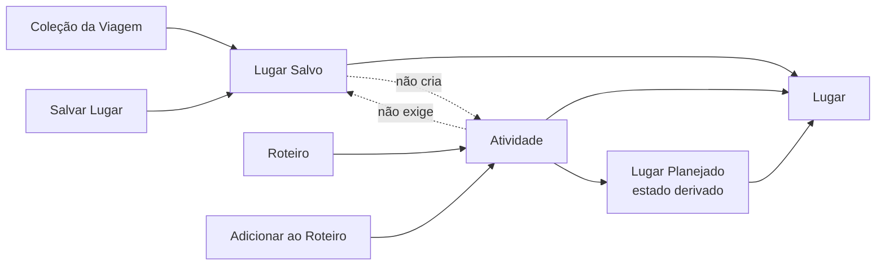

### Estados possíveis de Lugar Salvo e Planejado

| Salvo | Planejado | Situação                          |
| ----- | --------- | --------------------------------- |
| Não   | Não       | Apenas disponível no Catálogo     |
| Sim   | Não       | Preservado para avaliação         |
| Não   | Sim       | Adicionado diretamente ao Roteiro |
| Sim   | Sim       | Salvo e planejado                 |

---

# Parte VIII — Proveniência e qualidade

## 52. Agregado Data Source

### Raiz do agregado Data Source

```text
DataSource
```

### Tipos de DataSource

* internal;
* user-provided;
* provider;
* public-dataset;
* partner;
* ai-generated;
* inferred.

---

## 53. Provenance

### Estrutura de Provenance

* Fonte;
* identificador externo;
* data de coleta;
* atualização;
* método;
* confiança;
* licença;
* versão;
* agente responsável.

### Invariantes de Provenance

* dados externos relevantes possuem origem;
* dados inferidos são marcados;
* conteúdo de IA é distinguido de fato;
* atualização não destrói origem anterior;
* divergências preservam Fontes.

---

## 54. ConfidenceLevel

ConfidenceLevel representa qualidade da evidência de um dado.

Valores:

* confirmed;
* high;
* medium;
* low;
* unknown.

ConfidenceLevel não é Recommendation Confidence.

---

## 55. DataFreshness

Estados:

* current;
* stale;
* unknown;
* conflicting;
* unavailable.

---

## 56. RB-DGM-DOM-010 — Proveniência e qualidade

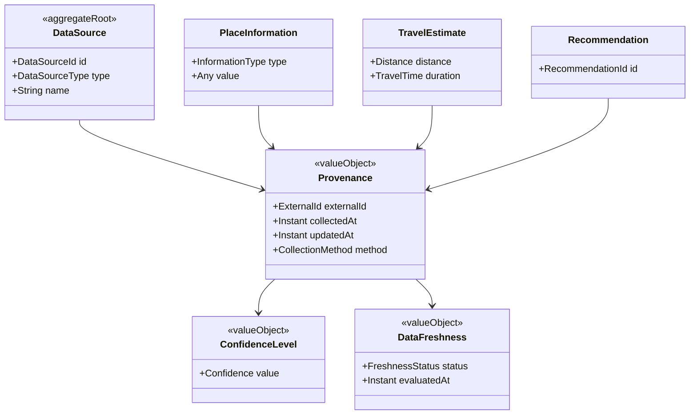

---

# Parte IX — Roteiro

## 57. Agregado Itinerary

### Raiz do agregado Itinerary

```text
Itinerary
```

### Responsabilidades de Itinerary

* Dias;
* Atividades;
* Períodos Livres;
* ordenação;
* versão;
* planejamento parcial;
* aplicação de itens de Proposta;
* sincronização com o Período da Viagem.

---

## 58. TripDay

### Identidade de TripDay

```text
TripDayId
```

### Identidade natural contextual de TripDay

```text
TripId + LocalDate
```

### Invariantes de TripDay

* pertence ao Roteiro;
* data pertence ao Período;
* não existe duplicidade por data;
* posição respeita cronologia;
* pode estar vazio;
* pode ser intencionalmente livre.

---

## 59. Activity

### Identidade de Activity

```text
ActivityId
```

### Tipos de Activity

* place-visit;
* meal;
* tour;
* transport;
* rest;
* custom;
* check-in;
* check-out;
* free-form.

### Estados de Activity

* planned;
* tentative;
* completed;
* skipped;
* cancelled;
* unavailable;
* needs-review;
* removed.

### Flexibilidade de Activity

* fixed;
* flexible;
* suggested.

### Invariantes de Activity

* título obrigatório;
* pertence a um Dia;
* duração positiva quando informada;
* horário utiliza fuso da Viagem;
* Lugar é opcional;
* Localização manual é permitida;
* remoção não exclui Lugar;
* mudança de Dia preserva identidade;
* Atividade fixa não é movida automaticamente.

---

## 60. FreePeriod

### Identidade de FreePeriod

```text
FreePeriodId
```

### Modos de FreePeriod

* flexible;
* protected.

### Invariantes de FreePeriod

* representa decisão intencional;
* protected impede preenchimento automático;
* flexible permite sugestão;
* substituição exige decisão;
* remoção não cria Atividade.

---

## 61. ItineraryVersion

### Uso de ItineraryVersion

* concorrência;
* validade de Proposta;
* auditoria;
* sincronização;
* invalidação.

Toda alteração canônica incrementa a versão.

---

## 62. Dimensões do estado do Roteiro

O Roteiro não deve utilizar um único status para representar dimensões distintas.

### PlanningCompleteness

* empty;
* partial;
* planned.

### ReviewState

* not-reviewed;
* under-review;
* reviewed.

### ConsistencyState

* current;
* outdated.

### ConflictSummary

* without-known-conflicts;
* with-suggestions;
* with-risks;
* with-errors.

---

## 63. RB-DGM-DOM-011 — Estrutura do Roteiro

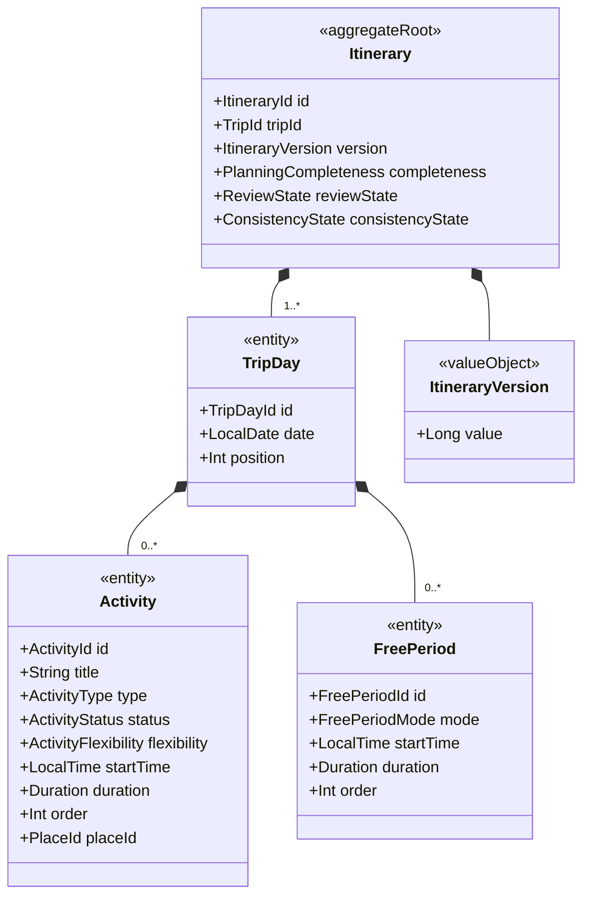

---

## 64. RB-DGM-DOM-012 — Dia vazio e Dia livre

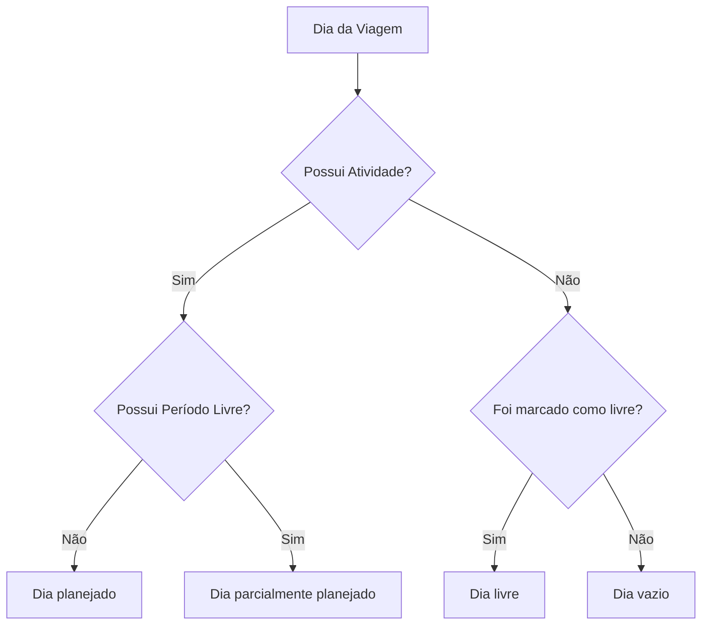

---

# Parte X — Mobilidade

## 65. TravelLeg

TravelLeg representa um Deslocamento entre duas referências geográficas.

Pode conectar:

* Hospedagem;
* Atividade;
* Lugar;
* localização atual;
* endereço manual;
* ponto personalizado.

---

## 66. TransportMode

Valores iniciais:

* walking;
* driving;
* public-transit;
* ride-hailing;
* cycling;
* boat;
* custom.

---

## 67. TravelEstimate

### Estrutura de TravelEstimate

* origem;
* destino;
* Distância;
* duração;
* Meio de Transporte;
* rota opcional;
* Fonte;
* confiança;
* validade;
* estado.

### Estados de TravelEstimate

* requested;
* calculating;
* available;
* estimated;
* unavailable;
* stale;
* failed.

### Invariantes de TravelEstimate

* origem obrigatória;
* destino obrigatório;
* transporte obrigatório;
* caráter estimado explícito;
* Proveniência preservada;
* mudança de contexto invalida;
* falha não remove Atividade;
* precisão não excede a Fonte.

---

## 68. Deslocamentos derivados

Deslocamentos do Roteiro são derivados da sequência.

```text
Hospedagem
→ Atividade 1
→ Atividade 2
→ Atividade 3
→ retorno opcional
```

---

# Parte XI — Recomendação e Decisão

## 69. Agregado Recommendation

### Raiz do agregado Recommendation

```text
Recommendation
```

### Responsabilidades de Recommendation

* Context Snapshot;
* alvo;
* Justificativas;
* evidências;
* limitações;
* validade;
* Recommendation Confidence;
* score opcional;
* estado;
* metadados de geração.

---

## 70. Estados da Recomendação

* generated;
* presented;
* accepted;
* rejected;
* expired;
* invalidated;
* superseded.

---

## 71. DecisionContextSnapshot

DecisionContextSnapshot pode incluir:

* TripId;
* TripContextVersion;
* ItineraryVersion;
* data;
* horário;
* localização;
* Preferências;
* Restrições;
* Orçamento;
* Ritmo;
* Viajantes;
* Lugares;
* Distâncias;
* Fontes.

---

## 72. RecommendationReason

### Estrutura de RecommendationReason

* fator;
* descrição;
* evidência;
* peso opcional;
* limitação;
* Fonte.

---

## 73. RecommendationScore

RecommendationScore é um valor interno de ordenação ou comparação.

Não significa:

* avaliação;
* confiança;
* qualidade absoluta;
* Decision Quality.

---

## 74. RecommendationConfidence

RecommendationConfidence representa confiança de adequação da Recomendação ao Contexto.

Não deve ser confundida com:

* ConfidenceLevel de uma Fonte;
* RecommendationScore;
* Rating de Lugar.

---

## 75. Agregado Decision

### Raiz do agregado Decision

```text
Decision
```

### Responsabilidades de Decision

* registrar escolha;
* preservar Contexto;
* relacionar Recomendação opcional;
* registrar autoria;
* relacionar execução;
* permitir avaliação posterior.

---

## 76. RB-DGM-DOM-013 — Recomendação, confiança e Decisão

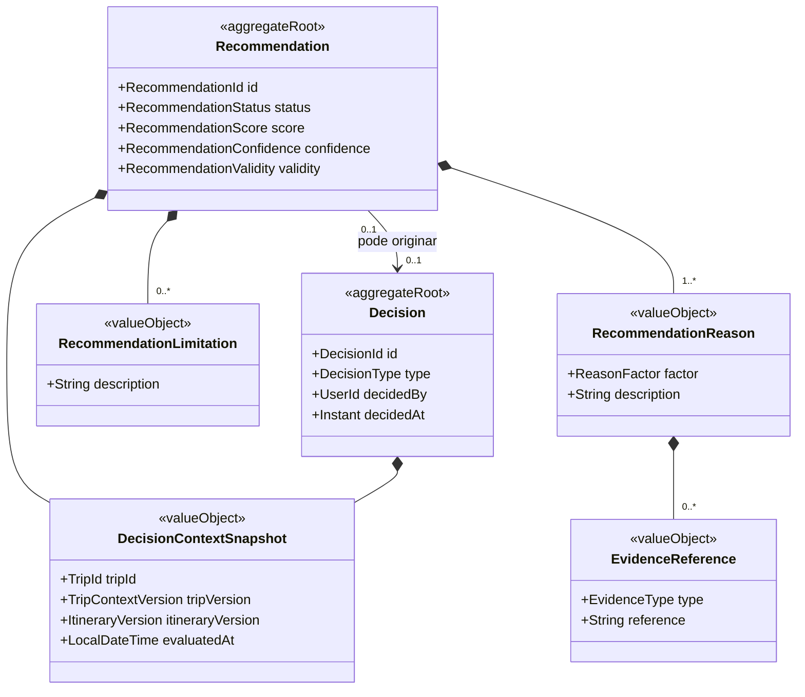

---

# Parte XII — Proposta de Roteiro

## 77. Agregado Itinerary Proposal

### Raiz do agregado Itinerary Proposal

```text
ItineraryProposal
```

### Responsabilidades de Itinerary Proposal

* versão base;
* contexto base;
* Dias propostos;
* Atividades propostas;
* critérios;
* Justificativas;
* Conflitos;
* validade;
* seleção;
* estado.

---

## 78. Estados da Proposta

* requested;
* generating;
* ready;
* partially-accepted;
* accepted;
* rejected;
* expired;
* failed;
* cancelled;
* superseded.

---

## 79. ProposedActivity

ProposedActivity:

* pertence à Proposta;
* não pertence ao Roteiro;
* não possui ActivityId canônico;
* pode referenciar Lugar;
* pode possuir Justificativa;
* torna-se Atividade somente após aceitação.

---

## 80. Invariantes da Proposta

1. Proposta referencia versão base.
2. Proposta não altera Roteiro.
3. Aceitação é explícita.
4. Aceitação parcial aplica apenas seleção.
5. Proposta expirada não pode ser aplicada.
6. Períodos protegidos são respeitados.
7. Atividades fixas não são movidas automaticamente.
8. Falha preserva Roteiro atual.
9. Aplicação é idempotente.

---

## 81. RB-DGM-DOM-014 — Proposta e aplicação

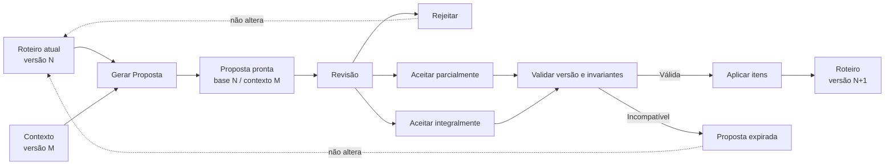

---

# Parte XIII — Garantia do Planejamento

## 82. Agregado de Conflito de Planejamento

### Raiz do agregado de Conflito de Planejamento

`PlanningConflict`

### Definição do agregado de Conflito de Planejamento

O agregado `PlanningConflict` pertence ao contexto delimitado `Planning Assurance`.

Ele representa uma condição identificada que afeta ou pode afetar a validade, a viabilidade, a segurança ou a qualidade de um planejamento.

Um Conflito de Planejamento pode estar relacionado a:

- uma Viagem;
- um Roteiro;
- uma Atividade;
- uma Proposta de Roteiro;
- um Lugar;
- uma Estimativa de Deslocamento;
- uma Restrição;
- uma informação desatualizada ou conflitante.

### Responsabilidades do agregado de Conflito de Planejamento

- identificar a regra de negócio avaliada;
- registrar o objeto afetado;
- preservar as evidências utilizadas;
- classificar a severidade;
- controlar o estado do Conflito;
- registrar sua resolução;
- registrar uma decisão autorizada de ignorar um Risco;
- preservar a versão do Contexto analisado;
- permitir invalidação após mudanças relevantes;
- manter rastreabilidade entre detecção, revisão e resolução.
---

## 83. Severidades de Conflict

* error;
* risk;
* suggestion.

---

## 84. Estados de Conflict

* open;
* resolved;
* ignored;
* invalidated;
* superseded.

### Regras de estado de Conflict

* Erro bloqueante não pode ser ignorado;
* Risco pode ser ignorado quando permitido;
* resolução exige remoção da condição;
* invalidação difere de resolução;
* decisão de ignorar é auditável.

---

## 85. Referências de Conflict

Conflict pode referenciar:

* TripId;
* ItineraryId;
* ActivityIds;
* ProposalId;
* PlaceId;
* TravelEstimateId.

O Roteiro não possui internamente os Conflitos.

Planning Assurance possui os Conflitos e avalia o Roteiro.

---

## 86. RB-DGM-DOM-015 — Conflitos e evidências

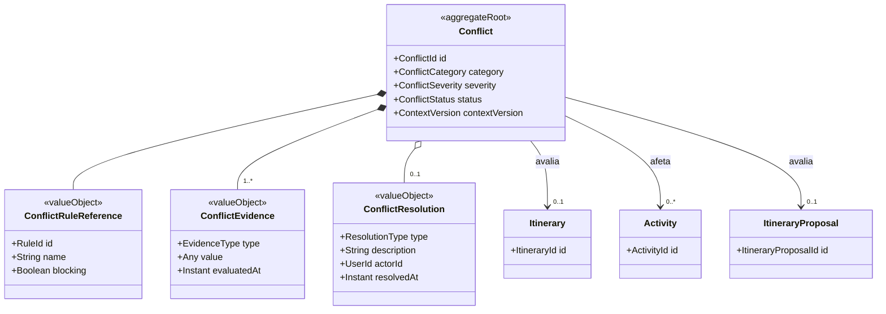

---

# Parte XIV — Objetos de valor

## 87. Catálogo principal de objetos de valor

| Objeto de valor          | Uso                       |
| ------------------------ | ------------------------- |
| TripPeriod               | Período da Viagem         |
| Destination              | Destino                   |
| Location                 | Localização               |
| GeoCoordinate            | Coordenadas               |
| Address                  | Endereço                  |
| Region                   | Região                    |
| Budget                   | Orçamento                 |
| Pace                     | Ritmo                     |
| Interest                 | Interesse                 |
| Restriction              | Restrição                 |
| PriceRange               | Faixa de Preço            |
| OpeningHours             | Funcionamento             |
| TransportMode            | Transporte                |
| TravelEstimate           | Estimativa                |
| DecisionContextSnapshot  | Contexto                  |
| RecommendationReason     | Justificativa             |
| RecommendationConfidence | Confiança da Recomendação |
| Provenance               | Origem                    |
| ConfidenceLevel          | Confiança do dado         |
| DataFreshness            | Atualidade                |
| ItineraryVersion         | Versão do Roteiro         |
| TripContextVersion       | Versão da Viagem          |
| Money                    | Valor monetário           |
| Distance                 | Distância                 |
| Duration                 | Duração                   |
| TimeZone                 | Fuso                      |

---

## 88. Características dos objetos de valor

Objetos de valor devem:

* ser definidos por atributos;
* não possuir identidade própria;
* ser imutáveis conceitualmente;
* validar invariantes na criação;
* permitir comparação por valor;
* evitar primitivas ambíguas;
* preservar unidade e contexto.

---

# Parte XV — Agregados e consistência

## 89. Agregados oficiais

| Agregado           | Raiz              |
| ------------------ | ----------------- |
| Account            | Account           |
| Trip               | Trip              |
| Traveler Profile   | TravelerProfile   |
| Trip Collection    | TripCollection    |
| Place              | Place             |
| Itinerary          | Itinerary         |
| Recommendation     | Recommendation    |
| Decision           | Decision          |
| Itinerary Proposal | ItineraryProposal |
| Planning Assurance | Conflict          |
| Data Governance    | DataSource        |

---

## 90. RB-DGM-DOM-004 — Mapa dos agregados

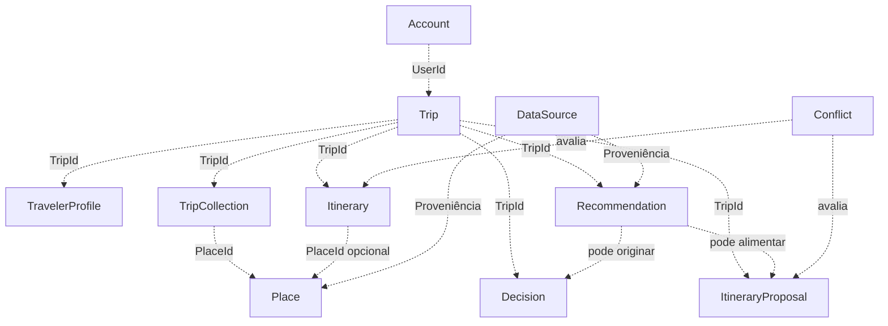

---

## 91. Consistência imediata

Exemplos:

* validar Período;
* manter owner;
* impedir duplicidade de Lugar Salvo;
* adicionar Atividade;
* mover Atividade;
* proteger Período Livre;
* aplicar itens de Proposta;
* incrementar versão;
* validar Restrição obrigatória.

---

## 92. Consistência eventual

Exemplos:

* sincronizar Dias após alteração de Período;
* recalcular Distâncias;
* atualizar Recomendações;
* reavaliar Conflitos;
* sincronizar dados externos;
* atualizar projeções;
* expirar Propostas;
* recalcular Perfil do Grupo.

---

# Parte XVI — Serviços de domínio

## 93. TripPeriodPolicy

Responsabilidades:

* validar Período;
* calcular impacto;
* determinar datas;
* preservar semântica local;
* produzir plano de sincronização.

---

## 94. PlaceResolutionService

Responsabilidades:

* identificar duplicidades;
* reconciliar IDs externos;
* consolidar informações;
* preservar Proveniência;
* produzir decisão de fusão.

---

## 95. TravelEstimationService

Responsabilidades:

* validar origem;
* validar destino;
* validar transporte;
* produzir Estimativa;
* definir validade;
* preservar Proveniência.

---

## 96. DecisionContextBuilder

Responsabilidades:

* coletar dados relevantes;
* produzir snapshot;
* minimizar dados;
* registrar versões;
* identificar ausência de informações.

---

## 97. RecommendationService

Responsabilidades:

* gerar candidatos;
* aplicar Restrições;
* produzir Recomendações;
* gerar Justificativas;
* calcular confiança;
* definir validade.

---

## 98. ItineraryPlanningService

Responsabilidades:

* sugerir organização;
* respeitar Atividades fixas;
* respeitar Períodos protegidos;
* considerar Ritmo;
* considerar Mobilidade;
* produzir Proposta.

Não altera Roteiro diretamente.

---

## 99. ConflictDetectionService

Responsabilidades:

* detectar incompatibilidades;
* classificar severidade;
* produzir evidências;
* identificar objetos afetados;
* invalidar Conflitos obsoletos.

---

# Parte XVII — Eventos conceituais

## 100. Eventos da Viagem

* TripCreated;
* TripDestinationChanged;
* TripPeriodChanged;
* TripAccommodationChanged;
* TripCancelled;
* TripArchived;
* TripDeleted.

---

## 101. Eventos do Perfil dos Viajantes

* TravelerAdded;
* TravelerRemoved;
* GroupProfileUpdated;
* TripInterestAdded;
* TripInterestRemoved;
* TripBudgetChanged;
* TripPaceChanged;
* TripRestrictionAdded;
* TripRestrictionRemoved.

---

## 102. Eventos de Lugares e coleções

* PlaceCreated;
* PlaceDataUpdated;
* PlaceMerged;
* PlaceMarkedTemporarilyClosed;
* PlaceMarkedPermanentlyClosed;
* PlaceSaved;
* PlaceUnsaved.

---

## 103. Eventos do Roteiro

* ItineraryInitialized;
* TripDaysSynchronized;
* ActivityAdded;
* ActivityUpdated;
* ActivityRemoved;
* ActivityReordered;
* ActivityMovedToAnotherDay;
* FreePeriodAdded;
* FreePeriodUpdated;
* FreePeriodRemoved;
* ItineraryVersionChanged;
* ItineraryMarkedOutdated.

---

## 104. Eventos de Recomendação e Decisão

* RecommendationRequested;
* RecommendationGenerated;
* RecommendationPresented;
* RecommendationAccepted;
* RecommendationRejected;
* RecommendationInvalidated;
* DecisionRecorded;
* DecisionOutcomeRecorded.

---

## 105. Eventos de Proposta

* ItineraryProposalRequested;
* ItineraryProposalGenerated;
* ItineraryProposalAccepted;
* ItineraryProposalPartiallyAccepted;
* ItineraryProposalRejected;
* ItineraryProposalExpired.

---

## 106. Eventos de Conflito

* ConflictDetected;
* ConflictResolved;
* ConflictIgnored;
* ConflictInvalidated;
* ConflictSuperseded.

---

# Parte XVIII — Comandos conceituais

## 107. Comandos da Viagem

* CreateTrip;
* UpdateTripName;
* UpdateTripDestination;
* UpdateTripPeriod;
* UpdateAccommodation;
* AssignTripOwner;
* CancelTrip;
* ArchiveTrip;
* DeleteTrip.

---

## 108. Comandos do Perfil dos Viajantes

* AddTraveler;
* RemoveTraveler;
* UpdateTraveler;
* AddTripInterest;
* RemoveTripInterest;
* UpdateTripBudget;
* UpdateTripPace;
* AddTripRestriction;
* RemoveTripRestriction.

---

## 109. Comandos de Lugares e coleções

* CreateCustomPlace;
* SavePlace;
* UnsavePlace;
* MergePlaces;
* MarkPlaceUnavailable.

---

## 110. Comandos do Roteiro

* AddActivity;
* UpdateActivity;
* RemoveActivity;
* MoveActivity;
* MoveActivityToAnotherDay;
* AddFreePeriod;
* UpdateFreePeriod;
* RemoveFreePeriod;
* MarkTripDayFree;
* ApplyProposalItems.

---

## 111. Comandos de Recomendação e Decisão

* RequestRecommendation;
* AcceptRecommendation;
* RejectRecommendation;
* RecordDecision;
* RecordDecisionOutcome.

---

## 112. Comandos de Proposta

* RequestItineraryProposal;
* AcceptItineraryProposal;
* AcceptItineraryProposalPartially;
* RejectItineraryProposal;
* RegenerateItineraryProposal.

---

## 113. Comandos de Conflito

* ReviewItinerary;
* ResolveConflict;
* IgnoreRisk;
* RestoreIgnoredRisk.

---

# Parte XIX — Invariantes transversais

## 114. Controle do Usuário

Nenhuma Recomendação ou Proposta pode alterar estado canônico sem decisão explícita e autorização.

---

## 115. Separação semântica

* Recommendation não é Decision.
* Decision não é execução.
* Place não é Activity.
* SavedPlace não é PlannedPlace.
* ItineraryProposal não é Itinerary.
* Estimate não é confirmação.
* Alert não é Conflict.
* ConfidenceLevel não é RecommendationConfidence.
* RecommendationConfidence não é RecommendationScore.

---

## 116. Preservação

Falhas externas não devem apagar:

* Viagem;
* Roteiro;
* Preferências;
* Lugares Salvos;
* alterações locais;
* Proposta anterior válida;
* histórico de Decisões.

---

## 117. Identidade

Entidades internas não devem utilizar identificador externo como única identidade.

---

## 118. Proveniência

Dados externos, inferidos ou gerados por IA devem preservar origem.

---

## 119. Privacidade

O domínio deve:

* coletar o mínimo necessário;
* evitar localização contínua;
* reduzir contexto enviado à IA;
* preferir necessidade funcional a diagnóstico;
* preservar consentimentos;
* evitar dados sensíveis em Eventos.

---

## 120. IA

IA pode:

* sugerir;
* explicar;
* classificar;
* organizar;
* gerar rascunhos.

IA não pode:

* conceder autorização;
* violar invariantes;
* aplicar Proposta;
* excluir;
* registrar Decisão como se fosse do Usuário;
* tornar inferência em fato confirmado.

---

# Parte XX — Extensibilidade

## 121. Múltiplos Destinos

O modelo atual considera um Destino principal.

Evolução futura:

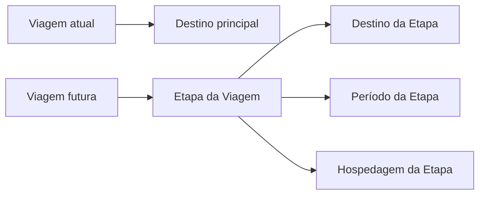

---

## 122. Colaboração

Evoluções possíveis:

* convites;
* comentários;
* decisões compartilhadas;
* aprovação;
* conflito de edição;
* histórico colaborativo.

---

## 123. Reservas

Reservas futuras devem ser conceitos próprios e podem se relacionar a:

* Lugar;
* Atividade;
* fornecedor;
* custo;
* confirmação;
* política.

Reserva não é atributo genérico de Lugar.

---

# Parte XXI — Anti-patterns

## 124. Entidade Deus

Não concentrar todos os conceitos dentro de Trip.

---

## 125. Shared Model excessivo

Não compartilhar entidades completas entre agregados ou módulos.

---

## 126. Persistência orientando o domínio

Não criar conceitos apenas porque existem tabelas ou objetos externos.

---

## 127. Primitivas sem significado

Evitar representar como valores simples:

* Money;
* Distance;
* Duration;
* Location;
* TimeZone;
* Restriction;
* RecommendationConfidence;
* TripPeriod.

---

## 128. Status genérico

Não utilizar um único status para dimensões distintas do Roteiro.

---

## 129. IA como autoridade

Não modelar saída de IA como Decisão final automática.

---

## 130. Diagrama como schema

Diagramas deste documento não devem ser utilizados diretamente para:

* gerar tabelas;
* inferir foreign keys;
* criar ORM;
* inferir endpoints;
* definir microservices;
* substituir decisões arquiteturais.

---

# Parte XXII — Matriz de entidades e agregados

## 131. Entidades principais

| Entidade          | Identidade          | Agregado           |
| ----------------- | ------------------- | ------------------ |
| Account           | AccountId           | Account            |
| User              | UserId              | Account            |
| Trip              | TripId              | Trip               |
| Accommodation     | AccommodationId     | Trip               |
| TripParticipant   | TripId + UserId     | Trip               |
| TravelerProfile   | TravelerProfileId   | Traveler Profile   |
| Traveler          | TravelerId          | Traveler Profile   |
| TripCollection    | TripCollectionId    | Trip Collection    |
| SavedPlace        | SavedPlaceId        | Trip Collection    |
| Place             | PlaceId             | Place              |
| Itinerary         | ItineraryId         | Itinerary          |
| TripDay           | TripDayId           | Itinerary          |
| Activity          | ActivityId          | Itinerary          |
| FreePeriod        | FreePeriodId        | Itinerary          |
| Recommendation    | RecommendationId    | Recommendation     |
| Decision          | DecisionId          | Decision           |
| ItineraryProposal | ItineraryProposalId | Proposal           |
| Conflict          | ConflictId          | Planning Assurance |
| DataSource        | DataSourceId        | Data Governance    |

---

## 132. Relação com superfícies

| Conceito          | Superfície                         |
| ----------------- | ---------------------------------- |
| Trip              | Minhas Viagens e Visão Geral       |
| Destination       | Criar Viagem e Configurações       |
| Accommodation     | Criar Viagem, Mapa e Configurações |
| Traveler          | Criar Viagem e Configurações       |
| Preference        | Configurações e personalização     |
| Place             | Explorar e Detalhes                |
| SavedPlace        | Salvos                             |
| Itinerary         | Roteiro                            |
| Activity          | Roteiro                            |
| FreePeriod        | Roteiro                            |
| TravelEstimate    | Mapa e Roteiro                     |
| Recommendation    | Explorar e Visão Geral             |
| Decision          | Histórico e analytics futuros      |
| ItineraryProposal | Proposta                           |
| Conflict          | Revisão                            |

---

# Parte XXIII — Critérios de aceite

## 133. Critérios do domínio estratégico

* Decision está modelada;
* Context está modelado;
* Recommendation está separada de Decision;
* Recommendation Confidence está modelada;
* Explainability está contemplada;
* Next Best Action está contemplada;
* Decision Quality está contemplada.

---

## 134. Critérios dos agregados

* Trip não concentra Traveler Profile;
* Trip não concentra Trip Collection;
* Itinerary possui TripDay;
* Recommendation é agregado;
* Decision é agregado;
* Conflict é agregado;
* ownership está explícito.

---

## 135. Critérios do Roteiro

* estados estão separados por dimensão;
* planejamento parcial é válido;
* Dia vazio e Dia livre são distintos;
* Período Livre protegido está representado;
* versão é explícita;
* concorrência pode ser controlada.

---

## 136. Critérios de dados e IA

* Proveniência está modelada;
* confiança do dado e da Recomendação são distintas;
* atualidade está modelada;
* IA não produz fato canônico automaticamente;
* decisões do Usuário são rastreáveis.

---

## 137. Critérios dos diagramas

* todos possuem identificador no catálogo;
* sintaxe Mermaid é compatível com GitHub;
* blocos Mermaid não possuem atributos adicionais;
* estereótipos estão padronizados;
* diagramas não contradizem o texto;
* diagramas não definem implementação;
* títulos Markdown não são duplicados dentro do mesmo nível documental.

---

# Parte XXIV — Governança

## 138. Inclusão de conceito

Um novo conceito deve:

* resolver necessidade real;
* possuir definição;
* não duplicar conceito;
* possuir responsabilidade;
* possuir invariantes;
* estar relacionado à linguagem ubíqua;
* atualizar diagramas afetados.

---

## 139. Alteração de conceito

Uma alteração deve revisar:

* Bible;
* PRD;
* UX;
* Design System;
* Linguagem Ubíqua;
* Regras;
* Eventos;
* Arquitetura;
* Dados;
* testes;
* prompts;
* analytics;
* diagramas.

---

## 140. Uso por agentes de IA

Agentes devem:

* consultar este documento;
* utilizar termos oficiais;
* respeitar agregados;
* preservar ownership;
* não converter diagramas em schema físico;
* não confundir Recomendação com Decisão;
* não confundir Salvo com Planejado;
* identificar lacunas;
* atualizar rastreabilidade.

---

## 141. Checklist de revisão

Antes de aprovar:

* domínio estratégico está definido;
* domínio operacional está definido;
* entidades possuem identidade;
* objetos de valor estão definidos;
* agregados estão separados;
* ownership está definido;
* estados estão definidos;
* invariantes estão definidas;
* serviços estão definidos;
* eventos estão definidos;
* comandos estão definidos;
* Recomendações estão modeladas;
* Decisões estão modeladas;
* Propostas estão modeladas;
* Conflitos estão modelados;
* Proveniência está modelada;
* privacidade está contemplada;
* extensibilidade está contemplada;
* todos os diagramas estão válidos;
* catálogo está completo;
* títulos Markdown são únicos no escopo exigido pelo linter;
* não existem contradições com a Bible.

---

## 142. Declaração final

O Modelo de Domínio do RouteBook estabelece a representação conceitual oficial do produto.

Ele define como o RouteBook compreende:

* Journey;
* Context;
* Decision;
* Recommendation;
* Next Best Action;
* Decision Quality;
* Explainability;
* Contas;
* Usuários;
* Viagens;
* Destinos;
* Hospedagens;
* Viajantes;
* Preferências;
* Lugares;
* Lugares Salvos;
* Roteiros;
* Dias;
* Atividades;
* Períodos Livres;
* Deslocamentos;
* Propostas;
* Conflitos;
* Fontes de Dados;
* Proveniência.

O RouteBook deverá permanecer um sistema de apoio à decisão.

Seu domínio não deverá transformar:

* Recomendação em Decisão;
* Decisão em execução automática;
* estimativa em garantia;
* Salvo em Planejado;
* Proposta em Roteiro;
* confiança em certeza;
* IA em autoridade;
* diagrama conceitual em implementação automática.
