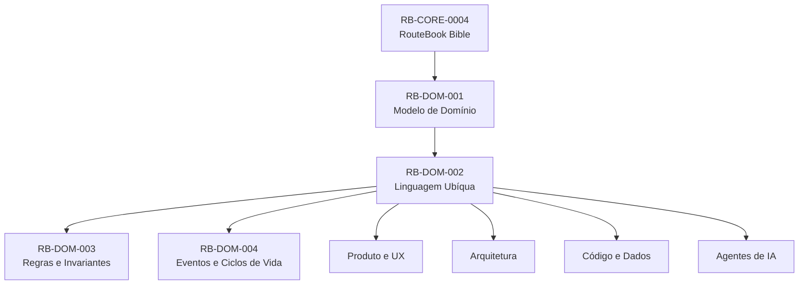
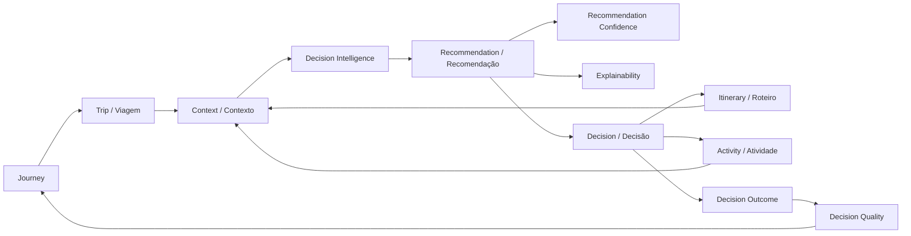
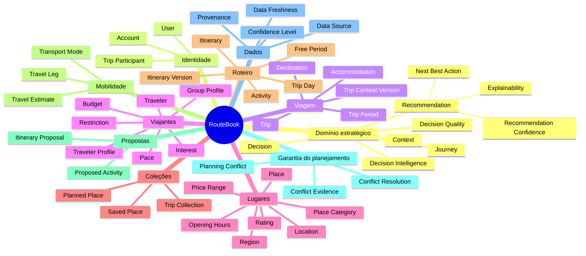
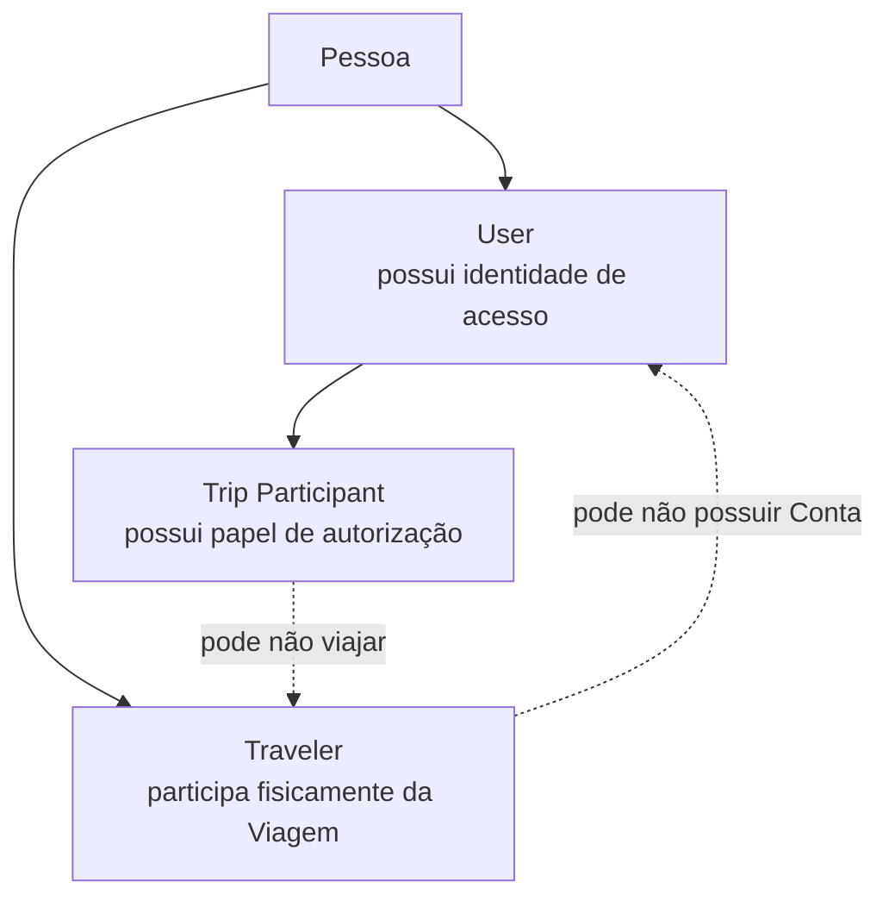
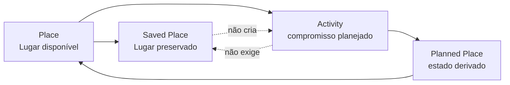
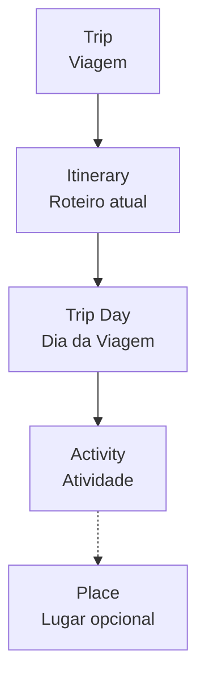
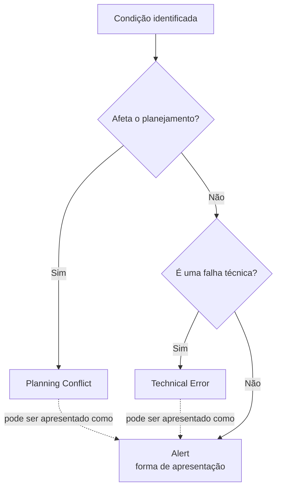
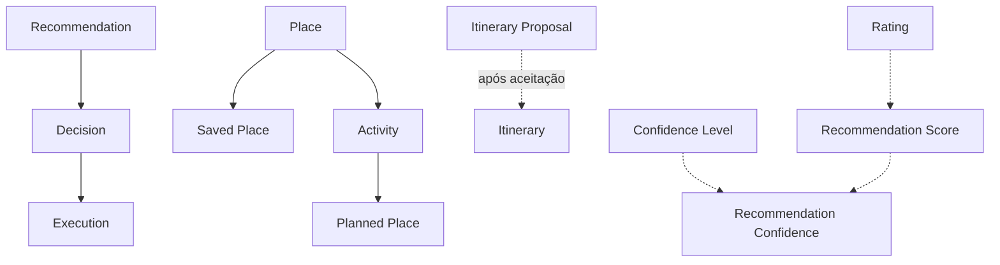

---

id: RB-DOM-002

title: Linguagem Ubíqua e Glossário de Domínio
description: Define o vocabulário oficial do RouteBook, as relações semânticas entre os conceitos, as regras de nomenclatura, os termos permitidos, os termos ambíguos e as convenções linguísticas utilizadas por produto, domínio, arquitetura, código, dados e agentes de IA.

document_type: domain
owner: Domain

status: Draft
version: "0.2.0"

created: "2026-07-18"
last_updated: "2026-07-18"

authors:

- RouteBook Team

tags:

- domain
- ubiquitous-language
- glossary
- terminology
- semantics
- naming
- ddd
- decision-intelligence
- diagrams
- mermaid
- ai-first
- travel-planning

related_documents:

- RB-CORE-0001
- RB-CORE-0002
- RB-CORE-0003
- RB-CORE-0004
- RB-PRD-001
- RB-PRD-002
- RB-PRD-003
- RB-PRD-004
- RB-PRD-005
- RB-PRD-006
- RB-PRD-007
- RB-PRD-008
- RB-UX-001
- RB-UX-002
- RB-UX-003
- RB-UX-004
- RB-UX-005
- RB-UX-006
- RB-DS-001
- RB-DS-002
- RB-DS-003
- RB-DS-004
- RB-DOM-001
- RB-DOM-003
- RB-DOM-004
- RB-ARC-001
- RB-ARC-002

prerequisites:

- RB-CORE-0004
- RB-DOM-001

next_documents:

- RB-DOM-003
- RB-DOM-004
- RB-ARC-001
- RB-ARC-002
- RB-DATA-001
- RB-QA-001

ai_context:
priority: critical
index: true
---

# RouteBook — Linguagem Ubíqua e Glossário de Domínio

## Parte I — Fundamentos da linguagem

### 1. Propósito deste documento

Este documento define a Linguagem Ubíqua oficial do RouteBook.

Seu objetivo é garantir que os mesmos conceitos sejam compreendidos e utilizados de forma consistente por:

* produto;
* domínio;
* design;
* experiência do usuário;
* arquitetura;
* engenharia;
* qualidade;
* dados;
* analytics;
* integrações;
* documentação;
* agentes de IA;
* automações;
* suporte futuro.

A Linguagem Ubíqua deverá reduzir:

* ambiguidades;
* sinônimos conflitantes;
* nomes genéricos;
* duplicação conceitual;
* divergências entre produto e implementação;
* traduções inconsistentes;
* interpretações incorretas por agentes de IA;
* acoplamento entre conceitos de domínio e tecnologias.

Este documento estabelece:

* termos oficiais;
* definições normativas;
* termos equivalentes permitidos;
* termos proibidos ou desencorajados;
* distinções entre conceitos próximos;
* convenções em português e inglês;
* regras de pluralização;
* convenções para código;
* convenções para eventos;
* convenções para comandos;
* convenções para interface;
* mapas semânticos;
* árvore terminológica;
* critérios de governança.

---

### 2. Autoridade da Linguagem Ubíqua

A Linguagem Ubíqua deriva dos conceitos constitucionais definidos pela RouteBook Bible e do modelo formalizado no RB-DOM-001.

A precedência semântica deverá ser:



#### Interpretação da autoridade linguística

* A Bible estabelece os conceitos constitucionais.
* O Modelo de Domínio estabelece as estruturas conceituais.
* Este documento estabelece como os conceitos devem ser nomeados e compreendidos.
* Produto, UX, Arquitetura, Código, Dados e IA devem utilizar essa linguagem.
* Uma implementação não pode criar significado novo para um termo oficial sem alterar a documentação de domínio.

---

### 3. Definição de Linguagem Ubíqua

Linguagem Ubíqua é o vocabulário compartilhado utilizado para descrever o domínio do RouteBook.

Ela deve estar presente em:

* documentação;
* reuniões;
* requisitos;
* histórias;
* critérios de aceite;
* interface;
* código de domínio;
* APIs;
* eventos;
* comandos;
* banco de dados conceitual;
* analytics;
* logs de negócio;
* testes;
* prompts;
* respostas de IA.

A Linguagem Ubíqua não exige que toda interface seja exibida em inglês.

Ela exige que os mesmos significados sejam preservados entre as diferentes representações.

---

### 4. Princípios linguísticos

A linguagem oficial deverá seguir os seguintes princípios:

1. Um conceito relevante deve possuir um nome oficial.
2. Um nome oficial deve representar apenas um conceito principal.
3. Conceitos diferentes não devem compartilhar o mesmo nome.
4. Sinônimos devem ser controlados.
5. Termos genéricos devem ser evitados.
6. Termos técnicos não devem substituir conceitos do domínio.
7. Termos de fornecedores não devem se tornar linguagem canônica automaticamente.
8. Traduções devem preservar significado, não apenas literalidade.
9. Nomes devem ser consistentes entre documentos.
10. Eventos devem utilizar fatos ocorridos.
11. Comandos devem utilizar ações desejadas.
12. Estados devem representar condições observáveis.
13. Agregados devem possuir nomes estáveis.
14. Conceitos derivados devem ser identificados como derivados.
15. Estimativas devem ser distinguidas de fatos.
16. Sugestões devem ser distinguidas de decisões.
17. Decisões devem ser distinguidas de execuções.
18. Conceitos estratégicos não devem ser reduzidos a telas.
19. A linguagem deve favorecer explicabilidade.
20. Agentes de IA devem utilizar os termos oficiais.

---

## Parte II — Estrutura semântica

### 5. Domínio estratégico e domínio operacional

A linguagem do RouteBook está organizada em dois níveis.

#### Domínio estratégico

Explica como o RouteBook compreende apoio à tomada de decisão:

* Journey;
* Context;
* Decision;
* Recommendation;
* Decision Intelligence;
* Next Best Action;
* Decision Quality;
* Recommendation Confidence;
* Explainability.

#### Domínio operacional

Explica os objetos utilizados para sustentar as decisões:

* Account;
* User;
* Trip;
* Traveler Profile;
* Traveler;
* Destination;
* Accommodation;
* Place;
* Trip Collection;
* Saved Place;
* Itinerary;
* Trip Day;
* Activity;
* Free Period;
* Travel Leg;
* Travel Estimate;
* Itinerary Proposal;
* Planning Conflict;
* Data Source;
* Provenance.

---

### 6. Mapa semântico principal



#### Interpretação do mapa semântico

* Journey representa a experiência contínua.
* Trip representa o contexto operacional de uma viagem.
* Context representa as informações relevantes para uma decisão.
* Decision Intelligence produz apoio à decisão.
* Recommendation é uma sugestão.
* Decision pertence ao Usuário.
* Uma Decision pode alterar o Itinerary ou originar uma Activity.
* O resultado da decisão pode contribuir para Decision Quality.

---

### 7. Árvore terminológica



---

## Parte III — Convenções gerais de nomenclatura

### 8. Idioma canônico e idioma de apresentação

O RouteBook utiliza:

* português para documentação oficial do produto;
* inglês para nomes canônicos utilizados em código, contratos e diagramas técnicos;
* português localizado para interface voltada ao usuário brasileiro.

Cada conceito deverá possuir:

* nome canônico;
* termo oficial em português;
* definição única;
* equivalências permitidas;
* termos a evitar.

Exemplo:

| Nome canônico    | Português oficial        |
| ---------------- | ------------------------ |
| Trip             | Viagem                   |
| Itinerary        | Roteiro                  |
| Activity         | Atividade                |
| Recommendation   | Recomendação             |
| Decision         | Decisão                  |
| PlanningConflict | Conflito de Planejamento |

---

### 9. Convenção para documentação

Na documentação em português:

* usar o termo oficial em português no texto corrente;
* utilizar o nome canônico em inglês quando necessário para desambiguação;
* apresentar o nome canônico entre crases;
* evitar alternar idiomas sem necessidade.

Exemplo recomendado:

> A Viagem (`Trip`) estabelece o principal contexto operacional.

Exemplo desencorajado:

> A Trip possui um itinerary com várias atividades.

---

### 10. Convenção para código

Nomes de domínio no código devem utilizar inglês.

#### Classes e tipos

Usar `PascalCase`:

```text
Trip
TravelerProfile
TripCollection
SavedPlace
ItineraryProposal
PlanningConflict
RecommendationConfidence
```

#### Métodos e propriedades

Usar `camelCase`:

```text
tripId
placeId
addActivity
recordDecision
invalidateRecommendation
```

#### Constantes e códigos

Usar o padrão definido pela linguagem de implementação, preservando o termo oficial.

Exemplo:

```text
PLANNING_CONFLICT_DETECTED
```

---

### 11. Convenção para comandos

Comandos representam intenções.

Devem utilizar verbo no imperativo conceitual ou forma verbal de ação.

Exemplos:

```text
CreateTrip
UpdateTripPeriod
SavePlace
AddActivity
RequestRecommendation
RecordDecision
ResolvePlanningConflict
```

Evitar:

```text
TripCreation
DoRecommendation
ProcessConflict
HandleData
```

---

### 12. Convenção para eventos

Eventos representam fatos ocorridos.

Devem utilizar verbo no passado.

Exemplos:

```text
TripCreated
TripPeriodChanged
PlaceSaved
ActivityAdded
RecommendationGenerated
DecisionRecorded
PlanningConflictDetected
```

Eventos não devem utilizar linguagem de intenção.

Exemplo incorreto:

```text
CreateTrip
```

Exemplo correto:

```text
TripCreated
```

---

### 13. Convenção para estados

Estados devem representar condições observáveis.

Exemplos:

```text
planned
cancelled
expired
outdated
resolved
invalidated
```

Estados não devem representar ações:

```text
create
resolve
validate
```

---

### 14. Convenção para identificadores

Todo identificador conceitual deve utilizar o nome canônico completo da entidade seguido do sufixo `Id`.

Exemplos:

```text
TripId
TravelerId
PlaceId
ActivityId
DecisionId
RecommendationId
ItineraryProposalId
PlanningConflictId
```

Essa convenção se aplica a:

* tipos de domínio;
* contratos conceituais;
* diagramas;
* modelos de dados;
* eventos;
* comandos;
* documentação técnica;
* implementações.

Nomes genéricos que omitam parte relevante do conceito não devem ser introduzidos como tipos canônicos.

Exemplos a evitar:

```text
ProposalId
ConflictId
ProfileId
ItemId
```

Quando o contexto da referência estiver inequivocamente definido, propriedades, parâmetros locais e placeholders de rota podem utilizar formas abreviadas.

Exemplos permitidos:

```text
proposalId
conflictId
recommendationId
activityId
```

Nesses casos, a forma abreviada representa o tipo canônico correspondente:

| Referência contextual | Tipo canônico         |
| --------------------- | --------------------- |
| `proposalId`          | `ItineraryProposalId` |
| `conflictId`          | `PlanningConflictId`  |
| `recommendationId`    | `RecommendationId`    |
| `activityId`          | `ActivityId`          |

Exemplos válidos em rotas HTTP:

```text
POST /trips/{tripId}/itinerary/proposals/{proposalId}/accept
POST /trips/{tripId}/conflicts/{conflictId}/ignore
POST /trips/{tripId}/activities/{activityId}/move
```

A forma contextual abreviada:

* não cria um novo conceito;
* não altera o tipo canônico;
* não deve ser utilizada quando houver ambiguidade;
* não deve substituir o nome completo em definições de domínio;
* deve permanecer consistente dentro do mesmo contrato ou superfície.

Quando o contexto não for suficiente para eliminar ambiguidade, deve-se utilizar o nome completo.

Exemplos:

```text
itineraryProposalId
planningConflictId
```

---

### 15. Convenção para pluralização

No código e em contratos:

* entidades singulares representam uma instância;
* coleções utilizam plural regular;
* nomes de agregados permanecem no singular.

Exemplos:

```text
Trip
trips

Activity
activities

PlanningConflict
planningConflicts
```

Evitar pluralizações artificiais como:

```text
activityList
conflictArray
placeItems
```

quando o significado é apenas uma coleção do conceito oficial.

---

## Parte IV — Glossário estratégico

### 16. Journey

| Campo             | Definição                                                                                      |
| ----------------- | ---------------------------------------------------------------------------------------------- |
| Nome canônico     | Journey                                                                                        |
| Português oficial | Jornada                                                                                        |
| Categoria         | Conceito estratégico                                                                           |
| Definição         | Experiência contínua do Usuário ao descobrir, planejar, executar, adaptar e revisar uma Viagem |
| Não significa     | Tela, sessão, funil isolado ou Roteiro                                                         |
| Relaciona-se com  | Trip, Context, Decision Quality                                                                |
| Termos permitidos | Jornada do Usuário, Jornada de Viagem                                                          |
| Termos a evitar   | Fluxo de telas, processo de compra, viagem                                                     |

#### Regra de uso de Journey

Usar `Journey` quando o conceito ultrapassar os limites de uma única Viagem, sessão ou decisão.

Não usar `Journey` como sinônimo direto de `Trip`.

---

### 17. Context

| Campo             | Definição                                                                  |
| ----------------- | -------------------------------------------------------------------------- |
| Nome canônico     | Context                                                                    |
| Português oficial | Contexto                                                                   |
| Categoria         | Conceito estratégico                                                       |
| Definição         | Conjunto de informações relevantes para uma Decisão em determinado momento |
| Não significa     | Objeto técnico genérico, request context ou container                      |
| Relaciona-se com  | Decision, Recommendation, Trip, Itinerary                                  |
| Termos permitidos | Contexto de Decisão                                                        |
| Termos a evitar   | Dados, payload, informações gerais                                         |

#### Regra de uso de Context

`Context` deve representar informações semanticamente relevantes.

Não deve ser utilizado como nome genérico para qualquer estrutura de dados.

---

### 18. Decision

| Campo             | Definição                                              |
| ----------------- | ------------------------------------------------------ |
| Nome canônico     | Decision                                               |
| Português oficial | Decisão                                                |
| Categoria         | Entidade estratégica                                   |
| Definição         | Escolha realizada pelo Usuário em determinado Contexto |
| Não significa     | Recomendação, clique, execução ou resultado            |
| Relaciona-se com  | Context, Recommendation, Decision Outcome              |
| Termos permitidos | Escolha, quando usada na interface                     |
| Termos a evitar   | Ação, resposta, aceite automático                      |

#### Regra de uso de Decision

Uma Decisão:

* pertence ao Usuário;
* pode existir sem Recomendação;
* pode resultar em execução;
* pode ser registrada;
* pode produzir um resultado posterior.

---

### 19. Recommendation

| Campo             | Definição                                             |
| ----------------- | ----------------------------------------------------- |
| Nome canônico     | Recommendation                                        |
| Português oficial | Recomendação                                          |
| Categoria         | Agregado estratégico                                  |
| Definição         | Sugestão contextual produzida para apoiar uma Decisão |
| Não significa     | Decisão, comando, obrigação ou alteração aplicada     |
| Relaciona-se com  | Context, Decision, Explainability                     |
| Termos permitidos | Sugestão, quando apropriado na interface              |
| Termos a evitar   | Resposta certa, melhor escolha garantida              |

#### Regra de uso de Recommendation

Toda Recomendação personalizada deve possuir:

* Contexto;
* Justificativa;
* validade;
* limitações relevantes;
* confiança quando aplicável.

---

### 20. Decision Intelligence

| Campo             | Definição                                                                      |
| ----------------- | ------------------------------------------------------------------------------ |
| Nome canônico     | Decision Intelligence                                                          |
| Português oficial | Inteligência de Decisão                                                        |
| Categoria         | Capacidade de domínio                                                          |
| Definição         | Capacidade de transformar Contexto, dados, regras e modelos em apoio à decisão |
| Não significa     | Modelo de IA específico ou serviço isolado                                     |
| Relaciona-se com  | Recommendation, Context, Explainability                                        |
| Termos permitidos | Motor de decisão, apenas em contexto técnico limitado                          |
| Termos a evitar   | IA do RouteBook, algoritmo mágico                                              |

---

### 21. Next Best Action

| Campo             | Definição                                                          |
| ----------------- | ------------------------------------------------------------------ |
| Nome canônico     | Next Best Action                                                   |
| Português oficial | Próxima Melhor Ação                                                |
| Categoria         | Especialização de Recommendation                                   |
| Definição         | Ação sugerida como próxima alternativa relevante no Contexto atual |
| Não significa     | Próxima ação obrigatória                                           |
| Relaciona-se com  | Recommendation, Decision                                           |
| Termos permitidos | Próxima ação sugerida                                              |
| Termos a evitar   | Próxima ação, ordem, execução automática                           |

---

### 22. Recommendation Confidence

| Campo             | Definição                                                         |
| ----------------- | ----------------------------------------------------------------- |
| Nome canônico     | Recommendation Confidence                                         |
| Português oficial | Confiança da Recomendação                                         |
| Categoria         | Objeto de valor estratégico                                       |
| Definição         | Nível de confiança de que uma Recomendação é adequada ao Contexto |
| Não significa     | Certeza, score, avaliação ou confiança de uma Fonte               |
| Relaciona-se com  | Recommendation, Evidence, Data Freshness                          |
| Termos permitidos | Nível de confiança da Recomendação                                |
| Termos a evitar   | Probabilidade de acerto, garantia                                 |

---

### 23. Decision Quality

| Campo             | Definição                                                                             |
| ----------------- | ------------------------------------------------------------------------------------- |
| Nome canônico     | Decision Quality                                                                      |
| Português oficial | Qualidade da Decisão                                                                  |
| Categoria         | Conceito estratégico derivado                                                         |
| Definição         | Qualidade observada ou estimada de uma Decisão em relação aos objetivos e ao Contexto |
| Não significa     | Nota do Usuário ou julgamento moral                                                   |
| Relaciona-se com  | Decision, Decision Outcome, Journey                                                   |
| Termos permitidos | Qualidade do resultado, quando contextualizado                                        |
| Termos a evitar   | Acerto do Usuário, decisão boa ou ruim de forma absoluta                              |

---

### 24. Explainability

| Campo             | Definição                                                                                 |
| ----------------- | ----------------------------------------------------------------------------------------- |
| Nome canônico     | Explainability                                                                            |
| Português oficial | Explicabilidade                                                                           |
| Categoria         | Capacidade estratégica                                                                    |
| Definição         | Capacidade de comunicar fatores compreensíveis que sustentam uma Recomendação ou Proposta |
| Não significa     | Exposição completa do modelo ou prompt                                                    |
| Relaciona-se com  | Recommendation Reason, Evidence, Provenance                                               |
| Termos permitidos | Explicação da Recomendação                                                                |
| Termos a evitar   | Transparência total do algoritmo                                                          |

---

## Parte V — Glossário de identidade e acesso

### 25. Account

| Campo             | Definição                                                    |
| ----------------- | ------------------------------------------------------------ |
| Nome canônico     | Account                                                      |
| Português oficial | Conta                                                        |
| Categoria         | Agregado                                                     |
| Definição         | Contexto de identidade, propriedade, acesso e consentimentos |
| Não significa     | Usuário                                                      |
| Relaciona-se com  | User                                                         |
| Termos a evitar   | Perfil, cadastro                                             |

---

### 26. User

| Campo             | Definição                                   |
| ----------------- | ------------------------------------------- |
| Nome canônico     | User                                        |
| Português oficial | Usuário                                     |
| Categoria         | Entidade                                    |
| Definição         | Pessoa identificada que utiliza o RouteBook |
| Não significa     | Viajante                                    |
| Relaciona-se com  | Account, Trip Participant, Decision         |
| Termos permitidos | Pessoa usuária                              |
| Termos a evitar   | Cliente, viajante                           |

---

### 27. Trip Participant

| Campo             | Definição                                                            |
| ----------------- | -------------------------------------------------------------------- |
| Nome canônico     | Trip Participant                                                     |
| Português oficial | Participante da Viagem                                               |
| Categoria         | Entidade contextual                                                  |
| Definição         | Relação entre um Usuário e uma Viagem, incluindo seu papel de acesso |
| Não significa     | Traveler                                                             |
| Relaciona-se com  | User, Trip                                                           |
| Termos permitidos | Colaborador da Viagem                                                |
| Termos a evitar   | Viajante, membro do grupo                                            |

---

### 28. Trip Role

| Campo             | Definição                                         |
| ----------------- | ------------------------------------------------- |
| Nome canônico     | Trip Role                                         |
| Português oficial | Papel na Viagem                                   |
| Categoria         | Objeto de valor                                   |
| Definição         | Nível de autorização de um Participante da Viagem |
| Valores iniciais  | owner, editor, viewer                             |
| Não significa     | Papel do Viajante no grupo                        |

---

## Parte VI — Glossário da Viagem

### 29. Trip

| Campo             | Definição                                                |
| ----------------- | -------------------------------------------------------- |
| Nome canônico     | Trip                                                     |
| Português oficial | Viagem                                                   |
| Categoria         | Agregado                                                 |
| Definição         | Principal contexto operacional de planejamento e decisão |
| Não significa     | Journey ou Itinerary                                     |
| Relaciona-se com  | Destination, Trip Period, Accommodation                  |
| Termos permitidos | Viagem                                                   |
| Termos a evitar   | Jornada, roteiro                                         |

---

### 30. Destination

| Campo             | Definição                                      |
| ----------------- | ---------------------------------------------- |
| Nome canônico     | Destination                                    |
| Português oficial | Destino                                        |
| Categoria         | Objeto de valor                                |
| Definição         | Região geográfica principal associada à Viagem |
| Não significa     | Lugar ou destino de um deslocamento            |
| Relaciona-se com  | Trip, Region, Location                         |
| Termos permitidos | Destino da Viagem                              |
| Termos a evitar   | Local, ponto, endereço                         |

---

### 31. Trip Period

| Campo             | Definição                                                         |
| ----------------- | ----------------------------------------------------------------- |
| Nome canônico     | Trip Period                                                       |
| Português oficial | Período da Viagem                                                 |
| Categoria         | Objeto de valor                                                   |
| Definição         | Intervalo inclusivo entre a data inicial e a data final da Viagem |
| Não significa     | Duração técnica ou período de uma Atividade                       |
| Relaciona-se com  | Trip, Trip Day                                                    |
| Termos permitidos | Datas da Viagem                                                   |
| Termos a evitar   | Agenda, janela                                                    |

---

### 32. Accommodation

| Campo             | Definição                                            |
| ----------------- | ---------------------------------------------------- |
| Nome canônico     | Accommodation                                        |
| Português oficial | Hospedagem                                           |
| Categoria         | Entidade                                             |
| Definição         | Referência de permanência utilizada durante a Viagem |
| Não significa     | Categoria de Place automaticamente                   |
| Relaciona-se com  | Trip, Location, Travel Estimate                      |
| Termos permitidos | Local de hospedagem                                  |
| Termos a evitar   | Hotel, quando o tipo não for conhecido               |

---

### 33. Trip Context Version

| Campo             | Definição                                                        |
| ----------------- | ---------------------------------------------------------------- |
| Nome canônico     | Trip Context Version                                             |
| Português oficial | Versão do Contexto da Viagem                                     |
| Categoria         | Objeto de valor                                                  |
| Definição         | Versão lógica incrementada após alterações estruturais da Viagem |
| Não significa     | Versão do documento ou da aplicação                              |
| Relaciona-se com  | Trip, Recommendation, Itinerary Proposal                         |
| Termos a evitar   | Version, revision genérica                                       |

---

### 34. Diferença entre Journey, Trip e Itinerary


| Conceito  | Pergunta respondida                            |
| --------- | ---------------------------------------------- |
| Journey   | Qual é a experiência completa do Usuário?      |
| Trip      | Qual viagem está sendo planejada ou realizada? |
| Itinerary | Como essa Viagem está organizada atualmente?   |
| Activity  | O que está planejado em determinado Dia?       |

---

## Parte VII — Glossário dos Viajantes

### 35. Traveler Profile

| Campo             | Definição                                                      |
| ----------------- | -------------------------------------------------------------- |
| Nome canônico     | Traveler Profile                                               |
| Português oficial | Perfil dos Viajantes                                           |
| Categoria         | Agregado                                                       |
| Definição         | Conjunto de Viajantes, Preferências e Restrições de uma Viagem |
| Não significa     | Perfil do Usuário                                              |
| Relaciona-se com  | Traveler, Group Profile                                        |
| Termos a evitar   | Perfil da Viagem, preferências do usuário                      |

---

### 36. Traveler

| Campo             | Definição                                             |
| ----------------- | ----------------------------------------------------- |
| Nome canônico     | Traveler                                              |
| Português oficial | Viajante                                              |
| Categoria         | Entidade                                              |
| Definição         | Pessoa participante da Viagem, possuindo ou não Conta |
| Não significa     | User ou Trip Participant                              |
| Relaciona-se com  | Traveler Profile                                      |
| Termos permitidos | Pessoa viajante                                       |
| Termos a evitar   | Usuário, passageiro                                   |

---

### 37. Group Profile

| Campo             | Definição                                         |
| ----------------- | ------------------------------------------------- |
| Nome canônico     | Group Profile                                     |
| Português oficial | Perfil do Grupo                                   |
| Categoria         | Conceito derivado                                 |
| Definição         | Resumo derivado das características dos Viajantes |
| Não significa     | Persona ou segmento de marketing                  |
| Relaciona-se com  | Traveler Profile, Recommendation                  |
| Termos a evitar   | Tipo de usuário                                   |

---

### 38. Interest

| Campo             | Definição                            |
| ----------------- | ------------------------------------ |
| Nome canônico     | Interest                             |
| Português oficial | Interesse                            |
| Categoria         | Objeto de valor                      |
| Definição         | Categoria de experiência desejada    |
| Não significa     | Restrição ou comportamento observado |
| Exemplos          | praias, gastronomia, cultura         |
| Termos a evitar   | Preferência obrigatória              |

---

### 39. Restriction

| Campo             | Definição                                          |
| ----------------- | -------------------------------------------------- |
| Nome canônico     | Restriction                                        |
| Português oficial | Restrição                                          |
| Categoria         | Objeto de valor                                    |
| Definição         | Condição que limita, impede ou condiciona decisões |
| Não significa     | Interesse negativo                                 |
| Severidades       | preference, important, mandatory                   |
| Termos a evitar   | Regra, bloqueio genérico                           |

---

### 40. Budget

| Campo             | Definição                                       |
| ----------------- | ----------------------------------------------- |
| Nome canônico     | Budget                                          |
| Português oficial | Orçamento                                       |
| Categoria         | Objeto de valor                                 |
| Definição         | Referência financeira utilizada no planejamento |
| Não significa     | Despesa real ou limite confirmado               |
| Relaciona-se com  | Recommendation, Planning Conflict               |
| Termos a evitar   | Saldo, dinheiro disponível                      |

---

### 41. Pace

| Campo             | Definição                                |
| ----------------- | ---------------------------------------- |
| Nome canônico     | Pace                                     |
| Português oficial | Ritmo                                    |
| Categoria         | Objeto de valor                          |
| Definição         | Intensidade desejada para o planejamento |
| Valores iniciais  | relaxed, balanced, intense, custom       |
| Não significa     | Velocidade de deslocamento               |
| Termos a evitar   | Perfil, intensidade genérica             |

---

### 42. Diferença entre User, Trip Participant e Traveler



| Conceito         | Possui acesso? | Participa da viagem? |
| ---------------- | -------------: | -------------------: |
| User             |            Sim |             Opcional |
| Trip Participant |            Sim |             Opcional |
| Traveler         |       Opcional |                  Sim |

---

## Parte VIII — Glossário geográfico e de Lugares

### 43. Region

| Campo             | Definição                                                     |
| ----------------- | ------------------------------------------------------------- |
| Nome canônico     | Region                                                        |
| Português oficial | Região                                                        |
| Categoria         | Objeto de valor                                               |
| Definição         | Área geográfica usada para busca, agrupamento ou recomendação |
| Não significa     | Destination obrigatoriamente                                  |
| Relaciona-se com  | Destination, Place                                            |
| Termos a evitar   | Zona, localidade sem definição                                |

---

### 44. Location

| Campo             | Definição                                                         |
| ----------------- | ----------------------------------------------------------------- |
| Nome canônico     | Location                                                          |
| Português oficial | Localização                                                       |
| Categoria         | Objeto de valor                                                   |
| Definição         | Referência geográfica composta por coordenada e endereço opcional |
| Não significa     | Place                                                             |
| Relaciona-se com  | Place, Accommodation                                              |
| Termos a evitar   | Local, ponto                                                      |

---

### 45. Geo Coordinate

| Campo             | Definição                        |
| ----------------- | -------------------------------- |
| Nome canônico     | Geo Coordinate                   |
| Português oficial | Coordenada Geográfica            |
| Categoria         | Objeto de valor                  |
| Definição         | Par de latitude e longitude      |
| Não significa     | Endereço ou Localização completa |
| Termos permitidos | Coordenada                       |
| Termos a evitar   | Posição, ponto GPS               |

---

### 46. Address

| Campo             | Definição                                                        |
| ----------------- | ---------------------------------------------------------------- |
| Nome canônico     | Address                                                          |
| Português oficial | Endereço                                                         |
| Categoria         | Objeto de valor                                                  |
| Definição         | Representação textual e estruturada de uma referência geográfica |
| Não significa     | Coordenada                                                       |
| Relaciona-se com  | Location                                                         |
| Termos a evitar   | Localização completa                                             |

---

### 47. Place

| Campo             | Definição                                                           |
| ----------------- | ------------------------------------------------------------------- |
| Nome canônico     | Place                                                               |
| Português oficial | Lugar                                                               |
| Categoria         | Agregado                                                            |
| Definição         | Ponto de interesse potencialmente relevante para uma Viagem         |
| Não significa     | Activity, Destination ou Location                                   |
| Relaciona-se com  | Place Category, Location, Saved Place                               |
| Termos permitidos | Local, somente em textos informais de interface                     |
| Termos a evitar   | Atração, estabelecimento ou ponto turístico como sinônimo universal |

---

### 48. Place Category

| Campo             | Definição                           |
| ----------------- | ----------------------------------- |
| Nome canônico     | Place Category                      |
| Português oficial | Categoria de Lugar                  |
| Categoria         | Objeto de valor                     |
| Definição         | Classificação funcional de um Lugar |
| Não significa     | Tipo de Atividade                   |
| Exemplos          | beach, restaurant, bar, viewpoint   |
| Termos a evitar   | Tag, tipo de roteiro                |

---

### 49. Opening Hours

| Campo             | Definição                                                       |
| ----------------- | --------------------------------------------------------------- |
| Nome canônico     | Opening Hours                                                   |
| Português oficial | Horário de Funcionamento                                        |
| Categoria         | Objeto de valor                                                 |
| Definição         | Intervalos conhecidos ou estimados de funcionamento de um Lugar |
| Não significa     | Disponibilidade garantida                                       |
| Relaciona-se com  | Place, Provenance                                               |
| Termos a evitar   | Disponibilidade                                                 |

---

### 50. Price Range

| Campo             | Definição                                           |
| ----------------- | --------------------------------------------------- |
| Nome canônico     | Price Range                                         |
| Português oficial | Faixa de Preço                                      |
| Categoria         | Objeto de valor                                     |
| Definição         | Referência aproximada de custo associada a um Lugar |
| Não significa     | Preço confirmado                                    |
| Termos permitidos | Custo médio, quando explicitamente estimado         |
| Termos a evitar   | Preço                                               |

---

### 51. Rating

| Campo             | Definição                                 |
| ----------------- | ----------------------------------------- |
| Nome canônico     | Rating                                    |
| Português oficial | Avaliação                                 |
| Categoria         | Objeto de valor                           |
| Definição         | Avaliação externa ou agregada de um Lugar |
| Não significa     | Recommendation Score                      |
| Relaciona-se com  | Place, Data Source                        |
| Termos a evitar   | Qualidade, nota do RouteBook              |

---

## Parte IX — Glossário de coleções

### 52. Trip Collection

| Campo             | Definição                                                 |
| ----------------- | --------------------------------------------------------- |
| Nome canônico     | Trip Collection                                           |
| Português oficial | Coleção da Viagem                                         |
| Categoria         | Agregado                                                  |
| Definição         | Conjunto de Lugares preservados no contexto de uma Viagem |
| Não significa     | Itinerary                                                 |
| Relaciona-se com  | Saved Place, Trip                                         |
| Termos permitidos | Salvos, na interface                                      |
| Termos a evitar   | Favoritos, roteiro                                        |

---

### 53. Saved Place

| Campo             | Definição                                                               |
| ----------------- | ----------------------------------------------------------------------- |
| Nome canônico     | Saved Place                                                             |
| Português oficial | Lugar Salvo                                                             |
| Categoria         | Entidade                                                                |
| Definição         | Associação entre uma Viagem e um Lugar preservado para avaliação futura |
| Não significa     | Lugar Planejado                                                         |
| Relaciona-se com  | Trip Collection, Place                                                  |
| Termos permitidos | Salvo                                                                   |
| Termos a evitar   | Favorito, atividade                                                     |

---

### 54. Planned Place

| Campo             | Definição                                                   |
| ----------------- | ----------------------------------------------------------- |
| Nome canônico     | Planned Place                                               |
| Português oficial | Lugar Planejado                                             |
| Categoria         | Conceito derivado                                           |
| Definição         | Lugar associado a pelo menos uma Atividade ativa no Roteiro |
| Não significa     | Saved Place                                                 |
| Relaciona-se com  | Place, Activity                                             |
| Termos a evitar   | Estado persistido obrigatório                               |

---

### 55. Diferença entre Place, Saved Place e Planned Place



---

## Parte X — Glossário do Roteiro

### 56. Itinerary

| Campo             | Definição                            |
| ----------------- | ------------------------------------ |
| Nome canônico     | Itinerary                            |
| Português oficial | Roteiro                              |
| Categoria         | Agregado                             |
| Definição         | Planejamento atual da Viagem         |
| Não significa     | Trip ou Itinerary Proposal           |
| Relaciona-se com  | Trip Day, Activity, Free Period      |
| Termos permitidos | Planejamento, quando contextualizado |
| Termos a evitar   | Agenda, viagem                       |

---

### 57. Trip Day

| Campo             | Definição                                                       |
| ----------------- | --------------------------------------------------------------- |
| Nome canônico     | Trip Day                                                        |
| Português oficial | Dia da Viagem                                                   |
| Categoria         | Entidade                                                        |
| Definição         | Unidade temporal do Roteiro correspondente a uma data da Viagem |
| Não significa     | Dia genérico do calendário                                      |
| Relaciona-se com  | Itinerary, Activity                                             |
| Termos permitidos | Dia                                                             |
| Termos a evitar   | Etapa                                                           |

---

### 58. Activity

| Campo             | Definição                                        |
| ----------------- | ------------------------------------------------ |
| Nome canônico     | Activity                                         |
| Português oficial | Atividade                                        |
| Categoria         | Entidade                                         |
| Definição         | Compromisso planejado dentro de um Dia da Viagem |
| Não significa     | Place                                            |
| Relaciona-se com  | Trip Day, Place                                  |
| Termos permitidos | Compromisso, item do Roteiro                     |
| Termos a evitar   | Lugar, evento genérico                           |

---

### 59. Free Period

| Campo             | Definição                                            |
| ----------------- | ---------------------------------------------------- |
| Nome canônico     | Free Period                                          |
| Português oficial | Período Livre                                        |
| Categoria         | Entidade                                             |
| Definição         | Intervalo intencionalmente não ocupado por Atividade |
| Não significa     | Ausência acidental de planejamento                   |
| Relaciona-se com  | Trip Day                                             |
| Modos             | flexible, protected                                  |
| Termos a evitar   | Buraco, espaço vazio                                 |

---

### 60. Day Off

`Day Off` não é um conceito canônico independente no modelo atual.

Um Dia livre deve ser representado por:

* um Trip Day;
* uma decisão explícita de mantê-lo livre;
* um ou mais Free Periods quando necessário.

Na interface, “Dia livre” pode ser utilizado como rótulo.

---

### 61. Itinerary Version

| Campo             | Definição                                                       |
| ----------------- | --------------------------------------------------------------- |
| Nome canônico     | Itinerary Version                                               |
| Português oficial | Versão do Roteiro                                               |
| Categoria         | Objeto de valor                                                 |
| Definição         | Versão lógica incrementada após alterações canônicas no Roteiro |
| Não significa     | Versão do documento                                             |
| Relaciona-se com  | Itinerary Proposal, Recommendation                              |
| Termos a evitar   | Revision genérica                                               |

---

### 62. Planning Completeness

| Campo             | Definição                                                |
| ----------------- | -------------------------------------------------------- |
| Nome canônico     | Planning Completeness                                    |
| Português oficial | Completude do Planejamento                               |
| Categoria         | Estado derivado                                          |
| Definição         | Dimensão que representa quanto do Roteiro está planejado |
| Valores           | empty, partial, planned                                  |
| Não significa     | Qualidade ou validade do Roteiro                         |

---

### 63. Review State

| Campo             | Definição                            |
| ----------------- | ------------------------------------ |
| Nome canônico     | Review State                         |
| Português oficial | Estado de Revisão                    |
| Categoria         | Estado                               |
| Valores           | not-reviewed, under-review, reviewed |
| Não significa     | Estado de consistência               |

---

### 64. Consistency State

| Campo             | Definição              |
| ----------------- | ---------------------- |
| Nome canônico     | Consistency State      |
| Português oficial | Estado de Consistência |
| Categoria         | Estado                 |
| Valores           | current, outdated      |
| Não significa     | Presença de Conflitos  |

---

### 65. Conflict Summary

| Campo             | Definição                                                          |
| ----------------- | ------------------------------------------------------------------ |
| Nome canônico     | Conflict Summary                                                   |
| Português oficial | Resumo de Conflitos                                                |
| Categoria         | Estado derivado                                                    |
| Valores           | without-known-conflicts, with-suggestions, with-risks, with-errors |
| Não significa     | Planning Conflict individual                                       |

---

### 66. Diferença entre Trip, Itinerary, Trip Day e Activity



---

## Parte XI — Glossário de mobilidade

### 67. Travel Leg

| Campo             | Definição                                    |
| ----------------- | -------------------------------------------- |
| Nome canônico     | Travel Leg                                   |
| Português oficial | Trecho de Deslocamento                       |
| Categoria         | Conceito operacional                         |
| Definição         | Movimento entre duas referências geográficas |
| Não significa     | Rota completa ou viagem                      |
| Relaciona-se com  | Travel Estimate                              |
| Termos permitidos | Deslocamento, Trecho                         |
| Termos a evitar   | Viagem, caminho                              |

---

### 68. Transport Mode

| Campo             | Definição                                           |
| ----------------- | --------------------------------------------------- |
| Nome canônico     | Transport Mode                                      |
| Português oficial | Meio de Transporte                                  |
| Categoria         | Objeto de valor                                     |
| Definição         | Forma utilizada ou considerada para um Deslocamento |
| Exemplos          | walking, driving, boat                              |
| Não significa     | Veículo específico                                  |

---

### 69. Travel Estimate

| Campo             | Definição                                              |
| ----------------- | ------------------------------------------------------ |
| Nome canônico     | Travel Estimate                                        |
| Português oficial | Estimativa de Deslocamento                             |
| Categoria         | Objeto de valor                                        |
| Definição         | Estimativa de Distância e duração para um Deslocamento |
| Não significa     | Duração garantida                                      |
| Relaciona-se com  | Travel Leg, Provenance                                 |
| Termos permitidos | Tempo estimado, Distância estimada                     |
| Termos a evitar   | Tempo real, duração exata                              |

---

### 70. Distance

| Campo             | Definição                              |
| ----------------- | -------------------------------------- |
| Nome canônico     | Distance                               |
| Português oficial | Distância                              |
| Categoria         | Objeto de valor                        |
| Definição         | Medida espacial entre duas referências |
| Não significa     | Travel Time                            |
| Termos a evitar   | Duração                                |

---

### 71. Travel Time

| Campo             | Definição                           |
| ----------------- | ----------------------------------- |
| Nome canônico     | Travel Time                         |
| Português oficial | Tempo de Deslocamento               |
| Categoria         | Objeto de valor                     |
| Definição         | Duração estimada de um Deslocamento |
| Não significa     | Distance                            |
| Termos a evitar   | Distância, duração confirmada       |

---

## Parte XII — Glossário de Recomendações e Decisões

### 72. Decision Context Snapshot

| Campo             | Definição                                                                |
| ----------------- | ------------------------------------------------------------------------ |
| Nome canônico     | Decision Context Snapshot                                                |
| Português oficial | Snapshot do Contexto de Decisão                                          |
| Categoria         | Objeto de valor                                                          |
| Definição         | Registro imutável das informações relevantes utilizadas em uma avaliação |
| Não significa     | Estado atual permanente                                                  |
| Relaciona-se com  | Recommendation, Decision                                                 |
| Termos a evitar   | Context genérico                                                         |

---

### 73. Recommendation Reason

| Campo             | Definição                                         |
| ----------------- | ------------------------------------------------- |
| Nome canônico     | Recommendation Reason                             |
| Português oficial | Justificativa da Recomendação                     |
| Categoria         | Objeto de valor                                   |
| Definição         | Fator compreensível que sustenta uma Recomendação |
| Não significa     | Explicação completa do modelo                     |
| Relaciona-se com  | Evidence Reference                                |
| Termos permitidos | Motivo                                            |
| Termos a evitar   | Razão da IA                                       |

---

### 74. Recommendation Limitation

| Campo             | Definição                                                             |
| ----------------- | --------------------------------------------------------------------- |
| Nome canônico     | Recommendation Limitation                                             |
| Português oficial | Limitação da Recomendação                                             |
| Categoria         | Objeto de valor                                                       |
| Definição         | Condição que reduz a confiabilidade ou aplicabilidade da Recomendação |
| Não significa     | Planning Conflict obrigatoriamente                                    |
| Relaciona-se com  | Recommendation Confidence                                             |

---

### 75. Recommendation Score

| Campo             | Definição                                    |
| ----------------- | -------------------------------------------- |
| Nome canônico     | Recommendation Score                         |
| Português oficial | Score da Recomendação                        |
| Categoria         | Valor interno                                |
| Definição         | Valor utilizado para ordenação ou comparação |
| Não significa     | Recommendation Confidence ou Rating          |
| Termos a evitar   | Nota, confiança                              |

---

### 76. Decision Outcome

| Campo             | Definição                               |
| ----------------- | --------------------------------------- |
| Nome canônico     | Decision Outcome                        |
| Português oficial | Resultado da Decisão                    |
| Categoria         | Conceito derivado ou registro posterior |
| Definição         | Resultado observado após uma Decisão    |
| Não significa     | Decision                                |
| Relaciona-se com  | Decision Quality                        |

---

### 77. Diferença entre Recommendation, Decision e Execution


| Conceito         | Responsável principal |
| ---------------- | --------------------- |
| Recommendation   | RouteBook             |
| Decision         | Usuário               |
| Execution        | Sistema ou Usuário    |
| Decision Outcome | Observação posterior  |

---

## Parte XIII — Glossário de Propostas

### 78. Itinerary Proposal

| Campo             | Definição                                                   |
| ----------------- | ----------------------------------------------------------- |
| Nome canônico     | Itinerary Proposal                                          |
| Português oficial | Proposta de Roteiro                                         |
| Categoria         | Agregado                                                    |
| Definição         | Organização sugerida ainda não incorporada ao Roteiro atual |
| Não significa     | Itinerary                                                   |
| Relaciona-se com  | Proposed Activity, Itinerary Version                        |
| Termos permitidos | Proposta                                                    |
| Termos a evitar   | Novo Roteiro, Roteiro gerado                                |

---

### 79. Proposed Activity

| Campo             | Definição                                                    |
| ----------------- | ------------------------------------------------------------ |
| Nome canônico     | Proposed Activity                                            |
| Português oficial | Atividade Proposta                                           |
| Categoria         | Entidade interna da Proposta                                 |
| Definição         | Atividade existente apenas dentro de uma Proposta de Roteiro |
| Não significa     | Activity canônica                                            |
| Relaciona-se com  | Itinerary Proposal                                           |
| Termos a evitar   | Atividade planejada                                          |

---

### 80. Proposal Base Version

| Campo             | Definição                                           |
| ----------------- | --------------------------------------------------- |
| Nome canônico     | Proposal Base Version                               |
| Português oficial | Versão Base da Proposta                             |
| Categoria         | Objeto de valor                                     |
| Definição         | Versão do Roteiro utilizada para gerar uma Proposta |
| Não significa     | Versão da Proposta                                  |
| Relaciona-se com  | Itinerary Version                                   |

---

### 81. Aplicação de Proposta

Aplicação de Proposta é o processo de converter itens aceitos de uma Proposta em alterações canônicas do Roteiro.

Não significa substituir automaticamente todo o Roteiro.

---

## Parte XIV — Glossário de Garantia do Planejamento

### 82. Planning Assurance

| Campo             | Definição                                                                              |
| ----------------- | -------------------------------------------------------------------------------------- |
| Nome canônico     | Planning Assurance                                                                     |
| Português oficial | Garantia do Planejamento                                                               |
| Categoria         | Contexto delimitado                                                                    |
| Definição         | Área responsável por avaliar a consistência, a viabilidade e os riscos do planejamento |
| Não significa     | Garantia absoluta de sucesso                                                           |
| Relaciona-se com  | Planning Conflict                                                                      |
| Termos a evitar   | Validador, controle de qualidade genérico                                              |

---

### 83. Planning Conflict

| Campo             | Definição                                                      |
| ----------------- | -------------------------------------------------------------- |
| Nome canônico     | Planning Conflict                                              |
| Português oficial | Conflito de Planejamento                                       |
| Categoria         | Agregado                                                       |
| Definição         | Condição identificada que afeta ou pode afetar um planejamento |
| Não significa     | Erro técnico ou conflito de edição                             |
| Relaciona-se com  | Itinerary, Activity, Itinerary Proposal                        |
| Termos permitidos | Conflito, quando o contexto estiver claro                      |
| Termos a evitar   | Problema, alerta, erro genérico                                |

---

### 84. Conflict Severity

| Campo             | Definição               |
| ----------------- | ----------------------- |
| Nome canônico     | Conflict Severity       |
| Português oficial | Severidade do Conflito  |
| Categoria         | Objeto de valor         |
| Valores           | error, risk, suggestion |
| Não significa     | Status do Conflito      |

---

### 85. Conflict Evidence

| Campo             | Definição                                                            |
| ----------------- | -------------------------------------------------------------------- |
| Nome canônico     | Conflict Evidence                                                    |
| Português oficial | Evidência do Conflito                                                |
| Categoria         | Objeto de valor                                                      |
| Definição         | Informação que demonstra a existência de um Conflito de Planejamento |
| Não significa     | Regra do Conflito                                                    |
| Relaciona-se com  | Planning Conflict, Provenance                                        |

---

### 86. Conflict Resolution

| Campo             | Definição                                                    |
| ----------------- | ------------------------------------------------------------ |
| Nome canônico     | Conflict Resolution                                          |
| Português oficial | Resolução do Conflito                                        |
| Categoria         | Objeto de valor                                              |
| Definição         | Registro de como um Conflito deixou de afetar o planejamento |
| Não significa     | Ignorar Risco                                                |
| Relaciona-se com  | Planning Conflict                                            |

---

### 87. Ignore Risk

| Campo             | Definição                                                    |
| ----------------- | ------------------------------------------------------------ |
| Nome canônico     | Ignore Risk                                                  |
| Português oficial | Ignorar Risco                                                |
| Categoria         | Decisão autorizada                                           |
| Definição         | Decisão explícita de prosseguir apesar de um Risco conhecido |
| Não significa     | Resolver ou invalidar o Conflito                             |
| Relaciona-se com  | Decision, Planning Conflict                                  |

---

### 88. Diferença entre Error, Risk e Suggestion

| Severidade | Significado                                     | Pode ser ignorada? |
| ---------- | ----------------------------------------------- | -----------------: |
| error      | Condição que impede operação válida             |                Não |
| risk       | Condição que pode gerar consequência indesejada |   Quando permitido |
| suggestion | Oportunidade de melhoria não obrigatória        |                Sim |

---

### 89. Diferença entre Planning Conflict, Alert e Technical Error



`Alert` é uma forma de apresentação.

Não é necessariamente uma entidade de domínio.

---

## Parte XV — Glossário de dados e Proveniência

### 90. Data Source

| Campo             | Definição                              |
| ----------------- | -------------------------------------- |
| Nome canônico     | Data Source                            |
| Português oficial | Fonte de Dados                         |
| Categoria         | Agregado                               |
| Definição         | Origem identificável de uma informação |
| Não significa     | Provedor obrigatoriamente              |
| Relaciona-se com  | Provenance                             |
| Termos permitidos | Fonte                                  |
| Termos a evitar   | API, banco                             |

---

### 91. Provenance

| Campo             | Definição                                                                          |
| ----------------- | ---------------------------------------------------------------------------------- |
| Nome canônico     | Provenance                                                                         |
| Português oficial | Proveniência                                                                       |
| Categoria         | Objeto de valor                                                                    |
| Definição         | Metadados que explicam a origem, coleta, atualização e confiança de uma informação |
| Não significa     | Data Source isoladamente                                                           |
| Relaciona-se com  | Data Source, Confidence Level                                                      |
| Termos permitidos | Origem do dado                                                                     |
| Termos a evitar   | Fonte, quando os metadados completos forem relevantes                              |

---

### 92. Confidence Level

| Campo             | Definição                                         |
| ----------------- | ------------------------------------------------- |
| Nome canônico     | Confidence Level                                  |
| Português oficial | Nível de Confiança do Dado                        |
| Categoria         | Objeto de valor                                   |
| Definição         | Qualidade da evidência associada a uma informação |
| Não significa     | Recommendation Confidence                         |
| Valores           | confirmed, high, medium, low, unknown             |
| Termos a evitar   | Certeza                                           |

---

### 93. Data Freshness

| Campo             | Definição                                                        |
| ----------------- | ---------------------------------------------------------------- |
| Nome canônico     | Data Freshness                                                   |
| Português oficial | Atualidade do Dado                                               |
| Categoria         | Objeto de valor                                                  |
| Definição         | Estado de atualidade e aplicabilidade temporal de uma informação |
| Valores           | current, stale, unknown, conflicting, unavailable                |
| Não significa     | Data de atualização isolada                                      |

---

### 94. Inferred Data

| Campo             | Definição                                                       |
| ----------------- | --------------------------------------------------------------- |
| Nome canônico     | Inferred Data                                                   |
| Português oficial | Dado Inferido                                                   |
| Categoria         | Classificação de informação                                     |
| Definição         | Informação derivada de outras evidências sem confirmação direta |
| Não significa     | Fato confirmado                                                 |
| Relaciona-se com  | Provenance, Confidence Level                                    |
| Termos a evitar   | Dado conhecido                                                  |

---

### 95. AI-Generated Content

| Campo             | Definição                                                    |
| ----------------- | ------------------------------------------------------------ |
| Nome canônico     | AI-Generated Content                                         |
| Português oficial | Conteúdo Gerado por IA                                       |
| Categoria         | Classificação de informação                                  |
| Definição         | Conteúdo produzido total ou parcialmente por um modelo de IA |
| Não significa     | Dado factual confirmado                                      |
| Relaciona-se com  | Provenance, Explainability                                   |

---

### 96. Diferença entre Confidence Level, Recommendation Confidence e Score

| Conceito                  | Avalia                                |
| ------------------------- | ------------------------------------- |
| Confidence Level          | Qualidade da evidência de um dado     |
| Recommendation Confidence | Adequação da Recomendação ao Contexto |
| Recommendation Score      | Ordenação interna de uma Recomendação |
| Rating                    | Avaliação externa de um Lugar         |

Esses conceitos não devem compartilhar o mesmo campo ou nome genérico `score`.

---

## Parte XVI — Termos ambíguos e proibidos

### 97. Local

O termo `Local` é ambíguo.

Pode significar:

* Place;
* Location;
* Address;
* Destination;
* Region;
* Accommodation.

#### Regra

Não utilizar `Local` como nome canônico.

Na interface, pode ser usado quando o contexto for inequívoco.

---

### 98. Item

O termo `Item` é excessivamente genérico.

Não deve substituir:

* Activity;
* Saved Place;
* Recommendation;
* Proposed Activity;
* Planning Conflict.

---

### 99. Evento

O termo `Evento` pode significar:

* Domain Event;
* Activity;
* atração cultural;
* compromisso do calendário.

#### Regra

Sempre qualificar o conceito:

* Evento de Domínio;
* Atividade;
* Evento cultural;
* Evento de calendário.

---

### 100. Perfil

O termo `Perfil` deve ser qualificado.

Termos permitidos:

* User Profile, quando existir formalmente;
* Traveler Profile;
* Group Profile.

Não usar apenas `Profile` ou `Perfil` em contratos de domínio.

---

### 101. Preferência

`Preference` não deve ser utilizado como substituto genérico para:

* Interest;
* Restriction;
* Budget;
* Pace;
* Transport Mode.

Pode ser utilizado como categoria abrangente em textos explicativos.

---

### 102. Status

`Status` sem qualificação é proibido em modelos conceituais.

Utilizar:

* Trip Status;
* Activity Status;
* Recommendation Status;
* Proposal Status;
* Conflict Status;
* Data Freshness;
* Review State.

---

### 103. Score

`Score` sem qualificação é proibido.

Utilizar:

* Recommendation Score;
* Rating;
* Recommendation Confidence;
* Decision Quality.

---

### 104. Sugestão

Na interface, `Sugestão` pode representar uma Recommendation.

No domínio, utilizar `Recommendation`.

Não usar `Suggestion` como uma entidade paralela.

---

### 105. Roteiro sugerido

“Roteiro sugerido” pode ser utilizado na interface para representar uma `Itinerary Proposal`.

No domínio, utilizar exclusivamente `ItineraryProposal`.

---

### 106. Favorito

`Favorite` não é termo oficial do MVP.

Um Lugar preservado para uma Viagem é um `SavedPlace`.

Favoritos globais poderão ser modelados futuramente como conceito diferente.

---

### 107. Problema

`Problem` não é conceito oficial.

Utilizar:

* Planning Conflict;
* Technical Error;
* Validation Error;
* Data Issue;
* Limitation.

---

### 108. Inteligência Artificial

`Artificial Intelligence` descreve uma capacidade técnica.

Não deve substituir:

* Decision Intelligence;
* Recommendation;
* Explainability;
* Proposal Generation.

---

## Parte XVII — Matriz de distinções críticas

### 109. Distinções obrigatórias

| Conceito A          | Conceito B                | Diferença                                        |
| ------------------- | ------------------------- | ------------------------------------------------ |
| Journey             | Trip                      | Experiência contínua versus contexto operacional |
| Trip                | Itinerary                 | Viagem versus planejamento atual                 |
| User                | Traveler                  | Identidade de acesso versus pessoa viajante      |
| Trip Participant    | Traveler                  | Autorização versus participação física           |
| Destination         | Place                     | Região principal versus ponto de interesse       |
| Location            | Place                     | Referência geográfica versus objeto visitável    |
| Place               | Activity                  | Ponto de interesse versus compromisso planejado  |
| Saved Place         | Planned Place             | Preservado versus presente no Roteiro            |
| Activity            | Proposed Activity         | Estado canônico versus item de Proposta          |
| Itinerary           | Itinerary Proposal        | Planejamento atual versus alternativa sugerida   |
| Recommendation      | Decision                  | Sugestão do sistema versus escolha do Usuário    |
| Decision            | Execution                 | Escolha versus aplicação                         |
| Rating              | Recommendation Score      | Avaliação externa versus ranking interno         |
| Confidence Level    | Recommendation Confidence | Confiança do dado versus confiança da sugestão   |
| Planning Conflict   | Technical Error           | Problema de planejamento versus falha técnica    |
| Conflict Resolution | Ignore Risk               | Correção da condição versus aceitação consciente |
| Data Source         | Provenance                | Origem versus metadados completos da origem      |
| Estimate            | Confirmed Value           | Aproximação versus informação confirmada         |

---

### 110. Diagrama de distinções críticas



As linhas pontilhadas representam influência ou transformação possível, não equivalência.

---

## Parte XVIII — Vocabulário de estados

### 111. Estados de Trip

| Estado     | Significado                                  |
| ---------- | -------------------------------------------- |
| Draft      | Viagem ainda incompleta                      |
| Planned    | Viagem válida para planejamento futuro       |
| InProgress | Viagem em andamento                          |
| Completed  | Período encerrado                            |
| Cancelled  | Viagem cancelada explicitamente              |
| Archived   | Viagem removida das visualizações principais |

---

### 112. Estados de Activity

| Estado       | Significado                              |
| ------------ | ---------------------------------------- |
| planned      | Atividade planejada                      |
| tentative    | Atividade provisória                     |
| completed    | Atividade realizada                      |
| skipped      | Atividade não realizada                  |
| cancelled    | Atividade cancelada                      |
| unavailable  | Atividade atualmente inviável            |
| needs-review | Atividade que exige revisão              |
| removed      | Atividade removida do planejamento ativo |

---

### 113. Estados de Recommendation

| Estado      | Significado                             |
| ----------- | --------------------------------------- |
| generated   | Recomendação criada                     |
| presented   | Recomendação apresentada                |
| accepted    | Recomendação aceita                     |
| rejected    | Recomendação rejeitada                  |
| expired     | Validade encerrada                      |
| invalidated | Contexto tornou a Recomendação inválida |
| superseded  | Substituída por outra Recomendação      |

---

### 114. Estados de Itinerary Proposal

| Estado             | Significado                    |
| ------------------ | ------------------------------ |
| requested          | Geração solicitada             |
| generating         | Geração em andamento           |
| ready              | Pronta para revisão            |
| partially-accepted | Parte aplicada                 |
| accepted           | Integralmente aplicada         |
| rejected           | Rejeitada                      |
| expired            | Não pode mais ser aplicada     |
| failed             | Geração falhou                 |
| cancelled          | Processo cancelado             |
| superseded         | Substituída por outra Proposta |

---

### 115. Estados de Planning Conflict

| Estado      | Significado                            |
| ----------- | -------------------------------------- |
| open        | Condição permanece ativa               |
| resolved    | Condição foi corrigida                 |
| ignored     | Risco foi aceito conscientemente       |
| invalidated | Contexto tornou a avaliação inválida   |
| superseded  | Substituído por avaliação mais recente |

---

## Parte XIX — Vocabulário de comandos e eventos

### 116. Comandos oficiais iniciais

#### Identidade e Viagem

```text
CreateTrip
UpdateTripName
UpdateTripDestination
UpdateTripPeriod
UpdateAccommodation
AssignTripOwner
CancelTrip
ArchiveTrip
DeleteTrip
```

#### Viajantes

```text
AddTraveler
RemoveTraveler
UpdateTraveler
AddTripInterest
RemoveTripInterest
UpdateTripBudget
UpdateTripPace
AddTripRestriction
RemoveTripRestriction
```

#### Lugares e coleções

```text
CreateCustomPlace
SavePlace
UnsavePlace
MergePlaces
MarkPlaceUnavailable
```

#### Roteiro

```text
AddActivity
UpdateActivity
RemoveActivity
MoveActivity
MoveActivityToAnotherDay
AddFreePeriod
UpdateFreePeriod
RemoveFreePeriod
MarkTripDayFree
ApplyProposalItems
```

#### Recomendação e Decisão

```text
RequestRecommendation
AcceptRecommendation
RejectRecommendation
RecordDecision
RecordDecisionOutcome
```

#### Proposta

```text
RequestItineraryProposal
AcceptItineraryProposal
AcceptItineraryProposalPartially
RejectItineraryProposal
RegenerateItineraryProposal
```

#### Garantia do Planejamento

```text
ReviewItinerary
ResolvePlanningConflict
IgnorePlanningRisk
RestoreIgnoredPlanningRisk
```

---

### 117. Eventos oficiais iniciais

#### Viagem

```text
TripCreated
TripDestinationChanged
TripPeriodChanged
TripAccommodationChanged
TripCancelled
TripArchived
TripDeleted
```

#### Viajantes

```text
TravelerAdded
TravelerRemoved
GroupProfileUpdated
TripInterestAdded
TripInterestRemoved
TripBudgetChanged
TripPaceChanged
TripRestrictionAdded
TripRestrictionRemoved
```

#### Lugares e coleções

```text
PlaceCreated
PlaceDataUpdated
PlaceMerged
PlaceMarkedTemporarilyClosed
PlaceMarkedPermanentlyClosed
PlaceSaved
PlaceUnsaved
```

#### Roteiro

```text
ItineraryInitialized
TripDaysSynchronized
ActivityAdded
ActivityUpdated
ActivityRemoved
ActivityReordered
ActivityMovedToAnotherDay
FreePeriodAdded
FreePeriodUpdated
FreePeriodRemoved
ItineraryVersionChanged
ItineraryMarkedOutdated
```

#### Recomendação e Decisão

```text
RecommendationRequested
RecommendationGenerated
RecommendationPresented
RecommendationAccepted
RecommendationRejected
RecommendationInvalidated
DecisionRecorded
DecisionOutcomeRecorded
```

#### Proposta

```text
ItineraryProposalRequested
ItineraryProposalGenerated
ItineraryProposalAccepted
ItineraryProposalPartiallyAccepted
ItineraryProposalRejected
ItineraryProposalExpired
```

#### Garantia do Planejamento

```text
PlanningConflictDetected
PlanningConflictResolved
PlanningConflictIgnored
PlanningConflictInvalidated
PlanningConflictSuperseded
```

---

## Parte XX — Linguagem de interface

### 118. Princípios para a interface

A interface deverá:

* priorizar termos compreensíveis;
* preservar o significado oficial;
* evitar exposição desnecessária de termos técnicos;
* não alterar relações semânticas;
* indicar estimativas;
* comunicar limitações;
* distinguir sugestão de ação aplicada.

---

### 119. Mapeamento entre domínio e interface

| Domínio                   | Interface recomendada          |
| ------------------------- | ------------------------------ |
| Trip                      | Viagem                         |
| Traveler Profile          | Viajantes e preferências       |
| Trip Collection           | Salvos                         |
| Saved Place               | Lugar salvo                    |
| Itinerary                 | Roteiro                        |
| Trip Day                  | Dia                            |
| Activity                  | Atividade                      |
| Free Period               | Período livre                  |
| Recommendation            | Recomendação ou sugestão       |
| Recommendation Confidence | Confiança da recomendação      |
| Itinerary Proposal        | Proposta de roteiro            |
| Planning Conflict         | Conflito ou atenção necessária |
| Travel Estimate           | Tempo e distância estimados    |
| Provenance                | Fonte da informação            |

---

### 120. Termos que não devem ser exibidos diretamente

Os seguintes termos podem exigir tradução ou contextualização:

* aggregate root;
* bounded context;
* value object;
* Trip Context Version;
* Itinerary Version;
* Data Freshness;
* Provenance;
* Decision Context Snapshot;
* Planning Assurance.

Esses termos permanecem válidos internamente, mas não devem ser expostos sem necessidade.

---

## Parte XXI — Linguagem para agentes de IA

### 121. Regras obrigatórias para agentes

Agentes de IA devem:

* utilizar os termos oficiais;
* consultar o contexto antes de recomendar;
* distinguir Recomendação de Decisão;
* distinguir Proposta de Roteiro;
* distinguir Lugar Salvo de Lugar Planejado;
* distinguir estimativa de confirmação;
* preservar Proveniência;
* comunicar limitações;
* utilizar `PlanningConflict`;
* não criar novos sinônimos sem necessidade;
* não converter nomes de fornecedores em conceitos oficiais.

---

### 122. Vocabulário proibido para agentes

Agentes não devem afirmar:

* “essa é a melhor opção garantida”;
* “o usuário decidiu”, sem registro de Decisão;
* “o roteiro foi alterado”, quando existe apenas uma Proposta;
* “o local está aberto”, quando o estado é unknown;
* “é gratuito”, quando o preço é desconhecido;
* “não há conflitos”, quando a revisão não foi executada;
* “o dado é confirmado”, quando é inferido;
* “a IA escolheu por você”.

---

### 123. Respostas semanticamente corretas

Exemplo correto:

> Esta Recomendação considera a proximidade da Hospedagem e o Interesse do grupo por praias. O tempo de deslocamento é estimado e pode variar.

Exemplo incorreto:

> Esta é a melhor praia e fica exatamente a 12 minutos.

---

## Parte XXII — Governança da linguagem

### 124. Inclusão de novo termo

Um novo termo oficial deve:

* representar conceito relevante;
* possuir definição única;
* não duplicar termo existente;
* indicar categoria;
* indicar relações;
* indicar termos a evitar;
* possuir nome canônico;
* possuir tradução oficial;
* atualizar os diagramas afetados;
* atualizar documentos dependentes.

---

### 125. Alteração de termo

Uma alteração deve avaliar:

* quebra semântica;
* compatibilidade documental;
* impacto em código;
* impacto em contratos;
* impacto em dados;
* impacto em eventos;
* impacto em analytics;
* impacto em prompts;
* impacto em UX;
* necessidade de migração.

---

### 126. Depreciação de termo

Termos depreciados devem registrar:

* termo antigo;
* termo substituto;
* motivo;
* data;
* documentos afetados;
* estratégia de migração.

Exemplo futuro:

| Termo depreciado | Substituto       |
| ---------------- | ---------------- |
| Conflict         | PlanningConflict |
| FavoritePlace    | SavedPlace       |

---

### 127. Critérios para aceitação de sinônimo

Um sinônimo pode ser aceito quando:

* melhora compreensão na interface;
* não cria conceito paralelo;
* possui contexto inequívoco;
* é documentado;
* não é utilizado como nome canônico em código.

---

### 128. Revisão linguística obrigatória

Os seguintes artefatos devem ser revisados contra este documento:

* PRDs;
* fluxos UX;
* wireframes;
* Design System;
* ADRs;
* modelos de dados;
* APIs;
* eventos;
* comandos;
* testes;
* prompts;
* analytics;
* mensagens de erro;
* documentação de suporte.

---

## Parte XXIII — Critérios de aceite

### 129. Critérios de consistência semântica

* cada conceito possui definição única;
* termos estratégicos estão alinhados à Bible;
* termos operacionais estão alinhados ao RB-DOM-001;
* `PlanningConflict` está normalizado;
* Recommendation está separada de Decision;
* Decision está separada de Execution;
* Trip está separada de Journey;
* Trip está separada de Itinerary;
* User está separado de Traveler;
* Saved Place está separado de Planned Place;
* Itinerary Proposal está separada de Itinerary;
* Confidence Level está separado de Recommendation Confidence;
* Rating está separado de Recommendation Score.

---

### 130. Critérios de nomenclatura

* classes usam `PascalCase`;
* propriedades e métodos usam `camelCase`;
* eventos utilizam passado;
* comandos utilizam ação;
* estados representam condições;
* identificadores possuem sufixo `Id`;
* nomes genéricos são evitados;
* termos em inglês e português estão mapeados;
* traduções preservam significado.

---

### 131. Critérios dos diagramas

* cada diagrama possui título único;
* existe apenas um H1 no documento;
* Partes utilizam H2;
* seções numeradas utilizam H3;
* subseções utilizam H4;
* blocos Mermaid não possuem atributos extras;
* diagramas utilizam termos oficiais;
* diagramas não introduzem conceitos não definidos;
* relações pontilhadas não representam equivalência.

---

### 132. Critérios para agentes de IA

* agentes utilizam o glossário oficial;
* agentes não inventam estados;
* agentes não inventam sinônimos canônicos;
* agentes distinguem fato, estimativa e inferência;
* agentes distinguem Recomendação, Decisão e execução;
* agentes preservam autoria do Usuário;
* agentes comunicam limitações;
* agentes preservam Proveniência.

---

## Parte XXIV — Checklist de revisão

### 133. Checklist linguístico

Antes de aprovar este documento, verificar:

* propósito está definido;
* autoridade está definida;
* domínio estratégico está coberto;
* domínio operacional está coberto;
* termos canônicos estão definidos;
* traduções estão definidas;
* sinônimos permitidos estão definidos;
* termos a evitar estão definidos;
* conceitos próximos estão diferenciados;
* comandos estão normalizados;
* eventos estão normalizados;
* estados estão normalizados;
* termos de interface estão mapeados;
* regras para código estão definidas;
* regras para IA estão definidas;
* governança está definida;
* critérios de aceite estão definidos;
* diagramas estão válidos;
* títulos Markdown são únicos;
* frontmatter YAML é válido;
* não existem contradições com o RB-DOM-001.

---

## Parte XXV — Declaração final

### 134. Declaração normativa

A Linguagem Ubíqua do RouteBook estabelece o vocabulário oficial utilizado para compreender, discutir, documentar e implementar o produto.

Todos os artefatos do RouteBook deverão preservar as seguintes distinções:

* Journey não é Trip;
* Trip não é Itinerary;
* User não é Traveler;
* Trip Participant não é Traveler;
* Destination não é Place;
* Location não é Place;
* Place não é Activity;
* Saved Place não é Planned Place;
* Activity não é Proposed Activity;
* Recommendation não é Decision;
* Decision não é Execution;
* Itinerary Proposal não é Itinerary;
* Rating não é Recommendation Score;
* Confidence Level não é Recommendation Confidence;
* Planning Conflict não é Technical Error;
* Conflict Resolution não é Ignore Risk;
* Data Source não é Provenance;
* Estimate não é confirmação.

O RouteBook deverá utilizar sua linguagem para preservar:

* clareza;
* rastreabilidade;
* consistência;
* explicabilidade;
* autonomia do Usuário;
* qualidade das decisões;
* evolução segura do produto.

Novos documentos, funcionalidades, módulos, eventos, comandos e agentes de IA deverão utilizar este glossário como referência normativa.
