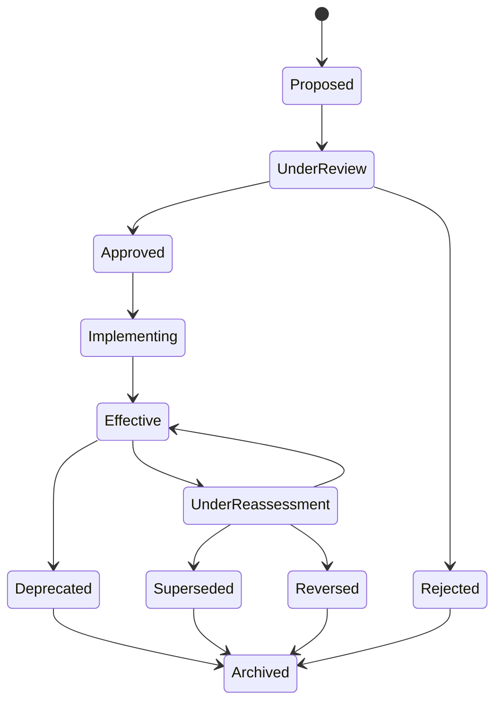
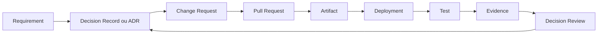

---

id: RB-GOV-002

title: Registros de Decisão, ADRs e Gestão de Mudanças
description: Define o sistema oficial do RouteBook para registrar decisões de governança, decisões arquiteturais e mudanças, incluindo classificação, aprovação, implementação, verificação, supersessão, reversão e rastreabilidade.

document_type: governance
owner: Governance

status: Draft
version: "0.1.0"

created: "2026-07-24"
last_updated: null

authors:

- RouteBook Team

tags:

- governance
- decision-records
- architecture-decision-records
- adr
- change-management
- change-control
- technical-governance
- architecture-governance
- decision-governance
- risk-management
- rollback
- traceability
- documentation
- artificial-intelligence
- diagrams
- mermaid

related_documents:

- RB-CORE-0001
- RB-CORE-0002
- RB-CORE-0003
- RB-CORE-0004
- RB-PRD-001
- RB-PRD-002
- RB-PRD-003
- RB-PRD-004
- RB-PRD-005
- RB-PRD-006
- RB-PRD-007
- RB-PRD-008
- RB-DOM-001
- RB-DOM-002
- RB-DOM-003
- RB-DOM-004
- RB-ARC-001
- RB-ARC-002
- RB-ARC-003
- RB-ARC-004
- RB-ARC-005
- RB-DATA-001
- RB-DATA-002
- RB-API-001
- RB-SEC-001
- RB-SEC-002
- RB-SEC-003
- RB-PRIV-001
- RB-PRIV-002
- RB-PRIV-003
- RB-OBS-001
- RB-QA-001
- RB-QA-002
- RB-OPS-001
- RB-OPS-002
- RB-SRE-001
- RB-AI-001
- RB-AI-002
- RB-AI-003
- RB-AI-004
- RB-AI-005
- RB-AI-006
- RB-COMP-001
- RB-GOV-001

prerequisites:

- RB-CORE-0004
- RB-DOM-001
- RB-DOM-002
- RB-DOM-003
- RB-DOM-004
- RB-ARC-001
- RB-ARC-002
- RB-ARC-003
- RB-ARC-004
- RB-ARC-005
- RB-GOV-001

next_documents:

- RB-COMP-002

ai_context:
priority: critical
index: true
---

# RouteBook — Registros de Decisão, ADRs e Gestão de Mudanças

## Parte I — Fundamentos

### 1. Propósito

Este documento define o sistema oficial do RouteBook para registrar e operar:

* decisões de governança;
* decisões arquiteturais;
* mudanças planejadas;
* mudanças emergenciais;
* revisões de decisões;
* supersessões;
* reversões;
* rollbacks;
* exceções relacionadas a mudanças;
* evidências de implementação.

Seu objetivo é transformar os princípios definidos no `RB-GOV-001` em procedimentos, estruturas documentais e critérios verificáveis.

O documento estabelece:

* quando uma decisão deve ser registrada;
* qual artefato deve ser utilizado;
* como decisões são identificadas;
* como ADRs são estruturados;
* como Change Requests são estruturados;
* quais estados são permitidos;
* quais aprovações são necessárias;
* como mudanças são vinculadas a decisões;
* como decisões são implementadas;
* como resultados são verificados;
* como decisões são substituídas;
* como reversões são registradas;
* como agentes de IA participam do processo;
* como a rastreabilidade deverá ser preservada.

---

### 2. Relação com o RB-GOV-001

O `RB-GOV-001 — Governança de Produto, Arquitetura e Decisões` define:

* princípios de governança;
* autoridade documental;
* classificação de decisões;
* níveis de impacto;
* papéis;
* governança por área;
* gestão de riscos;
* gestão de exceções;
* governança documental;
* governança de mudanças.

O `RB-GOV-002` especializa essas definições e determina como os registros deverão ser criados, revisados, aprovados, implementados e mantidos.

O `RB-GOV-002` não substitui o `RB-GOV-001`.

---

### 3. Problema que este documento resolve

Decisões relevantes podem se perder quando permanecem somente em:

* conversas;
* reuniões;
* issues;
* pull requests;
* mensagens;
* código;
* memória individual;
* respostas de agentes de IA.

Sem registros canônicos, o projeto pode perder:

* o problema original;
* as opções consideradas;
* as restrições;
* a justificativa;
* os riscos aceitos;
* os responsáveis;
* as consequências;
* a relação com mudanças posteriores.

Este documento estabelece uma memória decisória versionada e auditável.

---

### 4. Escopo

Este documento cobre decisões e mudanças relacionadas a:

* produto;
* domínio;
* arquitetura;
* dados;
* APIs;
* segurança;
* privacidade;
* inteligência artificial;
* qualidade;
* confiabilidade;
* operações;
* infraestrutura;
* documentação;
* Providers;
* integrações;
* contratos internos;
* migrações;
* descontinuações.

---

### 5. Fora do escopo

Este documento não define:

* priorização detalhada do backlog;
* gestão diária de tarefas;
* cerimônias de desenvolvimento;
* gestão financeira;
* processos jurídicos;
* aprovação societária;
* configuração específica de ferramenta;
* fluxo completo de incidentes;
* contratos comerciais.

---

### 6. Princípio central

Uma decisão relevante deverá registrar não apenas o resultado escolhido, mas também o contexto, as alternativas, os critérios, os riscos e as consequências.

```text
Problema
→ contexto
→ alternativas
→ critérios
→ decisão
→ mudança
→ implementação
→ verificação
→ efeito
→ revisão
```

---

### 7. Objetivos

O sistema deverá:

1. preservar memória decisória;
2. impedir decisões arquiteturais silenciosas;
3. diferenciar decisão de implementação;
4. controlar mudanças relevantes;
5. permitir revisão histórica;
6. preservar alternativas rejeitadas;
7. documentar riscos;
8. definir autoridades;
9. sustentar rollback;
10. vincular documentação e código;
11. orientar agentes de IA;
12. permitir validação automatizada;
13. reduzir contradições;
14. facilitar onboarding;
15. apoiar auditoria.

---

## Parte II — Princípios operacionais

### 8. Uma decisão canônica

Cada decisão relevante deverá possuir um registro canônico.

Comentários, discussões e atas poderão ser referenciados, mas não deverão substituir o registro.

---

### 9. Decisão antes da irreversibilidade

Decisões de alto ou crítico impacto deverão ser registradas antes que sua implementação torne a reversão excessivamente cara.

---

### 10. Registro proporcional

O nível de detalhamento deverá ser proporcional a:

* impacto;
* risco;
* alcance;
* duração;
* reversibilidade;
* número de módulos;
* dados envolvidos;
* autonomia concedida;
* custo de mudança.

---

### 11. Histórico preservado

Registros aprovados não deverão ser reescritos para ocultar a decisão original.

Correções editoriais são permitidas.

Mudanças de entendimento deverão gerar:

* revisão formal;
* adendo;
* nova decisão;
* supersessão.

---

### 12. Alternativas reais

Decisões de alto e crítico impacto deverão registrar alternativas plausíveis.

Não deverão ser utilizadas alternativas artificiais apenas para justificar uma escolha já tomada.

---

### 13. Consequências explícitas

Toda decisão deverá reconhecer:

* benefícios;
* custos;
* limitações;
* riscos;
* dívida introduzida;
* impactos operacionais;
* condições de revisão.

---

### 14. Aprovação não é implementação

Uma decisão aprovada autoriza uma direção.

Ela somente será considerada efetiva depois da implementação e da verificação previstas.

---

### 15. Código não substitui decisão

A existência de uma implementação não prova que uma decisão foi formalmente aprovada.

---

### 16. Pull request não é registro canônico

Um pull request poderá conter discussão e evidências, mas decisões relevantes deverão ser consolidadas no artefato correspondente.

---

### 17. Emergência não elimina governança

Mudanças emergenciais poderão utilizar processo reduzido, mas deverão passar por revisão posterior obrigatória.

---

## Parte III — Tipos de artefato

### 18. Decision Record

O Decision Record registra uma decisão relevante de governança que não é exclusivamente arquitetural.

Poderá ser utilizado para decisões de:

* produto;
* domínio;
* dados;
* segurança;
* privacidade;
* IA;
* qualidade;
* operação;
* documentação;
* risco.

---

### 19. Architecture Decision Record

O Architecture Decision Record, ou ADR, registra uma decisão arquitetural significativa.

Um ADR deverá capturar:

* contexto;
* forças;
* alternativas;
* decisão;
* consequências;
* implicações arquiteturais.

---

### 20. Change Request

O Change Request registra a execução controlada de uma mudança.

Ele deverá definir:

* o que será alterado;
* por que será alterado;
* quais componentes serão afetados;
* quais riscos existem;
* como será testado;
* como será implantado;
* como será revertido;
* como será verificado.

---

### 21. Emergency Change Record

O Emergency Change Record registra uma mudança emergencial realizada para:

* conter incidente;
* corrigir vulnerabilidade crítica;
* restaurar disponibilidade;
* impedir perda de dados;
* bloquear acesso indevido;
* revogar credencial comprometida.

---

### 22. Decision Review

O Decision Review registra a reavaliação de uma decisão existente.

Poderá concluir por:

* manutenção;
* ajuste;
* supersessão;
* reversão;
* descontinuação.

---

### 23. Artifact Selection

| Situação                           | Artefato principal       |
| ---------------------------------- | ------------------------ |
| decisão de produto                 | Decision Record          |
| alteração de conceito de domínio   | Decision Record          |
| decisão arquitetural significativa | ADR                      |
| execução de mudança relevante      | Change Request           |
| contenção imediata                 | Emergency Change Record  |
| reavaliação de decisão             | Decision Review          |
| correção local e reversível        | registro no pull request |

---

### 24. Composição

Uma iniciativa poderá exigir mais de um artefato.

Exemplo:

```text
ADR aprovado
→ Change Request
→ pull requests
→ deployment
→ verificação
→ Decision Review
```

---

## Parte IV — Identificadores

### 25. Decision Record ID

Formato:

```text
RB-DEC-<AREA>-NNN
```

Áreas iniciais:

* PROD;
* DOM;
* DATA;
* API;
* SEC;
* PRIV;
* AI;
* QA;
* OPS;
* DOC;
* GOV.

Exemplos:

```text
RB-DEC-DOM-001
RB-DEC-AI-003
RB-DEC-DOC-002
```

---

### 26. ADR ID

Formato:

```text
RB-ADR-NNN
```

Exemplo:

```text
RB-ADR-001
```

O número deverá ser sequencial e não reutilizável.

---

### 27. Change Request ID

Formato:

```text
RB-CHG-NNNNN
```

---

### 28. Emergency Change ID

Formato:

```text
RB-ECHG-NNNNN
```

---

### 29. Decision Review ID

Formato:

```text
RB-DRV-NNNNN
```

---

### 30. Imutabilidade do ID

Um identificador não deverá ser reutilizado, mesmo quando o artefato for:

* rejeitado;
* cancelado;
* superseded;
* reversed;
* archived.

---

### 31. Slug do arquivo

O nome do arquivo deverá utilizar:

* ID em letras minúsculas;
* título reduzido;
* kebab-case;
* ausência de acentos.

Exemplo:

```text
rb-adr-001-modular-monolith.md
```

---

## Parte V — Estados

### 32. Estados de Decision Record e ADR

Estados permitidos:

* Proposed;
* Under Review;
* Approved;
* Rejected;
* Implementing;
* Effective;
* Under Reassessment;
* Superseded;
* Reversed;
* Deprecated;
* Archived.

---

### 33. Proposed

O registro foi criado, mas ainda pode sofrer alterações substanciais.

---

### 34. Under Review

O registro possui conteúdo suficiente para avaliação.

Mudanças relevantes deverão ser visíveis aos reviewers.

---

### 35. Approved

A decisão foi formalmente aceita, mas poderá ainda não estar implementada.

---

### 36. Rejected

A proposta foi analisada e não foi aceita.

O motivo deverá permanecer registrado.

---

### 37. Implementing

A decisão está em implementação por uma ou mais mudanças.

---

### 38. Effective

A implementação foi concluída e verificada.

---

### 39. Under Reassessment

Premissas ou resultados estão sendo reavaliados.

A decisão permanece vigente, salvo indicação contrária.

---

### 40. Superseded

Uma nova decisão substituiu a anterior.

O registro deverá apontar para `supersededBy`.

---

### 41. Reversed

A decisão foi intencionalmente revertida.

A reversão deverá possuir registro próprio.

---

### 42. Deprecated

A decisão ainda pode possuir efeitos residuais, mas não deverá orientar novas implementações.

---

### 43. Archived

O registro permanece apenas para histórico.

---

### 44. Transições



---

### 45. Estados de Change Request

Estados permitidos:

* Draft;
* Under Review;
* Approved;
* Scheduled;
* Implementing;
* Verifying;
* Completed;
* Failed;
* Rolled Back;
* Rejected;
* Cancelled.

---

## Parte VI — Classificação de impacto

### 46. Impacto baixo

Características:

* alteração local;
* baixo risco;
* reversão simples;
* sem contrato compartilhado;
* sem dado sensível;
* sem impacto operacional relevante.

Pode ser registrada apenas no pull request.

---

### 47. Impacto moderado

Características:

* afeta um módulo;
* altera comportamento interno;
* exige testes específicos;
* possui rollback conhecido;
* dependências limitadas.

Deverá utilizar Change Request quando houver deployment ou migração relevante.

---

### 48. Impacto alto

Características:

* múltiplos módulos;
* contrato compartilhado;
* schema;
* Provider;
* dados pessoais;
* IA;
* mudança operacional relevante;
* custo significativo de reversão.

Deverá possuir Decision Record ou ADR e Change Request.

---

### 49. Impacto crítico

Características:

* Foundation ou RouteBook Bible;
* ownership de domínio;
* isolamento entre Accounts;
* autenticação;
* autorização;
* integridade canônica;
* privacidade material;
* autonomia de agente;
* continuidade;
* migração irreversível.

Deverá possuir revisão multidisciplinar e aprovação explícita.

---

### 50. Matriz de classificação

| Critério        | Baixo          | Moderado       | Alto                  | Crítico                  |
| --------------- | -------------- | -------------- | --------------------- | ------------------------ |
| alcance         | local          | um módulo      | múltiplos módulos     | plataforma               |
| reversibilidade | simples        | controlada     | cara                  | limitada                 |
| dados           | nenhum impacto | dados internos | pessoais ou canônicos | sensíveis ou integridade |
| contrato        | não altera     | interno        | compartilhado         | público ou fundacional   |
| operação        | mínimo         | observável     | deployment relevante  | continuidade             |
| IA              | sem alteração  | ajuste interno | modelo ou Tool        | autonomia                |

---

## Parte VII — Estrutura do Decision Record

### 51. Campos obrigatórios

Um Decision Record deverá possuir:

```text
decisionRecordId
title
status
decisionType
impactLevel
context
problem
decisionDrivers
constraints
options
decision
rationale
positiveConsequences
negativeConsequences
risks
controls
dependencies
implementationPlan
verificationPlan
rollbackStrategy
owner
reviewers
approvers
createdAt
approvedAt
effectiveAt
reviewDate
supersedes
supersededBy
relatedDocuments
relatedChanges
```

---

### 52. Context

Deverá explicar:

* situação atual;
* histórico;
* necessidade;
* dependências;
* premissas;
* limitações.

---

### 53. Problem

Deverá declarar o problema sem incorporar a solução escolhida.

---

### 54. Decision Drivers

Poderão incluir:

* valor;
* coerência de domínio;
* segurança;
* privacidade;
* confiabilidade;
* custo;
* latência;
* manutenção;
* simplicidade;
* reversibilidade;
* time-to-market.

---

### 55. Constraints

Deverão registrar restrições que limitam as opções.

Exemplos:

* orçamento;
* equipe;
* prazo;
* Provider;
* legislação;
* compatibilidade;
* tecnologia existente;
* documentação superior.

---

### 56. Options

Cada opção deverá registrar:

* descrição;
* benefícios;
* custos;
* riscos;
* limitações;
* reversibilidade.

---

### 57. Decision

Deverá declarar objetivamente o que foi escolhido.

---

### 58. Rationale

Deverá explicar por que a opção escolhida atende melhor aos critérios.

---

### 59. Consequences

Consequências positivas e negativas deverão ser registradas separadamente.

---

### 60. Implementation Plan

Deverá identificar:

* módulos;
* documentos;
* contratos;
* migrações;
* testes;
* mudanças necessárias.

---

### 61. Verification Plan

Deverá explicar como será demonstrado que a decisão produziu o resultado esperado.

---

### 62. Review Date

Decisões baseadas em premissas mutáveis deverão possuir data de revisão.

---

## Parte VIII — Estrutura do ADR

### 63. Quando criar um ADR

Um ADR deverá ser criado quando houver decisão significativa sobre:

* estrutura modular;
* dependências;
* fronteiras;
* persistência;
* mensageria;
* integração;
* cache;
* identidade;
* autorização;
* observabilidade;
* deployment;
* runtime de IA;
* estratégia de Provider;
* consistência;
* resiliência.

---

### 64. Quando não criar um ADR

Um ADR geralmente não é necessário para:

* nome local;
* refatoração simples;
* organização interna de função;
* correção de bug;
* ajuste visual;
* dependência de desenvolvimento de baixo impacto.

---

### 65. Seções obrigatórias do ADR

1. título;
2. status;
3. contexto;
4. problema;
5. forças decisórias;
6. opções;
7. decisão;
8. consequências;
9. riscos;
10. implementação;
11. verificação;
12. relações;
13. revisão.

---

### 66. Contexto arquitetural

Deverá identificar:

* módulos;
* fronteiras;
* fluxos;
* dados;
* contratos;
* infraestrutura;
* atores;
* sistemas externos.

---

### 67. Forças arquiteturais

Poderão incluir:

* acoplamento;
* coesão;
* consistência;
* escalabilidade;
* disponibilidade;
* segurança;
* isolamento;
* operabilidade;
* custo;
* evolução.

---

### 68. Diagrama

Decisões estruturais deverão incluir diagrama quando isso reduzir ambiguidade.

---

### 69. Consequências arquiteturais

Deverão considerar:

* novas dependências;
* novos pontos de falha;
* ownership;
* dados;
* observabilidade;
* testes;
* deployment;
* migração;
* manutenção.

---

### 70. ADR superseded

Um ADR aprovado não deverá ser alterado para representar uma nova arquitetura.

A nova decisão deverá:

1. criar novo ADR;
2. apontar `supersedes`;
3. atualizar o antigo para `Superseded`;
4. preservar o histórico;
5. atualizar documentos derivados.

---

## Parte IX — Estrutura do Change Request

### 71. Campos obrigatórios

```text
changeRequestId
title
status
changeType
impactLevel
reason
scope
affectedModules
affectedDocuments
affectedContracts
affectedData
dependencies
riskAssessment
securityAssessment
privacyAssessment
aiAssessment
implementationPlan
testPlan
deploymentPlan
rollbackPlan
verificationPlan
owner
implementers
reviewers
approvers
scheduledAt
startedAt
completedAt
verifiedAt
relatedDecisions
relatedIncidents
evidence
```

---

### 72. Change Type

Tipos iniciais:

* Application;
* Architecture;
* Data;
* API;
* Infrastructure;
* Security;
* Privacy;
* AI;
* Documentation;
* Provider;
* Emergency;
* Deprecation;
* Migration.

---

### 73. Scope

Deverá indicar claramente o que está e o que não está incluído.

---

### 74. Affected Modules

Deverá utilizar os módulos canônicos:

* Identity and Access;
* Trip Management;
* Traveler Profile;
* Place Catalog;
* Trip Collection;
* Itinerary Planning;
* Mobility;
* Decision Intelligence;
* Proposal Management;
* Planning Assurance;
* Data Governance;
* Platform.

---

### 75. Affected Contracts

Poderão incluir:

* API;
* evento;
* Tool;
* schema;
* modelo de domínio;
* integração;
* arquivo;
* configuração;
* comportamento de interface.

---

### 76. Risk Assessment

Deverá considerar:

* probabilidade;
* impacto;
* exposição;
* reversibilidade;
* segurança;
* privacidade;
* continuidade;
* dados;
* usuários;
* custo.

---

### 77. Test Plan

Deverá incluir, conforme aplicável:

* unitários;
* integração;
* contrato;
* end-to-end;
* regressão;
* autorização;
* cross-account;
* migração;
* carga;
* resiliência;
* IA.

---

### 78. Deployment Plan

Deverá definir:

* ordem;
* janela;
* dependências;
* feature flags;
* migrações;
* monitoramento;
* responsáveis.

---

### 79. Rollback Plan

Deverá definir:

* gatilhos;
* procedimento;
* limitações;
* impacto em dados;
* owner;
* validação.

---

### 80. Verification Plan

Deverá indicar:

* métricas;
* logs;
* traces;
* testes;
* consultas;
* dashboards;
* critérios de sucesso;
* período de observação.

---

## Parte X — Mudanças de dados

### 81. Schema Change

Mudanças de schema deverão avaliar:

* compatibilidade;
* migration;
* backfill;
* lock;
* performance;
* rollback;
* retenção;
* eventos;
* projeções;
* backups.

---

### 82. Expand and Contract

Mudanças incompatíveis deverão preferir estratégia progressiva:

1. expandir;
2. suportar versões;
3. migrar;
4. verificar;
5. remover estrutura antiga.

---

### 83. Backfill

Backfills deverão possuir:

* escopo;
* idempotência;
* checkpoint;
* rate limit;
* observabilidade;
* pausa;
* retomada;
* rollback ou compensação.

---

### 84. Dados canônicos

Mudanças em dados canônicos deverão possuir aprovação do domain owner correspondente.

---

### 85. Replay

Mudanças que afetem eventos deverão avaliar:

* consumidores;
* replay;
* duplicidade;
* idempotência;
* ordem;
* payload histórico.

---

### 86. Exclusão de dados

Mudanças de exclusão deverão considerar:

* fonte canônica;
* derivados;
* cache;
* índices;
* Providers;
* IA;
* backups;
* restore.

---

## Parte XI — Mudanças de API e contratos

### 87. Compatibilidade

Mudanças deverão ser classificadas como:

* backward-compatible;
* conditionally compatible;
* breaking.

---

### 88. Breaking Change

Uma breaking change deverá exigir:

* Decision Record ou ADR;
* consumidores identificados;
* plano de migração;
* período de transição;
* comunicação;
* monitoramento;
* data de remoção.

---

### 89. Rotas canônicas

Rotas e parâmetros deverão preservar a linguagem oficial.

Exemplos:

```text
POST /trips/{tripId}/itinerary/proposals/{proposalId}/accept
POST /trips/{tripId}/conflicts/{conflictId}/ignore
POST /trips/{tripId}/activities/{activityId}/move
```

Os identificadores contextuais deverão resolver para:

* `ItineraryProposalId`;
* `PlanningConflictId`;
* `ActivityId`.

---

### 90. Eventos

Mudanças em eventos deverão registrar:

* eventType;
* versão;
* produtor;
* consumidores;
* compatibilidade;
* replay;
* retenção.

---

### 91. Tools de IA

Mudanças em Tool contracts deverão avaliar:

* schema;
* autorização;
* escopo;
* idempotência;
* confirmação;
* auditoria;
* compatibilidade com agentes.

---

## Parte XII — Mudanças de IA

### 92. Mudança de modelo

Deverá avaliar:

* qualidade;
* custo;
* latência;
* segurança;
* privacidade;
* contexto;
* comportamento;
* schema acceptance;
* Tool usage;
* regressão.

---

### 93. Mudança de prompt

Prompts de capacidades críticas deverão possuir:

* versão;
* avaliação;
* rollback;
* comparação;
* owner;
* evidência.

---

### 94. Nova Tool

Deverá possuir ADR ou Decision Record quando introduzir nova capacidade de ação.

---

### 95. Elevação de autonomia

Qualquer ampliação de autonomia deverá ser tratada como impacto crítico.

---

### 96. Context Builder

Mudanças deverão avaliar:

* categorias de dados;
* autorização;
* minimização;
* Provenance;
* tamanho;
* retenção;
* cross-account.

---

### 97. Fallback

Mudanças de IA deverão definir:

* comportamento sem Provider;
* comportamento com baixa confiança;
* bloqueio;
* fallback determinístico;
* revisão humana.

---

## Parte XIII — Mudanças emergenciais

### 98. Critérios

Uma mudança emergencial deverá existir somente quando a espera pelo processo normal ampliar significativamente o risco.

---

### 99. Situações elegíveis

* incidente ativo;
* vulnerabilidade Critical;
* indisponibilidade severa;
* perda de dados;
* corrupção;
* secret comprometido;
* acesso indevido;
* falha de Provider crítico.

---

### 100. Aprovação emergencial

A aprovação poderá ser reduzida, mas deverá existir um responsável identificável.

---

### 101. Registro mínimo

Antes ou durante a execução, registrar:

```text
emergencyChangeId
incidentId
reason
scope
risk
owner
approver
actions
rollback
startedAt
```

---

### 102. Pós-revisão

Após estabilização, deverá ocorrer:

1. documentação completa;
2. revisão de causa;
3. validação da mudança;
4. identificação de dívida;
5. atualização de runbook;
6. decisão sobre permanência;
7. revisão de controles.

---

### 103. Mudança temporária

Controles temporários deverão possuir expiração ou plano de remoção.

---

## Parte XIV — Aprovação

### 104. Papéis

* Author;
* Decision Owner;
* Reviewer;
* Approver;
* Implementer;
* Verification Owner;
* Informed.

---

### 105. Matriz inicial

| Impacto  | Reviewer                 | Approver                            |
| -------- | ------------------------ | ----------------------------------- |
| baixo    | opcional                 | owner técnico                       |
| moderado | owner do módulo          | owner do módulo                     |
| alto     | áreas afetadas           | Governance Owner e owners afetados  |
| crítico  | revisão multidisciplinar | autoridade definida pelo RB-GOV-001 |

---

### 106. Revisores especializados

Deverão participar quando aplicável:

* Product;
* Domain;
* Architecture;
* Data;
* Security;
* Privacy;
* Artificial Intelligence;
* Quality Engineering;
* Platform;
* Operations.

---

### 107. Conflito de interesse

O autor não deverá ser o único aprovador de decisão de alto ou crítico impacto.

---

### 108. Aprovação condicional

Condições deverão ser registradas como ações verificáveis com owner e prazo.

---

### 109. Rejeição

A rejeição deverá preservar:

* motivo;
* riscos;
* limitações;
* possibilidade de nova submissão.

---

## Parte XV — Integração com GitHub

### 110. Pull Request

Todo pull request relacionado deverá referenciar os IDs aplicáveis.

Exemplo:

```text
Related decision: RB-ADR-004
Related change: RB-CHG-00027
```

---

### 111. Descrição do pull request

Mudanças relevantes deverão informar:

* problema;
* escopo;
* decisão relacionada;
* riscos;
* testes;
* rollback;
* evidências.

---

### 112. Commits

Commits poderão incluir o ID do Change Request quando útil.

---

### 113. Branch

O nome da branch poderá utilizar o ID:

```text
rb-chg-00027/migrate-itinerary-events
```

---

### 114. Issues

Issues poderão apoiar execução, mas não deverão substituir o Change Request.

---

### 115. Merge

O merge não deverá ocorrer quando:

* aprovação obrigatória estiver ausente;
* testes críticos falharem;
* rollback estiver indefinido;
* documentação necessária estiver pendente;
* risco Critical permanecer sem tratamento.

---

## Parte XVI — Estrutura de diretórios

### 116. Organização

```text
docs/
└── governance/
    ├── product-architecture-and-decision-governance.md
    ├── decision-records-adrs-and-change-management.md
    ├── decisions/
    │   ├── product/
    │   ├── domain/
    │   ├── data/
    │   ├── security/
    │   ├── privacy/
    │   ├── ai/
    │   └── documentation/
    ├── adrs/
    ├── changes/
    │   ├── planned/
    │   ├── completed/
    │   ├── rolled-back/
    │   └── emergency/
    ├── reviews/
    └── templates/
```

---

### 117. Registro de ADRs

A pasta `adrs/` deverá possuir índice com:

* ID;
* título;
* status;
* data;
* owner;
* supersedes;
* caminho.

---

### 118. Registro de decisões

A pasta `decisions/` deverá possuir índice equivalente.

---

### 119. Mudanças concluídas

Mudanças concluídas poderão ser movidas para agrupamento histórico sem alterar o caminho quando isso quebrar referências.

Preferencialmente, o estado deverá ser representado por metadado.

---

### 120. Caminhos estáveis

Caminhos deverão permanecer estáveis após aprovação.

---

## Parte XVII — Templates

### 121. Template de Decision Record

```markdown
---
id: RB-DEC-AREA-NNN
title:
status: Proposed
decision_type:
impact_level:
owner:
created:
review_date:
supersedes: null
superseded_by: null
---

# Título

## Contexto

## Problema

## Direcionadores

## Restrições

## Opções consideradas

### Opção A

### Opção B

## Decisão

## Justificativa

## Consequências positivas

## Consequências negativas

## Riscos e controles

## Plano de implementação

## Plano de verificação

## Estratégia de rollback

## Relações
```

---

### 122. Template de ADR

```markdown
---
id: RB-ADR-NNN
title:
status: Proposed
impact_level:
owner:
created:
review_date:
supersedes: null
superseded_by: null
---

# Título

## Contexto arquitetural

## Problema

## Forças decisórias

## Opções consideradas

## Decisão

## Consequências

## Riscos

## Implementação

## Verificação

## Relações
```

---

### 123. Template de Change Request

```markdown
---
id: RB-CHG-NNNNN
title:
status: Draft
change_type:
impact_level:
owner:
created:
scheduled_at:
related_decisions: []
---

# Título

## Motivo

## Escopo

## Fora do escopo

## Componentes afetados

## Contratos afetados

## Dados afetados

## Riscos

## Plano de implementação

## Plano de testes

## Plano de deployment

## Plano de rollback

## Plano de verificação

## Evidências

## Resultado
```

---

### 124. Template de Emergency Change

```markdown
---
id: RB-ECHG-NNNNN
title:
status: Implementing
owner:
approver:
created:
incident_id:
---

# Título

## Motivo emergencial

## Risco imediato

## Escopo

## Ações

## Rollback

## Evidências

## Revisão posterior
```

---

## Parte XVIII — Supersessão, reversão e descontinuação

### 125. Supersessão

Uma decisão deverá ser superseded quando outra decisão assumir formalmente sua responsabilidade.

---

### 126. Requisitos da supersessão

A nova decisão deverá declarar:

* decisão substituída;
* motivo;
* diferenças;
* migração;
* impactos;
* data de vigência.

---

### 127. Reversão

Uma reversão deverá possuir novo Decision Record, ADR ou Change Request, conforme o caso.

---

### 128. Reversão não é exclusão

O registro original deverá permanecer disponível.

---

### 129. Deprecated

O estado `Deprecated` poderá ser utilizado quando a decisão não orientar novas implementações, mas ainda houver dependências residuais.

---

### 130. Archived

O arquivamento somente deverá ocorrer quando o artefato não for mais necessário para operação corrente.

---

## Parte XIX — Verificação e efetividade

### 131. Verificação de implementação

Deverá confirmar:

* código;
* configuração;
* dados;
* contratos;
* documentação;
* deployment;
* controles.

---

### 132. Verificação de resultado

Deverá avaliar se o objetivo da decisão foi atingido.

---

### 133. Evidências

Poderão incluir:

* pull requests;
* testes;
* dashboards;
* traces;
* métricas;
* relatórios;
* Audit Entries;
* execução de runbook;
* resultado de migration;
* avaliações de IA.

---

### 134. Período de observação

Mudanças de alto risco poderão exigir período de observação antes de serem consideradas `Completed` ou `Effective`.

---

### 135. Falha de resultado

Quando a implementação estiver correta, mas o resultado esperado não ocorrer, deverá ser aberto Decision Review.

---

## Parte XX — Revisão periódica

### 136. Gatilhos

Uma decisão deverá ser revista quando:

* premissa mudar;
* custo exceder expectativa;
* risco aumentar;
* incidente ocorrer;
* Provider mudar;
* contrato mudar;
* nova tecnologia surgir;
* métrica indicar falha;
* documento superior mudar;
* data de revisão chegar.

---

### 137. Estrutura do Decision Review

```text
decisionReviewId
decisionId
reason
currentContext
originalAssumptions
observedResults
metrics
incidents
newOptions
recommendation
decision
reviewers
approvedBy
reviewedAt
```

---

### 138. Resultados

* Maintain;
* Amend;
* Supersede;
* Reverse;
* Deprecate;
* Archive.

---

### 139. Revisão automática

Automação poderá alertar sobre datas e inconsistências, mas não decidir o resultado.

---

## Parte XXI — Governança por agentes de IA

### 140. Papel permitido

Agentes de IA poderão:

* localizar decisões relacionadas;
* comparar alternativas;
* identificar documentos afetados;
* preparar rascunhos;
* detectar contradições;
* gerar checklist;
* sugerir riscos;
* preparar patches.

---

### 141. Autoridade proibida

Agentes de IA não poderão autonomamente:

* aprovar decisão;
* aceitar risco;
* marcar decisão como Effective;
* superseder registro;
* executar mudança crítica;
* modificar ownership;
* remover histórico;
* autorizar rollback.

---

### 142. Provenance

Conteúdo produzido por agente deverá permitir identificar:

* agentId;
* versão;
* fontes;
* instruções relevantes;
* revisão humana;
* alterações aplicadas.

---

### 143. Verificação humana

Decisões de alto ou crítico impacto deverão receber revisão humana explícita.

---

### 144. Hallucination control

Antes de propor novo registro, o agente deverá verificar:

* `docs/registry.md`;
* árvore de `docs/`;
* IDs existentes;
* documentos equivalentes;
* `related_documents`;
* `prerequisites`;
* `next_documents`.

---

### 145. Alteração canônica

Um agente somente deverá preparar a alteração.

A aplicação ao repositório deverá permanecer sob autoridade autorizada.

---

## Parte XXII — Validação automatizada

### 146. Validações mínimas

O pipeline deverá poder verificar:

* ID único;
* formato do ID;
* arquivo existente;
* título presente;
* status permitido;
* owner presente;
* datas válidas;
* relações existentes;
* supersessão consistente;
* ausência de ciclos inválidos;
* links internos;
* entrada em índice.

---

### 147. Validação de estados

Exemplos de falhas:

* `Superseded` sem `supersededBy`;
* `Effective` sem evidência;
* `Approved` sem approver;
* Change Request `Completed` sem verificação;
* `Rolled Back` sem resultado de rollback.

---

### 148. Validação de relações

Uma decisão referenciada deverá existir.

Um ADR superseded deverá apontar para o novo ADR, e o novo ADR deverá apontar para o anterior.

---

### 149. Validação documental

Blocos Mermaid não deverão possuir atributos adicionais.

O frontmatter deverá ser YAML válido.

---

### 150. Falha do pipeline

Inconsistências críticas deverão bloquear o merge.

---

## Parte XXIII — Métricas

### 151. Métricas de decisão

* decisões por área;
* tempo até aprovação;
* decisões rejeitadas;
* decisões sem owner;
* decisões sem revisão;
* decisões superseded;
* decisões reversed.

---

### 152. Métricas de mudança

* mudanças por tipo;
* lead time;
* change failure rate;
* rollbacks;
* mudanças emergenciais;
* mudanças sem decisão relacionada;
* mudanças sem verificação.

---

### 153. Métricas de qualidade

* ADRs sem alternativas;
* decisões sem consequências negativas;
* rollbacks não testados;
* evidências ausentes;
* revisões vencidas;
* relações quebradas.

---

### 154. Métricas responsáveis

As métricas não deverão incentivar:

* criação de ADRs desnecessários;
* aprovação apressada;
* fragmentação;
* ausência de registro de falhas;
* fechamento sem verificação.

---

## Parte XXIV — Anti-patterns

### 155. ADR para qualquer detalhe

Gera burocracia e reduz a relevância do catálogo.

---

### 156. ADR escrito depois da implementação

Pode documentar racionalização, e não a decisão real.

---

### 157. Alterar ADR aprovado silenciosamente

Destrói o histórico.

---

### 158. Decisão sem alternativa

Pode esconder ausência de análise.

---

### 159. Consequências somente positivas

Toda decisão significativa possui custos ou limitações.

---

### 160. Change Request sem rollback

A ausência deverá ser explicitamente justificada.

---

### 161. Rollback genérico

“Reverter o deploy” não é suficiente quando existem:

* migrações;
* eventos;
* dados;
* cache;
* Providers;
* efeitos externos.

---

### 162. Aprovação pelo próprio autor

Não é adequada para decisões de alto ou crítico impacto.

---

### 163. Estado Effective por aprovação

A decisão deve estar implementada e verificada.

---

### 164. Excluir decisão antiga

O histórico deverá permanecer.

---

### 165. Registrar apenas reunião

A ata não substitui o registro canônico.

---

### 166. IA como approver

A autoridade final não deverá ser delegada ao agente.

---

## Parte XXV — Papéis e responsabilidades

### 167. Governance

Responsável por:

* metodologia;
* templates;
* estados;
* índices;
* consistência;
* revisões;
* automação;
* escalonamento.

---

### 168. Decision Owner

Responsável por:

* contexto;
* proposta;
* consulta;
* manutenção;
* implementação;
* revisão.

---

### 169. Architecture

Responsável por:

* ADRs;
* coerência estrutural;
* dependências;
* fronteiras;
* consequências arquiteturais.

---

### 170. Product

Responsável por decisões de:

* escopo;
* comportamento;
* prioridade;
* experiência;
* valor.

---

### 171. Domain Owner

Responsável por decisões sobre:

* linguagem;
* entidades;
* invariantes;
* eventos;
* ownership;
* ciclos de vida.

---

### 172. Security e Privacy

Responsáveis por revisar mudanças que afetem:

* autenticação;
* autorização;
* dados;
* Providers;
* exposição;
* finalidade;
* retenção;
* exclusão.

---

### 173. Artificial Intelligence

Responsável por:

* capacidades;
* modelos;
* prompts;
* Tools;
* contexto;
* autonomia;
* avaliações.

---

### 174. Quality Engineering

Responsável por:

* plano de testes;
* critérios;
* regressão;
* evidências;
* verificação independente.

---

### 175. Platform e Operations

Responsáveis por:

* deployment;
* observabilidade;
* rollback;
* capacidade;
* recuperação;
* runbooks.

---

## Parte XXVI — Rastreabilidade

### 176. Cadeia canônica



---

### 177. Matriz mínima

| Elemento        | Relação obrigatória     |
| --------------- | ----------------------- |
| Decision Record | problema e owner        |
| ADR             | contexto arquitetural   |
| Change Request  | decisão ou motivo       |
| pull request    | Change Request          |
| deployment      | artefato                |
| teste           | mudança                 |
| evidência       | verificação             |
| supersessão     | decisão anterior e nova |
| rollback        | mudança original        |
| revisão         | decisão avaliada        |

---

### 178. Identificadores canônicos

A rastreabilidade deverá preservar, quando aplicável:

* decisionRecordId;
* architectureDecisionRecordId;
* changeRequestId;
* emergencyChangeId;
* decisionReviewId;
* riskId;
* exceptionId;
* incidentId;
* pullRequest;
* commit;
* deploymentId;
* correlationId.

---

## Parte XXVII — Critérios de aceite

### 179. Fundamentos

* propósito definido;
* escopo definido;
* princípios definidos;
* tipos de artefato definidos;
* critérios de seleção definidos.

---

### 180. Identificação

* padrões de ID definidos;
* IDs não reutilizáveis;
* convenções de arquivo definidas;
* caminhos definidos.

---

### 181. Estados

* estados de decisão definidos;
* estados de mudança definidos;
* transições definidas;
* supersessão definida;
* reversão definida;
* arquivamento definido.

---

### 182. Decision Records e ADRs

* estrutura definida;
* alternativas definidas;
* consequências definidas;
* riscos definidos;
* implementação definida;
* verificação definida.

---

### 183. Mudanças

* Change Request definido;
* mudança emergencial definida;
* dados cobertos;
* APIs cobertas;
* IA coberta;
* deployment definido;
* rollback definido.

---

### 184. Governança

* matriz de aprovação definida;
* papéis definidos;
* integração com GitHub definida;
* estrutura de diretórios definida;
* templates definidos.

---

### 185. Operação

* verificação definida;
* revisão periódica definida;
* agentes de IA cobertos;
* validação automatizada definida;
* métricas definidas;
* anti-patterns definidos;
* rastreabilidade definida.

---

## Parte XXVIII — Checklist final

### 186. Checklist documental

Antes de aprovar:

* frontmatter YAML é válido;
* ID é único;
* título está correto;
* existe apenas um H1;
* propósito está definido;
* relação com RB-GOV-001 está definida;
* Decision Record está definido;
* ADR está definido;
* Change Request está definido;
* Emergency Change está definido;
* Decision Review está definido;
* critérios de seleção estão definidos;
* identificadores estão definidos;
* estados estão definidos;
* transições estão definidas;
* impacto está definido;
* estrutura do Decision Record está definida;
* estrutura do ADR está definida;
* estrutura do Change Request está definida;
* mudanças de dados estão cobertas;
* mudanças de API estão cobertas;
* mudanças de IA estão cobertas;
* mudanças emergenciais estão cobertas;
* aprovação está definida;
* integração com GitHub está definida;
* diretórios estão definidos;
* templates estão definidos;
* supersessão está definida;
* reversão está definida;
* descontinuação está definida;
* verificação está definida;
* revisão periódica está definida;
* agentes de IA estão cobertos;
* validação automática está definida;
* métricas estão definidas;
* anti-patterns estão definidos;
* responsabilidades estão definidas;
* rastreabilidade está presente;
* Mermaid renderiza no GitHub;
* blocos Mermaid não possuem atributos adicionais;
* termos canônicos estão preservados;
* não existem contradições com RB-CORE-0004;
* não existem contradições com RB-DOM-001;
* não existem contradições com RB-DOM-002;
* não existem contradições com RB-DOM-003;
* não existem contradições com RB-DOM-004;
* não existem contradições com RB-ARC-001;
* não existem contradições com RB-ARC-002;
* não existem contradições com RB-GOV-001;
* não existem contradições com RB-AI-001;
* não existem contradições com RB-SEC-001;
* não existem contradições com RB-PRIV-001.

---

## Parte XXIX — Declaração final

### 187. Declaração de memória decisória

O RouteBook deverá preservar decisões relevantes como conhecimento versionado, rastreável e revisável.

Toda decisão significativa deverá permitir responder:

* qual problema existia;
* qual contexto foi considerado;
* quais alternativas foram avaliadas;
* quais critérios orientaram a escolha;
* quem possuía autoridade;
* quais riscos foram aceitos;
* quais consequências eram esperadas;
* como a decisão foi implementada;
* como o resultado foi verificado;
* quando a decisão deverá ser revista.

Nenhuma decisão arquitetural, de domínio, segurança, privacidade, dados ou inteligência artificial deverá permanecer apenas em código, conversa ou memória individual.

Nenhuma mudança relevante deverá ser considerada concluída apenas porque foi implantada.

A conclusão deverá exigir:

* implementação;
* testes;
* observabilidade;
* evidências;
* verificação;
* atualização documental.

Decisões antigas não deverão ser apagadas quando deixarem de ser válidas.

Elas deverão ser superseded, reversed, deprecated ou archived de forma explícita, preservando o histórico necessário para compreender a evolução do RouteBook.
