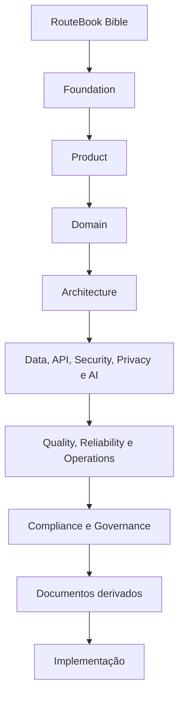
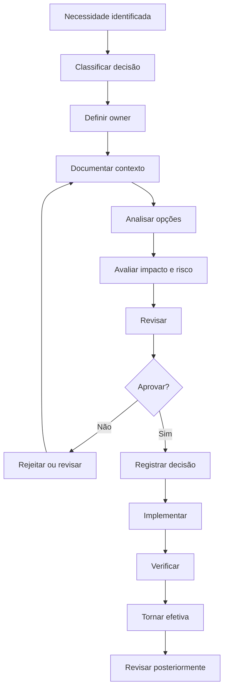
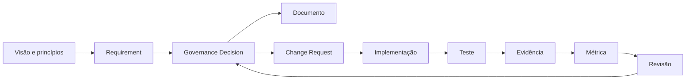

---

id: RB-GOV-001

title: Governança de Produto, Arquitetura e Decisões
description: Define o modelo oficial de governança do RouteBook para decisões de produto, domínio, arquitetura, dificial, segurança, qualidade, operação e evolução documental.

document_type: governance
owner: Governance

status: Draft
version: "0.1.0"

created: "2026-07-21"
last_updated: null

authors:

- RouteBook Team

tags:

- governance
- product-governance
- architecture-governance
- decision-governance
- technical-governance
- documentation-governance
- change-management
- risk-management
- ai-governance
- data-governance
- security-governance
- quality-governance
- operations
- diagrams
- mermaid

related_documents:

- RB-CORE-0001
- RB-CORE-0002
- RB-CORE-0003
- RB-CORE-0004
- RB-PRD-001
- RB-PRD-002
- RB-PRD-003
- RB-PRD-004
- RB-PRD-005
- RB-PRD-006
- RB-PRD-007
- RB-PRD-008
- RB-DOM-001
- RB-DOM-002
- RB-DOM-003
- RB-DOM-004
- RB-ARC-001
- RB-ARC-002
- RB-ARC-003
- RB-ARC-004
- RB-ARC-005
- RB-DATA-001
- RB-DATA-002
- RB-API-001
- RB-SEC-001
- RB-SEC-002
- RB-SEC-003
- RB-PRIV-001
- RB-PRIV-002
- RB-PRIV-003
- RB-OBS-001
- RB-QA-001
- RB-QA-002
- RB-OPS-001
- RB-OPS-002
- RB-SRE-001
- RB-AI-001
- RB-AI-002
- RB-AI-003
- RB-AI-004
- RB-AI-005
- RB-AI-006
- RB-COMP-001

prerequisites:

- RB-CORE-0004
- RB-PRD-008
- RB-DOM-001
- RB-DOM-002
- RB-DOM-003
- RB-DOM-004
- RB-ARC-001
- RB-ARC-002
- RB-ARC-003
- RB-ARC-004
- RB-ARC-005
- RB-DATA-001
- RB-DATA-002
- RB-SEC-001
- RB-AI-001
- RB-QA-001
- RB-OPS-001
- RB-COMP-001

next_documents:

- RB-GOV-002
- RB-COMP-002

ai_context:
priority: critical
index: true
---

# RouteBook — Governança de Produto, Arquitetura e Decisões

## Parte I — Fundamentos

### 1. Propósito

Este documento define o modelo oficial de governança do RouteBook.

Seu objetivo é estabelecer como decisões relevantes deverão ser:

* propostas;
* analisadas;
* comparadas;
* aprovadas;
* registradas;
* implementadas;
* verificadas;
* comunicadas;
* revisadas;
* substituídas;
* descontinuadas.

A governança deverá manter alinhamento entre:

* visão do produto;
* princípios do RouteBook;
* linguagem de domínio;
* requisitos;
* arquitetura;
* dados;
* APIs;
* segurança;
* privacidade;
* inteligência artificial;
* qualidade;
* confiabilidade;
* operações;
* documentação;
* conformidade.

---

### 2. Problema que este documento resolve

À medida que o RouteBook evolui, decisões podem ser tomadas em diferentes contextos e momentos.

Sem governança explícita, o projeto poderá sofrer com:

* decisões contraditórias;
* duplicação de conceitos;
* módulos com responsabilidades sobrepostas;
* documentos divergentes;
* termos não canônicos;
* implementações sem requisito;
* requisitos sem owner;
* mudanças arquiteturais silenciosas;
* controles não verificados;
* decisões de IA sem limites;
* dívida técnica sem tratamento;
* documentos obsoletos tratados como atuais.

Este documento estabelece um sistema para prevenir essas condições.

---

### 3. Escopo

Este documento cobre a governança de:

* produto;
* domínio;
* arquitetura;
* dados;
* APIs;
* experiência;
* design system;
* segurança;
* privacidade;
* inteligência artificial;
* qualidade;
* confiabilidade;
* operações;
* conformidade;
* documentação;
* mudanças;
* riscos;
* exceções;
* dívida técnica;
* decisões transversais.

---

### 4. Fora do escopo

Este documento não define:

* organograma empresarial definitivo;
* estrutura societária;
* gestão financeira;
* política trabalhista;
* contratos;
* governança jurídica;
* processos comerciais;
* metodologia detalhada de desenvolvimento;
* implementação específica de ferramentas.

---

### 5. Princípio central

Toda decisão relevante deverá possuir contexto, autoridade, justificativa, consequências e rastreabilidade.

```text
Contexto
→ problema
→ opções
→ critérios
→ decisão
→ consequências
→ implementação
→ verificação
→ revisão
```

---

### 6. Objetivos

A governança deverá:

1. preservar a visão do produto;
2. proteger a linguagem canônica;
3. reduzir contradições;
4. tornar decisões rastreáveis;
5. definir autoridades;
6. administrar riscos;
7. limitar exceções;
8. controlar mudanças;
9. manter documentação sincronizada;
10. orientar agentes de IA;
11. reduzir dependência de memória individual;
12. sustentar evolução do produto.

---

## Parte II — Princípios de governança

### 7. GitHub como fonte canônica

O repositório oficial deverá ser a fonte canônica para:

* documentação;
* decisões;
* contratos;
* histórico;
* versões;
* registros;
* templates.

Conversas, notas e ferramentas externas poderão apoiar o trabalho, mas não substituirão o conteúdo versionado.

---

### 8. Documentation-first

Mudanças relevantes deverão ser documentadas antes ou durante sua implementação.

A documentação não deverá ser criada apenas depois que a decisão já estiver consolidada no código.

---

### 9. AI-first com autoridade limitada

Agentes de IA poderão:

* analisar;
* propor;
* comparar;
* revisar;
* gerar rascunhos;
* identificar inconsistências;
* preparar patches.

Agentes de IA não possuirão autoridade implícita para:

* aprovar decisões;
* alterar documentos canônicos;
* criar novos conceitos de domínio;
* aceitar riscos;
* descontinuar contratos;
* elevar autonomia;
* ignorar controles.

---

### 10. Uma fonte canônica por decisão

Uma decisão relevante deverá possuir um registro canônico.

Documentos relacionados poderão referenciá-la, mas não criar versões divergentes.

---

### 11. Menor mudança coerente

Mudanças deverão buscar o menor escopo capaz de resolver o problema sem comprometer consistência.

---

### 12. Decisão reversível quando possível

Decisões deverão indicar:

* reversibilidade;
* custo de reversão;
* dependências;
* condições de rollback;
* impacto da descontinuação.

---

### 13. Governança proporcional

Nem toda decisão exige o mesmo processo.

O rigor deverá considerar:

* impacto;
* alcance;
* risco;
* reversibilidade;
* custo;
* sensibilidade;
* dependências;
* duração.

---

### 14. Transparência

Decisões relevantes não deverão permanecer apenas em conversas privadas ou conhecimento informal.

---

### 15. Ownership explícito

Todo artefato, domínio, módulo, controle e decisão deverá possuir owner identificável.

---

### 16. Revisão independente

Decisões de alto risco deverão possuir revisão por pessoa diferente do proponente, quando a estrutura permitir.

---

## Parte III — Modelo de autoridade documental

### 17. Hierarquia

A autoridade documental do RouteBook deverá seguir esta ordem:

1. RouteBook Bible;
2. Foundation;
3. Product;
4. Domain;
5. Architecture;
6. Data e API;
7. Security, Privacy e AI Governance;
8. Quality, Reliability e Operations;
9. Compliance e Governance;
10. documentos derivados;
11. implementação.



---

### 18. Regra de precedência

Um documento de nível inferior não poderá contradizer um documento de nível superior.

Quando uma contradição for encontrada, deverá ocorrer:

1. registro da inconsistência;
2. identificação da fonte superior;
3. análise da intenção;
4. correção dos documentos afetados;
5. revisão da implementação;
6. atualização do registro.

---

### 19. Especialização

Documentos especializados poderão detalhar regras superiores sem alterar seu significado.

---

### 20. Alteração de fundamento

Quando uma decisão exigir mudança em documento superior, a mudança deverá começar pela fonte de maior autoridade afetada.

---

## Parte IV — Estruturas de governança

### 21. Fóruns

O RouteBook poderá utilizar os seguintes fóruns lógicos:

* Product Governance;
* Domain Governance;
* Architecture Governance;
* Data Governance;
* AI Governance;
* Security and Privacy Governance;
* Quality and Reliability Governance;
* Operational Governance;
* Documentation Governance.

Esses fóruns não exigem equipes separadas durante a fase inicial.

---

### 22. Acúmulo de funções

Uma pessoa poderá acumular múltiplas funções, desde que:

* o acúmulo seja conhecido;
* conflitos sejam avaliados;
* decisões críticas sejam revisadas;
* evidências sejam preservadas.

---

### 23. Governance Owner

O Governance Owner deverá:

* manter o processo;
* assegurar consistência;
* coordenar decisões transversais;
* identificar lacunas;
* manter registros;
* escalar contradições.

---

### 24. Decision Owner

Cada decisão deverá possuir um owner responsável por:

* contexto;
* consulta;
* documentação;
* implementação;
* acompanhamento;
* revisão.

---

### 25. Reviewer

O reviewer deverá avaliar:

* coerência;
* riscos;
* dependências;
* alternativas;
* impacto;
* aderência aos documentos superiores.

---

### 26. Approver

O approver possui autoridade para aceitar formalmente a decisão dentro de seu escopo.

---

### 27. Consulted

Pessoas ou funções consultadas fornecem conhecimento especializado, mas não assumem automaticamente autoridade final.

---

### 28. Informed

Pessoas ou funções informadas precisam conhecer a decisão para executar ou manter elementos afetados.

---

## Parte V — Classificação de decisões

### 29. Decisão local

Afeta apenas uma implementação ou componente, sem alterar contratos ou conceitos canônicos.

Exemplos:

* refatoração interna;
* nome local de variável;
* reorganização de arquivo;
* melhoria de teste.

---

### 30. Decisão de módulo

Afeta comportamento ou estrutura interna de um módulo.

Exemplos:

* estratégia de persistência;
* política de cache;
* processamento assíncrono;
* estrutura de serviço.

---

### 31. Decisão transversal

Afeta múltiplos módulos ou áreas.

Exemplos:

* padrão de IDs;
* autenticação;
* eventos;
* observabilidade;
* políticas de erro;
* estrutura de contratos.

---

### 32. Decisão de produto

Altera:

* escopo;
* comportamento;
* prioridade;
* jornada;
* regra;
* experiência;
* compromisso.

---

### 33. Decisão de domínio

Altera:

* entidade;
* conceito;
* linguagem;
* regra;
* invariante;
* evento;
* ciclo de vida;
* ownership.

---

### 34. Decisão arquitetural

Altera:

* módulos;
* dependências;
* fronteiras;
* integração;
* persistência;
* infraestrutura;
* runtime;
* padrão transversal.

---

### 35. Decisão de risco

Aceita, reduz, transfere ou evita um risco relevante.

---

### 36. Decisão emergencial

É tomada para conter incidente ou risco imediato.

Deverá ser revisada após estabilização.

---

## Parte VI — Níveis de impacto

### 37. Impacto baixo

Características:

* escopo local;
* reversível;
* sem mudança de contrato;
* sem dado sensível;
* sem risco relevante.

Aprovação: owner técnico.

---

### 38. Impacto moderado

Características:

* afeta um módulo;
* altera comportamento interno;
* exige testes;
* possui dependências limitadas.

Aprovação: owner do módulo e reviewer.

---

### 39. Impacto alto

Características:

* afeta múltiplos módulos;
* altera contrato;
* modifica dados;
* muda jornada;
* introduz Provider;
* altera IA;
* possui risco relevante.

Aprovação: owners das áreas afetadas.

---

### 40. Impacto crítico

Características:

* altera Foundation ou Bible;
* modifica ownership de domínio;
* afeta autorização;
* afeta isolamento entre Accounts;
* muda estado canônico;
* altera privacidade;
* eleva autonomia de IA;
* compromete continuidade.

Aprovação: governança formal com revisão multidisciplinar.

---

## Parte VII — Registro de decisões

### 41. Identificador

Formato sugerido:

```text
RB-DEC-<AREA>-NNN
```

Exemplos:

```text
RB-DEC-PROD-001
RB-DEC-DOM-001
RB-DEC-ARC-001
RB-DEC-AI-001
```

---

### 42. Estrutura obrigatória

Cada decisão deverá conter:

```text
decisionRecordId
title
status
decisionType
impactLevel
context
problem
constraints
options
decision
rationale
consequences
risks
controls
dependencies
owner
reviewers
approvers
createdAt
approvedAt
effectiveAt
reviewDate
supersedes
supersededBy
relatedDocuments
```

---

### 43. Estados

* Proposed;
* Under Review;
* Approved;
* Rejected;
* Implementing;
* Effective;
* Under Reassessment;
* Superseded;
* Deprecated;
* Reversed;
* Archived.

---

### 44. Contexto

O contexto deverá explicar:

* situação atual;
* necessidade;
* limitações;
* dependências;
* histórico relevante.

---

### 45. Problema

O problema deverá ser descrito sem antecipar a solução.

---

### 46. Opções

Decisões de impacto alto ou crítico deverão considerar alternativas reais.

---

### 47. Critérios

Os critérios poderão incluir:

* valor ao Usuário;
* coerência de domínio;
* segurança;
* privacidade;
* confiabilidade;
* custo;
* complexidade;
* reversibilidade;
* manutenção;
* desempenho.

---

### 48. Consequências

Deverão ser registradas consequências:

* positivas;
* negativas;
* operacionais;
* futuras;
* desconhecidas.

---

### 49. Relação com Decision do domínio

O registro de governança não substitui a entidade canônica `Decision` do produto.

A entidade `Decision` pertence ao contexto de Decision Intelligence e representa decisões relacionadas à viagem.

O `decisionRecordId` deste documento representa uma decisão de governança do projeto.

---

## Parte VIII — Fluxo decisório

### 50. Processo padrão



---

### 51. Entrada

Uma proposta deverá possuir informação suficiente para permitir análise.

---

### 52. Consulta

As áreas afetadas deverão ser consultadas antes da aprovação.

---

### 53. Aprovação condicional

Uma decisão poderá ser aprovada com:

* controles;
* prazo;
* rollout limitado;
* teste adicional;
* feature flag;
* revisão obrigatória.

---

### 54. Verificação

A decisão não deverá ser considerada efetiva apenas porque foi aprovada.

Sua implementação deverá ser verificada.

---

### 55. Revisão posterior

Decisões deverão ser revistas quando:

* premissas mudarem;
* riscos aumentarem;
* incidentes ocorrerem;
* métricas contradisserem expectativas;
* nova alternativa surgir;
* documentos superiores mudarem.

---

## Parte IX — Governança de produto

### 56. Responsabilidade

Product Governance deverá preservar:

* visão;
* proposta de valor;
* personas;
* jornadas;
* escopo;
* prioridades;
* requisitos;
* critérios de sucesso.

---

### 57. Mudanças de escopo

Mudanças relevantes deverão avaliar:

* valor;
* alinhamento;
* esforço;
* dependências;
* riscos;
* impacto em documentação;
* efeito sobre o MVP.

---

### 58. Requisito novo

Um requisito deverá possuir:

* origem;
* problema;
* usuário afetado;
* comportamento;
* critérios de aceite;
* owner;
* prioridade;
* dependências.

---

### 59. Remoção de requisito

A remoção deverá considerar:

* usuários afetados;
* contratos;
* dados;
* migração;
* documentação;
* comunicação;
* compatibilidade.

---

### 60. Priorização

A prioridade não deverá ser determinada apenas por preferência individual.

Deverá considerar:

* valor;
* risco;
* dependência;
* urgência;
* custo;
* aprendizado;
* confiabilidade.

---

## Parte X — Governança de domínio

### 61. Linguagem canônica

Novos termos deverão ser avaliados antes de serem adotados como canônicos.

---

### 62. Alteração de conceito

Mudanças deverão atualizar:

* modelo de domínio;
* linguagem ubíqua;
* regras;
* eventos;
* arquitetura;
* API;
* dados;
* testes;
* documentação derivada.

---

### 63. Identificadores

Quando existir identificador canônico, identificadores genéricos deverão ser evitados.

Exemplos:

* `ItineraryProposalId`;
* `PlanningConflictId`;
* `RecommendationId`;
* `ActivityId`.

---

### 64. Ownership de domínio

Um módulo não poderá assumir ownership de conceito pertencente a outro módulo sem decisão explícita.

---

### 65. Invariantes

Alterações de invariantes deverão ser tratadas como decisões de alto ou crítico impacto.

---

### 66. Eventos

Novos eventos deverão possuir:

* owner;
* significado;
* gatilho;
* payload;
* versão;
* consumidores;
* impacto de replay.

---

## Parte XI — Governança de arquitetura

### 67. Architecture Decision Record

Decisões arquiteturais relevantes deverão ser registradas como ADR ou registro equivalente.

---

### 68. Gatilhos

ADR deverá ser considerado para:

* novo módulo;
* nova fronteira;
* novo Provider;
* nova persistência;
* mudança de integração;
* novo protocolo;
* estratégia de cache;
* estratégia de eventos;
* runtime de IA;
* mudança de deployment.

---

### 69. Dependências

Dependências entre módulos deverão respeitar a direção arquitetural aprovada.

---

### 70. Exceção arquitetural

Uma exceção deverá possuir:

* motivo;
* risco;
* duração;
* owner;
* plano de remoção;
* controle compensatório.

---

### 71. Complexidade

Nova complexidade deverá demonstrar valor ou redução de risco proporcional.

---

### 72. Reversibilidade

Decisões difíceis de reverter deverão receber maior análise.

---

## Parte XII — Governança de dados

### 73. Ownership

Cada entidade, tabela, evento, projeção e dataset deverá possuir owner.

---

### 74. Fonte canônica

A fonte canônica deverá ser identificada e protegida.

---

### 75. Mudança de schema

Mudanças deverão avaliar:

* compatibilidade;
* migration;
* rollback;
* backfill;
* retenção;
* privacidade;
* performance;
* eventos.

---

### 76. Dados derivados

Dados derivados deverão possuir:

* origem;
* regra;
* versão;
* retenção;
* reconstrução;
* exclusão.

---

### 77. Qualidade dos dados

Problemas recorrentes deverão gerar decisões de melhoria estrutural.

---

### 78. Acesso

Acesso a dados deverá respeitar:

* finalidade;
* autorização;
* menor privilégio;
* auditoria;
* isolamento.

---

## Parte XIII — Governança de APIs

### 79. Contratos

Contratos públicos ou compartilhados deverão ser versionados.

---

### 80. Breaking change

Uma breaking change deverá possuir:

* justificativa;
* impacto;
* consumidores;
* estratégia de migração;
* prazo;
* comunicação;
* rollback.

---

### 81. Rotas canônicas

Rotas e parâmetros deverão utilizar os termos definidos na linguagem do domínio.

---

### 82. Depreciação

Depreciações deverão possuir:

* data;
* alternativa;
* consumidores;
* período;
* remoção;
* monitoramento.

---

### 83. Idempotência

Operações que possam ser repetidas deverão possuir estratégia explícita.

---

## Parte XIV — Governança de inteligência artificial

### 84. Autoridade

O `RB-AI-001` permanece como fonte especializada de governança de IA.

Este documento define sua integração com a governança geral.

---

### 85. Nova capacidade de IA

Deverá possuir:

* capabilityId;
* finalidade;
* owner;
* risco;
* dados;
* Provider;
* modelo;
* avaliação;
* Tools;
* autonomia;
* custo;
* fallback.

---

### 86. Mudança de modelo

Deverá avaliar:

* comportamento;
* qualidade;
* custo;
* latência;
* segurança;
* privacidade;
* regressão;
* compatibilidade.

---

### 87. Nova Tool

Deverá possuir:

* owner;
* contrato;
* autorização;
* escopo;
* impacto;
* confirmação;
* auditoria;
* testes.

---

### 88. Elevação de autonomia

Deverá ser tratada como decisão de impacto crítico.

---

### 89. Avaliação

Nenhuma capacidade deverá ser aprovada somente por demonstração subjetiva.

---

### 90. Desativação

Capacidades de IA deverão possuir mecanismo de:

* suspensão;
* fallback;
* rollback;
* bloqueio;
* revisão.

---

## Parte XV — Governança de segurança e privacidade

### 91. Segurança

Mudanças que afetem autenticação, autorização, secrets, dados ou superfície de ataque deverão passar por revisão proporcional.

---

### 92. Privacidade

Mudanças materiais de finalidade, coleta, retenção, compartilhamento ou IA deverão passar por Privacy Review.

---

### 93. Risco crítico

Condições como acesso cross-account ou bypass de autorização não poderão ser aceitas como dívida comum.

---

### 94. Exceções

Exceções de segurança e privacidade deverão possuir expiração.

---

### 95. Evidências

Decisões deverão apontar para controles e evidências correspondentes.

---

## Parte XVI — Governança de qualidade

### 96. Critérios de qualidade

Decisões relevantes deverão declarar como serão verificadas.

---

### 97. Testes

Mudanças deverão identificar:

* testes novos;
* testes alterados;
* regressões;
* cenários negativos;
* dados de teste;
* ambientes.

---

### 98. Quality gate

Mudanças de alto risco não deverão avançar sem critérios mínimos aprovados.

---

### 99. Flaky tests

Testes instáveis não deverão ser ignorados silenciosamente.

---

### 100. Cobertura

Cobertura deverá ser avaliada por risco, não apenas por percentual.

---

## Parte XVII — Governança operacional

### 101. Operabilidade

Toda capacidade relevante deverá considerar:

* observabilidade;
* alertas;
* runbook;
* rollback;
* capacidade;
* recuperação;
* ownership.

---

### 102. Mudança operacional

Alterações de infraestrutura, deployment ou dados deverão possuir plano operacional.

---

### 103. Incidentes

Incidentes relevantes deverão alimentar:

* decisões;
* riscos;
* controles;
* prioridades;
* documentação;
* testes.

---

### 104. Error budget

O consumo de error budget poderá limitar mudanças de risco.

---

### 105. Continuidade

Mudanças críticas deverão avaliar RTO, RPO e recuperação.

---

## Parte XVIII — Governança documental

### 106. Registro oficial

O `docs/registry.md` deverá permanecer sincronizado com todos os documentos oficiais.

---

### 107. Metadados

O frontmatter deverá permanecer consistente quanto a:

* ID;
* título;
* descrição;
* tipo;
* owner;
* status;
* versão;
* datas;
* relações;
* prioridade.

---

### 108. Criação de documento

Antes de criar um documento, deverá ser verificado:

1. se já existe;
2. se outro documento cobre o escopo;
3. se a lacuna é real;
4. qual ID está disponível;
5. qual owner é adequado;
6. quais documentos são pré-requisitos;
7. qual caminho será utilizado.

---

### 109. Um documento principal por contexto

A criação deverá evitar múltiplos documentos sobre o mesmo tema sem necessidade.

---

### 110. Alteração documental

Mudanças deverão preservar:

* histórico;
* versionamento;
* links;
* registro;
* relações;
* terminologia.

---

### 111. Documento obsoleto

Documentos obsoletos deverão ser marcados como:

* Deprecated;
* Archived;
* Superseded, quando aplicável ao tipo de registro.

---

### 112. Documento ausente no registry

Um arquivo oficial sem entrada no registry deverá ser tratado como inconsistência.

---

### 113. Entrada sem arquivo

Uma entrada cujo caminho não exista também deverá ser tratada como inconsistência.

---

## Parte XIX — Governança de mudanças

### 114. Change Request

Mudanças relevantes deverão possuir registro.

Formato sugerido:

```text
RB-CHG-NNNNN
```

---

### 115. Estrutura

```text
changeRequestId
title
description
changeType
scope
reason
affectedDocuments
affectedModules
risks
rollback
owner
reviewers
approvers
status
plannedAt
implementedAt
verifiedAt
```

---

### 116. Estados

* Draft;
* Under Review;
* Approved;
* Scheduled;
* Implementing;
* Verifying;
* Completed;
* Rejected;
* Cancelled;
* Rolled Back.

---

### 117. Mudança padrão

Mudança de baixo risco e procedimento conhecido.

---

### 118. Mudança normal

Exige análise e aprovação proporcional.

---

### 119. Mudança emergencial

Executada para conter risco imediato.

Deverá possuir revisão posterior obrigatória.

---

### 120. Janela

Mudanças críticas deverão considerar janela e disponibilidade de responsáveis.

---

### 121. Rollback

O rollback deverá ser definido antes da implementação quando tecnicamente possível.

---

### 122. Verificação

A mudança somente deverá ser concluída após validação funcional e operacional.

---

## Parte XX — Governança de riscos

### 123. Registro

Riscos relevantes deverão possuir registro canônico.

---

### 124. Estrutura

```text
riskId
title
description
category
assets
likelihood
impact
inherentRisk
controls
residualRisk
owner
treatment
targetDate
reviewDate
status
```

---

### 125. Categorias

* Product;
* Domain;
* Architecture;
* Data;
* Security;
* Privacy;
* AI;
* Quality;
* Reliability;
* Operations;
* Compliance;
* Vendor.

---

### 126. Tratamentos

* Avoid;
* Reduce;
* Transfer;
* Accept;
* Monitor.

---

### 127. Aceitação

Riscos High e Critical deverão possuir aprovação explícita.

---

### 128. Revisão

Riscos deverão ser revisados quando:

* contexto mudar;
* controle falhar;
* incidente ocorrer;
* Provider mudar;
* arquitetura mudar;
* prazo expirar.

---

## Parte XXI — Governança de exceções

### 129. Registro

Exceções deverão possuir identificador e prazo.

---

### 130. Estrutura

```text
governanceExceptionId
requirement
scope
justification
risk
compensatingControls
owner
approvedBy
createdAt
expiresAt
reviewDate
status
```

---

### 131. Estados

* Requested;
* Under Review;
* Approved;
* Rejected;
* Expired;
* Revoked;
* Closed.

---

### 132. Renovação

Renovações deverão exigir nova análise.

---

### 133. Exceções proibidas

Não deverão ser aprovadas informalmente exceções relacionadas a:

* isolamento entre Accounts;
* bypass de autorização;
* exposição de secrets;
* integridade canônica;
* exclusão obrigatória;
* elevação de autonomia de IA;
* ocultação de incidentes.

---

## Parte XXII — Dívida técnica e documental

### 134. Conceito

Dívida representa uma decisão consciente ou condição acumulada que aumenta custo, risco ou complexidade futura.

---

### 135. Categorias

* Technical Debt;
* Architectural Debt;
* Documentation Debt;
* Security Debt;
* Privacy Debt;
* Data Debt;
* Test Debt;
* Operational Debt;
* AI Debt.

---

### 136. Registro

```text
debtId
title
category
description
cause
impact
risk
owner
treatment
targetDate
status
relatedDecisions
```

---

### 137. Dívida aceita

Deverá possuir justificativa e prazo de revisão.

---

### 138. Dívida crítica

Não deverá ser tratada como backlog comum quando comprometer:

* segurança;
* privacidade;
* dados;
* continuidade;
* autorização;
* invariantes.

---

### 139. Pagamento de dívida

Deverá ser priorizado com base em risco e impacto, não apenas idade.

---

## Parte XXIII — Governança de Providers

### 140. Novo Provider

A adoção deverá avaliar:

* finalidade;
* capacidade;
* dados;
* segurança;
* privacidade;
* continuidade;
* custo;
* lock-in;
* contrato;
* exit plan.

---

### 141. Owner

Todo Provider deverá possuir owner técnico e owner de negócio quando aplicável.

---

### 142. Mudança de Provider

Deverá avaliar:

* compatibilidade;
* migração;
* dados;
* contratos;
* qualidade;
* fallback;
* exclusão;
* credenciais.

---

### 143. Descontinuação

Deverá incluir:

* exportação;
* exclusão;
* revogação;
* validação;
* atualização documental.

---

### 144. Dependência crítica

Deverá possuir monitoramento, runbook e estratégia de continuidade.

---

## Parte XXIV — Governança de agentes de IA

### 145. Agente como participante governado

Agentes deverão operar sob:

* identidade;
* escopo;
* política;
* Tools permitidas;
* limites;
* observabilidade;
* auditoria.

---

### 146. Proposta de agente

Um novo agente deverá documentar:

* agentId;
* finalidade;
* capacidade;
* autonomia;
* contexto;
* Tools;
* risco;
* custo;
* owner;
* avaliações.

---

### 147. Alteração de Toolset

Mudanças no conjunto de Tools deverão passar por revisão.

---

### 148. Ação crítica

Agentes não deverão executar autonomamente ações críticas sem autorização explícita.

---

### 149. Evidência

A operação deverá permitir determinar:

* qual agente;
* qual versão;
* qual contexto;
* quais Tools;
* quais resultados;
* qual decisão humana.

---

## Parte XXV — Reuniões e fóruns decisórios

### 150. Necessidade

Nem toda decisão exige reunião.

A comunicação assíncrona deverá ser preferida quando suficiente.

---

### 151. Fórum de produto

Deverá tratar:

* escopo;
* prioridade;
* jornada;
* valor;
* requisitos;
* riscos de produto.

---

### 152. Fórum de arquitetura

Deverá tratar:

* módulos;
* contratos;
* integrações;
* dados;
* runtime;
* padrões.

---

### 153. Fórum de risco

Deverá tratar:

* segurança;
* privacidade;
* IA;
* continuidade;
* conformidade;
* exceções.

---

### 154. Registro

Reuniões decisórias deverão gerar:

* decisão;
* owner;
* ações;
* prazo;
* documento afetado.

---

### 155. Ata não é decisão canônica

A ata poderá registrar discussão, mas a decisão deverá ser consolidada no artefato apropriado.

---

## Parte XXVI — Ciclo de revisão

### 156. Revisão periódica

Artefatos deverão possuir frequência proporcional ao risco e à volatilidade.

---

### 157. Gatilhos extraordinários

Revisão obrigatória após:

* incidente;
* mudança de produto;
* mudança de arquitetura;
* nova obrigação;
* alteração de Provider;
* falha de controle;
* expansão de IA;
* contradição documental.

---

### 158. Revisão de decisão

Deverá avaliar:

* premissas;
* resultados;
* métricas;
* riscos;
* efeitos não previstos;
* necessidade de substituição.

---

### 159. Supersessão

Uma nova decisão deverá indicar claramente quando substitui uma anterior.

---

### 160. Arquivamento

Artefatos arquivados deverão permanecer acessíveis para histórico.

---

## Parte XXVII — Métricas

### 161. Métricas de decisões

* decisões propostas;
* decisões aprovadas;
* tempo de decisão;
* decisões sem owner;
* decisões vencidas para revisão;
* decisões revertidas;
* decisões superseded.

---

### 162. Métricas documentais

* documentos registrados;
* arquivos sem registro;
* registros sem arquivo;
* documentos desatualizados;
* links quebrados;
* frontmatters inválidos;
* contradições encontradas.

---

### 163. Métricas de mudança

* mudanças por tipo;
* change failure rate;
* rollbacks;
* mudanças emergenciais;
* verificações pendentes;
* ações vencidas.

---

### 164. Métricas de risco

* riscos por severidade;
* riscos aceitos;
* exceções abertas;
* exceções vencidas;
* dívida crítica;
* tempo de tratamento.

---

### 165. Métricas responsáveis

Métricas não deverão incentivar:

* burocracia;
* decisões artificiais;
* fragmentação documental;
* encerramento sem verificação;
* ocultação de risco.

---

## Parte XXVIII — Automação de governança

### 166. Candidatos

Poderão ser automatizados:

* validação de frontmatter;
* verificação do registry;
* detecção de links quebrados;
* verificação de IDs duplicados;
* análise de referências;
* avisos de revisão;
* identificação de exceções vencidas;
* geração de matrizes;
* comparação entre contratos.

---

### 167. Agentes de IA

Agentes poderão:

* identificar inconsistências;
* sugerir documentos afetados;
* preparar patches;
* resumir decisões;
* comparar versões;
* detectar termos não canônicos.

---

### 168. Limites

Automação não poderá autonomamente:

* aprovar decisão;
* alterar hierarquia;
* aceitar risco;
* remover documento;
* modificar ownership;
* criar conceito canônico;
* renovar exceção.

---

### 169. Evidência

Automação deverá registrar:

* ferramenta ou agentId;
* versão;
* entrada;
* resultado;
* decisão humana;
* alterações aplicadas.

---

## Parte XXIX — Estrutura documental sugerida

### 170. Organização

```text
docs/
└── governance/
    ├── product-architecture-and-decision-governance.md
    ├── decisions/
    ├── changes/
    ├── risks/
    ├── exceptions/
    ├── debt/
    ├── reviews/
    └── templates/
```

---

### 171. Template de decisão

```text
decisionRecordId:
title:
status:
decisionType:
impactLevel:
context:
problem:
constraints:
options:
decision:
rationale:
consequences:
risks:
owner:
reviewers:
approvers:
relatedDocuments:
reviewDate:
```

---

### 172. Template de mudança

```text
changeRequestId:
title:
changeType:
scope:
reason:
affectedDocuments:
affectedModules:
risks:
rollback:
owner:
reviewers:
approvers:
status:
```

---

### 173. Template de risco

```text
riskId:
title:
category:
description:
likelihood:
impact:
inherentRisk:
controls:
residualRisk:
owner:
treatment:
reviewDate:
status:
```

---

### 174. Template de exceção

```text
governanceExceptionId:
requirement:
scope:
justification:
risk:
compensatingControls:
owner:
approvedBy:
createdAt:
expiresAt:
status:
```

---

## Parte XXX — Rastreabilidade

### 175. Cadeia



---

### 176. Matriz mínima

| Elemento      | Vinculação obrigatória    |
| ------------- | ------------------------- |
| decisão       | contexto e owner          |
| decisão       | documentos afetados       |
| mudança       | decisão ou requisito      |
| implementação | mudança                   |
| teste         | implementação ou controle |
| evidência     | teste ou controle         |
| risco         | decisão ou mudança        |
| exceção       | requisito                 |
| revisão       | decisão e métricas        |

---

## Parte XXXI — Critérios de aceite

### 177. Fundamentos

* propósito definido;
* escopo definido;
* princípios definidos;
* hierarquia documental definida;
* ownership definido.

---

### 178. Decisões

* tipos definidos;
* níveis de impacto definidos;
* registro definido;
* estados definidos;
* fluxo definido;
* revisão definida.

---

### 179. Áreas

* produto coberto;
* domínio coberto;
* arquitetura coberta;
* dados cobertos;
* API coberta;
* IA coberta;
* segurança coberta;
* privacidade coberta;
* qualidade coberta;
* operações cobertas.

---

### 180. Mudanças e riscos

* mudanças definidas;
* rollback definido;
* riscos definidos;
* exceções definidas;
* dívida definida;
* Providers cobertos.

---

### 181. Documentação

* registry coberto;
* frontmatter coberto;
* criação de documentos definida;
* obsolescência definida;
* contradições definidas.

---

### 182. Operação da governança

* fóruns definidos;
* ciclos de revisão definidos;
* métricas definidas;
* automação definida;
* rastreabilidade definida.

---

## Parte XXXII — Checklist final

### 183. Checklist documental

Antes de aprovar:

* frontmatter YAML é válido;
* ID é único;
* título está correto;
* existe apenas um H1;
* propósito está definido;
* escopo está definido;
* princípios estão definidos;
* autoridade documental está definida;
* precedência está definida;
* fóruns estão definidos;
* papéis estão definidos;
* classificação de decisões está definida;
* impacto está definido;
* registro de decisões está definido;
* fluxo decisório está definido;
* Product Governance está definida;
* Domain Governance está definida;
* Architecture Governance está definida;
* Data Governance está definida;
* API Governance está definida;
* AI Governance está integrada;
* Security Governance está integrada;
* Privacy Governance está integrada;
* Quality Governance está definida;
* Operational Governance está definida;
* Documentation Governance está definida;
* Change Governance está definida;
* Risk Governance está definida;
* Exception Governance está definida;
* dívida está definida;
* Providers estão cobertos;
* agentes estão cobertos;
* reuniões estão definidas;
* revisão está definida;
* métricas estão definidas;
* automação está definida;
* estrutura documental está definida;
* rastreabilidade está presente;
* diagramas Mermaid renderizam no GitHub;
* blocos Mermaid não possuem atributos adicionais;
* termos canônicos estão preservados;
* não existem contradições com RB-CORE-0004;
* não existem contradições com RB-DOM-001;
* não existem contradições com RB-DOM-002;
* não existem contradições com RB-DOM-003;
* não existem contradições com RB-DOM-004;
* não existem contradições com RB-ARC-001;
* não existem contradições com RB-ARC-002;
* não existem contradições com RB-AI-001;
* não existem contradições com RB-SEC-001;
* não existem contradições com RB-PRIV-001;
* não existem contradições com RB-COMP-001.

---

## Parte XXXIII — Declaração final

### 184. Declaração de governança

O RouteBook deverá tratar governança como um sistema de autoridade, decisão, rastreabilidade e revisão.

Toda decisão relevante deverá demonstrar:

* qual problema resolve;
* quais opções foram consideradas;
* quais critérios foram utilizados;
* quem possui autoridade;
* quais riscos existem;
* quais documentos são afetados;
* como será implementada;
* como será verificada;
* quando será revisada.

Nenhuma decisão relevante deverá depender exclusivamente de:

* memória individual;
* conversa informal;
* preferência técnica;
* saída de IA;
* urgência não documentada;
* implementação prévia;
* ausência de incidente.

Nenhum agente, módulo, Provider, Tool ou operador poderá alterar silenciosamente:

* conceitos canônicos;
* ownership;
* regras;
* contratos;
* políticas;
* escopo de dados;
* autonomia;
* controles;
* hierarquia documental.

A governança do RouteBook deverá preservar coerência entre produto, domínio, arquitetura, dados, segurança, privacidade, inteligência artificial, qualidade, confiabilidade, operações, conformidade e documentação.
