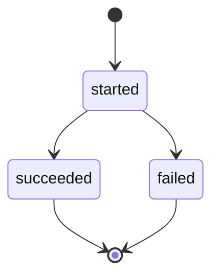

# RB-INC-069 — Núcleo de Proposal Application e Fingerprint Idempotente

## 1. Objetivo

Definir no Proposal Management o núcleo canônico de `Proposal Application`, incluindo a identidade da tentativa, seu lifecycle auditável e um fingerprint SHA-256 determinístico do pedido.

Issue: [#159](https://github.com/collapsy/Routebook/issues/159).

Branch: `feature/rb-inc-069-proposal-application-core`.

Pull request: [#162](https://github.com/collapsy/Routebook/pull/162).

## 2. Contexto

O RB-ADR-027 aprovou uma transação local PostgreSQL para coordenar a aplicação integral de Itinerary Proposal. Antes da persistência e da composição entre módulos, o sistema precisa distinguir de forma determinística:

- uma primeira tentativa;
- um replay legítimo com a mesma chave e o mesmo pedido;
- a reutilização inválida da mesma chave com payload divergente;
- uma tentativa concluída com sucesso;
- uma tentativa concluída com falha.

RB-DATA-001 e RB-DATA-002 já definem `Proposal Application`, a unicidade por `itineraryProposalId + idempotencyKey`, o `request_hash` e os campos de resultado.

## 3. Resultado verificável

- `ProposalApplicationId` possui identidade própria;
- tipos de aplicação são `full` e `partial`;
- estados são `started`, `succeeded` e `failed`;
- o fingerprint é SHA-256 hexadecimal minúsculo;
- o fingerprint possui schema version explícita;
- campos textuais são normalizados antes do hash;
- a ordem dos Proposed Activity IDs participa do hash;
- IDs duplicados são rejeitados;
- sucesso exige versão resultante e instante de conclusão;
- falha exige código e instante de conclusão;
- objetos e coleções expostos são readonly e congelados;
- datas recebidas são copiadas;
- tentativa terminal não pode ser finalizada novamente.

## 4. Payload canônico do fingerprint

```text
[
  schemaVersion,
  itineraryProposalId,
  itineraryId,
  applicationType,
  expectedItineraryVersion,
  actorType,
  actorId | null,
  proposedActivityIds[]
]
```

A `idempotencyKey` não participa do hash. Ela identifica o replay candidato; o fingerprint determina se o pedido associado é equivalente.

A ordem de `proposedActivityIds` é preservada porque pode participar da semântica da aplicação. A lista vazia permanece válida para não antecipar a política de versionamento de Proposal vazia.

## 5. Lifecycle



- `started` não possui resultado final;
- `succeeded` possui `resultingItineraryVersion` e `completedAt`;
- `failed` possui `failureCode` e `completedAt`;
- `completedAt` não pode ser anterior a `startedAt`.

## 6. Escopo

- identidade e tipos públicos;
- cálculo do fingerprint;
- criação de tentativa iniciada;
- finalização com sucesso;
- finalização com falha;
- validações e erros específicos;
- exports públicos;
- testes unitários;
- documentação, registry e rastreabilidade.

## 7. Fora de escopo

- migration, schema Drizzle ou repository;
- constraint física de unicidade;
- reidratação de Proposal Application;
- mutação ou persistência do Itinerary;
- registro de Decision;
- transação PostgreSQL;
- Application Orchestrator;
- Server Action ou interface;
- semântica concreta de aplicação dos itens;
- aceite parcial de Itinerary Proposal.

## 8. Caminhos permitidos

```text
modules/proposal-management/src/proposal-application.ts
modules/proposal-management/src/proposal-application.test.ts
modules/proposal-management/src/index.ts
docs/implementation/increments/rb-inc-069-proposal-application-core.md
docs/implementation/context-packs/rb-inc-069-proposal-application-core.md
docs/implementation/traceability-matrix.md
docs/registry.md
```

## 9. Critérios de aceite

- [x] tipos e estados canônicos são fechados;
- [x] fingerprint é determinístico após normalização;
- [x] qualquer mudança relevante altera o fingerprint;
- [x] ordem diferente de itens altera o fingerprint;
- [x] Proposed Activity ID duplicado é rejeitado;
- [x] tentativa iniciada é imutável e auditável;
- [x] sucesso exige versão resultante válida;
- [x] falha exige código não vazio;
- [x] timeline inválida é rejeitada;
- [x] transição a partir de estado terminal é rejeitada;
- [x] módulo não depende de Database, Itinerary Planning ou Decision Intelligence;
- [x] validações finais do CI aprovadas.

## 10. Testes obrigatórios

- tipos, estados e schema version publicados;
- equivalência após trim;
- alteração de cada campo relevante;
- mudança de ordem;
- duplicidade após normalização;
- criação e independência temporal do input;
- entradas inválidas;
- sucesso;
- falha;
- timeline inválida;
- transição terminal;
- classes de erro específicas.

## 11. Riscos

| Risco | Impacto | Mitigação |
| --- | --- | --- |
| hash variar por formatação superficial | Alto | normalização antes da serialização |
| payload divergente reutilizar a mesma chave | Alto | comparação posterior de fingerprint persistido |
| ordem ser perdida | Alto | coleção serializada na sequência recebida |
| duplicidade produzir aplicação ambígua | Alto | rejeição de IDs repetidos |
| domínio depender de banco | Alto | implementação restrita ao Proposal Management |
| antecipar semântica transacional | Médio | persistência e orquestração fora do recorte |

## 12. Segurança e privacidade

O fingerprint contém apenas referências técnicas e autoria mínima. O hash não substitui autorização, não deve ser usado como segredo e não inclui conteúdo pessoal livre.

## 13. Rollback

Remover o novo arquivo, seus testes e exports antes da introdução de consumidores persistentes. Nenhum dado ou schema é alterado.

## 14. Evidências

- Documentation Validation `30725223887`: **success**;
- Engineering Validation `30725223889`: **success**;
- formatação: aprovada;
- documentação: 180 documentos encontrados e registrados, com quatro avisos preexistentes;
- lint e typecheck dos 12 packages: aprovados;
- migrations PostgreSQL: aprovadas;
- suíte de domínio e componentes: aprovada;
- smoke do servidor de desenvolvimento: aprovado;
- build de produção: aprovado;
- Playwright responsivo: aprovado.
