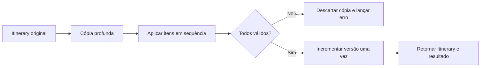

# RB-INC-070 — Aplicação Pura de Itinerary Proposal Items

## 1. Objetivo

Implementar no Itinerary Planning uma transformação pura que aplica integralmente os itens normalizados de `ApplyProposalItems` sobre uma cópia do `Itinerary`, sem persistência ou coordenação entre bounded contexts.

Issue: [#163](https://github.com/collapsy/Routebook/issues/163).

Branch: `feature/rb-inc-070-apply-proposal-items-domain`.

Pull request: pendente.

## 2. Contexto

O RB-ADR-027 aprovou uma transação local PostgreSQL para coordenar a aplicação integral de Itinerary Proposal. O RB-INC-068 publicou o contrato público pertencente ao Itinerary Planning, e o RB-INC-069 publicou o núcleo de Proposal Application e seu fingerprint idempotente.

Antes de implementar o adapter transacional, a alteração do Itinerary precisa ser determinística, testável e capaz de provar que uma falha em qualquer item não expõe estado parcial.

## 3. Resultado verificável

- `add`, `move`, `update` e `remove` são aplicados na ordem do comando;
- o Itinerary de entrada não é mutado;
- a transformação trabalha sobre uma cópia profunda;
- qualquer falha descarta todo o resultado intermediário;
- `ItineraryVersion` incrementa exatamente uma vez por aplicação integral;
- coleção vazia continua sendo uma aplicação válida e versionada;
- Activity criada recebe identidade canônica apenas durante a aplicação;
- geração de ActivityId pode ser injetada para testes determinísticos;
- Activity `fixed` não pode ser movida, atualizada ou removida;
- Free Periods, inclusive `protected`, são preservados integralmente;
- ordens são contíguas e determinísticas;
- IDs de Proposed Activity e referências de Activity canônica não podem ser duplicados no mesmo comando;
- o resultado informa versão resultante e IDs aplicados.

## 4. Semântica das operações

### 4.1 Add

Cria uma Activity canônica com:

- status `planned`;
- tipo `custom` quando ausente;
- flexibilidade `flexible` quando ausente;
- identidade produzida apenas na aplicação;
- posição explícita por `targetOrder` ou final do Dia.

### 4.2 Move

Move uma Activity não `fixed` para outro Dia ou reposiciona no mesmo Dia. A identidade, criação e demais atributos são preservados; `updatedAt` e ordens afetadas são atualizados.

### 4.3 Update

Atualiza a Activity não `fixed` preservando identidade, status, criação e ordem. Tipo, flexibilidade e Place são preservados quando omitidos. Horário e duração omitidos são removidos, conforme o contrato de edição planejável existente.

### 4.4 Remove

Remove uma Activity não `fixed` e renumera as Activities restantes do Dia.

## 5. Atomicidade em memória



A função não persiste e não controla transação física. Sua responsabilidade é fornecer ao futuro adapter uma operação de domínio que produza um resultado completo ou falhe sem mutar o agregado carregado.

## 6. Validações do recorte

- Trip do comando corresponde ao Itinerary;
- ItineraryId corresponde ao agregado;
- versão atual corresponde a `expectedItineraryVersion`;
- Proposed Activity IDs não se repetem;
- uma Activity canônica recebe no máximo uma operação por comando;
- Dia alvo existe;
- Activity de origem existe;
- Activity de origem não é `fixed`;
- `targetOrder` está dentro da faixa válida após a remoção necessária;
- ActivityId gerado não é vazio nem duplicado;
- instante de aplicação é válido.

## 7. Escopo

- operação `applyProposalItemsToItinerary`;
- erros de domínio estruturados;
- aplicação das quatro operações;
- cópia defensiva do Itinerary e datas;
- versionamento único;
- proteção de Activity `fixed`;
- preservação de Free Periods;
- testes unitários;
- documentação, registry e rastreabilidade.

## 8. Fora de escopo

- persistência do Itinerary ou Proposal Application;
- Proposal Status e validade temporal;
- TripContextVersion;
- autorização;
- Restrictions e Planning Conflicts;
- registro de Decision;
- idempotência persistida;
- transação PostgreSQL;
- Application Orchestrator;
- Server Action ou UI;
- aceite parcial.

## 9. Caminhos permitidos

```text
modules/trip-management/src/proposal-application.ts
modules/trip-management/src/proposal-application.test.ts
docs/implementation/increments/rb-inc-070-apply-proposal-items-domain.md
docs/implementation/context-packs/rb-inc-070-apply-proposal-items-domain.md
docs/implementation/traceability-matrix.md
docs/registry.md
```

## 10. Critérios de aceite

- [x] as quatro operações são aplicadas determinística e sequencialmente;
- [x] o input permanece inalterado;
- [x] falha em item posterior não expõe efeitos de item anterior;
- [x] versão incrementa exatamente uma vez;
- [x] Activity recebe identidade somente na aplicação;
- [x] Activity `fixed` é protegida;
- [x] Free Periods permanecem inalterados;
- [x] ordens inválidas são rejeitadas;
- [x] referências duplicadas são rejeitadas;
- [x] o módulo não depende de Proposal Management, Database ou Decision Intelligence;
- [ ] validações finais do CI aprovadas.

## 11. Testes obrigatórios

- aplicação integral das quatro operações;
- coleção vazia;
- reposicionamento no mesmo Dia;
- preservação e remoção seletiva de atributos no update;
- divergência de Trip, Itinerary e versão;
- Proposed Activity ID duplicado;
- Activity canônica duplicada no comando;
- Dia ou Activity inexistente;
- proteção de Activity `fixed` em move, update e remove;
- ordem fora da faixa;
- ActivityId inválido ou duplicado;
- instante inválido;
- rollback em memória;
- imutabilidade do envelope de resultado.

## 12. Riscos

| Risco | Impacto | Mitigação |
| --- | --- | --- |
| versão incrementar por item | Alto | incremento somente após concluir a coleção |
| mutação parcial vazar em falha | Alto | cópia profunda antes da primeira operação |
| Proposal alterar Activity fixed | Alto | bloqueio explícito antes da operação |
| Free Period protected ser afetado | Alto | nenhuma operação deste recorte escreve em Free Period |
| identidade duplicada | Alto | conjunto de IDs existentes e gerados |
| ordem inconsistente | Médio | inserção validada e renumeração contígua |
| dependência entre bounded contexts | Alto | tipos e implementação permanecem no Itinerary Planning |

## 13. Rollback

Remover a operação de aplicação, seus tipos auxiliares e testes. Nenhum schema, dado persistido ou interface é alterado.

## 14. Evidências

Evidências serão registradas após os quality gates e workflows da pull request.
