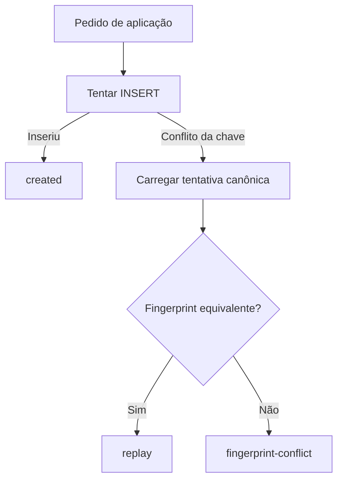

# RB-INC-071 — Persistência de Proposal Application

## 1. Objetivo

Persistir e reidratar `Proposal Application` no PostgreSQL, materializando o lifecycle e a idempotência publicados pelo RB-INC-069 antes da coordenação transacional entre Proposal Management e Itinerary Planning.

Issue: [#165](https://github.com/collapsy/Routebook/issues/165).

Branch: `feature/rb-inc-071-proposal-application-persistence`.

Pull request: [#166](https://github.com/collapsy/Routebook/pull/166).

## 2. Contexto

O RB-ADR-027 aprovou uma transação local PostgreSQL para o aceite integral de Itinerary Proposal. O RB-INC-069 definiu a tentativa auditável `Proposal Application`, seu fingerprint canônico e o lifecycle `started → succeeded|failed`. O RB-INC-070 implementou a transformação integral dos itens sobre o Itinerary.

Este incremento fornece a persistência necessária para distinguir uma criação inédita, um replay equivalente e a reutilização divergente da mesma chave idempotente.

## 3. Resultado verificável

- migration aditiva `0018_create_proposal_applications.sql`;
- tentativa `started` persistida e reidratada sem perda;
- resultados `succeeded` e `failed` reidratados por operações públicas do domínio;
- unicidade por `itinerary_proposal_id + idempotency_key`;
- fingerprint SHA-256 canônico armazenado e recomputado na leitura;
- payload canônico armazenado em JSONB para auditoria e verificação;
- classificação explícita entre `created`, `replay` e `fingerprint-conflict`;
- retry idempotente do mesmo resultado terminal;
- rejeição de conclusão concorrente divergente;
- constraints de tipo, status, versões, timeline e lifecycle.

## 4. Modelo persistido

A tabela `proposal_applications` registra:

- identidade da tentativa, Trip, Itinerary e Itinerary Proposal;
- chave idempotente e fingerprint do request;
- payload canônico do request;
- tipo de aplicação `full|partial`;
- status `started|succeeded|failed`;
- versão esperada e versão resultante do Itinerary;
- ator responsável;
- instantes de início e conclusão;
- código de falha terminal;
- timestamps técnicos.

## 5. Semântica idempotente



A unicidade física impede duas tentativas canônicas para a mesma Proposal e chave. O fingerprint diferencia um replay legítimo de um payload divergente.

## 6. Reidratação e corrupção

A leitura:

1. normaliza os valores retornados pelo executor SQL;
2. interpreta o `request_payload`;
3. recomputa o fingerprint canônico;
4. compara payload, colunas projetadas e fingerprint;
5. reconstrói o estado por `startProposalApplication`, `succeedProposalApplication` ou `failProposalApplication`.

Qualquer divergência é tratada como corrupção persistida, não como dado válido do domínio.

## 7. Escopo

- migration PostgreSQL;
- repository orientado a executor SQL;
- criação idempotente;
- busca por ID e por chave idempotente;
- conclusão terminal;
- reidratação defensiva;
- testes da migration e do repository;
- documentação, registry e rastreabilidade.

## 8. Fora de escopo

- alteração do Itinerary;
- transição da Itinerary Proposal para `accepted`;
- registro de Decision;
- Application Orchestrator;
- transação compartilhada entre módulos;
- Server Action ou interface de aceite;
- aceite parcial na experiência.

## 9. Caminhos permitidos

```text
packages/database/drizzle/0018_create_proposal_applications.sql
packages/database/src/proposal-application-migration.test.ts
packages/database/src/proposal-application-repository.ts
packages/database/src/proposal-application-repository.test.ts
docs/implementation/increments/rb-inc-071-proposal-application-persistence.md
docs/implementation/context-packs/rb-inc-071-proposal-application-persistence.md
docs/implementation/traceability-matrix.md
docs/registry.md
```

## 10. Critérios de aceite

- [x] tentativa `started` possui round trip canônico;
- [x] resultados `succeeded` e `failed` preservam dados terminais;
- [x] chave idempotente possui unicidade física por Proposal;
- [x] replay equivalente é distinguido de fingerprint divergente;
- [x] payload e fingerprint são verificados na reidratação;
- [x] combinações inválidas de lifecycle são bloqueadas por constraints;
- [x] retry terminal equivalente é idempotente;
- [x] conclusão terminal divergente é rejeitada;
- [x] domínio permanece independente de Drizzle e PostgreSQL;
- [ ] validações finais do CI aprovadas.

## 11. Testes obrigatórios

- contrato textual da migration;
- reidratação de `started`, `succeeded` e `failed`;
- ausência de tentativa;
- corrupção entre payload e fingerprint;
- criação inédita;
- replay equivalente;
- conflito de fingerprint;
- conflito sem linha canônica carregável;
- conclusão `succeeded`;
- retry terminal equivalente;
- rejeição de criação terminal;
- rejeição de salvamento de tentativa não terminal.

## 12. Riscos

| Risco | Impacto | Mitigação |
| --- | --- | --- |
| mesma chave aceitar payload diferente | Alto | comparação obrigatória de fingerprint |
| estado terminal parcial | Alto | constraints de lifecycle no PostgreSQL |
| payload e colunas divergirem | Alto | verificação cruzada durante a reidratação |
| duas tentativas concorrentes | Alto | índice único e leitura da linha canônica |
| sobrescrita de resultado terminal | Alto | update condicionado a status `started` |
| domínio depender do banco | Alto | adapter isolado em `@routebook/database` |

## 13. Rollback

Remover o repository, seus testes e a migration `0018`. Caso a migration já tenha sido aplicada em ambiente persistente, o rollback físico deve considerar retenção auditável dos registros antes da remoção da tabela.

## 14. Evidências

As evidências definitivas serão registradas na PR #166 após a aprovação dos workflows.
