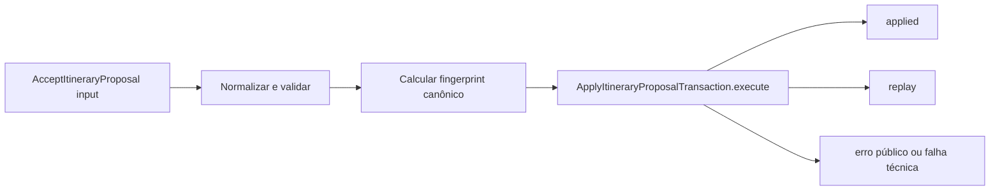

# RB-INC-072 — Orquestração do Aceite Integral de Itinerary Proposal

## 1. Objetivo

Publicar a fronteira de aplicação `AcceptItineraryProposal` e o port específico `ApplyItineraryProposalTransaction`, preparando a coordenação atômica aprovada no RB-ADR-027 sem implementar ainda a transação física PostgreSQL.

Issue: [#167](https://github.com/collapsy/Routebook/issues/167).

Branch: `feature/rb-inc-072-accept-itinerary-proposal-orchestration`.

Pull request: [#170](https://github.com/collapsy/Routebook/pull/170).

## 2. Contexto

O RB-INC-069 publicou o lifecycle e o fingerprint de `Proposal Application`. O RB-INC-070 implementou a transformação integral dos itens sobre o Itinerary. O RB-INC-071 materializou a persistência idempotente da tentativa.

Antes da implementação do adapter PostgreSQL, o caso de uso precisa possuir uma fronteira explícita que normalize a intenção do usuário, calcule o fingerprint antes de qualquer escrita e delegue toda a atomicidade a uma única operação transacional.

## 3. Resultado verificável

- comando público e imutável de aceite integral;
- normalização de Trip, Itinerary, Proposal, versão esperada, chave idempotente, ator e instante;
- itens validados pelo contrato público de Itinerary Planning;
- `applicationType` fixado em `full`;
- Proposed Activity IDs derivados dos itens normalizados e preservados em ordem;
- fingerprint canônico calculado antes da delegação;
- resultados discriminados `applied` e `replay`;
- erros públicos allowlisted;
- port `ApplyItineraryProposalTransaction` com uma única operação atômica;
- orchestrator sem acesso a SQL, repositories ou aggregates.

## 4. Fluxo de aplicação



A fronteira não coordena etapas individuais. Toda leitura, lock, mutação e persistência futura permanecerá encapsulada na implementação do port transacional.

## 5. Contrato do comando

O comando contém:

- `tripId`;
- `itineraryId`;
- `itineraryProposalId`;
- `expectedItineraryVersion`;
- `idempotencyKey`;
- `applicationType: full`;
- ator e instante da decisão;
- itens normalizados de `ApplyProposalItems`;
- Proposed Activity IDs na ordem semântica;
- fingerprint canônico do pedido.

O envelope, a coleção de itens e a coleção de IDs são congelados antes da delegação.

## 6. Resultados e erros

### 6.1 Resultados

- `applied`: a aplicação foi concluída pela primeira vez;
- `replay`: uma tentativa terminal equivalente foi reutilizada sem nova mutação.

Ambos retornam as identidades da Trip, Itinerary, Proposal, Proposal Application e Decision, além da versão resultante e dos itens aplicados.

### 6.2 Erros públicos

O contrato permite somente códigos conhecidos para situações de negócio e concorrência, incluindo fingerprint divergente, Proposal indisponível, versão divergente e tentativa não terminal.

Falhas técnicas desconhecidas são propagadas sem conversão para Planning Conflict.

## 7. Escopo

- tipos de input, comando, resultado e erro;
- fábrica do comando;
- cálculo antecipado do fingerprint;
- port transacional específico;
- Application Orchestrator;
- testes unitários;
- export público do módulo;
- documentação, registry e rastreabilidade.

## 8. Fora de escopo

- implementação PostgreSQL do port;
- repositories genéricos no orchestrator;
- queries, locks ou transação física;
- autorização de sessão;
- persistência do Itinerary, Proposal, Decision ou Proposal Application;
- Server Action ou UI;
- aceite parcial.

## 9. Caminhos permitidos

```text
modules/proposal-management/src/accept-itinerary-proposal.ts
modules/proposal-management/src/accept-itinerary-proposal.test.ts
modules/proposal-management/src/index.ts
docs/implementation/increments/rb-inc-072-accept-itinerary-proposal-orchestration.md
docs/implementation/context-packs/rb-inc-072-accept-itinerary-proposal-orchestration.md
docs/implementation/traceability-matrix.md
docs/registry.md
```

## 10. Critérios de aceite

- [x] comando normaliza todos os identificadores e dados de decisão;
- [x] itens são validados pelo contrato público de Itinerary Planning;
- [x] Proposed Activity IDs preservam a ordem dos itens;
- [x] fingerprint é calculado antes da chamada ao port;
- [x] comando e coleções são imutáveis;
- [x] port expõe somente uma operação atômica;
- [x] orchestrator delega exatamente uma vez;
- [x] resultados `applied` e `replay` são preservados;
- [x] erros públicos e falhas técnicas são propagados sem conversão indevida;
- [x] validações finais do CI aprovadas.

## 11. Testes obrigatórios

- normalização do comando;
- fingerprint canônico;
- cópia defensiva do instante;
- imutabilidade do envelope e coleções;
- ator ou instante inválido;
- item inválido rejeitado pelo contrato de Itinerary Planning;
- delegação única;
- resultado `applied`;
- resultado `replay`;
- propagação de erro público;
- propagação de falha técnica;
- port ausente.

## 12. Riscos

| Risco | Impacto | Mitigação |
| --- | --- | --- |
| orchestrator coordenar writes parciais | Alto | única chamada ao port transacional |
| fingerprint calculado após escrita | Alto | construção obrigatória do comando antes da delegação |
| ordem dos itens ser perdida | Alto | IDs derivados da coleção normalizada em ordem |
| erro técnico virar regra de negócio | Médio | propagação sem conversão genérica |
| contrato aceitar aplicação parcial | Alto | `applicationType` fixado em `full` |
| dependência de infraestrutura no caso de uso | Alto | nenhuma importação de database ou SQL |

## 13. Rollback

Remover a fronteira, seus exports e testes. Nenhuma migration, tabela, dado persistido ou interface de usuário é alterado por este incremento.

## 14. Evidências

- Documentation Validation: run `30729158226`, concluído com sucesso;
- Engineering Validation: run `30729158215`, concluído com sucesso;
- 186 documentos encontrados e registrados;
- instalação congelada, formatação, lint e typecheck aprovados;
- migrations PostgreSQL existentes aplicadas com sucesso;
- suíte integral e smoke aprovados;
- build de produção aprovado;
- 56 testes Playwright responsivos aprovados;
- HEAD validado: `2814734dc561666b65a7e5ad7ee042b4c0235b0b`.
