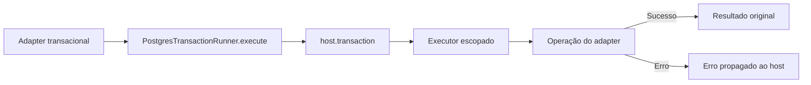

# RB-INC-073 — Executor Transacional PostgreSQL

## 1. Objetivo

Implementar no package Database um runner genérico que seja o único responsável por abrir a transação física PostgreSQL e fornecer um executor escopado aos adapters transacionais do RouteBook.

Issue: [#168](https://github.com/collapsy/Routebook/issues/168).

Branch: `feature/rb-inc-073-postgres-transaction-runner`.

Pull request: [#171](https://github.com/collapsy/Routebook/pull/171).

## 2. Contexto

O RB-ADR-027 determina que a aplicação integral de Itinerary Proposal use uma transação local PostgreSQL. O RB-INC-072 publicou o port `ApplyItineraryProposalTransaction`, mas sua implementação futura não deve abrir ou controlar diretamente a transação física.

Este incremento cria a infraestrutura mínima e reutilizável para encapsular `host.transaction`, preservando a atomicidade do provider e evitando que adapters de aplicação dupliquem lógica de commit, rollback, retry ou compensação.

## 3. Resultado verificável

- contrato estrutural de host transacional compatível com Drizzle;
- `PostgresTransactionRunner<TExecutor>` genérico;
- operação `execute<TResult>` tipada;
- uma única chamada a `host.transaction` por execução;
- callback recebe somente o executor escopado;
- resultado retornado sem conversão ou cópia;
- falha síncrona ou assíncrona propagada ao host;
- nenhuma tentativa automática, compensação ou tradução de erro;
- validação de host e operação;
- export público pelo package Database.

## 4. Fluxo



O runner não conhece regras de negócio, aggregates ou queries. O commit e o rollback permanecem sob responsabilidade do host PostgreSQL/Drizzle.

## 5. Contratos

### 5.1 PostgresTransactionHost

Expõe uma única função estrutural `transaction`, permitindo uso com um database Drizzle ou outro host compatível sem importar tipos concretos do provider.

### 5.2 PostgresTransactionOperation

Recebe somente o executor escopado e retorna uma Promise com resultado genérico.

### 5.3 PostgresTransactionRunner

Valida o host no construtor e a operação no momento da execução. Em seguida delega uma única vez para `host.transaction`.

## 6. Semântica de falhas

- erro síncrono do callback é convertido naturalmente em rejeição pela fronteira assíncrona e propagado;
- rejeição assíncrona é propagada sem alteração;
- o runner não repete a operação;
- o runner não realiza compensação;
- o runner não converte falha técnica em erro de domínio;
- o host decide commit ou rollback conforme a resolução da callback.

## 7. Escopo

- runner genérico;
- contratos estruturais de host e operação;
- validações defensivas;
- testes unitários;
- export público;
- documentação, registry e rastreabilidade.

## 8. Fora de escopo

- implementação de `ApplyItineraryProposalTransaction`;
- queries, locks ou repositories;
- carregamento ou persistência de aggregates;
- Proposal Application, Itinerary Proposal ou Decision;
- retry automático;
- nested transactions;
- configuração de isolation level;
- Server Action ou UI.

## 9. Caminhos permitidos

```text
packages/database/src/postgres-transaction-runner.ts
packages/database/src/postgres-transaction-runner.test.ts
packages/database/src/index.ts
docs/implementation/increments/rb-inc-073-postgres-transaction-runner.md
docs/implementation/context-packs/rb-inc-073-postgres-transaction-runner.md
docs/implementation/traceability-matrix.md
docs/registry.md
```

## 10. Critérios de aceite

- [x] host estrutural não depende de tipo concreto do Drizzle;
- [x] operação recebe somente o executor escopado;
- [x] transação é aberta exatamente uma vez;
- [x] operação é chamada exatamente uma vez;
- [x] resultado preserva identidade e tipo;
- [x] erro síncrono é propagado;
- [x] rejeição assíncrona é propagada;
- [x] não existe retry ou compensação;
- [x] host e callback inválidos são rejeitados;
- [ ] validações finais do CI aprovadas.

## 11. Testes obrigatórios

- chamada transacional única;
- executor escopado;
- identidade do resultado;
- inferência genérica do resultado;
- erro síncrono;
- rejeição assíncrona;
- ausência de retry;
- host inválido;
- callback inválido antes da transação.

## 12. Riscos

| Risco | Impacto | Mitigação |
| --- | --- | --- |
| adapter usar host global durante a transação | Alto | callback recebe executor escopado explicitamente |
| retry duplicar writes | Alto | runner não repete operações |
| erro ser convertido e impedir rollback | Alto | propagação sem tradução |
| infraestrutura conhecer domínio | Médio | tipos totalmente genéricos |
| múltiplos pontos abrirem transação | Alto | runner público e reutilizável como fronteira única |

## 13. Rollback

Remover o runner, seus testes e exports. Nenhuma migration, tabela, query, dado persistido ou interface de usuário é alterado por este incremento.

## 14. Evidências

As evidências definitivas serão registradas após a aprovação dos workflows da PR #171.
