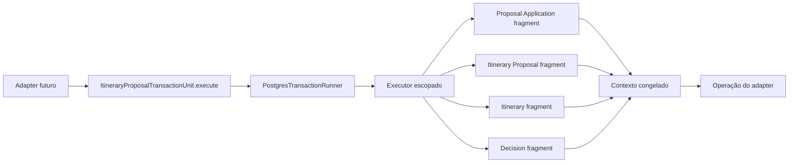

# RB-INC-074 — Unidade Transacional de Itinerary Proposal

## 1. Objetivo

Compor o `PostgresTransactionRunner` com quatro factories de fragments escopados, fornecendo uma unidade transacional genérica para os próximos adapters do aceite integral de Itinerary Proposal.

Issue: [#169](https://github.com/collapsy/Routebook/issues/169).

Branch: `feature/rb-inc-074-itinerary-proposal-transaction-unit`.

Pull request: [#172](https://github.com/collapsy/Routebook/pull/172).

## 2. Contexto

O RB-INC-072 publicou o port transacional específico do aceite. O RB-INC-073 implementou o runner responsável por abrir uma única transação PostgreSQL e entregar seu executor escopado.

Antes de criar SQL concreto, os adapters precisam de uma composição que garanta que Proposal Application, Itinerary Proposal, Itinerary e Decision sejam construídos sobre o mesmo executor da transação, sem exposição do host global.

## 3. Resultado verificável

- `ItineraryProposalTransactionUnit` genérica;
- quatro factories obrigatórias: Proposal Application, Itinerary Proposal, Itinerary e Decision;
- todas as factories recebem exatamente o mesmo executor escopado;
- ordem determinística de criação dos fragments;
- contexto congelado entregue à operação;
- identidade dos fragments preservada;
- resultado da operação preservado sem transformação;
- falha de factory interrompe a composição e impede a operação;
- falha da operação é propagada para rollback pelo runner;
- nenhuma tentativa, compensação ou conversão de erro.

## 4. Fluxo



O commit e o rollback continuam sob responsabilidade do host transacional. A unidade apenas compõe dependências no escopo correto.

## 5. Ordem de composição

A ordem canônica é:

1. Proposal Application;
2. Itinerary Proposal;
3. Itinerary;
4. Decision;
5. operação fornecida pelo adapter.

Essa ordem é determinística e testável, mas não executa regras de negócio nem queries por si só.

## 6. Contratos

### 6.1 Fragment factories

Cada factory recebe o executor escopado da transação e devolve um fragment arbitrário. Os tipos permanecem genéricos para evitar dependência de repositories ou SQL concretos.

### 6.2 Contexto transacional

O contexto contém as quatro identidades produzidas pelas factories e é congelado antes de ser entregue à operação.

### 6.3 Operação

A operação recebe somente o contexto transacional, retorna um resultado genérico e pode executar a sequência de negócio necessária no futuro.

## 7. Escopo

- unidade transacional genérica;
- tipos de fragments, factories e operação;
- validação do runner e das quatro factories;
- ordem de composição;
- contexto congelado;
- testes unitários;
- export público;
- documentação, registry e rastreabilidade.

## 8. Fora de escopo

- SQL concreto;
- repositories ou locks;
- implementação física dos fragments;
- regras do aceite integral;
- carregamento ou persistência de aggregates;
- autorização;
- Server Action ou UI;
- retry, compensação ou nested transaction.

## 9. Caminhos permitidos

```text
packages/database/src/itinerary-proposal-transaction-unit.ts
packages/database/src/itinerary-proposal-transaction-unit.test.ts
packages/database/src/index.ts
docs/implementation/increments/rb-inc-074-itinerary-proposal-transaction-unit.md
docs/implementation/context-packs/rb-inc-074-itinerary-proposal-transaction-unit.md
docs/implementation/traceability-matrix.md
docs/registry.md
```

## 10. Critérios de aceite

- [x] uma execução usa uma única transação física;
- [x] todas as factories recebem o mesmo executor escopado;
- [x] as quatro factories são obrigatórias;
- [x] a ordem de composição é determinística;
- [x] o contexto é congelado;
- [x] identidades dos fragments são preservadas;
- [x] resultado da operação é preservado;
- [x] falha de factory impede fragments posteriores e a operação;
- [x] falha da operação é propagada sem retry ou compensação;
- [x] validações finais do CI aprovadas.

## 11. Testes obrigatórios

- transação única;
- ordem das quatro factories;
- executor compartilhado;
- contexto congelado;
- identidade dos fragments;
- identidade e tipo do resultado;
- falha na primeira factory;
- ausência de fragments posteriores;
- falha da operação sem retry;
- runner inválido;
- cada factory ausente;
- operação ausente antes da transação.

## 12. Riscos

| Risco | Impacto | Mitigação |
| --- | --- | --- |
| fragment usar executor diferente | Alto | executor único fornecido pelo runner |
| operação receber host global | Alto | contexto contém somente fragments |
| factory falhar após efeitos externos | Alto | fragments futuros devem permanecer escopados à mesma transação |
| composição conhecer SQL concreto | Médio | tipos e factories genéricos |
| erro ser compensado fora do banco | Alto | propagação direta ao runner |
| ordem variar entre execuções | Médio | ordem explícita e coberta por teste |

## 13. Rollback

Remover a unidade, seus testes e exports. Nenhuma migration, query, tabela, dado persistido ou interface de usuário é alterado por este incremento.

## 14. Evidências

- Documentation Validation `30732402937`: aprovada;
- Engineering Validation `30732402941`: aprovada;
- 190 documentos encontrados e registrados;
- instalação congelada e formatação aprovadas;
- lint e typecheck aprovados;
- migrations PostgreSQL existentes aplicadas com sucesso;
- suíte integral e smoke aprovados;
- build de produção aprovado;
- 56 testes Playwright responsivos aprovados;
- HEAD validado antes do registro das evidências: `e11861d9a054b10c540dc1a778c4ad27cba3fb09`.
