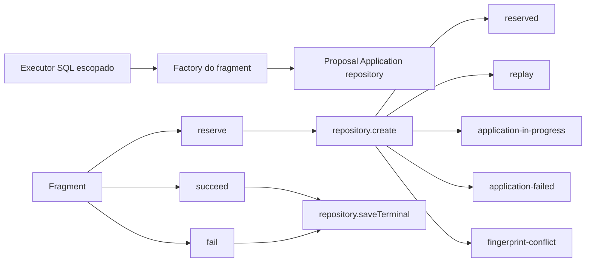

# RB-INC-075 — Fragment Transacional de Proposal Application

## 1. Objetivo

Implementar o fragment de Proposal Application que será injetado na unidade transacional do RB-INC-074, encapsulando a reserva idempotente e as conclusões `succeeded` e `failed` sobre o repository PostgreSQL já escopado.

Issue: [#173](https://github.com/collapsy/Routebook/issues/173).

Branch: `feature/rb-inc-075-proposal-application-transaction-fragment`.

Pull request: [#174](https://github.com/collapsy/Routebook/pull/174).

## 2. Contexto

O RB-INC-069 definiu o lifecycle e o fingerprint canônico de Proposal Application. O RB-INC-071 publicou o repository PostgreSQL compatível com executor escopado. O RB-INC-074 criou a unidade que compõe quatro fragments dentro da mesma transação.

Este incremento adapta o repository existente para a semântica exigida pelo aceite integral, sem acessar o database global e sem antecipar os fragments de Itinerary Proposal, Itinerary ou Decision.

## 3. Resultado verificável

- factory `createProposalApplicationTransactionFragment`;
- repository criado exatamente uma vez com o executor SQL escopado;
- reserva de nova Proposal Application `started`;
- resultado `reserved` para nova tentativa;
- resultado `replay` somente para tentativa canônica `succeeded`;
- resultado `application-in-progress` para tentativa canônica `started`;
- resultado `application-failed` para tentativa canônica `failed`;
- resultado `fingerprint-conflict` para chave reutilizada com request divergente;
- conclusão de sucesso com versão resultante;
- conclusão de falha com código canônico;
- persistência terminal idempotente pelo repository existente;
- propagação de falhas sem retry ou compensação.

## 4. Fluxo



## 5. Semântica idempotente

| Estado persistido | Mesmo fingerprint | Resultado |
| --- | --- | --- |
| inexistente | não aplicável | `reserved` |
| `started` | sim | `application-in-progress` |
| `succeeded` | sim | `replay` |
| `failed` | sim | `application-failed` |
| qualquer | não | `fingerprint-conflict` |

O fragment não carrega nem altera qualquer outro aggregate ao classificar uma tentativa existente.

## 6. Contratos

### 6.1 Reserva

A reserva recebe TripId, request canônico, chave idempotente, instante de início e ID opcional para testes determinísticos. O lifecycle de domínio normaliza e valida os dados antes da persistência.

### 6.2 Conclusão com sucesso

Recebe um record `started`, cria uma Proposal Application `succeeded`, persiste a versão resultante e retorna o record terminal.

### 6.3 Conclusão com falha

Recebe um record `started`, cria uma Proposal Application `failed`, persiste o código de falha e retorna o record terminal.

## 7. Escopo

- fragment transacional;
- tipos de input, record e resultados discriminados;
- factory de repository injetável para testes;
- reserva e classificação idempotente;
- conclusões terminal de sucesso e falha;
- validações defensivas;
- testes unitários;
- export público;
- documentação, registry e rastreabilidade.

## 8. Fora de escopo

- fragment de Itinerary Proposal;
- fragment de Itinerary;
- fragment de Decision;
- composição integral de `ApplyItineraryProposalTransaction`;
- SQL novo, schema ou migration;
- database global;
- Server Action, autorização ou UI;
- retry, compensação ou Outbox.

## 9. Caminhos permitidos

```text
packages/database/src/proposal-application-transaction-fragment.ts
packages/database/src/proposal-application-transaction-fragment.test.ts
packages/database/src/index.ts
docs/implementation/increments/rb-inc-075-proposal-application-transaction-fragment.md
docs/implementation/context-packs/rb-inc-075-proposal-application-transaction-fragment.md
docs/implementation/traceability-matrix.md
docs/registry.md
```

## 10. Critérios de aceite

- [x] repository recebe o executor escopado;
- [x] nova tentativa retorna `reserved`;
- [x] `succeeded` com mesmo fingerprint retorna `replay`;
- [x] `started` com mesmo fingerprint retorna `application-in-progress`;
- [x] `failed` com mesmo fingerprint retorna `application-failed`;
- [x] fingerprint divergente retorna `fingerprint-conflict`;
- [x] sucesso persiste versão resultante;
- [x] falha persiste failure code;
- [x] erros do repository são propagados sem retry;
- [x] nenhum database global é acessado;
- [ ] validações finais do CI aprovadas.

## 11. Testes obrigatórios

- identidade do executor na factory;
- reserva e normalização do record;
- replay succeeded;
- tentativa em andamento;
- tentativa anteriormente falha;
- conflito de fingerprint;
- conclusão succeeded;
- conclusão failed;
- falha na reserva sem retry;
- falha terminal sem retry;
- executor, factory e repository inválidos;
- reserva inválida antes do repository.

## 12. Riscos

| Risco | Impacto | Mitigação |
| --- | --- | --- |
| replay de tentativa não concluída | Alto | classificação pelo status persistido |
| request divergente reutilizar resultado | Alto | `fingerprint-conflict` explícito |
| fragment acessar database global | Alto | repository criado somente pelo executor injetado |
| conclusão duplicar writes | Alto | `saveTerminal` idempotente do RB-INC-071 |
| erro técnico ser ocultado | Alto | propagação sem tradução ou retry |

## 13. Rollback

Remover o fragment, seus testes e exports. Nenhuma migration, tabela, query nova, dado persistido ou interface de usuário é criada por este incremento.

## 14. Evidências

As evidências definitivas serão registradas após a aprovação dos workflows da PR #174.
