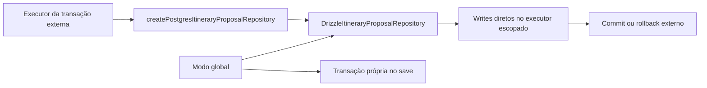

# RB-INC-076 — Repository Transacional de Itinerary Proposal

## 1. Objetivo

Adaptar o repository PostgreSQL de Itinerary Proposal para usar o executor Drizzle escopado fornecido pela transação externa, preservando o comportamento transacional atual quando utilizado no modo global.

Issue: [#175](https://github.com/collapsy/Routebook/issues/175).

Branch: `feature/rb-inc-076-scoped-proposal-repository`.

Pull request: [#176](https://github.com/collapsy/Routebook/pull/176).

## 2. Contexto

O RB-INC-073 publicou o runner PostgreSQL e o RB-INC-074 criou a unidade que entrega fragments sobre um único executor. O repository de Proposal Application já aceitava executor escopado, mas `DrizzleItineraryProposalRepository` ainda obtinha o database global internamente e abria uma transação própria durante `save`.

Este incremento remove esse acoplamento no modo escopado sem alterar queries, schemas, lifecycle ou a atomicidade do modo global.

## 3. Resultado verificável

- tipo estrutural `ItineraryProposalDatabaseExecutor`;
- executor opcional injetado no `DrizzleItineraryProposalRepository`;
- factory `createPostgresItineraryProposalRepository`;
- validação de Trip e Itinerary pelo mesmo executor;
- `create`, `findById` e `listByTripId` sem acesso ao database global no modo escopado;
- `save` direto no executor escopado;
- transação própria preservada no modo global;
- rollback externo remove Proposal e Proposed Activities;
- leitura dentro da transação enxerga todos os writes;
- comportamento e round trip anteriores preservados.

## 4. Fluxo



## 5. Modos de execução

### 5.1 Modo global

A construção sem argumentos continua usando `getDatabase()`. O método `save` abre a transação própria que preserva a atomicidade entre a Proposal e suas Proposed Activities.

### 5.2 Modo escopado

A factory recebe o transaction executor e desabilita a abertura de transação própria. Todas as operações usam somente esse executor, permitindo que a composição superior controle commit e rollback.

## 6. Escopo

- executor estrutural de leitura e escrita;
- injeção de dependência no repository;
- helper interno para execução dos writes;
- factory transacional;
- teste de rollback externo;
- export público;
- documentação, registry e rastreabilidade.

## 7. Fora de escopo

- regras de validade, identidade, versão ou coleção do aceite;
- fragment transacional de Itinerary Proposal;
- SQL novo, schema ou migration;
- lock explícito;
- repositories de Itinerary ou Decision;
- composição integral do aceite;
- Server Action, autorização ou UI.

## 8. Caminhos permitidos

```text
packages/database/src/proposal-repository.ts
packages/database/src/proposal-repository.test.ts
packages/database/src/index.ts
docs/implementation/increments/rb-inc-076-scoped-proposal-repository.md
docs/implementation/context-packs/rb-inc-076-scoped-proposal-repository.md
docs/implementation/traceability-matrix.md
docs/registry.md
```

## 9. Critérios de aceite

- [x] a factory usa exclusivamente o executor recebido;
- [x] nenhuma chamada ao database global ocorre no modo escopado;
- [x] `save` não abre nested transaction no modo escopado;
- [x] create, save, find e list compartilham visibilidade transacional;
- [x] falha posterior provoca rollback integral dos writes;
- [x] o modo global mantém sua transação própria;
- [x] os testes existentes permanecem verdes;
- [x] validações finais do CI aprovadas.

## 10. Testes obrigatórios

- round trips já existentes para todos os estados;
- persistência e substituição integral de Proposed Activities;
- integridade de referências;
- leitura dentro do executor escopado;
- rollback da transação externa;
- ausência de dados após rollback;
- factory exportada e tipada.

## 11. Riscos

| Risco | Impacto | Mitigação |
| --- | --- | --- |
| nested transaction alterar semântica de rollback | Alto | modo escopado executa writes diretamente |
| query usar database global acidentalmente | Alto | executor armazenado no repository |
| modo global perder atomicidade | Alto | helper mantém transação própria por padrão |
| transaction executor não satisfazer tipos Drizzle | Médio | contrato estrutural validado pelo typecheck |
| rollback preservar linhas filhas | Alto | teste integrado cobre Proposal e Proposed Activities |

## 12. Rollback

Remover a injeção, a factory, o teste adicional e os exports. Nenhuma migration ou alteração de dados é necessária.

## 13. Evidências

- Documentation Validation `30734507036`: aprovada;
- Engineering Validation `30734507054`: aprovada;
- 194 documentos encontrados e registrados;
- instalação congelada, formatação, lint e typecheck aprovados;
- o transaction executor do Drizzle satisfaz o contrato estrutural sem casts externos;
- migrations PostgreSQL existentes aplicadas com sucesso;
- suíte integral aprovada, incluindo visibilidade transacional e rollback externo de Proposal e Proposed Activities;
- smoke do servidor de desenvolvimento aprovado;
- build de produção aprovado;
- 56 testes Playwright responsivos aprovados;
- registry e matriz de rastreabilidade sincronizados com `RB-INC-076` e `RB-CTX-076`;
- HEAD governado validado antes do registro das evidências: `286dba987ba396f643353d182ff0bd09da721ebd`.
