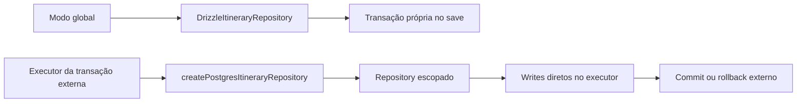

# RB-INC-078 — Repository Transacional de Itinerary

## 1. Objetivo

Adaptar o repository PostgreSQL de Itinerary para usar o executor Drizzle escopado fornecido pela transação externa, preservando o comportamento atual quando utilizado no modo global.

Issue: [#179](https://github.com/collapsy/Routebook/issues/179).

Branch: `feature/rb-inc-078-itinerary-transactional-repository`.

Pull request: [#180](https://github.com/collapsy/Routebook/pull/180).

## 2. Contexto

O RB-INC-073 publicou o runner PostgreSQL, o RB-INC-074 criou a unidade que entrega quatro fragments sobre um único executor e o RB-INC-077 materializou o fragment de Itinerary Proposal. O `DrizzleItineraryRepository` ainda obtinha o database global internamente e abria uma transação própria em `save`.

Esse comportamento era correto para o uso isolado, mas produziria uma fronteira transacional independente quando o repository fosse usado no aceite integral. O incremento torna a propriedade da transação explícita sem alterar queries, schema ou regras de domínio.

## 3. Resultado verificável

- tipo estrutural `ItineraryDatabaseExecutor`;
- executor opcional injetado no `DrizzleItineraryRepository`;
- factory `createPostgresItineraryRepository`;
- leituras pelo executor configurado;
- writes diretos no modo escopado;
- transação própria preservada no modo global;
- visibilidade do agregado dentro da transação externa;
- rollback externo remove integralmente o Itinerary persistido;
- reidratação e substituição integral anteriores preservadas.

## 4. Fluxo



## 5. Modos de execução

### 5.1 Modo global

A construção sem argumentos continua usando `getDatabase()`. O método `save` abre uma transação própria para manter atômica a substituição do Itinerary, seus Days, Activities e Free Periods.

### 5.2 Modo escopado

A factory recebe um executor e desabilita a abertura de transação própria. `findByTripId` e `save` usam exclusivamente esse executor, permitindo que a composição superior controle commit e rollback.

## 6. Escopo

- contrato estrutural de executor;
- injeção de dependência no repository;
- helper interno para seleção do write executor;
- factory transacional;
- testes de modo global, modo escopado e rollback externo;
- export público;
- documentação, registry e rastreabilidade.

## 7. Fora de escopo

- fragment transacional de Itinerary;
- aplicação dos Proposed Activity Items;
- alteração de versionamento ou regras do agregado;
- Decision ou Proposal Application;
- composição integral de `ApplyItineraryProposalTransaction`;
- SQL novo, schema, migration ou lock explícito;
- Server Action, autorização ou UI.

## 8. Caminhos permitidos

```text
packages/database/src/itinerary-repository.ts
packages/database/src/itinerary-repository.test.ts
packages/database/src/index.ts
docs/implementation/increments/rb-inc-078-itinerary-transactional-repository.md
docs/implementation/context-packs/rb-inc-078-itinerary-transactional-repository.md
docs/implementation/traceability-matrix.md
docs/registry.md
```

## 9. Critérios de aceite

- [x] o constructor sem argumentos preserva o database global;
- [x] o modo global mantém transação própria em `save`;
- [x] a factory usa o executor recebido;
- [x] `findByTripId` usa somente o executor configurado;
- [x] `save` não abre nested transaction no modo escopado;
- [x] o aggregate é legível antes do commit externo;
- [x] rollback externo remove todos os writes do Itinerary;
- [x] executor inválido é rejeitado;
- [x] exports públicos foram atualizados;
- [ ] validações finais do CI aprovadas.

## 10. Testes obrigatórios

- round trip integral existente;
- substituição integral do aggregate;
- transação própria no modo global;
- persistência e leitura dentro da transação externa;
- ausência de nested transaction;
- rollback externo;
- executor inválido.

## 11. Riscos

| Risco | Impacto | Mitigação |
| --- | --- | --- |
| nested transaction alterar rollback | Alto | factory fixa `useOwnTransaction=false` |
| query acessar database global | Alto | executor armazenado no repository |
| modo global perder atomicidade | Alto | helper preserva transação própria por padrão |
| reidratação divergir | Alto | suíte histórica e round trip preservados |
| executor insuficiente | Médio | contrato estrutural e validação da factory |

## 12. Rollback

Remover a injeção, a factory, os testes adicionais e os exports. Nenhuma migration ou transformação de dados é necessária.

## 13. Evidências

As evidências serão registradas após a aprovação dos workflows da PR #180.
