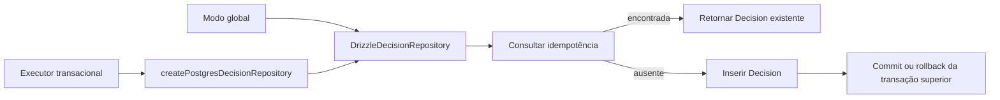

# RB-INC-080 — Repository Transacional de Decision

## 1. Objetivo

Adaptar o repository PostgreSQL de Decision para operar tanto no modo global atual quanto sobre o executor Drizzle escopado da transação de aceite integral.

Issue: [#183](https://github.com/collapsy/Routebook/issues/183).

Branch: `feature/rb-inc-080-decision-transactional-repository`.

Pull request: [#184](https://github.com/collapsy/Routebook/pull/184).

## 2. Contexto

O RB-ADR-027 exige que o registro da Decision participe da mesma transação PostgreSQL que altera o Itinerary, encerra a Itinerary Proposal e finaliza a Proposal Application. O repository existente acessava `getDatabase()` diretamente em todas as operações, o que impedia sua composição sobre o executor já aberto pelo runner.

O incremento aplica o mesmo padrão estabelecido para Itinerary Proposal e Itinerary: dependência injetável, uso global preservado e factory explícita para o modo escopado.

## 3. Resultado verificável

- contrato estrutural `DecisionDatabaseExecutor`;
- executor opcional no `DrizzleDecisionRepository`;
- constructor sem argumentos preservado;
- leituras e writes pelo executor configurado;
- factory `createPostgresDecisionRepository`;
- idempotência por Trip e chave preservada;
- serialização, reidratação e ordenação preservadas;
- visibilidade da Decision dentro da transação externa;
- rollback externo remove integralmente o registro;
- nenhum nested transaction é aberto pelo repository.

## 4. Fluxo



## 5. Modos de execução

### 5.1 Modo global

`new DrizzleDecisionRepository()` continua obtendo o database global. Todos os consumidores existentes preservam a mesma API e a mesma semântica de persistência.

### 5.2 Modo escopado

`createPostgresDecisionRepository(executor)` cria um repository que usa exclusivamente o executor recebido. Consultas de idempotência, leitura, listagem e insert permanecem na mesma sessão transacional.

## 6. Escopo

- contrato mínimo do executor;
- injeção de dependência;
- factory transacional;
- preservação da idempotência;
- testes integrados de modo global e escopado;
- rollback externo;
- export público;
- documentação, registry e rastreabilidade.

## 7. Fora de escopo

- ampliar o modelo de Decision para aceite de Itinerary Proposal;
- implementar o fragment transacional de Decision;
- criar a Decision específica do aceite;
- compor `ApplyItineraryProposalTransaction`;
- alterar schema ou migrations;
- Server Action, autorização ou UI.

## 8. Caminhos permitidos

```text
packages/database/src/decision-repository.ts
packages/database/src/decision-repository.test.ts
packages/database/src/index.ts
docs/implementation/increments/rb-inc-080-decision-transactional-repository.md
docs/implementation/context-packs/rb-inc-080-decision-transactional-repository.md
docs/implementation/traceability-matrix.md
docs/registry.md
```

## 9. Critérios de aceite

- [x] constructor sem argumentos preserva o database global;
- [x] todas as operações usam o executor configurado;
- [x] factory escopada foi publicada;
- [x] executor inválido é rejeitado;
- [x] serialização e reidratação permanecem inalteradas;
- [x] replay idempotente retorna a Decision existente;
- [x] registro é visível dentro da transação externa;
- [x] repository não abre nested transaction;
- [x] rollback externo remove a Decision;
- [x] export público foi atualizado;
- [x] validações finais do CI aprovadas.

## 10. Testes obrigatórios

- persistência e leitura no modo global;
- busca por ID;
- busca por chave de idempotência;
- listagem ordenada por Trip;
- replay idempotente;
- persistência e leitura no executor externo;
- ausência de nested transaction;
- rollback externo;
- executor inválido.

## 11. Riscos

| Risco | Impacto | Mitigação |
| --- | --- | --- |
| consulta idempotente usar conexão diferente | Alto | todos os métodos usam `this.database` |
| repository abrir fronteira transacional própria | Alto | nenhuma chamada a `transaction` |
| modo global quebrar consumidores atuais | Alto | default do constructor continua `getDatabase()` |
| semântica de unique violation mudar | Alto | tratamento existente preservado |
| rollback deixar registro órfão | Alto | teste integrado força rollback externo |

## 12. Rollback

Remover a injeção, a factory, os testes adicionais e os exports. Nenhuma migration ou transformação de dados é necessária.

## 13. Evidências

- Documentation Validation `30752604088`: aprovada;
- Engineering Validation `30752604108`: aprovada;
- 200 documentos encontrados e registrados;
- formatação, documentação, lint e typecheck aprovados;
- migrations PostgreSQL existentes aplicadas com sucesso;
- suíte integral aprovada, incluindo persistência global, idempotência, executor escopado e rollback da Decision;
- smoke do servidor de desenvolvimento aprovado;
- build de produção aprovado;
- 56 testes Playwright responsivos aprovados;
- registry e matriz de rastreabilidade sincronizados com `RB-INC-080` e `RB-CTX-080`;
- HEAD validado: `d6725c3e78fba276fd8cc8216ed895febd7eec05`.
