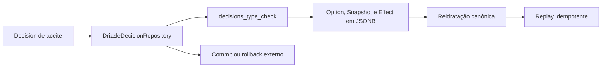

# RB-INC-082 — Persistência PostgreSQL da Decision de Aceite

## 1. Objetivo

Permitir que a Decision `accept-itinerary-proposal` seja persistida e reidratada pelo adapter PostgreSQL, preservando sua idempotência e participação em uma transação externa.

Issue: [#187](https://github.com/collapsy/Routebook/issues/187).

Branch: `feature/rb-inc-082-persist-itinerary-proposal-decision`.

Pull request: [#188](https://github.com/collapsy/Routebook/pull/188).

## 2. Contexto

O RB-INC-081 publicou o novo fato de domínio e a serialização do snapshot. O repository do RB-INC-080 já opera sobre executor escopado, mas o check constraint da tabela `decisions` ainda rejeitava o novo tipo.

Este incremento remove exclusivamente esse bloqueio físico. Não altera o modelo JSONB, não adiciona colunas e não compõe ainda o aceite integral.

## 3. Resultado verificável

- schema Drizzle aceita `accept-itinerary-proposal`;
- migration `0018_persist_itinerary_proposal_acceptance_decisions` atualiza somente `decisions_type_check`;
- journal registra a migration incremental;
- option, snapshot, effect e datas sobrevivem ao round trip;
- replay pela mesma Trip e chave retorna a Decision existente;
- executor escopado enxerga o write antes do commit;
- rollback externo remove o registro;
- tipo desconhecido continua rejeitado pelo PostgreSQL.

## 4. Mudança de schema

```sql
ALTER TABLE "decisions" DROP CONSTRAINT "decisions_type_check";
ALTER TABLE "decisions" ADD CONSTRAINT "decisions_type_check"
CHECK ("type" IN (
  'save-place',
  'add-to-itinerary',
  'ignore-planning-risk',
  'accept-itinerary-proposal'
));
```

Nenhuma coluna, índice, foreign key ou dado existente é alterado.

## 5. Fluxo validado



## 6. Escopo

- check constraint no schema;
- migration e journal;
- testes PostgreSQL de round trip;
- idempotência;
- executor escopado e rollback;
- rejeição de tipo inválido;
- documentação, registry e rastreabilidade.

## 7. Fora de escopo

- fragment transacional de Decision;
- composição de `ApplyItineraryProposalTransaction`;
- novas colunas ou relações;
- Server Action, autorização ou UI.

## 8. Caminhos permitidos

```text
packages/database/src/decision-schema.ts
packages/database/src/itinerary-proposal-decision-repository.test.ts
packages/database/drizzle/0018_persist_itinerary_proposal_acceptance_decisions.sql
packages/database/drizzle/meta/_journal.json
docs/implementation/increments/rb-inc-082-persist-itinerary-proposal-decision.md
docs/implementation/context-packs/rb-inc-082-persist-itinerary-proposal-decision.md
docs/implementation/traceability-matrix.md
docs/registry.md
```

## 9. Critérios de aceite

- [x] migration incremental criada;
- [x] schema e migration possuem os mesmos valores;
- [x] tipos anteriores permanecem aceitos;
- [x] novo tipo é persistível;
- [x] tipo desconhecido continua rejeitado;
- [x] round trip integral preserva o fato;
- [x] replay idempotente preservado;
- [x] rollback externo comprovado;
- [x] validações finais do CI aprovadas.

## 10. Testes obrigatórios

- migrations em banco vazio;
- save e find por ID;
- find por chave de idempotência;
- listagem por Trip;
- replay idempotente;
- igualdade integral após reidratação;
- persistência em executor escopado;
- rollback externo;
- violação `23514` para tipo desconhecido.

## 11. Riscos

| Risco | Impacto | Mitigação |
| --- | --- | --- |
| schema e migration divergirem | Alto | mesmos quatro valores em ambos |
| JSONB perder campos | Alto | igualdade integral após round trip |
| replay gerar segundo registro | Alto | teste da unique key e repository |
| rollback deixar Decision órfã | Alto | teste transacional integrado |
| constraint ficar permissiva demais | Médio | tipo desconhecido continua gerando `23514` |

## 12. Rollback

Reverter schema, migration e journal para os três tipos anteriores. Como nenhum dado é transformado, o rollback de código é direto enquanto não existirem registros do novo tipo no ambiente alvo.

## 13. Evidências

- Documentation Validation: run `30761966135`, aprovado;
- Engineering Validation: run `30761966150`, aprovado;
- formatação, documentação, lint, typecheck e migrations aprovados;
- 101 testes do pacote de banco aprovados, incluindo round trip, replay, executor escopado, rollback e rejeição `23514`;
- smoke, build e E2E responsivo aprovados.
