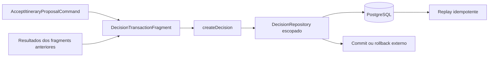

# RB-INC-083 — Fragment Transacional de Decision de Aceite

## 1. Objetivo

Implementar o fragment PostgreSQL escopado responsável por construir e persistir a Decision `accept-itinerary-proposal` dentro da transação de aceite integral.

Issue: [#189](https://github.com/collapsy/Routebook/issues/189).

Branch: `feature/rb-inc-083-itinerary-proposal-decision-transaction-fragment`.

Pull request: [#190](https://github.com/collapsy/Routebook/pull/190).

## 2. Contexto

O RB-INC-074 publicou a unidade transacional composta por fragments. O RB-INC-080 tornou o repository de Decision compatível com executor escopado. Os RB-INC-081 e RB-INC-082 publicaram, respectivamente, o fato de domínio de aceite e sua persistência PostgreSQL.

Este incremento encapsula a construção e o write da Decision sem abrir transação própria. A composição integral dos quatro fragments permanece fora do escopo.

## 3. Resultado verificável

- `createDecisionTransactionFragment` recebe exclusivamente o executor escopado;
- o repository é criado por `createPostgresDecisionRepository`;
- option, snapshot e effect são construídos de forma canônica;
- Trip, Itinerary, Itinerary Proposal e Proposal Application são preservadas;
- `decidedAt`, fingerprint, versão-base e versão resultante permanecem consistentes;
- os IDs aplicados preservam a ordem do comando;
- Recommendation opcional é propagada somente quando fornecida;
- replay pela mesma Trip e idempotency key retorna a Decision persistida;
- divergências de versão e coleção falham antes do write pelo contrato de domínio;
- rollback externo remove integralmente a Decision;
- nenhuma nested transaction é aberta.

## 4. Fluxo implementado



## 5. Contrato de entrada

O método `persist` recebe:

- comando canônico de aceite;
- ID da Proposal Application persistida;
- participante ator;
- versão resultante do Itinerary;
- IDs ordenados das Proposed Activities aplicadas;
- ID opcional da Decision;
- ID opcional de Recommendation.

## 6. Escopo

- fragment e factory escopada;
- construção da Decision de aceite;
- repository transacional;
- validações prévias ao write;
- replay idempotente;
- testes unitários;
- testes PostgreSQL de commit e rollback;
- export público;
- documentação, registry e rastreabilidade.

## 7. Fora de escopo

- composição integral dos quatro fragments;
- implementação de `ApplyItineraryProposalTransaction`;
- mudança de schema ou migration;
- Server Action, autorização ou UI;
- retry, compensação, Outbox ou nested transaction.

## 8. Caminhos permitidos

```text
packages/database/src/decision-transaction-fragment.ts
packages/database/src/decision-transaction-fragment.test.ts
packages/database/src/decision-transaction-fragment-postgres.test.ts
packages/database/src/index.ts
docs/implementation/increments/rb-inc-083-itinerary-proposal-decision-transaction-fragment.md
docs/implementation/context-packs/rb-inc-083-itinerary-proposal-decision-transaction-fragment.md
docs/implementation/traceability-matrix.md
docs/registry.md
```

## 9. Critérios de aceite

- [x] executor escopado é obrigatório;
- [x] nenhuma nested transaction é aberta;
- [x] Decision satisfaz o contrato do RB-INC-081;
- [x] option, snapshot e effect preservam identidades e ordem;
- [x] versão resultante corresponde à versão-base incrementada;
- [x] Proposal Application é referenciada no effect;
- [x] replay idempotente é preservado;
- [x] divergências falham antes do write;
- [x] rollback externo integral é comprovado;
- [ ] validações finais do CI aprovadas.

## 10. Testes obrigatórios

- construção canônica da Decision;
- Recommendation opcional;
- replay delegado ao repository;
- executor, factory e repository inválidos;
- versão resultante incompatível;
- IDs aplicados fora de ordem;
- persistência PostgreSQL com executor escopado;
- ausência de nested transaction;
- replay real no PostgreSQL;
- rollback externo integral.

## 11. Riscos

| Risco | Impacto | Mitigação |
| --- | --- | --- |
| fragment abrir transação própria | Alto | executor limitado e teste de nested transaction |
| Decision referenciar aplicação errada | Alto | Proposal Application obrigatória no effect |
| versão resultante divergir | Alto | validação do domínio antes do repository |
| ordem de IDs ser alterada | Alto | igualdade ordenada entre option e effect |
| replay gerar segundo registro | Alto | repository idempotente e teste PostgreSQL |
| rollback deixar Decision órfã | Alto | teste de rollback externo |

## 12. Rollback

Remover o fragment, seus exports, testes e documentos. Nenhuma migration ou transformação de dados foi introduzida.

## 13. Evidências

As evidências finais serão registradas após a aprovação dos workflows de Documentation Validation e Engineering Validation no HEAD definitivo da PR #190.
