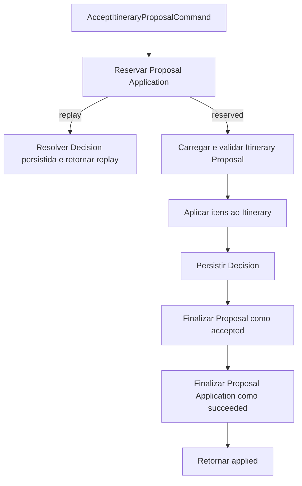

# RB-INC-084 — Composição PostgreSQL do Aceite Integral de Itinerary Proposal

## 1. Objetivo

Implementar o adapter concreto do port `ApplyItineraryProposalTransaction`, compondo Proposal Application, Itinerary Proposal, Itinerary e Decision dentro de uma única transação PostgreSQL.

Issue: [#191](https://github.com/collapsy/Routebook/issues/191).

Branch: `feature/rb-inc-084-apply-itinerary-proposal-transaction`.

Pull request: [#194](https://github.com/collapsy/Routebook/pull/194).

## 2. Contexto

O RB-INC-072 publicou o port e o Application Orchestrator do aceite. Os RB-INC-073 e RB-INC-074 publicaram, respectivamente, o runner PostgreSQL e a unidade transacional de quatro fragments. Os incrementos posteriores tornaram repositories e fragments concretos compatíveis com executor escopado.

Este incremento conecta esses contratos em uma composição física única, sem introduzir Server Action, autorização ou UI.

## 3. Resultado verificável

- uma execução nova abre exatamente uma transação PostgreSQL;
- os quatro fragments são construídos com o mesmo executor escopado;
- Proposal Application é reservada antes dos demais writes;
- conflitos de fingerprint e estados não executáveis usam os códigos públicos do caso de uso;
- a Itinerary Proposal `ready` é validada antes da mutação;
- os itens são aplicados integralmente ao Itinerary;
- a Decision canônica é persistida com o resultado efetivo;
- a Itinerary Proposal é finalizada como `accepted`;
- a Proposal Application é finalizada como `succeeded`;
- replay devolve resultado terminal idempotente;
- falhas intermediárias provocam rollback integral.

## 4. Ordem da composição

Todas as etapas executam dentro da mesma transação física aberta pela `ItineraryProposalTransactionUnit`.

## 5. Escopo

- `createApplyItineraryProposalTransaction`;
- `createPostgresApplyItineraryProposalTransaction`;
- mapeamento de reserva, replay e estados não executáveis;
- composição dos quatro fragments;
- resposta pública `applied` e `replay`;
- testes unitários da ordem e dos mapeamentos;
- testes PostgreSQL de atomicidade, replay e rollback;
- export público;
- documentação, Context Pack, registry e rastreabilidade.

## 6. Fora de escopo

- integração do factory ao bootstrap web;
- Server Action e autorização;
- experiência de usuário;
- Recommendation obrigatória;
- aplicação parcial;
- retry, compensação, Outbox ou nested transaction;
- alteração de schema ou migration sem necessidade comprovada.

## 7. Contratos preservados

- `requestFingerprint` é o fingerprint canônico do comando;
- `proposalApplicationId` é o ID da reserva persistida;
- `resultingItineraryVersion` vem do resultado real do fragment de Itinerary;
- `appliedProposedActivityIds` preserva ordem e identidade;
- `decisionId` vem da Decision persistida ou reidratada por replay;
- o ator precisa ser um participante resolvido antes da composição;
- `decidedAt` é usado para aplicação, Decision e finalizações;
- nenhum fragment abre transação própria.

## 8. Critérios de aceite

- [x] factory concreta do port implementada;
- [x] uma única unidade transacional envolve os quatro fragments;
- [x] ordem canônica de execução preservada;
- [x] replay e estados não executáveis mapeados;
- [x] resposta pública preserva IDs, fingerprint, versão e atividades;
- [x] falhas impedem finalizações posteriores;
- [x] atomicidade PostgreSQL comprovada por testes de integração;
- [x] validações finais do CI aprovadas.

## 9. Testes obrigatórios

- caminho `applied` e ordem dos fragments;
- replay sem reaplicação de Proposal ou Itinerary;
- fingerprint conflitante;
- aplicação em andamento;
- aplicação anteriormente falha;
- ator participante obrigatório;
- falha na Decision sem finalização posterior;
- commit PostgreSQL integral;
- replay PostgreSQL idempotente;
- rollback por falha na Decision;
- rollback por falha na finalização da Proposal;
- ausência de nested transactions.

## 10. Riscos

| Risco | Impacto | Mitigação |
| --- | --- | --- |
| executor diferente entre fragments | Alto | unidade transacional constrói todos pelo mesmo executor |
| Proposal finalizada sem Decision | Alto | Decision antecede finalizações e rollback é físico |
| Application concluída antes dos agregados | Alto | `succeed` é a última escrita |
| replay reaplicar itens | Alto | classificação da reserva desvia antes do fragment de Itinerary |
| versão ou IDs divergirem | Alto | resultado vem do fragment de Itinerary e domínio da Decision valida consistência |
| export quebrar consumidores existentes | Alto | typecheck integral do monorepo |

## 11. Rollback

Remover o adapter, os exports, testes e documentos do incremento. Não há migration ou transformação de dados própria.

## 12. Evidências

- HEAD funcional validado: `4e1a2b6596a7d1054920211a07d9cef41ba98bdd`;
- Documentation Validation: run `30766253051`, concluído com sucesso;
- Engineering Validation: run `30766253063`, job `91545409225`, concluído com sucesso;
- 208 documentos encontrados e registrados pelo validador;
- migration corretiva `0019_create_proposal_applications.sql` aplicada em banco PostgreSQL limpo;
- testes unitários cobrem ordem, resultado `applied`, replay e estados não executáveis;
- testes PostgreSQL comprovam commit integral, replay idempotente e rollback externo;
- a serialização ISO 8601 dos timestamps da Proposal Application foi validada no adapter;
- o repository de Itinerary passou a preservar o registro pai e reconstruir apenas os filhos, evitando cascata sobre Itinerary Proposal;
- formatação, documentação, lint, typecheck, migrations, suíte integral, smoke, build e E2E responsivo ficaram verdes.
