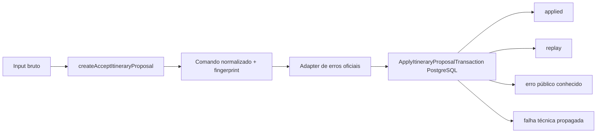

# RB-INC-085 — Integração Concreta do AcceptItineraryProposal

## 1. Objetivo

Conectar a fronteira `AcceptItineraryProposal` à implementação PostgreSQL real de `ApplyItineraryProposalTransaction`, publicando uma composition root pronta para os adapters de entrada.

Issue: [#195](https://github.com/collapsy/Routebook/issues/195).

Branch: `feature/rb-inc-085-postgres-accept-itinerary-proposal-service`.

Pull request: [#196](https://github.com/collapsy/Routebook/pull/196).

## 2. Contexto

O RB-INC-072 publicou o comando, o port, os resultados e os erros públicos do aceite integral. O RB-INC-084 implementou o port sobre uma única transação PostgreSQL.

Este incremento liga os dois contratos sem mover SQL ou coordenação transacional para o web. A futura Server Action consumirá a fronteira concreta publicada aqui.

## 3. Resultado verificável

- `createPostgresAcceptItineraryProposal` retorna a fronteira de aplicação pronta para uso;
- a entrada é normalizada por `createAcceptItineraryProposal` antes da transação;
- a factory cria `createPostgresApplyItineraryProposalTransaction` por padrão;
- resultados `applied` e `replay` são preservados integralmente;
- erros públicos já classificados não são recriados;
- erros de aplicação de itens são mapeados somente para códigos oficiais equivalentes;
- constraints PostgreSQL conhecidas são mapeadas por código e nome;
- falhas técnicas e constraints desconhecidas permanecem técnicas;
- o web não é alterado neste incremento.

## 4. Fluxo implementado

## 5. Mapeamentos de domínio

| Erro de domínio | Código público |
| --- | --- |
| `itinerary-version-mismatch` | `itinerary-version-mismatch` |
| `trip-mismatch` ou `itinerary-mismatch` | `itinerary-not-found` |
| divergências de IDs, origem, Dia, ordem, flexibilidade fixa ou ID gerado | `proposal-items-mismatch` |
| `application-time-invalid` | propagado como falha técnica de contrato |

## 6. Mapeamentos PostgreSQL

Somente combinações inequívocas são convertidas:

- `23505` + `proposal_applications_proposal_idempotency_unique` → `fingerprint-conflict`;
- `23503` em foreign key conhecida de Itinerary Proposal → `proposal-not-found`;
- `23503` em foreign key conhecida de Itinerary → `itinerary-not-found`.

Qualquer outro código, constraint ou wrapper permanece inalterado.

## 7. Escopo

- factory concreta da fronteira;
- wrapper do port transacional com mapeamento oficial;
- extração segura de erro PostgreSQL encapsulado por `cause`;
- export público no pacote database;
- testes unitários de normalização, resultados e erros;
- teste PostgreSQL da implementação real;
- documentação, Context Pack, registry e rastreabilidade.

## 8. Fora de escopo

- Server Action;
- sessão, autenticação e autorização;
- revalidação de rotas;
- UI e experiência de Recommendations;
- alteração de schema ou migration;
- novos códigos públicos;
- retry, compensação ou Outbox.

## 9. Critérios de aceite

- [x] composition root concreta implementada;
- [x] normalização ocorre antes da transação;
- [x] applied e replay preservam identidades e resultados;
- [x] erros públicos existentes são preservados;
- [x] erros de domínio mapeáveis usam somente códigos allowlisted;
- [x] constraints conhecidas são identificadas por código e nome;
- [x] falhas desconhecidas não são mascaradas;
- [x] implementação PostgreSQL real é exercitada por teste;
- [x] factory concreta e seu tipo são publicados por `@routebook/database`;
- [x] validações finais do CI aprovadas.

## 10. Testes obrigatórios

- entrada normalizada e delegação única;
- rejeição antes da transação para input inválido;
- preservação de `applied`;
- preservação de `replay`;
- preservação de erro público;
- tabela de mapeamento dos erros de domínio;
- `application-time-invalid` não mascarado;
- tabela de constraints PostgreSQL conhecidas;
- constraint desconhecida propagada;
- falha técnica propagada;
- factory ou transaction inválida;
- execução real PostgreSQL com persistência e replay.

## 11. Riscos

| Risco | Impacto | Mitigação |
| --- | --- | --- |
| converter falha técnica em regra de negócio | Alto | allowlist por classe, código e constraint |
| command não normalizado chegar ao banco | Alto | composição obrigatória com `createAcceptItineraryProposal` |
| resultado perder IDs | Alto | retorno do port preservado sem reconstrução |
| web conhecer fragments ou repositories | Alto | factory única exportada pelo pacote database |
| mapeamento depender de mensagem textual | Médio | uso exclusivo de `code` e `constraint` |

## 12. Rollback

Remover a composition root, seus testes, export e documentos. Nenhum schema ou dado é alterado.

## 13. Evidências

- HEAD funcional validado: `b3432727529623783419fed0ce2c0d6c63dc8164`;
- Documentation Validation: run `30767412654`, concluído com sucesso;
- Engineering Validation: run `30767412648`, job `91548482913`, concluído com sucesso;
- a suíte unitária validou normalização, resultados, allowlist de domínio, constraints conhecidas e propagação de falhas desconhecidas;
- o teste PostgreSQL executou a composition root real, confirmou `applied`, replay idempotente e persistência de Itinerary, Proposal Application e Decision;
- formatação, documentação, lint, typecheck, migration `0019`, suíte integral, smoke, build e E2E responsivo ficaram verdes.
