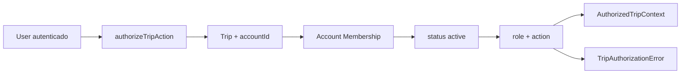

# RB-INC-087 — Account Membership e Autorização Server-Side de Trip

## 1. Objetivo

Publicar a fundação de autorização server-side do RouteBook baseada em Account Membership, permitindo verificar de forma determinística e fail-closed se um usuário autenticado pode executar uma ação sobre uma Trip.

Issue: [#199](https://github.com/collapsy/Routebook/issues/199).

Branch: `feature/rb-inc-087-account-membership-trip-authorization`.

Pull request: [#200](https://github.com/collapsy/Routebook/pull/200).

## 2. Contexto

O RB-INC-086 integrou identidade autenticada e sessão. Este incremento mantém autenticação e autorização separadas, conforme RB-ADR-007 e RB-ADR-008.

A autorização não confia apenas na existência de uma sessão. Ela exige Trip escopada por Account, membership ativa do usuário nessa Account e permissão explícita para a ação solicitada.

## 3. Resultado verificável

- módulo `@routebook/identity-access` publicado;
- Account e Account Membership possuem invariantes explícitas;
- roles iniciais: `owner`, `editor` e `viewer`;
- ações oficiais: `trip:view`, `trip:edit` e `trip:accept-proposal`;
- matriz determinística e deny-by-default;
- `authorizeTripAction` publica contexto autorizado ou erro allowlisted;
- Trip inexistente, sem Account, membership ausente/inativa e permissão insuficiente são diferenciadas;
- `accounts` e `account_memberships` são persistidos;
- `trips.account_id` permite migração progressiva sem atribuição silenciosa de dados legados;
- acesso cross-account é negado;
- nenhuma dependência de UI ou Server Action é introduzida.

## 4. Matriz de permissões

| Role | `trip:view` | `trip:edit` | `trip:accept-proposal` |
| --- | --- | --- | --- |
| `owner` | permitido | permitido | permitido |
| `editor` | permitido | permitido | permitido |
| `viewer` | permitido | negado | negado |

Qualquer role, ação ou estado não reconhecido é tratado como falha técnica ou negação, nunca como permissão implícita.

## 5. Fluxo

## 6. Erros públicos

- `trip-not-found`;
- `trip-unscoped`;
- `membership-not-found`;
- `membership-inactive`;
- `permission-denied`.

## 7. Persistência

A migration `0021_create_accounts_and_trip_authorization.sql`:

- cria `accounts`;
- cria `account_memberships` com FK para `auth_users`;
- garante unicidade por Account/User;
- restringe roles e estados por check constraints;
- adiciona `trips.account_id` opcional;
- adiciona FK e índice para Account.

Trips existentes permanecem sem Account até um incremento explícito de migração ou provisioning. Adapters protegidos negam essas Trips com `trip-unscoped`.

## 8. Escopo

- domínio de Account e Membership;
- matriz de autorização;
- serviço de autorização de Trip;
- schema, migration e repositories PostgreSQL;
- teste cross-account e de membership inativa;
- documentação, Context Pack, registry e rastreabilidade.

## 9. Fora de escopo

- UI de Account e membros;
- convites;
- provisioning automático no sign-up;
- backfill de Trips legadas;
- alteração do fluxo de criação de Trip;
- associação entre TripParticipant e auth user;
- Server Action de aceite;
- RLS e compartilhamento público.

## 10. Critérios de aceite

- [x] domínio de Account e Membership implementado;
- [x] matriz determinística implementada;
- [x] autorização deny-by-default implementada;
- [x] schema e migration `0021` criados;
- [x] reader PostgreSQL implementado;
- [x] testes unitários e PostgreSQL implementados;
- [ ] registry e rastreabilidade atualizados;
- [ ] validações finais do CI aprovadas.

## 11. Riscos

| Risco | Impacto | Mitigação |
| --- | --- | --- |
| sessão ser tratada como autorização | Crítico | membership e recurso sempre verificados |
| acesso cross-account | Crítico | query composta por accountId e userId |
| Trip legada ser atribuída silenciosamente | Alto | accountId opcional e `trip-unscoped` |
| viewer executar mutação | Alto | matriz explícita e testes |
| role ou status inválido no banco | Alto | check constraints e parsing estrito |

## 12. Rollback

Remover módulo, repositories, exports, migration `0021`, coluna `trips.account_id` e documentos. Nenhuma Trip existente é alterada ou atribuída durante este incremento.

## 13. Evidências

As evidências finais serão registradas após os workflows da PR #200.
