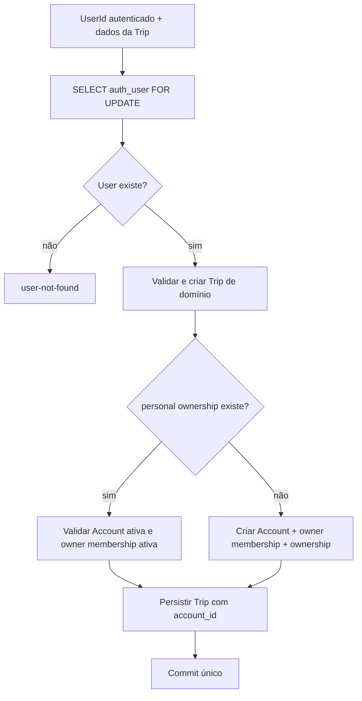

# RB-INC-088 — Provisionamento Idempotente de Account Pessoal e Trip Escopada

## 1. Objetivo

Publicar uma composition root PostgreSQL que valide o User autenticado, resolva ou provisione sua Account pessoal e crie uma nova Trip já escopada a essa Account dentro da mesma transação física.

Issue: [#201](https://github.com/collapsy/Routebook/issues/201).

Branch: `feature/rb-inc-088-personal-account-authenticated-trip`.

Pull request: [#202](https://github.com/collapsy/Routebook/pull/202).

## 2. Contexto

O RB-INC-086 publicou autenticação e sessão. O RB-INC-087 publicou Account, Account Membership, autorização server-side e `trips.account_id`.

O fluxo legado de criação de Trip continua válido, mas ainda gera um owner técnico e uma Trip sem Account. Este incremento cria uma fronteira server-side separada para os próximos adapters autenticados, sem alterar formulário ou UI.

## 3. Resultado verificável

- `personal_account_ownerships` identifica de forma persistente a Account pessoal de cada User;
- cada User possui no máximo uma Account pessoal;
- cada Account pessoal pertence a no máximo um User;
- `createPostgresAuthenticatedTrip` bloqueia o User antes de resolver o vínculo;
- a primeira execução cria Account, owner membership, vínculo pessoal e Trip;
- execuções posteriores reutilizam Account e membership;
- chamadas concorrentes para o mesmo User não criam duplicatas;
- a Trip persiste com `account_id` e com o User autenticado como owner participant;
- Users distintos recebem Accounts distintas;
- User inexistente é rejeitado antes de qualquer escrita;
- falha na persistência da Trip reverte o provisionamento novo;
- o fluxo legado permanece compatível.

## 4. Fluxo transacional

## 5. Identidade pessoal persistente

A identidade da Account pessoal não depende de:

- nome da Account;
- email;
- nome de exibição;
- ordem de criação;
- heurística textual.

Ela é representada por `personal_account_ownerships`, com `user_id` como chave primária e `account_id` único.

## 6. Compatibilidade do domínio de Trip

`CreateTripInput` passa a aceitar `ownerUserId` opcional:

- compositions server-side fornecem o ID autenticado;
- o fluxo legado continua gerando UUID técnico quando o campo não é fornecido;
- IDs inválidos são rejeitados pelo domínio;
- o formulário atual não envia nem controla esse campo.

## 7. Persistência

A migration `0022_create_personal_account_ownerships.sql`:

- cria a relação persistente User ↔ Account pessoal;
- referencia `auth_users` e `accounts`;
- garante unicidade nos dois sentidos;
- remove o vínculo quando User ou Account é removido.

## 8. Escopo

- extensão compatível do domínio de Trip;
- schema e migration do vínculo pessoal;
- composition root PostgreSQL;
- bloqueio pessimista do User;
- provisioning e criação da Trip na mesma transação;
- testes de replay, concorrência, isolamento, User inexistente e rollback;
- documentação, Context Pack, registry e rastreabilidade.

## 9. Fora de escopo

- alterar o formulário ou a Server Action atual;
- exigir login nas páginas existentes;
- provisioning durante sign-up;
- backfill de Trips legadas;
- mover Trips existentes para Accounts;
- Accounts compartilhadas e convites;
- Server Action de aceite de Proposal;
- autorização de páginas.

## 10. Critérios de aceite

- [x] owner autenticado suportado pelo domínio de Trip;
- [x] vínculo pessoal persistente modelado;
- [x] migration `0022` criada;
- [x] composition root transacional implementada;
- [x] User inexistente rejeitado;
- [x] provisioning idempotente implementado;
- [x] serialização concorrente implementada;
- [x] rollback integral coberto por teste;
- [x] registry e rastreabilidade atualizados;
- [ ] validações finais do CI aprovadas.

## 11. Erros públicos

- `user-not-found`;
- `personal-account-invalid`.

Validações de dados da Trip continuam usando `TripValidationError`. Falhas PostgreSQL desconhecidas permanecem técnicas.

## 12. Riscos

| Risco | Impacto | Mitigação |
| --- | --- | --- |
| duas Accounts pessoais para o mesmo User | Crítico | row lock no User e PK por `user_id` |
| mesma Account pessoal para dois Users | Crítico | índice único por `account_id` |
| Account criada sem Trip após falha | Alto | transação física única |
| owner controlado pelo cliente | Crítico | ID carregado de `auth_users`, não do formulário |
| quebrar criação legada | Alto | `ownerUserId` opcional e testes de compatibilidade |
| vínculo persistido em estado incoerente | Alto | validação de Account e owner membership no replay |

## 13. Rollback

Remover a composition root, os testes, o campo opcional `ownerUserId`, o schema e a migration `0022`. Nenhuma UI ou Trip legada é alterada por este incremento.

## 14. Evidências

O domínio, a composition root, a migration, o Context Pack, o registry e a rastreabilidade estão consolidados. O HEAD atual executará os validadores padrão antes do registro das evidências finais.
