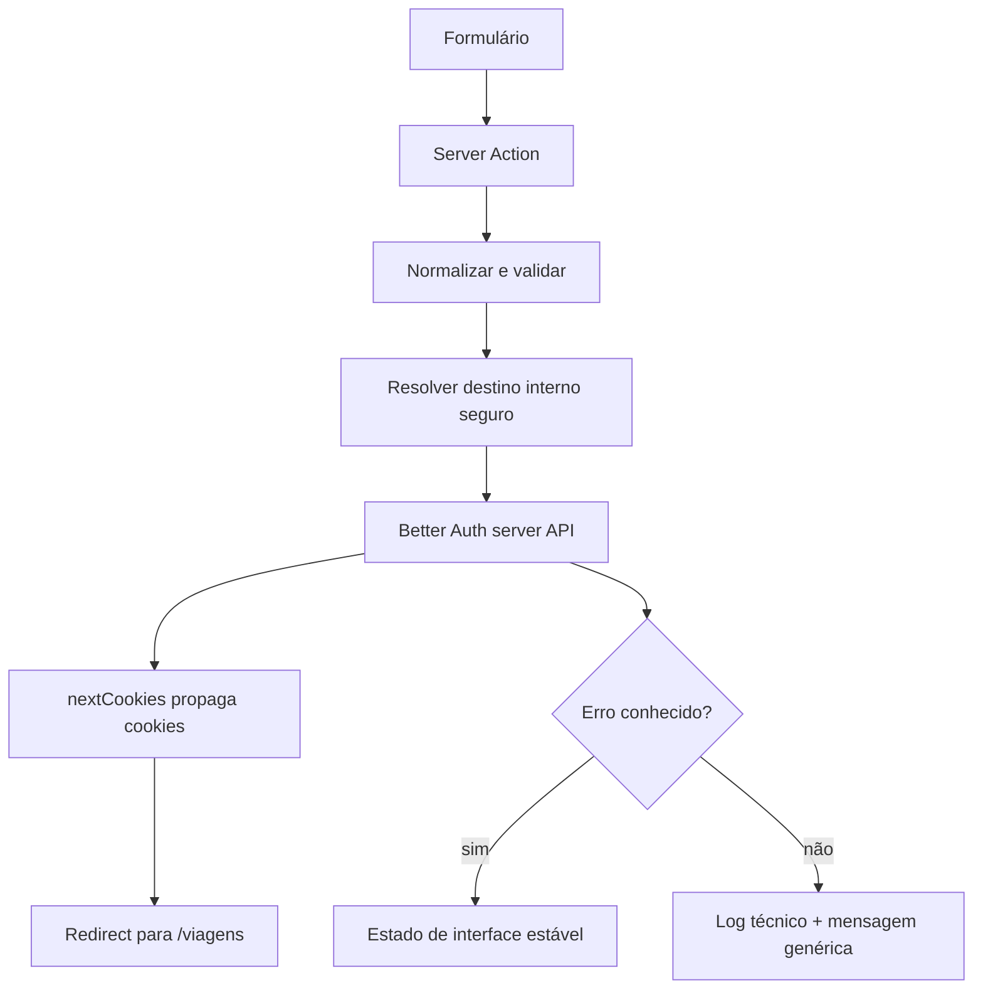

# RB-INC-089 — Experiência Server-side de Cadastro, Entrada e Saída

## 1. Objetivo

Publicar uma experiência web mínima para criar, iniciar e encerrar uma sessão RouteBook sem deslocar credenciais para Client Components ou confiar em destinos de redirecionamento fornecidos pelo navegador.

Issue: [#203](https://github.com/collapsy/Routebook/issues/203).

Branch: `feature/rb-inc-089-server-auth-experience`.

Pull request: [#204](https://github.com/collapsy/Routebook/pull/204).

## 2. Contexto

O RB-INC-086 publicou Better Auth, tabelas, rota HTTP e resolução server-side de sessão. O RB-INC-087 publicou autorização de Trip e o RB-INC-088 publicou provisionamento de Account pessoal e criação autenticada de Trip.

Ainda faltava uma forma suportada pelo produto para o usuário obter e revogar a própria sessão. Este incremento fecha essa lacuna sem proteger globalmente as páginas existentes e sem alterar os fluxos de Trip ou Proposal.

## 3. Resultado verificável

- `/criar-conta` cria usuário e sessão por Server Action;
- `/entrar` autentica credenciais por Server Action;
- o App Shell apresenta `Entrar` quando não autenticado;
- o App Shell apresenta o nome da sessão e a ação `Sair` quando autenticado;
- páginas de autenticação redirecionam sessões já válidas;
- destinos absolutos, protocol-relative, externos ou fora de `/viagens` são descartados;
- nome e email são normalizados antes da infraestrutura;
- senha é validada antes da chamada ao Better Auth;
- erros conhecidos recebem mensagens estáveis e não técnicas;
- falhas desconhecidas permanecem técnicas internamente e geram mensagem genérica na interface;
- o fluxo E2E comprova cadastro, logout, login e redirecionamento seguro.

## 4. Fluxo

## 5. Segurança

- credenciais são processadas exclusivamente no servidor;
- o Client Component mantém apenas o estado de validação retornado;
- senha nunca é devolvida no estado da action;
- `next` aceita apenas `/viagens` e descendentes;
- códigos conhecidos são allowlisted;
- mensagens técnicas do Better Auth e do PostgreSQL não são apresentadas;
- sessão informa identidade, mas não substitui autorização de recurso;
- logout usa os headers reais da requisição.

## 6. Escopo

- contrato testável `auth-experience`;
- Server Actions de cadastro, entrada e saída;
- páginas `/entrar` e `/criar-conta`;
- formulário acessível com `useActionState`;
- estado autenticado no App Shell;
- estilos responsivos;
- testes unitários e E2E;
- documentação, Context Pack, registry e rastreabilidade.

## 7. Fora de escopo

- recuperação ou alteração de senha;
- verificação de email;
- OAuth, social login, MFA ou passkeys;
- perfil do usuário;
- provisioning durante o cadastro;
- proteção global de páginas;
- alteração da criação de Trip;
- Server Action de aceite de Proposal.

## 8. Critérios de aceite

- [x] cadastro server-side implementado;
- [x] entrada server-side implementada;
- [x] saída server-side implementada;
- [x] redirecionamento interno seguro implementado;
- [x] validação e normalização cobertas;
- [x] erros conhecidos mapeados;
- [x] App Shell reflete a sessão;
- [x] E2E de cadastro, logout e login criado;
- [ ] testes PostgreSQL e E2E aprovados no CI;
- [ ] registry e rastreabilidade atualizados;
- [ ] validações finais do CI aprovadas.

## 9. Riscos

| Risco | Impacto | Mitigação |
| --- | --- | --- |
| open redirect | Crítico | allowlist restrita a `/viagens` |
| enumeração de conta | Alto | mensagem de cadastro não confirma detalhes |
| credencial no cliente | Crítico | Server Actions e inputs não persistidos no estado |
| sessão tratada como autorização | Crítico | App Shell apenas exibe identidade |
| erro técnico exposto | Alto | mapeamento allowlisted e fallback genérico |
| cookie não propagado | Alto | plugin oficial `nextCookies` e E2E real |

## 10. Rollback

Remover páginas, ações, componentes, estilos e testes do incremento. A fundação Better Auth e as tabelas do RB-INC-086 permanecem válidas e não precisam ser revertidas.

## 11. Evidências

O código inicial, os testes unitários, o E2E e a documentação foram publicados na PR #204. Os runs finais serão registrados após a validação do exato HEAD de merge.
