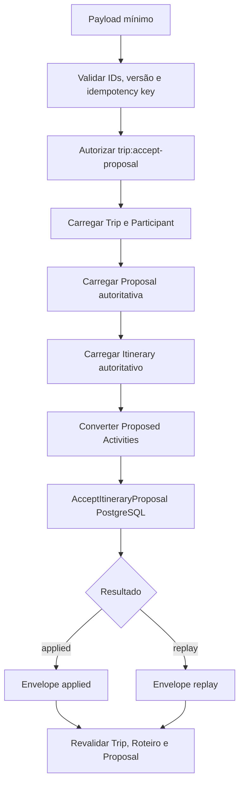

# RB-INC-091 — Server Action Autorizada para Aceitar Itinerary Proposal

## 1. Objetivo

Publicar a fronteira server-side que conecta a experiência web ao caso de uso PostgreSQL `AcceptItineraryProposal`, sem introduzir a interface de aceite neste incremento.

Issue: [#207](https://github.com/collapsy/Routebook/issues/207).

Branch: `feature/rb-inc-091-authorized-proposal-acceptance-action`.

Pull request: [#208](https://github.com/collapsy/Routebook/pull/208).

## 2. Contexto

RB-INC-072 a RB-INC-085 concluíram o contrato de aplicação, a transação PostgreSQL única, os fragments e a composition root concreta. RB-INC-086 a RB-INC-090 publicaram sessão Better Auth, Account Membership, autorização de Trip e o workspace autenticado.

A revisão de Itinerary Proposal ainda não possuía uma mutação web para executar o aceite real. Esta PR publica somente a Server Action e seu contrato serializável; confirmação, estados visuais e mensagens permanecem para incremento independente.

## 3. Decisões aplicadas

- a autorização `trip:accept-proposal` ocorre antes de carregar agregados;
- `actorType` e `actorId` nunca são lidos de `FormData`;
- o ator é derivado do User autorizado e confirmado como Participant da Trip;
- o navegador envia apenas identidade da Proposal, versão esperada e idempotency key;
- Itinerary, Proposal e Proposed Activities são carregados de repositories server-side;
- itens de aplicação são reconstruídos das Proposed Activities persistidas;
- `proposedOrder`, que é não negativo, é convertido para `targetOrder`, que é positivo;
- horários com segundos são normalizados para o contrato canônico `HH:mm` do Itinerary;
- `applied` e `replay` compartilham o mesmo envelope público serializável;
- caches são revalidados somente após sucesso;
- falhas técnicas desconhecidas não são convertidas em erro de domínio.

## 4. Fluxo

## 5. Escopo implementado

- contrato `AcceptItineraryProposalActionState`;
- validação do payload mínimo;
- resolução de acesso pela sessão e matriz de autorização;
- leitura autoritativa de Trip, Itinerary e Itinerary Proposal;
- derivação server-side do Participant ator;
- adapter de `ProposedActivity` para `ApplyProposalItem`;
- execução pela composition root PostgreSQL existente;
- mapeamento dos códigos oficiais de aceite;
- resposta estável para sucesso novo e replay;
- revalidação condicionada ao sucesso;
- testes unitários do contrato e do wrapper Next.js.

## 6. Fora de escopo

- botão de aceite;
- confirmação visual;
- bloqueio de clique duplicado na interface;
- estados de processamento e mensagens no componente;
- integração E2E integral;
- alteração da transação PostgreSQL ou dos fragments;
- alteração da matriz de roles.

## 7. Contrato público da ação

### Entrada controlada pelo navegador

- `itineraryProposalId`;
- `expectedItineraryVersion`;
- `idempotencyKey`.

O `tripId` é vinculado pela rota. Nenhum campo de ator ou coleção de itens é aceito.

### Sucesso

- `status: success`;
- `kind: applied | replay`;
- `tripId`;
- `itineraryId`;
- `itineraryProposalId`;
- `proposalApplicationId`;
- `decisionId`;
- `requestFingerprint`;
- `resultingItineraryVersion`;
- `appliedProposedActivityIds`.

### Erros recuperáveis

- `unauthenticated`;
- `not-found`;
- `invalid-request`;
- todos os códigos oficiais de `AcceptItineraryProposalError`;
- `technical-error` para a fronteira web, com log server-side da causa desconhecida.

## 8. Critérios de aceite

- [x] usuário não autenticado não executa o aceite;
- [x] usuário sem `trip:accept-proposal` não executa o aceite;
- [x] identidade do ator não vem do navegador;
- [x] Proposed Activities não vêm do navegador;
- [x] Participant canônico é derivado da Trip;
- [x] Proposal e Itinerary são validados contra a Trip;
- [x] versão concorrente é detectada;
- [x] Proposal não pronta ou expirada é rejeitada;
- [x] `applied` e `replay` retornam envelope estável;
- [x] códigos oficiais são preservados;
- [x] revalidação ocorre somente após sucesso;
- [x] testes unitários cobrem autorização, validação, mapeamento, sucesso e replay;
- [ ] registry e matriz de rastreabilidade atualizados;
- [ ] CI integral aprovado.

## 9. Riscos e mitigação

| Risco | Impacto | Mitigação |
| --- | --- | --- |
| ator forjado pelo cliente | Crítico | ator derivado exclusivamente da sessão e da Trip |
| itens adulterados | Crítico | reconstrução integral a partir da Proposal persistida |
| enumeração de Trip | Alto | negação normalizada como `not-found` |
| aplicação de versão obsoleta | Alto | comparação entre payload, Proposal e Itinerary |
| cache atualizado após falha | Médio | revalidação somente para `status: success` |
| divergência entre modelos de ordem | Médio | conversão explícita de índice não negativo para ordem positiva |

## 10. Rollback

Remover `accept-action.ts`, o adapter `itinerary-proposal-acceptance.ts` e seus testes. Nenhuma migration ou alteração de dados é necessária.

## 11. Evidências

- implementação: `apps/web/app/viagens/[tripId]/roteiro/proposta/accept-action.ts`;
- contrato e adapter: `apps/web/lib/itinerary-proposal-acceptance.ts`;
- testes: `accept-action.test.ts` e `itinerary-proposal-acceptance.test.ts`;
- CI: em validação na PR #208.
