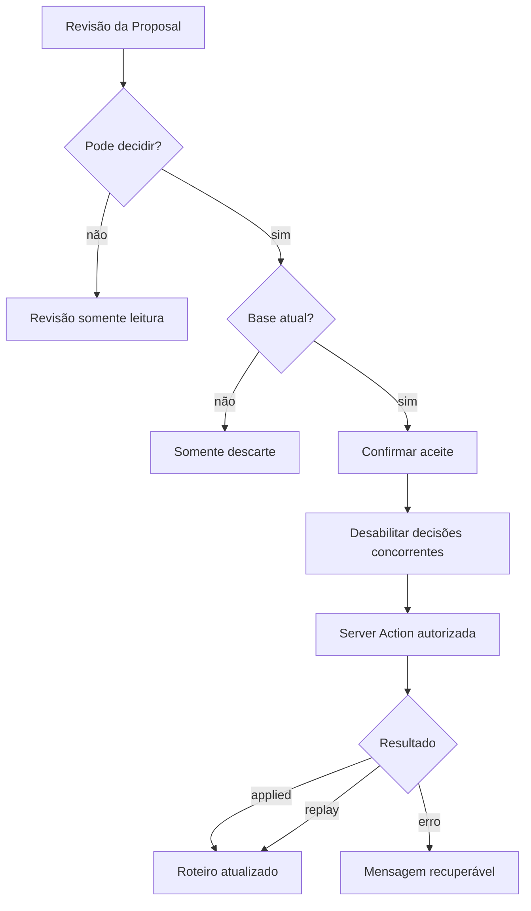

# RB-INC-092 — Experiência de Aceite da Itinerary Proposal

## 1. Objetivo

Integrar a Server Action autorizada do RB-INC-091 à revisão da Itinerary Proposal, preservando a separação conceitual entre sugestão e Roteiro confirmado.

Issue: [#209](https://github.com/collapsy/Routebook/issues/209).

Branch: `feature/rb-inc-092-itinerary-proposal-acceptance-experience`.

Pull request: [#210](https://github.com/collapsy/Routebook/pull/210).

## 2. Contexto

O backend transacional, a autorização e o contrato web de aceite já estão publicados. Faltava disponibilizar a decisão na experiência de revisão com confirmação explícita, prevenção de decisões concorrentes e feedback compreensível para `applied`, `replay` e erros recuperáveis.

## 3. Resultado verificável

- decisores autorizados visualizam o aceite somente em Proposal `ready` baseada na versão atual;
- usuários sem permissão recebem revisão somente leitura;
- Proposal obsoleta continua descartável pelo decisor, mas não aplicável;
- aceite exige confirmação explícita;
- o navegador envia somente identidade da Proposal, versão e idempotency key;
- aceite e descarte não podem ser acionados simultaneamente pela interface;
- processamento e erros são anunciados por regiões acessíveis;
- `applied` e `replay` conduzem ao Roteiro atualizado;
- o Roteiro apresenta confirmação específica após o aceite;
- o descarte existente exige autorização server-side.

## 4. Fluxo

## 5. Decisões de implementação

- permissão de decisão e elegibilidade de aceite são conceitos distintos;
- `trip:accept-proposal` governa aceitar e descartar nesta experiência;
- a idempotency key é estável por Proposal e versão-base;
- `actorId` e itens não existem no formulário;
- a confirmação usa checkbox obrigatório;
- `useActionState` controla resposta e pendência do aceite;
- descarte mantém ação independente, mas compartilha bloqueio visual;
- sucesso navega para o Roteiro com marcador `applied` ou `replay`;
- a página do Roteiro renderiza a confirmação e os dados revalidados.

## 6. Escopo

- componente client-side de decisões;
- estilos responsivos das ações;
- integração à revisão existente;
- resolução server-side da permissão;
- autorização do descarte;
- feedback de sucesso no Roteiro;
- testes de componente e ações;
- Context Pack, registry e rastreabilidade.

## 7. Fora de escopo

- novos contratos de domínio;
- migrations;
- alteração de roles;
- E2E integral do fluxo banco–UI;
- geração de Proposal;
- novas integrações com Recommendation.

## 8. Critérios de aceite

- [x] usuário sem permissão não visualiza decisões;
- [x] Proposal obsoleta não oferece aceite;
- [x] decisor pode descartar Proposal obsoleta;
- [x] confirmação explica a atualização do Roteiro;
- [x] checkbox explícito é obrigatório;
- [x] clique duplicado e decisão concorrente são bloqueados;
- [x] processamento usa `aria-live`;
- [x] erros recuperáveis são apresentados sem navegação;
- [x] `applied` e `replay` são sucessos;
- [x] Roteiro atualizado apresenta confirmação;
- [x] descarte exige autorização server-side;
- [x] comportamento responsivo foi implementado;
- [x] testes de componente e ações foram adicionados;
- [x] registry e matriz atualizados;
- [x] CI integral aprovado.

## 9. Segurança

- decisões não são renderizadas para viewer;
- descarte valida a sessão e `trip:accept-proposal` no servidor;
- identidade do ator e itens continuam derivados no servidor;
- revisão somente leitura não expõe mutações executáveis;
- negação de recurso continua normalizada como não encontrado.

## 10. Acessibilidade

- controles têm nomes acessíveis;
- confirmação usa elemento `details` e checkbox rotulado;
- pendência e sucesso usam região `aria-live`;
- erro usa `role=alert`;
- botões desabilitados impedem decisões concorrentes;
- layout de ações ocupa largura integral em viewport estreito.

## 11. Rollback

Remover o componente de decisões, restaurar a seção de descarte anterior, retirar o marcador de sucesso do Roteiro e reverter a autorização adicional do descarte. Não há alteração de schema ou dados.

## 12. Evidências

- experiência: `apps/web/components/itinerary-proposal-decision-actions.tsx`;
- integração: `apps/web/components/itinerary-proposal-review.tsx`;
- autorização: `apps/web/app/viagens/[tripId]/roteiro/proposta/actions.ts`;
- confirmação: `apps/web/app/viagens/[tripId]/roteiro/page.tsx`;
- testes: 540 testes de domínio, componentes e PostgreSQL aprovados;
- E2E: 65 cenários responsivos executados, com 64 aprovados diretamente e 1 aprovado após retry;
- Engineering Validation: run `30869999535`, job `91869867843`, SHA `76cda7553119a920134cbf4f48c7c9d8617bc099`;
- Documentation Validation: run `30869999538`, SHA `76cda7553119a920134cbf4f48c7c9d8617bc099`;
- gates confirmados: format, documentação, lint, typecheck, migrations, testes, smoke, build e Playwright responsivo.
