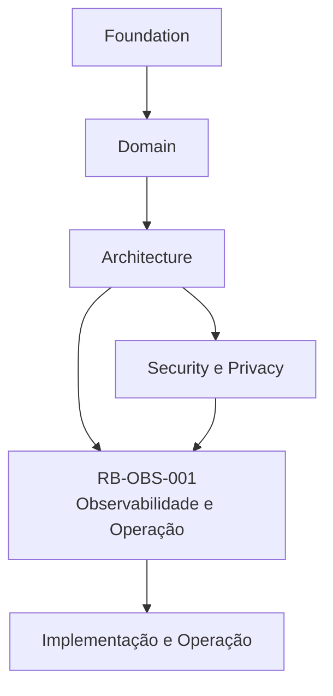
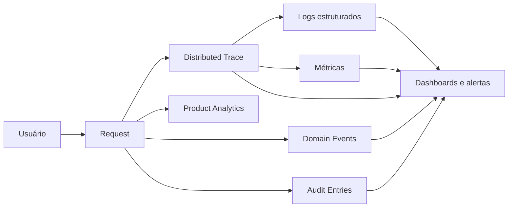
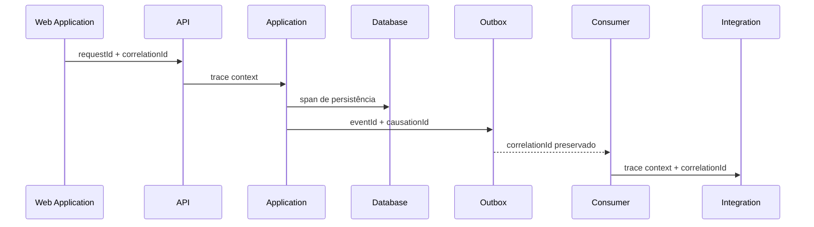
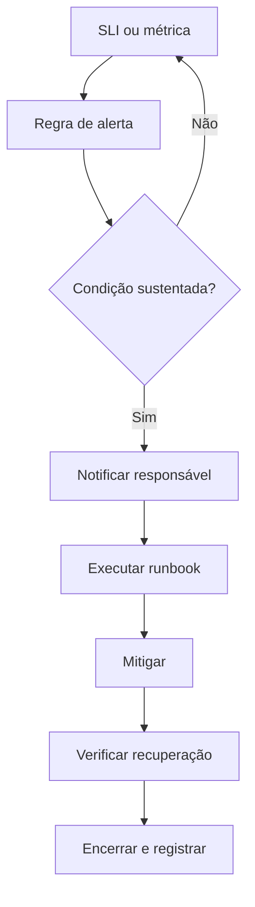
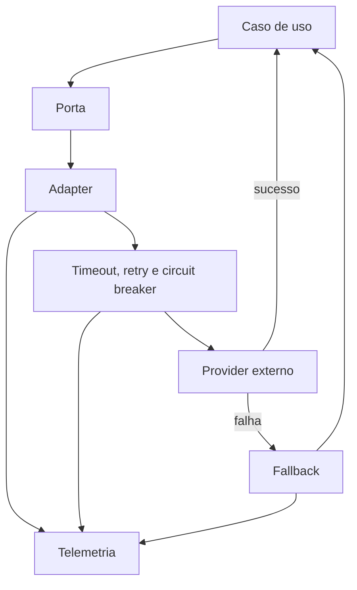
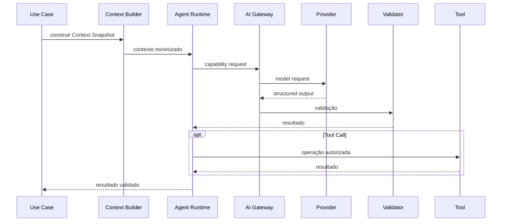
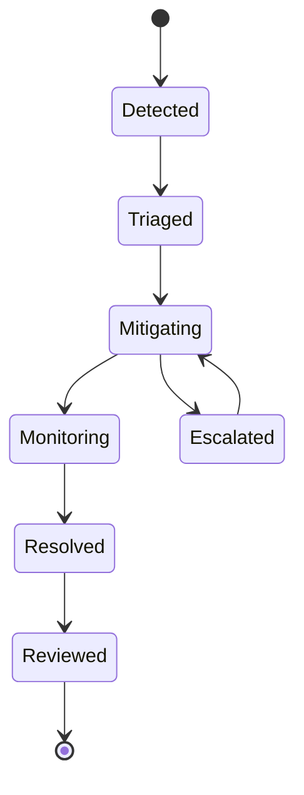

---

id: RB-OBS-001

title: Observabilidade e Operação
description: Define a estratégia oficial de observabilidade e operação do RouteBook, incluindo telemetria, logs, métricas, traces, SLIs, SLOs, alertas, incidentes, health checks, filas, jobs, integrações, inteligência artificial, custos, capacidade, segurança operacional e runbooks.

document_type: observability
owner: Platform

status: Draft
version: "0.1.0"

created: "2026-07-19"
last_updated: null

authors:

- RouteBook Team

tags:

- observability
- operations
- platform
- telemetry
- logs
- metrics
- tracing
- sli
- slo
- alerting
- incident-management
- runbooks
- ai-observability
- cost-observability
- diagrams
- mermaid

related_documents:

- RB-CORE-0001
- RB-CORE-0002
- RB-CORE-0003
- RB-CORE-0004
- RB-PRD-001
- RB-PRD-002
- RB-PRD-003
- RB-PRD-004
- RB-PRD-005
- RB-PRD-006
- RB-PRD-007
- RB-PRD-008
- RB-DOM-001
- RB-DOM-002
- RB-DOM-003
- RB-DOM-004
- RB-ARC-001
- RB-ARC-002
- RB-ARC-003
- RB-ARC-004
- RB-ARC-005
- RB-DATA-001
- RB-SEC-001
- RB-API-001

prerequisites:

- RB-CORE-0004
- RB-DOM-001
- RB-DOM-002
- RB-DOM-003
- RB-DOM-004
- RB-ARC-001
- RB-ARC-002
- RB-ARC-003
- RB-ARC-004
- RB-ARC-005

next_documents:

- RB-QA-001
- RB-OPS-001
- RB-SRE-001
- RB-AI-001

ai_context:
priority: critical
index: true
---

# RouteBook — Observabilidade e Operação

## Parte I — Fundamentos

### 1. Propósito deste documento

Este documento define a estratégia oficial de observabilidade e operação do RouteBook.

Seu objetivo é estabelecer como o sistema deverá ser observado, diagnosticado, operado e recuperado em ambientes reais, garantindo que pessoas e agentes autorizados consigam compreender:

* o estado atual da plataforma;
* o comportamento de cada módulo;
* a saúde dos serviços e dependências;
* a qualidade percebida pelo Usuário;
* a confiabilidade dos fluxos críticos;
* o desempenho das operações;
* o custo técnico e operacional;
* as causas de falhas;
* os impactos de incidentes;
* a evolução da capacidade;
* o comportamento de integrações;
* o funcionamento de filas e jobs;
* a execução de capacidades de IA;
* a aplicação de fallbacks;
* a ocorrência de violações de segurança;
* as ações necessárias para recuperação.

Este documento deverá orientar:

* Platform;
* Backend;
* Frontend;
* Infrastructure;
* DevOps;
* Site Reliability Engineering;
* Security;
* Data;
* Artificial Intelligence;
* Quality Assurance;
* Product;
* Support;
* agentes de engenharia;
* agentes operacionais.

Este documento não define:

* fornecedor obrigatório de observabilidade;
* ferramenta definitiva de logs;
* ferramenta definitiva de métricas;
* fornecedor de tracing;
* infraestrutura física final;
* escala definitiva da plataforma;
* política organizacional completa de plantão;
* contratos jurídicos de disponibilidade;
* metas comerciais definitivas;
* processos corporativos externos ao RouteBook.

---

### 2. Autoridade documental

A observabilidade e a operação deverão respeitar:

* a RouteBook Bible;
* a Linguagem Ubíqua;
* o Modelo de Domínio;
* as Regras e Invariantes;
* os Eventos e Ciclos de Vida;
* a Arquitetura de Módulos;
* a Arquitetura de Integrações;
* a Arquitetura de Dados;
* a Arquitetura de IA e Agentes;
* as políticas de segurança e privacidade.



A telemetria não poderá redefinir:

* conceitos de domínio;
* estados canônicos;
* ownership;
* severidades de Planning Conflict;
* regras;
* autorização;
* identidade;
* ciclos de vida;
* eventos oficiais.

---

### 3. Princípio central

O RouteBook deverá ser operável a partir de evidências.

```text
Estado do sistema
→ telemetria confiável
→ diagnóstico
→ decisão operacional
→ ação controlada
→ verificação do resultado
```

---

### 4. Observabilidade

Observabilidade é a capacidade de compreender o estado interno do sistema por meio de sinais externos.

Ela deverá permitir responder:

* o que aconteceu;
* quando aconteceu;
* onde aconteceu;
* quem ou o que iniciou;
* qual fluxo foi afetado;
* qual foi o impacto;
* qual dependência participou;
* qual versão estava em execução;
* qual regra ou fallback foi aplicado;
* se o sistema se recuperou.

---

### 5. Monitoramento

Monitoramento é a avaliação contínua de sinais conhecidos.

Monitoramento e observabilidade são complementares.

O monitoramento deverá detectar condições esperadas.

A observabilidade deverá permitir investigar condições inesperadas.

---

### 6. Operabilidade

Operabilidade é a capacidade de executar o sistema com segurança, previsibilidade e controle.

Ela inclui:

* implantação;
* configuração;
* diagnóstico;
* recuperação;
* escalabilidade;
* manutenção;
* resposta a incidentes;
* gestão de dependências;
* capacidade;
* custos;
* continuidade.

---

### 7. Objetivos

A estratégia deverá:

1. detectar falhas rapidamente;
2. reduzir tempo de diagnóstico;
3. reduzir tempo de recuperação;
4. preservar rastreabilidade;
5. proteger dados sensíveis;
6. observar fluxos de negócio;
7. observar dependências;
8. medir experiência do Usuário;
9. tornar filas e jobs visíveis;
10. tornar IA e agentes observáveis;
11. controlar custo;
12. apoiar planejamento de capacidade;
13. permitir auditoria;
14. evitar alertas sem ação;
15. permitir operação por runbooks;
16. sustentar evolução arquitetural.

---

## Parte II — Princípios de observabilidade

### 8. Observabilidade por padrão

Novas capacidades deverão nascer observáveis.

Nenhuma funcionalidade crítica deverá ser considerada completa sem:

* logs estruturados;
* métricas;
* tracing;
* health signal;
* alertas relevantes;
* dashboard quando necessário;
* runbook quando operacionalmente crítico.

---

### 9. Telemetria como contrato

Campos, nomes, unidades e semântica deverão ser estáveis e documentados.

Mudanças incompatíveis deverão ser versionadas.

---

### 10. Correlação ponta a ponta

Toda operação relevante deverá permitir correlação entre:

* interface;
* API;
* caso de uso;
* módulo;
* banco;
* cache;
* fila;
* job;
* integração;
* AI Gateway;
* Provider;
* evento;
* auditoria.

---

### 11. Baixa cardinalidade

Métricas deverão evitar labels de alta cardinalidade.

Não utilizar como label:

* UserId;
* TripId;
* ActivityId;
* RecommendationId;
* ItineraryProposalId;
* PlanningConflictId;
* email;
* URL completa;
* texto de erro dinâmico.

Esses dados poderão aparecer em logs ou traces protegidos quando necessários.

---

### 12. Segurança por padrão

Telemetria não deverá expor:

* secrets;
* tokens;
* senhas;
* credenciais;
* dados pessoais desnecessários;
* prompts completos;
* respostas completas de IA;
* Context Snapshots integrais;
* conteúdo de mensagens privadas;
* dados de outras Accounts.

---

### 13. Ação sobre alerta

Todo alerta deverá possuir ação operacional possível.

Se não houver ação, o sinal deverá permanecer em dashboard, relatório ou análise, não em alerta imediato.

---

### 14. Foco na experiência

A observabilidade deverá medir não apenas infraestrutura, mas também:

* sucesso das jornadas;
* disponibilidade funcional;
* latência percebida;
* qualidade das respostas;
* consistência dos dados;
* impacto sobre o Usuário.

---

### 15. Separação entre sinais

Logs, métricas, traces, eventos, auditoria e analytics possuem finalidades distintas.

Nenhum deles deverá ser utilizado como substituto universal dos demais.

---

## Parte III — Modelo de telemetria

### 16. Sinais fundamentais

O RouteBook deverá utilizar:

* logs;
* métricas;
* distributed traces;
* Domain Events;
* Audit Entries;
* health checks;
* profiling quando necessário;
* eventos de produto;
* sinais sintéticos.

---

### 17. Relação entre os sinais



---

### 18. Logs

Logs registram eventos discretos relevantes para diagnóstico e operação.

Devem responder:

* o que ocorreu;
* em qual componente;
* com qual resultado;
* qual contexto técnico;
* qual correlação;
* qual erro;
* qual versão.

---

### 19. Métricas

Métricas representam séries temporais agregáveis.

Devem ser usadas para:

* taxa;
* volume;
* duração;
* saturação;
* disponibilidade;
* erros;
* custo;
* qualidade;
* capacidade.

---

### 20. Traces

Traces representam o fluxo de uma operação distribuída.

Devem demonstrar:

* caminho percorrido;
* duração por etapa;
* dependências;
* falhas;
* retries;
* filas;
* ferramentas;
* Provider de IA;
* consultas relevantes.

---

### 21. Domain Events

Domain Events representam fatos confirmados do domínio.

Não deverão ser emitidos apenas para satisfazer observabilidade.

---

### 22. Audit Entries

Audit Entries representam ações e tentativas relevantes sob a perspectiva de segurança, autoria e responsabilidade.

---

### 23. Product Analytics

Product Analytics representa comportamento de uso e experiência.

Não deverá substituir telemetria técnica ou eventos de domínio.

---

## Parte IV — Contexto de correlação

### 24. Identificadores

A plataforma deverá utilizar, quando aplicável:

```text
correlationId
requestId
traceId
spanId
causationId
eventId
jobExecutionId
consumerId
idempotencyKeyHash
```

---

### 25. Correlation ID

`correlationId` identifica uma operação lógica ponta a ponta.

Ele deverá ser preservado entre:

* API;
* módulos;
* eventos;
* jobs;
* integrações;
* IA;
* ferramentas;
* projeções.

---

### 26. Request ID

`requestId` identifica uma requisição individual.

Uma correlação poderá possuir múltiplos Requests.

---

### 27. Causation ID

`causationId` identifica o evento ou comando que causou outro processamento.

Exemplo:

```text
RequestRecommendation
→ RecommendationGenerated
→ ProjectionUpdated
```

---

### 28. Trace ID

`traceId` deverá seguir o padrão do sistema de distributed tracing adotado.

---

### 29. Propagação



---

### 30. Geração

Quando ausente:

* o primeiro componente confiável deverá gerar `correlationId`;
* cada Request deverá gerar `requestId`;
* eventos deverão gerar `eventId`;
* processos assíncronos deverão preservar o contexto causal.

---

### 31. Exposição

Correlation IDs poderão ser apresentados ao Usuário em mensagens de suporte ou erro técnico.

IDs internos sensíveis não deverão ser expostos indiscriminadamente.

---

## Parte V — Logs estruturados

### 32. Formato

Logs deverão ser estruturados.

Exemplo conceitual:

```json
{
  "timestamp": "2026-07-19T14:30:00Z",
  "level": "INFO",
  "service": "routebook-api",
  "module": "Proposal Management",
  "environment": "production",
  "eventName": "itinerary_proposal_generation_completed",
  "correlationId": "correlation-reference",
  "traceId": "trace-reference",
  "durationMs": 842,
  "result": "success",
  "applicationVersion": "1.0.0"
}
```

---

### 33. Campos mínimos

Logs operacionais deverão considerar:

```text
timestamp
level
service
module
component
environment
eventName
message
correlationId
requestId
traceId
spanId
result
errorCode
durationMs
applicationVersion
```

---

### 34. Níveis

#### TRACE

Uso restrito para diagnóstico detalhado e temporário.

#### DEBUG

Detalhes de desenvolvimento e investigação.

#### INFO

Eventos operacionais normais relevantes.

#### WARN

Condição inesperada ou degradada sem falha completa.

#### ERROR

Operação falhou ou produziu resultado inválido.

#### FATAL

Processo não consegue continuar com segurança.

---

### 35. Regras de uso

Não utilizar `ERROR` para:

* validação esperada do Usuário;
* recurso não encontrado esperado;
* autorização negada corretamente;
* conflito de versão esperado;
* regra de domínio aplicada com sucesso.

Esses casos poderão ser `INFO` ou `WARN`, conforme impacto operacional.

---

### 36. Códigos de erro

Erros deverão possuir códigos estáveis.

Exemplos:

```text
RB_AUTH_FORBIDDEN
RB_TRIP_NOT_FOUND
RB_ITINERARY_VERSION_CONFLICT
RB_PROPOSAL_EXPIRED
RB_AI_SCHEMA_INVALID
RB_INTEGRATION_TIMEOUT
RB_OUTBOX_PUBLICATION_FAILED
```

---

### 37. Exceptions

Exceptions deverão ser registradas:

* uma vez no limite apropriado;
* com stack trace quando necessário;
* sem duplicação em cada camada;
* sem dados sensíveis;
* com errorCode;
* com correlação.

---

### 38. Eventos de domínio em logs

Domain Events poderão gerar logs resumidos, mas o log não deverá substituir o Event Store, Outbox ou contrato de evento.

---

### 39. Dados proibidos

Não registrar:

* Authorization header;
* cookies de sessão;
* access token;
* refresh token;
* senha;
* chave de API;
* número completo de cartão;
* documento pessoal;
* endereço completo sem necessidade;
* localização precisa desnecessária;
* prompt de sistema;
* contexto integral de IA;
* dados pessoais de Travelers.

---

### 40. Sanitização

A plataforma deverá possuir sanitização central para:

* headers;
* query parameters;
* bodies;
* exceptions;
* tool arguments;
* responses externas;
* prompts;
* URLs.

---

### 41. Retenção de logs

A retenção deverá variar por finalidade:

| Categoria             | Retenção relativa           |
| --------------------- | --------------------------- |
| logs de aplicação     | operacional                 |
| logs de segurança     | ampliada                    |
| logs de debug         | curta                       |
| logs de auditoria     | política própria            |
| logs de IA            | minimizada                  |
| logs com erro crítico | ampliada conforme incidente |

Valores definitivos deverão ser definidos por política operacional e jurídica.

---

## Parte VI — Métricas

### 42. Convenções

Métricas deverão possuir:

* nome estável;
* unidade explícita;
* descrição;
* owner;
* labels controladas;
* tipo adequado;
* finalidade documentada.

---

### 43. Tipos

* Counter;
* Gauge;
* Histogram;
* Summary, quando justificado.

---

### 44. Convenção de nomes

Exemplos conceituais:

```text
routebook_http_requests_total
routebook_http_request_duration_seconds
routebook_use_case_executions_total
routebook_domain_rule_rejections_total
routebook_outbox_pending_messages
routebook_job_execution_duration_seconds
routebook_ai_requests_total
routebook_ai_cost_total
```

---

### 45. Labels permitidas

Exemplos:

```text
service
module
operation
method
routeTemplate
statusClass
result
errorCategory
provider
modelFamily
environment
consumer
jobType
```

---

### 46. Labels proibidas

Evitar:

```text
tripId
userId
accountId
placeId
email
fullUrl
rawErrorMessage
promptId dinâmico
queryText
```

---

### 47. Golden Signals

Cada componente deverá observar:

* latency;
* traffic;
* errors;
* saturation.

---

### 48. RED Method

Para serviços e APIs:

* Rate;
* Errors;
* Duration.

---

### 49. USE Method

Para recursos:

* Utilization;
* Saturation;
* Errors.

---

### 50. Métricas de aplicação

* requisições;
* casos de uso;
* falhas;
* latência;
* retries;
* conflitos de versão;
* validações rejeitadas;
* cache hit;
* cache miss;
* consultas lentas;
* transações revertidas.

---

### 51. Métricas de domínio

Exemplos:

```text
recommendations_generated_total
recommendations_accepted_total
recommendations_rejected_total
itinerary_proposals_generated_total
itinerary_proposals_applied_total
planning_conflicts_detected_total
planning_conflicts_resolved_total
planning_risks_ignored_total
travel_estimates_failed_total
```

As métricas deverão refletir eventos confirmados.

---

### 52. Métricas de UX

* taxa de sucesso por jornada;
* tempo até primeira resposta;
* tempo até Recommendation;
* tempo até Itinerary Proposal;
* taxa de erro visível;
* carregamento de páginas;
* Web Vitals;
* falhas de interação;
* estados vazios inesperados.

---

### 53. Métricas de infraestrutura

* CPU;
* memória;
* disco;
* conexões;
* threads;
* file descriptors;
* largura de banda;
* utilização de pool;
* queue depth;
* garbage collection;
* restarts.

---

## Parte VII — Distributed tracing

### 54. Escopo

Tracing deverá cobrir:

* entrada HTTP;
* casos de uso;
* chamadas entre módulos;
* banco;
* cache;
* mensageria;
* jobs;
* integrações externas;
* AI Gateway;
* Tool Calls;
* projeções;
* armazenamento de arquivos.

---

### 55. Spans

Spans deverão representar unidades significativas.

Exemplos:

```text
HTTP POST /trips/{tripId}/recommendations
DecisionIntelligence.RequestRecommendation
ContextBuilder.Build
PlaceCatalog.SearchPlaces
Mobility.GetTravelEstimates
AI.TravelDecisionAgent.Generate
RecommendationRepository.Save
Outbox.Append
```

---

### 56. Atributos

Spans poderão incluir:

```text
service.name
module.name
operation.name
http.route
http.method
http.status_code
db.system
db.operation
messaging.system
messaging.operation
ai.provider
ai.model_family
ai.capability
result
error.code
```

---

### 57. Atributos sensíveis

Não incluir:

* corpo integral;
* prompt completo;
* query SQL com valores;
* email;
* endereço;
* coordenada precisa;
* conteúdo de Preference;
* dados completos de Traveler.

---

### 58. Sampling

A estratégia deverá combinar:

* amostragem padrão;
* retenção de traces com erro;
* retenção de traces lentos;
* aumento temporário durante incidente;
* proteção contra custo excessivo.

---

### 59. Traces assíncronos

Eventos e jobs deverão preservar:

* trace context quando tecnicamente possível;
* correlationId;
* causationId;
* eventId.

---

### 60. Exemplo de fluxo rastreável


---

## Parte VIII — Health checks

### 61. Objetivo

Health checks deverão indicar se um componente:

* está vivo;
* está pronto;
* consegue atender;
* está degradado;
* possui dependências essenciais disponíveis.

---

### 62. Liveness

Indica se o processo está em execução.

Não deverá depender de serviços externos.

---

### 63. Readiness

Indica se o processo está apto a receber tráfego.

Poderá considerar:

* banco;
* configuração;
* migrations;
* dependências essenciais;
* conexão com mensageria.

---

### 64. Startup

Indica conclusão da inicialização.

Útil para:

* migrations;
* carregamento de configuração;
* warm-up;
* inicialização de caches;
* registro de consumers.

---

### 65. Dependency health

Dependências deverão possuir health signal separado.

Exemplos:

* database;
* cache;
* queue;
* object storage;
* identity provider;
* external maps provider;
* AI provider.

---

### 66. Estado degradado

Uma dependência não essencial indisponível poderá produzir estado degradado sem retirar todo o serviço de operação.

---

### 67. Health check superficial

Health checks não deverão executar operações pesadas, longas ou de alto custo.

---

### 68. Health check e alerta

Health check não substitui SLI, SLO ou alerta.

---

## Parte IX — SLIs, SLOs e error budgets

### 69. Service Level Indicator

SLI é uma medida de qualidade observada.

---

### 70. Service Level Objective

SLO é o objetivo interno para um SLI.

---

### 71. Service Level Agreement

SLA é um compromisso formal externo.

Este documento prioriza SLIs e SLOs internos.

---

### 72. Error budget

Error budget representa a margem de falha permitida por um SLO.

---

### 73. Critérios para SLI

Um SLI deverá:

* representar experiência;
* ser mensurável;
* possuir owner;
* ter janela;
* possuir fonte confiável;
* evitar métricas de vaidade.

---

### 74. SLIs iniciais

#### Disponibilidade da API

Proporção de requisições válidas atendidas com sucesso técnico.

#### Latência da API

Percentis de duração por rota e operação.

#### Sucesso de Recommendation

Proporção de solicitações que resultam em Recommendation válida.

#### Sucesso de Itinerary Proposal

Proporção de solicitações que produzem Proposal válida e revisável.

#### Atualização de projeções

Tempo entre Evento e atualização do read model.

#### Publicação de Outbox

Tempo entre commit e publicação do evento.

#### Execução de jobs

Proporção de jobs concluídos dentro da janela esperada.

---

### 75. SLOs candidatos

Os valores abaixo são referências iniciais e deverão ser validados por evidência:

| Capacidade         | SLI                     | Objetivo inicial |
| ------------------ | ----------------------- | ---------------: |
| API essencial      | disponibilidade         |            99,9% |
| leitura principal  | p95 de latência         | menor que 500 ms |
| escrita principal  | p95 de latência         |    menor que 1 s |
| Recommendation     | conclusão válida        |              99% |
| Proposal           | conclusão válida        |              98% |
| Outbox             | publicação em até 60 s  |            99,9% |
| projeções críticas | atualização em até 60 s |            99,5% |
| jobs críticos      | conclusão na janela     |              99% |

Esses valores não representam SLA comercial aprovado.

---

### 76. Definição de sucesso

Cada SLI deverá especificar:

* evento total;
* evento bem-sucedido;
* exclusões;
* janela;
* fonte;
* tolerância;
* tratamento de tráfego inválido.

---

### 77. Burn rate

Alertas de SLO deverão considerar consumo do error budget em múltiplas janelas.

---

### 78. Uso do error budget

Quando o consumo exceder limites:

* reduzir mudanças de risco;
* priorizar confiabilidade;
* revisar capacidade;
* corrigir causas;
* adiar expansão de autonomia;
* reforçar testes.

---

## Parte X — Alertas

### 79. Princípio

Alertas deverão indicar necessidade de intervenção.

---

### 80. Características

Um bom alerta deverá possuir:

* condição clara;
* impacto;
* severidade;
* owner;
* canal;
* runbook;
* ação;
* critério de recuperação;
* proteção contra flapping.

---

### 81. Severidades operacionais

#### SEV-1

Indisponibilidade ampla ou risco crítico.

#### SEV-2

Degradação significativa de capacidade essencial.

#### SEV-3

Falha parcial, localizada ou com workaround.

#### SEV-4

Condição não urgente para investigação planejada.

---

### 82. Não confundir severidades

Severidade operacional não é a mesma coisa que:

* severidade de Planning Conflict;
* prioridade de produto;
* gravidade de bug;
* classificação de segurança.

---

### 83. Categorias de alerta

* disponibilidade;
* latência;
* taxa de erro;
* saturação;
* banco;
* filas;
* jobs;
* integrações;
* IA;
* custo;
* segurança;
* dados;
* projeções;
* backups.

---

### 84. Alertas essenciais

Exemplos:

```text
API error rate elevada
API latency elevada
database connections saturadas
outbox backlog crescente
consumer parado
dead-letter queue crescendo
job crítico atrasado
projection lag elevado
AI provider indisponível
AI schema rejection elevada
integration timeout elevado
cost anomaly detectada
backup falhou
security event crítico
```

---

### 85. Anti-alertas

Não criar alertas imediatos para:

* um único erro isolado;
* warning sem impacto;
* métrica sem owner;
* evento sem ação;
* baixa utilização;
* falha transitória já recuperada;
* comportamento conhecido e aceitável.

---

### 86. Fluxo de alerta



---

## Parte XI — Dashboards

### 87. Objetivo

Dashboards deverão responder perguntas operacionais específicas.

---

### 88. Dashboard executivo

Deverá apresentar:

* disponibilidade;
* SLOs;
* incidentes;
* custo;
* crescimento;
* capacidade;
* tendências.

---

### 89. Dashboard de plataforma

* requests;
* errors;
* latency;
* saturation;
* deployments;
* database;
* cache;
* queues;
* jobs;
* dependencies.

---

### 90. Dashboard por módulo

Cada módulo crítico deverá possuir:

* volume;
* sucesso;
* erro;
* latência;
* eventos;
* regras rejeitadas;
* dependências;
* backlog.

---

### 91. Dashboard de jornada

Exemplos:

* criar Trip;
* configurar Traveler Profile;
* buscar Place;
* salvar Place;
* gerar Recommendation;
* gerar Proposal;
* aplicar Proposal;
* resolver Planning Conflict.

---

### 92. Dashboard de IA

* requests;
* success;
* validation rejection;
* latency;
* token usage;
* cost;
* fallback;
* Provider health;
* model distribution;
* tool calls;
* quality signals.

---

### 93. Dashboard de incidentes

* incidentes ativos;
* severidade;
* duração;
* owner;
* serviços afetados;
* status;
* comunicação.

---

### 94. Regras de dashboard

Evitar:

* excesso de gráficos;
* métricas sem contexto;
* duplicação;
* painéis sem owner;
* valores sem unidade;
* métricas de alta cardinalidade;
* misturar produção e desenvolvimento.

---

## Parte XII — Filas, Outbox e Inbox

### 95. Outbox

Deverá ser observado:

* pending messages;
* publication latency;
* publication failures;
* retry count;
* oldest pending message;
* throughput;
* duplicate attempts.

---

### 96. Inbox

Deverá ser observado:

* messages received;
* messages processed;
* deduplications;
* processing failures;
* retry count;
* oldest unprocessed message;
* poison messages.

---

### 97. Consumers

Cada consumer deverá possuir:

* consumerId;
* owner;
* versão;
* throughput;
* lag;
* error rate;
* retry policy;
* dead-letter policy;
* runbook.

---

### 98. Dead-letter queue

Itens enviados para dead-letter deverão gerar:

* métrica;
* log;
* contexto;
* alerta conforme impacto;
* possibilidade de replay controlado.

---

### 99. Replay

Replay deverá:

* ser autorizado;
* ser auditado;
* preservar idempotência;
* permitir escopo limitado;
* possuir modo de simulação quando possível;
* impedir duplicação de efeitos.

---

### 100. Fluxo observável


---

## Parte XIII — Jobs e processos assíncronos

### 101. Job Execution

Cada execução deverá registrar:

```text
jobExecutionId
jobType
status
scheduledAt
startedAt
completedAt
attempt
checkpoint
correlationId
errorCode
```

---

### 102. Métricas de job

* executions;
* success;
* failure;
* duration;
* delay;
* retries;
* skipped;
* concurrent executions;
* checkpoint progress.

---

### 103. Jobs críticos

Exemplos:

* publicação de Outbox;
* atualização de projeções;
* recalcular Travel Estimates;
* invalidar Recommendations;
* expirar Proposals;
* revisar Data Freshness;
* aplicar retenção;
* backups;
* verificações de integridade.

---

### 104. Proteção contra concorrência

Jobs deverão utilizar:

* idempotência;
* lock quando justificado;
* checkpoint;
* controle de concorrência;
* versionamento;
* limite de retry.

---

### 105. Jobs atrasados

O atraso deverá ser medido contra a janela esperada, não apenas pelo status final.

---

### 106. Recuperação

Jobs deverão permitir:

* restart;
* retry;
* resume;
* replay;
* cancelamento seguro;
* diagnóstico.

---

## Parte XIV — Integrações externas

### 107. Escopo

Integrações poderão incluir:

* identity provider;
* mapas;
* geocodificação;
* rotas;
* Places;
* imagens;
* clima;
* calendários;
* AI Providers;
* notificações;
* armazenamento.

---

### 108. Métricas de integração

* requests;
* success;
* failure;
* latency;
* timeout;
* rate limit;
* retries;
* circuit breaker;
* fallback;
* quota consumption;
* data freshness.

---

### 109. Dependência crítica versus opcional

Cada integração deverá ser classificada.

#### Crítica

Sem ela, a capacidade essencial não funciona.

#### Opcional

A capacidade poderá operar com fallback ou degradação.

---

### 110. Circuit breaker

Aberturas e fechamentos deverão ser observados.

---

### 111. Rate limit

A plataforma deverá observar:

* quota restante;
* throttling;
* retries;
* rejeições;
* consumo por capacidade.

---

### 112. Fallback

O uso de fallback deverá registrar:

* integração principal;
* integração alternativa;
* motivo;
* impacto;
* duração;
* custo.

---

### 113. Data Freshness

Integrações de dados deverão observar:

* collectedAt;
* lastVerifiedAt;
* validUntil;
* freshnessStatus;
* stale usage.

---

### 114. Fluxo de integração



---

## Parte XV — Observabilidade de inteligência artificial

### 115. Princípio

IA deverá ser observável sem expor dados sensíveis ou cadeia interna de raciocínio.

---

### 116. Dimensões

Deverão ser observadas:

* disponibilidade;
* latência;
* custo;
* uso de tokens;
* qualidade;
* validade estrutural;
* segurança;
* uso de ferramentas;
* fallback;
* Provider;
* modelo;
* capacidade;
* versão de prompt.

---

### 117. Metadados

Execuções de IA deverão registrar:

```text
capabilityId
agentId
agentVersion
provider
modelFamily
promptId
promptVersion
schemaVersion
contextHash
status
latencyMs
inputTokenCount
outputTokenCount
estimatedCost
toolCallCount
fallbackUsed
validationStatus
correlationId
```

---

### 118. Dados que não deverão ser registrados

* prompt completo;
* resposta integral;
* cadeia de raciocínio;
* Context Snapshot completo;
* dados pessoais;
* secrets;
* tool arguments sensíveis;
* tool outputs integrais.

---

### 119. Métricas de IA

```text
routebook_ai_requests_total
routebook_ai_request_duration_seconds
routebook_ai_tokens_total
routebook_ai_cost_total
routebook_ai_output_validation_failures_total
routebook_ai_tool_calls_total
routebook_ai_fallback_total
routebook_ai_provider_errors_total
routebook_ai_safety_rejections_total
```

---

### 120. Métricas de qualidade

* schema validity;
* reference validity;
* domain rejection;
* human acceptance;
* human edit rate;
* fallback success;
* hallucination report rate;
* tool failure rate;
* Recommendation acceptance;
* Proposal acceptance.

---

### 121. Tool Calls

Cada Tool Call deverá registrar:

* toolId;
* toolVersion;
* result;
* duration;
* authorization result;
* retry;
* errorCode;
* correlationId.

---

### 122. Loops

O Agent Runtime deverá observar:

* número de etapas;
* repetição de ferramentas;
* uso excessivo de tokens;
* tempo total;
* loops interrompidos.

---

### 123. Prompt injection

Sinais possíveis:

* tentativa de substituir instruções;
* solicitação de secrets;
* tool arguments anômalos;
* conteúdo externo marcado como instrução;
* tentativa de exfiltração;
* ferramenta fora do escopo.

Esses sinais poderão alimentar eventos de segurança.

---

### 124. Fallback de IA

O fallback deverá ser observável por:

* motivo;
* Provider original;
* Provider alternativo;
* método determinístico;
* qualidade;
* custo;
* latência.

---

### 125. Fluxo de IA observável



---

## Parte XVI — Observabilidade de segurança

### 126. Objetivo

A observabilidade de segurança deverá detectar e apoiar investigação de:

* autenticação suspeita;
* autorização negada;
* abuso de API;
* exfiltração;
* acesso entre Accounts;
* uso indevido de tools;
* alterações críticas;
* vazamento de secrets;
* comportamento automatizado anômalo.

---

### 127. Eventos relevantes

* falhas repetidas de autenticação;
* mudança de papel;
* transferência de ownership;
* acesso negado;
* tentativa de acesso cross-account;
* exportação de dados;
* exclusão de Account;
* Ignore Planning Risk;
* aplicação de Proposal;
* uso de ferramenta crítica;
* alteração de Restriction mandatory.

---

### 128. Logs de segurança

Deverão possuir retenção, acesso e proteção diferenciados.

---

### 129. Alertas de segurança

Alertas deverão ser integrados ao processo de resposta a incidentes de segurança.

---

### 130. Segregação

Acesso a logs e dashboards deverá seguir:

* least privilege;
* finalidade;
* ambiente;
* classificação;
* auditoria.

---

### 131. Secrets

Secrets nunca deverão aparecer em:

* logs;
* traces;
* métricas;
* dashboards;
* mensagens de erro;
* eventos;
* arquivos de diagnóstico.

---

## Parte XVII — Observabilidade de dados

### 132. Objetivo

Garantir qualidade, integridade, Freshness e rastreabilidade.

---

### 133. Métricas

* registros stale;
* conflitos de dados;
* falhas de ingestão;
* falhas de reconciliação;
* Provenance ausente;
* backfill pendente;
* migration failure;
* projection lag;
* inconsistência detectada;
* registros órfãos;
* falha de constraint.

---

### 134. Integridade

Verificações periódicas poderão validar:

* referências;
* versões;
* unicidade;
* estados;
* timestamps;
* Outbox;
* Inbox;
* projeções;
* retenção.

---

### 135. Migrations

Cada migration deverá observar:

* duração;
* locks;
* linhas processadas;
* falhas;
* rollback;
* impacto;
* compatibilidade.

---

### 136. Backfill

Backfills deverão possuir:

* jobExecutionId;
* checkpoint;
* progresso;
* taxa;
* erro;
* estimativa;
* impacto;
* possibilidade de interrupção.

---

### 137. Projection lag

Projeções críticas deverão possuir SLI de atraso.

---

## Parte XVIII — Frontend e experiência

### 138. Real User Monitoring

A aplicação web deverá observar:

* page load;
* route transition;
* Web Vitals;
* JavaScript errors;
* failed requests;
* network latency;
* interaction latency;
* rendering issues.

---

### 139. Core Web Vitals

Quando aplicável:

* Largest Contentful Paint;
* Interaction to Next Paint;
* Cumulative Layout Shift.

---

### 140. Session replay

Session replay, se adotado, deverá:

* mascarar dados;
* excluir campos sensíveis;
* possuir consentimento quando necessário;
* respeitar retenção;
* permitir desativação.

---

### 141. Erros de frontend

Deverão conter:

* aplicação;
* versão;
* rota;
* navegador;
* ambiente;
* correlationId;
* stack trace sanitizada;
* status da API relacionada.

---

### 142. Offline e degradação

Estados offline, cache stale e falhas de sincronização deverão ser observáveis.

---

### 143. Experiência percebida

A telemetria deverá diferenciar:

* sucesso técnico;
* sucesso funcional;
* sucesso percebido.

Uma resposta HTTP 200 poderá ainda representar falha funcional.

---

## Parte XIX — Capacidade e desempenho

### 144. Planejamento de capacidade

Deverá considerar:

* crescimento de Accounts;
* Trips;
* Places;
* Activities;
* Recommendations;
* Proposals;
* Events;
* jobs;
* imagens;
* chamadas externas;
* chamadas de IA.

---

### 145. Indicadores

* requests per second;
* concurrent users;
* database utilization;
* storage growth;
* queue backlog;
* worker utilization;
* cache utilization;
* external quota;
* AI token usage;
* cost per Trip.

---

### 146. Saturação

Saturação deverá ser observada antes de indisponibilidade.

---

### 147. Testes de carga

Deverão utilizar jornadas representativas.

---

### 148. Limites operacionais

Cada serviço ou componente crítico deverá documentar:

* throughput esperado;
* limite seguro;
* limite máximo;
* comportamento de degradação;
* estratégia de escala.

---

### 149. Escalabilidade

Escala horizontal ou vertical deverá ser adotada por evidência.

---

### 150. Performance budget

Fluxos críticos deverão possuir budgets de:

* frontend;
* API;
* banco;
* integração;
* IA;
* processamento assíncrono.

---

## Parte XX — Observabilidade de custos

### 151. Princípio

Custo deverá ser tratado como sinal operacional.

---

### 152. Dimensões

Custos deverão ser atribuíveis a:

* ambiente;
* serviço;
* módulo;
* capacidade;
* Provider;
* modelo;
* storage;
* tráfego;
* job;
* integração.

---

### 153. Métricas

* custo total;
* custo por Account;
* custo por Trip;
* custo por Recommendation;
* custo por Proposal;
* custo por imagem;
* custo por chamada externa;
* custo por token;
* custo de armazenamento;
* custo de observabilidade.

---

### 154. Anomalias

A plataforma deverá detectar:

* crescimento inesperado;
* loop de jobs;
* loop de agentes;
* retries excessivos;
* cardinalidade elevada;
* retenção excessiva;
* consumo anormal de Provider;
* tráfego abusivo.

---

### 155. Budget

Capacidades de IA, integrações e jobs deverão possuir limites de custo.

---

### 156. Custo de observabilidade

A estratégia deverá controlar:

* volume de logs;
* retenção;
* sampling;
* cardinalidade;
* traces;
* dashboards;
* queries.

---

## Parte XXI — Gestão de incidentes

### 157. Incidente

Incidente é uma interrupção ou degradação não planejada que afeta confiabilidade, segurança ou experiência.

---

### 158. Ciclo



---

### 159. Etapas

1. detecção;
2. triagem;
3. classificação;
4. atribuição;
5. mitigação;
6. recuperação;
7. validação;
8. comunicação;
9. encerramento;
10. revisão.

---

### 160. Papéis

#### Incident Commander

Coordena resposta.

#### Technical Lead

Conduz investigação técnica.

#### Communications Lead

Gerencia comunicação.

#### Scribe

Registra linha do tempo.

Em equipes pequenas, uma pessoa poderá exercer mais de um papel.

---

### 161. Linha do tempo

Deverá registrar:

* detecção;
* primeiro impacto;
* alerta;
* início da resposta;
* mitigação;
* recuperação;
* encerramento;
* decisões.

---

### 162. Mitigação

Prioridade inicial:

1. proteger dados;
2. reduzir impacto;
3. restaurar capacidade;
4. preservar evidência;
5. corrigir causa.

---

### 163. Comunicação

A comunicação deverá ser:

* clara;
* factual;
* temporal;
* sem especulação;
* atualizada;
* adequada ao público.

---

### 164. Pós-incidente

Incidentes relevantes deverão gerar revisão sem culpa.

---

### 165. Postmortem

Deverá conter:

* resumo;
* impacto;
* duração;
* linha do tempo;
* causa;
* fatores contribuintes;
* detecção;
* mitigação;
* o que funcionou;
* o que falhou;
* ações;
* owners;
* prazos.

---

### 166. Ações

Ações deverão ser:

* específicas;
* priorizadas;
* atribuídas;
* rastreáveis;
* verificáveis.

---

## Parte XXII — Runbooks

### 167. Objetivo

Runbooks transformam alertas em ações operacionais seguras.

---

### 168. Estrutura mínima

Cada runbook deverá conter:

```text
Título
Owner
Serviço ou capacidade
Sintoma
Impacto
Alertas relacionados
Pré-requisitos
Diagnóstico
Mitigação
Recuperação
Verificação
Rollback
Escalonamento
Riscos
Referências
```

---

### 169. Runbooks iniciais

* API indisponível;
* latência elevada;
* banco saturado;
* Outbox acumulada;
* Consumer parado;
* DLQ crescendo;
* job crítico falhando;
* Projection lag elevado;
* integração externa indisponível;
* AI Provider indisponível;
* custo anormal de IA;
* backup falhou;
* migration falhou;
* vazamento potencial de secret;
* incidente cross-account.

---

### 170. Execução

Runbooks deverão evitar comandos destrutivos sem:

* confirmação;
* autorização;
* backup;
* escopo;
* rollback.

---

### 171. Automação

Etapas repetitivas e seguras poderão ser automatizadas.

Automação não deverá eliminar supervisão de ações críticas.

---

### 172. Teste

Runbooks críticos deverão ser testados periodicamente.

---

## Parte XXIII — Deployments e mudanças

### 173. Telemetria de deployment

Cada deployment deverá registrar:

* versão;
* commit;
* ambiente;
* iniciado em;
* concluído em;
* status;
* duração;
* responsável;
* estratégia;
* rollback.

---

### 174. Marcadores

Dashboards deverão exibir deployments e mudanças relevantes.

---

### 175. Progressive delivery

Quando adotado:

* canary;
* feature flags;
* gradual rollout;
* segmentação;
* análise automática;
* rollback.

---

### 176. Mudança e SLO

Deployments deverão ser correlacionados com:

* error rate;
* latency;
* saturation;
* falhas;
* qualidade;
* custo.

---

### 177. Rollback

Rollback deverá ser:

* documentado;
* testado;
* observável;
* compatível com migrations.

---

### 178. Feature flags

Flags deverão possuir:

* owner;
* finalidade;
* criado em;
* expiração;
* métricas;
* plano de remoção.

---

## Parte XXIV — Backups e recuperação

### 179. Backup

Backups deverão possuir:

* escopo;
* frequência;
* retenção;
* criptografia;
* localização;
* owner;
* teste de restauração.

---

### 180. Recovery Point Objective

RPO define perda máxima aceitável de dados.

---

### 181. Recovery Time Objective

RTO define tempo máximo esperado para recuperação.

---

### 182. Valores

RPO e RTO deverão ser definidos por criticidade.

---

### 183. Teste de restauração

Backup sem teste de restauração não deverá ser considerado comprovado.

---

### 184. Métricas

* backup success;
* backup duration;
* backup age;
* restore test success;
* restore duration;
* replica lag.

---

### 185. Disaster recovery

Cenários deverão considerar:

* perda de banco;
* corrupção;
* indisponibilidade regional;
* perda de credenciais;
* falha de Provider;
* exclusão acidental;
* deployment inválido.

---

## Parte XXV — Ambientes

### 186. Ambientes iniciais

* local;
* development;
* test;
* staging;
* production.

---

### 187. Separação

Telemetria deverá ser separada por ambiente.

---

### 188. Produção

Produção deverá possuir:

* retenção adequada;
* alertas;
* SLOs;
* acesso controlado;
* dashboards;
* runbooks;
* auditoria.

---

### 189. Desenvolvimento

Ambientes não produtivos poderão possuir maior detalhamento, mas não deverão receber dados reais desnecessários.

---

### 190. Staging

Deverá permitir validar:

* tracing;
* alertas;
* dashboards;
* integrações;
* migrations;
* jobs;
* runbooks;
* fallbacks.

---

## Parte XXVI — Governança de telemetria

### 191. Owner

O owner deste documento é:

```text
Platform
```

A manutenção deverá envolver:

* Architecture;
* Backend;
* Frontend;
* Security;
* Data;
* Artificial Intelligence;
* Quality Assurance;
* Product.

---

### 192. Catálogo de telemetria

A plataforma deverá manter catálogo contendo:

* nome;
* tipo;
* descrição;
* owner;
* unidade;
* labels;
* retenção;
* dashboard;
* alerta relacionado;
* classificação.

---

### 193. Nova métrica

Uma nova métrica deverá justificar:

* pergunta respondida;
* owner;
* cardinalidade;
* custo;
* uso esperado.

---

### 194. Novo log

Um novo log deverá justificar:

* finalidade;
* nível;
* campos;
* classificação;
* retenção;
* risco de dados sensíveis.

---

### 195. Novo alerta

Um novo alerta deverá possuir:

* impacto;
* owner;
* severidade;
* ação;
* runbook;
* threshold;
* janela;
* critério de recuperação.

---

### 196. Novo dashboard

Deverá possuir:

* público;
* finalidade;
* perguntas;
* owner;
* manutenção;
* fontes.

---

### 197. Depreciação

Telemetria obsoleta deverá ser removida de forma controlada.

---

## Parte XXVII — Estrutura conceitual

### 198. Organização

```text
platform/
├── observability/
│   ├── logging/
│   ├── metrics/
│   ├── tracing/
│   ├── health/
│   ├── alerting/
│   ├── dashboards/
│   ├── auditing/
│   ├── incident-management/
│   ├── runbooks/
│   └── cost-observability/
```

---

### 199. Instrumentação por módulo

Cada módulo poderá possuir:

```text
<module>/
├── application/
├── domain/
├── infrastructure/
└── observability/
    ├── metrics
    ├── logging
    ├── tracing
    └── dashboards
```

---

### 200. Componentes centrais

Poderão existir:

```text
TelemetryContext
CorrelationContext
StructuredLogger
MetricsRecorder
Tracer
HealthContributor
AuditRecorder
AlertMetadata
```

---

### 201. Dependências

O Domain não deverá depender de SDKs de observabilidade.

A Application poderá depender de abstrações.

A Infrastructure implementará adapters.

---

### 202. Eventos de domínio

Eventos deverão ser observados fora do Domain, por subscribers, projectors ou adapters.

---

## Parte XXVIII — Anti-patterns

### 203. Log como banco

Logs não deverão armazenar estado canônico.

---

### 204. Métrica por entidade

Não criar uma série por Trip, User ou Place.

---

### 205. Tudo como ERROR

Erros esperados não deverão ser classificados como falha operacional.

---

### 206. Alerta por exceção

Uma exceção isolada não deverá gerar alerta automaticamente sem contexto de impacto.

---

### 207. Dashboard sem owner

Dashboards sem owner tendem a ficar obsoletos.

---

### 208. Health check profundo

Não executar fluxo completo ou chamada cara em liveness.

---

### 209. PII em telemetria

Não utilizar dados pessoais para facilitar debugging.

---

### 210. Prompt completo em logs

Não registrar prompts ou respostas integrais.

---

### 211. Correlation ID ausente

Fluxos assíncronos não deverão perder correlação.

---

### 212. Trace sem semântica

Spans genéricos como `execute` ou `process` deverão ser evitados.

---

### 213. SLO baseado apenas em CPU

SLO deve representar qualidade percebida, não apenas recurso interno.

---

### 214. Runbook destrutivo

Não incluir ação destrutiva sem proteção, verificação e rollback.

---

### 215. Métrica de vaidade

Evitar métricas que não suportam decisão.

---

### 216. Observabilidade dependente de uma pessoa

Conhecimento operacional deverá estar documentado.

---

## Parte XXIX — Evolução

### 217. Fase inicial

* logs estruturados;
* métricas RED e USE;
* tracing HTTP e banco;
* correlationId;
* dashboards básicos;
* health checks;
* alertas essenciais;
* runbooks críticos;
* incidentes documentados.

---

### 218. Fase intermediária

* tracing assíncrono;
* SLOs;
* burn rate;
* RUM;
* observabilidade de IA;
* cost allocation;
* synthetic monitoring;
* projeções observáveis;
* automação de incidentes.

---

### 219. Fase avançada

Somente por necessidade:

* eBPF;
* continuous profiling;
* anomaly detection;
* automated remediation;
* chaos engineering;
* multi-region observability;
* advanced capacity forecasting;
* AIOps.

---

### 220. Critérios de evolução

Uma nova capacidade operacional deverá demonstrar:

* problema real;
* impacto;
* ganho esperado;
* custo;
* owner;
* segurança;
* manutenção.

---

## Parte XXX — Rastreabilidade

### 221. Capacidade e telemetria

| Capacidade               | Sinais principais                              |
| ------------------------ | ---------------------------------------------- |
| criar Trip               | logs, métricas, trace, Domain Event            |
| gerar Recommendation     | trace, métricas de IA, qualidade, custo        |
| gerar Itinerary Proposal | trace, validação, IA, Planning Assurance       |
| aplicar Proposal         | auditoria, Domain Events, versão, idempotência |
| ignorar Planning Risk    | auditoria, Decision, segurança                 |
| publicar Outbox          | backlog, latência, retry, alertas              |
| atualizar Projection     | lag, throughput, falha                         |
| buscar Places            | integração, cache, latência, Freshness         |
| calcular Travel Estimate | integração, fallback, validade                 |
| executar job             | duração, atraso, retry, checkpoint             |

---

### 222. Módulo e owner operacional

| Módulo                | Owner operacional principal |
| --------------------- | --------------------------- |
| Identity and Access   | Platform e Security         |
| Trip Management       | Backend                     |
| Traveler Profile      | Backend                     |
| Place Catalog         | Backend e Data              |
| Trip Collection       | Backend                     |
| Itinerary Planning    | Backend                     |
| Mobility              | Backend e Integrations      |
| Decision Intelligence | Backend e AI                |
| Proposal Management   | Backend e AI                |
| Planning Assurance    | Backend e Domain            |
| Data Governance       | Data                        |
| Platform              | Platform                    |

---

### 223. Incidente e evidência

| Tipo de incidente | Evidência prioritária                          |
| ----------------- | ---------------------------------------------- |
| indisponibilidade | SLI, metrics, traces                           |
| latência          | histograms, traces, saturation                 |
| dados incorretos  | Events, Provenance, audit                      |
| integração        | adapter metrics, logs, circuit breaker         |
| IA                | Provider, prompt version, validation, fallback |
| segurança         | audit, security logs, access events            |
| fila              | backlog, consumer lag, DLQ                     |
| job               | Job Execution, checkpoint, error code          |

---

## Parte XXXI — Catálogo de diagramas

### 224. Diagramas desta versão

| ID conceitual  | Diagrama                  |
| -------------- | ------------------------- |
| RB-DGM-OBS-001 | Autoridade documental     |
| RB-DGM-OBS-002 | Relação entre sinais      |
| RB-DGM-OBS-003 | Propagação de correlação  |
| RB-DGM-OBS-004 | Trace de Recommendation   |
| RB-DGM-OBS-005 | Fluxo de alertas          |
| RB-DGM-OBS-006 | Outbox, Inbox e DLQ       |
| RB-DGM-OBS-007 | Integração observável     |
| RB-DGM-OBS-008 | Execução de IA observável |
| RB-DGM-OBS-009 | Ciclo de incidente        |

---

### 225. Critério de inclusão

Os diagramas foram incluídos para representar:

* autoridade;
* sinais;
* correlação;
* tracing;
* alertas;
* processamento assíncrono;
* integrações;
* IA;
* incidentes.

Não foram incluídos diagramas específicos para ferramentas de terceiros, pois nenhuma solução tecnológica definitiva foi estabelecida.

---

## Parte XXXII — Critérios de aceite

### 226. Telemetria

* logs estruturados estão definidos;
* métricas estão definidas;
* tracing está definido;
* correlationId está definido;
* requestId está definido;
* causationId está definido;
* Domain Events não são confundidos com logs;
* audit não é confundido com logs.

---

### 227. Confiabilidade

* SLIs estão definidos;
* SLOs candidatos estão definidos;
* error budget está definido;
* health checks estão definidos;
* alertas estão definidos;
* dashboards estão definidos;
* runbooks estão definidos.

---

### 228. Operação

* incidentes estão definidos;
* severidades estão definidas;
* papéis estão definidos;
* postmortem está definido;
* deployments estão definidos;
* rollback está definido;
* backups estão definidos;
* recuperação está definida.

---

### 229. Processamento assíncrono

* Outbox é observável;
* Inbox é observável;
* DLQ é observável;
* Consumers são observáveis;
* jobs são observáveis;
* replay é controlado;
* idempotência é preservada.

---

### 230. Integrações

* latência é observável;
* timeout é observável;
* rate limit é observável;
* fallback é observável;
* circuit breaker é observável;
* quota é observável;
* Freshness é observável.

---

### 231. Inteligência artificial

* Provider é observável;
* modelo é observável;
* promptVersion é observável;
* schemaVersion é observável;
* custo é observável;
* tokens são observáveis;
* Tool Calls são observáveis;
* fallback é observável;
* qualidade é observável;
* prompts completos não são registrados.

---

### 232. Segurança e privacidade

* secrets são proibidos;
* dados pessoais são minimizados;
* logs possuem classificação;
* acesso é controlado;
* eventos críticos são auditados;
* telemetria de IA é sanitizada;
* retenção é definida por política.

---

### 233. Diagramas

* Mermaid renderiza no GitHub;
* diagramas usam termos oficiais;
* diagramas possuem valor operacional;
* diagramas não dependem de fornecedor;
* blocos Mermaid não possuem atributos adicionais.

---

## Parte XXXIII — Checklist final

### 234. Checklist documental

Antes de aprovar:

* frontmatter YAML é válido;
* existe apenas um H1;
* Partes utilizam H2;
* seções numeradas utilizam H3;
* propósito está definido;
* autoridade está definida;
* princípios estão definidos;
* sinais estão definidos;
* logs estão definidos;
* métricas estão definidas;
* tracing está definido;
* correlação está definida;
* health checks estão definidos;
* SLIs estão definidos;
* SLOs estão definidos;
* error budgets estão definidos;
* alertas estão definidos;
* dashboards estão definidos;
* filas estão definidas;
* Outbox está definida;
* Inbox está definida;
* DLQ está definida;
* jobs estão definidos;
* integrações estão definidas;
* IA está definida;
* segurança está definida;
* dados estão definidos;
* frontend está definido;
* capacidade está definida;
* custos estão definidos;
* incidentes estão definidos;
* runbooks estão definidos;
* deployments estão definidos;
* backups estão definidos;
* ambientes estão definidos;
* governança está definida;
* estrutura conceitual está definida;
* anti-patterns estão definidos;
* evolução está definida;
* rastreabilidade está presente;
* diagramas são necessários e não decorativos;
* Mermaid renderiza no GitHub;
* não existem contradições com RB-DOM-001;
* não existem contradições com RB-DOM-002;
* não existem contradições com RB-DOM-003;
* não existem contradições com RB-DOM-004;
* não existem contradições com RB-ARC-001;
* não existem contradições com RB-ARC-002;
* não existem contradições com RB-ARC-003;
* não existem contradições com RB-ARC-004;
* não existem contradições com RB-ARC-005.

---

## Parte XXXIV — Declaração final

### 235. Declaração de observabilidade e operação

A observabilidade do RouteBook deverá permitir que o estado do sistema seja compreendido a partir de evidências confiáveis, correlacionadas e seguras.

Toda capacidade crítica deverá possuir:

* logs estruturados;
* métricas;
* tracing;
* correlação;
* health signal;
* owner;
* dashboard;
* alertas quando acionáveis;
* runbook;
* estratégia de recuperação;
* retenção;
* proteção de dados.

A operação deverá preservar:

* segurança;
* autoria;
* idempotência;
* consistência;
* rastreabilidade;
* disponibilidade;
* desempenho;
* custo controlado;
* experiência do Usuário;
* limites do domínio.

Nenhum log, métrica, trace, dashboard, alerta, job, integração, agente, Provider ou ferramenta poderá:

* substituir estado canônico;
* redefinir regra;
* alterar ownership;
* expor secrets;
* expor dados pessoais desnecessários;
* registrar cadeia interna de raciocínio;
* transformar falha esperada em incidente;
* ocultar degradação;
* executar ação crítica sem autorização;
* contornar idempotência;
* contornar auditoria;
* contornar políticas de retenção.

O RouteBook deverá ser capaz de detectar, explicar, mitigar e aprender com falhas sem depender de conhecimento informal ou de uma única pessoa.

Observabilidade não será tratada como recurso adicional.

Ela será parte estrutural da arquitetura, da qualidade e da operação do produto.
