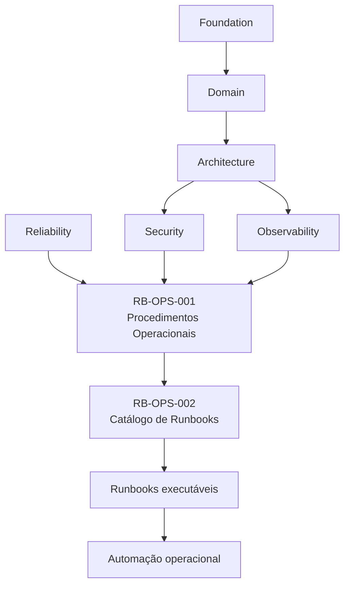
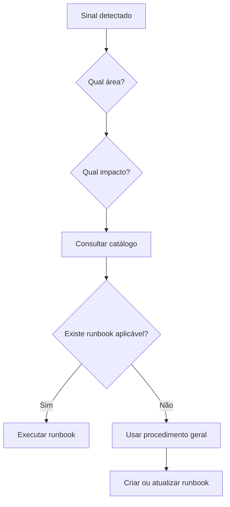

# RouteBook — Catálogo Detalhado de Runbooks

## Parte I — Fundamentos

### 1. Propósito deste documento

Este documento define o catálogo oficial de runbooks operacionais do RouteBook.

Seu objetivo é transformar os procedimentos gerais definidos em `RB-OPS-001` em um inventário operacional estruturado, rastreável e preparado para implementação progressiva.

O catálogo deverá permitir identificar:

- quais runbooks existem;
- qual condição cada runbook trata;
- qual módulo é responsável;
- qual severidade potencial está associada;
- quais sinais acionam o procedimento;
- quais acessos são necessários;
- quais dependências estão envolvidas;
- quais ações podem ser automatizadas;
- quais ações exigem aprovação humana;
- como validar a recuperação;
- quando escalar;
- quando revisar;
- quando testar;
- quando depreciar.

Este documento deverá orientar:

- Platform;
- Site Reliability Engineering;
- Backend;
- Frontend;
- Data;
- Security;
- Artificial Intelligence;
- Quality Engineering;
- Product;
- Support;
- agentes operacionais;
- agentes de diagnóstico;
- agentes de engenharia.

Este documento não substitui:

- os runbooks executáveis individuais;
- procedimentos de segurança específicos;
- políticas jurídicas;
- scripts operacionais;
- infraestrutura como código;
- documentação de fornecedores;
- planos de disaster recovery;
- postmortems;
- registros de incidentes.

---

### 2. Autoridade documental

O catálogo deverá respeitar:

- RouteBook Bible;
- Modelo de Domínio;
- Linguagem Ubíqua;
- Regras e Invariantes;
- Arquitetura;
- Segurança;
- Observabilidade;
- Qualidade;
- Confiabilidade;
- Governança de IA;
- Procedimentos Operacionais.



Nenhum runbook poderá:

- redefinir regra de domínio;
- contornar autorização;
- remover auditoria;
- transformar projeção em fonte canônica;
- alterar ownership;
- executar ação destrutiva sem proteção;
- reprocessar dados sem idempotência;
- acessar dados de outra Account.

---

### 3. Princípio central

Todo incidente recorrente, previsível ou de alto impacto deverá possuir um runbook identificável, testado e mantido.

```text
Condição operacional
→ runbook
→ diagnóstico
→ mitigação
→ recuperação
→ validação
→ aprendizado
```

---

### 4. Escopo do catálogo

O catálogo abrange runbooks relacionados a:

- APIs;
- frontend;
- banco de dados;
- migrations;
- mensageria;
- Outbox;
- Inbox;
- dead-letter queue;
- jobs;
- projeções;
- integrações;
- mobilidade;
- inteligência artificial;
- segurança;
- backups;
- disaster recovery;
- deployments;
- configurações;
- observabilidade;
- custos;
- capacidade;
- dados;
- privacidade.

---

## Parte II — Modelo de registro

### 5. Identificador de runbook

Todo runbook deverá possuir identificador estável.

Padrão:

```text
RB-RUN-<ÁREA>-<NÚMERO>
```

Exemplos:

```text
RB-RUN-API-001
RB-RUN-DB-001
RB-RUN-MSG-001
RB-RUN-AI-001
RB-RUN-SEC-001
```

---

### 6. Áreas padronizadas

| Código | Área |
|---|---|
| API | APIs e backend |
| WEB | frontend e experiência web |
| DB | banco de dados |
| MSG | mensageria |
| JOB | jobs e processamento em lote |
| PROJ | projeções e read models |
| INT | integrações |
| MOB | mobilidade |
| AI | inteligência artificial |
| SEC | segurança |
| PRIV | privacidade |
| BKP | backups e restauração |
| DR | disaster recovery |
| DEP | deployment |
| CFG | configuração |
| OBS | observabilidade |
| COST | custos |
| CAP | capacidade |
| DATA | dados |

---

### 7. Estrutura obrigatória

Cada registro deverá possuir:

```yaml
runbook:
  runbook_id: RB-RUN-AREA-000
  title:
  owner:
  supporting_owners: []
  status: draft
  version: "0.1.0"
  severity_potential:
  category:
  trigger_conditions: []
  affected_capabilities: []
  affected_modules: []
  dependencies: []
  required_access: []
  automation_level:
  approval_requirements: []
  validation_requirements: []
  related_dashboards: []
  related_alerts: []
  related_runbooks: []
  last_tested_at:
  review_frequency:
  document_path:
```

---

### 8. Status permitidos

```text
draft
reviewing
approved
active
restricted
deprecated
retired
```

---

### 9. Níveis de automação

#### Manual

Todas as ações são executadas por operador.

#### Assisted

Ferramentas coletam diagnóstico ou preparam comandos.

#### Semi-automated

Automação executa ações limitadas após aprovação.

#### Automated

Automação executa ações de baixo risco com guardrails.

---

### 10. Criticidade

Cada runbook deverá declarar sua severidade potencial:

- SEV-1;
- SEV-2;
- SEV-3;
- SEV-4.

A severidade real do incidente deverá ser determinada durante a triagem.

---

## Parte III — Estrutura do catálogo

### 11. Visão geral


---

### 12. Categorias principais

```text
Disponibilidade
Desempenho
Integridade
Segurança
Privacidade
Mensageria
Dados
Integrações
Inteligência Artificial
Deployments
Continuidade
Custos
Capacidade
```

---

## Parte IV — Runbooks de APIs e backend

### 13. RB-RUN-API-001 — API indisponível

```yaml
runbook:
  runbook_id: RB-RUN-API-001
  title: API indisponível
  owner: Platform
  supporting_owners:
    - Backend
  status: draft
  version: "0.1.0"
  severity_potential: SEV-1
  category: availability
  trigger_conditions:
    - health checks falhando
    - taxa elevada de erros 5xx
    - ausência de resposta
    - instâncias sem readiness
  affected_modules:
    - Platform
    - módulos expostos pela API
  automation_level: semi-automated
  review_frequency: quarterly
  document_path: ./runbooks/api/api-unavailable.md
```

#### Diagnóstico mínimo

- confirmar ambiente;
- verificar deployment recente;
- verificar liveness;
- verificar readiness;
- verificar banco;
- verificar dependências;
- verificar saturação;
- verificar configuração;
- verificar secrets.

#### Mitigações possíveis

- rollback;
- retirada de instância;
- aumento de capacidade;
- desativação de feature;
- ativação de modo degradado;
- bloqueio de rota problemática.

#### Validação

- health checks aprovados;
- taxa de erro normalizada;
- latência dentro do SLO;
- smoke crítico aprovado;
- backlog controlado.

---

### 14. RB-RUN-API-002 — Latência elevada

```yaml
runbook:
  runbook_id: RB-RUN-API-002
  title: Latência elevada em APIs
  owner: Platform
  supporting_owners:
    - Backend
    - Data
  status: draft
  version: "0.1.0"
  severity_potential: SEV-2
  category: performance
  trigger_conditions:
    - p95 acima do SLO
    - p99 acima do limite crítico
    - aumento de timeouts
    - traces lentos
  automation_level: assisted
  review_frequency: quarterly
  document_path: ./runbooks/api/api-high-latency.md
```

#### Investigar

- endpoint;
- query;
- pool;
- cache;
- Provider;
- fila;
- retries;
- payload;
- concorrência.

---

### 15. RB-RUN-API-003 — Taxa elevada de erros

Trata aumento de erros:

- 4xx inesperados;
- 5xx;
- validação;
- autorização;
- dependência;
- timeout.

Deverá distinguir erro de cliente, erro de contrato e erro interno.

---

### 16. RB-RUN-API-004 — Rate limit ou quota excedida

Trata:

- limite interno;
- limite de Provider;
- abuso;
- tráfego inesperado;
- configuração incorreta.

Mitigações:

- throttling;
- cache;
- fila;
- redução de frequência;
- quota emergencial;
- fallback.

---

### 17. RB-RUN-API-005 — Falha de autorização em massa

Acionar quando:

- usuários legítimos recebem acesso negado;
- mudança de policy bloqueia rotas;
- claims inválidas aumentam;
- token parsing falha.

Não deve ser confundido com acesso indevido.

---

## Parte V — Runbooks de frontend

### 18. RB-RUN-WEB-001 — Aplicação web indisponível

Sinais:

- assets não carregam;
- CDN indisponível;
- erro de bootstrap;
- rota principal em branco;
- deployment inválido.

Mitigações:

- rollback de frontend;
- invalidação de cache;
- restauração de bundle;
- desativação de feature;
- página de status.

---

### 19. RB-RUN-WEB-002 — Erro de JavaScript em massa

Sinais:

- crescimento de exceções;
- jornada bloqueada;
- navegador específico;
- versão específica.

Validação:

- erro reduzido;
- jornada aprovada;
- navegadores críticos testados.

---

### 20. RB-RUN-WEB-003 — Frontend incompatível com API

Trata:

- schema incompatível;
- campo removido;
- enum desconhecido;
- versionamento incorreto;
- rollout fora de ordem.

Mitigação preferencial:

- compatibilidade retroativa;
- rollback coordenado;
- adapter temporário.

---

### 21. RB-RUN-WEB-004 — Regressão de acessibilidade crítica

Aplicável quando:

- navegação por teclado fica bloqueada;
- foco se perde;
- leitor de tela não acessa função principal;
- contraste crítico é comprometido.

---

## Parte VI — Runbooks de banco de dados

### 22. RB-RUN-DB-001 — Banco de dados indisponível

```yaml
runbook:
  runbook_id: RB-RUN-DB-001
  title: Banco de dados indisponível
  owner: Platform
  supporting_owners:
    - Data
    - Backend
  status: draft
  version: "0.1.0"
  severity_potential: SEV-1
  category: availability
  trigger_conditions:
    - conexões falhando
    - health check do banco indisponível
    - cluster indisponível
    - storage indisponível
  automation_level: semi-automated
  approval_requirements:
    - Incident Commander para failover
  review_frequency: quarterly
  document_path: ./runbooks/database/database-unavailable.md
```

---

### 23. RB-RUN-DB-002 — Banco saturado

Sinais:

- CPU elevada;
- conexões esgotadas;
- locks;
- queries lentas;
- disk pressure;
- replica lag.

Ações perigosas deverão exigir aprovação:

- terminar transação desconhecida;
- remover constraint;
- alterar schema;
- aumentar pool sem análise.

---

### 24. RB-RUN-DB-003 — Deadlocks elevados

Diagnóstico:

- transações;
- ordem de locks;
- queries;
- versão;
- job concorrente;
- padrão de retry.

Mitigação:

- reduzir concorrência;
- corrigir ordenação;
- pausar job;
- aplicar retry limitado.

---

### 25. RB-RUN-DB-004 — Replica lag elevado

Trata:

- leituras stale;
- replicação parada;
- carga excessiva;
- rede;
- storage.

Deverá declarar quais capacidades toleram leitura stale.

---

### 26. RB-RUN-DB-005 — Storage próximo da capacidade

Ações:

- identificar crescimento;
- revisar logs e temporários;
- aumentar armazenamento;
- arquivar dados conforme política;
- impedir operações de alto volume.

Não excluir dados manualmente sem aprovação.

---

### 27. RB-RUN-DB-006 — Corrupção ou inconsistência de dados

Severidade potencial:

```text
SEV-1
```

Ações imediatas:

- interromper escritas afetadas;
- preservar snapshot;
- determinar escopo;
- congelar jobs;
- impedir replay;
- acionar Data Lead.

---

### 28. RB-RUN-DB-007 — Query degradada após mudança

Trata:

- índice ausente;
- plano alterado;
- volume inesperado;
- ORM;
- migration;
- filtro ausente.

---

## Parte VII — Runbooks de migrations

### 29. RB-RUN-DB-008 — Migration falhou

Diagnóstico:

- aplicada;
- não aplicada;
- parcialmente aplicada;
- lock ativo;
- versão do schema;
- compatibilidade da aplicação.

---

### 30. RB-RUN-DB-009 — Migration bloqueando produção

Ações:

- interromper rollout;
- identificar lock;
- manter versão compatível;
- avaliar forward fix;
- avaliar rollback seguro.

---

### 31. RB-RUN-DB-010 — Backfill falhando

Trata:

- checkpoint;
- lote;
- volume;
- dados inválidos;
- idempotência;
- saturação;
- retry.

---

### 32. RB-RUN-DB-011 — Incompatibilidade entre aplicação e schema

Deverá possuir procedimentos para:

- expand and contract;
- dual read;
- dual write quando aprovado;
- adapter;
- rollback coordenado.

---

## Parte VIII — Runbooks de mensageria

### 33. RB-RUN-MSG-001 — Outbox acumulada

```yaml
runbook:
  runbook_id: RB-RUN-MSG-001
  title: Backlog elevado na Outbox
  owner: Platform
  supporting_owners:
    - Backend
  status: draft
  version: "0.1.0"
  severity_potential: SEV-2
  category: messaging
  trigger_conditions:
    - quantidade de mensagens pendentes crescente
    - oldest pending acima do limite
    - falha de publicação
  automation_level: semi-automated
  review_frequency: quarterly
  document_path: ./runbooks/messaging/outbox-backlog.md
```

---

### 34. RB-RUN-MSG-002 — Publisher da Outbox parado

Verificar:

- processo;
- lock;
- credencial;
- broker;
- erro de schema;
- mensagem problemática.

---

### 35. RB-RUN-MSG-003 — Consumer parado

Sinais:

- heartbeat ausente;
- lag crescente;
- nenhuma mensagem processada;
- erro repetido.

---

### 36. RB-RUN-MSG-004 — Consumer lag elevado

Trata:

- capacidade insuficiente;
- mensagem lenta;
- downstream lento;
- partição;
- concorrência;
- retry.

---

### 37. RB-RUN-MSG-005 — Dead-letter queue crescendo

Procedimento mínimo:

1. interromper replay automático;
2. agrupar por errorCode;
3. identificar versão;
4. localizar poison messages;
5. corrigir causa;
6. testar lote pequeno;
7. executar replay controlado.

---

### 38. RB-RUN-MSG-006 — Mensagem incompatível

Trata:

- schema novo;
- consumer antigo;
- campo obrigatório;
- enum;
- serialização;
- versionamento.

---

### 39. RB-RUN-MSG-007 — Mensagens duplicadas produzindo efeito

Severidade dependerá do efeito.

Investigar:

- Inbox;
- idempotencyKey;
- eventId;
- retry;
- consumer;
- transação.

---

### 40. RB-RUN-MSG-008 — Broker indisponível

Mitigações:

- circuit breaker;
- Outbox local;
- redução de produção;
- fila alternativa quando aprovada;
- modo degradado.

---

## Parte IX — Procedimentos de replay

### 41. RB-RUN-MSG-009 — Replay controlado de mensagens

Pré-condições:

- causa corrigida;
- escopo definido;
- idempotência confirmada;
- autorização;
- métricas;
- mecanismo de interrupção.

---

### 42. Filtros obrigatórios

Replay deverá ser limitado por:

- eventId;
- aggregateId;
- eventType;
- intervalo;
- status;
- consumer.

---

### 43. Critérios de interrupção

Interromper se:

- erros aumentarem;
- duplicidade surgir;
- banco saturar;
- latência degradar;
- regra falhar;
- backlog crescer inesperadamente.

---

## Parte X — Runbooks de jobs

### 44. RB-RUN-JOB-001 — Job crítico falhando

Sinais:

- execução falha;
- retries esgotados;
- checkpoint parado;
- lock preso;
- timeout.

---

### 45. RB-RUN-JOB-002 — Job atrasado

Classificar:

- atraso sem impacto;
- atraso ameaçando SLO;
- atraso ameaçando dados;
- atraso ameaçando operação.

---

### 46. RB-RUN-JOB-003 — Job executado em duplicidade

Investigar:

- scheduler;
- lock;
- idempotência;
- retry;
- concorrência;
- relógio.

---

### 47. RB-RUN-JOB-004 — Lock de job não liberado

Ações:

- confirmar execução real;
- verificar timeout;
- verificar owner;
- liberar somente após evidência;
- registrar auditoria.

---

### 48. RB-RUN-JOB-005 — Job com custo ou duração anormal

Trata:

- aumento de volume;
- query degradada;
- Provider;
- loop;
- batch size;
- retry.

---

## Parte XI — Runbooks de projeções

### 49. RB-RUN-PROJ-001 — Projection lag elevado

Sinais:

- read model stale;
- consumer lag;
- interface desatualizada;
- eventos pendentes.

---

### 50. RB-RUN-PROJ-002 — Projector parado

Verificar:

- consumer;
- erro de schema;
- storage;
- mensagem problemática;
- versão;
- credenciais.

---

### 51. RB-RUN-PROJ-003 — Projeção inconsistente

Ações:

- comparar fonte canônica;
- identificar intervalo;
- interromper atualização;
- corrigir projector;
- executar rebuild.

---

### 52. RB-RUN-PROJ-004 — Rebuild de projeção

Deverá possuir:

- checkpoint;
- versão;
- idempotência;
- shadow table;
- validação;
- swap controlado;
- rollback.

---

## Parte XII — Runbooks de integrações

### 53. RB-RUN-INT-001 — Provider externo indisponível

```yaml
runbook:
  runbook_id: RB-RUN-INT-001
  title: Provider externo indisponível
  owner: Platform
  supporting_owners:
    - Integrations
  status: draft
  version: "0.1.0"
  severity_potential: SEV-2
  category: integration
  trigger_conditions:
    - timeout
    - erro 5xx
    - status externo de indisponibilidade
    - circuit breaker aberto
  automation_level: semi-automated
  review_frequency: semiannual
  document_path: ./runbooks/integrations/provider-unavailable.md
```

---

### 54. RB-RUN-INT-002 — Rate limit externo

Mitigações:

- cache;
- backoff;
- redução de chamadas;
- batching;
- fallback;
- aumento temporário de quota.

---

### 55. RB-RUN-INT-003 — Contrato externo incompatível

Trata:

- campo removido;
- tipo alterado;
- autenticação nova;
- endpoint removido;
- enum desconhecido.

---

### 56. RB-RUN-INT-004 — Credencial externa inválida

Ações:

- confirmar secret;
- verificar expiração;
- rotacionar;
- validar consumidores;
- revogar credencial anterior.

---

### 57. RB-RUN-INT-005 — Dados externos stale

Deverá definir:

- limite de Freshness;
- capacidade afetada;
- comunicação;
- cache;
- atualização;
- indisponibilidade explícita.

---

### 58. RB-RUN-INT-006 — Resposta externa inconsistente

Trata:

- dados incompletos;
- tipo inesperado;
- divergência;
- duplicidade;
- localização inválida.

---

## Parte XIII — Runbooks de mobilidade

### 59. RB-RUN-MOB-001 — Provider de mobilidade indisponível

Fallbacks possíveis:

- estimativa em cache;
- distância aproximada;
- ausência explícita;
- cálculo simplificado;
- edição manual.

---

### 60. RB-RUN-MOB-002 — Estimativas inconsistentes

Verificar:

- origem;
- destino;
- modo;
- timezone;
- trânsito;
- Provider;
- cache;
- unidade.

---

### 61. RB-RUN-MOB-003 — Custos de deslocamento ausentes

A capacidade não deverá inventar custo.

Deverá:

- declarar indisponibilidade;
- apresentar faixa somente quando sustentada;
- preservar Provenance.

---

## Parte XIV — Runbooks de inteligência artificial

### 62. RB-RUN-AI-001 — AI Provider indisponível

```yaml
runbook:
  runbook_id: RB-RUN-AI-001
  title: AI Provider indisponível
  owner: Artificial Intelligence
  supporting_owners:
    - Platform
  status: draft
  version: "0.1.0"
  severity_potential: SEV-2
  category: artificial-intelligence
  trigger_conditions:
    - timeout
    - erro do Provider
    - rate limit
    - modelo indisponível
    - autenticação falhando
  automation_level: semi-automated
  review_frequency: quarterly
  document_path: ./runbooks/ai/ai-provider-unavailable.md
```

---

### 63. RB-RUN-AI-002 — Schema rejection elevada

Investigar:

- modelo;
- promptVersion;
- schemaVersion;
- Provider;
- reparo;
- truncamento;
- rollout recente.

---

### 64. RB-RUN-AI-003 — Domain rejection elevada

Sinais:

- aumento de Restrictions violadas;
- referências inválidas;
- versão stale;
- Proposed Activities incompatíveis.

Mitigação:

- suspender Capability;
- reverter prompt;
- reverter modelo;
- reforçar Context Builder;
- ativar fallback.

---

### 65. RB-RUN-AI-004 — Referências inventadas

Tolerância:

```text
zero para identificadores canônicos
```

Ações:

- suspender versão;
- preservar evidência;
- verificar schema;
- verificar Prompt;
- revisar Contexto;
- executar regressão.

---

### 66. RB-RUN-AI-005 — Agent loop

Sinais:

- Tool Calls repetidas;
- maxSteps atingido;
- custo crescente;
- ausência de progresso.

Ações:

- interromper execução;
- suspender Agent quando necessário;
- revisar orchestration strategy;
- atualizar Evaluation Suite.

---

### 67. RB-RUN-AI-006 — Custo anormal de IA

Investigar:

- capabilityId;
- agentId;
- modelId;
- promptVersion;
- token usage;
- retries;
- Tool Calls;
- tráfego;
- abuso.

---

### 68. RB-RUN-AI-007 — Prompt injection detectada

Ações:

- bloquear execução;
- preservar input sanitizado;
- identificar origem;
- verificar Tool Calls;
- verificar exposição;
- adicionar caso adversarial;
- revisar controles.

---

### 69. RB-RUN-AI-008 — Memory poisoning

Ações:

- congelar memória;
- identificar entradas;
- remover dados contaminados;
- reconstruir índices;
- reavaliar execuções afetadas;
- revisar política de escrita.

---

### 70. RB-RUN-AI-009 — Tool Call não autorizada

Severidade potencial:

```text
SEV-1 ou SEV-2
```

Dependerá de:

- tentativa ou execução;
- Tool;
- efeito;
- escopo;
- dados.

---

### 71. RB-RUN-AI-010 — Kill switch falhou

Severidade potencial:

```text
SEV-1
```

Ações:

- bloquear no AI Gateway;
- bloquear Provider;
- desativar rota;
- revogar credenciais;
- interromper workers;
- preservar evidência.

---

### 72. RB-RUN-AI-011 — Drift de qualidade

Sinais:

- queda de acceptance;
- aumento de edit rate;
- aumento de fallback;
- regressão de relevância;
- aumento de incidentes.

---

### 73. RB-RUN-AI-012 — Context contamination

Trata:

- dados de outra Trip;
- dados de outra Account;
- memória indevida;
- truncamento inseguro;
- dados sensíveis.

---

## Parte XV — Runbooks de segurança

### 74. RB-RUN-SEC-001 — Secret exposto

```yaml
runbook:
  runbook_id: RB-RUN-SEC-001
  title: Secret exposto
  owner: Security
  supporting_owners:
    - Platform
  status: draft
  version: "0.1.0"
  severity_potential: SEV-1
  category: security
  trigger_conditions:
    - secret em log
    - secret em repositório
    - scanner detectou credencial
    - uso não reconhecido
  automation_level: semi-automated
  approval_requirements:
    - Security Lead
  review_frequency: quarterly
  document_path: ./runbooks/security/secret-exposure.md
```

---

### 75. RB-RUN-SEC-002 — Acesso cross-account

Ações imediatas:

- bloquear capacidade;
- preservar logs;
- identificar versão;
- revogar sessões quando necessário;
- determinar escopo;
- acionar Security Lead.

---

### 76. RB-RUN-SEC-003 — Sessão comprometida

Trata:

- token roubado;
- atividade anormal;
- localização incompatível;
- dispositivo desconhecido;
- replay.

---

### 77. RB-RUN-SEC-004 — Tentativa de escalada de privilégio

Investigar:

- role;
- claims;
- policy;
- endpoint;
- Tool;
- configuração;
- Account.

---

### 78. RB-RUN-SEC-005 — Dependência vulnerável crítica

Ações:

- identificar exposição;
- bloquear versão;
- atualizar;
- aplicar mitigação;
- executar regressão;
- gerar SBOM atualizado.

---

### 79. RB-RUN-SEC-006 — Abuso ou tráfego malicioso

Mitigações:

- rate limit;
- bloqueio;
- WAF;
- captcha quando aplicável;
- isolamento;
- investigação.

---

### 80. RB-RUN-SEC-007 — Audit trail ausente

Trata perda ou indisponibilidade de registros necessários para:

- segurança;
- compliance;
- investigação;
- operação.

---

## Parte XVI — Runbooks de privacidade

### 81. RB-RUN-PRIV-001 — Exposição de dados pessoais

Severidade deverá considerar:

- tipo de dado;
- quantidade;
- duração;
- Account;
- menores;
- dados sensíveis.

---

### 82. RB-RUN-PRIV-002 — Retenção excedida

Ações:

- identificar datasets;
- interromper nova retenção;
- excluir ou anonimizar;
- validar política;
- registrar evidência.

---

### 83. RB-RUN-PRIV-003 — Exclusão incompleta de Account ou Trip

Verificar:

- banco;
- backups;
- cache;
- índices;
- memória;
- Context Snapshots;
- logs;
- datasets;
- Providers.

---

### 84. RB-RUN-PRIV-004 — Dados sensíveis em logs

Ações:

- restringir acesso;
- interromper logging;
- rotacionar armazenamento quando necessário;
- corrigir redaction;
- avaliar impacto.

---

## Parte XVII — Runbooks de backup

### 85. RB-RUN-BKP-001 — Backup falhou

```yaml
runbook:
  runbook_id: RB-RUN-BKP-001
  title: Backup falhou
  owner: Platform
  supporting_owners:
    - Data
  status: draft
  version: "0.1.0"
  severity_potential: SEV-2
  category: backup
  trigger_conditions:
    - job de backup falhou
    - backup incompleto
    - armazenamento indisponível
    - criptografia falhou
  automation_level: semi-automated
  review_frequency: quarterly
  document_path: ./runbooks/backups/backup-failure.md
```

---

### 86. RB-RUN-BKP-002 — Backup inválido ou corrompido

Verificar:

- checksum;
- tamanho;
- leitura;
- restauração isolada;
- criptografia;
- retenção.

---

### 87. RB-RUN-BKP-003 — Retenção de backup incorreta

Trata:

- backup removido cedo;
- backup mantido além da política;
- classificação incorreta;
- destino incompatível.

---

### 88. RB-RUN-BKP-004 — Restauração de backup

Pré-condições:

- aprovação;
- backup validado;
- ambiente isolado;
- RPO;
- RTO;
- plano de corte;
- rollback.

---

## Parte XVIII — Runbooks de disaster recovery

### 89. RB-RUN-DR-001 — Região indisponível

Aplicável quando a arquitetura multi-região existir.

Deverá definir:

- autoridade de failover;
- prioridade;
- dependências;
- dados;
- DNS;
- filas;
- Providers;
- validação.

---

### 90. RB-RUN-DR-002 — Perda completa do banco principal

Ações:

- declarar incidente;
- interromper escritas;
- validar réplica;
- validar backup;
- escolher recuperação;
- comunicar RPO;
- restaurar;
- validar domínio.

---

### 91. RB-RUN-DR-003 — Recuperação completa do ambiente

Cobrir:

- infraestrutura;
- configuração;
- secrets;
- banco;
- filas;
- storage;
- observabilidade;
- Providers;
- smoke.

---

### 92. RB-RUN-DR-004 — Failback

Não deverá ocorrer automaticamente após o failover.

Deverá exigir:

- estabilidade;
- sincronização;
- janela;
- validação;
- rollback;
- comunicação.

---

## Parte XIX — Runbooks de deployment

### 93. RB-RUN-DEP-001 — Regressão após deployment

```yaml
runbook:
  runbook_id: RB-RUN-DEP-001
  title: Regressão após deployment
  owner: Platform
  supporting_owners:
    - módulo proprietário
  status: draft
  version: "0.1.0"
  severity_potential: SEV-2
  category: deployment
  trigger_conditions:
    - aumento de erros após release
    - degradação de SLO
    - falha de startup
    - comportamento incompatível
  automation_level: semi-automated
  review_frequency: quarterly
  document_path: ./runbooks/deployments/deployment-regression.md
```

---

### 94. RB-RUN-DEP-002 — Rollback de aplicação

Etapas:

1. interromper rollout;
2. validar versão alvo;
3. verificar schema;
4. executar rollback;
5. validar health;
6. executar smoke;
7. monitorar.

---

### 95. RB-RUN-DEP-003 — Deployment parcial ou preso

Trata:

- instâncias em versões diferentes;
- rollout sem progresso;
- readiness falhando;
- migration pendente;
- feature flag divergente.

---

### 96. RB-RUN-DEP-004 — Configuração inválida após release

Ações:

- identificar diferença;
- restaurar configuração anterior;
- validar secrets;
- executar smoke;
- atualizar validação de CI.

---

### 97. RB-RUN-DEP-005 — Feature flag causando incidente

Mitigação preferencial:

- desativar flag;
- verificar escopo;
- validar cache;
- registrar auditoria;
- acompanhar efeito.

---

## Parte XX — Runbooks de configuração e secrets

### 98. RB-RUN-CFG-001 — Configuração divergente entre ambientes

Investigar:

- origem;
- versão;
- segredo;
- variável;
- default;
- rollout;
- drift.

---

### 99. RB-RUN-CFG-002 — Rotação de credencial

Procedimento:

1. gerar nova credencial;
2. distribuir com segurança;
3. validar consumidores;
4. revogar anterior;
5. verificar uso residual;
6. registrar auditoria.

---

### 100. RB-RUN-CFG-003 — Secret expirado

Trata:

- banco;
- Provider;
- fila;
- storage;
- identidade;
- IA.

---

### 101. RB-RUN-CFG-004 — Feature flag inconsistente

Verificar:

- cache;
- segmentação;
- Account;
- ambiente;
- rollout;
- versão.

---

## Parte XXI — Runbooks de observabilidade

### 102. RB-RUN-OBS-001 — Métricas ausentes

Trata:

- collector;
- exporter;
- permissões;
- endpoint;
- configuração;
- cardinalidade;
- storage.

---

### 103. RB-RUN-OBS-002 — Logs ausentes

Verificar:

- agente;
- pipeline;
- storage;
- quota;
- formato;
- filtro;
- redaction.

---

### 104. RB-RUN-OBS-003 — Tracing interrompido

Trata:

- propagação;
- collector;
- sampling;
- SDK;
- header;
- volume.

---

### 105. RB-RUN-OBS-004 — Alerta não acionou

Severidade dependerá do incidente não detectado.

Ações:

- revisar regra;
- revisar dados;
- revisar janela;
- revisar threshold;
- executar teste;
- atualizar runbook.

---

### 106. RB-RUN-OBS-005 — Alerta ruidoso

Objetivo:

- reduzir falso positivo;
- manter sensibilidade;
- melhorar agrupamento;
- evitar alert fatigue.

---

### 107. RB-RUN-OBS-006 — Cardinalidade excessiva

Mitigações:

- remover labels;
- agregar;
- aplicar hash;
- limitar dimensões;
- revisar instrumentação.

---

## Parte XXII — Runbooks de custos

### 108. RB-RUN-COST-001 — Custo de infraestrutura anormal

Investigar:

- compute;
- storage;
- egress;
- banco;
- observabilidade;
- filas;
- Provider.

---

### 109. RB-RUN-COST-002 — Custo de IA anormal

Relacionado a `RB-RUN-AI-006`.

Deverá distinguir:

- aumento de uso legítimo;
- modelo inadequado;
- contexto excessivo;
- loop;
- abuso;
- retries.

---

### 110. RB-RUN-COST-003 — Custo de observabilidade anormal

Investigar:

- logs integrais;
- cardinalidade;
- retenção;
- tracing excessivo;
- payloads.

---

### 111. RB-RUN-COST-004 — Egress anormal

Pode indicar:

- integração em loop;
- exfiltração;
- configuração;
- sincronização indevida;
- backup.

---

## Parte XXIII — Runbooks de capacidade

### 112. RB-RUN-CAP-001 — Saturação de workers

Mitigações:

- aumentar capacidade;
- reduzir concorrência;
- priorizar workloads;
- pausar jobs;
- aplicar backpressure.

---

### 113. RB-RUN-CAP-002 — Fila operacional crescendo

Distinguir:

- aumento esperado;
- consumer degradado;
- downstream indisponível;
- poison message;
- capacidade insuficiente.

---

### 114. RB-RUN-CAP-003 — Pool de conexões esgotado

Investigar:

- leak;
- transação longa;
- pool size;
- banco;
- concorrência;
- timeout.

---

### 115. RB-RUN-CAP-004 — Quota de Provider próxima do limite

Ações:

- reduzir consumo;
- ativar cache;
- alterar prioridade;
- solicitar quota;
- ativar fallback.

---

## Parte XXIV — Runbooks de dados

### 116. RB-RUN-DATA-001 — Provenance ausente

Dados sem Provenance não deverão sustentar capacidades críticas sem tratamento explícito.

---

### 117. RB-RUN-DATA-002 — Freshness fora do limite

Ações:

- identificar Fonte;
- interromper consumo crítico;
- atualizar;
- marcar stale;
- comunicar limitação.

---

### 118. RB-RUN-DATA-003 — Duplicidade de Place

Trata:

- external references;
- nomes semelhantes;
- geolocalização;
- merge;
- reconciliação;
- rollback.

---

### 119. RB-RUN-DATA-004 — False merge de Place

Severidade pode ser alta quando afeta:

- Recommendations;
- Itinerary;
- localização;
- dados de contato;
- histórico.

---

### 120. RB-RUN-DATA-005 — Pipeline de ingestão parado

Verificar:

- Provider;
- credenciais;
- fila;
- schema;
- job;
- storage;
- quota.

---

## Parte XXV — Seleção do runbook

### 121. Processo de seleção



---

### 122. Runbooks múltiplos

Um incidente poderá exigir múltiplos runbooks.

Exemplo:

```text
deployment regression
→ banco saturado
→ Outbox acumulada
→ consumer lag
```

O Incident Commander deverá coordenar a ordem.

---

### 123. Runbook principal

Deverá existir um runbook principal quando múltiplos procedimentos forem usados.

---

### 124. Dependências

Cada runbook deverá declarar:

- procedimentos anteriores;
- procedimentos posteriores;
- procedimentos incompatíveis;
- escalonamentos.

---

## Parte XXVI — Acessos e permissões

### 125. Menor privilégio

Cada runbook deverá listar somente acessos necessários.

---

### 126. Tipos de acesso

- leitura de dashboards;
- consulta de logs;
- consulta de traces;
- leitura de banco;
- execução operacional;
- alteração de configuração;
- rotação de secrets;
- replay;
- restore;
- deployment.

---

### 127. Acesso emergencial

Deverá ser:

- temporário;
- autenticado;
- auditado;
- revogado;
- revisado.

---

### 128. Dupla aprovação

Recomendada ou obrigatória para:

- restore em produção;
- replay amplo;
- delete;
- alteração de segurança;
- failover;
- mudança de dados canônicos;
- rotação crítica.

---

## Parte XXVII — Automação

### 129. Automação permitida

Pode incluir:

- coleta de diagnóstico;
- criação de incidente;
- captura de dashboard;
- escala de worker;
- restart controlado;
- bloqueio de deployment;
- aplicação de feature flag;
- execução de smoke;
- validação de health.

---

### 130. Automação supervisionada

Exige aprovação para:

- replay;
- rollback;
- failover;
- restore;
- rotação emergencial;
- desativação global;
- bloqueio de Account.

---

### 131. Guardrails

Toda automação deverá possuir:

- escopo;
- timeout;
- limite;
- dry-run;
- autorização;
- auditoria;
- interrupção;
- rollback;
- validação.

---

### 132. Agentes operacionais

Podem:

- correlacionar sinais;
- sugerir runbook;
- preparar resumo;
- gerar timeline;
- acompanhar métricas;
- preparar comandos.

Não podem autonomamente:

- excluir dados;
- executar restore;
- ignorar segurança;
- realizar replay amplo;
- alterar autorização;
- aplicar correção canônica.

---

## Parte XXVIII — Testes de runbooks

### 133. Formas de teste

- walkthrough;
- tabletop exercise;
- staging;
- simulação;
- game day;
- chaos test;
- restauração controlada;
- replay controlado.

---

### 134. Frequência por criticidade

| Criticidade | Frequência mínima |
|---|---|
| SEV-1 | trimestral |
| SEV-2 | semestral |
| SEV-3 | anual |
| SEV-4 | quando alterado |

---

### 135. Evidência do teste

```yaml
runbook_test:
  runbook_test_id: RB-RTEST-000
  runbook_id:
  runbook_version:
  environment:
  test_type:
  executed_at:
  executed_by: []
  result:
  duration_minutes:
  findings: []
  required_updates: []
  evidence_references: []
```

---

### 136. Critério de aprovação

Um runbook crítico somente deverá ser considerado confiável quando:

- acessos funcionarem;
- passos forem claros;
- comandos forem válidos;
- rollback existir;
- validação for objetiva;
- escalonamento funcionar;
- comunicação estiver definida.

---

## Parte XXIX — Revisão e manutenção

### 137. Gatilhos de revisão

- incidente;
- postmortem;
- mudança de arquitetura;
- mudança de Provider;
- mudança de ferramenta;
- mudança de acesso;
- teste falhou;
- owner mudou;
- SLO mudou;
- runbook não funcionou.

---

### 138. Versionamento

Utilizar:

```text
MAJOR.MINOR.PATCH
```

---

### 139. Mudança major

Exemplos:

- mudança completa de procedimento;
- nova arquitetura;
- alteração de responsabilidade;
- alteração incompatível de ferramenta.

---

### 140. Mudança minor

Exemplos:

- nova etapa;
- nova validação;
- nova automação;
- novo cenário.

---

### 141. Mudança patch

Exemplos:

- correção textual;
- link;
- comando;
- detalhe sem mudança de fluxo.

---

### 142. Depreciação

Um runbook poderá ser depreciado quando:

- sistema for removido;
- condição não existir;
- procedimento for substituído;
- arquitetura mudar.

---

## Parte XXX — Templates oficiais

### 143. Template de registro no catálogo

```yaml
runbook:
  runbook_id: RB-RUN-AREA-000
  title:
  owner:
  supporting_owners: []
  status: draft
  version: "0.1.0"
  severity_potential:
  category:
  trigger_conditions: []
  affected_capabilities: []
  affected_modules: []
  dependencies: []
  required_access: []
  automation_level: manual
  approval_requirements: []
  validation_requirements: []
  related_dashboards: []
  related_alerts: []
  related_runbooks: []
  last_tested_at:
  review_frequency:
  document_path:
```

---

### 144. Template de runbook executável

```yaml
runbook_document:
  identification:
    runbook_id:
    title:
    owner:
    version:
    status:
    severity_potential:

  objective:
  scope:
  preconditions: []
  required_access: []
  signals: []
  impact:
  dependencies: []

  diagnosis:
    steps: []

  mitigation:
    steps: []

  recovery:
    steps: []

  validation:
    checks: []

  rollback:
    steps: []

  escalation:
    conditions: []
    targets: []

  communication:
    audiences: []
    cadence:

  risks: []
  audit_requirements: []
  references: []
```

---

### 145. Template de comando operacional

```yaml
operational_command:
  command_id:
  purpose:
  environment:
  preconditions: []
  command:
  expected_result:
  risks: []
  rollback:
  validation:
  approval_required:
```

---

### 146. Template de automação

```yaml
operational_automation:
  automation_id:
  title:
  owner:
  runbook_id:
  automation_level:
  scope:
  required_permissions: []
  dry_run_supported:
  limits: {}
  timeout:
  rollback:
  audit_required:
  last_tested_at:
```

---

## Parte XXXI — Estrutura documental sugerida

### 147. Organização

```text
docs/
└── operations/
    ├── runbooks-and-operational-procedures.md
    ├── runbook-catalog.md
    ├── runbooks/
    │   ├── api/
    │   ├── web/
    │   ├── database/
    │   ├── messaging/
    │   ├── jobs/
    │   ├── projections/
    │   ├── integrations/
    │   ├── mobility/
    │   ├── ai/
    │   ├── security/
    │   ├── privacy/
    │   ├── backups/
    │   ├── disaster-recovery/
    │   ├── deployments/
    │   ├── configuration/
    │   ├── observability/
    │   ├── costs/
    │   ├── capacity/
    │   └── data/
    ├── templates/
    ├── exercises/
    └── postmortems/
```

---

### 148. Arquivos individuais

Quando implementado, cada runbook deverá existir em arquivo próprio.

O catálogo deverá permanecer como índice e fonte de metadados.

---

## Parte XXXII — Matriz de runbooks

### 149. Runbooks críticos

| ID | Título | Owner | Severidade |
|---|---|---|---|
| RB-RUN-API-001 | API indisponível | Platform | SEV-1 |
| RB-RUN-DB-001 | Banco indisponível | Platform | SEV-1 |
| RB-RUN-DB-006 | Corrupção de dados | Data | SEV-1 |
| RB-RUN-SEC-001 | Secret exposto | Security | SEV-1 |
| RB-RUN-SEC-002 | Acesso cross-account | Security | SEV-1 |
| RB-RUN-AI-010 | Kill switch falhou | AI e Platform | SEV-1 |
| RB-RUN-DR-002 | Perda do banco principal | Platform e Data | SEV-1 |

---

### 150. Runbooks de alta prioridade

| ID | Título |
|---|---|
| RB-RUN-MSG-001 | Outbox acumulada |
| RB-RUN-MSG-003 | Consumer parado |
| RB-RUN-MSG-005 | DLQ crescendo |
| RB-RUN-JOB-001 | Job crítico falhando |
| RB-RUN-INT-001 | Provider externo indisponível |
| RB-RUN-AI-001 | AI Provider indisponível |
| RB-RUN-AI-003 | Domain rejection elevada |
| RB-RUN-BKP-001 | Backup falhou |
| RB-RUN-DEP-001 | Regressão após deployment |

---

## Parte XXXIII — Rastreabilidade

### 151. Área e documentos de origem

| Área | Documento principal |
|---|---|
| domínio | RB-DOM-001 a RB-DOM-004 |
| arquitetura | RB-ARC-001 a RB-ARC-005 |
| segurança | RB-SEC-001 |
| observabilidade | RB-OBS-001 |
| qualidade | RB-QA-001 e RB-QA-002 |
| operação | RB-OPS-001 |
| confiabilidade | RB-SRE-001 |
| IA | RB-AI-001 a RB-AI-006 |

---

### 152. Condição e runbook

| Condição | Runbook |
|---|---|
| API sem resposta | RB-RUN-API-001 |
| p95 elevado | RB-RUN-API-002 |
| banco indisponível | RB-RUN-DB-001 |
| dados corrompidos | RB-RUN-DB-006 |
| Outbox crescendo | RB-RUN-MSG-001 |
| Consumer parado | RB-RUN-MSG-003 |
| DLQ crescendo | RB-RUN-MSG-005 |
| job falhando | RB-RUN-JOB-001 |
| projeção stale | RB-RUN-PROJ-001 |
| Provider externo indisponível | RB-RUN-INT-001 |
| AI Provider indisponível | RB-RUN-AI-001 |
| Tool não autorizada | RB-RUN-AI-009 |
| secret exposto | RB-RUN-SEC-001 |
| acesso cross-account | RB-RUN-SEC-002 |
| backup falhou | RB-RUN-BKP-001 |
| deployment regressivo | RB-RUN-DEP-001 |

---

## Parte XXXIV — Anti-patterns

### 153. Runbook sem owner

Não deverá ser permitido.

---

### 154. Runbook genérico demais

Instruções como “verificar logs” são insuficientes.

---

### 155. Comando sem finalidade

Todo comando deverá indicar:

- propósito;
- risco;
- resultado esperado;
- rollback;
- validação.

---

### 156. Ação destrutiva como primeiro passo

Não iniciar com:

- delete;
- restore;
- replay amplo;
- remoção de constraint;
- encerramento de transações desconhecidas.

---

### 157. Runbook não testado

Não deverá ser considerado confiável.

---

### 158. Acesso informal

Credenciais pessoais compartilhadas não deverão ser usadas como processo operacional.

---

### 159. Conhecimento apenas oral

Condições críticas deverão estar documentadas.

---

### 160. Automação sem interrupção

Toda automação deverá poder ser interrompida.

---

### 161. Runbook desatualizado

Procedimento incompatível com o sistema deverá ser tratado como defeito operacional.

---

### 162. Encerramento sem validação

Normalização de uma única métrica não comprova recuperação.

---

## Parte XXXV — Evolução

### 163. Fase inicial

- catálogo consolidado;
- runbooks críticos;
- execução manual;
- templates;
- testes trimestrais;
- links para dashboards;
- ownership.

---

### 164. Fase intermediária

- arquivos individuais;
- automação assistida;
- ChatOps;
- integração com alertas;
- validações automáticas;
- catálogo em portal interno;
- game days.

---

### 165. Fase avançada

Somente por evidência:

- auto-remediation limitada;
- seleção automática de runbook;
- diagnóstico assistido;
- execução orquestrada;
- runbooks como código;
- simulações contínuas.

---

### 166. Restrições de evolução

A automação não deverá reduzir:

- segurança;
- aprovação;
- rastreabilidade;
- reversibilidade;
- clareza;
- isolamento.

---

## Parte XXXVI — Governança

### 167. Owner

O owner deste documento é:

```text
Platform
```

A manutenção deverá envolver:

- Site Reliability Engineering;
- Backend;
- Frontend;
- Data;
- Security;
- Privacy;
- Artificial Intelligence;
- Quality Engineering;
- Product;
- Support.

---

### 168. Inclusão de novo runbook

Exige:

- condição identificada;
- owner;
- severidade potencial;
- sinais;
- diagnóstico;
- mitigação;
- recuperação;
- validação;
- escalonamento;
- teste.

---

### 169. Aprovação

Runbooks SEV-1 deverão possuir revisão por:

- owner principal;
- Platform ou SRE;
- Security ou Data quando aplicável;
- Quality Engineering.

---

### 170. Exceções

Exceções deverão possuir:

- justificativa;
- risco;
- owner;
- mitigação;
- aprovador;
- expiração;
- revisão.

---

## Parte XXXVII — Catálogo de diagramas

### 171. Diagramas desta versão

| ID conceitual | Diagrama |
|---|---|
| RB-DGM-OPS-CAT-001 | Autoridade documental |
| RB-DGM-OPS-CAT-002 | Fluxo do catálogo |
| RB-DGM-OPS-CAT-003 | Seleção de runbook |

---

### 172. Critério de inclusão

Os diagramas representam:

- autoridade;
- ciclo operacional;
- seleção de procedimentos.

O detalhamento dos runbooks é representado por registros YAML e seções operacionais.

---

## Parte XXXVIII — Critérios de aceite

### 173. Estrutura

- identificadores estão definidos;
- áreas estão definidas;
- status estão definidos;
- automação está definida;
- criticidade está definida;
- template está definido.

---

### 174. Cobertura

- APIs estão cobertas;
- frontend está coberto;
- banco está coberto;
- migrations estão cobertas;
- mensageria está coberta;
- jobs estão cobertos;
- projeções estão cobertas;
- integrações estão cobertas;
- mobilidade está coberta;
- IA está coberta;
- segurança está coberta;
- privacidade está coberta;
- backup está coberto;
- disaster recovery está coberto;
- deployments estão cobertos;
- configuração está coberta;
- observabilidade está coberta;
- custos estão cobertos;
- capacidade está coberta;
- dados estão cobertos.

---

### 175. Operação

- seleção está definida;
- dependências estão definidas;
- acessos estão definidos;
- aprovações estão definidas;
- automação está limitada;
- testes estão definidos;
- revisão está definida;
- depreciação está definida.

---

### 176. Governança

- owner está definido;
- processo de inclusão está definido;
- aprovação está definida;
- exceções estão definidas;
- templates estão definidos;
- rastreabilidade está presente;
- anti-patterns estão definidos;
- evolução está definida.

---

## Parte XXXIX — Checklist final

### 177. Checklist documental

Antes de aprovar:

- frontmatter YAML é válido;
- listas YAML utilizam hífen;
- existe apenas um H1;
- Partes utilizam H2;
- seções numeradas utilizam H3;
- propósito está definido;
- autoridade está definida;
- princípio central está definido;
- escopo está definido;
- identificadores estão definidos;
- áreas estão definidas;
- status estão definidos;
- automação está definida;
- runbooks de API estão definidos;
- runbooks de frontend estão definidos;
- runbooks de banco estão definidos;
- runbooks de migration estão definidos;
- runbooks de mensageria estão definidos;
- replay está definido;
- runbooks de jobs estão definidos;
- runbooks de projeção estão definidos;
- runbooks de integração estão definidos;
- runbooks de mobilidade estão definidos;
- runbooks de IA estão definidos;
- runbooks de segurança estão definidos;
- runbooks de privacidade estão definidos;
- runbooks de backup estão definidos;
- runbooks de disaster recovery estão definidos;
- runbooks de deployment estão definidos;
- runbooks de configuração estão definidos;
- runbooks de observabilidade estão definidos;
- runbooks de custo estão definidos;
- runbooks de capacidade estão definidos;
- runbooks de dados estão definidos;
- seleção está definida;
- acessos estão definidos;
- automação está governada;
- testes de runbooks estão definidos;
- revisão está definida;
- templates estão definidos;
- estrutura documental está definida;
- matrizes estão definidas;
- rastreabilidade está presente;
- anti-patterns estão definidos;
- evolução está definida;
- governança está definida;
- Mermaid renderiza no GitHub;
- os blocos não possuem atributos adicionais;
- não existem contradições com RB-CORE-0004;
- não existem contradições com RB-DOM-001;
- não existem contradições com RB-DOM-002;
- não existem contradições com RB-DOM-003;
- não existem contradições com RB-DOM-004;
- não existem contradições com RB-ARC-001;
- não existem contradições com RB-ARC-002;
- não existem contradições com RB-ARC-003;
- não existem contradições com RB-ARC-004;
- não existem contradições com RB-ARC-005;
- não existem contradições com RB-SEC-001;
- não existem contradições com RB-OBS-001;
- não existem contradições com RB-QA-001;
- não existem contradições com RB-QA-002;
- não existem contradições com RB-OPS-001;
- não existem contradições com RB-SRE-001;
- não existem contradições com RB-AI-001;
- não existem contradições com RB-AI-002;
- não existem contradições com RB-AI-003;
- não existem contradições com RB-AI-004;
- não existem contradições com RB-AI-005;
- não existem contradições com RB-AI-006.

---

## Parte XL — Declaração final

### 178. Declaração do catálogo

O catálogo de runbooks do RouteBook deverá funcionar como inventário operacional oficial das condições conhecidas que podem afetar disponibilidade, desempenho, segurança, integridade, privacidade, custos ou continuidade.

Todo runbook deverá:

- possuir identificador;
- possuir owner;
- possuir versão;
- possuir severidade potencial;
- possuir sinais;
- possuir diagnóstico;
- possuir mitigação;
- possuir recuperação;
- possuir validação;
- possuir escalonamento;
- possuir requisitos de acesso;
- possuir histórico de testes;
- possuir frequência de revisão.

Todo runbook crítico deverá:

- ser testado periodicamente;
- possuir rollback;
- possuir comunicação;
- possuir evidências;
- possuir aprovação adequada;
- limitar ações destrutivas;
- preservar segurança;
- preservar dados;
- preservar auditoria.

Nenhum procedimento poderá:

- substituir regras de domínio;
- contornar autorização;
- acessar outra Account;
- apagar evidências;
- reprocessar sem idempotência;
- restaurar sem validação;
- executar ação crítica sem aprovação;
- ocultar impacto;
- ampliar autonomia de agentes;
- utilizar secrets de forma insegura;
- operar sem owner.

O catálogo deverá evoluir a partir de:

- incidentes;
- postmortems;
- testes;
- mudanças arquiteturais;
- mudanças de Providers;
- mudanças de ferramentas;
- novas capacidades;
- novos riscos.

O RouteBook deverá reduzir a dependência de improvisação operacional por meio de procedimentos claros, versionados, testados, auditáveis e progressivamente automatizados.